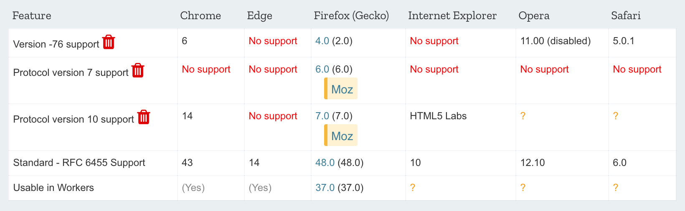
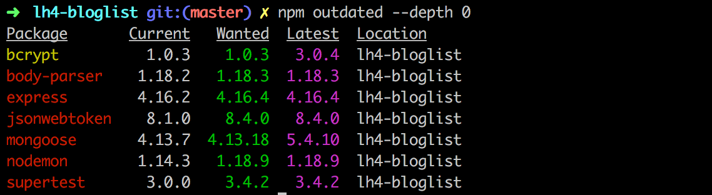
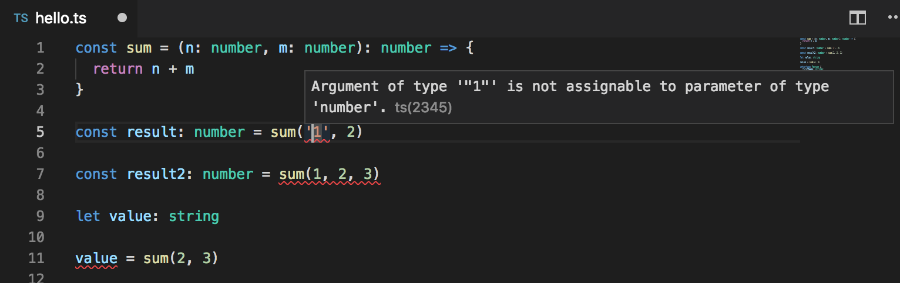

<div class="content">


The course is beginning to wrap up. Nevertheless, let's take a look at some noteworthy things relating to the organization and security of React-/Node-applications.


### Organization of code in React application


In most applications we followed the principle, by which components were placed in the directory <i>components</i>, reducers were placed in the the directory <i>reducers</i>, and the code responsible for communicating with the server was placed in the directory <i>services</i>. This way of organizing fits a smaller application just fine, but as the amount of components increase, better solutions are needed. There is no one correct way to organize a project. The article [The 100% correct way to structure a React app (or why there’s no such thing)](https://hackernoon.com/the-100-correct-way-to-structure-a-react-app-or-why-theres-no-such-thing-3ede534ef1ed) provides some perspective on the issue.


### Frontend and backend in the same repository


During the course we have created the frontend and backend into separate repositories. This is a very typical approach. However, we did the deployment by [copying](/en/part3/deploying_app_to_internet#serving-static-files-from-the-backend) the bundled frontend code into the backend repository. A possibly better approach would have been to deploy the frontend code separately. Especially with applications created using create-react-app it is very straightforward thanks to the included [buildpack](https://github.com/mars/create-react-app-buildpack).


Sometimes there may be a situation where the entire application is to be put into a single repository. In this case a common approach is to put the <i>package.json</i> and <i>webpack.config.js</i> in the root directory, as well as place the frontend and backend code into their own directories, e.g. <i>client</i> and <i>server</i>.


[MERN starter](https://github.com/Hashnode/mern-starter) maintained by the [MERN](http://mern.io/)-project provides an excellent starting point for the organization of "single-repository-code".


### Changes on the server


If there are changes in the state on the server, e.g. when new blogs are added by other users to the bloglist service, the React-frontend we implemented during this course will not notice these changes until the page reloads. A similar situation arises when the frontend triggers a time-consuming computation in the backend. How do we reflect the results of the computation to the frontend?


One way is to execute [polling](<https://en.wikipedia.org/wiki/Polling_(computer_science)>) on the frontend, meaning repeated requests to the backend API e.g. using the [setInterval](https://developer.mozilla.org/en-US/docs/Web/API/WindowOrWorkerGlobalScope/setInterval)-command.


A more sophisticated way is to use [WebSockets](https://developer.mozilla.org/en-US/docs/Web/API/WebSockets_API), using which it is possible to establish a two-way communication channel between the browser and the server. In this case the browser does not need to poll the backend, and instead only has to define callback functions for situations when the server sends data about updating state using a WebSocket.


WebSockets are an API provided by the browser, which is not yet fully supported on all browsers:




Instead of directly using the WebSocket API it is advisable to use the [Socket.io](https://socket.io/)-library, which provides various <i>fallback</i>-options in case the browser does not have the full support for WebSockets. 

### Virtual DOM


The concept of the Virtual DOM often comes up when discussing React. What is it all about? As mentioned in [part 0](/en/part0/fundamentals_of_web_apps#document-object-model-or-dom) browsers provide a [DOM API](https://developer.mozilla.org/fi/docs/DOM), using which the JavaScript running in the browser can modify the elements defining the appearance of the page.


When a software developer uses React they rarely or never directly manipulate the DOM. The function defining the React component returns a set of [React-elements](https://reactjs.org/docs/glossary.html#elements). Although some of the elements look like normal HTML-elements

```js
const element = <h1>Hello, world</h1>
```


they are also just JavaScript based React-elements at their core.


The React-elements defining the appearance of the components of the application make up the [Virtual DOM](https://reactjs.org/docs/faq-internals.html#what-is-the-virtual-dom), which is stored in system memory during runtime.


With the help of the [ReactDOM](https://reactjs.org/docs/react-dom.html)-library the virtual DOM defined by the components is rendered to a real DOM that can be shown by the browser using the DOM API:

```js
ReactDOM.render(
  <App />,
  document.getElementById('root')
)
```


When the state of the application changes a <i>new virtual DOM</i> gets defined by the components. React has the previous version of the virtual DOM in memory and instead of directly rendering the new virtual DOM using the DOM API React computes the optimal way to update the DOM (remove, add or modify elements in the DOM) such that the DOM reflects the new virtual DOM.


### On the role of React in applications


In the material we may not have put enough emphasis on the fact that React is primarily a library for managing the creation of views for an application. If we look at the traditional [Model View Controller](https://en.wikipedia.org/wiki/Model%E2%80%93view%E2%80%93controller) -pattern, then the domain of React would be <i>View</i>. React has a more narrow area of application than e.g. [Angular](https://angular.io/), which is an all-encompassing Frontend MVC-framework. Therefore React is not being called a <i>framework</i>, but a <i>library</i>.


In small applications data handled by the application is being stored in the state of the React-components, so in this scenario the state of the components can be thought of as <i>models</i> of a MVC-architecture.


However, MVC-architecture is not usually mentioned when talking about React-applications. Furthermore, if we are using Redux, then the applications follow the [Flux](https://facebook.github.io/flux/docs/in-depth-overview.html#content)-architecture and the role of React is even more focused on creating the views. The business logic of the application is handled using the Redux state and action creators. If were using [redux thunk](/en/part6/communicating_with_server_in_a_redux_application#asynchronous-actions-and-redux-thunk) familiar from part 6, then the business logic can be almost completely separated from the React code.


Because both React and [Flux](https://facebook.github.io/flux/docs/in-depth-overview.html#content) were created at Facebook one could say that using React only as a UI library is the intended use case. Following the Flux-architecture adds some overhead to the application, and if were talking about a small application or prototype it might be a good idea to use React "wrong", since [over-engineering](https://en.wikipedia.org/wiki/Overengineering) rarely yields an optimal result.


### React/node-application security


So far during the course we have not touched on information security at all. We do not have much time for now either, but fortunately the department has a MOOC-course [Securing Software](https://cybersecuritybase.github.io/securing/) for this important topic.


We will, however, take a look at some things specific to this course.


The Open Web Application Security Project, otherwise known as [OWASP](https://www.owasp.org), publishes an annual list of the most common security risks in Web-applications. The most recent list can be found [here](https://www.owasp.org/images/7/72/OWASP_Top_10-2017_%28en%29.pdf.pdf). The same risks can be found from one year to another.


At the top of the list we find <i>injection</i>, which means that e.g. text sent using a form in an application is interpreted completely differently than the software developer had intended. The most famous type of injection is probably the [SQL-injection](https://stackoverflow.com/questions/332365/how-does-the-sql-injection-from-the-bobby-tables-xkcd-comic-work). 


For example, if the following SQL-query would be executed in a vulnerable application:

```js
let query = "SELECT * FROM Users WHERE name = '" + userName + "';"
```


Now let's assume that a malicious user <i>Arto Hellas</i> would define their name as

<pre>
Arto Hell-as'; DROP TABLE Users; --
</pre>


so that the name would contain a single quote <code>'</code>, which is the beginning- and end-character of a SQL-string. As a result of this two SQL-operations would be executed, the second of which would  destroy the database table <i>Users</i>

```sql
SELECT * FROM Users WHERE name = 'Arto Hell-as'; DROP TABLE Users; --'
```


SQL-injections are prevented by [sanitizing](https://security.stackexchange.com/questions/172297/sanitizing-input-for-parameterized-queries) the input, which would entail checking that the parameters of the query do not contain any forbidden characters, in this case single quotes. If forbidden characters are found they are replaced with safe alternatives by [escaping](https://en.wikipedia.org/wiki/Escape_character#JavaScript) them.


Injection attacks are also possible in NoSQL-databases. However, mongoose prevents them by [sanitizing](https://zanon.io/posts/nosql-injection-in-mongodb) the queries. More on the topic can be found e.g. [here](https://blog.websecurify.com/2014/08/hacking-nodejs-and-mongodb.html).


<i>Cross-site scripting (XSS)</i> is an attack where it is possible to inject malicious JavaScript code into a legitimate web-application. The malicious code would then be executed in the browser of the victim. If we try to inject the following into e.g. the notes application

```html
<script>
  alert('Evil XSS attack')
</script>
```


the code is not executed, but is only rendered as 'text' on the page:


since React [takes care of sanitizing data in variables](https://reactjs.org/docs/introducing-jsx.html#jsx-prevents-injection-attacks). Some versions of React [have been vulnerable](https://medium.com/dailyjs/exploiting-script-injection-flaws-in-reactjs-883fb1fe36c1) to XSS-attacks. The security-holes have of course been patched, but there is no guarantee that there could be more.


One needs to remain vigilant when using libraries; if there are security updates to those libraries, it is advised to update those libraries in ones own applications. Security updates for Express are found in the [library's documentation](https://expressjs.com/en/advanced/security-updates.html) and ones for Node are found in [this blog](https://nodejs.org/en/blog/).


You can check how up to date your dependencies are using the command

```bash
npm outdated --depth 0
```


Last year's model answer for the exercises in part 4 already have quite a few outdated dependencies:




The dependencies can be brought up to date by updating the file <i>package.json</i> and running the command _npm install_. However, old versions of the dependencies are not necessarily a security risk. 


In previous versions of Node and npm the [Node Security Platform](https://nodesecurity.io/) was monitoring the security of dependencies in npm. Since Node version 10.0.0 and npm version 6.0.0 the Node Security Platform [is part of npm](https://medium.com/npm-inc/npm-acquires-lift-security-258e257ef639), meaning the security of dependencies can be checked using the [audit](https://docs.npmjs.com/cli/audit)-command (and npm checks this automatically when installing new packages for an application).


Executing the command _npm audit_ on last year's model answer for part 4 provides a long list of complaints and suggestions for fixes. Here is part of the report:

```
                       === npm audit security report ===

# Run  npm install nodemon@1.18.9  to resolve 16 vulnerabilities
┌───────────────┬──────────────────────────────────────────────────────────────┐
│ Low           │ Prototype Pollution                                          │
├───────────────┼──────────────────────────────────────────────────────────────┤
│ Package       │ deep-extend                                                  │
├───────────────┼──────────────────────────────────────────────────────────────┤
│ Dependency of │ nodemon                                                      │
├───────────────┼──────────────────────────────────────────────────────────────┤
│ Path          │ nodemon > chokidar > fsevents > node-pre-gyp > rc >          │
│               │ deep-extend                                                  │
├───────────────┼──────────────────────────────────────────────────────────────┤
│ More info     │ https://npmjs.com/advisories/612                             │
└───────────────┴──────────────────────────────────────────────────────────────┘

┌───────────────┬──────────────────────────────────────────────────────────────┐
│ High          │ Regular Expression Denial of Service                         │
├───────────────┼──────────────────────────────────────────────────────────────┤
│ Package       │ sshpk                                                        │
├───────────────┼──────────────────────────────────────────────────────────────┤
│ Dependency of │ nodemon [dev]                                                │
├───────────────┼──────────────────────────────────────────────────────────────┤
│ Path          │ nodemon > chokidar > fsevents > node-pre-gyp > request >     │
│               │ http-signature > sshpk                                       │
├───────────────┼──────────────────────────────────────────────────────────────┤
│ More info     │ https://npmjs.com/advisories/606                             │
└───────────────┴──────────────────────────────────────────────────────────────┘

...

# Run  npm update rc --depth 3  to resolve 1 vulnerability
┌───────────────┬──────────────────────────────────────────────────────────────┐
│ Low           │ Prototype Pollution                                          │
├───────────────┼──────────────────────────────────────────────────────────────┤
│ Package       │ deep-extend                                                  │
├───────────────┼──────────────────────────────────────────────────────────────┤
│ Dependency of │ bcrypt                                                       │
├───────────────┼──────────────────────────────────────────────────────────────┤
│ Path          │ bcrypt > node-pre-gyp > rc > deep-extend                     │
├───────────────┼──────────────────────────────────────────────────────────────┤
│ More info     │ https://npmjs.com/advisories/612                             │
└───────────────┴──────────────────────────────────────────────────────────────┘

found 29 vulnerabilities (7 low, 18 moderate, 4 high) in 964 scanned packages
  run `npm audit fix` to fix 27 of them.
  2 vulnerabilities require semver-major dependency updates.
```


Another service for monitoring the security of dependencies is [Snyk](https://snyk.io).


One of the threats mentioned in the list from OWASP is <i>Broken Authentication</i> and the related <i>Broken Access Control</i>. The token based authentication we have been using is fairly robust, if the application is being used on the traffic-encrypting HTTPS-protocol. When implementing access control one should e.g. remember to not only check a user's identity in the browser but also on the server. Bad security would be to prevent some actions to be taken only by hiding the execution options in the code of the browser.


On Mozilla's MDN there is a very good [Website security -guide](https://developer.mozilla.org/en-US/docs/Learn/Server-side/First_steps/Website_security), which brings up this very important topic:


The documentation for Express includes a section on security: [Production Best Practices: Security](https://expressjs.com/en/advanced/best-practice-security.html), which is worth a read through. It is also recommended to add a library called [Helmet](https://helmetjs.github.io/) to the backend. It includes a set of middlewares that eliminate some security vulnerabilities in Express applications.


Using the ESlint [security-plugin](https://github.com/nodesecurity/eslint-plugin-security) is also worth doing.


### Current trends


Finally, let's take a look at some of technology of tomorrow (or actually already today), and directions Web development is heading.


#### Typed versions of JavaScript


Sometimes the [dynamic typing](https://developer.mozilla.org/en-US/docs/Glossary/Dynamic_typing) of JavaScript variables creates annoying bugs. In part 5 we talked briefly about [PropTypes](/en/part5/props_children_and_proptypes#prop-types): a mechanism which enables one to enforce type checking for props passed to React-components.


Lately there has been a notable uplift in the interest in [static type checking](https://en.wikipedia.org/wiki/Type_system#Static_type_checking).


There are many versions of JavaScript that implement static type checking, the most popular one being [flow](https://flow.org/) developed at Facebook, and [Typescript](https://www.typescriptlang.org/) developed at Microsoft. The scales seem to have tipped in favor of Typescript due to, among other things, the great VS Code -integration.


In Typescript we can, e.g. set types for the parameters and return value of a function:

```js
const sum = (n: number, m: number): number => {
  return n + m
}
```


Calling the function with parameters of the wrong type, the wrong amount of parameters, or trying to assign the returned value into a variable of the wrong type does not work. Visual Studio Code does the type checking while code is written and immediately prompts the user is the code contains any operations in conflict with the types:




The difference compared to JavaScript is large; the type checking already finds many potential bugs as code is being written.


For the code to be executable in the browser or with Node, code written in Typescript must be compiled to normal JavaScript using a Typescript-compiler. The compilation process can naturally be automated e.g. using Webpack, so that the workflow of the developer remains as smooth as with normal JavaScript.


[Here](https://www.youtube.com/watch?v=obZaI2rYkLU&list=PLumQiZ25uijis31zaRL7rhzLalSwLqUtm&index=2) you can find a guest lecture by Ilari Richardin and Tuukka Peuraniemen from Terveystalo about Typescript and developing mobile applications using React.


#### Server side rendering, isomorphic applications and universal code


The browser is not the only domain where components defined using React can be rendered. The rendering can also be done on the [server](https://reactjs.org/docs/react-dom-server.html). This kind of approach is increasingly being used, such that when accessing the application for the first time the server serves a pre-rendered page made with React. From here onwards the operation of the application continues as usual, meaning the browser executes React, which manipulates the DOM shown by the browser. The rendering that is done on the server goes by the name: <i>server side rendering</i>.


One motivation for server side rendering is Search Engine Optimization (SEO). Search engines have traditionally been very bad at recognizing JavaScript rendered content, however, the tide might be turning, e.g. take a look at [this](https://www.andrewhfarmer.com/react-seo/) and [this](https://medium.freecodecamp.org/seo-vs-react-is-it-neccessary-to-render-react-pages-in-the-backend-74ce5015c0c9).


Of course, server side rendering is not anything specific to React or even JavaScript. Using the same programming language throughout the stack in theory simplifies the execution of the concept, because the same code can be run on both the front- and backend.


Along with server side rendering there has been talk of so-called <i>isomorphic applications</i> and <i>universal code</i>, although there has been some debate about their definitions. According to some [definitions](https://medium.com/@ghengeveld/isomorphism-vs-universal-javascript-4b47fb481beb) an isomorphic web application is one that performs rendering on both the front- and backend. On the other hand, universal code is code that can be executed in most environments, meaning both the frontend and the backend.


React and Node provide a desirable option for implementing an isomorphic application as universal code.


Writing universal code directly using React is currently still pretty cumbersome. Lately a library called [Next.js](https://github.com/zeit/next.js/), which is implemented on top of React, has garnered much attention and is a good option for making universal applications.

#### Progressive web apps


Lately people have started using the term [progressive web app](https://developers.google.com/web/progressive-web-apps/) (PWA) launched by Google.


In short, we are talking about web-applications, working as well as possible on every platform taking advantage of the best parts of those platforms. The smaller screen of mobile device must not hamper the usability of the application. PWA:s should also work flawlessly in offline-mode or with a slow internet connection. On mobile devices they must be installable just like any other application. All the network traffic in a PWA:s should be encrypted.


Applications created using create-react-app are [progressive](https://github.com/facebookincubator/create-react-app/blob/master/packages/react-scripts/template/README.md#making-a-progressive-web-app) by default. If the application uses data from a server, making it progressive takes work. The offline functionality is usually implemented with the help of [service workers](https://developer.mozilla.org/en-US/docs/Web/API/Service_Worker_API).


#### Microservice architecture


During this course we have only scratched the surface of the server end of things. In our applications we had <i>monolithic</i> backend, meaning one application making up a whole and running on a single server, serving only a few API-endpoints.


As the application grows the monolithic backend approach starts turning problematic both in terms of performance and maintainability.


A [microservice architecture](https://martinfowler.com/articles/microservices.html) (microservices) is a way of composing the backend of an application from many separate, independent services, which communicate with each other over the network. An individual microservice's purpose is to take care of a particular logical functional whole. In a pure microservice architecture the services do not use a shared database.


For example, the bloglist application could consist of two services: one handling user and another taking care of the blogs. The responsibility of the user service would be user registration and user authentication, while the blog service would take care of operations related to the blogs.


The image below visualizes the difference between the structure of an application based on a microservice architecture and one based on a more traditional monolithic structure:


The role of the frontend (enclosed by a square in the picture) is does not differ much between the two models. There is often a so-called [API gateway](http://microservices.io/patterns/apigateway) between the microservices and the frontend, which provides an illusion of a more traditional "everything on the same server"-API. [Netflix](https://medium.com/netflix-techblog/optimizing-the-netflix-api-5c9ac715cf19), among others, uses this type of approach.


Microservice architectures emerged and evolved for the needs of large internet-scale applications. The trend was set by Amazon far before the appearance of the term microservice. The critical starting point was an email sent to all employees in 2002 by Amazon CEO Jeff Bezos:

> All teams will henceforth expose their data and functionality through service interfaces.
>
> Teams must communicate with each other through these interfaces.
>
> There will be no other form of inter-process communication allowed: no direct linking, no direct reads of another team’s data store, no shared-memory model, no back-doors whatsoever. The only communication allowed is via service interface calls over the network.
>
> It doesn’t matter what technology you use.
>
> All service interfaces, without exception, must be designed from the ground up to be externalize-able. That is to say, the team must plan and design to be able to expose the interface to developers in the outside world.
>
> No exceptions.
>
> Anyone who doesn’t do this will be fired. Thank you; have a nice day!


Nowadays one of the biggest forerunners in the use of microservices is [Netflix](https://www.infoq.com/presentations/netflix-chaos-microservices).


The use of microservices has steadily been gaining hype to be kind of a [silver bullet](https://en.wikipedia.org/wiki/No_Silver_Bullet) of today, which is being offered as a solution to almost every kind of problem. However, there are a number of challenges when it comes to applying a microservice architecture, and it might make sense to go [monolith first](https://martinfowler.com/bliki/MonolithFirst.html) by initially making a traditional all encompassing backend. Or maybe [not](https://martinfowler.com/articles/dont-start-monolith.html). There are a bunch of different opinions on the subject. Both links lead to Martin Fowler's site; as we can see, even the wise are not entirely sure which one of the right ways is more right.

Unfortunately, we cannot dive deeper into this important topic during this course. Even a cursory look at the topic would require at least 5 more weeks.

#### Serverless


After the release of Amazon's [lambda](https://aws.amazon.com/lambda/)-service at the end of 2014 a new trend started to emerge in web-application development: [serverless](https://serverless.com/).


The main thing about lambda, and nowadays also Google's [Cloud functions](https://cloud.google.com/functions/) as well as [similar functionality in Azure](https://azure.microsoft.com/en-us/services/functions/), is that it enables <i>the execution of individual functions</i> in the cloud. Before, the smallest executable unit in the cloud was a single <i>process</i>, e.g. A runtime environment running a Node backend.


E.g. Using Amazon's [API-gateway](https://aws.amazon.com/api-gateway/) it is possible to make serverless applications where the requests to the defined HTTP API get responses directly from cloud functions. Usually the functions already operate using stored data in the databases of the cloud service.


Serverless is not about there not being a server in applications, but about how the server is defined. Software developer can shift their programming efforts to a higher level of abstraction as there is no longer a need to programmatically define the routing of HTTP-requests, database relations, etc., since the cloud infrastructure provides all of this. Cloud functions also lend themselves to creating well scaling system, e.g. Amazon's Lambda can execute a massive amount of cloud functions per second. All of this happens automatically through the infrastructure and there is no need to initiate new servers, etc.


### Useful libraries and interesting links


The [immutable.js](https://github.com/facebook/immutable-js/)-library maintained by Facebook provides, as the name suggests, immutable implementations of some data structures. The library could be of use when using Redux, since as we [remember](/en/part6/flux_architecture_and_redux#pure-functions-immutable) from part 6: reducers must be pure functions, meaning they must not modify the store's state but instead have replace it with a new one when a change occurs. Over the past year some of the popularity of Immutable.js has been taken over by [Immer](https://github.com/mweststrate/immer), which provides similar functionality but in a somewhat easier package.


[Redux-saga](https://redux-saga.js.org/) provides an alternative way to make asynchronous actions for [redux thunk](/en/part6/communicating_with_server_in_a_redux_application#asynchronous-actions-and-redux-thunk) familiar from part 6. Some embrace the hype and like it. I don't.


For single page applications the gathering of analytics data on the interaction between the users and the page is [more challenging](https://developers.google.com/analytics/devguides/collection/analyticsjs/single-page-applications) than for traditional web-applications where the entire page is loaded. The [React Google Analytics](https://github.com/react-ga/react-ga) -library offers a solution.


You can take advantage of your React know-how when developing mobile applications using Facebook's extremely popular [React Native](https://facebook.github.io/react-native/) -library.


When it comes to the tools used for the management and bundling of JavaScript projects the community has been very fickle. Best practices have changed rapidly (the years are approximations, nobody remembers that far back in the past):

- 2011 [Bower](https://www.npmjs.com/package/bower)
- 2012 [Grunt](https://www.npmjs.com/package/grunt)
- 2013-14 [Gulp](https://www.npmjs.com/package/gulp)
- 2012-14 [Browserify](https://www.npmjs.com/package/browserify)
- 2015- [Webpack](https://www.npmjs.com/package/webpack)


The great excitement of hipsters for the development of new tools seems to have died down after Webpack took over the market. Nevertheless, the newcomer [Parcel](https://parceljs.org) has gotten some attention from the community. Parcel claims to be simple, which Webpack certainly is not, and also faster than Webpack. Definitely keep an eye on the development of Parcel.


The site <https://reactpatterns.com/> provides a concise list of best practices for React, some of which are already familiar from this course. Another similar list is [react bits](https://vasanthk.gitbooks.io/react-bits/).


If you know some recommendable links or libraries, make a pull request!

</div>
