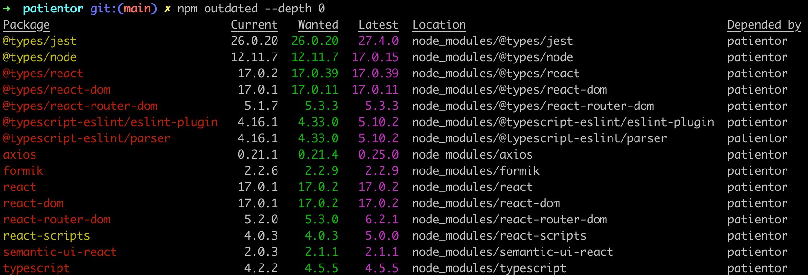

<div class="content">

### Class Components

During the course, we have only used React components having been defined as Javascript functions. This was not possible without the [hook](https://reactjs.org/docs/hooks-intro.html) functionality that came with version 16.8 of React. Before, when defining a component that uses state, one had to define it using Javascript's [Class](https://reactjs.org/docs/state-and-lifecycle.html#converting-a-function-to-a-class) syntax.

It is beneficial to at least be familiar with Class Components to some extent since the world contains a lot of old React code, which will probably never be completely rewritten using the updated syntax.

Let's get to know the main features of Class Components by producing yet another very familiar anecdote application. We store the anecdotes in the file <i>db.json</i> using <i>json-server</i>. The contents of the file are lifted from [here](https://github.com/fullstack-hy/misc/blob/master/anecdotes.json).

The initial version of the Class Component looks like this

```js
import React from 'react'

class App extends React.Component {
  constructor(props) {
    super(props)
  }

  render() {
    return (
      <div>
        <h1>anecdote of the day</h1>
      </div>
    )
  }
}

export default App
```

The component now has a [constructor](https://react.dev/reference/react/Component#constructor), in which nothing happens at the moment, and contains the method [render](https://react.dev/reference/react/Component#render). As one might guess, render defines how and what is rendered to the screen.

Let's define a state for the list of anecdotes and the currently-visible anecdote. In contrast to when using the [useState](https://react.dev/reference/react/useState) hook, Class Components only contain one state. So if the state is made up of multiple "parts", they should be stored as properties of the state. The state is initialized in the constructor:

```js
class App extends React.Component {
  constructor(props) {
    super(props)

    // highlight-start
    this.state = {
      anecdotes: [],
      current: 0
    }
    // highlight-end
  }

  render() {
  // highlight-start
    if (this.state.anecdotes.length === 0) {
      return <div>no anecdotes...</div>
    }
  // highlight-end

    return (
      <div>
        <h1>anecdote of the day</h1>
        // highlight-start
        <div>
          {this.state.anecdotes[this.state.current].content}
        </div>
        <button>next</button>
        // highlight-end
      </div>
    )
  }
}
```

The component state is in the instance variable _this.state_. The state is an object having two properties. <i>this.state.anecdotes</i> is the list of anecdotes and <i>this.state.current</i> is the index of the currently-shown anecdote.

In Functional components, the right place for fetching data from a server is inside an [effect hook](https://react.dev/reference/react/useEffect), which is executed when a component renders or less frequently if necessary, e.g. only in combination with the first render.

The [lifecycle methods](https://react.dev/reference/react/Component#adding-lifecycle-methods-to-a-class-component) of Class Components offer corresponding functionality. The correct place to trigger the fetching of data from a server is inside the lifecycle method [componentDidMount](https://react.dev/reference/react/Component#componentdidmount), which is executed once right after the first time a component renders:

```js
class App extends React.Component {
  constructor(props) {
    super(props)

    this.state = {
      anecdotes: [],
      current: 0
    }
  }

  // highlight-start
  componentDidMount = () => {
    axios.get('http://localhost:3001/anecdotes').then(response => {
      this.setState({ anecdotes: response.data })
    })
  }
  // highlight-end

  // ...
}
```

The callback function of the HTTP request updates the component state using the method [setState](https://react.dev/reference/react/Component#setstate). The method only touches the keys that have been defined in the object passed to the method as an argument. The value for the key <i>current</i> remains unchanged.

Calling the method setState always triggers the rerender of the Class Component, i.e. calling the method _render_.

We'll finish off the component with the ability to change the shown anecdote. The following is the code for the entire component with the addition highlighted:

```js
class App extends React.Component {
  constructor(props) {
    super(props)

    this.state = {
      anecdotes: [],
      current: 0
    }
  }

  componentDidMount = () => {
    axios.get('http://localhost:3001/anecdotes').then(response => {
      this.setState({ anecdotes: response.data })
    })
  }

  // highlight-start
  handleClick = () => {
    const current = Math.floor(
      Math.random() * this.state.anecdotes.length
    )
    this.setState({ current })
  }
  // highlight-end

  render() {
    if (this.state.anecdotes.length === 0 ) {
      return <div>no anecdotes...</div>
    }

    return (
      <div>
        <h1>anecdote of the day</h1>
        <div>{this.state.anecdotes[this.state.current].content}</div>
        <button onClick={this.handleClick}>next</button> // highlight-line
      </div>
    )
  }
}
```

For comparison, here is the same application as a Functional component:

```js
const App = () => {
  const [anecdotes, setAnecdotes] = useState([])
  const [current, setCurrent] = useState(0)

  useEffect(() =>{
    axios.get('http://localhost:3001/anecdotes').then(response => {
      setAnecdotes(response.data)
    })
  },[])

  const handleClick = () => {
    setCurrent(Math.round(Math.random() * (anecdotes.length - 1)))
  }

  if (anecdotes.length === 0) {
    return <div>no anecdotes...</div>
  }

  return (
    <div>
      <h1>anecdote of the day</h1>
      <div>{anecdotes[current].content}</div>
      <button onClick={handleClick}>next</button>
    </div>
  )
}
```

In the case of our example, the differences were minor. The biggest difference between Functional components and Class components is mainly that the state of a Class component is a single object, and that the state is updated using the method _setState_, while in Functional components the state can consist of multiple different variables, with all of them having their own update function.

In some more advanced use cases, the effect hook offers a considerably better mechanism for controlling side effects compared to the lifecycle methods of Class Components.

A notable benefit of using Functional components is not having to deal with the self-referencing _this_ reference of the Javascript class.

In my opinion, and the opinion of many others, Class Components offer little benefit over Functional components enhanced with hooks, except for the so-called [error boundary](https://react.dev/reference/react/Component#catching-rendering-errors-with-an-error-boundary) mechanism, which currently (15th February 2021) isn't yet in use by functional components.

When writing fresh code, [there is no rational reason to use Class Components](https://reactjs.org/docs/hooks-faq.html#should-i-use-hooks-classes-or-a-mix-of-both) if the project is using React with a version number 16.8 or greater. On the other hand, [there is currently no need to rewrite all old React code](https://reactjs.org/docs/hooks-faq.html#do-i-need-to-rewrite-all-my-class-components) as Functional components.

### Organization of code in React application

In most applications, we followed the principle by which components were placed in the directory <i>components</i>, reducers were placed in the directory <i>reducers</i>, and the code responsible for communicating with the server was placed in the directory <i>services</i>. This way of organizing fits a smaller application just fine, but as the amount of components increases, better solutions are needed. There is no one correct way to organize a project. The article [The 100% correct way to structure a React app (or why there’s no such thing)](https://medium.com/hackernoon/the-100-correct-way-to-structure-a-react-app-or-why-theres-no-such-thing-3ede534ef1ed) provides some perspective on the issue.

### Frontend and backend in the same repository

During the course, we have created the frontend and backend into separate repositories. This is a very typical approach. However, we did the deployment by [copying](/en/part3/deploying_app_to_internet#serving-static-files-from-the-backend) the bundled frontend code into the backend repository. A possibly better approach would have been to deploy the frontend code separately.

Sometimes, there may be a situation where the entire application is to be put into a single repository. In this case, a common approach is to put the <i>package.json</i> and <i>webpack.config.js</i> in the root directory, as well as place the frontend and backend code into their own directories, e.g. <i>client</i> and <i>server</i>.

### Changes on the server

If there are changes in the state on the server, e.g. when new blogs are added by other users to the bloglist service, the React frontend we implemented during this course will not notice these changes until the page reloads. A similar situation arises when the frontend triggers a time-consuming computation in the backend. How do we reflect the results of the computation to the frontend?

One way is to execute [polling](<https://en.wikipedia.org/wiki/Polling_(computer_science)>) on the frontend, meaning repeated requests to the backend API e.g. using the [setInterval](https://developer.mozilla.org/en-US/docs/Web/API/WindowOrWorkerGlobalScope/setInterval) command.

A more sophisticated way is to use [WebSockets](https://developer.mozilla.org/en-US/docs/Web/API/WebSockets_API) which allow for establishing a two-way communication channel between the browser and the server. In this case, the browser does not need to poll the backend, and instead only has to define callback functions for situations when the server sends data about updating state using a WebSocket.

WebSockets is an API provided by the browser, which is not yet fully supported on all browsers:


Instead of directly using the WebSocket API, it is advisable to use the [Socket.io](https://socket.io/) library, which provides various <i>fallback</i> options in case the browser does not have full support for WebSockets.

In [part 8](/en/part8), our topic is GraphQL, which provides a nice mechanism for notifying clients when there are changes in the backend data.

### Virtual DOM

The concept of the Virtual DOM often comes up when discussing React. What is it all about? As mentioned in [part 0](/en/part0/fundamentals_of_web_apps#document-object-model-or-dom), browsers provide a [DOM API](https://developer.mozilla.org/fi/docs/DOM) through which the JavaScript running in the browser can modify the elements defining the appearance of the page.

When a software developer uses React, they rarely or never directly manipulate the DOM. The function defining the React component returns a set of [React elements](https://reactjs.org/docs/glossary.html#elements). Although some of the elements look like normal HTML elements

```js
const element = <h1>Hello, world</h1>
```

they are also just JavaScript-based React elements at their core.

The React elements defining the appearance of the components of the application make up the [Virtual DOM](https://reactjs.org/docs/faq-internals.html#what-is-the-virtual-dom), which is stored in system memory during runtime.

With the help of the [ReactDOM](https://react.dev/reference/react-dom) library, the virtual DOM defined by the components is rendered to a real DOM that can be shown by the browser using the DOM API:

```js
ReactDOM.createRoot(document.getElementById('root')).render(<App />)
```

When the state of the application changes, a <i>new virtual DOM</i> gets defined by the components. React has the previous version of the virtual DOM in memory and instead of directly rendering the new virtual DOM using the DOM API, React computes the optimal way to update the DOM (remove, add or modify elements in the DOM) such that the DOM reflects the new virtual DOM.

### On the role of React in applications

In the material, we may not have put enough emphasis on the fact that React is primarily a library for managing the creation of views for an application. If we look at the traditional [Model View Controller](https://en.wikipedia.org/wiki/Model%E2%80%93view%E2%80%93controller) pattern, then the domain of React would be <i>View</i>. React has a more narrow area of application than e.g. [Angular](https://angular.io/), which is an all-encompassing Frontend MVC framework. Therefore, React is not called a <i>framework</i>, but a <i>library</i>.

In small applications, data handled by the application is stored in the state of the React components, so in this scenario, the state of the components can be thought of as <i>models</i> of an MVC architecture.

However, MVC architecture is not usually mentioned when talking about React applications. Furthermore, if we are using Redux, then the applications follow the [Flux](https://facebook.github.io/flux/docs/in-depth-overview) architecture and the role of React is even more focused on creating the views. The business logic of the application is handled using the Redux state and action creators. If we're using [Redux Thunk](/en/part6/communicating_with_server_in_a_redux_application#asynchronous-actions-and-redux-thunk) familiar from part 6, then the business logic can be almost completely separated from the React code.

Because both React and [Flux](https://facebook.github.io/flux/docs/in-depth-overview) were created at Facebook, one could say that using React only as a UI library is the intended use case. Following the Flux architecture adds some overhead to the application, and if we're talking about a small application or prototype, it might be a good idea to use React "wrong", since [over-engineering](https://en.wikipedia.org/wiki/Overengineering) rarely yields an optimal result.

Part 6 [last chapter](/en/part6/react_query_use_reducer_and_the_context) covers the newer trends of state management in React. React's hook functions <i>useReducer</i> and <i>useContext</i> provide a kind of lightweight version of Redux. <i>React Query</i>, on the other hand, is a library that solves many of the problems associated with handling state on the server, eliminating the need for a React application to store data retrieved from the server directly in frontend state.

### React/node-application security

So far during the course, we have not touched on information security much. We do not have much time for this now either, but fortunately, University of Helsinki has a MOOC course [Securing Software](https://cybersecuritybase.mooc.fi/module-2.1) for this important topic.

We will, however, take a look at some things specific to this course.

The Open Web Application Security Project, otherwise known as [OWASP](https://www.owasp.org), publishes an annual list of the most common security risks in Web applications. The most recent list can be found [here](https://owasp.org/www-project-top-ten/). The same risks can be found from one year to another.

At the top of the list, we find <i>injection</i>, which means that e.g. text sent using a form in an application is interpreted completely differently than the software developer had intended. The most famous type of injection is probably [SQL injection](https://stackoverflow.com/questions/332365/how-does-the-sql-injection-from-the-bobby-tables-xkcd-comic-work).

For example, imagine that the following SQL query is executed in a vulnerable application:

```js
let query = "SELECT * FROM Users WHERE name = '" + userName + "';"
```

Now let's assume that a malicious user <i>Arto Hellas</i> would define their name as

<pre>
Arto Hell-as'; DROP TABLE Users; --
</pre>

so that the name would contain a single quote <code>'</code>, which is the beginning and end character of a SQL string. As a result of this, two SQL operations would be executed, the second of which would  destroy the database table <i>Users</i>:

```sql
SELECT * FROM Users WHERE name = 'Arto Hell-as'; DROP TABLE Users; --'
```

SQL injections are prevented using [parameterized queries](https://security.stackexchange.com/questions/230211/why-are-stored-procedures-and-prepared-statements-the-preferred-modern-methods-f). With them, user input isn't mixed with the SQL query, but the database itself inserts the input values at placeholders in the query (usually <code>?</code>).

```js
execute("SELECT * FROM Users WHERE name = ?", [userName])
```

Injection attacks are also possible in NoSQL databases. However, mongoose prevents them by [sanitizing](https://zanon.io/posts/nosql-injection-in-mongodb) the queries. More on the topic can be found e.g. [here](https://web.archive.org/web/20220901024441/https://blog.websecurify.com/2014/08/hacking-nodejs-and-mongodb.html).

<i>Cross-site scripting (XSS)</i> is an attack where it is possible to inject malicious JavaScript code into a legitimate web application. The malicious code would then be executed in the browser of the victim. If we try to inject the following into e.g. the notes application:

```html
<script>
  alert('Evil XSS attack')
</script>
```

the code is not executed, but is only rendered as 'text' on the page:


since React [takes care of sanitizing data in variables](https://reactjs.org/docs/introducing-jsx.html#jsx-prevents-injection-attacks). Some versions of React [have been vulnerable](https://medium.com/dailyjs/exploiting-script-injection-flaws-in-reactjs-883fb1fe36c1) to XSS attacks. The security holes have of course been patched, but there is no guarantee that there couldn't be any more.

One needs to remain vigilant when using libraries; if there are security updates to those libraries, it is advisable to update those libraries in one's applications. Security updates for Express are found in the [library's documentation](https://expressjs.com/en/advanced/security-updates.html) and the ones for Node are found in [this blog](https://nodejs.org/en/blog/).

You can check how up-to-date your dependencies are using the command

```bash
npm outdated --depth 0
```

The one-year-old project that is used in [part 9](/en/part9) of this course already has quite a few outdated dependencies:



The dependencies can be brought up to date by updating the file <i>package.json</i>. The best way to do that is by using a tool called _npm-check-updates_. It can be installed globally by running the command

```bash
npm install -g npm-check-updates
```

Using this tool, the up-to-dateness of dependencies is checked in the following way:

```bash
$ npm-check-updates
Checking ...\ultimate-hooks\package.json
[====================] 9/9 100%

 @testing-library/react       ^13.0.0  →  ^13.1.1
 @testing-library/user-event  ^14.0.4  →  ^14.1.1
 react-scripts                  5.0.0  →    5.0.1

Run ncu -u to upgrade package.json
```

The file <i>package.json</i> is brought up to date by running the command _ncu -u_.

```bash
$ ncu -u
Upgrading ...\ultimate-hooks\package.json
[====================] 9/9 100%

 @testing-library/react       ^13.0.0  →  ^13.1.1
 @testing-library/user-event  ^14.0.4  →  ^14.1.1
 react-scripts                  5.0.0  →    5.0.1

Run npm install to install new versions.
```

Then it is time to update the dependencies by running the command _npm install_. However, old versions of the dependencies are not necessarily a security risk.

The npm [audit](https://docs.npmjs.com/cli/audit) command can be used to check the security of dependencies. It compares the version numbers of the dependencies in your application to a list of the version numbers of dependencies containing known security threats in a centralized error database.

Running _npm audit_ on the same project prints a long list of complaints and suggested fixes.
Below is a part of the report:

```js
$ patientor npm audit

... many lines removed ...

url-parse  <1.5.2
Severity: moderate
Open redirect in url-parse - https://github.com/advisories/GHSA-hh27-ffr2-f2jc
fix available via `npm audit fix`
node_modules/url-parse

ws  6.0.0 - 6.2.1 || 7.0.0 - 7.4.5
Severity: moderate
ReDoS in Sec-Websocket-Protocol header - https://github.com/advisories/GHSA-6fc8-4gx4-v693
ReDoS in Sec-Websocket-Protocol header - https://github.com/advisories/GHSA-6fc8-4gx4-v693
fix available via `npm audit fix`
node_modules/webpack-dev-server/node_modules/ws
node_modules/ws

120 vulnerabilities (102 moderate, 16 high, 2 critical)

To address issues that do not require attention, run:
  npm audit fix

To address all issues (including breaking changes), run:
  npm audit fix --force
```

After only one year, the code is full of small security threats. Luckily, there are only 2 critical threats.  Let's run _npm audit fix_ as the report suggests:

```js
$ npm audit fix

+ mongoose@5.9.1
added 19 packages from 8 contributors, removed 8 packages and updated 15 packages in 7.325s
fixed 354 of 416 vulnerabilities in 20047 scanned packages
  1 package update for 62 vulns involved breaking changes
  (use `npm audit fix --force` to install breaking changes; or refer to `npm audit` for steps to fix these manually)
```

62 threats remain because, by default, _audit fix_ does not update dependencies if their <i>major</i> version number has increased.  Updating these dependencies could lead to the whole application breaking down.

The source for the critical bug is the library [immer](https://github.com/immerjs/immer)

```js
immer  <9.0.6
Severity: critical
Prototype Pollution in immer - https://github.com/advisories/GHSA-33f9-j839-rf8h
fix available via `npm audit fix --force`
Will install react-scripts@5.0.0, which is a breaking change
```

Running _npm audit fix --force_ would upgrade the library version but would also upgrade the library _react-scripts_ and that would potentially break down the development environment. So we will leave the library upgrades for later...

One of the threats mentioned in the list from OWASP is <i>Broken Authentication</i> and the related <i>Broken Access Control</i>. The token-based authentication we have been using is fairly robust if the application is being used on the traffic-encrypting HTTPS protocol. When implementing access control, one should e.g. remember to not only check a user's identity in the browser but also on the server. Bad security would be to prevent some actions to be taken only by hiding the execution options in the code of the browser.

On Mozilla's MDN, there is a very good [Website security guide](https://developer.mozilla.org/en-US/docs/Learn/Server-side/First_steps/Website_security), which brings up this very important topic:


The documentation for Express includes a section on security: [Production Best Practices: Security](https://expressjs.com/en/advanced/best-practice-security.html), which is worth a read. It is also recommended to add a library called [Helmet](https://helmetjs.github.io/) to the backend. It includes a set of middleware that eliminates some security vulnerabilities in Express applications.

Using the ESlint [security-plugin](https://github.com/nodesecurity/eslint-plugin-security) is also worth doing.

### Current trends

Finally, let's take a look at some technology of tomorrow (or, actually, already today), and the directions in which Web development is heading.

#### Typed versions of JavaScript

Sometimes, the [dynamic typing](https://developer.mozilla.org/en-US/docs/Glossary/Dynamic_typing) of JavaScript variables creates annoying bugs. In part 5, we talked briefly about [PropTypes](/en/part5/props_children_and_proptypes#prop-types): a mechanism which enables one to enforce type-checking for props passed to React components.

Lately, there has been a notable uplift in the interest in [static type checking](https://en.wikipedia.org/wiki/Type_system#Static_type_checking). At the moment, the most popular typed version of Javascript is [TypeScript](https://www.typescriptlang.org/) which has been developed by Microsoft. Typescript is covered in [part 9](/en/part9).

#### Server-side rendering, isomorphic applications and universal code

The browser is not the only domain where components defined using React can be rendered. The rendering can also be done on the [server](https://react.dev/reference/react-dom/server). This kind of approach is increasingly being used, such that, when accessing the application for the first time, the server serves a pre-rendered page made with React. From here onwards, the operation of the application continues, as usual, meaning the browser executes React, which manipulates the DOM shown by the browser. The rendering that is done on the server goes by the name: <i>server-side rendering</i>.

One motivation for server-side rendering is Search Engine Optimization (SEO). Search engines have traditionally been very bad at recognizing JavaScript-rendered content. However, the tide might be turning, e.g. take a look at [this](https://www.javascriptstuff.com/react-seo/) and [this](https://medium.freecodecamp.org/seo-vs-react-is-it-neccessary-to-render-react-pages-in-the-backend-74ce5015c0c9).

Of course, server-side rendering is not anything specific to React or even JavaScript. Using the same programming language throughout the stack in theory simplifies the execution of the concept because the same code can be run on both the front- and backend.

Along with server-side rendering, there has been talk of so-called <i>isomorphic applications</i> and <i>universal code</i>, although there has been some debate about their definitions. According to some [definitions](https://medium.com/@ghengeveld/isomorphism-vs-universal-javascript-4b47fb481beb), an isomorphic web application performs rendering on both frontend and backend. On the other hand, universal code is code that can be executed in most environments, meaning both frontend and backend.

React and Node provide a desirable option for implementing an isomorphic application as universal code.

Writing universal code directly using React is currently still pretty cumbersome. Lately, a library called [Next.js](https://github.com/vercel/next.js), which is implemented on top of React, has garnered much attention and is a good option for making universal applications.

#### Progressive web apps

Lately, people have started using the term [progressive web app](https://developers.google.com/web/progressive-web-apps/) (PWA) launched by Google.

In short, we are talking about web applications working as well as possible on every platform and taking advantage of the best parts of those platforms. The smaller screen of mobile devices must not hamper the usability of the application. PWAs should also work flawlessly in offline mode or with a slow internet connection. On mobile devices, they must be installable just like any other application. All the network traffic in a PWA should be encrypted.

#### Microservice architecture

During this course, we have only scratched the surface of the server end of things. In our applications, we had a <i>monolithic</i> backend, meaning one application making up a whole and running on a single server, serving only a few API endpoints.

As the application grows, the monolithic backend approach starts turning problematic both in terms of performance and maintainability.

A [microservice architecture](https://martinfowler.com/articles/microservices.html) (microservices) is a way of composing the backend of an application from many separate, independent services, which communicate with each other over the network. An individual microservice's purpose is to take care of a particular logical functional whole. In a pure microservice architecture, the services do not use a shared database.

For example, the bloglist application could consist of two services: one handling the user and another taking care of the blogs. The responsibility of the user service would be user registration and user authentication, while the blog service would take care of operations related to the blogs.

The image below visualizes the difference between the structure of an application based on a microservice architecture and one based on a more traditional monolithic structure:


The role of the frontend (enclosed by a square in the picture) does not differ much between the two models. There is often a so-called [API gateway](http://microservices.io/patterns/apigateway) between the microservices and the frontend, which provides an illusion of a more traditional "everything on the same server" API. [Netflix](https://medium.com/netflix-techblog/optimizing-the-netflix-api-5c9ac715cf19), among others, uses this type of approach.

Microservice architectures emerged and evolved for the needs of large internet-scale applications. The trend was set by Amazon far before the appearance of the term microservice. The critical starting point was an email sent to all employees in 2002 by Amazon CEO Jeff Bezos:

> All teams will henceforth expose their data and functionality through service interfaces.
>
> Teams must communicate with each other through these interfaces.
>
> There will be no other form of inter-process communication allowed: no direct linking, no direct reads of another team’s data store, no shared-memory model, no back-doors whatsoever. The only communication allowed is via service interface calls over the network.
>
> It doesn’t matter what technology you use.
>
> All service interfaces, without exception, must be designed from the ground up to be externalize-able. That is to say, the team must plan and design to be able to expose the interface to developers in the outside world.
>
> No exceptions.
>
> Anyone who doesn’t do this will be fired. Thank you; have a nice day!

Nowadays, one of the biggest forerunners in the use of microservices is [Netflix](https://www.infoq.com/presentations/netflix-chaos-microservices).

The use of microservices has steadily been gaining hype to be kind of a [silver bullet](https://en.wikipedia.org/wiki/No_Silver_Bullet) of today, which is being offered as a solution to almost every kind of problem. However, there are several challenges when it comes to applying a microservice architecture, and it might make sense to go [monolith first](https://martinfowler.com/bliki/MonolithFirst.html) by initially making a traditional all-encompassing backend. Or maybe [not](https://martinfowler.com/articles/dont-start-monolith.html). There are a bunch of different opinions on the subject. Both links lead to Martin Fowler's site; as we can see, even the wise are not entirely sure which one of the right ways is more right.

Unfortunately, we cannot dive deeper into this important topic during this course. Even a cursory look at the topic would require at least 5 more weeks.

#### Serverless

After the release of Amazon's [lambda](https://aws.amazon.com/lambda/) service at the end of 2014, a new trend started to emerge in web application development: [serverless](https://serverless.com/).

The main thing about lambda, and nowadays also Google's [Cloud functions](https://cloud.google.com/functions/) as well as [similar functionality in Azure](https://azure.microsoft.com/en-us/services/functions/), is that it enables <i>the execution of individual functions</i> in the cloud. Before, the smallest executable unit in the cloud was a single <i>process</i>, e.g. a runtime environment running a Node backend.

E.g. Using Amazon's [API gateway](https://aws.amazon.com/api-gateway/) it is possible to make serverless applications where the requests to the defined HTTP API get responses directly from cloud functions. Usually, the functions already operate using stored data in the databases of the cloud service.

Serverless is not about there not being a server in applications, but about how the server is defined. Software developers can shift their programming efforts to a higher level of abstraction as there is no longer a need to programmatically define the routing of HTTP requests, database relations, etc., since the cloud infrastructure provides all of this. Cloud functions also lend themselves to creating a well-scaling system, e.g. Amazon's Lambda can execute a massive amount of cloud functions per second. All of this happens automatically through the infrastructure and there is no need to initiate new servers, etc.

### Useful libraries and interesting links

The JavaScript developer community has produced a large variety of useful libraries. If you are developing anything more substantial, it is worth it to check if existing solutions are already available.
Below are listed some libraries recommended by trustworthy parties.

If your application has to handle complicated data, [lodash](https://www.npmjs.com/package/lodash), which we recommended in [part 4](/en/part4/structure_of_backend_application_introduction_to_testing#exercises-4-3-4-7), is a good library to use. If you prefer the functional programming style, you might consider using [ramda](https://ramdajs.com/).

If you are handling times and dates, [date-fns](https://github.com/date-fns/date-fns) offers good tools for that. If you have complex forms in your apps, have a look at whether [React Hook Form](https://react-hook-form.com/) would be a good fit. If your application displays graphs, there are multiple options to choose from. Both [recharts](http://recharts.org/en-US/) and [highcharts](https://github.com/highcharts/highcharts-react) are well-recommended.

The [Immer](https://github.com/mweststrate/immer) provides immutable implementations of some data structures. The library could be of use when using Redux, since as we [remember](/en/part6/flux_architecture_and_redux#pure-functions-immutable) in part 6, reducers must be pure functions, meaning they must not modify the store's state but instead have to replace it with a new one when a change occurs.

[Redux-saga](https://redux-saga.js.org/) provides an alternative way to make asynchronous actions for [Redux Thunk](/en/part6/communicating_with_server_in_a_redux_application#asynchronous-actions-and-redux-thunk) familiar from part 6. Some embrace the hype and like it. I don't.

For single-page applications, the gathering of analytics data on the interaction between the users and the page is [more challenging](https://developers.google.com/analytics/devguides/collection/gtagjs/single-page-applications) than for traditional web applications where the entire page is loaded. The [React Google Analytics](https://github.com/react-ga/react-ga) library offers a solution.

You can take advantage of your React know-how when developing mobile applications using Facebook's extremely popular [React Native](https://facebook.github.io/react-native/) library, which is the topic of [part 10](/en/part10) of the course.

When it comes to the tools used for the management and bundling of JavaScript projects, the community has been very fickle. Best practices have changed rapidly (the years are approximations, nobody remembers that far back in the past):

- 2011 [Bower](https://www.npmjs.com/package/bower)
- 2012 [Grunt](https://www.npmjs.com/package/grunt)
- 2013-14 [Gulp](https://www.npmjs.com/package/gulp)
- 2012-14 [Browserify](https://www.npmjs.com/package/browserify)
- 2015- [Webpack](https://www.npmjs.com/package/webpack)

Hipsters seem to have lost their interest in tool development after webpack started to dominate the markets. A few years ago, [Parcel](https://parceljs.org) started to make the rounds marketing itself as simple (which Webpack is not) and faster than Webpack. However, after a promising start, Parcel has not gathered any steam, and it's beginning to look like it will not be the end of Webpack. Recently, [esbuild](https://esbuild.github.io/) has been on a relatively high rise and is already seriously challenging Webpack.

The site <https://reactpatterns.com/> provides a concise list of best practices for React, some of which are already familiar from this course. Another similar list is [react bits](https://vasanthk.gitbooks.io/react-bits/).

[Reactiflux](https://www.reactiflux.com/) is a big chat community of React developers on Discord. It could be one possible place to get support after the course has concluded. For example, numerous libraries have their own channels.

If you know some recommendable links or libraries, make a pull request!

</div>
