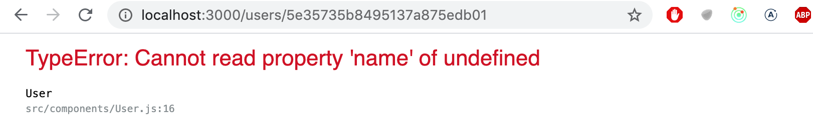

<div class="content">

In addition to the eight exercises in the [React router](/en/part7/react_router) and [custom hooks](en/part7/custom_hooks) sections of this seventh part of the course material, there are 13 exercises that continue our work on the Bloglist application that we worked on in parts four and five of the course material. Some of the following exercises are "features" that are independent of one another, meaning that there is no need to finish the exercises in any particular order. You are free to skip over a part of the exercises if you wish to do so.

If you do not want to use your own Bloglist application, you are free to use the code from the model solution as a starting point for these exercises.

Many of the exercises in this part of the course material will require the refactoring of existing code. This is a common reality of extending existing applications, meaning that refactoring is an important and necessary skill even if it may feel difficult and unpleasant at times.

One good piece of advice for both refactoring and writing new code is to take <i> baby steps</i>. Losing your sanity is almost guaranteed if you leave the application in a completely broken state for long periods of time while refactoring.

</div>

<div class="tasks">

### Exercises 7.9.-7.21.

#### 7.9: redux, step1

Refactor the application from using internal React component state to using Redux for the application's state management.

Change the application's notifications to use Redux at this point of the exercise set.

#### 7.10: redux, step2

_Note_ that this and the next two exercises are quite laborious but incredibly educational.

Store the information about blog posts in the Redux store. In this exercise it is enough that you can see the blogs in backend and create a new blog.

You are free to manage the state for logging in and creating new blog posts by using the internal state of React components.

#### 7.11: redux, step3

Expand your solution so that it is again possible to like and delete a blog.

#### 7.12: redux, step4

Store the information about the signed in user in the Redux store.

#### 7.13: Users view

Implement a view to the application that displays all of the basic information related to users:


#### 7.14: Individual user view

Implement a view for individual users, that displays all of the blog posts added by that user:


You can access the view by clicking the name of the user in the view that lists all users:


<i>**NB:**</i> you will almost certainly stumble across the following error message during this exercise:



The error message will occur if you refresh the page for an individual user.

The cause of the issue is that when we navigate directly to the page of an individual user, the React application has not yet received the data from the backend. One solution for fixing the problem is to use conditional rendering:

```js
const User = () => {
  const user = ...
  // highlight-start
  if (!user) {
    return null
  }
  // highlight-end

  return (
    <div>
      // ...
    </div>
  )
}
```

#### 7.15: Blog view

Implement a separate view for blog posts. You can model the layout of your view after the following example:


Users should be able to access the view by clicking the name of the blog post in the view that lists of all of the blog posts.


After you're done with this exercise, the functionality that was implemented in exercise 5.6 is no longer necessary. Clicking a blog post no longer needs to expand the item in the list and display the details of the blog post.

#### 7.16: Navigation

Implement a navigation menu for the application:


#### 7.17: comments, step1

Implement the functionality for commenting on blog posts:


Comments should be anonymous, meaning that they are not associated to the user who left the comment.

In this exercise it is enough for the frontend to only display the comments that the application receives from the backend.

An appropriate mechanism for adding comments to a blog post would be an HTTP POST request to the <i>api/blogs/:id/comments</i> endpoint.

#### 7.18: comments, step2

Extend your application so that users can add comments to blog posts from the frontend:


#### 7.19: Styles, step1

Improve the appearance of your application by applying one of the methods shown in the course material.

#### 7.20: Styles, step2

You can mark this exercise as finished if you use an hour or more for styling your application.

#### 7.21: Course feedback

How did we do? Give us some feedback for the course in Moodle!

This was the last exercise for this part of the course and it's time to push your code to GitHub and mark all of your finished exercises to the [exercise submission system](https://studies.cs.helsinki.fi/stats/courses/fullstackopen).

</div>
