<div class="content">

En la parte 2 examinamos dos formas diferentes de agregar estilos a nuestra aplicación: el archivo [CSS único](/es/part2/adding_styles_to_react_app) de la vieja escuela y los [estilos en línea](/en/part2/adding_styles_to_react_app#inline-styles). En esta parte veremos algunas otras formas.

### Librerías de IU listas para usar

Un enfoque para definir estilos para una aplicación es utilizar un "UI framework" listo para usar.

Uno de los primeros UI frameworks más populares fue el kit de herramientas [Bootstrap](https://getbootstrap.com/) creado por Twitter, que aún puede ser el framework más popular. Recientemente ha habido una explosión en la cantidad de nuevos UI frameworks. De hecho, la selección es tan amplia que hay pocas esperanzas de crear una lista exhaustiva de opciones.

Muchos UI frameworks proporcionan a los desarrolladores de aplicaciones web temas y "componentes" listos para usar, como botones, menús y tablas. Escribimos los componentes entre comillas, porque en este contexto no estamos hablando de componentes de React. Por lo general, los UI frameworks se utilizan al incluir las hojas de estilo CSS y el código JavaScript del framework en la aplicación.

Hay muchos UI frameworks que tienen versiones compatibles con React, donde los "componentes" del framwork se han transformado en componentes de React. Hay algunas versiones diferentes de React de Bootstrap como [reactstrap](http://reactstrap.github.io/) y [react-bootstrap](https://react-bootstrap.github.io/).

A continuación, analizaremos más de cerca dos UI frameworks, Bootstrap y [MaterialUI](https://material-ui.com/). Usaremos ambos marcos para agregar estilos similares a la aplicación que hicimos en la sección [React-router](/es/part7/react_router) del material del curso.

### React Bootstrap

Comencemos por echar un vistazo a Bootstrap con la ayuda del paquete [react-bootstrap](https://react-bootstrap.github.io/).

Instalemos el paquete con el comando:

```bash
npm install react-bootstrap
```

Luego agreguemos un link para cargar la hoja de estilo CSS para Bootstrap dentro de la etiqueta <i>head</i> en el archivo <i>public/index.html</i> de la aplicación:

```js
<head>
  <link
    rel="stylesheet"
    href="https://maxcdn.bootstrapcdn.com/bootstrap/4.3.1/css/bootstrap.min.css"
    integrity="sha384-ggOyR0iXCbMQv3Xipma34MD+dH/1fQ784/j6cY/iJTQUOhcWr7x9JvoRxT2MZw1T"
    crossorigin="anonymous"
  />
  // ...
</head>
```

Cuando recargamos la aplicación, notamos que ya se ve un poco más elegante:

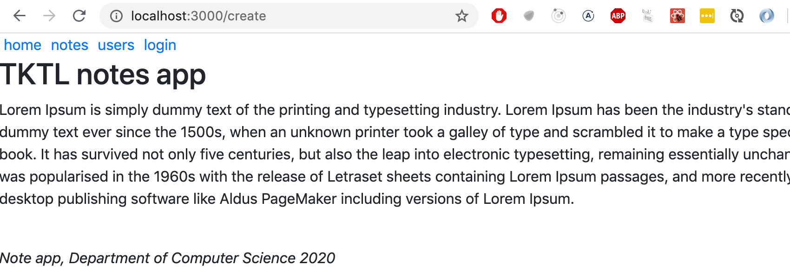

En Bootstrap, todo el contenido de la aplicación generalmente se renderiza dentro de un [container](https://getbootstrap.com/docs/4.1/layout/overview/#containers). En la práctica, esto se logra dando al elemento _div_ raíz de la aplicación el atributo de clase _container_:

```js
const App = () => {
  // ...

  return (
    <div className="container"> // highlight-line
      // ...
    </div>
  )
}
```


Notamos que esto ya tiene un efecto en la apariencia de la aplicación. El contenido ya no está tan cerca de los bordes del navegador como antes:

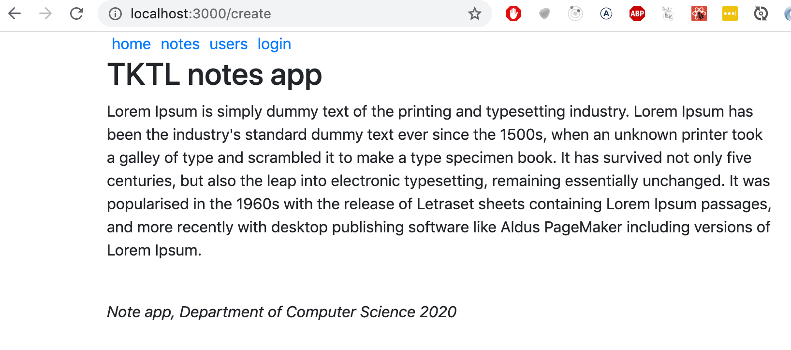


A continuación, hagamos algunos cambios en el componente <i>Notes</i>, para que muestre la lista de notas como una [tabla](https://getbootstrap.com/docs/4.1/content/tables/). React Bootstrap proporciona un componente [Table](https://react-bootstrap.github.io/components/table/) integrado para este propósito, por lo que no es necesario definir clases CSS por separado.

```js
const Notes = (props) => (
  <div>
    <h2>Notes</h2>
    <Table striped> // highlight-line
      <tbody>
        {props.notes.map(note =>
          <tr key={note.id}>
            <td>
              <Link to={`/notes/${note.id}`}>
                {note.content}
              </Link>
            </td>
            <td>
              {note.user}
            </td>
          </tr>
        )}
      </tbody>
    </Table>
  </div>
)
```

La apariencia de la aplicación es bastante elegante:

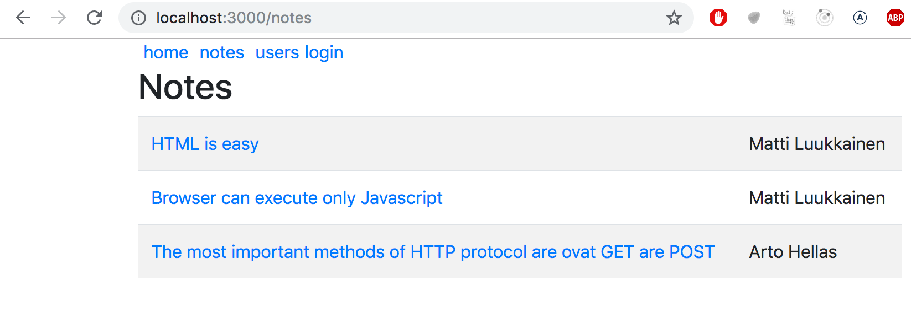

Tenga en cuenta que los componentes de React Bootstrap deben importarse por separado de la librería como se muestra a continuación:

```js
import { Table } from 'react-bootstrap'
```

### Formularios

Mejoremos el formulario en la vista de inicio de sesión con la ayuda de [formularios](https://getbootstrap.com/docs/4.1/components/forms/) Bootstrap.

React Bootstrap proporciona [componentes](https://react-bootstrap.github.io/components/forms/) integrados para crear formularios (aunque falta un poco la documentación para ellos):

```js
let Login = (props) => {
  // ...
  return (
    <div>
      <h2>login</h2>
      <Form onSubmit={onSubmit}>
        <Form.Group>
          <Form.Label>username:</Form.Label>
          <Form.Control
            type="text"
            name="username"
          />
          <Form.Label>password:</Form.Label>
          <Form.Control
            type="password"
          />
          <Button variant="primary" type="submit">
            login
          </Button>
        </Form.Group>
      </Form>
    </div>
)}
```

La cantidad de componentes que necesitamos importar aumenta:

```js
import { Table, Form, Button } from 'react-bootstrap'
```

Después de cambiar al formulario Bootstrap, nuestra aplicación mejorada se ve así:

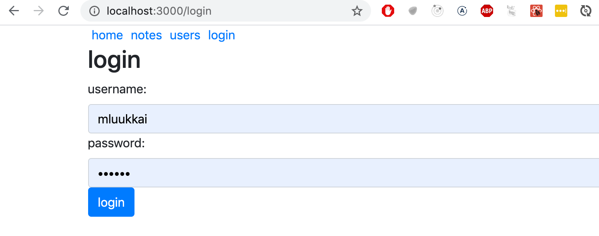

#### Notificación

Ahora que el formulario de inicio de sesión está en mejor forma, echemos un vistazo a cómo mejorar las notificaciones de nuestra aplicación:

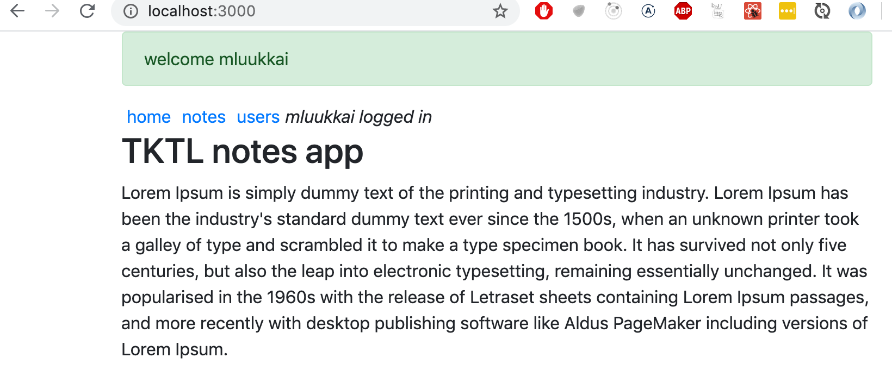

Agreguemos un mensaje para la notificación cuando un usuario inicia sesión en la aplicación. Lo almacenaremos en la variable _message_ en el estado del componente <i>App</i>:

```js
const App = () => {
  const [notes, setNotes] = useState([
    // ...
  ])

  const [user, setUser] = useState(null)
  const [message, setMessage] = useState(null) // highlight-line

  const login = (user) => {
    setUser(user)
    // highlight-start
    setMessage(`welcome ${user}`)
    setTimeout(() => {
      setMessage(null)
    }, 10000)
    // highlight-end
  }
  // ...
}
```

Representaremos el mensaje como un componente [Alert](https://getbootstrap.com/docs/4.1/components/alerts/) de Bootstrap . Una vez más, la librería React Bootstrap nos proporciona un [componente React](https://react-bootstrap.github.io/components/alerts/) correspondiente:

```js
<div className="container">
// highlight-start
  {(message &&
    <Alert variant="success">
      {message}
    </Alert>
  )}
// highlight-end
  // ...
</div>
```

#### Estructura de navegación

Por último, modifiquemos el menú de navegación de la aplicación para usar el componente [Navbar](https://getbootstrap.com/docs/4.1/components/navbar/) de Bootstrap. La librería React Bootstrap nos proporciona [componentes incorporados coincidentes](https://react-bootstrap.github.io/components/navbar/#navbars-mobile-friendly) . A través de prueba y error, terminamos con una solución que funciona a pesar de la documentación críptica:

```js
<Navbar collapseOnSelect expand="lg" bg="dark" variant="dark">
  <Navbar.Toggle aria-controls="responsive-navbar-nav" />
  <Navbar.Collapse id="responsive-navbar-nav">
    <Nav className="mr-auto">
      <Nav.Link href="#" as="span">
        <Link style={padding} to="/">home</Link>
      </Nav.Link>
      <Nav.Link href="#" as="span">
        <Link style={padding} to="/notes">notes</Link>
      </Nav.Link>
      <Nav.Link href="#" as="span">
        <Link style={padding} to="/users">users</Link>
      </Nav.Link>
      <Nav.Link href="#" as="span">
        {user
          ? <em>{user} logged in</em>
          : <Link to="/login">login</Link>
        }
    </Nav.Link>
    </Nav>
  </Navbar.Collapse>
</Navbar>
```

El diseño resultante tiene un aspecto muy limpio y agradable:


Si la ventana gráfica del navegador se reduce, notamos que el menú "colapsa" y se puede expandir haciendo clic en el botón "hamburguesa":

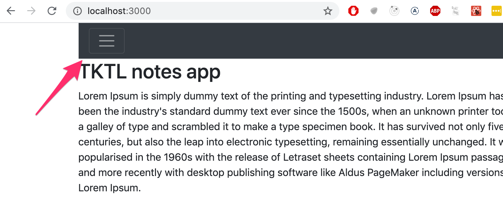


Bootstrap y una gran mayoría de los UI frameworks existentes producen diseños [responsives](https://en.wikipedia.org/wiki/Responsive_web_design), lo que significa que las aplicaciones resultantes se renderizan bien en una variedad de tamaños de pantalla diferentes.

Las herramientas para desarrolladores de Chrome permiten simular el uso de nuestra aplicación en el navegador de diferentes clientes móviles:

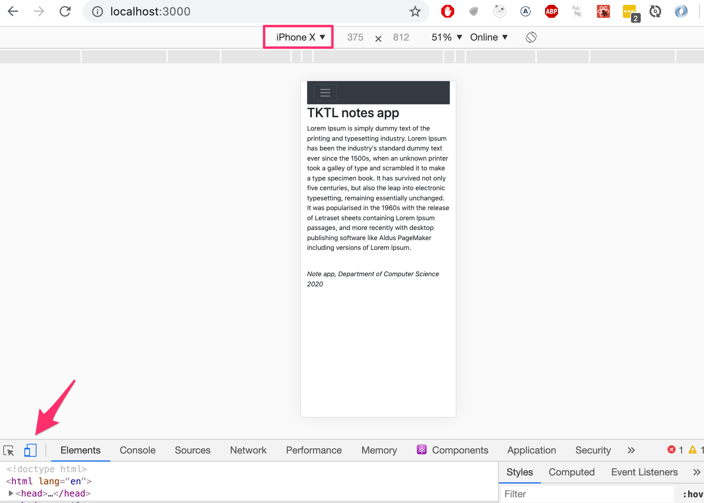

Puede encontrar el código completo de la aplicación [aquí](https://github.com/fullstack-hy2020/misc/blob/master/notes-bootstrap.js).

### UI de material

Como segundo ejemplo, veremos la librería [MaterialUI](https://material-ui.com/) React, que implementa el lenguaje visual de [Material design](https://material.io/) desarrollado por Google.

Instale la librería con el comando

```bash
npm install @material-ui/core
```

Luego agregue la siguiente línea a la etiqueta <i>head</i> en el archivo <i>public/index.html</i>. La línea carga la fuente Roboto de Google.

```js
<head>
  <link rel="stylesheet" href="https://fonts.googleapis.com/css?family=Roboto:300,400,500,700&display=swap" />
  // ...
</head>
```

Ahora usemos MaterialUI para hacer las mismas modificaciones al código que hicimos anteriormente con bootstrap.

Renderice el contenido de toda la aplicación dentro de un [Container](https://material-ui.com/components/container/):

```js
import Container from '@material-ui/core/Container'

const App = () => {
  // ...
  return (
    <Container>
      // ...
    </Container>
  )
}
```

Comencemos con el componente de <i>Notes</i>. Representaremos la lista de notas como una [tabla](https://material-ui.com/components/tables/#simple-table):

```js
const Notes = ({notes}) => (
  <div>
    <h2>Notes</h2>

    <TableContainer component={Paper}>
      <Table>
        <TableBody>
          {notes.map(note => (
            <TableRow key={note.id}>
              <TableCell>
                <Link to={`/notes/${note.id}`}>{note.content}</Link>
              </TableCell>
              <TableCell>
                {note.name}
              </TableCell>
            </TableRow>
          ))}
        </TableBody>
      </Table>
    </TableContainer>
  </div>
)
```

La tabla se ve así:

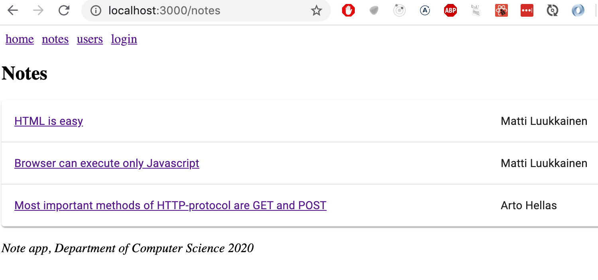

Una característica menos agradable de Material UI es que cada componente debe importarse por separado. La lista de importación para la página de notas es bastante larga::

```js
import {
  Container,
  Table,
  TableBody,
  TableCell,
  TableContainer,
  TableRow,
  Paper,
} from '@material-ui/core'
```

#### Formulario

A continuación, mejoremos el formulario de inicio de sesión en la vista <i>Login</i> utilizando los componentes [TextField](https://material-ui.com/components/text-fields/) y [Button](https://material-ui.com/api/button/):

```js 
const Login = (props) => {
  const history = useHistory()

  const onSubmit = (event) => {
    event.preventDefault()
    props.onLogin('mluukkai')
    history.push('/')
  }

  return (
    <div>
      <h2>login</h2>
      <form onSubmit={onSubmit}>
        <div>
          <TextField label="username" />
        </div>
        <div>
          <TextField  label="password" type='password' />
        </div>
        <div>
          <Button variant="contained" color="primary" type="submit">
            login
          </Button>
        </div>
      </form>
    </div>
  )
}
```

El resultado final es:

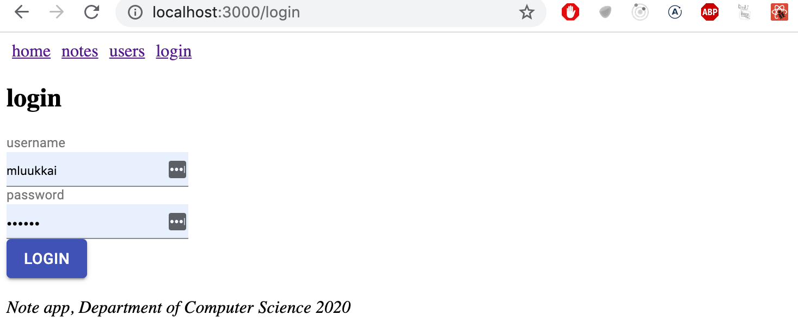

MaterialUI, a diferencia de Bootstrap, no proporciona un componente para el formulario en sí. El formulario aquí es un elemento [form](https://developer.mozilla.org/en-US/docs/Web/HTML/Element/form) HTML ordinario.

Recuerde importar todos los componentes utilizados en el formulario.

### Notificación

La notificación que se muestra al iniciar sesión se puede hacer usando el componente [Alert](https://material-ui.com/components/alert/), que es bastante similar al componente equivalente de bootstrap:

```js
<div>
// highlight-start
  {(message &&
    <Alert severity="success">
      {message}
    </Alert>
  )}
// highlight-end
</div>
```

El componente alert aún no está incluido en el paquete principal de MaterialUI, por lo que tenemos que instalar el paquete [lab](https://material-ui.com/components/about-the-lab/) para usarlo:

```bash
npm install @material-ui/lab
```

Luego podemos importar el componente así

```js 
import { Alert } from '@material-ui/lab'
```

La alerta es bastante elegante:

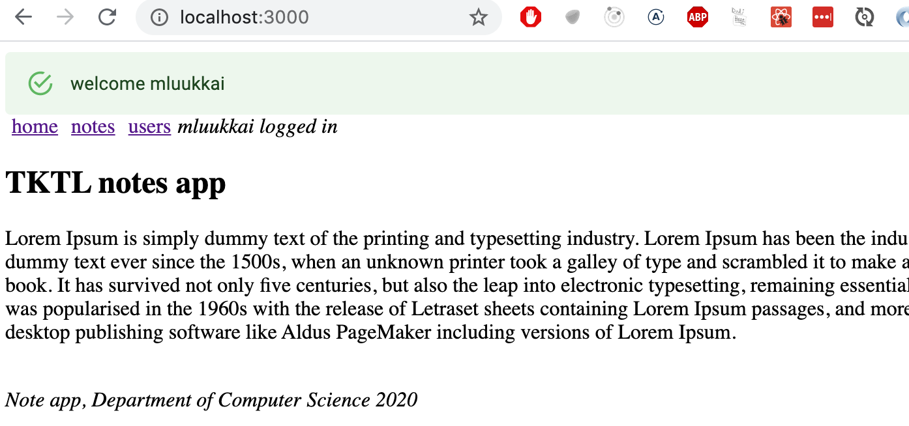

#### Estructura de navegación

Podemos implementar la navegación usando el componente [AppBar](https://material-ui.com/components/app-bar/).

Si usamos el código de ejemplo de la documentación

```js
<AppBar position="static">
  <Toolbar>
    <IconButton edge="start" color="inherit" aria-label="menu">
    </IconButton>
    <Button color="inherit">
      <Link to="/">home</Link>
    </Button>
    <Button color="inherit">
      <Link to="/notes">notes</Link>
    </Button>
    <Button color="inherit">
      <Link to="/users">users</Link>
    </Button>  
    <Button color="inherit">
      {user
        ? <em>{user} logged in</em>
        : <Link to="/login">login</Link>
      }
    </Button>                
  </Toolbar>
</AppBar>
```

tenemos navegación funcional, pero podría verse mejor


Podemos encontrar una mejor manera de la [documentación](https://material-ui.com/guides/composition/#routing-libraries). Podemos usar [component props](https://material-ui.com/guides/composition/#component-prop) para definir cómo se renderiza el elemento raíz de un componente MaterialUI.

Definiendo

```js
<Button color="inherit" component={Link} to="/">
  home
</Button>
```

<!-- the _Button_ component is rendered so, that its root component is react-router-dom _Link_ which receives its path as prop field _to_. -->

el componente _Button_ se renderiza de tal manera, que de su componente raíz react-router-dom _Link_ recibe su ruta como campo de prop _to_.

```js
<AppBar position="static">
  <Toolbar>
    <Button color="inherit" component={Link} to="/">
      home
    </Button>
    <Button color="inherit" component={Link} to="/notes">
      notes
    </Button>
    <Button color="inherit" component={Link} to="/users">
      users
    </Button>   
    {user
      ? <em>{user} logged in</em>
      : <Button color="inherit" component={Link} to="/login">
          login
        </Button>
    }                              
  </Toolbar>
</AppBar>
```

y se ve como queremos

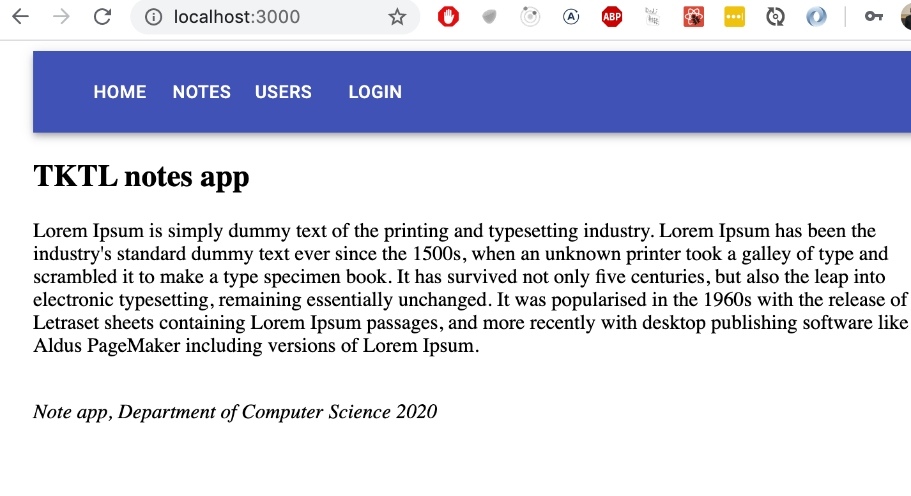

El código de la aplicación se puede encontrar [aquí](https://github.com/fullstack-hy2020/misc/blob/master/notes-materialui.js).

### Pensamientos finales

La diferencia entre react-bootstrap y MaterialUI no es grande. Depende de usted cuál le resulte más atractivo. Yo mismo no he usado mucho MaterialUI, pero mis primeras impresiones son positivas. Su documentación es un poco mejor que la de react-bootstrap. Según https://www.npmtrends.com/, que rastrea la popularidad de las diferentes librerías npm, MaterialUI pasó a react-bootstrap en popularidad a fines de 2018:

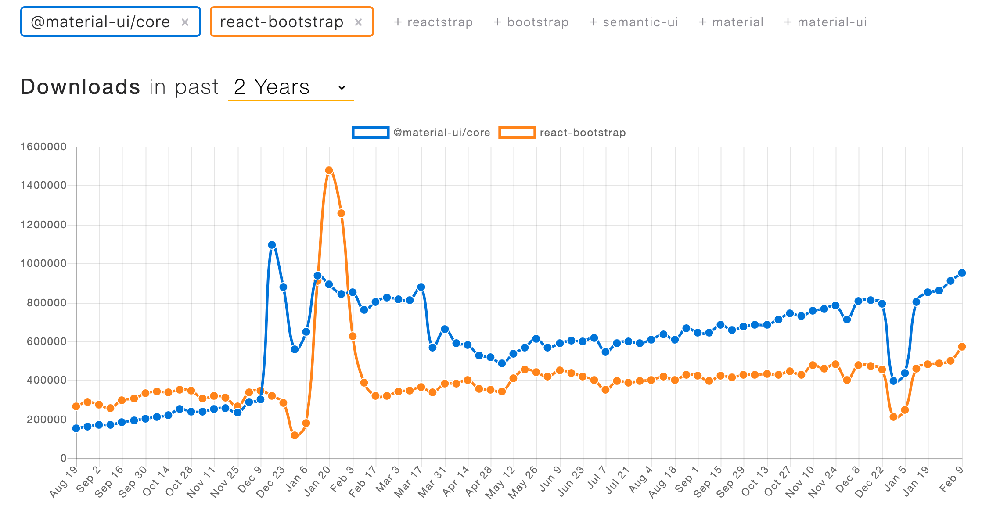

En los dos ejemplos anteriores, usamos los UI frameworks con la ayuda de las librerías de integración de React.

En lugar de usar la librería [React Bootstrap](https://react-bootstrap.github.io/), podríamos haber usado Bootstrap directamente definiendo clases CSS para los elementos HTML de nuestra aplicación. En lugar de definir la tabla con el componente <i>Table</i>:

```js
<Table striped>
  // ...
</Table>
```

Podríamos haber usado una <i>tabla</i> HTML normal y agregar la clase CSS requerida:

```js
<table className="table striped">
  // ...
</table>
```

El beneficio de usar la librería React Bootstrap no es tan evidente en este ejemplo.

Además de hacer que el código del frontend sea más compacto y legible, otro beneficio de usar las librerías del UI framework de React es que incluyen el JavaScript que se necesita para que los componentes específicos funcionen. Algunos componentes de Bootstrap requieren algunas [dependencias de JavaScript](https://getbootstrap.com/docs/4.1/getting-started/introduction/#js) desagradables que preferiríamos no incluir en nuestras aplicaciones React.

Algunas posibles desventajas de usar UI frameworks a través de librerías de integración en lugar de usarlos "directamente" son que las librerías de integración pueden tener API inestables y documentación deficiente. La situación con [Semantic UI React](https://react.semantic-ui.com) es mucho mejor que con muchos otros UI frameworks, ya que es una librería de integración oficial de React.

También está la cuestión de si las librerías de UI framework deben usarse en primer lugar. Depende de cada uno formarse su propia opinión, pero para las personas que carecen de conocimientos en CSS y diseño web, son herramientas muy útiles.


### Otros UI frameworks


Aquí hay algunos otros UI frameworks para su consideración. Si no ve su UI framework favorito en la lista, haga un pull request al material del curso.

- <https://bulma.io/>
- <https://ant.design/>
- <https://get.foundation/>
- <https://chakra-ui.com/>
- <https://tailwindcss.com/>
- <https://semantic-ui.com/>


### Styled components

También hay [otras formas](https://blog.bitsrc.io/5-ways-to-style-react-components-in-2019-30f1ccc2b5b) de diseñar aplicaciones React que aún no hemos analizado.

La librería [styled components](https://www.styled-components.com/) ofrece un enfoque interesante para definir estilos a través [tagged template literals](https://developer.mozilla.org/en-US/docs/Web/JavaScript/Reference/Template_literals) que se introdujeron en ES6.

Hagamos algunos cambios en los estilos de nuestra aplicación con la ayuda de styled components. Primero, instale el paquete con el comando:

```bash
npm install styled-components
```

Luego definamos dos componentes con estilos:

```js
import styled from 'styled-components'

const Button = styled.button`
  background: Bisque;
  font-size: 1em;
  margin: 1em;
  padding: 0.25em 1em;
  border: 2px solid Chocolate;
  border-radius: 3px;
`

const Input = styled.input`
  margin: 0.25em;
`
```

El código anterior crea versiones con estilo de los elementos HTML <i>button</i> e <i>input</i> y luego los asigna a las variables <i>Button</i> e <i>Input</i>.

La sintaxis para definir los estilos es bastante interesante, ya que las reglas CSS se definen dentro de las comillas invertidas.

Los componentes con estilo que definimos funcionan exactamente como los elementos normales <i>button</i> e <i>input</i>, y se pueden usar de la misma manera:

```js
const Login = (props) => {
  // ...
  return (
    <div>
      <h2>login</h2>
      <form onSubmit={onSubmit}>
        <div>
          username:
          <Input /> // highlight-line
        </div>
        <div>
          password:
          <Input type='password' /> // highlight-line
        </div>
        <Button type="submit" primary=''>login</Button> // highlight-line
      </form>
    </div>
  )
}
```

Creemos algunos componentes más para diseñar esa aplicación, que son versiones con estilo de elementos <i>div</i>:

```js
const Page = styled.div`
  padding: 1em;
  background: papayawhip;
`

const Navigation = styled.div`
  background: BurlyWood;
  padding: 1em;
`

const Footer = styled.div`
  background: Chocolate;
  padding: 1em;
  margin-top: 1em;
`
```

Usemos los componentes en nuestra aplicación:

```js
const App = () => {
  // ...

  return (
    <Page> // highlight-line
      <Navigation> // highlight-line
        <Link style={padding} to="/">home</Link>
        <Link style={padding} to="/notes">notes</Link>
        <Link style={padding} to="/users">users</Link>
        {user
          ? <em>{user} logged in</em>
          : <Link style={padding} to="/login">login</Link>
        }
      </Navigation> // highlight-line

      <Switch>
        <Route path="/notes/:id">
          <Note note={note} />
        </Route>
        <Route path="/notes">
          <Notes notes={notes} />
        </Route>
        <Route path="/users">
          {user ? <Users /> : <Redirect to="/login" />}
        </Route>
        <Route path="/login">
          <Login onLogin={login} />
        </Route>
        <Route path="/">
          <Home />
        </Route>
      </Switch>
      
      <Footer> // highlight-line
        <em>Note app, Department of Computer Science 2020</em>
      </Footer> // highlight-line
    </Page> // highlight-line
  )
}
```

La apariencia de la aplicación resultante se muestra a continuación:

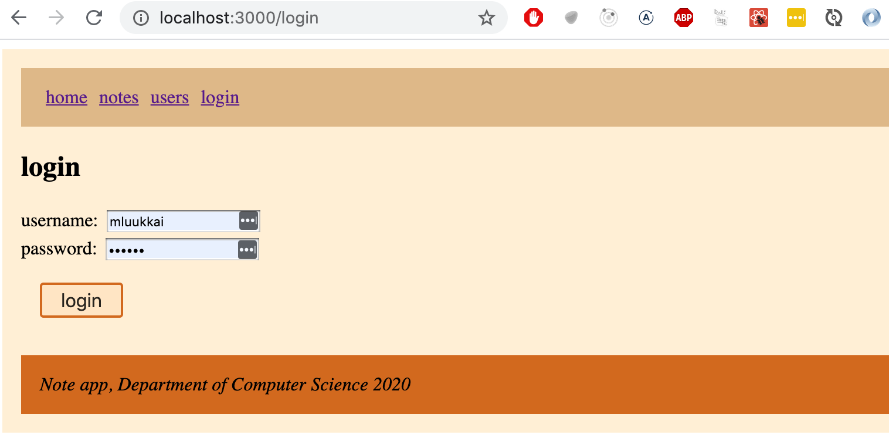

Los Styled components han experimentado un crecimiento constante en popularidad en los últimos tiempos, y mucha gente considera que es la mejor forma de definir estilos para las aplicaciones React.

</div>

<div class="tasks">


### Ejercicios


Los ejercicios relacionados con los temas presentados aquí se pueden encontrar al final de esta sección de material del curso en el conjunto de ejercicios [para extender la aplicación de lista de blogs](/es/part7/exercises_extending_the_bloglist).

</div>


