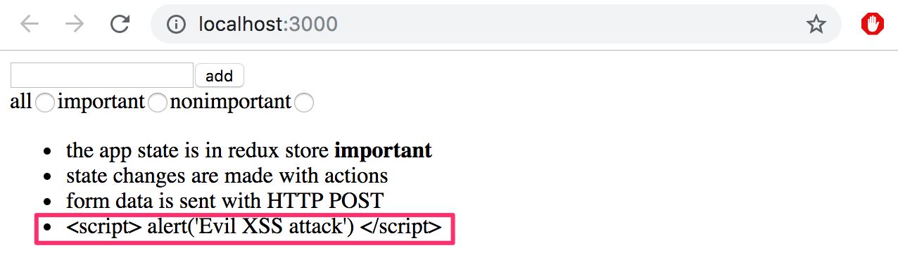

<div class="content">

### Componentes de clase

Durante el curso solo hemos utilizado componentes de React que se han definido como funciones de Javascript. Esto no fue posible sin la funcionalidad de [hook](https://reactjs.org/docs/hooks-intro.html) que llegó con la versión 16.8 de React. Antes, al definir un componente que usa estado, había que hacerlo usando la sintaxis de [Class](https://reactjs.org/docs/state-and-lifecycle.html#converting-a-function-to-a-class) de Javascript.

Es beneficioso al menos estar familiarizado con los componentes de clase hasta cierto punto, ya que el mundo contiene una gran cantidad de código React antiguo, que probablemente nunca se reescribirá por completo con la sintaxis actualizada.

Conozcamos las principales características de los componentes de clase produciendo otra aplicación de anécdotas, muy familiar para nosotros. Almacenamos las anécdotas en el archivo <i>db.json</i> usando <i>json-server</i>. El contenido del archivo se toma de [aquí](https://github.com/fullstack-hy/misc/blob/master/anecdotes.json).

La versión inicial del componente de clase se ve así

```js
import React from 'react'

class App extends React.Component {
  constructor(props) {
    super(props)
  }

  render() {
    return (
      <div>
        <h1>anecdote of the day</h1>
      </div>
    )
  }
}

export default App
```

El componente ahora tiene un [constructor](https://react.dev/reference/react/Component#constructor), en el que no sucede nada en este momento, y contiene el método [render](https://react.dev/reference/react/Component#render). Como se puede suponer, render define cómo y qué se renderiza en la pantalla.

Definamos un estado para la lista de anécdotas y la anécdota actualmente visible. A diferencia de cuando se usa el hook [useState](https://react.dev/reference/react/useState), los componentes de clase solo contienen un estado. Por tanto, si el estado se compone de varias "partes", deben almacenarse como propiedades del estado. El estado se inicializa en el constructor:

```js
class App extends React.Component {
  constructor(props) {
    super(props)

    // highlight-start
    this.state = {
      anecdotes: [],
      current: 0
    }
    // highlight-end
  }

  render() {
  // highlight-start
    if (this.state.anecdotes.length === 0) {
      return <div>no anecdotes...</div>
    }
  // highlight-end

    return (
      <div>
        <h1>anecdote of the day</h1>
        // highlight-start
        <div>
          {this.state.anecdotes[this.state.current].content}
        </div>
        <button>next</button>
        // highlight-end
      </div>
    )
  }
}
```

El estado del componente está en la variable de instancia _this.state_. El estado es un objeto que tiene dos propiedades. <i>this.state.anecdotes</i> es la lista de anécdotas y <i>this.state.current</i> es el índice de la anécdota que se muestra actualmente.

En componentes funcionales, el lugar adecuado para obtener datos de un servidor es dentro de un [effect hook](https://react.dev/reference/react/useEffect), que se ejecuta cuando un componente se renderiza o con menos frecuencia si es necesario, por ejemplo, solo en combinación con el primer renderizado.

Los [métodos de ciclo de vida](https://react.dev/reference/react/Component#adding-lifecycle-methods-to-a-class-component) de los componentes de clase ofrecen la funcionalidad correspondiente. El lugar correcto para desencadenar la obtención de datos de un servidor es dentro del método de ciclo de vida [componentDidMount](https://react.dev/reference/react/Component#componentdidmount), que se ejecuta una vez justo después de que un componente se renderiza por primera vez:

```js
class App extends React.Component {
  constructor(props) {
    super(props)

    this.state = {
      anecdotes: [],
      current: 0
    }
  }

  // highlight-start
  componentDidMount = () => {
    axios.get('http://localhost:3001/anecdotes').then(response => {
      this.setState({ anecdotes: response.data })
    })
  }
  // highlight-end

  // ...
}
```

La función callback de la solicitud HTTP actualiza el estado del componente mediante el método [setState](https://react.dev/reference/react/Component#setstate). El método solo toca las keys que se han definido en el objeto pasado al método como argumento. El valor de la key <i>current</i> permanece sin cambios.

Llamar al método setState siempre desencadena la re-renderización del componente de clase, es decir que realiza nuevamente un llamado al método _render_.

Terminaremos el componente con la posibilidad de cambiar la anécdota mostrada. El siguiente es el código para todo el componente con la adición resaltada:

```js
class App extends React.Component {
  constructor(props) {
    super(props)

    this.state = {
      anecdotes: [],
      current: 0
    }
  }

  componentDidMount = () => {
    axios.get('http://localhost:3001/anecdotes').then(response => {
      this.setState({ anecdotes: response.data })
    })
  }

  // highlight-start
  handleClick = () => {
    const current = Math.floor(
      Math.random() * this.state.anecdotes.length
    )
    this.setState({ current })
  }
  // highlight-end

  render() {
    if (this.state.anecdotes.length === 0 ) {
      return <div>no anecdotes...</div>
    }

    return (
      <div>
        <h1>anecdote of the day</h1>
        <div>{this.state.anecdotes[this.state.current].content}</div>
        <button onClick={this.handleClick}>next</button> // highlight-line
      </div>
    )
  }
}
```

A modo de comparación, aquí está la misma aplicación como un componente funcional:

```js
const App = () => {
  const [anecdotes, setAnecdotes] = useState([])
  const [current, setCurrent] = useState(0)

  useEffect(() =>{
    axios.get('http://localhost:3001/anecdotes').then(response => {
      setAnecdotes(response.data)
    })
  },[])

  const handleClick = () => {
    setCurrent(Math.round(Math.random() * (anecdotes.length - 1)))
  }

  if (anecdotes.length === 0) {
    return <div>no anecdotes...</div>
  }

  return (
    <div>
      <h1>anecdote of the day</h1>
      <div>{anecdotes[current].content}</div>
      <button onClick={handleClick}>next</button>
    </div>
  )
}
```

En el caso de nuestro ejemplo, las diferencias fueron menores. La mayor diferencia entre los componentes funcionales y los componentes de clase es principalmente que el estado de un componente de clase es un solo objeto y que el estado se actualiza utilizando el método _setState_, mientras que en los componentes funcionales el estado puede constar de múltiples variables diferentes, con todas ellos tienen su propia función de actualización.

En 2026, los componentes de clase son en gran medida un artefacto histórico. Todo el desarrollo moderno con React utiliza componentes funcionales con hooks y no hay ninguna razón racional para recurrir a un componente de clase al escribir código nuevo. La propia documentación de React trata los componentes de clase como una API heredada.

### Límite de errores

Aunque los componentes de clase están prácticamente obsoletos, todavía hay una situación en la que no pueden evitarse: los [límites de errores](https://es.react.dev/reference/react/Component#catching-rendering-errors-with-an-error-boundary). Un límite de errores es un componente que captura errores de JavaScript en cualquier lugar de su árbol de componentes hijo y muestra una interfaz alternativa en vez de bloquear toda la aplicación. En 2026, React aún no ha introducido una alternativa basada en hooks, por lo que los límites de errores siguen teniendo que implementarse como componentes de clase.

Un límite de errores tiene este aspecto:

```js
import React from 'react'

class ErrorBoundary extends React.Component {
  constructor(props) {
    super(props)
    this.state = { hasError: false, error: null }
  }

  static getDerivedStateFromError(error) {
    return { hasError: true, error }
  }

  componentDidCatch(error, info) {
    console.error('ErrorBoundary caught an error', error, info)
  }

  render() {
    if (this.state.hasError) {
      return (
        <div>
          <h2>Something went wrong.</h2>
          <p>{this.state.error.message}</p>
          <button onClick={() => this.setState({ hasError: false, error: null })}>
            try again
          </button>
        </div>
      )
    }

    return this.props.children
  }
}

export default ErrorBoundary
```

Los dos métodos clave del ciclo de vida son <i>getDerivedStateFromError</i>, que actualiza el estado para que el siguiente renderizado muestre la interfaz alternativa, y <i>componentDidCatch</i>, que es un buen lugar para registrar el error en un servicio de notificación de errores.

Puedes envolver cualquier parte del árbol de componentes con un límite de errores para contener los fallos dentro de ese subárbol:

```js
const App = () => {
  return (
    <div>
      <ErrorBoundary>
        <Notes />
      </ErrorBoundary>
      <ErrorBoundary>
        <Persons />
      </ErrorBoundary>
    </div>
  )
}
```

Si <i>Notes</i> lanza un error, solo esa sección muestra la interfaz alternativa. <i>Persons</i> continúa funcionando con normalidad.

Como este es el único caso de uso que queda para los componentes de clase, muchos proyectos utilizan la librería [react-error-boundary](https://github.com/bvaughn/react-error-boundary), que oculta el mecanismo basado en clases tras una cómoda API de componentes funcionales para que nunca tengas que escribir tú mismo un componente de clase.

### Frontend y backend en el mismo repositorio

Durante el curso, hemos creado el frontend y el backend en repositorios separados. Este es un enfoque muy típico. Sin embargo, hicimos el despliegue [copiando](/es/part3/despliegue_de_la_aplicacion_a_internet#sirviendo-archivos-estaticos-desde-el-backend) el código de frontend incluido en el repositorio de backend. Un enfoque posiblemente mejor habría sido desplegar el código del frontend por separado.

A veces, toda la aplicación se coloca en un único repositorio. Una forma habitual y limpia de hacerlo con un stack moderno consiste en mantener el frontend de Vite en un directorio <i>client</i> y el backend de Express en un directorio <i>server</i>, cada uno con su propio <i>package.json</i>. La raíz del repositorio recibe un tercer <i>package.json</i> que actúa como envoltorio práctico con scripts para ejecutar ambos conjuntamente.

Una estructura mínima de un [repositorio](https://github.com/fullstack-hy2020/monorepo) de este tipo tiene el siguiente aspecto:

```
app/
  package.json        (root, scripts only)
  client/
    package.json      (Vite + React)
    vite.config.js
    src/
      App.jsx
  server/
    package.json      (Express)
    index.js
```

El servidor Express de <i>server/index.js</i> proporciona la API y, en producción, también sirve el frontend compilado desde el directorio <i>client/dist</i>:

```js
const express = require('express')
const path = require('path')

const app = express()

app.use(express.json())

app.get('/api/ping', (req, res) => {
  res.json({ message: 'pong', time: new Date().toISOString() })
})

// serve the built Vite frontend in production
if (process.env.NODE_ENV === 'production') {
  app.use(express.static(path.join(__dirname, '../client/dist')))
  app.get('/*splat', (req, res) => {
    res.sendFile(path.join(__dirname, '../client/dist/index.html'))
  })
}

const PORT = process.env.PORT || 3001
app.listen(PORT, () => console.log(`server running on port ${PORT}`))
```

Durante el desarrollo, el servidor de desarrollo de Vite se ejecuta en su propio puerto y necesita reenviar las peticiones de la API a Express. Esto se configura en <i>client/vite.config.js</i>:

```js
import { defineConfig } from 'vite'
import react from '@vitejs/plugin-react'

export default defineConfig({
  plugins: [react()],
  server: {
    proxy: {
      '/api': 'http://localhost:3001',
    },
  },
})
```

Con el proxy configurado, una llamada <i>fetch</i> a <i>/api/ping</i> desde el frontend se reenvía automáticamente al servidor Express durante el desarrollo, por lo que nunca es necesario fijar en el código la URL del backend.

El <i>package.json</i> de la raíz conecta todo mediante un par de scripts:

```json
{
  "scripts": {
    "dev": "concurrently \"npm run dev --prefix server\" \"npm run dev --prefix client\"",
    "build": "npm run build --prefix client",
    "start": "NODE_ENV=production npm start --prefix server"
  },
  "devDependencies": {
    "concurrently": "^8.0.0"
  }
}
```

Aquí hay un par de aspectos interesantes.

El script <i>dev</i> utiliza [concurrently](https://github.com/open-cli-tools/concurrently), una pequeña utilidad que ejecuta varios comandos al mismo tiempo y combina su salida en un único flujo del terminal. Sin ella habría que abrir dos terminales independientes, uno para el backend y otro para el frontend.

La opción <i>--prefix</i> indica a npm qué subdirectorio debe tratar como directorio de trabajo del comando, por lo que <i>npm run dev --prefix server</i> equivale a <i>cd server && npm run dev</i>.

Por tanto, ejecutar <i>npm run dev</i> desde la raíz inicia en paralelo el servidor de desarrollo de Vite y Express con un solo comando. En este modo, Vite sirve el frontend con sustitución de módulos en caliente: al editar un componente de React, el navegador se actualiza de inmediato sin recargar toda la página. El servidor Express se ejecuta por separado y el proxy de Vite le reenvía las peticiones a <i>/api</i>.

Ejecutar <i>npm run build</i> compila el frontend en el directorio <i>client/dist</i>. Después, <i>npm start</i> establece <i>NODE_ENV=production</i> e inicia Express, que recoge los archivos estáticos de <i>client/dist</i> y sirve tanto la API como el frontend desde un único puerto. Esta es la configuración que se utilizaría al desplegar en un servidor.

Como cada parte del proyecto tiene su propio <i>package.json</i>, debes indicar de forma explícita a cuál te diriges al instalar nuevos paquetes. La misma opción <i>--prefix</i> también funciona con <i>npm install</i>:

```bash
npm install axios --prefix client     # add to the frontend
npm install mongoose --prefix server  # add to the backend
```

Como alternativa, puedes entrar con <i>cd</i> en el directorio correspondiente y ejecutar allí <i>npm install</i> de la forma habitual.

### Organización del código en una aplicación React

En la mayoría de las aplicaciones del curso hemos seguido la convención de colocar los componentes en un directorio <i>components</i>, los hooks en <i>hooks</i> y el código de comunicación con el servidor en <i>services</i>. Para la aplicación BlogList, esto podría tener el siguiente aspecto:

```
src/
  App.jsx
  components/
    Blog.jsx
    BlogList.jsx
    LoginForm.jsx
    Notification.jsx
  hooks/
    useField.js
  services/
    blogs.js
    users.js
  stores/
    blogStore.js
    notificationStore.js
```

Esta agrupación plana por tipo funciona bien para aplicaciones pequeñas.

Cuando la aplicación utiliza enrutamiento, es habitual añadir un directorio <i>pages</i> —a veces llamado <i>views</i>— para los componentes de nivel superior correspondientes a las rutas, manteniendo los componentes de interfaz reutilizables en <i>components</i>. Esta convención se utiliza en frameworks como [Next.js](https://nextjs.org/docs/pages/building-your-application/routing) y se describe en las [preguntas frecuentes de React sobre la estructura de archivos](https://legacy.reactjs.org/docs/faq-structure.html):

```
src/
  App.jsx
  pages/
    HomePage.jsx
    BlogPage.jsx
    UserPage.jsx
  components/
    Blog.jsx
    BlogList.jsx
    LoginForm.jsx
    Notification.jsx
  hooks/
    useField.js
  services/
    blogs.js
    users.js
  stores/
    blogStore.js
    notificationStore.js
```

Sin embargo, cuando el código sigue creciendo, un cambio en una única funcionalidad puede seguir afectando a archivos dispersos por todos los directorios, y tanto <i>components</i> como <i>pages</i> pueden resultar difíciles de recorrer.

Una respuesta habitual consiste en agrupar los archivos por <i>funcionalidad</i>. La metodología [Feature-Sliced Design](https://feature-sliced.design/) formaliza este enfoque, y el proyecto [bulletproof-react](https://github.com/alan2207/bulletproof-react) es un ejemplo ampliamente citado de su aplicación práctica:

```
src/
  App.jsx
  features/
    blogs/
      Blog.jsx
      BlogList.jsx
      blogService.js
      blogStore.js
    users/
      UserList.jsx
      userService.js
    notifications/
      Notification.jsx
      notificationStore.js
  hooks/
    useField.js
```

Todo lo relacionado con los blogs se encuentra en un mismo lugar, por lo que añadir o modificar una funcionalidad implica trabajar en un solo sitio en vez de en varios. No existe una única forma correcta de organizar un proyecto grande; la elección adecuada depende del tamaño y la naturaleza de la aplicación.

### Cambios en el servidor

Las aplicaciones que creamos durante este curso obtienen datos del servidor cuando se carga la página y después de las acciones del usuario, pero no tienen forma de enterarse de los cambios realizados por otros usuarios. Si otro usuario añade una nueva entrada de blog, nuestro frontend sencillamente no lo sabe hasta que se actualiza la página. ¿Cómo podemos mantener la interfaz sincronizada con un servidor que cambia de forma independiente?

El enfoque más sencillo es el [polling](<https://es.wikipedia.org/wiki/Polling_(inform%C3%A1tica)>): el frontend solicita repetidamente al servidor datos actualizados a intervalos fijos, por ejemplo mediante [setInterval](https://developer.mozilla.org/es/docs/Web/API/setInterval). El polling es fácil de implementar, pero derrochador, porque la mayoría de las peticiones no devuelven nada nuevo.

Una alternativa más limpia son los [WebSockets](https://developer.mozilla.org/es/docs/Web/API/WebSockets_API), que abren una conexión bidireccional persistente entre el navegador y el servidor. Así, el servidor puede enviar actualizaciones a los clientes conectados en cuanto cambia algo, sin que el cliente tenga que preguntar. Todos los navegadores modernos son compatibles con WebSockets.

Trabajar directamente con la API de WebSocket puede resultar engorroso. La librería [Socket.io](https://socket.io/) la envuelve con una API de más alto nivel y añade reconexión automática y otras facilidades.

En la [parte 8](/es/part8) veremos GraphQL, que incluye un mecanismo de suscripciones que permite al servidor notificar a los clientes los cambios en los datos de forma estructurada.

### Seguridad en aplicaciones React/node

Hasta ahora, durante el curso, no hemos abordado en absoluto la seguridad de la información. Tampoco tenemos mucho tiempo ahora, pero afortunadamente la Universidad de Helsinki cuenta con un curso MOOC [Securing Software](https://cybersecuritybase.mooc.fi/module-2.1) que cubre este tema tan importante.

Sin embargo, echaremos un vistazo a algunas cosas específicas de este curso.

El Open Web Application Security Project (proyecto abierto de seguridad de aplicaciones web), también conocido como [OWASP](https://www.owasp.org), publica una lista anual de los riesgos de seguridad más comunes en las aplicaciones web. La lista más reciente se puede encontrar [aquí](https://owasp.org/Top10/). Los mismos riesgos se pueden encontrar de un año a otro.

En la parte superior de la lista encontramos la <i>inyección</i>, lo que significa que, por ejemplo, el texto enviado mediante un formulario en una aplicación se interpreta de forma completamente diferente de lo que pretendía el desarrollador del software. El tipo de inyección más famoso es probablemente la [inyección SQL](https://stackoverflow.com/questions/332365/how-does-the-sql-injection-from-the-bobby-tables-xkcd-comic-work).

Por ejemplo, si la siguiente consulta SQL se ejecuta en una aplicación vulnerable:

```js
let query = "SELECT * FROM Users WHERE name = '" + userName + "';"
```

Ahora supongamos que un usuario malintencionado <i>Arto Hellas</i> definiría su nombre como

```
Arto Hell-as'; DROP TABLE Users; --
```

para que el nombre contenga una comilla simple <code>'</code>, que es el carácter inicial y final de un string SQL. Como resultado de esto, se ejecutarían dos operaciones SQL, la segunda de las cuales destruiría la tabla <i>Users</i> de la base de datos.

```sql
SELECT * FROM Users WHERE name = 'Arto Hell-as'; DROP TABLE Users; --'
```

Las inyecciones de SQL se previenen utilizando [queries parametrizadas](https://security.stackexchange.com/questions/230211/why-are-stored-procedures-and-prepared-statements-the-preferred-modern-methods-f). Con ellas, el input del usuario no se mezcla con la SQL query, en cambio, la base de datos inserta los valores del input en los placeholders de la query (normalmente <code>?</code>):

```js
execute("SELECT * FROM Users WHERE name = ?", [userName])
```

Los ataques de inyección también son posibles en bases de datos NoSQL. Sin embargo, mongoose los previene [desinfectando](https://zanon.io/posts/nosql-injection-in-mongodb) las consultas. Puedes encontrar más información sobre el tema, por ejemplo, [aquí](https://web.archive.org/web/20220901024441/https://blog.websecurify.com/2014/08/hacking-nodejs-and-mongodb.html).

<i>Cross-site scripting (XSS)</i> es un ataque en el que es posible inyectar código JavaScript malicioso en una aplicación web legítima. Luego, el código malicioso se ejecutaría en el navegador de la víctima. Si intentamos inyectar lo siguiente en, por ejemplo, la aplicación de notas:

```html
<script>
  alert('Evil XSS attack')
</script>
```

el código no se ejecuta, sino que solo se renderiza como 'texto' en la página:



ya que React [se encarga de desinfectar los datos en variables](https://es.legacy.reactjs.org/docs/introducing-jsx.html#jsx-prevents-injection-attacks). Algunas versiones de React [han sido vulnerables](https://medium.com/dailyjs/exploiting-script-injection-flaws-in-reactjs-883fb1fe36c1) a los ataques XSS. Los agujeros de seguridad, por supuesto, han sido reparados, pero no hay garantía de que no vuelvan a suceder.

Es necesario permanecer alerta cuando se utilizan librerías; si hay actualizaciones de seguridad para esas librerías, se recomienda actualizarlas en nuestras aplicaciones. Las actualizaciones de seguridad para Express se encuentran en la [documentación de la librería](https://expressjs.com/en/advanced/security-updates.html) y las de Node se encuentran en [este blog](https://nodejs.org/en/blog/vulnerability/).

Puedes verificar qué tan actualizadas están tus dependencias usando el comando

```bash
npm outdated --depth 0
```

El proyecto del año pasado que es utilizado en la [parte 9](/es/part9) ya tiene bastantes dependencias desactualizadas:


Las dependencias se pueden actualizar modificando el archivo <i>package.json</i>. La mejor forma de hacerlo es utilizar una herramienta llamada <i>npm-check-updates</i>. Puede instalarse globalmente ejecutando el comando:

```bash
npm install -g npm-check-updates
```

Usando esta herramienta, la actualización de las dependencias se verifica de la siguiente manera:

```bash
$ npm-check-updates
Checking ...\my-app\package.json
[====================] 11/11 100%

 @testing-library/react       ^14.0.0  →  ^15.0.0
 @testing-library/user-event  ^14.4.3  →  ^14.5.2
 react                        ^18.2.0  →  ^19.0.0
 vite                          ^5.0.0  →   ^6.0.0

Run ncu -u to upgrade package.json
```

El archivo <i>package.json</i> se actualiza ejecutando el comando <i>ncu -u</i>.

```bash
$ ncu -u
Upgrading ...\my-app\package.json
[====================] 11/11 100%

 @testing-library/react       ^14.0.0  →  ^15.0.0
 @testing-library/user-event  ^14.4.3  →  ^14.5.2
 react                        ^18.2.0  →  ^19.0.0
 vite                          ^5.0.0  →   ^6.0.0

Run npm install to install new versions.
```

Ahora es el momento de actualizar las dependencias ejecutando el comando <i>npm install</i>. Sin embargo, las versiones antiguas de las dependencias no son necesariamente un riesgo de seguridad.

El comando npm [audit](https://docs.npmjs.com/cli/audit) se puede utilizar para verificar la seguridad de las dependencias. Compara los números de versión de las dependencias de tu aplicación con una lista de los números de versión de las dependencias que contienen amenazas de seguridad conocidas en una base de datos de errores centralizada.

Al ejecutar <i>npm audit</i> en el mismo proyecto, se imprime una larga lista de quejas y correcciones sugeridas.
A continuación se muestra una parte del informe:

```js
$ patientor npm audit

... many lines removed ...

url-parse  <1.5.2
Severity: moderate
Open redirect in url-parse - https://github.com/advisories/GHSA-hh27-ffr2-f2jc
fix available via `npm audit fix`
node_modules/url-parse

ws  6.0.0 - 6.2.1 || 7.0.0 - 7.4.5
Severity: moderate
ReDoS in Sec-Websocket-Protocol header - https://github.com/advisories/GHSA-6fc8-4gx4-v693
ReDoS in Sec-Websocket-Protocol header - https://github.com/advisories/GHSA-6fc8-4gx4-v693
fix available via `npm audit fix`
node_modules/webpack-dev-server/node_modules/ws
node_modules/ws

120 vulnerabilities (102 moderate, 16 high, 2 critical)

To address issues that do not require attention, run:
  npm audit fix

To address all issues (including breaking changes), run:
  npm audit fix --force
```

Después de solo un año, el código está lleno de pequeñas amenazas de seguridad. Afortunadamente, solo hay 2 amenazas críticas. Ejecutemos <i>npm audit fix</i> como sugiere el informe:

```js
$ npm audit fix

+ mongoose@5.9.1
added 19 packages from 8 contributors, removed 8 packages and updated 15 packages in 7.325s
fixed 354 of 416 vulnerabilities in 20047 scanned packages
  1 package update for 62 vulns involved breaking changes
  (use `npm audit fix --force` to install breaking changes; or refer to `npm audit` for steps to fix these manually)
```

Quedan 62 amenazas porque, por defecto, <i>audit fix</i> no actualiza las dependencias si su número de versión <i>major</i> ha aumentado. Actualizar estas dependencias podría hacer que toda la aplicación dejara de funcionar.

El origen del error crítico es la librería [immer](https://github.com/immerjs/immer)

```js
immer  <9.0.6
Severity: critical
Prototype Pollution in immer - https://github.com/advisories/GHSA-33f9-j839-rf8h
fix available via `npm audit fix --force`
Will install react-scripts@5.0.0, which is a breaking change
```

Ejecutar <i>npm audit fix --force</i> actualizaría la versión de la librería, pero también actualizaría <i>react-scripts</i>, lo que podría hacer que el entorno de desarrollo dejara de funcionar. Así que dejaremos las actualizaciones de las librerías para más adelante...

Una de las amenazas mencionadas en la lista de OWASP es <i>Broken Authentication</i> y <i>Broken Access Control</i>. La autenticación basada en tokens que hemos estado usando es bastante sólida si la aplicación se usa con el protocolo HTTPS de cifrado de tráfico. Al implementar el control de acceso, por ejemplo, se debe recordar no solo verificar la identidad de un usuario en el navegador, sino también en el servidor. Mala seguridad sería evitar que se tomen algunas acciones solo ocultando las opciones de ejecución en el código del navegador.

En MDN de Mozilla hay una muy buena [guía de seguridad de sitios web](https://developer.mozilla.org/es/docs/Learn/Server-side/First_steps/Website_security), que trae a colación este tema tan importante:


La documentación de Express incluye una sección sobre seguridad: [Mejores prácticas de producción: seguridad](https://expressjs.com/es/advanced/best-practice-security.html), que vale la pena leer. También se recomienda agregar una librería llamada [Helmet](https://helmetjs.github.io/) al backend. Incluye un conjunto de middlewares que eliminan algunas vulnerabilidades de seguridad en aplicaciones Express.

También vale la pena usar el [plugin de seguridad](https://github.com/nodesecurity/eslint-plugin-security) de ESlint.

### Tendencias actuales

Finalmente, echemos un vistazo a la tecnología del mañana (o en realidad ya de hoy), y las direcciones en las que se dirige el desarrollo web.

#### Versiones tipadas de JavaScript

El [tipado dinámico](https://developer.mozilla.org/es/docs/Glossary/Dynamic_typing) de JavaScript puede producir errores sutiles que solo se descubren durante la ejecución. En la parte 5 mencionamos [PropTypes](/es/part5/props_children_y_la_ref_del_componente#prop-types) como forma de añadir comprobaciones de tipos en tiempo de ejecución a las props de los componentes, pero PropTypes ha caído en gran medida en desuso a medida que el ecosistema ha adoptado la [comprobación estática de tipos](https://en.wikipedia.org/wiki/Type_system#Static_type_checking).

[TypeScript](https://www.typescriptlang.org/), desarrollado por Microsoft, se ha convertido en el estándar de facto para JavaScript tipado. Detecta errores de tipo en tiempo de compilación en vez de durante la ejecución, ofrece herramientas excelentes para el editor y ya se utiliza en la mayoría de los proyectos nuevos de React. TypeScript se cubre en la [parte 9](/es/part9).

#### Renderizado en el servidor y React Server Components

Los componentes de React no tienen por qué ejecutarse en el navegador. También pueden renderizarse en el [servidor](https://es.react.dev/reference/react-dom/server), que envía HTML ya preparado al cliente en vez de una página vacía que JavaScript deba rellenar. Este <i>server-side rendering</i> (SSR) mejora el tiempo de carga percibido y es importante para la optimización para motores de búsqueda (SEO), ya que los rastreadores ven el contenido completamente renderizado sin tener que ejecutar JavaScript.

El desarrollo más reciente y significativo son los [React Server Components](https://react.dev/blog/2023/03/22/react-labs-what-we-have-been-working-on-march-2023#react-server-components) (RSC), introducidos en React 18 y ahora parte fundamental de la arquitectura de React. Un componente de servidor se ejecuta exclusivamente en el servidor y nunca se envía al navegador como JavaScript. Puede leer directamente de una base de datos o del sistema de archivos, mantener secretos fuera del bundle del cliente y transmitir su salida al navegador. El navegador recibe estos componentes como datos renderizados, no como código ejecutable. Los <i>componentes de cliente</i>, marcados con <code>'use client'</code>, siguen ejecutándose en el navegador y gestionan la interactividad como antes. En una aplicación RSC, la mayoría de los componentes son componentes de servidor por defecto y solo se utilizan componentes de cliente donde se necesita interacción con el usuario.

[Next.js](https://nextjs.org/) se ha convertido en el framework estándar para crear aplicaciones React que necesitan comportamiento del lado del servidor. Su App Router —introducido en Next.js 13— se basa en React Server Components y proporciona enrutamiento basado en archivos, layouts anidados, acciones de servidor para modificar datos y soporte incorporado para la generación estática y la regeneración estática incremental. En 2026, Next.js es la primera opción para cualquier proyecto React en el que importen el SSR, el SEO o las capacidades full stack.

#### Arquitectura de microservicios

Durante este curso solo hemos arañado la superficie del lado del servidor. En nuestras aplicaciones teníamos un backend <i>monolítico</i>, es decir, una aplicación que formaba un todo y se ejecutaba en un solo servidor, sirviendo solo unos pocos endpoints de API.

A medida que la aplicación crece, el enfoque de backend monolítico comienza a tornarse problemático tanto en términos de rendimiento como de mantenibilidad.

Una [arquitectura de microservicios](https://martinfowler.com/articles/microservices.html) es una forma de componer el backend de una aplicación a partir de muchos servicios independientes que se comunican entre sí a través de la red. El propósito de un microservicio individual es encargarse de un todo funcional lógico particular. En una arquitectura de microservicios pura, los servicios no utilizan una base de datos compartida.

Por ejemplo, la aplicación de lista de blogs podría constar de dos servicios: uno que maneja al usuario y otro que se ocupa de los blogs. La responsabilidad del servicio de usuario sería el registro y la autenticación del usuario, mientras que el servicio de blogs se haría cargo de las operaciones relacionadas con los blogs.

La siguiente imagen muestra la diferencia entre la estructura de una aplicación basada en una arquitectura de microservicios y una basada en una estructura monolítica más tradicional:


El papel del frontend (encerrado por un cuadrado en la imagen) no difiere mucho entre los dos modelos. A menudo existe una [API gateway](http://microservices.io/patterns/apigateway) (puerta de enlace API) entre los microservicios y el frontend, que proporciona la ilusión de una API más tradicional de "todo en el mismo servidor". [Netflix](https://medium.com/netflix-techblog/optimizing-the-netflix-api-5c9ac715cf19), entre otros, utiliza este tipo de enfoque.

Las arquitecturas de microservicios surgieron y evolucionaron para las necesidades de las grandes aplicaciones a gran escala de Internet. Amazon marcó la tendencia mucho antes de la aparición del término microservicio. El punto de partida crítico fue un correo electrónico enviado a todos los empleados en 2002 por el CEO de Amazon, Jeff Bezos:

> De ahora en adelante, todos los equipos expondrán sus datos y funcionalidad a través de interfaces de servicio.
>
> Los equipos deben comunicarse entre sí a través de estas interfaces.
>
> No se permitirá ninguna otra forma de comunicación entre procesos: ningún enlace directo, ninguna lectura directa del almacén de datos de otro equipo, ningún modelo de memoria compartida, ninguna puerta trasera. La única comunicación permitida es a través de llamadas de interfaz de servicio a través de la red.
>
> No importa qué tecnología uses.
>
> Todas las interfaces de servicio, sin excepción, deben diseñarse desde cero para ser externalizables. Es decir, el equipo debe planificar y diseñar para poder exponer la interfaz a los desarrolladores del mundo exterior.
>
> Sin excepciones.
>
> Cualquiera que no haga esto será despedido. Gracias; ¡que tengas un buen día!

Hoy en día, uno de los mayores precursores en el uso de microservicios es [Netflix](https://www.infoq.com/presentations/netflix-chaos-microservices).

El uso de microservicios ha ido ganando popularidad hasta convertirse en una especie de [bala de plata](https://es.wikipedia.org/wiki/No_hay_balas_de_plata) de hoy en día, que se ofrece como una solución a casi todo tipo de problemas. Sin embargo, hay una serie de desafíos cuando se trata de aplicar una arquitectura de microservicios, y podría tener sentido ir [primero al monolito](https://martinfowler.com/bliki/MonolithFirst.html) al hacer inicialmente un backend tradicional que lo abarque todo. O quizás [no](https://martinfowler.com/articles/dont-start-monolith.html). Hay un montón de opiniones diferentes sobre el tema. Ambos enlaces conducen al sitio de Martin Fowler; como podemos ver, incluso los sabios no están completamente seguros de cuál de las formas correctas es la más correcta.

Desafortunadamente, no podemos profundizar en este importante tema durante este curso. Incluso una mirada superficial al tema requeriría al menos 5 semanas más.

#### Serverless (Sin servidor)

Después del lanzamiento del servicio [Lambda](https://aws.amazon.com/lambda/) de Amazon a fines de 2014, comenzó a surgir una nueva tendencia en el desarrollo de aplicaciones web: [sin servidor](https://serverless.com/).

Lo principal acerca de Lambda, y hoy en día también de Google [Cloud functions](https://cloud.google.com/functions/), así como de una [funcionalidad similar en Azure](https://azure.microsoft.com/en-us/services/functions/), es que permite <i>la ejecución de funciones individuales</i> en la nube. Antes, la unidad ejecutable más pequeña en la nube era un <i>proceso único</i>, por ejemplo, un entorno de ejecución que ejecuta un backend de Node.

Utilizando la [API gateway](https://aws.amazon.com/es/api-gateway/) de Amazon es posible crear aplicaciones sin servidor donde las solicitudes a la API HTTP definida obtienen respuestas directamente de las funciones de la nube. Por lo general, las funciones ya operan utilizando datos almacenados en las bases de datos del servicio en la nube.

Serverless no se trata de que no haya un servidor en las aplicaciones, sino de cómo se define el servidor. El desarrollador de software puede cambiar sus esfuerzos de programación a un mayor nivel de abstracción, pues ya no es necesario definir mediante programación el enrutamiento de solicitudes HTTP, relaciones de bases de datos, etc., debido a que la infraestructura de la nube proporciona todo esto. Las funciones en la nube también se prestan para crear un buen sistema de escalado, por ejemplo, Lambda de Amazon puede ejecutar una gran cantidad de funciones en la nube por segundo. Todo esto ocurre automáticamente a través de la infraestructura y no es necesario iniciar nuevos servidores, etc.

### Librerías útiles y lecturas adicionales

La comunidad de desarrolladores de JavaScript ha creado una gran variedad de librerías útiles. Antes de escribir algo desde cero, siempre merece la pena comprobar si ya existe una solución bien mantenida.

Puedes aprovechar tus conocimientos de React para desarrollar aplicaciones móviles con [React Native](https://reactnative.dev/), tema que se trata en la [parte 10](/es/part10) del curso.

El curso continúa más allá de la parte 7: la [parte 8](/es/part8) cubre GraphQL; la [parte 9](/es/part9), TypeScript; la [parte 10](/es/part10), React Native; la [parte 11](/es/part11), CI/CD; y la [parte 12](/es/part12), contenedores. El contenido completo se encuentra en la [página del curso](/es/#contenido-del-curso).

Los siguientes recursos externos son buenos lugares para profundizar en patrones de React, calidad del código y el ecosistema en general:

- [Patterns.dev](https://www.patterns.dev/) trata en profundidad patrones modernos de React y JavaScript. Como colección seleccionada de técnicas específicas de React, [React bits](https://vasanthk.gitbooks.io/react-bits/) es un complemento útil.
- [Overreacted](https://overreacted.io/) es el blog de Dan Abramov, uno de los miembros originales del equipo principal de React. Sus artículos profundizan en las decisiones de diseño y los modelos mentales de React y merece la pena leerlos aunque tengan ya algunos años.
- [Kent C. Dodds](https://kentcdodds.com/blog) escribe extensamente sobre buenas prácticas de React, pruebas y diseño de componentes. En particular, sus artículos sobre la filosofía de las pruebas han influido en la forma en que la comunidad concibe las pruebas del frontend.
- [Tao of React](https://alexkondov.com/tao-of-react/) es una guía breve y deliberadamente subjetiva para estructurar aplicaciones React que trata los componentes, el estado, las props y la organización de proyectos de forma pragmática.
- [Reactiflux](https://www.reactiflux.com/) es una gran comunidad de desarrolladores de React en Discord y un buen lugar para plantear preguntas después de terminar el curso. Muchas librerías de código abierto mantienen allí sus propios canales.

</div>
