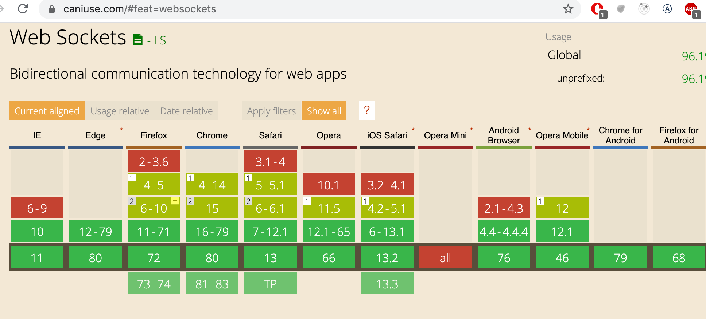
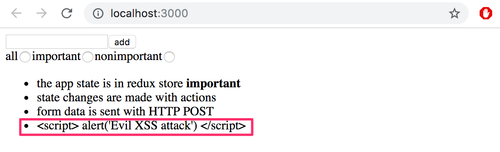
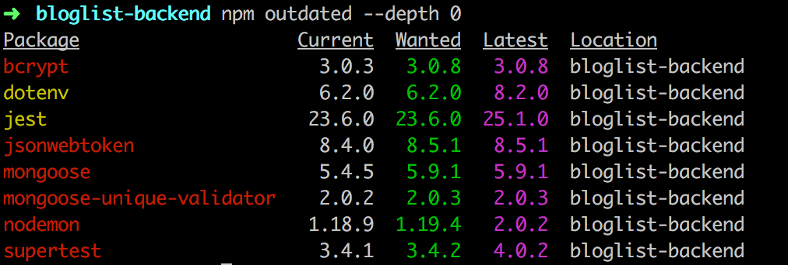
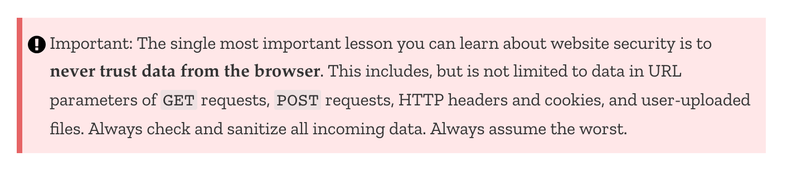

<div class="content">

### Luokkakomponentit

Olemme käyttäneet kurssilla ainoastaan Javascript-funktioina määriteltyjä React-komponentteja. Tämä ei ollut mahdollista ennen Reactiin versiossa 16.8. tullutta [hook](https://reactjs.org/docs/hooks-intro.html)-toiminnallisuutta, tällöin esimerkiksi tilaa käyttävät komponentit oli pakko määritellä käyttäen Javascriptin [Class](https://reactjs.org/docs/state-and-lifecycle.html#converting-a-function-to-a-class)-syntaksia.

Class-, eli luokkakomponentit on syytä tuntea ainakin jossain määrin, sillä maailmassa on suuri määrä vanhaa React-koodia, mitä ei varmaankaan koskaan tulla kokonaisuudessaan uudelleenkirjoittamaan uudella syntaksilla.

Tutustutaan nyt luokkakomponenttien tärkeimpiin ominaisuuksiin toteuttamalla jälleen kerran jo niin tuttu anekdoottisovellus. Talletetaan anekdootit <i>json-serveriä</i> hyödyntäen tiedostoon <i>db.json</i>. Tiedoston sisältö otetaan [täältä](https://github.com/fullstack-hy2020/misc/blob/master/anecdotes.json).

Luokkakomponentin ensimmäinen versio näyttää seuraavalta

```js
import React from 'react'

class App extends React.Component {
  constructor(props) {
    super(props)
  }

  render() {
    return (
      <div>
        <h1>anecdote of the day</h1>
      </div>
    )
  }
}

export default App
```

Komponentilla on nyt [konstruktori](https://reactjs.org/docs/react-component.html#constructor) missä ei toistaiseksi tehdä mitään sekä metodi [render](https://reactjs.org/docs/react-component.html#render). Kuten arvata saattaa, _render_ määrittelee sen miten komponentti piirtyy ruudulle.

Määritellään komponenttiin tila anekdoottien listalle sekä näkyvissä olevalle anekdootille. Toisin kuin [useState](https://reactjs.org/docs/hooks-state.html)-hookia käytettäessä, luokkakomponenteilla on ainoastaan yksi tila. Eli jos tila koostuu useista "osista", tulee osat tallettaa tilan kenttiin.  Tila alustetaan konstruktorissa:

```js
class App extends React.Component {
  constructor(props) {
    super(props)

    // highlight-start
    this.state = {
      anecdotes: [],
      current: 0
    }
    // highlight-end
  }

  render() {
    if (this.state.anecdotes.length === 0 ) { // highlight-line
      return <div>no anecdotes...</div>
    }

    return (
      <div>
        <h1>anecdote of the day</h1>
        <div>
          {this.state.anecdotes[this.state.current].content} // highlight-line
        </div>
        <button>next</button>
      </div>
    )
  }
}
```

Komponentin tila on siis instanssimuuttujassa _this.state_. Tila on olio, jolla on kaksi kenttää. <i>this.state.anecdotes</i> on anekdoottien lista ja <i>this.state.current</i> on näytettävän anekdootin indeksi.

Funktionaalisille komponenteille oikea paikka hakea palvelimella olevaa dataa ovat [effect hookit](https://reactjs.org/docs/hooks-effect.html). Effect hookit suoritetaan aina komponentin renderöitymisen yhteydessä tai tarvittaessa harvemmin, esim. ainoastaan ensimmäisen renderöinnin yhteydessä.

Luokkakomponenttien [elinkaarimetodit](https://reactjs.org/docs/state-and-lifecycle.html#adding-lifecycle-methods-to-a-class) tarjoavat vastaavan toiminnallisuuden. Oikea paikka käynnistää tietojen haku palvelimelta on  elinkaarimetodi [componentDidMount](https://reactjs.org/docs/react-component.html#componentdidmount), joka suoritetaan kertaalleen heti komponentin ensimmäisen renderöitymisen jälkeen:

```js
class App extends React.Component {
  constructor(props) {
    super(props)

    this.state = {
      anecdotes: [],
      current: 0
    }
  }

  // highlight-start
  componentDidMount = () => {
    axios.get('http://localhost:3001/anecdotes').then(response => {
      this.setState({ anecdotes: response.data })
    })
  }
  // highlight-end

  // ...
}
```

HTTP-pyynnön takaisinkutsufunktio päivittää komponentin tilaa metodilla [setState](https://reactjs.org/docs/react-component.html#setstate). Metodi toimii siten, että se koskee tilassa ainoastaan niihin avaimiin, mitä parametrina olevassa oliossa on määritelty. Avain <i>current</i> jää siis entiseen arvoonsa.

Metodin setState kutsuminen aiheuttaa aina luokkakomponentin uudelleenrenderöinnin, eli metodin _render_ kutsun.

Viimeistellään vielä komponentti siten, että näytettävä anekdootti on mahdollista vaihtaa. Seuraavassa koko komponentin koodi, lisäys korostettuna:

```js
class App extends React.Component {
  constructor(props) {
    super(props)

    this.state = {
      anecdotes: [],
      current: 0
    }
  }

  componentDidMount = () => {
    axios.get('http://localhost:3001/anecdotes').then(response => {
      this.setState({ anecdotes: response.data })
    })
  }

  // highlight-start
  handleClick = () => {
    const current = Math.floor(
      Math.random() * (this.state.anecdotes.length - 1)
    )
    this.setState({ current })
  }
  // highlight-end

  render() {
    if (this.state.anecdotes.length === 0 ) {
      return <div>no anecdotes...</div>
    }

    return (
      <div>
        <h1>anecdote of the day</h1>
        <div>{this.state.anecdotes[this.state.current].content}</div>
        <button onClick={this.handleClick}>next</button> // highlight-line
      </div>
    )
  }
}
```

Vertailun vuoksi sama sovellus funktionaalisena komponenttina:

```js
const App = () => {
  const [anecdotes, setAnecdotes] = useState([])
  const [current, setCurrent] = useState(0)

  useEffect(() =>{
    axios.get('http://localhost:3001/anecdotes').then(response => {
      setAnecdotes(response.data)
    })
  },[])

  const handleClick = () => {
    setCurrent(Math.round(Math.random() * (anecdotes.length - 1)))
  }

  if (anecdotes.length === 0) {
    return <div>no anecdotes...</div>
  }

  return (
    <div>
      <h1>anecdote of the day</h1>
      <div>{anecdotes[current].content}</div>
      <button onClick={handleClick}>next</button>
    </div>
  )
}
```

Esimerkkimme tapauksessa erot eivät ole suuret. Suurin ero funktionaalisissa ja luokkakompontenteissa lienee se, että luokkakomponentin tila on aina yksittäinen olio, ja tilaa muutetaan metodin _setState_ avulla kun taas funktionaalisessa komponentissa tila voi koostua useista muuttujista, joilla kaikilla on oma päivitysfunktio.

Hieman edistyneemmissä käyttöskenaarioissa effect hookit tarjoavat huomattavasti paremman mekanismin sivuvaikutusten hallintaan verrattuna luokkakomponenttien elinkaarimetodeihin.

Merkittävä etu funktionaalisille komponenttien käytössä on se, että paljon harmia tuottavaa Javascriptin olioon itseensä viittaavaa _this_-viitettä ei tarvitse käsitellä ollenkaan.

Oman ja suuren enemmistön mielestä luokkakomponenteilla ei ole oikeastaan mitään etuja hookeilla rikastettuihin funktionaalisiin komponentteihin verrattuna, poikkeuksen tähän muodostaa ns. [error boundary](https://reactjs.org/docs/error-boundaries.html) -mekanismi, joka ei ole toistaiseksi (16.2.2020) funktionaalisten komponenttien käytössä.

Kun kirjoitat uutta koodia, [ei siis ole mitään rationaalista syytä käyttää luokkakomponentteja](https://reactjs.org/docs/hooks-faq.html#should-i-use-hooks-classes-or-a-mix-of-both) jos projektissa on käytössä Reactista vähintään versio 16.8. Toisaalta kaikkea vanhaa Reactia [ei ole toistaiseksi mitään syytä uudelleenkirjoittaa](https://reactjs.org/docs/hooks-faq.html#do-i-need-to-rewrite-all-my-class-components) funktionaalisina komponentteina.

### React-sovelluksen koodin organisointi

Noudatimme useimmissa sovelluksissa periaatetta, missä komponentit sijoitettiin hakemistoon <i>components</i>, reducerit hakemistoon <i>reducers</i> ja palvelimen kanssa kommunikoiva koodi hakemistoon <i>services</i>. Tälläinen organisoimistapa riittää pienehköihin sovelluksiin, mutta komponenttien määrän kasvaessa tarvitaan muunlaisia ratkaisuja. Yhtä oikeaa tapaa ei ole, artikkeli [The 100% correct way to structure a React app (or why there’s no such thing)](https://hackernoon.com/the-100-correct-way-to-structure-a-react-app-or-why-theres-no-such-thing-3ede534ef1ed)
tarjoaa näkökulmia aiheeseen.

### Frontti ja backend samassa repositoriossa

Olemme kurssilla tehneet frontendin ja backendin omiin repositorioihinsa. Kyseessä on varsin tyypillinen ratkaisu. Teimme tosin deploymentin [kopioimalla](/osa3#staattisten-tiedostojen-tarjoaminen-backendistä) frontin bundlatun koodin backendin repositorion sisälle. Toinen, ehkä järkevämpi tilanne olisi ollut deployata frontin koodi erikseen, create-react-appilla tehtyjen sovellusten osalta se on todella helppoa oman [buildpackin](https://github.com/mars/create-react-app-buildpack) ansiosta.

Joskus voi kuitenkin olla tilanteita, missä koko sovellus halutaan samaan repositorioon. Tällöin yleinen ratkaisu on sijoittaa <i>package.json</i> ja <i>webpack.config.js</i> hakemiston juureen ja frontin sekä backendin koodi omiin hakemistoihinsa, esim. <i>client</i> ja <i>server</i>.

Erään hyvän lähtökohdan yksirepositorioisen koodin organisoinnille antaa [täällä](https://github.com/fullstack-hy2020/create-app) oleva repositorio.

### Palvelimella tapahtuvat muutokset

Jos palvelimella olevassa tilassa tapahtuu muutoksia, esim. blogilistapalveluun lisätään uusia blogeja muiden käyttäjien toimesta, tällä kurssilla tekemämme React-frontendit eivät huomaa muutoksia ennen sivujen uudelleenlatausta. Vastaava tilanne tulee eteen, jos frontendistä käynnistetään jotain kauemmin kestävää laskentaa backendiin, miten laskennan tulokset saadaan heijastettua frontediin?

Eräs tapa on suorittaa frontendissa [pollausta](<https://en.wikipedia.org/wiki/Polling_(computer_science)>), eli toistuvia kyselyitä backendin APIin esim. [setInterval](https://developer.mozilla.org/en-US/docs/Web/API/WindowOrWorkerGlobalScope/setInterval)-komennon avulla.

Edistyneempi tapa on käyttää [WebSocketeja](https://developer.mozilla.org/en-US/docs/Web/API/WebSockets_API), joiden avulla on mahdollista muodostaa kaksisuuntainen kommunikaatiokanava selaimen ja palvelimen välille. Tällöin frontendin ei tarvitse pollata backendia, riittää määritellä takaisinkutsufunktiot tilanteisiin, joissa palvelin lähettää WebSocketin avulla tietoja tilan päivittämisestä.

WebSocketit ovat selaimen tarjoama rajapinta, jolla ei kuitenkaan ole kaikille selaimille vielä täyttä tukea:



WebSocket API:n suoran käyttämisen sijaan onkin suositeltavaa käyttää [Socket.io](https://socket.io/)-kirjastoa, joka tarjoaa erilaisia automaattisia <i>fallback</i>-mahdollisuuksia, jos käytettävässä selaimessa ei ole täyttä WebSocket-tukea.

[Osan 8](/osa8) aiheena GraphQL, joka tarjoaa valmiin toiminnallisuuden palvelimella tapahtuvien muutosten synkronoimiseksi muutoksista kiinnostuneihin frontendeihin.

### Virtual DOM

Reactin yhteydessä mainitaan usein käsite Virtual DOM. Mistä oikein on kyse? Kuten [osassa 0](/osa0/web_sovelluksen_toimintaperiaatteita#document-object-model-eli-dom) mainittiin, selaimet tarjoavat [DOM API](https://developer.mozilla.org/fi/docs/DOM):n, jota hyväksikäyttäen selaimessa toimiva Javascript voi muokata sivun ulkoasun määritteleviä elementtejä.

Reactia käyttäessä ohjelmoija ei koskaan (tai parempi sanoa yleensä) manipuloi DOM:ia suoraan. React-komponenttin määrittelevä funktio palauttaa joukon [React-elementtejä](https://reactjs.org/docs/glossary.html#elements). Vaikka osa elementeistä näyttää normaaleilta HTML-elementeiltä

```js
const element = <h1>Hello, world</h1>
```

eivät nekään ole HTML:ää vaan pohjimmiltaan Javascriptiä olevia React-elementtejä.

Sovelluksen komponenttien ulkoasun määrittelevät React-elementit muodostavat [Virtual DOM:in](https://reactjs.org/docs/faq-internals.html#what-is-the-virtual-dom), joka pidetään suorituksen aikana keskusmuistissa.

[ReactDOM](https://reactjs.org/docs/react-dom.html)-kirjaston avulla komponenttien määrittelevä virtuaalinen DOM renderöidään oikeaksi DOM:iksi eli DOM API:n avulla selaimen näytettäväksi:

```js
ReactDOM.render(
  <App />,
  document.getElementById('root')
)
```

Kun sovelluksen tila muuttuu, määrittyy komponenttien renderöinnin takia <i>uusi virtuaalinen DOM</i>. Reactilla on edellinen versio virtual DOM:ista muistissa ja sensijaan että uusi virtuaalinen DOM renderöitäisiin suoraviivaisesti DOM API:n avulla, React laskee mikä on optimaalisin tapa tehdä DOM:iin muutoksia (eli poistaa, lisätä ja muokata DOM:issa olevia elementtejä) siten, että DOM saadaan vastaamaan uutta Virtual DOM:ia.

### Reactin roolista sovelluksissa

Materiaalissa ei ole tuotu ehkä riittävän selkeästi esille sitä, että React on ensisijaisesti tarkoitettu näkymien luomisesta huolehtivaksi kirjastoksi. Jos ajatellaan perinteistä [Model View Controller](https://en.wikipedia.org/wiki/Model%E2%80%93view%E2%80%93controller) -jaottelua, on Reactin toimialaa juurikin <i>View</i>. React on siis sovellusalueeltaan suppeampi kuin esim. [Angular](https://angular.io/), joka on kaiken tarjoava Frontendin MVC-sovelluskehys. Reactia ei kutsutakaan sovelluskehykseksi (framework) vaan <i>kirjastoksi</i> (library).

Pienissä sovelluksissa React-komponenttien tilaan talletetaan sovelluksen käsittelemää dataa, eli komponenttien tilan voi näissä tapauksissa ajatella vastaavan MVC:n <i>modeleita</i>.

React-sovellusten yhteydessä ei kuitenkaan yleensä puhuta MVC-arkkitehtuurista ja jos käytössä on Redux niin silloin sovellukset noudattavat [Flux](https://facebook.github.io/flux/docs/in-depth-overview.html#content)-arkkitehtuuria ja Reactin rooliksi jää entistä enemmän pelkkä näkymien muodostaminen. Varsinainen sovelluslogiikka hallitaan Reduxin tilan ja action creatorien avulla. Jos käytössä on osasta 6 tuttu [redux thunk](/osa6/redux_sovelluksen_kommunikointi_palvelimen_kanssa#asynkroniset-actionit-ja-redux-thunk), on sovelluslogiikka mahdollista eristää lähes täysin React-koodista.

Koska sekä React että [Flux](https://facebook.github.io/flux/docs/in-depth-overview.html#content) ovat Facebookilla syntyneinä, voi ajatella, että Reactin pitäminen ainoastaan käyttöliittymästä huolehtivana kirjastona on sen oikeaoppista käyttöä. Flux-arkkitehtuurin noudattaminen tuo sovelluksiin tietyn overheadin ja jos on kyse pienestä sovelluksesta tai prototyypistä, saattaa Reactin "väärinkäyttäminen" olla järkevää, sillä myöskään [overengineering](https://en.wikipedia.org/wiki/Overengineering) ei yleensä johda optimaaliseen tulokseen.

Kuten [osan 6](/osa6/connect#redux-ja-komponenttien-tila) lopussa mainittiin, Reactin [Context-api](https://reactjs.org/docs/context.html) tarjoaa erään vaihtoehtoisen tavan keskitetylle tilan hallinnalle ilman tarvetta ulkoisille kirjastoille kuten reduxille. Katso lisää esim. [täällä](https://www.simplethread.com/cant-replace-redux-with-hooks/) ja [täällä](https://hswolff.com/blog/how-to-usecontext-with-usereducer/).

### React/node-sovellusten tietoturva

Emme ole vielä maininneet kurssilla sanaakaan tietoturvaan liittyen. Kovin paljon ei nytkään ole aikaa, ja onneksi laitoksella on MOOC-kurssi [Securing Software](https://cybersecuritybase.mooc.fi/module-2.1) tähän tärkeään aihepiiriin.

Katsotaan kuitenkin muutamaa kurssispesifistä seikkaa.

The Open Web Application Security Project eli [OWASP](https://www.owasp.org) julkaisee vuosittain listan Websovellusten yleisimmistä turvallisuusuhista. Tuorein lista on [täällä](https://owasp.org/www-project-top-ten/). Samat uhat ovat listalla vuodesta toiseen.

Listaykkösenä on <i>injection</i>, joka tarkoittaa sitä, että sovellukseen esim. lomakkeen avulla lähetettävä teksti tulkitaankin aivan eri tavalla kun sovelluskehittäjä on tarkoittanut. Kuuluisin injektioiden muoto lienevät [SQL-injektiot](https://stackoverflow.com/questions/332365/how-does-the-sql-injection-from-the-bobby-tables-xkcd-comic-work).

Esim. jos ei-turvallisessa koodissa tehtäisiin seuraavasti muotoiltu SQL-kysely:

```js
let query = "SELECT * FROM Users WHERE name = '" + userName + "';"
```

Oletetaan että hieman ilkeämielinen käyttäjä <i>Arto Hellas</i> nyt määrittelisi nimekseen

<pre>
Arto Hell-as'; DROP TABLE Users; --
</pre>

eli nimi sisältäisi hipsun <code>'</code>, jonka on SQL:ssä merkkijonon aloitus/lopetusmerkki. Tämän seurauksena tulisi suoritetuksi kaksi SQL-operaatiota, joista jälkimmäinen tuhoaisi tietokantataulun <i>Users</i>

```sql
SELECT * FROM Users WHERE name = 'Arto Hell-as'; DROP TABLE Users; --'
```

SQL-injektiot estetään [sanitoimalla](https://security.stackexchange.com/questions/172297/sanitizing-input-for-parameterized-queries) syöte, eli tarkastamalla, että kyselyjen parametrit eivät sisällä kiellettyjä merkkejä, kuten tässä tapauksessa hipsuja. Jos kiellettyjä merkkejä löytyy, ne korvataan turvallisilla vastineilla [escapettamalla](https://en.wikipedia.org/wiki/Escape_character#JavaScript).

Myös NoSQL-kantoihin tehtävät injektiohyökkäykset ovat mahdollisia. Mongoose kuitenkin estää ne [sanitoimalla](https://zanon.io/posts/nosql-injection-in-mongodb) kyselyt. Lisää aiheesta esim. [täällä](https://blog.websecurify.com/2014/08/hacking-nodejs-and-mongodb.html).

<i>Cross-site scripting eli XSS</i> on hyökkäys, missä sovellukseen on mahdollista injektoida suoritettavaksi vihollismielistä Javascript-koodia. Jos kokeilemme injektoida esim. muistiinpanosovellukseen seuraavan

```html
<script>
  alert('Evil XSS attack')
</script>
```

koodia ei suoriteta, vaan koodi renderöityy sivulle 'tekstinä':



sillä React [huolehtii muuttujissa olevan datan sanitoinnista](https://reactjs.org/docs/introducing-jsx.html#jsx-prevents-injection-attacks). Reactin jotkut versiot [ovat mahdollistaneet](https://medium.com/dailyjs/exploiting-script-injection-flaws-in-reactjs-883fb1fe36c1) XSS-hyökkäyksiä, aukot on toki korjattu, mutta mikään ei takaa etteikö niitä voisi vielä löytyä.

Käytettyjen kirjastojen suhteen tuleekin olla tarkkana, jos niihin tulee tietoturvapäivityksiä, on kirjastot syytä päivittää omissa sovelluksissa. Expressin tietoturvapäivitykset löytyvät [kirjaston dokumentaatiosta](https://expressjs.com/en/advanced/security-updates.html) ja Nodeen liittyvät [blogista](https://nodejs.org/en/blog/).

Riippuvuuksien ajantasaisuuden voi testata komennolla

```bash
npm outdated --depth 0
```

Viime vuoden mallivastaus osan 4 tehtäväsarjaan sisältää jo aika paljon vanhentuneita riippuvuuksia:



Riippuvuudet saa ajantasaistettua päivittämällä tiedostoa <i>package.json</i> ja suorittamalla komennon _npm install_. Riippuvuuksien vanhat versiot eivät tietenkään välttämättä ole tietoturvariski.

Riippuvuuksien turvallisuus voidaan tarkistaa npm:n [audit](https://docs.npmjs.com/cli/audit)-komennolla, joka vertaa käytettyjen riippuvuuksien versioita keskitetyssä virhetietokannassa listattuihin tietoturvauhan sisältäviin riippuvuuksien versioihin.

Komennon _npm audit_ suorittaminen viime vuoden osan 4 mallivastaukselle antaa pitkän listan valituksia ja korjausehdotuksia. Seuraavassa osa raportista:


```js
$ bloglist-backend npm audit

                       === npm audit security report ===

# Run  npm install --save-dev jest@25.1.0  to resolve 62 vulnerabilities
SEMVER WARNING: Recommended action is a potentially breaking change
┌───────────────┬──────────────────────────────────────────────────────────────┐
│ Low           │ Regular Expression Denial of Service                         │
├───────────────┼──────────────────────────────────────────────────────────────┤
│ Package       │ braces                                                       │
├───────────────┼──────────────────────────────────────────────────────────────┤
│ Dependency of │ jest [dev]                                                   │
├───────────────┼──────────────────────────────────────────────────────────────┤
│ Path          │ jest > jest-cli > jest-config > babel-jest >                 │
│               │ babel-plugin-istanbul > test-exclude > micromatch > braces   │
├───────────────┼──────────────────────────────────────────────────────────────┤
│ More info     │ https://npmjs.com/advisories/786                             │
└───────────────┴──────────────────────────────────────────────────────────────┘


┌───────────────┬──────────────────────────────────────────────────────────────┐
│ Low           │ Regular Expression Denial of Service                         │
├───────────────┼──────────────────────────────────────────────────────────────┤
│ Package       │ braces                                                       │
├───────────────┼──────────────────────────────────────────────────────────────┤
│ Dependency of │ jest [dev]                                                   │
├───────────────┼──────────────────────────────────────────────────────────────┤
│ Path          │ jest > jest-cli > jest-runner > jest-config > babel-jest >   │
│               │ babel-plugin-istanbul > test-exclude > micromatch > braces   │
├───────────────┼──────────────────────────────────────────────────────────────┤
│ More info     │ https://npmjs.com/advisories/786                             │
└───────────────┴──────────────────────────────────────────────────────────────┘


┌───────────────┬──────────────────────────────────────────────────────────────┐
│ Low           │ Regular Expression Denial of Service                         │
├───────────────┼──────────────────────────────────────────────────────────────┤
│ Package       │ braces                                                       │
├───────────────┼──────────────────────────────────────────────────────────────┤
│ Dependency of │ jest [dev]                                                   │
├───────────────┼──────────────────────────────────────────────────────────────┤
│ Path          │ jest > jest-cli > jest-runner > jest-runtime > jest-config > │
│               │ babel-jest > babel-plugin-istanbul > test-exclude >          │
│               │ micromatch > braces                                          │
├───────────────┼──────────────────────────────────────────────────────────────┤
│ More info     │ https://npmjs.com/advisories/786                             │
└───────────────┴──────────────────────────────────────────────────────────────┘

...

found 416 vulnerabilities (65 low, 2 moderate, 348 high, 1 critical) in 20047 scanned packages
  run `npm audit fix` to fix 354 of them.
  62 vulnerabilities require semver-major dependency updates.
```


Reilun vuoden ikäinen koodi on siis täynnä pieniä tietoturvauhkia, kriittisiä uhkia on onneksi ainoastaan 1. Suoritetaan raportin suosittelema operaatio _npm audit fix_:

```js
$ bloglist-backend npm audit fix

+ mongoose@5.9.1
added 19 packages from 8 contributors, removed 8 packages and updated 15 packages in 7.325s
fixed 354 of 416 vulnerabilities in 20047 scanned packages
  1 package update for 62 vulns involved breaking changes
  (use `npm audit fix --force` to install breaking changes; or refer to `npm audit` for steps to fix these manually)
```

Haavoittuvuuksia jää vielä 62, sillä _audit fix_ ei tee oletusarvoisesti versiopäivitystä kirjastolle, jonka <i>major</i>-versionumero on kasvanut. Tälläisen riippuvuuden päivitys saattaa aiheuttaa sovelluksen hajoamisen. Ongelmat aiheuttaa testauskirjasto jestin versio, joka on sovelluksessa 23.6.0 kun taas turvallinen versio olisi 25.1.0. Koska jest on ainoastaan kehitysaikainen riippuvuus, ei vaaraa oikeastaan ole, mutta päivitetään myös se:

```js
npm install --save-dev jest@25.1.0 
```

Päivityksen jälkeen tilanne näyttää hyvältä

```js
 $ blogs-backend npm audit

                       === npm audit security report ===

found 0 vulnerabilities
 in 1204443 scanned packages
```                                                                    

Eräs OWASP:in listan mainitsemista uhista on <i>Broken Authentication</i> ja siihen liittyvä <i>Broken Access Control</i>. Käyttämämme token-perustainen autentikointi on kohtuullisen robusti, jos sovellusta käytetään tietoliikenteen salaavalla HTTPS-protokollalla. Access Controlin eli pääsynhallinnan toteuttamisessa on aina syytä muistaa tehdä esim. käyttäjän identiteetin tarkastus selaimen lisäksi myös palvelimella. Huonoa tietoturvaa olisi estää jotkut toimenpiteet ainoastaan piilottamalla niiden suoritusmahdollisuus selaimessa olevasta koodista.

Mozillan MDN:n erittäin hyvä [Website security -guide](https://developer.mozilla.org/en-US/docs/Learn/Server-side/First_steps/Website_security) nostaakin esiin tämän tärkeän seikan:



Expressin dokumentaatio sisältää tietoturvaa käsittelevän osan [Production Best Practices: Security](https://expressjs.com/en/advanced/best-practice-security.html) joka kannattaa lukea läpi. Erittäin suositeltavaa on ottaa backendissa käyttöön [Helmet](https://helmetjs.github.io/)-kirjasto, joka sisältää joukon Express-sovelluksista tunnettuja turvallisuusriskejä eliminoivia middlewareja.

Myös ESlintin [security-pluginin](https://github.com/nodesecurity/eslint-plugin-security) käyttöönotto kannattaa.

### Tämän päivän trendejä

Katsotaan vielä lopuksi muutamaa huomisen tai oikeastaan jo tämän päivän tekniikkaa, ja suuntia joihin Web-sovelluskehitys on kulkemassa.

#### Javascriptin tyypitetyt versiot

Javascriptin muuttujien [dynaaminen tyypitys](https://developer.mozilla.org/en-US/docs/Glossary/Dynamic_typing) aiheuttaa välillä ikäviä bugeja. Osassa 5 käsittelimme lyhyesti [PropTypejä](/osa5/props_children_ja_proptypet#prop-types), eli mekanismia, jonka avulla React-komponenteille välitettävile propseille on mahdollista tehdä tyyppitarkastuksia.

Viime aikoina on ollut havaittavissa nousevaa kiinnostusta [staattiseen tyypitykseen](https://en.wikipedia.org/wiki/Type_system#Static_type_checking). Tämän hetken suosituin Javascriptin tyypitetty versio on Microsoftin kehittämä [Typescript](https://www.typescriptlang.org/). Huhtikuun alussa ilmestyvä [osa 9](/osa9) tulee käsittelemään Typescriptiä!

#### Server side rendering, isomorfiset sovellukset ja universaali koodi

Selain ei ole ainoa paikka missä Reactilla määriteltyjä komponentteja voidaan renderöidä. Renderöinti on mahdollista tehdä myös [palvelimella](https://reactjs.org/docs/react-dom-server.html). Tätä hyödynnetäänkin nykyään enenevissä määrin siten, että kun sovellukseen tullaan ensimmäistä kertaa, lähettää palvelin selaimeen jo valmiiksi renderöimänsä Reactilla muodostetun sivun. Tämän jälkeen sovelluksen toiminta jatkuu normaaliin tapaan, eli selain suorittaa Reactia, joka manipuloi selaimen näyttämää DOM:ia. Palvelimella tapahtuvasta renderöinnistä käytetään englanninkielistä nimitystä <i>server side rendering</i>.

Eräs motivaatio server side renderingille on Search Engine Optimization eli SEO. Hakukoneet ovat ainakin perinteisesti olleet huonoja tunnistamaan selaimessa Javascriptillä renderöityä sisältöä, ajat saattavat tosin olla muuttumassa, ks. esim. [tämä](https://www.javascriptstuff.com/react-seo/) ja [tämä](https://medium.freecodecamp.org/seo-vs-react-is-it-neccessary-to-render-react-pages-in-the-backend-74ce5015c0c9).

Server side rendering ei tietenkään ole mikään React- tai edes Javascript-spesifi asia, saman ohjelmointikielen käyttö kaikkialla koodissa tekee konseptista teoriassa helpommin toteutettavan, sillä samaa koodia voidaan suorittaa sekä backendissä että frontendissä.

Palvelimella tapahtuvaan renderöintiin liittyen on alettu puhua <i>isomorfisista sovelluksista</i> ja <i>universaalista koodista</i>, termien määritelmistä on kiistelty. Joidenkin [määritelmien](https://medium.com/@ghengeveld/isomorphism-vs-universal-javascript-4b47fb481beb) mukaan isomorfinen web-sovellus on sellainen, joka suorittaa renderöintiä sekä selaimessa että backendissa. Universaalinen koodi taas on koodia, joka voidaan suorittaa useimmissa ympäristöissä eli sekä selaimessa että backendissä.

React ja Node tarjoavatkin varteenotettavan vaihtoehdon isomorfisten sovellusten toteuttamiseen universaalina koodina.

Universaalin koodin kirjoittaminen suoraan Reactin avulla on vielä toistaiseksi melko vaivalloista. Viime aikoina paljon huomiota saanut Reactin päälle toteutettu [Next.js](https://github.com/zeit/next.js/)-kirjasto on hyvä vaihtoehto universaalien sovellusten tekemiseen.

#### Progressive web apps

Viime aikona on myös ruvettu käyttämään Googlen lanseeraamaa termiä [progressive web app](https://developers.google.com/web/progressive-web-apps/) (PWA). Googlen sivuilla oleva määritelmä kuulostaa markkinapuheelta ja sen perusteella on hankala saada selkeää käsitystä mistä on kyse. [Checklista](https://developers.google.com/web/progressive-web-apps/checklist) tuo mukaan konkretiaa.

Tiiviistäen kyse on web-sovelluksista, jotka toimivat mahdollisimman hyvin kaikilla alustoilla ottaen jokaisesta alustasta irti sen parhaat puolet. Mobiililaitteiden pienempi näyttö ei saa heikentää sovellusten käytettävyyttä. PWA-sovellusten tulee myös toimia offline-tilassa tai hitaalla verkkoyhteydellä moitteettomasti. Mobiililaitteilla ne tulee pystyä asentamaan normaalien sovellusten tavoin. Kaiken PWA-sovellusten käyttämän verkkoliikenteen tulee olla salattua.

create-react-app:illa luodut sovellukset ovat oletusarvoisesti [progressiivisia](https://github.com/facebookincubator/create-react-app/blob/master/packages/react-scripts/template/README.md#making-a-progressive-web-app). Jos sovellus käyttää palvelimella olevaa dataa, edellyttää sovelluksen progressiiviseksi tekeminen vaivan näkemistä. Offline-toiminnallisuus toteutetaan yleensä [service workerien](https://developer.mozilla.org/en-US/docs/Web/API/Service_Worker_API) avulla.

#### Mikropalveluarkkitehtuuri

Tällä kurssilla olemme tehneet palvelinpuolelle ainoastaan matalan pintaraapaisun. Sovelluksissamme on ollut korkeintaan muutaman API-endpointin tarjoava <i>monoliittinen</i> eli yhdellä palvelimella pyörivä kokonaisuuden muodostava backend.

Sovelluksen kasvaessa suuremmaksi monoliittisen backendin malli alkaa muuttua ongelmalliseksi niin suorituskyvyn kuin jatkokehitettävyydenkin kannalta.

[Mikropalveluarkkitehtuurilla](https://martinfowler.com/articles/microservices.html) (microservice) tarkoitetaan tapaa koostaa sovelluksen backend useista erillisistä autonomisista palveluista, jotka kommunikoivat keskenään verkon yli. Yksittäisen mikropalvelun on tarkoituksena hoitaa tietty looginen toiminnallinen kokonaisuus. Puhdasoppisessa mikropalveluarkkitehtuurissa palvelut eivät käytä jaettua tietokantaa.

Esim. blogilistasovelluksen voisi koostaa kahdesta palvelusta, toinen huolehtisi käyttäjistä ja toinen blogeista. Käyttäjäpalvelun vastuulla olisi käyttäjätunnusten luominen ja käyttäjien autentikointi, blogipalvelu taas huolehtisi blogeihin liittyvistä toimista.

Seuraava kuva havainnollistaa mikropalveluarkkitehtuuriin perustuvan sovelluksen rakennetta perinteiseen monoliittiseen rakenteeseen verrattuna:


Frontendin (kuvassa neliöitynä) rooli ei välttämättä poikkea malleissa kovinkaan paljoa, mikropalveluiden ja frontendin välissä on usein [API gateway](http://microservices.io/patterns/apigateway) joka tarjoaa frontendille perinteisen kaltaisen, "yhdessä palvelimessa" olevan näkymän backendiin, esim. [Netflix](https://medium.com/netflix-techblog/optimizing-the-netflix-api-5c9ac715cf19) käyttää tätä ratkaisua.

Mikropalveluarkkitehtuurit ovat syntyneet ja kehittyneet suurten internetskaalan sovellusten tarpeisiin. Trendin aloitti Amazon jo kauan ennen termin microservice lanseeraamista. Tärkeä lähtölaukaus oli CEO Jeff Bezosin vuonna 2002 kaikille työntekijöille lähettämä email:

> All teams will henceforth expose their data and functionality through service interfaces.
>
> Teams must communicate with each other through these interfaces.
>
> There will be no other form of inter-process communication allowed: no direct linking, no direct reads of another team’s data store, no shared-memory model, no back-doors whatsoever. The only communication allowed is via service interface calls over the network.
>
> It doesn’t matter what technology you use.
>
> All service interfaces, without exception, must be designed from the ground up to be externalize-able. That is to say, the team must plan and design to be able to expose the interface to developers in the outside world.
>
> No exceptions.
>
> Anyone who doesn’t do this will be fired. Thank you; have a nice day!

Nykyään eräs vahvimmista suunnannäyttäjistä mikropalveluiden suhteen on [Netflix](https://www.infoq.com/presentations/netflix-chaos-microservices).

Mikropalveluista on pikkuhiljaa tullut hype, tämän ajan [silver bullet](https://en.wikipedia.org/wiki/No_Silver_Bullet), jota yritetään tarjota ratkaisuiksi lähes kaikkiin ongelmiin. Mikropalveluarkkitehtuurin soveltamiseen liittyy kuitenkin suuri määrä haasteita ja voi olla järkevämpi lähteä liikeelle [monolith first](https://martinfowler.com/bliki/MonolithFirst.html), eli tehdä aluksi perinteinen kaiken sisältävä backend. Tai sitten [ei](https://martinfowler.com/articles/dont-start-monolith.html). Mielipiteitä on monenlaisia. Molemmat linkit johtavat Martin Fowlerin sivuille, eli viisaimmatkaan eivät ole ihan varmoja kumpi näistä oikeista tavoista on oikeampi.

Emme voi valitettavasti syventyä tällä kurssilla tähän tärkeään aihepiiriin tämän tarkemmin. Jo pintapuolinenkin käsittely vaatisi ainakin 5 viikkoa lisää aikaa.

Katso [täältä](https://www.youtube.com/watch?v=BZexOyQZMMc&list=PLumQiZ25uijis31zaRL7rhzLalSwLqUtm%27) Sympa Oy:n Panu Vartiaisen pitämä mikropalveluita käsittelevä vierailuluento.

#### Serverless

Loppuvuodesta 2014 tapahtuneen Amazonin [lambda](https://aws.amazon.com/lambda/)-palvelun julkaisun jälkeen alkoi web-sovellusten kehittämiseen nousta jälleen uusi trendi, [serverless](https://serverless.com/).

Kyse on siitä, että lambda ja nyttemmin Googlen [Cloud functions](https://cloud.google.com/functions/) ja [Azuren vastaava toiminnallisuus](https://azure.microsoft.com/en-us/services/functions/) mahdollistavat <i>yksittäisten funktioiden suorittamisen</i> pilvessä, kun ennen tätä pienin pilvessä suoritettava yksikkö oli käytännössä yksittäinen <i>prosessi</i>, eli esim. Node-backendiä suorittava ajoympäristö.

Esim. Amazonin [API-gateway](https://aws.amazon.com/api-gateway/):n avulla on mahdollista tehdä "palvelimettomia" sovelluksia, missä määritellyn HTTP API:n kutsuihin vastataan suoraan pilvifunktioilla. Funktiot yleensä operoivat jo valmiiksi pilvipalvelun tietokantoihin talletetun datan avulla.

Serverlessissä ei siis ole kyse siitä että sovelluksissa ei olisi palvelinta, vaan tavasta määritellä palvelin. Sovelluskehittäjät voivat siirtyä ohjelmoinnissa korkeammalle abstraktiotasolle, ei ole enää tarvetta määritellä ohjelmallisesti HTTP-kutsujen reitityksiä, tietokantayhteyksiä ym., pilvi-infrastruktuuri tarjoaa kaiken tämän. Pilvifunktioilla on myös mahdollista saada helposti aikaan hyvin skaalautuvia järjestelmiä, esim. Amazon Lambda pystyy suorittamaan massiivisen määrän pilvifunktioita sekunnissa. Kaikki tämä tapahtuu infrastruktuurin toimesta automaattisesti, ei ole tarvetta käynnistellä uusia palvelimia ym.

### Hyödyllisiä kirjastoja ja mielenkiintoisia linkkejä

Javasciptin kehittäjäyhteisö on tuottanut valtavan määrän erilaisia hyödyllisiä kirjastoja ja jos olet koodaamassa
 jotain vähänkin isompaa, kannattaa etsiä mitä valmista kalustoa on jo tarjolla. Eräs hyvä paikka kirjastojen etsimiseen on https://applibslist.xyz/. Seuraavassa listataan muutamia luotettavien tahojen hyväksi havaitsemia kirjastoja.

Jos sovelluksessa on tarve operoida hieman monimutkaisemman datan kanssa, on jo [osassa 4](/osa4/sovelluksen_rakenne_ja_testauksen_alkeet#tehtavat-4-3-4-7) suositeltu kirjasto [lodash](https://www.npmjs.com/package/lodash) hyvä lisä. Jos olet mieltynyt funktionaaliseen ohjelmointityyliin, kannattaa harkita [ramda](https://ramdajs.com/):n käyttöä.

Jos sovelluksessa käsitellään aikaa, esimerkiksi [date-fns](https://github.com/date-fns/date-fns)-kirjasto tarjoaa siihen hyvän välineistön.

Lomakkeiden käyttöä helpottavia kirjastoja ovat [Formik](https://www.npmjs.com/package/formik) ja [redux-form](https://redux-form.com/8.3.0/). Jos sovelluksessa tulee piirtää graafeja, on vaihtoehtoja lukuisia, sekä [recharts](http://recharts.org/en-US/) että [highcharts](https://github.com/highcharts/highcharts-react) ovat hyviksi havaittuja.

[Immer](https://github.com/mweststrate/immer) tarjoaa muutamista tietorakenteista <i>muuttumattomia</i> toteutuksia. Kirjastosta voi olla hyötyä Reduxia käytettäessä, sillä kuten osasta 6 [muistamme](/osa6/flux_arkkitehtuuri_ja_redux#puhtaat-funktiot-immutable) reducerien on oltava puhtaita funktioita eli ne eivät saa muuttaa storen tilaa vaan niiden on korvattava se muutostilanteissa uudella. 

[Redux-saga](https://redux-saga.js.org/) tarjoaa osassa 6 käsitellylle [redux thunkille](/osa6/redux_sovelluksen_kommunikointi_palvelimen_kanssa#asynkroniset-actionit-ja-redux-thunk) vaihtoehtoisen tavan tehdä asynkronisia actioneja. Jotkut hypettää ja tykkää, itse en.

Single page -sovelluksissa analytiikkatietojen kerääminen käyttäjien sivuston kanssa käymästä vuorovaikutuksesta on [haastavampaa](https://developers.google.com/analytics/devguides/collection/analyticsjs/single-page-applications) kuin perinteisissä, kokonaiseen sivun lataamiseen perustuvissa web-sovelluksissa. [React Google Analytics](https://github.com/react-ga/react-ga) -kirjasto tuo tähän avun.

Voit hyödyntää React-osaamistasi myös mobiilisovellusten toteuttamiseen Facebookin erittäin suositun [React Native](https://facebook.github.io/react-native/) -kirjaston avulla.

Javascript-projektien projektinhallintaan ja bundlaamiseen käytettyjen työkalujen rintamalla on ollut tuulista, best practicet ovat vaihdelleet nopeasti (vuosiluvut ovat suuntaa-antavia, kukaan ei enää muista noin kauas menneisyyteen):

- 2011 [Bower](https://www.npmjs.com/package/bower)
- 2012 [Grunt](https://www.npmjs.com/package/grunt)
- 2013-14 [Gulp](https://www.npmjs.com/package/gulp)
- 2012-14 [Browserify](https://www.npmjs.com/package/browserify)
- 2015- [Webpack](https://www.npmjs.com/package/webpack)

Hipsterien suurin into työkalukehitykseen näytti pysähtyneen webpackin vallattua markkinat. Pari vuotta sitten markkinoille ilmestyi uusi tulokas [Parcel](https://parceljs.org), joka markkinoi olevansa yksinkertainen, sitähän Webpack ei missään nimessä ole, ja paljon nopeampi kuin Webpack. Lupaavan alun jälkeen Parcel ei kuitenkaan ole jatkanut nostettaan, ja vaikuttaa että siitä ei kuitenkaan ole Webpackin tappajaksi.

Sivu <https://reactpatterns.com/> tarjoaa tiiviissä muodossa listan parhaita react-käytänteitä, joista osa on jo tältäkin kurssilta tuttuja. Toinen samankaltainen lista on [react bits](https://vasanthk.gitbooks.io/react-bits/).

[Reactiflux](https://www.reactiflux.com/) taas on suuri englanninkielinen React-kehittäjien keskusteluyhteisö Discordissa. Se voi olla yksi mahdollinen paikka saada tukea kurssin päättymisen jälkeen. Esimerkiksi useille kirjastoille löytyyy kokonaan omat keskustelukanavat.

Jos tiedät jotain suositeltavia linkkejä tai kirjastoja, tee pull request!

</div>
