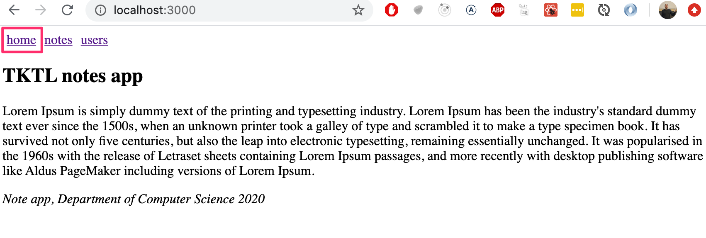
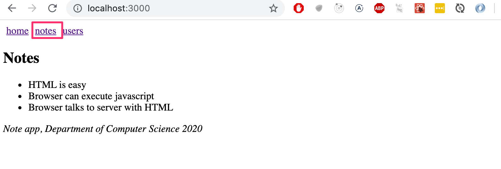
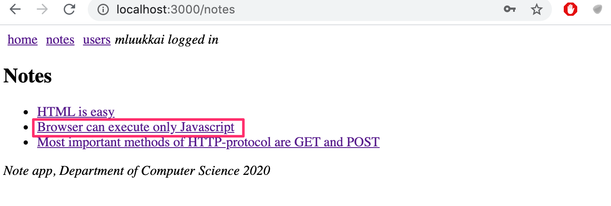
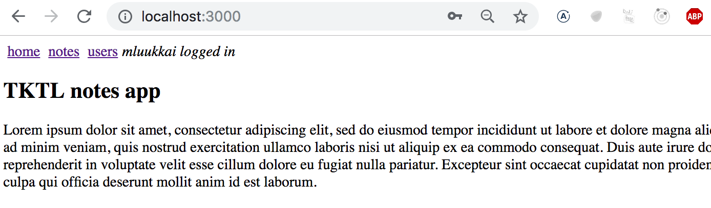
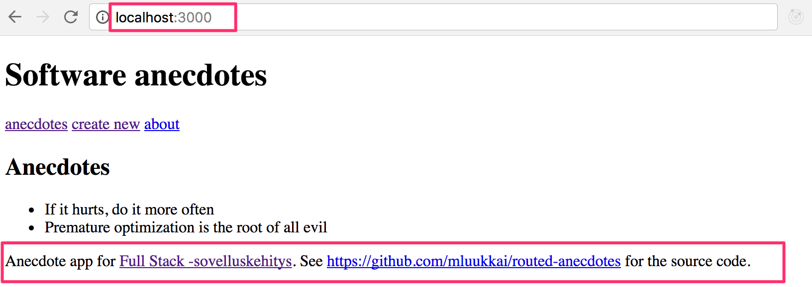
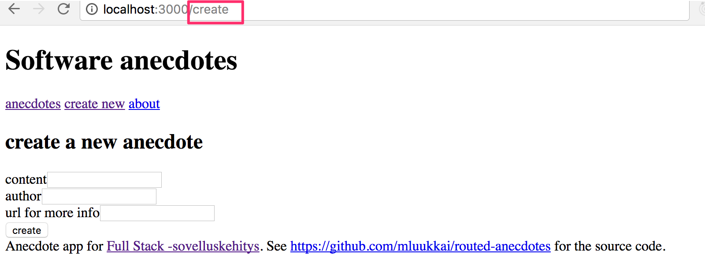
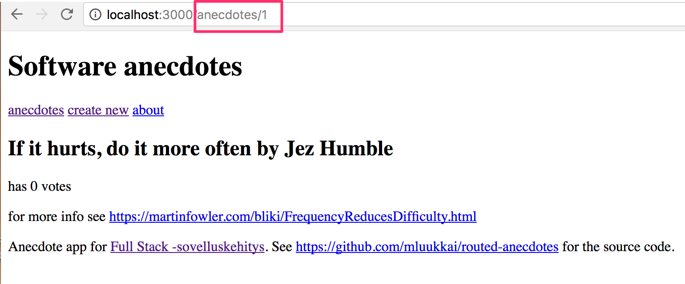
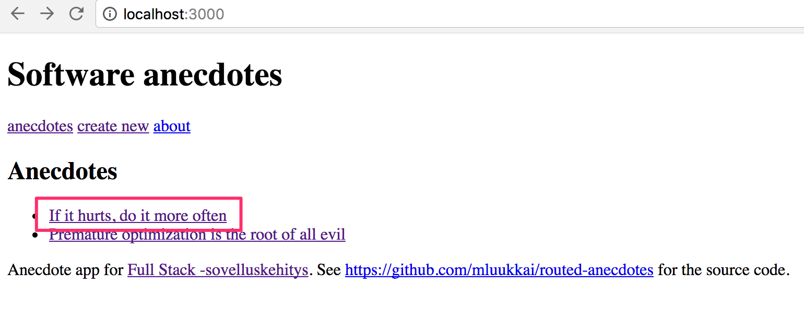
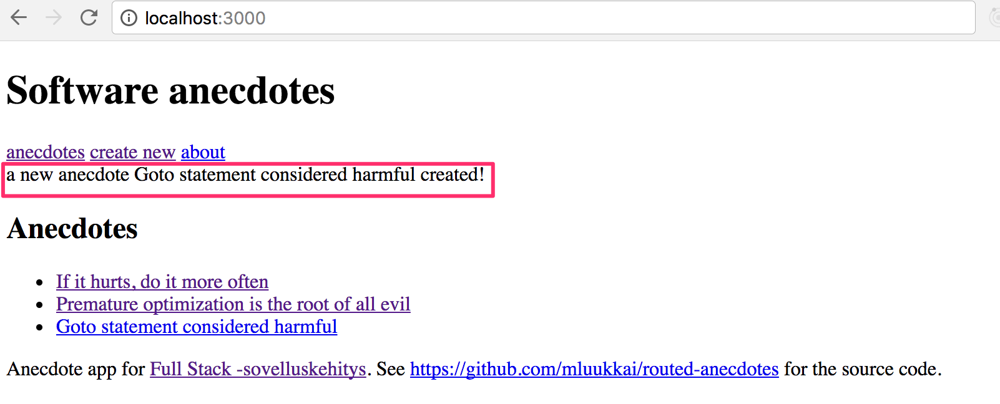

<div class="content">


<!-- The exercises in this seventh part of the course differ a bit from the ones before. In this and the next chapter there is, as usual [exercises related to the theory in the chapter](/zh/part7/react_router#exercises-7-1-7-3). -->
本课程第七章节的练习与以前的有一点不同。 在本章和下一章中，像往常一样有[与本章理论相关的练习](/zh/part7/react_router#exercises-7-1-7-3)。

<!-- In addition to the exercises in this and the chapter, there is a series of exercises which revise what we've learned during the whole course by expanding the Bloglist application which we worked on during parts 4 and 5. -->
除了本章的练习外，还有一系列的练习，通过扩展我们在第4和第5章节中使用的 Bloglist 应用来复习我们在整个课程中学到的知识。

### Application navigation structure 
【应用的导航结构】
<!-- Following part 6, we return to React without Redux. -->
在学完第6章节后，我们回到没有 Redux 的 React。

<!-- It is very common for web-applications to have a navigation bar, which enables switching the view of the application. -->
对于 web 应用来说，有一个导航条是很常见的，它可以切换应用的视图。

<!-- Our app could have a main page -->
我们的应用可以有一个主页



<!-- and separate pages for showing information on notes and users: -->
以及显示便笺及用户资料的独立网页:



<!-- In an [old school web app](/zh/part0/web_应用的基础设施#traditional-web-applications), changing the page shown by the application would be accomplished by the browser making a HTTP GET request to the server and rendering the HTML representing the view that was returned. -->
在[老派的web应用](/zh/part0/web_应用的基础设施#traditional-web-applications)中，更改应用显示的页面将由浏览器向服务器发出 HTTP GET 请求并显示表示返回视图的 HTML 来完成。

<!-- In single page apps, we are, in reality, always on the same page. The Javascript code run by the browser creates an illusion of different "pages". If HTTP requests are made when switching view, they are only for fetching JSON formatted data, which the new view might require for it to be shown. -->
在单页应用中，我们实际上总是在同一页上。 浏览器运行的 Javascript 代码会产生不同“页面”的错觉。 如果 HTTP 请求是在切换视图时发出的，那么它们只用于获取 JSON 格式的数据，新视图可能需要这些数据才能显示出来。

<!-- The navigation bar and an application containing multiple views is very easy to implement using React. -->
导航栏和包含多个视图的应用非常容易使用 React 来实现。

<!-- Here is one way: -->
这里有一个方法:

```js
import React, { useState } from 'react'
import ReactDOM from 'react-dom'

const Home = () => (
  <div> <h2>TKTL notes app</h2> </div>
)

const Notes = () => (
  <div> <h2>Notes</h2> </div>
)

const Users = () => (
  <div> <h2>Users</h2> </div>
)

const App = () => {
  const [page, setPage] = useState('home')

 const toPage = (page) => (event) => {
    event.preventDefault()
    setPage(page)
  }

  const content = () => {
    if (page === 'home') {
      return <Home />
    } else if (page === 'notes') {
      return <Notes />
    } else if (page === 'users') {
      return <Users />
    }
  }

  const padding = {
    padding: 5
  }

  return (
    <div>
      <div>
        <a href="" onClick={toPage('home')} style={padding}>
          home
        </a>
        <a href="" onClick={toPage('notes')} style={padding}>
          notes
        </a>
        <a href="" onClick={toPage('users')} style={padding}>
          users
        </a>
      </div>

      {content()}
    </div>
  )
}

ReactDOM.render(<App />, document.getElementById('root'))
```

<!-- Each view is implemented as its own component. We store the view component information in the application state called <i>page</i>. This information tells us which component, representing a view, should be shown below the menu bar. -->
每个视图都作为自己的组件实现。 我们将视图组件信息存储在名为<i>page</i> 的应用状态中。 这个信息告诉我们，表示视图的哪个组件应该显示在菜单栏下面。

<!-- However, the method is not very optimal. As we can see from the pictures, the address stays the same even though at times we are in different views. Each view should preferably have its own address, e.g. to make bookmarking possible. The <i>back</i>-button doesn't work as expected for our application either, meaning that <i>back</i> doesn't move you to the previously displayed view of the application, but somewhere completely different. If the application were to grow even bigger and we wanted to, for example, add separate views for each user and note, then this self made <i>routing</i>, which means the navigation management of the application, would get overly complicated. -->
然而，这种方法并不十分理想。 正如我们从图片中看到的，即使有时我们处于不同的视角，地址仍然保持不变。 每个视图最好都有自己的地址，例如使浏览器书签成为可能。<i>后退</i>-按钮 对于我们的应用也不能正常工作，这意味着<i>后退</i> 不会将您移动到以前显示的应用视图，而是移动到完全不同的位置。 如果应用变得更大，例如，我们希望为每个用户添加单独的视图和便笺，那么这个自制的<i>routing</i> (这意味着应用的导航管理)将变得过于复杂。


<!-- Luckily React has the [React router](https://github.com/ReactTraining/react-router)-library, which provides an excellent solution for managing navigation in a React-application. -->
幸运的是 React 有[React router](https://github.com/reacttraining/React-router)-库，它为管理 React-application 中的导航提供了一个很好的解决方案。

<!-- Let's change the above application to use React router. First, we install React router with the command -->
让我们将上面的应用改为使用 React 路由

```bash
npm install react-router-dom
```

<!-- The routing provided by React Router is enabled by changing the application as follows: -->
React Router 提供的路由通过更改应用启用，如下所示: 

```js
import {
  BrowserRouter as Router,
  Switch, Route, Link
} from "react-router-dom"

const App = () => {

  const padding = {
    padding: 5
  }

  return (
    <Router>
      <div>
        <Link style={padding} to="/">home</Link>
        <Link style={padding} to="/notes">notes</Link>
        <Link style={padding} to="/users">users</Link>
      </div>

      <Switch>
        <Route path="/notes">
          <Notes />
        </Route>
        <Route path="/users">
          <Users />
        </Route>
        <Route path="/">
          <Home />
        </Route>
      </Switch>

      <div>
        <i>Note app, Department of Computer Science 2020</i>
      </div>
    </Router>
  )
}
```

<!-- Routing, or the conditional rendering of components <i>based on the url</i> in the browser, is used by placing components as children of the <i>Router</i> component, meaning inside <i>Router</i>-tags. -->
路由，或基于浏览器中的 <i>url</i><i>的组件的条件渲染，通过将组件放置为Router</i> 组件的子组件来使用，也就是在<i>Router</i>-tags 内部。

<!-- Notice that, even though the component is referred to by the name <i>Router</i>, we are in fact talking about [BrowserRouter](https://reacttraining.com/react-router/web/api/BrowserRouter), because here the import happens by renaming the imported object: -->
注意，即使组件名为<i>Router</i>，我们实际上讨论的是[BrowserRouter](https://reacttraining.com/react-Router/web/api/BrowserRouter) ，因为这里的导入是通过重命名导入的对象实现的:

```js
import {
  BrowserRouter as Router, // highlight-line
  Switch, Route, Link
} from "react-router-dom"
```

<!-- According to the [manuaal](https://reacttraining.com/react-router/web/api/BrowserRouter)  -->
根据[文档](https://reacttraining.com/react-router/web/api/browserrouter)

> <!--<i>BrowserRouter</i> is a <i>Router</i> that uses the HTML5 history API (pushState, replaceState and the popState event) to keep your UI in sync with the URL.-->
<i>BrowserRouter</i> 是一个 <i>Router</i>，它使用 HTML5的history API  (pushState、 replaceState 和 popState 事件)保持 UI 与 URL 同步。 

<!-- Normally the browser loads a new page when the URL in the address bar changes. However, with the help of the [HTML5 history API](https://css-tricks.com/using-the-html5-history-api/) <i>BrowserRouter</i> enables us to use the URL in the address bar of the browser for internal "routing" in a React-application. So, even if the URL in the address bar changes, the content of the page is only manipulated using Javascript, and the browser will not load new content form the server. Using the back and forward actions, as well as making bookmarks, is still logical like on a traditional web page. -->
通常，当地址栏中的 URL 发生更改时，浏览器会加载一个新页面。 然而，借助于[HTML5 history API](https://css-tricks.com/using-the-HTML5-history-API/)<i>BrowserRouter</i>，我们可以使用浏览器地址栏中的 URL 在 React-application 中进行内部“路由”。 因此，即使地址栏中的 URL 发生了变化，页面的内容也可以通过 Javascript 来操作，浏览器也不会从服务器加载新的内容。 使用后退和前进操作，以及制作书签，仍然像在传统网页上一样合乎逻辑。

<!-- Inside the router we define <i>links</i> that modify the address bar with the help of the [Link](https://reacttraining.com/react-router/web/api/Link) component. For example, -->
在路由内部，我们定义了<i>links</i>，这个<i>links</i> 借助于[Link](https://reacttraining.com/react-router/web/api/Link)组件来修改地址栏,

```js
<Link to="/notes">notes</Link>
```

<!-- creates a link in the application with the text <i>notes</i>, which when clicked changes the URL in the address bar to <i>/notes</i>. -->
在应用中创建一个带有文本<i>notes</i> 的链接，当单击该文本时，会将地址栏中的 URL 更改为<i>/ notes</i>。

<!-- Components rendered based on the URL of the browser are defined with the help of the component [Route](https://reacttraining.com/react-router/web/api/Route). For example,  -->
基于浏览器的 URL 渲染的组件是在组件[Route](https://reacttraining.com/react-router/web/api/Route)的帮助下定义的,

```js
<Route path="/notes">
  <Notes />
</Route>
```


<!-- defines, that if the browser address is <i>/notes</i>, we render the <i>Notes</i> component. -->
定义，如果浏览器地址是<i>/notes</i>，则渲染<i>Notes</i> 组件。


<!-- We wrap the components to be rendered based on the url with a [Swithch](https://reacttraining.com/react-router/web/api/Switch)-component -->
我们用一个[Switch](https://reacttraining.com/react-router/web/api/Switch)-组件包装要基于 url 渲染的组件

```js 
<Switch>
  <Route path="/notes">
    <Notes />
  </Route>
  <Route path="/users">
    <Users />
  </Route>
  <Route path="/">
    <Home />
  </Route>
</Switch>
```


<!-- The switch works so, that we render the first component which's <i>path</i> matches the url in the browser's address bar. -->
这个开关的工作原理是，我们渲染第一个组件，它的<i>path</i> 匹配浏览器地址栏中的 url。


<!-- Note, that the order of the components is important. If we would put the <i>Home</i>-component, which's path is <i> path="/"</i>, first, nothing else would ever get rendered because the "non existing" path "/" is the start of every path: -->
注意，组件的顺序很重要。 如果我们使用<i>Home</i>-组件，它的路径是<i> path="/"</i>，首先，没有其他东西会被渲染，因为"non existing" 路径"/" 是每个路径的开始:

```js 
<Switch>
  <Route path="/"> // highlight-line
    <Home /> // highlight-line
  </Route> // highlight-line
  
  <Route path="/notes">
    <Notes />
  </Route>
  // ...
</Switch>
```

### Parameterized route
【参数化路由】
<!-- Let's examine the slightly modified version from the previous example. The complete code for the example can be found [here](https://github.com/fullstack-hy2020/misc/blob/master/router-app-v1.js). -->
让我们检查一下前一个例子中稍微修改过的版本，这个例子的完整代码可以在这里找到 [here](https://github.com/fullstack-hy2020/misc/blob/master/router-app-v1.js)。

<!-- The application now contains five different views, the display of which is controlled by the router. In addition to the components from the previous example (<i>Home</i>, <i>Notes</i> and <i>Users</i>), we have <i>Login</i> representing the login view and <i>Note</i> representing the view of a single note. -->
应用现在包含五个不同的视图，其显示由路由控制。 除了前面示例中的组件(<i>Home</i>、<i>Notes</i> 和<i>Users</i>)外，我们还有<i>Login</i> 表示登录视图，<i>Note</i> 表示单个便笺的视图。

<!--<i>Home</i> and <i>Users</i> are unchanged from the previous exercise.  <i>Notes</i> is a bit more complicated. It renders the list of notes passed to it as props in such a way that the name of each note is clickable.-->
Home 和 Users  与上次练习相同。<i>Notes</i> 有点复杂。 它以这样一种方式渲染作为props传递给它的便笺列表，即每个便笺的名称都是可点击的。 



<!-- The ability to click a name is implemented with the component <i>Link</i>, and clicking the name of a note whose id is 3 would trigger an event that changes the address of the browser into <i>notes/3</i>: -->
单击名称的能力是通过组件<i>Link</i> 实现的，单击 id 为3的便笺的名称将触发一个事件，该事件将浏览器地址更改为<i>notes/3</i>:

```js
const Notes = ({notes}) => (
  <div>
    <h2>Notes</h2>
    <ul>
      {notes.map(note =>
        <li key={note.id}>
          <Link to={`/notes/${note.id}`}>{note.content}</Link>
        </li>
      )}
    </ul>
  </div>
)
```


<!-- We define parametrized urls in the routing in <i>App</i>-component as follows: -->
我们在<i>App</i>-component 的路由中定义参数化 url 如下:

```js
<Router>
  <div>
    <div>
      <Link style={padding} to="/">home</Link>
      <Link style={padding} to="/notes">notes</Link>
      <Link style={padding} to="/users">users</Link>
    </div>

    <Switch>
    // highlight-start
      <Route path="/notes/:id">
        <Note notes={notes} />
      </Route>
      // highlight-end
      <Route path="/notes">
        <Notes notes={notes} />
      </Route>
      <Route path="/">
        <Home />
      </Route>
    </Switch>

</Router>
```


<!-- We define the route rendering a specific note "express style" by marking the parameter with a colon <i>:id</i> -->
我们通过用冒号 <i>:id</i>  标签参数来定义渲染特定便笺的路由"express style"

```js
<Route path="/notes/:id">
```


<!-- When a browser navigates to the url for a specific note, for example <i>/notes/3</i>, we render the <i>Note</i> component: -->
当浏览器导航到特定便笺的 url 时，例如<i>/notes/3</i>，我们渲染<i>Note</i> 组件:

```js
import {
  // ...
  useParams  // highlight-line
} from "react-router-dom"

const Note = ({ notes }) => {
  const id = useParams().id // highlight-line
  const note = notes.find(n => n.id === Number(id)) 
  return (
    <div>
      <h2>{note.content}</h2>
      <div>{note.user}</div>
      <div><strong>{note.important ? 'important' : ''}</strong></div>
    </div>
  )
}
```


<!-- The _Note_ component receives all of the notes as props <i>notes</i>, and it can access the url parameter (the id of the note to be displayed) with the [useParams](https://reacttraining.com/react-router/web/api/Hooks/useparams) function of the react-router. -->
Note 组件接收所有的便笺作为 props <i>notes</i>，它可以通过 react-router 的[useParams](https://reacttraining.com/react-router/web/api/hooks/useParams)函数访问 url 参数(要显示的便笺的 id)。 

### useHistory


<!-- We have also implemented a simple log in function in our application. If a user is logged in, information about a logged in user is saved to the <i>user</i> field of the state of the <i>App</i> component. -->
我们还在应用中实现了一个简单的登录函数。 如果用户登录，则关于登录用户的信息将保存到<i>App</i> 组件状态的<i>user</i> 字段中。

<!-- The option to navigate to the <i>Login</i>-view is rendered conditionally in the menu. -->
导航到<i>Login</i>-视图 的选项在菜单中有条件地渲染。

```js
<Router>
  <div>
    <Link style={padding} to="/">home</Link>
    <Link style={padding} to="/notes">notes</Link>
    <Link style={padding} to="/users">users</Link>
    // highlight-start
    {user
      ? <em>{user} logged in</em>
      : <Link style={padding} to="/login">login</Link>
    }
    // highlight-end
  </div>

  // ...
</Router>
```

<!-- So if the user is already logged in, instead of displaying the link <i>Login</i> we show the username of the user: -->
因此，如果用户已经登录，我们不显示链接<i>Login</i>，而是显示用户的用户名:



<!-- The code of the component handling the login functionality is as follows  -->
处理登录功能的组件代码如下

```js
import {
  // ...
  useHistory // highlight-line
} from 'react-router-dom'

const Login = (props) => {
  const history = useHistory() // highlight-line

  const onSubmit = (event) => {
    event.preventDefault()
    props.onLogin('mluukkai')
    history.push('/') // highlight-line
  }

  return (
    <div>
      <h2>login</h2>
      <form onSubmit={onSubmit}>
        <div>
          username: <input />
        </div>
        <div>
          password: <input type='password' />
        </div>
        <button type="submit">login</button>
      </form>
    </div>
  )
}
```


<!-- What is interesting about this component is the use of the [useHistory](https://reacttraining.com/react-router/web/api/Hooks/usehistory) function of the react-router. -->
这个组件的有趣之处在于它使用了React路由的[useHistory](https://reacttraining.com/react-router/web/api/hooks/useHistory 路由)功能。

<!-- With this function the component can access a [history](https://reacttraining.com/react-router/web/api/history) object. The history object can be used to i.a modify the browser url programmatically. -->
有了这个函数，组件就可以访问一个 [history](https://reacttraining.com/react-router/web/api/history)对象。 历史记录对象可以用于编程化地修改浏览器的 url。


<!-- With user log in we call the push method of the history object. The  _history.push('/')_ call causes the browser url to change to _/_ and the application renders the corresponding component <i>Home</i>. -->
对于用户登录，我们调用历史对象的 push 方法。 _history.push('/')_ 调用导致浏览器的 url 更改为/，应用渲染相应的组件<i>Home</i>。


<!-- Both [useParams](https://reacttraining.com/react-router/web/api/Hooks/useparams) and [useHistory](https://reacttraining.com/react-router/web/api/Hooks/usehistory) are hook-functions, just like useState and useEffect we have used many times now.  As you remember from part 1, there are some [rules](/osa1/monimutkaisempi_tila_reactin_debuggaus#hookien-saannot) to using hook-functions. Create-react-app has been configured to warn you, if you break these rules e.g by calling a hook-function from a conditional statement. -->
[useParams](https://reacttraining.com/react-router/web/api/Hooks/useparams)和 [useHistory](https://reacttraining.com/react-router/web/api/Hooks/usehistory)  都是Hook函数，就像我们已经多次使用的 useState 和 useEffect 一样。 正如您在第1章节中记得的，使用hook函数有一些[原则](/zh/part1/深入_react_应用调试/#rules-of-hooks) 。 Create-react-app 已经配置为警告，如果你打破这些规则，例如从一个 If判断语句中调用一个Hook函数，你就会收到警告。

### redirect
【重新定向】
<!-- There is one more interesting detail about the <i>Users</i> route:  -->
关于<i>Users</i> 路由还有一个有趣的细节:

```js
<Route path="/users" render={() =>
  user ? <Users /> : <Redirect to="/login" />
} />
```

<!-- If a user isn't logged in, the <i>Users</i> component is not rendered. Instead the user is <i>redirected</i> using the <i>Redirect</i>-component to the login view -->
如果用户未登录，则不渲染<i>Users</i> 组件。 相反，用户<i>使用<i>Redirect</i>组件重定向到登录视图

```js
<Redirect to="/login" />
```

<!-- In reality it would perhaps be better to not even show links in the navigation bar requiring login if the user is not logged into the application. -->
实际上，如果用户没有登录到应用，甚至不在需要登录的导航栏中显示链接也许会更好。

<!-- Here is the <i>App</i> component in its entirety: -->
下面是<i>App</i> 组件的全部内容:

```js
const App = () => {
  const [notes, setNotes] = useState([
    // ...
  ])

  const [user, setUser] = useState(null) 

  const login = (user) => {
    setUser(user)
  }

  const padding = { padding: 5 }

  return (
    <div>
      <Router>
        <div>
          <Link style={padding} to="/">home</Link>
          <Link style={padding} to="/notes">notes</Link>
          <Link style={padding} to="/users">users</Link>
          {user
            ? <em>{user} logged in</em>
            : <Link style={padding} to="/login">login</Link>
          }
        </div>

        <Switch>
          <Route path="/notes/:id">
            <Note notes={notes} />
          </Route>
          <Route path="/notes">
            <Notes notes={notes} />
          </Route>
          <Route path="/users">
            {user ? <Users /> : <Redirect to="/login" />}
          </Route>
          <Route path="/login">
            <Login onLogin={login} />
          </Route>
          <Route path="/">
            <Home />
          </Route>
        </Switch>
      </Router>      
      <div>
        <br />
        <em>Note app, Department of Computer Science 2020</em>
      </div>
    </div>
  )
}
```
<!--We define an element common for modern web apps called <i>footer</i>, which defines the part at the bottom of the screen, outside of the <i>Router</i>, so that it is shown regardless of the component shown in the routed part of the application.-->
我们定义了一个现代 web 应用通用的元素<i>footer</i>，它定义了屏幕底部<i>Router</i> 之外的部分，因此不管应用路由部分显示的是哪个组件，它都会显示出来。


### Parameterized route revisited
【复习参数化路由】


<!-- Our application has a flaw. The _Note_ component receives all of the notes, even though it only displays the one which's id matches the url parameter: -->
我们的应用有一个缺陷。 组件接收所有的便笺，即使它只显示与 url 参数匹配的 id:


```js
const Note = ({ notes }) => { 
  const id = useParams().id
  const note = notes.find(n => n.id === Number(id))
  // ...
}
```


<!-- Would it be possible to modify the application so, that _Note_ receives only the component it should display? -->
是否有可能修改应用，使 Note 只接收它应该显示的组件？

```js
const Note = ({ note }) => {
  return (
    <div>
      <h2>{note.content}</h2>
      <div>{note.user}</div>
      <div><strong>{note.important ? 'important' : ''}</strong></div>
    </div>
  )
}
```


<!-- One way to do this would be to use react-router's [useRouteMatch](https://reacttraining.com/react-router/web/api/Hooks/useroutematch) hook to figure out the id of the note to be displayed in the _App_ component. -->
一种方法是使用 react-router 的[useRouteMatch](https://reacttraining.com/react-router/web/api/hooks/useRouteMatch)Hook来计算出应用组件中显示的便笺的 id。


<!-- It is not possible to use <i>useRouteMatch</i>-hook in the component which defines the routed part of the application. Let's move the use of the _Router_ components from _App_: -->
在定义应用路由部分的组件中不可能使用<i>useRouteMatch</i>-hook。 让我们把路由组件的使用从 App 中移除:

```js
ReactDOM.render(
  <Router> // highlight-line
    <App />
  </Router>, // highlight-line
  document.getElementById('root')
)
```


<!-- The _App_component becomes: -->
App组件变成: 

```js
import {
  // ...
  useRouteMatch  // highlight-line
} from "react-router-dom"

const App = () => {
  // ...

 // highlight-start
  const match = useRouteMatch('/notes/:id')
  const note = match 
    ? notes.find(note => note.id === Number(match.params.id))
    : null
  // highlight-end

  return (
    <div>
      <div>
        <Link style={padding} to="/">home</Link>
        // ...
      </div>

      <Switch>
        <Route path="/notes/:id">
          <Note note={note} /> // highlight-line
        </Route>
        <Route path="/notes">
          <Notes notes={notes} />
        </Route>
         // ...
      </Switch>

      <div>
        <em>Note app, Department of Computer Science 2020</em>
      </div>
    </div>
  )
}    
```


<!-- Every time the component is rendered, so practically every time the browser url changes, the following command is executed -->
每次渲染组件时，实际上每次浏览器 url 发生更改时，都会执行如下命令

```js
const match = useRouteMatch('/notes/:id')
```


<!-- If the url matches _/notes/:id_, the match variable will contain an object from which we can access the parametrized part of the path, the id of the note to be displayed, and we can then fetch the correct note to display -->
如果 url 匹配 _/notes/:id_，match 变量将包含一个对象，我们可以从该对象访问路径的参数化部分，即要显示便笺的 id，然后我们可以获取要显示的正确便笺

```js
const note = match 
  ? notes.find(note => note.id === Number(match.params.id))
  : null
```


<!-- The completed code can be found from [here](https://github.com/fullstack-hy2020/misc/blob/master/router-app-v2.js). -->
完成的代码可以在这里找到[here](https://github.com/fullstack-hy2020/misc/blob/master/router-app-v2.js)。

</div>

<div class="tasks">


### Exercises 7.1-7.3.
<!-- Let's return to working with anecdotes. Use the redux-free anecdote app found in the repository <https://github.com/fullstack-hy2020/routed-anecdotes> as the starting point for the exercises. -->
让我们继续研究八卦应用。 使用仓库 https://github.com/fullstack-hy2020/routed-anecdotes 中的 非redux 八卦应用作为练习的起点。

<!-- If you clone the project into an existing git repository remember to <i>delete the git configuration of the cloned application:</i> -->
如果您将该项目克隆到现有的 git 存储库中，请记住我删除克隆应用的 git 配置

```bash
cd routed-anecdotes   // go first to directory of the cloned repository
rm -rf .git
```

<!-- The application starts the usual way, but first you need to install the dependencies of the application: -->
应用以通常的方式启动，但是首先你需要安装应用的依赖项:

```bash
npm install
npm start
```

#### 7.1: routed anecdotes, 步骤1
<!-- Add React Router to the application so that by clicking links in the <i>Menu</i>-component the view can be changed. -->
向应用添加 React Router，以便通过单击<i>Menu</i>-组件 中的链接可以更改视图。

<!-- At the root of the application, meaning the path _/_, show the list of anecdotes: -->
在应用的根部，即路径 / ，显示八卦列表:



<!-- The <i>Footer</i>-component should always be visible at the bottom. -->
<i>Footer</i>-组件 应该始终在底部可见。

<!-- The creation of a new anecdote should happen e.g. in the path <i>create</i>: -->
一个新八卦的创建应该发生在例如<i>/create</i>的路径上:




#### 7.2: routed anecdotes, 步骤2
<!-- Implement a view for showing a single anecdote: -->
实现一个展示单一八卦的视图:



<!-- Navigating to the page showing the single anecdote is done by clicking the name of that anecdote -->
导航到显示单个八卦的页面是通过单击该八卦的名称来完成的




#### 7.3: routed anecdotes, 步骤3
<!-- The default functionality of the creation form is quite confusing, because nothing seems to be happening after creating a new anecdote using the form. -->
创建表单的默认功能相当混乱，因为在使用该表单创建一个新八卦之后，似乎什么都没有发生。

<!-- Improve the functionality such that after creating a new anecdote the application transitions automatically to showing the view for all anecdotes <i>and</i> the user is shown a notification informing them of this successful creation for the next 10 seconds: -->
改进功能，比如在创建一个新的八卦后，应用会自动转换为显示所有八卦的视图<i>并且</i>用户会看到一个通知，告诉他们在接下来的10秒内成功创建了这个视图:




</i>
