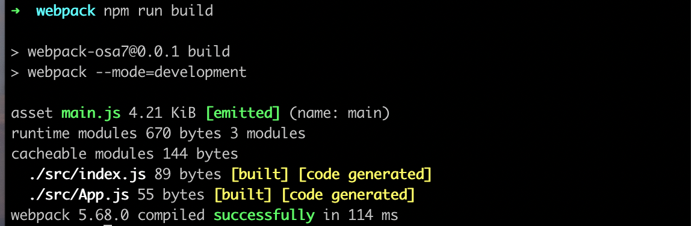
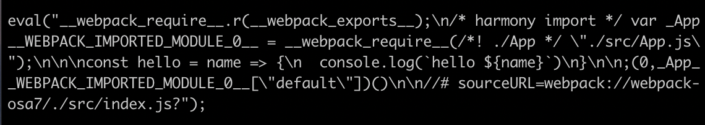
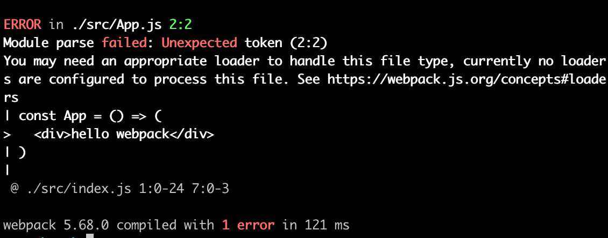
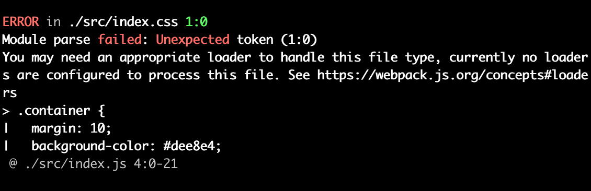

<div class="content">


<!-- Developing with React was notorious for requiring tools that were very difficult to configure. These days, getting started with React development is almost painless thanks to [create-react-app](https://github.com/facebookincubator/create-react-app). A better development workflow has probably never existed for browser-side JavaScript development.-->
 使用React开发时，需要配置非常困难的工具，这一点是臭名昭著的。如今，由于有了[create-react-app](https://github.com/facebookincubator/create-react-app)，开始使用React开发几乎是无痛的。对于浏览器端JavaScript开发来说，可能从未出现过更好的开发工作流程。

<!-- We cannot rely on the black magic of create-react-app forever and it's time for us to take a look under the hood. One of the key players in making React applications functional is a tool called [webpack](https://webpack.js.org/).-->
 我们不能永远依赖create-react-app的黑魔法，现在是时候让我们看看引擎盖下的东西了。使React应用发挥作用的关键因素之一是一个叫做[webpack](https://webpack.js.org/)的工具。

### Bundling

<!-- We have implemented our applications by dividing our code into separate modules that have been <i>imported</i> to places that require them. Even though ES6 modules are defined in the ECMAScript standard, the older browsers actually do not know how to handle code that is divided into modules.-->
 我们通过将代码分为独立的模块来实现我们的应用，这些模块被<i>imported</i>到需要它们的地方。尽管ECMAScript标准中定义了ES6模块，但老的浏览器实际上不知道如何处理被划分为模块的代码。

<!-- For this reason, code that is divided into modules must be <i>bundled</i> for browsers, meaning that all of the source code files are transformed into a single file that contains all of the application code. When we deployed our React frontend to production in [part 3](/en/part3/deploying_app_to_internet), we performed the bundling of our application with the _npm run build_ command. Under the hood, the npm script bundles the source code using webpack, which produces the following collection of files in the <i>build</i> directory:-->
由于这个原因，分为模块的代码必须为浏览器进行<i>捆绑</i>，也就是说，所有的源代码文件都被转化为一个包含所有应用代码的文件。当我们在[第三章节](/en/part3/deploying_app_to_internet)中把我们的React前端部署到生产中时，我们用_npm run build_命令进行了应用的捆绑。在引擎盖下，npm脚本使用webpack捆绑源代码，在<i>build</i>目录下产生以下文件集合。

<pre>
.
├── asset-manifest.json
├── favicon.ico
├── index.html
├── logo192.png
├── logo512.png
├── manifest.json
├── robots.txt
└── static
    ├── css
    │   ├── main.1becb9f2.css
    │   └── main.1becb9f2.css.map
    └── js
        ├── main.88d3369d.js
        ├── main.88d3369d.js.LICENSE.txt
        └── main.88d3369d.js.map
</pre>


<!-- The <i>index.html</i> file located at the root of the build directory is the "main file" of the application which loads the bundled JavaScript file with a <i>script</i> tag:-->
 位于构建目录根部的<i>index.html</i>文件是应用的 "主文件"，它用<i>script</i>标签加载捆绑的JavaScript文件。

```html
<!doctype html>
<html lang="en">
  <head>
    <meta charset="utf-8"/>
    <title>React App</title>
    <script defer="defer" src="/static/js/main.88d3369d.js"></script>
    <link href="/static/css/main.1becb9f2.css" rel="stylesheet">
  </head>
    <div id="root"></div>
  </body>
</html>
```

<!-- As we can see from the example application that was created with create-react-app, the build script also bundles the application's CSS files into a single <i>/static/css/main.1becb9f2.css</i> file.-->
 正如我们从用create-react-app创建的应用的例子中可以看到，构建脚本也将应用的CSS文件捆绑到一个<i>/static/css/main.1becb9f2.css</i>文件中。

<!-- In practice, bundling is done so that we define an entry point for the application, which typically is the <i>index.js</i> file. When webpack bundles the code, it includes all of the code that the entry point imports, and the code that its imports import, and so on.-->
 在实践中，捆绑是为了让我们为应用定义一个入口点，通常是<i>index.js</i>文件。当webpack捆绑代码时，它包括入口点导入的所有代码，以及其导入的代码，以此类推。

<!-- Since part of the imported files are packages like React, Redux, and Axios, the bundled JavaScript file will also contain the contents of each of these libraries.-->
 由于部分导入的文件是像React、Redux和Axios这样的包，捆绑的JavaScript文件也将包含这些库中的每一个内容。

<!-- > The old way of dividing the application's code into multiple files was based on the fact that the <i>index.html</i> file loaded all of the separate JavaScript files of the application with the help of script tags. This resulted in  decreased performance, since the loading of each separate file results in some overhead. For this reason, these days the preferred method is to bundle the code into a single file.-->
 > 将应用的代码分为多个文件的旧方法是基于这样的事实：<i>index.html</i>文件在脚本标签的帮助下加载应用的所有单独的JavaScript文件。这导致了性能的下降，因为每个独立文件的加载都会产生一些开销。出于这个原因，现在首选的方法是将代码捆绑在一个文件中。

<!-- Next, we will create a suitable webpack configuration for a React application by hand from scratch.-->
 接下来，我们将为一个React应用手工创建一个合适的webpack配置，从头开始。

<!-- Let's create a new directory for the project with the following subdirectories (<i>build</i> and <i>src</i>) and files:-->
 让我们为项目创建一个新的目录，其中有以下子目录（<i>build</i>和<i>src</i>）和文件。

<pre>
├── build
├── package.json
├── src
│   └── index.js
└── webpack.config.js
</pre>


<!-- The contents of the <i>package.json</i> file can e.g. be the following:-->
 例如，<i>package.json</i>文件的内容可以是以下内容。

```json
{
  "name": "webpack-part7",
  "version": "0.0.1",
  "description": "practising webpack",
  "scripts": {},
  "license": "MIT"
}
```


<!-- Let's install webpack with the command:-->
 让我们用命令来安装webpack。

```js
npm install --save-dev webpack webpack-cli
```


<!-- We define the functionality of webpack in the <i>webpack.config.js</i> file, which we initialize with the following content:-->
 我们在<i>webpack.config.js</i>文件中定义webpack的功能，我们用以下内容来初始化它。

```js
const path = require('path')

const config = {
  entry: './src/index.js',
  output: {
    path: path.resolve(__dirname, 'build'),
    filename: 'main.js'
  }
}
module.exports = config
```


<!-- We will then define a new npm script called <i>build</i> that will execute the bundling with webpack:-->
 然后我们将定义一个新的npm脚本，名为<i>build</i>，它将用webpack执行捆绑。

```js
// ...
"scripts": {
  "build": "webpack --mode=development"
},
// ...
```


<!-- Let's add some more code to the <i>src/index.js</i> file:-->
 让我们在<i>src/index.js</i>文件中再添加一些代码。

```js
const hello = name => {
  console.log(`hello ${name}`)
}
```

<!-- When we execute the _npm run build_ command, our application code will be bundled by webpack. The operation will produce a new <i>main.js</i> file that is added under the <i>build</i> directory:-->
 当我们执行_npm run build_命令时，我们的应用代码将被webpack捆绑。该操作将产生一个新的<i>main.js</i>文件，被添加到<i>build</i>目录下。


<!-- The file contains a lot of stuff that looks quite interesting. We can also see the code we wrote earlier at the end of the file:-->
 该文件包含了很多看起来相当有趣的东西。我们还可以在文件的末尾看到我们之前写的代码。

```js
eval("const hello = name => {\n  console.log(`hello ${name}`)\n}\n\n//# sourceURL=webpack://webpack-osa7/./src/index.js?");
```

<!-- Let's add a <i>App.js</i> file under the <i>src</i> directory with the following content:-->
 我们在<i>src</i>目录下添加一个<i>App.js</i>文件，内容如下。

```js
const App = () => {
  return null
}

export default App
```

<!-- Let's import and use the <i>App</i> module in the <i>index.js</i> file:-->
 让我们在<i>index.js</i>文件中导入并使用<i>App</i>模块。

```js
import App from './App';

const hello = name => {
  console.log(`hello ${name}`)
}

App()
```

<!-- When we bundle the application again with the _npm run build_ command, we notice that webpack has acknowledged both files:-->
 当我们用_npm run build_命令再次捆绑应用时，我们注意到webpack已经确认了这两个文件。



<!-- Our application code can be found at the end of the bundle file in a rather obscure format:-->
 我们的应用代码可以在捆绑文件的末尾找到，格式相当隐晦。



### Configuration file

<!-- Let's take a closer look at the contents of our current <i>webpack.config.js</i> file:-->
 让我们仔细看看我们当前<i>webpack.config.js</i>文件的内容。

```js
const path = require('path')

const config = {
  entry: './src/index.js',
  output: {
    path: path.resolve(__dirname, 'build'),
    filename: 'main.js'
  }
}

module.exports = config
```

<!-- The configuration file has been written in JavaScript and the configuration object is exported using Node's module syntax.-->
 这个配置文件是用JavaScript写的，配置对象是用Node的模块语法导出的。

<!-- Our minimal configuration definition almost explains itself. The [entry](https://webpack.js.org/concepts/#entry) property of the configuration object specifies the file that will serve as the entry point for bundling the application.-->
我们的最小配置定义几乎可以解释自己。配置对象的[entry](https://webpack.js.org/concepts/#entry)属性指定了将作为捆绑应用的入口点的文件。

<!-- The [output](https://webpack.js.org/concepts/#output) property defines the location where the bundled code will be stored. The target directory must be defined as an <i>absolute path</i> which is easy to create with the [path.resolve](https://nodejs.org/docs/latest-v8.x/api/path.html#path_path_resolve_paths) method. We also use [\_\_dirname](https://nodejs.org/docs/latest/api/globals.html#globals_dirname) which is a global variable in Node that stores the path to the current directory.-->
 [output](https://webpack.js.org/concepts/#output)属性定义了捆绑后的代码将被存储在哪个位置。目标目录必须定义为一个<i>绝对路径</i>，这很容易用[path.resolve](https://nodejs.org/docs/latest-v8.x/api/path.html#path_path_resolve_paths)方法创建。我们还使用[\\_dirname](https://nodejs.org/docs/latest/api/globals.html#globals_dirname)，这是Node中的一个全局变量，用于存储当前目录的路径。

### Bundling React

<!-- Next, let's transform our application into a minimal React application. Let's install the required libraries:-->
 接下来，让我们把我们的应用变成一个最小的React应用。让我们安装所需的库。

```bash
npm install react react-dom
```

<!-- And let's turn our application into a React application by adding the familiar definitions in the <i>index.js</i> file:-->
 然后让我们通过在<i>index.js</i>文件中添加熟悉的定义，将我们的应用变成一个React应用。

```js
import React from 'react'
import ReactDOM from 'react-dom/client'
import App from './App'

ReactDOM.createRoot(document.getElementById('root')).render(<App />)
```

<!-- We will also make the following changes to the <i>App.js</i> file:-->
 我们还将对<i>App.js</i>文件做如下修改。

```js
import React from 'react' // we need this now also in component files

const App = () => {
  return (
    <div>
      hello webpack
    </div>
  )
}

export default App
```

<!-- We still need the <i>build/index.html</i> file  that will serve as the "main page" of our application that will load our bundled JavaScript code with a <i>script</i> tag:-->
 我们仍然需要<i>build/index.html</i>文件，它将作为我们应用的 "主页"，用<i>script</i>标签加载我们绑定的JavaScript代码。

```html
<!DOCTYPE html>
<html lang="en">
  <head>
    <meta charset="utf-8" />
    <title>React App</title>
  </head>
  <body>
    <div id="root"></div>
    <script type="text/javascript" src="./main.js"></script>
  </body>
</html>
```

<!-- When we bundle our application, we run into the following problem:-->
 当我们捆绑我们的应用时，我们遇到了以下问题。



### Loaders

<!-- The error message from webpack states that we may need an appropriate <i>loader</i> to bundle the <i>App.js</i> file correctly. By default, webpack only knows how to deal with plain JavaScript. Although we may have become unaware of it, we are actually using [JSX](https://facebook.github.io/jsx/) for rendering our views in React. To illustrate this, the following code is not regular JavaScript:-->
 来自webpack的错误信息指出，我们可能需要一个合适的<i>加载器</i>来正确捆绑<i>App.js</i>文件。默认情况下，webpack只知道如何处理普通的JavaScript。虽然我们可能已经不知道，但实际上我们是在使用[JXX](https://facebook.github.io/jsx/)来渲染我们在React中的视图。为了说明这一点，下面的代码不是普通的JavaScript。

```js
const App = () => {
  return (
    <div>
      hello webpack
    </div>
  )
}
```

<!-- The syntax used above comes from JSX and it provides us with an alternative way of defining a React element for an html <i>div</i> tag.-->
 上面使用的语法来自JSX，它为我们提供了一种替代的方式来为html <i>div</i>标签定义React元素。

<!-- We can use [loaders](https://webpack.js.org/concepts/loaders/) to inform webpack of the files that need to be processed before they are bundled.-->
 我们可以使用[loaders](https://webpack.js.org/concepts/loaders/)来通知webpack在捆绑前需要处理的文件。

<!-- Let's configure a loader to our application that transforms the JSX code into regular JavaScript:-->
 让我们为我们的应用配置一个加载器，将JXX代码转化为普通的JavaScript。

```js
const config = {
  entry: './src/index.js',
  output: {
    path: path.resolve(__dirname, 'build'),
    filename: 'main.js',
  },
  // highlight-start
  module: {
    rules: [
      {
        test: /\.js$/,
        loader: 'babel-loader',
        options: {
          presets: ['@babel/preset-react'],
        },
      },
    ],
  },
  // highlight-end
}
```

<!-- Loaders are defined under the <i>module</i> property in the <i>rules</i> array.-->
加载器被定义在<i>module</i>数组的<i>rules</i>属性下。

<!-- The definition for a single loader consists of three parts:-->
单个加载器的定义由三部分组成。

```js
{
  test: /\.js$/,
  loader: 'babel-loader',
  options: {
    presets: ['@babel/preset-react']
  }
}
```

<!-- The <i>test</i> property specifies that the loader is for files that have names ending with <i>.js</i>. The <i>loader</i> property specifies that the processing for those files will be done with [babel-loader](https://github.com/babel/babel-loader). The <i>options</i> property is used for specifying parameters for the loader, which configure its functionality.-->
 <i>test</i> 属性指定加载器用于名称以<i>.js</i>结尾的文件。<i>loader</i>属性指定这些文件的处理将由[babel-loader](https://github.com/babel/babel-loader)完成。<i>options</i>属性用于为加载器指定参数，配置其功能。

<!-- Let's install the loader and its required packages as a <i>development dependency</i>:-->
 让我们把加载器和它所需的包作为<i>开发依赖项</i>来安装。

```js
npm install @babel/core babel-loader @babel/preset-react --save-dev
```

<!-- Bundling the application will now succeed.-->
 捆绑应用现在将成功。

<!-- If we make some changes to the <i>App</i> component and take a look at the bundled code, we notice that the bundled version of the component looks like this:-->
 如果我们对<i>App</i>组件做一些修改，并看一下捆绑的代码，我们注意到该组件的捆绑版本是这样的。

```js
const App = () =>
  react__WEBPACK_IMPORTED_MODULE_0___default.a.createElement(
    'div',
    null,
    'hello webpack'
  )
```

<!-- As we can see from the example above, the React elements that were written in JSX are now created with regular JavaScript by using React's [createElement](https://reactjs.org/docs/react-without-jsx.html) function.-->
 从上面的例子中我们可以看到，原来用JSX编写的React元素现在通过使用React's [createElement](https://reactjs.org/docs/react-without-jsx.html)函数用普通的JavaScript创建。

<!-- You can test the bundled application by opening the <i>build/index.html</i> file with the <i>open file</i> functionality of your browser:-->
 你可以用浏览器的<i>open file</i>功能打开<i>build/index.html</i>文件来测试绑定的应用。


<!-- It's worth noting that if the bundled application's source code uses <i>async/await</i>, the browser will not render anything on some browsers. [Googling the error message in the console](https://stackoverflow.com/questions/33527653/babel-6-regeneratorruntime-is-not-defined) will shed some light on the issue. With [previous solution](https://babeljs.io/docs/en/babel-polyfill/) being deprecated we now have to install two more missing dependencies, that is [core-js](https://www.npmjs.com/package/core-js) and [regenerator-runtime](https://www.npmjs.com/package/regenerator-runtime):-->
 值得注意的是，如果捆绑的应用的源代码使用了<i>async/await</i>，浏览器在某些浏览器上将不会渲染任何东西。[在控制台中搜索错误信息](https://stackoverflow.com/questions/33527653/babel-6-regeneratorruntime-is-not-defined)会对这个问题有所了解。随着[先前的解决方案](https://babeljs.io/docs/en/babel-polyfill/)被废弃，我们现在必须再安装两个缺失的依赖，即[core-js](https://www.npmjs.com/package/core-js)和[regenerator-runtime](https://www.npmjs.com/package/regenerator-runtime)。

```bash
npm install core-js regenerator-runtime
```

<!-- You need to import those dependencies at the top of <i>index.js</i> file:-->
 你需要在<i>index.js</i>文件的顶部导入这些依赖项。

```js
import 'core-js/stable/index.js'
import 'regenerator-runtime/runtime.js'
```

<!-- Our configuration contains nearly everything that we need for React development.-->
 我们的配置几乎包含了React开发所需的一切。

### Transpilers

<!-- The process of transforming code from one form of JavaScript to another is called [transpiling](https://en.wiktionary.org/wiki/transpile). The general definition of the term is to compile source code by transforming it from one language to another.-->
 将代码从一种形式的JavaScript转换为另一种形式的过程被称为[转译](https://en.wiktionary.org/wiki/transpile)。这个术语的一般定义是通过将源代码从一种语言转换为另一种语言来进行编译。

<!-- By using the configuration from the previous section, we are <i>transpiling</i> the code containing JSX into regular JavaScript with the help of [babel](https://babeljs.io/), which is currently the most popular tool for the job.-->
通过使用上一节的配置，我们在[babel](https://babeljs.io/)的帮助下，将包含JSX的代码<i>转译</i>成普通的JavaScript，这是目前最流行的工作工具。

<!-- As mentioned in part 1, most browsers do not support the latest features that were introduced in ES6 and ES7, and for this reason the code is usually transpiled to a version of JavaScript that implements the ES5 standard.-->
 如第一章节所述，大多数浏览器不支持ES6和ES7中引入的最新特性，为此，代码通常被转译为实现ES5标准的JavaScript版本。

<!-- The transpilation process that is executed by Babel is defined with <i>plugins</i>. In practice, most developers use ready-made [presets](https://babeljs.io/docs/plugins/) that are groups of pre-configured plugins.-->
由Babel执行的转置过程是用<i>插件</i>定义的。在实践中，大多数开发者使用现成的[预设](https://babeljs.io/docs/plugins/)，它们是预先配置的插件组。

<!-- Currently we are using the [@babel/preset-react](https://babeljs.io/docs/plugins/preset-react/) preset for transpiling the source code of our application:-->
 目前我们使用[@babel/preset-react](https://babeljs.io/docs/plugins/preset-react/)预设来转录我们应用的源代码。

```js
{
  test: /\.js$/,
  loader: 'babel-loader',
  options: {
    presets: ['@babel/preset-react'] // highlight-line
  }
}
```

<!-- Let's add the [@babel/preset-env](https://babeljs.io/docs/plugins/preset-env/) plugin that contains everything needed to take code using all of the latest features and transpile it to code that is compatible with the ES5 standard:-->
 让我们添加[@babel/preset-env](https://babeljs.io/docs/plugins/preset-env/)插件，它包含了使用所有最新特性的代码并将其转译为与ES5标准兼容的代码所需的一切。

```js
{
  test: /\.js$/,
  loader: 'babel-loader',
  options: {
    presets: ['@babel/preset-env', '@babel/preset-react'] // highlight-line
  }
}
```

<!-- Let's install the preset with the command:-->
 让我们用命令来安装这个预设。

```js
npm install @babel/preset-env --save-dev
```

<!-- When we transpile the code, it gets transformed into old-school JavaScript. The definition of the transformed <i>App</i> component looks like this:-->
 当我们转译代码时，它被转化为老式的JavaScript。转换后的<i>App</i>组件的定义看起来是这样的。

```js
var App = function App() {
  return _react2.default.createElement('div', null, 'hello webpack')
};
```

<!-- As we can see, variables are declared with the _var_ keyword as ES5 JavaScript does not understand the _const_ keyword. Arrow functions are also not used, which is why the function definition used the _function_ keyword.-->
 我们可以看到，变量是用_var_关键字声明的，因为ES5的JavaScript不理解_const_关键字。箭头函数也没有使用，这就是为什么函数定义使用_function_关键字的原因。

### CSS

<!-- Let's add some CSS to our application. Let's create a new <i>src/index.css</i> file:-->
 让我们为我们的应用添加一些CSS。让我们创建一个新的<i>src/index.css</i>文件。

```css
.container {
  margin: 10;
  background-color: #dee8e4;
}
```

<!-- Then let's use the style in the <i>App</i> component:-->
 然后让我们在<i>App</i>组件中使用这个样式。

```js
const App = () => {
  return (
    <div className="container">
      hello webpack
    </div>
  )
}
```

<!-- And we import the style in the <i>index.js</i> file:-->
 我们在<i>index.js</i>文件中导入该样式。

```js
import './index.css'
```

<!-- This will cause the transpilation process to break:-->
 这将导致转译过程的中断。



<!-- When using CSS, we have to use [css](https://webpack.js.org/loaders/css-loader/) and [style](https://webpack.js.org/loaders/style-loader/) loaders:-->
 当使用CSS时，我们必须使用[css](https://webpack.js.org/loaders/css-loader/)和[style](https://webpack.js.org/loaders/style-loader/)加载器。

```js
{
  rules: [
    {
      test: /\.js$/,
      loader: 'babel-loader',
      options: {
        presets: ['@babel/preset-react', '@babel/preset-env'],
      },
    },
    // highlight-start
    {
      test: /\.css$/,
      use: ['style-loader', 'css-loader'],
    },
    // highlight-end
  ];
}
```

<!-- The job of the [css loader](https://webpack.js.org/loaders/css-loader/) is to load the <i>CSS</i> files and the job of the [style loader](https://webpack.js.org/loaders/style-loader/) is to generate and inject a <i>style</i> element that contains all of the styles of the application.-->
 [css加载器](https://webpack.js.org/loaders/css-loader/)的工作是加载<i>CSS</i>文件，[style加载器](https://webpack.js.org/loaders/style-loader/)的工作是生成并注入一个<i>style</i>元素，其中包含应用的所有样式。

<!-- With this configuration, the CSS definitions are included in the <i>main.js</i> file of the application. For this reason, there is no need to separately import the <i>CSS</i> styles in the main <i>index.html</i> file of the application.-->
 通过这种配置，CSS定义被包含在应用的<i>main.js</i>文件中。由于这个原因，不需要在应用的主<i>index.html</i>文件中单独导入<i>CSS</i>样式。

<!-- If needed, the application's CSS can also be generated into its own separate file by using the [mini-css-extract-plugin](https://github.com/webpack-contrib/mini-css-extract-plugin).-->
 如果需要，应用的CSS也可以通过使用[mini-css-extract-plugin](https://github.com/webpack-contrib/mini-css-extract-plugin)生成它自己的独立文件。

<!-- When we install the loaders:-->
 当我们安装加载器时。

```js
npm install style-loader css-loader --save-dev
```

<!-- The bundling will succeed once again and the application gets new styles.-->
 捆绑将再次成功，应用获得新的样式。

### Webpack-dev-server

<!-- The current configuration makes it possible to develop our application but the workflow is awful (to the point where it resembles the development workflow with Java). Every time we make a change to the code, we have to bundle it and refresh the browser in order to test the code.-->
 目前的配置使我们有可能开发我们的应用，但工作流程很糟糕（到了类似于用Java开发工作流程的地步）。每当我们对代码进行修改时，我们必须将其捆绑并刷新浏览器，以便测试代码。

<!-- The [webpack-dev-server](https://webpack.js.org/guides/development/#using-webpack-dev-server) offers a solution to our problems. Let's install it with the command:-->
 [webpack-dev-server](https://webpack.js.org/guides/development/#using-webpack-dev-server)为我们的问题提供了一个解决方案。让我们用命令来安装它。

```js
npm install --save-dev webpack-dev-server
```

<!-- Let's define an npm script for starting the dev-server:-->
 让我们定义一个npm脚本来启动dev-server。

```js
{
  // ...
  "scripts": {
    "build": "webpack --mode=development",
    "start": "webpack serve --mode=development" // highlight-line
  },
  // ...
}
```

<!-- Let's also add a new <i>devServer</i> property to the configuration object in the <i>webpack.config.js</i> file:-->
 让我们在<i>webpack.config.js</i>文件中的配置对象中添加一个新的<i>devServer</i>属性。

```js
const config = {
  entry: './src/index.js',
  output: {
    path: path.resolve(__dirname, 'build'),
    filename: 'main.js',
  },
  // highlight-start
  devServer: {
    static: path.resolve(__dirname, 'build'),
    compress: true,
    port: 3000,
  },
  // highlight-end
  // ...
};
```

<!-- The _npm start_ command will now start the dev-server at the port 3000, meaning that our application will be available by visiting <http://localhost:3000> in the browser. When we make changes to the code, the browser will automatically refresh the page.-->
 _npm start_命令现在将在3000端口启动dev-server，这意味着我们的应用将可以通过访问<http://localhost:3000>在浏览器中使用。当我们对代码进行修改时，浏览器会自动刷新页面。

<!-- The process for updating the code is fast. When we use the dev-server, the code is not bundled the usual way into the <i>main.js</i> file. The result of the bundling exists only in memory.-->
更新代码的过程很迅速。当我们使用dev-server时，代码不会以通常的方式捆绑到<i>main.js</i>文件中。捆绑的结果只存在于内存中。

<!-- Let's extend the code by changing the definition of the <i>App</i> component as shown below:-->
 让我们通过改变<i>App</i>组件的定义来扩展代码，如下所示。

```js
import React, { useState } from 'react'
import './index.css'

const App = () => {
  const [counter, setCounter] = useState(0)

  return (
    <div className="container">
      hello webpack {counter} clicks
      <button onClick={() => setCounter(counter + 1)}>
        press
      </button>
    </div>
  )
}

export default App
```

<!-- The application works nicely and the development workflow is quite smooth.-->
 应用工作得很好，开发工作流程也相当顺利。

### Source maps

<!-- Let's extract the click handler into its own function and store the previous value of the counter into its own <i>values</i> state:-->
 让我们把点击处理程序提取到它自己的函数中，并把计数器的前值存储到它自己的<i>values</i>状态中。

```js
const App = () => {
  const [counter, setCounter] = useState(0)
  const [values, setValues] = useState() // highlight-line

  const handleClick = () => {
    setCounter(counter + 1)
    setValues(values.concat(counter)) // highlight-line
  }

  return (
    <div className="container">
      hello webpack {counter} clicks
      <button onClick={handleClick}> // highlight-line
        press
      </button>
    </div>
  )
}
```


<!-- The application no longer works and the console will display the following error:-->
 应用不再工作了，控制台将显示以下错误。


<!-- We know that the error is in the onClick method, but if the application was any larger the error message would be quite difficult to track down:-->
 我们知道错误在onClick方法中，但如果应用再大一点，错误信息就很难追踪了。

<pre>
App.js:27 Uncaught TypeError: Cannot read property 'concat' of undefined
    at handleClick (App.js:27)
</pre>

<!-- The location of the error indicated in the message does not match the actual location of the error in our source code. If we click the error message, we notice that the displayed source code does not resemble our application code:-->
 消息中指出的错误位置与我们源代码中的实际位置不一致。如果我们点击错误信息，我们注意到显示的源代码与我们的应用代码不一样。


<!-- Of course, we want to see our actual source code in the error message.-->
 当然，我们希望在错误信息中看到我们的实际源代码。

<!-- Luckily, fixing the error message in this respect is quite easy. We will ask webpack to generate a so-called [source map](https://webpack.js.org/configuration/devtool/) for the bundle, which makes it possible to <i>map errors</i> that occur during the execution of the bundle to the corresponding part in the original source code.-->
幸运的是，在这方面修复错误信息是很容易的。我们将要求webpack为bundle生成一个所谓的[source map](https://webpack.js.org/configuration/devtool/)，这使得我们有可能将bundle执行过程中出现的错误</i>映射到原始源代码中的相应部分。

<!-- The source map can be generated by adding a new <i>devtool</i> property to the configuration object with the value 'source-map':-->
源码图可以通过在配置对象中添加一个新的<i>devtool</i>属性来生成，其值为"source-map"。

```js
const config = {
  entry: './src/index.js',
  output: {
    // ...
  },
  devServer: {
    // ...
  },
  devtool: 'source-map', // highlight-line
  // ..
};
```

<!-- Webpack has to be restarted when we make changes to its configuration. It is also possible to make webpack watch for changes made to itself but we will not do that this time.-->
 当我们对Webpack的配置进行修改时，必须重新启动它。也可以让webpack观察对它的改动，但这次我们不会这么做。

<!-- The error message is now a lot better-->
现在的错误信息好了很多


<!-- since it refers to the code we wrote:-->
 因为它指的是我们写的代码。


<!-- Generating the source map also makes it possible to use the Chrome debugger:-->
生成源码图也使我们有可能使用Chrome调试器。


<!-- Let's fix the bug by initializing the state of <i>values</i> as an empty array:-->
 让我们通过将<i>values</i>的状态初始化为一个空数组来修复这个错误。

```js
const App = () => {
  const [counter, setCounter] = useState(0)
  const [values, setValues] = useState([])
  // ...
}
```

### Minifying the code

<!-- When we deploy the application to production, we are using the <i>main.js</i> code bundle that is generated by webpack. The size of the <i>main.js</i> file is 1356668 bytes even though our application only contains a few lines of our own code. The large file size is due to the fact that the bundle also contains the source code for the entire React library. The size of the bundled code matters since the browser has to load the code when the application is first used. With high-speed internet connections, 1356668 bytes is not an issue, but if we were to keep adding more external dependencies, loading speeds could become an issue particularly for mobile users.-->
 当我们将应用部署到生产中时，我们使用的是由webpack生成的<i>main.js</i>代码包。<i>main.js</i>文件的大小为1356668字节，尽管我们的应用只包含几行我们自己的代码。文件大小较大的原因是，该捆绑文件还包含整个React库的源代码。捆绑代码的大小很重要，因为浏览器在第一次使用应用时必须加载这些代码。在高速网络连接下，1356668字节不是问题，但如果我们继续添加更多的外部依赖，加载速度可能会成为一个问题，特别是对于移动用户。

<!-- If we inspect the contents of the bundle file, we notice that it could be greatly optimized in terms of file size by removing all of the comments. There's no point in manually optimizing these files, as there are many existing tools for the job.-->
 如果我们检查捆绑文件的内容，我们注意到它可以通过删除所有的注释来大大优化文件大小。手动优化这些文件是没有意义的，因为有很多现有的工具可以完成这项工作。

<!-- The optimization process for JavaScript files is called <i>minification</i>. One of the leading tools intended for this purpose is [UglifyJS](http://lisperator.net/uglifyjs/).-->
 JavaScript文件的优化过程被称为<i>minification</i>。其中一个用于此目的的主要工具是[UglifyJS](http://lisperator.net/uglifyjs/)。

<!-- Starting from version 4 of webpack, the minification plugin does not require additional configuration to be used. It is enough to modify the npm script in the <i>package.json</i> file to specify that webpack will execute the bundling of the code in <i>production</i> mode:-->
 从webpack的第4版开始，minification插件不需要额外的配置就可以使用。只要修改<i>package.json</i>文件中的npm脚本，指定webpack在<i>production</i>模式下执行代码的捆绑即可。

```json
{
  "name": "webpack-part7",
  "version": "0.0.1",
  "description": "practising webpack",
  "scripts": {
    "build": "webpack --mode=production", // highlight-line
    "start": "webpack serve --mode=development"
  },
  "license": "MIT",
  "dependencies": {
    // ...
  },
  "devDependencies": {
    // ...
  }
}
```

<!-- When we bundle the application again, the size of the resulting <i>main.js</i> decreases substantially:-->
 当我们再次捆绑应用时，产生的<i>main.js</i>的大小大幅减少。

```js
$ ls -l build/main.js
-rw-r--r--  1 mluukkai  ATKK\hyad-all  227651 Feb  7 15:58 build/main.js
```

<!-- The output of the minification process resembles old-school C code; all of the comments and even unnecessary whitespace and newline characters have been removed, and variable names have been replaced with a single character.-->
 最小化过程的输出类似于老式的C代码；所有的注释，甚至不必要的空白和换行符都被删除了，变量名也被替换成了一个字符。

```js
function h(){if(!d){var e=u(p);d=!0;for(var t=c.length;t;){for(s=c,c=[];++f<t;)s&&s[f].run();f=-1,t=c.length}s=null,d=!1,function(e){if(o===clearTimeout)return clearTimeout(e);if((o===l||!o)&&clearTimeout)return o=clearTimeout,clearTimeout(e);try{o(e)}catch(t){try{return o.call(null,e)}catch(t){return o.call(this,e)}}}(e)}}a.nextTick=function(e){var t=new Array(arguments.length-1);if(arguments.length>1)
```

### Development and production configuration

<!-- Next, let's add a backend to our application by repurposing the now-familiar note application backend.-->
 接下来，让我们通过重新利用现在熟悉的笔记应用的后端，为我们的应用添加一个后端。


<!-- Let's store the following content in the <i>db.json</i> file:-->
 让我们在<i>db.json</i>文件中存储以下内容。

```json
{
  "notes": [
    {
      "important": true,
      "content": "HTML is easy",
      "id": "5a3b8481bb01f9cb00ccb4a9"
    },
    {
      "important": false,
      "content": "Mongo can save js objects",
      "id": "5a3b920a61e8c8d3f484bdd0"
    }
  ]
}
```

<!-- Our goal is to configure the application with webpack in such a way that, when used locally, the application uses the json-server available in port 3001 as its backend.-->
 我们的目标是用webpack配置应用，使其在本地使用时，使用3001端口的json-server作为其后端。

<!-- The bundled file will then be configured to use the backend available at the <https://obscure-harbor-49797.herokuapp.com/api/notes> url.-->
 然后，捆绑的文件将被配置为使用<https://obscure-harbor-49797.herokuapp.com/api/notes>网址上的后端。

<!-- We will install <i>axios</i>, start the json-server, and then make the necessary changes to the application. For the sake of changing things up, we will fetch the notes from the backend with our [custom hook](/en/part7/custom_hooks) called _useNotes_:-->
 我们将安装<i>axios</i>，启动json-server，然后对应用进行必要的修改。为了改变现状，我们将用我们的[自定义钩子](/en/part7/custom_hooks)从后端获取笔记，称为_useNotes_。

```js
import React, { useState, useEffect } from 'react'
import axios from 'axios'

// highlight-start
const useNotes = (url) => {
  const [notes, setNotes] = useState([])

  useEffect(() => {
    axios.get(url).then(response => {
      setNotes(response.data)
    })
  }, [url])

  return notes
}
// highlight-end

const App = () => {
  const [counter, setCounter] = useState(0)
  const [values, setValues] = useState([])
  const url = 'https://obscure-harbor-49797.herokuapp.com/api/notes'
  const notes = useNotes(url) // highlight-line

  const handleClick = () => {
    setCounter(counter + 1)
    setValues(values.concat(counter))
  }

  return (
    <div className="container">
      hello webpack {counter} clicks
      <button onClick={handleClick} >press</button>
      <div>{notes.length} notes on server {url}</div> // highlight-line
    </div>
  )
}

export default App
```

<!-- The address of the backend server is currently hardcoded in the application code. How can we change the address in a controlled fashion to point to the production backend server when the code is bundled for production?-->
 后端服务器的地址目前在应用代码中是硬编码的。当代码被捆绑到生产中时，我们如何以一种可控的方式改变地址以指向生产用的后端服务器？

<!-- Let's change the configuration object in the <i>webpack.config.js</i> file to be a function instead of an object:-->
 让我们把<i>webpack.config.js</i>文件中的配置对象改成一个函数而不是一个对象。

```js
const path = require('path');

const config = (env, argv) => {
  return {
    entry: './src/index.js',
    output: {
      // ...
    },
    devServer: {
      // ...
    },
    devtool: 'source-map',
    module: {
      // ...
    },
    plugins: [
      // ...
    ],
  }
}

module.exports = config
```

<!-- The definition remains almost exactly the same, except for the fact that the configuration object is now returned by the function. The function receives the two parameters, <i>env</i> and <i>argv</i>, the second of which can be used for accessing the <i>mode</i> that is defined in the npm script.-->
 除了配置对象现在由函数返回之外，定义几乎完全相同。该函数接收两个参数，<i>env</i>和<i>argv</i>，其中第二个参数可用于访问npm脚本中定义的<i>mode</i>。

<!-- We can also use webpack's [DefinePlugin](https://webpack.js.org/plugins/define-plugin/) for defining <i>global default constants</i> that can be used in the bundled code. Let's define a new global constant <i>BACKEND\_URL</i> that gets a different value depending on the environment that the code is being bundled for:-->
 我们也可以使用webpack的[DefinePlugin](https://webpack.js.org/plugins/define-plugin/)来定义<i>全局默认常量</i>，可以在捆绑的代码中使用。让我们定义一个新的全局常量<i>BACKEND\_URL</i>，根据代码被捆绑的环境，获得不同的值。

```js
const path = require('path')
const webpack = require('webpack') // highlight-line

const config = (env, argv) => {
  console.log('argv', argv.mode)

  // highlight-start
  const backend_url = argv.mode === 'production'
    ? 'https://obscure-harbor-49797.herokuapp.com/api/notes'
    : 'http://localhost:3001/notes'
  // highlight-end

  return {
    entry: './src/index.js',
    output: {
      path: path.resolve(__dirname, 'build'),
      filename: 'main.js'
    },
    devServer: {
      static: path.resolve(__dirname, 'build'),
      compress: true,
      port: 3000,
    },
    devtool: 'source-map',
    module: {
      // ...
    },
    // highlight-start
    plugins: [
      new webpack.DefinePlugin({
        BACKEND_URL: JSON.stringify(backend_url)
      })
    ]
    // highlight-end
  }
}

module.exports = config
```

<!-- The global constant is used in the following way in the code:-->
 这个全局常量在代码中以下列方式使用。

```js
const App = () => {
  const [counter, setCounter] = useState(0)
  const [values, setValues] = useState([])
  const notes = useNotes(BACKEND_URL) // highlight-line

  // ...
  return (
    <div className="container">
      hello webpack {counter} clicks
      <button onClick={handleClick} >press</button>
      <div>{notes.length} notes on server {BACKEND_URL}</div> // highlight-line
    </div>
  )
}
```

<!-- If the configuration for development and production differs a lot, it may be a good idea to [separate the configuration](https://webpack.js.org/guides/production/) of the two into their own files.-->
 如果开发和生产的配置差别很大，把两者的[配置](https://webpack.js.org/guides/production/)分开到各自的文件中可能是个好主意。

<!-- We can inspect the bundled production version of the application locally by executing the following command in the <i>build</i> directory:-->
 我们可以通过在<i>build</i>目录下执行以下命令来检查本地捆绑的生产版本的应用。

```js
npx static-server
```

<!-- By default, the bundled application will be available at <http://localhost:9080>.-->
 默认情况下，捆绑的应用将在<http://localhost:9080>上提供。

### Polyfill

<!-- Our application is finished and works with all relatively recent versions of modern browsers, with the exception of Internet Explorer. The reason for this is that, because of _axios_, our code uses [Promises](https://developer.mozilla.org/en-US/docs/Web/JavaScript/Reference/Global_Objects/Promise), and no existing version of IE supports them:-->
 我们的应用已经完成，可以在所有相对较新版本的现代浏览器中使用，但Internet Explorer除外。原因是，由于_axios_，我们的代码使用了[ promise ](https://developer.mozilla.org/en-US/docs/Web/JavaScript/Reference/Global_Objects/Promise)，而现有版本的IE都不支持。


<!-- There are many other things in the standard that IE does not support. Something as harmless as the [find](https://developer.mozilla.org/en-US/docs/Web/JavaScript/Reference/Global_Objects/Array/find) method of JavaScript arrays exceeds the capabilities of IE:-->
 标准中还有很多东西是IE不支持的。像JavaScript数组的[find](https://developer.mozilla.org/en-US/docs/Web/JavaScript/Reference/Global_Objects/Array/find)方法这样无害的东西超过了IE的能力。


<!-- In these situations it is not enough to transpile the code, as transpilation simply transforms the code from a newer version of JavaScript to an older one with wider browser support. IE understands Promises syntactically but it simply has not implemented their functionality. The _find_ property of arrays in IE is simply <i>undefined</i>.-->
 在这些情况下，仅仅转译代码是不够的，因为转译只是把代码从较新的JavaScript版本转到较旧的浏览器支持的版本上。IE在语法上理解 promise ，但它根本没有实现其功能。在IE中，数组的_find_属性是简单的<i>undefined</i>。

<!-- If we want the application to be IE-compatible, we need to add a [polyfill](https://remysharp.com/2010/10/08/what-is-a-polyfill), which is code that adds the missing functionality to older browsers.-->
 如果我们想让应用与IE兼容，我们需要添加一个[polyfill](https://remysharp.com/2010/10/08/what-is-a-polyfill)，它是为旧版浏览器添加缺失功能的代码。

<!-- Polyfills can be added with the help of [webpack and Babel](https://babeljs.io/docs/usage/polyfill/) or by installing one of many existing polyfill libraries.-->
 Polyfills可以在[webpack和Babel](https://babeljs.io/docs/usage/polyfill/)的帮助下添加，或者通过安装许多现有的polyfill库中的一个。

<!-- The polyfill provided by the [promise-polyfill](https://www.npmjs.com/package/promise-polyfill) library is easy to use. We simply have to add the following to our existing application code:-->
 由[promise-polyfill](https://www.npmjs.com/package/promise-polyfill)库提供的polyfill很容易使用。我们只需将以下内容添加到我们现有的应用代码中。

```js
import PromisePolyfill from 'promise-polyfill'

if (!window.Promise) {
  window.Promise = PromisePolyfill
}
```

<!-- If the global _Promise_ object does not exist, meaning that the browser does not support Promises, the polyfilled Promise is stored in the global variable. If the polyfilled Promise is implemented well enough, the rest of the code should work without issues.-->
 如果全局的_Promise_对象不存在，也就是说浏览器不支持Promise，那么polyfilled Promise就会存储在全局变量中。如果polyfilled Promise实现得足够好，那么代码的其他部分应该可以顺利工作。

<!-- One exhaustive list of existing polyfills can be found [here](https://github.com/Modernizr/Modernizr/wiki/HTML5-Cross-browser-Polyfills).-->
 现有polyfills的详尽列表可以在[这里](https://github.com/Modernizr/Modernizr/wiki/HTML5-Cross-browser-Polyfills)找到。

<!-- The browser compatibility of different APIs can be checked by visiting [https://caniuse.com](https://caniuse.com) or [Mozilla's website](https://developer.mozilla.org/en-US/).-->
 不同API的浏览器兼容性可以通过访问[https://caniuse.com](https://caniuse.com)或[Mozilla's website](https://developer.mozilla.org/en-US/)来检查。

### Eject

<!-- The create-react-app tool uses webpack behind the scenes. If the default configuration is not enough, it is possible to [eject](https://create-react-app.dev/docs/available-scripts/#npm-run-eject) the project which will get rid of all of the black magic, and the default configuration files will be stored in the <i>config</i> directory and in a modified <i>package.json</i> file.-->
 create-react-app工具在幕后使用webpack。如果默认配置不够，可以[eject](https://create-react-app.dev/docs/available-scripts/#npm-run-eject)项目，这将摆脱所有的黑魔法，默认的配置文件将存储在<i>config</i>目录和修改后的<i>package.json</i>文件中。

<!-- If you eject an application created with create-react-app, there is no return and all of the configuration will have to be maintained manually. The default configuration is not trivial, and instead of ejecting from a create-react-app application, a better alternative may be to write your own webpack configuration from the get-go.-->
 如果你弹出一个用create-react-app创建的应用，则没有任何回报，所有的配置将不得不手动维护。默认的配置并不简单，与其从create-react-app应用中弹出，不如从一开始就编写你自己的webpack配置。

<!-- Going through and reading the configuration files of an ejected application is still recommended and extremely educational.-->
 仔细阅读一个被弹出的应用的配置文件仍然是值得推荐的，而且非常有教育意义。

</div>
