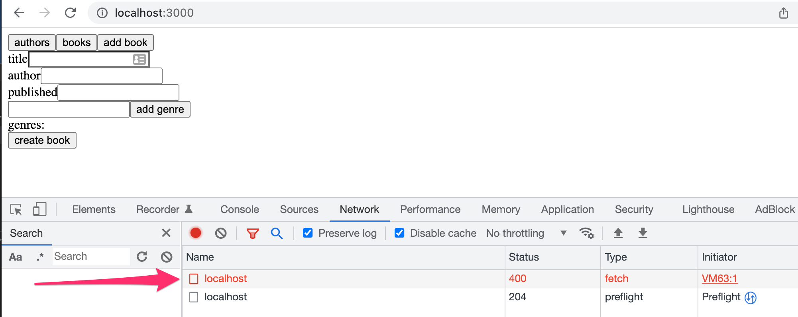
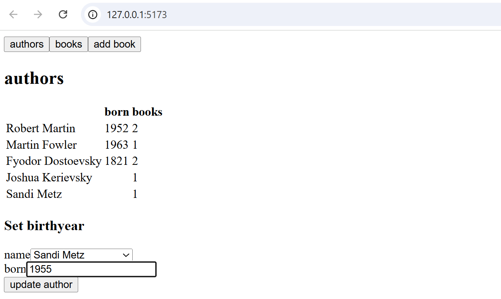

<div class="content">

We will next implement a React app that uses the GraphQL server we created.

The current code of the server can be found on [GitHub](https://github.com/fullstack-hy2020/graphql-phonebook-backend/tree/part8-3), branch <i>part8-3</i>.

In theory, we could use GraphQL with HTTP POST requests. The following shows an example of this with Postman:


The communication works by sending HTTP POST requests to <http://localhost:4000/graphql>. The query itself is a string sent as the value of the key <i>query</i>.

We could take care of the communication between the React app and GraphQL by using Axios. However, most of the time, it is not very sensible to do so. It is a better idea to use a higher-order library capable of abstracting the unnecessary details of the communication.

At the moment, there are two good options: [Relay](https://facebook.github.io/relay/) by Facebook and [Apollo Client](https://www.apollographql.com/docs/react/), which is the client side of the same library we used in the previous section. Apollo is absolutely the most popular of the two, and we will use it in this section as well.

### Apollo client

Let's create a new React app and install the necessary dependencies for [Apollo client](https://www.apollographql.com/docs/react/get-started/).

```bash
npm install @apollo/client graphql
```

Replace the default contents of the file <i>main.jsx</i> with the following program skeleton:

```js
import { StrictMode } from 'react'
import { createRoot } from 'react-dom/client'
import App from './App.jsx'

import { ApolloClient, gql, HttpLink, InMemoryCache } from '@apollo/client'

const client = new ApolloClient({
  link: new HttpLink({
    uri: 'http://localhost:4000',
  }),
  cache: new InMemoryCache(),
})

const query = gql`
  query {
    allPersons {
      name
      phone
      address {
        street
        city
      }
      id
    }
  }
`

client.query({ query }).then((response) => {
  console.log(response.data)
})

createRoot(document.getElementById('root')).render(
  <StrictMode>
    <App />
  </StrictMode>,
)
```

The beginning of the code creates a new [client](https://www.apollographql.com/docs/react/get-started#step-3-initialize-apolloclient) object, which is then used to send a query to the server:

```js
client.query({ query }).then((response) => {
  console.log(response.data)
})
```

The server's response is printed to the console:


A _gql_ tag is added before the template literal that forms the query, imported from the @apollo/client package:

```js
import { ApolloClient, gql, HttpLink, InMemoryCache } from '@apollo/client' // highlight-line

// ...

const query = gql // highlight-line `
  query {
    allPersons {
      name
      phone
      address {
        street
        city
      }
      id
    }
  }
`
```

Thanks to the tag, VS Code’s GraphQL extension and other tooling recognize the definition as GraphQL, enabling features like syntax highlighting in the editor. On the server side, we achieved the same by adding a type-indicating comment before the template literal, because the @apollo/server library used on the server does not include a corresponding _gql_ tag.

The application can communicate with a GraphQL server using the *client* object. The client can be made accessible for all components of the application by wrapping the <i>App</i> component with [ApolloProvider](https://www.apollographql.com/docs/react/get-started#step-4-connect-your-client-to-react).

```js
import { StrictMode } from 'react'
import { createRoot } from 'react-dom/client'
import App from './App.jsx'

import { ApolloClient, gql, HttpLink, InMemoryCache } from '@apollo/client'
import { ApolloProvider } from '@apollo/client/react' // highlight-line

const client = new ApolloClient({
  link: new HttpLink({
    uri: 'http://localhost:4000',
  }),
  cache: new InMemoryCache(),
})

// ...

createRoot(document.getElementById('root')).render(
  <StrictMode>
    <ApolloProvider client={client}> // highlight-line
      <App />
    </ApolloProvider> // highlight-line
  </StrictMode>,
)
```

### Making queries

We are ready to implement the main view of the application, which shows a list of person's name and phone number.

Apollo Client offers a few alternatives for making [queries](https://www.apollographql.com/docs/react/data/queries/).
Currently, the use of the hook function [useQuery](https://www.apollographql.com/docs/react/api/react/hooks/#usequery) is the dominant practice.

The query is made by the <i>App</i> component, the code of which is as follows:

```js
import { gql } from '@apollo/client'
import { useQuery } from '@apollo/client/react'

const ALL_PERSONS = gql`
  query {
    allPersons {
      name
      phone
      id
    }
  }
`

const App = () => {
  const result = useQuery(ALL_PERSONS)

  if (result.loading) {
    return <div>loading...</div>
  }

  return (
    <div>
      {result.data.allPersons.map(p => p.name).join(', ')}
    </div>
  )
}

export default App
```

When called, *useQuery* makes the query it receives as a parameter.
It returns an object with multiple [fields](https://www.apollographql.com/docs/react/api/react/hooks/#result).
The field <i>loading</i> is true if the query has not received a response yet.
Then the following code gets rendered:

```js
if (result.loading) {
  return <div>loading...</div>
}
```

When a response is received, the result of the <i>allPersons</i> query can be found in the data</i> field, and we can render the list of names to the screen.

```js
<div>
  {result.data.allPersons.map(p => p.name).join(', ')}
</div>
```

Separate the display of persons into its own component in the file <i>src/components/Persons.jsx</i>:

```js
const Persons = ({ persons }) => {
  return (
    <div>
      <h2>Persons</h2>
      {persons.map(p =>
        <div key={p.id}>
          {p.name} {p.phone}
        </div>  
      )}
    </div>
  )
}

export default Persons
```

The *App* component still makes the query, and passes the result to the new component to be rendered:

```js
import { gql } from '@apollo/client'
import { useQuery } from '@apollo/client/react'
import Persons from './components/Persons' // highlight-line

// ...

const App = () => {
  const result = useQuery(ALL_PERSONS)

  if (result.loading) {
    return <div>loading...</div>
  }

  return <Persons persons={result.data.allPersons} /> // highlight-line
}

```

### Named queries and variables

Let's implement functionality for viewing the address details of a person. The <i>findPerson</i> query is well-suited for this.

The queries we did in the last chapter had the parameter hardcoded into the query:

```js
query {
  findPerson(name: "Arto Hellas") {
    phone 
    city 
    street
    id
  }
}
```

When we do queries programmatically, we must be able to give them parameters dynamically.

GraphQL [variables](https://graphql.org/learn/queries/#variables) are well-suited for this. To be able to use variables, we must also name our queries.

A good format for the query is this:

```js
query findPersonByName($nameToSearch: String!) {
  findPerson(name: $nameToSearch) {
    name
    phone 
    address {
      street
      city
    }
  }
}
```

The name of the query is <i>findPersonByName</i>, and it is given a string <i>$nameToSearch</i> as a parameter.

It is also possible to do queries with parameters with the Apollo Explorer. The parameters are given in <i>Variables</i>:


The *useQuery* hook is well-suited for situations where the query is done when the component is rendered.  However, we now want to make the query only when a user wants to see the details of a specific person, so the query is done only [as required](https://www.apollographql.com/docs/react/data/queries/#executing-queries-manually).

One possibility for this kind of situations is the hook function [useLazyQuery](https://www.apollographql.com/docs/react/api/react/useLazyQuery) that would make it possible to define a query which is executed <i>when</i> the user wants to see the detailed information of a person.

However, in our case we can stick to *useQuery* and use the option [skip](https://www.apollographql.com/docs/react/data/queries#skipoptional), which makes it possible to do the query only if a set condition is true.

After the changes, the file <i>Persons.jsx</i> looks as follows:

```js
import { useState } from 'react'
import { gql } from '@apollo/client'
import { useQuery } from '@apollo/client/react'

const FIND_PERSON = gql`
  query findPersonByName($nameToSearch: String!) {
    findPerson(name: $nameToSearch) {
      name
      phone
      id
      address {
        street
        city
      }
    }
  }
`

const Person = ({ person, onClose }) => {
  return (
    <div>
      <h2>{person.name}</h2>
      <div>
        {person.address.street} {person.address.city}
      </div>
      <div>{person.phone}</div>
      <button onClick={onClose}>close</button>
    </div>
  )
}

const Persons = ({ persons }) => {
  // highlight-start
  const [nameToSearch, setNameToSearch] = useState(null)
  const result = useQuery(FIND_PERSON, {
    variables: { nameToSearch },
    skip: !nameToSearch,
  })
  // highlight-end

  // highlight-start
  if (nameToSearch && result.data) {
    return (
      <Person
        person={result.data.findPerson}
        onClose={() => setNameToSearch(null)}
      />
    )
  }
  // highlight-end

  return (
    <div>
      <h2>Persons</h2>
      {persons.map((p) => (
        <div key={p.id}>
          {p.name} {p.phone}
          <button onClick={() => setNameToSearch(p.name)}> // highlight-line
            show address // highlight-line
          </button> // highlight-line
        </div>
      ))}
    </div>
  )
}

export default Persons
```

The code has changed quite a lot, and all of the changes are not completely apparent.

When the button <i>show address</i> of a person is pressed, the name of the person is set to state <i>nameToSearch</i>:

```js
<button onClick={() => setNameToSearch(p.name)}>
  show address
</button>
```

This causes the component to re-render itself. On render the query <i>FIND_PERSON</i> that fetches the detailed information of a user is executed if the variable <i>nameToSearch</i> has a value:

```js
const result = useQuery(FIND_PERSON, {
  variables: { nameToSearch },
  skip: !nameToSearch, // highlight-line
})
```

When the user is not interested in seeing the detailed info of any person, the state variable <i>nameToSearch</i> is null and the query is not executed.

If the state <i>nameToSearch</i> has a value and the query result is ready, the component <i>Person</i> renders the detailed info of a person:

```js
if (nameToSearch && result.data) {
  return (
    <Person
      person={result.data.findPerson}
      onClose={() => setNameToSearch(null)}
    />
  )
}
```

A single-person view looks like this:


When a user wants to return to the person list, the *nameToSearch* state is set to *null*.

The current code of the application can be found on [GitHub](https://github.com/fullstack-hy2020/graphql-phonebook-frontend/tree/part8-1) branch <i>part8-1</i>.

### Cache

When we do multiple queries, for example with the address details of Arto Hellas, we notice something interesting: the query to the backend is done only the first time around. After this, despite the same query being done again by the code, the query is not sent to the backend.


Apollo client saves the responses of queries to [cache](https://www.apollographql.com/docs/react/caching/overview/). To optimize performance if the response to a query is already in the cache, the query is not sent to the server at all.


Cache shows the detailed info of Arto Hellas after the query <i>findPerson</i>:


### Doing mutations

Let's implement functionality for adding new persons.

 In the previous chapter, we hardcoded the parameters for mutations. Now, we need a version of the addPerson mutation which uses [variables](https://graphql.org/learn/queries/#variables):

```js
const CREATE_PERSON = gql`
  mutation createPerson(
    $name: String!
    $street: String!
    $city: String!
    $phone: String
  ) {
    addPerson(name: $name, street: $street, city: $city, phone: $phone) {
      name
      phone
      id
      address {
        street
        city
      }
    }
  }
`
```

The hook function [useMutation](https://www.apollographql.com/docs/react/api/react/hooks/#usemutation) provides the functionality for making mutations.

Create a new component <i>PersonForm</i> for adding a new person to the application. The contents of the file <i>src/components/PersonForm.jsx</i> are as follows:

```js
import { useState } from 'react'
import { gql } from '@apollo/client'
import { useMutation } from '@apollo/client/react'

const CREATE_PERSON = gql`
  mutation createPerson(
    $name: String!
    $street: String!
    $city: String!
    $phone: String
  ) {
    addPerson(name: $name, street: $street, city: $city, phone: $phone) {
      name
      phone
      id
      address {
        street
        city
      }
    }
  }
`

const PersonForm = () => {
  const [name, setName] = useState('')
  const [phone, setPhone] = useState('')
  const [street, setStreet] = useState('')
  const [city, setCity] = useState('')

  const [createPerson] = useMutation(CREATE_PERSON) // highlight-line

  const submit = (event) => {
    event.preventDefault()

    // highlight-start
    createPerson({ variables: { name, phone, street, city } })
    // highlight-end

    setName('')
    setPhone('')
    setStreet('')
    setCity('')
  }

  return (
    <div>
      <h2>create new</h2>
      <form onSubmit={submit}>
        <div>
          name <input value={name}
            onChange={({ target }) => setName(target.value)}
          />
        </div>
        <div>
          phone <input value={phone}
            onChange={({ target }) => setPhone(target.value)}
          />
        </div>
        <div>
          street <input value={street}
            onChange={({ target }) => setStreet(target.value)}
          />
        </div>
        <div>
          city <input value={city}
            onChange={({ target }) => setCity(target.value)}
          />
        </div>
        <button type='submit'>add!</button>
      </form>
    </div>
  )
}

export default PersonForm
```

The code of the form is straightforward and the interesting lines have been highlighted.
We can define mutation functions using the *useMutation* hook.
The hook returns an <i>array</i>, the first element of which contains the function to cause the mutation.

```js
const [createPerson] = useMutation(CREATE_PERSON)
```

The query variables receive values when the query is made:

```js
createPerson({ variables: { name, phone, street, city } })
```
Enable the <i>PersonForm</i> component in the file <i>App.jsx</i>:

```js
import { gql } from '@apollo/client'
import { useQuery } from '@apollo/client/react'
import PersonForm from './components/PersonForm' // highlight-line
import Persons from './components/Persons'

// ...

const App = () => {
  const result = useQuery(ALL_PERSONS)

  if (result.loading) {
    return <div>loading...</div>
  }

  // highlight-start
  return (
    <div>
      <Persons persons={result.data.allPersons} />
      <PersonForm /> 
    </div>
  )
  // highlight-end
}

export default App
```

New persons are added just fine, but the screen is not updated. This is because Apollo Client cannot automatically update the cache of an application, so it still contains the state from before the mutation.
We could update the screen by reloading the page, as the cache is emptied when the page is reloaded. However, there must be a better way to do this.

### Updating the cache

There are a few different solutions for this. One way is to make the query for all persons [poll](https://www.apollographql.com/docs/react/data/queries/#polling) the server, or make the query repeatedly.

The change is small. Let's set the query to poll every two seconds:

```js
const App = () => {
  const result = useQuery(ALL_PERSONS, {
    pollInterval: 2000 // highlight-line
  })

  if (result.loading)  {
    return <div>loading...</div>
  }

  return (
    <div>
      <Persons persons = {result.data.allPersons}/>
      <PersonForm />
    </div>
  )
}

export default App
```

The solution is simple, and every time a user adds a new person, it appears immediately on the screens of all users.

The downside of polling is, of course, the unnecessary network traffic it causes. In addition, the page may start to flicker, since the component is re-rendered with each query update and _result.loading_ is true for a brief moment—so a <i>loading...</i> text flashes on the screen for an instant.

Another easy way to keep the cache in sync is to use the *useMutation* hook's [refetchQueries](https://www.apollographql.com/docs/react/data/refetching/) parameter to define that the query fetching all persons is done again whenever a new person is created.

```js
// ...

const ALL_PERSONS = gql // highlight-line `
  query { // highlight-line
    allPersons { // highlight-line
      name // highlight-line
      phone // highlight-line
      id // highlight-line
    } // highlight-line
  } // highlight-line
` // highlight-line


const PersonForm = () => {
  const [name, setName] = useState('')
  const [phone, setPhone] = useState('')
  const [street, setStreet] = useState('')
  const [city, setCity] = useState('')

  // highlight-start
  const [createPerson] = useMutation(CREATE_PERSON, {
    refetchQueries: [{ query: ALL_PERSONS }],
  })
  // highlight-end

  // ...
}
```

The pros and cons of this solution are almost opposite of the previous one. There is no extra web traffic because queries are not done just in case.  However, if one user now updates the state of the server, the changes do not show to other users immediately.

If you want to do multiple queries, you can pass multiple objects inside refetchQueries. This will allow you to update different parts of your app at the same time. Here is an example:

```js
const [createPerson] = useMutation(CREATE_PERSON, {
  refetchQueries: [
    { query: ALL_PERSONS },
    { query: OTHER_QUERY },
    { query: ANOTHER_QUERY },
  ], // pass as many queries as you need
})
```

There are other ways to update the cache. More about those later in this part.

At the moment, queries and components are defined in the same place in our code.
Let's separate the query definitions into their own file <i>src/queries.js</i>:

```js 
import { gql } from '@apollo/client'

export const ALL_PERSONS = gql`
  query {
    allPersons {
      name
      phone
      id
    }
  }
`

export const FIND_PERSON = gql`
  query findPersonByName($nameToSearch: String!) {
    findPerson(name: $nameToSearch) {
      name
      phone
      id
      address {
        street
        city
      }
    }
  }
`

export const CREATE_PERSON = gql`
  mutation createPerson(
    $name: String!
    $street: String!
    $city: String!
    $phone: String
  ) {
    addPerson(name: $name, street: $street, city: $city, phone: $phone) {
      name
      phone
      id
      address {
        street
        city
      }
    }
  }
`
```

Each component then imports the queries it needs:

```js
import { ALL_PERSONS } from './queries'

const App = () => {
  const result = useQuery(ALL_PERSONS)
  // ...
}
```

The current code of the application can be found on [GitHub](https://github.com/fullstack-hy2020/graphql-phonebook-frontend/tree/part8-2) branch <i>part8-2</i>.

### Handling mutation errors

If we try to create an invalid person, for example by using a name that already exists in the application, nothing happens. The person is not added to the application, but we also do not receive any error message.

Earlier, we defined a check on the server that prevents adding another person with the same name and throws an error in such a situation. However, the error is not yet handled in the frontend. Using the _onError_ [option](https://www.apollographql.com/docs/react/api/react/hooks/#params-2) of the _useMutation_ hook, it is possible to register an error handler function for mutations.

Let’s register an error handler for the mutation. The <i>PersonForm</i> component receives a _setError_ function as a prop, which is used to set a message indicating the error:


```js
const PersonForm = ({ setError }) => { // highlight-line
  // ... 

  const [ createPerson ] = useMutation(CREATE_PERSON, {
    refetchQueries: [  {query: ALL_PERSONS } ],
    onError: (error) => setError(error.message), // highlight-line
  })

  // ...
}
```

Create a separate component for the notification in the file <i>scr/components/Notify.jsx</i>:

```js
const Notify = ({ errorMessage }) => {
  if (!errorMessage) {
    return null
  }
  return (
    <div style={{ color: 'red' }}>
      {errorMessage}
    </div>
  )
}

export default Notify
```

The component receives a possible error message as a prop. If an error message is set, it is rendered on the screen.

Render the <i>Notify</i> component that displays the error message in the file <i>App.jsx</i>:

```js
import Notify from './components/Notify' // highlight-line

// ... 

const App = () => {
  const [errorMessage, setErrorMessage] = useState(null) // highlight-line

  const result = useQuery(ALL_PERSONS)

  if (result.loading)  {
    return <div>loading...</div>
  }

// highlight-start
  const notify = (message) => {
    setErrorMessage(message)
    setTimeout(() => {
      setErrorMessage(null)
    }, 10000)
  }
  // highlight-end

  return (
    <div>
      <Notify errorMessage={errorMessage} />  // highlight-line
      <Persons persons = {result.data.allPersons} />
      <PersonForm setError={notify} />  // highlight-line
    </div>
  )
}
```

Now the user is informed about an error with a simple notification.


The current code of the application can be found on [GitHub](https://github.com/fullstack-hy2020/graphql-phonebook-frontend/tree/part8-3) branch <i>part8-3</i>.

### Updating a phone number

Let's add the possibility to change the phone numbers of persons to our application. The solution is almost identical to the one we used for adding new persons.

The mutation again requires the use of variables. Add the following query to the file <i>queries.js</i>:

```js
export const EDIT_NUMBER = gql`
  mutation editNumber($name: String!, $phone: String!) {
    editNumber(name: $name, phone: $phone) {
      name
      phone
      address {
        street
        city
      }
      id
    }
  }
`
```

Create a new component <i>PhoneForm</i> in the file <i>src/components/PhoneForm.jsx</i> for updating a phone number. The component adds a form to the application where you can enter a new phone number for a selected person. The interesting parts of the code are highlighted:

```js
import { useState } from 'react'
import { useMutation } from '@apollo/client/react'
import { EDIT_NUMBER } from '../queries'

const PhoneForm = () => {
  const [name, setName] = useState('')
  const [phone, setPhone] = useState('')

// highlight-start
  const [ changeNumber ] = useMutation(EDIT_NUMBER)
// highlight-end

  const submit = (event) => {
    event.preventDefault()

// highlight-start
    changeNumber({ variables: { name, phone } })
    // highlight-end

    setName('')
    setPhone('')
  }

  return (
    <div>
      <h2>change number</h2>

      <form onSubmit={submit}>
        <div>
          name <input
            value={name}
            onChange={({ target }) => setName(target.value)}
          />
        </div>
        <div>
          phone <input
            value={phone}
            onChange={({ target }) => setPhone(target.value)}
          />
        </div>
        <button type='submit'>change number</button>
      </form>
    </div>
  )
}

export default PhoneForm
```

The <i>PhoneForm</i> component is straightforward: it asks for the person's name and a new phone number via a form. When the form is submitted, it calls the _changeNumber_ function that handles the update, created with the _useMutation_ hook.

Enable the new component in the file <i>App.jsx</i>:

```js
import PhoneForm from './components/PhoneForm' // highlight-line

const App = () => {
  // ...

  return (
    <div>
      <Notify errorMessage={errorMessage} />
      <Persons persons={result.data.allPersons} />
      <PersonForm setError={notify} />
      <PhoneForm setError={notify} /> // highlight-line
    </div>
  )
}
```

It looks bleak, but it works:


Surprisingly, when a person's number is changed, the new number automatically appears on the list of persons rendered by the <i>Persons</i> component.
This happens because each person has an identifying field of type <i>ID</i>, so the person's details saved to the cache update automatically when they are changed with the mutation.

Our application still has one small flaw. If we try to change the phone number for a name which does not exist, nothing seems to happen.
This happens because if a person with the given name cannot be found,
the mutation response is <i>null</i>:


Since this isn’t considered an error state from GraphQL’s point of view, registering an _onError_ error handler wouldn’t be useful in this situation. However, we can add an _onCompleted_ callback to the _useMutation_ hook, where we can generate a potential error message:

```js
const PhoneForm = ({ setError }) => { // highlight-line
  const [name, setName] = useState('')
  const [phone, setPhone] = useState('')

  // highlight-start
  const [changeNumber] = useMutation(EDIT_NUMBER, {
    onCompleted: (data) => {
      if (!data.editNumber) {
        setError('person not found')
      }
    }
  })
  // highlight-end

  // ...
}
```

The _onCompleted_ callback function is always executed when the mutation has been successfully completed. If the person wasn’t found—that is, if the query result _data.editNumber_ is _null_—the component uses the _setError_ callback function it received via props to set an appropriate error message.

The current code of the application can be found on [GitHub](https://github.com/fullstack-hy2020/graphql-phonebook-frontend/tree/part8-4) branch <i>part8-4</i>.

### Apollo Client and the applications state

In our example, management of the applications state has mostly become the responsibility of Apollo Client. This is quite a typical solution for GraphQL applications.
Our example uses the state of the React components only to manage the state of a form and to show error notifications. As a result, it could be that there are no justifiable reasons to use Redux to manage application state when using GraphQL.

When necessary, Apollo enables saving the application's local state to [Apollo cache](https://www.apollographql.com/docs/react/local-state/local-state-management/).

</div>

<div class="tasks">

### Exercises 8.8.-8.12

Through these exercises, we'll implement a frontend for the GraphQL library.

Take [this project](https://github.com/fullstack-hy2020/library-frontend) as a start for your application.

**Note** if you want, you can also use [React router](/en/part7/react_router) to implement the application's navigation!

#### 8.8: Authors view

Implement an Authors view to show the details of all authors on a page as follows:


#### 8.9: Books view

Implement a Books view that shows the details of all books except their genres.


#### 8.10: Adding a book

Implement a possibility to add new books to your application. The functionality can look like this:


Make sure that the Authors and Books views are kept up to date after a new book is added.

In case of problems when making queries or mutations, check from the developer console what the server response is:



The Chrome extension [Apollo Client Devtools](https://chrome.google.com/webstore/detail/apollo-client-developer-t/jdkknkkbebbapilgoeccciglkfbmbnfm/related) can be very helpful in diagnosing the situation.

#### 8.11: Authors birth year

Implement a possibility to set authors birth year. You can create a new view for setting the birth year, or place it on the Authors view:


Make sure that the Authors view is kept up to date after setting a birth year.

#### 8.12: Authors birth year advanced

Make the birth year form such that the birth year can be set via a dropdown only for an existing author. You can use, for example, the [select element](https://react.dev/reference/react-dom/components/select) or a separate library like [react-select](https://github.com/JedWatson/react-select).

The solution looks as follows using a <i>select</i> element:



</div>
