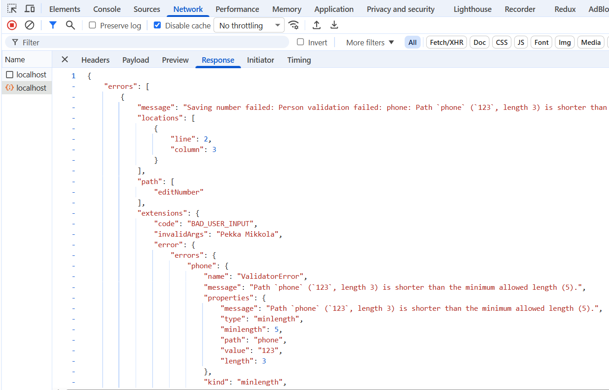
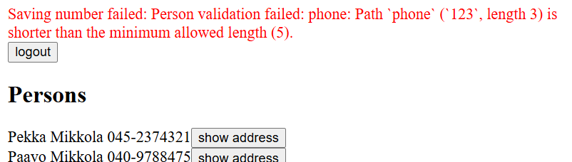

<div class="content">

The frontend of our application shows the phone directory just fine with the updated server. However, if we want to add new persons, we have to add login functionality to the frontend.

### User login

Let’s first define the mutation for logging in in the file <i>src/queries.js</i>:

```js
export const LOGIN = gql`
  mutation login($username: String!, $password: String!) {
    login(username: $username, password: $password)  {
      value
    }
  }
`
```

Let’s define the _LoginForm_ component responsible for logging in in the file <i>src/components/LoginForm.jsx</i>. It works in much the same way as the earlier components that handle mutations. The interesting lines are highlighted in the code:

```js
import { useState } from 'react'
import { useMutation } from '@apollo/client/react'
import { LOGIN } from '../queries'

const LoginForm = ({ setError, setToken }) => { // highlight-line
  const [username, setUsername] = useState('')
  const [password, setPassword] = useState('')

  // highlight-start
  const [ login ] = useMutation(LOGIN, {
    onCompleted: (data) => {
      const token = data.login.value
      setToken(token)
      localStorage.setItem('phonebook-user-token', token)
    },
    onError: (error) => {
      setError(error.message)
    }
  })
  // highlight-end

  // highlight-start
  const submit = (event) => {
    event.preventDefault()
    login({ variables: { username, password } })
  }
  // highlight-end

  return (
    <div>
      <form onSubmit={submit}>
        <div>
          username <input
            value={username}
            onChange={({ target }) => setUsername(target.value)}
          />
        </div>
        <div>
          password <input
            type='password'
            value={password}
            onChange={({ target }) => setPassword(target.value)}
          />
        </div>
        <button type='submit'>login</button>
      </form>
    </div>
  )
}

export default LoginForm
```

The component receives the functions _setError_ and _setToken_ as props, which can be used to change the application state. Defining state management is left to the _App_ component.

For the _useMutation_ function that performs the login, an _onCompleted_ callback function is defined. It is called when the mutation has been successfully executed. In the callback, the token value is read from the response data and then stored in the application state and in the browser’s localStorage.

Let’s now use the <i>LoginForm</i> component in the <i>App.jsx</i> file. We add a _token_ variable to the application state to store the token once the user has logged in. If _token_ is not defined, we render only the login form:

```js
import LoginForm from './components/LoginForm' // highlight-line
// ...

const App = () => {
  const [token, setToken] = useState(localStorage.getItem('phonebook-user-token')) // highlight-line
  const [errorMessage, setErrorMessage] = useState(null)
  const result = useQuery(ALL_PERSONS)

  if (result.loading) {
    return <div>loading...</div>
  }

  const notify = (message) => {
    setErrorMessage(message)
    setTimeout(() => {
      setErrorMessage(null)
    }, 10000)
  }

  // highlight-start
  if (!token) {
    return (
      <div>
        <Notify errorMessage={errorMessage} />
        <h2>Login</h2>
        <LoginForm
          setToken={setToken}
          setError={notify}
        />
      </div>
    )
  }
  // highlight-end

  return (
    // ...
  )
}
```

The token is now initialized from a token value that may be found in localStorage:

```js
const [token, setToken] = useState(localStorage.getItem('phonebook-user-token'))
```

This way, the token is also restored when the page is reloaded, and the user stays logged in. If localStorage does not contain a value for the key <i>phonebook-user-token</i>, the token value will be _null_.

We also add a button that allows a logged-in user to log out. In the button’s click handler, we set _token_ to _null_, remove the token from localStorage, and reset the Apollo Client cache:

```js
import { useApolloClient, useQuery } from '@apollo/client/react' // highlight-line
//...

const App = () => {
  const [token, setToken] = useState(null)
  const [errorMessage, setErrorMessage] = useState(null)
  const result = useQuery(ALL_PERSONS)
  const client = useApolloClient() // highlight-line
  
  if (result.loading)  {
    return <div>loading...</div>
  }

  // highlight-start
  const onLogout = () => {
    setToken(null)
    localStorage.clear()
    client.resetStore()
  }
  // highlight-end

  // ...

  return (
    <>
      <Notify errorMessage={errorMessage} />
      <button onClick={onLogout}>logout</button> // highlight-line
      <Persons persons={result.data.allPersons} />
      <PersonForm setError={notify} />
      <PhoneForm setError={notify} />
    </>
  )
}
```
Resetting the cache is done using the Apollo _client_ object’s [resetStore](https://www.apollographql.com/docs/react/api/core/ApolloClient#resetstore) method, and the client itself can be accessed with the [useApolloClient](https://www.apollographql.com/docs/react/api/react/useApolloClient) hook. Clearing the cache is [important](https://www.apollographql.com/docs/react/networking/authentication/#reset-store-on-logout), because some queries may have fetched data into the cache that only an authenticated user is allowed to access.

### Adding a token to a header

After the backend changes, creating new persons requires that a valid user token is sent with the request. This requires changes to the Apollo Client configuration in the <i>main.jsx</i> file:

```js
import { StrictMode } from 'react'
import { createRoot } from 'react-dom/client'
import App from './App.jsx'

import { ApolloClient, HttpLink, InMemoryCache } from '@apollo/client'
import { ApolloProvider } from '@apollo/client/react'
import { SetContextLink } from '@apollo/client/link/context' // highlight-line

// highlight-start
const authLink  = new SetContextLink(({ headers }) => {
  const token = localStorage.getItem('phonebook-user-token')
  return {
    headers: {
      ...headers,
      authorization: token ? `Bearer ${token}` : null,
    }
  }
})
// highlight-end

const httpLink = new HttpLink({ uri: 'http://localhost:4000' }) // highlight-line

// highlight-start
const client = new ApolloClient({
  cache: new InMemoryCache(),
  link: authLink.concat(httpLink)
})
// highlight-end

createRoot(document.getElementById('root')).render(
  <StrictMode>
    <ApolloProvider client={client}>
      <App />
    </ApolloProvider>
  </StrictMode>,
)
```

As before, the server URL is wrapped using the [HttpLink](https://www.apollographql.com/docs/react/api/link/apollo-link-http) constructor to create a suitable _httpLink_ object. This time, however, it is modified using the [context](https://www.apollographql.com/docs/react/api/link/apollo-link-context/#overview) defined by the _authLink_ object so that, for each request, the <i>authorization</i> header is [set](https://www.apollographql.com/docs/react/networking/authentication/#header) to the token that may be stored in localStorage.

Creating new persons and changing numbers works again. 

### Fixing validations

In the application, it should be possible to add a person without a phone number. However, if we now try to add a person without a phone number, it doesn’t work:


Validation fails, because frontend sends an empty string as the value of *phone*.

Let's change the function creating new persons so that it sets *phone* to *undefined* if user has not given a value:

```js
const PersonForm = ({ setError }) => {
  // ...
  const submit = async (event) => {
    event.preventDefault()

    // highlight-start
    createPerson({
      variables: {
        name,
        street,
        city,
        phone: phone.length > 0 ? phone : undefined,
      },
    })
    // highlight-end

    setName('')
    setPhone('')
    setStreet('')
    setCity('')
  }

  // ...
}
```

From the perspective of the backend and the database, the <i>phone</i> attribute now has no value if the user leaves the field empty. Adding a person without a phone number works again.

There is also an issue with the functionality for changing a phone number. The database validations require that the phone number must be at least 5 characters long, but if we try to update an existing person’s phone number to one that is too short, nothing seems to happen. The person’s phone number is not updated, but on the other hand no error message is shown either.

From the console’s <i>Network</i> tab we can see that the request is answered with an error message:



Let’s modify the application so that validation errors are also shown when changing a phone number:

```js
const PhoneForm = ({ setError }) => {
  // ...

  const submit = async (event) => {
    event.preventDefault()

    // highlight-start
    try {
      await changeNumber({ variables: { name, phone } })
    } catch (error) {
      setError(error.message)
    }
    // highlight-end

    setName('')
    setPhone('')
  }

  // ...
}
```

The request that updates the number, _changeNumber_, is now executed inside a <i>try</i> block. If the database validations fail, execution ends up in the <i>catch</i> block, where an appropriate error message is set in the application using the _setError_ function:



### Updating cache, revisited

We have to [update](/en/part8/react_and_graph_ql#updating-the-cache) the cache of the Apollo client on creating new persons. We can update it using the mutation's *refetchQueries* option to define that the
<em>ALL\_PERSONS</em> query is done again.

```js 
const PersonForm = ({ setError }) => {
  // ...

  const [createPerson] = useMutation(CREATE_PERSON, {
    onError: (error) => setError(error.message),
    refetchQueries: [{ query: ALL_PERSONS }], // highlight-line
  })

// ...
}
```

This approach is pretty good, the drawback being that the query is always rerun with any updates.

It is possible to optimize the solution by updating the cache manually. This is done by defining an appropriate [update](https://www.apollographql.com/docs/react/data/mutations/#the-update-function) callback for the mutation instead of using the _refetchQueries_ attribute. Apollo executes this callback after the mutation completes:

```js
const PersonForm = ({ setError }) => {
  // ...

  const [createPerson] = useMutation(CREATE_PERSON, {
    onError: (error) => setError(error.message),
    // highlight-start
    update: (cache, response) => {
      cache.updateQuery({ query: ALL_PERSONS }, ({ allPersons }) => {
        return {
          allPersons: allPersons.concat(response.data.addPerson),
        }
      })
    },
    // highlight-end
  })
 
  // ..
}  
```

The callback function is given a reference to the cache and the data returned by the mutation as parameters. For example, in our case, this would be the created person.

Using the function [updateQuery](https://www.apollographql.com/docs/react/caching/cache-interaction/#using-updatequery-and-updatefragment) the code updates the
query ALLPERSONS in the cache by adding the new person to the cached data.

In some situations, the only sensible way to keep the cache up to date is using the *update* callback.

When necessary, it is possible to disable cache for the whole application or [single queries](https://www.apollographql.com/docs/react/api/react/hooks/#options) by setting the field managing the use of cache, [fetchPolicy](https://www.apollographql.com/docs/react/data/queries#setting-a-fetch-policy) as <em>no-cache</em>.

Be diligent with the cache. Old data in the cache can cause hard-to-find bugs. As we know, keeping the cache up to date is very challenging. According to a coder proverb:

> <i>There are only two hard things in Computer Science: cache invalidation and naming things.</i> Read more [here](https://martinfowler.com/bliki/TwoHardThings.html).

The current code of the application can be found on [Github](https://github.com/fullstack-hy2020/graphql-phonebook-frontend/tree/part8-5), branch <i>part8-5</i>.

</div>

<div class="tasks">

### Exercises 8.17.-8.22

#### 8.17 Listing books

After the backend changes, the list of books does not work anymore. Fix it.

#### 8.18 Log in

Adding new books and changing the birth year of an author do not work because they require a user to be logged in.

Implement login functionality and fix the mutations.

It is not necessary yet to handle validation errors.

You can decide how the login looks on the user interface. One possible solution is to make the login form into a separate view which can be accessed through a navigation menu:


The login form:


When a user is logged in, the navigation changes to show the functionalities which can only be done by a logged-in user:


#### 8.19 Books by genre, part 1

Complete your application to filter the book list by genre. Your solution might look something like this:


In this exercise, the filtering can be done using just React.

#### 8.20 Books by genre, part 2

Implement a view which shows all the books based on the logged-in user's favourite genre.


#### 8.21 books by genre with GraphQL

In the previous two exercises, the filtering could have been done using just React.
To complete this exercise, you should redo the filtering of the books based on a selected genre (that was done in exercise 8.19) using a GraphQL query to the server. If you already did so then you do not have to do anything.

This and the next exercise are quite **challenging**, like they should be this late in the course. It may help you to complete the easier exercises in the [next part](/en/part8/fragments_and_subscriptions) before doing 8.21 and 8.22.

#### 8.22 Up-to-date cache and book recommendations

If you did the previous exercise, that is, fetch the books in a genre with GraphQL, ensure somehow that the books view is kept up to date. So when a new book is added, the books view is updated **at least** when a genre selection button is pressed.

<i>When new genre selection is not done, the view does not have to be updated. </i>

</div>
