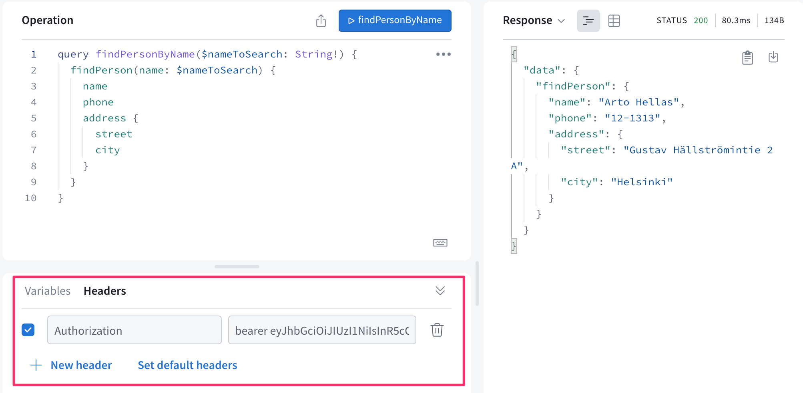

<div class="content">

Ahora agregaremos la administración de usuarios a nuestra aplicación, pero comencemos primero a usar una base de datos para almacenar datos.

### Mongoose y Apollo

Instalar mongoose y dotenv:

```bash
npm install mongoose dotenv
```

Imitaremos lo que hicimos en las partes [3](/es/part3/guardando_datos_en_mongo_db) y [4](/es/part4/estructura_de_la_aplicacion_backend_introduccion_a_las_pruebas).

El esquema de persona se ha definido de la siguiente manera:

```js
const mongoose = require('mongoose')

const schema = new mongoose.Schema({
  name: {
    type: String,
    required: true,
    unique: true,
    minlength: 5
  },
  phone: {
    type: String,
    minlength: 5
  },
  street: {
    type: String,
    required: true,
    minlength: 5
  },
  city: {
    type: String,
    required: true,
    minlength: 3
  },
})

module.exports = mongoose.model('Person', schema)
```

También incluimos algunas validaciones. *required: true*, que asegura que el valor exista, es realmente redundante, ya que el solo uso de GraphQL asegura que los campos existan. Sin embargo, es bueno mantener también la validación en la base de datos.

Podemos hacer que la aplicación funcione principalmente con los siguientes cambios:

```js
// ...
const mongoose = require('mongoose')
mongoose.set('strictQuery', false)
const Person = require('./models/person')

require('dotenv').config()

const MONGODB_URI = process.env.MONGODB_URI

console.log('connecting to', MONGODB_URI)

mongoose.connect(MONGODB_URI)
  .then(() => {
    console.log('connected to MongoDB')
  })
  .catch((error) => {
    console.log('error connection to MongoDB:', error.message)
  })

const typeDefs = gql`
  ...
`

const resolvers = {
  Query: {
    personCount: async () => Person.collection.countDocuments(),
    allPersons: async (root, args) => {
      // filters missing
      return Person.find({})
    },
    findPerson: async (root, args) => Person.findOne({ name: args.name }),
  },
  Person: {
    address: (root) => {
      return {
        street: root.street,
        city: root.city,
      }
    },
  },
  Mutation: {
    addPerson: async (root, args) => {
      const person = new Person({ ...args })
      return person.save()
    },
    editNumber: async (root, args) => {
      const person = await Person.findOne({ name: args.name })
      person.phone = args.phone
      return person.save()
    },
  },
}
```

Los cambios son bastante sencillos. Sin embargo, hay algunas cosas dignas de mención. Como recordamos, en Mongo el campo de identificación de un objeto se llama <i>_id</i> y previamente tuvimos que analizar el nombre del campo a <i>id</i> nosotros mismos. Ahora GraphQL puede hacer esto automáticamente.

Otra cosa digna de mención es que las funciones de resolución ahora devuelven una <i>promesa</i>, cuando antes devolvían objetos normales. Cuando un resolutor devuelve una promesa, el servidor Apollo [devuelve](https://www.apollographql.com/docs/apollo-server/data/data/#resolver-results) el valor al que se resuelve la promesa.

Por ejemplo, si se ejecuta la siguiente función de resolución,

```js
allPersons: (root, args) => {
  return Person.find({})
},
```

El servidor Apollo espera que se resuelva la promesa y devuelve el resultado . Entonces, Apollo funciona más o menos así:

```js
Person.find({}).then( result => {
  // return the result 
})
```

Completemos la resolución de *allPersons* para que tome en cuenta el parámetro opcional *phone*:

```js
Query: {
  // ..
  allPersons: (root, args) => {
    if (!args.phone) {
      return Person.find({})
    }

    return Person.find({ phone: { $exists: args.phone === 'YES'  }})
  },
},
```

Entonces, si la consulta no tiene un parámetro *phone*, todas las personas son devueltas. Si el parámetro tiene el valor <i>YES</i>, el resultado de la consulta

```js
Person.find({ phone: { $exists: true }})
```

se devuelve, por lo que los objetos en los que el campo *phone* tiene un valor. Si el parámetro tiene el valor <i>NO</i>, la consulta devuelve los objetos en los que el campo *phone* no tiene valor:

```js
Person.find({ phone: { $exists: false }})
```

### Validación

Al igual que en GraphQL, la entrada ahora se valida utilizando las validaciones definidas en el esquema de mangosta. Para manejar posibles errores de validación en el esquema, debemos agregar un bloque de manejo de errores *try/catch* al método *save*. Cuando terminamos en la captura, lanzamos una excepción adecuada:

```js
Mutation: {
  addPerson: async (root, args) => {
      const person = new Person({ ...args })

      try {
        await person.save()
      } catch (error) {
        throw new UserInputError(error.message, {
          invalidArgs: args,
        })
      }
      return person
  },
    editNumber: async (root, args) => {
      const person = await Person.findOne({ name: args.name })
      person.phone = args.phone

      try {
        await person.save()
      } catch (error) {
        throw new UserInputError(error.message, {
          invalidArgs: args,
        })
      }
      return person
    }
}
```

El código del backend se puede encontrar en [Github](https://github.com/fullstack-hy2020/graphql-phonebook-backend/tree/part8-4), rama <i>part8-4</i>.

### Usuario e inicio de sesión

Agreguemos la administración de usuarios a nuestra aplicación. Por simplicidad, supongamos que todos los usuarios tienen la misma contraseña que está codificada en el sistema. Sería sencillo guardar contraseñas individuales para todos los usuarios siguiendo los principios de la [parte 4](/es/part4/user_administration), pero debido a que nuestro enfoque está en GraphQL, esta vez dejaremos de lado toda esa molestia adicional.

El esquema de usuario es el siguiente:

```js
const mongoose = require('mongoose')

const schema = new mongoose.Schema({
  username: {
    type: String,
    required: true,
    unique: true,
    minlength: 3
  },
  friends: [
    {
      type: mongoose.Schema.Types.ObjectId,
      ref: 'Person'
    }
  ],
})

module.exports = mongoose.model('User', schema)
```

Cada usuario está conectado a un grupo de otras personas en el sistema a través del campo *friends*. La idea es que cuando un usuario, es decir, <i> mluukkai </i>, agrega una persona, es decir, <i> Arto Hellas </i>, a la lista, la persona se agrega a su lista de *amigos*. De esta manera, los usuarios registrados pueden tener su propia vista personalizada en la aplicación.

El inicio de sesión e identificación del usuario se maneja de la misma manera que usamos en la [parte 4](/es/part4/token_authentication) cuando usamos REST, usando tokens.

Extendamos el esquema así:

```js
type User {
  username: String!
  friends: [Person!]!
  id: ID!
}

type Token {
  value: String!
}

type Query {
  // ..
  me: User
}

type Mutation {
  // ...
  createUser(
    username: String!
  ): User
  login(
    username: String!
    password: String!
  ): Token
}
```

La consulta *me* devuelve el usuario actualmente conectado. Los nuevos usuarios se crean con la mutación *createUser* y el inicio de sesión ocurre con la mutación *login*.

Los resolutores de las mutaciones son los siguientes:

```js
const jwt = require('jsonwebtoken')

Mutation: {
  // ..
  createUser: async (root, args) => {
    const user = new User({ username: args.username })

    return user.save()
      .catch(error => {
        throw new GraphQLError('Creating the user failed', {
          extensions: {
            code: 'BAD_USER_INPUT',
            invalidArgs: args.name,
            error
          }
        })
      })
  },
  login: async (root, args) => {
    const user = await User.findOne({ username: args.username })

    if ( !user || args.password !== 'secret' ) {
      throw new GraphQLError('wrong credentials', {
        extensions: {
          code: 'BAD_USER_INPUT'
        }
      })        
    }

    const userForToken = {
      username: user.username,
      id: user._id,
    }

    return { value: jwt.sign(userForToken, process.env.JWT_SECRET) }
  },
},
```

La nueva mutación de usuario es sencilla. La mutación de inicio de sesión comprueba si el par de nombre de usuario/contraseña es válido. Y si de hecho es válido, devuelve un token jwt familiar de [parte 4](/es/part4/token_authentication).

Al igual que en el caso anterior con REST, la idea ahora es que un usuario que haya iniciado sesión agregue un token que reciba al iniciar sesión a todas sus solicitudes. Y al igual que con REST, el token se agrega a las consultas GraphQL usando el encabezado <i>Authorization</i>. Nota que la variable de entorno *JWT\_SECRET* debe estar definida en el archivo <i>.env</i>.

La creación de usuarios ahora se realiza de la siguiente manera:

```js
mutation {
  createUser (
    username: "mluukkai"
  ) {
    username
    id
  }
}
```

La mutación de inicio de sesión se realiza de la siguiente manera:

```js
mutation {
  login (
    username: "mluukkai"
    password: "secret"
  ) {
    value
  }
}
```

Exactamente como en el caso anterior con REST, la idea ahora es que un usuario que haya iniciado sesión agregue un token que reciba al iniciar sesión a todas sus solicitudes. Y al igual que con REST, el token se agrega a las consultas GraphQL usando el header <i>Authorization</i>.

En el explorador de Apollo, el header se puede agregar de la siguiente manera:



Modifica el inicio del backend dando a la función que maneja el inicio [startStandaloneServer](https://www.apollographql.com/docs/apollo-server/api/standalone/) otro parámetro [context](https://www.apollographql.com/docs/apollo-server/data/context/)

```js
startStandaloneServer(server, {
  listen: { port: 4000 },
  // highlight-start
  context: async ({ req, res }) => {
    const auth = req ? req.headers.authorization : null
    if (auth && auth.startsWith('Bearer ')) {
      const decodedToken = jwt.verify(
        auth.substring(7), process.env.JWT_SECRET
      )
      const currentUser = await User
        .findById(decodedToken.id).populate('friends')
      return { currentUser }
    }
  },
  // highlight-end
}).then(({ url }) => {
  console.log(`Server ready at ${url}`)
})
```

El objeto devuelto por el contexto se le da a todos los resolutores como su <i>tercer parámetro</i>. El contexto es el lugar adecuado para hacer cosas que comparten varios resolutores, como [identificación de usuario](https://blog.apollographql.com/authorization-in-graphql-452b1c402a9?_ga=2.45656161.474875091.1550613879-1581139173.1549828167).

Entonces, nuestro código establece el objeto correspondiente al usuario que realizó la solicitud al campo *currentUser* del contexto. Si no hay ningún usuario conectado a la solicitud, el valor del campo no está definido.

El resolutor de la consulta *me* es muy simple, simplemente devuelve el usuario que ha iniciado sesión que recibe en el campo *currentUser* del tercer parámetro del resolutor, *context*. Vale la pena señalar que si no hay un usuario que haya iniciado sesión, es decir, no hay un token válido en el encabezado adjunto a la solicitud, la consulta devuelve <i>null</i>:

```js
Query: {
  // ...
  me: (root, args, context) => {
    return context.currentUser
  }
},
```

### Lista de amigos

Completemos el backend de la aplicación para que agregar y editar personas requiera iniciar sesión, y las personas agregadas se agreguen automáticamente al lista de amigos del usuario.

Primero eliminemos de la base de datos a todas las personas que no estén en la lista de amigos de nadie.

La mutación *addPerson* cambia así:

```js
Mutation: {
    addPerson: async (root, args, context) => { // highlight-line
      const person = new Person({ ...args })
      const currentUser = context.currentUser // highlight-line

      // highlight-start
      if (!currentUser) {
        throw new GraphQLError('not authenticated', {
          extensions: {
            code: 'BAD_USER_INPUT',
          }
        })
      }
      // highlight-end

      try {
        await person.save()
        currentUser.friends = currentUser.friends.concat(person) // highlight-line
        await currentUser.save() // highlight-line
      } catch (error) {
        throw new GraphQLError('Saving user failed', {
          extensions: {
            code: 'BAD_USER_INPUT',
            invalidArgs: args.name,
            error
          }
        })
      }
      
      return person
    },
  //...
}
```

Si no se puede encontrar un usuario registrado en el contexto, se lanza un *AuthenticationError*. La creación de nuevas personas ahora se realiza con la sintaxis *async / await*, porque si la operación es exitosa, la persona creada se agrega a la lista de amigos del usuario.

También agreguemos funcionalidad para agregar un usuario existente a su lista de amigos. La mutación es la siguiente:

```js
type Mutation {
  // ...
  addAsFriend(
    name: String!
  ): User
}
```

Y los resolutores de las mutaciones:

```js
  addAsFriend: async (root, args, { currentUser }) => {
    const isFriend = (person) => 
      currentUser.friends.map(f => f._id.toString()).includes(person._id.toString())

    if (!currentUser) {
      throw new GraphQLError('wrong credentials', {
        extensions: { code: 'BAD_USER_INPUT' }
      }) 
    }

    const person = await Person.findOne({ name: args.name })
    if ( !isFriend(person) ) {
      currentUser.friends = currentUser.friends.concat(person)
    }

    await currentUser.save()

    return currentUser
  },
```

Observe cómo el resolutor <i>desestructura</i> al usuario que ha iniciado sesión desde el contexto. Entonces, en lugar de guardar *currentUser* en una variable separada en una función

```js
addAsFriend: async (root, args, context) => {
  const currentUser = context.currentUser
```

se recibe directamente en la definición de parámetros de la función:

```js
addAsFriend: async (root, args, { currentUser }) => {
```

El código del backend se puede encontrar en [Github](https://github.com/fullstack-hy2020/graphql-phonebook-backend/tree/part8-5) rama <i>part8-5</i>.

</div>

<div class="tasks">

### Ejercicios 8.13.-8.16

Los siguientes ejercicios probablemente rompan su frontend. No se preocupe por ello todavía; el frontend se arreglará y ampliará en el próximo capítulo.

#### 8.13: Base de datos, parte 1

Cambie la aplicación de la biblioteca para que guarde los datos en una base de datos. Puede encontrar el <i>esquema de mongoose</i> para libros y autores desde [aquí](https://github.com/fullstack-hy2020/misc/blob/master/library-schema.md).

Cambiemos un poco el esquema de graphql del libro

```js
type Book {
  title: String!
  published: Int!
  author: Author! // highlight-line
  genres: [String!]!
  id: ID!
}
```

para que en lugar de solo el nombre del autor, el objeto libro contenga todos los detalles del autor.

Puede asumir que el usuario no intentará agregar libros o autores defectuosos, por lo que no tiene que preocuparse por los errores de validación.

Las siguientes cosas <i>no</i> tienen que funcionar todavía:

- consulta/query *allBooks* con parámetros
- campo *bookCount* de un objeto de autor
- campo *author* de un libro
- mutación *editAuthor*

**Nota**: a pesar de que el autor ahora es un <i>objeto</i> dentro de un libro, el esquema para agregar un libro puede permanecer igual, solo el <i>nombre</i> del autor se da como parámetro

```js
type Mutation {
  addBook(
    title: String!
    author: String! // highlight-line
    published: Int!
    genres: [String!]!
  ): Book!
  editAuthor(name: String!, setBornTo: Int!): Author
}
```

#### 8.14 : Base de datos, parte 2

Complete el programa para que funcionen todas las consultas (excepto *allBooks* con el parámetro *author*) y mutaciones.

Con respecto al parámetro <i>genre</i> de la consulta de todos los libros, la situación es un poco más desafiante. La solución es simple, pero encontrarla puede ser un dolor de cabeza. Puede beneficiarse de [esto](https://www.mongodb.com/docs/manual/tutorial/query-array-of-documents/).

#### 8.15 Base de datos, parte 3

Complete el programa de modo que los errores de validación de la base de datos (por ejemplo, título de libro o nombre del autor demasiado corto) se manejen con sensatez. Esto significa que hacen que se emita un [GraphQLError](https://www.apollographql.com/docs/apollo-server/data/errors/#custom-errors) con un mensaje de error adecuado.

#### 8.16 usuario e inicio de sesión

Agregue administración de usuarios a su aplicación. Expanda el esquema así:

```js
type User {
  username: String!
  favoriteGenre: String!
  id: ID!
}

type Token {
  value: String!
}

type Query {
  // ..
  me: User
}

type Mutation {
  // ...
  createUser(
    username: String!
    favoriteGenre: String!
  ): User
  login(
    username: String!
    password: String!
  ): Token
}
```

Cree resolutores para la consulta *me* y las nuevas mutaciones *createUser* y *login*. Como en el material del curso, puede asumir que todos los usuarios tienen la misma contraseña codificada.

Haga que las mutaciones *addBook* y *editAuthor* sean posibles solo si la solicitud incluye un token válido.

(No se preocupe por arreglar el frontend todavía.)

</div>
