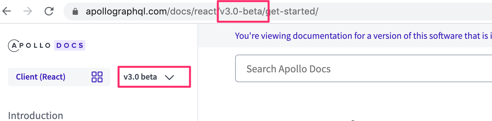
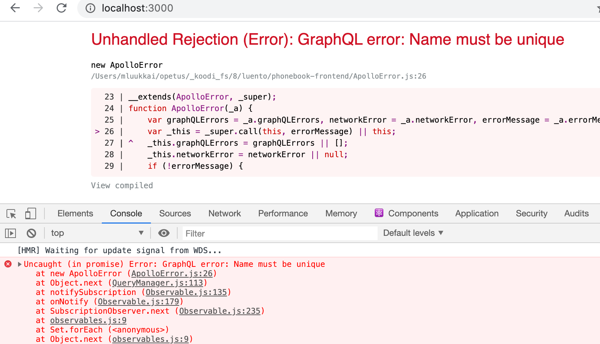
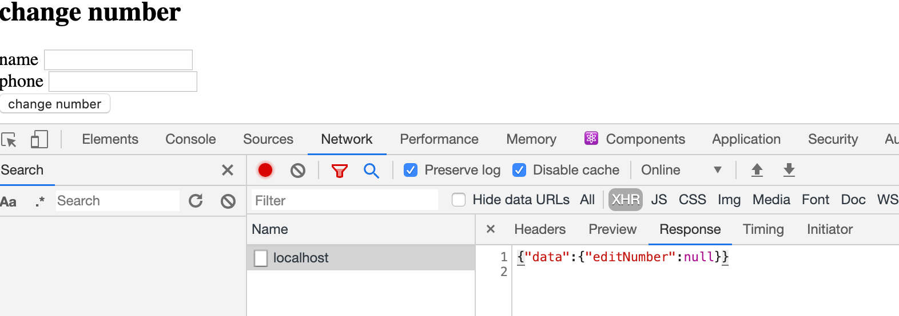
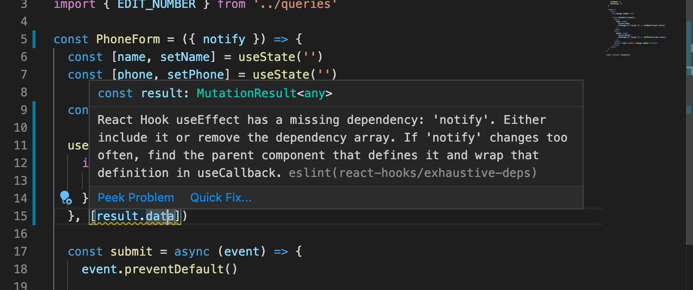
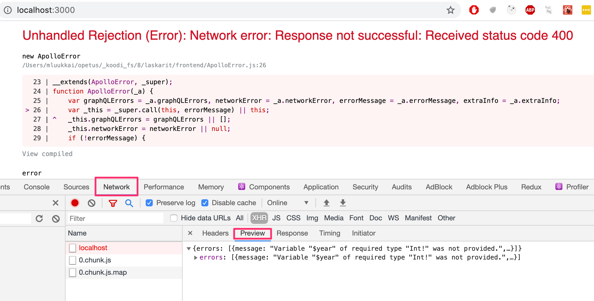

<div class="content">

Toteutetaan seuraavaksi React-sovellus, joka käyttää toteuttamaamme GraphQL-palvelinta. Palvelimen tämänhetkinen koodi on kokonaisuudessaan [githubissa](https://github.com/fullstack-hy2020/graphql-phonebook-backend/tree/part8-3), branchissa <i>part8-3</i>.

GraphQL:ää on periaatteessa mahdollista käyttää HTTP POST -pyyntöjen avulla. Seuraavassa esimerkki Postmanilla tehdystä kyselystä.


Kommunikointi tapahtuu siis osoitteeseen http://localhost:4000/graphql kohdistuvina POST-pyyntöinä, ja itse kysely lähetetään pyynnön mukana merkkijonona avaimen <i>query</i> arvona.

Voisimmekin hoitaa React-sovelluksen ja GraphQL:n kommunikoinnin Axiosilla. Tämä ei kuitenkaan ole useimmiten järkevää ja on parempi idea käyttää korkeamman tason kirjastoa, joka pystyy abstrahoimaan kommunikoinnin turhia detaljeja. Tällä hetkellä järkeviä vaihtoehtoja on kaksi: Facebookin [Relay](https://facebook.github.io/relay/) ja
[Apollo Client](https://www.apollographql.com/docs/react/). Näistä Apollo on ylivoimaisesti suositumpi ja myös meidän valintamme.

### Apollo client

Käytetään kurssilla Apollo Clientin versiota [3.0-beta](https://www.apollographql.com/docs/react/v3.0-beta/), tällä hetkellä (20.2.2020) uusin virallisesti julkaistu versio on 2.6. eli kun luet dokumentaatiota, muista vaihtaa näytettävän dokumentaation versio vastaamaan 3.0 betaa:



Luodaan uusi React-sovellus ja asennetaan siihen [Apollo clientin](https://www.apollographql.com/docs/react/v3.0-beta/get-started/#installation) vaatimat riippuvuudet.

```bash
npm install @apollo/client graphql
```

Aloitetaan seuraavalla ohjelmarungolla.

```js
import React from 'react'
import ReactDOM from 'react-dom'
import App from './App'

import { ApolloClient, HttpLink, InMemoryCache, gql } from '@apollo/client'

const client = new ApolloClient({
  cache: new InMemoryCache(),
  link: new HttpLink({
    uri: 'http://localhost:4000',
  })
})

const query = gql`
  query {
    allPersons  {
      name,
      phone,
      address {
        street,
        city
      }
      id
    }
  }
`

client.query({ query })
  .then((response) => {
    console.log(response.data)
  })

ReactDOM.render(<App />, document.getElementById('root'))
```

Koodi aloittaa luomalla [client](https://www.apollographql.com/docs/react/v3.0-beta/get-started/#create-a-client)-olion, jonka avulla se lähettää kyselyn palvelimelle:

```js
client.query({ query })
  .then((response) => {
    console.log(response.data)
  })
```

Palvelimen palauttama vastaus tulostuu konsoliin:


Sovellus pystyy siis kommunikoimaan GraphQL-palvelimen kanssa olion _client_ välityksellä. Client saadaan sovelluksen kaikkien komponenttien saataville käärimällä komponentti <i>App</i> komponentin [ApolloProvider](https://www.apollographql.com/docs/react/v3.0-beta/get-started/#connect-your-client-to-react) lapseksi:

```js
import React from 'react'
import ReactDOM from 'react-dom'
import App from './App'

import { 
  ApolloClient, ApolloProvider, HttpLink, InMemoryCache // highlight-line
} from '@apollo/client' 

const client = new ApolloClient({
  cache: new InMemoryCache(),
  link: new HttpLink({
    uri: 'http://localhost:4000',
  })
})

ReactDOM.render(
  <ApolloProvider client={client}> // highlight-line
    <App />
  </ApolloProvider>, // highlight-line
  document.getElementById('root')
)
```

### Kyselyjen tekeminen

Olemme valmiina toteuttamaan sovelluksen päänäkymän, joka listaa kaikkien henkilöiden puhelinnumerot. 

Apollo Client tarjoaa muutaman vaihtoehtoisen tavan [kyselyjen](https://www.apollographql.com/docs/react/v3.0-beta/data/queries/) tekemiselle. Tämän hetken vallitseva käytäntö on hook-funktion [useQuery](https://www.apollographql.com/docs/react/v3.0-beta/api/react/hooks/#usequery) käyttäminen.

Kyselyn tekevän komponentin <i>App</i> koodi näyttää seuraavalta:

```js
import React from 'react'
import { gql, useQuery } from '@apollo/client'

const ALL_PERSONS = gql`
  query {
    allPersons  {
      name
      phone
      id
    }
  }
`

const App = () => {
  const result = useQuery(ALL_PERSONS)

  if (result.loading)  {
    return <div>loading...</div>
  }

  return (
    <div>
      {result.data.allPersons.map(p => p.name).join(', ')}
    </div>
  )
}

export default App
```

Hook-funktion _useQuery_ kutsuminen suorittaa parametrina annetun kyselyn. Hookin kutsuminen palauttaa olion, jolla on [useita kenttiä](https://www.apollographql.com/docs/react/v3.0-beta/api/react/hooks/#result). Kenttä <i>loading</i> on arvoltaan tosi, jos kyselyyn ei ole saatu vielä vastausta. Tässä tilanteessa renderöitävä koodi on 

```js
if ( result.loading ) {
  return <div>loading...</div>
}
```

Kun tulos on valmis, otetaan tuloksen kentästä <i>data</i> kyselyn <i>allPersons</i> vastaus ja renderöidään luettelossa olevat nimet ruudulle.

```js
<div>
  {result.data.allPersons.map(p => p.name).join(', ')}
</div>
```

Eriytetään henkilöiden näyttäminen omaan komponenttiin

```js
const Persons = ({ persons }) => {
  return (
    <div>
      <h2>Persons</h2>
      {persons.map(p =>
        <div key={p.name}>
          {p.name} {p.phone}
        </div>  
      )}
    </div>
  )
}
```

Komponentti _App_ siis hoitaa edelleen kyselyn ja välittää tuloksen uuden komponentin renderöitäväksi:

```js
const App = () => {
  const result = useQuery(ALL_PERSONS)

  if (result.loading)  {
    return <div>loading...</div>
  }

  return (
    <Persons persons = {result.data.allPersons}/>
  )
}
```

### Nimetyt kyselyt ja muuttujat

Toteutetaan sovellukseen ominaisuus, jonka avulla on mahdollisuus nähdä yksittäisen henkilön osoitetiedot. Palvelimen tarjoama kysely <i>findPerson</i> sopii hyvin tarkoitukseen. 

Edellisessä luvussa tekemissämme kyselyissä parametri oli kovakoodattuna kyselyyn:

```js
query {
  findPerson(name: "Arto Hellas") {
    phone 
    city 
    street
    id
  }
}
```

Kun teemme kyselyjä ohjelmallisesti, on kyselyn parametrit pystyttävä antamaan dynaamisesti. 

Tähän tarkoitukseen sopivat GraphQL:n [muuttujat](https://graphql.org/learn/queries/#variables). Muuttujia käyttääksemme on kysely myös nimettävä.

Sopiva muoto kyselylle on seuraava:

```js
query findPersonByName($nameToSearch: String!) {
  findPerson(name: $nameToSearch) {
    name
    phone 
    address {
      street
      city
    }
  }
}
```

Kyselyn nimenä on <i>findPersonByName</i>, ja se saa yhden merkkijonomuotoisen parametrin <i>$nameToSearch</i>. 

Myös GraphQL Playground mahdollistaa muuttujia sisältävän kyselyjen tekemisen. Tällöin muuttujille on annettava arvot kohdassa <i>Query variables</i>:


Asken käyttämämme _useQuery_ toimii hyvin tilanteissa, joissa kysely on tarkoitus suorittaa heti komponentin renderöinnin yhteydessä. Nyt kuitenkin haluamme tehdä kyselyn vasta siinä vaiheessa kun käyttäjä haluaa nähdä jonkin henkilön tiedot, eli kysely tehdään vasta [sitä tarvittaessa](https://www.apollographql.com/docs/react/v3.0-beta/data/queries/#executing-queries-manually). 

Tähän tilanteeseen sopii hook-funktio [useLazyQuery](https://www.apollographql.com/docs/react/v3.0-beta/api/react/hooks/#uselazyquery). Komponentti <i>Persons</i> muuttuu seuraavasti:

```js
// highlight-start
const FIND_PERSON = gql`
  query findPersonByName($nameToSearch: String!) {
    findPerson(name: $nameToSearch) {
      name
      phone 
      id
      address {
        street
        city
      }
    }
  }
`
// highlight-end

const Persons = ({ persons }) => {
  // highlight-start
  const [getPerson, result] = useLazyQuery(FIND_PERSON) 
  const [person, setPerson] = useState(null)
// highlight-end

// highlight-start
  const showPerson = (name) => {
    getPerson({ variables: { nameToSearch: name } })
  }
  // highlight-end

// highlight-start
  useEffect(() => {
    if (result.data) {
      setPerson(result.data.findPerson)
    }
  }, [result])
  // highlight-end

// highlight-start
  if (person) {
    return(
      <div>
        <h2>{person.name}</h2>
        <div>{person.address.street} {person.address.city}</div>
        <div>{person.phone}</div>
        <button onClick={() => setPerson(null)}>close</button>
      </div>
    )
  }
  // highlight-end
  
  return (
    <div>
      <h2>Persons</h2>
      {persons.map(p =>
        <div key={p.name}>
          {p.name} {p.phone}
          // highlight-start
          <button onClick={() => showPerson(p.name)} >
            show address
          </button> 
          // highlight-end
        </div>  
      )}
    </div>
  )
}

export default Persons
```

Koodi on kasvanut paljon, ja kaikki lisäykset eivät ole täysin ilmeisiä.

Jos henkilön yhteydessä olevaa nappia painetaan, suoritetaan klikkauksenkäsittelijä _showPerson_, joka tekee GraphQL-kyselyn henkilön tiedoista:

```js
const [getPerson, result] = useLazyQuery(FIND_PERSON) 

// ...

const showPerson = (name) => {
  getPerson({ variables: { nameToSearch: name } })
}
```

Kyselyn muuttujalle _nameToSearch_ määritellään arvo kutsuttaessa.

Kyselyn vastaus tulee muuttujaan _result_, ja sen arvo sijoitetaan komponentin tilan muuttujaan _person_. Sijoitus tehdään _useEffect_-hookissa:

```js
useEffect(() => {
  if (result.data) {
    setPerson(result.data.findPerson)
  }
}, [result])
```

Hookin toisena parametrina on _result_. Tämä saa aikaan sen, että hookin ensimmäisenä parametrina oleva funktio suoritetaan <i>aina kun kyselyn palauttama olio muuttuu</i>. Lisäksi tarkistamme, että resultin kenttä data ei ole undefined ennen kuin asetamme haetun henkilön tiedot komponentin tilaan. Jos päivitystä ei hoidettaisi kontrolloidusti hookissa, seuraisi ongelmia sen jälkeen kun yksittäisen henkilön näkymästä palataan kaikkien henkilöiden näkymään.

Jos tilan muuttujalla _person_ on arvo, näytetään kaikkien henkilöiden sijaan yhden henkilön tarkemmat tiedot:


Yksittäisen henkilön näkymästä palataan kaikkien henkilöiden näkymään sijoittamalla tilan muuttujan _person_ arvoksi _null_.

Ratkaisu ei ole ehkä siistein mahdollinen mutta saa kelvata meille.

Sovelluksen tämänhetkinen koodi on kokonaisuudessaan [githubissa](https://github.com/fullstack-hy2020/graphql-phonebook-frontend/tree/part8-1), branchissa <i>part8-1</i>.

### Välimuisti ja devtools

Kun haemme monta kertaa esim. Arto Hellaksen tiedot, huomaamme selaimen developer-konsolin välilehteä Network seuraamalla mielenkiintoisen asian: kysely backendiin tapahtuu ainoastaan tietojen ensimmäisellä katsomiskerralla. Tämän jälkeen, siitäkin huolimatta, että koodi tekee saman kyselyn uudelleen, ei kyselyä lähetetä backendille.

Apollo client tallettaa kyselyjen tulokset cacheen eli [välimuistiin](https://www.apollographql.com/docs/react/v3.0-beta/caching/cache-configuration/) ja optimoi suoritusta siten, että jos kyselyn vastaus on jo välimuistissa, ei kyselyä lähetetä ollenkaan palvelimelle.

Chromeen on mahdollista asentaa lisäosa [Apollo Client devtools](https://chrome.google.com/webstore/detail/apollo-client-developer-t/jdkknkkbebbapilgoeccciglkfbmbnfm/related), jonka avulla voidaan tarkastella mm. välimuistin tilaa


Tieto on organisoitu välimuistiin kyselykohtaisesti. Koska <i>Person</i>-tyypin olioilla on identifioiva kenttä <i>id</i>, jonka tyypiksi on määritelty <i>ID</i>, osaa Apollo yhdistää kahden eri kyselyn palauttaman saman olion. Tämän ansiosta Arto Hellaksen osoitetietojen hakeminen kyselyllä <i>findPerson</i> on päivittänyt välimuistia Arton osoitetietojen osalta myös kyselyn <i>allPersons</i> alta.

### Mutaatioiden tekeminen

Toteutetaan sovellukseen mahdollisuus uusien henkilöiden lisäämiseen. 

Edellisessä luvussa kovakoodasimme mutaatioiden parametrit. Tarvitsemme nyt [muuttujia](https://graphql.org/learn/queries/#variables) käyttävän version henkilön lisäävästä mutaatiosta:

```js
const CREATE_PERSON = gql`
  mutation createPerson($name: String!, $street: String!, $city: String!, $phone: String) {
    addPerson(
      name: $name,
      street: $street,
      city: $city,
      phone: $phone
    ) {
      name
      phone
      id
      address {
        street
        city
      }
    }
  }
`
```

Mutaatioiden tekemiseen sopivan toiminnallisuuden tarjoaa hook-funktio [useMutation](https://www.apollographql.com/docs/react/v3.0-beta/api/react/hooks/#usemutation). 

Tehdään sovellukseen uusi komponentti uuden henkilön lisämiseen:

```js
import React, { useState } from 'react'
import { gql, useMutation } from '@apollo/client'

const CREATE_PERSON = gql`
  // ...
`

const PersonForm = () => {
  const [name, setName] = useState('')
  const [phone, setPhone] = useState('')
  const [street, setStreet] = useState('')
  const [city, setCity] = useState('')

  const [ createPerson ] = useMutation(CREATE_PERSON) // highlight-line

  const submit = async (event) => {
    event.preventDefault()

    // highlight-start
    createPerson({  variables: { name, phone, street, city } })
    // highlight-end

    setName('')
    setPhone('')
    setStreet('')
    setCity('')
  }

  return (
    <div>
      <h2>create new</h2>
      <form onSubmit={submit}>
        <div>
          name <input value={name}
            onChange={({ target }) => setName(target.value)}
          />
        </div>
        <div>
          phone <input value={phone}
            onChange={({ target }) => setPhone(target.value)}
          />
        </div>
        <div>
          street <input value={street}
            onChange={({ target }) => setStreet(target.value)}
          />
        </div>
        <div>
          city <input value={city}
            onChange={({ target }) => setCity(target.value)}
          />
        </div>
        <button type='submit'>add!</button>
      </form>
    </div>
  )
}

export default PersonForm
```

Lomakkeen koodi on suoraviivainen, mielenkiintoiset rivit on korostettu. Mutaation suorittava funktio saadaan luotua _useMutation_-hookin avulla. Hook palauttaa kyselyfunktion <i>taulukon</i> ensimmäisenä alkiona:

```js
const [ createPerson ] = useMutation(CREATE_PERSON)
```

Kyselyä tehtäessä määritellään kyselyn muuttujille arvot:

```js
createPerson({  variables: { name, phone, street, city } })
```


Lisäys kyllä toimii, mutta sovelluksen näkymä ei päivity. Syynä tälle on se, että Apollo Client ei osaa automaattisesti päivittää sovelluksen välimuistia, se sisältää edelleen ennen lisäystä olevan tilanteen. Saamme kyllä uuden käyttäjän näkyviin uudelleenlataamalla selaimen, sillä Apollon välimuisti nollautuu uudelleenlatauksen yhteydessä. Tilanteeseen on kuitenkin pakko löytää joku järkevämpi ratkaisu.

### Välimuistin päivitys

Ongelma voidaan ratkaista muutamallakin eri tavalla. Eräs tapa on määritellä kaikki henkilöt hakeva kysely [pollaamaan](https://www.apollographql.com/docs/react/v3.0-beta/data/queries/#polling) palvelinta, eli suorittamaan kysely palvelimelle toistuvasti tietyin väliajoin. 

Muutos on pieni, määritellään pollausväliksi kaksi sekuntia:

```js
const App = () => {
  const result = useQuery(ALL_PERSONS, {
    pollInterval: 2000 // highlight-line
  })

  if (result.loading)  {
    return <div>loading...</div>
  }

  return (
    <div>
      <Persons persons = {result.data.allPersons}/>
      <PersonForm />
    </div>
  )
}

export default App
```

Yksinkertaisuuden lisäksi ratkaisun hyvä puoli on se, että aina kun joku käyttäjä lisää palvelimelle uuden henkilön, se ilmestyy pollauksen ansiosta heti kaikkien sovelluksen käyttäjien selaimeen.

Ikävänä puolena pollauksessa on tietenkin sen aiheuttama turha verkkoliikenne.

Toinen helppo tapa välimuistin synkronoimiseen on määritellä _useMutation_-hookin option [refetchQueries](https://www.apollographql.com/docs/react/v3.0-beta/api/react/hooks/#params-2) avulla, että kaikki henkilöt hakeva kysely tulee suorittaa mutaation yhteydessä uudelleen:

```js
const ALL_PERSONS = gql`
  query  {
    allPersons  {
      name
      phone
      id
    }
  }
`

const PersonForm = (props) => {
  // ...

  const [ createPerson ] = useMutation(CREATE_PERSON, {
    refetchQueries: [ { query: ALL_PERSONS } ] // highlight-line
  })
```

Edut ja haitat tällä ratkaisulla ovat melkeinpä päinvastaiset pollaukseen. Verkkoliikennettä ei synny kuin tarpeen vaatiessa, eli kyselyjä ei tehdä varalta. Jos joku muu käyttäjä päivittää palvelimen tilaa, muutokset eivät kuitenkaan siirry nyt kaikille käyttäjille.

Muitakin tapoja välimuistin tilan päivittämiseksi on, niistä lisää myöhemmin tässä osassa.

Sovellukseen on tällä hetkellä määritelty kyselyjä komponenttien koodin sekaan. Eriytetään kyselyjen määrittely omaan tiedostoonsa <i>queries.js</i>:

```js 
import { gql  } from '@apollo/client'

export const ALL_PERSONS = gql`
  query {
    // ...
  }
`
export const FIND_PERSON = gql`
  query findPersonByName($nameToSearch: String!) {
    // ...
  }
`

export const CREATE_PERSON = gql`
  mutation createPerson($name: String!, $street: String!, $city: String!, $phone: String) {
    // ...
  }
`
```

Jokainen komponentti importtaa tarvitsemansa kyselyt:

```js 
import { ALL_PERSONS } from './queries'

const App = () => {
  const result = useQuery(ALL_PERSONS)
  // ...
}
```

Sovelluksen tämänhetkinen koodi on kokonaisuudessaan [githubissa](https://github.com/fullstack-hy2020/graphql-phonebook-frontend/tree/part8-2), branchissa <i>part8-2</i>.

#### Mutaatioiden virheiden käsittely

Jos yritämme luoda epävalidia henkilöä, seurauksena on poikkeus ja koko sovellus hajoaa



Poikkeus on syytä käsitellä. _useMutation_-hookin [option](https://www.apollographql.com/docs/react/v3.0-beta/api/react/hooks/#params-2) _onError_ avulla on mahdollista rekisteröidä mutaatioille virheenkäsittelijäfunktio.

Rekisteröidään mutaatiolle virheidenkäsittelijä, joka asettaa virheestä kertovan viestin propsina saaman funktion _setError_ avulla:

```js
const PersonForm = ({ setError }) => {
  // ... 

  const [ createPerson ] = useMutation(CREATE_PERSON, {
    refetchQueries: [  {query: ALL_PERSONS } ],
    // highlight-start
    onError: (error) => {
      setError(error.graphQLErrors[0].message)
    }
    // highlight-end
  })

  // ...
}
```

Renderöidään mahdollinen virheilmoitus näytölle

```js
const App = () => {
  const [errorMessage, setErrorMessage] = useState(null) // highlight-line

  const result = useQuery(ALL_PERSONS)

  if (result.loading)  {
    return <div>loading...</div>
  }

// highlight-start
  const notify = (message) => {
    setErrorMessage(message)
    setTimeout(() => {
      setErrorMessage(null)
    }, 10000)
  }
  // highlight-end

  return (
    <div>
      <Notify errorMessage={errorMessage} />
      <Persons persons = {result.data.allPersons} />
      <PersonForm setError={notify} />
    </div>
  )
}

// highlight-start
const Notify = ({errorMessage}) => {
  if ( !errorMessage ) {
    return null
  }

  return (
    <div style={{color: 'red'}}>
      {errorMessage}
    </div>
  )
}
// highlight-end
```

Poikkeuksesta tiedotetaan nyt käyttäjälle yksinkertaisella notifikaatiolla.


Sovelluksen tämänhetkinen koodi on kokonaisuudessaan [githubissa](https://github.com/fullstack-hy2020/graphql-phonebook-frontend/tree/part8-3), branchissa <i>part8-3</i>.

### Puhelinnumeron päivitys

Tehdään sovellukseen mahdollisuus vaihtaa henkilöiden puhelinnumeroita. Ratkaisu on lähes samanlainen kuin uuden henkilön lisäykseen käytetty.

Mutaatio edellyttää jälleen muuttujien käyttöä.

```js
export const EDIT_NUMBER = gql`
  mutation editNumber($name: String!, $phone: String!) {
    editNumber(name: $name, phone: $phone)  {
      name
      phone
      address {
        street
        city
      }
      id
    }
  }
`
```

Muutoksen suorittava komponentti <i>PhoneForm</i> on suoraviivainen, se kysyy lomakkeen avulla henkilön nimeä ja uutta puhelinnumeroa, ja kutsuu _useMutation_-hookilla luotua mutaation suorittavaa funktiota _changeNumber_. Mielenkiintoiset osat koodia korostettuna:

```js
import React, { useState } from 'react'
import { useMutation } from '@apollo/client'

import { EDIT_NUMBER, ALL_PERSONS } from '../queries'

const PhoneForm = () => {
  const [name, setName] = useState('')
  const [phone, setPhone] = useState('')

// highlight-start
  const [ changeNumber ] = useMutation(EDIT_NUMBER)
// highlight-end

  const submit = async (event) => {
    event.preventDefault()

// highlight-start
    changeNumber({ variables: { name, phone } })
    // highlight-end

    setName('')
    setPhone('')
  }

  return (
    <div>
      <h2>change number</h2>

      <form onSubmit={submit}>
        <div>
          name <input
            value={name}
            onChange={({ target }) => setName(target.value)}
          />
        </div>
        <div>
          phone <input
            value={phone}
            onChange={({ target }) => setPhone(target.value)}
          />
        </div>
        <button type='submit'>change number</button>
      </form>
    </div>
  )
}

export default PhoneForm
```

Ulkoasu on karu mutta toimiva:


Kun numero muutetaan, päivittyy se hieman yllättäen automaattisesti komponentin <i>Persons</i> renderöimään nimien ja numeroiden listaan. Tämä johtuu siitä, että koska henkilöillä on identifioiva, tyyppiä <i>ID</i> oleva kenttä, päivittyy henkilö välimuistissa uusilla tiedoilla päivitysoperaation yhteydessä. 

Sovelluksen tämänhetkinen koodi on kokonaisuudessaan [githubissa](https://github.com/fullstack-hy2020/graphql-phonebook-frontend/tree/part8-4), branchissa <i>part8-4</i>.

Sovelluksessa on  vielä pieni ongelma. Jos yritämme vaihtaa olemattomaan nimeen liittyvän puhelinnumeron, ei mitään näytä tapahtuvan. Syynä tälle on se, että jos nimeä vastaavaa henkilöä ei löydy, vastataan kyselyyn <i>null</i>:



Koska kyseessä ei ole GraphQL:n kannalta virhetilanne, ei _onError_-virheenkäsittelijän rekisteröimisestä tässä tilanteessa hyötyä.

Voimme generoida virheilmoituksen _useMutation_-hookin toisena parametrina palauttaman mutaation tuloksen kertovan olion _result_ avulla.

```js 
const PhoneForm = ({ setError }) => {
  const [name, setName] = useState('')
  const [phone, setPhone] = useState('')

  const [ changeNumber, result ] = useMutation(EDIT_NUMBER) // highlight-line

  const submit = async (event) => {
    // ...
  }

  // highlight-start
  useEffect(() => {
    if (result.data && result.data.editNumber === null) {
      setError('person not found')
    }

  }, [result.data])
  // highlight-end

  // ...
}
```

Jos henkilöä ei löytynyt, eli kyselyn tulos _result.data.editNumber_ on _null_, asettaa komponentti propseina saamansa callback-funktion avulla sopivan virheilmoituksen. Virheilmoituksen asettamista kontrolloidaan jälleen useEffect-hookin avulla, eli virheviesti halutaan asettaa ainoastaan jos mutaation tulos _result.data_ muuttuu.

useEffect aiheuttaa ESLint-virheilmoituksen:



Varoitus on aiheeton, ja pääsemme helpoimmalla ignoroimalla ESLint-säännön riviltä:

```js
useEffect(() => {
  if ( result.data && !result.data.editNumber) {
    setError('name not found')
  }
// highlight-start  
}, [result.data])  // eslint-disable-line 
// highlight-end
```

Voisimme yrittää päästä varoituksesta eroon lisäämällä funktion _setError_ useEffectin toisena parametrina olevaan taulukkoon:

```js
useEffect(() => {
  if ( result.data && !result.data.editNumber) {
    setError('name not found')
  }
// highlight-start  
}, [result.data, setError])
// highlight-end
```

Tämä ratkaisu ei kuitenkaan toimi, ellei _setError_-funktiota ole määritelty [useCallback](https://reactjs.org/docs/hooks-reference.html#usecallback)-funktioon käärittynä. Jos näin ei tehdä, seurauksena on ikuinen luuppi, sillä aina kun komponentti _App_ renderöidään uudelleen notifikaation poistamisen jälkeen, syntyy <i>uusi versio</i> funktiosta _setError_ ja se taas aiheuttaa efektifunktion uudelleensuorituksen ja taas uuden notifikaation...

Sovelluksen tämänhetkinen koodi on [githubissa](https://github.com/fullstack-hy2020/graphql-phonebook-frontend/tree/part8-5), branchissa <i>part8-5</i>.

### Apollo Client ja sovelluksen tila

Esimerkissämme sovelluksen tilan käsittely on siirtynyt suurimmaksi osaksi Apollo Clientin vastuulle. Tämä onkin melko tyypillinen ratkaisu GraphQL-sovelluksissa. Esimerkkimme käyttää Reactin komponenttien tilaa ainoastaan lomakkeen tilan hallintaan sekä virhetilanteesta kertovan notifikaation näyttämiseen. GraphQL:ää käytettäessä voikin olla, että ei ole enää kovin perusteltuja syitä siirtää sovelluksen tilaa ollenkaan Reduxiin. 

Apollo mahdollistaa tarvittaessa myös sovelluksen paikallisen tilan tallettamisen [Apollon välimuistiin](https://www.apollographql.com/docs/react/v3.0-beta/data/local-state/).

</div>

<div class="tasks">

### Tehtävät 8.8.-8.12.

Tehtävissä toteutetaan edellisen osan tehtävissä tehdylle backendille frontend.

Ota sovelluksesi lähtökohdaksi [tämä projekti](https://github.com/fullstack-hy2020/library-frontend).

#### 8.8: Kirjailijoiden näkymä

Toteuta kirjailijoiden näkymä, eli näytä sivulla kaikkien kirjailijoiden tiedot esim. seuraavasti:


#### 8.9: Kirjojen näkymä

Toteuta kirjojen näkymä, eli näytä sivulla kirjoista muut tiedot paitsi genret.


#### 8.10: Kirjan lisäys

Toteuta sovellukseen mahdollisuus uusien kirjojen lisäämiseen.


Huolehdi siitä, että kirjailijoiden ja kirjojen näkymä pysyy ajantasaisena lisäyksen jälkeen.

Huom: jos törmäät ongelmiin kyselyjä tai mutaatioita tehdessä, kannattaa katsoa developer consolesta mitä palvelin vastaa



#### 8.11: Kirjailijan syntymävuosi

Tee sovellukseen mahdollisuus asettaa kirjailijalle syntymävuosi. Voit tehdä syntymävuoden asettamista varten oman näkymän tai sijoittaa sen kirjailijat näyttävälle sivulle:


Huolehdi siitä, että kirjailijoiden näkymä pysyy ajantasaisena lisäyksen jälkeen.

#### 8.12: Kirjailijan syntymävuosi advanced

Tee syntymävuoden asetuslomakkeesta [select-tagin](https://reactjs.org/docs/forms.html#the-select-tag), kirjaston [react-select](https://github.com/JedWatson/react-select) tai jonkun muun mekanismin avulla sellainen, että syntymävuoden voi asettaa ainoastaan olemassaolevalle kirjailijalle.

react-select-kirjastoa hyödyntävä ratkaisu näyttää seuraavalta


</div>
