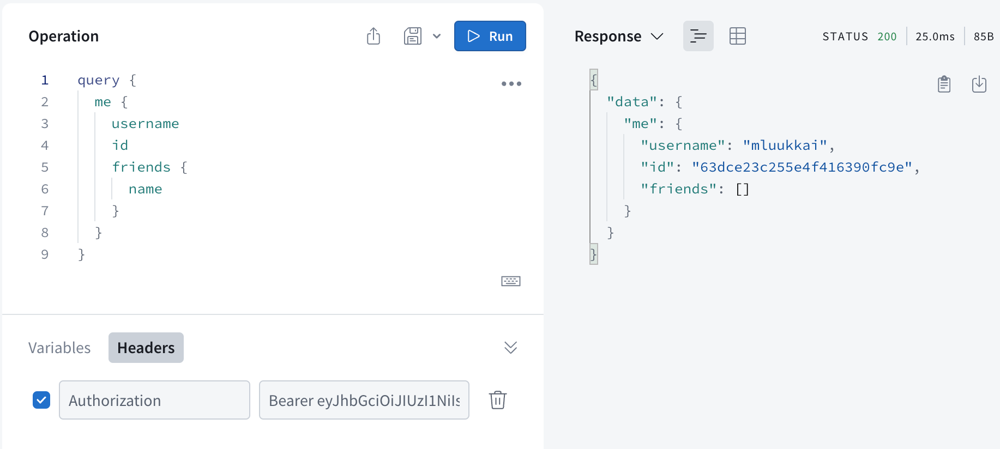

<div class="content">

Tässä luvussa siirrytään käyttämään tietokantaa datan tallentamiseen ja laajennetaan sovellusta käyttäjänhallinnalla. Refaktoroidaan kuitenkin ensin backendin koodia. Phonebook-backendin tämänhetkinen koodi löytyy [GitHubista](https://github.com/fullstack-hy2020/graphql-phonebook-backend/tree/part8-3), branchista <i>part8-3</i>.

### Backendin refaktorointi

Olemme toistaiseksi kirjoittaneet kaiken koodin <i>index.js</i>-tiedostoon. Sovelluksen laajentuessa se ei ole enää järkevää, sillä tiedoston pituuden kasvaessa sen luettavuus ja hahmotettavuus kärsii. On myös hyvän ohjelmointitavan mukaista erottaa sovelluksen eri vastuualueet omiin moduuleihinsa. 

Refaktoroidaan nyt backendin koodi jakamalla se useisiin tiedostoihin.

Aloitetaan eriyttämällä sovelluksen GraphQL-skeema tiedostoon <i>schema.js</i>:

```js
const typeDefs = /* GraphQL */ `
  type Address {
    street: String!
    city: String!
  }

  type Person {
    name: String!
    phone: String
    address: Address!
    id: ID!
  }

  enum YesNo {
    YES
    NO
  }

  type Query {
    personCount: Int!
    allPersons(phone: YesNo): [Person!]!
    findPerson(name: String!): Person
  }

  type Mutation {
    addPerson(
      name: String!
      phone: String
      street: String!
      city: String!
    ): Person
    editNumber(name: String!, phone: String!): Person
  }
`

module.exports = typeDefs
```

Siirretään sitten resolvereista vastaava koodi omaan moduuliinsa <i>resolvers.js</i>:

```js
const { GraphQLError } = require('graphql')
const { v1: uuid } = require('uuid')

let persons = [
  {
    name: 'Arto Hellas',
    phone: '040-123543',
    street: 'Tapiolankatu 5 A',
    city: 'Espoo',
    id: '3d594650-3436-11e9-bc57-8b80ba54c431',
  },
  {
    name: 'Matti Luukkainen',
    phone: '040-432342',
    street: 'Malminkaari 10 A',
    city: 'Helsinki',
    id: '3d599470-3436-11e9-bc57-8b80ba54c431',
  },
  {
    name: 'Venla Ruuska',
    street: 'Nallemäentie 22 C',
    city: 'Helsinki',
    id: '3d599471-3436-11e9-bc57-8b80ba54c431',
  },
]

const resolvers = {
  Query: {
    personCount: () => persons.length,
    allPersons: (root, args) => {
      if (!args.phone) {
        return persons
      }
      const byPhone = (person) =>
        args.phone === 'YES' ? person.phone : !person.phone
      return persons.filter(byPhone)
    },
    findPerson: (root, args) => persons.find((p) => p.name === args.name),
  },
  Person: {
    address: ({ street, city }) => {
      return {
        street,
        city,
      }
    },
  },
  Mutation: {
    addPerson: (root, args) => {
      if (persons.find((p) => p.name === args.name)) {
        throw new GraphQLError(`Name must be unique: ${args.name}`, {
          extensions: {
            code: 'BAD_USER_INPUT',
            invalidArgs: args.name,
          },
        })
      }

      const person = { ...args, id: uuid() }
      persons = persons.concat(person)
      return person
    },
    editNumber: (root, args) => {
      const person = persons.find((p) => p.name === args.name)
      if (!person) {
        return null
      }

      const updatedPerson = { ...person, phone: args.phone }
      persons = persons.map((p) => (p.name === args.name ? updatedPerson : p))
      return updatedPerson
    },
  },
}

module.exports = resolvers
```

Yksinkertaisuuden vuoksi henkilöiden tiedoista vastaava taulukko <i>persons</i> on nyt sijoitettu resolvereiden kanssa samaan tiedostoon. Taulukko poistuu pian, kun siirrymme käyttämään tietojen tallennukseen tietokantaa.

Siirretään lopuksi myös Apollo-palvelimen käynnistämisestä vastaava koodi omaan tiedostoonsa <i>server.js</i>:

```js
const { ApolloServer } = require('@apollo/server')
const { startStandaloneServer } = require('@apollo/server/standalone')

const resolvers = require('./resolvers')
const typeDefs = require('./schema')

const startServer = (port) => {
  const server = new ApolloServer({
    typeDefs,
    resolvers,
  })

  startStandaloneServer(server, {
    listen: { port },
  }).then(({ url }) => {
    console.log(`Server ready at ${url}`)
  })
}

module.exports = startServer
```

Apollo-palvelimen käynnistys hoidetaan nyt itse määritellyn <i>startServer</i>-funktion sisällä. Näin voimme exportata funktion ja käynnistää palvelimen moduulin ulkopuolelta <i>index.js</i>-tiedostosta käsin. Funktiolle annetaan parametriksi portti, johon Apollo Server käynnistyy kuuntelemaan.

Asennetaan projektiin <i>dotenv</i>-kirjasto, jotta voimme määritellä ympäristömuuttujia <i>.env</i>-tiedostossa:

```bash
npm install dotenv
```

Tiedostoon <i>index.js</i> jää vain vähän koodia. Sen sisältö refaktoroinnin jälkeen on seuraava:

```js
require('dotenv').config()

const startServer = require('./server')

const PORT = process.env.PORT || 4000

startServer(PORT)

```

Ympäristömuuttujat luetaan ensin <i>.env</i>-tiedostosta käyttäen <i>dotenv</i>-kirjastoa. Käytettävä portti luetaan nyt ympäristömuuttujasta, jos sellainen on asetettu. Jos <i>PORT</i>-ympäristömuuttujaa ei löydy, käytetään oletusporttia 4000, josta myös frontend olettaa tällä hetkellä löytävänsä palvelimen. Lopuksi Apollo Server käynnistetään kutsumalla funktiota _startServer_. 

Toistaiseksi <i>index.js</i>-tiedoston sisältö on tynkä, mutta sovelluksen laajentuessa se saa enemmän sisältöä. Esimerkiksi kun pian siirrymme käyttämään tietojen tallentamiseen tietokantaa, tulee tietokantayhteys muodostaa ennen palvelimen käynnistämistä. 

Sovelluksen vastuut on nyt eroteltu selkeästi toisitaan:

- <i>index.js</i> toimii pääohjelmana, jonka vastuulla on nyt ainoastaan sovelluksen käynnistyslogiikka. Se huolehtii, että sovelluksen eri osat käynnistetään oikeassa järjestyksessä. 
- GraphQL-skeema määritellään moduulissa <i>schema.js</i>. Se kuvailee APIn rakenteen eli esimerkiksi sen, mitä kyselyitä ja mutaatioita APIn kautta on mahdollista tehdä ja minkälaisia kenttiä eri olioilla on.
- Varsinainen sovelluslogiikka määritellään moduulissa <i>resolvers.js</i>. Sen vastuulla on esimerkiksi määritellä, mitä sovelluksessa todella tapahtuu eri kyselyiden kohdalla, mistä data haetaan ja miten sitä käsitellään.
- Apollo Serverin konfiguroinnista ja käynnistyksestä vastaava koodi määritellään erillisessä moduulissa <i>server.js</i>.

### Mongoose ja Apollo

Siirrytään nyt käyttämään sovelluksessamme MongoDB-tietokantaa. Tehdään tietokannan käyttöönotto osien [3](/osa3/tietojen_tallettaminen_mongo_db_tietokantaan) ja [4](/osa4/sovelluksen_rakenne_ja_testauksen_alkeet) tapaa imitoiden.

Otetaan käyttöön Mongoose:

```bash
npm install mongoose
```

Määritellään henkilön skeema tiedostossa <i>models/person.js</i> seuraavasti:

```js
const mongoose = require('mongoose')

const schema = new mongoose.Schema({
  name: {
    type: String,
    required: true,
    minlength: 5
  },
  phone: {
    type: String,
    minlength: 5
  },
  street: {
    type: String,
    required: true,
    minlength: 5
  },
  city: {
    type: String,
    required: true,
    minlength: 3
  },
})

module.exports = mongoose.model('Person', schema)
```

Mukana on myös muutama validointi. Arvon olemassaolon takaava _required: true_ on sikäli turha, koska GraphQL:n käyttö takaa sen, että kentät ovat olemassa. Validointi on kuitenkin hyvä pitää myös tietokannan puolella.

Luodaan tietokantayhteyden muodostavalle koodille oma moduuli <i>db.js</i>:

```js
const mongoose = require('mongoose')

const connectToDatabase = async (uri) => {
  console.log('connecting to database URI:', uri)

  try {
    await mongoose.connect(uri)
    console.log('connected to MongoDB')
  } catch (error) {
    console.log('error connection to MongoDB:', error.message)
    process.exit(1)
  }
}

module.exports = connectToDatabase
```

Moduuli luo funktion _connectToDatabase_, joka saa parametrina tietokanta-URI:n ja hoitaa tietokantaan yhdistämisen.

Otetaan moduuli käyttöön tiedostossa <i>index.js</i>:

```js
require('dotenv').config()

const connectToDatabase = require('./db') // highlight-line
const startServer = require('./server')

const MONGODB_URI = process.env.MONGODB_URI // highlight-line
const PORT = process.env.PORT || 4000

const main = async () => { // highlight-line
  await connectToDatabase(MONGODB_URI) // highlight-line
  startServer(PORT)
}

main()
```

Koska <i>async/await</i>-syntaksi on käytettävissä ainoastaan funktioiden sisällä, määrittelemme nyt yksinkertaisen <i>main</i>-funktion, joka hoitaa sovelluksen käynnistämisen. Näin voimme kutsua tietokantayhteyden luovaa funktiota käyttäen <i>await</i>-koodisanaa.

Muuttujan *MONGODB_URI* arvo saadaan ympäristömuuttujasta, eli sille tulee lisätä sopiva arvo <i>.env</i>-tiedostoon [osan 3](/osa3/tietojen_tallettaminen_mongo_db_tietokantaan#ymparistomuuttujien-maaritteleminen-kayttaen-dotenv-kirjastoa) tapaan. Sovellus kutsuu ensin tietokantayhteyden luovaa funktiota, ja kun tietokantayhteys on luotu onnistuneesti, se käynnistää GraphQL-palvelimen.


Sovelluslogiikasta vastaavan tiedoston <i>resolvers.js</i> sisältö muuttuu lähes täysin. Saamme sovelluksen jo suurilta osin toimimaan seuraavilla muutoksilla:

```js
const { GraphQLError } = require('graphql')
const Person = require('./models/person')

const resolvers = {
  Query: {
    personCount: async () => Person.collection.countDocuments(),
    allPersons: async (root, args) => {
      // filters missing
      return Person.find({})
    },
    findPerson: async (root, args) => Person.findOne({ name: args.name }),
  },
  Person: {
    address: ({ street, city }) => {
      return {
        street,
        city,
      }
    },
  },
  Mutation: {
    addPerson: async (root, args) => {
      const nameExists = await Person.exists({ name: args.name })

      if (nameExists) {
        throw new GraphQLError(`Name must be unique: ${args.name}`, {
          extensions: {
            code: 'BAD_USER_INPUT',
            invalidArgs: args.name,
          },
        })
      }

      const person = new Person({ ...args })
      return person.save()
    },
    editNumber: async (root, args) => {
      const person = await Person.findOne({ name: args.name })

      if (!person) {
        return null
      }

      person.phone = args.phone
      return person.save()
    },
  },
}

module.exports = resolvers
```

Muutokset ovat melko suoraviivaisia. Huomio kiinnittyy pariin seikkaan. Kuten muistamme, Mongossa olioiden identifioiva kenttä on nimeltään <i>_id</i> ja jouduimme aiemmin muuttamaan itse kentän nimen alaviivattomaan muotoon <i>id</i>. GraphQL osaa tehdä tämän muutoksen automaattisesti.

Toinen huomionarvoinen seikka on se, että resolverifunktiot palauttavat nyt <i>promisen</i>, aiemminhan ne palauttivat aina normaaleja oliota. Kun resolveri palauttaa promisen, Apollo server [osaa lähettää vastaukseksi](https://www.apollographql.com/docs/apollo-server/data/resolvers/#return-values) sen arvon mihin promise resolvoituu.

Eli esimerkiksi jos seuraava resolverifunktio suoritetaan,

```js
allPersons: async (root, args) => {
  return Person.find({})
}
```

odottaa Apollo server promisen valmistumista ja lähettää promisen vastauksen kyselyn tekijälle. Apollo toimii siis suunnilleen seuraavasti:

```js
allPersons: async (root, args) => {
  const result = await Person.find({})
  return result
}
```

Täydennetään vielä resolveri _allPersons_ ottamaan huomioon optionaalinen filtterinä toimiva parametri _phone_:

```js
Query: {
  // ..
  allPersons: async (root, args) => {
    if (!args.phone) {
      return Person.find({})
    }

    return Person.find({ phone: { $exists: args.phone === 'YES'  }})
  },
},
```

Eli jos kyselylle ei ole annettu parametria _phone_, palautetaan kaikki henkilöt. Jos parametrilla on arvo <i>YES</i>, palautetaan kyselyn

```js
Person.find({ phone: { $exists: true }})
```

palauttamat henkilöt, eli ne joiden kentällä _phone_ on jokin arvo. Jos parametrin arvo on <i>NO</i>, palauttaa kysely ne henkilöt, joilla ei ole arvoa kentällä _phone_:

```js
Person.find({ phone: { $exists: false }})
```

### Validoinnit

GraphQL:n lisäksi syötteet validoidaan nyt Mongoose-skeemassa määriteltyjä validointeja käyttäen. Skeemassa olevien validointivirheiden varalta _save_-metodeille täytyy lisätä virheen käsittelevä _try/catch_-lohko. Heitetään catchiin jouduttaessa vastaukseksi   [virhekoodilla](https://www.apollographql.com/docs/apollo-server/data/errors/#built-in-error-codes) *BAD\_USER\_INPUT* varustettu poikkeus [GraphQLError](https://www.apollographql.com/docs/apollo-server/data/errors/#custom-errors):

```js
Mutation: {
  addPerson: async (root, args) => {
      const nameExists = await Person.exists({ name: args.name })

      if (nameExists) {
        throw new GraphQLError(`Name must be unique: ${args.name}`, {
          extensions: {
            code: 'BAD_USER_INPUT',
            invalidArgs: args.name,
          },
        })
      }

      const person = new Person({ ...args })

// highlight-start
      try {
        await person.save()
      } catch (error) {
        throw new GraphQLError(`Saving person failed: ${error.message}`, {
          extensions: {
            code: 'BAD_USER_INPUT',
            invalidArgs: args.name,
            error
          }
        })
      }
 
      return person
// highlight-end
  },
    editNumber: async (root, args) => {
      const person = await Person.findOne({ name: args.name })

      if (!person) {
        return null
      }

      person.phone = args.phone

// highlight-start
      try {
        await person.save()
      } catch (error) {
        throw new GraphQLError(`Saving number failed: ${error.message}`, {
          extensions: {
            code: 'BAD_USER_INPUT',
            invalidArgs: args.name,
            error
          }
        })
      }
 
      return person
// highlight-end
    }
}
```

Mongoosen virheen tiedot ja ongelman aiheuttanut data on nyt liitetty poikkeuksen konfiguraatio-olioon <i>extensions</i>, näin ne saadaan välitettyä kutsujalle. 

Backendin koodi on kokonaisuudessaan [GitHubissa](https://github.com/fullstack-hy2020/graphql-phonebook-backend/tree/part8-4), branchissa <i>part8-4</i>.

### Käyttäjä ja kirjautuminen

Lisätään järjestelmään käyttäjänhallinta. Oletetaan nyt yksinkertaisuuden takia, että kaikkien käyttäjien salasana on sama järjestelmään kovakoodattu merkkijono. [Osan 4](/osa4/kayttajien_hallinta) periaatteilla on toki suoraviivaista tallettaa käyttäjille yksilöllinen salasana, mutta koska fokuksemme on GraphQL:ssä, jätämme salasanaan liittyvät rönsyt tällä kertaa pois.

Luodaan käyttäjän skeema tiedostoon <i>models/user.js</i>:

```js
const mongoose = require('mongoose')

const schema = new mongoose.Schema({
  username: {
    type: String,
    required: true,
    minlength: 3
  },
  friends: [
    {
      type: mongoose.Schema.Types.ObjectId,
      ref: 'Person'
    }
  ],
})

module.exports = mongoose.model('User', schema)
```

Käyttäjään siis liittyy kentän _friends_ kautta joukko luettelossa olevia henkilöitä. Ideana on se, että kun käyttäjä, esim. <i>mluukkai</i> lisää henkilön, vaikkapa <i>Arto Hellas</i> luetteloon, liitetään henkilö käyttäjän _friends_-listaan. Näin kirjautuneilla henkilöillä on mahdollista saada sovellukseen oma personoitu näkymänsä.

Kirjautuminen ja käyttäjän tunnistautuminen hoidetaan samoin kuten teimme [osassa 4](/osa4/token_perustainen_kirjautuminen) REST:in yhteydessä, eli käyttämällä tokeneita.

Laajennetaan GraphQL-skeemaa seuraavasti:

```js
type User {
  username: String!
  friends: [Person!]!
  id: ID!
}

type Token {
  value: String!
}

type Query {
  // ..
  me: User
}

type Mutation {
  // ...
  createUser(username: String!): User
  login(username: String!, password: String!): Token
}
```

Kysely _me_ palauttaa kirjautuneena olevan käyttäjän. Käyttäjät luodaan mutaatiolla _createUser_ ja kirjautuminen tapahtuu mutaatiolla _login_.

Asennetaan jsonwebtoken-kirjasto:

```bash
npm install jsonwebtoken
```

Uusien mutaatioiden resolverit ovat seuraavassa:

```js
const jwt = require('jsonwebtoken')
const User = require('./models/user')

Mutation: {
  // ..
  createUser: async (root, args) => {
    const user = new User({ username: args.username })

    return user.save()
      .catch(error => {
        throw new GraphQLError(`Creating the user failed: ${error.message}`, {
          extensions: {
            code: 'BAD_USER_INPUT',
            invalidArgs: args.username,
            error
          }
        })
      })
  },
  login: async (root, args) => {
    const user = await User.findOne({ username: args.username })

    if ( !user || args.password !== 'secret' ) {
      throw new GraphQLError('wrong credentials', {
        extensions: {
          code: 'BAD_USER_INPUT'
        }
      })        
    }

    const userForToken = {
      username: user.username,
      id: user._id,
    }

    return { value: jwt.sign(userForToken, process.env.JWT_SECRET) }
  },
},
```

Käyttäjän luova mutaatio on suoraviivainen. Kirjautumisesta vastaava mutaatio tarkastaa onko käyttäjätunnus/salasana-pari validi ja jos on, palautetaan [osasta 4](/osa4/token_perustainen_kirjautuminen) tuttu jwt-token.  Jotta koodi toimisi, täytyy ympäristömuuttujalle *JWT\_SECRET* muistaa antaa arvo  <i>.env</i>-tiedostossa.

Käyttäjän luonti onnistuu nyt seuraavasti:

```js
mutation {
  createUser (
    username: "mluukkai"
  ) {
    username
    id
  }
}
```

Kirjautumisen hoitaa seuraava mutaatio:

```js
mutation {
  login (
    username: "mluukkai"
    password: "secret"
  ) {
    value
  }
}
```

Aivan kuten REST:in tapauksessa myös nyt ideana on, että kirjautunut käyttäjä liittää kirjautumisen yhteydessä saamansa tokenin kaikkiin pyyntöihinsä. REST:in tapaan token liitetään GraphQL-pyyntöihin headerin <i>Authorization</i> avulla. Apollo Explorerissa headerin liittäminen pyyntöön tapahtuu seuraavasti:


Backendissä pyynnön mukana saapuva token on kätevintä välittää resolvereille hyödyntäen Apollo Serverin [kontekstia](https://www.apollographql.com/docs/apollo-server/data/context/). Kontekstin avulla voidaan suorittaa jotain kaikille kyselyille ja mutaatioille yhteisiä asioita, esim. pyyntöön liittyvän [käyttäjän tunnistaminen](https://www.apollographql.com/blog/authorization-in-graphql/).

Muutetaan backendin käynnistämistä siten, että määritellään käynnistyksestä huolehtivan funktion [startStandaloneServer](https://www.apollographql.com/docs/apollo-server/api/standalone/) toisena parametrina saamaan olioon [context](https://www.apollographql.com/docs/apollo-server/data/context/)-kenttä ja luodaan apufunktio _getUserFromAuthHeader_ tokenin kelvollisuuden tarkistamiseksi ja käyttäjän etsimiseksi tietokannasta:

```js
const { ApolloServer } = require('@apollo/server')
const { startStandaloneServer } = require('@apollo/server/standalone')
const jwt = require('jsonwebtoken') // highlight-line

const resolvers = require('./resolvers')
const typeDefs = require('./schema')
const User = require('./models/user') // highlight-line

// highlight-start
const getUserFromAuthHeader = async (auth) => {
  if (!auth || !auth.startsWith('Bearer ')) {
    return null
  }
 
  const decodedToken = jwt.verify(auth.substring(7), process.env.JWT_SECRET)
  return User.findById(decodedToken.id).populate('friends')
}
// highlight-end

const startServer = (port) => {
  const server = new ApolloServer({
    typeDefs,
    resolvers,
  })

  startStandaloneServer(server, {
    listen: { port },
    // highlight-start
    context: async ({ req }) => {
      const auth = req.headers.authorization
      const currentUser = await getUserFromAuthHeader(auth)
      return { currentUser }
    },
    // highlight-end
  }).then(({ url }) => {
    console.log(`Server ready at ${url}`)
  })
}

module.exports = startServer
```

Määrittelemämme koodi siis eristää ensin pyynnöstä <i>Authorization</i>-headerin sisältämän tokenin. Apufunktio _getUserFromAuthHeader_ dekoodaa tokenin ja etsii tietokannasta sitä vastaavan käyttäjän. Jos token ei ole kelvollinen tai käyttäjää ei löydy, on funktio palauttaa _null_-arvon. 

Lopuksi  kontekstin kenttään _currentUser_ asetetaan pyynnön tehnyttä käyttäjää vastaava olio tai _null_, jos käyttäjää ei löytynyt:

```js
    context: async ({ req }) => {
      const auth = req.headers.authorization
      const currentUser = await getUserFromAuthHeader(auth)
      return { currentUser } // highlight-line
    },
```

Kontekstin arvo välitetään resolvereille <i>kolmantena parametrina</i>. Kyselyn _me_ resolveri on erittäin yksinkertainen, se ainoastaan palauttaa kirjautuneen käyttäjän, jonka se saa resolverin parametrin _context_ kentästä _currentUser_:

```js
Query: {
  // ...
  me: (root, args, context) => {
    return context.currentUser
  }
},
```

Jos headerissa on validi token, palauttaa kysely headerin yksilöimän käyttäjän tiedot



### Tuttavalista

Viimeistellään sovelluksen backend siten, että henkilöiden luominen ja editointi edellyttää kirjautumista, ja että luodut henkilöt menevät automaattisesti kirjautuneen käyttäjän tuttavalistalle.

Tyhjennetään ensin kannasta siellä ennestään olevat kenenkään tuttaviin kuulumattomat henkilöt.

Mutaatio _addPerson_ muuttuu seuraavasti:

```js
Mutation: {
  // highlight-start
  addPerson: async (root, args, context) => {
    const currentUser = context.currentUser
 
    if (!currentUser) {
      throw new GraphQLError('not authenticated', {
        extensions: {
          code: 'UNAUTHENTICATED',
        }
      })
    }
    // highlight-end

    const nameExists = await Person.exists({ name: args.name })

    if (nameExists) {
      throw new GraphQLError(`Name must be unique: ${args.name}`, {
        extensions: {
          code: 'BAD_USER_INPUT',
          invalidArgs: args.name,
        },
      })
    }

    const person = new Person({ ...args })

    try {
      await person.save()
      currentUser.friends = currentUser.friends.concat(person) // highlight-line
      await currentUser.save() // highlight-line
    } catch (error) {
      throw new GraphQLError(`Saving person failed: ${error.message}`, {
        extensions: {
          code: 'BAD_USER_INPUT',
          invalidArgs: args.name,
          error
        }
      })
    }

    return person
  },
  //...
}
```

Jos kirjautunutta käyttäjää ei löydy kontekstista, heitetään poikkeus _GraphQLError_ asianomaisella virheilmoituksella varustettuna. Henkilön talletus hoidetaan nyt _async/await_-syntaksilla, koska joudumme onnistuneen talletuksen yhteydessä tallettamaan uuden henkilön käyttäjän tuttavalistalle.

Lisätään sovellukseen vielä mahdollisuus liittää jokin henkilö omalle tuttavalistalle. Mutaation skeema on seuraava:

```js
type Mutation {
  // ...
  addAsFriend(name: String!): User // highlight-line
}
```

Mutaation toteuttava resolveri:

```js
  addAsFriend: async (root, args, { currentUser }) => {
    if (!currentUser) {
      throw new GraphQLError('not authenticated', {
        extensions: { code: 'UNAUTHENTICATED' },
      })
    }

    const nonFriendAlready = (person) =>
      !currentUser.friends
        .map((f) => f._id.toString())
        .includes(person._id.toString())

    const person = await Person.findOne({ name: args.name })

    if (!person) {
      throw new GraphQLError("The name didn't found", {
        extensions: {
          code: 'BAD_USER_INPUT',
          invalidArgs: args.name,
        },
      })
    }

    if (nonFriendAlready(person)) {
      currentUser.friends = currentUser.friends.concat(person)
    }

    await currentUser.save()

    return currentUser
  },
```

Huomaa miten resolveri <i>destrukturoi</i> kirjautuneen käyttäjän kontekstista, eli sen sijaan että _currentUser_ otettaisiin erilliseen muuttujaan funktiossa

```js
addAsFriend: async (root, args, context) => {
  const currentUser = context.currentUser
```

otetaan se vastaan suoraan funktion parametrimäärittelyssä:

```js
addAsFriend: async (root, args, { currentUser }) => {
```

Omien tuttavien puhelinnumerot on mahdollista selvittää seuraavalla kyselyllä

```js
query {
  me {
    username
    friends{
      name
      phone
    }
  }
}
```

Backendin koodi on kokonaisuudessaan [GitHubissa](https://github.com/fullstack-hy2020/graphql-phonebook-backend/tree/part8-5), branchissa <i>part8-5</i>.

</div>

<div class="tasks">

### Tehtävät 8.13.-8.16.

Tämän luvun tehtävät todennäköisesti hajottavat frontendin koodin. Tässä luvussa riittääkin keskittyä backendiin. Frontend korjataan ja sitä laajennetaan seuraavan luvun tehtävissä.

#### 8.13: Tietokanta, osa 1

Refaktoroi kirjastosovelluksen koodi useampaan tiedostoon tämän luvun alun tapaan. Etene pienin askelin ja pidä sovellus toimivana koko ajan. Voit tarkistaa esimerkiksi frontendiä käyttäen, että kaikki toiminnot toimivat myös refaktoroinnin jälkeen.

Muuta sitten sovellusta siten, että se tallettaa tiedot tietokantaan. Kirjojen ja kirjailijoiden <i>Mongoose-skeema</i> löytyy valmiiksi [täältä](https://github.com/fullstack-hy2020/misc/blob/master/library-schema.md).

Muutetaan myös graphql-skeemaa hiukan kirjan osalta

```js
type Book {
  title: String!
  published: Int!
  author: Author!
  genres: [String!]!
  id: ID!
}
```  

eli kirja sisältää pelkän kirjailijan nimen sijaan kirjailijan kaikki tiedot.

Voit olettaa tässä tehtävässä, että käyttäjä ei yritä luoda virheellisiä kirjoja tai kirjailijoita, eli validointivirheistä ei tarvitse vielä välittää.

Seuraavien asioiden ei vielä tässä tehtävässä tarvitse toimia.

- queryn _allBooks_ parametrilliset versiot
- kirjailijoiden kenttä _bookCount_
- kirjojen kenttä _author_
- mutaatio _editAuthor_

**Huom**: siitä huolimatta että kirjailijan tiedot ovat nyt <i>oliona</i> kirjan sisällä, kirjan lisäämisen skeema kannattaa säilyttää samana, eli operaation parametrina annetaan kirjailijasta ainoastaan nimi:

```js
type Mutation {
  addBook(
    title: String!
    author: String! // highlight-line
    published: Int!
    genres: [String!]!
  ): Book!
  editAuthor(name: String!, setBornTo: Int!): Author
}
```

#### 8.14: Tietokanta, osa 2

Täydennä sovellusta siten, että kaikki kyselyt (kyselyn _allBooks_ parametrin _author_ toimintaansaattaminen on vapaaehtoinen lisätehtävä!) sekä mutaatiot toimivat.

Kirjojen haun parametrin <i>genre</i> suhteen tilanne on hieman haastavampi. Ratkaisu on yksinkertainen, mutta sen löytäminen voi tuottaa päänvaivaa. Saatat hyötyä [tästä](https://www.mongodb.com/docs/manual/tutorial/query-arrays/). 

#### 8.15 Tietokanta, osa 3

Täydennä sovellusta siten, että tietokannan validointivirheet (esim. liian lyhyt kirjan tai kirjailijan nimi) käsitellään järkevästi, eli niiden seurauksena heitetään poikkeus [GraphQLError](https://www.apollographql.com/docs/apollo-server/data/errors/#custom-errors), jolle asetetaan sopiva virheviesti.

#### 8.16 käyttäjä ja kirjautuminen

Lisää järjestelmään käyttäjienhallinta. Laajenna skeemaa seuraavasti:

```js
type User {
  username: String!
  favoriteGenre: String!
  id: ID!
}

type Token {
  value: String!
}

type Query {
  // ..
  me: User
}

type Mutation {
  // ...
  createUser(
    username: String!
    favoriteGenre: String!
  ): User
  login(
    username: String!
    password: String!
  ): Token
}
```

Toteuta uuden queryn _me_ sekä uusien mutaatioiden _createUser_ ja _login_ resolverit. Voit olettaa tämän luvun materiaalin tapaan, että kaikilla käyttäjillä on sama, kovakoodattu salasana.

Tee mutaatiot _addBook_ ja _editAuthor_ mahdollisiksi ainoastaan, jos pyynnön mukana lähetetään validi token. 

</div>
