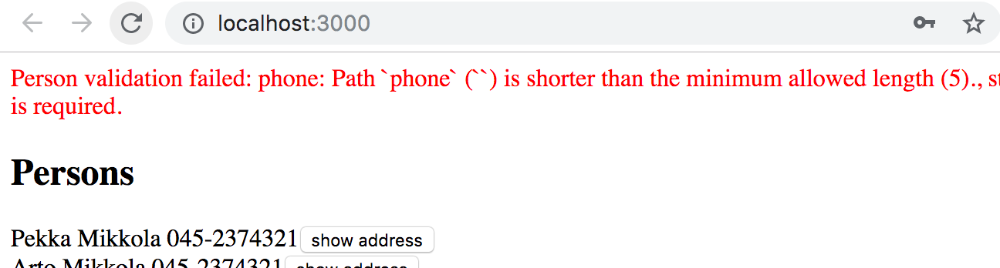
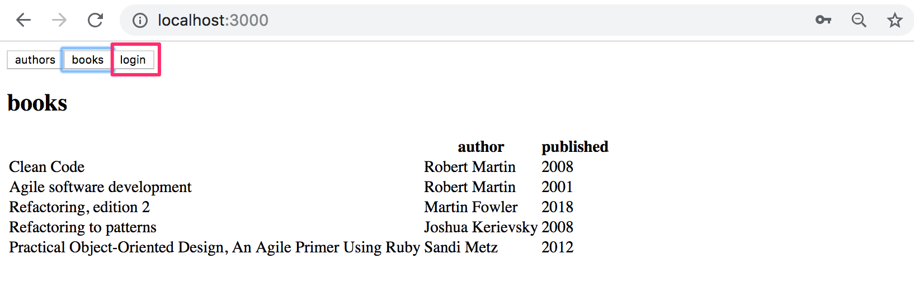
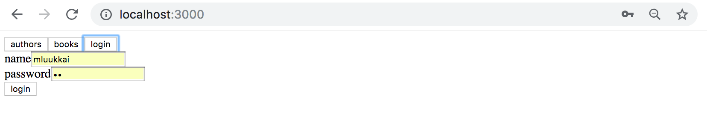
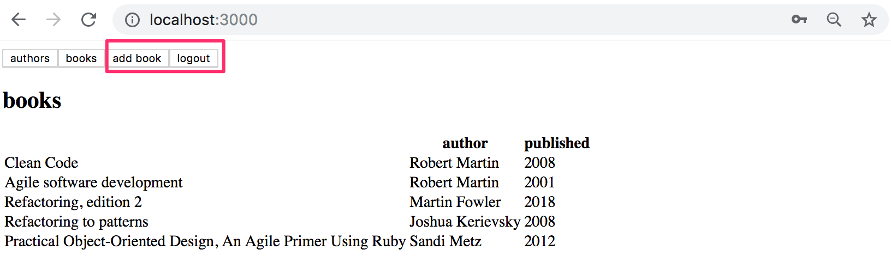
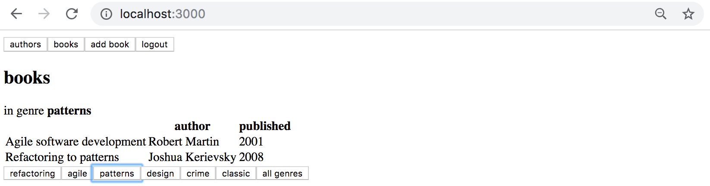
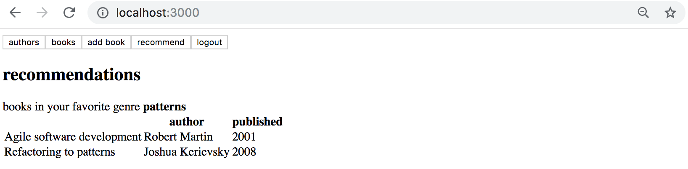

<div class="content">

Sovelluksen frontend toimii puhelinluettelon näyttämisen osalta päivitetyn palvelimen kanssa. Jotta luetteloon voitaisiin lisätä henkilöitä, tulee backendiin toteuttaa kirjautuminen.

### Käyttäjän kirjautuminen

Lisätään sovelluksen tilaan muuttuja _token_, joka tallettaa tokenin siinä vaiheessa kun käyttäjä on kirjautunut. Jos _token_ ei ole määritelty, näytetään kirjautumisesta huolehtiva komponentti <i>LoginForm</i>, joka saa parametriksi virheenkäsittelijän sekä funktion _setToken_:

```js
const App = () => {
  const [token, setToken] = useState(null) // highlight-line

  // ...

  if (!token) {
    return (
      <div>
        <Notify errorMessage={errorMessage} />
        <h2>Login</h2>
        <LoginForm
          setToken={setToken}
          setError={notify}
        />
      </div>
    )
  }

  return (
    // ...
  )
}
```

Määritellään kirjautumisen suorittava mutaatio

```js
export const LOGIN = gql`
  mutation login($username: String!, $password: String!) {
    login(username: $username, password: $password)  {
      value
    }
  }
`
```

Kirjautumisesta huolehtiva komponentti _LoginForm_ toimii melko samalla tavalla kuin aiemmat mutaatioista huolehtivat komponentit. Mielenkiintoiset rivit on korostettu koodissa:

```js
import React, { useState, useEffect } from 'react'
import { useMutation } from '@apollo/client'
import { LOGIN } from '../queries'

const LoginForm = ({ setError, setToken }) => {
  const [username, setUsername] = useState('')
  const [password, setPassword] = useState('')

  const [ login, result ] = useMutation(LOGIN, { // highlight-line
    onError: (error) => {
      setError(error.graphQLErrors[0].message)
    }
  })

// highlight-start
  useEffect(() => {
    if ( result.data ) {
      const token = result.data.login.value
      setToken(token)
      localStorage.setItem('phonenumbers-user-token', token)
    }
  }, [result.data]) // eslint-disable-line
// highlight-end

  const submit = async (event) => {
    event.preventDefault()

    login({ variables: { username, password } })
  }

  return (
    <div>
      <form onSubmit={submit}>
        <div>
          username <input
            value={username}
            onChange={({ target }) => setUsername(target.value)}
          />
        </div>
        <div>
          password <input
            type='password'
            value={password}
            onChange={({ target }) => setPassword(target.value)}
          />
        </div>
        <button type='submit'>login</button>
      </form>
    </div>
  )
}

export default LoginForm
```

Käytössä on jälleen efektihookki, jonka avulla asetetaan tokenin arvo komponentin _App_ tilaan sekä local storageen siinä vaiheessa kun palvelin on vastannut mutaatioon. Efektihookki on tarpeen, jotta sovellus ei joutuisi ikuiseen renderöintilooppiin.

Lisätään sovellukselle myös nappi, jonka avulla kirjautunut käyttäjä voi kirjautua ulos. Napin klikkauskäsittelijässä asetetaan  _token_ tilaan null, poistetaan token local storagesta ja resetoidaan Apollo clientin välimuisti. Tämä on [tärkeää](https://www.apollographql.com/docs/react/networking/authentication/#reset-store-on-logout), sillä joissain kyselyissä välimuistiin on saatettu hakea dataa, johon vain kirjaantuneella käyttäjällä on oikeus päästä käsiksi.

Välimuistin nollaaminen tapahtuu Apollon _client_-objektin metodilla [resetStore](https://www.apollographql.com/docs/react/v3.0-beta/api/core/ApolloClient/#ApolloClient.resetStore), clientiin taas päästään käsiksi hookilla
[useApolloClient](https://www.apollographql.com/docs/react/api/react-hooks/#useapolloclient):

```js
const App = () => {
  const [token, setToken] = useState(null)
  const [errorMessage, setErrorMessage] = useState(null)
  const result = useQuery(ALL_PERSONS)
  const client = useApolloClient() // highlight-line
  
  if (result.loading)  {
    return <div>loading...</div>
  }

  // highlight-start
  const logout = () => {
    setToken(null)
    localStorage.clear()
    client.resetStore()
  }
  // highlight-end

}
```

Sovelluksen tämän vaiheen koodi [githubissa](https://github.com/fullstack-hy2020/graphql-phonebook-frontend/tree/part8-6), branchissa <i>part8-6</i>.

### Tokenin lisääminen headeriin

Backendin muutosten jälkeen uusien henkilöiden lisäys puhelinluetteloon vaatii sen, että käyttäjän token lähetetään pyynnön mukana. 

Tämä edellyttää pientä muutosta tiedostossa <i>index.js</i> olevaan ApolloClient-olion konfiguraatioon

```js
import { setContext } from 'apollo-link-context' // highlight-line

// highlight-start
const authLink = setContext((_, { headers }) => {
  const token = localStorage.getItem('phonenumbers-user-token')
  return {
    headers: {
      ...headers,
      authorization: token ? `bearer ${token}` : null,
    }
  }
})
// highlight-end

const httpLink = new HttpLink({ uri: 'http://localhost:4000' }) // highlight-line

const client = new ApolloClient({
  cache: new InMemoryCache(),
  link: authLink.concat(httpLink) // highlight-line
})
```

_client_-olion muodostamisen yhteydessä oleva toinen parametri _link_ määrittelee, miten apollo on yhteydessä palvelimeen. Nyt normaalia [httpLink](https://www.apollographql.com/docs/link/links/http.htm)-yhteyttä muokataan siten, että pyyntöjen mukaan [asetetaan headerille](https://www.apollographql.com/docs/react/networking/authentication/#header) <i>authorization</i> arvoksi localStoragessa mahdollisesti oleva token.

Asennetaan vielä muutoksen tarvitsema kirjasto

```bash
npm install apollo-link-context
```

Uusien henkilöiden lisäys ja numeroiden muuttaminen toimii taas. Sovellukseen jää kuitenkin yksi ongelma. Jos yritämme lisätä puhelinnumerotonta henkilöä, se ei onnistu.



Validointi epäonnistuu, sillä frontend lähettää kentän _phone_ arvona tyhjän merkkijonon. 

Muutetaan uuden henkilön luovaa funktiota siten, että se asettaa kentälle _phone_  arvon _null_, jos käyttäjä ei ole syöttänyt kenttään mitään:

```js
const PersonForm = ({ setError }) => {
  // ...
  const submit = async (event) => {
    event.preventDefault()
    createPerson({
      variables: { 
        name, street, city,  // highlight-line
        phone: phone.length > 0 ? phone : null  // highlight-line
      }
    })

  // ...
  }

  // ...
}
```

Sovelluksen tämän vaiheen koodi [githubissa](https://github.com/fullstack-hy2020/graphql-phonebook-frontend/tree/part8-7), branchissa <i>part8-7</i>.

### Välimuistin päivitys revisited

Uusien henkilöiden lisäyksen yhteydessä on siis 
[päivitettävä](/osa8/react_ja_graph_ql#valimuistin-paivitys) Apollo clientin välimuisti. Päivitys tapahtuu määrittelemällä mutaation yhteydessä option _refetchQueries_ avulla, että kysely <em>ALL\_PERSONS</em> on suoritettava uudelleen:

```js 
const PersonForm = ({ setError }) => {
  // ...

  const [ createPerson ] = useMutation(CREATE_PERSON, {
    refetchQueries: [  {query: ALL_PERSONS} ], // highlight-line
    onError: (error) => {
      setError(error.graphQLErrors[0].message)
    }
  })
```

Lähestymistapa on kohtuullisen toimiva, ikävänä puolena on toki se, että päivityksen yhteydessä suoritetaan aina myös kysely. 

Ratkaisua on mahdollista optimoida hoitamalla välimuistin päivitys itse. Tämä tapahtuu määrittelemällä mutaatiolle sopiva [update](https://www.apollographql.com/docs/react/v3.0-beta/api/react/hooks/#options-2)-callback, jonka Apollo suorittaa mutaation päätteeksi: 


```js 
const PersonForm = ({ setError }) => {
  // ...

  const [ createPerson ] = useMutation(CREATE_PERSON, {
    onError: (error) => {
      setError(error.graphQLErrors[0].message)
    },
    // highlight-start
    update: (store, response) => {
      const dataInStore = store.readQuery({ query: ALL_PERSONS })
      store.writeQuery({
        query: ALL_PERSONS,
        data: {
          ...dataInStore,
          allPersons: [ ...dataInStore.allPersons, response.data.addPerson ]
        }
      })
    }
    // highlight-end
  })
 
  // ..
}  
```

Callback-funktio saa parametriksi viitteen välimuistiin sekä mutaation mukana palautetun datan, eli esimerkkimme tapauksessa lisätyn käyttäjän.

Koodi lukee funktion [readQuery](https://www.apollographql.com/docs/react/v3.0-beta/caching/cache-interaction/#readquery) avulla kyselyn <em>ALL\_PERSONS</em> välimuistiin talletetun tilan ja päivittää välimuistin funktion [writeQuery](https://www.apollographql.com/docs/react/v3.0-beta/caching/cache-interaction/#writequery-and-writefragment) avulla lisäten henkilöiden joukkoon mutaation lisäämän henkilön.

On myös olemassa tilanteita, joissa ainoa järkevä tapa saada välimuisti pidettyä ajantasaisena on _update_-callbackillä tehtävä päivitys. 

Tarvittaessa välimuisti on mahdollista kytkeä pois päältä joko koko sovelluksesta tai yksittäisiltä kyselyiltä määrittelemällä välimuistin käyttöä kontrolloivalle [fetchPolicy](https://www.apollographql.com/docs/react/data/queries/#configuring-fetch-logic):lle arvo <em>no-cache</em>. 

Välimuistin kanssa kannattaa olla tarkkana. Välimuistissa oleva epäajantasainen data voi aiheuttaa vaikeasti havaittavia bugeja. Kuten tunnettua, välimuistin ajantasalla pitäminen on erittäin haastavaa. Koodareiden joukossa kulkevan kansanviisauden mukaan 

> <i>There are only two hard things in Computer Science: cache invalidation and naming things.</i> Katso lisää [täältä](https://www.google.com/search?q=two+hard+things+in+Computer+Science&oq=two+hard+things+in+Computer+Science).


Sovelluksen tämän vaiheen koodi [githubissa](https://github.com/fullstack-hy2020/graphql-phonebook-frontend/tree/part8-8), branchissa <i>part8-8</i>.

</div>

<div class="tasks">

### Tehtävät 8.17.-8.22.

#### 8.17 Kirjojen lista

Backendin muutosten jälkeen kirjojen lista ei enää toimi. Korjaa se.

#### 8.18 Kirjautuminen

Kirjojen lisäys ja kirjailijan syntymävuoden muutos eivät toimi, sillä ne edellyttävät kirjautumista. 

Toteuta sovellukseesi kirjautuminen ja korjaa mutaatiot.

Sovelluksesi ei ole pakko käsitellä validointivirheitä järkevästi.

Voit päättää itse miltä kirjautuminen näyttää käyttöliittymässä. Eräs mahdollinen ratkaisu on tehdä kirjautumislomakkeesta erillinen näkymä jonne pääsee sovelluksen navigaatiomenusta:



Kirjatumislomake



Kun käyttäjä on kirjautuneena, muutetaan navigaatio näyttämään ne toiminnot, jotka ovat vain kirjautuneen käytettävissä



#### 8.19 genren kirjat, osa 1

Laajenna sovellustasi siten, että kirjojen näkymästä voidaan rajata näytettävä kirjalista ainoastaan niihin, jotka kuuluvat valittuun genreen. Toteutuksesi voi näyttää seuraavalta:



#### 8.20 genren kirjat

Tee sovellukseen näkymä, joka näyttää kirjautuneelle käyttäjälle käyttäjän lempigenreen kuuluvat kirjat.



#### 8.21 genren kirjat GraphQL:llä

Tietyn genren kirjoihin rajoittamisen voi tehdä kokonaan React-sovelluksen puolella. Voit merkitä tämän tehtävän, jos rajaat näytettävät kirjat tehtävässä 8.5 palvelimelle toteutetun suoran GraphQL-kyselyn avulla. 

Tämä **tehtävä on haastava** ja niin kurssin tässä vaiheessa jo kuuluukin olla. Muutama vihje

- Hookin <i>useQuery</i> käytön sijaan saattaa olla parempi tehdä kyselyitä <i>useLazyQuery</i>-hookin avulla
- GraphQL-kyselyjen tuloksia kannattaa joskus tallentaa komponentin tilaan
- Huomaa, että voit tehdä GraphQL-kyselyjä <i>useEffect</i>-hookissa (itse en tämän vuotisessa ratkaisussani tosin tehnyt kyselyjä useEffectissä)
- <i>useEffect</i>-hookin [toisesta parametrista](https://reactjs.org/docs/hooks-reference.html#conditionally-firing-an-effect) voi olla tehtävässä apua, se tosin riippuu käyttämästäsi lähestymistavasta

#### 8.22 kirjasuositukset, välimuistin ajantasaisuus

Jos haet kirjasuositukset GraphQL:llä, varmista jollain tavalla se, että kirjojen näkymä säilyy ajantasaisena. Eli kun lisäät uuden kirjan, päivittyy se kirjalistalle **viimeistään** siinä vaiheessa kun painat jotain genrevalintanappia. Ilman uuden genrevalinnan tekemistä, ei näkymän ole pakko päivittyä. 

</div>
