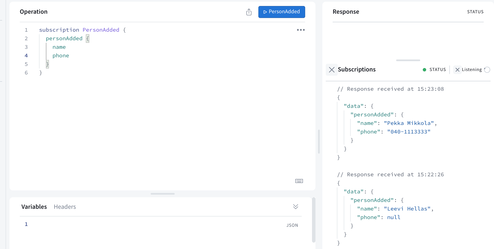
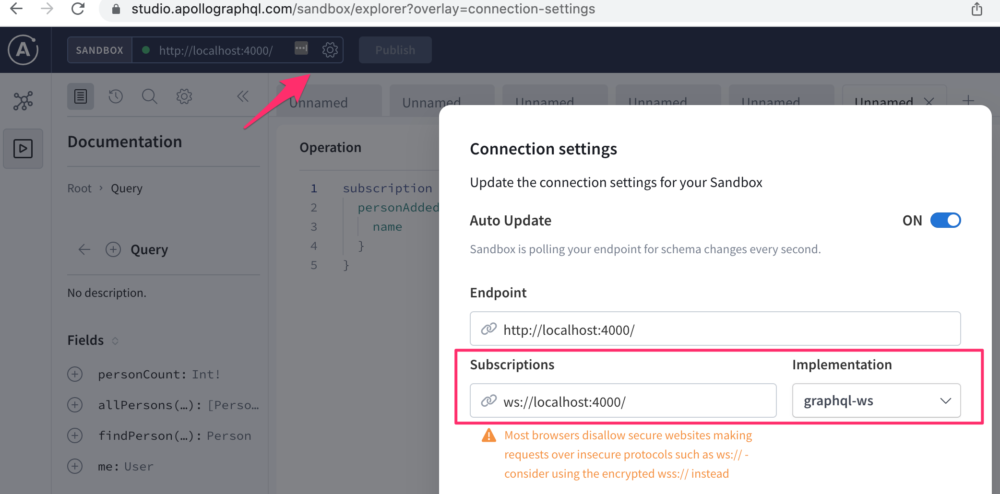

<div class="content">

Osa lähestyy loppuaan. Katsotaan lopuksi vielä muutamaa GraphQL:ään liittyvää asiaa.

### Fragmentit

GraphQL:ssä on suhteellisen yleistä, että eri kyselyt palauttavat samanlaisia vastauksia. Esim. puhelinluettelossa yhden henkilön hakeva kysely

```js
query {
  findPerson(name: "Pekka Mikkola") {
    name
    phone
    address{
      street 
      city
    }
  }
}
```

ja kaikki henkilöt hakeva kysely

```js
query {
  allPersons {
    name
    phone
    address{
      street 
      city
    }
  }
}
```

palauttavat molemmat henkilöitä. Valitessaan palautettavia kenttiä, molemmat kyselyt joutuvat määrittelemään täsmälleen samat kentät. 

Tällaisia tilanteita voidaan yksinkertaistaa [fragmenttien](https://graphql.org/learn/queries/#fragments) avulla. Määritellään kaikki henkilön tiedot valitseva fragmentti:

```js
fragment PersonDetails on Person {
  name
  phone 
  address {
    street 
    city
  }
}
```

Kyselyt voidaan nyt tehdä fragmenttien avulla kompaktimmassa muodossa:

```js
query {
  allPersons {
    ...PersonDetails // highlight-line
  }
}

query {
  findPerson(name: "Pekka Mikkola") {
    ...PersonDetails // highlight-line
  }
}
```

Fragmentteja <i><strong>ei määritellä</strong></i> GraphQL:n skeemassa, vaan kyselyn tekevän clientin puolella. Fragmenttien tulee olla määriteltynä siinä vaiheessa kun client käyttää kyselyssään niitä. 

Voisimme periaatteessa määritellä fragmentin jokaisen kyselyn yhteydessä seuraavasti:

```js
export const FIND_PERSON = gql`
  query findPersonByName($nameToSearch: String!) {
    findPerson(name: $nameToSearch) {
      ...PersonDetails
    }
  }

  fragment PersonDetails on Person {
    name
    phone 
    address {
      street 
      city
    }
  }
`
```

Huomattavasti järkevämpää on kuitenkin määritellä fragmentti kertaalleen ja sijoittaa se muuttujaan.

```js
const PERSON_DETAILS = gql`
  fragment PersonDetails on Person {
    id
    name
    phone 
    address {
      street 
      city
    }
  }
`
```

Näin määritelty fragmentti voidaan upottaa kaikkiin sitä tarvitseviin kyselyihin ja mutaatioihin "dollariaaltosulku"-operaatiolla:

```js
export const FIND_PERSON = gql`
  query findPersonByName($nameToSearch: String!) {
    findPerson(name: $nameToSearch) {
      ...PersonDetails
    }
  }
  ${PERSON_DETAILS}
`
```

### Subscriptiot eli tilaukset


GraphQL tarjoaa query- ja mutation-tyyppien lisäksi kolmannenkin operaatiotyypin, [subscriptionin](https://www.apollographql.com/docs/react/data/subscriptions/), jonka avulla clientit voivat <i>tilata</i> palvelimelta tiedotuksia palvelimella tapahtuneista muutoksista.

Subscriptionit poikkeavatkin radikaalisti kaikesta, mitä kurssilla on tähän mennessä nähty. Toistaiseksi kaikki interaktio on koostunut selaimessa olevan React-sovelluksen palvelimelle tekemistä HTTP-pyynnöistä. Myös GraphQL:n queryt ja mutaatiot on hoidettu näin. Subscriptionien myötä tilanne kääntyy päinvastaiseksi. Sen jälkeen kun selaimessa oleva sovellus on tehnyt tilauksen muutostiedoista, alkaa selain kuunnella palvelinta. Muutosten tullessa palvelin lähettää muutostiedon <i>kaikille sitä kuunteleville</i> selaimille.

Teknisesti ottaen HTTP-protokolla ei taivu hyvin palvelimelta selaimeen päin tapahtuvaan kommunikaatioon. Konepellin alla Apollo käyttääkin [WebSocketeja](https://developer.mozilla.org/en-US/docs/Web/API/WebSockets_API) hoitamaan tilauksista aiheutuvan kommunikaation.

### Backendin refaktorointia

Apollo Server ei versiosta 3.0 alkaen enää tarjoa suoraa tukea subscriptiolle ja joudummekin tekemään joukon muutoksia että saamme ne toimimaan. Siistitään samalla myös sovelluksen rakennetta hiukan. 

Aloitetaan eriyttämällä skeeman määrittely omaan tiedostoon <i>schema.js</i>

```js
const { gql } = require('apollo-server')

const typeDefs = gql`
  type User {
    username: String!
    friends: [Person!]!
    id: ID!
  }

  type Token {
    value: String!
  }

  type Address {
    street: String!
    city: String!
  }

  type Person {
    name: String!
    phone: String
    address: Address!
    id: ID!
  }

  enum YesNo {
    YES
    NO
  }

  type Query {
    personCount: Int!
    allPersons(phone: YesNo): [Person!]!
    findPerson(name: String!): Person
    me: User
  }

  type Mutation {
    addPerson(
      name: String!
      phone: String
      street: String!
      city: String!
    ): Person
    editNumber(name: String!, phone: String!): Person
    createUser(username: String!): User
    login(username: String!, password: String!): Token
    addAsFriend(name: String!): User
  }
`
module.exports = typeDefs
```

Siirretään resolverien määrittely tiedostoon <i>resolvers.js</i>

```js
const { UserInputError, AuthenticationError } = require('apollo-server')
const jwt = require('jsonwebtoken')
const Person = require('./models/person')
const User = require('./models/user')

const JWT_SECRET = 'NEED_HERE_A_SECRET_KEY'

const resolvers = {
  Query: {
    personCount: async () => Person.collection.countDocuments(),
    allPersons: async (root, args) => {
      if (!args.phone) {
        return Person.find({})
      }

      return Person.find({ phone: { $exists: args.phone === 'YES' } })
    },
    findPerson: async (root, args) => Person.findOne({ name: args.name }),
    me: (root, args, context) => {
      return context.currentUser
    },
  },
  Person: {
    address: (root) => {
      return {
        street: root.street,
        city: root.city,
      }
    },
  },
  Mutation: {
    addPerson: async (root, args, context) => {
      const currentUser = context.currentUser

      if (!currentUser) {
        throw new AuthenticationError('not authenticated')
      }

      const person = new Person({ ...args })
      try {
        await person.save()
        currentUser.friends = currentUser.friends.concat(person)
        await currentUser.save()
      } catch (error) {
        throw new UserInputError(error.message, {
          invalidArgs: args,
        })
      }

      return person
    },
    editNumber: async (root, args) => {
      const person = await Person.findOne({ name: args.name })
      person.phone = args.phone

      try {
        await person.save()
      } catch (error) {
        throw new UserInputError(error.message, {
          invalidArgs: args,
        })
      }
      return person.save()
    },
    createUser: async (root, args) => {
      const user = new User({ username: args.username })

      return user.save().catch((error) => {
        throw new UserInputError(error.message, {
          invalidArgs: args,
        })
      })
    },
    login: async (root, args) => {
      const user = await User.findOne({ username: args.username })

      if (!user || args.password !== 'secret') {
        throw new UserInputError('wrong credentials')
      }

      const userForToken = {
        username: user.username,
        id: user._id,
      }

      return { value: jwt.sign(userForToken, JWT_SECRET) }
    },
    addAsFriend: async (root, args, { currentUser }) => {
      const nonFriendAlready = (person) =>
        !currentUser.friends.map(f => f._id.toString()).includes(person._id.toString())

      if (!currentUser) {
        throw new AuthenticationError('not authenticated')
      }

      const person = await Person.findOne({ name: args.name })
      if (nonFriendAlready(person)) {
        currentUser.friends = currentUser.friends.concat(person)
      }

      await currentUser.save()

      return currentUser
    },
  },
}

module.exports = resolvers
```

Siirrytään seuraavaksi käyttämään Apollo Serverin sijan [Apollo Server Expressiä](https://www.apollographql.com/docs/apollo-server/integrations/middleware/#apollo-server-express). Asennetaan kirjastot

```
npm install apollo-server-express apollo-server-core express @graphql-tools/schema
```

ja muutetaan tiedosto <i>index.js</i> seuraavaan muotoon:

```js
const { ApolloServer } = require('apollo-server-express')
const { ApolloServerPluginDrainHttpServer } = require('apollo-server-core')
const { makeExecutableSchema } = require('@graphql-tools/schema')
const express = require('express')
const http = require('http')

const jwt = require('jsonwebtoken')

const JWT_SECRET = 'NEED_HERE_A_SECRET_KEY'

const mongoose = require('mongoose')

const User = require('./models/user')

const typeDefs = require('./schema')
const resolvers = require('./resolvers')

const MONGODB_URI = 'mongodb+srv://databaseurlhere'

console.log('connecting to', MONGODB_URI)

mongoose
  .connect(MONGODB_URI)
  .then(() => {
    console.log('connected to MongoDB')
  })
  .catch((error) => {
    console.log('error connection to MongoDB:', error.message)
  })

// setup is now within a function
const start = async () => {
  const app = express()
  const httpServer = http.createServer(app)

  const schema = makeExecutableSchema({ typeDefs, resolvers })

  const server = new ApolloServer({
    schema,
    context: async ({ req }) => {
      const auth = req ? req.headers.authorization : null
      if (auth && auth.toLowerCase().startsWith('bearer ')) {
        const decodedToken = jwt.verify(auth.substring(7), JWT_SECRET)
        const currentUser = await User.findById(decodedToken.id).populate(
          'friends'
        )
        return { currentUser }
      }
    },
    plugins: [ApolloServerPluginDrainHttpServer({ httpServer })],
  })

  await server.start()

  server.applyMiddleware({
    app,
    path: '/',
  })

  const PORT = 4000

  httpServer.listen(PORT, () =>
    console.log(`Server is now running on http://localhost:${PORT}`)
  )
}

// call the function that does the setup and starts the server
start()
```

Backendin tämänhetkinen koodi on kokonaisuudessaan [GitHubissa](https://github.com/fullstack-hy2020/graphql-phonebook-backend/tree/part8-6), branchissa <i>part8-6</i>.

### Tilaukset palvelimella

Toteutetaan nyt sovellukseemme subscriptiot, joiden avulla palvelimelta on mahdollista tilata tieto puhelinluetteloon lisätyistä henkilöistä.

Skeemaan tarvitaan seuraava lisäys:

```js
type Subscription {
  personAdded: Person!
}    
```

Eli kun uusi henkilö luodaan, palautetaan henkilön tiedot kaikille tilaajille.

Asennetaan tarvittavast kirjastot:

```
npm install graphql-subscriptions graphql-ws
```

Tiedosto <i>index.js</i> muuttuu seraavasti

```js
// highlight-start
const { execute, subscribe } = require('graphql')
const { SubscriptionServer } = require('graphql-ws')
// highlight-end

// ...

const start = async () => {
  const app = express()
  const httpServer = http.createServer(app)

  const schema = makeExecutableSchema({ typeDefs, resolvers })

// highlight-start
  const wsServer = new WebSocketServer({
    server: httpServer,
    path: '/',
  })

  const serverCleanup = useServer({ schema }, wsServer)
  // highlight-end

  const server = new ApolloServer({
    schema,
    context: async ({ req }) => {
      const auth = req ? req.headers.authorization : null
      if (auth && auth.toLowerCase().startsWith('bearer ')) {
        const decodedToken = jwt.verify(auth.substring(7), JWT_SECRET)
        const currentUser = await User.findById(decodedToken.id).populate(
          'friends'
        )
        return { currentUser }
      }
    },
    plugins: [
      ApolloServerPluginDrainHttpServer({ httpServer }),
      // highlight-start
      {
        async serverWillStart() {
          return {
            async drainServer() {
              await serverCleanup.dispose()
            },
          }
        },
      },
      // highlight-end
    ],
  })

  await server.start()

  server.applyMiddleware({
    app,
    path: '/',
  })

  const PORT = 4000

  httpServer.listen(PORT, () =>
    console.log(`Server is now running on http://localhost:${PORT}`)
  )
}

start()
```

GraphQL:n Queryt ja mutaatiot hoidetaan HTTP-protokollaa käyttäen. Tilausten osalta kommunikaatio tapahuu [WebSocket](https://developer.mozilla.org/en-US/docs/Web/API/WebSockets_API)-yhteydellä.

Ylläoleva konfio luo palvelimeen HTTP-pyyntöjen kuuntelun rinnalle WebSocketeja kuuntelevan palvelun, jonka se sitoo palvelimen GraphQL-skeemaan. Määrittelyn toinen osa rekisteröi funktion, joka sulkee WebSocket-yhteyden palvelimen sulkemisen yhteydessä.

Toisin kuin HTTP:n yhteydessä, WebSocketteja käyttäessä myös palvelin voi olla datan lähettämisessä aloitteellinen osapuoli. Näinollen WebSocketit sopivat hyvin GraphQL:n tilauksiin, missä palvelimen on pystyttävä kertomaan kaikille tietyn tilauksen tehneille tilausta vastaavan tapahtuman (esim. henkilön luominen) tapahtumisesta.

Määritellylle tilaukselle _personAdded_ tarvitaan resolveri. Myös lisäyksen tekevää resolveria _addPerson_ on muutettava siten, että uuden henkilön lisäys aiheuttaa ilmoituksen tilauksen tehneille.

Muutokset ovat seuraavassa:

```js
const { PubSub } = require('graphql-subscriptions') // highlight-line
const pubsub = new PubSub() // highlight-line

const resolvers = {
  // ...
  Mutation: {
    addPerson: async (root, args, context) => {
      const person = new Person({ ...args })
      const currentUser = context.currentUser

      if (!currentUser) {
        throw new AuthenticationError("not authenticated")
      }

      try {
        await person.save()
        currentUser.friends = currentUser.friends.concat(person)
        await currentUser.save()
      } catch (error) {
        throw new UserInputError(error.message, {
          invalidArgs: args,
        })
      }

      pubsub.publish('PERSON_ADDED', { personAdded: person })  // highlight-line

      return person
    },  
  },
  // highlight-start
  Subscription: {
    personAdded: {
      subscribe: () => pubsub.asyncIterator('PERSON_ADDED')
    },
  },
  // highlight-end
}
```

Tilausten yhteydessä kommunikaatio tapahtuu [publish-subscribe](https://en.wikipedia.org/wiki/Publish%E2%80%93subscribe_pattern)-periaatteella käyttäen olioa [PubSub](https://www.apollographql.com/docs/apollo-server/data/subscriptions/#the-pubsub-class).

Koodia on vähän mutta konepellin alla tapahtuu paljon. Tilauksen _personAdded_ resolverissa palvelin rekisteröi ja tallettaa muistiin tiedon kaikista sille tilauksen tehneistä clienteista. Nämä tallentuvat seuraavan koodinpätkän ansiosta nimellä <i>PERSON\_ADDED</i> varustettuun ["iteraattoriolioon"](https://www.apollographql.com/docs/apollo-server/data/subscriptions/#listening-for-events):

```js
Subscription: {
  personAdded: {
    subscribe: () => pubsub.asyncIterator('PERSON_ADDED')
  },
},
```

Iteraattorin nimi on mielivaltainen merkkijono, joka on nyt valittu kuvaavalla tavalla mutta kirjoitettu konventtion mukaan isoin kirjaimin.

Uuden henkilön lisäys <i>julkaisee</i> tiedon lisäyksestä kaikille muutokset tilanneille PubSubin metodilla _publish_:

```js
pubsub.publish('PERSON_ADDED', { personAdded: person }) 
```

Koodirivin suoritus saa siis aikaan sen, että kaikille iteraattoriin <i>PERSON\_ADDED</i> rekisteröidyille clienteille lähtee WebSocketin avulla tieto luodusta käyttäjästä.

Tilauksia on mahdollista testata Apollo Exploreilla avulla seuraavasti:



Kun tilauksen suorittavaa sinistä PersonAdded-painiketta painetaan, jää Explorer odottamaan tilaukseen tulevia vastauksia. Aina kun sovellukseen lisätään uusia käyttäjiä (joudut tekemään lisäyksen toisesta selainikkunasta), tulee tieto niistä Explorerin oikeaan reunaan.

Jos tilaus ei toimi, saatat tarkasta, että yhteysasetukset on määritelty oikein:



Backendin koodi on kokonaisuudessaan [GitHubissa](https://github.com/fullstack-hy2020/graphql-phonebook-backend/tree/part8-7), branchissa <i>part8-7</i>.

### Tilaukset clientissä

Jotta saamme tilaukset käyttöön React-sovelluksessa, tarvitaan jonkin verran muutoksia erityisesti [konfiguraatioiden osalta](https://www.apollographql.com/docs/react/data/subscriptions/). Tiedostossa <i>index.js</i> olevat konfiguraatiot on muokattava seuraavaan muotoon:

```js
import { 
  ApolloClient, ApolloProvider, HttpLink, InMemoryCache, 
  split  // highlight-line
} from '@apollo/client'
import { setContext } from 'apollo-link-context'

// highlight-start
import { getMainDefinition } from '@apollo/client/utilities'
import { GraphQLWsLink } from '@apollo/client/link/subscriptions'
import { createClient } from 'graphql-ws'
// highlight-end

const authLink = setContext((_, { headers }) => {
  const token = localStorage.getItem('phonenumbers-user-token')
  return {
    headers: {
      ...headers,
      authorization: token ? `bearer ${token}` : null,
    }
  }
})

const httpLink = new HttpLink({
  uri: 'http://localhost:4000',
})

// highlight-start
const wsLink = new GraphQLWsLink(
  createClient({
    url: 'ws://localhost:4000',
  })
)
// highlight-end

// highlight-start
const splitLink = split(
  ({ query }) => {
    const definition = getMainDefinition(query)
    return (
      definition.kind === 'OperationDefinition' &&
      definition.operation === 'subscription'
    )
  },
  wsLink,
  authLink.concat(httpLink)
)
// highlight-end

const client = new ApolloClient({
  cache: new InMemoryCache(),
  link: splitLink // highlight-line
})

ReactDOM.createRoot(document.getElementById('root')).render(
  <ApolloProvider client={client}>
    <App />
  </ApolloProvider>
)
```

Jotta kaikki toimisi, on asennettava uusia riippuvuuksia:

```bash
npm install @apollo/client graphql-ws
```

Uusi konfiguraatio johtuu siitä, että sovelluksella tulee nyt olla HTTP-yhteyden lisäksi websocket-yhteys GraphQL-palvelimelle:

```js
const httpLink = new HttpLink({
  uri: 'http://localhost:4000',
})

const wsLink = new GraphQLWsLink(
  createClient({
    url: 'ws://localhost:4000',
  })
)
```

Tilaukset tehdään hook-funktion [useSubscription](https://www.apollographql.com/docs/react/api/react/hooks/#usesubscription) avulla. 

Tehdään koodiin seuraavat muutokset:

```js
// highlight-start
export const PERSON_ADDED = gql`
  subscription {
    personAdded {
      ...PersonDetails
    }
  }
  ${PERSON_DETAILS}
`
// highlight-end

import {
  useQuery, useMutation, useSubscription, useApolloClient // highlight-line
} from '@apollo/client'

const App = () => {
  // ...

  useSubscription(PERSON_ADDED, {
    onData: ({ data }) => {
      console.log(data)
    }
  })

  // ...
}
```

Kun puhelinluetteloon nyt lisätään henkilöitä, tapahtuupa se mistä tahansa, tulostuvat clientin konsoliin lisätyn henkilön tiedot:


Kun luetteloon lisätään uusi henkilö, palvelin lähettää siitä tiedot clientille ja attribuutin _onData_ arvoksi määriteltyä callback-funktiota kutsutaan antaen sille parametriksi palvelimelle lisätty henkilö. 

Laajennetaan ratkaisua vielä siten, että uuden henkilön tietojen saapuessa henkilö lisätään Apollon välimuistiin, jolloin se renderöityy heti ruudulle:

```js
const App = () => {
  // ...

  useSubscription(PERSON_ADDED, {
    onData: ({ data }) => {
      const addedPerson = data.data.personAdded
      notify(`${addedPerson.name} added`)

// highlight-start
      client.cache.updateQuery({ query: ALL_PERSONS }, ({ allPersons }) => {
        return {
          allPersons: allPersons.concat(addedPerson),
        }
      })
      // highlight-end
    }
  })

  // ...
}
```

Ratkaisussa on kuitenkin pieni ongelma. Itse lisätty henkilö tulee nyt välimuistiin sekä renderöityy ruudulle kahteen kertaan, sillä myös komponentti PersonForm lisää uuden henkilön välimuistin.

Ratkaistaan ongelma varmistamalla, että sama henkilö ei päädy välimuistiin kahteen kertaan:

```js
// highlight-start
// function that takes care of manipulating cache
export const updateCache = (cache, query, addedPerson) => {
  // helper that is used to eliminate saving same person twice
  const uniqByName = (a) => {
    let seen = new Set()
    return a.filter((item) => {
      let k = item.name
      return seen.has(k) ? false : seen.add(k)
    })
  }
  // highlight-end

  // highlight-start
  cache.updateQuery(query, ({ allPersons }) => {
    return {
      allPersons: uniqByName(allPersons.concat(addedPerson)),
    }
  })
}
// highlight-end

const App = () => {
  const result = useQuery(ALL_PERSONS)
  const [errorMessage, setErrorMessage] = useState(null)
  const [token, setToken] = useState(null)
  const client = useApolloClient() 

  useSubscription(PERSON_ADDED, {
    onData: ({ data, client }) => {
      const addedPerson = data.data.personAdded
      notify(`${addedPerson.name} added`)
      updateCache(client.cache, { query: ALL_PERSONS }, addedPerson) // highlight-line
    },
  })

  // ...
}
```

Funktio _updateCache_ lisää uuden henkilön tiedot välimuistin queryn <i>allPersons</i> tallentamiin henkilöihin, mutta varmistaa kuitenkin funktion _uniqByName_ avulla, että yhden henkilön tiedot eivät tallennu välimuitiin useampaan kertaan. 

Funktiota _updateCache_ voidaan hyödyntää myös uuden henkilön lisäyksen yhteydessä tapahtuvassa välimuistin päivityksessä:

```js
import { updateCache } from '../App' // highlight-line

const PersonForm = ({ setError }) => { 
  // ...

  const [createPerson] = useMutation(CREATE_PERSON, {
    onError: (error) => {
      setError(error.graphQLErrors[0].message)
    },
    update: (cache, response) => {
      updateCache(cache, { query: ALL_PERSONS }, response.data.addPerson)  // highlight-line
    },
  })
   
  // ..
} 
```

Clientin lopullinen koodi [GitHubissa](https://github.com/fullstack-hy2020/graphql-phonebook-frontend/tree/part8-9), branchissa <i>part8-9</i>.

### n+1-ongelma

Laajennetaan vielä backendia hieman. Muutetaan skeemaa siten, että tyypille <i>Person</i> tulee kenttä _friendOf_, joka kertoo kenen kaikkien käyttäjien tuttavalistalla ko henkilö on.

```js
type Person {
  name: String!
  phone: String
  address: Address!
  friendOf: [User!]!
  id: ID!
}
```

Sovellukseen tulisi siis saada tuki esim. seuraavalle kyselylle:

```js
query {
  findPerson(name: "Leevi Hellas") {
    friendOf {
      username
    }
  }
}
```

Koska _friendOf_ ei ole tietokannassa olevien <i>Person</i>-olioiden sarake, on sille tehtävä oma resolveri, joka osaa selvittää asian. Tehdään aluksi tyhjän listan palauttava resolveri:

```js
Person: {
  address: (root) => {
    return { 
      street: root.street,
      city: root.city
    }
  },
  // highlight-start
  friendOf: (root) => {
    // return list of users 
    return [
    ]
  }
  // highlight-end
},
```

Resolverin parametrina _root_ on se henkilöolio jonka tuttavalista on selvityksen alla, eli etsimme olioista _User_ ne, joiden _friends_-listalle sisältyy root._id:

```js
  Person: {
    // ...
    friendOf: async (root) => {
      const friends = await User.find({
        friends: {
          $in: [root._id]
        } 
      })

      return friends
    }
  },
```

Sovellus toimii nyt. 

Voimme samantien tehdä monimutkaisempiakin kyselyitä. On mahdollista selvittää esim. kaikkien henkilöiden tuttavat:

```js
query {
  allPersons {
    name
    friendOf {
      username
    }
  }
}
```

Sovelluksessa on nyt kuitenkin yksi ongelma, tietokantakyselyjä tehdään kohtuuttoman paljon. Jos lisäämme palvelimen jokaiseen tietokantakyselyn tekevään kohtaan konsoliin tehtävän tulostuksen, huomaamme että jos tietokannassa on viisi henkilöä, tehdään seuraavat tietokantakyselyt: 

<pre>
Person.find
User.find
User.find
User.find
User.find
User.find
</pre>

Eli vaikka pääasiallisesti tehdään ainoastaan yksi kysely joka hakee kaikki henkilöt, aiheuttaa jokainen henkilö yhden kyselyn omassa resolverissaan.

Kyseessä on ilmentymä kuuluisasta [n+1-ongelmasta](https://www.google.com/search?q=n%2B1+problem), joka ilmenee aika ajoin eri yhteyksissä, välillä salakavalastikin sovelluskehittäjän huomaamatta aluksi mitään.

Sopiva ratkaisutapa n+1-ongelmaan riippuu tilanteesta. Usein se edellyttää jonkinlaisen liitoskyselyn tekemistä usean yksittäisen kyselyn sijaan.

Tilanteessamme helpoimman ratkaisun toisi se, että tallettaisimme _Person_-olioihin viitteet niistä käyttäjistä kenen ystävälistalla henkilö on:

```js
const schema = new mongoose.Schema({
  name: {
    type: String,
    required: true,
    unique: true,
    minlength: 5
  },
  phone: {
    type: String,
    minlength: 5
  },
  street: {
    type: String,
    required: true,
    minlength: 5
  },  
  city: {
    type: String,
    required: true,
    minlength: 5
  },
  // highlight-start
  friendOf: [
    {
      type: mongoose.Schema.Types.ObjectId,
      ref: 'User'
    }
  ], 
  // highlight-end
})
```

Tällöin voisimme tehdä "liitoskyselyn", eli hakiessamme _Person_-oliot, voimme populoida niiden _friendOf_-kentät:

```js
Query: {
  allPersons: (root, args) => {    
    console.log('Person.find')
    if (!args.phone) {
      return Person.find({}).populate('friendOf') // highlight-line
    }

    return Person.find({ phone: { $exists: args.phone === 'YES' } })
      .populate('friendOf') // highlight-line
  },
  // ...
}
```

Muutoksen jälkeen erilliselle _friendOf_-kentän resolverille ei enää olisi tarvetta.

Kaikkien henkilöiden kysely <i>ei aiheuta</i> n+1-ongelmaa, jos kyselyssä pyydetään esim. ainoastaan nimi ja puhelinnumero:

```js
query {
  allPersons {
    name
    phone
  }
}
```

Jos kyselyä _allPersons_ muokataan tekemään liitoskysely sen varalta, että se aiheuttaa välillä n+1-ongelman, tulee kyselystä hieman raskaampi niissäkin tapauksissa, joissa henkilöihin liittyviä käyttäjiä ei tarvita. Käyttämällä resolverifunktioiden [neljättä parametria](https://www.apollographql.com/docs/apollo-server/data/data/#resolver-type-signature) olisi kyselyn toteutusta mahdollista optimoida vieläkin pidemmälle. Neljännen parametrin avulla on mahdollista tarkastella itse kyselyä, ja näin liitoskysely voitaisiin tehdä ainoastaan niissä tapauksissa, joissa on n+1-ongelman uhka. Tämänkaltaiseen optimointiin ei toki kannata lähteä ennen kun on varmaa, että se todellakin kannattaa. 

[Donald Knuthin sanoin](https://en.wikiquote.org/wiki/Donald_Knuth):

> <i>Programmers waste enormous amounts of time thinking about, or worrying about, the speed of noncritical parts of their programs, and these attempts at efficiency actually have a strong negative impact when debugging and maintenance are considered. We should forget about small efficiencies, say about 97% of the time: <strong>premature optimization is the root of all evil.</strong></i>

Erään varteenotettavan ratkaisun monien muiden seikkojen lisäksi n+1-ongelmaan tarjoaa 
Facebookin kehittämä [dataloader](https://github.com/facebook/dataloader)-kirjasto, dataloaderin käytöstä Apollo serverin kanssa [täällä](https://www.robinwieruch.de/graphql-apollo-server-tutorial/#graphql-server-data-loader-caching-batching) ja [täällä](http://www.petecorey.com/blog/2017/08/14/batching-graphql-queries-with-dataloader/).

### Loppusanat

Tässä osassa rakentamamme sovellus ei ole optimaalisella tavalla strukturoitu, teimme pientä siivousta siirtämällä skeeman ja resolverit omiin tiedostoihin mutta parantamisen varaa jäi edelleen paljon. Esimerkkejä GraphQL-sovellusten parempaan strukturointiin löytyy internetistä, esim. serveriin
[täältä](https://blog.apollographql.com/modularizing-your-graphql-schema-code-d7f71d5ed5f2) ja clientiin [täältä](https://medium.com/@peterpme/thoughts-on-structuring-your-apollo-queries-mutations-939ba4746cd8).

GraphQL on jo melko iäkäs teknologia, se on ollut Facebookin sisäisessä käytössä jo vuodesta 2012 lähtien, teknologian voi siis todeta olevan "battle tested". Facebook julkaisi GraphQL:n vuonna 2015 ja se on pikkuhiljaa saanut enenevissä määrin huomiota ja nousee ehkä lähivuosina uhmaamaan REST:in valta-asemaa. REST:in [kuolemaakin](https://www.stridenyc.com/podcasts/52-is-2018-the-year-graphql-kills-rest) on jo ennusteltu. Vaikka se ei tulekaan ihan heti tapahtumaan, on GraphQL ehdottomasti [tutustumisen arvoinen](https://blog.graphqleditor.com/javascript-predictions-for-2019-by-npm/).

</div>

<div class="tasks">

### Tehtävät 8.23.-8.26.

#### 8.23: Subscriptionit palvelin

Tee palvelimelle toteutus subscriptiolle _bookAdded_, joka palauttaa tilaajilleen lisättyjen kirjojen tiedot.

#### 8.24: Subscriptionit client, osa 1

Ota clientillä käyttöön subscriptiot ja tilaa _bookAdded_. Uusien kirjojen tullessa anna ilmoitus käyttäjälle. Mikä tahansa menetelmä käy, voit käyttää esim. funktiota [window.alert](https://developer.mozilla.org/en-US/docs/Web/API/Window/alert).

#### 8.25: Subscriptionit client, osa 2

Pidä sovelluksen käyttöliittymä ajantasaisena, kun palvelin tiedottaa uusista kirjoista.

#### 8.26: n+1

Ratkaise haluamallasi menetelmällä seuraavaa kyselyä vaivaava n+1-ongelma:

```js
query {
  allAuthors {
    name 
    bookCount
  }
}
```

### Tehtävien palautus ja suoritusmerkinnän pyytäminen

Tämän osat palautetaan edellisistä osista poiketen [palautussovelluksessa](https://studies.cs.helsinki.fi/stats/courses/fs-graphql) omaan kurssi-instanasiinsa. Huomaa, että tarviset suoritukseen vähintään 22 tehtävää!

Jos haluat suoritusmerkinnän, merkitse kurssi suoritetuksi:


**Huomaa**, että suoritusmerkintää ei voida kirjata, ellet ole ilmoittautunut tätä osaa vastaavaan "kurssiin palaan", katso lisätietoja ilmoittautumisesta [täältä](/osa0/yleista#osat-ja-suorittaminen).

</div>
