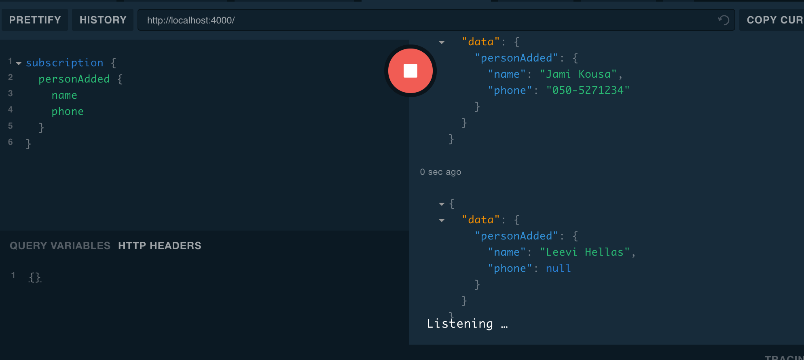
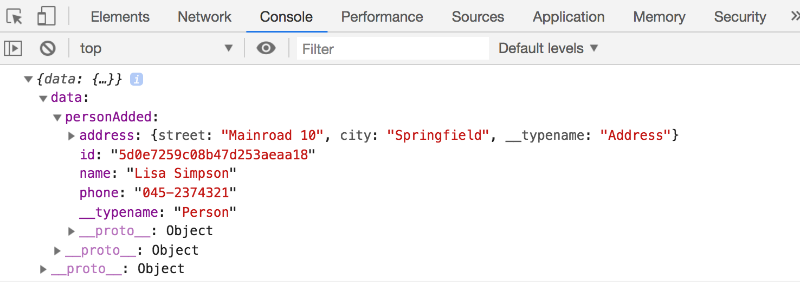

<div class="content">

Kurssi lähestyy loppuaan. Katsotaan lopuksi vielä muutamaa GraphQL:ään liittyvää asiaa.

### Fragmentit

GraphQL:ssä on suhteellisen yleistä, että eri kyselyt palauttavat samanlaisia vastauksia. Esim. puhelinluettelossa yhden henkilön hakeva kysely

```js
query {
  findPerson(name: "Pekka Mikkola") {
    name
    phone
    address{
      street 
      city
    }
  }
}
```

ja kaikki henkilöt hakeva kysely

```js
query {
  allPersons {
    name
    phone
    address{
      street 
      city
    }
  }
}
```

palauttavat molemmat henkilöitä. Valitessaan palautettavia kenttiä, molemmat kyselyt joutuvat määrittelemään täsmälleen samat kentät. 

Tällaisia tilanteita voidaan yksinkertaistaa [fragmenttien](https://graphql.org/learn/queries/#fragments) avulla. Määritellään kaikki henkilön tiedot valitseva fragmentti:

```js
fragment PersonDetails on Person {
  name
  phone 
  address {
    street 
    city
  }
}
```

Kyselyt voidaan nyt tehdä fragmenttien avulla kompaktimmassa muodossa:

```js
query {
  allPersons {
    ...PersonDetails // highlight-line
  }
}

query {
  findPerson(name: "Pekka Mikkola") {
    ...PersonDetails // highlight-line
  }
}
```

Fragmentteja <i><strong>ei määritellä</strong></i> GraphQL:n skeemassa, vaan kyselyn tekevän clientin puolella. Fragmenttien tulee olla määriteltynä siinä vaiheessa kun client käyttää kyselyssään niitä. 

Voisimme periaatteessa määritellä fragmentin jokaisen kyselyn yhteydessä seuraavasti:

```js
export const ALL_PERSONS = gql`
  {
    allPersons  {
      ...PersonDetails
    }
  }
  fragment PersonDetails on Person {
    name
    phone 
    address {
      street 
      city
    }
  }
`
```

Huomattavasti järkevämpää on kuitenkin määritellä fragmentti kertaalleen ja sijoittaa se muuttujaan.

```js
const PERSON_DETAILS = gql`
  fragment PersonDetails on Person {
    id
    name
    phone 
    address {
      street 
      city
    }
  }
`
```

Näin määritelty fragmentti voidaan upottaa kaikkiin sitä tarvitseviin kyselyihin ja mutaatioihin "dollariaaltosulku"-operaatiolla:

```js
export const ALL_PERSONS = gql`
  {
    allPersons  {
      ...PersonDetails
    }
  }
  ${PERSON_DETAILS}  
`
```

### Subscriptiot eli tilaukset

GraphQL tarjoaa query- ja mutation-tyyppien lisäksi kolmannenkin operaatiotyypin, [subscriptionin](https://www.apollographql.com/docs/react/data/subscriptions/), jonka avulla clientit voivat <i>tilata</i> palvelimelta tiedotuksia palvelimella tapahtuneista muutoksista.

Subscriptionit poikkeavatkin radikaalisti kaikesta, mitä kurssilla on tähän mennessä nähty. Toistaiseksi kaikki interaktio on koostunut selaimessa olevan React-sovelluksen palvelimelle tekemistä HTTP-pyynnöistä. Myös GraphQL:n queryt ja mutaatiot on hoidettu näin. Subscriptionien myötä tilanne kääntyy päinvastaiseksi. Sen jälkeen kun selaimessa oleva sovellus on tehnyt tilauksen muutostiedoista, alkaa selain kuunnella palvelinta. Muutosten tullessa palvelin lähettää muutostiedon <i>kaikille sitä kuunteleville</i> selaimille.

Teknisesti ottaen HTTP-protokolla ei taivu hyvin palvelimelta selaimeen päin tapahtuvaan kommunikaatioon. Konepellin alla Apollo käyttääkin [WebSocketeja](https://developer.mozilla.org/en-US/docs/Web/API/WebSockets_API) hoitamaan tilauksista aiheutuvan kommunikaation.

### Tilaukset palvelimella

Toteutetaan nyt sovellukseemme subscriptiot, joiden avulla palvelimelta on mahdollista tilata tieto puhelinluetteloon lisätyistä henkilöistä.

Palvelimella ei ole tarvetta kovin monille muutoksille. Skeemaan tarvitaan seuraava lisäys:

```js
type Subscription {
  personAdded: Person!
}    
```

Eli kun uusi henkilö luodaan, palautetaan henkilön tiedot kaikille tilaajille.

Määritellylle tilaukselle _personAdded_ tarvitaan resolveri. Myös lisäyksen tekevää resolveria _addPerson_ on muutettava siten, että uuden henkilön lisäys aiheuttaa ilmoituksen tilauksen tehneille.

Muutokset ovat seuraavassa:

```js
const { PubSub } = require('apollo-server') // highlight-line
const pubsub = new PubSub() // highlight-line

  Mutation: {
    addPerson: async (root, args, context) => {
      const person = new Person({ ...args })
      const currentUser = context.currentUser

      if (!currentUser) {
        throw new AuthenticationError("not authenticated")
      }

      try {
        await person.save()
        currentUser.friends = currentUser.friends.concat(person)
        await currentUser.save()
      } catch (error) {
        throw new UserInputError(error.message, {
          invalidArgs: args,
        })
      }

      pubsub.publish('PERSON_ADDED', { personAdded: person })  // highlight-line

      return person
    },  
  },
  // highlight-start
  Subscription: {
    personAdded: {
      subscribe: () => pubsub.asyncIterator(['PERSON_ADDED'])
    },
  },
  // highlight-end
```

Tilausten yhteydessä kommunikaatio tapahtuu [publish-subscribe](https://en.wikipedia.org/wiki/Publish%E2%80%93subscribe_pattern)-periaatteella käyttäen rajapinnan [PubSub](https://www.apollographql.com/docs/graphql-subscriptions/setup.html#setup) toteuttavaa olioa. Uuden henkilön lisäys <i>julkaisee</i> tiedon lisäyksestä kaikille muutokset tilanneille PubSubin metodilla _publish_. 

Subscriptionin _personAdded_ resolveri rekisteröi tiedotteista kiinnostuneet clientit palauttamalla niille sopivan [iteraattoriolion](https://www.apollographql.com/docs/graphql-subscriptions/subscriptions-to-schema.html).

Muutetaan palvelimen käynnistävää koodia seuraavasti

```js
// ...

server.listen().then(({ url, subscriptionsUrl }) => { // highlight-line
  console.log(`Server ready at ${url}`)
  console.log(`Subscriptions ready at ${subscriptionsUrl}`) // highlight-line
})
```

Nyt näemme, että palvelin kuuntelee subscriptioita osoitteessa _ws://localhost:4000/graphql_

```js
Server ready at http://localhost:4000/
Subscriptions ready at ws://localhost:4000/graphql
```

Muita muutoksia palvelimeen ei tarvita. 

Tilauksia on mahdollista testata GraphQL-playgroundin avulla seuraavasti:



Kun tilauksen "play"-painiketta painetaan, jää playground odottamaan tilaukseen tulevia vastauksia. Aina kun sovellukseen lisätään uusia käyttäjiä, tulee tieto niistä playgroundin oikeanpuoleiseen ikkunaan.

Backendin koodi on kokonaisuudessaan [githubissa](https://github.com/fullstack-hy2020/graphql-phonebook-backend/tree/part8-6), branchissa <i>part8-6</i>.

### Tilaukset clientissä

Jotta saamme tilaukset käyttöön React-sovelluksessa, tarvitaan hieman enemmän muutoksia, erityisesti [konfiguraatioiden osalta](https://www.apollographql.com/docs/react/data/subscriptions/). Tiedostossa <i>index.js</i> olevat konfiguraatiot on muokattava seuraavaan muotoon:

```js
import { 
  ApolloClient, ApolloProvider, HttpLink, InMemoryCache, 
  split  // highlight-line
} from '@apollo/client'
import { setContext } from 'apollo-link-context'

// highlight-start
import { getMainDefinition } from '@apollo/client/utilities'
import { WebSocketLink } from '@apollo/client/link/ws'
// highlight-end

const authLink = setContext((_, { headers }) => {
  const token = localStorage.getItem('phonenumbers-user-token')
  return {
    headers: {
      ...headers,
      authorization: token ? `bearer ${token}` : null,
    }
  }
})

const httpLink = new HttpLink({
  uri: 'http://localhost:4000',
})

// highlight-start
const wsLink = new WebSocketLink({
  uri: 'ws://localhost:4000/graphql',
  options: {
    reconnect: true
  }
})

const splitLink = split(
  ({ query }) => {
    const definition = getMainDefinition(query)
    return (
      definition.kind === 'OperationDefinition' &&
      definition.operation === 'subscription'
    )
  },
  wsLink,
  authLink.concat(httpLink),
)
// highlight-end

const client = new ApolloClient({
  cache: new InMemoryCache(),
  link: splitLink // highlight-line
})

ReactDOM.render(
  <ApolloProvider client={client}>
    <App />
  </ApolloProvider>, 
  document.getElementById('root')
)
```

Jotta kaikki toimisi, on asennettava uusia riippuvuuksia:

```bash
npm install @apollo/client subscriptions-transport-ws
```

Uusi konfiguraatio johtuu siitä, että sovelluksella tulee nyt olla HTTP-yhteyden lisäksi websocket-yhteys GraphQL-palvelimelle:

```js
const wsLink = new WebSocketLink({
  uri: `ws://localhost:4000/graphql`,
  options: { reconnect: true }
})

const httpLink = createHttpLink({
  uri: 'http://localhost:4000',
})
```

Tilaukset tehdään hook-funktion [useSubscription](https://www.apollographql.com/docs/react/v3.0-beta/api/react/hooks/#usesubscription) avulla. 

Tehdään koodiin seuraavat muutokset:

```js
// highlight-start
export const PERSON_ADDED = gql`
  subscription {
    personAdded {
      ...PersonDetails
    }
  }
  ${PERSON_DETAILS}
`
// highlight-end

import {
  useQuery, useMutation, useSubscription, useApolloClient // highlight-line
} from '@apollo/client'

const App = () => {
  // ...

  useSubscription(PERSON_ADDED, {
    onSubscriptionData: ({ subscriptionData }) => {
      console.log(subscriptionData)
    }
  })

  // ...
}
```

Kun puhelinluetteloon nyt lisätään henkilöitä, tapahtuupa se mistä tahansa, tulostuvat clientin konsoliin lisätyn henkilön tiedot:



Kun luetteloon lisätään uusi henkilö, palvelin lähettää siitä tiedot clientille ja attribuutin _onSubscriptionData_ arvoksi määriteltyä callback-funktiota kutsutaan antaen sille parametriksi palvelimelle lisätty henkilö. 

Laajennetaan ratkaisua vielä siten, että uuden henkilön tietojen saapuessa henkilö lisätään Apollon välimuistiin, jolloin se renderöityy heti ruudulle. Koodissa on jouduttu huomioimaan se, että sovelluksen itsensä lisäämää henkilöä ei saa lisätä välimuistiin kahteen kertaan:

```js
const App = () => {
  // ...

  const updateCacheWith = (addedPerson) => {
    const includedIn = (set, object) => 
      set.map(p => p.id).includes(object.id)  

    const dataInStore = client.readQuery({ query: ALL_PERSONS })
    if (!includedIn(dataInStore.allPersons, addedPerson)) {
      client.writeQuery({
        query: ALL_PERSONS,
        data: { allPersons : dataInStore.allPersons.concat(addedPerson) }
      })
    }   
  }

  useSubscription(PERSON_ADDED, {
    onSubscriptionData: ({ subscriptionData }) => {
      const addedPerson = subscriptionData.data.personAdded
      notify(`${addedPerson.name} added`)
      updateCacheWith(addedPerson)
    }
  })

  // ...
}
```

Funktiota _updateCacheWith_ voidaan hyödyntää myös uuden henkilön lisäyksen yhteydessä tapahtuvassa välimuistin päivityksessä:

```js
const PersonForm = ({ setError, updateCacheWith }) => { // highlight-line
  // ...

  const [ createPerson ] = useMutation(CREATE_PERSON, {
    onError: (error) => {
      setError(error.graphQLErrors[0].message)
    },
    update: (store, response) => {
      updateCacheWith(response.data.addPerson) // highlight-line
    }
  })
   
  // ..
} 
```

Clientin lopullinen koodi [githubissa](https://github.com/fullstack-hy2020/graphql-phonebook-frontend/tree/part8-9), branchissa <i>part8-9</i>.

### n+1-ongelma

Laajennetaan vielä backendia hieman. Muutetaan skeemaa siten, että tyypille <i>Person</i> tulee kenttä _friendOf_, joka kertoo kenen kaikkien käyttäjien tuttavalistalla ko henkilö on.

```js
type Person {
  name: String!
  phone: String
  address: Address!
  friendOf: [User!]!
  id: ID!
}
```

Sovellukseen tulisi siis saada tuki esim. seuraavalle kyselylle:

```js
query {
  findPerson(name: "Leevi Hellas") {
    friendOf{
      username
    }
  }
}
```

Koska _friendOf_ ei ole tietokannassa olevien <i>Person</i>-olioiden sarake, on sille tehtävä oma resolveri, joka osaa selvittää asian. Tehdään aluksi tyhjän listan palauttava resolveri:

```js
Person: {
  address: (root) => {
    return { 
      street: root.street,
      city: root.city
    }
  },
  // highlight-start
  friendOf: (root) => {
    // return list of users 
    return [
    ]
  }
  // highlight-end
},
```

Resolverin parametrina _root_ on se henkilöolio jonka tuttavalista on selvityksen alla, eli etsimme olioista _User_ ne, joiden _friends_-listalle sisältyy root._id:

```js
  Person: {
    // ...
    friendOf: async (root) => {
      const friends = await User.find({
        friends: {
          $in: [root._id]
        } 
      })

      return friends
    }
  },
```

Sovellus toimii nyt. 

Voimme samantien tehdä monimutkaisempiakin kyselyitä. On mahdollista selvittää esim. kaikkien henkilöiden tuttavat:

```js
query {
  allPersons {
    name
    friendOf {
      username
    }
  }
}
```

Sovelluksessa on nyt kuitenkin yksi ongelma, tietokantakyselyjä tehdään kohtuuttoman paljon. Jos lisäämme palvelimen jokaiseen tietokantakyselyn tekevään kohtaan konsoliin tehtävän tulostuksen, huomaamme että jos tietokannassa on viisi henkilöä, tehdään seuraavat tietokantakyselyt: 

<pre>
Person.find
User.find
User.find
User.find
User.find
User.find
</pre>

Eli vaikka pääasiallisesti tehdään ainoastaan yksi kysely joka hakee kaikki henkilöt, aiheuttaa jokainen henkilö yhden kyselyn omassa resolverissaan.

Kyseessä on ilmentymä kuuluisasta [n+1-ongelmasta](https://www.google.com/search?q=n%2B1+problem), joka ilmenee aika ajoin eri yhteyksissä, välillä salakavalastikin sovelluskehittäjän huomaamatta aluksi mitään.

Sopiva ratkaisutapa n+1-ongelmaan riippuu tilanteesta. Usein se edellyttää jonkinlaisen liitoskyselyn tekemistä usean yksittäisen kyselyn sijaan.

Tilanteessamme helpoimman ratkaisun toisi se, että tallettaisimme _Person_-olioihin viitteet niistä käyttäjistä kenen ystävälistalla henkilö on:

```js
const schema = new mongoose.Schema({
  name: {
    type: String,
    required: true,
    unique: true,
    minlength: 5
  },
  phone: {
    type: String,
    minlength: 5
  },
  street: {
    type: String,
    required: true,
    minlength: 5
  },  
  city: {
    type: String,
    required: true,
    minlength: 5
  },
  // highlight-start
  friendOf: [
    {
      type: mongoose.Schema.Types.ObjectId,
      ref: 'User'
    }
  ], 
  // highlight-end
})
```

Tällöin voisimme tehdä "liitoskyselyn", eli hakiessamme _Person_-oliot, voimme populoida niiden _friendOf_-kentät:

```js
Query: {
  allPersons: (root, args) => {    
    console.log('Person.find')
    if (!args.phone) {
      return Person.find({}).populate('friendOf') // highlight-line
    }

    return Person.find({ phone: { $exists: args.phone === 'YES' } })
      .populate('friendOf') // highlight-line
  },
  // ...
}
```

Muutoksen jälkeen erilliselle _friendOf_-kentän resolverille ei enää olisi tarvetta.

Kaikkien henkilöiden kysely <i>ei aiheuta</i> n+1-ongelmaa, jos kyselyssä pyydetään esim. ainoastaan nimi ja puhelinnumero:

```js
query {
  allPersons {
    name
    phone
  }
}
```

Jos kyselyä _allPersons_ muokataan tekemään liitoskysely sen varalta, että se aiheuttaa välillä n+1-ongelman, tulee kyselystä hieman raskaampi niissäkin tapaukisssa, joissa henkilöihin liittyviä käyttäjiä ei tarvita. Käyttämällä resolverifunktioiden [neljättä parametria](https://www.apollographql.com/docs/apollo-server/data/data/#resolver-type-signature) olisi kyselyn toteutusta mahdollista optimoida vieläkin pidemmälle. Neljännen parametrin avulla on mahdollista tarkastella itse kyselyä, ja näin liitoskysely voitaisiin tehdä ainoastaan niissä tapauksissa, joissa on n+1-ongelman uhka. Tämänkaltaiseen optimointiin ei toki kannata lähteä ennen kun on varmaa, että se todellakin kannattaa. 

[Donald Knuthin sanoin](https://en.wikiquote.org/wiki/Donald_Knuth):

> <i>Programmers waste enormous amounts of time thinking about, or worrying about, the speed of noncritical parts of their programs, and these attempts at efficiency actually have a strong negative impact when debugging and maintenance are considered. We should forget about small efficiencies, say about 97% of the time: <strong>premature optimization is the root of all evil.</strong></i>

Erään varteenotettavan ratkaisun monien muiden seikkojen lisäksi n+1-ongelmaan tarjoaa 
Facebookin kehittämä [dataloader](https://github.com/facebook/dataloader)-kirjasto, dataloaderin käytöstä Apollo serverin kanssa [täällä](https://www.robinwieruch.de/graphql-apollo-server-tutorial/#graphql-server-data-loader-caching-batching) ja [täällä](http://www.petecorey.com/blog/2017/08/14/batching-graphql-queries-with-dataloader/).

### Loppusanat

Tässä osassa rakentamamme sovellus ei ole optimaalisella tavalla strukturoitu: skeeman, kyselyiden ja mutaatioiden määrittely olisi ainakin syytä siirtää muualle sovelluskoodin seasta. Esimerkkejä GraphQL-sovellusten parempaan strukturointiin löytyy internetistä, esim. serveriin
[täältä](https://blog.apollographql.com/modularizing-your-graphql-schema-code-d7f71d5ed5f2) ja clientiin [täältä](https://medium.com/@peterpme/thoughts-on-structuring-your-apollo-queries-mutations-939ba4746cd8).

GraphQL on jo melko iäkäs teknologia, se on ollut Facebookin sisäisessä käytössä jo vuodesta 2012 lähtien, teknologian voi siis todeta olevan "battle tested". Facebook julkaisi GraphQL:n vuonna 2015 ja se on pikkuhiljaa saanut enenevissä määrin huomiota ja nousee ehkä lähivuosina uhmaamaan REST:in valta-asemaa. REST:in [kuolemaakin](https://www.stridenyc.com/podcasts/52-is-2018-the-year-graphql-kills-rest) on jo ennusteltu. Vaikka se ei tulekaan ihan heti tapahtumaan, on GraphQL ehdottomasti [tutustumisen arvoinen](https://blog.graphqleditor.com/javascript-predictions-for-2019-by-npm/).

</div>

<div class="tasks">

### Tehtävät 8.23.-8.26.

#### 8.23: Subscriptionit palvelin

Tee palvelimelle toteutus subscriptiolle _bookAdded_, joka palauttaa tilaajilleen lisättyjen kirjojen tiedot.

#### 8.24: Subscriptionit client, osa 1

Ota clientillä käyttöön subscriptiot ja tilaa _bookAdded_. Uusien kirjojen tullessa anna ilmoitus käyttäjälle. Mikä tahansa menetelmä käy, voit käyttää esim. funktiota [window.alert](https://developer.mozilla.org/en-US/docs/Web/API/Window/alert).

#### 8.25: Subscriptionit client, osa 2

Pidä sovelluksen käyttöliittymä ajantasaisena, kun palvelin tiedottaa uusista kirjoista.

#### 8.26: n+1

Ratkaise haluamallasi menetelmällä seuraavaa kyselyä vaivaava n+1-ongelma:

```js
query {
  allAuthors {
    name 
    bookCount
  }
}
```

Tämä oli osan viimeinen tehtävä ja on aika pushata koodi githubiin sekä merkata tehdyt tehtävät [palautussovellukseen](https://studies.cs.helsinki.fi/stats/courses/fullstackopen).


</div>
