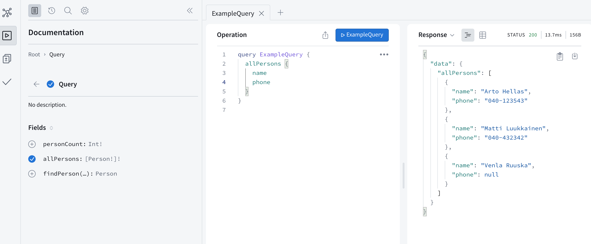
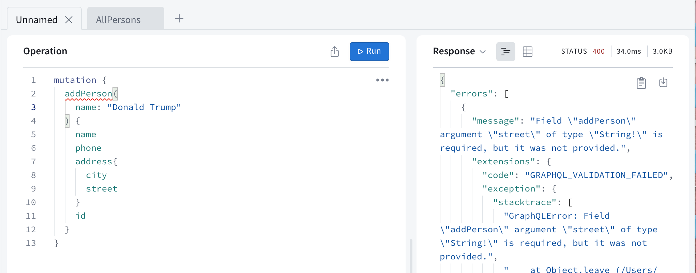
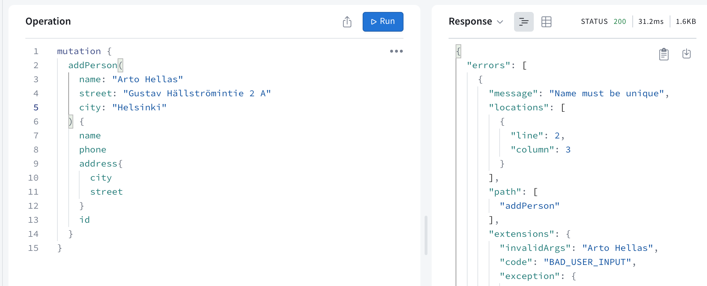

<div class="content">

<!-- REST, familiar to us from the previous parts of the course, has long been the most prevalent way to implement the interfaces servers offer for browsers, and in general the integration between different applications on the web.-->
 我们在课程的前几部分中熟悉的REST，长期以来一直是实现服务器为浏览器提供接口的最普遍的方式，一般来说，也是网络上不同应用之间的整合。

<!-- In recent years, [GraphQL](http://graphql.org/), developed by Facebook, has become popular for communication between web applications and servers.-->
近年来，由Facebook开发的[GraphQL](http://graphql.org/)在网络应用和服务器之间的通信中变得流行起来。

<!-- The GraphQL philosophy is very different from REST. REST is <i>resource-based</i>. Every resource, for example a <i>user</i>, has its own address which identifies it, for example <i>/users/10</i>. All operations done to the resource are done with HTTP requests to its URL. The action depends on the HTTP method used.-->
 GraphQL的理念与REST非常不同。REST是<i>基于资源的</i>。每个资源，例如一个<i>用户</i>，都有自己的地址来识别，例如<i>/users/10</i>。对资源进行的所有操作都是通过对其URL的HTTP请求完成的。该操作取决于所使用的HTTP方法。

<!-- The resource-basedness of REST works well in most situations. However, it can be a bit awkward sometimes.-->
 REST的基于资源的特性在大多数情况下都很好用。然而，它有时也会有点尴尬。

<!-- Let's consider the following example: our bloglist application contains some kind of social media functionality, and we would like to show a list of all the blogs that were added by users who have commented on any of the blogs we follow.-->
 让我们考虑下面的例子：我们的bloglist应用包含某种社会媒体功能，我们想显示一个由用户添加的所有博客的列表，这些用户在我们关注的任何博客上发表过评论。

<!-- If the server implemented a REST API, we would probably have to do multiple HTTP requests from the browser before we had all the data we wanted. The requests would also return a lot of unnecessary data, and the code on the browser would probably be quite complicated.-->
 如果服务器实现了REST API，我们可能需要从浏览器中进行多次HTTP请求，才能得到我们想要的所有数据。这些请求也会返回很多不必要的数据，而且浏览器上的代码可能会相当复杂。

<!-- If this was an often-used functionality, there could be a REST endpoint for it. If there were a lot of these kinds of scenarios however, it would become very laborious to implement REST endpoints for all of them.-->
 如果这是一个经常使用的功能，可以有一个REST端点来实现。然而，如果有很多这样的场景，为所有这些场景实现REST端点将变得非常费力。

<!-- A GraphQL server is well-suited for these kinds of situations.-->
GraphQL服务器非常适用于这类情况。

<!-- The main principle of GraphQL is that the code on the browser forms a <i>query</i> describing the data wanted, and sends it to the API with an HTTP POST request. Unlike REST, all GraphQL queries are sent to the same address, and their type is POST.-->
 GraphQL的主要原理是，浏览器上的代码形成一个描述所需数据的<i>查询</i>，并通过HTTP POST请求将其发送到API。与REST不同，所有GraphQL查询都被发送到同一个地址，其类型是POST。

<!-- The data described in the above scenario could be fetched with (roughly) the following query:-->
 上述场景中描述的数据可以通过（大致）以下查询来获取。

```bash
query FetchBlogsQuery {
  user(username: "mluukkai") {
    followedUsers {
      blogs {
        comments {
          user {
            blogs {
              title
            }
          }
        }
      }
    }
  }
}
```

<!-- The content of the `FetchBlogsQuery` can be roughly interpreted as: find a user named `"mluukkai"` and for each of his `followedUsers`, find all their `blogs`, and for each blog, all its `comments`, and for each `user` who wrote each comment, find their `blogs`, and return the `title` of each of them.-->
 "FetchBlogsQuery "的内容可以大致解释为：找到一个名为 "mluukkai "的用户，对于他的每个 "followedUsers"，找到他们所有的 "博客"，对于每个博客，所有的 "评论"，对于每个写评论的 "用户"，找到他们的 "博客"，并返回其中的 "title"。

<!-- The server's response would be about the following JSON object:-->
 服务器的响应将是关于以下JSON对象。

```bash
{
  "data": {
    "followedUsers": [
      {
        "blogs": [
          {
            "comments": [
              {
                "user": {
                  "blogs": [
                    {
                      "title": "Goto considered harmful"
                    },
                    {
                      "title": "End to End Testing with Cypress is most enjoyable"
                    },
                    {
                      "title": "Navigating your transition to GraphQL"
                    },
                    {
                      "title": "From REST to GraphQL"
                    }
                  ]
                }
              }
            ]
          }
        ]
      }
    ]
  }
}
```


<!-- The application logic stays simple, and the code on the browser gets exactly the data it needs with a single query.-->
 应用逻辑保持简单，而浏览器上的代码通过一次查询就能得到它所需要的数据。

### Schemas and queries

<!-- We will get to know the basics of GraphQL by implementing a GraphQL version of the phonebook application from parts 2 and 3.-->
 我们将通过实现第二和第三章节中的电话簿应用的GraphQL版本来了解GraphQL的基础知识。

<!-- In the heart of all GraphQL applications is a [schema](https://graphql.org/learn/schema/), which describes the data sent between the client and the server. The initial schema for our phonebook is as follows:-->
在所有GraphQL应用的核心是一个[模式](https://graphql.org/learn/schema/)，它描述了在客户端和服务器之间发送的数据。我们的电话簿的初始模式如下。

```js
type Person {
  name: String!
  phone: String
  street: String!
  city: String!
  id: ID!
}

type Query {
  personCount: Int!
  allPersons: [Person!]!
  findPerson(name: String!): Person
}
```

<!-- The schema describes two [types](https://graphql.org/learn/schema/#type-system). The first type, <i>Person</i>, determines that persons have five fields. Four of the fields are type  <i>String</i>, which is one of the [scalar types](https://graphql.org/learn/schema/#scalar-types) of GraphQL.-->
 该模式描述了两种[类型](https://graphql.org/learn/schema/#type-system)。第一个类型，<i>人</i>，决定了人有五个字段。其中四个字段是<i>String</i>类型，它是GraphQL的[标量类型](https://graphql.org/learn/schema/#scalar-types)之一。
<!-- All of the String fields, except <i>phone</i>, must be given a value. This is marked by the exclamation mark on the schema. The type of the field <i>id</i> is <i>ID</i>. <i>ID</i> fields are strings, but GraphQL ensures they are unique.-->
 除了<i>phone</i>，所有的String字段都必须被赋予一个值。这在模式上以感叹号标示。字段<i>id</i>的类型是<i>ID</i>。<i>ID</i>字段是字符串，但GraphQL确保它们是唯一的。

<!-- The second type is a [Query](https://graphql.org/learn/schema/#the-query-and-mutation-types). Practically every GraphQL schema describes a Query, which tells what kind of queries can be made to the API.-->
 第二种类型是 [查询](https://graphql.org/learn/schema/#the-query-and-mutation-types)。实际上每个GraphQL模式都描述了一个查询，它告诉人们可以对API进行什么样的查询。

<!-- The phonebook describes three different queries. _personCount_ returns an integer, _allPersons_ returns a list of <i>Person</i> objects and <i>findPerson</i> is given a string parameter and it returns a <i>Person</i> object.-->
 电话簿描述了三种不同的查询。_personCount_返回一个整数，_allPersons_返回一个<i>Person</i>对象的列表，<i>findPerson</i>给出一个字符串参数，它返回一个<i>Person</i>对象。

<!-- Again, exclamation marks are used to mark which return values and parameters are <i>Non-Null</i>. _personCount_ will, for sure, return an integer. The query _findPerson_ must be given a string as a parameter. The query returns a <i>Person</i>-object or <i>null</i>. _allPersons_ returns a list of <i>Person</i> objects, and the list does not contain any <i>null</i> values.-->
 同样，感叹号被用来标记哪些返回值和参数是<i>非空的</i>。_personCount_肯定会返回一个整数。查询_findPerson_必须给一个字符串作为参数。该查询返回一个<i>Person</i>-object或<i>null</i>。_allPersons_返回一个<i>Person</i>对象的列表，并且这个列表不包含任何<i>null</i>值。

<!-- So the schema describes what queries the client can send to the server, what kind of parameters the queries can have, and what kind of data the queries return.-->
 所以模式描述了客户端可以向服务器发送什么查询，查询可以有什么样的参数，以及查询返回什么样的数据。


<!-- The simplest of the queries, _personCount_, looks as follows:-->
最简单的查询，_personCount_，看起来如下。

```js
query {
  personCount
}
```

<!-- Assuming our application has saved the information of three people, the response would look like this:-->
 假设我们的应用保存了三个人的信息，响应会是这样的。

```js
{
  "data": {
    "personCount": 3
  }
}
```

<!-- The query fetching the information of all of the people, _allPersons_, is a bit more complicated. Because the query returns a list of <i>Person</i> objects, the query must describe-->
 获取所有的人的信息的查询，_allPersons_，有点复杂。因为该查询返回一个<i>Person</i>对象的列表，该查询必须说明
<i>which [fields](https://graphql.org/learn/queries/#fields)</i> of the objects the query returns:
```js
query {
  allPersons {
    name
    phone
  }
}
```

<!-- The response could look like this:-->
 响应可能如下所示：

```js
{
  "data": {
    "allPersons": [
      {
        "name": "Arto Hellas",
        "phone": "040-123543"
      },
      {
        "name": "Matti Luukkainen",
        "phone": "040-432342"
      },
      {
        "name": "Venla Ruuska",
        "phone": null
      }
    ]
  }
}
```

<!-- A query can be made to return any field described in the schema. For example, the following would also be possible:-->
 可以使查询返回模式中描述的任何字段。例如，下面的情况也是可以的。

```js
query {
  allPersons{
    name
    city
    street
  }
}
```

<!-- The last example shows a query which requires a parameter, and returns the details of one person.-->
 最后一个例子显示了一个需要一个参数的查询，并返回一个人的详细信息。

```js
query {
  findPerson(name: "Arto Hellas") {
    phone
    city
    street
    id
  }
}
```

<!-- So, first, the parameter is described in round brackets, and then the fields of the return value object are listed in curly brackets.-->
 所以，首先，参数用圆括号描述，然后返回值对象的字段用大括号列出。

<!-- The response is like this:-->
 响应是这样的。

```js
{
  "data": {
    "findPerson": {
      "phone": "040-123543",
      "city": "Espoo",
      "street": "Tapiolankatu 5 A"
      "id": "3d594650-3436-11e9-bc57-8b80ba54c431"
    }
  }
}
```

<!-- The return value was marked as nullable, so if we search for the details of an unknown-->
 返回值被标记为nullable，所以如果我们搜索一个未知的细节

```js
query {
  findPerson(name: "Joe Biden") {
    phone
  }
}
```

<!-- the return value is <i>null</i>.-->
返回值是<i>null</i>。

```js
{
  "data": {
    "findPerson": null
  }
}
```

<!-- As you can see, there is a direct link between a GraphQL query and  the returned JSON object. One can think that the query describes what kind of data it wants as a response.-->
 正如你所看到的，GraphQL查询和返回的JSON对象之间存在着直接的联系。我们可以认为，查询描述了它想要什么样的数据作为响应。
<!-- The difference to REST queries is stark. With REST, the URL and the type of the request have nothing to do with the form of the returned data.-->
 与REST查询的区别是明显的。在REST中，URL和请求的类型与返回数据的形式没有关系。

<!-- GraphQL query describes only the data moving between a server and the client. On the server, the data can be organized and saved any way we like.-->
 GraphQL查询只描述了在服务器和客户端之间移动的数据。在服务器上，数据可以以任何我们喜欢的方式组织和保存。

<!-- Despite its name, GraphQL does not actually have anything to do with databases. It does not care how the data is saved.-->
 尽管它的名字，GraphQL实际上与数据库没有任何关系。它并不关心数据是如何被保存的。
<!-- The data a GraphQL API uses can be saved into a relational database, document database, or to other servers which a GraphQL server can access with for example REST.-->
GraphQL API使用的数据可以被保存到关系数据库、文档数据库或其他服务器，GraphQL服务器可以通过REST等方式访问。

### Apollo Server

<!-- Let's implement a GraphQL server with today's leading library: [Apollo Server](https://www.apollographql.com/docs/apollo-server/).-->
 让我们用当今领先的库实现一个GraphQL服务器。[Apollo Server](https://www.apollographql.com/docs/apollo-server/)。

<!-- Create a new npm project with _npm init_ and install the required dependencies.-->
 用_npm init_创建一个新的npm项目，并安装所需的依赖项。

```bash
npm install apollo-server graphql
```

<!-- Also create a `index.js` file in your project's root directory.-->
同时在你的项目根目录下创建一个`index.js`文件。

<!-- The initial code is as follows:-->
初始代码如下。

```js
const { ApolloServer, gql } = require('apollo-server')

let persons = [
  {
    name: "Arto Hellas",
    phone: "040-123543",
    street: "Tapiolankatu 5 A",
    city: "Espoo",
    id: "3d594650-3436-11e9-bc57-8b80ba54c431"
  },
  {
    name: "Matti Luukkainen",
    phone: "040-432342",
    street: "Malminkaari 10 A",
    city: "Helsinki",
    id: '3d599470-3436-11e9-bc57-8b80ba54c431'
  },
  {
    name: "Venla Ruuska",
    street: "Nallemäentie 22 C",
    city: "Helsinki",
    id: '3d599471-3436-11e9-bc57-8b80ba54c431'
  },
]

const typeDefs = gql`
  type Person {
    name: String!
    phone: String
    street: String!
    city: String!
    id: ID!
  }

  type Query {
    personCount: Int!
    allPersons: [Person!]!
    findPerson(name: String!): Person
  }
`

const resolvers = {
  Query: {
    personCount: () => persons.length,
    allPersons: () => persons,
    findPerson: (root, args) =>
      persons.find(p => p.name === args.name)
  }
}

const server = new ApolloServer({
  typeDefs,
  resolvers,
})

server.listen().then(({ url }) => {
  console.log(`Server ready at ${url}`)
})
```

<!-- The heart of the code is an _ApolloServer_, which is given two parameters:-->
 代码的核心是一个_ApolloServer_，它被赋予两个参数。

```js
const server = new ApolloServer({
  typeDefs,
  resolvers,
})
```

<!-- The first parameter, _typeDefs_, contains the GraphQL schema.-->
 第一个参数，_typeDefs_，包含GraphQL模式。

<!-- The second parameter is an object, which contains the [resolvers](https://www.apollographql.com/docs/tutorial/resolvers/) of the server. These are the code, which defines <i>how</i> GraphQL queries are responded to.-->
 第二个参数是一个对象，它包含服务器的[解析器](https://www.apollographql.com/docs/tutorial/resolvers/)。这些是代码，它定义了<i>如何</i>回应GraphQL查询。

<!-- The code of the resolvers is the following:-->
解析器的代码如下。

```js
const resolvers = {
  Query: {
    personCount: () => persons.length,
    allPersons: () => persons,
    findPerson: (root, args) =>
      persons.find(p => p.name === args.name)
  }
}
```

<!-- As you can see, the resolvers correspond to the queries described in the schema.-->
 正如你所看到的，解析器对应于模式中描述的查询。

```js
type Query {
  personCount: Int!
  allPersons: [Person!]!
  findPerson(name: String!): Person
}
```

<!-- So there is a field under <i>Query</i> for every query described in the schema.-->
 所以在<i>Query</i>下有一个字段，用于描述模式中的每个查询。

<!-- The query-->
该查询

```js
query {
  personCount
}
```

<!-- Has the resolver-->
有解析器

```js
() => persons.length
```

<!-- So the response to the query is the length of the array _persons_.-->
 所以对查询的响应是数组_persons_的长度。

<!-- The query which fetches all persons-->
 取出所有人员的查询

```js
query {
  allPersons {
    name
  }
}
```

<!-- has a resolver which returns <i>all</i> objects from the _persons_ array.-->
有一个解析器，从_persons_数组中返回<i>所有</i>对象。

```js
() => persons
```

<!-- Start the server by running `node index.js` in the terminal.-->
通过在终端运行`node index.js`来启动服务器。

### Apollo Studio Explorer

<!-- When Apollo server is run in development mode the page [http://localhost:4000](http://localhost:4000) has a button <i>Query your server</i> that takes us to [Apollo Studio Explorer](https://www.apollographql.com/docs/studio/explorer/explorer/).  This is very useful for a developer, and can be used to make queries to the server.-->
当Apollo服务器在开发模式下运行时，页面[http://localhost:4000](http://localhost:4000)有一个按钮<i>查询你的服务器</i>，将我们带到[Apollo Studio Explorer](https://www.apollographql.com/docs/studio/explorer/explorer/)。  这对开发者来说非常有用，可以用来对服务器进行查询。

<!-- Let's try it out:-->
 让我们来试试吧。



<!-- At the left side Explorer shows the API-documentation that it has automatically generated based on the schema.-->
 在左边的资源管理器显示了它根据模式自动生成的API文档。

### Parameters of a resolver

<!-- The query fetching a single person-->
获取一个人的查询

```js
query {
  findPerson(name: "Arto Hellas") {
    phone
    city
    street
  }
}
```

<!-- has a resolver which differs from the previous ones because it is given <i>two parameters</i>:-->
有一个与之前不同的解析器，因为它被赋予了<i>两个参数</i>。

```js
(root, args) => persons.find(p => p.name === args.name)
```

<!-- The second parameter, _args_, contains the parameters of the query.-->
 第二个参数，_args_，包含查询的参数。
<!-- The resolver then returns from the array _persons_ the person whose name is the same as the value of <i>args.name</i>.-->
 然后解析器从数组_persons_中返回名字与<i>args.name</i>的值相同的人。
<!-- The resolver does not need the first parameter _root_.-->
 解析器不需要第一个参数_root_。


<!--  In fact, all resolver functions are given [four parameters](https://www.graphql-tools.com/docs/resolvers#resolver-function-signature). With JavaScript, the parameters don't have to be defined if they are not needed. We will be using the first and the third parameter of a resolver later in this part.-->
 事实上，所有的解析器函数都被赋予了[四个参数](https://www.graphql-tools.com/docs/resolvers#resolver-function-signature)。在JavaScript中，如果不需要这些参数，就不需要定义它们。我们将在本章节的后面使用解析器的第一个和第三个参数。

### The default resolver


<!-- When we do a query, for example-->
 当我们做一个查询时，比如说

```js
query {
  findPerson(name: "Arto Hellas") {
    phone
    city
    street
  }
}
```

<!-- the server knows to send back exactly the fields required by the query. How does that happen?-->
 服务器知道要准确地送回查询所需的字段。那是怎么发生的呢？

<!-- A GraphQL server must define resolvers for <i>each</i> field of each  type in the schema.-->
 GraphQL服务器必须为模式中每种类型的<i>每个</i>字段定义解析器。
<!-- We have so far only defined resolvers for fields of the type <i>Query</i>, so for each query of the application.-->
 到目前为止，我们只为<i>Query</i>类型的字段定义了解析器，所以是为应用的每个查询定义的。

<!-- Because we did not define resolvers for the fields of the type <i>Person</i>, Apollo has defined [default resolvers](https://www.graphql-tools.com/docs/resolvers/#default-resolver) for them.-->
 因为我们没有为<i>Person</i>类型的字段定义解析器，Apollo已经为它们定义了[默认解析器](https://www.graphql-tools.com/docs/resolvers/#default-resolver)。
<!-- They work like the one shown below:-->
它们的工作方式如下所示。


```js
const resolvers = {
  Query: {
    personCount: () => persons.length,
    allPersons: () => persons,
    findPerson: (root, args) => persons.find(p => p.name === args.name)
  },
  // highlight-start
  Person: {
    name: (root) => root.name,
    phone: (root) => root.phone,
    street: (root) => root.street,
    city: (root) => root.city,
    id: (root) => root.id
  }
  // highlight-end
}
```


<!-- The default resolver returns the value of the corresponding field of the object. The object itself can be accessed through the first parameter of the resolver, _root_.-->
 默认解析器返回对象的相应字段的值。对象本身可以通过解析器的第一个参数_root_访问。


<!-- If the functionality of the default resolver is enough, you don't need to define your own. It is also possible to define resolvers for only some fields of a type, and let the default resolvers handle the rest.-->
 如果默认解析器的功能足够了，你就不需要定义你自己的解析器。也可以只为一个类型的某些字段定义解析器，并让默认解析器处理其余的字段。


<!-- We could for example define that the address of all persons is-->
 例如，我们可以定义所有人员的地址是
<i>Manhattan New York</i> by hard-coding the following to the resolvers of the street and city fields of the type <i>Person</i>:

```js
Person: {
  street: (root) => "Manhattan",
  city: (root) => "New York"
}
```

### Object within an object


<!-- Let's modify the schema a bit-->
 让我们稍微修改一下模式

```js
  // highlight-start
type Address {
  street: String!
  city: String!
}
  // highlight-end

type Person {
  name: String!
  phone: String
  address: Address!   // highlight-line
  id: ID!
}

type Query {
  personCount: Int!
  allPersons: [Person!]!
  findPerson(name: String!): Person
}
```


<!-- so a person now has a field with the type <i>Address</i>, which contains the street and the city.-->
所以一个人现在有一个类型为<i>Address</i>的字段，其中包含街道和城市。


<!-- The queries requiring the address change into-->
需要地址的查询变成了

```js
query {
  findPerson(name: "Arto Hellas") {
    phone
    address {
      city
      street
    }
  }
}
```


<!-- and the response is now a person object, which <i>contains</i> an address object.-->
 响应现在是一个人的对象，它<i>包含</i>一个地址对象。

```js
{
  "data": {
    "findPerson": {
      "phone": "040-123543",
      "address":  {
        "city": "Espoo",
        "street": "Tapiolankatu 5 A"
      }
    }
  }
}
```


<!-- We still save the persons in the server the same way we did before.-->
我们仍然以之前的方式在服务器中保存人员。

```js
let persons = [
  {
    name: "Arto Hellas",
    phone: "040-123543",
    street: "Tapiolankatu 5 A",
    city: "Espoo",
    id: "3d594650-3436-11e9-bc57-8b80ba54c431"
  },
  // ...
]
```


<!-- The person-objects saved in the server are not exactly the same as the GraphQL type <i>Person</i> objects described in the schema.-->
保存在服务器中的人物对象与模式中描述的GraphQL类型<i>Person</i>对象不完全相同。


<!-- Contrary to the <i>Person</i> type, the <i>Address</i> type does not have an <i>id</i> field, because they are not saved into their own separate data structure in the server.-->
 与<i>Person</i>类型相反，<i>Address</i>类型没有一个<i>id</i>字段，因为它们没有被保存到服务器中自己的独立数据结构中。


<!-- Because the objects saved in the array do not have an <i>address</i> field, the default resolver is not sufficient.-->
因为保存在数组中的对象没有一个<i>address</i>字段，所以默认的解析器是不够的。
<!-- Let's add a resolver for the <i>address</i> field  of <i>Person</i> type :-->
 我们为<i>Person</i>类型的<i>address</i>字段添加一个解析器。

```js
const resolvers = {
  Query: {
    personCount: () => persons.length,
    allPersons: () => persons,
    findPerson: (root, args) =>
      persons.find(p => p.name === args.name)
  },
  // highlight-start
  Person: {
    address: (root) => {
      return {
        street: root.street,
        city: root.city
      }
    }
  }
  // highlight-end
}
```

<!-- So every time a <i>Person</i> object is returned, the fields <i>name</i>, <i>phone</i> and <i>id</i> are returned using their default resolvers, but the field <i>address</i> is formed by using a self-defined resolver. The parameter _root_ of the resolver function is the person-object, so the street and the city of the address can be taken from its fields.-->
 所以每次返回 <i>Person</i> 对象时，字段 <i>name</i>、<i>phone</i> 和 <i>id</i> 会使用它们的默认解析器返回，但是字段 <i>address</i> 是通过使用自定义的解析器形成的。解析器函数的参数_root_是person-object，所以地址的街道和城市可以从其字段中获取。

<!-- The current code of the application can be found on [ Github](https://github.com/fullstack-hy2020/graphql-phonebook-backend/tree/part8-1), branch <i>part8-1</i>.-->
 该应用的当前代码可以在[ Github](https://github.com/fullstack-hy2020/graphql-phonebook-backend/tree/part8-1)找到，分支<i>part8-1</i>。

### Mutations

<!-- Let's add a functionality for adding new persons to the phonebook. In GraphQL, all operations which cause a change are done with [mutations](https://graphql.org/learn/queries/#mutations). Mutations are described in the schema as the keys of type <i>Mutation</i>.-->
 让我们增加一个向电话簿添加新成员的功能。在GraphQL中，所有引起变化的操作都是通过[mutations](https://graphql.org/learn/queries/#mutations)完成的。改变在模式中被描述为<i>Mutation</i>类型的键。

<!-- The schema for a mutation for adding a new person looks as follows:-->
 增加一个新人的改变的模式如下。

```js
type Mutation {
  addPerson(
    name: String!
    phone: String
    street: String!
    city: String!
  ): Person
}
```


<!-- The Mutation is given the details of the person as parameters. The parameter <i>phone</i> is the only one which is nullable. The Mutation also has a return value. The return value is type <i>Person</i>, the idea being that the details of the added person are returned if the operation is successful and if not, null. Value for the field <i>id</i> is not given as a parameter. Generating an id is better left for the server.-->
改变被赋予人的细节作为参数。参数<i>phone</i>是唯一一个可以归零的参数。改变也有一个返回值。返回值的类型是<i>Person</i>，意思是如果操作成功，将返回被添加的人的详细信息，如果不成功，则返回空。字段<i>id</i>的值不作为一个参数给出。生成一个id最好留给服务器。


<!-- Mutations also require a resolver:-->
 改变也需要一个解析器。

```js
const { v1: uuid } = require('uuid')

// ...

const resolvers = {
  // ...
  Mutation: {
    addPerson: (root, args) => {
      const person = { ...args, id: uuid() }
      persons = persons.concat(person)
      return person
    }
  }
}
```


<!-- The mutation adds the object given to it as a parameter _args_ to the array _persons_, and returns the object it added to the array.-->
 改变将作为参数_args_的对象添加到数组_persons_，并返回它添加到数组中的对象。


<!-- The <i>id</i> field is given a unique value using the [uuid](https://github.com/kelektiv/node-uuid#readme) library.-->
 <i>id</i>字段使用[uuid](https://github.com/kelektiv/node-uuid#readme)库被赋予一个唯一值。


<!-- A new person can be added with the following mutation-->
 一个新的人可以用以下的改变来添加

```js
mutation {
  addPerson(
    name: "Pekka Mikkola"
    phone: "045-2374321"
    street: "Vilppulantie 25"
    city: "Helsinki"
  ) {
    name
    phone
    address{
      city
      street
    }
    id
  }
}
```


<!-- Note that the person is saved to the _persons_ array as-->
 注意这个人被保存到_persons_数组中为

```js
{
  name: "Pekka Mikkola",
  phone: "045-2374321",
  street: "Vilppulantie 25",
  city: "Helsinki",
  id: "2b24e0b0-343c-11e9-8c2a-cb57c2bf804f"
}
```


<!-- But the response to the mutation is-->
但是对这个改变的响应是

```js
{
  "data": {
    "addPerson": {
      "name": "Pekka Mikkola",
      "phone": "045-2374321",
      "address": {
        "city": "Helsinki",
        "street": "Vilppulantie 25"
      },
      "id": "2b24e0b0-343c-11e9-8c2a-cb57c2bf804f"
    }
  }
}
```

<!-- So the resolver of the <i>address</i> field of the <i>Person</i> type formats the response object to the right form.-->
 所以<i>Person</i>类型的<i>address</i>字段的解析器将响应对象格式化为正确的形式。
### Error handling

<!-- If we try to create a new person, but the parameters do not correspond with the schema description, the server gives an error message:-->
 如果我们试图创建一个新的人，但参数与模式描述不一致，服务器会给出一个错误信息。



<!-- So some of the error handling can be automatically done with GraphQL [validation](https://graphql.org/learn/validation/).-->
 所以一些错误处理可以通过GraphQL[验证](https://graphql.org/learn/validation/)自动完成。

<!-- However, GraphQL cannot handle everything automatically. For example, stricter rules for data sent to a Mutation have to be added manually.-->
 然而，GraphQL不能自动处理所有的事情。例如，发送至改变的数据的更严格的规则必须手动添加。
<!-- The errors from those rules are handled by [the error handling mechanism of Apollo Server](https://www.apollographql.com/docs/apollo-server/data/errors).-->
这些规则的错误由[Apollo服务器的错误处理机制](https://www.apollographql.com/docs/apollo-server/data/errors)来处理。


<!-- Let's block adding the same name to the phonebook multiple times:-->
让我们阻止多次添加相同的名字到电话簿中。

```js
const { ApolloServer, UserInputError, gql } = require('apollo-server') // highlight-line

// ...

const resolvers = {
  // ..
  Mutation: {
    addPerson: (root, args) => {
      // highlight-start
      if (persons.find(p => p.name === args.name)) {
        throw new UserInputError('Name must be unique', {
          invalidArgs: args.name,
        })
      }
      // highlight-end

      const person = { ...args, id: uuid() }
      persons = persons.concat(person)
      return person
    }
  }
}
```


<!-- So if the name to be added already exists in the phonebook, throw _UserInputError_ error.-->
所以如果要添加的名字已经存在于电话簿中，抛出_UserInputError_错误。



<!-- The current code of the application can be found on [GitHub](https://github.com/fullstack-hy2020/graphql-phonebook-backend/tree/part8-2), branch <i>part8-2</i>.-->
 该应用的当前代码可以在[GitHub](https://github.com/fullstack-hy2020/graphql-phonebook-backend/tree/part8-2)上找到，分支<i>part8-2</i>。

### Enum

<!-- Let's add a possibility to filter the query returning all persons with the parameter <i>phone</i> so that it returns only persons with a phone number-->
 让我们增加一种可能性，用参数<i>phone</i>过滤返回所有人员的查询，这样它就只返回有电话号码的人员

```js
query {
  allPersons(phone: YES) {
    name
    phone
  }
}
```

<!-- or persons without a phone number-->
 或没有电话号码的人

```js
query {
  allPersons(phone: NO) {
    name
  }
}
```

<!-- The schema changes like so:-->
 架构的变化是这样的。

```js
// highlight-start
enum YesNo {
  YES
  NO
}
// highlight-end

type Query {
  personCount: Int!
  allPersons(phone: YesNo): [Person!]! // highlight-line
  findPerson(name: String!): Person
}
```

<!-- The type <i>YesNo</i> is a GraphQL [enum](https://graphql.org/learn/schema/#enumeration-types), or an enumerable, with two possible values: <i>YES</i> or <i>NO</i>. In the query _allPersons_, the parameter _phone_  has the type <i>YesNo</i>, but is nullable.-->
 类型<i>YesNo</i>是一个GraphQL [enum](https://graphql.org/learn/schema/#enumeration-types)，或一个可列举的，有两个可能的值。<i>YES</i>或<i>NO</i>。在查询_allPersons_中，参数_phone_的类型是<i>YesNo</i>，但可以为空。

<!-- The resolver changes like so:-->
 解析器的变化是这样的。

```js
Query: {
  personCount: () => persons.length,
  // highlight-start
  allPersons: (root, args) => {
    if (!args.phone) {
      return persons
    }

    const byPhone = (person) =>
      args.phone === 'YES' ? person.phone : !person.phone

    return persons.filter(byPhone)
  },
  // highlight-end
  findPerson: (root, args) =>
    persons.find(p => p.name === args.name)
},
```

### Changing a phone number

<!-- Let's add a mutation for changing the phone number of a person. The schema of this mutation looks as follows:-->
 让我们添加一个用于改变一个人的电话号码的改变。这个改变的模式看起来如下。

```js
type Mutation {
  addPerson(
    name: String!
    phone: String
    street: String!
    city: String!
  ): Person
  // highlight-start
  editNumber(
    name: String!
    phone: String!
  ): Person
  // highlight-end
}
```

<!-- and is done by a resolver:-->
 并由一个解析器完成。

```js
Mutation: {
  // ...
  editNumber: (root, args) => {
    const person = persons.find(p => p.name === args.name)
    if (!person) {
      return null
    }

    const updatedPerson = { ...person, phone: args.phone }
    persons = persons.map(p => p.name === args.name ? updatedPerson : p)
    return updatedPerson
  }
}
```

<!-- The mutation finds the person to be updated by the field <i>name</i>.-->
 该改变通过字段<i>name</i>找到要更新的人。

<!-- The current code of the application can be found on [Github](https://github.com/fullstack-hy2020/graphql-phonebook-backend/tree/part8-3), branch <i>part8-3</i>.-->
 该应用的当前代码可以在[Github](https://github.com/fullstack-hy2020/graphql-phonebook-backend/tree/part8-3)上找到，分支<i>part8-3</i>。

### More on queries

<!-- With GraphQL, it is possible to combine multiple fields of type <i>Query</i>, or "separate queries" into one query. For example, the following query returns both the amount of persons in the phonebook and their names:-->
 通过GraphQL，可以将多个<i>Query</i>类型的字段，或 "单独的查询 "结合到一个查询中。例如，下面的查询同时返回电话簿中的人员数量和他们的名字。

```js
query {
  personCount
  allPersons {
    name
  }
}
```

<!-- The response looks as follows:-->
 响应看起来如下。

```js
{
  "data": {
    "personCount": 3,
    "allPersons": [
      {
        "name": "Arto Hellas"
      },
      {
        "name": "Matti Luukkainen"
      },
      {
        "name": "Venla Ruuska"
      }
    ]
  }
}
```

<!-- Combined query can also use the same query multiple times. You must however give the queries alternative names like so:-->
 组合查询也可以多次使用同一查询。但是，你必须给这些查询取一个替代的名字，比如说。

```js
query {
  havePhone: allPersons(phone: YES){
    name
  }
  phoneless: allPersons(phone: NO){
    name
  }
}
```

<!-- The response looks like:-->
 响应如下所示：。

```js
{
  "data": {
    "havePhone": [
      {
        "name": "Arto Hellas"
      },
      {
        "name": "Matti Luukkainen"
      }
    ],
    "phoneless": [
      {
        "name": "Venla Ruuska"
      }
    ]
  }
}
```

<!-- In some cases, it might be beneficial to name the queries. This is the case especially when the queries or mutations have [parameters](https://graphql.org/learn/queries/#variables). We will get into parameters soon.-->
 在某些情况下，给查询命名可能是有益的。特别是当查询或改变有[参数](https://graphql.org/learn/queries/#variables)时，就是这种情况。我们很快就会接触到参数。

</div>

<div class="tasks">

### Exercises 8.1.-8.7.


<!-- Through the exercises, we will implement a GraphQL backend for a small library.-->
 通过练习，我们将为一个小型图书馆实现一个GraphQL后端。
<!-- Start with [this file](https://github.com/fullstack-hy2020/misc/blob/master/library-backend.js). Remember to _npm init_ and to install dependencies!-->
从[这个文件](https://github.com/fullstack-hy2020/misc/blob/master/library-backend.js)开始。记住_npm init_和安装依赖性!

<!-- Note that the code does not initially work since the schema definition is not complete.-->
 注意，由于模式定义不完整，代码最初并不工作。

#### 8.1: The number of books and authors


<!-- Implement queries _bookCount_ and _authorCount_ which return the number of books and the number of authors.-->
 实现查询_bookCount_和_authorCount_，返回书籍的数量和作者的数量。

<!-- The query-->
 该查询

```js
query {
  bookCount
  authorCount
}
```


<!-- should return-->
应该返回

```js
{
  "data": {
    "bookCount": 7,
    "authorCount": 5
  }
}
```

#### 8.2: All books


<!-- Implement query _allBooks_, which returns the details of all books.-->
 实现查询_allBooks_，返回所有书籍的详细信息。


<!-- In the end, the user should be able to do the following query:-->
 最后，用户应该能够进行以下查询。

```js
query {
  allBooks {
    title
    author
    published
    genres
  }
}
```

#### 8.3: All authors


<!-- Implement query _allAuthors_, which returns the details of all authors. The response should include a field _bookCount_ containing the number of books the author has written.-->
 实现查询_allAuthors_，返回所有作者的详细信息。响应应该包括一个字段_bookCount_，包含作者写过的书的数量。


<!-- For example the query-->
 例如，该查询

```js
query {
  allAuthors {
    name
    bookCount
  }
}
```


<!-- should return-->
应该返回

```js
{
  "data": {
    "allAuthors": [
      {
        "name": "Robert Martin",
        "bookCount": 2
      },
      {
        "name": "Martin Fowler",
        "bookCount": 1
      },
      {
        "name": "Fyodor Dostoevsky",
        "bookCount": 2
      },
      {
        "name": "Joshua Kerievsky",
        "bookCount": 1
      },
      {
        "name": "Sandi Metz",
        "bookCount": 1
      }
    ]
  }
}
```

#### 8.4: Books of an author


<!-- Modify the _allBooks_ query so that a user can give an optional parameter <i>author</i>. The response should include only books written by that author.-->
 修改_allBooks_查询，使用户可以给出一个可选的参数<i>作者</i>。响应应该只包括由该作者写的书。

<!-- For example query-->
 例如，查询

```js
query {
  allBooks(author: "Robert Martin") {
    title
  }
}
```


<!-- should return-->
应该返回

```js
{
  "data": {
    "allBooks": [
      {
        "title": "Clean Code"
      },
      {
        "title": "Agile software development"
      }
    ]
  }
}
```

#### 8.5: Books by genre

<!-- Modify the query _allBooks_ so that a user can give an optional parameter <i>genre</i>. The response should include only books of that genre.-->
 修改查询_allBooks_，使用户可以给出一个可选参数<i>genre</i>。响应应该只包括该流派的书籍。


<!-- For example query-->
 例如，查询

```js
query {
  allBooks(genre: "refactoring") {
    title
    author
  }
}
```

<!-- should return-->
应该返回

```js
{
  "data": {
    "allBooks": [
      {
        "title": "Clean Code",
        "author": "Robert Martin"
      },
      {
        "title": "Refactoring, edition 2",
        "author": "Martin Fowler"
      },
      {
        "title": "Refactoring to patterns",
        "author": "Joshua Kerievsky"
      },
      {
        "title": "Practical Object-Oriented Design, An Agile Primer Using Ruby",
        "author": "Sandi Metz"
      }
    ]
  }
}
```


<!-- The query must work when both optional parameters are given:-->
当两个可选参数都给出时，查询必须有效。

```js
query {
  allBooks(author: "Robert Martin", genre: "refactoring") {
    title
    author
  }
}
```

#### 8.6: Adding a book


<!-- Implement mutation _addBook_, which can be used like this:-->
 实施改变_addBook_，它可以这样使用。

```js
mutation {
  addBook(
    title: "NoSQL Distilled",
    author: "Martin Fowler",
    published: 2012,
    genres: ["database", "nosql"]
  ) {
    title,
    author
  }
}
```


<!-- The mutation works even if the author is not already saved to the server:-->
即使作者还没有被保存到服务器上，该改变也能发挥作用。

```js
mutation {
  addBook(
    title: "Pimeyden tango",
    author: "Reijo Mäki",
    published: 1997,
    genres: ["crime"]
  ) {
    title,
    author
  }
}
```


<!-- If the author is not yet saved to the server, a new author is added to the system. The birth years of authors are not saved to the server yet, so the query-->
 如果作者还没有被保存到服务器，一个新的作者将被添加到系统中。作者的出生年月还没有保存到服务器，所以查询时

```js
query {
  allAuthors {
    name
    born
    bookCount
  }
}
```


<!-- returns-->
返回

```js
{
  "data": {
    "allAuthors": [
      // ...
      {
        "name": "Reijo Mäki",
        "born": null,
        "bookCount": 1
      }
    ]
  }
}
```

#### 8.7: Updating the birth year of an author


<!-- Implement mutation _editAuthor_, which can be used to set a birth year for an author. The mutation is used like so:-->
 实现改变_editAuthor_，可用于设置作者的出生年份。这个改变是这样使用的。

```js
mutation {
  editAuthor(name: "Reijo Mäki", setBornTo: 1958) {
    name
    born
  }
}
```


<!-- If the correct author is found, the operation returns the edited author:-->
 如果找到了正确的作者，该操作会返回编辑过的作者。

```js
{
  "data": {
    "editAuthor": {
      "name": "Reijo Mäki",
      "born": 1958
    }
  }
}
```


<!-- If the author is not in the system, <i>null</i> is returned:-->
 如果作者不在系统中，则返回<i>null</i>。

```js
{
  "data": {
    "editAuthor": null
  }
}
```

</div>


