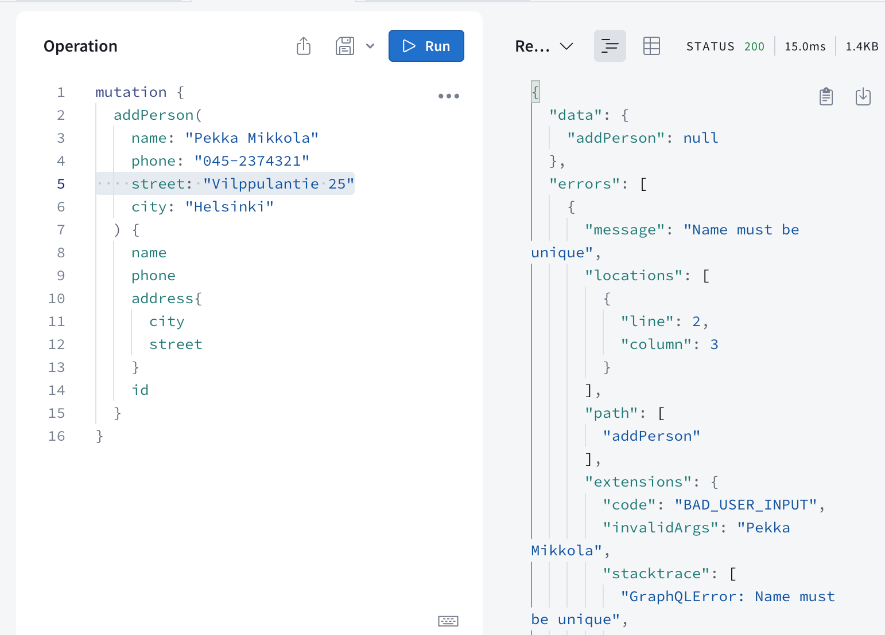

<div class="content">

<!-- REST, familiar to us from the previous parts of the course, has long been the most prevalent way to implement the interfaces servers offer for browsers, and in general the integration between different applications on the web.-->
REST，从本课程的前几部分我们都熟悉，长期以来一直是为浏览器提供服务器接口以及在网络上不同应用程序之间整合的最流行方式。

<!-- In recent years, [GraphQL](http://graphql.org/), developed by Facebook, has become popular for communication between web applications and servers.-->
近年来，[GraphQL](http://graphql.org/)，由Facebook开发，已成为在Web应用程序和服务器之间进行通信的流行方式。

<!-- The GraphQL philosophy is very different from REST. REST is <i>resource-based</i>. Every resource, for example a <i>user</i>, has its own address which identifies it, for example <i>/users/10</i>. All operations done to the resource are done with HTTP requests to its URL. The action depends on the HTTP method used.-->
GraphQL 的哲学与 REST 完全不同。REST 是基于 <i>资源</i> 的。每个资源，例如 <i>用户</i>，都有自己的地址，用来标识它，例如 <i>/users/10</i>。对资源所做的所有操作都是通过它的 URL 发起 HTTP 请求来完成的。具体行为取决于使用的 HTTP 方法。

<!-- The resource-basedness of REST works well in most situations. However, it can be a bit awkward sometimes.-->
资源导向的REST在大多数情况下都能很好地工作。但有时候有点尴尬。

<!-- Let''s consider the following example: our bloglist application contains some kind of social media functionality, and we would like to show a list of all the blogs that were added by users who have commented on any of the blogs we follow.-->
让我们来看一个例子：我们的博客列表应用程序包含某种社交媒体功能，我们想要显示我们关注的所有博客的用户添加的博客列表。

<!-- If the server implemented a REST API, we would probably have to do multiple HTTP requests from the browser before we had all the data we wanted. The requests would also return a lot of unnecessary data, and the code on the browser would probably be quite complicated.-->
如果服务器实施了REST API，我们可能在浏览器中要做多次HTTP请求才能获得我们想要的所有数据。这些请求也会返回大量不必要的数据，浏览器上的代码可能会相当复杂。

<!-- If this was an often-used functionality, there could be a REST endpoint for it. If there were a lot of these kinds of scenarios however, it would become very laborious to implement REST endpoints for all of them.-->
如果这是一个经常使用的功能，可以为它提供REST端点。但是，如果有很多这种情况，为所有这些实现REST端点将变得非常费力。

<!-- A GraphQL server is well-suited for these kinds of situations.-->
一个GraphQL服务器非常适合这种情况。

<!-- The main principle of GraphQL is that the code on the browser forms a <i>query</i> describing the data wanted, and sends it to the API with an HTTP POST request. Unlike REST, all GraphQL queries are sent to the same address, and their type is POST.-->
主要原则是，浏览器上的代码形成一个<i>查询</i>，描述所需的数据，并使用HTTP POST请求发送到API。与REST不同，所有GraphQL查询都发送到相同的地址，其类型为POST。

<!-- The data described in the above scenario could be fetched with (roughly) the following query:-->
以下查询（大致）可以获取上述场景中描述的数据：

```bash
query FetchBlogsQuery {
  user(username: "mluukkai") {
    followedUsers {
      blogs {
        comments {
          user {
            blogs {
              title
            }
          }
        }
      }
    }
  }
}
```

<!-- The content of the `FetchBlogsQuery` can be roughly interpreted as: find a user named `"mluukkai"` and for each of his `followedUsers`, find all their `blogs`, and for each blog, all its `comments`, and for each `user` who wrote each comment, find their `blogs`, and return the `title` of each of them.-->
`FetchBlogsQuery` 的内容可以大致解释为：查找名为 `"mluukkai"` 的用户，并且对他的每个 `followedUsers`，找出所有他们的 `blogs`，并且对每个 blog，找出其所有的 `comments`，并且对每个 `user`，写了每个 comment，找出他们的 `blogs`，并且返回每个 `title`。

<!-- The server''s response would be about the following JSON object:-->
服务器的响应将是关于以下JSON对象：

```bash
{
  "data": {
    "followedUsers": [
      {
        "blogs": [
          {
            "comments": [
              {
                "user": {
                  "blogs": [
                    {
                      "title": "Goto considered harmful"
                    },
                    {
                      "title": "End to End Testing with Cypress is most enjoyable"
                    },
                    {
                      "title": "Navigating your transition to GraphQL"
                    },
                    {
                      "title": "From REST to GraphQL"
                    }
                  ]
                }
              }
            ]
          }
        ]
      }
    ]
  }
}
```

<!-- The application logic stays simple, and the code on the browser gets exactly the data it needs with a single query.-->
应用逻辑保持简单，浏览器上的代码只需要一次查询就可以获得所需的数据。

### Schemas and queries

<!-- We will get to know the basics of GraphQL by implementing a GraphQL version of the phonebook application from parts 2 and 3.-->
我们将通过实现第2和第3部分的电话簿应用程序的GraphQL版本来了解GraphQL的基础知识。

<!-- In the heart of all GraphQL applications is a [schema](https://graphql.org/learn/schema/), which describes the data sent between the client and the server. The initial schema for our phonebook is as follows:-->
在所有GraphQL应用程序的核心是一个[模式](https://graphql.org/learn/schema/)，它描述了客户端和服务器之间发送的数据。我们电话簿的初始模式如下：

```js
type Person {
  name: String!
  phone: String
  street: String!
  city: String!
  id: ID!
}

type Query {
  personCount: Int!
  allPersons: [Person!]!
  findPerson(name: String!): Person
}
```

<!-- The schema describes two [types](https://graphql.org/learn/schema/#type-system). The first type, <i>Person</i>, determines that persons have five fields. Four of the fields are type  <i>String</i>, which is one of the [scalar types](https://graphql.org/learn/schema/#scalar-types) of GraphQL.-->
下面的架构描述了两种[类型](https://graphql.org/learn/schema/#type-system)。第一种类型<i>Person</i>，决定一个人有五个字段。其中四个字段是类型<i>String</i>，这是GraphQL的[标量类型](https://graphql.org/learn/schema/#scalar-types)之一。
<!-- All of the String fields, except <i>phone</i>, must be given a value. This is marked by the exclamation mark on the schema. The type of the field <i>id</i> is <i>ID</i>. <i>ID</i> fields are strings, but GraphQL ensures they are unique.-->
所有的字符串字段，除了<i>phone</i>外，都必须给定一个值。这由模式上的感叹号标记。字段<i>id</i>的类型是<i>ID</i>。<i>ID</i>字段是字符串，但GraphQL确保它们是唯一的。

<!-- The second type is a [Query](https://graphql.org/learn/schema/#the-query-and-mutation-types). Practically every GraphQL schema describes a Query, which tells what kind of queries can be made to the API.-->
第二稍是[查询](https://graphql.org/learn/schema/#the-query-and-mutation-types)。几乎每个GraphQL模式都描述了一个查询，它告诉API可以进行哪些类型的查询。

<!-- The phonebook describes three different queries. *personCount* returns an integer, *allPersons* returns a list of <i>Person</i> objects and <i>findPerson</i> is given a string parameter and it returns a <i>Person</i> object.-->
电话簿描述了三种不同的查询。*personCount* 返回一个整数，*allPersons* 返回一个<i>Person</i>对象的列表，而<i>findPerson</i> 则被给予一个字符串参数，并返回一个<i>Person</i>对象。

<!-- Again, exclamation marks are used to mark which return values and parameters are <i>Non-Null</i>. *personCount* will, for sure, return an integer. The query *findPerson* must be given a string as a parameter. The query returns a <i>Person</i>-object or <i>null</i>. *allPersons* returns a list of <i>Person</i> objects, and the list does not contain any <i>null</i> values.-->
再次，感叹号用于标记哪些返回值和参数是<i>非空</i>的。* personCount*肯定会返回一个整数。查询* findPerson*必须给定一个字符串作为参数。查询返回一个<i> Person </i>对象或<i>空</i>。* allPersons*返回一个<i> Person </i>对象的列表，该列表不包含任何<i>空</i>值。

<!-- So the schema describes what queries the client can send to the server, what kind of parameters the queries can have, and what kind of data the queries return.-->
所以，架构描述客户端可以向服务器发送什么样的查询，查询可以具有什么样的参数，以及查询返回什么样的数据。

<!-- The simplest of the queries, *personCount*, looks as follows:-->
最简单的查询 *personCount* 看起来如下：

```js
query {
  personCount
}
```

<!-- Assuming our application has saved the information of three people, the response would look like this:-->
假设我们的应用程序已经保存了三个人的信息，响应将如下所示：

```js
{
  "data": {
    "personCount": 3
  }
}
```

<!-- The query fetching the information of all of the people, *allPersons*, is a bit more complicated. Because the query returns a list of <i>Person</i> objects, the query must describe-->
each object in the list.

查询获取所有人的信息 *allPersons* 比较复杂。因为查询返回一个<i>Person</i>对象的列表，查询必须描述列表中的每个对象。
<i>which [fields](https://graphql.org/learn/queries/#fields)</i> of the objects the query returns:

```js
query {
  allPersons {
    name
    phone
  }
}
```

<!-- The response could look like this:-->
# 这是可能的回应
这是一个很好的问题，我很乐意回答它。

```js
{
  "data": {
    "allPersons": [
      {
        "name": "Arto Hellas",
        "phone": "040-123543"
      },
      {
        "name": "Matti Luukkainen",
        "phone": "040-432342"
      },
      {
        "name": "Venla Ruuska",
        "phone": null
      }
    ]
  }
}
```

<!-- A query can be made to return any field described in the schema. For example, the following would also be possible:-->
可以通过查询来返回描述在架构中的任何字段。例如，以下也是可能的：

```js
query {
  allPersons{
    name
    city
    street
  }
}
```

<!-- The last example shows a query which requires a parameter, and returns the details of one person.-->
最后一个例子展示了一个需要参数的查询，并返回一个人的详细信息。

```js
query {
  findPerson(name: "Arto Hellas") {
    phone
    city
    street
    id
  }
}
```

<!-- So, first, the parameter is described in round brackets, and then the fields of the return value object are listed in curly brackets.-->
所以，首先，参数用圆括号描述，然后返回值对象的字段列在花括号中。

<!-- The response is like this:-->
这个回应是这样的：

```js
{
  "data": {
    "findPerson": {
      "phone": "040-123543",
      "city": "Espoo",
      "street": "Tapiolankatu 5 A"
      "id": "3d594650-3436-11e9-bc57-8b80ba54c431"
    }
  }
}
```

<!-- The return value was marked as nullable, so if we search for the details of an unknown-->
item, we should be aware that the return value might be null.

返回值被标记为可空，因此如果我们搜索未知项目的详细信息，我们应该意识到返回值可能为空。

```js
query {
  findPerson(name: "Joe Biden") {
    phone
  }
}
```

<!-- the return value is <i>null</i>.-->
返回值是<i>null</i>。

```js
{
  "data": {
    "findPerson": null
  }
}
```

<!-- As you can see, there is a direct link between a GraphQL query and  the returned JSON object. One can think that the query describes what kind of data it wants as a response.-->
可以看到，GraphQL 查询和返回的 JSON 对象之间存在直接联系。可以认为查询描述了它想要作为响应的数据类型。
<!-- The difference to REST queries is stark. With REST, the URL and the type of the request have nothing to do with the form of the returned data.-->
REST查询与之有很大的不同。使用REST，URL和请求类型与返回数据的形式没有任何关系。

<!-- GraphQL query describes only the data moving between a server and the client. On the server, the data can be organized and saved any way we like.-->
GraphQL 查询只描述了服务器和客户端之间移动的数据。在服务器上，我们可以任意组织和保存数据。

<!-- Despite its name, GraphQL does not actually have anything to do with databases. It does not care how the data is saved.-->
尽管它的名字，GraphQL实际上与数据库没有任何关系。它不关心数据是如何保存的。
<!-- The data a GraphQL API uses can be saved into a relational database, document database, or to other servers which a GraphQL server can access with for example REST.-->
数据可以用关系数据库、文档数据库或其他服务器来保存，而GraphQL服务器可以通过例如REST访问它们。

### Apollo Server

<!-- Let's implement a GraphQL server with today's leading library: [Apollo Server](https://www.apollographql.com/docs/apollo-server/).-->
让我们使用当今主流库[Apollo Server](https://www.apollographql.com/docs/apollo-server/)来实现一个GraphQL服务器吧！

<!-- Create a new npm project with *npm init* and install the required dependencies.-->
使用 *npm init* 创建一个新的 npm 项目，并安装所需的依赖项。

```bash
npm install @apollo/server graphql
```

<!-- Also create a `index.js` file in your project''s root directory.-->
也在你项目的根目录中创建一个`index.js`文件。

<!-- The initial code is as follows:-->
# 初始代码如下：

```js
const { ApolloServer } = require('@apollo/server')
const { startStandaloneServer } = require('@apollo/server/standalone')

let persons = [
  {
    name: "Arto Hellas",
    phone: "040-123543",
    street: "Tapiolankatu 5 A",
    city: "Espoo",
    id: "3d594650-3436-11e9-bc57-8b80ba54c431"
  },
  {
    name: "Matti Luukkainen",
    phone: "040-432342",
    street: "Malminkaari 10 A",
    city: "Helsinki",
    id: '3d599470-3436-11e9-bc57-8b80ba54c431'
  },
  {
    name: "Venla Ruuska",
    street: "Nallemäentie 22 C",
    city: "Helsinki",
    id: '3d599471-3436-11e9-bc57-8b80ba54c431'
  },
]

const typeDefs = `
  type Person {
    name: String!
    phone: String
    street: String!
    city: String!
    id: ID!
  }

  type Query {
    personCount: Int!
    allPersons: [Person!]!
    findPerson(name: String!): Person
  }
`

const resolvers = {
  Query: {
    personCount: () => persons.length,
    allPersons: () => persons,
    findPerson: (root, args) =>
      persons.find(p => p.name === args.name)
  }
}

const server = new ApolloServer({
  typeDefs,
  resolvers,
})

startStandaloneServer(server, {
  listen: { port: 4000 },
}).then(({ url }) => {
  console.log(`Server ready at ${url}`)
})
```

<!-- The heart of the code is an [ApolloServer](https://www.apollographql.com/docs/apollo-server/api/apollo-server/), which is given two parameters:-->
心脏的代码是一个[ApolloServer](https://www.apollographql.com/docs/apollo-server/api/apollo-server/)，它被赋予两个参数：

```js
const server = new ApolloServer({
  typeDefs,
  resolvers,
})
```

<!-- The first parameter, *typeDefs*, contains the GraphQL schema.-->
第一个参数，*typeDefs*，包含了GraphQL模式。

<!-- The second parameter is an object, which contains the [resolvers](https://www.apollographql.com/docs/apollo-server/data/resolvers/) of the server. These are the code, which defines <i>how</i> GraphQL queries are responded to.-->
第二个参数是一个对象，其中包含服务器的[解析器](https://www.apollographql.com/docs/apollo-server/data/resolvers/)。这些是定义<i>如何</i>响应GraphQL查询的代码。

<!-- The code of the resolvers is the following:-->
代码如下：

```
const resolvers = {
  Query: {
    hello: () => {
      return "Hello world!";
    },
  },
};
```

```js
const resolvers = {
  Query: {
    personCount: () => persons.length,
    allPersons: () => persons,
    findPerson: (root, args) =>
      persons.find(p => p.name === args.name)
  }
}
```

<!-- As you can see, the resolvers correspond to the queries described in the schema.-->
如您所见，解析器对应于在架构中描述的查询。

```js
type Query {
  personCount: Int!
  allPersons: [Person!]!
  findPerson(name: String!): Person
}
```

<!-- So there is a field under <i>Query</i> for every query described in the schema.-->
所以每个在架构中描述的查询都有一个<i>查询</i>字段。

<!-- The query-->
这个查询

```js
query {
  personCount
}
```

<!-- Has the resolver-->
been enabled?

是否已经启用解析器？

```js
() => persons.length
```

<!-- So the response to the query is the length of the array *persons*.-->
因此，对于这个查询的响应是*persons*数组的长度。

<!-- The query which fetches all persons-->
查询所有人的查询

```js
query {
  allPersons {
    name
  }
}
```

<!-- has a resolver which returns <i>all</i> objects from the *persons* array.-->
有一个解析器，可以从*persons*数组中返回<i>所有</i>对象。

```js
() => persons
```

<!-- Start the server by running `node index.js` in the terminal.-->
在终端中运行 `node index.js` 启动服务器。

### Apollo Studio Explorer

<!-- When Apollo server is run in development mode the page [http://localhost:4000](http://localhost:4000) has a button <i>Query your server</i> that takes us to [Apollo Studio Explorer](https://www.apollographql.com/docs/studio/explorer/explorer/).  This is very useful for a developer, and can be used to make queries to the server.-->
当Apollo服务器以开发模式运行时，页面[http://localhost:4000](http://localhost:4000)会有一个<i>查询服务器</i>的按钮，可以让我们访问[Apollo Studio Explorer](https://www.apollographql.com/docs/studio/explorer/explorer/)。 这对开发人员非常有用，可以用来向服务器发出查询。

<!-- Let''s try it out:-->
让我们来试试看！


<!-- At the left side Explorer shows the API-documentation that it has automatically generated based on the schema.-->
在左侧，Explorer显示它根据模式自动生成的API文档。

### Parameters of a resolver

<!-- The query fetching a single person-->
查询获取单个人

```js
query {
  findPerson(name: "Arto Hellas") {
    phone
    city
    street
  }
}
```

<!-- has a resolver which differs from the previous ones because it is given <i>two parameters</i>:-->
它有一个解析器，不同于以往的解析器，因为它给出<i>两个参数</i>：

```js
(root, args) => persons.find(p => p.name === args.name)
```

<!-- The second parameter, *args*, contains the parameters of the query.-->
第二个参数，*args*，包含查询的参数。
<!-- The resolver then returns from the array *persons* the person whose name is the same as the value of <i>args.name</i>.-->
然后，解析器从数组*persons*中返回其姓名与<i>args.name</i>值相同的人。
<!-- The resolver does not need the first parameter *root*.-->
解析器不需要第一个参数*root*。

<!-- In fact, all resolver functions are given [four parameters](https://www.graphql-tools.com/docs/resolvers#resolver-function-signature). With JavaScript, the parameters don''t have to be defined if they are not needed. We will be using the first and the third parameter of a resolver later in this part.-->
事实上，所有解析器函数都给出[四个参数](https://www.graphql-tools.com/docs/resolvers#resolver-function-signature)。使用JavaScript，如果不需要，可以不定义参数。稍后，我们将在本部分中使用解析器的第一个和第三个参数。

### The default resolver

<!-- When we do a query, for example-->
, we are looking for a certain book

当我们做一个查询时，例如，我们正在寻找一本特定的书

```js
query {
  findPerson(name: "Arto Hellas") {
    phone
    city
    street
  }
}
```

<!-- the server knows to send back exactly the fields required by the query. How does that happen?-->
服务器知道如何恰好返回查询所需的字段。这是怎么发生的？

<!-- A GraphQL server must define resolvers for <i>each</i> field of each  type in the schema.-->
一个GraphQL服务器必须为模式中<i>每一个</i>类型的每一个字段定义解析器。
<!-- We have so far only defined resolvers for fields of the type <i>Query</i>, so for each query of the application.-->
我们目前只为<i>查询</i>类型的字段定义了解决方案，因此应用程序的每个查询都有一个解决方案。

<!-- Because we did not define resolvers for the fields of the type <i>Person</i>, Apollo has defined [default resolvers](https://www.graphql-tools.com/docs/resolvers/#default-resolver) for them.-->
因为我们没有为类型<i>Person</i>的字段定义解析器，Apollo为它们定义了[默认解析器](https://www.graphql-tools.com/docs/resolvers/#default-resolver)。
<!-- They work like the one shown below:-->
他们的工作如下所示：

```js
const resolvers = {
  Query: {
    personCount: () => persons.length,
    allPersons: () => persons,
    findPerson: (root, args) => persons.find(p => p.name === args.name)
  },
  // highlight-start
  Person: {
    name: (root) => root.name,
    phone: (root) => root.phone,
    street: (root) => root.street,
    city: (root) => root.city,
    id: (root) => root.id
  }
  // highlight-end
}
```

<!-- The default resolver returns the value of the corresponding field of the object. The object itself can be accessed through the first parameter of the resolver, *root*.-->
默认解析器会通过对象的相应字段返回值。对象本身可以通过解析器的第一个参数 *root* 访问。

<!-- If the functionality of the default resolver is enough, you don''t need to define your own. It is also possible to define resolvers for only some fields of a type, and let the default resolvers handle the rest.-->
如果默认解析器的功能足够，则无需定义自己的解析器。也可以为类型的某些字段定义解析器，而让默认解析器处理其余部分。

<!-- We could for example define that the address of all persons is-->
their home address

我们可以定义所有人的地址是他们的家庭地址。
<i>Manhattan New York</i> by hard-coding the following to the resolvers of the street and city fields of the type <i>Person</i>:

```js
Person: {
  street: (root) => "Manhattan",
  city: (root) => "New York"
}
```

### Object within an object

<!-- Let''s modify the schema a bit-->
让我们稍微修改一下架构吧

```js
  // highlight-start
type Address {
  street: String!
  city: String!
}
  // highlight-end

type Person {
  name: String!
  phone: String
  address: Address!   // highlight-line
  id: ID!
}

type Query {
  personCount: Int!
  allPersons: [Person!]!
  findPerson(name: String!): Person
}
```

<!-- so a person now has a field with the type <i>Address</i>, which contains the street and the city.-->
所以现在一个人有一个类型为<i>地址</i>的字段，其中包含街道和城市。

<!-- The queries requiring the address change into-->
the database

数据库中需要更改地址的查询

```js
query {
  findPerson(name: "Arto Hellas") {
    phone
    address {
      city
      street
    }
  }
}
```

<!-- and the response is now a person object, which <i>contains</i> an address object.-->
和答复现在是一个人的对象，其中<i>包含</i>一个地址对象。

```js
{
  "data": {
    "findPerson": {
      "phone": "040-123543",
      "address":  {
        "city": "Espoo",
        "street": "Tapiolankatu 5 A"
      }
    }
  }
}
```

<!-- We still save the persons in the server the same way we did before.-->
我们仍然以我们以前的方式在服务器上保存人员。

```js
let persons = [
  {
    name: "Arto Hellas",
    phone: "040-123543",
    street: "Tapiolankatu 5 A",
    city: "Espoo",
    id: "3d594650-3436-11e9-bc57-8b80ba54c431"
  },
  // ...
]
```

<!-- The person-objects saved in the server are not exactly the same as the GraphQL type <i>Person</i> objects described in the schema.-->
服务器中保存的人员对象与在架构中描述的GraphQL类型<i>Person</i>对象并不完全相同。

<!-- Contrary to the <i>Person</i> type, the <i>Address</i> type does not have an <i>id</i> field, because they are not saved into their own separate data structure in the server.-->
<i>Person</i> 类型与之相反，<i>地址</i> 类型没有<i>id</i> 域，因为它们不会被保存到服务器的单独的数据结构中。

<!-- Because the objects saved in the array do not have an <i>address</i> field, the default resolver is not sufficient.-->
因为数组中保存的对象没有<i>地址</i>字段，所以默认解析器不够充分。
<!-- Let''s add a resolver for the <i>address</i> field  of <i>Person</i> type :-->
让我们为<i>Person</i>类型的<i>address</i>字段添加一个解析器。

```js
const resolvers = {
  Query: {
    personCount: () => persons.length,
    allPersons: () => persons,
    findPerson: (root, args) =>
      persons.find(p => p.name === args.name)
  },
  // highlight-start
  Person: {
    address: (root) => {
      return {
        street: root.street,
        city: root.city
      }
    }
  }
  // highlight-end
}
```

<!-- So every time a <i>Person</i> object is returned, the fields <i>name</i>, <i>phone</i> and <i>id</i> are returned using their default resolvers, but the field <i>address</i> is formed by using a self-defined resolver. The parameter *root* of the resolver function is the person-object, so the street and the city of the address can be taken from its fields.-->
每次返回一个<i>Person</i>对象时，使用默认解析器返回<i>name</i>、<i>phone</i>和<i>id</i>字段，但<i>address</i>字段是通过使用自定义解析器形成的。解析器函数的参数*root*是person对象，因此可以从其字段中获取街道和城市的地址。

<!-- The current code of the application can be found on [Github](https://github.com/fullstack-hy2020/graphql-phonebook-backend/tree/part8-1), branch <i>part8-1</i>.-->
当前应用的代码可以在[Github](https://github.com/fullstack-hy2020/graphql-phonebook-backend/tree/part8-1)，分支<i>part8-1</i>中找到。

### Mutations

<!-- Let''s add a functionality for adding new persons to the phonebook. In GraphQL, all operations which cause a change are done with [mutations](https://graphql.org/learn/queries/#mutations). Mutations are described in the schema as the keys of type <i>Mutation</i>.-->
让我们为电话簿添加一个添加新人员的功能。在GraphQL中，所有引起变化的操作都是通过[突变](https://graphql.org/learn/queries/#mutations)完成的。突变在模式中被描述为<i>突变</i>类型的键。

<!-- The schema for a mutation for adding a new person looks as follows:-->
# 下面是添加新人员的突变模式：

```js
type Mutation {
  addPerson(
    name: String!
    phone: String
    street: String!
    city: String!
  ): Person
}
```

<!-- The Mutation is given the details of the person as parameters. The parameter <i>phone</i> is the only one which is nullable. The Mutation also has a return value. The return value is type <i>Person</i>, the idea being that the details of the added person are returned if the operation is successful and if not, null. Value for the field <i>id</i> is not given as a parameter. Generating an id is better left for the server.-->
Mutation 接受人物的细节作为参数。参数 <i>phone</i> 是唯一可为空的参数。Mutation 还有一个返回值，返回值类型为 <i>Person</i>，也就是说如果操作成功，就会返回新增加的人的细节，如果不成功，就会返回null。参数中没有提供 <i>id</i> 的值，最好由服务器来生成id。

<!-- Mutations also require a resolver:-->
突变也需要一个解决者：

```js
const { v1: uuid } = require('uuid')

// ...

const resolvers = {
  // ...
  Mutation: {
    addPerson: (root, args) => {
      const person = { ...args, id: uuid() }
      persons = persons.concat(person)
      return person
    }
  }
}
```

<!-- The mutation adds the object given to it as a parameter *args* to the array *persons*, and returns the object it added to the array.-->
将给它的参数*args*添加到数组*persons*中，并返回它添加到数组中的对象。

<!-- The <i>id</i> field is given a unique value using the [uuid](https://github.com/kelektiv/node-uuid#readme) library.-->
<i>id</i> 字段使用 [uuid](https://github.com/kelektiv/node-uuid#readme) 库给出一个唯一的值。

<!-- A new person can be added with the following mutation-->
新人可以透过以下的突变来加入

```js
mutation {
  addPerson(
    name: "Pekka Mikkola"
    phone: "045-2374321"
    street: "Vilppulantie 25"
    city: "Helsinki"
  ) {
    name
    phone
    address{
      city
      street
    }
    id
  }
}
```

<!-- Note that the person is saved to the *persons* array as-->
an object

将这个人保存到*persons*数组中作为一个对象

```js
{
  name: "Pekka Mikkola",
  phone: "045-2374321",
  street: "Vilppulantie 25",
  city: "Helsinki",
  id: "2b24e0b0-343c-11e9-8c2a-cb57c2bf804f"
}
```

<!-- But the response to the mutation is-->
much more complicated

但是对突变的反应要复杂得多。

```js
{
  "data": {
    "addPerson": {
      "name": "Pekka Mikkola",
      "phone": "045-2374321",
      "address": {
        "city": "Helsinki",
        "street": "Vilppulantie 25"
      },
      "id": "2b24e0b0-343c-11e9-8c2a-cb57c2bf804f"
    }
  }
}
```

<!-- So the resolver of the <i>address</i> field of the <i>Person</i> type formats the response object to the right form.-->
所以<i>Person</i>类型的<i>address</i>字段的解析器将响应对象格式化为正确的形式。

### Error handling

<!-- If we try to create a new person, but the parameters do not correspond with the schema description, the server gives an error message:-->
如果我们试图创建一个新的人，但是参数与模式描述不符，服务器会给出一个错误消息：


<!-- So some of the error handling can be automatically done with GraphQL [validation](https://graphql.org/learn/validation/).-->
所以，一些错误处理可以通过[验证](https://graphql.org/learn/validation/)自动完成。

<!-- However, GraphQL cannot handle everything automatically. For example, stricter rules for data sent to a Mutation have to be added manually. An error could be handled by throwing [GraphQLError](https://www.apollographql.com/docs/apollo-server/data/errors/#custom-errors) with a proper-->
[error code](https://graphql.org/learn/best-practices/#custom-error-codes).

然而，GraphQL无法自动处理一切。例如，必须手动添加发送到Mutation的更严格的规则。可以通过抛出[GraphQLError](https://www.apollographql.com/docs/apollo-server/data/errors/#custom-errors)，并携带[错误码](https://graphql.org/learn/best-practices/#custom-error-codes)来处理错误。
<!-- [error code](https://www.apollographql.com/docs/apollo-server/data/errors/#built-in-error-codes).-->
[错误代码](https://www.apollographql.com/docs/apollo-server/data/errors/#built-in-error-codes)

<!-- Let''s prevent adding the same name to the phonebook multiple times:-->
让我们防止在电话簿中重复添加相同的名字：

```js
const { GraphQLError } = require('graphql') // highlight-line

// ...

const resolvers = {
  // ..
  Mutation: {
    addPerson: (root, args) => {
      // highlight-start
      if (persons.find(p => p.name === args.name)) {
        throw new GraphQLError('Name must be unique', {
          extensions: {
            code: 'BAD_USER_INPUT',
            invalidArgs: args.name
          }
        })
      }
      // highlight-end

      const person = { ...args, id: uuid() }
      persons = persons.concat(person)
      return person
    }
  }
}
```

<!-- So if the name to be added already exists in the phonebook, throw *GraphQLError* error.-->
如果要添加的名字已经存在于电话簿中，则抛出*GraphQLError*错误。



<!-- The current code of the application can be found on [GitHub](https://github.com/fullstack-hy2020/graphql-phonebook-backend/tree/part8-2), branch <i>part8-2</i>.-->
当前应用的代码可以在[GitHub](https://github.com/fullstack-hy2020/graphql-phonebook-backend/tree/part8-2)上的<i>part8-2</i>分支找到。

### Enum

<!-- Let''s add a possibility to filter the query returning all persons with the parameter <i>phone</i> so that it returns only persons with a phone number-->
让我们添加一种可能性，使用参数<i>phone</i>过滤查询，以便只返回具有电话号码的人。

```js
query {
  allPersons(phone: YES) {
    name
    phone
  }
}
```

<!-- or persons without a phone number-->
没有电话号码的人或者人们

```js
query {
  allPersons(phone: NO) {
    name
  }
}
```

<!-- The schema changes like so:-->
这个模式变化如下：

```js
// highlight-start
enum YesNo {
  YES
  NO
}
// highlight-end

type Query {
  personCount: Int!
  allPersons(phone: YesNo): [Person!]! // highlight-line
  findPerson(name: String!): Person
}
```

<!-- The type <i>YesNo</i> is a GraphQL [enum](https://graphql.org/learn/schema/#enumeration-types), or an enumerable, with two possible values: <i>YES</i> or <i>NO</i>. In the query *allPersons*, the parameter *phone*  has the type <i>YesNo</i>, but is nullable.-->
<i>YesNo</i> 是一种 GraphQL [enum](https://graphql.org/learn/schema/#enumeration-types)，或者说是一种可枚举的类型，有两种可能的值：<i>YES</i> 或 <i>NO</i>。在查询 *allPersons* 中，参数 *phone* 的类型为 <i>YesNo</i>，但是可以为空。

<!-- The resolver changes like so:-->
**解析器的变化如下：**

```js
Query: {
  personCount: () => persons.length,
  // highlight-start
  allPersons: (root, args) => {
    if (!args.phone) {
      return persons
    }

    const byPhone = (person) =>
      args.phone === 'YES' ? person.phone : !person.phone

    return persons.filter(byPhone)
  },
  // highlight-end
  findPerson: (root, args) =>
    persons.find(p => p.name === args.name)
},
```

### Changing a phone number

<!-- Let''s add a mutation for changing the phone number of a person. The schema of this mutation looks as follows:-->
让我们为更改人员电话号码添加一个突变。此突变的模式如下：

```js
type Mutation {
  addPerson(
    name: String!
    phone: String
    street: String!
    city: String!
  ): Person
  // highlight-start
  editNumber(
    name: String!
    phone: String!
  ): Person
  // highlight-end
}
```

<!-- and is done by a resolver:-->
在DNS中，域名解析是由解析器完成的：

```js
Mutation: {
  // ...
  editNumber: (root, args) => {
    const person = persons.find(p => p.name === args.name)
    if (!person) {
      return null
    }

    const updatedPerson = { ...person, phone: args.phone }
    persons = persons.map(p => p.name === args.name ? updatedPerson : p)
    return updatedPerson
  }
}
```

<!-- The mutation finds the person to be updated by the field <i>name</i>.-->
<i>名字</i>字段更新后，突变发现这个人。

<!-- The current code of the application can be found on [Github](https://github.com/fullstack-hy2020/graphql-phonebook-backend/tree/part8-3), branch <i>part8-3</i>.-->
当前应用的代码可以在[Github](https://github.com/fullstack-hy2020/graphql-phonebook-backend/tree/part8-3)上的<i>part8-3</i>分支找到。

### More on queries

<!-- With GraphQL, it is possible to combine multiple fields of type <i>Query</i>, or "separate queries" into one query. For example, the following query returns both the amount of persons in the phonebook and their names:-->
用GraphQL，可以将多个类型<i>Query</i>或“分开的查询”组合成一个查询。例如，以下查询既返回电话簿中的人数，又返回他们的名字：

```js
query {
  personCount
  allPersons {
    name
  }
}
```

<!-- The response looks as follows:-->
响应如下：

```js
{
  "data": {
    "personCount": 3,
    "allPersons": [
      {
        "name": "Arto Hellas"
      },
      {
        "name": "Matti Luukkainen"
      },
      {
        "name": "Venla Ruuska"
      }
    ]
  }
}
```

<!-- Combined query can also use the same query multiple times. You must however give the queries alternative names like so:-->
也可以使用相同的查询多次组合查询。但是，您必须给这些查询不同的名称，如：

```js
query {
  havePhone: allPersons(phone: YES){
    name
  }
  phoneless: allPersons(phone: NO){
    name
  }
}
```

<!-- The response looks like:-->
响应看起来像：

```js
{
  "data": {
    "havePhone": [
      {
        "name": "Arto Hellas"
      },
      {
        "name": "Matti Luukkainen"
      }
    ],
    "phoneless": [
      {
        "name": "Venla Ruuska"
      }
    ]
  }
}
```

<!-- In some cases, it might be beneficial to name the queries. This is the case especially when the queries or mutations have [parameters](https://graphql.org/learn/queries/#variables). We will get into parameters soon.-->
在某些情况下，给查询命名可能是有益的。特别是当查询或变异有[参数](https://graphql.org/learn/queries/#variables)时，这就更加重要了。我们很快就会讨论参数。

</div>

<div class="tasks">

### Exercises 8.1.-8.7

<!-- Through the exercises, we will implement a GraphQL backend for a small library.-->
通过练习，我们将为一个小型图书馆实现一个GraphQL后端。
<!-- Start with [this file](https://github.com/fullstack-hy2020/misc/blob/master/library-backend.js). Remember to *npm init* and to install dependencies!-->
开始[这个文件](https://github.com/fullstack-hy2020/misc/blob/master/library-backend.js)。 记得要*npm init* 并安装依赖！

#### 8.1: The number of books and authors

<!-- Implement queries *bookCount* and *authorCount* which return the number of books and the number of authors.-->
实现查询 *bookCount* 和 *authorCount*，它们分别返回书籍数量和作者数量。

<!-- The query-->
is invalid

查询无效

```js
query {
  bookCount
  authorCount
}
```

<!-- should return-->
a string

# 生活挑战

生活有时会带来挑战，但我们可以学习如何处理它们，并让它们变得更好。我们可以尝试改变我们的态度，以便更有效地解决问题，并把它们转变为更多的机会。

# 生活挑战
生活有时会带来挑战，但我们可以学习如何处理它们，并让它们变得更好。我们可以尝试改变我们的态度，以便更有效地解决问题，并把它们转变为更多的机会。

# 生活挑战
生活有时会带来挑战，但我们可以学习如何处理它们，并让它们变得更好。我们可以尝试改变我们的态度，以便更有效地解决问题，并把它们转变为更多的机会。

# 生活挑战
生活有时会带来挑战，但我们可以学习如何处理它们，并让它们变得更好。我们可以尝试改变我们的态度，以便更有效地解决问题，并把它们转变为更多的机会。

"生活有时会带来挑战，但我们可以学习如何处理它们，并让它们变得更好。我们可以尝试改变我们的态度，以便更有效地解决问题，并把它们转变为更多的机会。"

生活有时会带来挑战，但我们可以学习如何处理它们，并让它们变得更好。我们可以尝试改变我们的态度，以便更有效地解决问题，并把它们转变为更多的机会。

```js
{
  "data": {
    "bookCount": 7,
    "authorCount": 5
  }
}
```

#### 8.2: All books

<!-- Implement query *allBooks*, which returns the details of all books.-->
实现查询*allBooks*，它返回所有书籍的详细信息。

<!-- In the end, the user should be able to do the following query:-->
最后，用户应该能够执行以下查询：

```js
query {
  allBooks {
    title
    author
    published
    genres
  }
}
```

#### 8.3: All authors

<!-- Implement query *allAuthors*, which returns the details of all authors. The response should include a field *bookCount* containing the number of books the author has written.-->
实现查询 *allAuthors*，它返回所有作者的详细信息。响应应包含一个字段 *bookCount*，其中包含作者写的书的数量。

<!-- For example the query-->
例如查询

```js
query {
  allAuthors {
    name
    bookCount
  }
}
```

<!-- should return-->
a string

# 用英语翻译以下文字，保持标记格式：应该返回一个字符串

我们需要努力工作，以实现我们的梦想

# 我们需要努力工作，以实现我们的梦想

```js
{
  "data": {
    "allAuthors": [
      {
        "name": "Robert Martin",
        "bookCount": 2
      },
      {
        "name": "Martin Fowler",
        "bookCount": 1
      },
      {
        "name": "Fyodor Dostoevsky",
        "bookCount": 2
      },
      {
        "name": "Joshua Kerievsky",
        "bookCount": 1
      },
      {
        "name": "Sandi Metz",
        "bookCount": 1
      }
    ]
  }
}
```

#### 8.4: Books of an author

<!-- Modify the *allBooks* query so that a user can give an optional parameter <i>author</i>. The response should include only books written by that author.-->
修改*allBooks*查询，使用户可以提供一个可选参数<i>作者</i>。响应应该只包括该作者所写的书。

<!-- For example query-->
例如查询

```js
query {
  allBooks(author: "Robert Martin") {
    title
  }
}
```

<!-- should return-->
**私はあなたが望むものを得ることを愿っています**

**我希望你能得到你想要的东西**

```js
{
  "data": {
    "allBooks": [
      {
        "title": "Clean Code"
      },
      {
        "title": "Agile software development"
      }
    ]
  }
}
```

#### 8.5: Books by genre

<!-- Modify the query *allBooks* so that a user can give an optional parameter <i>genre</i>. The response should include only books of that genre.-->
修改查询*allBooks*，使用户可以提供一个可选参数<i>genre</i>。响应应该只包含该类型的书籍。

<!-- For example query-->
例如查询

```js
query {
  allBooks(genre: "refactoring") {
    title
    author
  }
}
```

<!-- should return-->
a string

拥有一个健康的身体是很重要的，因为它可以让你更好地享受生活。

拥有健康的身体是很重要的，因为它可以让你更好地享受生活。

```js
{
  "data": {
    "allBooks": [
      {
        "title": "Clean Code",
        "author": "Robert Martin"
      },
      {
        "title": "Refactoring, edition 2",
        "author": "Martin Fowler"
      },
      {
        "title": "Refactoring to patterns",
        "author": "Joshua Kerievsky"
      },
      {
        "title": "Practical Object-Oriented Design, An Agile Primer Using Ruby",
        "author": "Sandi Metz"
      }
    ]
  }
}
```

<!-- The query must work when both optional parameters are given:-->
查询必须在给出两个可选参数时才能正常工作：

```js
query {
  allBooks(author: "Robert Martin", genre: "refactoring") {
    title
    author
  }
}
```

#### 8.6: Adding a book

<!-- Implement mutation *addBook*, which can be used like this:-->
实现突变*addBook*，可以这样使用：

```js
mutation {
  addBook(
    title: "NoSQL Distilled",
    author: "Martin Fowler",
    published: 2012,
    genres: ["database", "nosql"]
  ) {
    title,
    author
  }
}
```

<!-- The mutation works even if the author is not already saved to the server:-->
即使作者尚未保存到服务器上，该突变也有效：

```js
mutation {
  addBook(
    title: "Pimeyden tango",
    author: "Reijo Mäki",
    published: 1997,
    genres: ["crime"]
  ) {
    title,
    author
  }
}
```

<!-- If the author is not yet saved to the server, a new author is added to the system. The birth years of authors are not saved to the server yet, so the query-->
will return null.

如果作者尚未保存到服务器，则会向系统中添加新作者。 目前尚未将作者的出生年份保存到服务器，因此查询将返回null。

```js
query {
  allAuthors {
    name
    born
    bookCount
  }
}
```

<!-- returns-->
退货

```js
{
  "data": {
    "allAuthors": [
      // ...
      {
        "name": "Reijo Mäki",
        "born": null,
        "bookCount": 1
      }
    ]
  }
}
```

#### 8.7: Updating the birth year of an author

<!-- Implement mutation *editAuthor*, which can be used to set a birth year for an author. The mutation is used like so:-->
实现突变*editAuthor*，可用于为作者设置出生年份。该突变的使用方法如下：

```js
mutation {
  editAuthor(name: "Reijo Mäki", setBornTo: 1958) {
    name
    born
  }
}
```

<!-- If the correct author is found, the operation returns the edited author:-->
如果找到正确的作者，操作将返回编辑过的作者：

```js
{
  "data": {
    "editAuthor": {
      "name": "Reijo Mäki",
      "born": 1958
    }
  }
}
```

<!-- If the author is not in the system, <i>null</i> is returned:-->
如果系统中没有作者，就会返回<i>null</i>。

```js
{
  "data": {
    "editAuthor": null
  }
}
```

</div>
