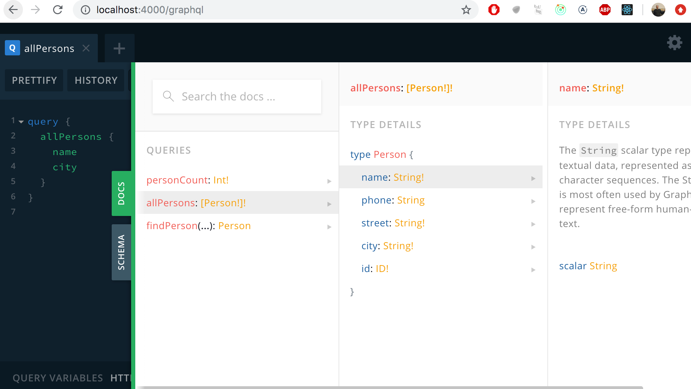

<div class="content">


<!-- REST, familiar to us from the previous parts of the course, has long been the most prevalent way to implement the interfaces servers offer for browsers, and in general the integration between different applications on the web.  -->
我们在课程的前几部分已经熟悉了 REST，它一直是服务器为浏览器提供接口最普遍的的方式，并且通常是 web 上不同应用之间的集成方式。

<!-- In the recent years [GraphQL](http://graphql.org/), developed by Facebook, has become popular for communication between web applications and servers.  -->
最近几年，Facebook 开发的[GraphQL](http://GraphQL.org/)已经成为 web 应用和服务器之间通信的流行工具。

<!-- The GraphQL philosophy is very different from REST. REST is <i>resource based</i>. Every resource, for example a <i>user</i> has its own address which identifies it, for example <i>/users/10</i>. All operations done to the resource are done with HTTP requests to its URL. The action depends on the used HTTP-method.  -->
Graphql 哲学与 REST 非常不同。 Rest 是基于资源的。 每个资源(例如<i>user</i>)都有自己的地址来标识它，例如<i>/users/10</i>。 对资源所做的所有操作都是通过对其 URL 的 HTTP 请求来完成的。 操作取决于所使用的 http 方法。 

<!-- The resource basedness of REST works well in most situations. However, it can be a bit awkward sometimes.  -->
Rest 的资源基本上在大多数情况下都能很好地工作，但有些时候也有些尴尬。 

<!-- Let's assume our bloglist application contains social media like functionality, and we would e.g. want to show a list of all the blogs the users who have commented on the blogs we follow have added.  -->
让我们假设我们的博客列表应用包含类似社交媒体的功能，并且我们想显示一个所有博客的列表，这些博客的用户已经在我们关注的博客上添加了评论。

<!-- If the server implemented a REST API, we would probably have to do multiple HTTP-requests from the browser before we had all the data we wanted. The requests would also return a lot of unnecessary data, and the code on the browser would probably be quite complicated.  -->
如果服务器实现了 REST API，那么在获得所需的所有数据之前，我们可能必须从浏览器执行多个 http 请求。 这些请求还会返回大量不必要的数据，而且浏览器上的代码可能会相当复杂。

<!-- If this was an often used functionality, there could be a REST-endpoint for it. If there were a lot of these kinds of scenarios however, it would become very laborious to implement REST-endpoints for all of them.  -->
如果这是一个经常使用的功能，那么它可能有一个 rest 接口。 但是，如果存在大量这类场景，那么为所有场景实现 rest 接口将变得非常困难。

<!-- A GraphQL server is well suited for these kinds of situations.  -->
Graphql 服务器非常适合这种情况。 

<!-- The main principle of GraphQL is, that the code on the browser forms a <i>query</i> describing the data wanted, and sends it to the API with an HTTP POST request. Unlike REST, all GraphQL queries are sent to the same address, and their type is POST.  -->
Graphql 的主要原理是，浏览器上的代码形成一个<i>query</i>，描述需要的数据，并通过 HTTP POST 请求将其发送给 API。 与 REST 不同，所有 GraphQL 查询都发送到相同的地址，它们的类型是 POST。 

<!-- The data described in the above scenario could be fetched with ( roughly ) the following query:  -->
上述场景中描述的数据可以通过(大致)如下查询获取:

```bash
query FetchBlogsQuery {
  user(username: "mluukkai") {
    followedUsers {
      blogs {
        comments {
          user {
            blogs {
              title
            }
          }
        }
      }
    }
  }
}
```

The content of the `FetchBlogsQuery` can be roughly interpreted as: find a user named `"mluukkai"` and for each of his `followedUsers`, find all their `blogs`, and for each blog all its `comments`, and for each `user` who wrote each comment, find their `blogs`, and return the `title` of each of them. 

`FetchBlogsQuery`的内容可以粗略的解释为：查找一个叫`"mluukkai"` 的用户以及每一个`followedUsers`， 查找所有他的`blogs`， 以及所有博客的`comments`， 还有每个评论的`user`，找到他们的`blogs` ，并返回每一个博客的`title`

<!-- The servers response would be about the following JSON-object:  -->
服务器响应将是如下 json 对象:

```bash
{
  "data": {
    "followedUsers": [
      {
        "blogs": [
          {
            "comments": [
              {
                "user": {
                  "blogs": [
                    {
                      "title": "Goto considered harmful"
                    },
                    {
                      "title": "End to End Testing with Cypress is most enjoyable"
                    },
                    {
                      "title": "Navigating your transition to GraphQL"
                    },
                    {
                      "title": "From REST to GraphQL"
                    }
                  ]
                }
              }
            ]
          }
        ]
      }
    ]
  }
}
```

<!-- The application logic stays simple, and the code on the browser gets exactly the data it needs with a single query.  -->
应用逻辑保持简单，浏览器上的代码通过一个查询就可以获得它所需要的数据。

### Schemas and queries 
【Schema和查询】
<!-- We will get to know the basics of GraphQL by implementing a GraphQL version of the phonebook application from parts 2 and 3.  -->
通过从第2章节和第3章节实现电话簿应用的 GraphQL 版本，我们将了解 GraphQL 的基础知识。

<!-- In the heart of all GraphQL applications is a [schema](https://graphql.org/learn/schema/), which describes the data sent between the client and the server. The initial schema for our phonebook is as follows:  -->
所有 GraphQL 应用的核心是一个[schema](https://GraphQL.org/learn/schema/) ，它描述了客户端和服务器之间发送的数据。 我们电话簿的初始模式如下:

```js
type Person {
  name: String!
  phone: String
  street: String!
  city: String!
  id: ID! 
}

type Query {
  personCount: Int!
  allPersons: [Person!]!
  findPerson(name: String!): Person
}
```

<!-- The schema describes two [types](https://graphql.org/learn/schema/#type-system). The first type, <i>Person</i>, determines that persons have five fields. Four of the fields are type  <i>String</i>, which is one of the [scalar types](https://graphql.org/learn/schema/#scalar-types) of GraphQL.  -->
该模式描述了两种类型[types](https://graphql.org/learn/schema/#type-system)。 第一种类型<i>Person</i> 确定 Person 有五个字段。 其中4个字段是类型<i>String</i>，它是 GraphQL 的[标量类型](https://GraphQL.org/learn/schema/#scalar-types)之一。
<!-- All of the String fields, except <i>phone</i>, must be given a value. This is marked by the exclamation mark on the schema. The type of the field <i>id</i> is <i>ID</i>. <i>ID</i> fields are strings, but GraphQL ensures they are unique.   -->
除了<i>phone</i> 之外，所有 String 字段都必须给定一个值。 这是由模式上的叹号标记的。<i>ID</i> 的字段类型是<i>ID</i>。<i>ID</i> 字段是字符串，但 GraphQL 确保它们是唯一的。


<!-- The second type is a [Query](https://graphql.org/learn/schema/#the-query-and-mutation-types). Practically every GraphQL schema describes a Query, which tells what kind of queries can be made to the API.  -->
第二种类型是[查询](https://graphql.org/learn/schema/#The-Query-and-mutation-types)。 实际上，每个 GraphQL 模式都描述一个 Query，它告诉我们可以向 API 发出什么样的查询。

<!-- The phonebook describes three different queries. _personCount_ returns an integer, _allPersons_ returns a list of <i>Person</i> objects and <i>findPerson</i> is given a string parameter and it returns a <i>Person</i> object.  -->
电话簿描述了三种不同的查询。 Personcount 返回一个整数，allPersons 返回一个<i>Person</i> 对象列表，<i>findPerson</i> 通过一个字符串参数并返回一个<i>Person</i> 对象。

<!-- Again exclamation marks are used to mark which return values and parameters are <i>Non-Null</i>. _personCount_ will, for sure, return an integer. The query _findPerson_ must be given a string as a parameter. The query returns a <i>Person</i>-object or <i>null</i>. _allPersons_ returns a list of <i>Person</i> objects, and the list does not contain any <i>null</i>-values.  -->
同样，感叹号用于标记返回值和参数为<i>非空</i> 的值。 _personCount_ 肯定会返回一个整数。 必须为查询 _findPerson_ 提供一个字符串作为参数。 查询返回一个<i>Person</i>-对象 或<i>null</i>。 _allPersons_ 返回一个<i>Person</i> 对象列表，该列表不包含任何<i>null</i>-值。

<!-- So the schema describes what queries the client can send to the server, what kind of parameters the queries can have, and what kind of data the queries return.  -->
因此模式描述了客户端可以向服务器发送什么样的查询，查询可以有什么样的参数，以及查询返回什么样的数据。

<!-- The simplest of the queries, _personCount_, looks as follows:  -->
最简单的查询 person Count 如下所示:

```js
query {
  personCount
}
```

<!-- Assuming our applications has saved the information of three people, the response would look like this:  -->
假设我们的应用已经保存了三个人的信息，响应如下:

```js
{
  "data": {
    "personCount": 3
  }
}
```

<!-- The query fetching the information of all of the people, _allPersons_, is a bit more complicated. Because the query returns a list of <i>Person</i>-objects, the query must describe  -->
获取所有人(_allPersons_)的信息的查询稍微复杂一些。 因为这个查询会返回一个<i>Person</i>对象列表，所以查询必须描述查询会返回
<!-- <i>which [fields](https://graphql.org/learn/queries/#fields)</i> of the objects the query returns: -->
对象的哪些<i>[字段](https://graphql.org/learn/queries/#fields)</i> ：


```js
query {
  allPersons {
    name
    phone
  }
}
```

<!-- The response could look like this:  -->
响应可能是这样的:

```js
{
  "data": {
    "allPersons": [
      {
        "name": "Arto Hellas",
        "phone": "040-123543"
      },
      {
        "name": "Matti Luukkainen",
        "phone": "040-432342"
      },
      {
        "name": "Venla Ruuska",
        "phone": null
      }
    ]
  }
}
```

<!-- A query can be made to return any field described in the schema. For example the following would also be possible:  -->
可以进行查询以返回模式中描述的任何字段。 例如，下列情况也是可行的:

```js
query {
  allPersons{
    name
    city
    street
  }
}
```

<!-- The last example shows a query which requires a parameter, and returns the details of one person.  -->
最后一个示例显示了一个需要参数的查询，并返回一个人的详细信息。

```js
query {
  findPerson(name: "Arto Hellas") {
    phone 
    city 
    street
    id
  }
}
```

<!-- So first the parameter is described in round brackets, and then the fields of the return value object are listed in curly brackets.  -->
因此，首先在圆括号中描述参数，然后在花括号中列出返回值对象的字段。

<!-- The response is like this:  -->
响应是这样的:

```js
{
  "data": {
    "findPerson": {
      "phone": "040-123543",
      "city": "Espoo",
      "street": "Tapiolankatu 5 A"
      "id": "3d594650-3436-11e9-bc57-8b80ba54c431"
    }
  }
}
```

<!-- The return value was marked as nullable, so if we search for the details of an unknown -->
返回值被标记为可空，因此如果我们搜索未知人的详细信息

```js
query {
  findPerson(name: "Joe Biden") {
    phone 
  }
}
```

<!-- the return value is <i>null</i>. -->
返回值为<i>null</i>。

```js
{
  "data": {
    "findPerson": null
  }
}
```

<!-- As you can see, there is a direct link between a GraphQL query and  the returned JSON object. One can think that the query describes what kind of data it wants as a response.  -->
如您所见，在 GraphQL 查询和返回的 JSON 对象之间有一个直接链接。 可以认为，查询描述了作为响应需要的数据类型。
<!-- The difference to REST queries is stark. With REST, the URL and the type of the request have nothing to do with the form of the return data.  -->
与 REST 查询的区别很明显。 对于 REST，URL 和请求的类型与返回数据的形式无关。

<!-- GraphQL query describes only the data moving between a server and the client. On the server the data can be organized and saved any way we like.  -->
Graphql 查询只描述在服务器和客户端之间移动的数据。 在服务器上，数据可以按照我们喜欢的方式进行组织和保存。 

<!-- Despite its name, GraphQL does not actually have anything to do with databases. It does not care how the data is saved.  -->
撇开它的名字不谈，GraphQL 实际上与数据库没有任何关系。 它不关心如何保存数据。
<!-- The data a GraphQL API uses can be saved into a relational database, document database, or to other servers which GraphQL-server can access with for example REST.  -->
一个 GraphQL API 使用的数据可以保存到一个关系数据库数据库，文档数据库，或者其他服务器，GraphQL 服务器可以通过例如 REST 访问。

### Apollo server
【阿波罗服务器】

<!-- Let's implement a GraphQL-server with today's leading library [Apollo -server](https://www.apollographql.com/docs/apollo-server/). -->
让我们用当今领先的库[Apollo-server](https://www.apollographql.com/docs/apollo-server)实现一个 graphql 服务器。

<!-- Create a new npm-project with _npm init_ and install the required dependencies. -->
使用 npm init 创建一个新的 npm-project，并安装所需的依赖项。

```bash
npm install apollo-server graphql apollo-server-core
```

<!-- The initial code is as follows:  -->
最初的代码如下:

```js
const { ApolloServer, gql } = require('apollo-server')

let persons = [
  {
    name: "Arto Hellas",
    phone: "040-123543",
    street: "Tapiolankatu 5 A",
    city: "Espoo",
    id: "3d594650-3436-11e9-bc57-8b80ba54c431"
  },
  {
    name: "Matti Luukkainen",
    phone: "040-432342",
    street: "Malminkaari 10 A",
    city: "Helsinki",
    id: '3d599470-3436-11e9-bc57-8b80ba54c431'
  },
  {
    name: "Venla Ruuska",
    street: "Nallemäentie 22 C",
    city: "Helsinki",
    id: '3d599471-3436-11e9-bc57-8b80ba54c431'
  },
]

const typeDefs = gql`
  type Person {
    name: String!
    phone: String
    street: String!
    city: String! 
    id: ID!
  }

  type Query {
    personCount: Int!
    allPersons: [Person!]!
    findPerson(name: String!): Person
  }
`

const resolvers = {
  Query: {
    personCount: () => persons.length,
    allPersons: () => persons,
    findPerson: (root, args) =>
      persons.find(p => p.name === args.name)
  }
}

const server = new ApolloServer({
  typeDefs,
  resolvers,
})

server.listen().then(({ url }) => {
  console.log(`Server ready at ${url}`)
})
```

<!-- The heart of the code is an _ApolloServer_, which is given two parameters -->
代码的核心是一个 ApolloServer，它有两个参数

```js
const server = new ApolloServer({
  typeDefs,
  resolvers,
   plugins: [
    ApolloServerPluginLandingPageGraphQLPlayground(),
  ],
})
```

<!-- The first parameter, _typeDefs_, contains the GraphQL schema.  -->
第一个参数 typeDefs 包含 GraphQL 模式。

<!-- The second parameter is an object, which contains the [resolvers](https://www.apollographql.com/docs/apollo-server/essentials/data.html#resolver-map) of the server. These are the code, which defines <i>how</i> GraphQL queries are responded to.  -->
第二个参数是一个对象，它包含服务器的[解析器](https://www.apollographql.com/docs/tutorial/resolvers/)。 这些代码定义了 GraphQL 查询的响应方式。

<!-- The code of the resolvers is the following:  -->
解析器的代码如下:

```js
const resolvers = {
  Query: {
    personCount: () => persons.length,
    allPersons: () => persons,
    findPerson: (root, args) =>
      persons.find(p => p.name === args.name)
  }
}
```

<!-- As you can see, the resolvers correspond to the queries described in the schema.  -->
正如您所看到的，解析器对应于模式中描述的查询。

```js
type Query {
  personCount: Int!
  allPersons: [Person!]!
  findPerson(name: String!): Person
}
```

<!-- So there is a field under <i>Query</i> for every query described in the schema.  -->
因此，模式中描述的每个查询在<i>Query</i> 下都有一个字段。

<!-- The query  -->
查询

```js
query {
  personCount
}
```

<!-- Has the resolver -->
有解析器

```js
() => persons.length
```

<!-- So the response to the query is the length of the array _persons_. -->
因此，查询的响应是数组 _persons_ 的长度。

<!-- The query which fetches all persons -->
获取所有人的查询

```js
query {
  allPersons {
    name
  }
}
```

<!-- has a resolver which returns <i>all</i> objects from the _persons_ array.  -->
有一个解析器，它从 _persons_ 数组中返回 <i>all</i>对象。

```js
() => persons
```

### GraphQL-playground
<!-- When Apollo-server is run on development mode (_node filename.js_), it starts a [GraphQL-playground](https://www.apollographql.com/docs/apollo-server/testing/graphql-playground/) to address [http://localhost:4000/graphql](http://localhost:4000/graphql). This is very useful for a developer, and can be used to make queries to the server.  -->
当 Apollo-server 在开发模式(_node filename.js_)下运行时，它会启动一个[GraphQL-playground](https://www.apollographql.com/docs/Apollo-server/testing/GraphQL-playground/)来寻址 <http://localhost:4000/graphql>。 这对于开发人员非常有用，可用于对服务器进行查询。

<!-- Let's try it out -->
让我们试试看


<!-- Sometimes the Playground requires you to be quite pedantic. If the syntax of a query is wrong, the error message is quite unnoticeable and nothing happens when you press go.  -->
有时playground要求你相当刻板。 如果查询的语法是错误的，那么错误消息是非常不明显的，当您按 go 时什么也不会发生。


<!-- The result from the previous query stays visible on the right side of the playground even when the current query is faulty.  -->
即使当前查询是错误的，前一个查询的结果仍然在playground的右侧可见。

<!-- By pointing at the right place on the line with the errors, you can see the error message -->
通过指向带有错误的行上的右侧位置，您可以看到错误消息


<!-- If the playground seems to be stuck, refreshing the page usually helps.  -->
如果playground似乎卡住了，刷新页面通常会有所帮助。

<!-- By clicking the text <i>DOCS</i> on the right, the playground shows the GraphQL schema of the server.  -->
通过单击右侧的文本<i>DOCS</i>，playground 将显示服务器的 GraphQL 模式。




### Parameters of a resolver
【解析器的参数】

<!-- The query fetching a single person -->
获取单个人的查询

```js
query {
  findPerson(name: "Arto Hellas") {
    phone 
    city 
    street
  }
}
```

<!-- has a resolver which differs from the previous ones because it is given <i>two parameters</i>: -->
有一个不同于以前的解析器，因为它给出了<i>两个参数</i>:

```js
(root, args) => persons.find(p => p.name === args.name)
```

<!-- The second parameter, _args_, contains the parameters of the query.  -->
第二个参数 args 包含查询的参数。
<!-- The resolver then returns from the array _persons_ the person whose name is the same as the value of <i>args.name</i>.  -->
然后，解析器从数组人员返回名称与<i>args.name</i> 值相同的人。
<!-- The resolver does not need the first parameter _root_. -->
解析器不需要第一个参数_root_。


 <!--In fact all resolver functions are given [four parameters](https://www.apollographql.com/docs/graphql-tools/resolvers.html#Resolver-function-signature). With JavaScript the parameters don't have to be defined, if they are not needed. We will be using the first and the third parameter of a resolver later in this part.--> 
事实上，所有的解析器函数都是给定的[4个参数](https://www.graphql-tools.com/docs/resolvers#resolver-function-signature)。 使用 JavaScript 时，如果不需要参数，那么就不必定义它们。 我们将在本章节后面使用解析器的第一个和第三个参数。

### The default resolver
【默认解析器】

<!-- When we do a query, for example -->
例如，当我们进行查询时

```js
query {
  findPerson(name: "Arto Hellas") {
    phone 
    city 
    street
  }
}
```

<!-- the server knows to send back exactly the fields required by the query. How does that happen? -->
服务器知道发送回查询所需的字段，这是如何发生的？

<!-- A GraphQL-server must define resolvers for <i>each</i> field of each  type in the schema.  -->
Graphql-server 必须为模式中每种类型的<i>每种</i>字段定义解析器。 
<!-- We have so far only defined resolvers for fields of the type <i>Query</i>, so for each query of the application.  -->
到目前为止，我们只为类型为<i>Query</i> 的字段定义了解析器，因此应用的每个查询都是这样。

<!-- Because we did not define resolvers for the fields of the type <i>Person</i>, Apollo has defined [default resolvers](https://www.apollographql.com/docs/graphql-tools/resolvers.html#Default-resolver) for them.  -->
因为我们没有为<i>Person</i> 类型的字段定义解析器，Apollo 已经为它们定义了[默认解析器](https://www.graphql-tools.com/docs/resolvers/#default-resolver)。
<!-- They work like the one shown below:  -->
它们的工作原理如下图所示:


```js
const resolvers = {
  Query: {
    personCount: () => persons.length,
    allPersons: () => persons,
    findPerson: (root, args) => persons.find(p => p.name === args.name)
  },
  // highlight-start
  Person: {
    name: (root) => root.name,
    phone: (root) => root.phone,
    street: (root) => root.street,
    city: (root) => root.city,
    id: (root) => root.id
  }
  // highlight-end
}
```

<!-- The default resolver returns the value of the corresponding field of the object. The object itself can be accessed through the first parameter of the resolver, _root_. -->
默认解析器返回对象相应字段的值。 对象本身可以通过解析器的第一个参数 root 访问。

<!-- If the functionality of the default resolver is enough, you don't need to define your own. It is also possible to define resolvers for only some fields of a type, and let the default resolvers handle the rest.  -->
如果默认解析器的功能已经足够，那么您不需要定义自己的解析器。 也可以只为某个类型的某些字段定义解析器，并让默认解析器处理其余字段。

<!-- We could for example define, that the address of all persons is  -->
例如，我们可以定义，所有人的地址是
<i>Manhattan New York</i> by hard coding the following to the resolvers of the street and city fields of the type <i>Person</i>.
<i>Manhattan New York</i> <i>通过将下面的代码硬编码到 Person</i> 类型的街道和城市字段的解析器中。

```js
Person: {
  street: (root) => "Manhattan",
  city: (root) => "New York"
}
```

### Object within an object
【对象中的对象】

<!-- Let's modify the scheme a bit -->
让我们稍微修改一下这个方案

```js
  // highlight-start
type Address {
  street: String!
  city: String! 
}
  // highlight-end

type Person {
  name: String!
  phone: String
  address: Address!   // highlight-line
  id: ID!
}

type Query {
  personCount: Int!
  allPersons: [Person!]!
  findPerson(name: String!): Person
}
```


<!-- so a person now has a field with the type <i>Address</i>, which contains the street and the city.  -->
所以一个人现在有一个<i>Address</i> 类型的字段，包含街道和城市。

<!-- The queries requiring the address change into -->
需要地址的查询变为

```js
query {
  findPerson(name: "Arto Hellas") {
    phone 
    address {
      city 
      street
    }
  }
}
```

<!-- and the response is now a person object, which <i>contains</i> an address object.   -->
现在的响应是一个 person 对象，它包含一个地址对象。

```js
{
  "data": {
    "findPerson": {
      "phone": "040-123543",
      "address":  {
        "city": "Espoo",
        "street": "Tapiolankatu 5 A"
      }
    }
  }
}
```

<!-- We still save the persons in the server the same way we did before.  -->
我们仍然像以前一样保存服务器中的人。

```js
let persons = [
  {
    name: "Arto Hellas",
    phone: "040-123543",
    street: "Tapiolankatu 5 A",
    city: "Espoo",
    id: "3d594650-3436-11e9-bc57-8b80ba54c431"
  },
  // ...
]
```

<!-- The person-objects saved in the server are not exactly the same as the GraphQL type <i>Person</i> objects described in the schema.   -->
因此，保存在服务器中的 Person-objects 与模式中描述的 GraphQL type<i>Person</i> 对象并不完全相同。

<!-- Contrary to the <i>Person</i> type, the <i>Address</i> type does not have an <i>id</i> field, because they are not saved into their own separate data structure in the server.   -->
与<i>Person</i> 类型相反， <i>Address</i> 类型没有 <i>id</i> 字段，因为它们没有保存到服务器中自己的数据结构中。

<!-- Because the objects saved in the array do not have an <i>address</i> field, the default resolver is not sufficient.  -->
因为数组中保存的对象没有字段<i>address</i>，所以默认解析程序是不够的。
<!-- Let's add a resolver for the <i>address</i> field  of <i>Person</i> type :   -->
让我们为类型<i>Person</i> 的字段<i>address</i> 添加一个解析器:

```js
const resolvers = {
  Query: {
    personCount: () => persons.length,
    allPersons: () => persons,
    findPerson: (root, args) =>
      persons.find(p => p.name === args.name)
  },
  // highlight-start
  Person: {
    address: (root) => {
      return { 
        street: root.street,
        city: root.city
      }
    }
  }
  // highlight-end
}
```

<!-- So every time a <i>Person</i> object is returned, the fields <i>name</i>, <i>phone</i> and <i>id</i> are returned using their default resolvers, but the field <i>address</i> is formed by using a self defined resolver. The parameter _root_ of the resolver function is the person-object, so the street and the city of the address can be taken from its fields.  -->
因此，每次返回<i>Person</i> 对象时，都会使用默认解析器返回<i>name</i>、<i>phone</i> 和<i>id</i> 字段，但是<i>address</i> 字段是使用自定义解析器形成的。 解析器函数的参数根是person-object，因此可以从字段中获取地址的街道和城市。

<!-- The current code of the application can be found on [Github](https://github.com/fullstack-hy2020/graphql-phonebook-backend/tree/part8-1), branch <i>part8-1</i>. -->
当前应用的代码可以在[Github](https://Github.com/fullstack-hy2020/graphql-phonebook-backend/tree/part8-1) ，branch<i>part8-1</i> 上找到。

### Mutations
<!-- Let's add a functionality for adding new persons to the phonebook. In GraphQL, all operations which cause a change are done with [mutations](https://graphql.org/learn/queries/#mutations). Mutations are described in the schema as the keys of type <i>Mutation</i>. -->
让我们在电话簿中添加一个添加新用户的功能。 在 GraphQL 中，所有引起变更的操作都是通过[Mutation](https://GraphQL.org/learn/queries/#mutations)来完成的。 Mutation在模式中被描述为<i>Mutation类型</i> 的键。


<!-- The schema for a mutation for adding a new person looks as follows:  -->
增加一个新人的Mutation模式如下:

```js
type Mutation {
  addPerson(
    name: String!
    phone: String
    street: String!
    city: String!
  ): Person
}
```

<!-- The Mutation is given the details of the person as parameters. The parameter <i>phone</i> is the only one which is nullable. The Mutation also has a return value. The return value is type <i>Person</i>, the idea being that the details of the added person are returned if the operation is successful and if not, null. Value for the field <i>id</i> is not given as a parameter. Generating an id is better left for the server.  -->
Mutation是以人的详细信息作为参数。 参数<i>phone</i> 是唯一可以为空的。 Mutation 还有一个返回值。 返回值是<i>Person</i> 类型，其思想是，如果操作成功，则返回所添加人员的详细信息，如果不成功，则返回 null。 字段<i>id</i> 的值不作为参数给出。 生成 id 的工作最好留给服务器。

<!-- Mutations also require a resolver:  -->
Mutation也需要一个解析器:

```js
const { v1: uuid } = require('uuid')

// ...

const resolvers = {
  // ...
  Mutation: {
    addPerson: (root, args) => {
      const person = { ...args, id: uuid() }
      persons = persons.concat(person)
      return person
    }
  }
}
```

<!-- The mutation adds the object given to it as a parameter _args_ to the array _persons_, and returns the object it added to the array.  -->
Mutation将作为参数提供给它的对象添加到数组人员中，并返回它添加到数组中的对象。

<!-- The <i>id</i> field is given a unique value using the [uuid](https://github.com/kelektiv/node-uuid#readme) library.  -->
使用[uuid](https://github.com/kelektiv/node-uuid#readme)库为<i>id</i> 字段赋予一个唯一值。

<!-- A new person can be added with the following mutation -->
一个新的人可以通过下面的Mutation来添加

```js
mutation {
  addPerson(
    name: "Pekka Mikkola"
    phone: "045-2374321"
    street: "Vilppulantie 25"
    city: "Helsinki"
  ) {
    name
    phone
    address{
      city
      street
    }
    id
  }
}
```

<!-- Note, that the person is saved to the _persons_ array as  -->
注意，该人被保存为

```js
{
  name: "Pekka Mikkola",
  phone: "045-2374321",
  street: "Vilppulantie 25",
  city: "Helsinki",
  id: "2b24e0b0-343c-11e9-8c2a-cb57c2bf804f"
}
```

<!-- But the response to the mutation is  -->
但是对这种Mutation的响应是

```js
{
  "data": {
    "addPerson": {
      "name": "Pekka Mikkola",
      "phone": "045-2374321",
      "address": {
        "city": "Helsinki",
        "street": "Vilppulantie 25"
      },
      "id": "2b24e0b0-343c-11e9-8c2a-cb57c2bf804f"
    }
  }
}
```

<!-- So the resolver of the <i>address</i> field of the <i>Person</i> type formats the response object to the right form.  -->
因此，Person 类型的 <i>address</i> 字段的解析器将response对象格式化为正确的形式。

### Error handling
【错误处理】
<!-- If we try to create a new person, but the parameters do not correspond with the schema description, the server gives an error message:  -->
如果我们尝试创建一个新人，但是参数不符合模式描述，服务器会给出一个错误消息:


<!-- So some of the error handling can be automatically done with GraphQL [validation](https://graphql.org/learn/validation/). -->
因此，一些错误处理可以通过 GraphQL [validation](https://GraphQL.org/learn/validation/)自动完成。

<!-- However GraphQL cannot handle everything automatically. For example stricter rules for data sent to a Mutation have to be added manually. -->
但是，GraphQL 不能自动处理所有事情。 例如，对于发送到 Mutation 的数据，必须手动添加更严格的规则。
<!-- The errors from those rules are handled by [the error handling mechanism of GraphQL](https://www.apollographql.com/docs/apollo-server/features/errors.html). -->
来自这些规则的错误由[Apollo Server 的错误处理机制](https://www.apollographql.com/docs/apollo-server/data/errors)处理。

<!-- Let's block adding the same name to the phonebook multiple times:  -->
让我们多次阻止将同一个名字添加到电话簿中:

```js
const { ApolloServer, UserInputError, gql } = require('apollo-server') // highlight-line

// ...

const resolvers = {
  // ..
  Mutation: {
    addPerson: (root, args) => {
      // highlight-start
      if (persons.find(p => p.name === args.name)) {
        throw new UserInputError('Name must be unique', {
          invalidArgs: args.name,
        })
      }
      // highlight-end

      const person = { ...args, id: uuid() }
      persons = persons.concat(person)
      return person
    }
  }
}
```

<!-- So if the name to be added already exists in the phonebook, throw _UserInputError_ error.  -->
因此，如果要添加的名称已经存在于电话簿中，则抛出 _UserInputError_ 错误。


<!-- The current code of the application can be found on [Github](https://github.com/fullstack-hy2020/graphql-phonebook-backend/tree/part8-2), branch <i>part8-2</i>. -->
当前应用的代码可以在[Github](https://Github.com/fullstack-hy2020/graphql-phonebook-backend/tree/part8-2) ，branch<i>part8-2</i> 上找到。

### Enum
【枚举】
<!-- Let's add a possibility to filter the query returning all persons with the parameter <i>phone</i> so, that it returns only persons with a phone number -->
让我们添加一种可能性来筛选返回所有带有参数<i>phone</i> 的人的查询，以便它只返回带有电话号码的人

```js
query {
  allPersons(phone: YES) {
    name
    phone 
  }
}
```

<!-- or persons without a phone number  -->
或者没有电话号码的人

```js
query {
  allPersons(phone: NO) {
    name
  }
}
```

<!-- The schema changes like so:  -->
模式变化如下:

```js
// highlight-start
enum YesNo {
  YES
  NO
}
// highlight-end

type Query {
  personCount: Int!
  allPersons(phone: YesNo): [Person!]! // highlight-line
  findPerson(name: String!): Person
}
```

<!-- The type <i>YesNo</i> is GraphQL [enum](https://graphql.org/learn/schema/#enumeration-types), or an enumerable, with two possible values <i>YES</i> or <i>NO</i>. In the query _allPersons_ the parameter _phone_  has the type <i>YesNo</i>, but is nullable.  -->
类型<i>YesNo</i> 是 GraphQL [enum](https://GraphQL.org/learn/schema/#enumeration-types) ，或者说可枚举类型，有两个可能的值<i>YES</i> 或<i>NO</i>。 在查询 allPersons 中，参数 phone 的类型为<i>YesNo</i>，但可为空。


<!-- The resolver changes like so: -->
解析器的变化如下:

```js
Query: {
  personCount: () => persons.length,
  // highlight-start
  allPersons: (root, args) => {
    if (!args.phone) {
      return persons
    }

    const byPhone = (person) =>
      args.phone === 'YES' ? person.phone : !person.phone

    return persons.filter(byPhone)
  },
  // highlight-end
  findPerson: (root, args) =>
    persons.find(p => p.name === args.name)
},
```

### Changing a phone number
【换个电话号码】

<!-- Let's add a mutation for changing the phone number of a person. The schema of this mutation looks as follows: -->
让我们添加一个Mutation来改变一个人的电话号码。这个Mutation的模式如下:

```js
type Mutation {
  addPerson(
    name: String!
    phone: String
    street: String!
    city: String!
  ): Person
  // highlight-start
  editNumber(
    name: String!
    phone: String!
  ): Person
  // highlight-end
}
```

<!-- and is done by a resolver: -->
而且是由一个resolver完成的:

```js
Mutation: {
  // ...
  editNumber: (root, args) => {
    const person = persons.find(p => p.name === args.name)
    if (!person) {
      return null
    }

    const updatedPerson = { ...person, phone: args.phone }
    persons = persons.map(p => p.name === args.name ? updatedPerson : p)
    return updatedPerson
  }   
}
```


<!-- The mutation finds the person to be updated by the field <i>name</i>. -->
mutations 发现person 被 <i>name</i> 字段更新掉了。

<!-- The current code of the application can be found on [Github](https://github.com/fullstack-hy2020/graphql-phonebook-backend/tree/part8-3), branch <i>part8-3</i>. -->
当前应用的代码可以在[Github](https://Github.com/fullstack-hy2020/graphql-phonebook-backend/tree/part8-3) ，branch<i>part8-3</i> 上找到。

### More on queries
【更多关于查询的信息】
<!-- With GraphQL it is possible to combine multiple fields of type <i>Query</i>, or "separate queries" into one query. For example the following query returns both the amount of persons in the phonebook and their names:  -->
使用 GraphQL，可以将<i>Query</i> 类型的多个字段或“单独查询”组合到一个查询中。 例如，下面的查询返回电话簿中的人数和他们的姓名:

```js
query {
  personCount
  allPersons {
    name
  }
}
```

<!-- The response looks as follows -->
响应如下

```js
{
  "data": {
    "personCount": 3,
    "allPersons": [
      {
        "name": "Arto Hellas"
      },
      {
        "name": "Matti Luukkainen"
      },
      {
        "name": "Venla Ruuska"
      }
    ]
  }
}
```

<!-- Combined query can also use the same query multiple times. You must however give the queries alternative names like so -->
组合查询还可以多次使用同一查询，但必须为查询指定其他名称，例如

```js
query {
  havePhone: allPersons(phone: YES){
    name
  }
  phoneless: allPersons(phone: NO){
    name
  }
}
```

<!-- The response looks like -->
这种响应看起来像是

```js
{
  "data": {
    "havePhone": [
      {
        "name": "Arto Hellas"
      },
      {
        "name": "Matti Luukkainen"
      }
    ],
    "phoneless": [
      {
        "name": "Venla Ruuska"
      }
    ]
  }
}
```

<!-- In some cases it might be beneficial to name the queries. This is the case especially when the queries or mutations have [parameters](https://graphql.org/learn/queries/#variables). We will get into parameters soon.  -->
在某些情况下，命名查询可能是有益的。 这种情况尤其是当查询或Mutation具有[参数](https://graphql.org/learn/queries/#variables)时。 我们很快就会学习参数。

<!-- If there are multiple queries, Playground asks you to choose which of them to run: -->
如果有多个查询，Playground 会让你选择运行哪个查询:


</div>


<div class="tasks">


### Exercises 8.1.-8.7.
<!-- Through the exercises, we will implement a GraphQL backend for a small library.  -->
通过这些练习，我们将实现一个小型库的 GraphQL 后端。
<!-- Start with [this file](https://github.com/fullstack-hy2020/misc/blob/master/library-backend.js). Remember to _npm init_ and to install dependencies! -->
从[这个文件](https://github.com/fullstack-hy2020/misc/blob/master/library-backend.js)开始，记住 npm init 并安装依赖项！

<!-- Note that the code does not initially work since the schema definition is not complete. -->
请注意，由于模式定义不完整，代码最初不工作。

#### 8.1: The number of books and authors
<!-- Implement queries _bookCount_ and _authorCount_ which return the number of books and the number of authors.  -->
实现返回图书数量和作者数量的 bookCount 和 authorCount 查询。

<!-- The query  -->
查询

```js
query {
  bookCount
  authorCount
}
```


<!-- should return -->
应该会回来

```js
{
  "data": {
    "bookCount": 7,
    "authorCount": 5
  }
}
```

#### 8.2: All books 
<!-- Implement query _allBooks_, which returns the details of all books.  -->
实现查询 allBooks，它返回所有图书的详细信息。

<!-- In the end, the user should be able to do the following query: -->
最后，用户应该能够进行如下查询:

```js
query {
  allBooks { 
    title 
    author
    published 
    genres
  }
}
```

#### 8.3: All authors
<!-- Implement query _allAuthors_, which returns the details of all authors. The response should include a field _bookCount_ containing the number of books the author has written.  -->
实现查询 allAuthors，它返回所有作者的详细信息。 响应应该包括一个字段 bookCount，其中包含作者已经写的书的数量。

<!-- For example the query -->
例如，查询

```js
query {
  allAuthors {
    name
    bookCount
  }
}
```


<!-- should return -->
应该会回来

```js
{
  "data": {
    "allAuthors": [
      {
        "name": "Robert Martin",
        "bookCount": 2
      },
      {
        "name": "Martin Fowler",
        "bookCount": 1
      },
      {
        "name": "Fyodor Dostoevsky",
        "bookCount": 2
      },
      {
        "name": "Joshua Kerievsky",
        "bookCount": 1
      },
      {
        "name": "Sandi Metz",
        "bookCount": 1
      }
    ]
  }
}
```

#### 8.4: Books of an author
<!-- Modify the _allBooks_ query so, that a user can give an optional parameter <i>author</i>. The response should include only books written by that author.  -->
修改 allBooks 查询，以便用户可以给出一个可选参数<i>author</i>。 回复中应该只包括该作者写的书。

<!-- For example query -->
例如查询

```js
query {
  allBooks(author: "Robert Martin") {
    title
  }
}
```


<!-- should return -->
应该会回来

```js
{
  "data": {
    "allBooks": [
      {
        "title": "Clean Code"
      },
      {
        "title": "Agile software development"
      }
    ]
  }
}
```

#### 8.5: Books by genre
<!-- Modify the query _allBooks_ so that a user can give an optional parameter <i>genre</i>. The response should include only books of that genre.  -->
修改查询 allBooks，以便用户可以给出一个可选参数<i>genre</i>。 回应应该只包括这种类型的书籍。


<!-- For example query -->
例如查询

```js
query {
  allBooks(genre: "refactoring") {
    title
    author
  }
}
```

<!-- should return -->
应该会回来

```js
{
  "data": {
    "allBooks": [
      {
        "title": "Clean Code",
        "author": "Robert Martin"
      },
      {
        "title": "Refactoring, edition 2",
        "author": "Martin Fowler"
      },
      {
        "title": "Refactoring to patterns",
        "author": "Joshua Kerievsky"
      },
      {
        "title": "Practical Object-Oriented Design, An Agile Primer Using Ruby",
        "author": "Sandi Metz"
      }
    ]
  }
}
```


<!-- The query must work when both optional parameters are given:  -->
当给定两个可选参数时，查询必须正常工作:

```js
query {
  allBooks(author: "Robert Martin", genre: "refactoring") {
    title
    author
  }
}
```

#### 8.6: Adding a book
<!-- Implement mutation _addBook_, which can be used like this: -->
实现Mutation addBook，可以这样使用:

```js
mutation {
  addBook(
    title: "NoSQL Distilled",
    author: "Martin Fowler",
    published: 2012,
    genres: ["database", "nosql"]
  ) {
    title,
    author
  }
}
```

<!-- The mutation works even if the author is not already saved to the server: -->
即使作者还没有保存到服务器上，Mutation仍然有效:

```js
mutation {
  addBook(
    title: "Pimeyden tango",
    author: "Reijo Mäki",
    published: 1997,
    genres: ["crime"]
  ) {
    title,
    author
  }
}
```

<!-- If the author is not yet saved to the server, a new author is added to the system. The birth years of authors are not saved to the server yet, so the query -->
如果作者尚未保存到服务器，则向系统添加一个新作者。 作者的出生年份还没有保存到服务器上，因此查询

```js
query {
  allAuthors {
    name
    born
    bookCount
  }
}
```

<!-- returns -->
返回

```js
{
  "data": {
    "allAuthors": [
      // ...
      {
        "name": "Reijo Mäki",
        "born": null,
        "bookCount": 1
      }
    ]
  }
}
```

#### 8.7: Updating the birth year of an author

<!-- Implement mutation _editAuthor_, which can be used to set a birth year for an author. The mutation is used like so -->
实现 mutation editAuthor，它可用于设置作者的出生年份。 Mutation就是这样使用的

```js
mutation {
  editAuthor(name: "Reijo Mäki", setBornTo: 1958) {
    name
    born
  }
}
```

<!-- If the correct author is found, the operation returns the edited author: -->
如果找到正确的作者，操作返回编辑过的作者:

```js
{
  "data": {
    "editAuthor": {
      "name": "Reijo Mäki",
      "born": 1958
    }
  }
}
```

<!-- If the author is not in the system, <i>null</i> is returned:  -->
如果作者不在系统中，则返回<i>null</i>:

```js
{
  "data": {
    "editAuthor": null
  }
}
```

</div>
