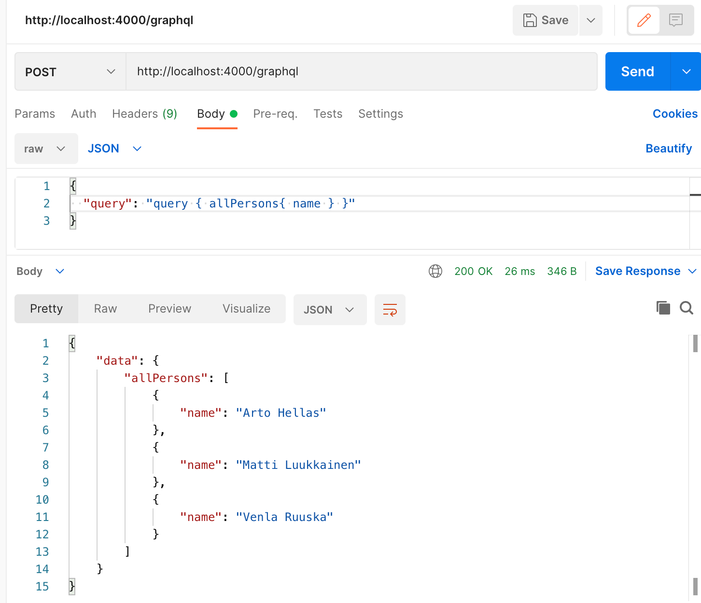
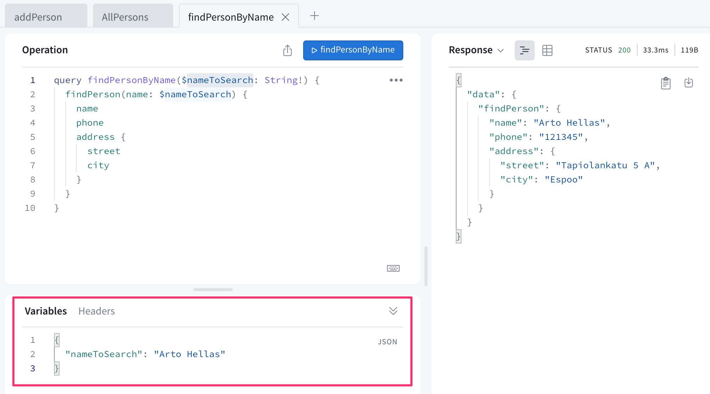
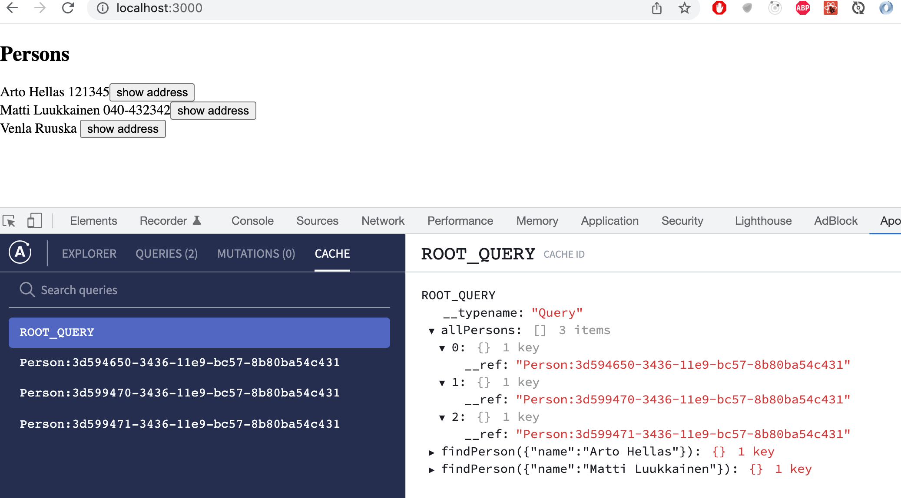
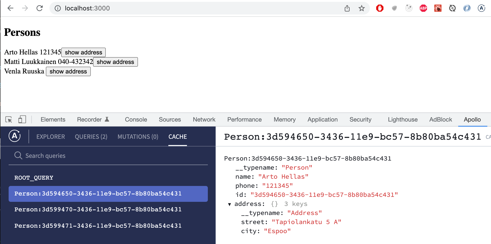
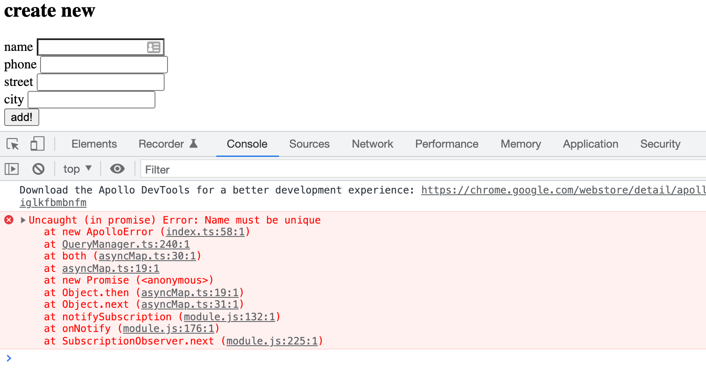
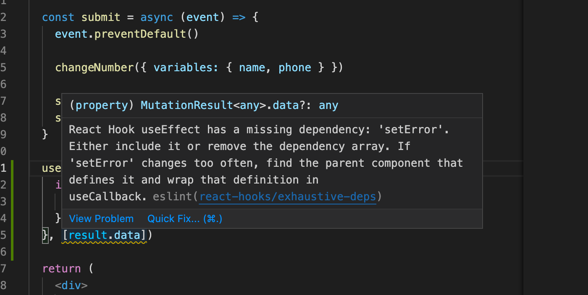

<div class="content">

<!-- We will next implement a React app which uses the GraphQL server we created.-->
 我们接下来将实现一个React应用，它使用我们创建的GraphQL服务器。

<!-- The current code of the server can be found on [GitHub](https://github.com/fullstack-hy2020/graphql-phonebook-backend/tree/part8-3), branch <i>part8-3</i>.-->
 服务器的当前代码可以在[GitHub](https://github.com/fullstack-hy2020/graphql-phonebook-backend/tree/part8-3)上找到，分支<i>part8-3</i>。

<!-- In theory, we could use GraphQL with HTTP POST requests. The following shows an example of this with Postman:-->
 理论上，我们可以使用GraphQL与HTTP POST请求。下面是一个使用Postman的例子。



<!-- The communication works by sending HTTP POST requests to http://localhost:4000/graphql. The query itself is a string sent as the value of the key <i>query</i>.-->
 通信的工作方式是向http://localhost:4000/graphql 发送HTTP POST请求。查询本身是一个字符串，作为键<i>query</i>的值发送。

<!-- We could take care of the communication between the React app and GraphQL by using Axios. However, most of the time, it is not very sensible to do so. It is a better idea to use a higher-order library capable of abstracting the unnecessary details of the communication.-->
 我们可以通过使用Axios来处理React应用和GraphQL之间的通信。然而，在大多数情况下，这样做是不太明智的。使用一个能够抽象出不必要的通信细节的高阶库是一个更好的主意。

<!-- At the moment, there are two good options: [Relay](https://facebook.github.io/relay/) by Facebook and [Apollo Client](https://www.apollographql.com/docs/react/), which is the client side of the same library we used in the previous section. Apollo is absolutely the most popular of the two, and we will use it in this section as well.-->
 目前，有两个不错的选择。Facebook的[Relay](https://facebook.github.io/relay/)和[Apollo Client](https://www.apollographql.com/docs/react/)，它是我们在上一节使用的同一个库的客户端。Apollo绝对是这两个中最受欢迎的，我们在这一节也会使用它。

### Apollo client

<!-- Let us create a new React-app. At the time of writing (21th April 2022) Apollo client does not work well with React version 18. So we downgrade the project to previous version by changing the file <i>package.json</i> as follows:-->
 让我们创建一个新的React-app。在写这篇文章的时候（2022年4月21日），Apollo客户端不能很好地与React 18版本一起工作。所以我们通过改变文件<i>package.json</i>将项目降级到以前的版本，如下所示。

```js
{
  "dependencies": {
    "react": "^17.0.2", // highlight-line
    "react-dom": "^17.0.2", // highlight-line
    "react-scripts": "5.0.0",
    "web-vitals": "^2.1.4"
  },
  // ...
}
```

<!-- After the change is made, reinstall dependencies by running-->
 更改后，通过运行以下程序重新安装依赖关系

```js
npm install
```

<!-- Now we can continue installing dependencies required by [Apollo client](https://www.apollographql.com/docs/react/get-started/).-->
 现在我们可以继续安装[Apollo客户端](https://www.apollographql.com/docs/react/get-started/)所需的依赖项。

```bash
npm install @apollo/client graphql
```

<!-- We'll start with the following code for our application:-->
 我们将用以下代码开始我们的应用。

```js
import ReactDOM from 'react-dom'
import App from './App'

import { ApolloClient, HttpLink, InMemoryCache, gql } from '@apollo/client'

const client = new ApolloClient({
  cache: new InMemoryCache(),
  link: new HttpLink({
    uri: 'http://localhost:4000',
  })
})

const query = gql`
query {
  allPersons {
    name,
    phone,
    address {
      street,
      city
    }
    id
  }
}
`

client.query({ query })
  .then((response) => {
    console.log(response.data)
  })

ReactDOM.render(<App />, document.getElementById('root'))
```

<!-- The beginning of the code creates a new [client](https://www.apollographql.com/docs/react/get-started/#create-a-client) object, which is then used to send a query to the server:-->
 代码的开头创建了一个新的[客户端](https://www.apollographql.com/docs/react/get-started/#create-a-client)对象，然后用它向服务器发送一个查询。

```js
client.query({ query })
  .then((response) => {
    console.log(response.data)
  })
```

<!-- The server's response is printed to the console:-->
 服务器的响应被打印到控制台。


<!-- The application can communicate with a GraphQL server using the _client_ object. The client can be made accessible for all components of the application by wrapping the <i>App</i> component with [ApolloProvider](https://www.apollographql.com/docs/react/get-started/#connect-your-client-to-react).-->
 应用可以使用_client_对象与GraphQL服务器通信。通过用[ApolloProvider](https://www.apollographql.com/docs/react/get-started/#connect-your-client-to-react)包装<i>App</i>组件，可以使应用的所有组件都能访问该客户端。

```js
import ReactDOM from 'react-dom'
import App from './App'

import {
  ApolloClient, ApolloProvider, HttpLink, InMemoryCache // highlight-line
} from '@apollo/client'

const client = new ApolloClient({
  cache: new InMemoryCache(),
  link: new HttpLink({
    uri: 'http://localhost:4000',
  })
})

ReactDOM.render(
  <ApolloProvider client={client}> // highlight-line
    <App />
  </ApolloProvider>, // highlight-line
  document.getElementById('root')
)
```

### Making queries

<!-- We are ready to implement the main view of the application, which shows a list of phone numbers.-->
 我们准备实现应用的主视图，它显示一个电话号码列表。

<!-- Apollo Client offers a few alternatives for making [queries](https://www.apollographql.com/docs/react/data/queries/).-->
 Apollo客户端提供了一些替代方案来进行[查询](https://www.apollographql.com/docs/react/data/queries/)。
<!-- Currently, the use of the hook function [useQuery](https://www.apollographql.com/docs/react/api/react/hooks/#usequery) is the dominant practice.-->
 目前，使用钩子函数[useQuery](https://www.apollographql.com/docs/react/api/react/hooks/#usequery)是最主要的做法。

<!-- The query is made by the <i>App</i> component, the code of which is as follows:-->
查询是由<i>App</i>组件进行的，其代码如下。

```js
import { gql, useQuery } from '@apollo/client'

const ALL_PERSONS = gql`
query {
  allPersons {
    name
    phone
    id
  }
}
`

const App = () => {
  const result = useQuery(ALL_PERSONS)

  if (result.loading) {
    return <div>loading...</div>
  }

  return (
    <div>
      {result.data.allPersons.map(p => p.name).join(', ')}
    </div>
  )
}

export default App
```

<!-- When called, _useQuery_ makes the query it receives as a parameter.-->
当被调用时，_useQuery_做出它作为参数收到的查询。
<!-- It returns an object with multiple [fields](https://www.apollographql.com/docs/react/api/react/hooks/#result).-->
它返回一个有多个[字段]的对象(https://www.apollographql.com/docs/react/api/react/hooks/#result)。
<!-- The field <i>loading</i> is true if the query has not received a response yet.-->
 如果查询还没有收到响应，字段<i>loading</i>为真。
<!-- Then the following code gets rendered:-->
然后下面的代码会被渲染。

```js
if (result.loading) {
  return <div>loading...</div>
}
```

<!-- When a response is received, the result of the <i>allPersons</i> query can be found from the <i>data</i> field, and we can render the list of names to the screen.-->
 当收到响应时，可以从<i>data</i>字段中找到<i>allPersons</i>查询的结果，我们可以将名字的列表渲染在屏幕上。

```js
<div>
  {result.data.allPersons.map(p => p.name).join(', ')}
</div>
```

<!-- Let's separate displaying the list of persons into its own component:-->
 让我们把显示人名列表分离成自己的组件。

```js
const Persons = ({ persons }) => {
  return (
    <div>
      <h2>Persons</h2>
      {persons.map(p =>
        <div key={p.name}>
          {p.name} {p.phone}
        </div>
      )}
    </div>
  )
}
```

<!-- The _App_ component still makes the query, and passes the result to the new component to be rendered:-->
 _App_组件仍然进行查询，并将结果传递给新的组件进行渲染。

```js
const App = () => {
  const result = useQuery(ALL_PERSONS)

  if (result.loading)  {
    return <div>loading...</div>
  }

  return (
    <Persons persons={result.data.allPersons}/>
  )
}
```

### Named queries and variables

<!-- Let's implement functionality for viewing the address details of a person. The <i>findPerson</i> query is well-suited for this.-->
 我们来实现查看一个人的地址细节的功能。<i>findPerson</i>查询很适合于此。

<!-- The queries we did in the last chapter had the parameter hardcoded into the query:-->
 我们在上一章所做的查询将参数硬编码到查询中。

```js
query {
  findPerson(name: "Arto Hellas") {
    phone
    city
    street
    id
  }
}
```

<!-- When we do queries programmatically, we must be able to give them parameters dynamically.-->
 当我们以编程方式进行查询时，我们必须能够动态地给他们参数。

<!-- GraphQL [variables](https://graphql.org/learn/queries/#variables) are well-suited for this. To be able to use variables, we must also name our queries.-->
 GraphQL[变量](https://graphql.org/learn/queries/#variables)很适合于此。为了能够使用变量，我们也必须为我们的查询命名。

<!-- A good format for the query is this:-->
查询的一个好的格式是这样的。

```js
query findPersonByName($nameToSearch: String!) {
  findPerson(name: $nameToSearch) {
    name
    phone
    address {
      street
      city
    }
  }
}
```

<!-- The name of the query is <i>findPersonByName</i>, and it is given a string <i>$nameToSearch</i> as a parameter.-->
 查询的名字是<i>findPersonByName</i>，它被赋予一个字符串<i>$nameToSearch</i>作为参数。

<!-- It is also possible to do queries with parameters with the Apollo Explorer. The parameters are given in <i>Variables</i>:-->
 也可以用Apollo Explorer进行带参数的查询。参数在<i>Variables</i>中给出。



<!-- The _useQuery_ hook is well-suited for situations where the query is done when the component is rendered.  However, we now want to make the query only when a user wants to see the details of a specific person, so the query is done only [as required](https://www.apollographql.com/docs/react/data/queries/#executing-queries-manually).-->
 _useQuery_钩子非常适用于在组件渲染时进行查询的情况。  然而，我们现在想只在用户想看一个特定人的细节时才进行查询，所以查询只[按要求]进行(https://www.apollographql.com/docs/react/data/queries/#executing-queries-manually)。

<!-- One possibility for this kind of situations is the hook function [useLazyQuery](https://www.apollographql.com/docs/react/api/react/hooks/#uselazyquery) that would make it possible to define a query which is executed <i>when</i> the user wants to see the detailed information of a person.-->
这种情况的一个可能性是钩子函数[useLazyQuery](https://www.apollographql.com/docs/react/api/react/hooks/#uselazyquery)，它可以定义一个查询，当用户想看一个人的详细信息时才执行<i></i>。

<!-- However, in our case we can stick to _useQuery_ and use the option [skip](https://www.apollographql.com/docs/react/data/queries/#skip), which makes it possible to do the query only if a set condition is true.-->
 然而，在我们的案例中，我们可以坚持使用_useQuery_，并使用选项[skip](https://www.apollographql.com/docs/react/data/queries/#skip)，这使得只有在设定的条件为真时才可以进行查询。

<!-- The solution is as follows:-->
 解决方案如下。

```js
import { useState } from 'react'
import { gql, useQuery } from '@apollo/client'

const FIND_PERSON = gql`
  query findPersonByName($nameToSearch: String!) {
    findPerson(name: $nameToSearch) {
      name
      phone
      id
      address {
        street
        city
      }
    }
  }
`

const Person = ({ person, onClose }) => {
  return (
    <div>
      <h2>{person.name}</h2>
      <div>
        {person.address.street} {person.address.city}
      </div>
      <div>{person.phone}</div>
      <button onClick={onClose}>close</button>
    </div>
  )
}

const Persons = ({ persons }) => {
  // highlight-start
  const [nameToSearch, setNameToSearch] = useState(null)
  const result = useQuery(FIND_PERSON, {
    variables: { nameToSearch },
    skip: !nameToSearch,
  })
  // highlight-end

  // highlight-start
  if (nameToSearch && result.data) {
    return (
      <Person
        person={result.data.findPerson}
        onClose={() => setNameToSearch(null)}
      />
    )
  }
  // highlight-end

  return (
    <div>
      <h2>Persons</h2>
      {persons.map((p) => (
        <div key={p.name}>
          {p.name} {p.phone}
          <button onClick={() => setNameToSearch(p.name)}> // highlight-line
            show address // highlight-line
          </button> // highlight-line
        </div>
      ))}
    </div>
  )
}

export default Persons
```

<!-- The code has changed quite a lot, and all of the changes are not completely apparent.-->
 代码有相当大的变化，所有的变化并不完全明显。

<!-- When the button <i>show address</i> of a person is pressed, the name of the person is set to state <i>nameToSearch</i>:-->
 当按下一个人的按钮<i>显示地址</i>时，这个人的名字被设置为状态<i>nameToSearch</i>。

```js
<button onClick={() => setNameToSearch(p.name)}>
  show address
</button>
```

<!-- This causes the component to re-render itself. On render the query <i>FIND_PERSON</i> that fetches the detailed information of a user is executed <i>if the variable nameToSearch</i> has a value:-->
 这导致组件重新渲染。在渲染时，获取用户详细信息的查询<i>FIND_PERSON</i>被执行，<i>如果变量nameToSearch</i>有一个值。

```js
const result = useQuery(FIND_PERSON, {
  variables: { nameToSearch },
  skip: !nameToSearch, // highlight-line
})
```

<!-- When user is not interested in seeing the detailed info of any person, the state variable <i>nameToSearch</i> is null and the query is not executed.-->
 当用户对看到任何一个人的详细信息不感兴趣时，状态变量<i>nameToSearch</i>为空，查询不被执行。

<!-- If the state <i>nameToSearch</i> has a value and the query result is ready, the component <i>Person</i> renders the detailed info of a person:-->
 如果状态变量<i>nameToSearch</i>有一个值，并且查询结果已经准备好了，组件<i>Person</i>会显示一个人的详细信息。

```js
if (nameToSearch && result.data) {
  return (
    <Person
      person={result.data.findPerson}
      onClose={() => setNameToSearch(null)}
    />
  )
}
```

<!-- A single person view looks like this:-->
 一个单一的人的视图如下所示：


<!-- When a user wants to return to the persons list, the _nameToSearch_ state is set to _null_.-->
 当用户想返回到人物列表时，_nameToSearch_状态被设置为_null_。

<!-- The current code of the application can be found on [GitHub](https://github.com/fullstack-hy2020/graphql-phonebook-frontend/tree/part8-1) branch <i>part8-1</i>.-->
 该应用的当前代码可以在[GitHub](https://github.com/fullstack-hy2020/graphql-phonebook-frontend/tree/part8-1)分支<i>part8-1</i>找到。

### Cache

<!-- When we do multiple queries, for example with the address details of Arto Hellas, we notice something interesting: the query to the backend is done only the first time around. After this, despite the same query being done again by the code, the query is not sent to the backend.-->
 当我们进行多次查询时，例如查询Arto Hellas的详细地址，我们注意到一些有趣的事情：向后端查询只在第一次进行。在这之后，尽管代码再次进行相同的查询，但查询不会被发送到后端。


<!-- Apollo client saves the responses of queries to [cache](https://www.apollographql.com/docs/react/caching/overview/). To optimize performance if the response to a query is already in the cache, the query is not sent to the server at all.-->
 Apollo客户端将查询的响应保存到[cache](https://www.apollographql.com/docs/react/caching/overview/)。为了优化性能，如果查询的响应已经在缓存中，查询根本不会被发送到服务器。




<!-- Cache shows the detailed info of Arto Hellas after the query <i>findPerson</i>:-->
 缓存显示了查询<i>findPerson</i>后Arto Hellas的详细信息。



### Doing mutations

<!-- Let's implement functionality for adding new persons.-->
 我们来实现添加新人物的功能。

<!--  In the previous chapter, we hardcoded the parameters for mutations. Now, we need a version of the addPerson mutation which uses [variables](https://graphql.org/learn/queries/#variables):-->
 在上一章中，我们对改变的参数进行了硬编码。现在，我们需要一个使用[变量](https://graphql.org/learn/queries/#variables)的addPerson改变的版本。

```js
const CREATE_PERSON = gql`
mutation createPerson($name: String!, $street: String!, $city: String!, $phone: String) {
  addPerson(
    name: $name,
    street: $street,
    city: $city,
    phone: $phone
  ) {
    name
    phone
    id
    address {
      street
      city
    }
  }
}
`
```

<!-- The hook function [useMutation](https://www.apollographql.com/docs/react/api/react/hooks/#usemutation) provides the functionality for making mutations.-->
 钩子函数[useMutation](https://www.apollographql.com/docs/react/api/react/hooks/#usemutation)提供了制作改变的功能。

<!-- Let's create a new component for adding a new person to the directory:-->
 让我们创建一个新的组件，用于在目录中添加一个新的人。

```js
import { useState } from 'react'
import { gql, useMutation } from '@apollo/client'

const CREATE_PERSON = gql`
  // ...
`

const PersonForm = () => {
  const [name, setName] = useState('')
  const [phone, setPhone] = useState('')
  const [street, setStreet] = useState('')
  const [city, setCity] = useState('')

  const [ createPerson ] = useMutation(CREATE_PERSON) // highlight-line

  const submit = (event) => {
    event.preventDefault()

    // highlight-start
    createPerson({  variables: { name, phone, street, city } })
    // highlight-end

    setName('')
    setPhone('')
    setStreet('')
    setCity('')
  }

  return (
    <div>
      <h2>create new</h2>
      <form onSubmit={submit}>
        <div>
          name <input value={name}
            onChange={({ target }) => setName(target.value)}
          />
        </div>
        <div>
          phone <input value={phone}
            onChange={({ target }) => setPhone(target.value)}
          />
        </div>
        <div>
          street <input value={street}
            onChange={({ target }) => setStreet(target.value)}
          />
        </div>
        <div>
          city <input value={city}
            onChange={({ target }) => setCity(target.value)}
          />
        </div>
        <button type='submit'>add!</button>
      </form>
    </div>
  )
}

export default PersonForm
```

<!-- Lomakkeen koodi on suoraviivainen, mielenkiintoiset rivit on korostettu. Mutaation suorittava funktio saadaan luotua _useMutation_-hookin avulla. Hook palauttaa kyselyfunktion <i>taulukon</i> ensimmäisenä alkiona: -->
<!-- The code of the form is straightforward and the interesting lines have been highlighted.-->
 这个表单的代码很简单，有趣的几行已经被强调了。
<!-- We can define mutation functions using the _useMutation_ hook.-->
 我们可以使用_useMutation_钩子来定义改变函数。
<!-- The hook returns an <i>array</i>, the first element of which contains the function to cause the mutation.-->
 该钩子返回一个<i>array</i>，其中的第一个元素包含引起改变的函数。

```js
const [ createPerson ] = useMutation(CREATE_PERSON)
```

<!-- Kyselyä tehtäessä määritellään kyselyn muuttujille arvot: -->
<!-- The query variables receive values when the query is made:-->
查询变量在查询时接收数值。

```js
createPerson({  variables: { name, phone, street, city } })
```

<!-- New persons are added just fine, but the screen is not updated. This is because Apollo Client cannot automatically update the cache of an application, so it still contains the state from before the mutation.-->
新的人员添加得很好，但屏幕没有更新。这是因为Apollo客户端不能自动更新应用的缓存，所以它仍然包含改变前的状态。
<!-- We could update the screen by reloading the page, as the cache is emptied when the page is reloaded. However, there must be a better way to do this.-->
 我们可以通过重新加载页面来更新屏幕，因为当页面被重新加载时，缓存被清空。然而，一定有更好的方法来做到这一点。


### Updating the cache

<!-- There are a few different solutions for this. One way is to make the query for all persons [poll](https://www.apollographql.com/docs/react/data/queries/#polling) the server, or make the query repeatedly.-->
对此有几个不同的解决方案。一种方法是对所有的人进行查询[poll](https://www.apollographql.com/docs/react/data/queries/#polling)服务器，或者反复进行查询。


<!-- The change is small. Let's set the query to poll every two seconds:-->
 变化很小。让我们把查询设置为每两秒轮询一次。

```js
const App = () => {
  const result = useQuery(ALL_PERSONS, {
    pollInterval: 2000 // highlight-line
  })

  if (result.loading)  {
    return <div>loading...</div>
  }

  return (
    <div>
      <Persons persons = {result.data.allPersons}/>
      <PersonForm />
    </div>
  )
}

export default App
```

<!-- The solution is simple, and every time a user adds a new person, it appears immediately on the screens of all users.-->
 解决方案很简单，每当一个用户添加一个新的人，它就会立即出现在所有用户的屏幕上。

<!-- The bad side of the solution is all the pointless web traffic.-->
 这个解决方案的坏处是所有无意义的网络流量。

<!-- Another easy way to keep the cache in sync is to use the _useMutation_ hook's [refetchQueries](https://www.apollographql.com/docs/react/data/refetching/) parameter to define that the query fetching all persons is done again whenever a new person is created.-->
 另一个保持缓存同步的简单方法是使用_useMutation_钩子的[refetchQueries](https://www.apollographql.com/docs/react/data/refetching/)参数来定义，每当创建一个新的人，就重新进行获取所有人员的查询。

```js
const ALL_PERSONS = gql`
  query  {
    allPersons  {
      name
      phone
      id
    }
  }
`

const PersonForm = (props) => {
  // ...

  const [ createPerson ] = useMutation(CREATE_PERSON, {
    refetchQueries: [ { query: ALL_PERSONS } ] // highlight-line
  })
```

<!-- The pros and cons of this solution are almost opposite of the previous one's. There is no extra web traffic, because queries are not done just in case.  However, if one user now updates the state of the server, the changes do not show to other users immediately.-->
 这个解决方案的优点和缺点几乎与前一个解决方案相反。没有额外的网络流量，因为查询不是为了以防万一而进行的。  然而，如果一个用户现在更新了服务器的状态，这些变化不会立即显示给其他用户。

<!-- If you want to do multiple queries, you can pass multiple objects inside refetchQueries. This will allow you to updated different parts of your app a the same time. Here is an example:-->
 如果你想做多个查询，你可以在refetchQueries里面传递多个对象。这将允许你同时更新你的应用的不同部分。下面是一个例子。
```js
    const [ createPerson ] = useMutation(CREATE_PERSON, {
    refetchQueries: [ { query: ALL_PERSONS }, { query: OTHER_QUERY }, { query: ... } ] // pass as many queries as you need
  })
```

<!-- There are other ways to update the cache. More about those later in this part.-->
 还有其他更新缓存的方法。在这一部分的后面会有更多的介绍。

<!-- At the moment, queries and components are defined in the same place in our code.-->
 目前，在我们的代码中，查询和组件被定义在同一个地方。
<!-- Let's separate the query definitions into their own file <i>queries.js</i>:-->
 让我们把查询的定义分开到他们自己的文件<i>queries.js</i>。

```js
import { gql  } from '@apollo/client'

export const ALL_PERSONS = gql`
  query {
    // ...
  }
`
export const FIND_PERSON = gql`
  query findPersonByName($nameToSearch: String!) {
    // ...
  }
`

export const CREATE_PERSON = gql`
  mutation createPerson($name: String!, $street: String!, $city: String!, $phone: String) {
    // ...
  }
`
```

<!-- Each component then imports the queries it needs:-->
 然后每个组件导入它需要的查询。

```js
import { ALL_PERSONS } from './queries'

const App = () => {
  const result = useQuery(ALL_PERSONS)
  // ...
}
```

<!-- The current code of the application can be found on [GitHub](https://github.com/fullstack-hy2020/graphql-phonebook-frontend/tree/part8-2) branch <i>part8-2</i>.-->
 该应用的当前代码可以在[GitHub](https://github.com/fullstack-hy2020/graphql-phonebook-frontend/tree/part8-2)分支<i>part8-2</i>上找到。

### Handling mutation errors

<!-- Trying to create a person with invalid data causes an error:-->
 试图用无效的数据创建一个人，会导致一个错误。



<!-- We should handle the exception. We can register an error handler function to the mutation using the _useMutation_ hook's _onError_ [option](https://www.apollographql.com/docs/react/api/react/hooks/#params-2).-->
 我们应该处理这个异常。我们可以使用_useMutation_钩子的_onError_[选项](https://www.apollographql.com/docs/react/api/react/hooks/#params-2)向改变注册一个错误处理函数。

<!-- Let's register the mutation with an error handler which uses the _setError_-->
 让我们给改变注册一个错误处理函数，该函数使用_setError_。
<!-- function it receives as a parameter to set an error message:-->
 它收到的函数作为参数来设置一个错误信息。

```js
const PersonForm = ({ setError }) => {
  // ...

  const [ createPerson ] = useMutation(CREATE_PERSON, {
    refetchQueries: [  {query: ALL_PERSONS } ],
    // highlight-start
    onError: (error) => {
      setError(error.graphQLErrors[0].message)
    }
    // highlight-end
  })

  // ...
}
```

<!-- Renderöidään mahdollinen virheilmoitus näytölle -->
<!-- We can then render the error message on the screen as necessary:-->
 然后我们就可以在屏幕上渲染必要的错误信息。

```js
const App = () => {
  const [errorMessage, setErrorMessage] = useState(null) // highlight-line

  const result = useQuery(ALL_PERSONS)

  if (result.loading)  {
    return <div>loading...</div>
  }

// highlight-start
  const notify = (message) => {
    setErrorMessage(message)
    setTimeout(() => {
      setErrorMessage(null)
    }, 10000)
  }
  // highlight-end

  return (
    <div>
      <Notify errorMessage={errorMessage} />  // highlight-line
      <Persons persons = {result.data.allPersons} />
      <PersonForm setError={notify} />  // highlight-line
    </div>
  )
}

// highlight-start
const Notify = ({errorMessage}) => {
  if ( !errorMessage ) {
    return null
  }

  return (
    <div style={{color: 'red'}}>
    {errorMessage}
    </div>
  )
}
// highlight-end
```
<!-- Now the user is informed about an error with a simple notification.-->
 现在用户可以通过一个简单的通知来了解错误。


<!-- The current code of the application can be found on [GitHub](https://github.com/fullstack-hy2020/graphql-phonebook-frontend/tree/part8-3) branch <i>part8-3</i>.-->
 该应用的当前代码可以在[GitHub](https://github.com/fullstack-hy2020/graphql-phonebook-frontend/tree/part8-3)分支<i>part8-3</i>上找到。

### Updating a phone number

<!-- Let's add the possibility to change the phone numbers of persons to our application. The solution is almost identical to the one we used for adding new persons.-->
 让我们在我们的应用中增加改变人的电话号码的可能性。这个解决方案与我们用于添加新人员的方案几乎相同。

<!-- Again, the mutation requires parameters.-->
 同样，改变需要参数。

```js
export const EDIT_NUMBER = gql`
  mutation editNumber($name: String!, $phone: String!) {
    editNumber(name: $name, phone: $phone) {
      name
      phone
      address {
        street
        city
      }
      id
    }
  }
`
```

<!-- The <i>PhoneForm</i> component responsible for the change is straightforward. The form has fields for the person's name and new phone number, and calls the _changeNumber_ function. The function is done using the _useMutation_ hook.-->
 负责更改的<i>PhoneForm</i>组件很简单。这个表单有个人姓名和新电话号码的字段，并调用_changeNumber_函数。这个函数是用_useMutation_钩子完成的。
<!-- Interesting lines on the code have been highlighted.-->
代码中有趣的行已经被突出显示。

```js
import { useState } from 'react'
import { useMutation } from '@apollo/client'

import { EDIT_NUMBER } from '../queries'

const PhoneForm = () => {
  const [name, setName] = useState('')
  const [phone, setPhone] = useState('')

// highlight-start
  const [ changeNumber ] = useMutation(EDIT_NUMBER)
// highlight-end

  const submit = (event) => {
    event.preventDefault()

// highlight-start
    changeNumber({ variables: { name, phone } })
    // highlight-end

    setName('')
    setPhone('')
  }

  return (
    <div>
      <h2>change number</h2>

      <form onSubmit={submit}>
        <div>
          name <input
            value={name}
            onChange={({ target }) => setName(target.value)}
          />
        </div>
        <div>
          phone <input
            value={phone}
            onChange={({ target }) => setPhone(target.value)}
          />
        </div>
        <button type='submit'>change number</button>
      </form>
    </div>
  )
}

export default PhoneForm
```

<!-- It looks bleak, but it works:-->
它看起来很暗淡，但它能工作。


<!-- Surprisingly, when a person's number is changed, the new number automatically appears on the list of persons rendered by the <i>Persons</i> component.-->
 令人惊讶的是，当一个人的号码被改变时，新号码会自动出现在由<i>Persons</i>组件渲染的人员列表中。
<!-- This happens because each person has an identifying field of type <i>ID</i>, so the person's details saved to the cache update automatically when they are changed with the mutation.-->
发生这种情况是因为每个人都有一个<i>ID</i>类型的识别字段，所以当一个人的详细资料随着改变而改变时，保存在缓存中的资料会自动更新。

<!-- The current code of the application can be found on [GitHub](https://github.com/fullstack-hy2020/graphql-phonebook-frontend/tree/part8-4) branch <i>part8-4</i>.-->
 目前的应用代码可以在[GitHub](https://github.com/fullstack-hy2020/graphql-phonebook-frontend/tree/part8-4)分支<i>part8-4</i>上找到。

<!-- Our application still has one small flaw. If we try to change the phone number for a name which does not exist, nothing seems to happen.-->
我们的应用仍然有一个小缺陷。如果我们试图改变一个不存在的名字的电话号码，似乎什么都不会发生。
<!-- This happens because if a person with the given name cannot be found,-->
这种情况发生的原因是，如果找不到一个具有该名字的人。
<!-- the mutation response is <i>null</i>:-->
改变的响应是<i>null</i>。


<!-- For GraphQL, this is not an error, so registering an _onError_ error handler is not useful.-->
 对于GraphQL，这不是一个错误，所以注册一个_onError_错误处理程序是没有用的。

<!-- We can use the _result_ field returned by the _useMutation_ hook as its second parameter to generate an error message.-->
 我们可以使用由_useMutation_钩子返回的_result_字段作为其第二个参数来生成一个错误信息。

```js
const PhoneForm = ({ setError }) => {
  const [name, setName] = useState('')
  const [phone, setPhone] = useState('')

  const [ changeNumber, result ] = useMutation(EDIT_NUMBER) // highlight-line

  const submit = (event) => {
    // ...
  }

  // highlight-start
  useEffect(() => {
    if (result.data && result.data.editNumber === null) {
      setError('person not found')
    }

  }, [result.data])
  // highlight-end

  // ...
}
```

<!-- If a person cannot be found, or the _result.data.editNumber_ is _null_, the component uses the callback function it received as props to set a suitable error message.-->
 如果找不到一个人，或者_result.data.editNumber_是_null_，该组件使用它作为prop收到的回调函数来设置一个合适的错误信息。
<!-- We want to set the error message only when the result of the mutation-->
 我们希望只在改变的结果中设置错误信息
<!-- _result.data_ changes, so we use the useEffect hook to control setting the error message.-->
 _result.data_发生变化，所以我们使用useEffect钩子来控制设置错误信息。

<!-- Using useEffect causes an ESLint warning:-->
 使用useEffect会导致一个ESLint警告。



<!-- The warning is pointless, and the easiest solution is to ignore the ESLint rule on the line:-->
 这个警告毫无意义，最简单的解决办法是忽略该行的ESLint规则。

```js
useEffect(() => {
  if (result.data && !result.data.editNumber) {
    setError('name not found')
  }
// highlight-start
}, [result.data])  // eslint-disable-line
// highlight-end
```

<!-- We could try to get rid of the warning by adding the _setError_ function to useEffect's second parameter array:-->
 我们可以尝试通过在useEffect's第二参数数组中加入_setError_函数来摆脱这个警告。

```js
useEffect(() => {
  if (result.data && !result.data.editNumber) {
    setError('name not found')
  }
// highlight-start
}, [result.data, setError])
// highlight-end
```

<!-- However, this solution does not work if the _notify_ function is not wrapped to a [useCallback](https://reactjs.org/docs/hooks-reference.html#usecallback) function.  If it's not, this results in an endless loop. When the _App_ component is rerendered after a notification is removed, a <i>new version</i> of _notify_ gets created which causes the effect function to be executed, which causes a new notification, and so on, and so on...-->
 但是，如果_notify_函数没有被包裹到[useCallback](https://reactjs.org/docs/hooks-reference.html#usecallback)函数中，这个解决方案就不起作用。  如果不是这样，这将导致一个无休止的循环。当通知被删除后，_App_组件被重新渲染，一个<i>新版本</i>的_notify_被创建，导致效果函数被执行，从而导致一个新的通知，等等，等等......

<!-- The current code of the application can be found on [GitHub](https://github.com/fullstack-hy2020/graphql-phonebook-frontend/tree/part8-5) branch <i>part8-5</i>.-->
 该应用的当前代码可以在[GitHub](https://github.com/fullstack-hy2020/graphql-phonebook-frontend/tree/part8-5)分支<i>part8-5</i>上找到。

### Apollo Client and the applications state

<!-- In our example, management of the applications state has mostly become the responsibility of Apollo Client. This is a quite typical solution for GraphQL applications.-->
 在我们的例子中，应用的状态管理主要由Apollo客户端负责。这是一个非常典型的GraphQL应用的解决方案。
<!-- Our example uses the state of the React components only to manage the state of a form and to show error notifications. As a result, it could be that there are no justifiable reasons to use Redux to manage application state when using GraphQL.-->
 我们的例子只使用React组件的状态来管理表单的状态和显示错误通知。因此，在使用GraphQL时，可能没有合理的理由使用Redux来管理应用的状态。

<!-- When necessary, Apollo enables saving the application's local state to [Apollo cache](https://www.apollographql.com/docs/react/local-state/local-state-management/).-->
必要时，Apollo可以将应用的本地状态保存到[Apollo cache](https://www.apollographql.com/docs/react/local-state/local-state-management/)。

</div>

<div class="tasks">

### Exercises 8.8.-8.12.

<!-- Through these exercises, we'll implement a frontend for the GraphQL library.-->
 通过这些练习，我们将为GraphQL库实现一个前端。

<!-- Take [this project](https://github.com/fullstack-hy2020/library-frontend) as a start for your application.-->
 以[这个项目](https://github.com/fullstack-hy2020/library-frontend)作为你的应用的开始。

<!-- You can implement your application either using the render prop components <i>Query</i> and <i>Mutation</i> of the Apollo Client, or using the hooks provided by Apollo client 3.0.-->
 你可以使用Apollo客户端的渲染prop组件<i>Query</i>和<i>Mutation</i>来实现你的应用，或者使用Apollo客户端3.0提供的钩子。

#### 8.8: Authors view

<!-- Implement an Authors view to show the details of all authors on a page as follows:-->
 实现一个Authors视图，在一个页面上显示所有作者的详细信息，如下所示。


#### 8.9: Books view

<!-- Implement a Books view to show on a page all other details of all books except their genres.-->
 实现一个书籍视图，在一个页面上显示所有书籍的所有其他细节，除了他们的流派。


#### 8.10: Adding a book

<!-- Implement a possibility to add new books to your application. The functionality can look like this:-->
 实现一个向你的应用添加新书的可能性。该功能可以是这样的。


<!-- Make sure that the Authors and Books views are kept up to date after a new book is added.-->
 确保在添加新书后，作者和书籍视图保持最新状态。

<!-- In case of problems when making queries or mutations, check from the developer console what the server response is:-->
在进行查询或改变时出现问题，从开发者控制台检查服务器的响应情况。


#### 8.11: Authors birth year

<!-- Implement a possibility to set authors birth year. You can create a new view for setting the birth year, or place it on the Authors view:-->
 实现设置作者出生年份的可能性。你可以创建一个新的视图来设置出生年份，或者把它放在作者视图中。


<!-- Make sure that the Authors view is kept up to date after setting a birth year.-->
 确保作者视图在设置出生年份后保持更新。

#### 8.12: Authors birth year advanced

<!-- Change the birth year form so that a birth year can be set only for an existing author. Use [select tag](https://reactjs.org/docs/forms.html#the-select-tag), [react select](https://github.com/JedWatson/react-select), or some other mechanism.-->
 改变出生年月表，使出生年月只能为现有作者设置。使用[选择标签](https://reactjs.org/docs/forms.html#the-select-tag)、[反应选择](https://github.com/JedWatson/react-select)，或其他机制。


<!-- A solution using the react select library looks as follows:-->
 一个使用react select库的解决方案看起来如下。


</div>

