<div class="content">

After the brief introduction to the main principles of TypeScript, we are now ready to start our journey towards becoming FullStack TypeScript developers. 
Rather than giving you a thorough introduction to all aspects of TypeScript, we will focus in this part on the most common issues that arise when developing express backends or React frontends with TypeScript. 
In addition to language features, we will also have a strong emphasis on tooling.

### Setting things up

Install TypeScript support to your editor of choice. [Visual Studio Code](https://code.visualstudio.com/) works natively with TypeScript. 

<!-- As mentioned before, TypeScript code is not runnable by itself, but it first needs to be compiled into runnable JavaScript code. When TypeScript is compiled into JavaScript, the code becomes subject for type erasure. This means that type annotations, interfaces, type aliases, and other type system constructs are removed from the code and the result is pure ready-to-run JavaScript. -->
As mentioned earlier, TypeScript code is not executable by itself. It has to be first compiled into executable JavaScript. 
When TypeScript is compiled into JavaScript, the code becomes subject for type erasure. This means that type annotations, interfaces, type aliases, and other type system constructs are removed and the result is pure ready-to-run JavaScript. 

<!-- In a production environment this need for compilation often means that you have to setup a "build step", where all TypeScript code is compiled into JavaScript in a separate folder, and the production enviroment then runs the code from that folder. In a development environment it is often more handy to take use of real-time compilation and auto-reloading, in order to be able to see the resulting changes faster. -->
In a production environment, the need for compilation often means that you have to set up a "build step." During the build step all TypeScript code is compiled into JavaScript in a separate folder, and the production environment then runs the code from that folder. In a development environment, it is often handier to make use of real-time compilation and auto-reloading in order to be able to see the resulting changes more quickly.

<!-- Let's start writing our first TypeScript-app. To keep things simple, let's start by using the npm package [ts-node](https://github.com/TypeStrong/ts-node), that compiles and executes the desired TypeScript file immediately, so that there is no need for the separate compilation step. -->
Let's start writing our first TypeScript app. To keep things simple, let's start by using the npm package [ts-node](https://github.com/TypeStrong/ts-node).
It compiles and executes the specified TypeScript file immediately, so that there is no need for a separate compilation step.

You can install both <i>ts-node</i> and the official <i>typescript</i> package globally by running:
```
npm install -g ts-node typescript
```

If you can't or don't want to install global packages, you can create an npm project which has the required dependencies and run your scripts in it. 
We will also take this approach. 

As we remember from [part 3](/en/part3), an npm project is set by running the command <i>npm init</i> in an empty directory. Then we can install the dependencies by running 

```
npm install --save-dev ts-node typescript
```
  
In some cases, you should install this package as well

```
npm install -D tslib @types/node
```

and set up <i>scripts</i> within the package.json: 

```json
{
  // ..
  "scripts": {
    "ts-node": "ts-node" // highlight-line
  },
  // ..
}
```

You can now use <i>ts-node</i> within this directory by running <i>npm run ts-node</i>. Note that if you are using ts-node through package.json, all command-line arguments for the script need to be prefixed with <i>--</i>. So if you want to run file.ts with <i>ts-node</i>, the whole command is: 

```shell
npm run ts-node -- file.ts
```

It is worth mentioning that TypeScript also provides an online playground, where you can quickly try out TypeScript code and instantly see the resulting JavaScript and possible compilation errors. You can access TypeScript's official playground [here](https://www.typescriptlang.org/play/index.html).

**NB:** The playground might contain different tsconfig rules (which will be introduced later) than your local environment, which is why you might see different warnings there compared to your local environment. The playground's tsconfig is modifiable through the config dropdown menu.

#### A note about the coding style

JavaScript is a quite relaxed language in itself, and things can often be done in multiple different ways. For example, we have named vs anonymous functions, using const and let or var, and the use of <i>semicolons</i>. This part of the course differs from the rest by using semicolons. It is not a TypeScript-specific pattern but a general coding style decision taken when creating any kind of JavaScript project. Whether to use them or not is usually in the hands of the programmer, but since it is expected to adapt one's coding habits to the existing codebase, you are expected to use semicolons and to adjust to the coding style in the exercises for this part. This part has some other coding style differences compared to the rest of the course as well, e.g. in the directory naming conventions.

Let's start by creating a simple Multiplier. It looks exactly as it would in JavaScript.

```js
const multiplicator = (a, b, printText) => {
  console.log(printText,  a * b);
}

multiplicator(2, 4, 'Multiplied numbers 2 and 4, the result is:');
```

As you can see, this is still ordinary basic JavaScript with no additional TS features. It compiles and runs nicely with  <i>npm run ts-node -- multiplier.ts</i>, as it would with Node.
But what happens if we end up passing wrong <i>types</i> of arguments to the multiplicator function?

Let's try it out!

```js
const multiplicator = (a, b, printText) => {
  console.log(printText,  a * b);
}

multiplicator('how about a string?', 4, 'Multiplied a string and 4, the result is:');

```

Now when we run the code, the output is: <i>Multiplied a string and 4, the result is: NaN</i>.

Wouldn't it be nice if the language itself could prevent us from ending up in situations like this? 
This is where we see the first benefits of TypeScript.  Let's add types to the parameters and see where it takes us.

TypeScript natively supports multiple types including <i>number</i>, <i>string</i> and  <i>Array</i>. See the comprehensive list [here](https://www.typescriptlang.org/docs/handbook/basic-types.html). More complex custom types can also be created.

The first two parameters of our function are of the type [number](http://www.typescriptlang.org/docs/handbook/basic-types.html#number) and the last is a [string](http://www.typescriptlang.org/docs/handbook/basic-types.html#string):

```js
const multiplicator = (a: number, b: number, printText: string) => {
  console.log(printText,  a * b);
}

multiplicator('how about a string?', 4, 'Multiplied a string and 4, the result is:');
```

Now the code is no longer valid JavaScript, but in fact TypeScript. When we try to run the code, we notice that it does not compile:

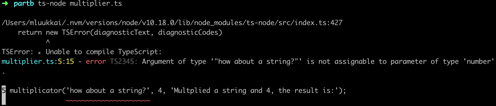


One of the best things in TypeScript's editor support is that you don't necessarily need to even run the code to see the issues. 
The VSCode plugin is so efficient, that it informs you immediately when you are trying to use an incorrect type:

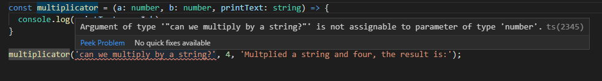

### Creating your first own types

Let's expand our multiplicator into a slightly more versatile calculator that also supports addition and division. The calculator should accept three arguments: two numbers and the operation, either <i>multiply</i>, <i>add</i> or <i>divide</i>, which tells it what to do with the numbers.

In JavaScript, the code would require additional validation to make sure the last argument is indeed a string. TypeScript offers a way to define specific types for inputs, which describe exactly what type of input is acceptable. On top of that, TypeScript can also show the info of the accepted values already at editor level. 

We can create a <i>type</i> using the TypeScript native keyword <i>type</i>. Let's describe our type <i>Operation</i>:

```js
type Operation = 'multiply' | 'add' | 'divide';
```

Now the <i>Operation</i> type accepts only three kinds of input; exactly the three strings we wanted. 
Using the OR operator _|_ we can define a variable to accept multiple values by creating a [union type](https://www.typescriptlang.org/docs/handbook/advanced-types.html#union-types).
In this case, we used exact strings (that, in technical terms, are called [string literal types](http://www.typescriptlang.org/docs/handbook/advanced-types.html#string-literal-types)) but with unions, you could also make the compiler accept for example both string and number: _string | number_.

The <i>type</i> keyword defines a new name for a type: [a type alias](https://www.typescriptlang.org/docs/handbook/advanced-types.html#type-aliases). Since the defined type is a union of three possible values, it is handy to give it an alias that has a representative name.

Let's look at our calculator now:

```js
type Operation = 'multiply' | 'add' | 'divide';

const calculator = (a: number, b: number, op : Operation) => {
  if (op === 'multiply') {
    return a * b;
  } else if (op === 'add') {
    return a + b;
  } else if (op === 'divide') {
    if (b === 0) return 'can\'t divide by 0!';
    return a / b;
  }
}
```

Now, when we hover on top of the <i>Operation</i> type in the calculator function, we can immediately see suggestions on what to do with it:

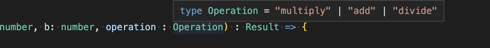

And if we try to use a value that is not within the <i>Operation</i> type, we get the familiar red warning signal and extra info from our editor:

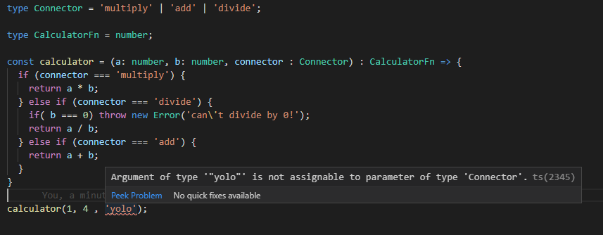

This is already pretty nice, but one thing we haven't touched yet is typing the return value of a function. Usually, you want to know what a function returns, and it would be nice to have a guarantee that it actually returns what it says it does. Let's add a return value <i>number</i> to the calculator function:

```js
type Operation = 'multiply' | 'add' | 'divide';

const calculator = (a: number, b: number, op: Operation): number => {

  if (op === 'multiply') {
    return a * b;
  } else if (op === 'add') {
    return a + b;
  } else if (op === 'divide') {
    if (b === 0) return 'this cannot be done';
    return a / b;
  }
}
```

The compiler complains straight away because, in one case, the function returns a string. There are couple of ways to fix this: 
we could extend the return type to allow string values, like so:

```js
const calculator = (a: number, b: number, op: Operation): number | string =>  {
  // ...
}
```

Or we could create a return type which includes both possible types, much like our Operation type:

```js
type Result = string | number;

const calculator = (a: number, b: number, op: Operation): Result =>  {
  // ...
}
```

But now  the question is if it's <i>really</i> okay for the function to return a string?

When your code can end up in a situation where something is divided by 0, something has probably gone terribly wrong and an error should be thrown and handled where the function was called.
When you are deciding to return values you weren't originally expecting, the warnings you see from TypeScript prevent you from making rushed decisions and help you to keep your code working as expected.


One more thing to consider is, that even though we have defined types for our parameters, the generated JavaScript used at runtime does not contain the type checks.
So if, for example, the <i>operation</i> parameter's value comes from an external interface, there is no definite guarantee that it will be one of the allowed values. Therefore, it's still better to include error handling and be prepared for the unexpected to happen. 
In this case, when there are multiple possible accepted values and all unexpected ones should result in an error, the [switch...case](https://developer.mozilla.org/en-US/docs/Web/JavaScript/Reference/Statements/switch) statement suits better than if...else in our code.

The code of our calculator should actually look something like this:

```js
type Operation = 'multiply' | 'add' | 'divide';

type Result = number;

const calculator = (a: number, b: number, op: Operation) : Result => {
  switch(op) {
    case 'multiply':
      return a * b;
    case 'divide':
      if (b === 0) throw new Error('Can\'t divide by 0!');
      return a / b;
    case 'add':
      return a + b;
    default:
      throw new Error('Operation is not multiply, add or divide!');
  }
}

try {
  console.log(calculator(1, 5 , 'divide'));
} catch (error: unknown) {
  let errorMessage = 'Something went wrong.'
  if (error instanceof Error) {
    errorMessage += ' Error: ' + error.message;
  }
  console.log(errorMessage);
}
```

<!-- The programs we've written are alright, but it sure would be better if there were a way to use command line arguments instead of always having to change the code to calculate different things. Let's try it out, as we would in a regular Node application, by accessing <i>process.argv</i>. But something is not right: -->
As of TypeScript 4.0, <i>catch</i> blocks allow you to specify the type of catch clause variables. Pre-4.4, all <i>catch</i> clause variables were of type <i>any</i>. However, with the release of 4.4, the default type is <i>unknown</i>. The [unknown](https://www.typescriptlang.org/docs/handbook/release-notes/typescript-3-0.html#new-unknown-top-type) is a kind of top type that was introduced in TypeScript version 3 to be the type-safe counterpart of <i>any</i>. Anything is assignable to <i>unknown</i>, but <i>unknown</i> isn’t assignable to anything but itself and <i>any</i> without a type assertion or a control flow-based narrowing. Likewise, no operations are permitted on an <i>unknown</i> without first asserting or narrowing to a more specific type.

The programs we have written are alright, but it sure would be better if we could use command-line arguments instead of always having to change the code to calculate different things.  
Let's try it out, as we would in a regular Node application, by accessing <i>process.argv</i>.
But something is not right:

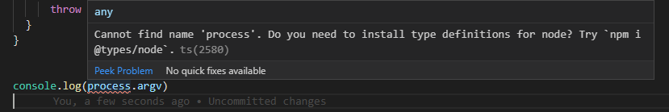

### @types/{npm_package}

Let's return to the basic idea of TypeScript. TypeScript expects all globally-used code to be typed, as it does for your own code when your project has a reasonable configuration. The TypeScript library itself contains only typings for the code of the TypeScript package. It is possible to write your own typings for a library, but that is almost never needed - since the TypeScript community has done it for us!

<!-- As in the world of npm, TypeScript also celebrates open source code and the community around it is active and continuously reacting to updates and changes in commonly used npm-packages. That is why the typings for npm-packages are almost always to be found, so that you won't be alone creating types for all of your thousands of dependencies. -->
As with npm, the TypeScript world also celebrates open-source code. The community is active and continuously reacting to updates and changes in commonly-used npm packages.  
You can almost always find the typings for npm packages, so you don't have to create types for all of your thousands of dependencies alone.

<!-- Usually types for existing packages can be found by under the <i>@types</i>-organization within npm, so that you can add the relevant types to your project by installing an npm package with the name of your package with a @types/ - prefix, for example:<i>npm install --save-dev @types/react @types/express @types/lodash @types/jest @types/mongoose</i> and the list goes on and on. The <i>@types/*</i> are maintained by [Definitely typed](http://definitelytyped.org/), a community project with the goal to maintaining types of everything in one place. -->
Usually, types for existing packages can be found from the <i>@types</i> organization within npm, and you can add the relevant types to your project by installing an npm package with the name of your package with a @types/ prefix. For example: <i>npm install --save-dev @types/react @types/express @types/lodash @types/jest @types/mongoose</i> and so on and so on. The <i>@types/*</i> are maintained by [Definitely typed](http://definitelytyped.org/), a community project with the goal of maintaining types of everything in one place.

Sometimes, an npm package can also include its types within the code and, in that case, installing the corresponding <i>@types/*</i> is not necessary.

> **NB:** Since the typings are only used before compilation, the typings are not needed in the production build and they should <i>always</i> be in the devDependencies of the package.json.

Since the global variable <i>process</i> is defined by Node itself, we get its typings by installing the package <i>@types/node</i>:

```shell
npm install --save-dev @types/node
```

After installing the types, our compiler does not complain about the variable <i>process</i> anymore. Note that there is no need to require the types to the code, the installation of the package is enough!

### Improving the project

<!-- Let us now add npm scripts with which we can run our two programs <i>multiplier</i> and <i>calculator</i>: -->
Next, let's add npm scripts to run our two programs <i>multiplier</i> and <i>calculator</i>:

```json
{
  "name": "part1",
  "version": "1.0.0",
  "description": "",
  "main": "index.js",
  "scripts": {
    "ts-node": "ts-node",
    "multiply": "ts-node multiplier.ts", // highlight-line
    "calculate": "ts-node calculator.ts" // highlight-line
  },
  "author": "",
  "license": "ISC",
  "devDependencies": {
    "ts-node": "^8.6.2",
    "typescript": "^3.8.2"
  }
}
```

<!-- We can now get the multipier to work with command line parameters with the following changes -->
We can get the multiplier to work with command-line parameters with the following changes:

```js
const multiplicator = (a: number, b: number, printText: string) => {
  console.log(printText,  a * b);
}

const a: number = Number(process.argv[2])
const b: number = Number(process.argv[3])
multiplicator(a, b, `Multiplied ${a} and ${b}, the result is:`);
```

And we can run it with:

```shell
npm run multiply 5 2
```

If the program is run with parameters that are not of the right type, e.g.

```shell
npm run multiply 5 lol
```

it "works" but gives us the answer:

```shell
Multiplied 5 and NaN, the result is: NaN
```

<!-- The reason for this is that the <i>Number('lol')</i> returns <i>NaN</i> which actually has the type <i>number</i> so TypeScript has no power to rescue from this kind of situation.  -->
The reason for this is, that <i>Number('lol')</i> returns <i>NaN</i>, 
which is actually type <i>number</i>, so TypeScript has no power to rescue  us from this kind of situation.

<!-- In order to save us from this kind of behavior, we have to validate the data that is given to us as in command line.  -->
In order to prevent this kind of behaviour, we have to validate the data given to us from the command line.

The improved version of the multiplicator looks like this:

```js
interface MultiplyValues {
  value1: number;
  value2: number;
}

const parseArguments = (args: Array<string>): MultiplyValues => {
  if (args.length < 4) throw new Error('Not enough arguments');
  if (args.length > 4) throw new Error('Too many arguments');

  if (!isNaN(Number(args[2])) && !isNaN(Number(args[3]))) {
    return {
      value1: Number(args[2]),
      value2: Number(args[3])
    }
  } else {
    throw new Error('Provided values were not numbers!');
  }
}

const multiplicator = (a: number, b: number, printText: string) => {
  console.log(printText,  a * b);
}

try {
  const { value1, value2 } = parseArguments(process.argv);
  multiplicator(value1, value2, `Multiplied ${value1} and ${value2}, the result is:`);
} catch (error: unknown) {
  let errorMessage = 'Something bad happened.'
  if (error instanceof Error) {
    errorMessage += ' Error: ' + error.message;
  }
  console.log(errorMessage);
}
```

When we now run the program:

```shell
npm run multiply 1 lol
```

we get a proper error message:

```shell
Something bad happened. Error: Provided values were not numbers!
```

The definition of the function <i>parseArguments</i> has a couple of interesting things:

```js
const parseArguments = (args: Array<string>): MultiplyValues => {
  // ...
}
```

Firstly,  the parameter <i>args</i> is an [array](http://www.typescriptlang.org/docs/handbook/basic-types.html#array) of strings. The return value has the type <i>MultiplyValues</i>, which is defined as follows:

```js
interface MultiplyValues {
  value1: number;
  value2: number;
}
```

<!-- Definition utilizes TypeScript [Interface](http://www.typescriptlang.org/docs/handbook/interfaces.html) that is one way to define what "shape" an object should have. In our case, it is quite obvious that return values should be objects that have properties <i>value1</i> and <i>value2</i> that both have type number. -->
The definition utilizes TypeScript's [Interface](http://www.typescriptlang.org/docs/handbook/interfaces.html) keyword, which is one way to define the "shape" an object should have. 
In our case it is quite obvious that the return value should be an object with the two properties <i>value1</i> and <i>value2</i>, which should both be of type number. 

</div>

<div class="tasks">

### Exercises 9.1.-9.3.

#### setup

Exercises 9.1.-9.7. will all be made in the same node project. Create the project in an empty directory with <i>npm init</i> and install the ts-node and typescript packages. Create also the file <i>tsconfig.json</i> in the directory with the following content:

```json
{
  "compilerOptions": {
    "noImplicitAny": true,
  }
}
```

The <i>tsconfig.json</i> file is used to define how the TypeScript compiler should interpret the code, how strictly the compiler should work, which files to watch or ignore, and [much much more](https://www.typescriptlang.org/docs/handbook/tsconfig-json.html).
For now we will only use the compiler option [noImplicitAny](https://www.typescriptlang.org/tsconfig#noImplicitAny), that makes it mandatory to have types for all variables used.

#### 9.1 Body mass index

Create the code of this exercise in file <i>bmiCalculator.ts</i>.

Write a function <i>calculateBmi</i> that calculates a [BMI](https://en.wikipedia.org/wiki/Body_mass_index) based on a given height (in centimeters) and weight (in kilograms) and then returns a message that suits the results. 

Call the function in the same file with hard-coded parameters and print out the result. The code

```js
console.log(calculateBmi(180, 74))
```

should print the following message:

```shell
Normal (healthy weight)
```

Create a npm script for running the program with command <i>npm run calculateBmi</i>.

#### 9.2 Exercise calculator

Create the code of this exercise in file <i>exerciseCalculator.ts</i>.

Write a function <i>calculateExercises</i> that calculates the average time of <i>daily exercise hours</i> and compares it to the <i>target amount</i> of daily hours and returns an object that includes the following values:

  - the number of days
  - the number of training days
  - the original target value
  - the calculated average time
  - boolean value describing if the target was reached
  - a rating between the numbers 1-3 that tells how well the hours are met. You can decide on the metric on your own.
  - a text value explaining the rating

The daily exercise hours are given to the function as an [array](https://www.typescriptlang.org/docs/handbook/basic-types.html#array) that contains the number of exercise hours for each day in the training period. Eg. a week with 3 hours of training on Monday, none on Tuesday, 2 hours on Wednesday, 4.5 hours on Thursday and so on would be represented by the following array:

```js
[3, 0, 2, 4.5, 0, 3, 1]
```

For the Result object, you should create an [interface](https://www.typescriptlang.org/docs/handbook/interfaces.html).

If you call the function with parameters <i>[3, 0, 2, 4.5, 0, 3, 1]</i> and <i>2</i>, it should return:

```js
{ periodLength: 7,
  trainingDays: 5,
  success: false,
  rating: 2,
  ratingDescription: 'not too bad but could be better',
  target: 2,
  average: 1.9285714285714286 }
```

Create a npm script, <i>npm run calculateExercises</i>, to call the function with hard-coded values.

#### 9.3 Command line

Change the previous exercises so that you can give the parameters of <i>bmiCalculator</i> and <i>exerciseCalculator</i> as command-line arguments.

Your program could work eg. as follows:

```shell
$ npm run calculateBmi 180 91

Overweight
```

and:

```shell
$ npm run calculateExercises 2 1 0 2 4.5 0 3 1 0 4

{ periodLength: 9,
  trainingDays: 6,
  success: false,
  rating: 2,
  ratingDescription: 'not too bad but could be better',
  target: 2,
  average: 1.7222222222222223 }
```

In the example, the <i>first argument</i> is the target value.

Handle exceptions and errors appropriately. The exerciseCalculator should accept inputs of varied lengths. Determine by yourself how you manage to collect all needed input.

</div>

<div class="content">

### More about tsconfig

<!-- In the exercises we used only one tsconfig rule: [noImplicitAny](https://www.typescriptlang.org/v2/en/tsconfig#noImplicitAny) which is a good place to start but now it is time to start looking into the file a little bit deeper. -->
In the exercises, we used only one tsconfig rule [noImplicitAny](https://www.typescriptlang.org/tsconfig#noImplicitAny). It's a good place to start, but now it's time to look into the config file a little deeper.

<!-- [tsconfig.json](https://www.typescriptlang.org/docs/handbook/tsconfig-json.html) includes all your core configurations on how you want TypeScript to work in your project. In tsconfig.json you can define how strictly you want the code to be inspected, what files to include, what files to exclude (<i>node_modules</i> is excluded by default), and where compiled files should be placed (more on this later).  -->
The [tsconfig.json](https://www.typescriptlang.org/docs/handbook/tsconfig-json.html) file contains all your core configurations on how you want TypeScript to work in your project. 
You can define how strictly you want the code to be inspected, what files to include and exclude (<i>node_modules</i> is excluded by default), and where compiled files should be placed (more on this later).

<!-- Let us now use <i>tsconfig.json</i> that has the following form: -->
Let's specify the following configurations in our <i>tsconfig.json</i> file:

```json
{
  "compilerOptions": {
    "target": "ES2020",
    "strict": true,
    "noUnusedLocals": true,
    "noUnusedParameters": true,
    "noImplicitReturns": true,
    "noFallthroughCasesInSwitch": true,
    "esModuleInterop": true,
    "moduleResolution": "node"
  }
}
```

Do not worry too much about the <i>compilerOptions</i>; they will be under closer inspection later on.

You can find explanations for each of the configurations from the TypeScript documentation, or from the really handy [tsconfig page](https://www.staging-typescript.org/tsconfig), or from the tsconfig [schema definition](http://json.schemastore.org/tsconfig), which unfortunately is formatted a little worse than the first two options. 

### Adding express to the mix

Right now, we are in a pretty good place. Our project is set up and we have two executable calculators in it. 
However, since our aim is to learn FullStack development, it is time to start working with some HTTP requests.

Let us start by installing express:

```
npm install express
```

and then add the <i>start</i> script to package.json:

```json
{
  // ..
  "scripts": {
    "ts-node": "ts-node",
    "multiply": "ts-node multiplier.ts",
    "calculate": "ts-node calculator.ts",
    "start": "ts-node index.ts" // highlight-line
  },
  // ..
}
```

Now we can create the file <i>index.ts</i>, and write the HTTP GET <i>ping</i> endpoint to it:

```js
const express = require('express');
const app = express();

app.get('/ping', (req, res) => {
  res.send('pong');
});

const PORT = 3003;

app.listen(PORT, () => {
  console.log(`Server running on port ${PORT}`);
});
```

Everything else seems to be working just fine but, as you'd expect, the <i>req</i> and  <i>res</i> parameters of <i>app.get</i> need typing.
If you look carefully, VSCode is also complaining about something to do with importing express. You can see a short yellow line of dots under the <i>require</i>. Let's hover over the problem:

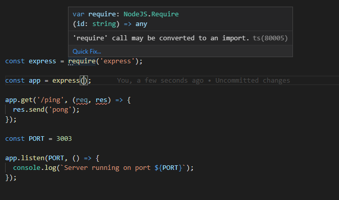

The complaint is that the <i>'require' call may be converted to an import</i>. Let us follow the advice and write the import as follows:

```js
import express from 'express';
```

**NB**: VSCode offers you a possibility to fix the issues automatically by clicking the <i>Quick Fix...</i> button.
Keep your eyes open for these helpers/quick fixes; listening to your editor usually makes your code better and easier to read. 
The automatic fixes for issues can be a major time saver as well. 

Now we run into another problem - the compiler complains about the import statement. 
Once again, the editor is our best friend when trying to find out what the issue is:

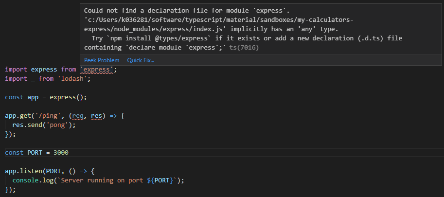

We haven't installed types for <i>express</i>. 
Let's do what the suggestion says and run:

```
npm install --save-dev @types/express
```

And no more errors! Let's take a look at what changed.

When we hover over the <i>require</i> statement, we can see the compiler interprets everything express-related to be of type <i>any</i>.

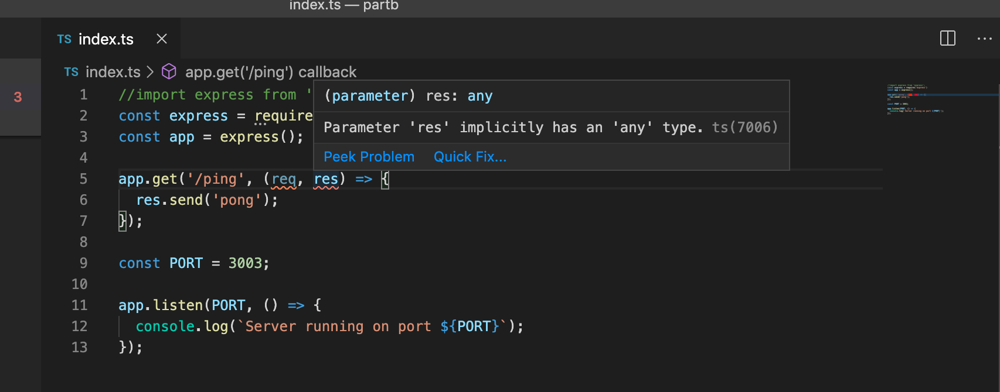

Whereas when we use <i>import</i>, the editor knows the actual types:

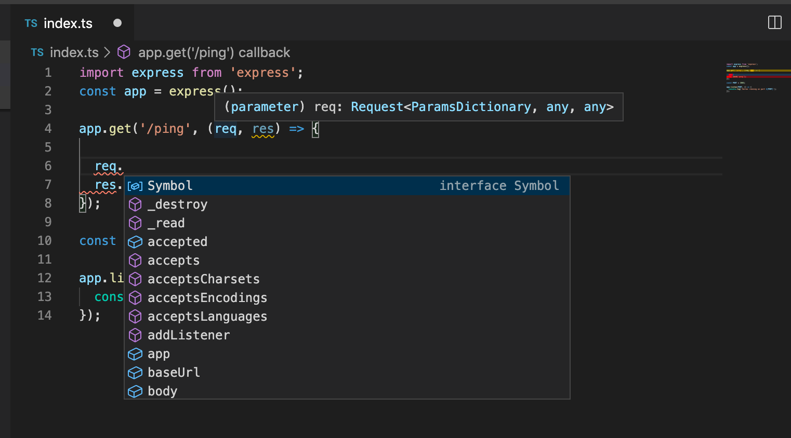

Which import statement to use depends on the export method used in the imported package. 

A good rule of thumb is to try importing a module using the <i>import</i> statement first. We will always use this method in the <i>frontend</i>. 
If  <i>import</i> does not work, try a combined method: <i>import ... = require('...')</i>.

We strongly suggest you read more about TypeScript modules [here](https://www.typescriptlang.org/docs/handbook/modules.html).

There is one more problem with the code:

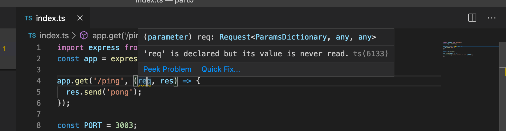

This is because we banned unused parameters in our <i>tsconfig.json</i>:

```js
{
  "compilerOptions": {
    "target": "ES2020",
    "strict": true,
    "noUnusedLocals": true,
    "noUnusedParameters": true, // highlight-line
    "noImplicitReturns": true,
    "noFallthroughCasesInSwitch": true,
    "esModuleInterop": true
  }
}
```

<!-- This configuration might create problems when we have library-wide predefined functions, that like in this case require declaring a variable, even though in the code it is not necessarily required to use at all. Fortunately this issue has already been solved at the configuration level and once again hovering on the issue gives us a solution for the problem, this time by clicking the quick fix button:  -->
This configuration might create problems if you have library-wide predefined functions which require declaring a variable even if it's not used at all, as is the case here. 
Fortunately, this issue has already been solved on configuration level. 
Once again hovering over the issue gives us a solution. This time we can just click the quick fix button:

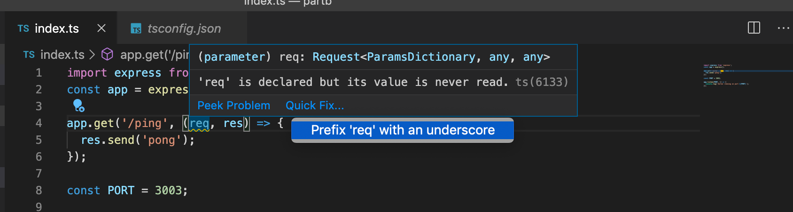

<!-- If it is absolutely impossible to get rid of an unused variable, you should prefix it with an underscore to inform the compiler that this has been taken into consideration and there is nothing we can do about it.  -->
If it is absolutely impossible to get rid of an unused variable, you can prefix it with an underscore to inform the compiler you have thought about it and there is nothing you can do. 

Let's rename the <i>req</i> variable to <i>_req</i>.
 <!-- Now we are finally ready to start up the application, and it seems to work fine: -->
 Finally we are ready to start the application. It seems to work fine:


<!-- Now to simplify the development we should enable <i>auto reloading</i> to improve our workflow. In this course you have already used <i>nodemon</i>, but ts-node has an alternative called <i>ts-node-dev</i> which is meant only for development environment that takes care of recompilation on every change so restarting the application won't be necessary. -->
To simplify the development, we should enable <i>auto-reloading</i> to improve our workflow. In this course, you have already used <i>nodemon</i>, but ts-node has an alternative called <i>ts-node-dev</i>. It is meant to be used only with a development environment which takes care of recompilation on every change, so restarting the application won't be necessary.

Let's install <i>ts-node-dev</i> to our development dependencies:

```
npm install --save-dev ts-node-dev
```

Add a script to <i>package.json</i>:

```json
{
  // ...
  "scripts": {
      // ...
      "dev": "ts-node-dev index.ts", // highlight-line
  },
  // ...
}
```

And now, by running <i>npm run dev</i>, we have a working, auto-reloading development environment for our project!

</div>

<div class="tasks">

### Exercises 9.4.-9.5.

#### 9.4 Express

Add express to your dependencies and create an HTTP GET endpoint <i>hello</i> that answers 'Hello Full Stack!'

The web app should be started with commands <i>npm start</i> in production mode and <i>npm run dev</i> in development mode. The latter should also use <i>ts-node-dev</i> to run the app.

Replace also your existing <i>tsconfig.json</i> file with the  following content:

```json
{
  "compilerOptions": {
    "noImplicitAny": true,
    "noImplicitReturns": true,
    "strictNullChecks": true,
    "strictPropertyInitialization": true,
    "strictBindCallApply": true,
    "noUnusedLocals": true,
    "noUnusedParameters": true,
    "noImplicitThis": true,
    "alwaysStrict": true,
    "esModuleInterop": true,
    "declaration": true,
  }
}
```

Make sure there aren't any errors!

#### 9.5 WebBMI

Add an endpoint for the BMI calculator that can be used by doing an HTTP GET request to endpoint <i>bmi</i> and specifying the input with [query string parameters](https://en.wikipedia.org/wiki/Query_string). For example, to get the BMI of a person having height 180 and weight 72, the url is http://localhost:3002/bmi?height=180&weight=72.

The response is a json of the form:

```js
{
  weight: 72,
  height: 180,
  bmi: "Normal (healthy weight)"
}
```

See the [express documentation](http://expressjs.com/en/5x/api.html#req.query) for info on how to access the query parameters.

If the query parameters of the request are of the wrong type or missing, a response with proper status code and error message is given:

```js
{
  error: "malformatted parameters"
}
```

Do not copy the calculator code to file <i>index.ts</i>; instead, make it a [typescript module](https://www.typescriptlang.org/docs/handbook/modules.html) that can be imported in <i>index.ts</i>.

</div>

<div class="content">

### The horrors of <i>any</i>

Now that we have our first endpoints completed, you might notice we have used barely any TypeScript in these small examples. 
When examining the code a bit closer, we can see a few dangers lurking there.


Let's add the HTTP POST endpoint <i>calculate</i> to our app:

```js
import { calculator } from './calculator'

// ...

app.post('/calculate', (req, res) => {
  const { value1, value2, op } = req.body

  const result = calculator(value1, value2, op);
  res.send(result);
});

```

When you hover over the <i>calculate</i> function, you can see the typing of the <i>calculator</i> even though the code itself does not contain any typings:

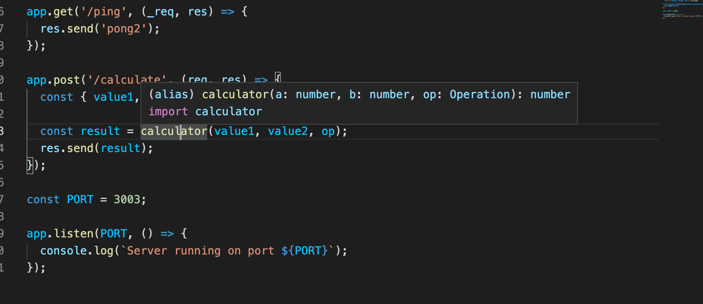

But if you hover over the values parsed from the request, an issue arises:


All of the variables have type <i>any</i>. It is not all that surprising, as no one has given them a type yet. There are a couple of ways to fix this, but first, we have to consider why this is accepted and where the type <i>any</i> came from.

In TypeScript, every untyped variable whose type cannot be inferred implicitly becomes type [any](http://www.typescriptlang.org/docs/handbook/basic-types.html#any). Any is a kind of "wild card" type which literally stands for <i>whatever</i> type. 
Things become implicitly any type quite often when one forgets to type functions. 

We can also explicitly type things <i>any</i>. The only difference between implicit and explicit any type is how the code looks; the compiler does not care about the difference. 

Programmers however see the code differently when <i>any</i> is explicitly enforced than when it is implicitly inferred. 
Implicit <i>any</i> typings are usually considered problematic, since it is quite often due to the coder forgetting to assign types (or being too lazy to do it), and it also means that the full power of TypeScript is not properly exploited. 

This is why the configuration rule [noImplicitAny](https://www.typescriptlang.org/v2/en/tsconfig#noImplicitAny) exists on compiler level, and it is highly recommended to keep it on at all times. 
In the rare occasions when you truly cannot know what the type of a variable is, you should explicitly state that in the code:

```js
const a : any = /* no clue what the type will be! */.
```

We already have <i>noImplicitAny</i> configured in our example, so why does the compiler not complain about the implicit <i>any</i> types?
The reason is that the <i>query</i> field of an express [Request](https://expressjs.com/en/5x/api.html#req) object is explicitly typed <i>any</i>. The same is true for the <i>request.body</i> field we use to post data to an app. 


What if we would like to prevent developers from using <i>any</i> type at all? Fortunately, we have other methods than <i>tsconfig.json</i> to enforce coding style. What we can do is  use <i>eslint</i> to manage
our code. 
Let's install eslint and its TypeScript extensions:

```shell
npm install --save-dev eslint @typescript-eslint/eslint-plugin @typescript-eslint/parser
```

We will configure eslint to [disallow explicit any]( https://github.com/typescript-eslint/typescript-eslint/blob/master/packages/eslint-plugin/docs/rules/no-explicit-any.md). Write the following rules to <i>.eslintrc</i>:

```json
{
  "parser": "@typescript-eslint/parser",
  "parserOptions": {
    "ecmaVersion": 11,
    "sourceType": "module"
  },
  "plugins": ["@typescript-eslint"],
  "rules": {
    "@typescript-eslint/no-explicit-any": 2 // highlight-line
  }
}
```

(Newer versions of eslint has this rule on by default, so you don't necessarily need to add it separately.)

Let us also set up a <i>lint</i> npm script to inspect the files with <i>.ts</i> extension by modifying the <i>package.json</i> file: 

```json
{
  // ...
  "scripts": {
      "start": "ts-node index.ts",
      "dev": "ts-node-dev index.ts",
      "lint": "eslint --ext .ts ." // highlight-line
      //  ...
  },
  // ...
}
```

Now lint will complain if we try to define a variable of type <i>any</i>:

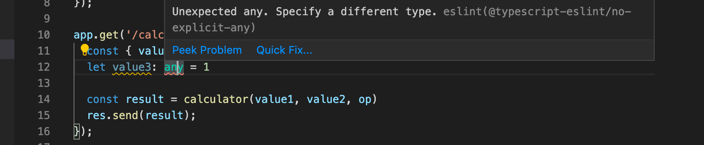


[@typescript-eslint](https://github.com/typescript-eslint/typescript-eslint) has a lot of TypeScript-specific eslint rules, but you can also use all basic eslint rules in TypeScript projects. 
For now, we should probably go with the recommended settings, and we will modify the rules as we go along whenever we find something we want to change the behavior of.

On top of the recommended settings, we should try to get familiar with the coding style required in this part and <i>set the semicolon at the end of each line of code to required</i>.

So we will use the following <i>.eslintrc</i>

```json
{
  "extends": [
    "eslint:recommended",
    "plugin:@typescript-eslint/recommended",
    "plugin:@typescript-eslint/recommended-requiring-type-checking"
  ],
  "plugins": ["@typescript-eslint"],
  "env": {
    "node": true,
    "es6": true
  },
  "rules": {
    "@typescript-eslint/semi": ["error"],
    "@typescript-eslint/explicit-function-return-type": "off",
    "@typescript-eslint/explicit-module-boundary-types": "off",
    "@typescript-eslint/restrict-template-expressions": "off",
    "@typescript-eslint/restrict-plus-operands": "off",
    "@typescript-eslint/no-unused-vars": [
      "error",
      { "argsIgnorePattern": "^_" }
    ],
    "no-case-declarations": "off"
  },
  "parser": "@typescript-eslint/parser",
  "parserOptions": {
    "project": "./tsconfig.json"
  }
}
```

<!-- There are quite a few missing semicolons but those are easy to add. -->
There are quite a few semicolons missing, but those are easy to add.

And now let's fix everything that needs to be fixed!

</div>

<div class="tasks">

### Exercises 9.6.-9.7.

#### 9.6 Eslint

Configure your project to use the above eslint settings and fix all the warnings.

#### 9.7 WebExercises

Add an endpoint to your app for the exercise calculator. It should be used by doing an HTTP POST request to endpoint <i>exercises</i> with the input in the request body:

```js
{
  "daily_exercises": [1, 0, 2, 0, 3, 0, 2.5],
  "target": 2.5
}
```

The response is a json of the following form:

```js
{
    "periodLength": 7,
    "trainingDays": 4,
    "success": false,
    "rating": 1,
    "ratingDescription": "bad",
    "target": 2.5,
    "average": 1.2142857142857142
}
```

If the body of the request is not of the right form, a response with proper status code and error message is given. The error message is either

```js
{
  error: "parameters missing"
}
```

or

```js
{
  error: "malformatted parameters"
}
```

depending on the error. The latter happens if the input values do not have the right type, i.e. they are not numbers or convertable to numbers.

In this exercise, you might find it beneficial to use the <i>explicit any</i> type when handling the data in the request body. Our eslint configuration is preventing this but you may unset this rule for a particular line by inserting the following comment as the previous line:

```js
// eslint-disable-next-line @typescript-eslint/no-explicit-any
```

You might also get in trouble with rules <i>no-unsafe-member-access</i> and <i>no-unsafe-assignment </i>. These rules may be ignored in this exercise.

Note that you need to have a correct setup in order to get hold of the request body; see [part 3](/en/part3/node_js_and_express#receiving-data).

</div>
