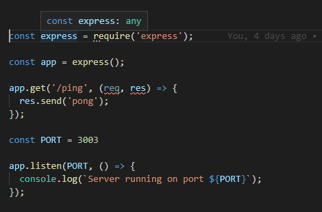
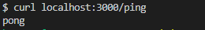
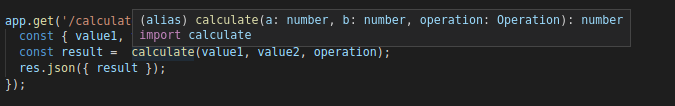
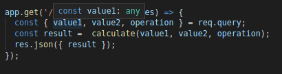

<div class="content">

First things first: Install TypeScript support to your IDE of choice. For [Visual Studio Code](https://code.visualstudio.com/)  you need the [typescript hero](https://marketplace.visualstudio.com/items?itemName=rbbit.typescript-hero) extension.

As mentioned before, TypeScript code is not runnable by itself, but it first needs to be compiled into runnable JavaScript code. When TypeScript is compiled into JavaScript, the code becomes subject for type erasure. This means that type annotations, interfaces, type aliases, and other type system constructs are removed from the code and the result is pure ready-to-run JavaScript.

In a production environment this need for compilation often means that you need to setup a "build step", where all TypeScript code is compiled into JavaScript in a separate folder, and the production enviroment then runs the code from that folder. In a development environment it is often more handy to take use of real-time compilation and auto-reloading, in order to be able to see the resulting changes faster.


Let's start writing our first TypeScript-app. To keep things simple, let's start by using the npm package [ts-node](https://github.com/TypeStrong/ts-node), that compiles and executes the desired TypeScript file immediately, so that there is no need for the separate compilation step.

To use _ts-node_ you need to install it globally with the official _typescript_ package by running _npm install -g ts-node typescript_ . 

If you can't or don't want to install global packages you can also create an npm project that has the required dependencies and run your scripts in it. You can do this by running :`npm init_ to create an empty project and then run:

```
npm install ts-node typescript
```

And set up _scripts_ within the package.json file to include: 

```json
{
  // ..
  "scripts": {
    "ts-node": "ts-node" // highlight-line
  },
  // ..
}
```

and now within this package you can use _ts-node_ by running _npm run ts-node_. Notice that if you are using ts-node through package.json, all possible command line arguments for the script need to be prefixed with _--_. So if you want to run file.ts with _ts-node_, the whole command is:

```sh
npm run ts-node -- file.ts
```

It is worth mentioning, that TypeScript also provides an online playground, where you can quickly try out TypeScript code and also instantly see the resulting JavaScript code next to the TypeScript code, and also possible compilation errors. You can access TypeScript's official playground [here](https://www.typescriptlang.org/play/index.html).

**Notice:** The playground might contain different tsconfig rules (which will be introduced later) than your local environment, which is why you might see different warnings there, compared to your local environment. The playgrounds tsconfig is modifiable through the config dropdown menu.

> **Sidenote:** JavaScript in itself is a fairly loose language and things often can be done in multiple different ways, for example named vs anonymous functions, using const and let or var and the use of *semicolons*. In this part of the course by default semicolons will be used. It is not a TypeScript specific pattern but a general coding style decision when creating any kind of JavaScript. Whether to use them or not is usually in the hands of the programmer but since it is expected to adapt ones coding habits to the existing codebase, **in the exercises of this part it is expected to use semicolons and to adjust to the coding style of the part**.

Now, let's start by creating a simple Multiplier, exactly as you would in JavaScript.

```js
const multiplicator = (a, b, printText) => {
  console.log(printText,  a * b);
}

multiplicator(1, 4, 'Multiplied numbers 1 and four, the result is:');

```

As we can see, this is still ordinary basic JavaScript with no additional TS features and it compiles and runs nicely with _ts-node multiplier.ts_ (or if using an npm package _npm run ts-node -- multiplier.ts`), as it would with Node. But what happens if we end up passing wrong _types_ of arguments to the multiplicator function?

Let's try it out!

```js
const multiplicator = (a, b, printText) => {
  console.log(printText,  a * b);
}

multiplicator('can we multiply by a string?', 4, 'Multiplied a string and four, the result is:');

```

Now when running the code, both examples still produce the same output, which is now:
`Multiplied a string and four, the result is: NaN_. Wouldn't it be nice if there was a way that the language itself could prevent us from ending up in situations like this?

This is where we get the first benefits of TypeScript into use. Let's add types to the parameters and see where it takes us.

TypeScript natively supports multiple types including _number_, _string_, _Array_, _null_, _any_, _enum_, see the comprehensive list [here](https://www.typescriptlang.org/docs/handbook/basic-types.html).

More complex custom types can also be created and almost always, except maybe when your application is really tiny or a simple proof-of-concept, they are needed.

```js
const multiplicator = (a: number, b: number, printText: string) => {
  console.log(printText,  a * b);
}

multiplicator('can we multiply by a string?', 4,i 'Multplied a string and four, the result is:');

```

Now the code is no longer valid JavaScript, but in fact TypeScript. Try running the code once again, and see what happens.

An error is immediately seen and the obviously faulty code can also be found straight away.

One of the best things in TypeScript's IDE support is that you don't necessarily need to even run the code to see the issues recognized by TypeScript. The VSCode plugin is so efficient, that it informs you immediately when you are trying to use an incorrect type, where another type is expected. There should be red underlining under the faulty input and when you hover your cursor on top of that, you should see the following error message:


</div>

<div class="tasks">

### Exercises

**Before you start doing the exercises** create a file called tsconfig.json to the folder you will do the exercises in with the following content:

```json
{
  "compilerOptions": {
    "noImplicitAny": true,
  }
}
```

tsconfig.json can include various information for the TypeScript compiler on how to inpertret the code, how strictly should the compilator work and on what files to watch or ignore, and [much more](https://www.typescriptlang.org/docs/handbook/tsconfig-json.html). Right now let's only use the compiler option "noImplicitAny", which makes it mandatory to have types for all variables used.

#### 9.1

Write your first TypeScript file that counts [BMI](https://en.wikipedia.org/wiki/Body_mass_index) based on given weight and height and then prints out a message that suits the results. The arguments can be hard-coded and command line arguments shouldn't be used in this exercise.

The file should work by running _ts-node bmiCalculator.ts_, the calculation function and its accepted arguments should all be typed and necessary error cases should be handled appropriately.

Example run: 

```sh
$ ts-node 01.01bmiCalculator.ts

Slightly too much weight
```

</div>

<div class="content">


### Creating your first own Types

Let's expand our multiplicator and create a little bit more useful calculator, that also supports addition and division. The calculator should accept three arguments: Two numbers and then the operation, which tells the calculator what to do with those numbers; either 'multiply', 'add' or 'divide'.

With basic JavaScript, this type of code, where trusting a string to be specific form, would require additional validation, but TypeScript offers us a way to define specific types for the inputs, which describes exactly what type of inputs to accept. On top of that, TypeScript can also show the info of the accepted values already on IDE level.

To create our _type_ we use the TypeScript native keyword _type_ to describe what we want to accept. Let's describe our type _Operation`:

```js
type Operation = 'multiply' | 'add' | 'divide';
```

Now the _Operation_ type accepts only three kinds of input; exactly the three wanted strings. With the OR operator _|_ we can define a variable to accept multiple values by creating a [union type](https://www.typescriptlang.org/docs/handbook/advanced-types.html#union-types). In this case we used exact strings but with unions you could also inform the compiler to accept for example both string and number _string | number_.

In techincal terms the keyword _type_ creates [a type alias](https://www.typescriptlang.org/docs/handbook/advanced-types.html#type-aliases), that is a new name for a type. Since the defined type is a union of three possible values, it is handy to give it an alias that has a representative name.

Let's look at our calculator now:

```js
type Operation = 'multiply' | 'add' | 'divide';

const calculator = (a: number, b: number, operation : Operation) => {
  if (operation === 'multiply') {
    return a * b;
  } else if (operation === 'add') {
    return a + b;
  } else if (operation === 'divide') {
    if (b === 0) return 'can\'t divide by 0!';
    return a / b;
  }
}
```

Now when we hover on top of the _Operation_ type in the calculator function, we can immediately see suggestions on what to do with it:


And if we try to use a value, that is not within the _Operation_ type, we get the familiar red warning signal and extra info from our IDE:


This is already pretty nice, but one thing we haven't touched yet, is typing the return value of a function. Usually you want to know what a function returns and it would be nice to have some guarantee on it. Let's add a return value _number_ for the calculator function:

```js
type Operation = 'multiply' | 'add' | 'divide';

const calculator = (a: number, b: number, operation: Operation): number => {

  if (operation === 'multiply') {
    return a * b;
  } else if (operation === 'add') {
    return a + b;
  } else if (operation === 'divide') {
    if (b === 0) return 'this cannot be done';
    return a / b;
  }
}
```

We can straight away see that this produces an error, because now the function is not returning a number, but in some cases it returns a string. We can fix it in a couple of ways: We could extend the return type to allow also string values, like this:

```js
const calculator = (a: number, b: number, operation: Operation) : number | string =>  {
  ...
```

We could also create a return type that includes the both possible values, much like the type Operation.

```js
type Result = string | number
```

But now is time for the big question:

Is it <i>really</i> okay for the function to return a string?

When you have written code that can actually end up in a situation where something is divided by 0 it probably means something has gone terribly wrong and in that case an error should probably be thrown and handled somewhere where the function was called. When you are deciding to return values you weren't originally planning, the warnings you see from TypeScript restrict you from making rushed decisions and help you to keep your code working as expected.

One more thing to consider is that even though we have in our code defined what types of parameters to accept, the generated JavaScript that is used runtime doesn't anymore have these type checks. So, if for example the _operation`-parameter's value comes from an external interface, there is no definite guarantee that it will be one of the allowed values. Therefore it's still better to include error handling to be prepared for the unexpected to happen. In this case, when there are multiple possible accepted values and all unexcpeted ones should result in an error, the [switch...case](w3schools.com/js/js_switch.asp) statement suits better than if...else in our code. The resulting code of our calculator could actually look something like this:

```js
type Operation = 'multiply' | 'add' | 'divide';

type Result = number;

const calculator = (a: number, b: number, operation : Operation) : Result => {
  switch(operation) {
    case 'multiply':
      return a * b;
    case 'divide':
      if( b === 0) throw new Error('can\'t divide by 0!');
      return a / b;
    case 'add':
      return a + b;
    default:
      throw new Error('Operation is not multiply, add or divide!');
  }
}

try {
  console.log(calculator(1, 5 , 'divide'))
} catch (e) {
  console.log('Something went terribly wrong, error message: ', e.message);
}
```

</div>

<div class="tasks">

### Exercises

#### 9.2

Write a function that calculates the averige time of input _daily exercise hours_ and compares the to the value to the _target amount_ of daily hours and returns an object that includes the following values:

  - the number of days
  - the number of traing days
  - boolean value on whether the hours have succeeded to reach the target
  - a rating between the numbers 1-3 that tells how well the hours are met. You can decide on the metric on your own.
  - a text value explaining the rating,
  - the original target value
  - the calculated average time

The daily exercise hours are given to the function as an [array](https://www.typescriptlang.org/docs/handbook/basic-types.html#array) that contains the number of exercise hours for each day in the training period. Eg. a week with 1 hours of training at Monday, none at Tuesday 2 hours at Wednesday and so on would be represented buy the following array:

```js
[1, 0, 2, 0, 3, 0, 2.5]
```

For the Result object you should to create an [interface](https://www.typescriptlang.org/docs/handbook/interfaces.html) instead of a type since

The program is working if:
- program can be run by inputting _ts-node exerciseCalculator.ts_,
- The results are calculated correctly
- Errors are handled appropriately
- Everything is typed as tsconfig requires

If you eg. would call the function with parameters _[1, 0, 2, 4.5, 0, 3, 1, 0, 4]_ and _2_ it could return

```js
{ periodLength: 7,
  trainingDays: 4, 
  success: false,
  rating: 2,
  ratingDescription: 'not too bad but could be better',
  target: 1.5,
  average: 1.2142857142857142 }
```
</div>

<div class="content">

The programs we've written are alright, but it sure would be nice if there was a way to use command line arguments instead of always having to change the actual code. Let's try it out, as we would in a regular Node application, by accessing _process.argv_. But woah, hey, somethings wrong!


### @types/{npm_package}

Let's return to the basic idea of TypeScript. TypeScript expects all globally used code to be typed, as it does for your own code with reasonable tsconfig-rules. The TypeScript library itself contains only typings for the code the TypeScript package contains. It is possible to write your own typings for a library, but that is almost never needed - that's where the TypeScript _community_ comes to help.

As in the world of npm, TypeScript also celebrates open source code and the community around it is active and continuously reacting to updates and changes in commonly used npm-packages. That is why the typings for npm-packages are almost always to be found, so that you won't be alone creating types for all of your thousands of dependencies.

Generally, (since the release of TypeScript 2.0) types for existing packages can be found by under the _@types`-organization within npm, so that you can add the relevant types to your project by installing an npm package with the name of your package with a @types/ - prefix, for example: _npm install --save-dev @types/react_, @types/express, @types/lodash, @types/jest, @types/mongoose and the list goes on and on. The _@types/*_ are maintained by [Definitely typed](http://definitelytyped.org/), a community project with the goal to mainting types of everything in one place.

If you happen to run into a package that doesn't yet have their own typings it is fairly simple to add your own, but more on to that later this week.

Sometimes a npm package can also include its types within the code and of course in that case downloading of the corresponding _@types/*_ is not necessary.

> **Notice:** Since the typings are only used before compilation, the typings are not needed in the production build and they should **always** be in the the devDependencies of the package.json.

---

Since using Node's own global variable _process_ requires installing the dependency of _@types/node_, including command line arguments in the code, run the code requires a little more effort and setting up a package.json. Seems like a lot of work to get such a simple thing to work but let's be clear: TypeScript is not a scripting language. TypeScripts benefits rise in bigger projects and when complexity increases it helps you keep track of what is happening all around your system. Refactoring can also be done with greater ease, since the compiler alarms about any wrong type usage, and thus it is easier to keep your code clean.

### A proper TypeScript project

Since writing scripts is not the best use of TypeScript, let's stop doing that right away and start our first real project by running:

```sh
npm init
```

Once the setup is done we also need to install _ts-node_ and _TypeScript_ as dependencies to the project.

```sh
npm install --save-dev ts-node typescript
```

> **Notice:** If you installed _ts-node_ and _TypeScript`globally, the scripts are still runnable even if you don't add the two dependencies to your project. But you should **always add all of the required dependencies to your package.json** for reusability and shareability. Incomplete dependencies equals bad code.

Now let's move the two scripts _multiplicator_ and _calculator_ and _tsconfig.json_ to the project folder and add scripts by which we can run them.

Now the folder structure looks like this: [ADD IMAGE OF FOLDER STRUCTURE] and _package.json_ like this: 

```json
{
  "name": "part1",
  "version": "1.0.0",
  "description": "",
  "main": "index.js",
  "scripts": {
    "multiply": "ts-node multiplier.ts",
    "calculate": "ts-node calculator.ts"
  },
  "author": "",
  "license": "ISC",
  "devDependencies": {
    "ts-node": "^8.6.2",
    "typescript": "^3.8.2"
  }
}
```

Now we can run our scripts through:

```sh
npm run multiply
```

And

```sh
npm run calculate
```

Seems to be working, great!

Now for the command line arguments, let's install our first _@types/_ package.

```sh
npm install --save-dev @types/node
```

And now we finally can start using the global _process_ variable! Command line arguments are accessed as in Node through _process.argv_ array where given arguments start from index 2, as 0 and 1 are taken by the whole command-line invocation.

When adding command line arguments and error checking to the multiplicator file, we should end up with a file looking something like this:

```js
interface MultiplyValues {
  value1: number;
  value2: number;
}

const parseArguments = (args: Array<string>): MultiplyValues => {
  if (args.length < 4) throw new Error('Not enough arguments');

  if (args.length > 4) throw new Error('Too many arguments');

  if (!isNaN(Number(args[2])) && !isNaN(Number(args[3]))) {
    const value1 = Number(args[2]);
    const value2 = Number(args[3]);
    return {
      value1,
      value2,
    }
  } else {
    throw new Error('Provided values were not numbers!');
  }
}

const multiplicator = (a: number, b: number, printText: string) => {
  console.log(printText,  a * b);
}
try {
  const { value1, value2 } = parseArguments(process.argv);
  multiplicator(value1, value2, _Multplied ${value1} and ${value2}, the result is:`);
} catch (e) {
  console.log('Error, something bad happened, messafe: ', e.message);
}

```

</div>

<div class="tasks">

### Exercises

#### 9.3

Create a npm project that includes both 1.1 and 1.2 scripts that can be run with command line arguments. Include also the tsconfig.json file and make sure the scripts run. Handle exeptions and errors appropriately. exerciseCalculator should accept inputs of varied length. Determine by yourself how you manage to collect all needed input.

Your program could work eg. as follows:

```sh
$ npm run bmi 75 180

normal weight
```

and

```sh
$ npm run exercises 1 0 2 4.5 0 3 1 0 4 2

{ periodLength: 9,
  trainingDays: 6,
  success: false,
  rating: 2,
  ratingDescription: 'not too bad but could be better',
  target: 2,
  average: 1.7222222222222223 }
```

In the example the last argument is the target value.

</div>

<div class="content">

### More about tsconfig

For now we have been only using one tsconfig rule "noImplicitAny" which is a good place to start but now it is time to start looking into the file a little bit deeper.

[tsconfig.json](https://www.typescriptlang.org/docs/handbook/tsconfig-json.html) includes all your core configurations on how you want your TypeScript to work. In tsconfig.json you can define how strictly you want the code to be inspected, what files to include, what files to exclude (node_modules is excluded by default), and where compiled files should be placed (more on this later). Tsconfig-files also support inheritance to handle separate configuration within a project in a different manner.

Right now let's grow our _tsconfig.json_ to the following form:

```json
{
  "compilerOptions": {
    "target": "ES2020",
    "strict": true,
    "noUnusedLocals": true,
    "noUnusedParameters": true,       
    "noImplicitReturns": true,
    "noFallthroughCasesInSwitch": true,
    "esModuleInterop": true
  }
}
```

Don't take too much time to worry about the compilerOptions selected here, they will be under closer inspection on part 2.

The explanations for each of the field can be found from TypeScripts documentation or the really handy although beta-stagen [tsconfig page](https://www.typescriptlang.org/v2/en/tsconfig) or in a little worse format but very thoroughly from tsconfig's [schema definition](http://json.schemastore.org/tsconfig).

</div>

<div class="tasks">

### Exercises

#### 9.4

Replace your existing _tsconfig.json_ file with the  following content:

```json
{
  "compilerOptions": {
    "noImplicitAny": true,
    "noImplicitReturns": true,
    "strictNullChecks": true,
    "strictPropertyInitialization": true,
    "strictBindCallApply": true,
    "noImplicitThis": true,
    "alwaysStrict": true,
    "esModuleInterop": true,
    "declaration": true,
  },
  "exclude": [
    "node_modules",
  ]
}
```

Then make sure you are able to run both scripts and fix every place of error.

</div>

<div class="content">

Right now we are at a pretty good place, our project is set up and we have two runnable calculators there. But since we are studying fullstack development and not only doing funny little scripts, it might be time to put the scripts to respond to a HTTP-request, so let's set up Express.

First, let's run

```
npm install express
```

create file _index.ts_,

set up the _start_ command to in package.json to be:

```json
"start": "ts-node index.ts",
```

and write the smallest possible ping endoint.

```js
const express = require('express');
const app = express();

app.get('/ping', (req, res) => {
  res.send('pong');
});

const PORT = 3003;

app.listen(PORT, () => {
  console.log(`Server running on port ${PORT}`);
});
```

And woah, something is wrong once again.

Everything else seems to be going nice but as you'd expect, the express-modules offered get method's _req_ and _res_ variables need typing. If we look really carefully VS Code is also complaining us about something in regards of the express importing, that is indicated by the short yellow line of dots under the _require_ Let's hover over the _require_ problem:


The complaint is 'Require may be converted to a import'. Let's try it out and rewrite the _require_ clause to _import_.

```js
import express from 'express';
```

**Hint:** by clicking the _Quick fix..._ button VSCode offers you a possibility to fix the issue automatically. Keep your eyes open all the time for these helpers/quick fixes the IDE offers you; listening to your editor usually only makes your code better and easier to read and automatic fixes for issues can be a major time saver.

Now we run into the another problem, complain in the newluy created import. Once again the editor is our biggest friend when trying to find out what the issue is about:


_We still haven't installed the types for the _express_ package_. Let's do what the suggestion says and run:

```
npm install --save-dev @types/express
```

And now no errors are found anymore! Let's take an even deeper look into what changed here.

With the _require_ clause, when hovering on the imported module _express_, we can see that the compiler interprets it to the type _any_.



Whereas when the _import_ version is used, we can see a whole new level of typings:


And even the parameters _req_ and _res_ seem to be typed for use:


This happens because when using the _import_ clause the whole // ELABORATE THIS

What kind of import statement you should use, depends on the type of which _exporting method_ is used in the imported package.

A good rule of thumb is to primarily start by trying to import a module with the _import ... from ..._ clause, that is the one we are always using in <i>frontend</i>. If it causes an error, try a combination of the both: _import ... = require('...')_.

We strongly suggest to read more on TypeScript modules [here](https://www.typescriptlang.org/docs/handbook/modules.html).

Now let's run the express application with Curl and check if it works:

```
curl localhost:3000/ping
```



Awesome!

Now to simplify the development we should enable _auto reloading_ to improve our workflow. In this course you have already used _nodemon_, but ts-node has an alternative called _ts-node-dev_ which is meant only for development environment that takes care of recompilation on every change so restarting the application won't be necessary.

Let's install _ts-node-dev_ to our dev-dependencies and add a script to _package.json_ which can be run with _npm run dev_ with which the _development version_ of the project is run.

```
npm install --save-dev  ts-node-dev
```

The scripts:

```json
{
  // ...
  "scripts": {
      "start": "ts-node index.ts",
      "dev": "ts-node-dev index.ts", // highlight-line
      //  ...
  },
  // ...
}
```

And now by running _npm run dev_ we have a working auto-reloading development environment for our project!

</div>

<div class="tasks">

### Exercises

#### 9.5

Use the same npm project base and add express to your dependecies and create an endpoint that answers 'Hello Full Stack!'

The project should be served on command _npm start`

#### 9.6

Configure _ts-node-dev_ to your package to help your development workflow.

Add an enpoint for BMI-calculator that can be used by doing a HTTP GET request to endpoint _bmi_ and specifying the input with [query string parameters](https://en.wikipedia.org/wiki/Query_string). Eg. to get bmi for person having heigth 180 and weigth 72, the url is http://localhost:3002/bmi?heigth=180&weight=72

the response is a json of the form

```js
{
  weight: 72,
  heigth: 180,
  bmi: "Normal (healthy weight)"
}
```

See the [express documentation](http://expressjs.com/en/5x/api.html#req.query) for info how to access the query parameters.

If the query parameters of the request are of the wrong type or missing, response with proper statuscode and error message are given

```js
{
  error: "malformatted parameters"
}
```

Do not copy the caclucator code to file _index.ts_, make it a [typescript module](https://www.typescriptlang.org/docs/handbook/modules.html) that can be imported in _index.ts_. You might need to change the BMI calculator of Exercise 1.1. to make it fit to this exercise.

</div>

<div class="content">

Now that we have our first small endpoints done, one thing to notice is that in these minimal examples _barely any TypeScript is actually in the code_. When looking more closely at the code, we can see a few possibly dangerous things. Let's look at our endpoint _calculate_, that takes the familiar two integer values and an operation string.

When we hover on the _calculate_ function, we can see once again help from the IDE:



Even though the file itself doesn't contain any typings, we can see the typing of the _calculator_ function, which expects (as it should) the correct types of arguments, and returns a number. Great!

But when hovering to the parsed values from the request, issues arise:



All of the values are typed as _any_. Well, that could be expected since no one has typed our expected values. There are a couple of ways to fix this, but first thing to consider is: Why is this accepted and where did the type _any_ come from?

In TypeScript every untyped variable, for which the type cannot be inferred, becomes _implicitly_ any because without typings the compiler doesn't know what types to expect and the _any_ type is enforced. The easiest place for this to happen is by forgetting to type functions. _Any_ can also be _explicitly_ put onto a variable as any other type. The only difference between these two is on how the code looks and the compiler is not affected from the difference.

Implicit and explicit enforcing of the _any_ type onto a variable have a few different effects on how a programmer sees the code. Implicit typings of _any_ is usually considered directly problematic, since it usually is a matter of the coder simply not assigning types and basically not using TypeScript in their code at all. This is why the _noImplicitAny_ exists already on compiler level and it is suggested to keep it on at all times; if there comes a case where you seriously cannot know what the type of a variable will be, you should _explicitly_ state it in the code, _const a : any = ..._.

In this situation we already have _noImplicitAny_ defined in our tsconfig. So why is _any_ approved here?

That is because in this case the _query_ param of the _Request_ type of object within the express project is actually _explicitly_ typed as _any_. We can enforce (and probably should) enforce typings to know the form of our accepted request, but since the compiler or the IDE doesn't suggest that kind of behaviour, what's the point?

Fortunately TypeScript and tsConfig are not the only places to enforce coding style and what we should do is to take eslint into use to help us manage our code. Let's install eslint and a typescript extension for it called typescript-eslint and set up a rule to disallow _explicit _any_ typings_.

```
npm install --save-dev eslint @typescript-eslint/eslint-plugin @typescript-eslint/parser
```

Now let's set up our eslint by creating a file .eslintrc to follow the following setting:

```json
{
  "parser": "@typescript-eslint/parser",
  "parserOptions": {
    "ecmaVersion": 11,
    "sourceType": "module"
  },
  "plugins": ["@typescript-eslint"],
  
  : {
    "@typescript-eslint/no-explicit-any": 2
  }
}
```

And let's set up the _lint_ script to inspect the files with _.ts_ extension by adding a script to the _package.json_ file:

```json
{
  // ...
  "scripts": {
      "start": "ts-node index.ts",
      "dev": "ts-node-dev index.ts", 
      "lint": "eslint --ext *.ts"// highlight-line
      //  ...
  },
  // ...
}
```

And now live code inspection should be working!

The _@typescript-eslint_ plugin has lots of TypeScript-only lint rules but also all basic eslint rules are usable in TypeScript projects. We should probably for now just use the recommended settings and see where it takes us and modify our rules as we go, if we find something we want to behave differently. On top of the regular recommended settings we should already try to get familiar with coding styles we are using this week and _set the semicolon at the end of each line of code to required_. *So let's set the _.eslintrc_ to include the following:

```json
{
  "extends": [
    "eslint:recommended",
    "plugin:@typescript-eslint/recommended",
    "plugin:@typescript-eslint/recommended-requiring-type-checking"
  ],
  "plugins": ["@typescript-eslint"],
  "env": {
    "browser": true,
    "es6": true
  },
  "rules": {
    "@typescript-eslint/semi": ["error"],
    "@typescript-eslint/no-explicit-any": 2,
    "@typescript-eslint/explicit-function-return-type": 0,
    "@typescript-eslint/no-unused-vars": ["error", { "argsIgnorePattern": "^_" }],
    "no-case-declarations": 0
  },
  "parser": "@typescript-eslint/parser",
  "parserOptions": {
    "project": "./tsconfig.json"
  }
}
```

And now let's fix everything that needs to be fixed!

</div>

<div class="tasks">

### Exercises

#### 9.7

Add to your app an endpoint for the exercise calculator. It should be used by doing a HTTP POST request to endpoint _exercises_ with the input in the request body

```js
{
  daily_exercises: [1, 0, 2, 0, 3, 0, 2.5], 
  target: 2
}
```

Response is a json of the following form

```js
{
    "periodLength": 7,
    "trainingDays": 4,
    "success": false,
    "rating": 1,
    "ratingDescription": "bad",
    "target": 7,
    "average": 1.2142857142857142
}
```

If the body of the request is not of the right form, response with proper statuscode and error message is given. The error message is either

```js
{
  error: "parameters missing"
}
```

or

```js
{
  error: "malformatted parameters"
}
```

depending on the error, the later happens if the input values does not have the right type (are not numbers or convertable to numbers).


</div>
