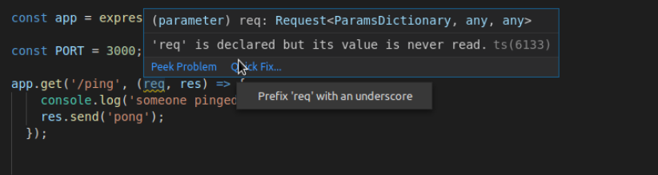
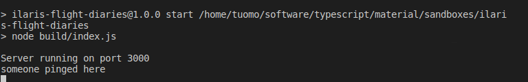
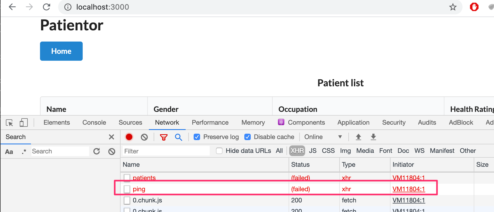
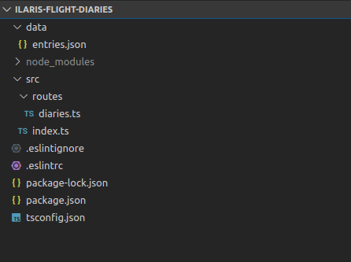
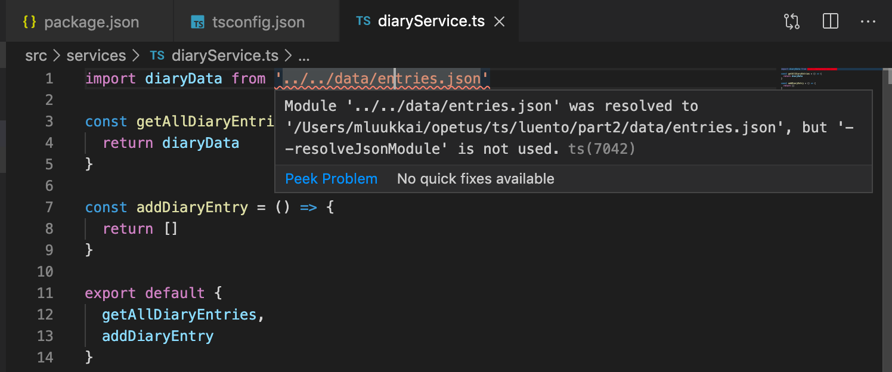
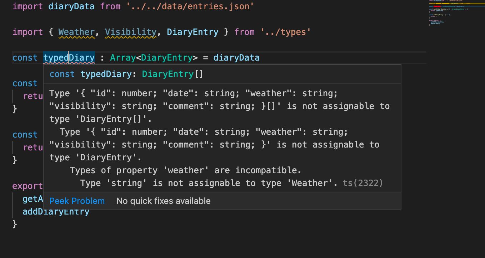
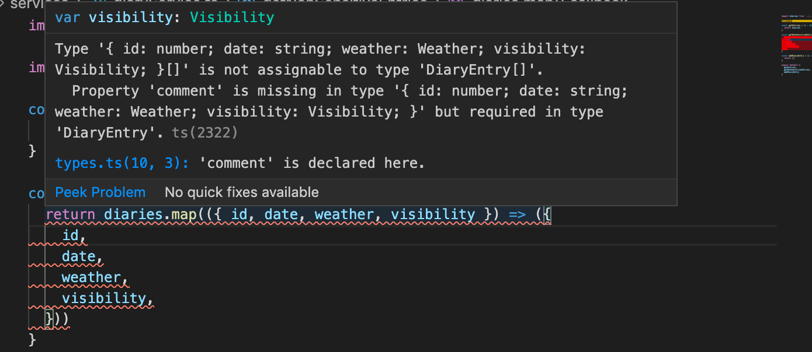
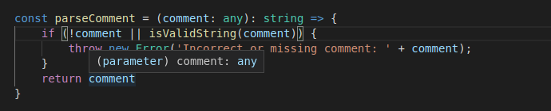
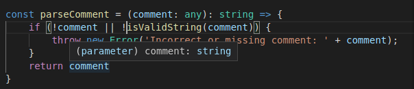

<div class="content">

Now that we have a basic understanding of how TypeScript works and of how to create actual projects with it, it is time to start creating something actually useful. So now we're going to create a completely new project, with a bit more realistic use cases in mind.

One major change from the previous part is that **we're not going to use ts-node anymore**. ts-node is a handy tool, with which it is very easy to get started, but in the long run it is suggested to use the official TypeScript compiler that comes with the _typescript_ npm-package. With this compiler the basic JavaScript files are generated and packaged from the .ts files so that the built <i>production version</i> of the project won't contain any TypeScript code. This is exactly what is aimed for in the end, since TypeScript in itself is not runnable by browsers or Node.

### Setting up the project

Our project is created for Ilari, who loves riding small planes but has a bit of difficulties managing his flight history. He is quite the coder himself, so he doesn't necessarily need a user interface for his flight records, but he'd like to use the software with HTTP-requests so that the possibility to extend the application to also include a web-based user interface is maintained.

Let's start creating our own first real project 'Ilari's flight diaries', as we usually would by running _npm init_ and by installing the _typescript_ package. 

TypeScript's native _tsc_ compiler offers us help initialising our project with the command _tsc --init_. To be able to run this, we need to add the _tsc_ command to runnable scripts in the package.json file if we don't have _typescript_ installed globally. And even if you would have typescript installed globally, you should always include the package as a dev-dependency in your project.

```json
{
  // ..
  "scripts": {
    "tsc": "tsc", // highlight-line
  },
  // ..
}
```

 Very often the bare _tsc_ command is set up in the project scripts for other scripts to use, so it is very common to see the  _tsc_ command set up within the project like this.

 Now we can init our tsconfig.json settings by running:


```sh
 npm run tsc -- --init
```

 **Notice** the extra -- before the actual argument, arguments before the -- are interpreted for the command _npm_ abd after are for the command that is run throught the package.json scripts. 

The created tsconfig.json contains a pretty big list of all of the possible configurations available to use with only a few uncommented ones. Studying the initial tsconfig.json file might be useful to find something you might be needing and it is completely okay to not delete the commented rows in the file just in case you might someday need to expand your configuration settings. 

Right now the preferred settings we want right now are the following:

```json
{
  "compilerOptions": {
    "target": "ES6",
    "outDir": "./build/",
    "module": "commonjs",
    "strict": true,
    "noUnusedLocals": true,
    "noUnusedParameters": true,       
    "noImplicitReturns": true,
    "noImplicitAny": true,
    "noFallthroughCasesInSwitch": true,
    "esModuleInterop": true
     
  }
}
```

Let's go through each setting now: 

The <i>target</i> parameter informs the compiler into which ECMAScript version the generated JavaScript should be generated into. ES6 is supported by most browsers and therefore is a good and pretty safe option.

<i>outDir</i> tells where the compiled result should be placed.

<i>module</i> tells the compiler that we want to use <i>commonjs</i> modules in compiled code, so the code uses _require_ instead of _import_ that is not supported in older Node.js versions such as the version 10. 

<i>strict</i> is actually a shorthand to include multiple separate options: 
<i>noImplicitAny, noImplicitThis, alwaysStrict, strictBindCallApply, strictNullChecks, strictFunctionTypes and strictPropertyInitialization</i>. These all guide our coding style use TypeScript features more strictly, <i>noImplicitAny</i> restricts implicit setting for any, which happens for example if you don't type the expected variables of a function. The rest of the options can all be studied more closely on the [tsconfig documentation](https://www.typescriptlang.org/v2/en/tsconfig#strict). Using <i>strict</i> is suggested by the official documentation.

<i>noUnusedLocals</i> gives an error if a local variable is unused and </i>noUnusedParameters</i> when on unused parameters. 

<i>noFallthroughCasesInSwitch</i> gives an error if a _switch - case_ is used without a fallthrough possibility (falling to a case does not _return_ or _break_ the evaluation of the switch).

<i>esModuleInterop</i> allows interaperability between commonJS and ES Modules, see more [in documentation](https://www.typescriptlang.org/v2/en/tsconfig#esModuleInterop).

Now that we have our preferred configuration set, let's continue by installing _express_ and of course also _@types/express_. Since this is a real project, which is intended to be grown over time, it might be useful to use eslint from the beginning, so that no extra refactoring or rewriting is needed later on if these are added afterwards. We should also put So let's also install _eslint_, _@typescript-eslint/eslint-plugin_ and _@typescript-eslint/parser_.

```sh
npm install express
npm install --save-dev @types/express @typescript-eslint/eslint-plugin @typescript-eslint/parser
```

Now our _package.json_ should look something like this: 

```json
{
  "name": "ilaris-flight-diaries",
  "version": "1.0.0",
  "description": "",
  "main": "index.ts",
  "scripts": {
    "tsc": "tsc",
    "test": "echo \"Error: no test specified\" && exit 1"
  },
  "author": "",
  "license": "ISC",
  "dependencies": {
    "express": "^4.17.1"
  },
  "devDependencies": {
    "@types/express": "^4.17.2",
    "@typescript-eslint/eslint-plugin": "^2.17.0",
    "@typescript-eslint/parser": "^2.17.0",
    "eslint": "^6.8.0",
    "typescript": "^3.7.5"
  }
}
```

We should also create _.eslintrc_ with the following content:

```json
{
  "env": {
    "browser": true,
    "node": true
  },
  "parser": "@typescript-eslint/parser",
  "parserOptions": {
    "ecmaVersion": 11,
    "sourceType": "module",
    "project": "./tsconfig.json",
    "createDefaultProgram": true
  },
  "plugins": ["@typescript-eslint"],
  "extends": [
    "eslint:recommended",
    "plugin:@typescript-eslint/recommended",
    "plugin:@typescript-eslint/recommended-requiring-type-checking"
  ],
 "rules": {
    "@typescript-eslint/explicit-function-return-type": 0,
    "@typescript-eslint/no-unused-vars": [
        "error", { "argsIgnorePattern": "^_" }
    ],
     "@typescript-eslint/no-explicit-any": 1,
    "no-case-declarations": 0
  }
}
```

Now we only need to set up our development environment properly, and then we are ready to start writing some serious code. There are many different options and we could use the familiar _nodemon_ with _ts-node_, but as we saw before, _ts-node-dev_ does the exact same thing and we can continue using it. So, let's install _ts-node-dev_ and we are ready to start developing. 

```sh
npm install --save-dev ts-node-dev
```

**Sidenote:** When deciding on what packages to use, a [npmtrends](https://npmtrends.com) is a good place to compare the popularity and growth of different npm packages. When [comparing](https://www.npmtrends.com/nodemon-vs-ts-node-dev-vs-ts-node) the use of _ts-node-dev_ and both _nodemon_ and _ts-node_  we can see that the popularity of ts-node-dev is not nearly as popular as using nodemon and ts-dev, so the safer choice might be to just go with the other choice. Now let's still give _ts-node-dev_ a chance and use it in these exercises.


There sure is a lot of stuff to go through before you can even start the actual coding. When in a real project, careful preparations support your development process to a great length, so take the time to create a good setting for yourself / your team and in the long run everything will be much smoother. 

### Let there be code

Now we can finally start coding! As before, let's start out by creating our first ping-endpoint, just to make sure everything is working.

The contents of the root _index.ts_ file:

```js
import express from 'express';
const app = express();
app.use(express.json());

const PORT = 3000;

app.get('/ping', (req, res) => {
    console.log('someone pinged here');
    res.send('pong');
  });
  
app.listen(PORT, () => {
    console.log(`Server running on port ${PORT}`);
});

```

And since we haven't yet set up the development script that uses the ts-node-dev, now is the correct time to add it:

```json
{
  // ..
  "scripts": {
    "tsc": "tsc",
    "dev": "ts-node-dev index.ts" // highlight-line
  },
  // ..
}
```

Now we could run the _npm run dev_, but wait, a problem arises! 

```sh
index.ts:7:19 - error TS6133: 'req' is declared but its value is never read.

7 app.get('/ping', (req, res) => {
                    ~~~
Found 1 error.
```

So our stricter than before tsconfig options don't allow us to keep unused variables within the code while making a production build. This comes problematic when we have library-wide predefined functions, that like in this case require declaring a variable, even though in the code it is not necessarily required to use at all. Fortunately this issue has already been solved on configuration level and once again hovering on the issue gives us a solution for the problem, this time by clicking the quick fix button: 



If it is absolutely impossible to get rid of an unused variable, you should prefix it with an underscore to inform the compiler that this has been taken into considearation and there is nothing we can do. Let's rename the _req_ variable to __req_ and we can continue with our development.

Now by running _npm run dev_ we should be able to run and curl our _/ping_ endpoint.

Now when we can see the happy _pong_, we should try creating our first production build. Now that we have defined the _outdir_ in our tsconfig.json, there's nothing else really to do, but running _npm run tsc_.

Just like magic a native runnable JavaScript production build of the ping-pong express backend is created into the build folder.

Now our eslint also tries to interpret the files in the _build_ folder, which we don't want, as this is compiler generated code. This can easily be prevented by creating a file _.eslintignore_ in your project's root with the content you want eslint to ignore, exactly as in _.gitignore_.

Let's try our project by creating production run command for the project:

```json
{
  // ...
  "scripts": {
    "tsc": "tsc",
    "dev": "ts-node-dev index.ts",
    "start": "node build/index.js" // highlight-line
  },
  // ...
}

```

and run _npm start_ and then try to curl our defined port:



Now we have a minimal working pipeline, with which we can develop our project, with a lot of help from our compiler and eslint in maintaining a good code quality. With this base we can actually start creating an app which we could proudly deploy into a production environment. 

</div>


<div class="tasks">

### Exercises

**Before you start the exercises**

For this set of exercises you will be developing a backend for an existing project called <i>Diagnoses</i> which is a simple medical record application for the use doctors that handles patient information, diagnoses and basic health information of the patients.

The frontend has already been built by outsider experts and you're task is to create a backend to support the existing code.

**Note:** From now on you will be working with existing codebase and sometimes it is expected that you use your own skills to find the relevant files and and configurations to proceed in the exercises.

**Note 2:** You will be extending the frontend later on so it is suggested that you fork the repository already now.


**Note 3:** Code quality is extremely important, so take extra good care of that your code is _readable_ and that it can be _easily shared_ and by this, you need to end up with a result that is _production ready_, so that the built version of the project is working, and no extra dependencies are included in the end result.

#### 9.10

Initialise a buildable project template called _Diagnoses-backend_ that will be used by the frontend. Configure eslint and tsconfig with the same configurations that are used in the material. 

Set up a endpoint that responses to HTTP GET requests to route _/ping_.   

You should also configure auto-reloading.

#### 9.11

Fork and clone the project [Diagnoses-frontend](https://github.com/TuukkaP/fsopen-frontend). With the help of the README-file start the project. You should be able to use the frontend without a functioning backend.

Ensure that backend answers to frontend's ping requests. Check developer tools to make sure it really works: 



You might also want to have a look to tab <i>console</i>.

Set up a build script to your <i>backend</i>, so that you can create a production version of the project and make sure that also it answers to the frontend's ping.

</div>

<div class="content">

### Implementing the functionality

Finally we are ready to start writing some code.

Let's start from basics. Ilari wants to keep track of his experiences on his flight journeys, so it's fairly simple to say that he wants to be able to read and write his experiences.

What he wants to be able to save, are diary entries that include: 
- Date of the entry
- Weather conditions (either good, windy, rainy or stormy)
- Visibility (either good, ok or poor)
- Free text entry of experience

We already have some example data, which we will use as a guideline on how to develop further. The data is in json format and can be found [here](https://github.com/fullstack-hy2020/misc/blob/master/diaryentries.json).

Data looks like the following 

```json
[
  {
    "id": 1,
    "date": "2017-01-01",
    "weather": "rainy",
    "visibility": "poor",
    "comment": "Pretty scary flight, I'm glad I'm alive"
  },
  {
    "id": 2,
    "date": "2017-04-01",
    "weather": "sunny",
    "visibility": "good",
    "comment": "Everything went better than expected, I'm learning much"
  },  
  // ...
]
```

Let's start by creating an endpoint that returns all flight diary entries. 

At this point it is already important to start thinking of architectural decisions for the project. This query should be answered through a _GET_ request at _/api/diaries_. First, let's create the general _/diaries_ endpoint file to the project. We will create it into a _routes_-folder. 

All code usually exists within a folder called _src_, so actual source code is not mixed up with general configuration files. Let's create a _src_ folder, then move the _index.ts_ file from our project there and finally, we will create a _routes_ folder and a _diaries_ file within the _src_ folder. Also now the _npm run dev_ should be updated to point to the _index.ts_ file in _src/index.ts_.

Right now our folder structure should look like this: 



Let's start out by creating the first endpoints into the _diaries.ts_ file.


```js
import express from 'express';

const router = express.Router();

router.get('/', (_req, res) => {
    res.send('Fetching all diaries!');
})

router.post('/', (_req, res) => {
    res.send('Saving a diary!');
})

export default router;
```

And then let's route all requests coming with the prefix _api/diaries/_ to that specific router in _index.ts`


```js
import express from 'express';
import diaryRouter from './routes/diaries'; // highlight-line
const app = express();
app.use(express.json());

const PORT = 3000;

app.get('/ping', (_req, res) => {
  console.log('someone pinged here');
  res.send('pong');
});

app.use('/api/diaries', diaryRouter); // highlight-line

  
app.listen(PORT, () => {
    console.log(`Server running on port ${PORT}`);
});
```

And now when curling localhost:3000/api/diaries we should see the message <i>Fetching all diaries!</i>.

Now let's add the data accessing diaryservice to the code! Let's create a folder _services_ and add a file called _diaryService.ts_ into the folder. Then, let's start implementing the two methods we need; _getAllDiaryEntries_ and _addDiaryEntry_. To get all entries, we of course need to access the data. Since we are not using a database, this means we will instad <i>import</i> the pre-defined JSON-file. 

Code looks like the following

```js
import diaryData from '../../data/entries.json'

const getEntries = () => {
  return diaryData
} 

const addEntry = () => {
  return null
} 

export default {
  getEntries,
  addEntry
}
```

But something is not right



The hint says we might want to use _resolveJsonModule_. Let's add it to our tsconfig: 

```json
{
  "compilerOptions": {
    "target": "ES6",
    "outDir": "./build/", 
    "module": "commonjs",  
    "strict": true,
    "noUnusedLocals": true,
    "noUnusedParameters": true,       
    "noImplicitReturns": true,
    "noFallthroughCasesInSwitch": true,
    "esModuleInterop": true,
    "resolveJsonModule": true // highlight-line
  }
}
```

Problems are now gone.

As before we've seen how the compiler can decide the type of a variable by the value it is being assignet to and in a similar way the compiler interprets larger data sets, objects and arrays. This is why the compiler actually can warn us if we are trying to do something suspicious to the json data we are currently handling. If we're handling an array that includes specific types of objects and we're trying to add an object there that doesn't have all of the fields that the other objects have or is having type conflicts (for example a number where a string should be) the compiler can give us a warning. 

Even though the compiler is pretty intelligent in order to be sure not to do anything unwanted it is safer to create the correct types to the data by yourself.

Now we have a basic working TypeScript express app but there's barely any actual <i>typings</i> in the code. Since we now have a clear definition on what type of data should be accepted for the weather and visibility fields for the data there is no reason for us not to include also those types in the the code. Let's create our type-exclusive file _types.ts_ in which we'll put all our types in this project.

First let's type the allowed _Weather_ and _Visibility_ values through a [union type](https://www.typescriptlang.org/docs/handbook/advanced-types.html#union-types) with allowed strings: 


```js
export type Weather = 'sunny' | 'rainy' | 'cloudy' | 'windy' | 'stormy';

export type Visibility = 'great' | 'good' | 'ok' | 'poor';
```


And from there we can continue to create our own simple DiaryEntry type:

```js
export type DiaryEntry = {
  id: number,
  date: string,
  weather: Weather,
  visibility: Visibility,
  comment: string,
} 
```

We can now try to type our imported json: 

```js
import diaryData from '../../data/entries.json'

import { Weather, Visibility, DiaryEntry } from '../types' // highlight-line

const diaries : Array<DiaryEntry> = diaryData // highlight-line

const getEntries = () : Array<DiaryEntry> => { // highlight-line
  return diaries // highlight-line
} 

const addEntry = () => {
  return null
} 

export default {
  getEntries,
  addEntry
}
```

But since the json already has its values declared, assigning a type for the dataset results in an error:



Since the _weather_ (and _visibility_) fields both have been typed by us in the _DiaryEntry_ type declaration and by the TypeScript compiler itself, a conflict arises. This can be surpassed if we are certain that we know what we are doing by [type assertion](). Let's assert the type of the variable _diaries_ to the DiaryData object with the keyword _as_ and everything should work: 

```js
import diaryData from '../../data/entries.json'

import { Weather, Visibility, DiaryEntry } from '../types'

const diaries = diaryData as Array<DiaryEntry>; // highlight-line

const getEntries = () : Array<DiaryEntry> => {
  return diaries
} 

const addEntry = () => {
  return null
} 

export default {
  getEntries,
  addEntry
}
```

Type assertion should not be used unless there's no other way to proceed since there's always the danger of asserting an unfit type to an object and then trusting the assreted type. While the compiler trusts you to know when using _as_, at the same time it leaves the intelligence of the whole TypeScript to manual interpretation. 

In our case we could change our data exportation method so that we can have the typing happen naturally within the variable declaration file. Since typings are not valid in a JSON-file, we should convert the json-file to a ts-file which exports the typed object-format data in the following way: 

```js
import { DiaryEntry } from "../src/types";

const diaryEntries: Array<DiaryEntry> = [
  {
    "id": 1,
    "date": "2017-01-01",
    "weather": "rainy",
    "visibility": "poor",
    "comment": "Pretty scary flight, I'm glad I'm alive"
  },
  // ...
]

export default diaryData;
```

When we now import the array, it is already intelligently interpreted so that even the _weather_ and _visibility_ fields are understood correctly:

```js
import diaries from '../../data/entries.ts' // highlight-line

import { Weather, Visibility, DiaryEntry } from '../types'

const getEntries = () : Array<DiaryEntry> => {
  return diaries // highlight-line
} 

const addEntry = () => {
  return null
} 

export default {
  getEntries,
  addEntry
}
```


Note that, if we want to reserve the opportunity to save also entries without a field, e.g. _comment_, we could set type field as optional by adding _?_ to the type declaration: 

```js
type DiaryEntry = {
  id: number,
  date: string,
  weather: Weather,
  visibility: Visibility,
  comment?: string,
} 
```

### Utility Types

Sometimes we end up in a situation where we want to use a specific modification of a type. For example consider using a general listing page for data that has some non-sensitive and some  sensitive data. In a common listing page we might want to be sure that no sensitive data is being used or shown so we might only <i>pick</i> the fields of a type we allow to be used in that situation. For that we use the utility type [Pick](http://www.typescriptlang.org/docs/handbook/utility-types.html#picktk).

In our example we should consider that Ilari might want to create a frontend listing of all his diary entries excluding the comment field, since during a very scary flight he might end up writing there something he wouldn't necessarily want to show anyone else.

The [Pick](http://www.typescriptlang.org/docs/handbook/utility-types.html#picktk) utility type allows us to choose what fields of a type we want to use of the existing type. Pick can be used to construct a completely new type or just in time when informing a function what it should return, as any other typings can be used. Utility types are special kinds of type tools, but they are used exactly as regular types are.

In this case, in order to create this kind of "narrowed" version of the Entry type we could just use the Pick in the function declaration:

```js
const getNonSensitiveEntries = 
  (): Array<Pick<DiaryEntry, 'id' | 'date' | 'weather' | 'visibility'>> => {
    // ...
  }
```

and it would expect the function to return an array of the modification of DiaryEntry type which includes only the four declared fields. 

Since [Pick](http://www.typescriptlang.org/docs/handbook/utility-types.html#picktk) requires the type it modifies to be given as a [type variable](http://www.typescriptlang.org/docs/handbook/generics.html#working-with-generic-type-variables), simillar as the Array, we have now two nested type variables and the syntax looks already a bit odd. We can improve the readability by using the [alternative](http://www.typescriptlang.org/docs/handbook/basic-types.html#array) syntax of arrays:

```js
const getNonSensitiveEntries = 
  (): Pick<DiaryEntry, 'id' | 'date' | 'weather' | 'visibility'>[] => {
    // ...
  }
```

Even better in this case when we want to exclude only one field, would be to use the *Omit* utility type, for which you can declare what fields to exclude:

```js
const getNonSensitiveEntries = (): Omit<DiaryEntry, 'comment'>[] => {
  // ...
}
```


Another way would be to declare a completely new type for the _NonSensitiveDiaryEntry_:

```js
type NonSesitiveDiaryEntry = Omit<DiaryEntry, 'comment'>;
```

The code is now

```js
import diaries from '../../data/entries.js'

import { NonSesitiveDiaryEntry, DiaryEntry } from '../types'

const getEntries = () : DiaryEntry[] => {
  return diaries
} 

const getNonSensitiveEntries = (): NonSesitiveDiaryEntry[] => {
  return diaries
}

const addDiaryEntry = () => {
  return []
} 

export default {
  getEntries,
  getNonSensitiveEntries,
  addDiaryEntry
}
```

One thing causes us a bit of concern. In there function _getNonSensitiveEntries_ we are returning the complete entries of diaries and <i>no error is given</i> despite typing!

This is because TypeScript can only check whether we have all the wanted fields or not, but excess fields are not prohibited. In our case it means that it is <i>not prohibited</i> to return the DiaryEntry[] type object, but if we were to try to get a hold of the field <i>comment</i> where the diary is returned, it would not be restricted since it would be pointing to a field that TypeScript is unaware of even though it exists.

Unfortunately this can lead to unwanted behaviour if you are not aware of what you are doing; this situation is valid in terms of TypeScript but is most likely allowing use that is not wanted. If we now return all of the diaryEntries from the function _getNonSensitiveEntries_ as they are to <i>frontend</i>, we are actually leaking the unwanted fields for the requesting browser even though our types imply otherwise!

Because TypeScript doesn't modify the actual data but only types it, we need to implement the exclusion of the fields:

```js
import diaries from '../../data/entries.js'

import { NonSesitiveDiaryEntry, DiaryEntry } from '../types'

const getEntries = () : DiaryEntry[] => {
  return diaries
} 

// highlight-start
const getNonSensitiveEntries = () : NonSesitiveDiaryEntry [] => {
  return diaries.map(({ id, date, weather, visibility }) => ({
    id,
    date,
    weather,
    visibility,
  }))
}
// highlight-end

const addDiaryEntry = () => {
  return []
} 

export default {
  getEntries,
  getNonSensitiveEntries,
  addDiaryEntry
}
```


If we were to try returning this data with the basic _DiaryEntry_ type, that is, if we would type the function as follows

```js
const getNonSensitiveEntries = () : DiaryEntry[] => {
```

we would get the following error:



Utility types includes a large set of handy tools and it is definitely worthwhile to take some time studying [their documentation](https://www.typescriptlang.org/docs/handbook/utility-types.html).

Finally we can complete the route that shows all diery entries:

```js
import express from 'express';
import diaryService from '../services/diaryService'  // highlight-line

const router = express.Router();

router.get('/', (_req, res) => {
  res.send(diaryService.getNonSensitiveEntries()); // highlight-line
})

router.post('/', (_req, res) => {
    res.send('Saving a diary!');
})

export default router;
```

The response looks like as we expect


</div>

<div class="tasks">

### Exercises

Simillarly to Ilari's flight service, we do not use a real database in our app but instead use hardcoded data, that is in the files [diagnoses.json](https://github.com/fullstack-hy2020/misc/blob/master/diagnoses.json) and [patientdata.json](https://github.com/fullstack-hy2020/misc/blob/master/patientdata.json). Download the files and store those into a folder called _data_. All data modification can be done in runtime memory, so during this part it is *not necessary to write to a file*.

#### 9.12

Create a type _Diagnose_ and use it to create endpoint _/api/diagnoses_ for fetching all diagnoses with HTTP GET.

Structure your code properly by using meaninfully named directories and files.

**Note** that _diagnoses_ may or may not contain the field _latin_. You might want to use [optional properties](https://www.typescriptlang.org/docs/handbook/interfaces.html#optional-properties) in the type definition.

#### 9.13

Create data type _Patient_ and set up a GET-endpoint _/api/patients_ that returns all patients to the frontend excluding field _ssn_. Use a [utility type](https://www.typescriptlang.org/docs/handbook/utility-types.html) to make sure you are selecting and returning only the wanted.

Try the endpoint with browser and make sure that _ssn_ is not included in response.

After creating the endpoint, ensure that the <i>frontend</i> shows the list of patients.

</div>

<div class="content">

### Preventing an accidental undefined result

Let us expand the backend to support fetching one specific entry with a HTTP GET request to route _/api/diaries/:id_ e

The DiaryService needs to be extended with  _findById_-function:

```js
// ...

// highlight-start
const findById = (id: number): DiaryEntry => {
  const entry = diaries.find(d => d.id === id);
  return entry;
}
// highlight-end

export default {
  getEntries,
  getNonSensitiveEntries,
  addDiaryEntry,
  findById // highlight-line
}
```

But once again, a new problem comes to light:


The thing with this request is that it can also return undefined - there is no absolute guarantee that an entry with the specific id can be found. This is a great thing to come up, since without TypeScript there would be no indication of this possibility and in the worst case you might end up returning a result of an _undefined_ object instead of informing of a not found situation in a reasonable way.

In cases like this we first of all need to decide what is the desired return value if an object is not found, and how to handle the case. The value _undefined_ that is returned by _find_-method of an array is fine for us if a result is not found so we could solve our problem by typing the return value as follows

```js
const findById = (id: number): DiaryEntry | undefined => { // highlight-line
  const entry = diaries.find(d => d.id === id);
  return entry;
}
```

The route handler is the following

```js
import express from 'express';
import diaryService from '../services/diaryService'

router.get('/:id', (req, res) => {
  const diary = diaryService.findById(Number(req.params.id));

  if (diary) {
    res.send(diary);
  } else {
    res.sendStatus(404);
  }
})

// ...

export default router;
```

### Adding a new diary

Let's start building the _post_ endpoint for adding flight diary entries. The accepted values should confirm to the example data.

The code handling the response looks as follows

```js
router.post('/', (req, res) => {
  const { date, weather, visibility, comment } = req.body;
  const newDiaryEntry = diaryService.addDiaryEntry(
    date,
    weather,
    visibility,
    comment,
  );
  res.json(newDiaryEntry);
})
```

corresponding method in _diaryService_ looks like this

```js
const addDiaryEntry = (
    date: string, weather: Weather, visibility: Visibility, comment: string
  ): DiaryEntry => {
    
  const newDiaryEntry = {
    id: Math.max(...diaries.map(d => d.id)) + 1,
    date,
    weather,
    visibility,
    comment,
  }
  
  diaries.push(newDiaryEntry);
  return newDiaryEntry;
}
```

As we can see the _addDiaryEntry_ function is growing to be pretty hard to read, when having all the fields as separate parameters. It might be better to just send the data as an object to the function:

```js
router.post('/', (req, res) => {
  const { date, weather, visibility, comment } = req.body;
  const newDiaryEntry = diaryService.addDiaryEntry({ // highlight-line
    date,
    weather,
    visibility,
    comment,
  }); // highlight-line
  res.json(newDiaryEntry);
})
```

But wait, what is the type of this object? It is not exactly a DiaryEntry, since it is still missign the _id_ field. It could be useful for us just to create a new type _NewDiaryEntry_ which could work as a type for the not-yet saved Entry-object. Let us create the new type in our _types.ts_-file using the existing _DiaryEntry_ object with the _Omit_ utility type:

```js
export type NewDiaryEntry = Omit<DiaryEntry, 'id'>
```

And now we can use this type in our DiaryService and we can just destructure the whole new entry object when creating the entry to be saved: 

```js
import { NewDiaryEntry, NonSesitiveDiaryEntry, DiaryEntry } from '../types' // highlight-line

// ...

const addDiaryEntry = ( entry : NewDiaryEntry ): DiaryEntry => {  // highlight-line
  const newDiaryEntry = {
    id: Math.max(...diaries.map(d => d.id)) + 1,
    ...entry  // highlight-line
  }
  
  diaries.push(newDiaryEntry);
  return newDiaryEntry;
}
```

Now the code looks much cleaner! 

In order to parse the incoming data we must have the  _json_ middleware configured:
 
``` js
import express from 'express';
import diaryRouter from './routes/diaries'; 
const app = express();
app.use(express.json()); // highlight-line

const PORT = 3000;

app.use('/api/diaries', diaryRouter);

app.listen(PORT, () => {
  console.log(`Server running on port ${PORT}`);
});
```

and now the application is ready to receive HTTP POST requests for adding diaries with the desired fields!

### Proofing your requests

There are a plenty of things that can go wrong when accepting data from an outside source. Applications work rarely fully on their own and we are forced to live with the fact that data sources outside of a single system cannot be fully trusted. When the data is coming from an outside source, there's no way that it can be already typed when we receive it so we need to make decision on how to handle the uncertainty that comes with the data.

The way express handles parsing the request body is that it asserts the type [any](http://www.typescriptlang.org/docs/handbook/basic-types.html#any) to all the body fields. In our situation this doesn't come apparent in any way in the editor, but if we start looking at the variables more closely and hover on any of them, we can see that each of them is [any](http://www.typescriptlang.org/docs/handbook/basic-types.html#any) and the editor doesn't complain when giving them to _addDiaryEntry_ as arguments: 


The value of type [any](http://www.typescriptlang.org/docs/handbook/basic-types.html#an) can be assigned to <i>any</i> type of variable since it <i>might be</i> the wanted type. This is definitiely not safe to trust so 
check the incoming values (regardless whether we are using TypeScript or not).

We could just add simple <i>exists</i> and <i>is-value-valid</i> checks to the function defining the route but since we also need to ensure that _Weather_ and _Visibility_ values are of the correct form, it is better to write the put the parsing and validation logic to a separate file _utils.ts_.

Our intention is to define a function _toNewDiaryEntry_ that gets the request body as a parameter and returns a properly typed _NewDiaryEntry_. Route definition uses the function as follows

```js
import toNewDiaryEntry from '../utils' // highlight-line

// ...

router.post('/', (req, res) => {
  try {
    const newDiaryEntry = toNewDiaryEntry(req.body); // highlight-line
      
    const addedEntry = diaryService.addDiaryEntry(newDiaryEntry); // highlight-line
    res.json(addedEntry);
  } catch (e) {
    res.status(404).send(e.message); 
  }
})
```

Since we are now making trustworthy code and trying to make sure that we are getting exactly what we want from the requests we should get started with the goal of parsing and validating each field we are waiting for. 

The skeleton of the function _addDiaryEntry_ looks like the following:

```js
import { NewDiaryEntry } from './types'

const toNewDiaryEntry = (object) : NewDiaryEntry => {
  const newEntry: NewDiaryEntry = {
    // ...
  }
  
  return newEntry
} 

export default toNewDiaryEntry;
```

In the function we want to parse the each field and make sure that what we is returned is exactly the type _NewDiaryEntry_. Thus we should check each field separately. 

Once again we have a typing issue: what is the _object_ type? Since the _object_ is in fact the body of a request, express has typed it with _any_. Since within this file the whole idea is to map unknown types of fields to correct ones and check whether they are defined as expected, this might be the rare case where we actually <i>want to allow the _any_ type</i>. 

However if we type the object to _any_, eslint gives us a complaint:


The cause for the complaint is eslit-rule [no-explicit-any](https://github.com/typescript-eslint/typescript-eslint/blob/master/packages/eslint-plugin/docs/rules/no-explicit-any.md) that prevents us form explicitly setting type to be any. Since this is in general a good rule to follow but just in our case undesired, it is better to allow using any now by disabling the eslint-rule from that line. This happens by adding the following at the previous line:

```js
/* eslint-disable @typescript-eslint/no-explicit-any */
```

Let us start to create the parsers for each of the fields of the variable _object_.

To validate the _comment_ field we need to check that it exists, after which we should ensure that it is of the type _string_.

The complete function should look something like this:

```js
const parseComment = (comment: any): string => {
  if (comment || !isValidString(comment)) {
    throw new Error('Incorrect or missing comment: ' + comment);
  }
  return comment
}
```

Now we accept the the _date_ variable as _any_ type (as it is _any`) and we intend to return a verified _string_ type of variable from the function. We need to implement also the string and date validation functions in our code: 

```js
const isValidString = (text: any): text is string => {
  return typeof text === 'string' || text instanceof String
}
```

The _isValidDate_ function contains no unclear content but in the _isValidString_ function we use a new keyword: _is_. With this kind of setting _variable is Type_ we are creating a [type guard*](https://www.typescriptlang.org/docs/handbook/advanced-types.html#type-guards-and-differentiating-types) with which we can use code to guarantee not only in the code that a variable is of a specific type but also the compiler. So when we run the variable through the type guard function _isValidString_ even the compiler knows afterwards that the variable in fact is of the type _string_.

Let's look at an example: 

If we were to return a _boolean_ from the _isValidString_ method like this: 

```js
const isValidString = (text: any): boolean => {
  return typeof text === 'string' || text instanceof String
}
```

The compiler would still interpret the comment as type _any`:



Which actually would not in this case cause any issues, since as before mentioned the casting of a return type of _any_ to a _string_ in this case is not exactly wrong but it's not entirely safe either. If we define the the function to return a _variable is Type_ boolean, we are actually confirming to the compiler that *the value definitely is of that type*:



Wow, it's like looking directly at the sun and not being hurt in the eyes. 

Now when the parsed comment variable is brought back to the original function, it is definitely of type _string_ or an error is thrown. First one down, three to go!

Next let's take the _date_. Parsing and validating the date object is pretty similar, since TypeScript doesn't really know a type for date and we need to treat it as as _string_. We still definitely should use JavaScript level validation to check whether the date format should be accepted. 

So let's add the following functions:

```js
const isValidDate = (date: string): boolean => {
    return Boolean(Date.parse(date));
}

const parseDate = (date: any): string => {
    if (!date || !isValidString(date) || !isValidDate(date)) {
        throw new Error('Incorrect or missing date: ' + date)
    }
    return date;
}
```

Nothing really special here, only thing is that we can't usea type guard since a date is in this case considered only a string. But notice how even though the _date_ variable is accepted as _any_, after checking the type  with _isValidString_ function the type is already a string which is why we are able to introduce the variable to the _isValidDate_ function with the type _string_ without any errors.

Let's move on to the more complex types: Weather and Visibility.

So what we'd want is the validation and parsing to work like this:

```js
const parseWeather = (weather: any): Weather => {
    if (!weather || !isValidString(weather) || !isValidWeather(weather)) {
        throw new Error('Incorrect or missing weather: ' + weather)
    } 
    return weather;
}
```

So the question here is, how can we validate a string that should be of a specific form? We need a type guard so we can guarantee to the compiler that the variable is in fact the type _weather_ and we could implement it like this:

```js
const isValidWeather = (str: any): str is Weather => {
    return ['sunny', 'rainy', 'cloudy', ...].includes(str)
}
```

This would work just fine but the problem is that this listing is not necessarily on the same page with the actual Weather type declaration. If there were to come more acceptable Weather conditions there would be a need to update both places which is not what we want.

A better solution for this question would be to improve the actual Weather type and instead of type declaration we should use a TypeScript [enum](https://www.typescriptlang.org/docs/handbook/enums.html) which allows us to use the actual values input there within the running code, not only in the compilation phase.

Let's rewrite the _Weather_ type like this: 

```js
export enum Weather {
    Sunny = 'sunny',
    Rainy = 'rainy',
    Cloudy = 'cloudy',
    Stormy = 'stormy', 
    Windy = 'windy',
}

```

This allows us to handle _Weather_ types different varieties in  different ways, but most importantly in this case we now can check *whether a string confirms to the accepted values of the Weather enum type*. 

Now everything else can stay as they were and we can write a type guard for Weather checking in the following way:

```js
const isValidWeather = (str: any): str is Weather => {
    return Object.values(Weather).includes(str)
}
```

One thing to notice here is that we can't set the _str_ variable to be the _string_ type. This is because if we have to allow the type of the parameter to be anything so that we can create a function that determines whether it is of a specific type. And it makes since if you start to think about the reusability of the function; by allowing _any_ as a parameter, we can use the function with confidence knowing that whatever we might feed it it will answer always to the question of whether the variable is a valid Weather or not. 

With these changes, one issue comes to light: our data does not conform anymore to our types.

This is bacause *a string can't be assumed to be an enum*. 

Since the example data we are loading is offering the _Weather_ and _Visibility_ values as strings, the union type of separate types of strings (_type  Weather = 'sunny' | 'rainy' ..._) can be compared to the values we are saving, whether the input string is one of the accepted strings or not. But when using _enums`, this is not anymore the case, because the values of an enum type are not parsed when comparing the values.

This is why if we want to set or access a value that is defined to be an enum, we need to access the value through the enum definition. So when we want to tell to the compiler that we are using in a DiaryEntry type of object the Weather field with the value _sunny`, we need to use it like this: 

```js
import { DiaryEntry, Visibility, Weather } from "../src/types";

const diaryEntries: DiaryEntry[] = [
  {
    id: 1,
    date: "2017-01-01",
    weather: Weather.Rainy,
    visibility: Visibility.Poor,
    comment: "Pretty scary flight, I'm glad I'm alive"
  },
  // ...
]  
```

And this is how we access String enums values.

Enums are usually used when wanting a set of predetermined values that are not expected to change in the future. Usually enums are used in much tighter unchanging values (for example weekdays, months, directions) but since they offer us a great way to validate our incoming values we might as well use them like this. 

And after giving _Visibility_ the same treatment whole thing just works!

</div>

<div class="tasks">

### Exercises

#### 9.14

Set up a POST-endpoint _/patients_ that adds a patient.

After this the 'Add new patient' button in the frontpage should work.

#### 9.15

Set up safe parsing, validation and type guards to the post request. In this exercise you should refactor (if you still haven't) the _Patient_ types _Gender_ field to an _enum_ type as in the material. 

</div>
