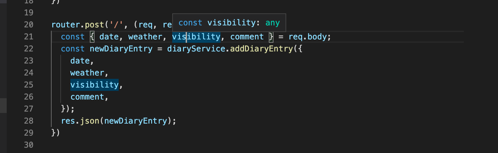
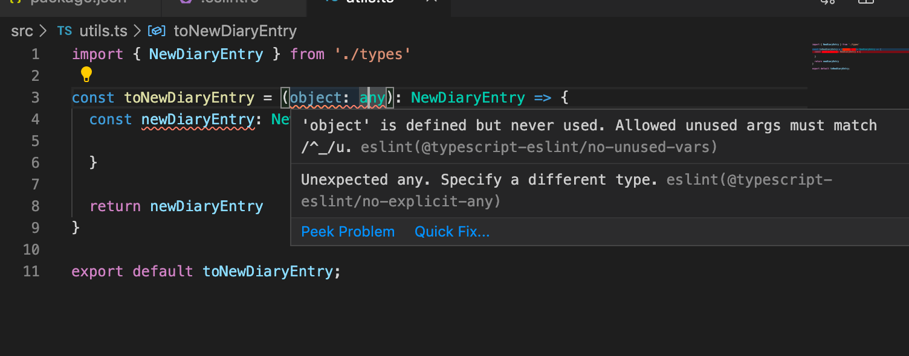
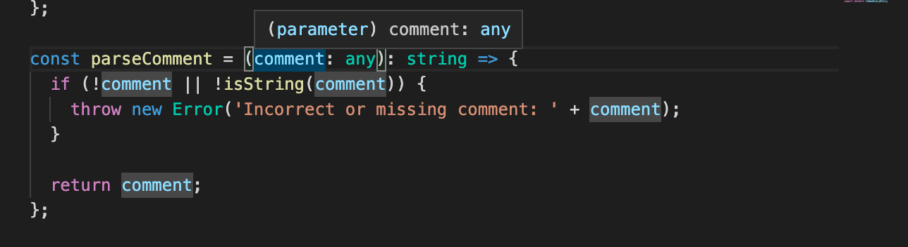
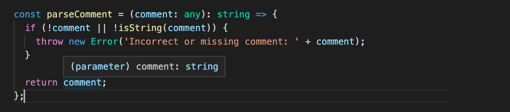

<div class="content">

<!-- Now that we have a basic understanding of how TypeScript works and how to create actual projects with it, it is time to start creating something actually useful. So now we're going to create a completely new project, with a bit more realistic use cases in mind. -->
Now that we have a basic understanding of how TypeScript works and how to create small projects with it, it's time to start creating something actually useful. We are now going to create a new project with a bit more realistic use cases in mind.

<!-- One major change from the previous part is that <i>we're not going to use ts-node anymore</i>. ts-node is a handy tool, with which it is very easy to get started, but in the long run it is suggested to use the official TypeScript compiler that comes with the <i>typescript</i> npm-package. With this compiler the basic JavaScript files are generated and packaged from the .ts files so that the built <i>production version</i> of the project won't contain any TypeScript code. This is exactly what we are aiming for in the end, since TypeScript in itself is not runnable by browsers or Node. -->
One major change from the previous part is that <i>we're not going to use ts-node anymore</i>. It is a handy tool and helps you get started, but in the long run it is advicable to use the official TypeScript compiler that comes with the <i>typescript</i> npm-package. The official compiler generates and packages JavaScript files from the .ts files so that the built <i>production version</i> won't contain any TypeScript code anymore. This is the exact outcome we are aiming for, since TypeScript itself is not executable by browsers or Node.

### Setting up the project

<!-- Our project is created for Ilari, who loves riding small planes but has a bit of difficulties managing his flight history. He is quite a coder himself, so he doesn't necessarily need a user interface for his flight records, but he'd like to use the software with HTTP-requests so that the possibility to later extend the application to also include a web-based user interface would be possible. -->
We will be creating a project for Ilari, who loves flying small planes but has a difficult time managing his flight history. He is quite the coder himself, so he doesn't necessarily need a user interface, but he'd like to use the software with HTTP-requests and retain the possibility to later add a web-based user interface to the application.

<!-- Let's start creating our own first real project 'Ilari's flight diaries', as we usually would by running <i>npm init</i> and by installing the <i>typescript</i> package.  -->
Let's start by creating our first real project 'Ilari's flight diaries'. As usual run <i>npm init</i> and install the <i>typescript</i> package.

<!-- TypeScript's native <i>tsc</i> compiler offers us help initialising our project with the command <i>tsc --init</i>. To be able to run this, we need to add the <i>tsc</i> command to runnable scripts in the package.json file unless we have installed <i>typescript</i> globally. And even if you would have installed typescript globally, you should always include the package as a dev-dependency in your project. -->
TypeScript's native <i>tsc</i> compiler can help us to initialize our project with the command <i>tsc --init</i>.
First we need to add the <i>tsc</i> command to the list of executable scripts in the package.json file (unless you have installed <i>typescript</i> globally).
Even if you have installed TypeScript globally, you should always include it as a dev-dependency in your project.

The npm script for running <i>tsc</i> is set as follows:

```json
{
  // ..
  "scripts": {
    "tsc": "tsc", // highlight-line
  },
  // ..
}
```

 <!-- Very often the bare <i>tsc</i> command is set up in the project scripts for other scripts to use, so it is very common to see the <i>tsc</i> command set up within the project like this. -->
 Often the bare <i>tsc</i> command is added to the scripts for other scripts to use, so it is common to see the <i>tsc</i> command set up within the project like this.

 Now we can initialise our tsconfig.json settings by running:


```shell
 npm run tsc -- --init
```

 **Notice** the extra -- before the actual argument! Arguments before the -- are interpreted for the command <i>npm</i> and ones after are for the command that is run through the script.

<!-- The created <i>tsconfig.json</i> contains a lengthy list of all of the possible configurations available to use, but  only a few of those are uncommented. Studying the initial <i>tsconfig.json</i> file might be useful for finding some configuration options you might need. It is also completely okay to keep the commented rows in the file just in case you might someday need to expand your configuration settings.  -->
Running the script creates a <i>tsconfig.json</i> file, which contains a lengthy list of every configuration available to us. However only a few have not been commented out.
Studying the initial <i>tsconfig.json</i> file might be useful for finding some configuration options you might need.
It is also completely okay to keep the commented rows in the file just in case you might someday need to expand your configuration settings.


The settings we want right now are the following:

```json
{
  "compilerOptions": {
    "target": "ES6",
    "outDir": "./build/",
    "module": "commonjs",
    "strict": true,
    "noUnusedLocals": true,
    "noUnusedParameters": true,
    "noImplicitReturns": true,
    "noFallthroughCasesInSwitch": true,
    "esModuleInterop": true
  }
}
```

Let's go through each configuration:

<!-- The <i>target</i> parameter tells the compiler which ECMAScript version the generated JavaScript should be generated into. ES6 is supported by most browsers and therefore is a good and pretty safe option. -->
The <i>target</i> configuration tells the compiler which ECMAScript version to use for the generated JavaScript. ES6 is supported by most browsers, and it is a good, pretty safe option.

<i>outDir</i> tells where the compiled code should be placed.

<!-- <i>module</i> tells the compiler that we want to use <i>commonjs</i> modules in compiled code, so the code uses _require_ instead of _import_ that is not supported in older Node.js versions such as the version 10.  -->
<i>module</i> tells the compiler we want to use <i>commonjs</i> modules in the compiled code. This means we can use _require_ instead of _import_, which is not supported in older Node.js versions such as the version 10.

<i>strict</i> is actually a shorthand for multiple separate options:
<!-- <i>noImplicitAny, noImplicitThis, alwaysStrict, strictBindCallApply, strictNullChecks, strictFunctionTypes and strictPropertyInitialization</i>. These all guide our coding style to use TypeScript features more strictly. The most important for us is perhaps the already familiar [noImplicitAny](https://www.typescriptlang.org/v2/en/tsconfig#noImplicitAny) that restricts implicitly setting type <i>any</i>, which happens for example if you don't type the expected parameters of a function. The rest of the options can all be studied more closely on the [tsconfig documentation](https://www.typescriptlang.org/v2/en/tsconfig#strict). Using <i>strict</i> is suggested by the official documentation. -->
<i>noImplicitAny, noImplicitThis, alwaysStrict, strictBindCallApply, strictNullChecks, strictFunctionTypes and strictPropertyInitialization</i>.
These guide our coding style to use the TypeScript features more strictly.
For us perhaps the most important is the already familiar [noImplicitAny](https://www.staging-typescript.org/tsconfig#noImplicitAny). It prevents implicitly setting type <i>any</i>, which can happen if you don't type the parameters of a function for example.
Details of the rest of the configurations can be found from the [tsconfig documentation](https://www.staging-typescript.org/tsconfig#strict).
Using <i>strict</i> is suggested by the official documentation.

<!-- <i>noUnusedLocals</i> gives an error if a local variable is unused and <i>noUnusedParameters</i> when a function has unused parameters.  -->
<i>noUnusedLocals</i> prevents having unused local variables, and <i>noUnusedParameters</i> throws an error if a function has unused parameters.

<i>noFallthroughCasesInSwitch</i> ensures that in a _switch case_ each case ends with a  _return_ or a _break_ statement.

<i>esModuleInterop</i> allows interoperability between commonJS and ES Modules, see more [in documentation](https://www.staging-typescript.org/tsconfig#esModuleInterop).

Now that we have our preferred configuration set, let's continue by installing <i>express</i> and of course also <i>@types/express</i>. Since this is a real project, which is intended to be grown over time, we will use eslint from the very  beginning:

```shell
npm install express
npm install --save-dev eslint @types/express @typescript-eslint/eslint-plugin @typescript-eslint/parser
```

Now our <i>package.json</i> should look something like this:

```json
{
  "name": "ilaris-flight-diaries",
  "version": "1.0.0",
  "description": "",
  "main": "index.ts",
  "scripts": {
    "tsc": "tsc",
    "test": "echo \"Error: no test specified\" && exit 1"
  },
  "author": "",
  "license": "ISC",
  "dependencies": {
    "express": "^4.17.1"
  },
  "devDependencies": {
    "@types/express": "^4.17.2",
    "@typescript-eslint/eslint-plugin": "^2.17.0",
    "@typescript-eslint/parser": "^2.17.0",
    "eslint": "^6.8.0",
    "typescript": "^3.7.5"
  }
}
```

We also create <i>.eslintrc</i> with the following content:

```json
{
  "extends": [
    "eslint:recommended",
    "plugin:@typescript-eslint/recommended",
    "plugin:@typescript-eslint/recommended-requiring-type-checking"
  ],
  "plugins": ["@typescript-eslint"],
  "env": {
    "browser": true,
    "es6": true
  },
  "rules": {
    "@typescript-eslint/semi": ["error"],
    "@typescript-eslint/explicit-function-return-type": 0,
    "@typescript-eslint/no-unused-vars": [
        "error", { "argsIgnorePattern": "^_" }
    ],
     "@typescript-eslint/no-explicit-any": 1,
    "no-case-declarations": 0
  },
  "parser": "@typescript-eslint/parser",
  "parserOptions": {
    "project": "./tsconfig.json"
  }
}
```

<!-- Now we only need to set up our development environment properly, and then we are ready to start writing some serious code. There are many different options and we could use the familiar <i>nodemon</i> with <i>ts-node</i>, but as we saw before, </i>ts-node-dev</i> does the exact same thing and we can continue using it. So, let's install <i>ts-node-dev</i> -->
Now we just need to set up our development environment, and we are ready to start writing some serious code.
There are many different options for this. We could use the familiar <i>nodemon</i> with <i>ts-node</i>, but as we saw earlier, </i>ts-node-dev</i> does the exact same thing and we can continue using it.
So, let's install <i>ts-node-dev</i>

```shell
npm install --save-dev ts-node-dev
```

And we are ready to start writing some code after defining still a couple of more npm scripts:

```json
{
  // ...
  "scripts": {
    "tsc": "tsc",
    "dev": "ts-node-dev index.ts", // highlight-line
    "lint": "eslint --ext .ts ." // highlight-line
  },
  // ...
}
```

<!-- There is a lot of stuff to go through before you can even start the actual coding. When working with a real project, careful preparations support your development process to a great length, so take the time to create a good setting for yourself and your team so that in the long run everything runs smoothly. -->
There is a lot of stuff to go through before you can start actual coding. When you are working with a real project, careful preparations support your development process a great deal.
Take the time to create a good setting for yourself and your team so in the long run everything runs smoothly.

### Let there be code

<!-- Now we can finally start coding! As always, we will at start create a ping-endpoint, just to make sure everything is working. -->
Now we can finally start coding! As always, we start by creating a ping-endpoint, just to make sure everything is working.

The contents of the <i>index.ts</i> file:

```js
import express from 'express';
const app = express();
app.use(express.json());

const PORT = 3000;

app.get('/ping', (_req, res) => {
  console.log('someone pinged here');
  res.send('pong');
});

app.listen(PORT, () => {
  console.log(`Server running on port ${PORT}`);
});
```

<!-- If we now run the app with <i>npm run dev</i> we can verify that a request to http://localhost:3000/ping gives a response <i>pong</i>, so our configuration is set! -->
Now if we run the app with <i>npm run dev</i> we can verify that a request to http://localhost:3000/ping gives a response <i>pong</i>, so our configuration is set!

<!-- When starting the app with <i>npm run dev</i>, it is running in development mode, and for sure that is not suitable when we later on operate the app in production.  -->
When starting the app with <i>npm run dev</i>, it runs in development mode.
The development mode is not suitable at all when we later operate the app in production.

<!-- Let us now try to create the <i>production build</i> by running the TypeScript compiler. Since we have defined the <i>outdir</i> in our tsconfig.json, there's really nothing else to do, but run the script <i>npm run tsc</i>. -->
Let's try to create a <i>production build</i> by running the TypeScript compiler. Since we have defined the <i>outdir</i> in our tsconfig.json, there's really nothing else to do but run the script <i>npm run tsc</i>.

Just like magic a native runnable JavaScript production build of the express backend is created into the directory <i>build</i>.

<!-- Currently if we run eslint it will also interpret the files in the <i>build</i> directory, which we don't want, since that is compiler generated code. We can prevent this by creating a file <i>.eslintignore</i> with the content we want eslint to ignore, similarly as in <i>gitignore</i>. -->
Currently, if we run eslint it will also interpret the files in the <i>build</i> directory. We don't want that, since the code there is compiler generated. We can prevent this by creating a  <i>.eslintignore</i> file  which lists the content we want eslint to ignore, just like we do with git and <i>gitignore</i>.

<!-- Let us add a npm script for running the application in production mode: -->
Let's add an npm script for running the application in production mode:

```json
{
  // ...
  "scripts": {
    "tsc": "tsc",
    "dev": "ts-node-dev index.ts",
    "lint": "eslint --ext .ts .",
    "start": "node build/index.js" // highlight-line
  },
  // ...
}
```

When we run app with <i>npm start</i> we can verify that also the production build works


<!-- Now we have a minimal working pipeline, with which we can develop our project, and with the help from our compiler and eslint also ensure that a good code quality is maintained. With this base we can actually start creating an app that we could later on deploy into a production environment.  -->
Now we have a minimal working pipeline for developing our project.
With the help of our compiler and eslint it also ensures that a good code quality is maintained. With this base we can actually start creating an app that we could later on deploy into a production environment.

</div>

<div class="tasks">

### Exercises 9.8.-9.9.

**Before you start the exercises**

For this set of exercises you will be developing a backend for an existing project called <i>Patientor</i> which is a simple medical record application for doctors who handle diagnoses and basic health information of their patients.

The [frontend](https://github.com/fullstack-hy2020/patientor) has already been built by outsider experts and your task is to create a backend to support the existing code.

#### 9.8: Patientor backend, step1

Initialise project that will be used by the frontend. Configure eslint and tsconfig with the same configurations that are used in the material. Define an endpoint that responses to HTTP GET requests to route <i>/ping</i>.

The project should be runnable with npm scripts both in development mode and as compiled code in production mode.

#### 9.9: Patientor backend, step2

Fork and clone the project [patientor](https://github.com/fullstack-hy2020/patientor). Start the project with the help of the README file. You should be able to use the frontend without a functioning backend.

Ensure that backend answers to the ping request that <i>frontend</i> has made on startup. Check developer tool to make sure it really works:


You might also want to have a look at the tab <i>console</i>. If something fails [part 3](/en/part3) of the course shows how the problem can be solved.

</div>

<div class="content">

### Implementing the functionality

Finally we are ready to start writing some code.

<!-- Let's start from basics. Ilari wants to keep track of his experiences on his flight journeys. -->
Let's start from the basics. Ilari wants to be able to keep track of his experiences on his flight journeys.
<!-- What he wants to be able to save are </i>diary entries</i> that include:  -->
<!-- - Date of the entry -->
<!-- - Weather conditions (either good, windy, rainy or stormy) -->
<!-- - Visibility (either good, ok or poor) -->
<!-- - Free text entry of experience -->
He wants to be able to save </i>diary entries</i> which contain:
- The date of the entry
- Weather conditions (good, windy, rainy or stormy)
- Visibility (good, ok or poor)
- Free text detailing the experience

<!-- We already have some example data, which we will use as a guideline on how to develop further. The data is in json format and can be found [here](https://github.com/fullstack-hy2020/misc/blob/master/diaryentries.json). -->
We have obtained some sample data, which we will use as a base to build on.
The data is saved in json format, and can be found from [here](https://github.com/fullstack-hy2020/misc/blob/master/diaryentries.json).

The data looks like the following

```json
[
  {
    "id": 1,
    "date": "2017-01-01",
    "weather": "rainy",
    "visibility": "poor",
    "comment": "Pretty scary flight, I'm glad I'm alive"
  },
  {
    "id": 2,
    "date": "2017-04-01",
    "weather": "sunny",
    "visibility": "good",
    "comment": "Everything went better than expected, I'm learning much"
  },
  // ...
]
```

Let's start by creating an endpoint which returns all flight diary entries.

<!-- First we shall make some decision on how to structure our source code. It is better to put all the source code -->
<!-- under the directory <i>src</i>, so that the source  code is not mixed up with configuration files. We will move also  -->
<!-- <i>index.ts</i> there and make the corresponding changes to npm scripts. -->
First we need to make some decisions on how to structure our source code. It is better to place all source code under <i>src</i> directory, so source code is not mixed with configuration files.
We will move <i>index.ts</i> there and make the necessary changes to the npm scripts.

<!-- We'll decide to put all [routers](/en/part4/structure_of_backend_application_introduction_to_testing) that is the  -->
<!-- modules that take care of handling a set of specific resources such as <i>diaries</i> under the directory <i>src/routes</i>. This differs a bit from the convention of [part 4](/en/part4), where we used directory <i>src/controllers</i>. -->
We will place all [routers](/en/part4/structure_of_backend_application_introduction_to_testing), modules which are responsible for handling a set of specific resources such as <i>diaries</i>, under the directory <i>src/routes</i>.
This is a bit different than what we did  in [part 4](/en/part4), where we used directory <i>src/controllers</i>.

<!-- The routes taking care of diary endpoints in <i>src/routes/diaries.ts</i> looks like this: -->
The router taking care of all diary endpoints is in <i>src/routes/diaries.ts</i> and looks like this:

```js
import express from 'express';

const router = express.Router();

router.get('/', (_req, res) => {
  res.send('Fetching all diaries!');
})

router.post('/', (_req, res) => {
  res.send('Saving a diary!');
})

export default router;
```

We'll route all requests to prefix <i>/api/diaries</i> to that specific router in _index.ts_


```js
import express from 'express';
import diaryRouter from './routes/diaries'; // highlight-line
const app = express();
app.use(express.json());

const PORT = 3000;

app.get('/ping', (_req, res) => {
  console.log('someone pinged here');
  res.send('pong');
});

app.use('/api/diaries', diaryRouter); // highlight-line


app.listen(PORT, () => {
    console.log(`Server running on port ${PORT}`);
});
```

<!-- And now when making a HTTP POST request to http://localhost:3000/api/diaries we should see the message <i>Fetching all diaries!</i>. -->
And now if we make a HTTP GET request to http://localhost:3000/api/diaries we should see the message <i>Fetching all diaries!</i>.

<!-- The next thing is to start serving the seed data (found [here](https://github.com/fullstack-hy2020/misc/blob/master/diaryentries.json)) from the app. We shall fetch the data and save it to file <i>data/diaries.json</i> -->
Next we need to start serving the seed data (found [here](https://github.com/fullstack-hy2020/misc/blob/master/diaryentries.json)) from the app. We will fetch the data and save it to <i>data/diaries.json</i>.

<!-- We will not write the code that does the actual data manipulation to the router, but instead create a <i>service</i> that takes care of the data manipulation. It is quite a common pattern to separate the "business logic" from router code to own modules that are quite often called <i>services</i>. The name service originates from [Domain driven design](https://en.wikipedia.org/wiki/Domain-driven_design) and was made popular by the [Spring](https://spring.io/) framework. -->
We won't be writing the code for the actual data manipulations on the router. We will create a <i>service</i> which takes care of the data manipulation instead.
It is quite common practice to separate the "business logic" from the router code into its own modules, which are quite often called <i>services</i>.
The name service originates from [Domain driven design](https://en.wikipedia.org/wiki/Domain-driven_design) and was made popular by the [Spring](https://spring.io/) framework.

<!-- Let us create directory <i>src/services</i> and inside it the file <i>diaryService.ts</i> with two functions that are needed in fetching and saving the diaries: -->
Let's create a <i>src/services</i> directory and
place the <i>diaryService.ts</i> file in it.
The file contains two functions for fetching and saving diary entries:


```js
import diaryData from '../../data/diaries.json'

const getEntries = () => {
  return diaryData;
};

const addEntry = () => {
  return null;
};

export default {
  getEntries,
  addEntry
};
```

But something is not right


The hint says we might want to use <i>resolveJsonModule</i>. Let's add it to our tsconfig:

```json
{
  "compilerOptions": {
    "target": "ES6",
    "outDir": "./build/",
    "module": "commonjs",
    "strict": true,
    "noUnusedLocals": true,
    "noUnusedParameters": true,
    "noImplicitReturns": true,
    "noFallthroughCasesInSwitch": true,
    "esModuleInterop": true,
    "resolveJsonModule": true // highlight-line
  }
}
```

<!-- Problems are now gone. -->
And our problem is solved.

<!-- > **Note** for some reason VC Code has many times complained that it does not find the file <i>../../data/diaries.json</i> in the service despite the file exists. That is a bug and the complaint goes away when the editor is restarted.  -->
> **NB**: For some reason VSCode tends to complain it cannot find the file <i>../../data/diaries.json</i> from the service despite the file existing. That is a bug in the editor, and goes away when the editor is restarted.

<!-- As before we've seen how the compiler can decide the type of a variable by the value it is being assigned to and in a similar way the compiler interprets larger data sets consisting of objects and arrays. This is why the compiler actually can warn us if we are trying to do something suspicious to the json data we are currently handling. If we're handling an array that includes specific types of objects and we're trying to add an object there that doesn't have all of the fields that the other objects have or is having type conflicts (for example a number where should be a string) the compiler can give us a warning.  -->
Earlier we saw how the compiler can decide the type of a variable by the value it is assigned.
Similarly the compiler can interpret large data sets consisting of objects and arrays.
Due to this the compiler can actually warn us if we try to do something suspicious with the json data we are handling.
For example if we are handling an array containing objects of specific type, and we try to add an object which does not have all the fields the other objects have, or has type conflicts (for example a number where there should be a string), the compiler can give us a warning.

<!-- Even though the compiler is pretty intelligent in making sure to not to do anything unwanted, it is safer to create the correct types to the data yourself. -->
Even though the compiler is pretty good at making sure we don't do anything unwanted, it is safer to define the types for the data ourselves.

<!-- Now we have a basic working TypeScript express app but there's barely any actual <i>typings</i> in the code. Since we now have a clear definition on what type of data should be accepted for the weather and visibility fields, there is no reason for us not to include also those types in the code. -->
Currently we have a basic working TypeScript express app, but there are barely any actual <i>typings</i> in the code.
Since we know what type of data should be accepted for the weather and visibility fields, there is no reason for us not to include their types to the code.

<!-- Let's create our type-exclusive file <i>types.ts</i> in which we'll put all our types for this project. -->
Let's create a file for our types, <i>types.ts</i>, where we'll define all our types for this project.

<!-- First let's type the allowed <i>Weather</i> and <i>Visibility</i> values through a [union type](https://www.typescriptlang.org/docs/handbook/advanced-types.html#union-types) with allowed strings:  -->
First, let's type the <i>Weather</i> and <i>Visibility</i> values using a [union type](https://www.typescriptlang.org/docs/handbook/advanced-types.html#union-types) of the allowed strings:

```js
export type Weather = 'sunny' | 'rainy' | 'cloudy' | 'windy' | 'stormy';

export type Visibility = 'great' | 'good' | 'ok' | 'poor';
```

<!-- And from there we can continue to create our own simple DiaryEntry type as [interface](http://www.typescriptlang.org/docs/handbook/interfaces.html): -->
And from there we can continue by creating a DiaryEntry type, which will be an [interface](http://www.typescriptlang.org/docs/handbook/interfaces.html):

```js
export interface DiaryEntry {
  id: number;
  date: string;
  weather: Weather;
  visibility: Visibility;
  comment: string;
}
```

We can now try to type our imported json:

```js
import diaryData from '../../data/diaries.json';

import { DiaryEntry } from '../types'; // highlight-line

const diaries: Array<DiaryEntry> = diaryData; // highlight-line

const getEntries = (): Array<DiaryEntry> => { // highlight-line
  return diaries; // highlight-line
};

const addEntry = () => {
  return null;
};

export default {
  getEntries,
  addEntry
};
```

But since the json already has its values declared, assigning a type for the data set results in an error:


<!-- The end of the error message reveals the reason, the <i>weather</i> fields are incompatible. In <i>DiaryEntry</i> we specified that the type is <i>Weather</i> but TypeScript compiler inferred that the field in json has type <i>string</i>. -->
The end of the error message reveals the problem: the <i>weather</i> fields are incompatible. In <i>DiaryEntry</i> we specified that its type is  <i>Weather</i>, but
TypeScript compiler had inferred its type to be <i>string</i>.

<!-- This can be surpassed if we are certain that we know what we are doing by [type assertion](http://www.typescriptlang.org/docs/handbook/basic-types.html#type-assertions). When we assert the type of the variable <i>diaryData</i> to be <i>DiaryData</i> with the keyword <i>as</i>, everything should work:  -->
We can fix the problem by doing [type assertion](http://www.typescriptlang.org/docs/handbook/basic-types.html#type-assertions). This should be done only if we are certain we know what we are doing.
If we assert the type of the variable <i>diaryData</i> to be <i>DiaryEntry</i> with the keyword <i>as</i>, everything should work:

```js
import diaryData from '../../data/entries.json'

import { Weather, Visibility, DiaryEntry } from '../types'

const diaries: Array<DiaryEntry> = diaryData as Array<DiaryEntry>; // highlight-line

const getEntries = (): Array<DiaryEntry> => {
  return diaries;
}

const addEntry = () => {
  return null
}

export default {
  getEntries,
  addEntry
};
```

<!-- Type assertion should not be used unless there's no other way to proceed since there's always the danger of asserting an unfit type to an object and then perhaps causing a nasty runtime error. While the compiler trusts you to know when using <i>as</i>, at the same time it leaves the intelligence of the whole TypeScript to manual interpretation.  -->
We should never use type assertion unless there is no other way to proceed, as there is always the danger we assert an unfit type to an object and cause a nasty runtime error.
While the compiler trusts you to know what you are doing when using <i>as</i>, doing this we are not using the full power of TypeScript but relying on the coder to secure the code.

<!-- In our case we could change our data exportation method so that we could have the typing happen naturally within the file where the data resides. Since typings can not be used in a JSON-file, we should convert the json-file to a ts-file which exports the typed  data in the following way:  -->
In our case we could change how we export our data so we can type it within the data file.
Since we cannot use typings in a JSON-file, we should convert the json-file to a ts-file which exports the typed data like so:

```js
import { DiaryEntry } from "../src/types";

const diaryEntries: Array<DiaryEntry> = [
  {
      "id": 1,
      "date": "2017-01-01",
      "weather": "rainy",
      "visibility": "poor",
      "comment": "Pretty scary flight, I'm glad I'm alive"
  },
  // ...
];

export default diaryEntries;
```

<!-- When we now import the array, it is already intelligently interpreted so that even the <i>weather</i> and <i>visibility</i> fields are understood correctly: -->
Now when we import the array, the compiler interprets it correctly and the <i>weather</i> and <i>visibility</i> fields are understood right:


```js
import diaries from '../../data/diaries'; // highlight-line

import { DiaryEntry } from '../types';

const getEntries = (): Array<DiaryEntry> => {
  return diaries;
}

const addEntry = () => {
  return null;
}

export default {
  getEntries,
  addEntry
};
```

<!-- Note that, if we want to reserve the opportunity to save also entries without a field, e.g. <i>comment</i>, we could set type field as [optional](http://www.typescriptlang.org/docs/handbook/interfaces.html#optional-properties) by adding <i>?</i> to the type declaration:  -->
Note, that if we want to be able to save entries without a certain field,  e.g. <i>comment</i>, we could set the type of the field as [optional](http://www.typescriptlang.org/docs/handbook/interfaces.html#optional-properties) by adding <i>?</i> to the type declaration:

```js
export interface DiaryEntry {
  id: number;
  date: string;
  weather: Weather;
  visibility: Visibility;
  comment?: string;
}
```

### Node and JSON modules

It is important to take note of a problem that may arise when using the tsconfig [resolveJsonModule](https://www.typescriptlang.org/en/tsconfig#resolveJsonModule) option:

```json
{
  "compilerOptions": {
    // ...
    "resolveJsonModule": true // highlight-line
  }
}
```

According to the node documentation for [file modules](https://nodejs.org/api/modules.html#modules_file_modules),
node will try to resolve modules in order of extensions:

```shell
 ["js", "json", "node"]
```

In addition to that, by default, <i>ts-node</i> and <i>ts-node-dev</i> extend the list of possible node module extensions to:

```shell
 ["js", "json", "node", "ts", "tsx"]
```

> **NB**: The validity of <i>.js</i>, <i>.json</i> and <i>.node</i> files as modules in Typescript depend on environment configuration, including <i>tsconfig</i> options such as <i>allowJs</i> and <i>resolveJsonModule</i>.

Consider a flat folder structure containing files:

```shell
  ├── myModule.json
  └── myModule.ts
```

In typescript, with the <i>resolveJsonModule</i> option set to true, the file <i>myModule.json</i> becomes a valid node module. Now, imagine a scenario where we wish to take the file <i>myModule.ts</i> into use:

```js
import myModule from "./myModule";
```

Looking closely at the order of node module extensions:

```shell
 ["js", "json", "node", "ts", "tsx"]
```

We notice that the <i>.json</i> file extension takes precedence over <i>.ts</i> and so <i>myModule.json</i> will be imported and not <i>myModule.ts</i>.

In order to avoid time eating bugs, it is recommended that within a flat directory, each file with a valid node module extension has a unique filename.

### Utility Types

<!-- Sometimes we end up in a situation where we want to use a specific modification of a type. For example consider using a general listing page for data that has some non-sensitive and some  sensitive data. In a common listing page we might want to be sure that no sensitive data is being used or shown so we might only <i>pick</i> the fields of a type we allow to be used in that situation. For that we use the utility type [Pick](http://www.typescriptlang.org/docs/handbook/utility-types.html#picktk). -->
Sometimes we might want to use a specific modification of a type.
For example, consider a page for listing some data, some of which is sensitive and some of which is non-sensitive.
We might want to be sure that no sensitive data is used or displayed. We could <i>pick</i> the fields of a type we allow to be used to enforce this.
We can do that by using the utility type [Pick](http://www.typescriptlang.org/docs/handbook/utility-types.html#picktk).

In our project we should consider that Ilari might want to create a listing of all his diary entries <i>excluding</i> the comment field, since during a very scary flight he might end up writing something he wouldn't necessarily want to show anyone else.

<!-- The [Pick](http://www.typescriptlang.org/docs/handbook/utility-types.html#picktk) utility type allows us to choose what fields of a type we want to use of an existing type. Pick can be used to construct a completely new type or just in time when informing a function what it should return. Utility types are special kinds of type tools, but they are used exactly as regular types. -->
The [Pick](http://www.typescriptlang.org/docs/handbook/utility-types.html#picktk) utility type allows us to choose which fields of an existing type we want to use.
Pick can be used to either construct a completely new type, or to inform a function what it should return on runtime.
Utility types are a special kinds of type tools, but they can be used just like regular types.

<!-- In our case, in order to create this kind of "narrowed" version of the <i>DiaryEntry</i> type we could just use the Pick in the function declaration: -->
In our case, in order to create a "censored" version of the  <i>DiaryEntry</i> for public displays, we can use Pick in the function declaration:

```js
const getNonSensitiveEntries =
  (): Array<Pick<DiaryEntry, 'id' | 'date' | 'weather' | 'visibility'>> => {
    // ...
  }
```

<!-- and it would expect the function to return an array of the modification of DiaryEntry type which includes only the four declared fields.  -->
and the compiler would expect the function to return an array of values of the modified DiaryEntry type, which include only the four selected fields.

<!-- Since [Pick](http://www.typescriptlang.org/docs/handbook/utility-types.html#picktk) requires the type it modifies to be given as a [type variable](http://www.typescriptlang.org/docs/handbook/generics.html#working-with-generic-type-variables), similar as the Array, we have now two nested type variables and the syntax looks already a bit odd. We can improve the readability by using the [alternative](http://www.typescriptlang.org/docs/handbook/basic-types.html#array) syntax of arrays: -->
Since [Pick](http://www.typescriptlang.org/docs/handbook/utility-types.html#picktk) requires the type it modifies to be given as a [type variable](http://www.typescriptlang.org/docs/handbook/generics.html#working-with-generic-type-variables), just like Array does, we now have two nested type variables and the syntax is starting to look a bit odd.
We can improve the code's readability by using the [alternative](http://www.typescriptlang.org/docs/handbook/basic-types.html#array) array syntax:

```js
const getNonSensitiveEntries =
  (): Pick<DiaryEntry, 'id' | 'date' | 'weather' | 'visibility'>[] => {
    // ...
  }
```

<!-- Even better in this case when we want to exclude only one field, would be to use the [Omit](http://www.typescriptlang.org/docs/handbook/utility-types.html#omittk) utility type, for which you can declare what fields to exclude: -->
In this case we want to exclude only one field,
so even better would be to use the [Omit](http://www.typescriptlang.org/docs/handbook/utility-types.html#omittk) utility type, which we can use to declare which fields to exclude:

```js
const getNonSensitiveEntries = (): Omit<DiaryEntry, 'comment'>[] => {
  // ...
}
```
 Another way would be to declare a completely new type for the <i>NonSensitiveDiaryEntry</i>:

```js
export type NonSensitiveDiaryEntry = Omit<DiaryEntry, 'comment'>;
```

The code now becomes

```js
import diaries from '../../data/diaries';
import { NonSensitiveDiaryEntry, DiaryEntry } from '../types'; // highlight-line

const getEntries = (): DiaryEntry[] => {
  return diaries;
};

const getNonSensitiveEntries = (): NonSensitiveDiaryEntry[] => { // highlight-line
  return diaries;
};

const addEntry = () => {
  return null;
};

export default {
  getEntries,
  addEntry,
  getNonSensitiveEntries // highlight-line
};
```

<!-- One thing causes a bit of concern. In the function <i>getNonSensitiveEntries</i> we are returning the complete entries of diaries and <i>no error is given</i> despite typing! -->
One thing in our application is a cause for concern. In the <i>getNonSensitiveEntries</i> we are returning the complete diary entries, and <i>no error is given</i> despite typing!

<!-- This is because [TypeScript only checks](http://www.typescriptlang.org/docs/handbook/type-compatibility.html) whether we have all the wanted fields or not, but excess fields are not prohibited. In our case it means that it is <i>not prohibited</i> to return the <i>DiaryEntry[]</i> type object, but if we were to try to get a hold of the field <i>comment</i> where the diary is returned, it would not be restricted since it would be pointing to a field that TypeScript is unaware of even though it exists. -->
This happens because [TypeScript only checks](http://www.typescriptlang.org/docs/handbook/type-compatibility.html) whether we have all of the required fields or not, but excess fields are not prohibited. In our case this means that it is <i>not prohibited</i> to return an object of type <i>DiaryEntry[]</i>, but if we were to try to access the <i>comment</i> field, it would not be possible because we would be accessing a field that TypeScript is unaware of even though it exists.

<!-- Unfortunately this can lead to unwanted behaviour if you are not aware of what you are doing; this situation is valid in terms of TypeScript but is most likely allowing use that is not wanted. If we now return all of the diaryEntries from the function <i>getNonSensitiveEntries</i> as they are to <i>frontend</i>, we are actually leaking the unwanted fields for the requesting browser even though our types seem to imply otherwise! -->
Unfortunately this can lead to unwanted behaviour if you are not aware of what you are doing; the situation is valid as long as TypeScript is concerned, but you are most likely allowing use that is not wanted.
If we were now to return all of the diaryEntries from the <i>getNonSensitiveEntries</i> function to the <i>frontend</i>, we would actually be leaking the unwanted fields to the requesting browser even thought our types seem to imply otherwise!

<!-- Because TypeScript doesn't modify the actual data but only types it, we need to implement the exclusion of the fields: -->
Because TypeScript doesn't modify the actual data but only its type, we need to exclude the fields ourselves:

```js
import diaries from '../../data/entries.js'

import { NonSensitiveDiaryEntry, DiaryEntry } from '../types'

const getEntries = () : DiaryEntry[] => {
  return diaries
}

// highlight-start
const getNonSensitiveEntries = (): NonSensitiveDiaryEntry [] => {
  return diaries.map(({ id, date, weather, visibility }) => ({
    id,
    date,
    weather,
    visibility,
  }));
};
// highlight-end

const addDiary = () => {
  return []
}

export default {
  getEntries,
  getNonSensitiveEntries,
  addDiary
}
```

If we now would try to return this data with the basic <i>DiaryEntry</i> type, i.e. if we would type the function as follows


```js
const getNonSensitiveEntries = () : DiaryEntry[] => {
```

we would get the following error:


<!-- Again the last line of error message is the most helpful one. Let us now undo this undesired modification. -->
Again the last line of the error message is the most helpful one. Let's undo this undesired modification.

<!-- Utility types include a large set of handy tools and it is definitely worthwhile to take some time studying [the documentation](https://www.typescriptlang.org/docs/handbook/utility-types.html). -->
Utility types include many handy tools, and it is definitely worth it to take some time to study [the documentation](https://www.typescriptlang.org/docs/handbook/utility-types.html).

<!-- Finally we can complete the route that returns all diary entries: -->
Finally, we can complete the route which returns all diary entries:

```js
import express from 'express';
import diaryService from '../services/diaryService';  // highlight-line

const router = express.Router();

router.get('/', (_req, res) => {
  res.send(diaryService.getNonSensitiveEntries()); // highlight-line
});

router.post('/', (_req, res) => {
    res.send('Saving a diary!');
});

export default router;
```

The response is what we expect it to be


</div>

<div class="tasks">

### Exercises 9.10.-9.11.

Similarly to Ilari's flight service, we do not use a real database in our app but instead use hardcoded data, that is in the files [diagnoses.json](https://github.com/fullstack-hy2020/misc/blob/master/diagnoses.json) and [patients.json](https://github.com/fullstack-hy2020/misc/blob/master/patients.json). Get the files and store those into a directory called <i>data</i> under your project. All data modification can be done in runtime memory, so during this part it is <i>not necessary to write to a file</i>.

#### 9.10: Patientor backend, step3

Create a type <i>Diagnose</i> and use it to create endpoint <i>/api/diagnoses</i> for fetching all diagnoses with HTTP GET.

Structure your code properly by using meaningfully named directories and files.

**Note** that <i>diagnoses</i> may or may not contain the field <i>latin</i>. You might want to use [optional properties](https://www.typescriptlang.org/docs/handbook/interfaces.html#optional-properties) in the type definition.

#### 9.11: Patientor backend, step4

Create data type <i>Patient</i> and set up a GET-endpoint <i>/api/patients</i> that returns all patients to the frontend excluding field <i>ssn</i>. Use a [utility type](https://www.typescriptlang.org/docs/handbook/utility-types.html) to make sure you are selecting and returning only the wanted fields.

In this exercise you may assume that field <i>gender</i> has type <i>string</i>.

Try the endpoint with browser and ensure that <i>ssn</i> is not included in the response:


After creating the endpoint, ensure that the <i>frontend</i> shows the list of patients:


</div>

<div class="content">

### Preventing an accidental undefined result

<!-- Let us expand the backend to support fetching one specific entry with a HTTP GET request to route <i>api/diaries/:id</i> -->
Let's extend the backend to support fetching one specific entry with a HTTP GET request to route <i>api/diaries/:id</i>.

The DiaryService needs to be extended with  <i>findById</i>-function:

```js
// ...

// highlight-start
const findById = (id: number): DiaryEntry => {
  const entry = diaries.find(d => d.id === id);
  return entry;
};
// highlight-end

export default {
  getEntries,
  getNonSensitiveEntries,
  addDiary,
  findById // highlight-line
}
```

<!-- But once again, a new problem comes into light: -->
But once again, a new problem emerges:


<!-- The issue now is, that there is no guarantee that an entry with the specific id can be found. It is good that this potentially problematic issue surfaces already at compile phase, since without TypeScript there would be no indication of this possibility and in the worst case you might end up returning a result of an <i>undefined</i> object instead of informing about the nonexistense of searched item by other means. -->
The issue is, that there is no guarantee that an entry with the specified id can be found.
It is good that we are made aware of this potential problem already at compile phase. Without TypeScript we would not be warned about this problem, and in the worst case scenario we could have ended up returning an <i>undefined</i> object instead of informing the user about the specified entry not being found.

<!-- In cases like this we first of all need to decide <i>what is the desired return value</i> if an object is not found, and how to handle the case. The value <i>undefined</i> that is returned by <i>find</i> method of an array is actually fine for us if a result is not found. Thus we could solve our problem by typing the return value as follows -->
First of all in cases like this we need to decide what the <i>return value</i> should be if an object is not found, and how the case should be handled.
The <i>find</i> method of an array returns <i>undefined</i> if the object is not found, and this is actually fine with us.
We can solve our problem by typing the return value as follows

```js
const findById = (id: number): DiaryEntry | undefined => { // highlight-line
  const entry = diaries.find(d => d.id === id);
  return entry;
}
```

The route handler is the following

```js
import express from 'express';
import diaryService from '../services/diaryService'

router.get('/:id', (req, res) => {
  const diary = diaryService.findById(Number(req.params.id));

  if (diary) {
    res.send(diary);
  } else {
    res.sendStatus(404);
  }
})

// ...

export default router;
```

### Adding a new diary

<!-- Let's start building the HTTP POST endpoint for adding flight diary entries. The accepted values should confirm to the example data. -->
Let's start building the HTTP POST endpoint for adding new flight diary entries.
The new entries should have the same type as the existing data.

The code handling of the response looks as follows

```js
router.post('/', (req, res) => {
  const { date, weather, visibility, comment } = req.body;
  const newDiaryEntry = diaryService.addDiary(
    date,
    weather,
    visibility,
    comment,
  );
  res.json(newDiaryEntry);
});
```

corresponding method in <i>diaryService</i> looks like this

```js
import {
  NonSensitiveDiaryEntry,
  DiaryEntry,
  Visibility, // highlight-line
  Weather // highlight-line
} from '../types';


const addDiary = (
    date: string, weather: Weather, visibility: Visibility, comment: string
  ): DiaryEntry => {

  const newDiaryEntry = {
    id: Math.max(...diaries.map(d => d.id)) + 1,
    date,
    weather,
    visibility,
    comment,
  }

  diaries.push(newDiaryEntry);
  return newDiaryEntry;
};
```

<!-- As we can see the <i>addDiary</i> function is growing to be pretty hard to read, when having all the fields as separate parameters. It might be better to just send the data as an object to the function: -->
As you can see, the <i>addDiary</i> function is becoming quite hard to read now that we have all the fields as separate parameters.
It might be better to just send the data as an object to the function:

```js
router.post('/', (req, res) => {
  const { date, weather, visibility, comment } = req.body;
  const newDiaryEntry = diaryService.addDiary({ // highlight-line
    date,
    weather,
    visibility,
    comment,
  }); // highlight-line
  res.json(newDiaryEntry);
})
```

<!-- But wait, what is the type of this object? It is not exactly a <i>DiaryEntry</i>, since it is still missing the <i>id</i> field. It could be useful for us just to create a new type <i>NewDiaryEntry</i> which could work as a type for the not yet saved diary. Let us create that in <i>types.ts</i> using the existing <i>DiaryEntry</i> object with the [Omit](http://www.typescriptlang.org/docs/handbook/utility-types.html#omittk) utility type: -->
But wait, what is the type of this object? It is not exactly a <i>DiaryEntry</i>, since it is still missing the <i>id</i> field.
It could be useful to create a new type, <i>NewDiaryEntry</i>, for a not yet saved entry.
Let's create that in <i>types.ts</i> using the existing <i>DiaryEntry</i> type and the [Omit](http://www.typescriptlang.org/docs/handbook/utility-types.html#omittk) utility type:

```js
export type NewDiaryEntry = Omit<DiaryEntry, 'id'>;
```

<!-- And now we can use this type in our DiaryService and we can just destructure the whole new entry object when creating the entry to be saved:  -->
Now we can use the new type in our DiaryService,
and destructure the new entry object when creating an entry to be saved:

```js
import { NewDiaryEntry, NonSensitiveDiaryEntry, DiaryEntry } from '../types'; // highlight-line

// ...

const addDiary = ( entry: NewDiaryEntry ): DiaryEntry => {  // highlight-line
  const newDiaryEntry = {
    id: Math.max(...diaries.map(d => d.id)) + 1,
    ...entry // highlight-line
  };

  diaries.push(newDiaryEntry);
  return newDiaryEntry;
};
```

Now the code looks much cleaner!

In order to parse the incoming data we must have the  <i>json</i> middleware configured:


``` js
import express from 'express';
import diaryRouter from './routes/diaries';
const app = express();
app.use(express.json()); // highlight-line

const PORT = 3000;

app.use('/api/diaries', diaryRouter);

app.listen(PORT, () => {
  console.log(`Server running on port ${PORT}`);
});
```

<!-- and now the application is ready to receive HTTP POST requests for adding diaries with the desired fields! -->
Now the application is ready to receive HTTP POST requests for new diary entries of the correct type!

### Proofing requests

<!-- There are plenty of things that can go wrong when accepting data from an outside source. Applications work rarely fully on their own and we are forced to live with the fact that data sources outside of a single system cannot be fully trusted. When the data is coming from an outside source, there's no way that it can be already typed when we receive it so we need to make decisions on how to handle the uncertainty that comes with the data. -->
There are plenty of things which can go wrong when we accept data from outside sources.
Applications rarely work completely on their own, and we are forced to live with the fact that data from sources outside of our system cannot be fully trusted.
When we receive data from an outside source, there is no way it can be already typed when we receive it. We need to make decisions on how to handle the uncertainty that comes with this.

<!-- The way Express handles parsing the request body is that it asserts the type [any](http://www.typescriptlang.org/docs/handbook/basic-types.html#any) to all the body fields. In our situation this doesn't come apparent in any way in the editor, but if we start looking at the variables more closely and hover on any of them, we can see that each of them is indeed [any](http://www.typescriptlang.org/docs/handbook/basic-types.html#any).  Editor does not give us any complaints when we pass this data to <i>addDiary</i> as arguments:  -->
Express handles parsing the request body by asserting the type [any](http://www.typescriptlang.org/docs/handbook/basic-types.html#any) to all the body's fields.
In our case this is not apparent in the editor at all, but if we start looking at the variables more closely and hover over any of them, we can see that each of them is indeed type [any](http://www.typescriptlang.org/docs/handbook/basic-types.html#any). The editor does not complain in any way when we pass this data to the <i>addDiary</i>  function as parameters:



<!-- The value of type [any](http://www.typescriptlang.org/docs/handbook/basic-types.html#an) can be assigned to <i>any</i> type of variable since it <i>might be</i> the wanted type. This is definitely not safe to trust, so  -->
<!-- check the incoming values (regardless whether we are using TypeScript or not). -->
The value of type [any](http://www.typescriptlang.org/docs/handbook/basic-types.html#an) can be assigned to <i>any</i> type of variable since it <i>might be</i> the wanted type. It's definitely not safe to trust this, so
always check the incoming values (regardless of whether we are using TypeScript or not).

<!-- We could just add simple <i>exists</i> and <i>is-value-valid</i> checks to the function defining the route, but since we also need to ensure that <i>Weather</i> and <i>Visibility</i> values are of the correct form, it is better to write the parsing and validation logic to a separate file <i>utils.ts</i>. -->
We could just add simple <i>exists</i> and <i>is-value-valid</i> checks to the function defining the route, it is better to write the parsing and validation logic to a separate file <i>utils.ts</i>.

<!-- Our intention is to define a function <i>toNewDiaryEntry</i> that gets the request body as a parameter and returns a properly typed <i>NewDiaryEntry</i>. Route definition uses the function as follows -->
We need to define a function <i>toNewDiaryEntry</i> that receives the request body as a parameter and returns a properly typed <i>NewDiaryEntry</i> object.
The route definition uses the function as follows

```js
import toNewDiaryEntry from '../utils'; // highlight-line

// ...

router.post('/', (req, res) => {
  try {
    const newDiaryEntry = toNewDiaryEntry(req.body); // highlight-line

    const addedEntry = diaryService.addDiary(newDiaryEntry); // highlight-line
    res.json(addedEntry);
  } catch (e) {
    res.status(400).send(e.message);
  }
})
```

<!-- Since we are now making trustworthy code and trying to make sure that we are getting exactly what we want from the requests, we should get started with the goal of parsing and validating each field we are waiting for.  -->
Since we are now making secure code and trying to ensure that we are getting exactly the data we want from the requests, we should get started with parsing and validating each field we are expecting to receive.

The skeleton of the function <i>toNewDiaryEntry</i> looks like the following:

```js
import { NewDiaryEntry } from './types';

const toNewDiaryEntry = (object): NewDiaryEntry => {
  const newEntry: NewDiaryEntry = {
    // ...
  }

  return newEntry;
}

export default toNewDiaryEntry;
```

<!-- In the function we want to parse each field and make sure that what is returned is exactly of type <i>NewDiaryEntry</i>. Thus we should check each field separately.  -->
The function should parse each field and make sure that the return value is exactly of type <i>NewDiaryEntry</i>. This means we should check each field separately.

<!-- Once again we have a typing issue: what is the <i>object</i> type? Since the <i>object</i> is in fact the body of a request, Express has typed it with <i>any</i>. Since within this function the whole idea is to map unknown types of fields to correct ones and check whether they are defined as expected, this might be the rare case where we actually <i>want to allow the <i>any</i> type</i>.  -->
Once again we have a type issue: what is the <i>object</i> type? Since the <i>object</i> is in fact the body of a request, Express has typed it as <i>any</i>.
Since the idea of this function is to map fields of unknown type to fields of the correct type and check whether they are defined as expected, this might be the rare case where we actually <i>want to allow the <i>any</i> type</i>.

However if we type the object as <i>any</i>, eslint gives us a complaint:



<!-- The cause for the complaint is the eslint-rule [no-explicit-any](https://github.com/typescript-eslint/typescript-eslint/blob/master/packages/eslint-plugin/docs/rules/no-explicit-any.md) that prevents us from explicitly setting type to be <i>any</i>. Since this is in general a good rule to follow but just in this particular file undesired, it is better to allow using <i>any</i> now by disabling the eslint-rule in the file. This happens by adding the following line at the file: -->
This is due to the eslint-rule  [no-explicit-any](https://github.com/typescript-eslint/typescript-eslint/blob/master/packages/eslint-plugin/docs/rules/no-explicit-any.md) which prevents us from explicitly setting type to be <i>any</i>.
In general this is a good rule, and undesired just in this particular file. We can allow using <i>any</i> in this file by disabling the eslint-rule in the file. This happens by adding the following line to the file:

```js
/* eslint-disable @typescript-eslint/no-explicit-any */
```

Let us start creating the parsers for each of the fields of <i>object</i>.


To validate the <i>comment</i> field we need to check that it exists, and to ensure that it is of the type <i>string</i>.


The function should look something like this:

```js
const parseComment = (comment: any): string => {
  if (!comment || !isString(comment)) {
    throw new Error('Incorrect or missing comment: ' + comment);
  }

  return comment;
}
```

The function gets a parameter of type <i>any</i> and returns it as type <i>string</i> if it exists and is of the right type.

The string validation function looks like this

```js
const isString = (text: any): text is string => {
  return typeof text === 'string' || text instanceof String;
};
```

<!-- The function is so called [type guard](https://www.typescriptlang.org/docs/handbook/advanced-types.html#user-defined-type-guards), that is, a function that returns a boolean <i>and</i> which has a <i>type predicate</i> as the return type. In our case the type predicate is -->
The function is a so called [type guard](https://www.typescriptlang.org/docs/handbook/advanced-types.html#user-defined-type-guards). That means it is a function which returns a boolean <i>and</i> which has a <i>type predicate</i> as the return type. In our case the type predicate is

```js
text is string
```

The general form of a type predicate is _parameterName is Type_ where the _parameterName_ is the name of the function parameter and _Type_ is the targeted type.

If the type guard function returns true, the TypeScript compiler knows that the tested variable has the type that was defined in the type predicate.

Before the type guard is called, the actual type of the variable <i>comment</i> is not known:



But after the call, if the code proceeds past the exception (that is the type guard returned true), compiler knows that <i>comment</i> is of the type <i>string</i>:



Why do we have two conditions in the string type guard?

```js
const isString = (text: any): text is string => {
  return typeof text === 'string' || text instanceof String; // highlight-line
}
```

would it not be enough to write the guard like this

```js
const isString = (text: any): text is string => {
  return typeof text === 'string';
}
```

<!-- The simpler form is most likely good for all practical purposes. However if we want to be absolutely sure, both the conditions are needed, since there are two different means to create string objects in JavaScript and both of these work a bit differently with respect to operators <i>typeof</i> and <i>instanceof</i>: -->
Most likely the simpler form is good enough for all practical purposes.
However, if we want to be absolutely sure, both conditions are needed.
There are two different ways to create string objects in JavaScript which both work a bit differently with respect to the <i>typeof</i> and <i>instanceof</i> operators:

```js
const a = "I'm a string primitive";
const b = new String("I'm a String Object");
typeof a; --> returns 'string'
typeof b; --> returns 'object'
a instanceof String; --> returns false
b instanceof String; --> returns true
```

<!-- It is however unlikely that anybody creates strings with a constructor function, so most likely the simpler version of the type guard would be just fine.  -->
However, it is unlikely that anyone would create a string with a constructor function.
Most likely the simpler version of the type guard would be just fine.

<!-- Next let us consider the field <i>date</i>. Parsing and validating the date object is pretty similar, since TypeScript doesn't really know a type for date, we need to treat it as <i>string</i>. We still definitely should use JavaScript level validation to check whether the date format is acceptable.  -->
Next, let's consider the <i>date</i> field.
Parsing and validating the date object is pretty similar to what we did with comments.
Since TypeScript doesn't really know a type for a date, we need to treat it as a <i>string</i>.
We should however still use JavaScript level validation to check whether the date format is acceptable.

We will add the following functions

```js
const isDate = (date: string): boolean => {
  return Boolean(Date.parse(date));
};

const parseDate = (date: any): string => {
  if (!date || !isString(date) || !isDate(date)) {
      throw new Error('Incorrect or missing date: ' + date);
  }
  return date;
};
```

<!-- Nothing really special here, only thing is that we can't use a type guard since a date is in this case considered only to be a <i>string</i>. Notice that even though the <i>date</i> variable is accepted as <i>any</i> by the <i>parseDate</i> function, after checking the type with <i>isString</i> the type is already a string which is why we are able to give the variable to the function <i>isDate</i> with the type <i>string</i> without any errors. -->
The code is really nothing special. The only thing is, that we can't use a type guard here since a date in this case is only considered to be a <i>string</i>.
Note, that even though the <i>parseDate</i> function accepts the <i>date</i> variable as any, after we check the type with <i>isString</i> its type is set as string, which is why we can give the variable to the <i>isDate</i> function requiring a string without any problems.

Finally we are ready to move on to the last two types, Weather and Visibility.

We would like the validation and parsing to work as follows:

```js
const parseWeather = (weather: any): Weather => {
  if (!weather || !isString(weather) || !isWeather(weather)) {
      throw new Error('Incorrect or missing weather: ' + weather)
  }
  return weather;
};
```

<!-- The question now is, how can we validate that the string is of a specific form? One possible way of writing the type guard would be following: -->
The question is, how can we validate that the string is of a specific form?
One possible way to write the type guard would be this:

```js
const isWeather = (str: string): str is Weather => {
  return ['sunny', 'rainy', 'cloudy', 'stormy' ].includes(str);
};
```

<!-- This would work just fine but the problem is that list of possible weathers does not necessarily stay in sync with the type definition if that is altered. This is most certainly not a nice thing since we would like to have just a single source for all possible weather types. -->
This would work just fine, but the problem is that the list of possible weathers does not necessarily stay in sync with the type definitions if the type is altered.
This is most certainly not good, since we would like to have just one source for all possible weather types.

<!-- A better solution in this case is to improve the actual Weather type and instead of type alias use the TypeScript [enum](https://www.typescriptlang.org/docs/handbook/enums.html) which allows us to use the actual values in the running code, not only in the compilation phase. -->
In our case a better solution would be to improve the actual Weather type. Instead of a type alias we should use the TypeScript [enum](https://www.typescriptlang.org/docs/handbook/enums.html), which allows us to use the actual values in our code in runtime, not only in the compilation phase.

Let us redefine the type <i>Weather</i> as follows:

```js
export enum Weather {
  Sunny = 'sunny',
  Rainy = 'rainy',
  Cloudy = 'cloudy',
  Stormy = 'stormy',
  Windy = 'windy',
}
```

<!-- This allows us to check that a string confirms to the accepted values of the Weather enum type and the type guard can be changed to following -->
Now we can check that a string is one of the accepted values, and the type guard can be written like this:

```js
const isWeather = (param: any): param is Weather => {
  return Object.values(Weather).includes(param);
};
```

<!-- One thing to notice here is that we have changed the parameter type to <i>any</i>, if it would be string, the <i>includes</i> check would not compile. The change makes sense also if you think about the reusability of the function, by allowing <i>any</i> as a parameter, we can use the function with confidence knowing that whatever we might feed to it, the function answers always to the question of whether the variable is a valid weather or not.  -->
One thing to notice here is that we have changed the parameter type to <i>any</i>. If it would be string, the <i>includes</i> check would not compile. This makes sense also if you consider the reusability of the function. Allowing <i>any</i> as a parameter, the function can be used with confidence knowing that whatever we might feed to it, the function always tells us whether the variable is a valid weather or not.

The function <i>parseWeather</i> can be simplified a bit

```js
const parseWeather = (weather: any): Weather => {
  if (!weather || !isWeather(weather)) { // highlight-line
      throw new Error('Incorrect or missing weather: ' + weather);
  }
  return weather;
};
```

<!-- With these changes, one issue arises, our data does not conform anymore to our types: -->
One issue arises after these changes. Our data does not conform to our types anymore:


<!-- This is because a string can't just be assumed to be an enum.  -->
This is because we cannot just assume a string is an enum.

<!-- The fix is to map the initial data elements to <i>DiaryEntry</i> type with the <i>toNewDiaryEntry</i> function: -->
We can fix this by mapping the initial data elements to <i>DiaryEntry</i> type with the <i>toNewDiaryEntry</i> function:


```js
import { DiaryEntry } from "../src/types";
import toNewDiaryEntry from "../src/utils";

const data = [
  {
      "id": 1,
      "date": "2017-01-01",
      "weather": "rainy",
      "visibility": "poor",
      "comment": "Pretty scary flight, I'm glad I'm alive"
  },
  // ...
]

const diaryEntries: DiaryEntry [] = data.map(obj => {
  const object = toNewDiaryEntry(obj) as DiaryEntry
  object.id = obj.id
  return object
})

export default diaryEntries
```
Note that since <i>toNewDiaryEntry</i> returns an object of the type <i>NewDiaryEntry</i> we need to assert it to be <i>DiaryEntry</i> with the [as](http://www.typescriptlang.org/docs/handbook/basic-types.html#type-assertions) operator.


<!-- Enums are usually used when there is a set of predetermined values that are not expected to change in the future. Usually enums are used for much tighter unchanging values (for example weekdays, months, directions) but since they offer us a great way to validate our incoming values we might as well use them in our case.  -->
Enums are usually used when there is a set of predetermined values which are not expected to change in the future. Usually enums are used for much tighter unchanging values (for example weekdays, months, directions) but since they offer us a great way to validate our incoming values we might as well use them in our case.

We still need to give the same treatment to <i>visibility</i>. The enum looks following

```js
export enum Visibility {
  Great = 'great',
  Good = 'good',
  Ok = 'ok',
  Poor = 'poor',
}
```

The type guard and the parser are below

```js
const isVisibility = (param: any): param is Visibility => {
  return Object.values(Visibility).includes(param);
};

const parseVisibility = (visibility: any): Visibility => {
  if (!visibility || !isVisibility(visibility)) {
      throw new Error('Incorrect or missing visibility: ' + visibility);
  }
  return visibility;
};
```

And finally we can finalize the  <i>toNewDiaryEntry</i> function that takes care of validating and parsing the fields of the post data:

```js
const toNewDiaryEntry = (object: any): NewDiaryEntry => {
  return {
    date: parseDate(object.date),
    comment: parseComment(object.comment),
    weather: parseWeather(object.weather),
    visibility: parseVisibility(object.visibility)
  };
};
```

The first version of our flight diary application is now completed!

If we now try to create a new diary entry with invalid or missing fields we are getting an appropriate error message


</div>

<div class="tasks">

### Exercises 9.12.-9.13.

#### 9.12: Patientor backend, step5

Create a POST-endpoint <i>/api/patients</i> for adding patients. Ensure that you can add patients also from the frontend.

#### 9.13: Patientor backend, step6

Set up safe parsing, validation and type guards to the POST <i>/api/patients</i> request.

Refactor the <i>Gender</i> field to use an [enum](http://www.typescriptlang.org/docs/handbook/enums.html) type.

</div>
