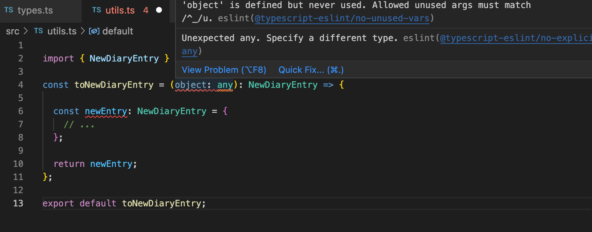
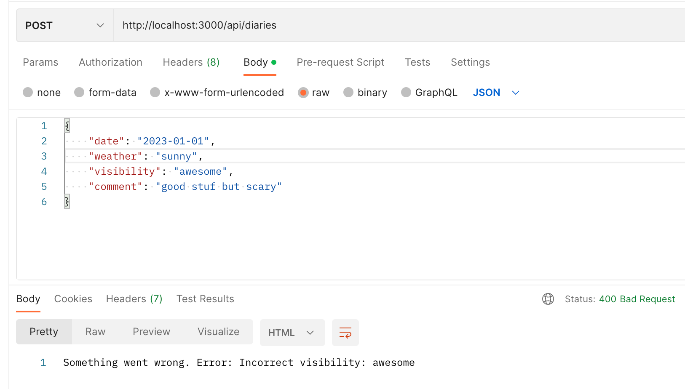

<div class="content">

Now that we have a basic understanding of how TypeScript works and how to create small projects with it, it's time to start creating something useful. We are now going to create a new project that will introduce use cases that are a little more realistic.

One major change from the previous part is that <i>we're not going to use ts-node anymore</i>. It is a handy tool that helps you get started, but in the long run, it is advisable to use the official TypeScript compiler that comes with the <i>typescript</i> npm-package. The official compiler generates and packages JavaScript files from the .ts files so that the built <i>production version</i> won't contain any TypeScript code anymore. This is the exact outcome we are aiming for since TypeScript itself is not executable by browsers or Node.

### Setting up the project

We will create a project for Ilari, who loves flying small planes but has a difficult time managing his flight history. He is a coder himself, so he doesn't necessarily need a user interface, but he'd like to use some custom software with HTTP requests and retain the possibility of later adding a web-based user interface to the application.

Let's start by creating our first real project: <i>Ilari's flight diaries</i>. As usual, run *npm init* and install the *typescript* package as a dev dependency.

```shell
 npm install typescript --save-dev
```

TypeScript's Native Compiler (<i>tsc</i>) can help us initialize our project by generating our <i>tsconfig.json</i> file.
First, we need to add the *tsc* command to the list of executable scripts in <i>package.json</i> (unless you have installed *typescript* globally). Even if you installed TypeScript globally, you should always add it as a dev dependency to your project.

The npm script for running *tsc* is set as follows:

```json
{
  // ..
  "scripts": {
    "tsc": "tsc" // highlight-line
  },
  // ..
}
```

The bare *tsc* command is often added to *scripts* so that other scripts can use it, hence don't be surprised to find it set up within the project like this.

We can now initialize our tsconfig.json settings by running:

```shell
 npm run tsc -- --init
```

 **Note** the extra *--* before the actual argument! Arguments before *--*  are interpreted as being for the *npm* command, while the ones after that are meant for the command that is run through the script (i.e. *tsc* in this case).

The <i>tsconfig.json</i> file we just created contains a lengthy list of every configuration available to us. However, most of them are commented out.
Studying this file can help you find some configuration options you might need.
It is also completely okay to keep the commented lines, in case you might need them someday.

At the moment, we want the following to be active:

```json
{
  "compilerOptions": {
    "target": "ES6",
    "outDir": "./build/",
    "module": "commonjs",
    "strict": true,
    "noUnusedLocals": true,
    "noUnusedParameters": true,
    "noImplicitReturns": true,
    "noFallthroughCasesInSwitch": true,
    "esModuleInterop": true
  }
}
```

Let's go through each configuration:

The *target* configuration tells the compiler which *ECMAScript* version to use when generating JavaScript. ES6 is supported by most browsers, so it is a good and safe option.

*outDir* tells where the compiled code should be placed.

*module* tells the compiler that we want to use *CommonJS* modules in the compiled code. This means we can use the old *require* syntax instead of the *import* one, which is not supported in older versions of *Node*, such as version 10.

*strict* is a shorthand for multiple separate options:
<i>noImplicitAny, noImplicitThis, alwaysStrict, strictBindCallApply, strictNullChecks, strictFunctionTypes and strictPropertyInitialization</i>.
They guide our coding style to use the TypeScript features more strictly.
For us, perhaps the most important is the already-familiar [noImplicitAny](https://www.staging-typescript.org/tsconfig#noImplicitAny). It prevents implicitly setting type *any*, which can for example happen if you don't type the parameters of a function.
Details about the rest of the configurations can be found in the [tsconfig documentation](https://www.staging-typescript.org/tsconfig#strict).
Using *strict* is suggested by the official documentation.

*noUnusedLocals* prevents having unused local variables, and *noUnusedParameters* throws an error if a function has unused parameters.

*noImplicitReturns* checks all code paths in a function to ensure they return a value.

*noFallthroughCasesInSwitch* ensures that, in a *switch case*, each case ends either with a *return* or a *break* statement.

*esModuleInterop* allows interoperability between CommonJS and ES Modules; see more in the [documentation](https://www.staging-typescript.org/tsconfig#esModuleInterop).

Now that we have set our configuration, we can continue by installing <i>express</i> and, of course, also <i>@types/express</i>. Also, since this is a real project, which is intended to be grown over time, we will use ESlint from the very beginning:

```shell
npm install express
npm install --save-dev eslint @types/express @typescript-eslint/eslint-plugin @typescript-eslint/parser
```

Now our <i>package.json</i> should look like this:

```json
{
  "name": "flight_diary",
  "version": "1.0.0",
  "description": "",
  "main": "index.js",
  "scripts": {
    "tsc": "tsc"
  },
  "author": "Jane Doe",
  "license": "ISC",
  "devDependencies": {
    "@types/express": "^4.17.13",
    "@typescript-eslint/eslint-plugin": "^5.12.1",
    "@typescript-eslint/parser": "^5.12.1",
    "eslint": "^8.9.0",
    "typescript": "^4.5.5"
  },
  "dependencies": {
    "express": "^4.17.3"
  }
}
```

We also create a <i>.eslintrc</i> file with the following content:

```json
{
  "extends": [
    "eslint:recommended",
    "plugin:@typescript-eslint/recommended",
    "plugin:@typescript-eslint/recommended-requiring-type-checking"
  ],
  "plugins": ["@typescript-eslint"],
  "env": {
    "browser": true,
    "es6": true,
    "node": true
  },
  "rules": {
    "@typescript-eslint/semi": ["error"],
    "@typescript-eslint/explicit-function-return-type": "off",
    "@typescript-eslint/explicit-module-boundary-types": "off",
    "@typescript-eslint/restrict-template-expressions": "off",
    "@typescript-eslint/restrict-plus-operands": "off",
    "@typescript-eslint/no-unsafe-member-access": "off",
    "@typescript-eslint/no-unused-vars": [
      "error",
      { "argsIgnorePattern": "^_" }
    ],
    "no-case-declarations": "off"
  },
  "parser": "@typescript-eslint/parser",
  "parserOptions": {
    "project": "./tsconfig.json"
  }
}
```

Now we just need to set up our development environment, and we are ready to start writing some serious code.
There are many different options for this. One option could be to use the familiar <i>nodemon</i> with <i>ts-node</i>. However, as we saw earlier, <i>ts-node-dev</i> does the same thing, so we will use that instead.
So, let's install <i>ts-node-dev</i>:

```shell
npm install --save-dev ts-node-dev
```

We finally define a few more npm scripts, and voilà, we are ready to begin:

```json
{
  // ...
  "scripts": {
    "tsc": "tsc",
    "dev": "ts-node-dev index.ts", // highlight-line
    "lint": "eslint --ext .ts ." // highlight-line
  },
  // ...
}
```

As you can see, there is a lot of stuff to go through before beginning the actual coding. When you are working on a real project, careful preparations support your development process. Take the time needed to create a good setup for yourself and your team, so that everything runs smoothly in the long run.

### Let there be code

Now we can finally start coding! As always, we start by creating a ping endpoint, just to make sure everything is working.

The contents of the <i>index.ts</i> file:

```js
import express from 'express';
const app = express();
app.use(express.json());

const PORT = 3000;

app.get('/ping', (_req, res) => {
  console.log('someone pinged here');
  res.send('pong');
});

app.listen(PORT, () => {
  console.log(`Server running on port ${PORT}`);
});
```

Now, if we run the app with *npm run dev*, we can verify that a request to <http://localhost:3000/ping> gives the response <i>pong</i>, so our configuration is set!

When starting the app with *npm run dev*, it runs in development mode.
The development mode is not suitable at all when we later operate the app in production.

Let's try to create a <i>production build</i> by running the TypeScript compiler. Since we have defined the *outdir* in our tsconfig.json, nothing's left but to run the script *npm run tsc*.

Just like magic, a native runnable JavaScript production build of the Express backend is created in file <i>index.js</i> inside the directory <i>build</i>. The compiled code looks like this

```js
"use strict";
var __importDefault = (this && this.__importDefault) || function (mod) {
    return (mod && mod.__esModule) ? mod : { "default": mod };
};
Object.defineProperty(exports, "__esModule", { value: true });
const express_1 = __importDefault(require("express"));
const app = (0, express_1.default)();
app.use(express_1.default.json());
const PORT = 3000;
app.get('/ping', (_req, res) => {
    console.log('someone pinged here');
    res.send('pong');
});
app.listen(PORT, () => {
    console.log(`Server running on port ${PORT}`);
});
```

Currently, if we run ESlint it will also interpret the files in the <i>build</i> directory. We don't want that, since the code there is compiler-generated. We can prevent this by creating a  <i>.eslintignore</i> file that lists the content we want ESlint to ignore, just like we do with git and <i>.gitignore</i>.

Let's add an npm script for running the application in production mode:

```json
{
  // ...
  "scripts": {
    "tsc": "tsc",
    "dev": "ts-node-dev index.ts",
    "lint": "eslint --ext .ts .",
    "start": "node build/index.js" // highlight-line
  },
  // ...
}
```

When we run the app with *npm start*, we can verify that the production build also works:


Now we have a minimal working pipeline for developing our project.
With the help of our compiler and ESlint, it also ensures that good code quality is maintained. With this base, we can start creating an app that we could, later on, deploy into a production environment.

</div>

<div class="tasks">

### Exercises 9.8-9.9

#### Before you start the exercises

For this set of exercises, you will be developing a backend for an existing project called **Patientor**, which is a simple medical record application for doctors who handle diagnoses and basic health information of their patients.

The [frontend](https://github.com/fullstack-hy2020/patientor) has already been built by outsider experts and your task is to create a backend to support the existing code.

#### WARNING

Quite often VS code looses track what is really happening in the code and it shows type or style related warnings despite the code has been fixed. If this happens (to me it has happened quite often), just restart the editor. It is also good to doublecheck that everything really works by running the compiler and the eslint from the command line with commands:

```
npm run tsc
npm run lint
```

When run in command line you get the "real result" for sure. So, never trust the editor too much!

#### 9.8: Patientor backend, step1

Initialize a new backend project that will work with the frontend. Configure eslint and tsconfig with the same configurations as proposed in the material. Define an endpoint that answers HTTP GET requests for route */api/ping*.

The project should be runnable with npm scripts, both in development mode and, as compiled code, in production mode.

#### 9.9: Patientor backend, step2

Fork and clone the project [patientor](https://github.com/fullstack-hy2020/patientor). Start the project with the help of the README file.

You can run this command if you get an error message when trying to start the frontend:

```shell
npm update chokidar
```

 You should be able to use the frontend without a functioning backend.

Ensure that the backend answers the ping request that the <i>frontend</i> has made on startup. Check the developer tools to make sure it works:


You might also want to have a look at the <i>console</i> tab. If something fails, [part 3](/en/part3) of the course shows how the problem can be solved.

</div>

<div class="content">

### Implementing the functionality

Finally, we are ready to start writing some code.

Let's start from the basics. Ilari wants to be able to keep track of his experiences on his flight journeys.

He wants to be able to save <i>diary entries</i>, which contain:

- The date of the entry
- Weather conditions (good, windy, rainy or stormy)
- Visibility (good, ok or poor)
- Free text detailing the experience

We have obtained some sample data, which we will use as a base to build on.
The data is saved in JSON format and can be found [here](https://github.com/fullstack-hy2020/misc/blob/master/diaryentries.json).

The data looks like the following:

```json
[
  {
    "id": 1,
    "date": "2017-01-01",
    "weather": "rainy",
    "visibility": "poor",
    "comment": "Pretty scary flight, I'm glad I'm alive"
  },
  {
    "id": 2,
    "date": "2017-04-01",
    "weather": "sunny",
    "visibility": "good",
    "comment": "Everything went better than expected, I'm learning much"
  },
  // ...
]
```

Let's start by creating an endpoint that returns all flight diary entries.

First, we need to make some decisions on how to structure our source code. It is better to place all source code under <i>src</i> directory, so source code is not mixed with configuration files.
We will move <i>index.ts</i> there and make the necessary changes to the npm scripts.

We will place all [routers](/en/part4/structure_of_backend_application_introduction_to_testing) and modules which are responsible for handling a set of specific resources such as <i>diaries</i>, under the directory <i>src/routes</i>.
This is a bit different than what we did in [part 4](/en/part4), where we used the directory <i>src/controllers</i>.

The router taking care of all diary endpoints is in <i>src/routes/diaries.ts</i> and looks like this:

```js
import express from 'express';

const router = express.Router();

router.get('/', (_req, res) => {
  res.send('Fetching all diaries!');
});

router.post('/', (_req, res) => {
  res.send('Saving a diary!');
});

export default router;
```

We'll route all requests to prefix */api/diaries* to that specific router in <i>index.ts</i>

```js
import express from 'express';
import diaryRouter from './routes/diaries'; // highlight-line
const app = express();
app.use(express.json());

const PORT = 3000;

app.get('/ping', (_req, res) => {
  console.log('someone pinged here');
  res.send('pong');
});

app.use('/api/diaries', diaryRouter); // highlight-line


app.listen(PORT, () => {
    console.log(`Server running on port ${PORT}`);
});
```

And now, if we make an HTTP GET request to <http://localhost:3000/api/diaries>, we should see the message: *Fetching all diaries!*

Next, we need to start serving the seed data (found [here](https://github.com/fullstack-hy2020/misc/blob/master/diaryentries.json)) from the app. We will fetch the data and save it to <i>data/entries.json</i>.

We won't be writing the code for the actual data manipulations in the router. We will create a <i>service</i> that takes care of the data manipulation instead.
It is quite a common practice to separate the "business logic" from the router code into modules, which are quite often called <i>services</i>.
The name service originates from [Domain-driven design](https://en.wikipedia.org/wiki/Domain-driven_design) and was made popular by the [Spring](https://spring.io/) framework.

Let's create a <i>src/services</i> directory and
place the <i>diaryService.ts</i> file in it.
The file contains two functions for fetching and saving diary entries:

```js
import diaryData from '../../data/entries.json';

const getEntries = () => {
  return diaryData;
};

const addDiary = () => {
  return null;
};

export default {
  getEntries,
  addDiary
};
```

But something is not right:


The hint says we might want to use *resolveJsonModule*. Let's add it to our tsconfig:

```json
{
  "compilerOptions": {
    "target": "ES6",
    "outDir": "./build/",
    "module": "commonjs",
    "strict": true,
    "noUnusedLocals": true,
    "noUnusedParameters": true,
    "noImplicitReturns": true,
    "noFallthroughCasesInSwitch": true,
    "esModuleInterop": true,
    "resolveJsonModule": true // highlight-line
  }
}
```

And our problem is solved.

> **NB**: For some reason, VSCode sometimes complains that it cannot find the file <i>../../data/entries.json</i> from the service despite the file existing. That is a bug in the editor, and goes away when the editor is restarted.

Earlier, we saw how the compiler can decide the type of a variable by the value it is assigned.
Similarly, the compiler can interpret large data sets consisting of objects and arrays.
Due to this, the compiler warns us if we try to do something suspicious with the JSON data we are handling. For example, if we are handling an array containing objects of a specific type, and we try to add an object which does not have all the fields the other objects have, or has type conflicts (for example, a number where there should be a string), the compiler can give us a warning.

Even though the compiler is pretty good at making sure we don't do anything unwanted, it is safer to define the types for the data ourselves.

Currently, we have a basic working TypeScript Express app, but there are barely any actual <i>typings</i> in the code. Since we know what type of data should be accepted for the *weather* and *visibility* fields, there is no reason for us not to include their types in the code.

Let's create a file for our types, <i>types.ts</i>, where we'll define all our types for this project.

First, let's type the *Weather* and *Visibility* values using a [union type](https://www.typescriptlang.org/docs/handbook/2/everyday-types.html#union-types) of the allowed strings:

```js
export type Weather = 'sunny' | 'rainy' | 'cloudy' | 'windy' | 'stormy';

export type Visibility = 'great' | 'good' | 'ok' | 'poor';
```

And, from there, we can continue by creating a DiaryEntry type, which will be an [interface](https://www.typescriptlang.org/docs/handbook/2/everyday-types.html#interfaces):

```js
export interface DiaryEntry {
  id: number;
  date: string;
  weather: Weather;
  visibility: Visibility;
  comment: string;
}
```

We can now try to type our imported JSON:

```js
import diaryData from '../../data/entries.json';

import { DiaryEntry } from '../types'; // highlight-line

const diaries: DiaryEntry[] = diaryData; // highlight-line

const getEntries = (): DiaryEntry[] => { // highlight-line
  return diaries; // highlight-line
};

const addDiary = () => {
  return null;
};

export default {
  getEntries,
  addDiary
};
```

But since the JSON already has its values declared, assigning a type for the data set results in an error:


The end of the error message reveals the problem: the *weather* fields are incompatible. In *DiaryEntry*, we specified that its type is *Weather*, but
the TypeScript compiler had inferred its type to be *string*.

We can fix the problem by doing a [type assertion](https://www.typescriptlang.org/docs/handbook/2/everyday-types.html#type-assertions). As we already [mentioned](/en/part9/first_steps_with_type_script#type-assertion) type assertions should be done only if we are certain we know what we are doing!

If we assert the type of the variable *diaryData* to be *DiaryEntry* with the keyword *as*, everything should work:

```js
import diaryData from '../../data/entries.json'

import { Weather, Visibility, DiaryEntry } from '../types'

const diaries: DiaryEntry[] = diaryData as DiaryEntry[]; // highlight-line

const getEntries = (): DiaryEntry[] => {
  return diaries;
}

const addDiary = () => {
  return null;
}

export default {
  getEntries,
  addDiary
};
```

We should never use type assertion unless there is no other way to proceed, as there is always the danger we assert an unfit type to an object and cause a nasty runtime error.
While the compiler trusts you to know what you are doing when using *as*, by doing this, we are not using the full power of TypeScript but relying on the coder to secure the code.

In our case, we could change how we export our data so we can type it within the data file.
Since we cannot use typings in a JSON file, we should convert the JSON file to a ts file _diaries.ts_ which exports the typed data like so:

```js
import { DiaryEntry } from "../src/types"; // highlight-line

const diaryEntries: DiaryEntry[] = [ // highlight-line
  {
      "id": 1,
      "date": "2017-01-01",
      "weather": "rainy",
      "visibility": "poor",
      "comment": "Pretty scary flight, I'm glad I'm alive"
  },
  // ...
]; 

export default diaryEntries; // highlight-line
```

Now, when we import the array, the compiler interprets it correctly and the *weather* and *visibility* fields are understood right:

```js
import diaries from '../../data/entries'; // highlight-line

import { DiaryEntry } from '../types';

const getEntries = (): DiaryEntry[] => {
  return diaries;
}

const addDiary = () => {
  return null;
}

export default {
  getEntries,
  addDiary
};
```

Note that, if we want to be able to save entries without a certain field, e.g. <i>comment</i>, we could set the type of the field as [optional](http://www.typescriptlang.org/docs/handbook/interfaces.html#optional-properties) by adding *?* to the type declaration:

```js
export interface DiaryEntry {
  id: number;
  date: string;
  weather: Weather;
  visibility: Visibility;
  comment?: string; // highlight-line
}
```

### Node and JSON modules

It is important to take note of a problem that may arise when using the tsconfig [resolveJsonModule](https://www.typescriptlang.org/en/tsconfig#resolveJsonModule) option:

```json
{
  "compilerOptions": {
    // ...
    "resolveJsonModule": true // highlight-line
  }
}
```

According to the node documentation for [file modules](https://nodejs.org/api/modules.html#modules_file_modules),
node will try to resolve modules in order of extensions:

```shell
 ["js", "json", "node"]
```

In addition to that, by default, <i>ts-node</i> and <i>ts-node-dev</i> extend the list of possible node module extensions to:

```shell
 ["js", "json", "node", "ts", "tsx"]
```

> **NB**: The validity of *.js*, *.json* and *.node* files as modules in TypeScript depend on environment configuration, including *tsconfig* options such as *allowJs* and *resolveJsonModule*.

Consider a flat folder structure containing files:

```shell
  ├── myModule.json
  └── myModule.ts
```

In TypeScript, with the *resolveJsonModule* option set to true, the file <i>myModule.json</i> becomes a valid node module. Now, imagine a scenario where we wish to take the file <i>myModule.ts</i> into use:

```js
import myModule from "./myModule";
```

Looking closely at the order of node module extensions:

```shell
 ["js", "json", "node", "ts", "tsx"]
```

We notice that the <i>.json</i> file extension takes precedence over <i>.ts</i> and so <i>myModule.json</i> will be imported and not <i>myModule.ts</i>.

To avoid time-eating bugs, it is recommended that within a flat directory, each file with a valid node module extension has a unique filename.

### Utility Types

Sometimes, we might want to use a specific modification of a type.
For example, consider a page for listing some data, some of which is sensitive and some of which is non-sensitive.
We might want to be sure that no sensitive data is used or displayed. We could <i>pick</i> the fields of a type we allow to be used to enforce this.
We can do that by using the utility type [Pick](https://www.typescriptlang.org/docs/handbook/utility-types.html#picktype-keys).

In our project, we should consider that Ilari might want to create a listing of all his diary entries <i>excluding</i> the comment field since, during a very scary flight, he might end up writing something he wouldn't necessarily want to show anyone else.

The [Pick](https://www.typescriptlang.org/docs/handbook/utility-types.html#picktype-keys) utility type allows us to choose which fields of an existing type we want to use.
Pick can be used to either construct a completely new type or to inform a function what it should return on runtime.
Utility types are a special kind of type, but they can be used just like regular types.

In our case, to create a "censored" version of the *DiaryEntry* for public displays, we can use *Pick* in the function declaration:

```js
const getNonSensitiveEntries =
  (): Pick<DiaryEntry, 'id' | 'date' | 'weather' | 'visibility'>[] => {
    // ...
  }
```

and the compiler would expect the function to return an array of values of the modified *DiaryEntry* type, which includes only the four selected fields.

In this case, we want to exclude only one field, so it would be even better to use the [Omit](https://www.typescriptlang.org/docs/handbook/utility-types.html#omittype-keys) utility type, which we can use to declare which fields to exclude:

```js
const getNonSensitiveEntries = (): Omit<DiaryEntry, 'comment'>[] => {
  // ...
}
```

To improve the readability, we should most definitively define a [type alias](https://www.typescriptlang.org/docs/handbook/2/everyday-types.html#type-aliases) *NonSensitiveDiaryEntry* in the file <i>types.ts</i>:

```js
export type NonSensitiveDiaryEntry = Omit<DiaryEntry, 'comment'>;
```

The code becomes now much more clear and more descriptive:

```js
import diaries from '../../data/entries';
import { NonSensitiveDiaryEntry, DiaryEntry } from '../types'; // highlight-line

const getEntries = (): DiaryEntry[] => {
  return diaries;
};

const getNonSensitiveEntries = (): NonSensitiveDiaryEntry[] => { // highlight-line
  return diaries;
};

const addDiary = () => {
  return null;
};

export default {
  getEntries,
  addDiary,
  getNonSensitiveEntries // highlight-line
};
```

One thing in our application is a cause for concern. In *getNonSensitiveEntries*, we are returning the complete diary entries, and <i>no error is given</i> despite typing!

This happens because [TypeScript only checks](http://www.typescriptlang.org/docs/handbook/type-compatibility.html) whether we have all of the required fields or not, but excess fields are not prohibited. In our case, this means that it is <i>not prohibited</i> to return an object of type *DiaryEntry[]*, but if we were to try to access the *comment* field, it would not be possible because we would be accessing a field that TypeScript is unaware of even though it exists.

Unfortunately, this can lead to unwanted behavior if you are not aware of what you are doing; the situation is valid as far as TypeScript is concerned, but you are most likely allowing use that is not wanted.
If we were now to return all of the diary entries from the *getNonSensitiveEntries* function to the frontend, we would be <i>leaking the unwanted fields to the requesting browser</i> - even though our types seem to imply otherwise!

Because TypeScript doesn't modify the actual data but only its type, we need to exclude the fields ourselves:

```js
import diaries from '../../data/entries.ts'

import { NonSensitiveDiaryEntry, DiaryEntry } from '../types'

const getEntries = () : DiaryEntry[] => {
  return diaries
}

// highlight-start
const getNonSensitiveEntries = (): NonSensitiveDiaryEntry[] => {
  return diaries.map(({ id, date, weather, visibility }) => ({
    id,
    date,
    weather,
    visibility,
  }));
};
// highlight-end

const addDiary = () => {
  return null;
}

export default {
  getEntries,
  getNonSensitiveEntries,
  addDiary
}
```

If we now try to return this data with the basic *DiaryEntry* type, i.e. if we type the function as follows:

```js
const getNonSensitiveEntries = (): DiaryEntry[] => {
```

we would get the following error:


Again, the last line of the error message is the most helpful one. Let's undo this undesired modification.

\* Note that if you make the comment field optional (using the *?* operator), everything will work fine.

Utility types include many handy tools, and it is undoubtedly worth it to take some time to study [the documentation](https://www.typescriptlang.org/docs/handbook/utility-types.html).

Finally, we can complete the route which returns all diary entries:

```js
import express from 'express';
import diaryService from '../services/diaryService';  // highlight-line

const router = express.Router();

router.get('/', (_req, res) => {
  res.send(diaryService.getNonSensitiveEntries()); // highlight-line
});

router.post('/', (_req, res) => {
    res.send('Saving a diary!');
});

export default router;
```

The response is what we expect it to be:


</div>

<div class="tasks">

### Exercises 9.10-9.11

Similarly to Ilari's flight service, we do not use a real database in our app but instead use hardcoded data that is in the files [diagnoses.ts](https://github.com/fullstack-hy2020/misc/blob/master/diagnoses.ts) and [patients.ts](https://github.com/fullstack-hy2020/misc/blob/master/patients.ts). Get the files and store those in a directory called <i>data</i> in your project. All data modification can be done in runtime memory, so during this part, it is <i>not necessary to write to a file</i>.

#### 9.10: Patientor backend, step3

Create a type *Diagnose* and use it to create endpoint */api/diagnoses* for fetching all diagnoses with HTTP GET.

Structure your code properly by using meaningfully-named directories and files.

**Note** that <i>diagnoses</i> may or may not contain the field *latin*. You might want to use [optional properties](https://www.typescriptlang.org/docs/handbook/2/everyday-types.html#optional-properties) in the type definition.

#### 9.11: Patientor backend, step4

Create data type *Patient* and set up the GET endpoint */api/patients* which returns all patients to the frontend, excluding field *ssn*. Use a [utility type](https://www.typescriptlang.org/docs/handbook/utility-types.html) to make sure you are selecting and returning only the wanted fields.

In this exercise, you may assume that field *gender* has type *string*.

Try the endpoint with your browser and ensure that *ssn* is not included in the response:


After creating the endpoint, ensure that the <i>frontend</i> shows the list of patients:


</div>

<div class="content">

### Preventing an accidental undefined result

Let's extend the backend to support fetching one specific entry with an HTTP GET request to route *api/diaries/:id*.

The DiaryService needs to be extended with a *findById* function:

```js
// ...

// highlight-start
const findById = (id: number): DiaryEntry => {
  const entry = diaries.find(d => d.id === id);
  return entry;
};
// highlight-end

export default {
  getEntries,
  getNonSensitiveEntries,
  addDiary,
  findById // highlight-line
}
```

But once again, a new problem emerges:


The issue is that there is no guarantee that an entry with the specified id can be found.
It is good that we are made aware of this potential problem already at compile phase. Without TypeScript, we would not be warned about this problem, and in the worst-case scenario, we could have ended up returning an *undefined* object instead of informing the user about the specified entry not being found.

First of all, in cases like this, we need to decide what the <i>return value</i> should be if an object is not found, and how the case should be handled.
The *find* method of an array returns *undefined* if the object is not found, and this is fine.
We can solve our problem by typing the return value as follows:

```js
const findById = (id: number): DiaryEntry | undefined => { // highlight-line
  const entry = diaries.find(d => d.id === id);
  return entry;
}
```

The route handler is the following:

```js
import express from 'express';
import diaryService from '../services/diaryService'

router.get('/:id', (req, res) => {
  const diary = diaryService.findById(Number(req.params.id));

  if (diary) {
    res.send(diary);
  } else {
    res.sendStatus(404);
  }
});

// ...

export default router;
```

### Adding a new diary

Let's start building the HTTP POST endpoint for adding new flight diary entries.
The new entries should have the same type as the existing data.

The code handling of the response looks as follows:

```js
router.post('/', (req, res) => {
  const { date, weather, visibility, comment } = req.body;
  const addedEntry = diaryService.addDiary(
    date,
    weather,
    visibility,
    comment,
  );
  res.json(addedEntry);
});
```

The corresponding method in *diaryService* looks like this:

```js
import {
  NonSensitiveDiaryEntry,
  DiaryEntry,
  Visibility, // highlight-line
  Weather // highlight-line
} from '../types';


const addDiary = (
    date: string, weather: Weather, visibility: Visibility, comment: string
  ): DiaryEntry => {

  const newDiaryEntry = {
    id: Math.max(...diaries.map(d => d.id)) + 1,
    date,
    weather,
    visibility,
    comment,
  };

  diaries.push(newDiaryEntry);
  return newDiaryEntry;
};
```

As you can see, the *addDiary* function is becoming quite hard to read now that we have all the fields as separate parameters. It might be better to just send the data as an object to the function:

```js
router.post('/', (req, res) => {
  const { date, weather, visibility, comment } = req.body;
  const addedEntry = diaryService.addDiary({ // highlight-line
    date,
    weather,
    visibility,
    comment,
  }); // highlight-line
  res.json(addedEntry);
})
```

But wait, what is the type of this object? It is not exactly a *DiaryEntry*, since it is still missing the *id* field. It could be useful to create a new type, *NewDiaryEntry*, for an entry that hasn't been saved yet. Let's create that in <i>types.ts</i> using the existing *DiaryEntry* type and the [Omit](https://www.typescriptlang.org/docs/handbook/utility-types.html#omittype-keys) utility type:

```js
export type NewDiaryEntry = Omit<DiaryEntry, 'id'>;
```

Now we can use the new type in our DiaryService,
and destructure the new entry object when creating an entry to be saved:

```js
import { NewDiaryEntry, NonSensitiveDiaryEntry, DiaryEntry } from '../types'; // highlight-line

// ...

const addDiary = ( entry: NewDiaryEntry ): DiaryEntry => {  // highlight-line
  const newDiaryEntry = {
    id: Math.max(...diaries.map(d => d.id)) + 1,
    ...entry // highlight-line
  };

  diaries.push(newDiaryEntry);
  return newDiaryEntry;
};
```

Now the code looks much cleaner!

There is still a complaint from our code:


The cause is the ESlint rule [@typescript-eslint/no-unsafe-assignment](https://github.com/typescript-eslint/typescript-eslint/blob/master/packages/eslint-plugin/docs/rules/no-unsafe-assignment.md) that prevents us from assigning the fields of a request body to variables.

For the time being, let us just ignore the ESlint rule from the whole file by adding the following as the first line of the file:

``` js
/* eslint-disable @typescript-eslint/no-unsafe-assignment */
```

To parse the incoming data we must have the *json* middleware configured:

``` js
import express from 'express';
import diaryRouter from './routes/diaries';
const app = express();
app.use(express.json()); // highlight-line

const PORT = 3000;

app.use('/api/diaries', diaryRouter);

app.listen(PORT, () => {
  console.log(`Server running on port ${PORT}`);
});
```

Now the application is ready to receive HTTP POST requests for new diary entries of the correct type!


### Proofing requests

There are plenty of things that can go wrong when we accept data from outside sources.
Applications rarely work completely on their own, and we are forced to live with the fact that data from sources outside of our system cannot be fully trusted.
When we receive data from an outside source, there is no way it can already be typed when we receive it. We need to make decisions on how to handle the uncertainty that comes with this.

The disabled ESlint rule was hinting to us that the following assignment is risky:

```js
const newDiaryEntry = diaryService.addDiary({
  date,
  weather,
  visibility,
  comment,
});
```

We would like to have the assurance that the object in a POST request has the correct type. Let us now define a function *toNewDiaryEntry* that receives the request body as a parameter and returns a properly-typed *NewDiaryEntry* object. The function shall be defined in the file <i>utils.ts</i>.

The route definition uses the function as follows:

```js
import toNewDiaryEntry from '../utils'; // highlight-line

// ...

router.post('/', (req, res) => {
  try {
    const newDiaryEntry = toNewDiaryEntry(req.body); // highlight-line

    const addedEntry = diaryService.addDiary(newDiaryEntry); // highlight-line
    res.json(addedEntry);
  } catch (error: unknown) {
    let errorMessage = 'Something went wrong.';
    if (error instanceof Error) {
      errorMessage += ' Error: ' + error.message;
    }
    res.status(400).send(errorMessage);
  }
})
```

We can now also remove the first line that ignores the ESlint rule *no-unsafe-assignment*.

Since we are now writing secure code and trying to ensure that we are getting exactly the data we want from the requests, we should get started with parsing and validating each field we are expecting to receive.

The skeleton of the function *toNewDiaryEntry* looks like the following:

```js
import { NewDiaryEntry } from './types';

const toNewDiaryEntry = (object): NewDiaryEntry => {
  const newEntry: NewDiaryEntry = {
    // ...
  };

  return newEntry;
};

export default toNewDiaryEntry;
```

The function should parse each field and make sure that the return value is exactly of type *NewDiaryEntry*. This means we should check each field separately.

Once again, we have a type issue: what is the  type of the parameter *object*? Since the *object* **is** the body of a request, Express has typed it as *any*. Since the idea of this function is to map fields of unknown type to fields of the correct type and check whether they are defined as expected, this might be the rare case where we <i>want to allow the *any* type</i>.

However, if we type the object as *any*, ESlint complains about that:



We could ignore the lint rule but a better idea is to follow one of the advices the editor gives in the <i>Quick Fix</i> and set the parameter type to *unknown*:

```js
import { NewDiaryEntry } from './types';

const toNewDiaryEntry = (object: unknown): NewDiaryEntry => { // highlight-line
  const newEntry: NewDiaryEntry = {
    // ...
  }

  return newEntry;
}

export default toNewDiaryEntry;
```

[unknown](https://www.typescriptlang.org/docs/handbook/2/functions.html#unknown) is the ideal type for our kind of situation of input validation, since we don't yet need to define the type to match *any* type, but can first verify the type and then confirm the expected type. With the use of *unknown*, we also don't need to worry about the *@typescript-eslint/no-explicit-any* ESlint rule, since we are not using *any*. However, we might still need to use *any* in some cases where we are not yet sure about the type and need to access properties of an *any* object to validate or type-check the property values themselves.

> #### A sidenote from the editor
>
> <i>If you are like me and hate having a code in broken state for a long time due to incomplete typing, you could star by "faking" the function: </i>
>
>
>```js
>const toNewDiaryEntry = (object: unknown): NewDiaryEntry => {
>
>  console.log(object); // now object is no more unused
>  const newEntry: NewDiaryEntry = {
>    weather: 'cloudy', // fake the return value
>    visibility: 'great',
>    date: '2022-1-1',
>    comment: 'fake news'
>  };
>
>  return newEntry;
>};
>```
>
> <i>So before the real data and types are ready to use, I'am just returning here something that has for the sure the right type. The code stays in a operational state all the time and my blood pressure remains in normal level. </i>

### Type guards

Let us start creating the parsers for each of the fields of *object*.

To validate the *comment* field, we need to check that it exists, and to ensure that it is of the type *string*.

The function should look something like this:

```js
const parseComment = (comment: unknown): string => {
  if (!comment || !isString(comment)) {
    throw new Error('Incorrect or missing comment');
  }

  return comment;
};
```

The function gets a parameter of type *unknown* and returns it as type *string* if it exists and is of the right type.

The string validation function looks like this:

```js
const isString = (text: unknown): text is string => {
  return typeof text === 'string' || text instanceof String;
};
```

The function is a so-called [type guard](https://www.typescriptlang.org/docs/handbook/2/narrowing.html#using-type-predicates). That means it is a function that returns a boolean <i>and</i> has a <i>type predicate</i> as the return type. In our case, the type predicate is:

```js
text is string
```

The general form of a type predicate is *parameterName is Type* where the *parameterName* is the name of the function parameter and *Type* is the targeted type.

If the type guard function returns true, the TypeScript compiler knows that the tested variable has the type that was defined in the type predicate.

Before the type guard is called, the actual type of the variable *comment* is not known:


But after the call, if the code proceeds past the exception (that is, the type guard returned true), then the compiler knows that *comment* is of type *string*:


The use of a type guard that returns a type predicate is one way to do [type narrowing](https://www.typescriptlang.org/docs/handbook/2/narrowing.html), that is, to give a variable a more strict type or accurate type. As we will soon see there are also other kind of [type guards](https://www.typescriptlang.org/docs/handbook/2/narrowing.html) available.

> #### Side note: testing if something is a string
>
> <i>Why do we have two conditions in the string type guard?</i>
>
>```js
>const isString = (text: unknown): text is string => {
>  return typeof text === 'string' || text instanceof String; // highlight-line
>}
>```
>
><i>Would it not be enough to write the guard like this?</i>
>
>```js
>const isString = (text: unknown): text is string => {
>  return typeof text === 'string';
>}
>```
>
><i>Most likely, the simpler form is good enough for all practical purposes. However, if we want to be sure, both conditions are needed. There are two different ways to create string objects in JavaScript which both work a bit differently when compared to the *typeof* and *instanceof* operators:</i>
>
>```js
>const a = "I'm a string primitive";
>const b = new String("I'm a String Object");
>typeof a; --> returns 'string'
>typeof b; --> returns 'object'
>a instanceof String; --> returns false
>b instanceof String; --> returns true
>```
>
><i>However, it is unlikely that anyone would create a string with a constructor function. Most likely the simpler version of the type guard would be just fine.</i>

Next, let's consider the *date* field.
Parsing and validating the date object is pretty similar to what we did with comments.
Since TypeScript doesn't know a type for a date, we need to treat it as a *string*.
We should however still use JavaScript-level validation to check whether the date format is acceptable.

We will add the following functions:

```js
const isDate = (date: string): boolean => {
  return Boolean(Date.parse(date));
};

const parseDate = (date: unknown): string => {
  if (!date || !isString(date) || !isDate(date)) {
      throw new Error('Incorrect or missing date: ' + date);
  }
  return date;
};
```

The code is nothing special. The only thing is that we can't use a type predicate based type guard here since a date in this case is only considered to be a *string*. Note that even though the *parseDate* function accepts the *date* variable as *unknown* after we check the type with *isString*, then its type is set as *string*, which is why we can give the variable to the *isDate* function requiring a string without any problems.

Finally, we are ready to move on to the last two types, *Weather* and *Visibility*.

We would like the validation and parsing to work as follows:

```js
const parseWeather = (weather: unknown): Weather => {
  if (!weather || !isString(weather) || !isWeather(weather)) {
      throw new Error('Incorrect or missing weather: ' + weather);
  }
  return weather;
};
```

The question is: how can we validate that the string is of a specific form?
One possible way to write the type guard would be this:

```js
const isWeather = (str: string): str is Weather => {
  return ['sunny', 'rainy', 'cloudy', 'stormy'].includes(str);
};
```

This would work just fine, but the problem is that the list of possible values for Weather does not necessarily stay in sync with the type definitions if the type is altered.
This is most certainly not good, since we would like to have just one source for all possible weather types.

### Enum

In our case, a better solution would be to improve the actual *Weather* type. Instead of a type alias, we should use the TypeScript [enum](https://www.typescriptlang.org/docs/handbook/enums.html), which allows us to use the actual values in our code at runtime, not only in the compilation phase.

Let us redefine the type *Weather* as follows:

```js
export enum Weather {
  Sunny = 'sunny',
  Rainy = 'rainy',
  Cloudy = 'cloudy',
  Stormy = 'stormy',
  Windy = 'windy',
}
```

Now we can check that a string is one of the accepted values, and the type guard can be written like this:

```js
const isWeather = (param: string): param is Weather => {
  return Object.values(Weather).map(v => v.toString()).includes(param);
};
```

Note that we need to take the string representation of the enum values for the comparison, that is why we do the mapping.

One issue arises after these changes. Our data in file <i>data/entries.ts</i> does not conform to our types anymore:


This is because we cannot just assume a string is an enum.

We can fix this by mapping the initial data elements to the *DiaryEntry* type with the *toNewDiaryEntry* function:

```js
import { DiaryEntry } from "../src/types";
import toNewDiaryEntry from "../src/utils";

const data = [
  {
      "id": 1,
      "date": "2017-01-01",
      "weather": "rainy",
      "visibility": "poor",
      "comment": "Pretty scary flight, I'm glad I'm alive"
  },
  // ...
]

const diaryEntries: DiaryEntry [] = data.map(obj => {
  const object = toNewDiaryEntry(obj) as DiaryEntry;
  object.id = obj.id;
  return object;
});

export default diaryEntries;
```

Note that since *toNewDiaryEntry* returns an object of type *NewDiaryEntry*, we need to assert it to be *DiaryEntry* with the [as](https://www.typescriptlang.org/docs/handbook/2/everyday-types.html#type-assertions) operator.

Enums are typically used when there is a set of predetermined values that are not expected to change in the future. Usually, enums are used for much tighter unchanging values (for example, weekdays, months, cardinal directions), but since they offer us a great way to validate our incoming values, we might as well use them in our case.

We still need to give the same treatment to *Visibility*. The enum looks as follows:

```js
export enum Visibility {
  Great = 'great',
  Good = 'good',
  Ok = 'ok',
  Poor = 'poor',
}
```

The type guard and the parser are below:

```js
const isVisibility = (param: string): param is Visibility => {
  return Object.values(Visibility).map(v => v.toString()).includes(param);
};

const parseVisibility = (visibility: unknown): Visibility => {
  if (!visibility || !isString(visibility) || !isVisibility(visibility)) {
      throw new Error('Incorrect or missing visibility: ' + visibility);
  }
  return visibility;
};
```

And finally, we can finalize the *toNewDiaryEntry* function that takes care of validating and parsing the fields of the POST body. There is however one more thing to take care of. If we try to access the fields of the parameter *object* as follows:

```js
const toNewDiaryEntry = (object: unknown): NewDiaryEntry => {
  const newEntry: NewDiaryEntry = {
    comment: parseComment(object.comment),
    date: parseDate(object.date),
    weather: parseWeather(object.weather),
    visibility: parseVisibility(object.visibility)
  };

  return newEntry;
};
```

we notice that the code does not compile. This is because the [unknown](https://www.typescriptlang.org/docs/handbook/release-notes/typescript-3-0.html#new-unknown-top-type) type does not allow any operations, so accessing the fields is not possible.

We can again fix the problem by type narrowing. We have now two type guards, the first checks that the parameter object exists and it has the type <i>object</i>. After this the second type guard uses the [in](https://www.typescriptlang.org/docs/handbook/2/narrowing.html#the-in-operator-narrowing) operator to ensure that the object has all the desired fields:

```js
const toNewDiaryEntry = (object: unknown): NewDiaryEntry => {
  if ( !object || typeof object !== 'object' ) {
    throw new Error('Incorrect or missing data');
  }

  if ('comment' in object && 'date' in object && 'weather' in object && 'visibility' in object)  {
    const newEntry: NewDiaryEntry = {
      weather: parseWeather(object.weather),
      visibility: parseVisibility(object.visibility),
      date: parseDate(object.date),
      comment: parseComment(object.comment)
    };
  
    return newEntry;
  }

  throw new Error('Incorrect data: some fields are missing');
};
```

If the guard does not evaluate to true, an exeption is thrown.

The use of operator _in_ actually now guarantees that the fields indeed exist in the object. Because of that, the existence check in parsers in no more needed:

```js
const parseVisibility = (visibility: unknown): Visibility => {
  // check !visibility removed:
  if (!isString(visibility) || !isVisibility(visibility)) {
      throw new Error('Incorrect visibility: ' + visibility);
  }
  return visibility;
};
```

If a field, e.g. _comment_ would be optional, the type narrowing should take that into account, and the operator [in](https://www.typescriptlang.org/docs/handbook/2/narrowing.html#the-in-operator-narrowing) could not be used quite as we did here, since the _in_ test requires the field to be present.

If we now try to create a new diary entry with invalid or missing fields, we are getting an appropriate error message:



The source code of the application can be found on [GitHub](https://github.com/fullstack-hy2020/flight-diary).

</div>

<div class="tasks">

### Exercises 9.12-9.13

#### 9.12: Patientor backend, step5

Create a POST endpoint */api/patients* for adding patients. Ensure that you can add patients also from the frontend. You can create unique ids of type *string* using the [uuid](https://github.com/uuidjs/uuid) library:

```js
import { v1 as uuid } from 'uuid'
const id = uuid()
```

#### 9.13: Patientor backend, step6

Set up safe parsing, validation and type predicate to the POST */api/patients* request.

Refactor the *gender* field to use an [enum type](http://www.typescriptlang.org/docs/handbook/enums.html).

</div>
