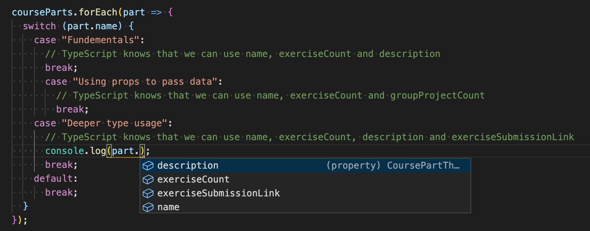
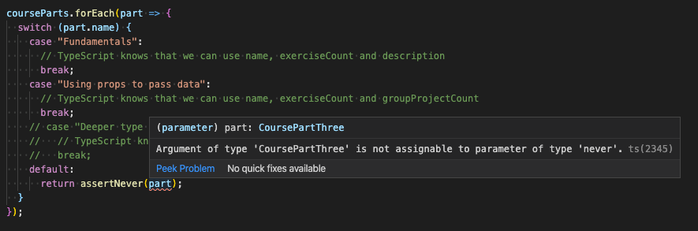
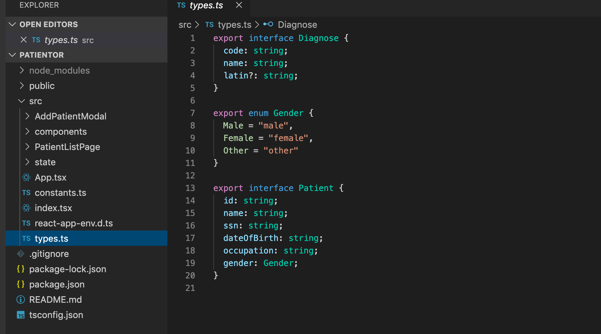
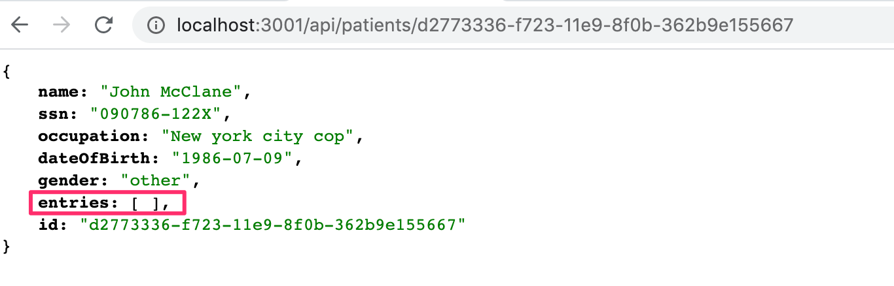
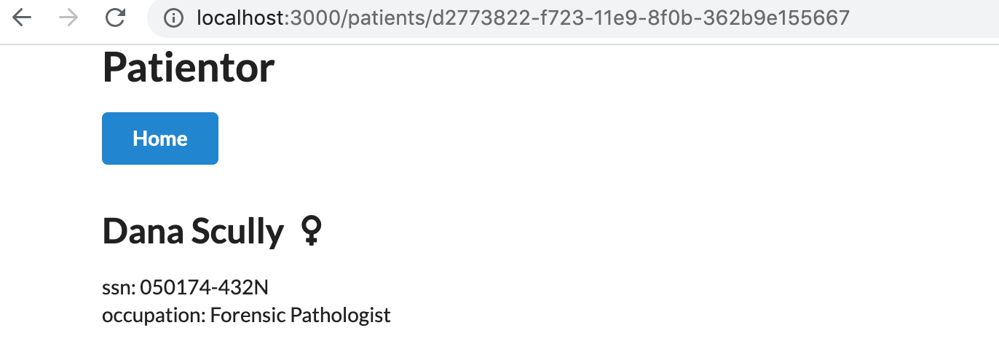
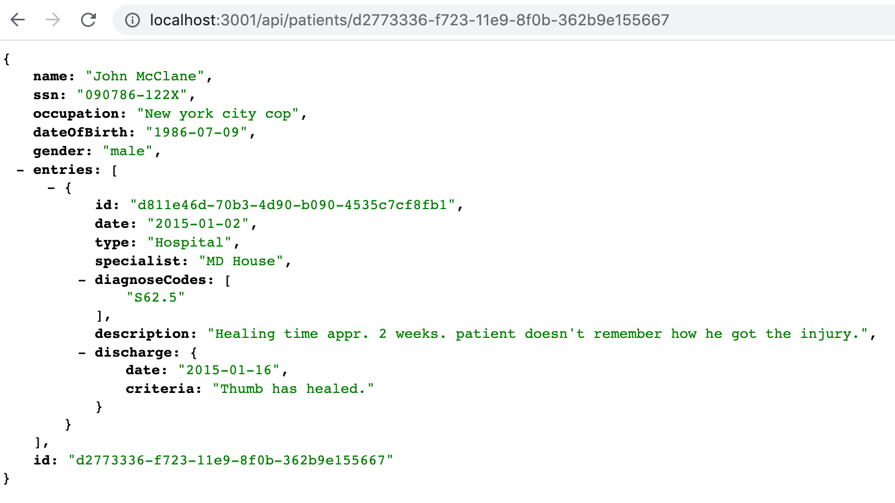
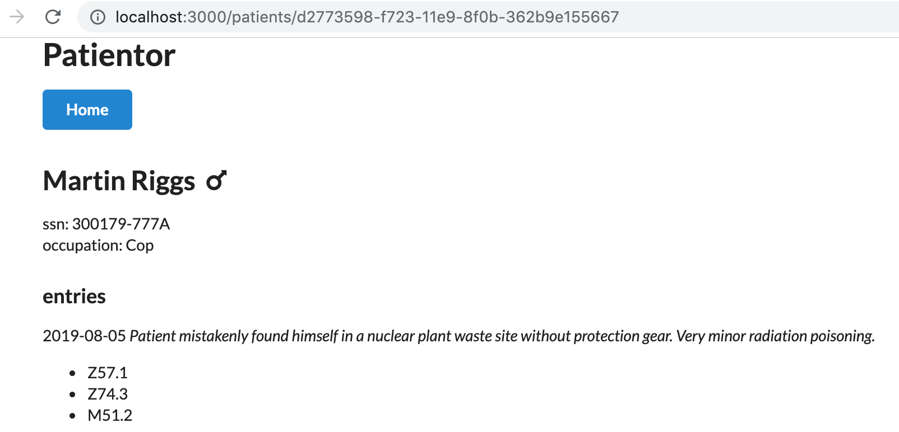
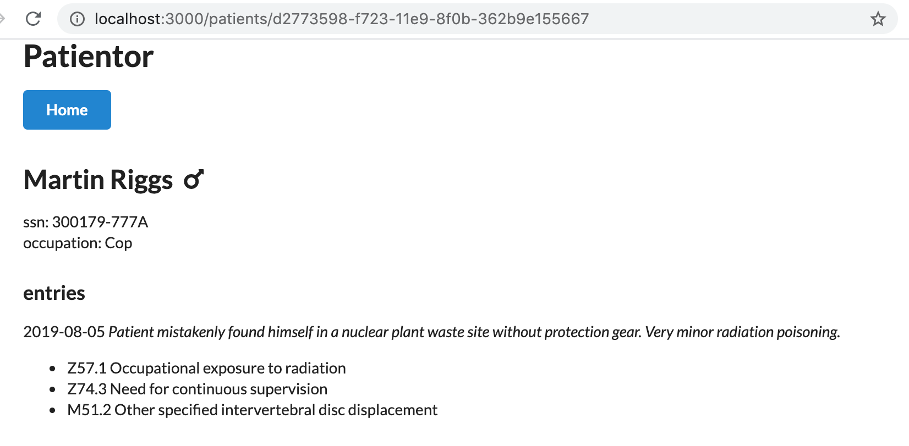
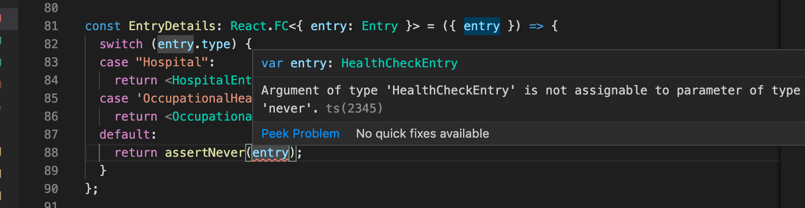
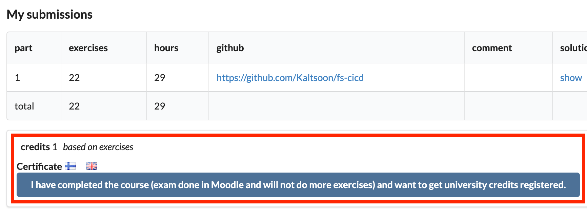

<div class="content">

Before we start delving into how you can use TypeScript with React, we should first have a look at what we want to achieve. When everything works as it should, TypeScript will help us catch the following errors:

- Trying to pass an extra/unwanted prop to a component
- Forgetting to pass a required prop to a component
- Passing a prop of a wrong type to a component


If we make any of these errors, TypeScript can help us catch them in our editor right away. 
If we didn't use TypeScript, we would have to catch these errors later during testing. 
We might be forced to do some tedious debugging to find the cause of the errors. 

That's enough reasoning for now. Let's start getting our hands dirty!

### Create React App with TypeScript

We can use [create-react-app](https://create-react-app.dev) to create a TypeScript app by adding a 
<i>template</i> argument to the initialisation script. So in order to create a TypeScript Create React App, run the following command:

```shell
npx create-react-app my-app --template typescript
```

After running the command, you should have a complete basic react app which uses TypeScript.
You can start the app by running <i>npm start</i> in the application's root. 

If you take a look at the files and folders, you'll notice that the app is not that different from 
one using pure JavaScript. The only differences are that the <i>.js</i> and <i>.jsx</i> files are now  <i>.ts</i> and <i>.tsx</i> files, they contain some type annotations, and the root directory contains a <i>tsconfig.json</i> file.

Now, let's take a look at the <i>tsconfig.json</i> file that has been created for us.
Everything in it should be more or less fine except that, at the moment, the configuration allows compiling JavaScript files, because <i>allowJs</i> is set to <i>true</i>.
That would be fine if you need to mix TypeScript and JavaScript (e.g. if you are in the process of transforming a JavaScript project into TypeScript or something like that), but we want to create a pure TypeScript app, so let's change that configuration to  <i>false</i>.

In our previous project, we used eslint to help us enforce coding style, and we'll do the same with this app. We do not need to install any dependencies, since create-react-app has taken care of that already.

We configure eslint in <i>.eslintrc</i> with the following settings:

```js
{
  "env": {
    "browser": true,
    "es6": true,
    "jest": true
  },
  "extends": [
    "eslint:recommended",
    "plugin:react/recommended",
    "plugin:@typescript-eslint/recommended"
  ],
  "plugins": ["react", "@typescript-eslint"],
  "settings": {
    "react": {
      "pragma": "React",
      "version": "detect"
    }
  },
  "rules": {
    "@typescript-eslint/explicit-function-return-type": 0,
    "@typescript-eslint/explicit-module-boundary-types": 0
  }
}
```

Since the return type of basically all React components is <i>JSX.Element</i> or <i>null</i>, we have loosened the default linting rules up a bit by disabling the rules [explicit-function-return-type](https://github.com/typescript-eslint/typescript-eslint/blob/master/packages/eslint-plugin/docs/rules/explicit-function-return-type.md) and [explicit-module-boundary-types](https://github.com/typescript-eslint/typescript-eslint/blob/master/packages/eslint-plugin/docs/rules/explicit-module-boundary-types.md) . 
Now we don't need to explicitly state our function return types everywhere.

Next, we need to get our linting script to parse <i>*.tsx </i> files, which are the TypeScript equivalent of react's JSX files. 
We can do that by altering our lint command in <i>.package.json</i> to the following:

```json
{
  // ...
    "scripts": {
    "start": "react-scripts start",
    "build": "react-scripts build",
    "test": "react-scripts test",
    "eject": "react-scripts eject",
    "lint": "eslint './src/**/*.{ts,tsx}'" // highlight-line
  },
  // ...
}
```

If you are using Windows, you may need to use double quotes for the linting path: `"lint": "eslint \"./src/**/*.{ts,tsx}\""`.
### React components with TypeScript

Let us consider the following JavaScript React example:

```jsx
import React from "react";
import ReactDOM from 'react-dom';
import PropTypes from "prop-types";

const Welcome = props => {
  return <h1>Hello, {props.name}</h1>;
};

Welcome.propTypes = {
  name: PropTypes.string
};

const element = <Welcome name="Sara" />;
ReactDOM.render(element, document.getElementById("root"));
```

In this example, we have a component called <i>Welcome</i> to which we pass a <i>name</i> as a prop. It then renders the name to the screen.  We know that the <i>name</i> should be a string, and we use the [prop-types](https://www.npmjs.com/package/prop-types) package introduced in [part 5](/en/part5/props_children_and_proptypes#prop-types) to receive hints about the desired types of a component's props and warnings about invalid prop types. 

With TypeScript, we don't need the <i>prop-types</i> package anymore. We can define the types with the help of TypeScript just like we define types for a regular function as react components are nothing but mere functions. We will use an interface for the parameter types (i.e., props) and <i>JSX.Element</i> as the return type for any react component.

For example:

```jsx
const MyComp1 = () => {
  // TypeScript automatically infers the return type of this function 
  // (i.e., a react component) as `JSX.Element`.
  return <div>TypeScript has auto inference!</div>
}

const MyComp2 = (): JSX.Element => {
  // We are explicitly defining the return type of a function here 
  // (i.e., a react component).
  return <div>TypeScript React is easy.</div>
}

interface MyProps {
  label: string;
  price?: number;
}

const MyComp3 = ({label, price}: MyProps): JSX.Element => {
  // We are explicitly defining the parameter types using interface `MyProps` 
  // and return types as `JSX.Element` in this function (i.e., a react component).
  return <div>TypeScript is great.</div>
}

const MyComp4 = ({label, price}: {label: string, price: number}) => {
  // We are explicitly defining the parameter types using an inline interface 
  // and TypeScript automatically infers the return type as JSX.Element of the function (i.e., a react component).
  return <div>There is nothing like TypeScript.</div>
}
```

Now, let's return to our code example and see how we would define the type for the <i>Welcome</i> component in TypeScript.

```jsx
interface WelcomeProps {
  name: string;
}

const Welcome = (props: WelcomeProps) => {
  return <h1>Hello, {props.name}</h1>;
};

const element = <Welcome name="Sara" />;
ReactDOM.render(element, document.getElementById("root"));
```

We defined a new type, _WelcomeProps_, and passed it to the function's parameter types.

```jsx
const Welcome = (props: WelcomeProps) => {
```

You could write the same thing using a less verbose syntax:

```jsx
const Welcome = ({ name }: { name: string }) => (
  <h1>Hello, {name}</h1>
);
```

Now our editor knows that the <i>name</i> prop is a string. 

For some reason, eslint is not satisfied, and complains that <i>'name' is missing in props validation</i>. This happens because the react linting rules expect us to define propTypes for all props.

</div>

<div class="tasks">

### Exercise 9.14.
#### 9.14.

Create a new Create React App with TypeScript, and set up eslint for the project similarly to how we just did.

This exercise is similar to the one you have already done in [Part 1](/en/part1/java_script#exercises-1-3-1-5) of the course, but with TypeScript and some extra tweaks. Start off by modifying the contents of <i>index.tsx</i> to the following:

```jsx
import React from "react";
import ReactDOM from "react-dom";
import App from "./App";


ReactDOM.render(<App />, document.getElementById("root"));
```

and <i>App.tsx</i> to the following:

```jsx
import React from 'react';
const App = () => {
  const courseName = "Half Stack application development";
  const courseParts = [
    {
      name: "Fundamentals",
      exerciseCount: 10
    },
    {
      name: "Using props to pass data",
      exerciseCount: 7
    },
    {
      name: "Deeper type usage",
      exerciseCount: 14
    }
  ];

  return (
    <div>
      <h1>{courseName}</h1>
      <p>
        {courseParts[0].name} {courseParts[0].exerciseCount}
      </p>
      <p>
        {courseParts[1].name} {courseParts[1].exerciseCount}
      </p>
      <p>
        {courseParts[2].name} {courseParts[2].exerciseCount}
      </p>
      <p>
        Number of exercises{" "}
        {courseParts.reduce((carry, part) => carry + part.exerciseCount, 0)}
      </p>
    </div>
  );
};

export default App;

```

and remove the unnecessary files.

The whole app is now in one component. That is not what we want, so refactor the code so that it consists of three components: <i>Header</i>,  <i>Content</i> and <i>Total</i>. All data is still kept in the <i>App</i> component, which passes all necessary data to each component as props. <i>Be sure to add type declarations for each component's props!</i> 

The <i>Header</i> component should take care of rendering the name of the course. <i>Content</i> should render the names of the different parts and the amount of exercises in each part, and <i>Total</i> should render the total sum of exercises in all parts.

The <i>App</i> component should look somewhat like this:

```jsx
const App = () => {
  // const-declarations

  return (
    <div>
      <Header name={courseName} />
      <Content ... />
      <Total ... />
    </div>
  )
};
```
</div>

<div class="content">

### Deeper type usage

In the previous exercise, we had three parts of a course, and all parts had the same attributes <i>name</i> and <i>exerciseCount</i>. But what if we had a need for additional attributes for the parts and each part would have a need for different attributes? How would this look, codewise? Let's consider the following example:

```js
const courseParts = [
  {
    name: "Fundamentals",
    exerciseCount: 10,
    description: "This is an awesome course part"
  },
  {
    name: "Using props to pass data",
    exerciseCount: 7,
    groupProjectCount: 3
  },
  {
    name: "Deeper type usage",
    exerciseCount: 14,
    description: "Confusing description",
    exerciseSubmissionLink: "https://fake-exercise-submit.made-up-url.dev"
  }
];
```

In the above example, we have added some additional attributes to each course part.
Each part has the <i>name</i> and <i>exerciseCount</i> attributes,
but the first and the third also have an attribute called <i>description</i>, and 
the second and third parts also have some distinct additional attributes.

Let's imagine that our application just keeps on growing, and we need to pass the different course parts around in our code.
On top of that, there is also additional attributes and course parts added to the mix.
How can we know that our code is capable of handling all the different types of data correctly, and we are not for example forgetting to render a new course part on some page? This is where TypeScript really comes handy!

Let's start by defining types for our different course parts:

```js
interface CoursePartOne {
  name: "Fundamentals";
  exerciseCount: number;
  description: string;
}

interface CoursePartTwo {
  name: "Using props to pass data";
  exerciseCount: number;
  groupProjectCount: number;
}

interface CoursePartThree {
  name: "Deeper type usage";
  exerciseCount: number;
  description: string;
  exerciseSubmissionLink: string;
}
```

Next we will create a type [union](https://www.typescriptlang.org/docs/handbook/2/everyday-types.html#union-types) of all these types. 
We can then use it to define a type for our array, which should accept any of these course part types:

```js
type CoursePart = CoursePartOne | CoursePartTwo | CoursePartThree;
```

Now we can set the type for our <i>courseParts</i> variable. 
Our editor will automatically warn us if we use a wrong type for an attribute, use an extra attribute, or forget to set an expected attribute.
You can test this by commenting out any attribute for any course part.
Thanks to the <i>name</i> [string literal](https://www.typescriptlang.org/docs/handbook/2/everyday-types.html#literal-types), TypeScript can identify which course part requires which additional attributes, even if the variable is defined to use the type union.

But we're not satisfied yet! There is still a lot of duplication in our types, and we want to avoid that. 
We start off by identifying the attributes all course parts have in common, and defining a base type which contains them.
Then we will [extend](https://www.typescriptlang.org/docs/handbook/2/objects.html#extending-types) that base type to create our part-specific types:

```js
interface CoursePartBase {
  name: string;
  exerciseCount: number;
}

interface CoursePartOne extends CoursePartBase {
  name: "Fundamentals";
  description: string;
}

interface CoursePartTwo extends CoursePartBase {
  name: "Using props to pass data";
  groupProjectCount: number;
}

interface CoursePartThree extends CoursePartBase {
  name: "Deeper type usage";
  description: string;
  exerciseSubmissionLink: string;
}
```

How should we now use these types in our components?

One handy way to use this kind of types in TypeScript is by using _switch case_ expressions. Once you have either explicitly declared or TypeScript has inferred that a variable is of type union and that each type in the type union contains a certain attribute, 
we can use that as a type identifier. 
We can then build a switch case around that attribute and TypeScript will know which attributes are available within each case block.



In the above example, TypeScript knows that a <i>coursePart</i> has the type <i>CoursePart</i>. It can then infer that <i>part</i> is of either type <i>CoursePartOne</i>, <i>CoursePartTwo</i> or <i>CoursePartThree</i>. 
The <i>name</i> is distinct for each type, so we can use it to identify each type and TypeScript can let us know which attributes are available in each case block. 
TypeScript will then produce an error if you e.g. try to use the <i>part.description</i> within the <i>"Using props to pass data"</i> block.

What about adding new types? If we were to add a new course part, wouldn't it be nice to know if we had already implemented handling that type in our code? 
In the example above, a new type would go to the <i>default</i> block and nothing would get printed for a new type. 
Of course, sometimes, this is totally acceptable, for example if you want to handle only specific (but not all) cases of a type union, but in most cases it is recommended to handle all variations separately.

With TypeScript, we can use a method called <i>exhaustive type checking</i>. Its basic principle is that if we encounter an unexpected value, we call a function that accepts a value with the type [never](https://www.typescriptlang.org/docs/handbook/2/narrowing.html#the-never-type) and also has the return type <i>never</i>.

A straightforward version of the function could look like this:

```js
/**
 * Helper function for exhaustive type checking
 */
const assertNever = (value: never): never => {
  throw new Error(
    `Unhandled discriminated union member: ${JSON.stringify(value)}`
  );
};
```

If we now were to replace the contents of our <i>default</i> block to:

```js
default:
  return assertNever(part);
```

and would also comment out the <i>Deeper type usage</i> case block, we would see the following error:



The error message says that <i>Argument of type 'CoursePartThree' is not assignable to parameter of type 'never'</i>, which tells us that we are using a variable somewhere where it should never be used. This tells us that something needs to be fixed. 
When we remove the comments from the <i>Deeper type usage</i> case block, you will see that the error goes away.

</div>

<div class="tasks">

### Exercise 9.15.

#### 9.15.

First, add the type information to <i>App.tsx</i> and replace the variable <i>courseParts</i> with the one from the example below.

```js
// new types
interface CoursePartBase {
  name: string;
  exerciseCount: number;
  type: string;
}

interface CourseNormalPart extends CoursePartBase {
  type: "normal";
  description: string;
}
interface CourseProjectPart extends CoursePartBase {
  type: "groupProject";
  groupProjectCount: number;
}

interface CourseSubmissionPart extends CoursePartBase {
  type: "submission";
  description: string;
  exerciseSubmissionLink: string;
}

type CoursePart = CourseNormalPart | CourseProjectPart | CourseSubmissionPart;


// this is the new coursePart variable
const courseParts: CoursePart[] = [
  {
    name: "Fundamentals",
    exerciseCount: 10,
    description: "This is the leisured course part",
    type: "normal"
  },
  {
    name: "Advanced",
    exerciseCount: 7,
    description: "This is the harded course part",
    type: "normal"
  },
  {
    name: "Using props to pass data",
    exerciseCount: 7,
    groupProjectCount: 3,
    type: "groupProject"
  },
  {
    name: "Deeper type usage",
    exerciseCount: 14,
    description: "Confusing description",
    exerciseSubmissionLink: "https://fake-exercise-submit.made-up-url.dev",
    type: "submission"
  }
]
```

Now we know that both interfaces <i>CourseNormalPart</i> and <i>CourseSubmissionPart</i> share not only the base attributes, but also an attribute called <i>description</i>, which is a string in both interfaces. 

Your first task is to declare a new interface that includes the <i>description</i> attribute and extends the <i>CoursePartBase</i> interface. Then modify the code so that you can remove the <i>description</i> attribute from both <i>CourseNormalPart</i> and <i>CourseSubmissionPart</i> without getting any errors.

Then create a component <i>Part</i> that renders all attributes of each type of course part. Use a switch case-based exhaustive type checking! Use the new component in component <i>Content</i>.

Lastly, add another course part interface with the following attributes: <i>name</i>, <i>exerciseCount</i>, <i>description</i> and <i>requirements</i>, the latter being a string array. The objects of this type look like the following:

```js
{
  name: "Backend development",
  exerciseCount: 21,
  description: "Typing the backend",
  requirements: ["nodejs", "jest"],
  type: "special"
}
```

Then add that interface to the type union <i>CoursePart</i> and add corresponding data to the <i>courseParts</i> variable. Now, if you have not modified your <i>Content</i> component correctly, you should get an error, because you have not yet added support for the fourth course part type. Do the necessary changes to <i>Content</i>, so that all attributes for the new course part also get rendered and that the compiler doesn't produce any errors.

The end result might look like the following:


</div>

<div class="content">

### A note about defining object types

We have used [interfaces](https://www.typescriptlang.org/docs/handbook/2/everyday-types.html#interfaces) to define object types, e.g. diary entries, in the previous section

```js
interface DiaryEntry {
  id: number;
  date: string;
  weather: Weather;
  visibility: Visibility;
  comment?: string;
} 
```

and in the course part of this section

```js
interface CoursePartBase {
  name: string;
  exerciseCount: number;
}
```

We actually could have had the same effect by using a [type alias](https://www.typescriptlang.org/docs/handbook/2/everyday-types.html#type-aliases)

```js
type DiaryEntry = {
  id: number;
  date: string;
  weather: Weather;
  visibility: Visibility;
  comment?: string;
} 
```

In most cases you can use either <i>type</i> or <i>interface</i>, whichever syntax you prefer. However, there are a few things to keep in mind. 
For example, if you define multiple interfaces with the same name, they will result in a merged interface, whereas if you try to define multiple types with the same name, it will result in an error stating that a type with the same name is already declared. 

TypeScript documentation [recommends using interfaces](https://www.typescriptlang.org/docs/handbook/2/everyday-types.html#differences-between-type-aliases-and-interfaces) in most cases.

### Working with an existing codebase

When diving into an existing codebase for the first time, it is good to get an overall view of the conventions and structure of the project. You can start your research by reading the <i>README.md</i> in the root of the repository. Usually, the README contains a brief description of the application and the requirements for using it, as well as how to start it for development. 
If the README is not available or someone has "saved time" and left it as a stub, you can take a peek at the <i>package.json</i>. 
It is always a good idea to start the application and click around to verify you have a functional development environment. 

You can also browse the folder structure to get some insight into the application's functionality and/or the architecture used.
These are not always clear, and the developers might have chosen a way to organize code that is not familiar to you.
The [sample project](https://github.com/fullstack-hy/patientor) used in the rest of this part is organized, feature-wise.
You can see what pages the application has, and some general components, e.g. modals and state.
Keep in mind that the features may have
different scopes. For example, modals are visible UI-level components whereas the state is comparable to business logic
and keeps the data organized under the hood for the rest of the app to use. 

TypeScript provides you types which tell you what kind of data structures, functions, components and state to expect. 
You can try to look for <i>types.ts</i> or something similar to get you started.
VSCode is a big help and just highlighting variables and parameters can give you quite a lot of insight.
All this naturally depends on how types are used in the project. 

If the project has unit, integration or end-to-end tests, reading those is most likely beneficial. 
Test cases are your most important tool when refactoring or creating new features to the application. You want to make sure not to break any existing features when hammering around the code.
TypeScript can also give you guidance with argument and return types when changing the code.

Do remember that reading code is a skill in itself, 
and don't worry if you don't understand the code on your first readthrough. 
Code may have a lot of corner cases, and pieces of logic may have been added here and there throughout its development cycle. 
It is hard to imagine what kind of troubles the previous developer has been wrestling with.
Think of it all like [growth rings in trees](https://en.wikipedia.org/wiki/Dendrochronology#Growth_rings).
Understanding all of it requires digging deep into the code and business domain requirements. The more code you read, the better you're going to be at it. You will read more code than you're going to produce.

### Patientor frontend

It's time to get our hands dirty finalizing the frontend for the backend we built in [exercises 9.8.-9.13](/en/part9/typing_the_express_app).

Before diving into the code, let us start both the frontend and the backend.

If all goes well, you should see a patient listing page. It fetches a list of patients from our backend, and renders it to the screen as a simple table. There is also a button for creating new patients to the backend.
As we are using mock data instead of a database, the data will not persist - closing the backend will 
delete all the data we have added. 
UI design has clearly not been a strong point of the creators, so let's disregard the UI for now.

After verifying that everything works, we can start studying the code. 
All the interesting stuff resides in the <i>src</i> folder.
For your convenience, there is already a <i>types.ts</i> file for basic types used in the app, which you will have to extend or refactor in the exercises.

In principle, we could use the same types for both backend and frontend, but usually the frontend has different data structures and use cases for the data, which causes the types to be different. 
For example, the frontend has a state, and may want to keep data in objects or maps whereas the backend
uses an array. The frontend might also not need all the fields of a data object saved in the backend, and it may need to add some new fields to use for rendering.

The folder structure looks as follows:



As you would expect, there are currently two main components: <i>AddPatientModal</i> and <i>PatientListPage</i>. The <i>state</i> folder contains state handling for the frontend.
The main functionality of the code in the <i>state</i> folder is to keep our data in one place and offer simple actions to alter the state of our app.
### State handling

Let's study the state handling a bit closer as a lot of stuff seems to be happening under the hood and it differs a bit from the methods used in the course so far. 

The state management is built using the React Hooks [useContext](https://reactjs.org/docs/hooks-reference.html#usecontext) and [useReducer](https://reactjs.org/docs/hooks-reference.html#usereducer).
This is quite a good setup because we know the app will be rather small and we don't want to use <i>redux</i> or other similiar libraries for the state management.
There are a lot of good material, for example  [this article](https://medium.com/@seantheurgel/react-hooks-as-state-management-usecontext-useeffect-usereducer-a75472a862fe), about this approach to state management.

The approach taken in this app uses the React [context](https://reactjs.org/docs/context.html) that, according to its documentation:

> <i>... is designed to share data that can be considered "global" for a tree of React components, such as the current authenticated user, theme, or preferred language.</i> 

In our case, the "global", shared data is the application state <i>and</i> the dispatch function that is used to make changes to data. In many ways our code works much like the redux-based state management we used in [part 6](/en/part6), but is more lightweight since it does not require the use of any external libraries. 
This part assumes that you are at least familiar with the way redux works, e.g. you should have covered at least [the first section](/en/part6/flux_architecture_and_redux) of part 6.

The [context](https://reactjs.org/docs/context.html) of our application has a tuple containing the app state and the dispatcher for changing the state. 
The application state is typed as follows:

```js
export type State = {
  patients: { [id: string]: Patient };
};
```

The state is an object with one key, <i>patients</i>, which has a [dictionary](https://www.typescriptlang.org/docs/handbook/2/indexed-access-types.html) or simply put an object with string keys and with a <i>Patient</i> objects as values. The index can only be  a <i>string</i> or a <i>number</i> as you can access the object values using those. This enforces that the state conforms to the form we want, and prevents developers from misusing the state.

But be aware of one thing! When a type is declared like the type for <i>patients</i>, TypeScript does not actually have any way of knowing if the key you are trying to access actually exists or not.
So if we were to try to access a patient by a non-existing id, the compiler would think that the returned value is of type <i>Patient</i> and no error would be thrown when trying to access its properties:

```js
const myPatient = state.patients['non-existing-id'];
console.log(myPatient.name); // no error, TypeScript believes that myPatient is of type Patient
```

To fix this, we could define the type for patient values to be a union of <i>Patient</i> and <i>undefined</i> in the following way:

```js
export type State = {
  patients: { [id: string]: Patient | undefined };
};
```

That would cause the compiler to give the following warning:

```js
const myPatient = state.patients['non-existing-id'];
console.log(myPatient.name); // error, Object is possibly 'undefined'
```

This type of additional type security is always good to implement if you e.g. use data from external sources or use the value of a user input to access data in your code. But if you are sure that you only handle data that actually exists, then there is no one stopping you from using the first presented solution.

Even though we are not using them in this course part, it is good to mention that a more type-strict way would be to use [Map](https://developer.mozilla.org/en-US/docs/Web/JavaScript/Reference/Global_Objects/Map) objects, to which you can declare a type for both the key and the content. The Map's accessor function <i>get()</i> always returns a union of the declared value type and undefined, so TypeScript automatically requires you to perform validity checks on data retrieved from a map:

```js
interface State {
  patients: Map<string, Patient>;
}
...
const myPatient = state.patients.get('non-existing-id'); // type for myPatient is now Patient | undefined 
console.log(myPatient.name); // error, Object is possibly 'undefined'

console.log(myPatient?.name); // valid code, but will log 'undefined'
```

<!--
You can also think of a scenario where we may have state as a union. Eg. using states type as an indicator whether user has logged in:

```js
export type State =
  | {
      type: "Unauthenticated";
    }
  | {
      type: "Authenticated";
      currentUser: User;
    };
```

This is one way of using TypeScript to help keep the application's state under control. We know that if the state is in <i>type: "Authenticated"</i>, we will have a <i>currentUser</i> field in state.

This matches the arguments that are received from the [useReducer](https://reactjs.org/docs/hooks-reference.html#usereducer) hook. The dispatch function takes as parameter objects with an <i>Action</i> which is defined in <i>reducer.ts</i> alongside the actual reducer function defining what the action does to the state returning a new state. 

The main principle in our state management approach is to pass the state to our components through the context and to modify the state using reducers. 

-->

<!-- Just as in the case of redux, all the state manipulation is done by the reducer that is defined in file <i>reducer.ts</i> together with the type <i>Action</i> that looks as follows -->
Just like with redux, all state manipulation is done by a reducer. It is defined in the file <i>reducer.ts</i> along with the type <i>Action</i>, which looks as follows:

```js
export type Action =
  | {
      type: "SET_PATIENT_LIST";
      payload: Patient[];
    }
  | {
      type: "ADD_PATIENT";
      payload: Patient;
    };
```

The reducer looks quite similiar to the ones we wrote in [part 6](/en/part6). 
It changes the state for each type of action:

```js
export const reducer = (state: State, action: Action): State => {
  switch (action.type) {
    case "SET_PATIENT_LIST":
      return {
        ...state,
        patients: {
          ...action.payload.reduce(
            (memo, patient) => ({ ...memo, [patient.id]: patient }),
            {}
          ),
          ...state.patients
        }
      };
    case "ADD_PATIENT":
      return {
        ...state,
        patients: {
          ...state.patients,
          [action.payload.id]: action.payload
        }
      };
    default:
      return state;
  }
};
```

The main difference is  that the state is now a dictionary (or an object), instead of the array that we used in [part 6](/en/part6).

There are a lot of things happening in the file <i>state.ts</i>, which takes care of setting up the context. 
The main ingredient is the [useReducer](https://reactjs.org/docs/hooks-reference.html#usereducer) hook
used to create the state and the dispatch function, and pass them on to the [context provider](https://reactjs.org/docs/context.html#contextprovider):

```js
export const StateProvider = ({
  reducer,
  children
}: StateProviderProps) => {
  const [state, dispatch] = useReducer(reducer, initialState); // highlight-line
  return (
    <StateContext.Provider value={[state, dispatch]}>  // highlight-line
      {children}
    </StateContext.Provider>
  );
};
```

The provider makes the <i>state</i> and the <i>dispatch</i> functions available in all of the components, thanks to the setup in <i>index.ts</i>:

```js 
import { reducer, StateProvider } from "./state";

ReactDOM.render(
  <StateProvider reducer={reducer}>
    <App />
  </StateProvider>, 
  document.getElementById('root')
);
```

It also defines the <i>useStateValue</i> hook:

```js 
export const useStateValue = () => useContext(StateContext);
```

and the components that need to access the state or dispatcher use it to get hold of those:

```js 
import { useStateValue } from "../state";

// ...

const PatientListPage = () => {
  const [{ patients }, dispatch] = useStateValue();
  // ...
}
```

Don't worry if this seems confusing; it will be until you have studied the [context's documentation](https://reactjs.org/docs/context.html) and its use in [state management](https://medium.com/@seantheurgel/react-hooks-as-state-management-usecontext-useeffect-usereducer-a75472a862fe). You do not need to understand all this completely to do the exercises!

It is actually quite common that when you start working on an existing codebase, you do not understand 100% of what happens under the hood in the beginning. If the app has been properly structured (and it has a proper set of tests), you can trust that if you make careful modifications, the app still works despite the fact that you did not understand  all the internal mechanisms. Over time, you will get a grasp on the more unfamiliar parts, but it does not happen overnight when working with a large codebase.

### Patient listing page

Let's go through the <i>PatientListPage/index.ts</i> as you can take inspiration from there to help you fetch data from the backend and update the application's state. 
<i>PatientListPage</i> uses our custom hook to inject the state, and the dispatcher for updating it. 
When we list the patients, we only need to destructure the <i>patients</i> property from the state:

```js
import { useStateValue } from "../state";

const PatientListPage = () => {
  const [{ patients }, dispatch] = useStateValue();
  // ...
}
```

We also use the app state created with the <i>useState</i> hook for managing modal visibility and form error handling:


```js
const [modalOpen, setModalOpen] = React.useState<boolean>(false);
const [error, setError] = React.useState<string | undefined>();
```

We give the <i>useState</i> hook a type parameter, which is then applied to the actual state. So <i>modalOpen</i> is a <i>boolean</i> and <i>error</i> has the type <i>string | undefined</i>. 
Both set functions returned by the <i>useState</i> hook are functions that accept only arguments according to the type parameter given, eg. the exact type for <i>setModalOpen</i> function is <i>React.Dispatch<React.SetStateAction&lt;boolean&gt;></i>.

We also have the <i>openModal</i> and <i>closeModal</i> helper functions for better readability and convenience:

```js
const openModal = (): void => setModalOpen(true);

const closeModal = (): void => {
  setModalOpen(false);
  setError(undefined);
};
```

The frontend's types are based on what you have created when developing the backend in the previous part.

When the component <i>App</i> mounts, it fetches patients from the backend using [axios](https://github.com/axios/axios). Note how we are giving the <i>axios.get</i> function a type parameter to describe the type of the response data:

````js
React.useEffect(() => {
  axios.get<void>(`${apiBaseUrl}/ping`);

  const fetchPatientList = async () => {
    try {
      const { data: patients } = await axios.get<Patient[]>(
        `${apiBaseUrl}/patients`
      );
      dispatch({ type: "SET_PATIENT_LIST", payload: patients });
    } catch (error: unknown) {
      let errorMessage = 'Something went wrong.'
      if(axios.isAxiosError(error) && error.response) {
        errorMessage += ' Error: ' + error.response.data.message;
      }
      console.error(errorMessage);
    }
  };
  fetchPatientList();
}, [dispatch]);
````

 **A word of warning!** Passing a type parameter to axios will not validate any data. It is quite dangerous especially if you are using external APIs. 
 You can create custom validation functions which take in the whole payload and return the correct type, or you can use a type guard. 
 Both are valid options. There are also many libraries that provide validation through a different kind of schemas, for example [io-ts](https://gcanti.github.io/io-ts/).
 For simplicity's sake, we will continue to trust our own work and trust that we will get data of the correct form from the backend.

As our app is quite small, we will update the state by simply calling the <i>dispatch</i> function provided to us by the <i>useStateValue</i> hook.
The compiler helps by making sure that we dispatch actions according to our <i>Action</i> type with a predefined type string and payload:

```js
dispatch({ type: "SET_PATIENT_LIST", payload: patients });
```

</div>

<div class="tasks">

### Exercises 9.16.-9.18.

We will soon add a new type for our app, <i>Entry</i>, which represents a lightweight patient journal entry. It consists of a journal text, i.e. a <i>description</i>, a creation date, information regarding the specialist who created it and possible diagnosis codes. Diagnosis codes map to the ICD-10 codes returned from the <i>/api/diagnoses</i> endpoint. Our naive implementation will be that a patient has an array of entries.

Before going into this, let us do some preparatory work.

#### 9.16: patientor, step1

Create an endpoint <i>/api/patients/:id</i>  that returns all of the patient information for one patient, including the array of patient entries that is still empty for all the patients. For the time being, expand the backend types as follows:

```js
// eslint-disable-next-line @typescript-eslint/no-empty-interface
export interface Entry {
}

export interface Patient {
  id: string;
  name: string;
  ssn: string;
  occupation: string;
  gender: Gender;
  dateOfBirth: string;
  entries: Entry[] // highlight-line
}

export type PublicPatient = Omit<Patient, 'ssn' | 'entries' >  // highlight-line
```

The response should look as follows:



#### 9.17: patientor, step2

Create a page for showing a patient's full information in the frontend. 

The user should be able to access a patient's information e.g. by clicking the patient's name.

Fetch the data from the endpoint created in the previous exercise. After fetching the patient information from the backend, add the fetched information to the application's state. Do not fetch the information if it already is in the app state, i.e. if the user is visiting the same patient's information many times. 

Since we now have the state in the context, you'll need to define a new action type for updating an individual patient's data.

The Application uses [Semantic UI React](https://react.semantic-ui.com/) for styling, which is quite similar to [React Bootstrap](https://react-bootstrap.github.io/) and [MaterialUI](https://material-ui.com/) that we covered in [part 7](/en/part7/more_about_styles). You may also use it for the new components but that is up to you since our main focus now is TypeScript.

The Application also uses [react router](https://reacttraining.com/react-router/web/guides/quick-start) 
to control which view is visible in the frontend. You might want to have a look at [part 7](/en/part7/react_router) if you don't yet have a grasp on how the router works.

The result could look like this:



The gender is shown with react-semantic-ui component [Icon](https://react.semantic-ui.com/elements/icon/#gendersicons-can-represent-genders-or-types-of-sexuality).

**Note** that in order to access the id in the url, you need to give [useParams](https://reacttraining.com/react-router/web/api/Hooks/useparams) a proper type argument:

```js
const { id } = useParams<{ id: string }>();
```

#### 9.18: patientor, step3

Currently, we create <i>action</i> objects wherever we dispatch actions, e.g. the <i>App</i> component has the following:

```js
dispatch({
  type: "SET_PATIENT_LIST", payload: patientListFromApi
});
```

Define [action creator functions](/en/part6/flux_architecture_and_redux#action-creators) in the file `src/state/reducer.tsx` and refactor the code to use them.

For example, the <i>App</i> should become like the following:

```js
import { useStateValue, setPatientList } from "./state";

// ...

dispatch(setPatientList(patientListFromApi));
```


</div>

<div class="content">

### Full entries

In the [exercise 9.10.](/en/part9/typing_the_express_app#exercises-9-10-9-11) we implemented an endpoint for fetching information about various diagnoses, but we are still not using that endpoint at all. 
Since we now have a page for viewing a patient's information, it would be nice to expand our data a bit. 
Let's add an <i>Entry</i> field to our patient data so that a patient's data contains their medical entries, including possible diagnoses.

Let's ditch our old patient seed data from the backend and start using [this expanded format](https://github.com/fullstack-hy/misc/blob/master/patients.ts).

**Notice:** This time, the data is not in the .json format but instead in the .ts format. You should already have the complete <i>Gender</i> and <i>Patient</i> types implemented, so only correct the paths where they are imported from if needed.

Let us now create a proper <i>Entry</i> type based on the data we have.

If we take a closer look at the data, we can see that the entries are actually quite different from one another. For example, let's take a look at the first two entries:

```js
{
  id: 'd811e46d-70b3-4d90-b090-4535c7cf8fb1',
  date: '2015-01-02',
  type: 'Hospital',
  specialist: 'MD House',
  diagnosisCodes: ['S62.5'],
  description:
    "Healing time appr. 2 weeks. patient doesn't remember how he got the injury.",
  discharge: {
    date: '2015-01-16',
    criteria: 'Thumb has healed.',
  }
}
...
{
  id: 'fcd59fa6-c4b4-4fec-ac4d-df4fe1f85f62',
  date: '2019-08-05',
  type: 'OccupationalHealthcare',
  specialist: 'MD House',
  employerName: 'HyPD',
  diagnosisCodes: ['Z57.1', 'Z74.3', 'M51.2'],
  description:
    'Patient mistakenly found himself in a nuclear plant waste site without protection gear. Very minor radiation poisoning. ',
  sickLeave: {
    startDate: '2019-08-05',
    endDate: '2019-08-28'
  }
}
```

Immediately, we can see that while the first few fields are the same, the first entry has a <i>discharge</i> field and the second entry has <i>employerName</i> and <i>sickLeave</i> fields. 
All the entries seem to have some fields in common, but some fields are entry-specific. 

When looking at the <i>type</i>, we can see that there are actually three kinds of entries: <i>OccupationalHealthcare</i>, <i>Hospital</i> and <i>HealthCheck</i>.
This indicates we need three separate types. Since they all have some fields in common, we might just want to create a base entry interface that we can extend with the different fields in each type. 

When looking at the data, it seems that the fields <i>id</i>, <i>description</i>, <i>date</i> and <i>specialist</i> are something that can be found in each entry. On top of that, it seems that the <i>diagnosisCodes</i> is only found in one <i>OccupationalHealthCare</i> and one <i>Hospital</i> type entry. Since it is not always used even in those types of entries, it is safe to assume that the field is optional. We could consider adding it to the <i>HealthCheck</i> type as well, 
since it might just not be used in these specific entries.

So our <i>BaseEntry</i> from which each type could be extended from would be the following:

```js
interface BaseEntry {
  id: string;
  description: string;
  date: string;
  specialist: string;
  diagnosisCodes?: string[];
}
```

If we want to finetune it a bit further, since we already have a <i>Diagnosis</i> type defined in the backend, we might just want to refer to the code field of the <i>Diagnosis</i> type directly in case its type ever changes. 
We can do that like so:

```js
interface BaseEntry {
  id: string;
  description: string;
  date: string;
  specialist: string;
  diagnosisCodes?: Array<Diagnosis['code']>;
}
```

As you might remember, <i>Array&lt;Type&gt;</i> is just an alternative way to say <i>Type[]</i>. In cases like this, it is just much clearer to use the array convention since the other option would be to define the type by saying <i>Diagnosis['code'][]</i> which starts to look a bit strange.

Now that we have the <i>BaseEntry</i> defined, we can start creating the extended entry types we will actually be using. Let's start by creating the <i>HealthCheckEntry</i> type.

Entries of type <i>HealthCheck</i> contain the field <i>HealthCheckRating</i>, which is an integer from 0 to 3, zero meaning <i>Healthy</i> and 3 meaning <i>CriticalRisk</i>. This is a perfect case for an enum definition. 
With these specifications we could write a <i>HealthCheckEntry</i> type definition like so:

```js
export enum HealthCheckRating {
  "Healthy" = 0,
  "LowRisk" = 1,
  "HighRisk" = 2,
  "CriticalRisk" = 3
}

interface HealthCheckEntry extends BaseEntry {
  type: "HealthCheck";
  healthCheckRating: HealthCheckRating;
}
```

Now we only need to create the <i>OccupationalHealthCareEntry</i> and <i>HospitalEntry</i> types so we can combine them in a union and export them as an Entry type like this:

```js
export type Entry =
  | HospitalEntry
  | OccupationalHealthcareEntry
  | HealthCheckEntry;
```
An important point concerning unions is that, when you use them with `Omit` to exclude a property, it works in a possibly unexpected way. Suppose we want to remove the `id` from each `Entry`. We could think of using `Omit<Entry, 'id'>`, but [it wouldn't work as we might expect](https://github.com/microsoft/TypeScript/issues/42680). In fact, the resulting type would only contain the common properties, but not the ones they don't share. A possible workaround is to define a special Omit-like function to deal with such situations:

```ts
// Define special omit for unions
type UnionOmit<T, K extends string | number | symbol> = T extends unknown ? Omit<T, K> : never;
// Define Entry without the 'id' property
type EntryWithoutId = UnionOmit<Entry, 'id'>;
```

</div>

<div class="tasks">

### Exercises 9.19.-9.22.

#### 9.19: patientor, step4

Define the types <i>OccupationalHealthCareEntry</i> and <i>HospitalEntry</i> so that those conform with the example data. Ensure that your backend returns the entries properly when you go to an individual patient's route:


hj
Use types properly in the backend! For now, there is no need to do a proper validation for all the fields of the entries in the backend, it is enough e.g. to check that the field <i>type</i> has a correct value.

#### 9.20: patientor, step5

Extend a patient's page in the frontend to list the <i>date</i>, <i>description</i> and <i>diagnose codes</i> of the patient's entries. 

You can use the same type definition for an <i>Entry</i> in the frontend. For these exercises, it is enough to just copy/paste the definitions from the backend to the frontend.

Your solution could look like this:



#### 9.21: patientor, step6

Fetch and add diagnoses to the application state from the <i>/api/diagnosis</i> endpoint. Use the new diagnosis data to show the descriptions for patient's diagnosis codes:



#### 9.22: patientor, step7

Extend the entry listing in the patient's page to include the Entry's details with a new component that shows the rest of the information of the patient's entries distinguishing different types from each other. 

You could use eg. [Icon](https://react.semantic-ui.com/elements/icon/) or some other [SemanticUI](https://react.semantic-ui.com/) component to get appropriate visuals for your listing.

You should use a _switch case_-based rendering and <i>exhaustive type checking</i> so that no cases can be forgotten. 

Like this:



The resulting entries in the listing <i>could</i> look something like this:


</div>

<div class="content">

### Add patient form

Form handling can sometimes be quite a nuisance in React. That's why we have decided to utilize the [Formik](https://jaredpalmer.com/formik/docs/overview) package for our app's add patient form. Here's a small intro from the Formik's documentation:

> Formik is a small library that helps you with the 3 most annoying parts:
>
> - Getting values in and out of form state
> - Validation and error messages
> - Handling form submission
>
> By colocating all of the above in one place, Formik will keep things organized - making testing, refactoring, and reasoning about your forms a breeze.

The code for the form can be found from <i>src/AddPatientModal/AddPatientForm.tsx</i> and some form field helpers can be found from <i>src/AddPatientModal/FormField.tsx</i>.

Looking at the top of the <i>AddPatientForm.tsx</i> you can see we have created a type for our form values, which we have simply called <i>PatientFormValues</i>. The type is a modified version of the <i>Patient</i> type with the <i>id</i> and <i>entries</i> properties omitted. We don't want the user to be able to submit those when creating a new patient. The <i>id</i> is created by the backend and <i>entries</i> can only be added for existing patients.

```js
export type PatientFormValues = Omit<Patient, "id" | "entries">;
```

Next, we declare the props for our form component:

```js
interface Props {
  onSubmit: (values: PatientFormValues) => void;
  onCancel: () => void;
}
```

As you can see, the component requires two props: <i>onSubmit</i> and <i>onCancel</i>.
Both are callback functions that return <i>void</i>. The <i>onSubmit</i> function should receive an 
object of type <i>PatientFormValues</i> as an argument, so that the callback can handle our form values.

Looking at the <i>AddPatientForm</i> function component, you can see we have bound the <i>Props</i> as our component's props, and we destructure <i>onSubmit</i> and <i>onCancel</i> from those props.

```js
export const AddPatientForm = ({ onSubmit, onCancel }: Props) => {
  // ...
}
```

Now before we continue, let's take a look at our form helpers in <i>FormField.tsx</i>.
If you check what is exported from the file, you'll find the type <i>GenderOption</i> and the function components <i>SelectField</i> and <i>TextField</i>.

Let's take a closer look at <i>SelectField</i> and the types around it.
First, we create a generic type for each option object that contains a value and a label for that value. These are the kind of option objects we want to allow on our form in the select field.
Since the only options we want to allow are different genders, we set that the <i>value</i> should be of type <i>Gender</i>.

```js
export type GenderOption = {
  value: Gender;
  label: string;
};
```

In <i>AddPatientForm.tsx</i>, we use the <i>GenderOption</i> type for the <i>genderOptions</i> variable, declaring it to be an array containing objects of type <i>GenderOption</i>:

```js
const genderOptions: GenderOption[] = [
  { value: Gender.Male, label: "Male" },
  { value: Gender.Female, label: "Female" },
  { value: Gender.Other, label: "Other" }
];
```

Next, look at the type <i>SelectFieldProps</i>. It defines the type for the props for our <i>SelectField</i> component. There, you can see that <i>options</i> is an array of <i>GenderOption</i> types.

```js
type SelectFieldProps = {
  name: string;
  label: string;
  options: GenderOption[];
};
```

The function component <i>SelectField</i> in itself is pretty straightforward. It renders the label, a select element, and all given option elements (or, actually, their labels and values).

```jsx
export const SelectField = ({
  name,
  label,
  options
}: SelectFieldProps) => (
  <Form.Field>
    <label>{label}</label>
    <Field as="select" name={name} className="ui dropdown">
      {options.map(option => (
        <option key={option.value} value={option.value}>
          {option.label || option.value}
        </option>
      ))}
    </Field>
  </Form.Field>
);
```

Now let's move on to the <i>TextField</i> component.
The component renders a SemanticUI [Form.Field](https://react.semantic-ui.com/collections/form/) with a label and a Formik [Field](https://jaredpalmer.com/formik/docs/api/field).
The Formik Field receives a <i>name</i> and a <i>placeholder</i> as props.

```jsx
interface TextProps extends FieldProps {
  label: string;
  placeholder: string;
}

export const TextField = ({ field, label, placeholder }: TextProps) => (
  <Form.Field>
    <label>{label}</label>
    <Field placeholder={placeholder} {...field} />
    <div style={{ color:'red' }}>
      <ErrorMessage name={field.name} />
    </div>
  </Form.Field>
);
```

Note that we use the Formik [ErrorMessage](https://jaredpalmer.com/formik/docs/api/errormessage) component to render an error message for the input when needed. 
The component does everything under the hood, and we don't need to specify what it should do.

It would also be possible to get hold of the error messages within the component by using the prop <i>form</i>: 

```jsx
export const TextField = ({ field, label, placeholder, form }: TextProps) => {
  console.log(form.errors); 
  // ...
}
```

Now, back to the  actual form component in <i>AddPatientForm.tsx</i>.
The function component <i>AddPatientForm</i> renders a [Formik component](https://jaredpalmer.com/formik/docs/api/formik). The Formik component is a wrapper, which requires two props: <i>initialValues</i> and <i>onSubmit</i>. The function of the props is quite self-explanatory.
The Formik wrapper keeps a track of your form's state, and then exposes it and a few resuable methods and event handlers to your form via props.

We are also using an optional <i>validate</i> prop that expects a validation function and returns an object containing possible errors. Here, we only check that our text fields are not falsy, but it could easily contain e.g. some validation for the social security number format or something like that. The error messages defined by this function can then be displayed on the corresponding field's ErrorMessage component. 
 
First, have a look at the entire component. We will later discuss the different parts in detail.

```jsx
interface Props {
  onSubmit: (values: PatientFormValues) => void;
  onCancel: () => void;
}

export const AddPatientForm = ({ onSubmit, onCancel }: Props) => {
  return (
    <Formik
      initialValues={{
        name: "",
        ssn: "",
        dateOfBirth: "",
        occupation: "",
        gender: Gender.Other
      }}
      onSubmit={onSubmit}
      validate={values => {
        const requiredError = "Field is required";
        const errors: { [field: string]: string } = {};
        if (!values.name) {
          errors.name = requiredError;
        }
        if (!values.ssn) {
          errors.ssn = requiredError;
        }
        if (!values.dateOfBirth) {
          errors.dateOfBirth = requiredError;
        }
        if (!values.occupation) {
          errors.occupation = requiredError;
        }
        return errors;
      }}
    >
      {({ isValid, dirty }) => {
        return (
          <Form className="form ui">
            <Field
              label="Name"
              placeholder="Name"
              name="name"
              component={TextField}
            />
            <Field
              label="Social Security Number"
              placeholder="SSN"
              name="ssn"
              component={TextField}
            />
            <Field
              label="Date Of Birth"
              placeholder="YYYY-MM-DD"
              name="dateOfBirth"
              component={TextField}
            />
            <Field
              label="Occupation"
              placeholder="Occupation"
              name="occupation"
              component={TextField}
            />
            <SelectField
              label="Gender"
              name="gender"
              options={genderOptions}
            />
            <Grid>
              <Grid.Column floated="left" width={5}>
                <Button type="button" onClick={onCancel} color="red">
                  Cancel
                </Button>
              </Grid.Column>
              <Grid.Column floated="right" width={5}>
                <Button
                  type="submit"
                  floated="right"
                  color="green"
                  disabled={!dirty || !isValid}
                >
                  Add
                </Button>
              </Grid.Column>
            </Grid>
          </Form>
        );
      }}
    </Formik>
  );
};

export default AddPatientForm;
```

As a child of our Formik wrapper, we have a <i>function</i> which returns the form contents.
We use Formik's [Form](https://jaredpalmer.com/formik/docs/api/form) to render the actual form element. Inside of the Form element, we use our <i>TextField</i> and <i>SelectField</i> components that we created in <i>FormField.tsx</i>.

Lastly, we create two buttons: one for cancelling the form submission and one for submitting the form.
The cancel button calls the <i>onCancel</i> callback straight away when clicked. 
The submit button triggers Formik's onSubmit event, which in turn uses the <i>onSubmit</i> callback from the component's props. The submit button is enabled only if the form is <i>valid</i> and <i>dirty</i>, which means that the user has edited some of the fields.

We handle form submission through Formik, because it allows us to call the validation function before 
performing the actual submission. If the validation function returns any errors, the submission is cancelled.

The buttons are set inside a SemanticUI [Grid](https://react.semantic-ui.com/collections/grid/) to set them next to each other easily.

```jsx
<Grid>
  <Grid.Column floated="left" width={5}>
    <Button type="button" onClick={onCancel} color="red">
      Cancel
    </Button>
  </Grid.Column>
  <Grid.Column floated="right" width={5}>
    <Button type="submit" floated="right" color="green">
      Add
    </Button>
  </Grid.Column>
</Grid>
```

The <i>onSubmit</i> callback has been passed down all the way from our patient list page.
Basically, it sends an HTTP POST request to our backend, adds the patient returned from the backend to our app's state and closes the modal. 
If the backend returns an error, the error is displayed on the form.

Here is our submit function:

```js
const submitNewPatient = async (values: FormValues) => {
  try {
    const { data: newPatient } = await axios.post<Patient>(
      `${apiBaseUrl}/patients`,
      values
    );
    dispatch({ type: "ADD_PATIENT", payload: newPatient });
    closeModal();
  } catch (error: unknown) {
    let errorMessage = 'Something went wrong.'
    if(axios.isAxiosError(error) && error.response) {
      console.error(error.response.data);
      errorMessage = error.response.data.error;
    }
    setError(errorMessage);
  }
};
```

With this material, you should be able to complete the rest of this part's exercises. When in doubt, try reading the existing code to find clues on how to proceed!

</div>

<div class="tasks">

### Exercises 9.23.-9.27.

#### 9.23: patientor, step8

We have established that patients can have different kinds of entries. We don't yet have any way of adding entries to patients in our app, so, at the moment, it is pretty useless as an electronic medical record.

Your next task is to add endpoint <i>/api/patients/:id/entries</i> to your backend, through which you can POST an entry for a patient. 

Remember that we have different kinds of entries in our app, so our backend should support all those types and check that at least all required fields are given for each type.

#### 9.24: patientor, step9

Now that our backend supports adding entries, we want to add the corresponding functionality to the frontend. In this exercise, you should add a form for adding an entry to a patient. An intuitive place for accessing the form would be on a patient's page. 

In this exercise, it is enough to **support <i>one</i> entry type**, and you do not have to handle any errors. It is enough if a new entry can be created when the form is filled with valid data.

Upon a successful submit, the new entry should be added to the correct patient and the patient's entries on the patient page should be updated to contain the new entry.

If you like, you can re-use some of the code from the <i>Add patient</i> form for this exercise, but this is not a requirement.

Note that the file [FormField.tsx](https://github.com/fullstack-hy/patientor/blob/master/src/AddPatientModal/FormField.tsx#L58) has a ready-made component called _DiagnosisSelection_ that can be used for setting the field <i>diagnoses</i>.

It can be used as follows:

```js
const AddEntryForm = ({ onSubmit, onCancel }: Props) => {
  const [{ diagnoses }] = useStateValue() // highlight-line

  return (
    <Formik
    initialValues={{
      /// ...
    }}
    onSubmit={onSubmit}
    validate={values => {
      /// ...
    }}
  >
    {({ isValid, dirty, setFieldValue, setFieldTouched }) => { // highlight-line

      return (
        <Form className="form ui">
          // ...

          // highlight-start
          <DiagnosisSelection
            setFieldValue={setFieldValue}
            setFieldTouched={setFieldTouched}
            diagnoses={Object.values(diagnoses)}
          />    
          // highlight-end

          // ...
        </Form>
      );
    }}
  </Formik>
  );
};
```

There is also ready-made component _NumberField_ for the numeric values with a limited range:

```js
<Field
  label="healthCheckRating"
  name="healthCheckRating"
  component={NumberField}
  min={0}
  max={3}
/>
```

#### 9.25: patientor, step10

Extend your solution so that it displays an error message if some required values are missing or formatted incorrectly. 

#### 9.26: patientor, step11

Extend your solution so that it supports <i>two</i> entry types and displays an error message if some required values are missing or formatted incorrectly. You do not need to care about the possible errors in the server's response.

The easiest but surely not the most elegant way to do this exercise is to have a separate form for each different entry type. Getting the types to work properly might be a slight challenge if you use just a single form.

#### 9.27: patientor, step12

Extend your solution so that it supports <i>all the entry types</i> and displays an error message if some required values are missing or formatted incorrectly. You do not need to care about the possible errors in the server's response.

### Submitting exercises and getting the credits

Exercises of this part are submitted via [the submissions system](https://studies.cs.helsinki.fi/stats/courses/fs-typescript) just like in the previous parts, but unlike previous parts, the submission goes to a different "course instance". Remember that you have to finish at least 24 exercises to pass this part!

Once you have completed the exercises and want to get the credits, let us know through the exercise submission system that you have completed the course:



Note that the "exam done in Moodle" note refers to the [Full Stack Open course's exam](/en/part0/general_info#sign-up-for-the-exam), which has to be completed before you can earn credits from this part.

**Note** that you need a registration to the corresponding course part for getting the credits registered, see [here](/en/part0/general_info#parts-and-completion) for more information.

You can download the certificate for completing this part by clicking one of the flag icons. The flag icon corresponds to the certificate's language. 

</div>
