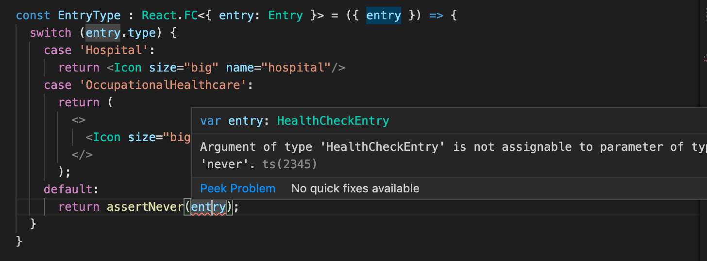

<div class="content">

Before we start delving into how you can use TypeScript together with React, we could first have a look at what we want to achieve. When everything works as it should, TypeScript will help us catching the following errors:

- Trying to pass an extra/unwanted prop to a component
- Forgetting to pass a required prop to a component
- Passing a prop of a wrong type to a component

If we make any of these errors, TypeScript can help us catch the errors in our editor right away. If we didn't use TypeScript, we would have to catch these errors later during testing, and we might be forced to do some tedious debugging in order to find out what is causing our errors.

But let that be enough of reasoning for now, and let's start getting our hands dirty!

### Create React App with TypeScript

[create-react-app](https://create-react-app.dev) supports a way to create an app using TypeScript by adding an additional <i>template</i> argument to the initialisation script. So, in order to create a Create React App using TypeScript, run the following command:

```sh
npx create-react-app my-app --template typescript
```

After running the command, you should have a complete basic react app, that uses TypeScript. The app can be started by simply running _npm start_ within the app root folder.

If you browse through the files and folders, you will notice that the app is not that different from the one you would have initialised with pure JavaScript. Basically the only differences are that the _.js_ and _.jsx_ files are now renamed to _.ts_ and _.tsx_ files, they contain some type annotations, and the root folder also contains a _tsconfig.json_ file.

Now, let's take a look at the _tsconfig.json_ file that has been created for us. Everything should be more or less fine within the file, except for that at the moment the configuration also allows JavaScript files to be compiled, because _allowJs_ is set to _true_. That would be fine if you need to mix TypeScript and JavaScript (e.g. if you are in the middle of transforming a JavaScript project into TypeScript or some other reason), but we want our app to be purely TypeScript, so let's change that setting to _false_.

Earlier we added eslint to help us enforce coding style, so let's do the same with this app. Start by adding the necessary dependencies and then create the required _.eslintrc_ file as you did before, with the same contents. Then add the linting script to _package.json_.

Now you might notice that eslint gives you all kinds of warnings, which we want to get rid of. This is because our eslint doesn't understand React at the moment. What you need to do is to add a new dependency _eslint-config-react_:

```
npm install --save-dev eslint-config-react
```

Now we still need to setup eslint to understand react, so add react to used plugins and to extended configurations. The file _.eslintrc_ should now look like this:

```js
{
  "env": {
    "browser": true,
    "jest": true,
    "es6": true,
    "node": true
  },
  "extends": [
    "eslint:recommended",
    "plugin:react/recommended",
    "plugin:@typescript-eslint/recommended"
  ],
  "plugins": ["react", "@typescript-eslint"],
}
```

We also need to add a new _settings_ configuration for react linting into _.eslintrc_:

```js
{
  // ...
  "settings": {
    "react": {
      "pragma": "React",
      "version": "detect"
    }
  },
}
```

Since basically all React components return a _JSX.Element_ type or _null_, we will loosen the linting rules a bit, so that we don't need to explicitly write out function return types everywhere. This can be done by adding the following _rules_ configuration into _.eslintrc_:

```js
{
  // ...
  "rules": {
    "@typescript-eslint/explicit-function-return-type": 0
  },
}
```

Now we need to get our linting script to parse _*.tsx_ files as well, which are the TypeScript equivalent of react's JSX files. We can do that by altering our lint command in _package.json_ to the following:

```json
"lint": "eslint './src/**/*.{ts,tsx}'"
```

If we now run _npm run lint_, we should still receive an error from eslint:


Why is that? Well, as we can interpret from the error, the file _serviceWorker.ts_ doesn't seem to be compliant with our linting configurations at the moment. This is because the _register_ function uses other functions that are declared later in the same file and the rule _@typescript-eslint/no-use-before-define_ doesn't like that. To fix the error we need to move the _register_ function as the last function in the file.

If we now run _npm run lint_, we shouldn't get any errors.

### React components with TypeScript

Let us consider the following JavaScript React example:

```jsx
import React from "react";
import PropTypes from "prop-types";

const Welcome = props => {
  return <h1>Hello, {props.name}</h1>;
};

Welcome.propTypes = {
  name: PropTypes.string
};

const element = <Welcome name="Sara" />;
ReactDOM.render(element, document.getElementById("root"));
```

In the example we have a component called <i>Welcome</i>, to which we want to pass a <i>name</i> prop, that is then printed out. We know that the  <i>name</i> prop should be a string and we use the [prop-types](https://www.npmjs.com/package/prop-types) package introduced in [part 5](/en/part5/props_children_and_proptypes#prop-types) to be able to receive hints about component's desired prop types and warnings for invalid prop types.

With the help of TypeScript we don't need the <i>prop-types</i> package anymore to define prop types, because we can define the types with the help of TypeScript itself by using the _FunctionComponent_ type or it's shorter alias _FC_.

 When using TypeScript with React components, the type annotations look a bit different than with other TypeScript code. We basically add a type for the component variable, instead of the function and it's props. _React.FunctionComponent_ is a so called [generic](https://www.typescriptlang.org/docs/handbook/generics.html) type, to which you can pass a type as a sort of argument, that it then uses in the final type.

The type declaration for _React.FC_ and _React.FunctionComponent_ looks like the following:

```js
type FC<P = {}> = FunctionComponent<P>;

interface FunctionComponent<P = {}> {
  (props: PropsWithChildren<P>, context?: any): ReactElement | null;
  propTypes?: WeakValidationMap<P>;
  contextTypes?: ValidationMap<any>;
  defaultProps?: Partial<P>;
  displayName?: string;
}
```

Firstly, you can see that _FC_ is simply an alias for the _FunctionComponent_ interface. They are both generic, which can easily be recognized by the angle bracket _<>_ after the type name. Inside the angle brackets there is <i>P = {}</i>. That means, that you can pass a type as an argument and inside the new type the passed type will go by the name <i>P</i> that is an empty object <i>{}</i> by default.

Now let's take a look at the first line inside _FunctionComponent_:

```js
(props: PropsWithChildren<P>, context?: any): ReactElement | null;
```

There you can see that <i>props</i> is of type <i>PropsWithChildren</i>, which is also a generic type, to which <i>P</i> is passed. The type <i>PropsWithChildren</i> in turn is a [intersection](http://www.typescriptlang.org/docs/handbook/unions-and-intersections.html#intersection-types) of <i>P</i> and the type <i>{ children?: ReactNode }</i>.

```js
type PropsWithChildren<P> = P | { children?: ReactNode };
```

Well, that was complicated (or was it?). Basically all we need to know at the moment is that we can define a type that we pass to _FunctionComponent_ and the component's <i>props</i> then consist of the defined type and component's <i>children</i>.

Now, lets return to our code exaple and see how we would define the type for the <i>Welcome</i> component's props in TypeScript.

```jsx
type WelcomeProps = {
  name: string;
};

const Welcome: React.FC<WelcomeProps> = (props) => {
  return <h1>Hello, {props.name}</h1>;
};

const element = <Welcome name="Sara" />;
ReactDOM.render(element, document.getElementById("root"));
```

We defined a new type _WelcomeProps_ and passed it to the added typing for the <i>Welcome</i> component:

```js
const Welcome: React.FC<WelcomeProps>;
```

You could also write the same thing using a less verbose syntax:

```jsx
const Welcome: React.FC<{ name: string }> = ({ name }) => (
  <h1>Hello, {name}</h1>
);
```

Now our editor knows that the <i>name</i> prop is a string, but for some reason eslint is not yet satisfied, and warns about that <i>'name' is missing in props validation</i>. This is because the react linting rules expect propTypes to be defined for all props, because it isn't aware of that we are already using TypeScript to define types for our props.

To fix the error, we need to add a new linting rule to _.eslintrc_:

```json
{
  // ...
  "rules": {
    "@typescript-eslint/explicit-function-return-type": 0,
    "react/prop-types": 0, // highlight-line
  },  
  // ...
}
```

</div>

<div class="tasks">

### Exercise 9.14.

#### 9.14.

Create a new Create React App with TypeScript, setup linting using eslint.

This exercise is similar to the one you have already done in [Part 1](/en/part1/javascript#exercises-1-3-1-5) of the course, but with TypeScript added and some tweaks. Start off by modifying the contents of _index.tsx_ to the following:

```jsx
import React from "react";
import ReactDOM from "react-dom";

const App: React.FC = () => {
  const courseName = "Half Stack application development";
  const courseParts = [
    {
      name: "Fundamentals",
      exerciseCount: 10
    },
    {
      name: "Using props to pass data",
      exerciseCount: 7
    },
    {
      name: "Deeper type usage",
      exerciseCount: 14
    }
  ];

  return (
    <div>
      <h1>{courseName}</h1>
      <p>
        {courseParts[0].name} {courseParts[0].exerciseCount}
      </p>
      <p>
        {courseParts[1].name} {courseParts[1].exerciseCount}
      </p>
      <p>
        {courseParts[2].name} {courseParts[2].exerciseCount}
      </p>
      <p>
        Number of exercises{" "}
        {courseParts.reduce((carry, part) => carry + part.exerciseCount, 0)}
      </p>
    </div>
  );
};

ReactDOM.render(<App />, document.getElementById("root"));
```

and remove the unnecessary files.

The whole app is now in one component, and that is not what we want, so refactor the code so that it consists of three new components: _Header_, _Content_ and _Total_. All data is still kept in the _App_ component, which passes all necessary data to each component as props. Be sure to add type declarations for the component's props. The _Header_ component should take care of rendering the name of the course, _Content_ should render the names of the different parts and the amount of exercises in that part, and _Total_ should render the total sum of exercises in all parts.

The _App_ component should look somewhat like this:

```jsx
const App = () => {
  // const-declarations

  return (
    <div>
      <Header name={courseName} />
      <Content ... />
      <Total ... />
    </div>
  )
};
```
</div>

<div class="content">

### Deeper type usage

In the previous exercise we had three parts of a course, where all parts had the same attributes <i>name</i> and <i>exerciseCount</i>. But what if we had the need for additional attributes for the parts and each part would have the need for different additional attributes, how would this look like codewise? Let's consider the following example:

```js
const courseParts = [
  {
    name: "Fundamentals",
    exerciseCount: 10,
    description: "This is an awesome course part"
  },
  {
    name: "Using props to pass data",
    exerciseCount: 7,
    groupProjectCount: 3
  },
  {
    name: "Deeper type usage",
    exerciseCount: 14,
    description: "Confusing description",
    exerciseSubmissionLink: "https://fake-exercise-submit.made-up-url.dev"
  }
];
```

In the example above we have added some additional attributes to each course part. The attributes <i>name</i> and <i>exerciseCount</i> are in common for each part, the first and the third share an attribute called <i>description</i>, and then there are also some additional attributes that are distinct for the second and third part.

Let's imagine that our application keeps on growing and we have the need to pass the different course parts around in our code and on top of that, there are also additional attributes and additional course parts added to the mix. How will we then know that our code is capable of handling all different types of data in the correct way, and that we're for example not forgetting to render a new course part on some page? This is something where TypeScript can be especially helpful!

Let's start by defining types for our different course parts:

```js
type CoursePartOne = {
  name: "Fundamentals";
  exerciseCount: number;
  description: string;
};

type CoursePartTwo = {
  name: "Using props to pass data";
  exerciseCount: number;
  groupProjectCount: number;
};

type CoursePartThree = {
  name: "Deeper type usage";
  exerciseCount: number;
  description: string;
  exerciseSubmissionLink: string;
};
```

Next we will create a type union of all these types, which we can use to define a type for our array, that should accept any of these course part types:

```js
type CoursePart = CoursePartOne | CoursePartTwo | CoursePartThree;
```

Now we can set the type for our <i>courseParts</i> variable and after that our editor will automatically give an error if we use a wrong type for an attribute, use an extra attribute, or forget to set an expected attribute. You can test this by commenting out any attribute for any course part. Thanks to the <i>name</i> string literal TypeScript can identify which course part requires which additional attributes, even if the variable is defined to use the type union.

But we're not satisfied yet! There is still a lot of duplication in the types that we have created, and that is something we want to avoid. We start off by identifying the attributes in common for all course parts and define a base type containing them, and then we will extend that base type to create our part specific types. We will also be changing our types to [interfaces](http://www.typescriptlang.org/docs/handbook/interfaces.html), because [extension](http://www.typescriptlang.org/docs/handbook/interfaces.html#extending-interfaces) syntax becomes somewhat clearer:

```js
interface CoursePartBase {
  name: string;
  exerciseCount: number;
}

interface CoursePartOne extends CoursePartBase {
  name: "Fundamentals";
  description: string;
}

interface CoursePartTwo extends CoursePartBase {
  name: "Using props to pass data";
  groupProjectCount: number;
}

interface CoursePartThree extends CoursePartBase {
  name: "Deeper type usage";
  description: string;
  exerciseSubmissionLink: string;
}
```

Here is the same for <i>CoursePartOne</i> using <i>type</i>, just for comparison:

```js
type CoursePartBase = {
  name: string;
  exerciseCount: number;
};

type CoursePartOne = CoursePartBase & {
  name: "Fundamentals";
  description: string;
};
```

In most cases you can use either <i>type</i> or <i>interface</i>, which ever syntax you prefer, but there are still a few things to keep in mind. For instance if you define multiple interfaces with the same name, they will result in a merged interface, whereas if you try to create multiple types with the same name, it will result in an error stating that one with the same name is already declared. 

Even if we're not using classes in this course, it might be good to know that classes can implement TypeScript interfaces, but not types. And lastly, if you have the need to define a type that is a union of other types, like our <i>CoursePart</i>, you need to use the keyword <i>type</i>, even if the different parts could be either <i>type</i> or <i>interface</i>.

How should we now use these types in our components?

One handy way to use these kind of types in TypeScript is by using _switch case_ expressions. Once you have either explicitly declared, or TypeScript has inferred that a variable holds a type union, and each type in the type union contains an attribute, that can be used as a type identifier, you can build your switch case around that attribute and TypeScript will then know which attributes are available within each case block.


In the example above TypeScript knows that <i>coursePart</i> has the type <i>CoursePart</i>, so it can infer that <i>part</i> is of either type <i>CoursePartOne</i>, <i>CoursePartTwo</i> or <i>CoursePartThree</i>. Because <i>name</i> is distinct for each type, we can use it to identify each type and thus TypeScript can help to let us know which attributes are available in each case block and it will produce an error if you e.g. try to use the <i>part.description</i> within the <i>"Using props to pass data"</i> block.

What about new types? If we were to add a new course part, wouldn't it be nice to know if we haven't yet implemented handling of that type in our code? With the example above, a new type would go to the <i>default</i> block and nothing would get printed for a new type. Sometimes this is of course totally acceptable, e.g. if you only want to handle specific (not all) cases of a type union, but in most cases it is recommended to handle all variations separately. 

With TypeScript we can use a way of type checking, which is called exhaustive type checking. Its basic principle is that if we encounter an unexpected value, we call a function that accepts a value with the type [never](https://www.typescriptlang.org/docs/handbook/basic-types.html#never) and also has the return type <i>never</i>.

A straight forward version of the function could look like this:

```js
/**
 * Helper function for exhaustive type checking
 */
const assertNever = (value: never): never => {
  throw new Error(
    `Unhandled discriminated union member: ${JSON.stringify(value)}`
  );
};
```

If we now were to replace the contents of our <i>default</i> block to:

```js
default:
  return assertNever(part);
```

And would also comment out the <i>Deeper type usage</i> case block, we would see the following error:


The error description <i>Argument of type 'CoursePartThree' is not assignable to parameter of type 'never'</i> tells us that we are using a variable somwhere, where it should never be used, so we know that something needs to be fixed. When we remove the added comments from the <i>Deeper type usage</i> case block, you will see that the error goes away.

</div>

<div class="tasks">

### Exercise 9.17

#### 9.17

First add the new type information to _index.tsx_ and replace the variable _courseParts_ with the one from the example below.

```js
// new types
interface CoursePartBase {
  name: string;
  exerciseCount: number;
}

interface CoursePartOne extends CoursePartBase {
  name: "Fundamentals";
  description: string;
}

interface CoursePartTwo extends CoursePartBase {
  name: "Using props to pass data";
  groupProjectCount: number;
}

interface CoursePartThree extends CoursePartBase {
  name: "Deeper type usage";
  description: string;
  exerciseSubmissionLink: string;
}

type CoursePart = CoursePartOne | CoursePartTwo | CoursePartThree;

// this is the new coursePart variable
const courseParts: CoursePart[] = [
  {
    name: "Fundamentals",
    exerciseCount: 10,
    description: "This is an awesome course part"
  },
  {
    name: "Using props to pass data",
    exerciseCount: 7,
    groupProjectCount: 3
  },
  {
    name: "Deeper type usage",
    exerciseCount: 14,
    description: "Confusing description",
    exerciseSubmissionLink: "https://fake-exercise-submit.made-up-url.dev"
  }
];
```

Now we know that both interfaces <i>CoursePartOne</i> and <i>CoursePartThree</i> share not only the base attributes, but also an attribute called <i>description</i>, which is a string in both interfaces. 

Your first task is to to declare a new interface, which includes the <i>description</i> attribute and extends the <i>CoursePartBase</i> interface. Then modify the code so that you can remove the <i>description</i> attribute from both <i>CoursePartOne</i> and <i>CoursePartThree</i>, without getting any errors.

Then modify your <i>Content</i> component so that it will render all attributes for each course part. Use exhaustive type checking!

Lastly, add your own course part interface with at least the following attributes: <i>name</i>, <i>exerciseCount</i> and <i>description</i>. Then add that interface to the type union <i>CoursePart</i> and add corresponding data to the <i>courseParts</i> variable. Now if you have modified your <i>Content</i> component correctly, you should get an error, because you have not yet added support for the fourth course part type. Do the necessary changes to <i>Content</i>, so that all attributes for the new course part also get rendered and that the compiler doesn't produce any errors.

</div>

<div class="content">

### Working with an existing codebase

When diving into the codebase for the first time it is good to get an overall view of the conventions and structure of the project. You can start your research from the <i>README.md</i> in the root of the repository. Usually it contains a brief description of the application and requirements needed to use it and also how to start it for development. If this is not present or somebody has saved time and left it as a stub you can take a peek in the <i>package.json</i>. It is always a good idea to start the application and click around it at the same time verifying that you have a functional development environment.

You can also browse the folder structure to get insights about application functionality and/or the architecture used. This is not always clear and developers may have chosen way to organize code that might not be familliar to you. The [sample project](https://github.com/fullstack-hy2020/patientor) used in in the rest of this part is organized featurewise. You can see what different pages the application has and some general components eg. modals and state. Keep in mind that the features represented may have different scopes eg. modals are visible UI level components whereas the state is comparable to business logic and keeps the data organized under the hood for the rest of the app to use.

Typescript provides you types which tell you what kind of data structures functions, components and state expect. You can try to look for <i>types.ts</i> or something similar to get you started. VSCode is a big help and just highlighting can help you. This all depends on how types are used in the project and how well are they integrated.

If project has tests unit, functionality or end-to-end tests you can get more specific details regarding the functionality. Test cases are your most important tool when refactoring or creating new features to the application. You want to make sure not to break any existing features when hammering around the code. Typescript can also give you guidance with argument and return types when doing changes in the code.

Remember that reading code is a skill itself and relax if you don't understand the code on your first readthrough. Code may have a lot of corner cases and added logic through out its development cycle. It is hard to imagine what kind of troubles the previous developer has been wrestling with. Think of it all like [growth rings in trees](https://en.wikipedia.org/wiki/Dendrochronology#Growth_rings). Understanding all of it requires digging deep into the code and business domain requirements. The more code you read the better you're going to be at it. You will read more code than you're going to produce.

### Patientor frontend

It's time to get our hands dirty finalizing the frontend for the backend we built in [exercises 9.10.-9.15.](/en/part9/typing_the_express_app).

Before diving into the code, let us start both the frontend and the backend.

After a successful build your browser will open a new tab to http://localhost:3000/. You should see a patient listing page, which fetches a patient list from our backend and renders the list in a simple table, and a button for creating new patients to the backend. As we are not using a database, but mock data, the data will not persist, i.e. closing the backend forgets all the added data. UI has not clearly been the strong point of the creators of this app, so let's disregard the UI for now.

After we have verified that everything is working, we start studying the code. All the interesting stuff resides in the <i>src/</i> folder. For convenience there is also a ready made <i>types.ts</i> file for basic types used in the app, which you will have to extend or refactor in the exercises. 

Same types could in principle be used in both backend and frontend, but usually the frontend has different data structures and use cases for the data, thus causing the types to be different. For example frontend has a state and may want keep data in objects or maps instead of array given by the backend with different keys. The frontend might also not need all the fields that the backend provides, and it may need to add some new fields to be used in rendering.

The folder structure looks as follows:


So there are currently, as you would expect, two main components: <i>AddPatientModal</i> and <i>PatientListPage</i>. The <i>state/</i> folder contains state handling for the frontend. The main functionality it provides is keeping our data in one place, offering simple actions to alter the state of our app.

### State handling

Let's checkout the state handling a bit closer as a lot of stuff seems to be happening under the hood and it differs a bit from the methods used in the course so far. 

Our state functionality is built using React Hooks [useContext](https://reactjs.org/docs/hooks-reference.html#usecontext) and [useReducer](https://reactjs.org/docs/hooks-reference.html#usereducer). This is one way of creating a stateful app when we know that the app we will build is small and we do not want to use <i>redux</i> or other libraries. It would be also perfectly fine to keep all of the state in the main component. There is a lot of good material eg. [this article](https://medium.com/@seantheurgel/react-hooks-as-state-management-usecontext-useeffect-usereducer-a75472a862fe). 

The approach taken in this app uses the React [context](https://reactjs.org/docs/context.html), that according to documentation

> <i>Context is designed to share data that can be considered "global" for a tree of React components, such as the current authenticated user, theme, or preferred language.</i> 

In our case the "global" shared data is the application state <i>and</i> the dispatch function that is used to make changes to data. In a way the approach works quite much like redux based state management that we used in [part 6](/en/part6) but is a more light weight since it does not require the use of a external library. This part assumes that you are at least familiar at the way how redux works, e.g. you should have covered at least [the first section](/en/part6/flux_architecture_and_redux) of part 6.

We create a [context](https://reactjs.org/docs/context.html) which has a tuple of our apps state and dispatcher for changing the state of our app. This matches the arguments we receive from [useReducer](https://reactjs.org/docs/hooks-reference.html#usereducer). hook. Dispatch function takes as parameter objects with type <i>Action</i> which is defined in <i>reducer.ts</i> alongside the actual reducer function defining what the action does to the state returning a new state. 

When in doubt on how to design state and its handling checkout the [redux guidelines](https://redux.js.org/style-guide/style-guide/). <i>useReducer</i> is the actual workhorse of our state handling giving us the actual state handling functionality according to the reducer function given to it.

Disregarding how you do your state handling, it is good enforce your application's state with types. Our sample application's state is quite simple:

```js
export type State = {
  patients: { [id: string]: Patient };
};
```

Our state is an object with one key <i>patients</i>, which has a [dictionary](https://www.typescriptlang.org/docs/handbook/advanced-types.html#index-types-and-index-signatures) or simply put an object with string keys and with a <i>Patient</i> object as value. Index can only be <i>string</i> or <i>number</i> as you can access the object values using those. This enforces that the state conforms in the way we want, and prevents developers from misusing the state. You can also think of a scenario where we may have state as a union. Eg. using states type as an indicator whether user has logged in:

```js
export type State =
  | {
      type: "Unauthenticated";
    }
  | {
      type: "Authenticated";
      currentUser: User;
    };
```

This is one way of using typescript to help keeping the applications state under control. We know that if the state is in <i>type: "Authenticated"</i> we will have a <i>currentUser</i> field in state.

The main principles of this are passing the state to our components through context and modifying the context using reducers. Reducers should be quite familiar if you have used redux before. Our reducers are in <i>reducer.ts</i> file where there is the reducer function and the type <i>Action</i> that looks as follows

```js
export type Action =
  | {
      type: "SET_PATIENT_LIST";
      payload: Patient[];
    }
  | {
      type: "ADD_PATIENT";
      payload: Patient;
    };
```

Reducer looks quite much like the ones we wrote in [part 6](/en/part6), it changes the state for each type of action: 

```js
export const reducer = (state: State, action: Action): State => {
  switch (action.type) {
    case "SET_PATIENT_LIST":
      return {
        ...state,
        patients: {
          ...action.payload.reduce(
            (memo, patient) => ({ ...memo, [patient.id]: patient }),
            {}
          ),
          ...state.patients
        }
      };
    case "ADD_PATIENT":
      return {
        ...state,
        patients: {
          ...state.patients,
          [action.payload.id]: action.payload
        }
      };
    default:
      return state;
  }
};
```

The main difference is now that the state is a dictionary (or object) instead of array that we used in [part 6](/en/part6).

There are lot of things happening in the file <i>state.ts</i> that is taking care of setting up the contex. Firstly it uses <i>useReducer</i> hook to create a [context provider](https://reactjs.org/docs/context.html#contextprovider)

```js
export const StateProvider: React.FC<StateProviderProps> = ({
  reducer,
  children
}: StateProviderProps) => {
  const [state, dispatch] = useReducer(reducer, initialState); // highlight-line
  return (
    <StateContext.Provider value={[state, dispatch]}>  // highlight-line
      {children}
    </StateContext.Provider>
  );
};
```

Provider makes <i>state</i> and <i>dispatch</i> functions available in all of the components, thanks to the setup in <i>index.ts</i>:  

```js 
import { reducer, StateProvider } from "./state";

ReactDOM.render(
  <StateProvider reducer={reducer}>
    <App />
  </StateProvider>, 
  document.getElementById('root')
);
```

It also defines the <i>useStateValue</i> hook

```js 
export const useStateValue = () => useContext(StateContext);
```

and the components that need to access the state or dispatcher use it to get hold of those:

```js 
import { useStateValue } from "../state";

// ...

const PatientListPage: React.FC = () => {
  const [{ patients }, dispatch] = useStateValue();
  // ...
}
```

Do not worry if this seems confusing, it surely is until you have studied the [context documentation](https://reactjs.org/docs/context.html) and its use in [state management](https://medium.com/@seantheurgel/react-hooks-as-state-management-usecontext-useeffect-usereducer-a75472a862fe). You do not need to understand all this completely for doing the exercises! 

It is actually quite typical that when you start working with an existing application, at the beginning you do not understand 100% of what happens under the hood. If the app has been properly structured you can trust that if you are making careful modifications, the app still works despite of the fact that you did not understand all the internals. Over the time you can then get a grasp of the more unfamiliar parts, but it does not happen overnight when working with a large codebase.

### Patient listing page

Let's go through the <i>PatientListPage/index.ts</i> as you can take inspiration from there to help you fetch data from backend and update the application's state. <i>PatientListPage</i> uses our custom hook for injecting state and dispatcher for updating the state.  As we are listing patients we only need the <i>patients</i> property from the state:

```js
import { useStateValue } from "../state";

const PatientListPage: React.FC = () => {
  const [{ patients }, dispatch] = useStateValue();
  // ...
}
```

We also have some <i>useState</i> hooks for managing modal visibility and form error handling. Form walkthrough will be done in the upcoming parts.

```js
const [modalOpen, setModalOpen] = React.useState<boolean>(false);
const [error, setError] = React.useState<string | undefined>();
```

We give <i>useState</i> hook type parameter that is applied for the actual state. So <i>modalOpen</i> is a <i>boolean</i> and <i>error</i> has type <i>string | undefined</i> respectively. Both set functions returned by <i>useState</i> hook are functions that accept only arguments according to the type parameter given. Eg. the exact type for <i>setModalOpen</i> function is <i>React.Dispatch<React.SetStateAction<boolean>></i>. We also have <i>openModal</i> and <i>closeModal</i> helper functions for better readability and convenience:

```js
const openModal = (): void => setModalOpen(true);

const closeModal = (): void => {
  setModalOpen(false);
  setError(undefined);
};
```

Frontend's types are based on what you have created when developing the backend in the previous part.

We are fetching patient from the backend using [axios](https://github.com/axios/axios) and we are giving the <i>axios.get</i> function a type parameter as to what is the type for the response data:

````js
React.useEffect(() => {
  const fetchPatientList = async () => {
    const { data: patientListFromApi } = await axios.get<Patient[]>(
      `${apiBaseUrl}/patients`
    );
    dispatch({ type: "SET_PATIENT_LIST", payload: patientListFromApi });
  };

  try {
    fetchPatientList();
  } catch (e) {
    console.error(e);
  }
}, [dispatch]);
````

 **A word of warning!** Passing the type parameter for axios will not validate any data and is quite dangerous especially if you are using external APIs. You can create custom validation functions taking in the whole payload and returning the correct type or you can use type guard. Both are valid. There are also many libraries that provide validation through different kind of schemas eg. [io-ts](https://github.com/gcanti/io-ts). For simplicity we will continue trusting our own work and trust that we will get data of the correct form from the backend.

As our app is quite small we will update the state by simply calling the <i>dispatch</i> function provided to us by <i>useStateValue</i> hook. As we have created type definition for our actions in the <i>state/reducer.ts</i>. Compiler helps to make sure that we dispatch actions according to our <i>Action</i> type with predefined type string and payload.

```js
dispatch({ type: "SET_PATIENT_LIST", payload: patientListFromApi });
```

</div>

<div class="tasks">

### Exercises 9.18.-9.19

We will soon add new type <i>Entry</i> for our app that represents a light weight patient journal entry. It consists of journal text ie. <i>description</i>, creation date, information regarding the specialist who created it and possible diagnosis codes. Diagnosis codes map to the ICD-10 codes returned from the <i>/api/diagnoses</i> endpoint. Our naive implementation will be that patient has an array of entries.

Before going to this, let us do some preparatory work.

#### 9.18: patientor, step1

Create an endpoint <i>/api/patients/{id}</i> to that returns all of the patient information for one patient, including also the array of patient entries that is still empty for all the patients. For the time being, expand the backend types as follows:

```js
export type Entry = {
}

export type Patient = {
  id: string,
  name: string,
  dateOfBirth: string
  ssn: string
  occupation: string
  gender: Gender
  entries: Entry[] // highlight-line
}

export type PublicPatient = Omit<Patient, 'ssn' | 'entries' >  // highlight-line
```

Response should look as follows:


#### 9.19: patientor, step2

Create a page for showing the patient information in the frontend.

Patient information should be accessible when clicking eg. the patients name.

After fetching the patient information from backend add the fetched information to the applications state. You can differentiate between which fields you get from the <i>/api/patients</i> and <i>/api/patients/{id}</i> endpoints. You do not need to fetch the information if it already is in the app state. This is a naive implementation disregarding the need to update without reloading the app.

Since we now have the state in the context, you'll need to define a new action type for updating an individual patient's data.

The Application uses [Semantic UI React](https://react.semantic-ui.com/) for styling, which is quite similar to [React Bootstrap](https://react-bootstrap.github.io/) and [MaterialUI](https://material-ui.com/) that we covered in [part 7](/en/part7/more_about_styles). You may also use it for the new components but that is up to you sincew the main focus is now in Typescript.

The Application also uses [react router](https://reacttraining.com/react-router/web/guides/quick-start) 
to control what view is visible in the frontend. You might want to have a look on [part 7](/en/part7/react_router) if you don't yet have a grasp on how the router works.

The result could look like the following:


The gender is shown with react-semantic-ui component [Icon](https://react.semantic-ui.com/elements/icon/#gendersicons-can-represent-genders-or-types-of-sexuality) 

**Note** that in order to access the id in the url, you need to give [useParams](https://reacttraining.com/react-router/web/api/Hooks/useparams) a proper type argument:

```js
const id = useParams<{ id: string }>().id
```

</div>

<div class="content">

### Full entries

We implemented in the [exercise 9.12.](/en/part9/typing_the_express_app#exercises-9-12-9-13) an endpoint for fetching the diagnoses but we still are not using that endpoint at all. That makes sense since our application currently consists only of listing patients and their information. Now it would be a great idea to expand our data by a bit; let's add possible <i>Entry</i> data to our patient data so that each patient can have medical entries that include possible diagnoses.

Let's ditch our old patient seed data from backend and start using [this expanded format](https://github.com/fullstack-hy2020/misc/blob/master/patients.ts).

**Notice:** This time the data is not in .json but instead in the .ts-format. You should already have the complete <i>Gender</i> and <i>Patient</i> types implemented so only correct the paths where they are imported from if needed.

Let us now create a proper <i>Entry</i> type based on the data we have.

When looking at the data closer, we can see that the entries in the data differ actually quite a lot from each other. For example, let's take the first two entries we can see there:

```js
{
  id: 'd811e46d-70b3-4d90-b090-4535c7cf8fb1',
  date: '2015-01-02',
  type: 'Hospital',
  specialist: 'MD House',
  diagnosisCodes: ['S62.5'],
  description:
    "Healing time appr. 2 weeks. patient doesn't remember how he got the injury.",
  discharge: {
    date: '2015-01-16',
    criteria: 'Thumb has healed.',
  }
}
...
{
  id: 'fcd59fa6-c4b4-4fec-ac4d-df4fe1f85f62',
  date: '2019-08-05',
  type: 'OccupationalHealthcare',
  specialist: 'MD House',
  employerName: 'HyPD',
  diagnosisCodes: ['Z57.1', 'Z74.3', 'M51.2'],
  description:
    'Patient mistakenly found himself in a nuclear plant waste site without protection gear. Very minor radiation poisoning. ',
  sickLeave: {
    startDate: '2019-08-05',
    endDate: '2019-08-28'
  }
}
```

Immediately we can see that the first few fields are the same, but the first one only has the <i>discharge</i> field and the second one only <i>employerName</i> and <i>sickLeave</i>. So all the entries seem to have somethign in common but some are entry specific. 

When looking at the entries through the <i>type</i> field we can see that there actually is three separate kinds of entries: <i>OccupationalHealthcare</i>, <i>Hospital</i> and <i>HealthCheck</i>. This indicates the need for three separate kinds of types but since they all seem to have something in common we might just want to create a base entry interface that we could extend with the different fields in each type.

When looking at the data, it seems that the fields <i>id</i>, <i>description</i>, <i>date</i> and <i>specialist</i> are something that can be found from each entry. On top of that, it seems that the <i>diagnosisCodes</i> is only found in one <i>OccupationalHealthCare</i> and one <i>Hospital</i> type entry. Since it is not always used even in those types of entries, it is safe to assume that the field is optional and we could consider it to be optional even in the <i>HealthCheck</i> type entry, just not in use in these entries right here.

So our <i>BaseEntry</i> from which each type could be extended from with would be the following:

```js
interface BaseEntry {
  id: string;
  description: string;
  date: string;
  specialist: string;
  diagnosisCodes?: string[];
}
```

If we want to finetune it a little bit further, since we already have a <i>Diagnosis</i> type defined in the backend, we might just want to refer to the <i>Diagnosis</i> types code field directly, in case the type of it ever changes, like this:

```js
interface BaseEntry {
  id: string;
  description: string;
  date: string;
  specialist: string;
  diagnosisCodes?: Array<Diagnose['code']>;
}
```

As you might remember <i>Array&lt;Type&gt;</i> is just an alternative way to say <i>Type[]</i>. In cases like this it is just much more clear to use the array convention since the other option would be to define the type by saying <i>Diagnosis['code'][]</i> which starts to look a little bit strange.

Now that we have the <i>BaseEntry</i> defined we can start creating the extended entry types we will actually use. Let's start by creating the <i>HealthCheckEntry</i> type.

The entries with the type <i>HealthCheck</i> contain the field <i>HealthCheckRating</i>, which can be any of the integer values from 0 to 3, 0 meaning <i>Healthy</i> and 3 informing of a <i>CriticalRisk</i>: the perfect case for an enum definition. With these specifications we could write a <i>HealthCheckEntry</i> type definition like the following:

```js
export enum HealthCheckRating {
  "Healthy" = 0,
  "LowRisk" = 1,
  "HighRisk" = 2,
  "CriticalRisk" = 3
}

interface HealthCheckEntry extends BaseEntry {
  type: "HealthCheck";
  healthCheckRating: HealthCheckRating;
}
```

Now we only need to create the <i>OccupationalHealthCareEntry</i> and <i>HospitalEntry</i> types so we can combine and export them as the Entry type like this:

```js
export type Entry =
  | HospitalEntry
  | OccupationalHealthcareEntry
  | HealthCheckEntry;
```

</div>

<div class="tasks">

### Exercises 9.20.-9.22.

#### 9.20: patientor, step3

Define the types <i>OccupationalHealthCareEntry</i> and <i>HospitalEntry</i> so that those conform with the example data. Ensure that your backend returns the entries properly when you go to a individual patient route


Use types properly in the backend! For now there is no need to do a proper validation for all the fields if the entries in the backend, it is enough e.g. to check that the field <i>type</i> has a correct value.

#### 9.21: patientor, step4

Extend the patient page in the frontend to list the <i>date</i>, <i>description</i> and <i>diagnose codes</i> of patient's entries. 

You can use the same type definiton for <i>Entry</i> in the frontend. For these exercises it is enough just to copy/paste the definitions from backend to frontend.

Your solution could look like this:


#### 9.22: patientor, step5

Fetch and add diagnoses to application state from <i>/api/diagnosis</i> endpoint. Use the new diagnosis data to show descriptions for patients diagnosis code:


#### 9.23: patientor, step5

Extend the entry-listing in the patient page to include the Entry's details with a new component that shows rest of the information of the patients entries distinguishing different types from each other. 

You could use eg. [Icon](https://react.semantic-ui.com/elements/icon/) or some other [SemanticUI](https://react.semantic-ui.com/) components the get appropriate visuals for your listing.

You should use a _switch case_ based rendering and Use exhaustive type checking as seen previously in the material, so that no cases can be forgotten. 

Like this:



The resulting entries in the listing <i>could</i> look something like this:


</div>

<div class="content">

### Add patient form

Form handling can sometimes be quite a nuisance in React. That's why we have decided to utilize the the [Formik](https://jaredpalmer.com/formik/docs/overview) package for our add patient form in our app. Here's a small intro from to Formiks's documentation:

> Formik is a small library that helps you with the 3 most annoying parts:
>
> - Getting values in and out of form state
> - Validation and error messages
> - Handling form submission
>
> By colocating all of the above in one place, Formik will keep things organized - making testing, refactoring, and reasoning about your forms a breeze.

The code for the form can be found in <i>src/AddPatientModal/AddPatientForm.tsx</i> and some form field helpers can be found in <i>src/AddPatientModal/FormField.tsx</i>. In the beginning of <i>AddPatientForm.tsx</i> you can see, that we have created a type for our form values, called simply <i>FormValues</i>. It is a narrowed down version of <i>Patient</i>, with the properties <i>id</i> and <i>entries</i> omitted, because we don't want the user to be able to submit then when creating a new patient. <i>id</i> is created by the backend and <i>entries</i> can only be added for existing patients.

```js
export type FormValues = Omit<Patient, "id" | "entries">;
```

Next we declare the props for our form component:

```js
interface Props {
  onSubmit: (values: FormValues) => void;
  onCancel: () => void;
}
```

There we can see that the component requires two props, <i>onSubmit</i> and <i>onCancel</i>. Both are callback functions that return <i>void</i>. As arguments <i>onSubmit</i> should receive an object of our <i>FormValues</i> type, so that the callback can handle our form values. 

When creating <i>AddPatientForm</i> function component, you can see that we have bound <i>Props</i> type as as our component's props, and are destructuring <i>onSubmit</i> and <i>onCancel</i> from those props.

```js
export const AddPatientForm: React.FC<Props> = ({ onSubmit, onCancel }) => {
  // ...
}
```

Now, before we go any further, let's have a look at our form helpers in <i>FormField.tsx</i>. If you look at what is exported from the file, you will find the type <i>GenderOption</i> and the function components <i>SelectField</i> and <i>TextField</i>.

Let's take a closer look at <i>SelectField</i> and the types around it. First we create a generic type for each option object, that contains a value and a label for that value. These are the kind of option objects we want to allow on our form in the select field. Since the only options we want to allow are different genders, we set that the <i>value</i> should be of type <i>Gender</i>.

```js
export type GenderOption = {
  value: Gender;
  label: string;
};
```

In <i>AddPatientForm.tsx</i> we use this type for the variable <i>genderOptions</i>, and declare that it will be an array containing objects of type <i>GenderOption</i>:

```js
const genderOptions: GenderOption[] = [
  { value: Gender.Male, label: "Male" },
  { value: Gender.Female, label: "Female" },
  { value: Gender.Other, label: "Other" }
];
```

Next look at the type <i>SelectFieldProps</i>. It defines the type for the props for our <i>SelectField</i> component. There you can see that options is an array of <i>GenderOption</i> types.

```js
type SelectFieldProps = {
  name: string;
  label: string;
  options: GenderOption[];
};
```

The function component <i>SelectField</i> in itself is pretty straight forward. It renders the label, a select element, and all given option elements, or actually their labels and values.

```jsx
export const SelectField: React.FC<SelectFieldProps> = ({
  name,
  label,
  options,
}: SelectFieldProps) => (
  <Form.Field>
    <label>{label}</label>
    <Field as="select" name={name} className="ui dropdown">
      {options.map(option => (
        <option key={option.value} value={option.value}>
          {option.label || option.value}
        </option>
      ))}
    </Field>
  </Form.Field>
);
```

Now let's move on to the <i>TextField</i> component. It uses an intersection of SemanticUI's <i>InputProps</i> and a type that consists of a string label and an optional error message as props. From the props <i>name</i>, <i>label</i>, <i>placeholder</i> and <i>errorMessage</i> are destructured into variables and used within the component. The component renders a SemanticUI [Form.Field](https://react.semantic-ui.com/collections/form/) with the given label and a Formik [Field](https://jaredpalmer.com/formik/docs/api/field), to which <i>name</i>, <i>placeholder</i> and a function component are given as props. The function component used as props is <i>TextInput</i>, which we have created ourselves. If the <i>errorMessage</i> prop is truthy, then we will render the error message below the input element.

```jsx
export const TextField: React.FC<InputProps & {
  label: string;
  errorMessage?: string;
}> = ({ name, label, placeholder, errorMessage }) => (
  <Form.Field>
    <label>{label}</label>
    <Field name={name} placeholder={placeholder} component={TextInput} />
    {errorMessage && <Label color="red">{errorMessage}</Label>}
  </Form.Field>
);
```

<i>TextInput</i> is a simple component that accepts an intersection of SemanticUI <i>InputProps</i> and Formiks <i>FieldProps</i> as props and then renders a SemanticUI [Input](https://react.semantic-ui.com/elements/input/). The <i>placeholder</i> props is passed down from props of <i>TextField</i> and the rest of the values for the input element (<i>...field</i>) are generated by Formik's <i>Field</i> where this component is used.

```jsx
const TextInput: React.FC<FieldProps & InputProps> = ({
  placeholder,
  field
}) => <Input placeholder={placeholder} {...field} />;
```

Now back to the actual form component in <i>AddPatientForm.tsx</i>. The function component <i>AddPatientForm</i> renders a [Formik component](https://jaredpalmer.com/formik/docs/api/formik), which is a wrapper that requires two props, which are quite self explanatory: <i>initialValues</i> and <i>onSubmit</i>. The Formik wrapper keeps track of your form's state and then exposes it plus a few reusable methods and event handlers to your form via props.

 We are also using an optional <i>validate</i> prop, that expects a validation function and returns an object containing possible errors. Here we only check that our text fields are not falsy, but it could easily contain e.g. some validation for the social security number format etc. First have a look at the entire component, we will later explain the different parts in more detail.

```jsx
export const AddPatientForm: React.FC<Props> = ({ onSubmit, onCancel }) => {
  return (
    <Formik
      initialValues={{
        name: "",
        ssn: "",
        dateOfBirth: "",
        occupation: "",
        gender: Gender.Other
      }}
      onSubmit={onSubmit}
      validate={values => {
        const requiredError = "Field is required";
        const errors: { [field: string]: string } = {};
        if (!values.name) {
          errors.name = requiredError;
        }
        if (!values.ssn) {
          errors.ssn = requiredError;
        }
        if (!values.dateOfBirth) {
          errors.dateOfBirth = requiredError;
        }
        if (!values.occupation) {
          errors.occupation = requiredError;
        }
        return errors;
      }}
    >
      {({ errors, touched }) => {
        /**
         * Check if the given field contains an error and return it in that case.
         * also require field to have been touched,
         * so that no all fields won't display errors by default.
         * If no error, return undefined (return type is inferred)
         */

        const getFieldErrorMessage = (fieldName: keyof FormValues) =>
          touched[fieldName] && errors[fieldName]
            ? errors[fieldName]
            : undefined;
        
        return (
          <Form className="form ui">
            <TextField
              label="Name"
              name="name"
              placeholder="Name"
              errorMessage={getFieldErrorMessage("name")}
            />
            <TextField
              label="Social Security Number"
              name="ssn"
              placeholder="SSN"
              errorMessage={getFieldErrorMessage("ssn")}
            />
            <TextField
              label="Date Of Birth"
              name="dateOfBirth"
              placeholder="YYYY-MM-DD"
              errorMessage={getFieldErrorMessage("dateOfBirth")}
            />
            <TextField
              label="Occupation"
              name="occupation"
              placeholder="Occupation"
              errorMessage={getFieldErrorMessage("occupation")}
            />
            <SelectField
              label="Gender"
              name="gender"
              options={genderOptions}
            />
            <Grid>
              <Grid.Column floated="left" width={5}>
                <Button type="button" onClick={onCancel} color="red">
                  Cancel
                </Button>
              </Grid.Column>
              <Grid.Column floated="right" width={5}>
                <Button type="submit" floated="right" color="green">
                  Add
                </Button>
              </Grid.Column>
            </Grid>
          </Form>
        );
      }}
    </Formik>
  );
};
```

As a child for our Formik wrapper, we create a <i>function</i> that returns the form contents as we want them. We use Formik's [Form](https://jaredpalmer.com/formik/docs/api/form) to render the actual form element and inside that we use our <i>TextField</i> and <i>SelectField</i> components, that we created in <i>FormField.tsx</i>.

 Inside the function we can use Formik's <i>errors</i> and <i>touched</i> objects, that contain data about possible validation errors and of fields that have been touched. If a field has been touched and contains an error, we will pass that error to the <i>TextField</i> component to be rendered there. If we look at our <i>TextField</i> component, we can see that the type for the <i>errorMessage</i> prop is an optional string. To avoid duplicating same logic for all form fields, we have created a helper function <i>getFieldErrorMessage</i>:
 
 ```js
const getFieldErrorMessage = (fieldName: keyof FormValues) =>
  touched[fieldName] && errors[fieldName]
    ? errors[fieldName]
    : undefined;
 ```

Function checks if the given field is <i>touched</i> and has <i>errors</i>, and returns the value from the <i>errors</i> object in that case. If either check was falsy, the function returns <i>undefined</i>. From the function signature we can see that the <i>fieldName</i> argument has the followin type:

```js
fieldName: keyof FormValues
```

That means that the given argument has to be a key present in the <i>FormValues</i> type. Basically it translates to the type:

```js
fieldName: "name" | "ssn" | "dateOfBirth" | "occupation" | "gender";
```

But is less verbose. This type prevents us from calling the function with an invalid value and thus we will be notified if we misspell the name of a field or in some other way try to use the function in the wrong way. 

Lastly on the form, we create two buttons, one for cancelling the form submission, and one for submitting the form. The cancel button calls the <i>onCancel</i> callback straight away, while the submit button triggers Formik's onSubmit event, which in turn uses the <i>onSubmit</i> callback from the component's props. Submission is handled through Formik, because that way we can get it to call the validation function before performing the actual submission. If the validation function returns any errors, the submission is cancelled. The buttons are set inside a SemanticUI [Grid](https://react.semantic-ui.com/collections/grid/), to get them next to each other easily.

```jsx
<Grid>
  <Grid.Column floated="left" width={5}>
    <Button type="button" onClick={onCancel} color="red">
      Cancel
    </Button>
  </Grid.Column>
  <Grid.Column floated="right" width={5}>
    <Button type="submit" floated="right" color="green">
      Add
    </Button>
  </Grid.Column>
</Grid>
```

The <i>onSubmit</i> callback has been passed down all the way from our patient list page. It basically performs a post operation to our backend, adds the new returned patient to our state and closes the modal. If the backend returns an error, the error is displayed on the form.

Here is our submit function:

```js
const submitNewPatient = async (values: FormValues) => {
  try {
    const { data: newPatient } = await axios.post<Patient>(
      `${apiBaseUrl}/patients`,
      values
    );
    dispatch({ type: "ADD_PATIENT", payload: newPatient });
    closeModal();
  } catch (e) {
    console.error(e.response.data);
    setError(e.response.data.error);
  }
};
```

With this material you should be able to complete the rest of this part's exercises. When in doubt, try reading the existing code to find clues on how to proceed!

</div>

<div class="tasks">

### Exercises 9.24.-9.27.

#### 9.24: patientor, step6

So far we have established that the patients can have different types of entries, but we don't yet have any way of adding entries for our patients in our app, so it would at the moment be a pretty useless electronic medical record. 

Your next task is to add an endpoint <i>/api/patients/:id/entries</i> to your backend, through which you can POST an entry for a patient. 

Remember that we have different kinds of entries in our app, so our backend should also support all those types and check that at least all required fields are given for each type.

#### 9.25: patientor, step7

Now that our backend supports adding of entries, we want to add the corresponding functionality the frontend. In this exercise you should add a form for adding an entry for a patient. An intuitive place for opening the form would be on the patient page. 

In this exercise it is enough to support <i>one</i> entry type, and you do not have to handle the errors, it is enough if a entry can be created if the form is filled up with valid data.

Upon a successful submit the new entry should be added to the correct person and the patient's entries on the patient page should be updated to contain the new entry.

If you like, you can re-use some of the code from the <i>Add patient</i> form for this exercise, but this is not a requirement.

Note that the file [FormField.txt](https://github.com/fullstack-hy2020/patientor/blob/master/src/AddPatientModal/FormField.tsx#L58) has a redily made component _ArrayField_ that can be used for the array of diagnosis.

It can be used as follows:

```js
const AddEntryForm: React.FC<Props> = ({ onSubmit, onCancel }) => {
  return (
    <Formik
      initialValues={{
        // ...
        diagnosisCodes: [] // highlight-line 
      }}
      onSubmit={onSubmit}
    >
      {({ errors, touched, values }) => {         // highlight-line 
        return (
          <Form className="form ui">
            // ...
            <ArrayField
              label="DiagnosticCodes"
              placeholder="Diagnostic code"
              errorMessage={touched.diagnosisCodes && errors.diagnosisCodes}
              diagnosisCodes={values.diagnosisCodes} // highlight-line
            />
            // ...
          </Form>
        )}
      }
    </Formik>
  );
}
```

Note the tree marked lines. The first sets initial value for the array, and using the second you get the object <i>values</i> where Formik keeps the form data, and the third line passes the diagnosis array to _ArrayField_ components that takes care of adding diagnosis to the array.

#### 9.26: patientor, step8

Extend your solution to support <i>two</i> entry types, and you do not have to handle the errors, it is enough if a entry can be created if the form is filled up with valid data.

The easiest (but not the most elegant) way to do this exercise is to have a separate form for each different entry type. 

Getting the types to work properly might be a slight challenge if you use just a single form.

#### 9.27: patientor, step9

Extend your solution so that it supports <i>all the entry types</i> and displays error message if some required values are missing or formatted incorrectly and you try to submit the form. 

</div>
