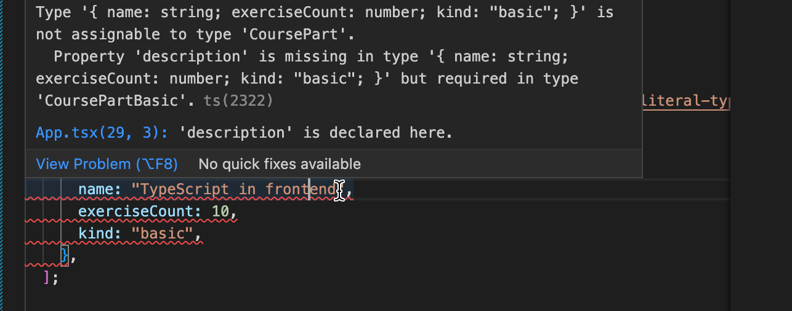
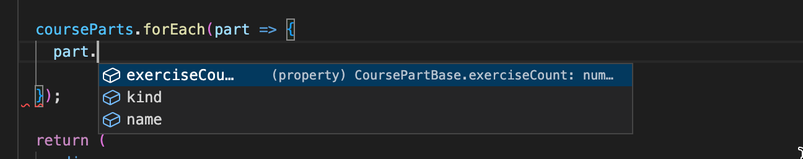
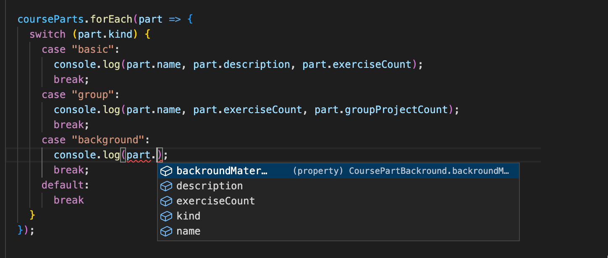
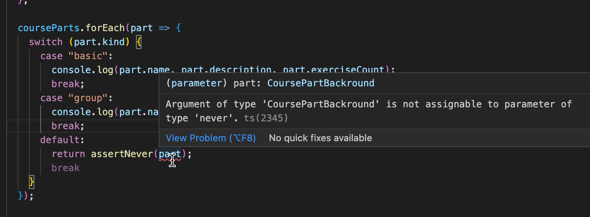
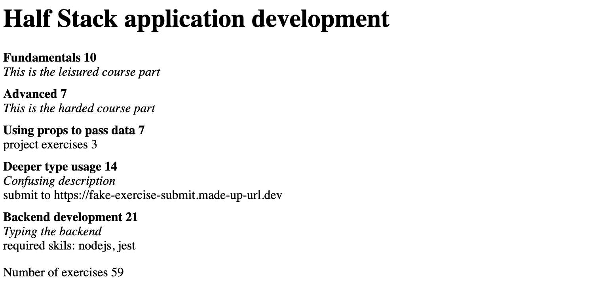
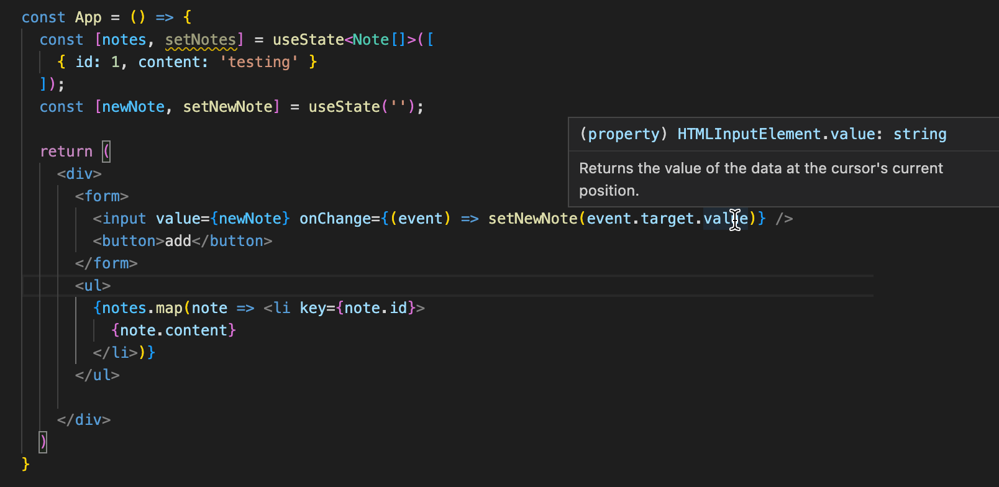
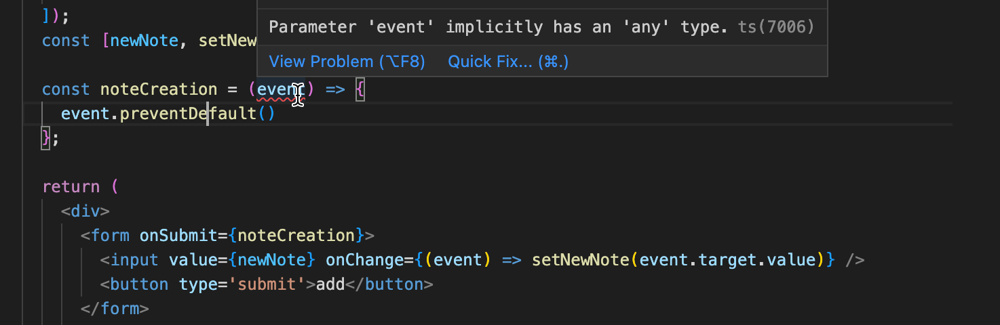
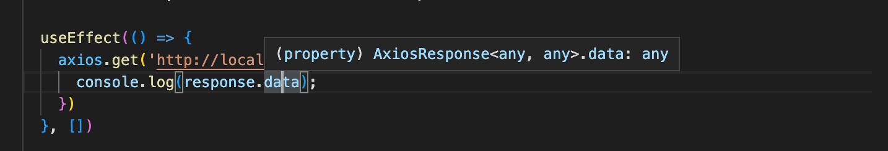
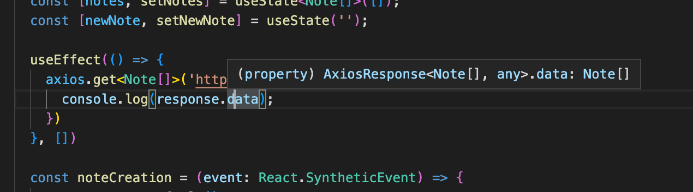
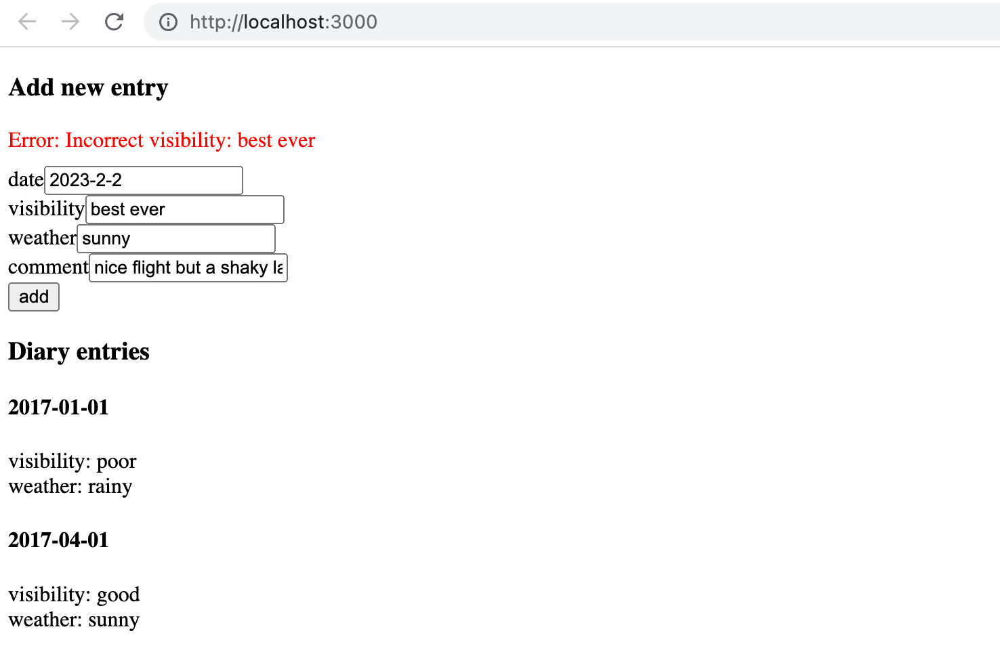

<div class="content">

Before we start delving into how you can use TypeScript with React, we should first have a look at what we want to achieve. When everything works as it should, TypeScript will help us catch the following errors:

- Trying to pass an extra/unwanted prop to a component
- Forgetting to pass a required prop to a component
- Passing a prop with the wrong type to a component

If we make any of these errors, TypeScript can help us catch them in our editor right away.
If we didn't use TypeScript, we would have to catch these errors later during testing.
We might be forced to do some tedious debugging to find the cause of the errors.

That's enough reasoning for now. Let's start getting our hands dirty!

### Create React App with TypeScript

We can use [create-react-app](https://create-react-app.dev) to create a TypeScript app by adding a
<i>template</i> argument to the initialization script. So in order to create a TypeScript Create React App, run the following command:

```shell
npx create-react-app my-app --template typescript
```

After running the command, you should have a complete basic React app that uses TypeScript.
You can start the app by running *npm start* in the application's root.

If you take a look at the files and folders, you'll notice that the app is not that different from
one using pure JavaScript. The only differences are that the <i>.js</i> and <i>.jsx</i> files are now  <i>.ts</i> and <i>.tsx</i> files, they contain some type annotations, and the root directory contains a <i>tsconfig.json</i> file.

Now, let's take a look at the <i>tsconfig.json</i> file that has been created for us:

```js
{
  "compilerOptions": {
    "target": "es5",
    "lib": [
      "dom",
      "dom.iterable",
      "esnext"
    ],
    "allowJs": true,
    "skipLibCheck": true,
    "esModuleInterop": true,
    "allowSyntheticDefaultImports": true,
    "strict": true,
    "forceConsistentCasingInFileNames": true,
    "noFallthroughCasesInSwitch": true,
    "module": "esnext",
    "moduleResolution": "node",
    "resolveJsonModule": true,
    "isolatedModules": true,
    "noEmit": true,
    "jsx": "react-jsx"
  },
  "include": [
    "src"
  ]
}
```

Notice *compilerOptions* now has the key [lib](https://www.typescriptlang.org/tsconfig#lib) that includes "type definitions for things found in browser environments (like *document*)."

Everything else should be more or less fine except that, at the moment, the configuration allows compiling JavaScript files because *allowJs* is set to *true*.
That would be fine if you need to mix TypeScript and JavaScript (e.g. if you are in the process of transforming a JavaScript project into TypeScript or something like that), but we want to create a pure TypeScript app, so let's change that configuration to *false*.

In our previous project, we used ESlint to help us enforce a coding style, and we'll do the same with this app. We do not need to install any dependencies, since create-react-app has taken care of that already.

We configure ESlint in <i>.eslintrc</i> with the following settings:

```js
{
  "env": {
    "browser": true,
    "es6": true,
    "jest": true
  },
  "extends": [
    "eslint:recommended",
    "plugin:react/recommended",
    "plugin:@typescript-eslint/recommended"
  ],
  "plugins": ["react", "@typescript-eslint"],
  "settings": {
    "react": {
      "pragma": "React",
      "version": "detect"
    }
  },
  "rules": {
    "@typescript-eslint/explicit-function-return-type": 0,
    "@typescript-eslint/explicit-module-boundary-types": 0,
    "react/react-in-jsx-scope": 0
  }
}
```

Since the return type of most React components is generally either *JSX.Element* or *null*, we have loosened up the default linting rules a bit by disabling the rules [explicit-function-return-type](https://github.com/typescript-eslint/typescript-eslint/blob/master/packages/eslint-plugin/docs/rules/explicit-function-return-type.md) and [explicit-module-boundary-types](https://github.com/typescript-eslint/typescript-eslint/blob/master/packages/eslint-plugin/docs/rules/explicit-module-boundary-types.md).
Now we don't need to explicitly state our function return types everywhere. We will also disable [react/react-in-jsx-scope](https://github.com/yannickcr/eslint-plugin-react/blob/master/docs/rules/react-in-jsx-scope.md) since importing React is [no longer needed](https://reactjs.org/blog/2020/09/22/introducing-the-new-jsx-transform.html) in every file.

Next, we need to get our linting script to parse <i>*.tsx </i> files, which are the TypeScript equivalent of React's JSX files.
We can do that by altering our lint command in <i>.package.json</i> to the following:

```json
{
  // ...
    "scripts": {
    "start": "react-scripts start",
    "build": "react-scripts build",
    "test": "react-scripts test",
    "eject": "react-scripts eject",
    "lint": "eslint './src/**/*.{ts,tsx}'" // highlight-line
  },
  // ...
}
```

If you are using Windows, you may need to use double quotes for the linting path:

```json
"lint": "eslint \"./src/**/*.{ts,tsx}\""
```

### React components with TypeScript

Let us consider the following JavaScript React example:

```jsx
import ReactDOM from 'react-dom/client'
import PropTypes from "prop-types";

const Welcome = props => {
  return <h1>Hello, {props.name}</h1>;
};

Welcome.propTypes = {
  name: PropTypes.string
};

ReactDOM.createRoot(document.getElementById('root')).render(
  <Welcome name="Sarah" />
)
```

In this example, we have a component called *Welcome* to which we pass a *name* as a prop. It then renders the name to the screen.  We know that the *name* should be a string, and we use the [prop-types](https://www.npmjs.com/package/prop-types) package introduced in [part 5](/en/part5/props_children_and_proptypes#prop-types) to receive hints about the desired types of a component's props and warnings about invalid prop types.

With TypeScript, we don't need the <i>prop-types</i> package anymore. We can define the types with the help of TypeScript just like we define types for a regular function as React components are nothing but mere functions. We will use an interface for the parameter types (i.e., props) and *JSX.Element* as the return type for any react component:

```jsx
import ReactDOM from 'react-dom/client'

interface WelcomeProps {
  name: string;
}

const Welcome = (props: WelcomeProps): JSX.Element => {
  return <h1>Hello, {props.name}</h1>;
};

ReactDOM.createRoot(document.getElementById('root') as HTMLElement).render(
  <Welcome name="Sarah" />
)
```

We defined a new type, *WelcomeProps*, and passed it to the function's parameter types.

```jsx
const Welcome = (props: WelcomeProps): JSX.Element => {
```

You could write the same thing using a more verbose syntax:

```jsx
const Welcome = ({ name }: { name: string }): JSX.Element => (
  <h1>Hello, {name}</h1>
);
```

Now our editor knows that the *name* prop is a string.

There is actually no need to define the return type of a React component since the TypeScript compiler infers the type automatically, and we can just write

```jsx
interface WelcomeProps {
  name: string;
}

const Welcome = (props: WelcomeProps)  => { // highlight-line
  return <h1>Hello, {props.name}</h1>;
};

ReactDOM.createRoot(document.getElementById('root') as HTMLElement).render(
  <Welcome name="Sarah" />
)
```

You propably noticed that we used a [type assertion](https://www.typescriptlang.org/docs/handbook/2/everyday-types.html#type-assertions) for the return value of the function *document.getElementById*

```ts
ReactDOM.createRoot(document.getElementById('root') as HTMLElement).render(  // highlight-line
  <Welcome name="Sarah" />
)
```

We need to do this since the *ReactDOM.createRoot* takes an HTMLElement as a parameter but the return value of function *document.getElementById* has the following type

```js
HTMLElement | null
```

since if the function does not find the searched element, it will return null.

Earlier in this part we [warned](https://fullstackopen.com/en/part9/first_steps_with_type_script#type-assertion) about the dangers of type assertions, but in our case the assertion is ok since we are sure that the file <i>index.html</i> indeed has this particular id and the function is always returning a HTMLElement.

</div>

<div class="tasks">

### Exercise 9.14

#### 9.14

Create a new Create React App with TypeScript, and set up ESlint for the project similarly to how we just did.

This exercise is similar to the one you have already done in [Part 1](/en/part1/java_script#exercises-1-3-1-5) of the course, but with TypeScript and some extra tweaks. Start off by modifying the contents of <i>index.tsx</i> to the following:

```jsx
import ReactDOM from 'react-dom/client'
import App from './App';

ReactDOM.createRoot(document.getElementById('root') as HTMLElement).render(
  <App />
)
```

and <i>App.tsx</i> to the following:

```jsx
const App = () => {
  const courseName = "Half Stack application development";
  const courseParts = [
    {
      name: "Fundamentals",
      exerciseCount: 10
    },
    {
      name: "Using props to pass data",
      exerciseCount: 7
    },
    {
      name: "Deeper type usage",
      exerciseCount: 14
    }
  ];

  return (
    <div>
      <h1>{courseName}</h1>
      <p>
        {courseParts[0].name} {courseParts[0].exerciseCount}
      </p>
      <p>
        {courseParts[1].name} {courseParts[1].exerciseCount}
      </p>
      <p>
        {courseParts[2].name} {courseParts[2].exerciseCount}
      </p>
      <p>
        Number of exercises{" "}
        {courseParts.reduce((carry, part) => carry + part.exerciseCount, 0)}
      </p>
    </div>
  );
};

export default App;
```

and remove the unnecessary files.

The whole app is now in one component. That is not what we want, so refactor the code so that it consists of three components: *Header*,  *Content* and *Total*. All data is still kept in the *App* component, which passes all necessary data to each component as props. <i>Be sure to add type declarations for each component's props!</i>

The *Header* component should take care of rendering the name of the course. *Content* should render the names of the different parts and the number of exercises in each part, and *Total* should render the total sum of exercises in all parts.

The *App* component should look somewhat like this:

```jsx
const App = () => {
  // const-declarations

  return (
    <div>
      <Header name={courseName} />
      <Content ... />
      <Total ... />
    </div>
  )
};
```

</div>

<div class="content">

### Deeper type usage

In the previous exercise, we had three parts of a course, and all parts had the same attributes *name* and *exerciseCount*. But what if we needed additional attributes for the parts where all parts do not have the same attributes? How would this look, codewise? Let's consider the following example:

```js
const courseParts = [
  {
    name: "Fundamentals",
    exerciseCount: 10,
    description: "This is an awesome course part"
  },
  {
    name: "Using props to pass data",
    exerciseCount: 7,
    groupProjectCount: 3
  },
  {
    name: "Basics of type Narrowing",
    exerciseCount: 7,
    description: "How to go from unknown to string"
  },
  {
    name: "Deeper type usage",
    exerciseCount: 14,
    description: "Confusing description",
    backroundMaterial: "https://type-level-typescript.com/template-literal-types"
  },
];
```

In the above example, we have added some additional attributes to each course part.
Each part has the *name* and *exerciseCount* attributes, but the first, the third  and fourth also have an attribute called *description*, and the second and fourth parts also have some distinct additional attributes.

Let's imagine that our application just keeps on growing, and we need to pass the different course parts around in our code. On top of that, there are also additional attributes and course parts added to the mix. How can we know that our code is capable of handling all the different types of data correctly, and we are not for example forgetting to render a new course part on some page? This is where TypeScript comes in handy!

Let's start by defining types for our different course parts. We notice that the first and third have the same set of attributes. The second and fourth are a bit different so we have three different kinds of course part elements.

So let us define a type for each of the different kind of course parts:

```js
interface CoursePartBasic {
  name: string;
  exerciseCount: number;
  description: string;
  kind: "basic"
}

interface CoursePartGroup {
  name: string;
  exerciseCount: number;
  groupProjectCount: number;
  kind: "group"
}

interface CoursePartBackround {
  name: string;
  exerciseCount: number;
  description: string;
  backroundMaterial: string;
  kind: "background"
}
```

Besides the attributes that are found in the various course parts, we have now introduced an additional attribute called <i>kind</i> that has a [literal](https://www.typescriptlang.org/docs/handbook/2/everyday-types.html#literal-types) type, it is a "hard coded" string, distinct for each course part. We shall soon see where the attribute kind is used!

Next, we will create a type [union](https://www.typescriptlang.org/docs/handbook/2/everyday-types.html#union-types) of all these types. We can then use it to define a type for our array, which should accept any of these course part types:

```js
type CoursePart = CoursePartBasic | CoursePartGroup | CoursePartBackround;
```

Now we can set the type for our *courseParts* variable:

```js
const App = () => {
  const courseName = "Half Stack application development";
  const courseParts: CoursePart[] = [
    {
      name: "Fundamentals",
      exerciseCount: 10,
      description: "This is an awesome course part",
      kind: "basic" // highlight-line
    },
    {
      name: "Using props to pass data",
      exerciseCount: 7,
      groupProjectCount: 3,
      kind: "group" // highlight-line
    },
    {
      name: "Basics of type Narrowing",
      exerciseCount: 7,
      description: "How to go from unknown to string",
      kind: "basic" // highlight-line
    },
    {
      name: "Deeper type usage",
      exerciseCount: 14,
      description: "Confusing description",
      backroundMaterial: "https://type-level-typescript.com/template-literal-types",
      kind: "background" // highlight-line
    },
  ]

  // ...
}
```

Note that we have now added the attribute *kind* with a proper value to each element of the array.

Our editor will automatically warn us if we use the wrong type for an attribute, use an extra attribute, or forget to set an expected attribute. If we eg. try to add the following to the array

```js
{
  name: "TypeScript in frontend",
  exerciseCount: 10,
  kind: "basic",
},
```

We will immediately see an error in the editor:



Since our new entry has the attribute *kind* with value *"basic"* TypeScript knows that the entry does not only have the type *CoursePart* but it is actually meant to be a *CoursePartBasic*. So here the attribute *kind* "narrows" the type of the entry from a more general to a more specific type that has a certain set of attributes. We shall soon see this style of type narrowing in action in the code!

But we're not satisfied yet! There is still a lot of duplication in our types, and we want to avoid that. We start by identifying the attributes all course parts have in common, and defining a base type that contains them. Then we will [extend](https://www.typescriptlang.org/docs/handbook/2/objects.html#extending-types) that base type to create our kind-specific types:

```js
interface CoursePartBase {
  name: string;
  exerciseCount: number;
}

interface CoursePartBasic extends CoursePartBase {
  description: string;
  kind: "basic"
}

interface CoursePartGroup extends CoursePartBase {
  groupProjectCount: number;
  kind: "group"
}

interface CoursePartBackround extends CoursePartBase {
  description: string;
  backroundMaterial: string;
  kind: "background"
}

type CoursePart = CoursePartBasic | CoursePartGroup | CoursePartBackround;
```

### More type narrowing

How should we now use these types in our components?

If we try to acess the objects in the array *courseParts: CoursePart[]* we notice that it is possible to only access the attributes that are common to all the types in the union:



And indeed, the TypeScript [documentation](https://www.typescriptlang.org/docs/handbook/2/everyday-types.html#working-with-union-types) says this:

> <i>TypeScript will only allow an operation (or attribute access) if it is valid for every member of the union.</i>

The documentation also mentions the following:

> <i>The solution is to narrow the union with code... Narrowing occurs when TypeScript can deduce a more specific type for a value based on the structure of the code.</i>

So once again the [type narrowing](https://www.typescriptlang.org/docs/handbook/2/narrowing.html) is the rescue!

One handy way to narrow these kinds of types in TypeScript is to use *switch case* expressions. Once TypeScript has inferred that a variable is of union type and that each type in the union contain a certain literal attribute (in our case *kind*), we can use that as a type identifier. We can then build a switch case around that attribute and TypeScript will know which attributes are available within each case block:



In the above example, TypeScript knows that a *part* has the type *CoursePart* and it can then infer that *part* is of either type *CoursePartBasic*, *CoursePartGroup* or *CoursePartBackround* based on the value of the attribute *kind*.

The specific technique of type narrowing where a union type is narrowed based on literal attribute value is called [discriminated union](https://www.typescriptlang.org/docs/handbook/2/narrowing.html#discriminated-unions).

Note that the narrowing can naturally be also done with *if* clause. We could eg. do the following:

```js
  courseParts.forEach(part => {
    if (part.kind === 'background') {
      console.log('see the following:', part.backroundMaterial)
    }

    // can not refer to part.backroundMaterial here!
  });
```

What about adding new types? If we were to add a new course part, wouldn't it be nice to know if we had already implemented handling that type in our code? In the example above, a new type would go to the *default* block and nothing would get printed for a new type. Sometimes this is wholly acceptable. For instance, if you wanted to handle only specific (but not all) cases of a type union, having a default is fine. Nonetheless, it is recommended to handle all variations separately in most cases.

With TypeScript, we can use a method called [exhaustive type checking](https://www.typescriptlang.org/docs/handbook/2/narrowing.html#exhaustiveness-checking). Its basic principle is that if we encounter an unexpected value, we call a function that accepts a value with the type [never](https://www.typescriptlang.org/docs/handbook/2/narrowing.html#the-never-type) and also has the return type *never*.

A straightforward version of the function could look like this:

```js
/**
 * Helper function for exhaustive type checking
 */
const assertNever = (value: never): never => {
  throw new Error(
    `Unhandled discriminated union member: ${JSON.stringify(value)}`
  );
};
```

If we now were to replace the contents of our *default* block to:

```js
default:
  return assertNever(part);
```

and remove the case that handles the type *CoursePartBackround*, we would see the following error:



The error message says that

```text
'CoursePartBackround' is not assignable to parameter of type 'never'.
```

which tells us that we are using a variable somewhere where it should never be used. This tells us that something needs to be fixed.

</div>

<div class="tasks">

### Exercise 9.15

#### 9.15

Let us now continue extending the app created in exercise 9.14. First, add the type information and replace the variable *courseParts* with the one from the example below.

```js
interface CoursePartBase {
  name: string;
  exerciseCount: number;
}

interface CoursePartBasic extends CoursePartBase {
  description: string;
  kind: "basic"
}

interface CoursePartGroup extends CoursePartBase {
  groupProjectCount: number;
  kind: "group"
}

interface CoursePartBackround extends CoursePartBase {
  description: string;
  backroundMaterial: string;
  kind: "background"
}

type CoursePart = CoursePartBasic | CoursePartGroup | CoursePartBackround;

const courseParts: CoursePart[] = [
  {
    name: "Fundamentals",
    exerciseCount: 10,
    description: "This is an awesome course part",
    kind: "basic"
  },
  {
    name: "Using props to pass data",
    exerciseCount: 7,
    groupProjectCount: 3,
    kind: "group"
  },
  {
    name: "Basics of type Narrowing",
    exerciseCount: 7,
    description: "How to go from unknown to string",
    kind: "basic"
  },
  {
    name: "Deeper type usage",
    exerciseCount: 14,
    description: "Confusing description",
    backroundMaterial: "https://type-level-typescript.com/template-literal-types",
    kind: "background"
  },
  {
    name: "TypeScript in frontend",
    exerciseCount: 10,
    description: "a hard part",
    kind: "basic",
  },
];
```

Now we know that both interfaces *CoursePartBasic* and *CoursePartBackround* share not only the base attributes but also an attribute called *description*, which is a string in both interfaces.

Your first task is to declare a new interface that includes the *description* attribute and extends the *CoursePartBase* interface. Then modify the code so that you can remove the *description* attribute from both *CoursePartBasic* and *CoursePartBackround*  without getting any errors.

Then create a component *Part* that renders all attributes of each type of course part. Use a switch case-based exhaustive type checking! Use the new component in component *Content*.

Lastly, add another course part interface with the following attributes: *name*, *exerciseCount*, *description* and *requirements*, the latter being a string array. The objects of this type look like the following:

```js
{
  name: "Backend development",
  exerciseCount: 21,
  description: "Typing the backend",
  requirements: ["nodejs", "jest"],
  kind: "special"
}
```

Then add that interface to the type union *CoursePart* and add corresponding data to the *courseParts* variable. Now, if you have not modified your *Content* component correctly, you should get an error, because you have not yet added support for the fourth course part type. Do the necessary changes to *Content*, so that all attributes for the new course part also get rendered and that the compiler doesn't produce any errors.

The result might look like the following:



</div>

<div class="content">

### React app with state

So far, we have only looked at an application that keeps all the data in a typed variable but does not have any state. Let us once more go back to the note app, and build a typed version of it.

We start with the following code:

```js
import { useState } from 'react';

const App = () => {
  const [newNote, setNewNote] = useState('');
  const [notes, setNotes] = useState([]);

  return null
}
```

When we hover over the *useState* calls in the editor, we notice couple of interesting things.

The type of the first call *useState('')* looks like the following:

```ts
useState<string>(initialState: string | (() => string)): 
  [string, React.Dispatch<React.SetStateAction<string>>] 
```

The type is somewhat challenging to decipher. It has the following "form":

```ts
functionName(parameters): return_value
```

So we notice that TypeScript compiler has inferred that the initial state is either a string or a function that returns a string:

```ts
initialState: string | (() => string)
```

The type of the returned array is the following:

```ts
[string, React.Dispatch<React.SetStateAction<string>>]
```

So the first element, assigned to *newNote* is a string and the second element that we assigned *setNewNote* has a slightly more complex type. We notice that there is a string mentioned there, so we know that it must be the type of a function that sets a valued data. See [here](https://codewithstyle.info/Using-React-useState-hook-with-TypeScript/) if you want to learn more about the types of useState function.

From this all we see that TypeScript has indeed [inferred](https://www.typescriptlang.org/docs/handbook/type-inference.html#handbook-content) the type of the first useState quite right, it is creating a state with type string.

When we look at the second useState that has the initial value *[]* the type looks quite different

```ts
useState<never[]>(initialState: never[] | (() => never[])): 
  [never[], React.Dispatch<React.SetStateAction<never[]>>] 
```

TypeScript can just infer that the state has type *never[]*, it is an array but it has no clue what are the elements stored to array, so we clearly need to help the compiler and provide the type explicitly.

One of the best sources for information about typing React is the [React TypeScript Cheatsheet](https://react-typescript-cheatsheet.netlify.app/).

The chapter about [useState](https://react-typescript-cheatsheet.netlify.app/docs/basic/getting-started/hooks#usestate) hook instructs to use a <i>type parameter</i> in situations where the compiler can not infer the type.

Let us now define a type for notes:

```js
interface Note {
  id: number,
  content: string
}
```

The solution is now simple:

```js
const [notes, setNotes] = useState<Note[]>([]);
```

And indeed, the type is set quite right:

```ts
useState<Note[]>(initialState: Note[] | (() => Note[])):
  [Note[], React.Dispatch<React.SetStateAction<Note[]>>]
```

So in technical terms useState is [a generic function](https://www.typescriptlang.org/docs/handbook/2/generics.html#working-with-generic-type-variables), where the type has to be specified as a type parameter in those cases when the compiler can not infer the type.

Rendering the notes is now easy. Let us just add some data to the state so that we can see that the code works:

```js
interface Note {
  id: number,
  content: string
}

import { useState } from "react";

const App = () => {
  const [notes, setNotes] = useState<Note[]>([
    { id: 1, content: 'testing' } // highlight-line
  ]);
  const [newNote, setNewNote] = useState('');

  return (
    // highlight-start
    <div>
      <ul>
        {notes.map(note =>
          <li key={note.id}>{note.content}</li>
        )}
      </ul>
    </div>
    // highlight-end
  )
}
```

The next task is to add a form that makes it possible to create new notes:

```js
const App = () => {
  const [notes, setNotes] = useState<Note[]>([
    { id: 1, content: 'testing' }
  ]);
  const [newNote, setNewNote] = useState('');

  return (
    <div>
      // highlight-start
      <form>
        <input
          value={newNote}
          onChange={(event) => setNewNote(event.target.value)} 
        />
        <button type='submit'>add</button>
      </form>
      // highlight-end
      <ul>
        {notes.map(note =>
          <li key={note.id}>{note.content}</li>
        )}
      </ul>
    </div>
  )
}
```

It just works! When we hover over the *event.target.value*, we see that it is indeed a string, just what is the expected parameter of the *setNewNote*:



So we still need the event handler for adding the new note. Let us try the following:

```js
const App = () => {
  // ...

   // highlight-start
  const noteCreation = (event) => {
    event.preventDefault()
    // ...
  };
   // highlight-end

  return (
    <div>
      <form onSubmit={noteCreation}> // highlight-line
        <input
          value={newNote}
          onChange={(event) => setNewNote(event.target.value)} 
        />
        <button type='submit'>add</button>
      </form>
      // ...
    </div>
  )
}
```

It does not quite work, there is an Eslint error complaining about implicit any:



TypeScript compiler has now no clue what is the type of the parameter, so that is why the type is the infamous implicit any that we wan to [avoid](/en/part9/first_steps_with_type_script#the-horrors-of-any) at all costs. The React TypeScript cheatsheet comes again to rescue, the chapter about
[forms and events](https://react-typescript-cheatsheet.netlify.app/docs/basic/getting-started/forms_and_events) reveals that the right type of event handler is *React.SyntheticEvent*.

The code becomes

```js
interface Note {
  id: number,
  content: string
}

const App = () => {
  const [notes, setNotes] = useState<Note[]>([]);
  const [newNote, setNewNote] = useState('');

// highlight-start
  const noteCreation = (event: React.SyntheticEvent) => {
    event.preventDefault()
    const noteToAdd = {
      content: newNote,
      id: notes.length + 1
    }
    setNotes(notes.concat(noteToAdd));

    setNewNote('')
  };
// highlight-end

  return (
    <div>
      <form onSubmit={noteCreation}>
        <input value={newNote} onChange={(event) => setNewNote(event.target.value)} />
        <button type='submit'>add</button>
      </form>
      <ul>
        {notes.map(note =>
          <li key={note.id}>{note.content}</li>
        )}
      </ul>
    </div>
  )
}
```

And that's it, our app is ready and perfectly typed!

### Communicating with the server

Let us modify the app so that the notes are saved in a JSON server backend in url <http://localhost:3001/notes>

As usual, we shall use Axios and the useEffect hook to fetch the initial state from the server.

Let us try the following

```js
const App = () => {
  // ...
  useEffect(() => {
    axios.get('http://localhost:3001/notes').then(response => {
      console.log(response.data);
    })
  }, [])
  // ...
}


```

When we hover over the *response.data* we see that is has the type *any*



To set the data to the state with function *setNotes* we must type it properly.

With a little [help from internet](https://upmostly.com/typescript/how-to-use-axios-in-your-typescript-apps), we find a clever trick:

```js
  useEffect(() => {
    axios.get<Note[]>('http://localhost:3001/notes').then(response => { // highlight-line
      console.log(response.data);
    })
  }, [])
```

When we hover over the response.data we see that it has the correct type:



We can now set the data in the state *notes* to get the code working:

```js
  useEffect(() => {
    axios.get<Note[]>('http://localhost:3001/notes').then(response => {
      setNotes(response.data) // highlight-line
    })
  }, [])
```

So just like with *useState*, we gave a type  parameter to *axios.get* to instruct it how the typing should be done. Just like *useState* also *axios.get* is a [generic function](https://www.typescriptlang.org/docs/handbook/2/generics.html#working-with-generic-type-variables). Unlike some generic functions, the type parameter of *axios.get* has a default value *any* so, if the function is used without defining the type parameter, the type of the response data will be any.

The code works, compiler and Eslint are happy and remain quiet. However, giving a type parameter to *axios.get* is a potentially dangerous thing to do. The request body can contain data in an arbitrary form, and when giving a type parameter we are essentially just telling to TypeScript compiler to trust us that the data has type *Note[]*.

So our code is essentially as safe as it would be if a [type assertion](/en/part9/first_steps_with_type_script#type-assertion) would be used:

```js
  useEffect(() => {
    axios.get('http://localhost:3001/notes').then(response => {
      // response.body is of type any
      setNotes(response.data as Note[]) // highlight-line
    })
  }, [])
```

Since the TypeScript types do not even exist in runtime, our code does not give us any "safety" against situations where the request body contains data in a wrong form.

Giving type variable to *axios.get* might be ok if we are <i>absolutely sure</i> that the backend behaves correctly and returns always the data in correct form. If we want to build a robust system we should prepare for surprises and parse the response data in the frontend similarly that we did [in the previous section](/en/part9/typing_an_express_app#proofing-requests) for the requests to the backend.

Let us now wrap up our app by implementing the new note addition:

```js
  const noteCreation = (event: React.SyntheticEvent) => {
    event.preventDefault()
    // highlight-start
    axios.post<Note>('http://localhost:3001/notes', { content: newNote })
      .then(response => {
        setNotes(notes.concat(response.data))
      })
    // highlight-end

    setNewNote('')
  };
```

We are again giving *axios.post* a type parameter. We know that the server response is added note so the proper type parameter is *Note*.

Let us clean up the code a bit. For the type definitions, we create a file *types.ts* with the following content:

```js
export interface Note {
  id: number,
  content: string
}

export type NewNote = Omit<Note, 'id'>
```

We have added a new type for a <i>new note</i>, one that does not yet have the *id* field assigned.

The code that communicates with the backend is also extracted to a module in the file *noteService.tsx*

```js
import axios from 'axios';
import { Note, NewNote } from "./types";

const baseUrl = 'http://localhost:3001/notes'

export const getAllNotes = () => {
  return axios
    .get<Note[]>(baseUrl)
    .then(response => response.data)
}

export const createNote = (object: NewNote) => {
  return axios
    .post<Note>(baseUrl, object)
    .then(response => response.data)
}
```

The component *App* is now much cleaner:

```js
import { useState, useEffect } from "react";
import { Note } from "./types"; // highlight-line
import { getAllNotes, createNote } from './noteService'; // highlight-line

const App = () => {
  const [notes, setNotes] = useState<Note[]>([]);
  const [newNote, setNewNote] = useState('');

  useEffect(() => {
    // highlight-start
    getAllNotes().then(data => {
      setNotes(data)
    })
    // highlight-end
  }, [])

  const noteCreation = (event: React.SyntheticEvent) => {
    event.preventDefault()
    // highlight-start
    createNote({ content: newNote }).then(data => {
      setNotes(notes.concat(data))
    })
    // highlight-end

    setNewNote('')
  };

  return (
    // ...
  )
}
```

The app is now nicely typed and ready for further development!

The code of the typed notes can be found [here](https://github.com/fullstack-hy2020/typed-notes).

### A note about defining object types

We have used [interfaces](https://www.typescriptlang.org/docs/handbook/2/everyday-types.html#interfaces) to define object types, e.g. diary entries, in the previous section

```js
interface DiaryEntry {
  id: number;
  date: string;
  weather: Weather;
  visibility: Visibility;
  comment?: string;
} 
```

and in the course part of this section

```js
interface CoursePartBase {
  name: string;
  exerciseCount: number;
}
```

We actually could have had the same effect by using a [type alias](https://www.typescriptlang.org/docs/handbook/2/everyday-types.html#type-aliases)

```js
type DiaryEntry = {
  id: number;
  date: string;
  weather: Weather;
  visibility: Visibility;
  comment?: string;
} 
```

In most cases, you can use either *type* or *interface*, whichever syntax you prefer. However, there are a few things to keep in mind.
For example, if you define multiple interfaces with the same name, they will result in a merged interface, whereas if you try to define multiple types with the same name, it will result in an error stating that a type with the same name is already declared.

TypeScript documentation [recommends using interfaces](https://www.typescriptlang.org/docs/handbook/2/everyday-types.html#differences-between-type-aliases-and-interfaces) in most cases.

</div>

<div class="tasks">

### Exercises 9.16-9.19

Let us now build a frontend for the Ilari's flight diaries that was developed in [the previous section](/en/part9/typing_an_express_app). The source code of the backend can be found in [this GitHub repository](https://github.com/fullstack-hy2020/flight-diary).

#### Exercise 9.16

Create a TypeScript React app with simillar configurations as the apps of this section. Fetch the diaries from the backend and render those to screen. Do all the required typing and ensure that there are no Eslint errors.

Remember to keep the network tab open. It might give you a valuable hint...

You can decide how the diary entries are rendered. If you wish, you may take inspiration form the figure below. Note that the backend API does not return the diary comments, you may modify it to return also those on a GET request.

#### Exercise 9.17

Make it possible to add new diary entries from the frontend. In this exercise you may skip all validations and assume that the user just enters the data in a correct form.

#### Exercise 9.18

Notify the user if the the creation of a diary entry fails in the backend, show also the reason for the failure.

See eg. [this](https://dev.to/mdmostafizurrahaman/handle-axios-error-in-typescript-4mf9) how you can narrow the Axios error so that you can get hold of the error message.

Your solution may look like this:



#### Exercise 9.19

Addition of a diary entry is now very error prone since user can type anything to the input fields. The situation must be improved.

Modify the input form so that the date is set with a HTML [date](https://developer.mozilla.org/en-US/docs/Web/HTML/Element/input/date) input element, and the weather and visibility are set with HTML [radio buttons](https://developer.mozilla.org/en-US/docs/Web/HTML/Element/input/radio). We have already used radio buttons in [part 6](/en/part6/many_reducers#store-with-complex-state), that material may or may not be useful...

Your app should all the time stay well typed and there should not be any Eslint errors and no Eslint rules should be ignored.

Your solution could look like this:


</div>
