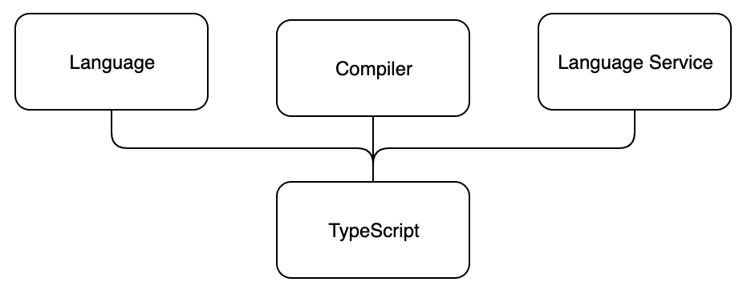

<div class="content">

TypeScript es un lenguaje de programación diseñado para el desarrollo de JavaScript a gran escala creado por Microsoft. Por ejemplo, _Azure Management Portal_ de Microsoft (1,2 millones de líneas de código) y _Visual Studio Code_ (300 000 líneas de código) se han escrito en TypeScript. Para respaldar la creación de aplicaciones JavaScript a gran escala, TypeScript ofrece características como mejores herramientas en tiempo de desarrollo, análisis de código estático, verificación de tipos en tiempo de compilación y documentación a nivel de código.


### Principio fundamental

TypeScript es un superconjunto tipado de JavaScript y, finalmente, se compila en código JavaScript simple. El programador puede incluso decidir la versión del código generado, siempre que sea ECMAScript 3 o más reciente. Que Typecript sea un superconjunto de JavaScript significa que incluye todas las características de JavaScript y sus propias características adicionales. De hecho, todo el código JavaScript existente es TypeScript válido.

TypeScript consta de tres partes separadas, pero que se cumplen mutuamente:

- El lenguaje
- El compilador
- El servicio de lenguajes



El <i>lenguaje</i> consta de sintaxis, palabras clave y anotaciones de tipo. La sintaxis es similar pero no igual a la sintaxis de JavaScript. De las tres partes de TypeScript, los programadores tienen el contacto más directo con el lenguaje.

El <i>compilador</i> es responsable de borrar la información de tipo (es decir, eliminar la información de escritura) y las transformaciones de código. Las transformaciones de código permiten que el código TypeScript se transpile en JavaScript ejecutable. Todo lo relacionado con los tipos se elimina en tiempo de compilación, por lo que TypeScript no es realmente un código genuino de tipado estático.

Tradicionalmente, <i>compilar</i> significa que el código se transforma de un formato legible por humanos a un formato legible por máquina. En TypeScript, el código fuente legible por humanos se transforma en otro código fuente legible por humanos, por lo que el término correcto en realidad sería <i>transpilar</i>. Sin embargo, compilar ha sido el término más utilizado en este contexto, por lo que continuaremos usándolo.

El compilador también realiza un análisis de código estático. Puede emitir advertencias o errores si encuentra una razón para hacerlo, y se puede configurar para realizar tareas adicionales, como combinar el código generado en un solo archivo.

El <i>servicio de lenguaje</i> recopila información de tipo del código fuente. Las herramientas de desarrollo pueden usar la información de tipo para proporcionar intellisense, sugerencias de tipo y posibles alternativas de refactorización.


### Características clave del lenguaje TypeScript

En esta sección describiremos algunas de las características clave del lenguaje TypeScript. La intención es brindarle una comprensión básica de las características clave de TypeScripts para ayudarlo a comprender más de lo que vendrá durante este curso.


#### Anotaciones de tipo

Las anotaciones de tipo en TypeScript son una forma ligera de registrar el <i>contrato</i> previsto de una función o variable. En el siguiente ejemplo, hemos definido una función <i>birthdayGreeter</i> que acepta dos argumentos, uno de tipo string y otro de tipo número. La función devolverá un string.

```js
const birthdayGreeter = (name: string, age: number): string => {
  return `Happy birthday ${name}, you are now ${age} years old!`;
};

const birthdayHero = "Jane User";
const age = 22;

console.log(birthdayGreeter(birthdayHero, 22));
```

#### De Tipado estructural

TypeScript es un lenguaje tipado estructuralmente. En el tipado estructural, se considera que dos elementos son compatibles entre sí si para cada característica dentro del tipo del primer elemento existe una característica idéntica y correspondiente dentro del tipo del segundo elemento. Se considera que dos tipos son idénticos si son compatibles entre sí.

#### Inferencia de tipos

El compilador de TypeScript puede intentar inferir la información del tipo si no se ha especificado ningún tipo. El tipo de variable se puede inferir en función de su valor asignado y su uso. La inferencia de tipos tiene lugar al inicializar variables y miembros, establecer valores predeterminados de parámetros y determinar los tipos de retorno de funciones.

Por ejemplo, considere la función <i>add</i>

```js
const add = (a: number, b: number) => {
  /* The return value is used to determine
     the return type of the function */
  return a + b;
}
```

El valor de retorno de la función se infiere volviendo el código a la expresión de retorno. La expresión de retorno realiza una adición de los parámetros a y b. Podemos ver que a y b son números basados ​​en sus tipos. Por lo tanto, podemos inferir que el valor de retorno es de tipo <i>number</i>.

Como ejemplo más complejo, consideremos el siguiente código. Si no ha usado TypeScript antes, este ejemplo puede ser un poco complejo. Pero no se preocupe, puede omitirlo por ahora.

```js
type CallsFunction = (callback: (result: string) => any) => void;

const func: CallsFunction = (cb) => {
  cb('done');
  cb(1);
}

func((result) => {
  return result;
});
```

Primero tenemos una declaración de un [alias de tipo](https://www.typescriptlang.org/docs/handbook/advanced-types.html#type-aliases) llamado <i>CallsFunction</i>. CallsFunction es un tipo de función con un parámetro <i>callback</i>. El parámetro <i>callback</i> es de tipo función que toma un parámetro del tipo string y devuelve un valor de tipo [any](http://www.typescriptlang.org/docs/handbook/basic-types.html#any). Como aprenderemos más adelante en esta parte, <i>any</i> es una especie de tipo "comodín" que puede representar cualquier tipo.

A continuación definimos la función <i>func</i> de tipo <i>CallsFunction</i>. Del tipo de la función podemos inferir que su función de parámetro cb solo aceptará un argumento string. Para demostrar esto, también hay un ejemplo en el que se llama a la función del parámetro con un valor numérico, lo que provocará un error en TypeScript.

Por último llamamos a <i>func</i> dándole la siguiente función como parámetro

```js
(result) => {
  return result;
}
```

A pesar de que los tipos de la función de parámetro no están definidos, podemos inferir del contexto de llamada que el argumento <i>result</i> es del tipo string.

#### Type erasure (borrado por tipos)

TypeScript elimina todas las construcciones del sistema de tipos durante la compilación.

Entrada:

```js
let x: SomeType;
```

Salida:

```js
let x;
```

Esto significa que no queda información de tipo en tiempo de ejecución; nada dice que alguna variable x haya sido declarada como de tipo <i>SomeType</i>.

La falta de información sobre el tipo de tiempo de ejecución puede resultar sorprendente para los programadores que están acostumbrados a utilizar ampliamente reflexión u otros sistemas de metadatos.


### ¿Por qué debería uno usar TypeScript?

En diferentes foros, es posible que se encuentre con muchos argumentos diferentes a favor o en contra de TypeScript. La verdad es probablemente tan vaga como: depende de sus necesidades y del uso de las funciones que ofrece TypeScript. De todos modos, aquí tienes algunas de nuestras razones por las que pensamos que el uso de TypeScript puede tener algunas ventajas.

En primer lugar, TypeScript ofrece <i>verificación de tipos y análisis de código estático</i>. Podemos requerir que los valores sean de cierto tipo y que el compilador advierta sobre su uso incorrecto. Esto puede reducir los errores de tiempo de ejecución e incluso es posible que pueda reducir la cantidad de pruebas unitarias requeridas en un proyecto, al menos en lo que respecta a las pruebas de tipo puro. El análisis de código estático no solo advierte sobre el uso incorrecto de tipos, sino también sobre otros errores, como escribir mal el nombre de una variable o función o intentar usar una variable más allá de su alcance.

La segunda ventaja de TypeScript es que las anotaciones de tipo en el código pueden funcionar como un tipo de <i>documentación a nivel de código</i>. Es fácil verificar a partir de la declaración de una función qué tipo de argumentos puede consumir la función y qué tipo de datos devolverá. Esta forma de documentación vinculada con anotaciones de tipo siempre estará actualizada y facilita a los nuevos programadores comenzar a trabajar en un proyecto existente. También es útil al volver a un proyecto antiguo.

Los tipos se pueden reutilizar en toda la base del código, y un cambio en una definición de tipo se reflejará automáticamente en todos los lugares donde se use el tipo. Se podría argumentar que puede lograr una documentación de nivel de código similar con, por ejemplo, [JSDoc](https://jsdoc.app/about-getting-started.html), pero no está conectado al código tan estrechamente como los tipos de TypeScript y, por lo tanto, puede desincronizarse más fácilmente y también es más detallado.

La tercera ventaja de TypeScript es que los IDE pueden proporcionar <i>intellisense más específico e inteligente</i> cuando saben exactamente qué tipos de datos está procesando.

Todas estas características son extremadamente útiles cuando necesita refactorizar su código. El análisis de código estático le advierte sobre cualquier error en su código, y el intellisense puede darle pistas sobre las propiedades disponibles e incluso posibles opciones de refactorización. La documentación a nivel de código le ayuda a comprender el código existente. Con la ayuda de TypeScript, también es muy fácil comenzar a usar las funciones más nuevas del lenguaje JavaScript en una etapa temprana, simplemente modificando su configuración.

### ¿Qué no corrige TypeScript?

Como se mencionó anteriormente, las anotaciones de tipo TypeScript y la verificación de tipos solo existen en el tiempo de compilación y ya no en el tiempo de ejecución. Incluso si el compilador no arroja ningún error, los errores en tiempo de ejecución aún son posibles. Estos errores de tiempo de ejecución son especialmente comunes cuando se manejan inputs externos, como los datos recibidos de una solicitud de red.

Por último, a continuación, enumeramos algunos problemas que muchos tienen con TypeScript, que sería bueno tener en cuenta:

#### Tipos incompletos, no válidos o faltantes en librerías externas

Al usar librerías externas, es posible que algunas librerías tengan declaraciones de tipos faltantes o no válidas de alguna manera. La mayoría de las veces, esto se debe a que la biblioteca no está escrita en TypeScript y la persona que agrega las declaraciones de tipo manualmente no está haciendo un buen trabajo con ella. En estos casos, es posible que deba definir las declaraciones de tipo usted mismo. Sin embargo, es muy probable que alguien ya haya agregado mecanografía para el paquete que está utilizando. Siempre verifique [DefinitelyTyped](https://definitelytyped.org/) o [sus páginas de GitHub primero](https://github.com/DefinitelyTyped/DefinitelyTyped). Probablemente sean las fuentes más populares para los archivos de declaración de tipos. De lo contrario, es posible que desee comenzar familiarizándose con la propia [documentación](https://www.typescriptlang.org/docs/handbook/declaration-files/introduction.html) de TypeScript con respecto a las declaraciones de tipos.

Incomplete, invalid or missing types in external libraries


#### A veces, la inferencia de tipos necesita ayuda

La inferencia de tipos en TypeScript es bastante buena pero no del todo perfecta. A veces puede sentir que ha declarado sus tipos perfectamente, pero el compilador aún le dice que la propiedad no existe o que este tipo de uso no está permitido. En estos casos, es posible que necesite ayudar al compilador haciendo algo como una verificación de tipo "extra", pero tenga cuidado con la conversión de tipos y las protecciones de tipos. Al utilizar tipos de conversión o guardias de tipos, básicamente le está dando su palabra al compilador de que el valor realmente es del tipo que declara. Es posible que desee consultar la documentación de TypeScript con respecto a las [afirmaciones de tipo](https://www.typescriptlang.org/docs/handbook/basic-types.html#type-assertions) y las [protecciones de tipo](https://www.typescriptlang.org/docs/handbook/advanced-types.html#type-guards-and-differentiating-types).


#### Errores de tipo misteriosos

Los errores dados por el sistema de tipos a veces pueden ser bastante difíciles de entender, especialmente si usa tipos complejos. Como regla general, los mensajes de error de TypeScript tienen la información más útil al final del mensaje. Cuando se encuentre con mensajes largos y confusos, comience a leerlos desde el final.

</div>
