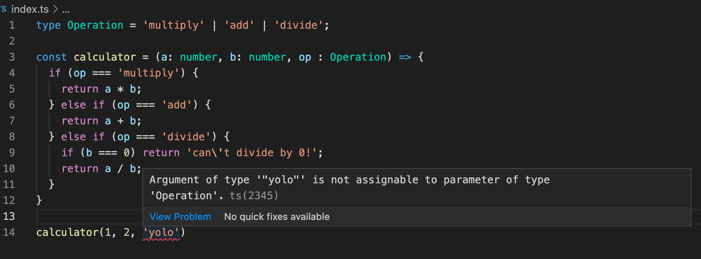
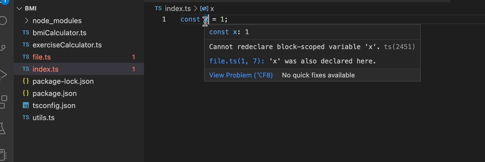
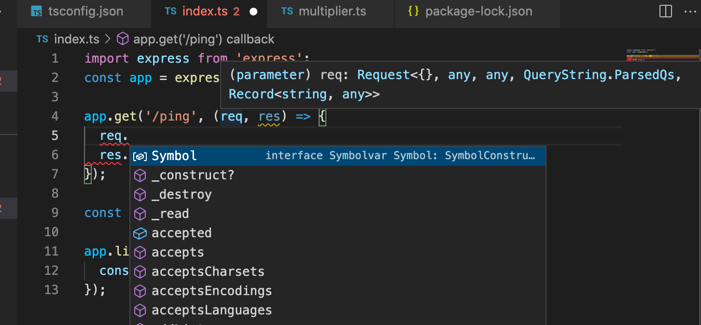
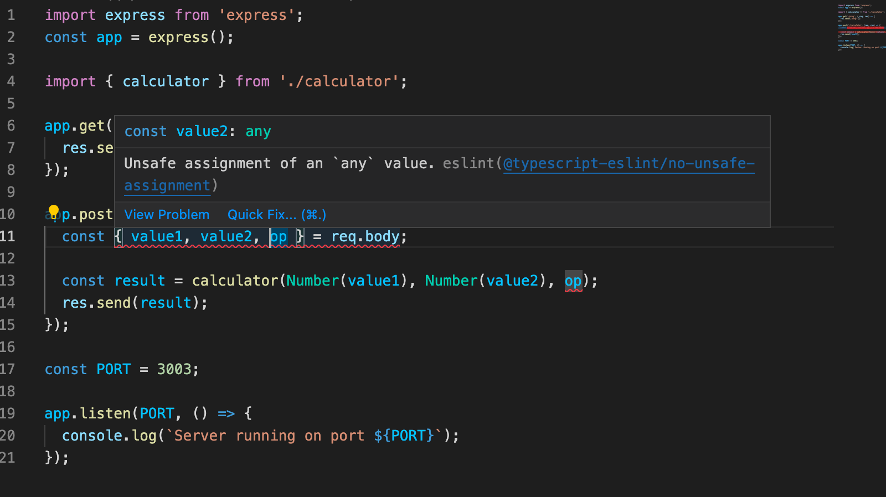
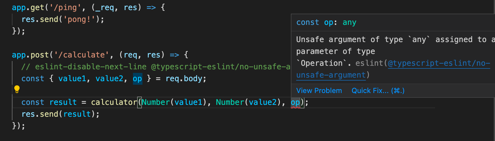

<div class="content">

Después de la breve introducción a los principios fundamentales de TypeScript, ahora estamos listos para comenzar nuestro viaje para convertirnos en desarrolladores FullStack de TypeScript. 
En lugar de brindarte una introducción completa a todos los aspectos de TypeScript, en esta parte nos centraremos en los problemas más comunes que surgen al desarrollar backends con Express o frontends de React con TypeScript.
Además de las características del lenguaje, también tendremos un fuerte énfasis en las herramientas.

### Configurando Typescript

Instala la compatibilidad con TypeScript en el editor de tu elección. [Visual Studio Code](https://code.visualstudio.com/) funciona de forma nativa con Typescript.

Como se mencionó anteriormente, el código TypeScript no es ejecutable por sí mismo. Primero debe compilarse en JavaScript ejecutable.
Cuando TypeScript se compila en JavaScript, el código queda sujeto a borrado de tipos. Esto significa que las anotaciones de tipos, interfaces, alias de tipos y otras construcciones del sistema de tipos se eliminan del código y el resultado es JavaScript puro y listo para ejecutar.

En un entorno de producción, la necesidad de compilación a menudo significa que debes configurar un "paso de compilación". Durante el paso de compilación, todo el código TypeScript se compila en JavaScript en una carpeta separada, y el entorno de producción luego ejecuta el código desde esa carpeta. En un entorno de desarrollo, a menudo es más útil hacer uso de la compilación en tiempo real y la recarga automática para poder ver los cambios resultantes más rápido.

Comencemos a escribir nuestra primera aplicación TypeScript. Para simplificar las cosas, comencemos usando el paquete [ts-node](https://github.com/TypeStrong/ts-node) de npm. El cual compila y ejecuta el archivo TypeScript especificado inmediatamente, por lo que no es necesario un paso de compilación por separado.

Puedes instalar tanto *ts-node* como el paquete oficial *typescript* a nivel global ejecutando:

```bash
npm install --location=global ts-node typescript
```

Si no puedes o no quieres instalar paquetes globales, puedes crear un proyecto npm que tenga las dependencias necesarias y ejecutar sus scripts en él.
También tomaremos este enfoque.

Como recordamos de la [parte 3](/es/part3), un proyecto npm se configura ejecutando el comando *npm init* en un directorio vacío. Entonces podemos instalar las dependencias ejecutando:

```bash
npm install --save-dev ts-node typescript
```

y configurando *scripts* dentro de package.json:

```json
{
  // ..
  "scripts": {
    "ts-node": "ts-node" // highlight-line
  },
  // ..
}
```

Ahora, dentro de este directorio, puedes usar *ts-node* ejecutando *npm run ts-node*. Ten en cuenta que si estás utilizando *ts-node* a través de package.json, todos los argumentos de la línea de comandos para el script deben tener el prefijo *--*. Entonces, si deseas ejecutar file.ts con *ts-node* y opciones *-s* y *--someoption*, el comando completo es:

```shell
npm run ts-node file.ts -- -s --someoption
```

Vale la pena mencionar que TypeScript también proporciona un área de juegos en línea, donde puedes probar rápidamente el código TypeScript y ver instantáneamente el JavaScript resultante y los posibles errores de compilación. Puedes acceder al área de juegos oficial de TypeScript [aquí](https://www.typescriptlang.org/play/index.html).

**NB:** El área de juegos puede contener diferentes reglas en *tsconfig* (que se presentarán más adelante) que en tu entorno local, por lo que es posible que veas advertencias diferentes en comparación con tu entorno local. El *tsconfig* de la zona de juegos se puede modificar a través del menú de configuración desplegable.

#### Una nota sobre el estilo de código

JavaScript en sí mismo es un lenguaje bastante relajado y, a menudo, las cosas se pueden hacer de múltiples formas diferentes. Por ejemplo, tenemos funciones anónimas y con nombre, podemos usar const y let o var, y podemos elegir si usar el *punto y coma* o no. Esta parte del curso se diferencia del resto por el uso de punto y coma. No es un patrón específico de TypeScript, sino una decisión de estilo de código general al crear cualquier tipo de proyecto de JavaScript. Utilizarlos o no suele estar en manos del programador, pero dado que se espera que podamos adaptar nuestros hábitos de código al código base existente, esperamos que uses punto y coma y que te adaptes a estilo del código en los ejercicios de esta parte. Esta parte también tiene otras diferencias de estilo de código en comparación con el resto del curso, por ejemplo, en las convenciones utilizadas para nombrar los directorios.

Agreguemos una configuración al archivo *tsconfig.json* al proyecto con el siguiente contenido:

```js
{
  "compilerOptions":{
    "noImplicitAny": false
  }
}
```

El archivo *tsconfig.json* es utilizado para definir como el compilador de Typescript debe interpretar el código, cuan estrictamente el compilador debería funcionar, que archivos revisar o ignorar, y [mucho más](https://www.typescriptlang.org/docs/handbook/tsconfig-json.html).
Por ahora, solo utilizaremos la opción del compilador [noImplicitAny](https://www.typescriptlang.org/tsconfig#noImplicitAny), la cual no requiere tener tipos en todas las variables utilizadas.

Comencemos creando un multiplicador simple. Se ve exactamente igual a como se haría en JavaScript.

```js
const multiplicator = (a, b, printText) => {
  console.log(printText,  a * b);
}

multiplicator(2, 4, 'Multiplied numbers 2 and 4, the result is:');
```

Como puedes ver, este sigue siendo JavaScript básico y ordinario sin características adicionales de TS. Se compila y se ejecuta muy bien con *npm run ts-node -- multiplier.ts*, como lo haría con Node.

Pero, ¿qué sucede si terminamos pasando *tipos* incorrectos de argumentos a la función multiplicator?

¡Vamos a probarlo!

```js
const multiplicator = (a, b, printText) => {
  console.log(printText,  a * b);
}

multiplicator('how about a string?', 4, 'Multiplied a string and 4, the result is:');

```

Ahora, cuando ejecutamos el código, el resultado es: *Multiplied a string and 4, the result is: NaN*.

¿No sería bueno si el lenguaje en sí mismo pudiera evitar que terminemos en situaciones como esta?
Aquí es donde vemos los primeros beneficios de TypeScript. Agreguemos tipos a los parámetros y veamos a dónde nos lleva.

TypeScript admite de forma nativa varios tipos, incluidos *number*, *string* y *Array*. Ve la lista completa [aquí](https://www.typescriptlang.org/docs/handbook/2/everyday-types.html). También se pueden crear tipos personalizados más complejos.

Los dos primeros parámetros de nuestra función son de tipo number y el último es de tipo string, ambos tipos son [primitivos](https://www.typescriptlang.org/docs/handbook/2/everyday-types.html#the-primitives-string-number-and-boolean):

```js
const multiplicator = (a: number, b: number, printText: string) => {
  console.log(printText,  a * b);
}

multiplicator('how about a string?', 4, 'Multiplied a string and 4, the result is:');
```

Ahora el código ya no es JavaScript válido, sino TypeScript. Cuando intentamos ejecutar el código, notamos que no se compila:


Una de las mejores cosas de la compatibilidad con el editor de TypeScript es que ni siquiera es necesario que ejecutes el código para ver los problemas.
VSCode es tan eficiente que te informa inmediatamente cuando intentas utilizar un tipo incorrecto:


### Creando tus primeros tipos

Ampliemos nuestro multiplicador a una calculadora un poco más versátil que también admita sumas y divisiones. La calculadora debe aceptar tres argumentos: dos números y la operación, ya sea *multiplicar*, *sumar* o *dividir*, que le dice qué hacer con los números.

En JavaScript, el código requeriría una validación adicional para asegurarse de que el último argumento sea un string. TypeScript ofrece una forma de definir tipos específicos de entradas, que describen exactamente qué tipo de entrada es aceptable. Además de eso, TypeScript también puede mostrar la información de los valores aceptados ya en el nivel de editor.

Podemos crear un *tipo* usando la palabra clave nativa de TypeScript *type*. Describamos nuestro tipo *Operation*:

```js
type Operation = 'multiply' | 'add' | 'divide';
```

Ahora el tipo *Operation* acepta solo tres tipos de valores; exactamente los tres strings que queríamos.
Utilizando el operador OR *|* podemos definir una variable para aceptar múltiples valores creando un [union type](https://www.typescriptlang.org/docs/handbook/2/everyday-types.html#union-types). 
En este caso usamos strings exactos (que en términos técnicos se denominan [tipos literales de strings](https://www.typescriptlang.org/docs/handbook/2/everyday-types.html#literal-types)) pero con uniones también podría hacer que el compilador acepte, por ejemplo, string y number:  *string | number*.

La palabra clave *type* define un nuevo nombre para un tipo, un [alias de tipo](https://www.typescriptlang.org/docs/handbook/2/everyday-types.html#type-aliases). Dado que el tipo definido es una unión de tres valores posibles, es útil asignarle un alias que tenga un nombre representativo.

Ahora echémosle un vistazo a nuestra calculadora:

```js
type Operation = 'multiply' | 'add' | 'divide';

const calculator = (a: number, b: number, op : Operation) => {
  if (op === 'multiply') {
    return a * b;
  } else if (op === 'add') {
    return a + b;
  } else if (op === 'divide') {
    if (b === 0) return 'can\'t divide by 0!';
    return a / b;
  }
}
```

Ahora, cuando pasamos el cursor sobre el tipo *Operation* en la función calculator, podemos ver inmediatamente sugerencias sobre qué hacer con él:


Y si intentamos usar un valor que no está dentro del tipo *Operation*, obtenemos la conocida señal de advertencia roja e información adicional de nuestro editor:



Esto ya es bastante bueno, pero una cosa que aún no hemos tocado es tipear el valor de retorno de una función. Por lo general, querrás saber qué devuelve una función, y sería bueno tener una garantía de que realmente devuelve lo que dice que hace. Agreguemos un valor de retorno *number* a la función calculator:

```js
type Operation = 'multiply' | 'add' | 'divide';

const calculator = (a: number, b: number, op: Operation): number => { // highlight-line

  if (op === 'multiply') {
    return a * b;
  } else if (op === 'add') {
    return a + b;
  } else if (op === 'divide') {
    if (b === 0) return 'this cannot be done';
    return a / b;
  }
}
```

El compilador se queja de inmediato, porque en un caso la función devuelve un string. Hay un par de formas de arreglar esto:

Podríamos extender el tipo de retorno para permitir valores string de esta forma:

```js
const calculator = (a: number, b: number, op: Operation): number | string =>  {
  // ...
}
```

O podríamos crear un tipo de retorno que incluya ambos tipos posibles, muy parecido a nuestro tipo Operation:

```js
type Result = string | number

const calculator = (a: number, b: number, op: Operation): Result =>  {
  // ...
}
```

Pero ahora la pregunta es, ¿*realmente* está bien que la función devuelva un string?

Cuando tu código puede terminar en una situación en la que algo se divide por 0, es probable que algo haya salido terriblemente mal y se debería generar un error y manejarlo desde donde se llamó a la función. Cuando decides devolver valores que no esperabas originalmente, las advertencias de TypeScript te impiden tomar decisiones apresuradas y te ayudan a mantener tu código funcionando como se esperaba.

Una cosa más a considerar es que, aunque hemos definido tipos para nuestros parámetros, el JavaScript generado que se usa durante el tiempo de ejecución no contiene las verificaciones de tipos.
Entonces, si, por ejemplo, el valor del parámetro de *operation* proviene de una interfaz externa, no hay garantía definitiva de que sea uno de los valores permitidos. Por lo tanto, es mejor incluir el manejo de errores y estar preparado para lo inesperado.
En este caso, cuando hay múltiples valores aceptados posibles y todos los inesperados deberían dar como resultado un error, la declaración [switch...case](https://developer.mozilla.org/es/docs/Web/JavaScript/Reference/Statements/switch) se adapta mejor que if...else en nuestro código.

El código de nuestra calculadora debería verse así:

```js
type Operation = 'multiply' | 'add' | 'divide';

const calculator = (a: number, b: number, op: Operation) : number => {  // highlight-line
  switch(op) {
    case 'multiply':
      return a * b;
    case 'divide':
      if (b === 0) throw new Error('Can\'t divide by 0!');  // highlight-line
      return a / b;
    case 'add':
      return a + b;
    default:
      throw new Error('Operation is not multiply, add or divide!');  // highlight-line
  }
}

try {
  console.log(calculator(1, 5 , 'divide'));
} catch (error: unknown) {
  let errorMessage = 'Something went wrong: '
  if (error instanceof Error) {
    errorMessage += error.message;
  }
  console.log(errorMessage);
}
```

### Estrechamiento de Tipos

El valor por defecto del parámetro *error* en el bloque catch es *unknown*. El tipo [unknown](https://www.typescriptlang.org/docs/handbook/release-notes/typescript-3-0.html#new-unknown-top-type) es una especie de tipo superior que fue introducido en la version 3 de TypeScript para ser la contraparte segura de *any*. Todo es asignable a *unknown*, pero *unknown* no es asignable a nada más que a si mismo y a *any* sin utilizar una aserción de tipo o un estrechamiento basado en el control de flujos. Asimismo, no se permiten operaciones en un *unknown* sin primero utilizar una aserción o un estrechamiento a un tipo especifico.

Ambas posibles causas de excepción (operador incorrecto o división por cero) van a generar un objeto de [Error](https://developer.mozilla.org/es/docs/Web/JavaScript/Reference/Global_Objects/Error) con un mensaje de error, que nuestro programa le imprime al usuario.

Si nuestro código fuera JavaScript, podríamos imprimir el mensaje de error tan solo referenciando al parámetro [message](https://developer.mozilla.org/es/docs/Web/JavaScript/Reference/Global_Objects/Error/message) del objeto *error* de la siguiente manera:

```js
try {
  console.log(calculator(1, 5 , 'divide'));
} catch (error) {
  console.log('Something went wrong: ' + error.message);  // highlight-line
}
```

Ya que el tipo por defecto del objeto *error* en TypeScript es *unknown*, tenemos que [estrechar](https://www.typescriptlang.org/docs/handbook/2/narrowing.html) el tipo para acceder al parámetro:

```ts
try {
  console.log(calculator(1, 5 , 'divide'));
} catch (error: unknown) {
  let errorMessage = 'Something went wrong: '
  // here we can not use error.message
  if (error instanceof Error) { // highlight-line 
    // the type is narrowed and we can refer to error.message
    errorMessage += error.message;  // highlight-line 
  }
  // here we can not use error.message

  console.log(errorMessage);
}
```

Aquí el estrechamiento fue hecho con la guardia de tipo [instanceof](https://www.typescriptlang.org/docs/handbook/2/narrowing.html#instanceof-narrowing), que es tan solo una de las muchas formas en las que se puede estrechar a un tipo. Vamos a ver muchas otras más adelante en esta parte.

### Accediendo a argumentos de la linea de comandos

Los programas que hemos escrito están bien, pero seguro que sería mejor si pudiéramos usar argumentos de línea de comandos en lugar de tener que cambiar siempre el código para calcular cosas diferentes.

Vamos a probar, como lo haríamos en una aplicación normal de Node, accediendo a *process.argv*. Si estas utilizando una versión de npm reciente (7.0 o superior), no habrá problemas, pero con una versión mas antigua algo no va bien:


Entonces, ¿cual es el problema con las versiones antiguas?

### @types/{npm_package}

Volvamos a la idea básica de TypeScript. TypeScript espera que todo el código utilizado globalmente sea tipado, como lo hace por tu código cuando tu proyecto tiene una configuración razonable. La biblioteca de TypeScript en sí misma, contiene solo tipados para el código del paquete TypeScript. Es posible escribir tus propias tipificaciones para el código de una libreria, pero eso casi nunca es necesario, ¡ya que la comunidad de TypeScript lo ha hecho por nosotros!

Al igual que con npm, el mundo TypeScript también celebra el código fuente abierto. La comunidad está activa y reacciona continuamente a las actualizaciones y cambios en los paquetes npm de uso común. Casi siempre puedes encontrar las tipificaciones de paquetes npm, por lo que no tienes que crear tipificaciones para todas tus miles de dependencias por ti mismo.

Por lo general, las tipificaciones de paquetes existentes se pueden encontrar en la organización *@types* dentro de npm, y puedes agregar los tipos relevantes a tu proyecto instalando un paquete npm con el nombre de tu paquete con el prefijo *@types/*. Por ejemplo:

```bash
npm install --save-dev @types/react @types/express @types/lodash @types/jest @types/mongoose
```

y así sucesivamente. Los *@types/** son mantenidos por [Definitely typed](https://github.com/DefinitelyTyped/DefinitelyTyped), un proyecto comunitario con el objetivo de mantener todas las tipificaciones en un solo lugar.

A veces, un paquete npm también puede incluir sus tipificaciones dentro del código y, en ese caso, no es necesario instalar los correspondientes *@types/**.

> **NB:** Dado que las tipificaciones solo se usan antes de la compilación, estas no son necesarias en la compilación de producción y siempre deben estar en devDependencies del package.json.

Dado que la variable global *process* está definida por el propio Node, obtenemos sus tipificaciones del paquete *@types/node*.

Desde la version 10.0 *ts-node* ha definido *@types/node* como una [dependencia entre pares](https://docs.npmjs.com/cli/v8/configuring-npm/package-json#peerdependencies). Si la version de npm es al menos 7.0, las dependencias entre pares de un proyecto son automáticamente instaladas por npm. Si tienes una version mas antigua de npm, la dependencia entre pares debe ser instalada explícitamente:

```shell
npm install --save-dev @types/node
```

Después de instalar el paquete @types/node, nuestro compilador ya no se queja de la variable *process*. Ten en cuenta que no es necesario requerir los tipos para el código, ¡la instalación del paquete es suficiente!

## Mejorando el proyecto

A continuación, agreguemos scripts npm para ejecutar nuestros dos programas, *multiplier* y *calculator*:

```json
{
  "name": "fs-open",
  "version": "1.0.0",
  "description": "",
  "main": "index.ts",
  "scripts": {
    "ts-node": "ts-node",
    "multiply": "ts-node multiplier.ts", // highlight-line
    "calculate": "ts-node calculator.ts" // highlight-line
  },
  "author": "",
  "license": "ISC",
  "devDependencies": {
    "ts-node": "^10.5.0",
    "typescript": "^4.5.5"
  }
}
```

Podemos hacer que multiplier funcione con los parámetros de la línea de comando con los siguientes cambios

```js
const multiplicator = (a: number, b: number, printText: string) => {
  console.log(printText,  a * b);
}

const a: number = Number(process.argv[2])
const b: number = Number(process.argv[3])
multiplicator(a, b, `Multiplied ${a} and ${b}, the result is:`);
```

Y podemos ejecutarlo con:

```shell
npm run multiply 5 2
```

Si el programa se ejecuta con parámetros que no son del tipo correcto, p. ej.

```shell
npm run multiply 5 lol
```

"funciona" pero nos da la respuesta

```shell
Multiplied 5 and NaN, the result is: NaN
```

La razón de esto es que *Number('lol')* devuelve *NaN*, que en realidad es de tipo *number*, por lo que TypeScript no tiene poder para rescatarnos de este tipo de situación.

Para evitar este tipo de comportamientos, tenemos que validar los datos que nos brindan desde la línea de comandos.

La versión mejorada del multiplicador se ve así:

```js
interface MultiplyValues {
  value1: number;
  value2: number;
}

const parseArguments = (args: string[]): MultiplyValues => {
  if (args.length < 4) throw new Error('Not enough arguments');
  if (args.length > 4) throw new Error('Too many arguments');

  if (!isNaN(Number(args[2])) && !isNaN(Number(args[3]))) {
    return {
      value1: Number(args[2]),
      value2: Number(args[3])
    }
  } else {
    throw new Error('Provided values were not numbers!');
  }
}

const multiplicator = (a: number, b: number, printText: string) => {
  console.log(printText,  a * b);
}

try {
  const { value1, value2 } = parseArguments(process.argv);
  multiplicator(value1, value2, `Multiplied ${value1} and ${value2}, the result is:`);
} catch (error: unknown) {
  let errorMessage = 'Something bad happened.'
  if (error instanceof Error) {
    errorMessage += ' Error: ' + error.message;
  }
  console.log(errorMessage);
}
```

Cuando ahora ejecutamos el programa

```shell
npm run multiply 1 lol
```

obtenemos un mensaje de error adecuado:

```shell
Something bad happened. Error: Provided values were not numbers!
```

Hay bastante sucediendo en el código. La adición más importante es la función *parseArguments* que se asegura de que los parámetros dados a *multiplicator* sean del tipo correcto. En caso contrario, se lanza una excepción con un mensaje de error descriptivo.

La definición de la función tiene un par de cosas interesantes:

```js
const parseArguments = (args: string[]): MultiplyValues => {
  // ...
}
```

En primer lugar, el parámetro *args* es un [array](https://www.typescriptlang.org/docs/handbook/2/everyday-types.html#arrays) de strings.

El valor de retorno de la función tiene el tipo *MultiplyValues*, que se define de la siguiente manera:

```js
interface MultiplyValues {
  value1: number;
  value2: number;
}
```

La definición utiliza la palabra clave [Interface](https://www.typescriptlang.org/docs/handbook/2/everyday-types.html#interfaces) de TypeScript, que es una forma de definir la "forma" que debe tener un objeto. En nuestro caso, es bastante obvio que el valor de retorno debe ser un objeto con dos propiedades *value1* y *value2*, que deben ser ambas del tipo number.

### La sintaxis alternativa para arrays

Ten en cuenta que también existe una sintaxis alternativa para [arrays](https://www.typescriptlang.org/docs/handbook/2/everyday-types.html#arrays) en TypeScript. En lugar de escribir

```js
let values: number[];
```

podríamos usar la "sintaxis de genéricos" y escribir

```js
let values: Array<number>;
```

En este curso, normalmente, seguiremos la convención impuesta por la regla de ESlint [array-simple](https://typescript-eslint.io/rules/array-type/#array-simple) que sugiere escribir los arrays simples con la sintaxis [] y usar la sintaxis <> para los más complejos, mira los ejemplos [aquí](https://typescript-eslint.io/rules/array-type/#array-simple).

</div>

<div class="tasks">

### Ejercicios 9.1.-9.3.

#### setup

Los ejercicios 9.1.-9.7. se realizarán todos en el mismo proyecto de node. Crea el proyecto en un directorio vacío con *npm init* e instale los paquetes *ts-node* y typescript. Cree también el archivo *tsconfig.json* en el directorio con el siguiente contenido:

```json
{
  "compilerOptions": {
    "noImplicitAny": true,
  }
}
```

La opción del compilador [noImplicitAny](https://www.typescriptlang.org/tsconfig#noImplicitAny), que hace que sea obligatorio tener tipos para todas las variables utilizadas.

#### 9.1 Índice de masa corporal

Crea el código de este ejercicio en el archivo *bmiCalculator.ts*

Escribe una función *calculateBmi* que cuente el [IMC](https://es.wikipedia.org/wiki/%C3%8Dndice_de_masa_corporal) según la altura (en centímetros) y el peso (en kilogramos) y que luego devuelva un mensaje que se adapte a los resultados.

Llama a la función en el mismo archivo con parámetros fijos e imprime el resultado. El código

```js
console.log(calculateBmi(180, 74))
```

debe imprimir el siguiente mensaje

```sh
Normal (healthy weight)
```

Crea un script npm para ejecutar el programa con el comando *npm run calculateBmi*

#### 9.2 Calculadora de ejercicio

Crea el código de este ejercicio en el archivo *exerciseCalculator.ts*

Escribe una función *calculateExercises* que calcule el tiempo promedio de las *horas diarias de ejercicio* y lo compare con la *cantidad objetivo* de horas diarias y devuelva un objeto que incluya los siguientes valores:

- el número de días
- el número de días de entrenamiento
- el valor objetivo original
- el tiempo promedio calculado
- valor booleano que describe si se alcanzó el objetivo
- una calificación entre los números 1-3 que indica qué tan bien se cumplen las horas. Puedes decidir la métrica por tu cuenta.
- un valor de texto que explique la calificación, puedes inventar las explicaciones

Las horas de ejercicio diarias se asignan a la función como un [array](https://www.typescriptlang.org/docs/handbook/2/everyday-types.html#arrays) que contiene el número de horas de ejercicio de cada día en el período de entrenamiento. P.ej. una semana con 3 horas de entrenamiento el lunes, ninguna el martes, 2 horas el miércoles, 4,5 horas el jueves y así sucesivamente estaría representada por el siguiente array:

```js
[3, 0, 2, 4.5, 0, 3, 1]
```

Para el objeto Result, debe crear un [interface](https://www.typescriptlang.org/docs/handbook/2/everyday-types.html#interfaces).

Si llamas a la función con los parámetros *[3, 0, 2, 4.5, 0, 3, 1]* y *2* , debería devolver:

```js
{ periodLength: 7,
  trainingDays: 5,
  success: false,
  rating: 2,
  ratingDescription: 'not too bad but could be better',
  target: 2,
  average: 1.9285714285714286
}
```

Crea un script npm *npm run calculateExercises* para llamar a la función con valores fijos.

#### 9.3 Línea de comando

Cambia los ejercicios anteriores para que puedas dar los parámetros de *bmiCalculator* y *exerciseCalculator* como argumentos de línea de comando.

Tu programa podría funcionar, por ejemplo. de la siguiente manera:

```shell
$ npm run calculateBmi 180 91

Overweight
```

y:

```shell
$ npm run calculateExercises 2 1 0 2 4.5 0 3 1 0 4

{ periodLength: 9,
  trainingDays: 6,
  success: false,
  rating: 2,
  ratingDescription: 'not too bad but could be better',
  target: 2,
  average: 1.7222222222222223
}
```

En el ejemplo, el *primer argumento* es el valor objetivo.

Maneja las excepciones y los errores de manera adecuada. exerciseCalculator debe aceptar entradas de diferentes longitudes. Determina tú mismo cómo recopilar toda la información necesaria.

Un par de cosas para tener en cuenta:

Si defines las funciones en otros módulos, deberías utilizar el [Sistema de módulos de Javascript](https://developer.mozilla.org/es/docs/Web/JavaScript/Guide/Modules), el cual, es el mismo que hemos utilizado con React cuando la importación es realizada con

```js
import { isNotNumber } from "./utils";
```

y la exportación

```js
export const isNotNumber = (argument: any): boolean =>
  isNaN(Number(argument));

default export "this is the default..."
```

Otra nota: sorprendentemente, por algún motivo TypeScript no permite definir la misma variable en muchos archivos en el "scope de bloque", o sea, fuera de funciones (o clases):



En realidad esto no es del todo cierto. Esta regla solamente aplica a archivos que son tratados como "scripts". Un archivo es un script si no contiene ninguna declaración de exportación o importación. Si un archivo las posee, entonces el archivo es tratado como un [modulo](https://www.typescriptlang.org/docs/handbook/modules.html), *y* las variables no son definidas en el scope de bloque.

</div>

<div class="content">

### Más acerca de tsconfig

Hasta ahora solo hemos utilizado una regla en *tsconfig*, [noImplicitAny](https://www.typescriptlang.org/tsconfig#noImplicitAny). Es un buen lugar para comenzar, pero ahora es el momento de profundizar un poco más en el archivo de configuración.

Como ya mencionamos, el archivo [tsconfig.json](https://www.typescriptlang.org/docs/handbook/tsconfig-json.html) contiene todas tus configuraciones principales sobre cómo deseas que TypeScript funcione en tu proyecto.

Especifiquemos las siguientes configuraciones en nuestro archivo *tsconfig.json*:

```json
{
  "compilerOptions": {
    "target": "ES2022",
    "strict": true,
    "noUnusedLocals": true,
    "noUnusedParameters": true,
    "noImplicitReturns": true,
    "noFallthroughCasesInSwitch": true,
    "noImplicitAny": true, // highlight-line
    "esModuleInterop": true,
    "moduleResolution": "node"
  }
}
```

No te preocupes demasiado por las *compilerOptions*, haremos una inspección minuciosa más adelante.

Puedes encontrar explicaciones para cada una de las configuraciones en la documentación de TypeScript, o en la muy util [página de tsconfig](https://www.typescriptlang.org/tsconfig), o en la [definición del esquema de tsconfig](https://json.schemastore.org/tsconfig), que desafortunadamente tiene un formato un poco peor que las dos primeras opciones.

### Añadiendo express a la mezcla

Ahora mismo estamos en un lugar bastante bueno. Nuestro proyecto está configurado y tenemos dos calculadoras ejecutables en él.
Sin embargo, dado que nuestro objetivo es aprender a desarrollar FullStack, es hora de empezar a trabajar con algunas solicitudes HTTP.

Comencemos por instalar express:

```bash
npm install express
```

y luego agrega el script *start* a package.json:

```json
{
  // ..
  "scripts": {
    "ts-node": "ts-node",
    "multiply": "ts-node multiplier.ts",
    "calculate": "ts-node calculator.ts",
    "start": "ts-node index.ts" // highlight-line
  },
  // ..
}
```

Ahora podemos crear el archivo *index.ts* y escribir el endpoint *ping* de HTTP GET:

```js
const express = require('express');
const app = express();

app.get('/ping', (req, res) => {
  res.send('pong');
});

const PORT = 3003;

app.listen(PORT, () => {
  console.log(`Server running on port ${PORT}`);
});
```

Todo lo demás parece estar funcionando bien, pero como era de esperar, los parámetros *req* y *res* de *app.get* necesitan tipado. Si observas con atención, VSCode también se queja acerca de la importación de Express. Puedes ver una pequeña línea amarilla de puntos debajo de *require*. Pasemos el cursor sobre el problema:


La queja es que la llamada *'require' puede convertirse en un import*. Sigamos los consejos y escribamos el import de la siguiente manera:

```js
import express from 'express';
```

**NB**: VSCode te ofrece una posibilidad para solucionar los problemas de forma automática haciendo clic en el botón *Quick fix...*. Mantén los ojos abiertos para estas ayudas/soluciones rápidas; escuchar a su editor generalmente hace que su código sea mejor y más fácil de leer. Las correcciones automáticas de problemas también pueden suponer un gran ahorro de tiempo.

Ahora nos encontramos con otro problema: el compilador se queja de la declaración de importación. 
Una vez más, el editor es nuestro mejor amigo cuando tratamos de averiguar cuál es el problema:


No hemos instalado tipos para *express*.
Hagamos lo que dice la sugerencia y ejecutemos:

```bash
npm install --save-dev @types/express
```

¡Y no más errores! Echemos un vistazo a lo que cambió.

Cuando pasamos el cursor sobre la declaración *require*, podemos ver que el compilador interpreta todo lo relacionado con express para que sea del tipo *any*.


Mientras que cuando usamos *import*, el editor conoce los tipos reales:



La declaración de importación que se utilizará depende del método de exportación utilizado en el paquete importado.

Una buena regla general es intentar importar un módulo utilizando primero la declaración *import*. Siempre usaremos este método en el *frontend*.
Si *import* no funciona, prueba con un método combinado: *import ... = require('...')*.

Te recomendamos encarecidamente que leas más sobre los módulos de TypeScript [aquí](https://www.typescriptlang.org/docs/handbook/modules.html).

Hay un problema más con el código.


Esto se debe a que prohibimos los parámetros no utilizados en nuestro *tsconfig.json*

```js
{
  "compilerOptions": {
    "target": "ES2022",
    "strict": true,
    "noUnusedLocals": true,
    "noUnusedParameters": true,  // highlight-line
    "noImplicitReturns": true,
    "noFallthroughCasesInSwitch": true,
    "noImplicitAny": true,
    "esModuleInterop": true,
    "moduleResolution": "node"
  }
}
```

Esta configuración puede crear problemas si tienes funciones predefinidas en la librería que requieran declarar una variable incluso si no se usa en absoluto, como es el caso aquí.
Afortunadamente, este problema ya se ha resuelto a nivel de configuración.
Una vez más, pasar el cursor sobre el problema nos da una solución. Esta vez podemos hacer clic en el botón quick fix:


Si es absolutamente imposible deshacerse de una variable no utilizada, puede pre-fijarla con un guion bajo para informar al compilador que ha pensado en ello y que no hay nada que pueda hacer.

Cambiemos el nombre de la variable *req* a *_req*. Finalmente estamos listos para iniciar la aplicación. Parece que funciona bien:


Para simplificar el desarrollo, deberíamos habilitar la *recarga automática* para mejorar nuestro flujo de trabajo. En este curso ya has utilizado *nodemon*, pero *ts-node* tiene una alternativa llamada *ts-node-dev*. Está hecho para ser utilizado solo en un entorno de desarrollo y se encarga de la re-compilación en cada cambio, por lo que no será necesario reiniciar la aplicación.

Instalemos *ts-node-dev* en nuestras dependencias de desarrollo:

```bash
npm install --save-dev ts-node-dev
```

Agreguemos un script a *package.json*:

```json
{
  // ...
  "scripts": {
      // ...
      "dev": "ts-node-dev index.ts", // highlight-line
  },
  // ...
}
```

Y ahora, al ejecutar *npm run dev*, ¡tenemos un entorno de desarrollo que funciona y que se recarga automáticamente para nuestro proyecto!

</div>

<div class="tasks">

### Ejercicios 9.4.-9.5.

#### 9.4 Express

Agrega Express a tus dependencias y crea un endpoint HTTP GET *hello* que responda 'Hello Full Stack!'

La aplicación web debe iniciarse con los comandos *npm start* en modo de producción y con *npm run dev* en modo de desarrollo, este último debe usar *ts-node-dev* para ejecutar la aplicación.

Reemplaza también tu archivo *tsconfig.json* existente con el siguiente contenido:

```json
{
  "compilerOptions": {
    "noImplicitAny": true,
    "noImplicitReturns": true,
    "strictNullChecks": true,
    "strictPropertyInitialization": true,
    "strictBindCallApply": true,
    "noUnusedLocals": true,
    "noUnusedParameters": true,
    "noImplicitThis": true,
    "alwaysStrict": true,
    "esModuleInterop": true,
    "declaration": true,
  }
}
```

¡Asegúrate de que no haya errores!

#### 9.5 WebBMI

Agrega un endpoint para la calculadora de IMC que se pueda usar haciendo una solicitud HTTP GET al endpoint *bmi* y especificando el input con [query string parameters](https://en.wikipedia.org/wiki/Query_string). Por ejemplo, para obtener el IMC de una persona que tiene una altura de 180 y un peso de 72, la URL es http://localhost:3002/bmi?height=180&weight=72

La respuesta es un json con este formato:

```js
{
  weight: 72,
  height: 180,
  bmi: "Normal (healthy weight)"
}
```

Consulta la [documentación de Express](http://expressjs.com/en/5x/api.html#req.query) para obtener información sobre cómo acceder a los parámetros de consulta.

Si los parámetros de consulta de la solicitud son del tipo incorrecto o faltan, se proporciona una respuesta con el código de estado y el mensaje de error adecuados:

```js
{
  error: "malformatted parameters"
}
```

No copies el código de la calculadora en el archivo *index.ts*, conviértelo en un [módulo de Typescript](https://www.typescriptlang.org/docs/handbook/modules.html) que se pueda importar en *index.ts*.

</div>

<div class="content">

### Los horrrores de *any*

Ahora que hemos completado nuestros primeros endpoints, es posible que observes que apenas hemos usado TypeScript en estos pequeños ejemplos. Al examinar el código un poco más de cerca, podemos ver algunos peligros acechándonos.

Agreguemos un endpoint HTTP POST *calculate* a nuestra aplicación:

```js
import { calculator } from './calculator';

app.use(express.json());

// ...

app.post('/calculate', (req, res) => {
  const { value1, value2, op } = req.body;

  const result = calculator(value1, value2, op);
  res.send({ result });
});
```

Para que esto funcione, debemos agregar un *export* a la función *calculator*:

```js
export const calculator = (a: number, b: number, op: Operation) : number => {
```

Cuando pasa el cursor sobre la función *calculate*, puede ver el tipeado de *calculator* aunque el código en sí no contiene ningún typing:


Pero si pasas el cursor sobre los valores del request, surge un problema:


Todas las variables tienen el tipo *any*. No es tan sorprendente, ya que nadie les ha dado un tipo todavía. Hay un par de maneras de solucionar este problema, pero primero, tenemos que considerar por qué esto es aceptado y de dónde viene el tipo *any*.

En TypeScript, cada variable sin tipo cuyo tipo no se puede inferir, se convierte implícitamente en tipo [any](https://www.typescriptlang.org/docs/handbook/2/everyday-types.html#any). Any es una especie de tipo "comodín", que literalmente significa *cualquier* tipo.
Las cosas se convierten implícitamente en tipo any con bastante frecuencia cuando uno se olvida de darle tipo a las funciones.

También podemos explicitar el tipo *any*. La única diferencia entre tipo any implícito y explícito es en cómo se ve el código; al compilador no le importa la diferencia.

Sin embargo, los programadores ven el código de manera diferente cuando se aplica *any* explícitamente que cuando se infiere implícitamente.
El *any* implícito generalmente se considera problemático, ya que a menudo se debe a que el desarrollador se olvido de asignar los tipos (o es demasiado perezoso para hacerlo), y también significa que no se aprovecha todo el poder de TypeScript.

Es por esto que la regla de configuración [noImplicitAny](https://www.typescriptlang.org/tsconfig#noImplicitAny) existe a nivel de compilador, y es muy recomendable mantenerla activada en todo momento. En las raras ocasiones en las que no puedes saber cuál es el tipo de variable, debes indicarlo explícitamente en el código

```js
const a : any = /* no clue what the type will be! */.
```

Ya hemos configurado *noImplicitAny: true* en nuestro ejemplo, entonces, ¿por qué el compilador no se queja del tipo implícito *any*? La razón es que el campo *body* de un objeto [Request](https://expressjs.com/en/5x/api.html#req) de Express es explícitamente tipado como *any*. Lo mismo ocurre con el campo *request.query* que Express usa para los parámetros query.

¿Y si quisiéramos evitar que los desarrolladores utilicen el tipo *any*? Afortunadamente, tenemos otros métodos además de *tsconfig.json* para hacer cumplir el estilo de codificación. Lo que podemos hacer es usar *ESlint* para administrar nuestro código.
Instalemos ESlint y sus extensiones de Typescript:

```sh
npm install --save-dev eslint @typescript-eslint/eslint-plugin @typescript-eslint/parser
```

Configuraremos ESlint para [no permitir any explicito](https://github.com/typescript-eslint/typescript-eslint/blob/main/packages/eslint-plugin/docs/rules/no-explicit-any.md). Escribe las siguientes reglas en *.eslintrc*:

```json
{
  "parser": "@typescript-eslint/parser",
  "parserOptions": {
    "ecmaVersion": 11,
    "sourceType": "module"
  },
  "plugins": ["@typescript-eslint"],
  "rules": {
    "@typescript-eslint/no-explicit-any": 2
  }
}
```

(Nuevas versiones de ESlint tienen esta regla por defecto, no es realmente necesario que la añadas por separado.)

Configuremos también un script *lint* npm para inspeccionar los archivos con la extensión *.ts*, modificando el archivo *package.json*:

```json
{
  // ...
  "scripts": {
      "start": "ts-node index.ts",
      "dev": "ts-node-dev index.ts",
      "lint": "eslint --ext .ts ." // highlight-line
      //  ...
  },
  // ...
}
```

Ahora lint se quejará si intentamos definir una variable de tipo *any*:


[@typescript-eslint](https://github.com/typescript-eslint/typescript-eslint) tiene un montón de reglas específicas ESlint para TypeScript, pero también puedes utilizar todas las reglas básicas de ESlint en proyectos de TypeScript.
Por ahora, probablemente deberíamos ir con la configuración recomendada, y modificaremos las reglas a medida que avanzamos cada vez que encontremos algo que queremos que se comporte de manera diferente.

Además de la configuración recomendada, deberíamos intentar familiarizarnos con el estilo de codificación requerido en esta parte y *ubicar el punto y coma al final de cada línea de código como requerido*.

Entonces usaremos el siguiente *.eslintrc*

```json
{
  "extends": [
    "eslint:recommended",
    "plugin:@typescript-eslint/recommended",
    "plugin:@typescript-eslint/recommended-requiring-type-checking"
  ],
  "plugins": ["@typescript-eslint"],
  "env": {
    "node": true,
    "es6": true
  },
  "rules": {
    "@typescript-eslint/semi": ["error"],
    "@typescript-eslint/explicit-function-return-type": "off",
    "@typescript-eslint/explicit-module-boundary-types": "off",
    "@typescript-eslint/restrict-template-expressions": "off",
    "@typescript-eslint/restrict-plus-operands": "off",
    "@typescript-eslint/no-unused-vars": [
      "error",
      { "argsIgnorePattern": "^_" }
    ],
    "no-case-declarations": "off"
  },
  "parser": "@typescript-eslint/parser",
  "parserOptions": {
    "project": "./tsconfig.json"
  }
}
```

Faltan algunos puntos y comas, pero son fáciles de agregar. También tenemos que arreglar problemas de ESlint acerca del tipo *any*:



Podríamos y probablemente deberíamos deshabilitar algunas reglas de ESlint para obtener datos del request body.

Deshabilitando *@typescript-eslint/no-unsafe-assignment* para la asignación de desestructuración y llamando al constructor [Number](https://developer.mozilla.org/en-US/docs/Web/JavaScript/Reference/Global_Objects/Number/Number) a los valores casi que es suficiente:

```js
app.post('/calculate', (req, res) => {
  // highlight-start
  // eslint-disable-next-line @typescript-eslint/no-unsafe-assignment
  // highlight-end
  const { value1, value2, op } = req.body;

  const result = calculator(Number(value1), Number(value2), op); // highlight-line
  res.send({ result });
});
```

Sin embargo, esto aun nos deja con un problema con el que debemos lidiar, el último parámetro en la llamada a la función no es seguro:



Podemos deshabilitar otra regla de ESlint para deshacernos de ello:

```js
app.post('/calculate', (req, res) => {
  // eslint-disable-next-line @typescript-eslint/no-unsafe-assignment
  const { value1, value2, op } = req.body;

  // highlight-start
  // eslint-disable-next-line @typescript-eslint/no-unsafe-argument
  // highlight-end
  const result = calculator(Number(value1), Number(value2), op);
  res.send({ result });
});
```

Ahora tenemos a ESlint silenciado pero estamos completamente a la merced del usuario. Definitivamente debemos hacer alguna validación a los datos del post y dar un mensaje de error apropiado si los datos son invalidos:

```js
app.post('/calculate', (req, res) => {
  // eslint-disable-next-line @typescript-eslint/no-unsafe-assignment
  const { value1, value2, op } = req.body;

// highlight-start
  if ( !value1 || isNaN(Number(value1)) ) {
    return res.status(400).send({ error: '...'});
  }
  // highlight-end

  // more validations here...

  // eslint-disable-next-line @typescript-eslint/no-unsafe-argument
  const result = calculator(Number(value1), Number(value2), op);
  return res.send({ result });
});
```

Veremos más tarde en esta parte algunas técnicas sobre como los datos de tipo *any* (por ejemplo, el input que una aplicación recibe del usuario) pueden ser *estrechados* a un tipo más especifico (como a un número). Con un estrechamiento de tipos apropiado, la necesidad de silenciar las reglas de ESlint desaparece.

### Aserción de tipos

Utilizar una [aserción de tipos](https://www.typescriptlang.org/docs/handbook/2/everyday-types.html#type-assertions) es otro "truco sucio" que puede hacerse para mantener al compilador de TypeScript y a ESlint en silencio. Exportemos el tipo Operation en *calculator.ts*:

```js
export type Operation = 'multiply' | 'add' | 'divide';
```

Ahora podemos importar el tipo y usar una *aserción de tipo* para decirle al compilador de TypeScript cual es el tipo que una variable tiene:

```js
import { calculator, Operation } from './calculator'; // highlight-line

app.post('/calculate', (req, res) => {
  // eslint-disable-next-line @typescript-eslint/no-unsafe-assignment
  const { value1, value2, op } = req.body;

  // validate the data here

  // assert the type
  const operation = op as Operation;  // highlight-line 

  const result = calculator(Number(value1), Number(value2), operation); // highlight-line

  return res.send({ result });
});
```

La constante definida como *operation* ahora tiene el tipo *Operation* y el compilador esta perfectamente feliz, no silenciar la regla de ESlint es necesario en el siguiente llamado a la función. La nueva variable ya no es necesaria, la aserción de tipo puede ser hecha cuando un argumento es pasado a la función:

```js
app.post('/calculate', (req, res) => {
  // eslint-disable-next-line @typescript-eslint/no-unsafe-assignment
  const { value1, value2, op } = req.body;

  // validate the data here

  const result = calculator(
    Number(value1), Number(value2), op as Operation // highlight-line
  );

  return res.send({ result });
});
```

Utilizar una aserción de tipo (o silenciar una regla de ESlint) siempre es una cosa un poco arriesgada. Deja al compilador de TypeScript fuera de la escena, el compilador simplemente confía en que nosotros como desarrolladores sabemos lo que estamos haciendo. Si el tipo afirmado *no* tiene el valor correcto, el resultado puede ser un error en tiempo de ejecución, entonces debemos tener mucho cuidado cuando validamos los datos si una aserción de tipos es utilizada.

En el próximo capitulo, le echaremos un vistazo al [estrechamiento de tipos](https://www.typescriptlang.org/docs/handbook/2/narrowing.html), que nos proveerá de una forma mucho más segura de darle un tipo más estricto a los datos que provengan de una fuente externa.

</div>

<div class="tasks">

### Ejercicios 9.6.-9.7.

#### 9.6 ESlint

Configura tu proyecto para utilizar la configuración de ESlint que vimos en la parte anterior y corrige todas las advertencias.

#### 9.7 WebExercises

Agrega un endpoint a tu aplicación para la calculadora de ejercicio. Debe usarse haciendo una solicitud HTTP POST al endpoint <http://localhost:3002/exercises> con el siguiente input en el cuerpo de la solicitud:

```js
{
  "daily_exercises": [1, 0, 2, 0, 3, 0, 2.5],
  "target": 2.5
}
```

La respuesta es un json con la siguiente forma:

```js
{
    "periodLength": 7,
    "trainingDays": 4,
    "success": false,
    "rating": 1,
    "ratingDescription": "bad",
    "target": 2.5,
    "average": 1.2142857142857142
}
```

Si el cuerpo de la solicitud no tiene el formato correcto, se da una respuesta con un código de estado y un mensaje de error adecuados. El mensaje de error es

```js
{
  error: "parameters missing"
}
```

o

```js
{
  error: "malformatted parameters"
}
```

dependiendo del error. Esto último ocurre si los valores de entrada no tienen el tipo correcto, por ejemplo, no son números ni se pueden convertir en números.

En este ejercicio, puede que te resulte beneficioso utilizar el tipo *any explícito* cuando manejes los datos en el body de la solicitud. Nuestra configuración de ESlint evita esto, pero puedes deshabilitar esta regla para una línea en particular insertando el siguiente comentario como la línea anterior:

```js
// eslint-disable-next-line @typescript-eslint/no-explicit-any
```

También podrías meterte en problemas con las reglas *no-unsafe-member-access* y *no-unsafe-assignment*. Estas reglas pueden ser ignoradas en este ejercicio.

Ten en cuenta que debes tener una configuración correcta para poder acceder al cuerpo de la solicitud, consulta la [parte 3](/es/part3/node_js_y_express#recibiendo-informacion).

</div>
