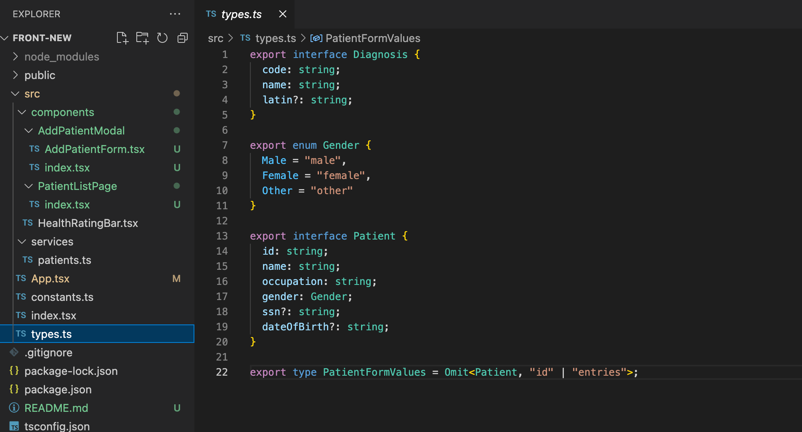
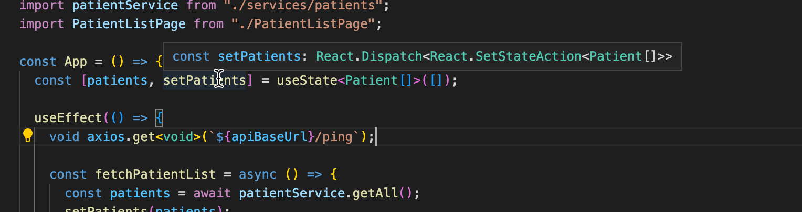
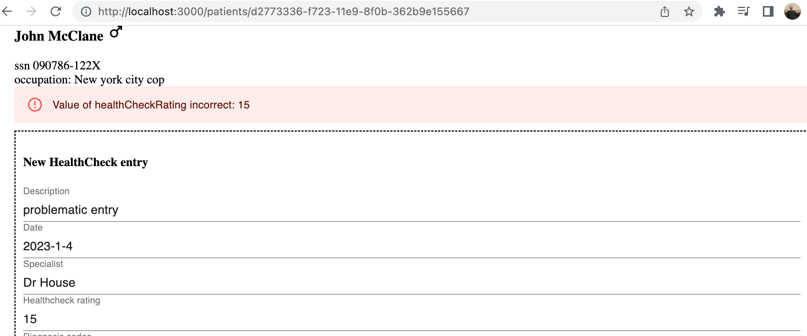
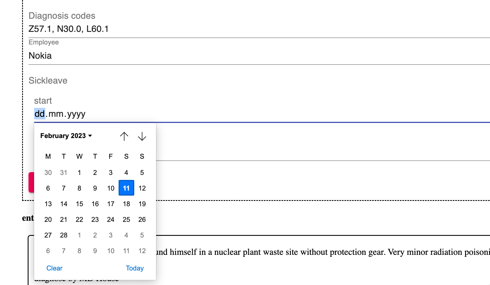

<div class="content">

### Trabajando con una base de código existente

Al sumergirse en una base de código existente por primera vez, es bueno obtener una visión general de las convenciones y la estructura del proyecto. Puedes comenzar tu investigación leyendo el *README.md* en la raíz del repositorio. Por lo general, el archivo *README.md* contiene una breve descripción de la aplicación y los requisitos para usarla, así como las instrucciones para iniciarla en el modo de desarrollo.
Si el README no está disponible o alguien ha "ahorrado tiempo" y lo ha dejado como código auxiliar, puedes echar un vistazo al *package.json*.
Siempre es una buena idea iniciar la aplicación y hacer clic para verificar que tiene un entorno de desarrollo funcional.

También puedes examinar la estructura de carpetas para obtener información sobre la funcionalidad de la aplicación y/o la arquitectura utilizada. Estos no siempre son claros y es posible que los desarrolladores hayan elegido una forma de organizar el código que no le resulte familiar. El [proyecto de muestra](https://github.com/fullstack-hy2020/patientor) utilizado en el resto de esta parte está organizado por funcionalidad. Puedes ver qué páginas tiene la aplicación y algunos componentes generales, por ejemplo, modales y estado. Ten en cuenta que las funcionalidades pueden tener diferentes alcances. Por ejemplo, los modales son componentes visibles de la interfaz de usuario, mientras que el estado es comparable a la lógica de negocios y mantiene los datos organizados bajo el capó para que los use el resto de la aplicación.

TypeScript proporciona tipos que indican qué tipo de estructuras de datos, funciones, componentes y estado esperar. Puedes intentar buscar *types.ts* o algo similar para comenzar. VSCode es de gran ayuda y solo resaltar variables y parámetros puede brindar una gran cantidad de información. Todo esto, naturalmente, depende de cómo se utilicen los tipos en el proyecto.

Si el proyecto tiene pruebas unitarias, de integración o de un extremo a otro, leerlas probablemente sea beneficioso. Los casos de prueba son tu herramienta más importante al refactorizar o crear nuevas funcionalidades para la aplicación. Quieres asegurarte de no romper ninguna funcionalidad existente al manipular el código. TypeScript también puede orientarte sobre tipos de argumentos y retornos al cambiar el código.

Recuerda que leer código es una habilidad en sí misma, y ​​no te preocupes si no comprendes el código la primera vez que lo lees. El código puede tener muchos casos de esquina, y es posible que se hayan agregado piezas de lógica por aquí y por allá a lo largo de su ciclo de desarrollo. Es difícil imaginar con qué tipo de problemas ha estado luchando el desarrollador anterior. Piensa en todo esto como si fueran [anillos de crecimiento en árboles](https://en.wikipedia.org/wiki/Dendrochronology#Growth_rings). Comprender todo requiere profundizar en el código y los requisitos de la lógica de negocio. Lo más probable es que leas mucho más código del que producirás a lo largo de tu vida.

### Patientor frontend

Es hora de ensuciarnos las manos finalizando el frontend para el backend que construimos en los [ejercicios 9.8.-9.13.](/es/part9/typing_the_express_app). También vamos a necesitar añadir nuevas funcionalidades al backend para finalizar esta aplicación

Antes de sumergirnos en el código, corramos tanto el frontend como el backend.

Si todo va bien, deberías ver una página de lista de pacientes. Obtiene una lista de pacientes de nuestro backend y la muestra en la pantalla como una tabla simple. También hay un botón para crear nuevos pacientes en el backend. Como usamos datos simulados en lugar de una base de datos, los datos no persistirán; cerrar el backend eliminará todos los datos que hemos agregado. El diseño de la interfaz de usuario claramente no ha sido un punto fuerte de los creadores, así que ignoremos la interfaz de usuario por ahora.

Luego de verificar que todo funciona, podemos comenzar a estudiar el código. Todas las cosas interesantes se encuentran en la carpeta *src*. Para tu comodidad, también hay un archivo *types.ts* listo para los tipos básicos utilizados en la aplicación, que tendrás que ampliar o refactorizar en los ejercicios.

En principio, podríamos usar los mismos tipos tanto para el backend como para el frontend, pero generalmente el frontend tiene diferentes estructuras de datos y casos de uso para los datos, lo que hace que los tipos sean diferentes.
Por ejemplo, el frontend tiene un estado y puede querer mantener los datos en objetos o mapas, mientras que el backend usa un array. Es posible que el frontend tampoco necesite todos los campos de un objeto de datos guardados en el backend, y es posible que deba agregar algunos campos nuevos para usarlos en la renderización.

La estructura de carpetas tiene el siguiente aspecto:



Ademas del componente *App* y de un directorio para services, actualmente hay tres componentes principales: *AddPatientModal* y *PatientListPage* los cuales están definidos en un directorio, y un componente *HealthRatingBar* definido en un archivo. Si un componente tiene algunos sub-componentes que son usados en otra parte de la aplicación, podría ser una buena idea definir los componentes y sus sub-componentes en un directorio. Por ejemplo, ahora AddPatientModal esta definido en el archivo *components/AddPAtientModal/index.tsx* y su sub-componente *AddPatientForm* en su propio archivo bajo el mismo directorio.

No hay nada muy sorprendente en el código. El estado y la comunicación con el backend son implementados con el hook *useState* y con Axios, similar a la aplicación de notas de la parte anterior. [Material UI](/es/part7/mas_sobre_estilos#material-ui) es utilizado para el estilo de la aplicación y la estructura de navegación esta implementada con [React Router](/es/part7/react_router), ambas nos son familiares desde la parte 7 del curso.

Desde el punto de vista del tipado, hay un par de cosas interesantes. El componente *App* le pasa la función *setPatients* como prop a el componente *PatientListPage*:

```js
const App = () => {
  const [patients, setPatients] = useState<Patient[]>([]); // highlight-line

  // ...
  
  return (
    <div className="App">
      <Router>
        <Container>
          <Routes>
            // ...
            <Route path="/" element={
              <PatientListPage
                patients={patients}
                setPatients={setPatients} // highlight-line
              />} 
            />
          </Routes>
        </Container>
      </Router>
    </div>
  );
};
```

Para mantener al compilador de TypeScript feliz, los props deben ser tipados como a continuación:

```js
interface Props {
  patients : Patient[]
  setPatients: React.Dispatch<React.SetStateAction<Patient[]>>
}

const PatientListPage = ({ patients, setPatients } : Props ) => { 
  // ...
}
```

Entonces, la función *setPatients* tiene el tipo *React.Dispatch<React.SetStateAction<Patient[]>>*. Podemos ver el tipo en el editor cuando posamos el cursor sobre la función:



[React TypeScript cheatsheet](https://react-typescript-cheatsheet.netlify.app/docs/basic/getting-started/basic_type_example#basic-prop-types-examples) tiene una lista muy buena de tipos de props típicos, donde podemos buscar ayuda si tenemos problemas para encontrar el tipo de algún prop que no sea obvio.

*PatientListPage* le pasa cuatro props al componente *AddPatientModal*. Dos de estos props son funciones. Miremos como están tipadas:

```js
const PatientListPage = ({ patients, setPatients } : Props ) => {

  const [modalOpen, setModalOpen] = useState<boolean>(false);
  const [error, setError] = useState<string>();

  // ...

  const closeModal = (): void => { // highlight-line
    setModalOpen(false);
    setError(undefined);
  };

  const submitNewPatient = async (values: PatientFormValues) => { // highlight-line
    // ...
  };
  // ...

  return (
    <div className="App">
      // ...
      <AddPatientModal
        modalOpen={modalOpen}
        onSubmit={submitNewPatient} // highlight-line
        error={error}
        onClose={closeModal} // highlight-line
      />
    </div>
  );
};
```

Los tipos se ven de la siguiente manera:

```js
interface Props {
  modalOpen: boolean;
  onClose: () => void;
  onSubmit: (values: PatientFormValues) => Promise<void>;
  error?: string;
}

const AddPatientModal = ({ modalOpen, onClose, onSubmit, error }: Props) => {
  // ...
}
```

*onClose* solo es una función que no acepta parámetros, y no devuelve nada, entonces el tipo es:

```js
() => void
```

El tipo de *onSubmit* es un poco más interesante, tiene un parámetro que tiene el tipo *PatientFormValues*. El valor de retorno de la función es _Promise&#60;void&#62;_. Entonces, otra vez, el tipo de la función está escrito con la sintaxis de flecha:

```js
(values: PatientFormValues) => Promise<void>
```

El valor de retorno de una función *async* es una [promesa](https://developer.mozilla.org/es/docs/Web/JavaScript/Reference/Statements/async_function) con el valor que la función devuelve. Nuestra función no devuelve nada así que el tipo de retorno apropiado es simplemente _Promise&#60;void&#62;_.

</div>

<div class="tasks">

### Ejercicios 9.20.-9.21.

Pronto agregaremos un nuevo tipo para nuestra aplicación, *Entry*, que representa una entrada de diario de paciente liviana. Consiste en el texto del diario, es decir , *description*, una fecha de creación, información sobre el especialista que la creó y posibles códigos de diagnóstico. Los códigos de diagnóstico se asignan a los códigos ICD-10 devueltos desde el endpoint */api/diagnoses*. Nuestra implementación ingenua será que un paciente tiene un array de entradas.

Antes de entrar en esto, hagamos algunos trabajos preparatorios.

#### 9.20: Patientor, paso 1

Crea un endpoint */api/patients/:id* en el backend que devuelva toda la información del paciente para un paciente, incluyendo el array de entradas de pacientes que todavía está vacío para todos los pacientes. Por el momento, expande los tipos del backend de la siguiente manera:

```js
// eslint-disable-next-line @typescript-eslint/no-empty-interface
export interface Entry {
}

export interface Patient {
  id: string;
  name: string;
  ssn: string;
  occupation: string;
  gender: Gender;
  dateOfBirth: string;
  entries: Entry[] // highlight-line
}

export type NonSensitivePatient = Omit<Patient, 'ssn' | 'entries'>;  // highlight-line
```

La respuesta debe tener el siguiente aspecto:


#### 9.21: Patientor, paso 2

Crea una página para mostrar la información completa de un paciente en el frontend.

El usuario debe poder acceder a la información de un paciente haciendo click en el nombre del paciente.

Obtén los datos del endpoint creado en el ejercicio anterior.

Puedes usar [MaterialUI](https://material-ui.com/) para los nuevos componentes pero eso depende de ti ya que ahora nuestro enfoque principal es TypeScript.

Es posible que quieras echarle un vistazo a la [parte 7](/es/part7/react_router) si aún no comprendes cómo funciona [React Router](https://reactrouter.com/en/main/start/tutorial).

El resultado podría verse así:


El ejemplo usa [Material UI Icons](https://mui.com/components/material-icons/) para representar los géneros.

</div>

<div class="content">

### Full entries

En el [ejercicio 9.10](/es/part9/tipando_una_aplicacion_express#ejercicios-9-10-9-11) implementamos un endpoint para obtener información acerca de varios diagnósticos, pero todavía no lo usamos en absoluto.
Dado que ahora tenemos una página para ver la información de un paciente, sería bueno ampliar un poco nuestros datos.
Agreguemos un campo *Entry* a los datos de nuestro paciente para que los datos de un paciente contengan sus entradas médicas, incluidos los posibles diagnósticos.

Vamos a deshacernos de nuestros datos iniciales de pacientes antiguos del backend y comencemos a usar [este formato expandido](https://github.com/fullstack-hy2020/misc/blob/master/patients-full.ts).

Creemos ahora un tipo *Entry* adecuado en función de los datos que tenemos.

Si echamos un vistazo más de cerca a los datos, podemos ver que las entradas son en realidad bastante diferentes entre sí. Por ejemplo, echemos un vistazo a las dos primeras entradas:

```js
{
  id: 'd811e46d-70b3-4d90-b090-4535c7cf8fb1',
  date: '2015-01-02',
  type: 'Hospital',
  specialist: 'MD House',
  diagnosisCodes: ['S62.5'],
  description:
    "Healing time appr. 2 weeks. patient doesn't remember how he got the injury.",
  discharge: {
    date: '2015-01-16',
    criteria: 'Thumb has healed.',
  }
}
...
{
  id: 'fcd59fa6-c4b4-4fec-ac4d-df4fe1f85f62',
  date: '2019-08-05',
  type: 'OccupationalHealthcare',
  specialist: 'MD House',
  employerName: 'HyPD',
  diagnosisCodes: ['Z57.1', 'Z74.3', 'M51.2'],
  description:
    'Patient mistakenly found himself in a nuclear plant waste site without protection gear. Very minor radiation poisoning. ',
  sickLeave: {
    startDate: '2019-08-05',
    endDate: '2019-08-28'
  }
}
```

Inmediatamente podemos ver que mientras los primeros campos son los mismos, la primera entrada tiene un campo *discharge* y la segunda entrada tiene los campos *employerName* y *sickLeave*. 
Todas las entradas parecen tener algunos campos en común, pero algunos campos son específicos de la entrada.

Al observar a *type*, podemos ver que en realidad hay tres tipos de entradas: *OccupationalHealthcare*, *Hospital* y *HealthCheck*.
Esto indica que necesitamos tres tipos diferentes. Dado que todos tienen algunos campos en común, es posible que deseemos crear una interfaz de entrada base que podamos ampliar con los diferentes campos de cada tipo.

Al mirar los datos, parece que los campos *id*, *description*, *date* y *specialist* son algo que se puede encontrar en cada entrada. Además de eso, parece que *diagnosisCodes* solo se encuentra en una entrada de tipo *OccupationalHealthCare* y una de tipo *Hospital*. Dado que no siempre se usa, incluso en esos tipos de entradas, es seguro asumir que el campo es opcional. También podríamos considerar agregarlo al tipo *HealthCheck*, ya que es posible que simplemente no se use en estas entradas específicas.

Entonces, nuestra *BaseEntry* desde la que se podría extender cada tipo sería la siguiente:

```js
interface BaseEntry {
  id: string;
  description: string;
  date: string;
  specialist: string;
  diagnosisCodes?: string[];
}
```

Si queremos ajustarlo un poco más, dado que ya tenemos un tipo *Diagnosis* definido en el backend, es posible que solo queramos referirnos al campo de código del tipo *Diagnosis* directamente en caso de que su tipo alguna vez cambie.
Podemos hacerlo así:

```js
interface BaseEntry {
  id: string;
  description: string;
  date: string;
  specialist: string;
  diagnosisCodes?: Diagnosis['code'][];
}
```

Como mencionamos [anteriormente en está parte](/es/part9/primeros_pasos_con_type_script#la-sintaxis-alternativa-para-arrays), podríamos definir un array con la sintaxis _Array&#60;Type&#62;_ en vez de definirlo como *Type[]*. En casos como este, escribir *Diagnosis['code'][]* comienza a verse un poco extraño así que decidimos usar la sintaxis alternativa (que tambien es la recomendada por la regla de ESlint [array-simple](https://typescript-eslint.io/rules/array-type/#array-simple)):

```js
interface BaseEntry {
  id: string;
  description: string;
  date: string;
  specialist: string;
  diagnosisCodes?: Array<Diagnosis['code']>; // highlight-line
}
```

Ahora que tenemos *BaseEntry* definido, podemos comenzar a crear los tipos de entrada extendidos que usaremos. Comencemos por crear el tipo *HealthCheckEntry*.

Las entradas de tipo *HealthCheck* contienen el campo *HealthCheckRating*, que es un número entero de 0 a 3, cero significa *Healthy* (saludable) y tres significa *CriticalRisk* (riesgo crítico). Este es un caso perfecto para una definición de enum.
Con estas especificaciones podríamos escribir una definición de tipo *HealthCheckEntry* así:

```js
export enum HealthCheckRating {
  "Healthy" = 0,
  "LowRisk" = 1,
  "HighRisk" = 2,
  "CriticalRisk" = 3
}

interface HealthCheckEntry extends BaseEntry {
  type: "HealthCheck";
  healthCheckRating: HealthCheckRating;
}
```

Ahora solo necesitamos crear los tipos *OccupationalHealthCareEntry* y *HospitalEntry* para que podamos combinarlos en una unión y exportarlos como un tipo Entry como este:

```js
export type Entry =
  | HospitalEntry
  | OccupationalHealthcareEntry
  | HealthCheckEntry;
```

### Omit con uniones

Un punto importante acerca de las uniones, es que cuando las usas con *Omit* para excluir una propiedad, funciona probablemente de una forma inesperada. Supón que queremos remover el *id* de cada *Entry*. Podríamos pensar en usar

```js
Omit<Entry, 'id'>
```

pero [no funcionara como podríamos esperar](https://github.com/microsoft/TypeScript/issues/42680). De hecho, el tipo resultante solo contendría las propiedades comunes, pero no las que no comparten. Una posible alternativa es definir una función parecida a Omit para lidiar con estas situaciones:

```ts
// Define omit especial para uniones
type UnionOmit<T, K extends string | number | symbol> = T extends unknown ? Omit<T, K> : never;
// Define Entry sin la propiedad 'id'
type EntryWithoutId = UnionOmit<Entry, 'id'>;
```

</div>

<div class="tasks">

### Ejercicios 9.22-9.29

¡Ahora estamos listos para darle los toques finales a la aplicación!

#### 9.22: Patientor, paso 3

Define los tipos *OccupationalHealthCareEntry* y *HospitalEntry* para que se ajusten a los nuevos datos de ejemplo. Asegúrese de que su backend devuelva las entradas correctamente cuando vaya a la ruta de un paciente individual


¡Utiliza los tipos correctamente en el backend! Por ahora, no es necesario hacer una validación adecuada para todos los campos de las entradas en el backend, es suficiente, por ejemplo, comprobar que campo *type* tiene un valor correcto.

#### 9.23: Patientor, paso 4

Amplía la página de un paciente en el frontend para listar *date*, *description* y *diagnoseCodes* de las entradas del paciente.

Puedes utilizar la misma definición de tipo para una *Entry* en el frontend. Para estos ejercicios, basta con copiar/pegar las definiciones del backend al frontend.

Tu solución podría verse así:


#### 9.24: Patientor, paso 5

Obtén y agrega diagnósticos al estado de la aplicación desde el endpoint */api/diagnoses*. Utiliza los nuevos datos de diagnóstico para mostrar las descripciones de los códigos de diagnóstico del paciente:


#### 9.25: Patientor, paso 6

Amplía la lista de entradas en la página del paciente para incluir los detalles de la entrada, con un nuevo componente que muestra el resto de la información de las entradas de los pacientes, distinguiendo diferentes tipos entre sí.

Podrías utilizar, por ejemplo. [Icons](https://mui.com/components/material-icons/) o algún otro componente de [Material UI](https://mui.com/) para obtener imágenes apropiadas para tu listado.

Debes utilizar un renderizado basado en *switch case* y una *comprobación de tipo exhaustiva* para que no se puedan olvidar casos.

Como esto:


Las entradas resultantes en la lista *podrían* verse así:


#### 9.26: Patientor, paso 7

Hemos establecido que los pacientes pueden tener diferentes clases de entradas. Todavía no tenemos ninguna forma de agregarle entradas a los pacientes en nuestra aplicación, es bastante inútil como registro médico electrónico.

Tu siguiente tarea es agregar un endpoint */api/patients/:id/entries* a tu backend, a través del cual puedas hacer un POST para agregar una entrada para un paciente.

Recuerda que tenemos diferentes tipos de entradas en nuestra aplicación, por lo que nuestro backend debe admitir todos esos tipos y verificar que se proporcionen al menos todos los campos obligatorios para cada tipo.

En este ejercicio probablemente tengas que recordar [este truco](/es/part9/grande_finale_patientor#omit-con-uniones)

Podrías asumir que los códigos de diagnóstico son enviados en el formato correcto y utilizar, por ejemplo, el siguiente tipo de parser para extraerlos del body de la solicitud:

```js
const parseDiagnosisCodes = (object: unknown): Array<Diagnosis['code']> =>  {
  if (!object || typeof object !== 'object' || !('diagnosisCodes' in object)) {
    // we will just trust the data to be in correct form
    return [] as Array<Diagnosis['code']>;
  }

  return object.diagnosisCodes as Array<Diagnosis['code']>;
};
```

#### 9.27: Patientor, paso 8

Ahora que nuestro backend permite agregar entradas, queremos agregar la funcionalidad correspondiente al frontend. En este ejercicio, debes agregar un formulario para agregarle una entrada a un paciente. Un lugar intuitivo para acceder al formulario sería la página del paciente.

En este ejercicio es suficiente **admitir un tipo de entrada**. Todos los campos del formulario pueden ser simples inputs de texto, por lo que depende del usuario ingresar valores validos.

Tras un envío exitoso, la nueva entrada debe agregarse al paciente correcto y las entradas del paciente en la página del paciente deben actualizarse para contener la nueva entrada.

Tu formulario podría verse así:


Si el usuario ingresa valores inválidos en el formulario y el backend rechaza la adición, muestra un mensaje de error apropiado



#### 9.28: Patientor, paso 9

Amplía tu solución para que admita *todos los tipos de entrada*

#### 9.29: Patientor, paso 10

Mejora el formulario de creación de entradas para que sea más difícil entrar fechas incorrectas, códigos de diagnóstico y ratings de salud.

Tu formulario mejorado podría verse de esta manera:



Los códigos de diagnóstico ahora se configuran con el elemento de Material UI [multiple select](https://mui.com/material-ui/react-select/#multiple-select) y las fechas con el elemento [Input](https://mui.com/material-ui/api/input/) con el tipo [date](https://developer.mozilla.org/en-US/docs/Web/HTML/Element/input/date).

### Envío de ejercicios y obtención de créditos

Los ejercicios de esta parte son enviados a través de [el sistema de envío de ejercicios](https://studies.cs.helsinki.fi/stats/courses/fs-typescript) al igual que en las partes anteriores, con la diferencia de que esta vez el envío se realiza en una "instancia del curso" diferente. ¡Recuerda que tienes que terminar al menos 24 ejercicios para aprobar esta parte!

Una vez que hayas completado los ejercicios y quieras obtener los créditos, háznoslo saber a través de el sistema de envío de ejercicios que has completado el curso:


**Ten en cuenta** que necesitas registrarte a la parte del curso correspondiente para obtener los créditos registrados, lee [esto](/es/part0/informacion_general#partes-y-finalizacion) para más información.

Puedes descargar el certificado por completar esta parte clicando en uno de los iconos de las banderas. El icono de la bandera se corresponde con el lenguaje del certificado.

</div>
