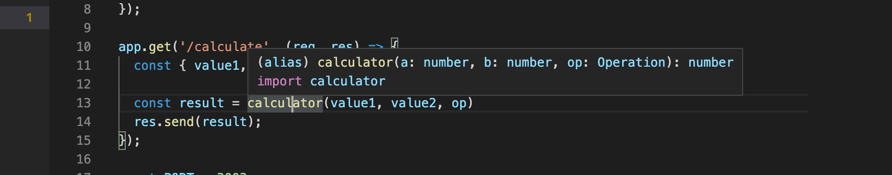
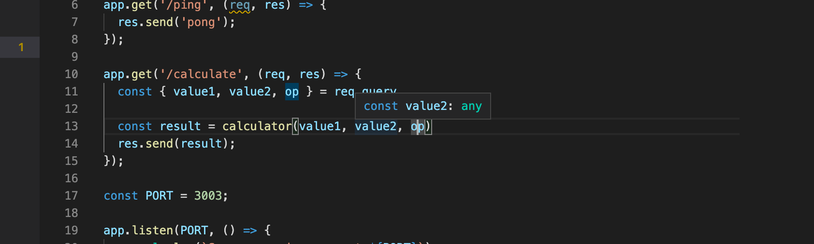

<div class="content">
<!-- After the brief introduction to the main princibles of TypeScript, we are now ready to start our journey towards becoming FullStack TypeScript developers.  -->
在简单介绍了TypeScript的主要原理之后，我们现在准备开始我们的旅程，成为全栈 TypeScript的开发者。
<!-- Rather than giving you a thorough introduction to all aspects of TypeScript, in this part we will focus on the most common issues that arise when developing express backends or React frontends with TypeScript.  -->

在这一章，我们将重点讨论在使用TypeScript 开发 Express 后端或使用React前端时出现的常见问题，而不是对TypeScript的所有方面进行全方位的介绍。
<!-- In addition to language features we will also have a strong emphasis in tooling. -->
除了语言特性之外，我们还将特别强调工具的使用。

### Setting things up
【准备工作】
<!-- Install TypeScript support to your editor of choice. For [Visual Studio Code](https://code.visualstudio.com/) you need the [typescript hero](https://marketplace.visualstudio.com/items?itemName=rbbit.typescript-hero) extension.  -->
在你选择的编辑器中安装对 TypeScript 支持，对于[Visual Studio Code](https://code.visualstudio.com/)来说，你需要安装[typescript hero](https://marketplace.visualstudio.com/items?itemName=rbbit.typescript-hero)扩展。


<!-- As mentioned earlier, TypeScript code is not executable by itself but it has to be first compiled into executable JavaScript.  -->
如前所述，TypeScript 代码本身并不是可执行的，必须首先编译成可执行的 JavaScript。

<!-- When TypeScript is compiled into JavaScript, the code becomes subject for type erasure. This means that type annotations, interfaces, type aliases, and other type system constructs are removed from the code and the result is pure ready-to-run JavaScript.  -->
当 TypeScript 被编译成 JavaScript 时，代码成为了类型擦除的对象。 这意味着类型注解、接口、类型别名和其他类型系统构造将从代码中删除，结果是纯粹的、待运行的 JavaScript。


<!-- In a production environment the need for compilation often means that you have to setup a "build step". During the build step all TypeScript code is compiled into JavaScript in a separate folder, and the production enviroment then runs the code from that folder. In a development environment it is often more handy to make use of real-time compilation and auto-reloading in order to be able to see the resulting changes faster. -->
在生产环境中，编译的需要通常意味着必须设置一个“构建步骤”。 在构建过程中，所有的 TypeScript 代码都被编译成JavaScript ，放到一个独立的文件夹中 ，然后生产环境从这个独立文件夹中运行代码。 在开发环境中，通常使用方便的实时编译和自动重载技术，以便能够更快地查看所产生的更改。


<!-- Let's start writing our first TypeScript-app. To keep things simple, let's start by using the npm package [ts-node](https://github.com/TypeStrong/ts-node). -->
让我们开始编写我们的第一个TypeScript应用，为了保持简单，让我们通过使用[ts-node](https://github.com/typestrong/ts-node)这个 npm 包开始。

<!-- It compiles and executes the specified TypeScript file immediately, so that there is no need for a separate compilation step. -->
它能立即编译并执行指定的 TypeScript 文件，因此不需要单独的编译步骤。


<!-- You can install both <i>ts-node</i> and the official <i>typescript</i> package globally by running <i>npm install -g ts-node typescript</i>. -->
在全局范围内同时安装<i>ts-node</i> 和官方<i>TypeScript</i> 包。

```
npm install -g ts-node typescript
```

<!-- If you can't or don't want to install global packages, you can create an npm project which has the required dependencies and run your scripts in it.  -->
如果您不能或不想全局安装，您可以创建一个具有所需依赖项的 npm 项目，并在其中运行您的脚本。

<!-- We will also take this approach.  -->
我们也将采用这种方法。

<!-- As we remember from [第3章](/zh/part3) an npm project is set by running running command <i>npm init</i> in an empty directory. Then we can install the dependencies by running  -->
正如我们在[第3章](/zh/part3) 中所做的，通过在空目录中运行命令<i>npm init</i> 来设置 npm 项目。 我们可以通过运行如下命令安装依赖：

```
npm install --save-dev ts-node typescript
```

<!-- and set up <i>scripts</i> within the package.json:  -->
在 package.json 中设置一下<i>scripts</i>:

```json
{
  // ..
  "scripts": {
    "ts-node": "ts-node" // highlight-line
  },
  // ..
}
```


<!-- Now within this directory you can use <i>ts-node</i>by running <i>npm run ts-node</i>. Note that if you are using ts-node through package.json, all  command line arguments for the script need to be prefixed with <i>--</i>. So if you want to run file.ts with <i>ts-node</i>, the whole command is: -->
现在，在这个目录中，我们可以通过运行<i>npm run ts-node</i> 来使用<i>ts-node</i>。 注意，如果通过 package.json 使用 ts-node，脚本的所有命令行参数都需要以<i>--</i> 作为前缀。 因此，如果希望用<i>ts-node</i> 运行 file.ts，整个运行命令是:

```shell
npm run ts-node -- file.ts
```


<!-- It is worth mentioning that TypeScript also provides an online playground, where you can quickly try out TypeScript code and instantly see the resulting JavaScript and possible compilation errors. You can access TypeScript's official playground [here](https://www.typescriptlang.org/play/index.html). -->
值得一提的是，TypeScript 还提供了一个在线playground，在这里你可以快速尝试 TypeScript 代码，并立即看到结果的 JavaScript 和可能的编译错误。 你可以在[这里](https://www.typescriptlang.org/play/index.html)访问TypeScript的官方playground 。

<!-- **NB:** The playground might contain different tsconfig rules (which will be introduced later) than your local environment, which is why you might see different warnings there compared to your local environment. The playground's tsconfig is modifiable through the config dropdown menu. -->
**注意:**playground可能包含不同的 tsconfig 规则(稍后将介绍) ，这就是为什么你可能会看到与您的当地环境不同的警告。 playground的 tsconfig 是可以通过配置下拉菜单进行修改的。

#### A note about the coding style
【关于编码风格的提示】
<!-- JavaScript on itself is quite relaxed language, and things can often be done in multiple different ways. For example we have named vs anonymous functions, using const and let or var and the use of <i>semicolons</i>. This part of the course differs from the rest by using semicolons. It is not a TypeScript specific pattern but a general coding style decision when creating any kind of JavaScript. Whether to use them or not is usually in the hands of the programmer, but since it is expected to adapt ones coding habits to the existing codebase, in the exercises of this part it is expected to use semicolons and to adjust to the coding style of the part. This part has some other coding style differences compared to the rest of the course as well, e.g. in the directory naming. -->
Javascript 本身是一种相当轻松的语言，业务通常可以用多种不同的方式来完成。 例如，可以用命名 vs. 匿名函数、可以使用 const 和 let 或 var 、以及可选地使用<i>分号</i> 。 本课程的这一章节与其他部分不同，使用了分号。 它并不是一个特定于TypeScript的模式，而是创建任何类型的 JavaScript 时一个通用的编码风格决策。 是否使用它们通常掌握在程序员的手中，但是由于常被期望调整编码习惯，以适应现有的代码库，在这一章节的练习中我们期望使用分号，并调整以适应本章的编码风格。 与课程的其他部分相比，这一章节还有一些其他编码风格的差异，例如在目录命名方面。 


<!-- Let's start by creating a simple Multiplier. It looks exactly as it would in JavaScript. -->
让我们从创建一个简单的 乘法函数 开始，它看起来和 JavaScript 一模一样。

```js
const multiplicator = (a, b, printText) => {
  console.log(printText,  a * b);
}

multiplicator(2, 4, 'Multiplied numbers 2 and 4, the result is:');
```


<!-- As you can see, this is still ordinary basic JavaScript with no additional TS features. It compiles and runs nicely with  <i>npm run ts-node -- multiplier.ts</i>, as it would with Node. -->
如您所见，这仍然是普通的基础 JavaScript，没有任何附加的 TS 特性。 它可以很好地编译和运行<i>npm run ts-node -- multiplier.ts</i>，就像使用 Node 一样。
<!-- But what happens if we end up passing wrong <i>types</i> of arguments to the multiplicator function? -->
但是，如果我们最终将错误的<i>类型</i> 参数传递给这个乘法函数会发生什么呢？

<!-- Let's try it out! -->
让我们试试吧！

```js
const multiplicator = (a, b, printText) => {
  console.log(printText,  a * b);
}

multiplicator('how about a string?', 4, 'Multiplied a string and 4, the result is:');

```


<!-- Now when we run the code, the output is: <i>Multiplied a string and 4, the result is: NaN</i>. -->
现在，当我们运行代码时，输出是: <i>Multiplied a string and 4, the result is: NaN</i>。


<!-- Wouldn't it be nice if the language itself could prevent us from ending up in situations like this?  -->
如果语言本身能够防止我们陷入这样的错误，那不是很好吗？

<!-- This is where we see the first benefits of TypeScript.  Let's add types to the parameters and see where it takes us. -->
这就是我们看到TypeScript的第一个好处的地方。 让我们向参数添加类型，看看它将把我们带到哪里。

<!-- TypeScript natively supports multiple types including <i>number</i>, <i>string</i> and  <i>Array</i>. See the comprehensive list [here](https://www.typescriptlang.org/docs/handbook/basic-types.html). More complex custom types can also be created. -->
Typescript 本机支持多种类型，包括<i>number</i>、<i>string</i> 和<i>Array</i>。 参见更全面的列表，[点击这里](https://www.typescriptlang.org/docs/handbook/basic-types.html)。 还可以创建更复杂的自定义类型。 

<!-- The first two parameters of our function are of the type [number](http://www.typescriptlang.org/docs/handbook/basic-types.html#number) and the last is a [string](http://www.typescriptlang.org/docs/handbook/basic-types.html#string): -->
我们函数的前两个参数类型是[number](http://www.typescriptlang.org/docs/handbook/basic-types.html#number) ，最后一个是[string](http://www.typescriptlang.org/docs/handbook/basic-types.html#string) :

```js
const multiplicator = (a: number, b: number, printText: string) => {
  console.log(printText,  a * b);
}

multiplicator('how about a string?', 4, 'Multiplied a string and 4, the result is:');
```

<!-- Now the code is no longer valid JavaScript, but in fact TypeScript. When we try to run the code, we notice that it does not compile: -->
现在这段代码不再是有效的 JavaScript，事实上已经是 TypeScript 了。 当我们尝试运行代码时，我们注意到它不能编译:


<!-- One of the best things in TypeScript's editor support is that you don't necessarily need to even run the code to see the issues.  -->
TypeScript 的编辑器支持中最好的一点就是，你甚至不需要运行代码来看到这个问题。 

<!-- The VSCode plugin is so efficient, that it informs you immediately when you are trying to use an incorrect type: -->
VSCode 插件非常高效，当你试图使用一个不正确的类型时，它会立即通知你: 


### Creating your first own types
【创建你自己的第一个类型】

<!-- Let's expand our multiplicator into a bit more versatile calculator that also supports addition and division. The calculator should accept three arguments: two numbers and the operation, either <i>multiply</i>, <i>add</i> or <i>divide</i>, which tells it what to do with the numbers  -->
让我们扩展我们的乘法运算，扩展到一个更多用途的计算器中，计算器同时也支持加法和除法。 计算器应该接受三个参数: 两个数字和运算符，<i>乘</i>、 <i>加</i>  或者 <i>除</i>，它告诉计算器如何处理这些数字

<!-- In JavaScript the code would require additional validation to make sure the last argument is indeed a string. TypeScript offers a way to define specific types for inputs, which describe exactly what type of input is acceptable. On top of that, TypeScript can also show the info of the accepted values already on editor level.  -->
在 JavaScript 中，代码需要额外的验证，以确保最后一个参数确实是一个字符串。 TypeScript 提供了一种为输入定义特定类型的方法，这种方法可以准确地描述哪种类型的输入是可以接受的。 除此之外，TypeScript还可以显示编辑器级别上已经接受的值的信息。


<!-- We can create a <i>type</i> using the TypeScript native keyword <i>type</i>. Let's describe our type <i>Operation</i>: -->
我们可以使用 TypeScript 原生关键字<i>type</i> 来创建<i>类型</i>:

```js
type Operation = 'multiply' | 'add' | 'divide';
```


<!-- Now the <i>Operation</i> type accepts only three kinds of input; exactly the three strings we wanted.  -->
现在<i>Operation</i> 类型只接受三种类型的输入; 正好是我们想要的三个字符串。

<!-- Using the OR operator _|_ we can define a variable to accept multiple values by creating a [union type](https://www.typescriptlang.org/docs/handbook/advanced-types.html#union-types). -->
使用 OR 运算符 |， 我们可以创建一个[联合类型](https://www.typescriptlang.org/docs/handbook/advanced-types.html#union-types)来定义一个变量来接受多个值。

<!-- In this case we used exact strings (that in technical terms are called [string literal types](http://www.typescriptlang.org/docs/handbook/advanced-types.html#string-literal-types)) but with unions you could also make the compiler to accept for example both string and number: _string | number_. -->
在这种情况下，我们使用了精确的字符串(在技术术语中称为[字符串语义类型string literal types](http://www.typescriptlang.org/docs/handbook/advanced-types.html#string-literal-types)) ，但是对于联合，你也可以让编译器同时接受字符串和数字类型: string | number。


<!-- The <i>type</i> keyword defines a new name for a type, [a type alias](https://www.typescriptlang.org/docs/handbook/advanced-types.html#type-aliases). Since the defined type is a union of three possible values, it is handy to give it an alias that has a representative name. -->
<i>type</i> 关键字为类型定义了一个新名称，[一个类型别名 a type alias](https://www.typescriptlang.org/docs/handbook/advanced-types.html#type-aliases)。 由于定义的类型是由三个可能的值组成的联合，因此给它一个具有代表性名称的别名非常方便。

<!-- Let's look at our calculator now: -->
现在让我们看看我们的计算器:

```js
type Operation = 'multiply' | 'add' | 'divide';

const calculator = (a: number, b: number, op : Operation) => {
  if (op === 'multiply') {
    return a * b;
  } else if (op === 'add') {
    return a + b;
  } else if (op === 'divide') {
    if (b === 0) return 'can\'t divide by 0!';
    return a / b;
  }
}
```

<!-- Now when we hover on top of the <i>Operation</i> type in the calculator function, we can immediately see suggestions on what to do with it: -->
现在，当我们把鼠标悬停在<i>Operation</i> 的顶部输入计算器函数时，我们可以立即看到关于如何使用它的建议:


<!-- And if we try to use a value that is not within the <i>Operation</i> type, we get the familiar red warning signal and extra info from our editor: -->
如果我们尝试使用一个不在<i>Operation</i> 类型中的值，我们会得到熟悉的红色警告和来自编辑器的额外信息:


<!-- This is already pretty nice, but one thing we haven't touched yet is typing the return value of a function. Usually you want to know what a function returns, and it would be nice to have a guarantee that it actually returns what it says it does. Let's add a return value <i>number</i> to the calculator function: -->
这已经很不错了，但是有一件事我们还没有涉及到，那就是输入函数的返回值。 通常你想知道一个函数返回什么，如果能保证它真的返回它所说的返回值，那就更好了。 让我们给计算器函数添加一个返回值<i>number</i>:

```js
type Operation = 'multiply' | 'add' | 'divide';

const calculator = (a: number, b: number, op: Operation): number => {

  if (op === 'multiply') {
    return a * b;
  } else if (op === 'add') {
    return a + b;
  } else if (op === 'divide') {
    if (b === 0) return 'this cannot be done';
    return a / b;
  }
}
```


<!-- The compiler complains straight away, because in one case the function returns a string. There are couple of ways to fix this:  -->
编译器直接报错，因为在某种情况下，函数返回一个字符串。 有几种方法可以解决这个问题:

<!-- we could extend the return type to allow string values, like so -->
我们可以扩展返回类型来允许字符串值，如下所示

```js
const calculator = (a: number, b: number, op: Operation): number | string =>  {
  // ...
}
```


<!-- or we could create a return type which includes both possible types, much like our Operation type -->
或者我们可以创建一个返回类型，它包含两种可能的类型，非常类似于我们的 Operation 类型

```js
type Result = string | number

const calculator = (a: number, b: number, op: Operation): Result =>  {
  // ...
}
```


<!-- But now  the question is if it's <i>really</i> okay for the function to return a string? -->
但现在的问题是，如果函数返回一个字符串是<i>真的</i> 好吗？

<!-- When your code can end up in a situation where something is divided by 0, something has probably gone terribly wrong and an error should be thrown and handled where the function was called. -->
当您的代码最终出现某物除以0的情况时，可能会出现严重的错误，应该在调用函数的地方抛出并处理错误。

<!-- When you are deciding to return values you weren't originally expecting, the warnings you see from TypeScript prevent you from making rushed decisions and help you to keep your code working as expected. -->
当您决定返回您最初没有预料到的值时，从TypeScript中看到的警告会阻止您匆忙做出的决定，并帮助您保持代码按预期工作。


<!-- One more thing to consider is, that even though we have defined types for our parameters, the generated JavaScript used at runtime does not contain the type checks. -->
还有一件事需要考虑，即使我们已经为参数定义了类型，但是在运行时生成的 JavaScript 并不包含类型检查。
<!-- So if for example the <i>operation</i>-parameter's value comes from an external interface, there is no definite guarantee that it will be one of the allowed values. Therefore it's still better to include error handling and be prepared for the unexpected to happen.  -->
因此，例如，如果<i>operation</i>-参数 的值来自外部接口，就不能确切保证它是允许的值之一。 因此，最好还是包含错误处理，为意外发生做好准备。

<!-- In this case, when there are multiple possible accepted values and all unexcpeted ones should result in an error, the [switch...case](https://developer.mozilla.org/en-US/docs/Web/JavaScript/Reference/Statements/switch) statement suits better than if...else in our code. -->
在这种情况下，当存在多个可接受的值并且所有不可接受的值都会导致错误时，[switch... case](https://developer.mozilla.org/en-us/docs/web/javascript/reference/statements/switch)语句比我们代码中的 if... else 语句更适合。

<!-- The code of our calculator should actually look something like this: -->
我们计算器的代码应该是这样的:

```js
type Operation = 'multiply' | 'add' | 'divide';

type Result = number;

const calculator = (a: number, b: number, op : Operation) : Result => {
  switch(op) {
    case 'multiply':
      return a * b;
    case 'divide':
      if( b === 0) throw new Error('Can\'t divide by 0!');
      return a / b;
    case 'add':
      return a + b;
    default:
      throw new Error('Operation is not multiply, add or divide!');
  }
}

try {
  console.log(calculator(1, 5 , 'divide'))
} catch (e) {
  console.log('Something went wrong, error message: ', e.message);
}
```


<!-- The programs we have written are alright, but it sure would be better if we could use command line arguments instead of always having to change the code to calculate different things.   -->

我们编写的程序是正确的，但是如果我们可以使用命令行参数，而不必总是需要改变代码来计算不同的东西，那肯定会更好。

<!-- Let's try it out, as we would in a regular Node application, by accessing <i>process.argv</i>. -->
让我们通过访问<i>process.argv</i> 来尝试一下，就像在常规的 Node 应用中一样。

<!-- But something is not right: -->
但有些地方不对劲:


### @types/{npm_package}
<!-- Let's return to the basic idea of TypeScript. TypeScript expects all globally used code to be typed, as it does for your own code when your project has a reasonable configuration. The TypeScript library itself contains only typings for the code of the TypeScript package. It is possible to write your own typings for a library, but that is almost never needed - since the TypeScript community has done it for us! -->
让我们回到TypeScript的基本概念上来。 Typescript 希望所有全局使用的代码都被类型化，就像当您的项目有合理的配置时，为您自己的代码所做的那样。TypeScript  库本身只包含 TypeScript 包代码的类型。 为库编写自己的类型是可行的，但这几乎从来都不需要——因为TypeScript社区已经为我们做到了！


<!-- As with npm, the TypeScript world also celebrates open source code. The community is active and continuously reacting to updates and changes in commonly used npm-packages.   -->

和 npm 一样，TypeScript界也鼓励开源代码。 该社区是积极的，不断反应的更新和变化，存在于常用的 npm-包中。
<!-- You can almost always find the typings for npm-packages, so you don't have to create types for all of your thousands of dependencies alone. -->
您几乎总是可以找到 npm-包的类型，因此您不必单独为数千个依赖项创建所有类型。


<!-- Usually types for existing packages can be found from the <i>@types</i>-organization within npm, and you can add the relevant types to your project by installing an npm package with the name of your package with @types/ - prefix. For example: <i>npm install --save-dev @types/react @types/express @types/lodash @types/jest @types/mongoose</i> and so on and so on. The <i>@types/*</i> are maintained by [Definitely typed](http://definitelytyped.org/), a community project with the goal to mainting types of everything in one place. -->
通常，现有包的类型可以在 npm 中的 <i>@types</i>-organization 中找到，您可以通过安装一个名为@types /-prefix 的 npm 包将相关类型添加到项目中。 例如: <i>npm install --save-dev @types/react @types/express @types/lodash @types/jest @types/mongoose</i>  等等。 <i>@types/\*</i>   由[Definitely typed](http://definitelytyped.org/)维护，这是一个社区项目，其目标是将所有的类型维护在一个地方。

<!-- Sometimes an npm package can also include its types within the code and in that case installing the corresponding <i>@types/*</i> is not necessary. -->
有时 npm 包也可能在代码中包含它的类型，在这种情况下，不需要安装相应的<i>@types/\*</i>。

<!-- > **NB:** Since the typings are only used before compilation, the typings are not needed in the production build and they should <i>always</i> be in the devDependencies of the package.json. -->
**注意** 由于类型只在编译之前使用，因此在生产构建中不需要类型，并且它们应该<i>始终</i> 在 package.json 的 devDependencies 中。

<!-- Since the global variable <i>process</i> is defined by Node itself, we get its typings by intalling the package <i>@types/node</i>: -->
由于全局变量<i>process</i> 是由 Node 本身定义的，所以我们可以通过安装包 <i>@types/node</i>来获得它的类型:

```shell
npm install --save-dev @types/node
```

<!-- After installing the types, our compiler does not complain about the variable <i>process</i> anymore. Note that there is no need to require the types to the code, the intallation of the package is enough! -->
在安装类型之后，我们的编译器不再对变量<i>process</i>产生警告。 注意，没有必要对代码要求类型，安装软件包就足够了！

### Improving the project
【改进这个项目】
<!-- Next let's add npm scripts to run our two programs <i>multiplier</i> and <i>calculator</i>: -->
接下来让我们添加 npm 脚本来运行两个程序<i>multiplier</i> 和<i>calculator</i>:

```json
{
  "name": "part1",
  "version": "1.0.0",
  "description": "",
  "main": "index.js",
  "scripts": {
    "ts-node": "ts-node",
    "multiply": "ts-node multiplier.ts", // highlight-line
    "calculate": "ts-node calculator.ts" // highlight-line
  },
  "author": "",
  "license": "ISC",
  "devDependencies": {
    "ts-node": "^8.6.2",
    "typescript": "^3.8.2"
  }
}
```


<!-- We can get the multiplier to work with command line parameters with the following changes -->
我们可以通过如下更改使乘法器与命令行参数一起工作

```js
const multiplicator = (a: number, b: number, printText: string) => {
  console.log(printText,  a * b);
}

const a: number = Number(process.argv[2])
const b: number = Number(process.argv[3])
multiplicator(a, b, `Multiplied ${a} and ${b}, the result is:`);
```

<!-- and we can run it with -->
我们可以如下使用

```shell
npm run multiply 5 2
```

<!-- if the program is run with parameters that are not of the right type, e.g. -->
如果程序运行的参数不是正确的类型，例如。

```shell
npm run multiply 5 lol
```

<!-- it "works" but gives us the answer -->
它”能用”，但给我们的答案如下：

```shell
Multiplied 5 and NaN, the result is: NaN
```


<!-- The reason for this is, that <i>Number('lol')</i> returns <i>NaN</i>,  -->
原因是， <i>Number('lol')</i>返回  <i>NaN</i>,
<!-- which is actually type <i>number</i>, so TypeScript has no power to rescue  us from this kind of situation. -->
实际上是 <i>number</i>类型，而TypeScript没有能力把我们从这种情况中解救出来。

<!-- In order to prevent this kind of behaviour, we have to validate the data given to us from the command line. -->
为了防止这种行为，我们必须验证从命令行提供给我们的数据。

<!-- Improved version of the multiplicator looks like this: -->
乘法器的改进版本如下:

```js
interface MultiplyValues {
  value1: number;
  value2: number;
}

const parseArguments = (args: Array<string>): MultiplyValues => {
  if (args.length < 4) throw new Error('Not enough arguments');
  if (args.length > 4) throw new Error('Too many arguments');

  if (!isNaN(Number(args[2])) && !isNaN(Number(args[3]))) {
    return {
      value1: Number(args[2]),
      value2: Number(args[3])
    }
  } else {
    throw new Error('Provided values were not numbers!');
  }
}

const multiplicator = (a: number, b: number, printText: string) => {
  console.log(printText,  a * b);
}

try {
  const { value1, value2 } = parseArguments(process.argv);
  multiplicator(value1, value2, `Multiplied ${value1} and ${value2}, the result is:`);
} catch (e) {
  console.log('Error, something bad happened, message: ', e.message);
}
```

<!-- When we now run the program  -->
当我们现在运行程序时

```shell
npm run multiply 1 lol
```

<!-- we get a proper error message: -->
我们得到一个正确的错误信息:

```shell
Error, something bad happened, message:  Provided values were not numbers!
```

<!-- Definition of the function <i>parseArguments</i> has a couple of interesting things: -->
函数<i>parseArguments</i> 的定义有两个有趣的东西:

```js
const parseArguments = (args: Array<string>): MultiplyValues => {
  // ...
}
```

<!-- Firstly,  the parameter <i>args</i> is an [array](http://www.typescriptlang.org/docs/handbook/basic-types.html#array) of strings. The return value has the type <i>MultiplyValues</i>, which is defined as follows: -->
首先，参数<i>args</i> 是字符串的[数组](http://www.typescriptlang.org/docs/handbook/basic-types.html#array)。 返回值的类型为<i>MultiplyValues</i>，定义如下:

```js
interface MultiplyValues {
  value1: number;
  value2: number;
}
```


<!-- The definition utilizes TypeScript's [Interface](http://www.typescriptlang.org/docs/handbook/interfaces.html) keyword, which is one way to define the "shape" an object should have.  -->
这个定义使用了 TypeScript 的[Interface](http://www.typescriptlang.org/docs/handbook/interfaces.html)关键字，这是定义对象应该具有的“形状”的一种方法。

<!-- In our case it is quite obvious that the return value should be an object with two properties <i>value1</i> and <i>value2</i>, which should both be of type number.  -->
在我们的示例中，很明显，返回值应该是一个具有两个属性<i>value1</i> 和<i>value2</i> 的对象，这两个属性都应该是 number 类型。

</div>


<div class="tasks">


### Exercises 9.1.-9.3.
#### setup 安装
<!-- Exercises 9.1.-9.7. will be all made to the same node project. Create the project in an empty directory with <i>npm init</i> and install the ts-node and typescript packages. Create also the file <i>tsconfig.json</i> to the directory with the following content: -->

Exercises 9.1.-9.7. 都会开发到同一个node 项目。 使用<i>npm init</i> 在一个空目录中创建项目，并安装 ts-node 和 typescript 包。 将 <i>tsconfig.json</i> 文件创建到目录，内容如下:

```json
{
  "compilerOptions": {
    "noImplicitAny": true,
  }
}
```

<!-- The <i>tsconfig.json</i> file is used to define how the TypeScript compiler should interpret the code, how strictly the compiler should work, which files to watch or ignore, and and [much much more](https://www.typescriptlang.org/docs/handbook/tsconfig-json.html). -->
这个 <i>tsconfig.json</i> 文件用于定义TypeScript编译器应该如何解释代码，编译器应该如何严格地工作，哪些文件应该监视或忽略，以及[更多配置](https://www.typescriptlang.org/docs/handbook/tsconfig-json.html)。
<!-- For now we will only use the compiler option [noImplicitAny](https://www.typescriptlang.org/v2/en/tsconfig#noImplicitAny), that makes it mandatory to have types for all variables used. -->
现在我们只使用编译器选项[noImplicitAny](https://www.typescriptlang.org/tsconfig#noImplicitAny)，这会使得所有使用的变量都必须有类型。

#### 9.1 Body mass index
<!-- Create the code of this exercise to file <i>bmiCalculator.ts</i> -->
创建这个练习的代码，以<i>bmiCalculator.ts</i>文件保存

<!-- Write a function <i>calculateBmi</i> that counts [BMI](https://en.wikipedia.org/wiki/Body_mass_index) based on given weight (in kilograms) and height (in centimeters) and then returns a message that suits the results.  -->
编写一个函数<i>calculateBmi</i>，它根据给定的体重(以千克为单位)和身高(以厘米为单位)计算[BMI](https://en.wikipedia.org/wiki/body_mass_index) ，然后返回一条适合结果的消息。

<!-- Call the function in the same file with hard-coded parameters and print out the result. The code -->
使用硬编码参数调用同一文件中的函数并输出结果。代码为：

```js
console.log(calculateBmi(180, 74))
```

<!-- should print the following message -->
应打印如下信息

```shell
Normal (healthy weight)
```

<!-- Create a npm script for running the program with command <i>npm run calculateBmi</i> -->
创建一个 npm 脚本，用命令<i>npm run calculateBmi</i>运行程序

#### 9.2 Exercise calculator
<!-- Create the code of this exercise to file <i>exerciseCalculator.ts</i> -->
创建这个练习的代码，保存到<i>exerciseCalculator.ts</i> 文件。

<!-- Write a function <i>calculateExercises</i> that calculates the average time of <i>daily exercise hours</i> and compares it to the <i>target amount</i> of daily hours and returns an object that includes the following values: -->
编写一个函数<i>calculateExercises</i>，计算<i>每天运动 的平均小时</i>时间，并将其与每天运动小时的<i>目标数量</i> 进行比较，然后返回一个包含如下值的对象:

<!--the number of days-->
- 天数
<!--the number of training days-->
- 训练日数
<!--the original target value-->
- 原始目标值
<!--the calculated average time-->
- 计算出的平均时间
<!--boolean value describing if the target was reached-->
- 布尔值，描述是否达到目标
<!--a rating between the numbers 1-3 that tells how well the hours are met. You can decide on the metric on your own.-->
- 一个数字1-3之间的等级，区分满足小时数的程度。 你可以自己决定度量标准。
<!--a text value explaining the rating-->
- 解释评级的文字值

<!-- The daily exercise hours are given to the function as an [array](https://www.typescriptlang.org/docs/handbook/basic-types.html#array) that contains the number of exercise hours for each day in the training period. Eg. a week with 3 hours of training at Monday, none at Tuesday, 2 hours at Wednesday, 4.5 hours at Thursday and so on would be represented by the following array: -->
每天的锻炼时间被赋予一个函数作为一个[数组](https://www.typescriptlang.org/docs/handbook/basic-types.html#array) ，其中包含训练期间每天锻炼时间的数量。 例如。 星期一训练3小时，星期二无训练，星期三2小时，星期四4.5小时，以此类推，将用如下数组表示:

```js
[3, 0, 2, 4.5, 0, 3, 1]
```

<!-- For the Result object you should to create an [interface](https://www.typescriptlang.org/docs/handbook/interfaces.html). -->
对于 Result 对象，你应该创建一个[接口](https://www.typescriptlang.org/docs/handbook/interfaces.html)。

<!-- If you would call the function with parameters <i>[3, 0, 2, 4.5, 0, 3, 1]</i> and <i>2</i> it could return -->
如果你调用参数为<i>[3,0,2,4.5,0,3,1]</i> 和<i>2</i> 的函数，它可以返回

```js
{ periodLength: 7,
  trainingDays: 5,
  success: false,
  rating: 2,
  ratingDescription: 'not too bad but could be better',
  target: 2,
  average: 1.9285714285714286 }
```

<!-- Create a npm script <i>npm run calculateExercises</i> for calling the function with hard coded values. -->
创建一个 npm 脚本<i>npm run calculateExercises</i>来调用带有硬编码值的函数。

#### 9.3 Command line
<!-- Change the previous exercises so that you can give the parameters of <i>bmiCalculator</i> and <i>exerciseCalculator</i> as command line arguments. -->
更改前面的练习，以便可以将<i>bmiCalculator</i> 和<i>exercisalculator</i> 的参数作为命令行参数。

<!-- Your program could work eg. as follows: -->
你的程序可以运行如下:

```shell
$ npm run calculateBmi 180 91

Overweight
```

<!-- and -->
及

```shell
$ npm run calculateExercises 2 1 0 2 4.5 0 3 1 0 4

{ periodLength: 9,
  trainingDays: 6,
  success: false,
  rating: 2,
  ratingDescription: 'not too bad but could be better',
  target: 2,
  average: 1.7222222222222223 }
```

<!-- In the example the <i>first argument</i> is the target value. -->
在这个示例中，<i>第一个参数</i> 是目标值。

<!-- Handle exeptions and errors appropriately. The exerciseCalculator should accept inputs of varied lengths. Determine by yourself how you manage to collect all needed input. -->
适当地处理异常和错误。 exerciseCalculator 应该接受不同长度的输入。并自己决定如何收集所有需要的输入。

</div>


<div class="content">


### More about tsconfig
【深入研究 tsconfig】


<!-- In the exercises we used only one tsconfig rule [noImplicitAny](https://www.typescriptlang.org/v2/en/tsconfig#noImplicitAny). It's a good place to start, but now it's time to look into the config file a little deeper. -->
在练习中我们只使用了一个 tsconfig 规则[noImplicitAny](https://www.typescriptlang.org/v2/en/tsconfig#noImplicitAny)。 这是一个很好的起点，但现在是时候更深入地研究配置文件了。


<!-- The [tsconfig.json](https://www.typescriptlang.org/docs/handbook/tsconfig-json.html) file contains all your core configurations on how you want TypeScript to work in your project.  -->
文件[tsconfig.json](https://www.typescriptlang.org/docs/handbook/tsconfig-json.html 文件)包含您希望 TypeScript 如何在项目中工作的所有核心配置。
<!-- You can define how strictly you want the code to be inspected, what files to include and exclude (<i>node_modules</i> is excluded by default), and where compiled files should be placed (more on this later). -->
您可以定义检查代码的严格程度，包括哪些文件和排除哪些文件(默认情况下排除<i>node_modules</i> ) ，以及应该将已编译的文件放在哪里(稍后将详细介绍)。


<!-- Let's specify the following configurations in our <i>tsconfig.json</i> file: -->
让我们在<i>tsconfig.json</i> 文件中指定如下配置:

```json
{
  "compilerOptions": {
    "target": "ES2020",
    "strict": true,
    "noUnusedLocals": true,
    "noUnusedParameters": true,
    "noImplicitReturns": true,
    "noFallthroughCasesInSwitch": true,
    "esModuleInterop": true,
    "moduleResolution": "node"
  }
}
```


<!-- Do not worry too much about the <i>compilerOptions</i>, they will be under closer inspection on part 2. -->
不要过于担心<i>compilerOptions</i>，它们将在第2部分进行更仔细的研究。


<!-- You can find explanations for each of the configurations from the TypeScript documentation, or the really handy although beta-stage [tsconfig page](https://www.typescriptlang.org/v2/en/tsconfig), or from the tsconfig [schema definition](http://json.schemastore.org/tsconfig), which unfortunately is formatted a little worse than the first two options.  -->
你可以从 TypeScript 文档中找到每种配置的解释，或者从 [tsconfig page](https://www.staging-typescript.org/tsconfig) ，或者从 tsconfig [schema definition](http://json.schemastore.org/tsconfig) 文档中找到解释，不幸的是，它的格式比前两个选项要差一些。

### Adding express to the mix
【混入express】

<!-- Right now we are at a pretty good place. Our project is set up and we have two executable calculators in it.  -->
现在我们处在一个非常好的位置。 我们的项目已经建立，我们有两个可执行的计算器。
<!-- However, since our aim is to learn FullStack development, it is time to start working with some HTTP-requests. -->
然而，由于我们的目标是学习全栈开发，现在是时候开始处理一些 http 请求了。

<!-- Let us start by installing express: -->
让我们从安装 express 开始:

```
npm install express
```

<!-- add then add the <i>start</i> script to package.json: -->
然后将<i>start</i> script 添加到 package.json:

```json
{
  // ..
  "scripts": {
    "ts-node": "ts-node",
    "multiply": "ts-node multiplier.ts",
    "calculate": "ts-node calculator.ts",
    "start": "ts-node index.ts" // highlight-line
  },
  // ..
}
```

<!-- Now we can create the file <i>index.ts</i>, and write the HTTP GET <i>ping</i> endpoint to it: -->
现在我们可以创建文件<i>index.ts</i>，并将 HTTP GET <i>ping</i> 端点写入该文件:

```js
const express = require('express');
const app = express();

app.get('/ping', (req, res) => {
  res.send('pong');
});

const PORT = 3003;

app.listen(PORT, () => {
  console.log(`Server running on port ${PORT}`);
});
```


<!-- Everything else seems to be working just fine, but as you'd expect the <i>req</i> and  <i>res</i> parameters of <i>app.get</i> need typing. -->
其他的一切看起来都正常工作，但是正如您所期望的<i>app.get</i> 的<i>req</i> 和<i>res</i> 参数 需要类型。

<!-- If you look carefully, VSCode is also complaining something about importing express. You can see a short yellow line of dots under the <i>require</i>. Let's hover over the problem: -->
如果你仔细看，VSCode 也在产生关于导入express的一些警告。 你可以在<i>require</i> 下面看到一条黄色的短线。 让我们把鼠标移上去，来看看这个问题:


<!-- The complaint is that the <i>'require' call may be converted to an import</i>. Let us follow the advice and write the import as follows -->
告警是 <i>‘ require’调用可以被转换为 import</i>。 让我们按照建议编写导入，如下所示

```js
import express from 'express';
```


<!-- **NB**: VSCode offers you a possibility to fix the issues automatically by clicking the <i>Quick fix...</i> button. -->
**注意**: VSCode 为您提供了一种修复的可能方案，通过单击<i>Quick fix...</i> 按钮自动修复问题。
<!-- Keep your eyes open for these helpers/quick fixes; listening to your editor usually makes your code better and easier to read.  -->
请密切注意这些帮助程序/快速修复程序; 倾听编辑器通常会使代码更好、更容易阅读。
<!-- The automatic fixes for issues can be a major time saver as well.  -->
自动修复同样非常节省时间。


<!-- Now we run into another problem - the compiler complains about the import statement.  -->
现在我们遇到了另一个问题——编译器会告警 import 语句。
<!-- Once again the editor is our best friend when trying to find out what the issue is: -->
当我们试图找出问题所在时，编辑器再次成为了我们最好的朋友:


<!-- We haven't installed types for <i>express</i>.  -->
我们还没有为<i>express</i> 安装类型。
<!-- Let's do what the suggestion says and run: -->
让我们按照建议的去做，然后运行:

```
npm install --save-dev @types/express
```


<!-- And no more errors! Let's take a look at what changed. -->
不要再有犯错了! 让我们来看看是什么改变了。


<!-- When we hover over the <i>require</i> statement, we can see the compiler interprets everything express related to be of type <i>any</i>. -->
当我们将鼠标悬停在<i>require</i> 语句上时，我们可以看到编译器将所有表示相关的内容解释为<i>any</i> 类型。


<!-- Whereas when we use <i>import</i>, the editor knows the actual types -->
然而，当我们使用<i>import</i> 时，编辑器知道实际的类型


<!-- Which import statement to use depends on the export method used in the imported package.  -->
要使用哪个导入语句取决于导入的包中使用的导出方法。


<!-- A good rule of thumb is to try importing a module using the <i>import</i> statement first. We will always use this method in the <i>frontend</i>.  -->
一个很好的经验法则是首先尝试使用<i>import</i> 语句导入模块。 我们总是在<i>前端</i> 中使用这个方法。
<!-- If  <i>import</i> does not work, try a combined method: <i>import ... = require('...')</i>. -->
如果导入不起作用，尝试一个组合方法:  <i>import ... = require('...')</i>.。

<!-- We strongly suggest you read more about TypeScript modules [here](https://www.typescriptlang.org/docs/handbook/modules.html). -->
我们强烈建议你在[这里](https://www.typescriptlang.org/docs/handbook/modules.html)阅读更多关于TypeScript模块。

<!-- There is one more problem with the code  -->
这个代码还有一个问题


<!-- This is because we banned unused parameters in our <i>tsconfig.json</i> -->
这是因为我们禁用了我们的<i>tsconfig.json</i> 中未使用的参数

```js
{
  "compilerOptions": {
    "target": "ES2020",
    "strict": true,
    "noUnusedLocals": true,
    "noUnusedParameters": true, // highlight-line
    "noImplicitReturns": true,
    "noFallthroughCasesInSwitch": true,
    "esModuleInterop": true
  }
}
```


<!-- This configuration might create problems if you have library-wide predefined functions which require declaring a variable even if it's not used at all, as is the case here.  -->
如果您有库范围内的预定义函数，即使变量根本没有被使用，也需要声明它，那么这种配置就可能会产生问题，就像这里的情况一样。
<!-- Fortunately this issue has already been solved on configuration level.  -->
幸运的是，这个问题已经在配置级别得到了解决。
<!-- Once again hovering over the issue gives us a solution. This time we can just click the quick fix button: -->
我们再次将注意力放在这个问题上，这次我们可以点击快速修复按钮:


<!-- If it absolutely impossible to get rid of an unused variable, you can prefix it with an underscore to inform the compiler you have thought about it and there is nothing you can do.  -->
如果一个未使用的变量完全不可能删除，您可以在它前面加上一个下划线，告诉编译器您已经考虑过这个问题，但是您无能为力。

<!-- Let's rename the <i>req</i> variable to <i>_req</i>. -->
让我们将<i>req</i> 变量重命名为<i>\_req</i>。

 <!--Finally we are ready to start the application. It seems to work fine:-->
最后，我们准备启动应用。它似乎工作得很好:


<!-- To simplify the development we should enable <i>auto reloading</i> to improve our workflow. In this course you have already used <i>nodemon</i>, but ts-node has an alternative called <i>ts-node-dev</i>. It is meant to be used only with a development environment which takes care of recompilation on every change, so restarting the application won't be necessary. -->
为了简化开发，我们应该启用自动重载<i>auto reloading</i> 来改进我们的工作流。 在本课程中，您已经使用了<i>nodemon</i>，但是 ts-node 有一个替代方法叫做<i>ts-node-dev</i>。 它意味着只能与开发环境一起使用，该环境负责对每个更改进行重新编译，因此不需要重新启动应用。

<!-- Let's install <i>ts-node-dev</i> to our development dependencies -->
让我们将<i>ts-node-dev</i> 安装到我们的开发依赖项中

```
npm install --save-dev ts-node-dev
```

<!-- add add a script to <i>package.json</i> -->
添加一个脚本到<i>package.json</i>

```json
{
  // ...
  "scripts": {
      // ...
      "dev": "ts-node-dev index.ts", // highlight-line
  },
  // ...
}
```

<!-- And now by running <i>npm run dev</i> we have a working, auto-reloading development environment for our project! -->
现在，通过运行<i>npm run dev</i>，我们为我们的项目提供了一个工作中的、自动重新加载的开发环境！

</div>


<div class="tasks">


### Exercises 9.4.-9.5.
#### 9.4 Express


<!-- Add express to your dependencies and create a HTTP GET endpoint <i>hello</i> that answers 'Hello Full Stack!' -->
将 express 添加到您的依赖关系中，并创建一个 HTTP GET 端点<i>Hello</i>，它回答“ Hello Full Stack! ”

<!-- The web app should be started with command <i>npm start</i> in production mode and <i>npm run dev</i> in development mode that should use <i>ts-node-dev</i> to run the app. -->
Web 应用应该在生产模式下以通过命令<i>npm start</i> 启动，而npm 在开发模式下运行 <i>npm run dev</i>，开发模式下应该使用<i>ts-node-dev</i> 来运行应用。 

<!-- Replace also your existing <i>tsconfig.json</i> file with the  following content: -->
用如下内容替换现有的<i>tsconfig.json</i> 文件:

```json
{
  "compilerOptions": {
    "noImplicitAny": true,
    "noImplicitReturns": true,
    "strictNullChecks": true,
    "strictPropertyInitialization": true,
    "strictBindCallApply": true,
    "noUnusedLocals": true,
    "noUnusedParameters": true,
    "noImplicitThis": true,
    "alwaysStrict": true,
    "esModuleInterop": true,
    "declaration": true,
  }
}
```

<!-- make sure there are not any errors! -->
确保没有任何错误！

#### 9.5 WebBMI
<!-- Add an endpoint for BMI-calculator that can be used by doing a HTTP GET request to endpoint <i>bmi</i> and specifying the input with [query string parameters](https://en.wikipedia.org/wiki/Query_string). For example to get bmi for a person having height 180 and weight 72, the url is http://localhost:3002/bmi?height=180&weight=72 -->
为 BMI-calculator 添加一个端点，可以通过执行对端点<i>bmi</i> 的 HTTP GET 请求和使用[查询字符串参数][query string parameters](https://en.wikipedia.org/wiki/Query_string)指定输入来使用该端点。 例如，要得到一个身高180，体重72的人的身体质量指数，网址是 http://localhost:3002/bmi?height=180&weight=72

<!-- The response is a json of the form -->
响应是一个json表单

```js
{
  weight: 72,
  height: 180,
  bmi: "Normal (healthy weight)"
}
```

<!-- See the [express documentation](http://expressjs.com/en/5x/api.html#req.query) for info how to access the query parameters. -->
有关如何访问查询参数的信息，请参阅[express documentation](http://expressjs.com/en/5x/api.html#req.query 文档)。

<!-- If the query parameters of the request are of the wrong type or missing, response with proper status code and error message are given -->
如果请求的查询参数类型错误或缺少，则给出具有适当状态码的响应和错误消息

```js
{
  error: "malformatted parameters"
}
```

<!-- Do not copy the calculator code to file <i>index.ts</i>, make it a [typescript module](https://www.typescriptlang.org/docs/handbook/modules.html) that can be imported in <i>index.ts</i>. -->
不要将计算器代码复制到<i>index.ts</i> 文件中，将其设置为一个[TypeScript模块](https://www.typescriptlang.org/docs/handbook/modules.html) ，可以在<i>index.ts</i>导入。

</div>


<div class="content">


### The horrors of <i>any</i>
【关于any的恐惧】


<!-- Now that we have our first endpoints completed, you might notice we have used barely any TypeScript in these small examples.  -->
现在我们已经完成了第一个端点，您可能会注意到在这些小例子中我们几乎没有使用任何TypeScript。

<!-- When examining the code a bit closer, we can see a few dangers lurking there. -->
当我们更仔细地检查代码时，我们可以看到一些潜在的危险。

<!-- Let's add an HTTP GET endpoint <i>calculate</i> to our app: -->
让我们在应用中添加一个 HTTP GET 端点<i>calculate</i>:

```js
import { calculator } from './calculator'

// ...

app.get('/calculate', (req, res) => {
  const { value1, value2, op } = req.query

  const result = calculator(value1, value2, op)
  res.send(result);
});
```


<!-- When you hover over the <i>calculate</i> function, you can see the typing of the <i>calculator</i> even though the code itself does not contain any typings: -->
当你把鼠标悬停在<i>calculate</i> 函数上时，你可以看到<i>calculator</i> 的类型，即使代码本身不包含任何类型:




<!-- But if you hover over the values parsed from the request, an issue arises: -->
但是如果你将鼠标悬停在从请求中分析出来的值上，就会出现一个问题:




<!-- All of the variables have type <i>any</i>. It is not all that surprising, as no one has given them a type yet. There are a couple of ways to fix this, but the first we have to consider why this is accepted and where did the type <i>any</i> come from? -->
所有的变量都有any</i> 类型。 这并不奇怪，因为还没有人给他们一个类型。 有几种方法可以解决这个问题，但首先我们必须考虑为什么这种方法被接受，以及 <i>any</i> 类型是从哪里来的？


<!-- In TypeScript every untyped variable which's type cannot be inferred, becomes implicitly [any](http://www.typescriptlang.org/docs/handbook/basic-types.html#any) type. Any is a kind of a "wild card" type which literally stands for <i>whatever type</i>.  -->
在TypeScript中，每个不能被推断的未被定义类型的变量都变成隐式的[any](http://www.typescriptlang.org/docs/handbook/basic-types.html#any)类型。 Any 是一种“通配符”类型，字面上代表<i>whatever type</i>。
<!-- Things become implicitly any type quite often when one forgets to type functions.  -->
当忘记定义函数类型时，任何类型都会变得隐式化。


<!-- We can also explicitly type things <i>any</i>. The only difference between implicit and explicit any type is how the code looks, the compiler does not care about the difference.  -->
我们也可以显式地指定any类型。 隐式和显式any类型之间的唯一区别是代码的外观，编译器不关心这个区别。


<!-- Programmers however see the code differently when any is explicitly enforced than when it implicitly inferred.  -->
但是，程序员看待代码的方式不同，也就是当<i>any</i> 是被显式强制执行时，还是它被隐式推断时。

<!-- Implicit <i>any</i> typings are usually considered problematic, since it is quite often due to the coder forgetting to assign types (or being too lazy to do it), and it also means that the full power of TypeScript is not properly exploited.  -->
隐式<i>any</i> 类型通常被认为是有问题的，因为经常是由于编码人员忘记分配类型(或者太懒于分配类型) ，这也意味着没有充分利用TypeScript的全部能力。


<!-- This is why the configuration rule [noImplicitAny](https://www.typescriptlang.org/v2/en/tsconfig#noImplicitAny) exists on compiler level, and it is highly recommended to keep it on at all times.  -->
这就是为什么配置规则[noImplicitAny](https://www.typescriptlang.org/v2/en/tsconfig#noImplicitAny)，让其存在于编译器级别，并且强烈建议在任何时候都保持开启状态。
<!-- In the rare occasions you seriously cannot know what the type of a variable is, you should explicitly state that in the code -->
在极少数情况下，您真的不知道变量的类型是什么，您应该在代码中明确声明这一点

```js
const a : any = /* no clue what the type will be! */.
```


<!-- We already have <i>noImplicitAny</i> condifured in our example, so why does the compiler not complain about the implicit <i>any</i> types? -->
在我们的示例中，我们已经有了<i>noImplicitAny</i> 配置，那么为什么编译器不产生警告隐含<i>any</i> 类型呢？
<!-- The reason is, that the <i>query</i> field of an express [Request](https://expressjs.com/en/5x/api.html#req) object is explicitly typed <i>any</i>.  Same is true for the <i>request.body</i> field we use to post data to an app.  -->
原因是，express [Request](https://expressjs.com/en/5x/api.html#req)对象的<i>query</i> 字段是显式给定<i>any</i>类型的。 我们用于将数据发布到应用的<i>request.body</i> 字段也是如此。


<!-- What if we would like to prevent developers from using <i>any</i> type at all? Fortunately we have other methods than <i>tsconfig.json</i> to enforce coding style. What we can do is  use <i>eslint</i> to manage our code.  -->
如果我们想要阻止开发人员使用<i>any</i> 类型，该怎么办？ 幸运的是，除了<i>tsconfig.json</i> 之外，我们还有其他方法来强制执行编码样式。 我们能做的就是用<i>eslint</i> 来管理我们的代码。

<!-- Let's install eslint and its typescript extensions: -->
让我们安装 eslint 和它的TypeScript扩展:

```shell
npm install --save-dev eslint @typescript-eslint/eslint-plugin @typescript-eslint/parser
```


<!-- We will configure eslint to [disallow explicit any](https://github.com/typescript-eslint/typescript-eslint/blob/master/packages/eslint-plugin/docs/rules/no-explicit-any.md). Write the following rules to <i>.eslintrc</i>: -->
我们将 eslint 配置为 [disallow explicit any](https://github.com/typescript-eslint/typescript-eslint/blob/master/packages/eslint-plugin/docs/rules/no-explicit-any.md)， 将如下规则写入 <i>.eslintrc</i>:

```json
{
  "parser": "@typescript-eslint/parser",
  "parserOptions": {
    "ecmaVersion": 11,
    "sourceType": "module"
  },
  "plugins": ["@typescript-eslint"],
  "rules": {
    "@typescript-eslint/no-explicit-any": 2
  }
}
```

<!-- Let us also set up a <i>lint</i> npm script to inspect the files with <i>.ts</i> extension by modifying the <i>package.json</i> file:  -->
让我们还设置一个<i>lint</i> npm 脚本，用来检查<i>.ts</i>扩展文件，通过如下修改<i>package.json</i> 文件:

```json
{
  // ...
  "scripts": {
      "start": "ts-node index.ts",
      "dev": "ts-node-dev index.ts",
      "lint": "eslint --ext .ts ." // highlight-line
      //  ...
  },
  // ...
}
```


<!-- Now lint will complain if we try to define a variable of type <i>any</i>: -->
现在，如果我们尝试定义类型为<i>any</i> 的变量，lint 将会产生警告:


<!-- The [@typescript-eslint](https://github.com/typescript-eslint/typescript-eslint) has a lot of TypeScript specific eslint rules, but you can also use all basic eslint rules in TypeScript projects.  -->
[@typscript-eslint](https://github.com/TypeScript-eslint/TypeScript-eslint)有很多特定于TypeScript的 eslint 规则，但是您也可以在TypeScript项目中使用所有基本的 eslint 规则。

<!-- For now we should propably go with the recommended settings and modify the rules as we go along whenever we find something we want to behave differently.  -->
现在，我们应该按照推荐的设置进行操作，当我们发现一些需要改变的地方时，我们可以随时修改这些规则。


<!-- On top of the recommended settings, we should try to get familiar with the coding style required in this part and <i>set the semicolon at the end of each line of code to required</i>. -->
在推荐的设置之上，我们应该尝试熟悉这一章节所需的编码风格，并将每行代码末尾的分号设置为 required。

<!-- So we will use the following <i>.eslintrc</i> -->
所以我们将使用下面的 <i>.eslintrc</i>

```json
{
  "extends": [
    "eslint:recommended",
    "plugin:@typescript-eslint/recommended",
    "plugin:@typescript-eslint/recommended-requiring-type-checking"
  ],
  "plugins": ["@typescript-eslint"],
  "env": {
    "node": true,
    "es6": true
  },
  "rules": {
    "@typescript-eslint/semi": ["error"],
    "@typescript-eslint/no-explicit-any": 2,
    "@typescript-eslint/explicit-function-return-type": 0,
    "@typescript-eslint/no-unused-vars": ["error", { "argsIgnorePattern": "^_" }],
    "no-case-declarations": 0
  },
  "parser": "@typescript-eslint/parser",
  "parserOptions": {
    "project": "./tsconfig.json"
  }
}
```


<!-- There are quite a few semicolons missing, but those are easy to add. -->
有相当多的分号缺失，但这些是很容易添加。

<!-- And now let's fix everything that needs to be fixed! -->
现在让我们来解决所有需要解决的问题！

</div>


<div class="tasks">


### Exercises 9.6.-9.7.
#### 9.6 Eslint
<!-- Configure your project to use the above eslint settings and fix all the warnings. -->
配置您的项目以使用上面的 eslint 设置并修复所有的警告。

#### 9.7 WebExercises
<!-- Add an endpoint to your app for the exercise calculator. It should be used by doing a HTTP POST request to endpoint <i>exercises</i> with the input in the request body -->
添加一个端点到您的应用的锻炼计算器。 它应该通过对端点<i>exercises</i>使用 HTTP POST 请求，来使用请求体中的输入

```js
{
  "daily_exercises": [1, 0, 2, 0, 3, 0, 2.5],
  "target": 2.5
}
```

<!-- Response is a json of the following form -->
Response 是如下格式的 json 

```js
{
    "periodLength": 7,
    "trainingDays": 4,
    "success": false,
    "rating": 1,
    "ratingDescription": "bad",
    "target": 2.5,
    "average": 1.2142857142857142
}
```

<!-- If the body of the request is not of the right form, response with proper status code and error message is given. The error message is either -->
如果请求的主体不是正确的形式，则使用适当的状态代码和错误消息进行响应。 错误消息是

```js
{
  error: "parameters missing"
}
```

<!-- or -->
或

```js
{
  error: "malformatted parameters"
}
```

<!-- depending on the error. The latter happens if the input values do not have the right type, i.e. they are not numbers or convertable to numbers. -->
这取决于错误。 如果输入值没有正确的类型，即它们不是数字或是不可转换为数字的类型，则使用后者。

<!-- In this exercise you might find it beneficial to use the <i>explicit any</i> type when handling the data in the request body. Our eslint configuration is preventing this but you may unset this rule for a particular line by inserting the following comment as the previous line: -->
在这个练习中，您可能会发现在处理请求正文中的数据时使用<i>显式 any</i> 类型是有益的。 我们的 eslint 配置可以防止这种情况，但是你可以通过在前一行插入下面的注释来取消这个规则:

```js
// eslint-disable-next-line @typescript-eslint/no-explicit-any
```

<!-- Note that you need to have a correct setup in order to get hold to the request body, see [第3章](/zh/part3/node_js_与_express#receiving-data). -->
请注意，您需要有一个正确的设置，以获得请求主体，请参见[第3章](/zh/part3/node_js_与_express#receiving-data)。

</div>

