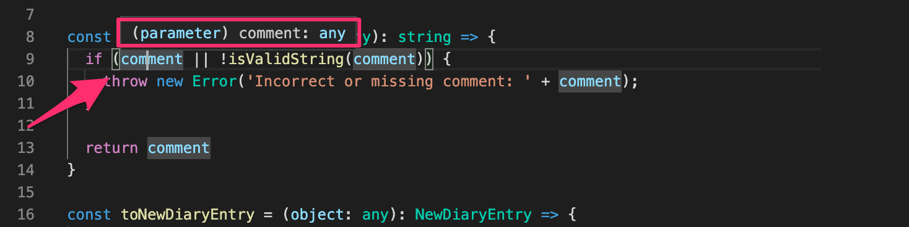
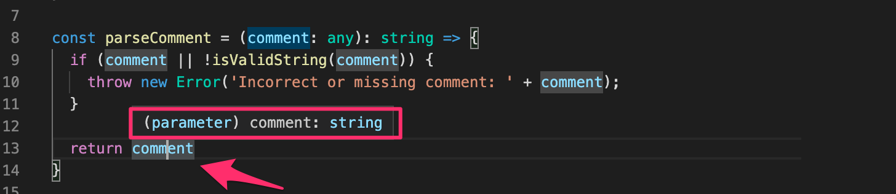

<div class="content">


<!-- Now that we have a basic understanding of how TypeScript works and how to create small projects with it, it's time to start creating something actually useful. We are now going to create a new project with a bit more realisting use cases in mind. -->
现在我们已经基本了解了TypeScript的工作原理以及如何使用它来创建小型项目，是时候开始创建一些真正有用的东西了。 我们现在要创建一个新的项目，其中包含一些更加实用的用例。


<!-- One major change from the previous part is that <i>we're not going to use ts-node anymore</i>. It is a handy tool and helps you get started, but in the long run it is advicable to use the official TypeScript compiler that comes with the <i>typescript</i> npm-package. The official compiler generates and packages JavaScript files from the .ts files so that the built <i>production version</i> won't contain any TypeScript code anymore. This is the exact outcome we are aiming for, since TypeScript itself is not executable by browsers or Node.  -->
与前一章节相比的一个主要变化是<i>我们不再使用 ts-node</i>。 这是一个方便的工具，可以帮助您入门，但是从长远来看，使用<i>typescript</i> npm-package 附带的官方TypeScript编译器是一个很好的选择。 官方编译器从 .ts文件生成和打包 JavaScript 文件。 这样，构建的<i>生产版本</i> 就不会再包含任何TypeScript代码了。 这正是我们想要的结果，因为TypeScript本身不能被浏览器或 Node 执行。

### Setting up the project
【搭建项目】

<!-- We will be creating a project for Ilari, who loves flying small planes but has a difficult time managing his flight history. He is quite the coder himself, so he doesn't necessarily need a user interface, but he'd like to use the software with HTTP-requests and retain the possibility to later add a web-based user interface to the application. -->
我们将为Ilari创建一个项目，他喜欢驾驶小型飞机，但很难管理自己的飞行历史。 他本身就是一个编码高手，所以他不一定需要用户界面，但他希望使用软件来处理 http 请求，并保留以后向应用添加基于 web 的用户界面的可能性。


<!-- Let's start by creating our first real project 'Ilari's flight diaries'. As usual run <i>npm init</i> and install the <i>typescript</i> package. -->
让我们开始创建我们的第一个真正的项目“伊拉里的飞行日记”。 像往常一样运行<i>npm init</i> 并安装<i>typescript</i> 包。


<!-- TypeScript's native <i>tsc</i> compiler can help us to initialize our project with the command <i>tsc --init</i>. -->
TypeScript的原生<i>tsc</i> 编译器可以帮助我们使用命令<i>tsc -- init</i> 初始化我们的项目。 

<!-- First we need to add the <i>tsc</i> command to the list of executable scripts in the package.json file (unless you have installed <i>typescript</i> globally ).  -->
首先，我们需要将<i>tsc</i> 命令添加到 package.json 文件中的可执行脚本列表中(除非您在全局范围内安装了<i>typescript</i>)。
<!-- Even if you have installed TypeScript globally, you should always include it as a dev-dependency in your project.  -->
即使您已经在全局范围内安装了 TypeScript，您也应该始终将其作为开发依赖项包含在项目中。

<!-- The npm srcipt for running <i>tsc</i> is set as follows: -->
运行<i>tsc</i> 的 npm srcipt 设置如下:

```json
{
  // ..
  "scripts": {
    "tsc": "tsc", // highlight-line
  },
  // ..
}
```

 

 <!--Often the bare <i>tsc</i> command is added to the scripts for other scripts to use, so it is common to see the <i>tsc</i> command set up within the project like this.-->
通常，只有<i>tsc</i> 命令被添加到脚本中供其他脚本使用，因此在项目中设置<i>tsc</i> 命令是很常见的。

 <!--Now we can initialise our tsconfig.json settings by running:-->
现在我们可以通过运行如下命令来初始化 tsconfig.json 设置:


```shell
 npm run tsc -- --init
```

 <!--**Notice** the extra -- before the actual argument! Arguments before the -- are interpreted for the command <i>npm</i> and ones after are for the command that is run throught the script.--> 
注意多余的部分---- 在实际的参数之前！ -- 之前的参数解释为命令<i>npm</i>，之后的参数解释为通过脚本运行的命令。


<!-- Running the script creates an <i>tsconfig.json</i> file, which contains a lengthy list of every configuration available to us. However only a few have not been commented out.  -->
运行这个脚本将创建一个<i>tsconfig.json</i> 文件，其中包含一个冗长的列表，列出了我们可以使用的所有配置。 然而，只有少数没有被注释掉。

<!-- Studying the initial <i>tsconfig.json</i> file might be useful for finding some configuration options you might need.  -->
研究初始的<i>tsconfig.json</i> 文件可能有助于找到您可能需要的一些配置选项。
<!-- It is also completely okay to keep the commented rows in the file just in case you might someday need to expand your configuration settings. -->
在文件中保留注释行也是完全可以的，以备将来需要扩展配置设置时使用。


<!-- The settings we want right now are the following: -->
我们现在需要的设置如下:

```json
{
  "compilerOptions": {
    "target": "ES6",
    "outDir": "./build/",
    "module": "commonjs",
    "strict": true,
    "noUnusedLocals": true,
    "noUnusedParameters": true,       
    "noImplicitReturns": true,
    "noFallthroughCasesInSwitch": true,
    "esModuleInterop": true
  }
}
```

<!-- Let's go through each configuration:  -->
让我们来看看每个配置:


<!-- The <i>target</i> configuration tells the compiler which ECMAScript version to use for the generated JavaScript. ES6 is supported by most browsers, and it is a good, pretty safe option. -->
<i>target</i> 配置告诉编译器为生成的 JavaScript 使用哪个 ECMAScript 版本。 大多数浏览器都支持 ES6，这是一个很好的、相当安全的选择。

<!--<i>outDir</i> tells where the compiled code should be placed.-->
<i>outDir</i> 告诉编译后的代码应该放在哪里。


<!--<i>module</i> tells the compiler we want to use <i>commonjs</i> modules in the compiled code. This means we can use _require_ instead of _import_, which is not supported in older Node.js versions such as the version 10.--> 
<i>module</i>告诉编译器我们要在编译的代码中使用 <i>commonjs</i>模块。 这意味着我们可以使用 require 而不是 import，这在旧的 Node.js 版本中是不被支持的，比如10版本。

<!--<i>strict</i> is actually a shorthand for multiple separate options:--> 
<i>strict</i> 实际上是多个独立选项的简写:

<!--<i>noImplicitAny, noImplicitThis, alwaysStrict, strictBindCallApply, strictNullChecks, strictFunctionTypes and strictPropertyInitialization</i>.-->
<i>noImplicitAny，noImplicitThis，alwaysStrict，strictBindCallApply，strictNullChecks，strictFunctionTypes 以及 strictPropertyInitialization</i>.
<!-- These guide our coding style to use the TypeScript features more strictly.  -->
这些指导我们的编码风格更严格地使用TypeScript的特性。
<!-- For us perhaps the most important is the already familiar [noImplicitAny](https://www.typescriptlang.org/en/tsconfig#noImplicitAny). It prevents implicitly setting type <i>any</i>, which can happen if you don't type the parameters of a function for example.  -->
对我们来说，最重要的可能是已经熟悉的[noImplicitAny](https://www.staging-typescript.org/tsconfig#noImplicitAny)。 它可以防止隐式设置类型<i>any</i>，例如，如果您不键入函数的参数，就可能发生警告。
<!-- Details of the rest of the configurations can be found from the [tsconfig documentation](https://www.typescriptlang.org/en/tsconfig#strict).  -->
其余配置的详细信息可以从[tsconfig 文档](https://www.staging-typescript.org/tsconfig#strict)中找到。
<!-- Using <i>strict</i> is suggested by the official documentation. -->
官方文件建议使用<i>strict</i>。


<!--<i>noUnusedLocals</i> prevents having unused local variables, and <i>noUnusedParameters</i> throws an error if a function has unused parameters.-->
使用<i>noUnusedLocals</i> 避免有未使用的局部变量，如果函数有未使用的参数，<i>noUnusedParameters</i> 将抛出错误。

<!--<i>noFallthroughCasesInSwitch</i> ensures that in a _switch case_ each case ends with a  _return_ or a _break_ statement.-->
<i>noFallthroughCasesInSwitch</i> 确保在_switch情况下，每个case都以一个 return 或 break 语句结束。

<!--<i>esModuleInterop</i> allows interoperability between commonJS and ES Modules, see more [in documentation](https://www.typescriptlang.org/en/tsconfig#esModuleInterop).-->
<i>esModuleInterop</i> 允许 commonJS 和 ES 模块之间的互操作性，详见文档中 [这部分](https://www.typescriptlang.org/en/tsconfig#esModuleInterop)。

<!-- Now that we have our preferred configuration set, let's continue by installing <i>express</i> and of course also <i>@types/express</i>. Since this is a real project, which is intended to be grown over time, we will use eslint from the very  beginning: -->
现在我们已经有了首选的配置集，让我们继续安装<i>express</i>，当然还有<i>@types/express</i>.。 由于这是一个真正的项目，并打算随着时间的推移而成长，我们将从一开始就使用 eslint:

```shell
npm install express
npm install --save-dev eslint @types/express @typescript-eslint/eslint-plugin @typescript-eslint/parser
```

<!-- Now our <i>package.json</i> should look something like this:  -->
现在我们的<i>package.json</i> 应该是这样的:

```json
{
  "name": "ilaris-flight-diaries",
  "version": "1.0.0",
  "description": "",
  "main": "index.ts",
  "scripts": {
    "tsc": "tsc",
    "test": "echo \"Error: no test specified\" && exit 1"
  },
  "author": "",
  "license": "ISC",
  "dependencies": {
    "express": "^4.17.1"
  },
  "devDependencies": {
    "@types/express": "^4.17.2",
    "@typescript-eslint/eslint-plugin": "^2.17.0",
    "@typescript-eslint/parser": "^2.17.0",
    "eslint": "^6.8.0",
    "typescript": "^3.7.5"
  }
}
```

<!-- We also create <i>.eslintrc</i> with the following content: -->
我们还使用如下内容创建 <i>.eslintrc</i> :

```json
{
  "extends": [
    "eslint:recommended",
    "plugin:@typescript-eslint/recommended",
    "plugin:@typescript-eslint/recommended-requiring-type-checking"
  ],
  "plugins": ["@typescript-eslint"],
  "env": {
    "browser": true,
    "es6": true
  },
  "rules": {
    "@typescript-eslint/semi": ["error"],
    "@typescript-eslint/explicit-function-return-type": 0,
    "@typescript-eslint/no-unused-vars": [
        "error", { "argsIgnorePattern": "^_" }
    ],
     "@typescript-eslint/no-explicit-any": 1,
    "no-case-declarations": 0
  },
  "parser": "@typescript-eslint/parser",
  "parserOptions": {
    "project": "./tsconfig.json"
  }
}
```

 

<!-- Now we just need to set up our development environment, and we are ready to start writing some serious code.  -->
现在我们只需要设置我们的开发环境，并且我们已经准备好开始编写一些重要的代码。

<!-- There are many different options for this. We could use the familiar <i>nodemon</i> with <i>ts-node</i>, but as we saw earlier, </i>ts-node-dev</i> does the exact same thing and we can continue using it. -->
这里有很多不同的选择。 我们可以在<i>ts-node</i> 中使用熟悉的<i>nodemon</i>，但是正如我们前面看到的，<i>ts-node-dev</i> 可以做完全相同的事情，我们也可以继续使用它。
<!-- So, let's install <i>ts-node-dev</i> -->
因此，让我们安装<i>ts-node-dev</i>

```shell
npm install --save-dev ts-node-dev
```

<!-- And we are ready to start writing some code after defining still a couple of more npm scripts: -->
在定义了几个 npm 脚本之后，我们准备开始编写一些代码:

```json
{
  // ...
  "scripts": {
    "tsc": "tsc",
    "dev": "ts-node-dev index.ts", // highlight-line
    "lint": "eslint --ext .ts ." // highlight-line
  },
  // ...
}
```


<!-- There is a lot of stuff to go through before you can start actual coding. When you are working with a real project, careful preparations support your development process a great deal. -->
在开始实际编码之前，还有很多事情要做。 当您正在处理一个真正的项目时，仔细的准备工作对您的开发过程提供了很大的支持。
<!-- Take the time to create a good setting for youself and your team so in the long run everything runs smoothly.  -->
花点时间为你自己和你的团队创造一个良好的环境，这样从长远来看，一切都会顺利进行。

### Let there be code
【让我们编码吧】


<!-- Now we can finally start coding! As always, we start by creating a a ping-endpoint, just to make sure everything is working.  -->
现在我们终于可以开始编码了！ 像往常一样，我们首先创建一个 ping 端点，以确保一切正常工作。

<!-- The contents of the <i>index.ts</i> file: -->
<i>index.ts</i> 文件的内容:

```js
import express from 'express';
const app = express();
app.use(express.json());

const PORT = 3000;

app.get('/ping', (_req, res) => { 
  console.log('someone pinged here');
  res.send('pong');
});
  
app.listen(PORT, () => {
  console.log(`Server running on port ${PORT}`);
});
```


<!-- Now if we run the app with <i>npm run dev</i> we can verify that a request to http://localhost:3000/ping gives a response <i>pong</i>, so our configuration is set! -->
现在，如果我们用<i>npm run dev</i>  来运行这个应用，我们就可以验证一个请求是否会响应<i>pong</i>，这样一来我们的配置就设置好了！


<!-- When starting the app with <i>npm run dev</i>, it runs in development mode.  -->
当用<i>npm 运行 dev</i> 启动应用时，它会在开发模式下运行。

<!-- The development mode is not suitable at all when we later operate the app in production.  -->
这种开发模式在以后的生产操作中根本不适用。


<!-- Let's try to create a <i>production build</i> by running the TypeScript compiler. Since we have defined the <i>outdir</i> in our tsconfig.json, there's really nothing else to do but run the script <i>npm run tsc</i>. -->
让我们通过运行 TypeScript 编译器来尝试创建<i>生产 build</i>。 因为我们已经在 tsconfig.json 中定义了<i>outdir</i>，所以除了运行脚本<i>npm run tsc</i> 之外真的没有什么可做的了。

<!-- Just like magic a native runnable JavaScript production build of the express backend is created into the directory <i>build</i>.   -->
就像魔术一样，express 后端的原生可运行的 JavaScript 生产构建被创建到<i>build</i> 目录中。


<!-- Currently, if we run eslint it will also interpret the files in the <i>build</i> directory. We don't want that, since the code there is compiler generated. We can prevent this by creating a  <i>.eslintignore</i> file  which lists the content we want eslint to ignore, just like we do with git and <i>gitignore</i>. -->
目前，如果我们运行 eslint，它也会解释<i>build</i> 目录中的文件。但我们不希望这样，因为那里的代码是编译器生成的。 我们可以通过创建一个 <i>.eslintignore</i> 文件来避免这个问题，其中列出了我们希望 eslint 忽略的内容，就像我们对 git 和<i>gitignore</i> 所做的那样。


<!-- Let's add an npm script for running the application in production mode: -->
让我们添加一个 npm 脚本，用于在生产模式下运行应用:

```json
{
  // ...
  "scripts": {
    "tsc": "tsc",
    "dev": "ts-node-dev index.ts",
    "lint": "eslint --ext .ts .",
    "start": "node build/index.js" // highlight-line
  },
  // ...
}
```

<!-- When we run app with <i>npm start</i> we can verify that also the production build works -->
当我们运行带有<i>npm start</i> 的 app 时，我们可以验证生产构建也能正常工作


<!-- Now we have a minimal working pipeline for developing our project.  -->
现在我们有一个最小的工作管道来开发我们的项目。

<!-- With the help of our compiler and eslint it also ensures that a good code quality is maintained. With this base we can actually start creating an app that we could later on deploy into a production environment. -->
在我们的编译器和 eslint 的帮助下，它还确保了良好的代码质量得到了维护。 有了这个基础，我们实际上可以开始创建一个应用，稍后可以将它部署到生产环境中。

</div>


<div class="tasks">


### Exercises 9.8.-9.9.
<!-- **Before you start the exercises** -->
**在开始练习之前 **

<!-- For this set of exercises you will be developing a backend for an existing project called <i>Patientor</i> which is a simple medical record application for doctors who handle diagnoses and basic health information of their patients. -->
对于这套练习，你将开发一个现有项目的后端称为<i>Patientor</i>，这是一个为医生开发的简单的医疗记录应用，医生处理诊断和他们的病人的基本健康信息。

<!-- The [frontend](https://github.com/fullstack-hy2020/patientor) has already been built by outsider experts and your task is to create a backend to support the existing code. -->
[前端](https://github.com/fullstack-hy2020/patientor)已经由外部专家构建，您的任务是创建一个后端来支持现有的代码。

#### 9.8: Patientor backend, 步骤1
<!-- Initialise project that will be used by the frontend. Configure eslint and tsconfig with the same configurations that are used in the material. Define an endpoint that responses to HTTP GET requests to route <i>/ping</i>.    -->
初始化将使用的前端项目。 使用教材中使用的相同配置配置 eslint 和 tsconfig。 定义一个端点，该端点响应 HTTP GET 请求路由<i>/ping</i>。

<!-- The project should be runnable with npm scripts both in development mode and as compiled code in production mode. -->
项目应该在开发模式和生产模式下以编译代码的形式通过npm 脚本运行。

#### 9.9: Patientor backend, 步骤2
<!-- Fork and clone the project [patientor](https://github.com/fullstack-hy2020/patientor). Start the project with the help of the README file. You should be able to use the frontend without a functioning backend. -->
Fork和clone项目[patientor](https://github.com/fullstack-hy2020/patientor)。 在 README 文件的帮助下启动项目。 您应该能够使用没有后端功能的前端。 


<!-- Ensure that backend answers to the ping request that <i>frontend</i> has made on startup. Check developer tool to make sure it really works:  -->
确保后端应答前端在启动时发出的 ping 请求。 检查开发者工具，确保它真正工作良好:


<!-- You might also want to have a look at the tab <i>console</i>. If something fails [第3章](/part3) of the course shows how the problem can be solved. -->
您可能还需要查看<i>console</i> 的选项卡。 如果有什么东西失败了，[课程的第三章节](/zh/part3)  说明了如何解决这个问题。

</div>


<div class="content">


### Implementing the functionality
【实现功能】

<!-- Finally we are ready to start writing some code. -->
最后，我们准备开始编写一些代码。

<!-- Let's start from the basics. Ilari wants to be able to keep track of his experiences on his flight journeys.  -->
让我们从最基本的开始。伊拉里希望能够记录下他在旅途中的经历。


<!-- He wants to be able to save </i>diary entries</i> which contain: -->
他希望能够保存 <i>日记条目</i>，其中包含:

<!-- - The date of the entry -->
- 日期
<!-- - Weather conditions (good, windy, rainy or stormy) -->
- 天气状况(良好、多风、多雨或暴风雨)
<!-- - Visibility (good, ok or poor) -->
- 能见度(良好、正常或欠佳)
<!-- - Free text detailing the experience -->
- 自由的文本记录的详细介绍经验


<!-- We have obtained some sample data, which we will use as a base to build on. -->
我们已经获得了一些样本数据，我们将以此为基础进行构建。
<!-- The data is saved in json format, and can be found from [here](https://github.com/fullstack-hy2020/misc/blob/master/diaryentries.json). -->
这些数据以 json 格式保存，可以在 [here](https://github.com/fullstack-hy2020/misc/blob/master/diaryentries.json).中找到

<!-- The data looks like the following -->
数据如下所示

```json
[
  {
    "id": 1,
    "date": "2017-01-01",
    "weather": "rainy",
    "visibility": "poor",
    "comment": "Pretty scary flight, I'm glad I'm alive"
  },
  {
    "id": 2,
    "date": "2017-04-01",
    "weather": "sunny",
    "visibility": "good",
    "comment": "Everything went better than expected, I'm learning much"
  },  
  // ...
]
```

<!-- Let's start by creating an endpoint which returns all flight diary entries.  -->
让我们首先创建一个端点，返回所有的飞行日志条目。


<!-- First we need to make some decisions on how to structure our source code. It is better to place all source code under <i>src</i> directory, so source code is not mixed with configuration files.  -->
首先，我们需要对如何构造源代码做出一些决定。 最好将所有源代码放在<i>src</i> 目录下，这样源代码就不会与配置文件混在一起。
<!-- We will move <i>index.ts</i> there and make the necessary changes to the npm scripts.  -->
我们将把<i>index.ts</i> 移动到那里，并对 npm 脚本进行必要的更改。


<!-- We will place all [routers](/zh/part4/从后端结构到测试入门), modules which are responsible for handling a set of specific resources such as <i>diaries</i>, under the directory <i>src/routes</i>.  -->
我们将把所有的路由 [routers](/zh/part4/从后端结构到测试入门) ，这些模块负责处理一组特定的资源，如<i>diaries</i>，放在<i>src/routes</i>目录下。
<!-- This is a bit different than what we did  in [第4章](/zh/part4), where we used directory <i>src/controllers</i>. -->
这与我们在 [第4章](/zh/part4),中使用的目录<i>src/controllers</i> 有些不同。


<!-- The router taking care of all diary endpoints is in <i>src/routes/diaries.ts</i> and looks like this: -->
处理所有日志接口的路由位于<i>src/routes/diaries.ts</i> 中，如下所示:

```js
import express from 'express';

const router = express.Router();

router.get('/', (_req, res) => {
  res.send('Fetching all diaries!');
})

router.post('/', (_req, res) => {
  res.send('Saving a diary!');
})

export default router;
```

<!-- We'll route all requests to prefix <i>/api/diaries</i> to that specific router in _index.ts_ -->
我们将把所有请求路由到 index.ts 中的特定路由的前缀 <i>/api/diaries</i>


```js
import express from 'express';
import diaryRouter from './routes/diaries'; // highlight-line
const app = express();
app.use(express.json());

const PORT = 3000;

app.get('/ping', (_req, res) => {
  console.log('someone pinged here');
  res.send('pong');
});

app.use('/api/diaries', diaryRouter); // highlight-line

  
app.listen(PORT, () => {
    console.log(`Server running on port ${PORT}`);
});
```


<!-- And now if we make a HTTP GET request to http://localhost:3000/api/diaries we should see the message <i>Fetching all diaries!</i>. -->
现在，如果我们向 HTTP://localhost:3000/api/diaries 发出 HTTP GET 请求，我们会看到消息<i>Fetching all diaries!</i>。


<!-- Next wee need to start serving the seed data (found [here](https://github.com/fullstack-hy2020/misc/blob/master/diaryentries.json)) from the app. We will fetch the data and save it to <i>data/diaries.json</i>. -->
接下来我们需要开始提供应用的种子数据(点击 [here](https://github.com/fullstack-hy2020/misc/blob/master/diaryentries.json))。 我们将获取数据并将其保存到<i>data/diaries.json</i>中。


<!-- We won't be writing the code for the actual data manipulations on the router. We will create a <i>service</i> which takes care of the data manipulation instead.  -->
我们不会在路由上编写实际数据操作的代码。 我们将创建一个<i>service</i> 来处理数据操作。
<!-- It is quite common practice to separate the "business logic" from the router code into its own modules, which are quite often called <i>services</i>.  -->
将“业务逻辑”从路由代码分离到自己的模块(通常称为<i>services</i>)是非常常见的做法。
<!-- The name service originates from [Domain driven design](https://en.wikipedia.org/wiki/Domain-driven_design) and was made popular by the [Spring](https://spring.io/) framework. -->
名称service服务起源于[域名驱动设计](https://en.wikipedia.org/wiki/Domain-driven_design) ，并由[Spring](https://Spring.io/ 设计)框架流行起来。


<!-- Let's create a <i>src/services</i> directory and  -->
让我们创建一个<i>src/services</i> 目录并
<!-- place the <i>diaryService.ts</i> file in it. -->
将<i>diaryService.ts</i> 文件放入其中。
<!-- The file contains two functions for fetching and saving diary entries: -->
该文件包含两个用于获取和保存日记条目的函数:


```js
import diaryData from '../../data/diaries.json'

const getEntries = () => {
  return diaryData;
};

const addEntry = () => {
  return null;
};

export default {
  getEntries,
  addEntry
};
```

<!-- But something is not right -->
但有些地方不对劲


<!-- The hint says we might want to use <i>resolveJsonModule</i>. Let's add it to our tsconfig:   -->
提示说我们可能想使用<i>resolveJsonModule</i>，让我们把它加入到我们的tsconfig:

```json
{
  "compilerOptions": {
    "target": "ES6",
    "outDir": "./build/", 
    "module": "commonjs",  
    "strict": true,
    "noUnusedLocals": true,
    "noUnusedParameters": true,       
    "noImplicitReturns": true,
    "noFallthroughCasesInSwitch": true,
    "esModuleInterop": true,
    "resolveJsonModule": true // highlight-line
  }
}
```


<!-- And our problem is solved. -->
我们的问题就解决了。


> <!--**NB**: For some reason VSCode tends to complain it cannot find the file <i>../../data/diaries.json</i> from the service despite the file existing. That is a bug in the editor, and goes away when the editor is restarted.-->
出于某种原因，VSCode 倾向于产生警告它无法找到文件 <i>../../data/diaries.json</i>。 尽管文件已经存在， 这是编辑器中的一个 bug，并且在重新启动编辑器时消失。


<!-- Earlier we saw how the compiler can decide the type of a variable by the value it is assigned. -->
前面我们看到编译器如何通过赋值来决定变量的类型。
<!-- Similarly the compiler can interpret large data sets consisting of objects and arrays. -->
类似地，编译器可以解释由对象和数组组成的大型数据集。
<!-- Due to this the compiler can actually warn us if we try to do something suspicious with the json data we are handling.  -->
正因为如此，如果我们试图对正在处理的 json 数据做一些可疑的事情，编译器实际上可以警告我们。
<!-- For example if we are handling an array containing objects of specific type, and we try to add an object which does not have all the fields the other objects have, or has type conflicts (for example a number where there should be a string), the compiler can give us a warning.  -->
例如，如果我们正在处理一个包含特定类型对象的数组，并且我们试图添加一个没有其他对象所有字段的对象，或者存在类型冲突(例如一个数字，其中应该有一个字符串) ，编译器可以给我们一个警告。


<!-- Even though the compiler is pretty good at making sure we don't do anything unwanted, it is safer to define the types for the data ourselves. -->
尽管编译器非常擅长确保我们不会做任何不需要的事情，但是我们自己定义数据的类型会更安全。


<!-- Currently we have a basic working TypeScript express app, but there are barely any actual <i>typings</i> in the code.  -->
目前我们有一个基本的可工作TypeScript express应用，但在代码中几乎没有任何实际的<i>类型</i>。

<!-- Since we know what type of data should be accepted for the weather and visibility fields, there is no reason for us not to include their types to the code. -->
因为我们知道天气和能见度字段应该接受哪种类型的数据，所以我们没有理由不在代码中包含它们的类型。


<!-- Let's create a file for our types, <i>types.ts</i>, where we'll define all our types for this project.  -->
让我们为我们的类型创建一个文件<i>types.ts</i> ，我们将在其中定义这个项目的所有类型。


<!-- First, let's type the <i>Weather</i> and <i>Visibility</i> values using a [union type](https://www.typescriptlang.org/docs/handbook/advanced-types.html#union-types) of the allowed strings: -->
首先，让我们使用允许的字符串的[union type](https://www.typescriptlang.org/docs/handbook/advanced-types.html#union-types)键入<i>Weather</i> 和<i>Visibility</i> 值:

```js
export type Weather = 'sunny' | 'rainy' | 'cloudy' | 'windy' | 'stormy';

export type Visibility = 'great' | 'good' | 'ok' | 'poor';
```


<!-- And from there we can continue by creating a DiaryEntry type, which will be an [interface](http://www.typescriptlang.org/docs/handbook/interfaces.html): -->
从这里我们可以继续创建一个 DiaryEntry 类型，它将是一个[接口](http://www.typescriptlang.org/docs/handbook/interfaces.html) :

```js
export interface DiaryEntry {
  id: number;
  date: string;
  weather: Weather;
  visibility: Visibility;
  comment: string;
} 
```

<!-- We can now try to type our imported json:  -->
我们现在可以尝试输入导入的 json:

```js
import diaryData from '../../data/diaries.json';

import { DiaryEntry } from '../types'; // highlight-line

const diaries: Array<DiaryEntry> = diaryData; // highlight-line

const getEntries = (): Array<DiaryEntry> => { // highlight-line
  return diaries; // highlight-line
};

const addEntry = () => {
  return null;
};

export default {
  getEntries,
  addEntry
};
```

<!-- But since the json already has its values declared, assigning a type for the data set results in an error: -->
但是由于 json 已经声明了它的值，为数据集分配一个类型会导致一个错误:


<!-- The end of the error message reveals the problem: the <i>weather</i> fields are incompatible. In <i>DiaryEntry</i> we specified that its type is  <i>Weather</i>, but  -->
错误消息的结尾揭示了问题所在:<i>weather</i> 字段不兼容。 在<i>DiaryEntry</i> 中，我们指定它的类型为<i>Weather</i>，但是
<!-- TypeScript compiler had inferred its type to be <i>string</i>. -->
TypeScript 编译器将其类型推断为<i>string</i>。 


<!-- We can fix the problem by doing [type assertion](http://www.typescriptlang.org/docs/handbook/basic-types.html#type-assertions). This should be done only if we are certain we know what we are doing.  -->
我们可以通过执行[类型断言](http://www.typescriptlang.org/docs/handbook/basic-types.html#type-assertions)来修复这个问题，这是一个。 只有在我们确信自己知道自己在做什么的情况下，才能这样做。

<!-- If we assert the type of the variable <i>diaryData</i> to be <i>DiaryEntry</i> with the keyword <i>as</i>, everything should work: -->
如果我们将变量<i>diaryData</i> 的类型断言为<i>DiaryEntry</i>，并使用关键字<i>as</i>，那么一切应该正常:

```js
import diaryData from '../../data/entries.json'

import { Weather, Visibility, DiaryEntry } from '../types'

const diaries: Array<DiaryEntry> = diaryData as Array<DiaryEntry>; // highlight-line

const getEntries = (): Array<DiaryEntry> => {
  return diaries;
} 

const addEntry = () => {
  return null
} 

export default {
  getEntries,
  addEntry
};
```


<!-- We should never use type assertion unless there is no other way to proceed, as there is always the danger we assert an unfit type to an object and cause a nasty runtime error. -->
除非没有其他方法，否则我们永远不应该使用类型断言，因为我们总是有可能断言对象的类型不合适，从而导致严重的运行时错误。

<!-- While the compiler trusts you to know what you are doing when using <i>as</i>, doing this we are not using the full power of TypeScript but relying on the coder to secure the code.  -->
虽然编译器相信您知道在使用<i>as</i> 时要做什么，但是这样做并不是使用TypeScript的全部功能，而是依赖于程序员来保护代码。


<!-- In our case we could change how we export our data so we can type it within the data file.  -->
在本例中，我们可以更改导出数据的方式，以便在数据文件中键入数据。
<!-- Since we cannot use typings in a JSON-file, we should convert the json-file to a ts-file which exports the typed data like so: -->
因为我们不能在 json 文件中使用类型，所以我们应该将 json 文件转换为一个 ts 文件，该文件导出输入的数据，如下所示:

```js
import { DiaryEntry } from "../src/types";

const diaryEntries: Array<DiaryEntry> = [
  {
      "id": 1,
      "date": "2017-01-01",
      "weather": "rainy",
      "visibility": "poor",
      "comment": "Pretty scary flight, I'm glad I'm alive"
  },
  // ...
];

export default diaryEntries;
```


<!-- Now when we import the array, the compiler interprets it correctly and the <i>weather</i> and <i>visibility</i> fields are understood right: -->
现在，当我们导入数组时，编译器正确地解释了它，并且正确地理解了<i>weather</i> 和<i>visibility</i> 字段:


```js
import diaries from '../../data/diaries'; // highlight-line

import { DiaryEntry } from '../types';

const getEntries = (): Array<DiaryEntry> => {
  return diaries;
} 

const addEntry = () => {
  return null;
} 

export default {
  getEntries,
  addEntry
};
```


<!-- Note, that if we want to be able to save entries without a certain field,  e.g. <i>comment</i>, we could set the type of the field as [optional](http://www.typescriptlang.org/docs/handbook/interfaces.html#optional-properties) by adding <i>?</i> to the type declaration: -->
注意，如果我们希望能够保存没有特定字段的条目，例如<i>comment</i>，我们可以通过添加<i> ？</i>来将字段的类型设置为[可选的](http://www.typescriptlang.org/docs/handbook/interfaces.html#optional-properties) 类型声明:

```js
export interface DiaryEntry {
  id: number;
  date: string;
  weather: Weather;
  visibility: Visibility;
  comment?: string;
} 
```

### Node and JSON modules

<!-- It is important to take note of a problem that may arise when using the tsconfig [resolveJsonModule](https://www.typescriptlang.org/en/tsconfig#resolveJsonModule) option: -->

在使用 tsconfig 时， 值得注意的一个地方是， 使用 [resolveJsonModule](https://www.typescriptlang.org/en/tsconfig#resolveJsonModule) 这个选项，它可能产生一些问题。

```json
{
  "compilerOptions": {
    // ...
    "resolveJsonModule": true // highlight-line
  }
}
```

<!-- According to the node documentation for [file modules](https://nodejs.org/api/modules.html#modules_file_modules),
node will try to resolve modules in order of extensions: -->

根据node 文档中对 [file modules](https://nodejs.org/api/modules.html#modules_file_modules) 的描述，node 会按扩展项的顺序进行解析：

```shell
 ["js", "json", "node"]
```

<!-- In addition to that, by default, <i>ts-node</i> and <i>ts-node-dev</i> extend the list of possible node module extensions to: -->
另外，默认情况下<i>ts-node</i> 和 <i>ts-node-dev</i> 增加了可能的 node 模块扩展：

```shell
 ["js", "json", "node", "ts", "tsx"]
```

<!-- > **NB**: The validity of <i>.js</i>, <i>.json</i> and <i>.node</i> files as modules in Typescript depend on environment configuration, including <i>tsconfig</i> options such as <i>allowJs</i> and <i>resolveJsonModule</i>. -->

> **注意**：Typescript中对 <i>.js</i>, <i>.json</i> and <i>.node</i> 文件作为模块的验证，取决于环境配置，包括<i>tsconfig</i> 选项例如 <i>allowJs</i> 和 <i>resolveJsonModule</i>

<!-- Consider a flat folder structure containing files: -->
假设一个文件夹结构如下：

```shell
  ├── myModule.json
  └── myModule.ts
```

<!-- In typescript, with the <i>resolveJsonModule</i> option set to true, the file <i>myModule.json</i> becomes a valid node module. Now, imagine a scenario where we wish to take the file <i>myModule.ts</i> into use: -->

在typescript 中， 由于<i>resolveJsonModule</i>  选项设为true， 文件<i>myModule.json</i> 成为了一个合法的node 模块，现在假设一个场景，比如我们希望将<i>myModule.ts</i>文件引入使用。

```js
import myModule from "./myModule";
```

<!-- Looking closely at the order of node module extensions: -->
仔细看一下node 模块的扩展顺序

```shell
 ["js", "json", "node", "ts", "tsx"]
```

<!-- We notice that the <i>.json</i> file extension takes precedence over <i>.ts</i> and so <i>myModule.json</i> will be imported and not <i>myModule.ts</i>. -->

我们注意到 <i>.json</i> 文件的扩展优先于<i>.ts</i>， 所以 <i>myModule.json</i>  会被引入，而不是我们希望的 <i>myModule.ts</i>。

<!-- In order to avoid time eating bugs, it is recommended that within a flat directory, each file with a valid node module extension has a unique filename. -->
为了避免这种潜在的bug， 建议在一个文件夹中，每个文件，如果想作为一个合法的node模块扩展，都给一个唯一的文件名。

### Utility Types
【工具类型】
<!-- Sometimes we might want to use a specific modification of a type.  -->
有时我们可能希望使用某种类型的特定修改。

<!-- For example, consider a page for listing some data, some of which is sensitive and some of which is non-sensitive. -->
例如，考虑一个用于列出某些数据的页面，其中一些数据是敏感的，而另一些则是非敏感的。

<!-- We might want to be sure that no sensitive data is used or displayed. We could <i>pick</i> the fields of a type we allow to be used to enforce this.  -->
我们可能希望确保没有任何敏感数据被使用或显示。 我们可以选择我们允许用来强制做这种隐藏的类型的字段。

<!-- We can do that by using the utility type [Pick](http://www.typescriptlang.org/docs/handbook/utility-types.html#picktk). -->
我们可以通过使用工具类型[Pick](http://www.typescriptlang.org/docs/handbook/utility-types.html#picktk)来做到这一点。

<!-- In our project we should consider that Ilari might want to create a listing of all his diary entries <i>excluding</i> the comment field, since during a very scary flight he might end up writing something he wouldn't necessarily want to show anyone else.  -->
在我们的项目中，我们应该考虑伊拉里可能想要创建一个他所有日记条目的列表，但不包括评论栏，因为在一次非常可怕的飞行中，他可能最终会写一些不一定想给其他人看的东西。


<!-- The [Pick](http://www.typescriptlang.org/docs/handbook/utility-types.html#picktk) utility type allows us to choose which fields of an existing type we want to use.  -->
[Pick](http://www.typescriptlang.org/docs/handbook/utility-types.html#picktk)工具类型允许我们选择要使用的现有类型的字段。

<!-- Pick can be used to either construct a completely new type, or to inform a function what it should return on runtime.  -->
Pick 既可以用来构造一个全新的类型，也可以用来告诉函数在运行时应该返回什么。 

<!-- Utility types are a special kinds of type tools, but they can be used just like regular types. -->
工具类型是一种特殊的类型工具，但是它们可以像普通类型一样使用。


<!-- In our case, in order to create a "censored" version of the  <i>DiaryEntry</i> for public displays, we can use Pick in the function declaration: -->
在我们的例子中，为了创建用于公开显示的“审查”版本的<i>DiaryEntry</i>，我们可以在函数声明中使用 Pick:

```js
const getNonSensitiveEntries = 
  (): Array<Pick<DiaryEntry, 'id' | 'date' | 'weather' | 'visibility'>> => {
    // ...
  }
```


<!-- and the compiler would expect the function to return an array of values of the modified DiaryEntry type, which include only the four selected fields.  -->
编译器期望函数返回修改后的 DiaryEntry 类型的值数组，其中只包含选定的四个字段。


<!-- Since [Pick](http://www.typescriptlang.org/docs/handbook/utility-types.html#picktk) requires the type it modifies to be given as a [type variable](http://www.typescriptlang.org/docs/handbook/generics.html#working-with-generic-type-variables), just like Array does, we now have two nested type variables and the syntax is starting to look a bit odd.  -->
由于[Pick](http://www.typescriptlang.org/docs/handbook/utility-types.html#picktk)要求它修改的类型作为[type 变量](http://www.typescriptlang.org/docs/handbook/generics.html#working-with-generic-type-variables)给出，就像 Array 一样，我们现在有两个嵌套的类型变量，语法开始看起来有点奇怪。

<!-- We can improve the code's readability by using the [alternative](http://www.typescriptlang.org/docs/handbook/basic-types.html#array) array syntax: -->
我们可以通过使用[alternative](http://www.typescriptlang.org/docs/handbook/basic-types.html#array)数组语法来提高代码的可读性:

```js
const getNonSensitiveEntries = 
  (): Pick<DiaryEntry, 'id' | 'date' | 'weather' | 'visibility'>[] => {
    // ...
  }
```


<!-- In this case we want to exclude only one field,  -->
在这种情况下，我们只想排除一个字段,

<!-- so even better would be to use the [Omit](http://www.typescriptlang.org/docs/handbook/utility-types.html#omittk) utility type, which we can use to declare which fields to exclude: -->
所以更好的方法是使用[Omit](http://www.typescriptlang.org/docs/handbook/utility-types.html#omittk)工具类型，我们可以使用它来声明要排除哪些字段:

```js
const getNonSensitiveEntries = (): Omit<DiaryEntry, 'comment'>[] => {
  // ...
}
```
 <!--Another way would be to declare a completely new type for the <i>NonSensitiveDiaryEntry</i>: -->
另一种方法是为<i>NonSensitiveDiaryEntry</i>声明一个全新的类型:

```js
export type NonSensitiveDiaryEntry = Omit<DiaryEntry, 'comment'>;
```

<!-- The code now becames -->
代码现在可以使用了

```js
import diaries from '../../data/diaries';
import { NonSensitiveDiaryEntry, DiaryEntry } from '../types'; // highlight-line

const getEntries = (): DiaryEntry[] => {
  return diaries;
};

const getNonSensitiveEntries = (): NonSensitiveDiaryEntry[] => { // highlight-line
  return diaries;
};

const addEntry = () => {
  return null;
};

export default {
  getEntries,
  addEntry,
  getNonSensitiveEntries // highlight-line
};
```


<!-- One thing in our application is a cause for concern. In the <i>getNonSensitiveEntries</i> we are returning the complete diary entries, and <i>no error is given</i> despite typing! -->
在我们的应用中有一件事值得关注。 在<i>getNonSensitiveEntries</i> 中，尽管有类型，我们还是返回完整的日记条目，而且没有给出任何error！


<!-- This happens because [TypeScript only checks](http://www.typescriptlang.org/docs/handbook/type-compatibility.html) whether we have all of the required fields or not, but excess fields are not prohibited. In our case this means that is is <i>not prohibited</i> to return an object of type <i>DiaryEntry[]</i>, but if we were to try to access the <i>comment</i> field, it would not be possible because we would be accessing a field that TypeScript is unaware of even though it exists. -->
发生这种情况是因为[TypeScript只检查](http://www.typescriptlang.org/docs/handbook/type-compatibility.html)我们是否有所有必需的字段，但是多余的字段是不被禁止的。 在我们的例子中，这意味着<i>没有禁止</i> 返回<i>DiaryEntry []</i> 类型的对象，但是如果我们试图访问<i>comment</i> 字段，这将是不可能的，因为我们将访问一个 TypeScript 不知道的字段，即使它存在。

<!-- Unfortunately this can lead to unwanted behaviour if you are not aware of what you are doing; the situation is valid as long as TypeScript is concerned, but you are most likely allowing use that is not wanted.  -->
不幸的是，如果你不知道自己在做什么，这可能会导致不必要的行为; 只要 TypeScript 关注，这种情况就是有效的，但是你很可能允许不需要的使用。

<!-- If we were now to return all of the diaryEntries from the <i>getNonSensitiveEntries</i> function to the <i>frontend</i>, we would actually be leaking the unwanted fields to the requesting browser even thought our types seem to imply otherwise! -->
如果我们现在将所有来自<i>getNonSensitiveEntries</i> 函数的 diaryentry 返回到<i>前端</i>，我们实际上将把不需要的字段泄露给请求的浏览器，即使我们的类型看起来不是这样！


<!-- Because TypeScript doesn't modify the actual data but only its type, we need to exclude the fields ourselves: -->
因为 TypeScript 不修改实际的数据，只修改其类型，我们需要自己排除这些字段:

```js
import diaries from '../../data/entries.js'

import { NonSensitiveDiaryEntry, DiaryEntry } from '../types'

const getEntries = () : DiaryEntry[] => {
  return diaries
} 

// highlight-start
const getNonSensitiveEntries = (): NonSensitiveDiaryEntry [] => {
  return diaries.map(({ id, date, weather, visibility }) => ({
    id,
    date,
    weather,
    visibility,
  }));
};
// highlight-end

const addDiary = () => {
  return []
} 

export default {
  getEntries,
  getNonSensitiveEntries,
  addDiary
}
```

<!-- If we now would try to return this data with the basic <i>DiaryEntry</i> type, i.e. if we would type the function as follows  -->
如果我们现在尝试用基本的<i>DiaryEntry</i> 类型返回这个数据，也就是说如果我们按照下面的方式输入函数


```js
const getNonSensitiveEntries = () : DiaryEntry[] => {
```

<!-- we would get the following error: -->
我们会得到如下错误:


<!-- Again the last line of the error message is the most helpful one. Let's undo this undesider modification. -->
同样，错误消息的最后一行是最有帮助的。


<!-- Utility types include many handy tools, and it is definetely worth it to take some time to study [the documentation](https://www.typescriptlang.org/docs/handbook/utility-types.html). -->
工具类型包括许多方便的工具，花些时间研究[文档](https://www.typescriptlang.org/docs/handbook/Utility-types.html)当然是值得的。

<!-- Finally, we can complete the route which returns all diary entries: -->
最后，我们可以完成返回所有日记条目的路线:

```js
import express from 'express';
import diaryService from '../services/diaryService';  // highlight-line

const router = express.Router();

router.get('/', (_req, res) => {
  res.send(diaryService.getNonSensitiveEntries()); // highlight-line
});

router.post('/', (_req, res) => {
    res.send('Saving a diary!');
});

export default router;
```

<!-- The response is what we expect it to be -->
这种反应正是我们所期望的


</div>


<div class="tasks">


### Exercises 9.10.-9.11.
<!-- Similarly to Ilari's flight service, we do not use a real database in our app but instead use hardcoded data, that is in the files [diagnoses.json](https://github.com/fullstack-hy2020/misc/blob/master/diagnoses.json) and [patients.json](https://github.com/fullstack-hy2020/misc/blob/master/patients.json). Get the files and store those into a directory called <i>data</i> under your project. All data modification can be done in runtime memory, so during this part it is <i>not necessary to write to a file</i>. -->

与 Ilari 的飞行服务类似，我们在应用中不使用真正的数据库，而是使用硬编码的数据，这些数据存在于文件[diagnoses.json](https://github.com/fullstack-hy2020/misc/blob/master/diagnoses.json)和[patients.json](https://github.com/fullstack-hy2020/misc/blob/master/patients.json)中。 获取文件并将其存储到项目下名为<i>data</i> 的目录中。 所有的数据修改都可以在运行时内存中完成，因此在这一章节中<i>不需要写入文件</i>。

#### 9.10: Patientor backend, 步骤3
<!-- Create a type <i>Diagnose</i> and use it to create endpoint <i>/api/diagnoses</i> for fetching all diagnoses with HTTP GET. -->
创建一个类型<i>Diagnose</i>，并使用它创建端点 <i>/api/diagnoses</i> ，以便使用 HTTP GET 获取所有诊断。

<!-- Structure your code properly by using meaningfully named directories and files. -->
通过使用有意义的命名目录和文件来合理地构造代码。

<!-- **Note** that <i>diagnoses</i> may or may not contain the field <i>latin</i>. You might want to use [optional properties](https://www.typescriptlang.org/docs/handbook/interfaces.html#optional-properties) in the type definition. -->
**注意** <i>诊断</i> 可能包含也可能不包含字段<i>latin</i>。 你可能想在类型定义中使用[可选属性](https://www.typescriptlang.org/docs/handbook/interfaces.html#optional-properties 属性)。

#### 9.11: Patientor backend, 步骤4


<!-- Create data type <i>Patient</i> and set up a GET-endpoint <i>/api/patients</i> that returns all patients to the frontend excluding field <i>ssn</i>. Use a [utility type](https://www.typescriptlang.org/docs/handbook/utility-types.html) to make sure you are selecting and returning only the wanted fields. -->
创建数据类型<i>Patient</i>，并设置一个 GET-端点 <i>/api/patients</i>，将所有患者返回到排除字段<i>ssn</i> 的前端。 使用[工具类型](https://www.typescriptlang.org/docs/handbook/utility-types.html)来确保只选择和返回想要的字段。

<!-- In this exercise you may assume that field <i>gender</i> has type <i>string</i>. -->
在这个练习中，您可以假设字段<i>gender</i> 具有类型<i>string</i>。

<!-- Try the endpoint with browser and ensure that <i>ssn</i> is not included in the response: -->
使用浏览器尝试端点，并确保响应中不包含<i>ssn</i>:


<!-- After creating the endpoint, ensure that the <i>frontend</i> shows the list of patients: -->
创建端点后，确保<i>前端</i> 显示患者列表:


</div>


<div class="content">


### Preventing an accidental undefined result
【防止意外的未定义结果】

<!-- Let's extend the backend to support fetching one specific entry with a HTTP GET request to route <i>api/diaries/:id</i>. -->
让我们通过 HTTP GET 请求将后端扩展为路由 <i>api/diaries/:id</i>来支持获取一个特定条目。

<!-- The DiaryService needs to be extended with  <i>findById</i>-function: -->
Diaryservice 需要通过<i>findById</i>-函数 进行扩展: 

```js
// ...

// highlight-start
const findById = (id: number): DiaryEntry => {
  const entry = diaries.find(d => d.id === id);
  return entry;
};
// highlight-end

export default {
  getEntries,
  getNonSensitiveEntries,
  addDiary,
  findById // highlight-line
}
```


<!-- But once again, a new problem emerges: -->
但是，又一次出现了一个新问题:


<!-- The issue is, that there is no guarantee that an entry with the specified id can be found.  -->
问题是，不能保证能够找到具有指定 id 的条目。

<!-- It is good that we are made aware of this potential problem already at compile phase. Without TypeScript we would not be warned about this problem, and in the worst case scenration we could have ended up returning an <i>undefined</i> object instead of informing the user about the specified entry not being found.  -->
很高兴我们在编译阶段就意识到了这个潜在的问题。 没有 TypeScript，我们不会被警告这个问题，在最坏的情况下，我们可能会返回一个<i>undefined</i> 对象，而不是通知用户指定的条目没有被找到。


<!-- First of all in cases like this we need to decide what the <i>return value</i> should be if an object is not found, and how the case should be handled.  -->
首先，在这种情况下，我们需要决定如果没有找到对象，<i>返回值</i> 应该是什么，以及如何处理这种情况。
<!-- The <i>find</i> method of an array returns <i>undefined</i> if the object is not found, and this is actually fine with us.  -->
如果没有找到对象，数组的<i>find</i> 方法将返回<i>undefined</i>，这对我们来说实际上没有问题。
<!-- We can solve our problem by typing the return value as follows -->
我们可以通过键入下面的返回值来解决这个问题

```js
const findById = (id: number): DiaryEntry | undefined => { // highlight-line
  const entry = diaries.find(d => d.id === id);
  return entry;
}
```

<!-- The route handler is the following -->
路由处理程序如下

```js
import express from 'express';
import diaryService from '../services/diaryService'

router.get('/:id', (req, res) => {
  const diary = diaryService.findById(Number(req.params.id));

  if (diary) {
    res.send(diary);
  } else {
    res.sendStatus(404);
  }
})

// ...

export default router;
```

### Adding a new diary
【添加新日记】


<!-- Let's start building the HTTP POST endpoint for adding new flight diary entries. -->
让我们开始构建用于添加新飞行日志条目的HTTP POST 端点。
<!-- The new entries should have the same type as the existing data. -->
新条目应该与现有数据具有相同的类型。

<!-- The code handling of the response looks as follows -->
响应的代码处理如下所示

```js
router.post('/', (req, res) => {
  const { date, weather, visibility, comment } = req.body;
  const newDiaryEntry = diaryService.addEntry(
    date,
    weather,
    visibility,
    comment,
  );
  res.json(newDiaryEntry);
});
```

<!-- corresponding method in <i>diaryService</i> looks like this -->
<i>diaryService</i> 中的对应方法如下所示

```js
import {
  NonSensitiveDiaryEntry,   
  DiaryEntry,
  Visibility, // highlight-line
   Weather // highlight-line
} from '../types';

const addDiary = (
    date: string, weather: Weather, visibility: Visibility, comment: string
  ): DiaryEntry => {
    
  const newDiaryEntry = {
    id: Math.max(...diaries.map(d => d.id)) + 1,
    date,
    weather,
    visibility,
    comment,
  }
  
  diaries.push(newDiaryEntry);
  return newDiaryEntry;
};
```


<!-- As you can see, the <i>addDiary</i> function is becoming quite hard to read now that we have all the fields as separate parameters.  -->
正如您所看到的，<i>addDiary</i> 函数变得非常难以阅读，因为我们已经将所有字段作为单独的参数。
<!-- It might be better to just send the data as an object to the function: -->
将数据作为对象发送到函数可能会更好:

```js
router.post('/', (req, res) => {
  const { date, weather, visibility, comment } = req.body;
  const newDiaryEntry = diaryService.addDiary({ // highlight-line
    date,
    weather,
    visibility,
    comment,
  }); // highlight-line
  res.json(newDiaryEntry);
})
```


<!-- But wait, what is the type of this object? It is not exactly a <i>DiaryEntry</i>, since it is still missing the <i>id</i> field. -->
但是，等等，这个对象的类型是什么？ 它不完全是<i>DiaryEntry</i>，因为它仍然缺少<i>id</i> 字段。
<!-- It could be useful to create a new type, <i>NewDiaryEntry</i>, for a not yet saved entry.  -->
对于尚未保存的条目，创建一个新类型(<i>NewDiaryEntry</i>)可能很有用。
<!-- Let's create that in <i>types.ts</i> using the existing <i>DiaryEntry</i> type and the [Omit](http://www.typescriptlang.org/docs/handbook/utility-types.html#omittk) utility type: -->
让我们使用现有的<i>DiaryEntry</i> 类型和[Omit](http://www.typescriptlang.org/docs/handbook/utility-types.html#omittk)工具类型在<i>types.ts</i> 中创建它:

```js
export type NewDiaryEntry = Omit<DiaryEntry, 'id'>;
```


<!-- Now we can use the new type in our DiaryService,  -->
现在我们可以在我们的 DiaryService 中使用新的类型,
<!-- and destructure the new entry object when creating an entry to be saved: -->
在创建要保存的条目时，重新构造新的条目对象:

```js
import { NewDiaryEntry, NonSensitiveDiaryEntry, DiaryEntry } from '../types'; // highlight-line

// ...

const addDiary = ( entry: NewDiaryEntry ): DiaryEntry => {  // highlight-line
  const newDiaryEntry = {
    id: Math.max(...diaries.map(d => d.id)) + 1,
    ...entry // highlight-line
  };

  diaries.push(newDiaryEntry);
  return newDiaryEntry;
};
```

<!-- Now the code looks much cleaner!  -->
现在代码看起来干净多了！

<!-- In order to parse the incoming data we must have the  <i>json</i> middleware configured:  -->
为了解析传入的数据，我们必须配置<i>json</i> 中间件:


``` js
import express from 'express';
import diaryRouter from './routes/diaries'; 
const app = express();
app.use(express.json()); // highlight-line

const PORT = 3000;

app.use('/api/diaries', diaryRouter);

app.listen(PORT, () => {
  console.log(`Server running on port ${PORT}`);
});
```


<!-- Now the application is ready to receive HTTP POST requests for new diary entries of the correct type! -->
现在应用已经准备好接收 HTTP POST 请求，以获得正确类型的新日记条目！

### Proofing requests
【校对请求】

<!-- There are plenty of things which can go wrong when we accept data from outside sources. -->
当我们接受来自外部来源的数据时，有很多可能会出错的情况。

<!-- Applications rarely work completely on their own, and we are forced to live with the fact that data from sources outside of our system cannot be fully trusted. -->
应用很少能够完全独立工作，我们不得不接受这样一个事实，即来自系统外部的数据不能完全受到信任。
<!-- When we receive data from an outside source, there is no way it can be already typed when we receive it. We need to make decisions on how to handle the uncertainty that comes with this. -->
当我们从外部来源接收数据时，我们不可能在接收数据时就已经指定了数据类型。 我们需要决定如何处理随之而来的不确定性。


<!-- Express handles parsing the request body by asserting the type [any](http://www.typescriptlang.org/docs/handbook/basic-types.html#any) to all the body's fields. -->
Express 通过断言类型[any](http://www.typescriptlang.org/docs/handbook/basic-types.html#any)到主体的所有字段来处理请求主体的解析。 

<!-- In our case this is not apparent in the editor at all, but if we start looking at the variables more closely and hover over any of them, we can see that each of them is indeed type [any](http://www.typescriptlang.org/docs/handbook/basic-types.html#any). The editor does not complain in any way when we pass this data to the <i>addDiary</i>  function as parameters: -->
在我们的例子中，这在编辑器中是不明显的，但是如果我们开始更仔细地查看这些变量，并且将鼠标悬停在其中的任何一个上面，我们可以看到它们中的每一个确实都是[any](http://www.typescriptlang.org/docs/handbook/basic-types.html#any)类型。 当我们将这些数据作为参数传递给<i>addDiary</i> 函数时，编辑器不会以任何方式产生警告:


<!-- The value of type [any](http://www.typescriptlang.org/docs/handbook/basic-types.html#an) can be assigned to <i>any</i> type of variable since it <i>might be</i> the wanted type. It's definetely not safe to trust this, so  -->
 [any](http://www.typescriptlang.org/docs/handbook/basic-types.html#an)类型的值可以分配给<i>any</i> 类型的变量，因为它可能是<i>任何</i>想要的类型。 相信这个是绝对不安全的，所以
<!-- always check the incoming values (regardless of whether we are using TypeScript or not). -->
总是检查输入值(不管我们是否使用TypeScript)。


<!-- We could just add simple <i>exists</i> and <i>is-value-valid</i> checks to the function defining the route, it is better to write the parsing and validation logic to a separate file <i>utils.ts</i>. -->
我们可以只向定义路由的函数添加简单的<i>exists</i> 和<i>is-value-valid</i> 检查，最好将解析和验证逻辑写到一个单独的文件<i>utils.ts</i> 中。


<!-- We need to define a function <i>toNewDiaryEntry</i> that receives the request body as a parameter and returns a properly typed <i>NewDiaryEntry</i> object.  -->
我们需要定义一个函数<i>toNewDiaryEntry</i>，该函数接收请求正文作为参数，并返回一个键入正确的<i>NewDiaryEntry</i> 对象。

<!-- The route definition uses the function as follows -->
路由定义使用如下函数

```js
import toNewDiaryEntry from '../utils'; // highlight-line

// ...

router.post('/', (req, res) => {
  try {
    const newDiaryEntry = toNewDiaryEntry(req.body); // highlight-line
      
    const addedEntry = diaryService.addDiary(newDiaryEntry); // highlight-line
    res.json(addedEntry);
  } catch (e) {
    res.status(400).send(e.message); 
  }
})
```


<!-- Since we are now making secure code and trying to ensure that we are getting exactly the data we want from the requests, we should get started with partsing and validating each field we are expecting to receive. -->
因为我们现在正在编写安全的代码，并试图确保我们正在从请求中获得我们想要的数据，所以我们应该开始分配和验证我们期望接收的每个字段。

<!-- The skeleton of the function <i>toNewDiaryEntry</i> looks like the following: -->
这个函数的框架如下:

```js
import { NewDiaryEntry } from './types';

const toNewDiaryEntry = (object): NewDiaryEntry => {
  const newEntry: NewDiaryEntry = {
    // ...
  }
  
  return newEntry;
} 

export default toNewDiaryEntry;
```


<!-- The function should parse each field and make sure that the return value is exactly of type <i>NewDiaryEntry</i>. This means we should check each field separately. -->
该函数应该解析每个字段，并确保返回值完全是<i>NewDiaryEntry</i> 类型。 这意味着我们应该分别检查每个字段。


<!-- Once again we have a type issue: what is the <i>object</i> type? Since the <i>object</i> is in fact the body of a request, Express has typed it as <i>any</i>.  -->
我们再次遇到类型问题:<i>object</i> 类型是什么？ 因为<i>object</i> 实际上是请求的主体，所以 Express 将其输入为<i>any</i>。
<!-- Since the idea of this function is to map fields of unknown type to fields of the correct type and check whether they are defined as expected, this might be the rare case where we actually <i>want to allow the <i>any</i> type</i>. -->
由于这个函数的思想是将未知类型的字段映射到正确类型的字段，并检查它们是否按预期定义，这可能是我们实际上希望允许<i>any</i> 类型的罕见情况。

<!-- However if we type the object as <i>any</i>, eslint gives us a complaint: -->
然而，如果我们像<i>any</i> 一样输入对象，eslint 会给我们一个产生警告:


<!-- This is due to the eslint-rule  [no-explicit-any](https://github.com/typescript-eslint/typescript-eslint/blob/master/packages/eslint-plugin/docs/rules/no-explicit-any.md) which prevents us from explicitly setting type to be <i>any</i>.  -->
这是由于 eslint-规则 [no-explicit-any](https://github.com/typescript-eslint/typescript-eslint/blob/master/packages/eslint-plugin/docs/rules/no-explicit-any.md)阻止我们显式地将 type 设置为<i>any</i>。
<!-- In general this is a good rule, and undesired just in this particular file. We can allow using <i>any</i> in this file by disabling the eslint-rule in the file. This happens by adding the following line to the file: -->
一般来说，这是一个很好的规则，只是在这个特定的文件中不受欢迎。 我们可以通过禁用文件中的 eslint-rule 来允许在该文件中使用<i>any</i>。 这是通过在文件中添加如下行来实现的:

```js
/* eslint-disable @typescript-eslint/no-explicit-any */
```

<!-- Let us start creating the parsers for each of the fields of <i>object</i>.  -->
让我们开始为<i>object</i> 的每个字段创建解析器。

<!-- To validate the <i>comment</i> field we need to check that it exists, and to ensure that it is of the type <i>string</i>. -->
为了验证<i>comment</i> 字段，我们需要检查它是否存在，并确保它是<i>string</i> 类型。

<!-- The function should look something like this: -->
这个函数应该是这样的:

```js
const parseComment = (comment: any): string => {
  if (!comment || !isString(comment)) {
    throw new Error('Incorrect or missing comment: ' + comment);
  }

  return comment;
}
```

<!-- The function gets a parameter of type <i>any</i> and returns it as type <i>string</i> if it exists and is of the right type. -->
该函数获取类型为<i>any</i> 的参数，如果存在并且类型正确，则返回类型为<i>string</i> 的参数。

<!-- The string validation function looks like this -->
字符串验证函数如下所示

```js
const isString = (text: any): text is string => {
  return typeof text === 'string' || text instanceof String;
};
```


<!-- The function is a so called [type guard](https://www.typescriptlang.org/docs/handbook/advanced-types.html#user-defined-type-guards). That means it is a function which returns a boolean <i>and</i> which has a <i>type predicate</i> as the return type. In our case the type predicate is -->
这个函数是一个所谓的[类型保护](https://www.typescriptlang.org/docs/handbook/advanced-types.html#user-defined-type-guards)。 这意味着它是一个返回布尔型的函数，它的返回类型是<i>类型谓词</i>。 在我们的示例中，类型谓词是

```js
text is string
```

<!-- The general form of a type predicate is _parameterName is Type_ where the _parameterName_ is the name of the function parameter and _Type_ is the targeted type. -->
类型谓词的一般形式是  _parameterName is Type_，其中 parameterName 是函数参数的名称，Type 是目标类型。

<!-- If the type guard function returns true, the TypeScript compiler knows that the tested variable has the type that was defined in the type predicate.  -->
如果类型保护函数返回 true，则 TypeScript 编译器知道被测变量具有在类型谓词中定义的类型。

<!-- Before the type guard is called, the actual type of the variable <i>comment</i> is not known: -->
在调用类型保护之前，不知道变量<i>comment</i> 的实际类型:



<!-- But after the call, if the code proceeds past the exception (that is the type guard returned true), compiler knows that <i>comment</i> is of the type <i>string</i>: -->
但是在调用之后，如果代码继续执行异常(即返回的类型保护为 true) ，编译器就会知道<i>comment</i> 的类型是<i>string</i>:



<!-- Why do we have two conditions in the string type guard? -->
为什么我们在字符串类型保护中有两个条件？

```js
const isString = (text: any): text is string => {
  return typeof text === 'string' || text instanceof String; // highlight-line
}
```

<!-- would it not be enough to write the guard like this -->
这样写守卫还不够吗

```js
const isString = (text: any): text is string => {
  return typeof text === 'string';
}
```


<!-- Most likely the simpler form is good enough for all practical purposes.  -->
最有可能的是，更简单的形式就足以满足所有的实际用途。
<!-- However, if we want to be absolutely sure, both conditions are needed.  -->
然而，如果我们想要绝对确定，这两个条件都是必需的。
<!-- There are two different ways to create string objects in JavaScript which both work a bit differently with respect to the <i>typeof</i> and <i>instanceof</i> operators: -->
在 JavaScript 中有两种不同的方法来创建字符串对象，这两种方法对于<i>typeof</i> 和<i>instanceof</i> 操作符的工作方式都有所不同:

```js
const a = "I'm a string primitive";
const b = new String("I'm a String Object");
typeof a; --> returns 'string'
typeof b; --> returns 'object'
a instanceof String; --> returns false
b instanceof String; --> returns true
```


<!-- However, it is unlikely that anyone would create a string with a constructor function. -->
但是，任何人都不可能创建带有构造函数的字符串。
<!-- Most likely the simpler version of the type guard would be just fine.  -->
最有可能的是类型保护的简单版本就可以了。


<!-- Next, let's consider the <i>date</i> field.  -->
接下来，让我们考虑<i>date</i> 字段。
<!-- Parsing and validating the date object is pretty similar to what we did with comments.  -->
解析和验证 date 对象与我们对评论所做的非常相似。
<!-- Since TypeScript doesn't really know a type for a date, we need to treat is as a <i>string</i>. -->
由于 TypeScript 实际上并不知道某个日期的类型，因此我们需要将其视为<i>string</i>。
<!-- We should however still use JavaScript level validation to check whether the date format is acceptable. -->
然而，我们仍然应该使用 JavaScript 级别验证来检查日期格式是否可以接受。

<!-- We will add the following functions -->
我们将添加如下函数

```js
const isDate = (date: string): boolean => {
  return Boolean(Date.parse(date));
};

const parseDate = (date: any): string => {
  if (!date || !isString(date) || !isDate(date)) {
      throw new Error('Incorrect or missing date: ' + date);
  }
  return date;
};
```


<!-- The code is really nothing special. The only thing is, that we can't use a type guard here since a date in this case is only considered to be a <i>string</i>. -->
这些代码真的没什么特别的。 唯一的问题是，我们不能在这里使用类型保护，因为在这种情况下，日期只被认为是<i>string</i>。
<!-- Note, that even though the <i>parseDate</i> function accepts the <i>date</i> variable as any, after we check the type with <i>isString</i> its type is set as string, which is why we can give the variable to the <i>isDate</i> function requiring a sting without any problems. -->
注意，即使<i>parseDate</i> 函数接受<i>date</i> 变量，在我们用<i>isString</i> 检查类型之后，它的类型被设置为字符串，这就是为什么我们可以将变量赋给<i>isDate</i> 函数，而不会有任何问题。

<!-- Finally we are ready to move on to the last two types, Weather and Visibility. -->
最后，我们准备讨论最后两个类型，天气和能见度。

<!-- We would like the validation and parsing to work as follows: -->
我们希望验证和解析工作如下:

```js
const parseWeather = (weather: any): Weather => {
  if (!weather || !isString(weather) || !isWeather(weather)) {
      throw new Error('Incorrect or missing weather: ' + weather)
  } 
  return weather;
};
```


<!-- The question is, how can we validate that the string is of a specific form? -->
问题是，我们如何验证字符串是否具有特定的形式？
<!-- One possible way to write the type guard would be this: -->
编写类型保护的一种可能的方法是:

```js
const isWeather = (str: string): str is Weather => {
  return ['sunny', 'rainy', 'cloudy', 'stormy' ].includes(str);
};
```


<!-- This would work just fine, but the problem is that the list of possible weathers does not necessarily stay in sync with the type definitions if the type is altered.  -->
这样就可以了，但问题是，如果类型被改变了，那么可能的天气列表并不一定与类型定义保持同步。
<!-- This is most certainly not good, since we would like to have just one source for all possible weather types. -->
这当然是不好的，因为我们希望只有单一来源的所有可能的天气类型。


<!-- In our case a better solution would be to improve the actual Weather type. Instead of a type alias we should use the TypeScript [enum](https://www.typescriptlang.org/docs/handbook/enums.html), which allows us to use the actual values in our code in runtime, not only in the compilation phase. -->
在我们的例子中，一个更好的解决方案是改进实际的 Weather 类型。 代替类型别名，我们应该使用 TypeScript [enum](https://www.typescriptlang.org/docs/handbook/enums.html) ，它允许我们在运行时使用代码中的实际值，而不仅仅是在编译阶段。

<!-- Let us redefine the type <i>Weather</i> as follows:  -->
让我们将类型<i>Weather</i> 重新定义如下:

```js
export enum Weather {
  Sunny = 'sunny',
  Rainy = 'rainy',
  Cloudy = 'cloudy',
  Stormy = 'stormy', 
  Windy = 'windy',
}
```


<!-- Now we can check that a string is one of the accepted values, and the type guard can be written like this: -->
现在我们可以检查字符串是否是可接受的值之一，类型保护可以这样写:

```js
const isWeather = (param: any): param is Weather => {
  return Object.values(Weather).includes(param);
};
```


<!-- One thing to notice here is that we have changed the parameter type to <i>any</i>. If it would be string, the <i>includes</i> check would not compile. This makes sense also if you consider the resuability of the function. Allowing <i>any</i> as a parameter, the function can be used with confidence knowing that whatever we might feed to it, the function always tells us whether the variable is a valid weather or not.  -->
这里需要注意的一点是，我们将参数类型改为<i>any</i>。 如果它是字符串，那么<i>includes</i> 检查将不能编译。 如果考虑函数的可重用性，这也是有意义的。 允许 <i>any</i> 作为参数，这个函数可以无顾虑地使用，因为我们知道无论我们给它提供什么，函数总是告诉我们变量是否是一个有效的天气。

<!-- The function <i>parseWeather</i> can be simplified a bit -->
<i>parseWeather</i> 函数可以简化一些

```js
const parseWeather = (weather: any): Weather => {
  if (!weather || !isWeather(weather)) { // highlight-line
      throw new Error('Incorrect or missing weather: ' + weather);
  } 
  return weather;
};
```


<!-- One issue arises after these changes. Our data does not conform to our types anymore: -->
在这些变化之后出现了一个问题，我们的数据不再符合我们的类型:


<!-- This is because we cannot just assume a string is an enum. -->
这是因为我们不能仅仅假设字符串是枚举。


<!-- We can fix this by mapping the initial data elements to <i>DiaryEntry</i> type with the <i>toNewDiaryEntry</i> function: -->
我们可以通过使用<i>toNewDiaryEntry</i> 函数将初始数据元素映射到<i>DiaryEntry</i> 类型来解决这个问题:


```js
import { DiaryEntry } from "../src/types";
import toNewDiaryEntry from "../src/utils";

const data = [
  {
      "id": 1,
      "date": "2017-01-01",
      "weather": "rainy",
      "visibility": "poor",
      "comment": "Pretty scary flight, I'm glad I'm alive"
  },
  // ...
]

const diaryEntries: DiaryEntry [] = data.map(obj => {
  const object = toNewDiaryEntry(obj) as DiaryEntry
  object.id = obj.id
  return object
})

export default diaryEntries
```
Note that since <i>toNewDiaryEntry</i> returns an object of the type <i>NewDiaryEntry</i> we need to assert it to be <i>DiaryEntry</i> with the [as](http://www.typescriptlang.org/docs/handbook/basic-types.html#type-assertions) operator.
注意，由于<i>toNewDiaryEntry</i> 返回类型为<i>NewDiaryEntry</i> 的对象，我们需要用[as](http://www.typescriptlang.org/docs/handbook/basic-types.html#type-assertions)操作符断言它是<i>DiaryEntry</i>。


<!-- Enums are usually used when there is a set of predetermined values which are not expected to change in the future. Usually enums are used for much tighter unchanging values (for example weekdays, months, directions) but since they offer us a great way to validate our incoming values we might as well use them in our case. -->
当有一组预先确定的数值预期在将来不会发生变化时，通常使用枚举。 通常枚举用于更严格的不变值(例如，工作日、月份、方向) ，但是由于它们为我们提供了一个很好的方法来验证输入的值，我们不妨在我们的例子中使用它们。

<!-- We still need to give the same treatment to <i>visibility</i>. The enum looks following -->
我们仍然需要对<i>可见性</i> 给予同样的处理

```js
export enum Visibility {
  Great = 'great',
  Good = 'good',
  Ok = 'ok',
  Poor = 'poor', 
}
```

<!-- The type guard and the parser are below -->
下面是类型保护和解析器

```js
const isVisibility = (param: any): param is Visibility => {
  return Object.values(Visibility).includes(param);
};

const parseVisibility = (visibility: any): Visibility => {
  if (!visibility || !isVisibility(visibility)) {
      throw new Error('Incorrect or missing visibility: ' + visibility);
  } 
  return visibility;
};
```

<!-- And finally we can finalize the  <i>toNewDiaryEntry</i> function that takes care of validating and parsing the fields of the post data:  -->
最后，我们可以完成<i>toNewDiaryEntry</i> 函数，该函数负责验证和解析 post 数据的字段:

```js
const toNewDiaryEntry = (object: any): NewDiaryEntry => {
  return {
    date: parseDate(object.date),
    comment: parseComment(object.comment),
    weather: parseWeather(object.weather),
    visibility: parseVisibility(object.visibility)
  };
};
```

<!-- The first version of our flight diary application is now completed!  -->
我们的飞行日志应用的第一个版本现在已经完成！

<!-- If we now try to create a new diary entry with invalid or missing fields we are getting an appropriate error message -->
如果我们现在尝试创建一个包含无效或缺少字段的新日记条目，我们将得到一个适当的错误消息


</div>


<div class="tasks">


### Exercises 9.12.-9.13.


#### 9.12: Patientor backend, 步骤5


<!-- Create a POST-endpoint <i>/api/patients</i> for adding patients. Ensure that you can add patients also from the frontend. -->
创建一个 POST-endpoint <i>/api/patients</i> 用于添加患者。

#### 9.13: Patientor backend, 步骤6
<!-- Set up safe parsing, validation and type guards to the POST <i>/api/patients</i> request.  -->
为 POST <i>/api/patients</i>请求设置安全的解析、验证和类型保护。

<!-- Refactor the <i>Gender</i> field to use an [enum](http://www.typescriptlang.org/docs/handbook/enums.html) type. -->
重构<i>Gender</i> 字段以使用[枚举](http://www.typescriptlang.org/docs/handbook/enums.html)类型。

</div>

