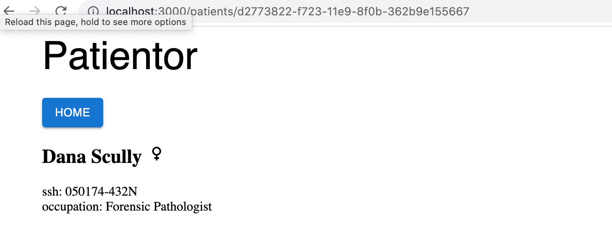
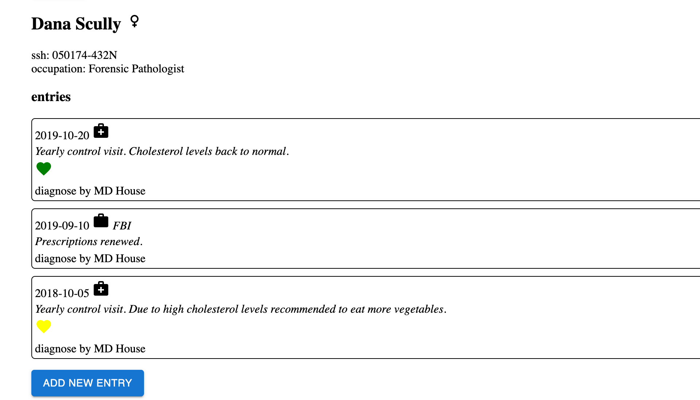

<div class="content">

<!-- Before we start delving into how you can use TypeScript with React, we should first have a look at what we want to achieve. When everything works as it should, TypeScript will help us catch the following errors:-->
 在我们开始深入研究如何在React中使用TypeScript之前，我们首先应该看一下我们想要实现什么。当一切工作正常时，TypeScript将帮助我们捕捉以下错误。

<!-- - Trying to pass an extra/unwanted prop to a component-->
 - 试图向组件传递一个额外/不需要的prop
<!-- - Forgetting to pass a required prop to a component-->
 - 忘记向组件传递一个必要的prop
<!-- - Passing a prop of a wrong type to a component-->
 - 传递错误类型的prop给一个组件


<!-- If we make any of these errors, TypeScript can help us catch them in our editor right away.-->
 如果我们犯了这些错误，TypeScript可以帮助我们立即在编辑器中发现它们。
<!-- If we didn't use TypeScript, we would have to catch these errors later during testing.-->
 如果我们不使用TypeScript，我们将不得不在以后的测试中抓住这些错误。
<!-- We might be forced to do some tedious debugging to find the cause of the errors.-->
我们可能会被迫做一些繁琐的调试来找到错误的原因。

<!-- That's enough reasoning for now. Let's start getting our hands dirty!-->
现在的推理已经足够了。让我们开始动手吧!

### Create React App with TypeScript

<!-- We can use [create-react-app](https://create-react-app.dev) to create a TypeScript app by adding a-->
 我们可以使用[create-react-app](https://create-react-app.dev)来创建一个TypeScript应用，在其中添加一个
<i>template</i> argument to the initialisation script. So in order to create a TypeScript Create React App, run the following command:

```shell
npx create-react-app my-app --template typescript
```

<!-- After running the command, you should have a complete basic react app which uses TypeScript.-->
 运行该命令后，你应该有一个完整的使用TypeScript的基本react应用。
<!-- You can start the app by running <i>npm start</i> in the application's root.-->
你可以通过在应用的根目录下运行<i>npm start</i>来启动该应用。

<!-- If you take a look at the files and folders, you'll notice that the app is not that different from-->
 如果你看一下文件和文件夹，你会注意到这个应用与使用纯JavaScript的应用没有什么不同
<!-- one using pure JavaScript. The only differences are that the <i>.js</i> and <i>.jsx</i> files are now  <i>.ts</i> and <i>.tsx</i> files, they contain some type annotations, and the root directory contains a <i>tsconfig.json</i> file.-->
一个使用纯JavaScript的应用。唯一的区别是<i>.js</i>和<i>.jsx</i>文件现在是<i>.ts</i>和<i>.tsx</i>文件，它们包含一些类型注释，并且根目录包含一个<i>tsconfig.json</i>文件。

<!-- Now, let's take a look at the <i>tsconfig.json</i> file that has been created for us:-->
 现在，让我们看一下已经为我们创建的<i>tsconfig.json</i>文件。

```js
{
  "compilerOptions": {
    "target": "es5",
    "lib": [
      "dom",
      "dom.iterable",
      "esnext"
    ],
    "allowJs": true,
    "skipLibCheck": true,
    "esModuleInterop": true,
    "allowSyntheticDefaultImports": true,
    "strict": true,
    "forceConsistentCasingInFileNames": true,
    "noFallthroughCasesInSwitch": true,
    "module": "esnext",
    "moduleResolution": "node",
    "resolveJsonModule": true,
    "isolatedModules": true,
    "noEmit": true,
    "jsx": "react-jsx"
  },
  "include": [
    "src"
  ]
}
```

<!-- Options have now key [lib](https://www.typescriptlang.org/tsconfig#lib) that includes eg. types of browser API's to the project.-->
 选项现在已经键入了[lib](https://www.typescriptlang.org/tsconfig#lib)，其中包括例如浏览器API's类型的项目。

<!-- Everything else should be more or less fine except that, at the moment, the configuration allows compiling JavaScript files, because <i>allowJs</i> is set to <i>true</i>.-->
 除了目前配置允许编译JavaScript文件外，其他一切都应该差不多了，因为<i>allowJs</i>被设置为<i>true</i>。
<!-- That would be fine if you need to mix TypeScript and JavaScript (e.g. if you are in the process of transforming a JavaScript project into TypeScript or something like that), but we want to create a pure TypeScript app, so let's change that configuration to  <i>false</i>.-->
 如果你需要混合使用TypeScript和JavaScript（例如，如果你正在将一个JavaScript项目转化为TypeScript或类似的东西），那会很好，但我们想创建一个纯粹的TypeScript应用，所以让我们把这个配置改为<i>false</i>。

<!-- In our previous project, we used eslint to help us enforce coding style, and we'll do the same with this app. We do not need to install any dependencies, since create-react-app has taken care of that already.-->
 在我们之前的项目中，我们使用eslint来帮助我们执行编码风格，我们在这个应用中也会这样做。我们不需要安装任何依赖项，因为create-react-app已经处理好了。

<!-- We configure eslint in <i>.eslintrc</i> with the following settings:-->
 我们在<i>.eslintrc</i>中配置eslint，设置如下。

```js
{
  "env": {
    "browser": true,
    "es6": true,
    "jest": true
  },
  "extends": [
    "eslint:recommended",
    "plugin:react/recommended",
    "plugin:@typescript-eslint/recommended"
  ],
  "plugins": ["react", "@typescript-eslint"],
  "settings": {
    "react": {
      "pragma": "React",
      "version": "detect"
    }
  },
  "rules": {
    "@typescript-eslint/explicit-function-return-type": 0,
    "@typescript-eslint/explicit-module-boundary-types": 0,
    "react/react-in-jsx-scope": 0
  }
}
```

<!-- Since the return type of basically all React components is <i>JSX.Element</i> or <i>null</i>, we have loosened the default linting rules up a bit by disabling the rules [explicit-function-return-type](https://github.com/typescript-eslint/typescript-eslint/blob/master/packages/eslint-plugin/docs/rules/explicit-function-return-type.md) and [explicit-module-boundary-types](https://github.com/typescript-eslint/typescript-eslint/blob/master/packages/eslint-plugin/docs/rules/explicit-module-boundary-types.md).-->
 由于基本上所有React组件的返回类型都是<i>JSX.Element</i>或<i>null</i>，我们通过禁用[explicit-function-return-type](https://github.com/typescript-eslint/typescript-eslint/blob/master/packages/eslint-plugin/docs/rules/explicit-function-return-type.md)和[explicit-module-boundary-types](https://github.com/typescript-eslint/typescript-eslint/blob/master/packages/eslint-plugin/docs/rules/explicit-module-boundary-types.md)的规则，将默认的linting规则放宽一点。
<!-- Now we don't need to explicitly state our function return types everywhere. We will also disable [react/react-in-jsx-scope](https://github.com/yannickcr/eslint-plugin-react/blob/master/docs/rules/react-in-jsx-scope.md) since importing React is no more needed in every file.-->
 现在我们不需要到处明确说明我们的函数返回类型。我们也将禁用[react/react-in-jsx-scope](https://github.com/yannickcr/eslint-plugin-react/blob/master/docs/rules/react-in-jsx-scope.md)，因为不再需要在每个文件中导入React了。

<!-- Next, we need to get our linting script to parse <i>*.tsx </i> files, which are the TypeScript equivalent of react's JSX files.-->
 接下来，我们需要让我们的linting脚本解析<i>*.tsx</i>文件，这是相当于react's JSX文件的TypeScript。
<!-- We can do that by altering our lint command in <i>.package.json</i> to the following:-->
 我们可以通过改变<i>.package.json</i>中的lint命令来做到这一点。

```json
{
  // ...
    "scripts": {
    "start": "react-scripts start",
    "build": "react-scripts build",
    "test": "react-scripts test",
    "eject": "react-scripts eject",
    "lint": "eslint './src/**/*.{ts,tsx}'" // highlight-line
  },
  // ...
}
```

<!-- If you are using Windows, you may need to use double quotes for the linting path: `"lint": "eslint \"./src/**/*.{ts,tsx}\""`.-->
 如果你使用的是Windows，你可能需要为linting路径使用双引号。`"lint":"eslint \"./src/**/*.{ts,tsx}\""`.
### React components with TypeScript

<!-- Let us consider the following JavaScript React example:-->
 让我们考虑下面这个JavaScript React的例子。

```jsx
import React from "react";
import ReactDOM from 'react-dom';
import PropTypes from "prop-types";

const Welcome = props => {
  return <h1>Hello, {props.name}</h1>;
};

Welcome.propTypes = {
  name: PropTypes.string
};

const element = <Welcome name="Sara" />;
ReactDOM.render(element, document.getElementById("root"));
```

<!-- In this example, we have a component called <i>Welcome</i> to which we pass a <i>name</i> as a prop. It then renders the name to the screen.  We know that the <i>name</i> should be a string, and we use the [prop-types](https://www.npmjs.com/package/prop-types) package introduced in [part 5](/en/part5/props_children_and_proptypes#prop-types) to receive hints about the desired types of a component's props and warnings about invalid prop types.-->
 在这个例子中，我们有一个叫做<i>Welcome</i>的组件，我们把一个<i>name</i>作为prop传给它。然后它将这个名字渲染到屏幕上。  我们知道<i>name</i>应该是一个字符串，我们使用[part 5](/en/part5/props_children_and_proptypes#prop-types)中介绍的[prop-types](https://www.npmjs.com/package/prop-types)包来接收关于组件的prop的理想类型的提示和关于无效prop类型的警告。

<!-- With TypeScript, we don't need the <i>prop-types</i> package anymore. We can define the types with the help of TypeScript just like we define types for a regular function as react components are nothing but mere functions. We will use an interface for the parameter types (i.e., props) and <i>JSX.Element</i> as the return type for any react component.-->
 使用TypeScript，我们不再需要<i>prop-types</i>包。我们可以在TypeScript的帮助下定义类型，就像我们为普通函数定义类型一样，因为反应组件不过是单纯的函数。我们将使用一个接口作为参数类型（即props），并将<i>JSX.Element</i>作为任何反应组件的返回类型。

<!-- For example:-->
 比如说。

```jsx
const MyComp1 = () => {
  // TypeScript automatically infers the return type of this function
  // (i.e., a react component) as `JSX.Element`.
  return <div>TypeScript has auto inference!</div>
}

const MyComp2 = (): JSX.Element => {
  // We are explicitly defining the return type of a function here
  // (i.e., a react component).
  return <div>TypeScript React is easy.</div>
}

interface MyProps {
  label: string;
  price?: number;
}

const MyComp3 = ({ label, price }: MyProps): JSX.Element => {
  // We are explicitly defining the parameter types using interface `MyProps`
  // and return types as `JSX.Element` in this function (i.e., a react component).
  return <div>TypeScript is great.</div>
}

const MyComp4 = ({ label, price }: { label: string, price: number }) => {
  // We are explicitly defining the parameter types using an inline interface
  // and TypeScript automatically infers the return type as JSX.Element of the function (i.e., a react component).
  return <div>There is nothing like TypeScript.</div>
}
```

<!-- Now, let's return to our code example and see how we would define the type for the <i>Welcome</i> component in TypeScript.-->
 现在，让我们回到我们的代码例子，看看我们将如何在TypeScript中定义<i>Welcome</i>组件的类型。

```jsx
interface WelcomeProps {
  name: string;
}

const Welcome = (props: WelcomeProps) => {
  return <h1>Hello, {props.name}</h1>;
};

const element = <Welcome name="Sara" />;
ReactDOM.render(element, document.getElementById("root"));
```

<!-- We defined a new type, _WelcomeProps_, and passed it to the function's parameter types.-->
 我们定义了一个新的类型，_WelcomeProps_，并将其传递给函数的参数类型。

```jsx
const Welcome = (props: WelcomeProps) => {
```

<!-- You could write the same thing using a less verbose syntax:-->
 你可以用不那么冗长的语法来写同样的东西。

```jsx
const Welcome = ({ name }: { name: string }) => (
  <h1>Hello, {name}</h1>
);
```

<!-- Now our editor knows that the <i>name</i> prop is a string.-->
 现在我们的编辑器知道<i>name</i>prop是一个字符串。

</div>

<div class="tasks">

### Exercise 9.14.
#### 9.14.

<!-- Create a new Create React App with TypeScript, and set up eslint for the project similarly to how we just did.-->
 用TypeScript创建一个新的Create React App，并为该项目设置eslint，类似于我们刚才的做法。

<!-- This exercise is similar to the one you have already done in [Part 1](/en/part1/java_script#exercises-1-3-1-5) of the course, but with TypeScript and some extra tweaks. Start off by modifying the contents of <i>index.tsx</i> to the following:-->
 这个练习与你在课程的[第一章节](/en/part1/java_script#exercises-1-3-1-5)中已经完成的练习类似，但使用TypeScript和一些额外的调整。首先，将<i>index.tsx</i>的内容修改为以下内容。

```jsx
import React from "react";
import ReactDOM from "react-dom";
import App from "./App";


ReactDOM.render(<App />, document.getElementById("root"));
```

<!-- and <i>App.tsx</i> to the following:-->
和<i>App.tsx</i>的内容为。

```jsx
const App = () => {
  const courseName = "Half Stack application development";
  const courseParts = [
    {
      name: "Fundamentals",
      exerciseCount: 10
    },
    {
      name: "Using props to pass data",
      exerciseCount: 7
    },
    {
      name: "Deeper type usage",
      exerciseCount: 14
    }
  ];

  return (
    <div>
      <h1>{courseName}</h1>
      <p>
        {courseParts[0].name} {courseParts[0].exerciseCount}
      </p>
      <p>
        {courseParts[1].name} {courseParts[1].exerciseCount}
      </p>
      <p>
        {courseParts[2].name} {courseParts[2].exerciseCount}
      </p>
      <p>
        Number of exercises{" "}
        {courseParts.reduce((carry, part) => carry + part.exerciseCount, 0)}
      </p>
    </div>
  );
};

export default App;

```

<!-- and remove the unnecessary files.-->
 并删除不必要的文件。

<!-- The whole app is now in one component. That is not what we want, so refactor the code so that it consists of three components: <i>Header</i>,  <i>Content</i> and <i>Total</i>. All data is still kept in the <i>App</i> component, which passes all necessary data to each component as props. <i>Be sure to add type declarations for each component's props!</i>-->
 整个应用现在是在一个组件中。这不是我们想要的，所以重构代码，使其由三个组件组成。<i>标题</i>、<i>内容</i>和<i>总计</i>。所有的数据仍然保存在<i>App</i>组件中，它将所有必要的数据作为props传递给每个组件。<i>请确保为每个组件的props添加类型声明！</i>

<!-- The <i>Header</i> component should take care of rendering the name of the course. <i>Content</i> should render the names of the different parts and the amount of exercises in each part, and <i>Total</i> should render the total sum of exercises in all parts.-->
 <i>Header</i>组件应该负责渲染课程的名称。<i>Content</i>应该渲染不同部分的名称和每个部分的练习量，而<i>Total</i>应该渲染所有部分练习的总和。

<!-- The <i>App</i> component should look somewhat like this:-->
 <i>App</i>组件应该看起来有点像这样。

```jsx
const App = () => {
  // const-declarations

  return (
    <div>
      <Header name={courseName} />
      <Content ... />
      <Total ... />
    </div>
  )
};
```
</div>

<div class="content">

### Deeper type usage

<!-- In the previous exercise, we had three parts of a course, and all parts had the same attributes <i>name</i> and <i>exerciseCount</i>. But what if we had a need for additional attributes for the parts and each part would have a need for different attributes? How would this look, codewise? Let's consider the following example:-->
 在前面的练习中，我们有一个课程的三个部分，所有部分都有相同的属性<i>name</i>和<i>exerciseCount</i>。但是，如果我们需要为这些部分提供额外的属性，并且每个部分都需要不同的属性呢？从代码上看，这将是怎样的？让我们考虑下面的例子。

```js
const courseParts = [
  {
    name: "Fundamentals",
    exerciseCount: 10,
    description: "This is an awesome course part"
  },
  {
    name: "Using props to pass data",
    exerciseCount: 7,
    groupProjectCount: 3
  },
  {
    name: "Deeper type usage",
    exerciseCount: 14,
    description: "Confusing description",
    exerciseSubmissionLink: "https://fake-exercise-submit.made-up-url.dev"
  }
];
```

<!-- In the above example, we have added some additional attributes to each course part.-->
 在上面的例子中，我们为每个课程部分添加了一些额外的属性。
<!-- Each part has the <i>name</i> and <i>exerciseCount</i> attributes,-->
 每个部分都有<i>name</i>和<i>exerciseCount</i>属性。
<!-- but the first and the third also have an attribute called <i>description</i>, and-->
但第一个和第三个也有一个叫做<i>描述</i>的属性，并且
<!-- the second and third parts also have some distinct additional attributes.-->
第二和第三章节也有一些明显的附加属性。

<!-- Let's imagine that our application just keeps on growing, and we need to pass the different course parts around in our code.-->
 让我们想象一下，我们的应用一直在增长，而且我们需要在代码中传递不同的课程部分。
<!-- On top of that, there is also additional attributes and course parts added to the mix.-->
在此基础上，还有额外的属性和课程部分被添加到组合中。
<!-- How can we know that our code is capable of handling all the different types of data correctly, and we are not for example forgetting to render a new course part on some page? This is where TypeScript really comes handy!-->
 我们怎么能知道我们的代码能够正确处理所有不同类型的数据，而且我们不会忘记在某些页面上渲染一个新的课程部分呢？这就是TypeScript真正派上用场的地方!

<!-- Let's start by defining types for our different course parts:-->
 让我们开始为我们不同的课程部分定义类型。

```js
interface CoursePartOne {
  name: "Fundamentals";
  exerciseCount: number;
  description: string;
}

interface CoursePartTwo {
  name: "Using props to pass data";
  exerciseCount: number;
  groupProjectCount: number;
}

interface CoursePartThree {
  name: "Deeper type usage";
  exerciseCount: number;
  description: string;
  exerciseSubmissionLink: string;
}
```

<!-- Next we will create a type [union](https://www.typescriptlang.org/docs/handbook/2/everyday-types.html#union-types) of all these types.-->
 接下来我们将创建一个所有这些类型的[union](https://www.typescriptlang.org/docs/handbook/2/everyday-types.html#union-types)。
<!-- We can then use it to define a type for our array, which should accept any of these course part types:-->
 然后我们可以用它来为我们的数组定义一个类型，它应该接受这些课程部分的任何类型。

```js
type CoursePart = CoursePartOne | CoursePartTwo | CoursePartThree;
```

<!-- Now we can set the type for our <i>courseParts</i> variable.-->
 现在我们可以为我们的<i>courseParts</i>变量设置类型。
<!-- Our editor will automatically warn us if we use a wrong type for an attribute, use an extra attribute, or forget to set an expected attribute.-->
如果我们为一个属性使用了错误的类型，使用了一个额外的属性，或者忘记设置一个预期的属性，我们的编辑器会自动警告我们。
<!-- You can test this by commenting out any attribute for any course part.-->
你可以通过注释任何课程部分的任何属性来测试这一点。
<!-- Thanks to the <i>name</i> [string literal](https://www.typescriptlang.org/docs/handbook/2/everyday-types.html#literal-types), TypeScript can identify which course part requires which additional attributes, even if the variable is defined to use the type union.-->
 多亏了<i>name</i> [string literal](https://www.typescriptlang.org/docs/handbook/2/everyday-types.html#literal-types)，TypeScript可以识别哪个课程部分需要哪些额外的属性，即使该变量被定义为使用union类型。

<!-- But we're not satisfied yet! There is still a lot of duplication in our types, and we want to avoid that.-->
 但我们还不满足！我们还需要继续努力。我们的类型中仍然有很多重复，我们想避免这种情况。
<!-- We start off by identifying the attributes all course parts have in common, and defining a base type which contains them.-->
 我们首先要确定所有课程部分的共同属性，并定义一个包含这些属性的基本类型。
<!-- Then we will [extend](https://www.typescriptlang.org/docs/handbook/2/objects.html#extending-types) that base type to create our part-specific types:-->
 然后我们将[扩展](https://www.typescriptlang.org/docs/handbook/2/objects.html#extending-types)该基础类型来创建我们的特定部分类型。

```js
interface CoursePartBase {
  name: string;
  exerciseCount: number;
}

interface CoursePartOne extends CoursePartBase {
  name: "Fundamentals";
  description: string;
}

interface CoursePartTwo extends CoursePartBase {
  name: "Using props to pass data";
  groupProjectCount: number;
}

interface CoursePartThree extends CoursePartBase {
  name: "Deeper type usage";
  description: string;
  exerciseSubmissionLink: string;
}
```

<!-- How should we now use these types in our components?-->
 我们现在应该如何在我们的组件中使用这些类型？

<!-- One handy way to use this kind of types in TypeScript is by using _switch case_ expressions. Once you have either explicitly declared or TypeScript has inferred that a variable is of type union and that each type in the type union contains a certain attribute,-->
 在TypeScript中使用这种类型的一个方便的方法是使用_switch case_表达式。一旦你明确声明或TypeScript推断出一个变量是联盟类型，并且类型联盟中的每个类型都包含某个属性。
<!-- we can use that as a type identifier.-->
 我们可以使用它作为一个类型标识符。
<!-- We can then build a switch case around that attribute and TypeScript will know which attributes are available within each case block.-->
 然后我们可以围绕该属性建立一个switch case，TypeScript会知道每个case块中有哪些属性。


<!-- In the above example, TypeScript knows that a <i>part</i> has the type <i>CoursePart</i>. It can then infer that <i>part</i> is of either type <i>CoursePartOne</i>, <i>CoursePartTwo</i> or <i>CoursePartThree</i>.-->
 在上面的例子中，TypeScript知道一个<i>part</i>的类型是<i>CoursePart</i>。然后它可以推断出<i>part</i>是<i>CoursePartOne</i>、<i>CoursePartTwo</i>或<i>CoursePartThree</i>类型。
<!-- The <i>name</i> is distinct for each type, so we can use it to identify each type and TypeScript can let us know which attributes are available in each case block.-->
 每个类型的<i>名称</i>都是不同的，所以我们可以用它来识别每个类型，TypeScript可以让我们知道每个案例块中哪些属性是可用的。
<!-- TypeScript will then produce an error if you e.g. try to use the <i>part.description</i> within the <i>"Using props to pass data"</i> block.-->
 如果你试图在<i>"使用prop传递数据"</i>块中使用<i>part.description</i>，TypeScript会产生一个错误。

<!-- What about adding new types? If we were to add a new course part, wouldn't it be nice to know if we had already implemented handling that type in our code?-->
添加新类型怎么办？如果我们要添加一个新的课程部分，知道我们的代码中是否已经实现了对该类型的处理不是很好吗？
<!-- In the example above, a new type would go to the <i>default</i> block and nothing would get printed for a new type.-->
 在上面的例子中，一个新的类型会进入<i>default</i>块，而对于一个新的类型，什么也不会被打印出来。
<!-- Of course, sometimes, this is totally acceptable, for example if you want to handle only specific (but not all) cases of a type union, but in most cases it is recommended to handle all variations separately.-->
 当然，有时候，这是完全可以接受的，例如，如果你只想处理一个类型联盟的特定（但不是全部）情况，但在大多数情况下，建议单独处理所有的变化。

<!-- With TypeScript, we can use a method called <i>exhaustive type checking</i>. Its basic principle is that if we encounter an unexpected value, we call a function that accepts a value with the type [never](https://www.typescriptlang.org/docs/handbook/2/narrowing.html#the-never-type) and also has the return type <i>never</i>.-->
 通过TypeScript，我们可以使用一种叫做<i>详尽的类型检查</i>的方法。它的基本原理是，如果我们遇到一个意外的值，我们就调用一个接受类型为[never](https://www.typescriptlang.org/docs/handbook/2/narrowing.html#the-never-type)并且返回类型为<i>never</i>的函数。

<!-- A straightforward version of the function could look like this:-->
 这个函数的直接版本可以是这样的。

```js
/**
 * Helper function for exhaustive type checking
 */
const assertNever = (value: never): never => {
  throw new Error(
    `Unhandled discriminated union member: ${JSON.stringify(value)}`
  );
};
```

<!-- If we now were to replace the contents of our <i>default</i> block to:-->
 如果我们现在把我们的<i>default</i>块的内容替换成。

```js
default:
  return assertNever(part);
```

<!-- and would also comment out the <i>Deeper type usage</i> case block, we would see the following error:-->
同时注释掉<i>Deeper类型用法</i>案例块，我们会看到以下错误。


<!-- The error message says that <i>Argument of type 'CoursePartThree' is not assignable to parameter of type 'never'</i>, which tells us that we are using a variable somewhere where it should never be used. This tells us that something needs to be fixed.-->
 错误信息说，<i>"CoursePartThree''类型的参数不能分配给''never"类型的参数</i>，这告诉我们，我们在某个地方使用了一个不应该被使用的变量。这告诉我们有些东西需要被修正。
<!-- When we remove the comments from the <i>Deeper type usage</i> case block, you will see that the error goes away.-->
当我们从<i>更深类型的使用</i>案例块中删除注释时，你会看到这个错误消失了。

</div>

<div class="tasks">

### Exercise 9.15.

#### 9.15.

<!-- Let us now continue extending the app created in exercise 9.14. First, add the type information and replace the variable <i>courseParts</i> with the one from the example below.-->
 现在让我们继续扩展练习9.14中创建的应用。首先，添加类型信息，用下面例子中的变量<i>courseParts</i>代替。

```js
// new types
interface CoursePartBase {
  name: string;
  exerciseCount: number;
  type: string;
}

interface CourseNormalPart extends CoursePartBase {
  type: "normal";
  description: string;
}
interface CourseProjectPart extends CoursePartBase {
  type: "groupProject";
  groupProjectCount: number;
}

interface CourseSubmissionPart extends CoursePartBase {
  type: "submission";
  description: string;
  exerciseSubmissionLink: string;
}

type CoursePart = CourseNormalPart | CourseProjectPart | CourseSubmissionPart;


// this is the new coursePart variable
const courseParts: CoursePart[] = [
  {
    name: "Fundamentals",
    exerciseCount: 10,
    description: "This is the leisured course part",
    type: "normal"
  },
  {
    name: "Advanced",
    exerciseCount: 7,
    description: "This is the harded course part",
    type: "normal"
  },
  {
    name: "Using props to pass data",
    exerciseCount: 7,
    groupProjectCount: 3,
    type: "groupProject"
  },
  {
    name: "Deeper type usage",
    exerciseCount: 14,
    description: "Confusing description",
    exerciseSubmissionLink: "https://fake-exercise-submit.made-up-url.dev",
    type: "submission"
  }
]
```

<!-- Now we know that both interfaces <i>CourseNormalPart</i> and <i>CourseSubmissionPart</i> share not only the base attributes, but also an attribute called <i>description</i>, which is a string in both interfaces.-->
 现在我们知道，两个接口<i>CourseNormalPart</i>和<i>CourseSubmissionPart</i>不仅共享基本属性，而且还有一个叫做<i>description</i>的属性，在两个接口中都是一个字符串。

<!-- Your first task is to declare a new interface that includes the <i>description</i> attribute and extends the <i>CoursePartBase</i> interface. Then modify the code so that you can remove the <i>description</i> attribute from both <i>CourseNormalPart</i> and <i>CourseSubmissionPart</i> without getting any errors.-->
 你的第一个任务是声明一个新的接口，包括<i>description</i>属性并扩展<i>CoursePartBase</i>接口。然后修改代码，使你能从<i>CourseNormalPart</i>和<i>CourseSubmissionPart</i>中删除<i>description</i>属性而不产生任何错误。

<!-- Then create a component <i>Part</i> that renders all attributes of each type of course part. Use a switch case-based exhaustive type checking! Use the new component in component <i>Content</i>.-->
 然后创建一个组件<i>Part</i>，渲染每种类型的课程部分的所有属性。使用基于开关案例的穷举式检查!在组件<i>Content</i>中使用新组件。

<!-- Lastly, add another course part interface with the following attributes: <i>name</i>, <i>exerciseCount</i>, <i>description</i> and <i>requirements</i>, the latter being a string array. The objects of this type look like the following:-->
 最后，添加另一个具有以下属性的课程部分界面。<i>name</i>, <i>exerciseCount</i>, <i>description</i>和<i>requirements</i>，后者是一个字符串数组。这种类型的对象如下所示：下面这样。

```js
{
  name: "Backend development",
  exerciseCount: 21,
  description: "Typing the backend",
  requirements: ["nodejs", "jest"],
  type: "special"
}
```

<!-- Then add that interface to the type union <i>CoursePart</i> and add corresponding data to the <i>courseParts</i> variable. Now, if you have not modified your <i>Content</i> component correctly, you should get an error, because you have not yet added support for the fourth course part type. Do the necessary changes to <i>Content</i>, so that all attributes for the new course part also get rendered and that the compiler doesn't produce any errors.-->
 然后将该接口添加到类型联盟<i>CoursePart</i>中，并在<i>courseParts</i>变量中添加相应的数据。现在，如果你没有正确地修改你的<i>Content</i>组件，你应该得到一个错误，因为你还没有为第四个课程部分类型添加支持。对<i>Content</i>进行必要的修改，使新的课程部分的所有属性也得到渲染，并且编译器不会产生任何错误。

<!-- The end result might look like the following:-->
 最终的结果可能是这样的。


</div>

<div class="content">

### A note about defining object types

<!-- We have used [interfaces](https://www.typescriptlang.org/docs/handbook/2/everyday-types.html#interfaces) to define object types, e.g. diary entries, in the previous section-->
 我们在上一节中使用了[接口](https://www.typescriptlang.org/docs/handbook/2/everyday-types.html#interfaces)来定义对象类型，例如日记条目。

```js
interface DiaryEntry {
  id: number;
  date: string;
  weather: Weather;
  visibility: Visibility;
  comment?: string;
}
```

<!-- and in the course part of this section-->
以及在本节的课程部分

```js
interface CoursePartBase {
  name: string;
  exerciseCount: number;
}
```

<!-- We actually could have had the same effect by using a [type alias](https://www.typescriptlang.org/docs/handbook/2/everyday-types.html#type-aliases)-->
 我们实际上可以通过使用[类型别名](https://www.typescriptlang.org/docs/handbook/2/everyday-types.html#type-aliases)达到同样的效果。

```js
type DiaryEntry = {
  id: number;
  date: string;
  weather: Weather;
  visibility: Visibility;
  comment?: string;
}
```

<!-- In most cases you can use either <i>type</i> or <i>interface</i>, whichever syntax you prefer. However, there are a few things to keep in mind.-->
 在大多数情况下，你可以使用<i>type</i>或<i>interface</i>，无论你喜欢哪种语法。然而，有几件事需要注意。
<!-- For example, if you define multiple interfaces with the same name, they will result in a merged interface, whereas if you try to define multiple types with the same name, it will result in an error stating that a type with the same name is already declared.-->
 例如，如果你定义了多个同名的接口，它们将产生一个合并的接口，而如果你试图定义多个同名的类型，将导致一个错误，说明同名的类型已经被声明。

<!-- TypeScript documentation [recommends using interfaces](https://www.typescriptlang.org/docs/handbook/2/everyday-types.html#differences-between-type-aliases-and-interfaces) in most cases.-->
 TypeScript文档[建议在大多数情况下使用接口](https://www.typescriptlang.org/docs/handbook/2/everyday-types.html#differences-between-type-aliases-and-interfaces)。

### Working with an existing codebase

<!-- When diving into an existing codebase for the first time, it is good to get an overall view of the conventions and structure of the project. You can start your research by reading the <i>README.md</i> in the root of the repository. Usually, the README contains a brief description of the application and the requirements for using it, as well as how to start it for development.-->
当第一次潜入一个现有的代码库时，最好能对项目的惯例和结构有一个整体的认识。你可以通过阅读版本库根目录下的<i>README.md</i>开始你的研究。通常，README包含对应用的简要描述和使用要求，以及如何启动它进行开发。
<!-- If the README is not available or someone has "saved time" and left it as a stub, you can take a peek at the <i>package.json</i>.-->
 如果README不可用，或者有人 "节省时间"，把它作为一个存根，你可以偷看一下<i>package.json</i>。
<!-- It is always a good idea to start the application and click around to verify you have a functional development environment.-->
启动应用并点击一下以验证你有一个功能性的开发环境总是一个好主意。

<!-- You can also browse the folder structure to get some insight into the application's functionality and/or the architecture used. These are not always clear, and the developers might have chosen a way to organize code that is not familiar to you. The [sample project](https://github.com/fullstack-hy2020/patientor) used in the rest of this part is organized, feature-wise. You can see what pages the application has, and some general components, e.g. modals and state. Keep in mind that the features may have-->
你也可以浏览文件夹结构，以了解该应用的功能和/或使用的架构。这些并不总是清晰的，开发者可能选择了一种你不熟悉的方式来组织代码。本章节其余部分使用的[示例项目](https://github.com/fullstack-hy2020/patientor)是按功能组织的。你可以看到应用有哪些页面，以及一些一般的组件，例如模态和状态。请记住，这些功能可能有
<!-- different scopes. For example, modals are visible UI-level components whereas the state is comparable to business logic and keeps the data organized under the hood for the rest of the app to use.-->
不同的范围。例如，模态是可见的UI级组件，而状态则与业务逻辑相当，并将数据组织在引擎盖下供应用的其他部分使用。

<!-- TypeScript provides you types which tell you what kind of data structures, functions, components and state to expect.  You can try to look for <i>types.ts</i> or something similar to get you started. VSCode is a big help and just highlighting variables and parameters can give you quite a lot of insight. All this naturally depends on how types are used in the project.-->
 TypeScript为你提供了类型，告诉你可以期待什么样的数据结构、函数、组件和状态。  你可以尝试寻找<i>types.ts</i>或类似的东西来让你开始。VSCode是一个很大的帮助，仅仅突出变量和参数就可以给你相当多的启示。所有这些自然取决于项目中是如何使用类型的。

<!-- If the project has unit, integration or end-to-end tests, reading those is most likely beneficial. Test cases are your most important tool when refactoring or creating new features to the application. You want to make sure not to break any existing features when hammering around the code. TypeScript can also give you guidance with argument and return types when changing the code.-->
 如果项目有单元、集成或端到端的测试，阅读这些测试很可能是有益的。当重构或创建应用的新功能时，测试案例是你最重要的工具。你要确保在敲打代码时不破坏任何现有功能。在改变代码时，TypeScript也可以在参数和返回类型方面给你指导。

<!-- Do remember that reading code is a skill in itself, and don't worry if you don't understand the code on your first readthrough.  Code may have a lot of corner cases, and pieces of logic may have been added here and there throughout its development cycle. It is hard to imagine what kind of troubles the previous developer has been wrestling with. Think of it all like [growth rings in trees](https://en.wikipedia.org/wiki/Dendrochronology#Growth_rings). Understanding all of it requires digging deep into the code and business domain requirements. The more code you read, the better you're going to be at it. You will read more code than you're going to produce.-->
 请记住，阅读代码本身就是一种技能，如果你在第一次阅读时不理解代码，也不要担心。  代码可能有很多角落的情况，而且在整个开发周期中，可能有一些逻辑片段被添加到这里或那里。很难想象以前的开发者会遇到什么样的麻烦。把这一切想象成[树木的生长环](https://en.wikipedia.org/wiki/Dendrochronology#Growth_rings)。了解这一切需要深入挖掘代码和业务领域的需求。你读的代码越多，你就越能做到这一点。你会读到比你要生产的更多的代码。

### Patientor frontend

<!-- It's time to get our hands dirty finalizing the frontend for the backend we built in [exercises 9.8.-9.13](/en/part9/typing_the_express_app).-->
 是时候动手为我们在[练习9.8.-9.13](/en/part9/typing_the_express_app)中建立的后端完成前端了。

<!-- Before diving into the code, let us start both the frontend and the backend.-->
 在深入研究代码之前，让我们同时启动前端和后端。

<!-- If all goes well, you should see a patient listing page. It fetches a list of patients from our backend, and renders it to the screen as a simple table. There is also a button for creating new patients to the backend. As we are using mock data instead of a database, the data will not persist - closing the backend will delete all the data we have added. UI design has clearly not been a strong point of the creators, so let's disregard the UI for now.-->
 如果一切顺利，你应该看到一个病人列表页面。它从我们的后端获取一个病人列表，并以一个简单的表格形式渲染在屏幕上。还有一个按钮用于在后端创建新的病人。由于我们使用的是模拟数据而不是数据库，所以数据不会持续存在--关闭后端将删除我们添加的所有数据。UI设计显然不是创建者的强项，所以我们现在先不考虑UI。

<!-- After verifying that everything works, we can start studying the code. All the interesting stuff resides in the <i>src</i> folder. For your convenience, there is already a <i>types.ts</i> file for basic types used in the app, which you will have to extend or refactor in the exercises.-->
 在验证了一切正常后，我们可以开始研究代码。所有有趣的东西都在<i>src</i>文件夹中。为了你的方便，已经有一个<i>types.ts</i>文件用于应用中使用的基本类型，你将不得不在练习中扩展或重构它。

<!-- In principle, we could use the same types for both backend and frontend, but usually the frontend has different data structures and use cases for the data, which causes the types to be different.-->
 原则上，我们可以在后端和前端使用相同的类型，但通常前端有不同的数据结构和数据用例，这导致类型不同。
<!-- For example, the frontend has a state, and may want to keep data in objects or maps whereas the backend uses an array. The frontend might also not need all the fields of a data object saved in the backend, and it may need to add some new fields to use for rendering.-->
 例如，前端有一个状态，可能想把数据保存在对象或地图中，而后端使用数组。前端也可能不需要保存在后端的数据对象的所有字段，它可能需要添加一些新的字段来用于渲染。

<!-- The folder structure looks as follows:-->
 文件夹结构看起来如下。


<!-- As you would expect, there are currently two main components: <i>AddPatientModal</i> and <i>PatientListPage</i>. The <i>state</i> folder contains state handling for the frontend.-->
 如你所料，目前有两个主要组件。<i>AddPatientModal</i>和<i>PatientListPage</i>。<i>state</i>文件夹包含前端的状态处理。
<!-- The main functionality of the code in the <i>state</i> folder is to keep our data in one place and offer simple actions to alter the state of our app.-->
 <i>state</i>文件夹中的代码的主要功能是将我们的数据保存在一个地方，并提供简单的操作来改变我们应用的状态。
### State handling

<!-- Let's study the state handling a bit closer as a lot of stuff seems to be happening under the hood and it differs a bit from the methods used in the course so far.-->
 让我们更仔细地研究一下状态处理，因为很多东西似乎是在引擎盖下发生的，它与迄今为止课程中使用的方法有一些不同。

<!-- The state management is built using the React Hooks [useContext](https://reactjs.org/docs/hooks-reference.html#usecontext) and [useReducer](https://reactjs.org/docs/hooks-reference.html#usereducer). This is quite a good setup because we know the app will be rather small and we don't want to use <i>redux</i> or other similar libraries for the state management.-->
 状态管理是使用React Hooks [useContext](https://reactjs.org/docs/hooks-reference.html#usecontext) 和 [useReducer](https://reactjs.org/docs/hooks-reference.html#usereducer)建立的。这是一个很好的设置，因为我们知道这个应用将是相当小的，我们不想使用<i>redux</i>或其他类似的库来进行状态管理。
<!-- There are a lot of good material, for example  [this article](https://medium.com/@seantheurgel/react-hooks-as-state-management-usecontext-useeffect-usereducer-a75472a862fe), about this approach to state management.-->
 有很多好的材料，例如[这篇文章](https://medium.com/@seantheurgel/react-hooks-as-state-management-usecontext-useeffect-usereducer-a75472a862fe)，关于这种状态管理的方法。

<!-- The approach taken in this app uses the React [context](https://reactjs.org/docs/context.html) that, according to its documentation:-->
 在这个应用中采取的方法使用了React [context](https://reactjs.org/docs/context.html)，根据其文档。

<!-- > <i>... is designed to share data that can be considered "global" for a tree of React components, such as the current authenticated user, theme, or preferred language.</i>-->
 > <i>......被设计用来共享那些可以被认为是React组件树的 "全局 "数据，例如当前的认证用户、主题或首选语言。</i>

<!-- In our case, the "global", shared data is the application state <i>and</i> the dispatch function that is used to make changes to data. In many ways our code works much like the Redux-based state management we used in [part 6](/en/part6), but is more lightweight since it does not require the use of any external libraries. This part assumes that you are at least familiar with the way Redux works, e.g. you should have covered at least [the first section](/en/part6/flux_architecture_and_redux) of part 6.-->
 在我们的例子中，"全局"、共享的数据是应用状态<i>和</i>调度函数，用于对数据进行更改。在许多方面，我们的代码很像我们在[第6章节](/en/part6)中使用的基于Redux的状态管理，但由于它不需要使用任何外部库，所以更加轻量级。这一部分假设你至少熟悉Redux的工作方式，例如，你至少应该涵盖第六章节的[第一节](/en/part6/flux_architecture_and_redux)。

<!-- The [context](https://reactjs.org/docs/context.html) of our application has a tuple containing the app state and the dispatcher for changing the state.-->
 我们应用的[上下文](https://reactjs.org/docs/context.html)有一个元组，包含应用的状态和改变状态的调度器。
<!-- The application state is typed as follows:-->
 应用状态的类型如下。

```js
export type State = {
  patients: { [id: string]: Patient };
};
```

<!-- The state is an object with one key, <i>patients</i>, which has a [dictionary](https://www.typescriptlang.org/docs/handbook/2/indexed-access-types.html) or simply put an object with string keys and with a <i>Patient</i> objects as values. The index can only be  a <i>string</i> or a <i>number</i> as you can access the object values using those. This enforces that the state conforms to the form we want, and prevents developers from misusing the state.-->
 状态是一个有一个键的对象，<i>patients</i>，它有一个[字典](https://www.typescriptlang.org/docs/handbook/2/indexed-access-types.html)，或者简单说是一个有字符串键的对象，有一个<i>Patient</i>对象作为值。索引只能是一个<i>字符串</i>或一个<i>数字</i>，因为你可以用这些来访问对象的值。这就强制要求状态符合我们想要的形式，并防止开发者误用状态。

<!-- But be aware of one thing! When a type is declared like the type for <i>patients</i>, TypeScript does not actually have any way of knowing if the key you are trying to access actually exists or not. So if we were to try to access a patient by a non-existing id, the compiler would think that the returned value is of type <i>Patient</i> and no error would be thrown when trying to access its properties:-->
 但是要注意一件事!当一个类型被声明为<i>patients</i>的类型时，TypeScript实际上没有办法知道你试图访问的键是否真的存在。因此，如果我们试图通过一个不存在的id来访问一个病人，编译器会认为返回的值是<i>Patient</i>类型，并且在试图访问其属性时不会抛出错误。

```js
const myPatient = state.patients['non-existing-id'];
console.log(myPatient.name); // no error, TypeScript believes that myPatient is of type Patient
```

<!-- To fix this, we could define the type for patient values to be a union of <i>Patient</i> and <i>undefined</i> in the following way:-->
 为了解决这个问题，我们可以将病人值的类型定义为<i>Patient</i>和<i>undefined</i>的联合，方法如下。

```js
export type State = {
  patients: { [id: string]: Patient | undefined };
};
```

<!-- That would cause the compiler to give the following warning:-->
 这将导致编译器给出以下警告。

```js
const myPatient = state.patients['non-existing-id'];
console.log(myPatient.name); // error, Object is possibly 'undefined'
```

<!-- This type of additional type security is always good to implement if you e.g. use data from external sources or use the value of a user input to access data in your code. But if you are sure that you only handle data that actually exists, then there is no one stopping you from using the first presented solution.-->
 如果你使用来自外部的数据或使用用户输入的值来访问代码中的数据，这种额外的类型安全总是很好实现的。但如果你确信你只处理实际存在的数据，那么没有人阻止你使用第一个提出的解决方案。

<!-- Even though we are not using them in this course part, it is good to mention that a more type-strict way would be to use [Map](https://developer.mozilla.org/en-US/docs/Web/JavaScript/Reference/Global_Objects/Map) objects, to which you can declare a type for both the key and the content. The Map's accessor function <i>get()</i> always returns a union of the declared value type and undefined, so TypeScript automatically requires you to perform validity checks on data retrieved from a map:-->
 尽管我们在这个课程部分没有使用它们，但值得一提的是，一个更严格的类型方式是使用[Map](https://developer.mozilla.org/en-US/docs/Web/JavaScript/Reference/Global_Objects/Map)对象，你可以为它的键和内容都声明一个类型。Map's accessor函数<i>get()</i>总是返回声明的值类型和未定义的联合体，所以TypeScript自动要求你对从Map检索的数据执行有效性检查。

```js
interface State {
  patients: Map<string, Patient>;
}
...
const myPatient = state.patients.get('non-existing-id'); // type for myPatient is now Patient | undefined
console.log(myPatient.name); // error, Object is possibly 'undefined'

console.log(myPatient?.name); // valid code, but will log 'undefined'
```

<!-- Just like with redux, all state manipulation is done by a reducer. It is defined in the file <i>reducer.ts</i> along with the type <i>Action</i>, which looks as follows:-->
 就像redux一样，所有的状态操作都是由一个reducer完成的。它在文件<i>reducer.ts</i>中与<i>Action</i>类型一起定义，看起来如下。

```js
export type Action =
  | {
      type: "SET_PATIENT_LIST";
      payload: Patient[];
    }
  | {
      type: "ADD_PATIENT";
      payload: Patient;
    };
```

<!-- The reducer looks quite similar to the ones we wrote in [part 6](/en/part6) before we started to use the Redux Toolkit. It changes the state for each type of action:-->
 减速器看起来和我们在开始使用Redux工具包之前在[第6章节](/en/part6)写的那些很相似。它为每种类型的动作改变状态。

```js
export const reducer = (state: State, action: Action): State => {
  switch (action.type) {
    case "SET_PATIENT_LIST":
      return {
        ...state,
        patients: {
          ...action.payload.reduce(
            (memo, patient) => ({ ...memo, [patient.id]: patient }),
            {}
          ),
          ...state.patients
        }
      };
    case "ADD_PATIENT":
      return {
        ...state,
        patients: {
          ...state.patients,
          [action.payload.id]: action.payload
        }
      };
    default:
      return state;
  }
};
```

<!-- The main difference is  that the state is now a dictionary (or an object), instead of the array that we used in [part 6](/en/part6).-->
 主要区别在于，现在的状态是一个字典（或一个对象），而不是我们在[第六章节](/en/part6)中使用的数组。

<!-- There are a lot of things happening in the file <i>state.ts</i>, which takes care of setting up the context.-->
 在文件<i>state.ts</i>中发生了很多事情，它负责设置上下文。
<!-- The main ingredient is the [useReducer](https://reactjs.org/docs/hooks-reference.html#usereducer) hook-->
主要内容是[useReducer](https://reactjs.org/docs/hooks-reference.html#usereducer)钩子
<!-- used to create the state and the dispatch function, and pass them on to the [context provider](https://reactjs.org/docs/context.html#contextprovider):-->
用来创建状态和调度函数，并把它们传递给[上下文提供者](https://reactjs.org/docs/context.html#contextprovider)。

```js
export const StateProvider = ({
  reducer,
  children
}: StateProviderProps) => {
  const [state, dispatch] = useReducer(reducer, initialState); // highlight-line
  return (
    <StateContext.Provider value={[state, dispatch]}>  // highlight-line
      {children}
    </StateContext.Provider>
  );
};
```

<!-- The provider makes the <i>state</i> and the <i>dispatch</i> functions available in all of the components, thanks to the setup in <i>index.ts</i>:-->
 由于<i>index.ts</i>中的设置，提供者使<i>state</i>和<i>dispatch</i>函数在所有组件中可用。

```js
import { reducer, StateProvider } from "./state";

ReactDOM.render(
  <StateProvider reducer={reducer}>
    <App />
  </StateProvider>,
  document.getElementById('root')
);
```

<!-- It also defines the <i>useStateValue</i> hook:-->
 它还定义了<i>useStateValue</i>钩。

```js
export const useStateValue = () => useContext(StateContext);
```

<!-- and the components that need to access the state or dispatcher use it to get hold of those:-->
 需要访问状态或调度器的组件使用它来获得这些。

```js
import { useStateValue } from "../state";

// ...

const PatientListPage = () => {
  const [{ patients }, dispatch] = useStateValue();
  // ...
}
```

<!-- Don't worry if this seems confusing; it will be until you have studied the [context's documentation](https://reactjs.org/docs/context.html) and its use in [state management](https://medium.com/@seantheurgel/react-hooks-as-state-management-usecontext-useeffect-usereducer-a75472a862fe). You do not need to understand all this completely to do the exercises!-->
 如果这看起来很混乱，请不要担心；在你研究了[context's documentation](https://reactjs.org/docs/context.html)和它在[state management](https://medium.com/@seantheurgel/react-hooks-as-state management-usecontext-useeffect-usereducer-a75472a862fe)中的使用之前，都是如此。你不需要完全理解这一切来做练习!

<!-- It is actually quite common that when you start working on an existing codebase, you do not understand 100% of what happens under the hood in the beginning. If the app has been properly structured (and it has a proper set of tests), you can trust that if you make careful modifications, the app still works despite the fact that you did not understand  all the internal mechanisms. Over time, you will get a grasp on the more unfamiliar parts, but it does not happen overnight when working with a large codebase.-->
 实际上，当你开始在一个现有的代码库上工作时，一开始你并不完全理解引擎盖下发生的事情，这是非常普遍的。如果应用的结构正确（并且有一套适当的测试），你可以相信，如果你仔细修改，尽管你不了解所有的内部机制，应用仍然可以工作。随着时间的推移，你会掌握更多不熟悉的部分，但在处理大型代码库时，这不会在一夜之间发生。

### Patient listing page

<!-- Let's go through the <i>PatientListPage/index.ts</i> as you can take inspiration from there to help you fetch data from the backend and update the application's state.-->
 我们来看看<i>PatientListPage/index.ts</i>，因为你可以从那里得到启发，帮助你从后端获取数据并更新应用的状态。
<i>PatientListPage</i> uses our custom hook to inject the state, and the dispatcher for updating it.
<!-- When we list the patients, we only need to destructure the <i>patients</i> property from the state:-->
当我们列出病人时，我们只需要从状态中解除<i>patients</i>属性的结构。

```js
import { useStateValue } from "../state";

const PatientListPage = () => {
  const [{ patients }, dispatch] = useStateValue();
  // ...
}
```

<!-- We also use the app state created with the <i>useState</i> hook for managing modal visibility and form error handling:-->
 我们也使用用<i>useState</i>钩子创建的应用状态来管理模式的可见性和表单错误处理。


```js
const [modalOpen, setModalOpen] = React.useState<boolean>(false);
const [error, setError] = React.useState<string | undefined>();
```

<!-- We give the <i>useState</i> hook a type parameter, which is then applied to the actual state. So <i>modalOpen</i> is a <i>boolean</i> and <i>error</i> has the type <i>string | undefined</i>.-->
 我们给<i>useState</i>钩子一个类型参数，然后将其应用于实际状态。所以<i>modalOpen</i>是一个<i>boolean</i>，<i>error</i>的类型是<i>string | undefined</i>。
<!-- Both set functions returned by the <i>useState</i> hook are functions that accept only arguments according to the type parameter given, eg. the exact type for <i>setModalOpen</i> function is <i>React.Dispatch<React.SetStateAction&lt;boolean&gt;></i>.-->
由<i>useState</i>钩子返回的两个设置函数都是根据给定的类型参数只接受参数的函数，例如，<i>setModalOpen</i>函数的确切类型是<i>React.Dispatch<React.SetStateAction&lt;boolean&gt;</i>。

<!-- We also have the <i>openModal</i> and <i>closeModal</i> helper functions for better readability and convenience:-->
 我们还有<i>openModal</i>和<i>closeModal</i>辅助函数，以提高可读性和便利性。

```js
const openModal = (): void => setModalOpen(true);

const closeModal = (): void => {
  setModalOpen(false);
  setError(undefined);
};
```

<!-- The frontend's types are based on what you have created when developing the backend in the previous part.-->
 前端的类型是基于你在前一部分开发后端时创建的。

<!-- When the component <i>App</i> mounts, it fetches patients from the backend using [Axios](https://github.com/axios/axios). Note how we are giving the <i>axios.get</i> function a type parameter to describe the type of the response data:-->
 当组件<i>App</i>挂载时，它使用[Axios](https://github.com/axios/axios)从后端获取病人。注意我们是如何给<i>axios.get</i>函数一个类型参数来描述响应数据的类型。

````js
React.useEffect(() => {
  axios.get<void>(`${apiBaseUrl}/ping`);

  const fetchPatientList = async () => {
    try {
      const { data: patients } = await axios.get<Patient[]>(
        `${apiBaseUrl}/patients`
      );
      dispatch({ type: "SET_PATIENT_LIST", payload: patients });
    } catch (error: unknown) {
      let errorMessage = 'Something went wrong.'
      if(axios.isAxiosError(error) && error.response) {
        errorMessage += ' Error: ' + error.response.data.message;
      }
      console.error(errorMessage);
    }
  };
  fetchPatientList();
}, [dispatch]);
````

<!-- **A word of warning!** Passing a type parameter to Axios will not validate any data. It is quite dangerous especially if you are using external APIs. You can create custom validation functions which take in the whole payload and return the correct type, or you can use a type guard. Both are valid options. There are also many libraries that provide validation through a different kind of schemas, for example [io-ts](https://gcanti.github.io/io-ts/). For simplicity's sake, we will continue to trust our own work and trust that we will get data of the correct form from the backend.-->
 **一个警告！**向Axios传递一个类型参数不会验证任何数据。这是相当危险的，特别是当你使用外部API的时候。你可以创建自定义的验证函数，接收整个有效载荷并返回正确的类型，或者你可以使用类型保护。两者都是有效的选择。也有很多库通过不同的模式提供验证，例如[io-ts](https://gcanti.github.io/io-ts/)。为了简单起见，我们将继续相信我们自己的工作，并相信我们将从后端获得正确形式的数据。

<!-- As our app is quite small, we will update the state by simply calling the <i>dispatch</i> function provided to us by the <i>useStateValue</i> hook.-->
 由于我们的应用相当小，我们将通过简单地调用<i>dispatch</i>函数来更新状态，该函数由<i>useStateValue</i>钩提供给我们。
<!-- The compiler helps by making sure that we dispatch actions according to our <i>Action</i> type with a predefined type string and payload:-->
编译器通过确保我们根据我们的<i>Action</i>类型和预定义的类型字符串和有效载荷来调度行动。

```js
dispatch({ type: "SET_PATIENT_LIST", payload: patients });
```

</div>

<div class="tasks">

### Exercises 9.16.-9.18.

<!-- We will soon add a new type for our app, <i>Entry</i>, which represents a lightweight patient journal entry. It consists of a journal text, i.e. a <i>description</i>, a creation date, information regarding the specialist who created it and possible diagnosis codes. Diagnosis codes map to the ICD-10 codes returned from the <i>/api/diagnoses</i> endpoint. Our naive implementation will be that a patient has an array of entries.-->
 我们将很快为我们的应用添加一个新的类型，<i>Entry</i>，它代表一个轻量级的病人日记条目。它包括一个日志文本，即一个<i>描述</i>，一个创建日期，关于创建它的专家的信息和可能的诊断代码。诊断代码与从<i>/api/diagnoses</i>端点返回的ICD-10代码相匹配。我们的天真实现将是，一个病人有一个条目数组。

<!-- Before going into this, let us do some preparatory work.-->
在进入这个问题之前，让我们做一些准备工作。

#### 9.16: patientor, step1

<!-- Create an endpoint <i>/api/patients/:id</i>  that returns all of the patient information for one patient, including the array of patient entries that is still empty for all the patients. For the time being, expand the backend types as follows:-->
 创建一个端点<i>/api/patients/:id</i>，返回一个病人的所有病人信息，包括对所有病人来说仍然是空的病人条目数组。暂时将后端类型扩展如下。

```js
// eslint-disable-next-line @typescript-eslint/no-empty-interface
export interface Entry {
}

export interface Patient {
  id: string;
  name: string;
  ssn: string;
  occupation: string;
  gender: Gender;
  dateOfBirth: string;
  entries: Entry[] // highlight-line
}

export type PublicPatient = Omit<Patient, 'ssn' | 'entries' >  // highlight-line
```

<!-- The response should look as follows:-->
 响应看起来应该如下。


#### 9.17: patientor, step2

<!-- Create a page for showing a patient's full information in the frontend.-->
 创建一个页面，在前端显示病人的全部信息。

<!-- The user should be able to access a patient's information e.g. by clicking the patient's name.-->
 用户应该能够访问一个病人的信息，例如，通过点击病人的名字。

<!-- Fetch the data from the endpoint created in the previous exercise. After fetching the patient information from the backend, add the fetched information to the application's state. Do not fetch the information if it already is in the app state, i.e. if the user is visiting the same patient's information many times.-->
 从前面练习中创建的端点获取数据。从后端获取病人信息后，将获取的信息添加到应用的状态中。如果信息已经在应用的状态中，即如果用户多次访问同一个病人的信息，则不要获取该信息。

<!-- Since we now have the state in the context, you'll need to define a new action type for updating an individual patient's data.-->
 由于我们现在有了上下文中的状态，你需要定义一个新的动作类型来更新单个病人的数据。

<!-- The Application uses [MaterialUI](https://material-ui.com/) that we covered in [part 7](/en/part7/more_about_styles) for styling. You may also use it for the new components but that is up to you since our main focus now is TypeScript.-->
 应用使用我们在[第7章节](/en/part7/more_about_styles)中提到的[MaterialUI](https://material-ui.com/)进行样式设计。你也可以把它用于新的组件，但这取决于你，因为我们现在的主要重点是TypeScript。

<!-- The Application also uses [React Router](https://reactrouter.com/en/main/start/tutorial)  to control which view is visible in the frontend. You might want to have a look at [part 7](/en/part7/react_router) if you don't yet have a grasp on how the router works.-->
 应用还使用[React Router](https://reactrouter.com/en/main/start/tutorial)来控制哪个视图在前端可见。如果你还没有掌握路由器的工作原理，你可能想看一下[第7章节](/en/part7/react_router)。

<!-- The result could look like this:-->
 结果可能是这样的。



<!-- Example uses [Material UI Icons](https://mui.com/components/material-icons/) to represent genders.-->
 示例使用[Material UI Icons](https://mui.com/components/material-icons/)来表示性别。

<!-- **Note** that in order to access the id in the url, you need to give [useParams](https://reactrouter.com/en/main/hooks/use-params) a proper type argument:-->
 **注意**，为了访问url中的id，你需要给[useParams](https://reactrouter.com/en/main/hooks/use-params)一个合适的类型参数。

```js
const { id } = useParams<{ id: string }>();
```

#### 9.18: patientor, step3

<!-- Currently, we create <i>action</i> objects wherever we dispatch actions, e.g. the <i>App</i> component has the following:-->
 目前，我们在分派动作的地方创建<i>action</i>对象，例如，<i>App</i>组件有以下内容。

```js
dispatch({
  type: "SET_PATIENT_LIST", payload: patientListFromApi
});
```

<!-- Define [action creator functions](/en/part6/flux_architecture_and_redux#action-creators) in the file <i>src/state/reducer.ts</i> and refactor the code to use them.-->
 在文件<i>src/state/reducer.ts</i>中定义[动作创建者函数](/en/part6/flux_architecture_and_redux#action-creators)并重构代码以使用它们。

<!-- For example, the <i>App</i> should become like the following:-->
 例如，<i>App</i>应该变成下面的样子。

```js
import { useStateValue, setPatientList } from "./state";

// ...

dispatch(setPatientList(patientListFromApi));
```


</div>

<div class="content">

### Full entries

<!-- In the [exercise 9.10.](/en/part9/typing_the_express_app#exercises-9-10-9-11) we implemented an endpoint for fetching information about various diagnoses, but we are still not using that endpoint at all.-->
 在[练习9.10.](/en/part9/typing_the_express_app#exercises-9-10-9-11)中，我们实现了一个用于获取各种诊断信息的端点，但我们仍然完全没有使用这个端点。
<!-- Since we now have a page for viewing a patient's information, it would be nice to expand our data a bit.-->
 既然我们现在有了一个查看病人信息的页面，那么把我们的数据扩展一下就好了。
<!-- Let's add an <i>Entry</i> field to our patient data so that a patient's data contains their medical entries, including possible diagnoses.-->
 让我们为我们的病人数据添加一个<i>Entry</i>字段，这样一个病人的数据就包含了他们的医疗条目，包括可能的诊断。

<!-- Let's ditch our old patient seed data from the backend and start using [this expanded format](https://github.com/fullstack-hy/misc/blob/master/patients.ts).-->
 让我们从后端抛弃旧的病人种子数据，开始使用[这个扩展格式](https://github.com/fullstack-hy/misc/blob/master/patients.ts)。

<!-- **Notice:** This time, the data is not in the .json format but instead in the .ts format. You should already have the complete <i>Gender</i> and <i>Patient</i> types implemented, so only correct the paths where they are imported from if needed.-->
 **注意：**这次，数据不是以.json格式，而是以.ts格式。你应该已经实现了完整的<i>Gender</i>和<i>Patient</i>类型，所以如果需要的话，只需纠正它们被导入的路径。

<!-- Let us now create a proper <i>Entry</i> type based on the data we have.-->
 现在让我们根据我们拥有的数据创建一个适当的<i>条目</i>类型。

<!-- If we take a closer look at the data, we can see that the entries are actually quite different from one another. For example, let's take a look at the first two entries:-->
 如果我们仔细看一下这些数据，我们可以看到这些条目实际上是非常不同的。例如，让我们看一下前两个条目。

```js
{
  id: 'd811e46d-70b3-4d90-b090-4535c7cf8fb1',
  date: '2015-01-02',
  type: 'Hospital',
  specialist: 'MD House',
  diagnosisCodes: ['S62.5'],
  description:
    "Healing time appr. 2 weeks. patient doesn't remember how he got the injury.",
  discharge: {
    date: '2015-01-16',
    criteria: 'Thumb has healed.',
  }
}
...
{
  id: 'fcd59fa6-c4b4-4fec-ac4d-df4fe1f85f62',
  date: '2019-08-05',
  type: 'OccupationalHealthcare',
  specialist: 'MD House',
  employerName: 'HyPD',
  diagnosisCodes: ['Z57.1', 'Z74.3', 'M51.2'],
  description:
    'Patient mistakenly found himself in a nuclear plant waste site without protection gear. Very minor radiation poisoning. ',
  sickLeave: {
    startDate: '2019-08-05',
    endDate: '2019-08-28'
  }
}
```

<!-- Immediately, we can see that while the first few fields are the same, the first entry has a <i>discharge</i> field and the second entry has <i>employerName</i> and <i>sickLeave</i> fields.-->
 随即，我们可以看到，虽然前几个字段是相同的，但第一个条目有一个<i>discharge</i>字段，第二个条目有<i>employerName</i>和<i>sickLeave</i>字段。
<!-- All the entries seem to have some fields in common, but some fields are entry-specific.-->
所有条目似乎都有一些共同的字段，但有些字段是条目特有的。

<!-- When looking at the <i>type</i>, we can see that there are actually three kinds of entries: <i>OccupationalHealthcare</i>, <i>Hospital</i> and <i>HealthCheck</i>.-->
当查看<i>类型</i>时，我们可以看到，实际上有三种条目。<i>职业保健</i>、<i>医院</i>和<i>健康检查</i>。
<!-- This indicates we need three separate types. Since they all have some fields in common, we might just want to create a base entry interface that we can extend with the different fields in each type.-->
这表明我们需要三种独立的类型。由于它们都有一些共同的字段，我们可能只想创建一个基本的条目接口，我们可以用每个类型中的不同字段来扩展。

<!-- When looking at the data, it seems that the fields <i>id</i>, <i>description</i>, <i>date</i> and <i>specialist</i> are something that can be found in each entry. On top of that, it seems that the <i>diagnosisCodes</i> is only found in one <i>OccupationalHealthCare</i> and one <i>Hospital</i> type entry. Since it is not always used even in those types of entries, it is safe to assume that the field is optional. We could consider adding it to the <i>HealthCheck</i> type as well,-->
 在看数据时，似乎字段<i>id</i>、<i>description</i>、<i>date</i>和<i>specialist</i>都是可以在每个条目中找到的东西。除此之外，<i>diagnosisCodes</i>似乎只出现在一个<i>OccupationalHealthCare</i>和一个<i>Hospital</i>类型的条目中。由于即使在这些类型的条目中也并不总是使用它，因此可以认为该字段是可选的。我们可以考虑在<i>HealthCheck</i>类型中也添加它。
<!-- since it might just not be used in these specific entries.-->
因为它可能只是在这些特定的条目中没有被使用。

<!-- So our <i>BaseEntry</i> from which each type could be extended from would be the following:-->
 所以我们的<i>BaseEntry</i>可以从每个类型中扩展出来，如下。

```js
interface BaseEntry {
  id: string;
  description: string;
  date: string;
  specialist: string;
  diagnosisCodes?: string[];
}
```

<!-- If we want to finetune it a bit further, since we already have a <i>Diagnosis</i> type defined in the backend, we might just want to refer to the code field of the <i>Diagnosis</i> type directly in case its type ever changes.-->
 如果我们想进一步调整，因为我们已经在后端定义了一个<i>诊断</i>类型，我们可能只想直接引用<i>诊断</i>类型的代码字段，以防其类型发生变化。
<!-- We can do that like so:-->
 我们可以这样做。

```js
interface BaseEntry {
  id: string;
  description: string;
  date: string;
  specialist: string;
  diagnosisCodes?: Array<Diagnosis['code']>;
}
```

<!-- As you might remember, <i>Array&lt;Type&gt;</i> is just an alternative way to say <i>Type[]</i>. In cases like this, it is just much clearer to use the array convention since the other option would be to define the type by saying <i>Diagnosis['code'][]</i> which starts to look a bit strange.-->
 正如你可能记得的，<i>Array&lt;Type&gt;</i>只是说<i>Type[]</i>的一种替代方式。在这样的情况下，使用数组约定更清楚，因为另一种选择是通过说<i>Diagnosis[''code'][]</i>来定义类型，这看起来有点奇怪。

<!-- Now that we have the <i>BaseEntry</i> defined, we can start creating the extended entry types we will actually be using. Let's start by creating the <i>HealthCheckEntry</i> type.-->
 现在我们已经定义了<i>BaseEntry</i>，我们可以开始创建我们将实际使用的扩展条目类型。让我们从创建<i>HealthCheckEntry</i>类型开始。

<!-- Entries of type <i>HealthCheck</i> contain the field <i>HealthCheckRating</i>, which is an integer from 0 to 3, zero meaning <i>Healthy</i> and 3 meaning <i>CriticalRisk</i>. This is a perfect case for an enum definition.-->
类型<i>HealthCheck</i>的条目包含字段<i>HealthCheckRating</i>，它是一个从0到3的整数，0表示<i>健康</i>，3表示<i>严重风险</i>。这是一个枚举定义的完美案例。
<!-- With these specifications we could write a <i>HealthCheckEntry</i> type definition like so:-->
 有了这些规范，我们可以这样写一个<i>HealthCheckEntry</i>类型定义。

```js
export enum HealthCheckRating {
  "Healthy" = 0,
  "LowRisk" = 1,
  "HighRisk" = 2,
  "CriticalRisk" = 3
}

interface HealthCheckEntry extends BaseEntry {
  type: "HealthCheck";
  healthCheckRating: HealthCheckRating;
}
```

<!-- Now we only need to create the <i>OccupationalHealthcareEntry</i> and <i>HospitalEntry</i> types so we can combine them in a union and export them as an Entry type like this:-->
 现在我们只需要创建<i>OccupationalHealthcareEntry</i>和<i>HospitalEntry</i>类型，这样我们就可以把它们结合在一个联盟中，并像这样把它们输出为Entry类型。

```js
export type Entry =
  | HospitalEntry
  | OccupationalHealthcareEntry
  | HealthCheckEntry;
```
<!-- An important point concerning unions is that, when you use them with _Omit_ to exclude a property, it works in a possibly unexpected way. Suppose we want to remove the _id_ from each _Entry_. We could think of using _Omit&lt;Entry, 'id'&gt;_, but [it wouldn't work as we might expect](https://github.com/microsoft/TypeScript/issues/42680). In fact, the resulting type would only contain the common properties, but not the ones they don't share. A possible workaround is to define a special Omit-like function to deal with such situations:-->
 关于联合的一个重要观点是，当你用它们和_Omit_来排除一个属性时，它的工作方式可能是意想不到的。假设我们想从每个_Entry_中删除_id_。我们可以考虑使用_Omit&lt;Entry, ''id'&gt;_，但是[它不会像我们期望的那样工作](https://github.com/microsoft/TypeScript/issues/42680)。事实上，产生的类型将只包含共同的属性，而不包含它们不共享的属性。一个可能的变通方法是定义一个特殊的类似于Omit的函数来处理这种情况。

```ts
// Define special omit for unions
type UnionOmit<T, K extends string | number | symbol> = T extends unknown ? Omit<T, K> : never;
// Define Entry without the 'id' property
type EntryWithoutId = UnionOmit<Entry, 'id'>;
```

</div>

<div class="tasks">

### Exercises 9.19.-9.22.

#### 9.19: patientor, step4

<!-- Define the types <i>OccupationalHealthcareEntry</i> and <i>HospitalEntry</i> so that those conform with the example data. Ensure that your backend returns the entries properly when you go to an individual patient's route:-->
 定义类型<i>OccupationalHealthcareEntry</i>和<i>HospitalEntry</i>，使其符合示例数据。确保你的后端在进入单个病人的路线时正确返回条目。


<!-- Use types properly in the backend! For now, there is no need to do a proper validation for all the fields of the entries in the backend, it is enough e.g. to check that the field <i>type</i> has a correct value.-->
 在后端正确使用类型!现在，没有必要对后端的所有条目字段进行适当的验证，只需检查字段<i>类型</i>是否有正确的值即可。

#### 9.20: patientor, step5

<!-- Extend a patient's page in the frontend to list the <i>date</i>, <i>description</i> and <i>diagnose codes</i> of the patient's entries.-->
 在前端扩展一个病人的页面，列出病人条目的<i>日期</i>、<i>描述</i>和<i>诊断代码</i>。

<!-- You can use the same type definition for an <i>Entry</i> in the frontend. For these exercises, it is enough to just copy/paste the definitions from the backend to the frontend.-->
 你可以在前端的<i>条目</i>中使用相同的类型定义。对于这些练习，只需将定义从后端复制/粘贴到前端即可。

<!-- Your solution could look like this:-->
 你的解决方案可以是这样的。


#### 9.21: patientor, step6

<!-- Fetch and add diagnoses to the application state from the <i>/api/diagnoses</i> endpoint. Use the new diagnosis data to show the descriptions for patient's diagnosis codes:-->
 从<i>/api/diagnoses</i>端点获取并添加诊断到应用状态。使用新的诊断数据来显示病人的诊断代码的描述。


#### 9.22: patientor, step7

<!-- Extend the entry listing in the patient's page to include the Entry's details with a new component that shows the rest of the information of the patient's entries distinguishing different types from each other.-->
 在病人的页面中扩展条目列表，包括条目的细节，用一个新的组件显示病人条目的其他信息，区分不同类型。

<!-- You could use eg. [Icons](https://mui.com/components/material-icons/) or some other [Material UI](https://mui.com/) component to get appropriate visuals for your listing.-->
你可以使用例如[图标](https://mui.com/components/material-icons/)或其他一些[材料用户界面](https://mui.com/)组件来为你的列表获得适当的视觉效果。

<!-- You should use a _switch case_-based rendering and <i>exhaustive type checking</i> so that no cases can be forgotten.-->
你应该使用一个基于切换案例的渲染和<i>详尽的类型检查</i>，这样就不会有案例被遗忘。

<!-- Like this:-->
 像这样。


<!-- The resulting entries in the listing <i>could</i> look something like this:-->
 列表中的结果条目<i>可以</i>看起来是这样的。



</div>

<div class="content">

### Add patient form

<!-- Form handling can sometimes be quite a nuisance in React. That's why we have decided to utilize the [Formik](https://jaredpalmer.com/formik/docs/overview) package for our app's add patient form. Here's a small intro from the Formik's documentation:-->
 在React中，表单处理有时是一个相当烦人的问题。这就是为什么我们决定利用[Formik](https://jaredpalmer.com/formik/docs/overview)包来处理我们应用的添加病人表单。下面是Formik文档中的一个小介绍。

<!-- > Formik is a small library that helps you with the 3 most annoying parts:-->
 > Formik是一个小库，它可以帮助你解决3个最烦人的部分。
<!-- >-->
 >
<!-- > - Getting values in and out of form state-->
 > - 在表单状态中获取数值和离开表单状态
<!-- > - Validation and error messages-->
 > - 验证和错误信息
<!-- > - Handling form submission-->
 > - 处理表单提交
<!-- >-->
 >
<!-- > By colocating all of the above in one place, Formik will keep things organized - making testing, refactoring, and reasoning about your forms a breeze.-->
 > 通过将上述所有内容集中在一个地方，Formik将保持事情的条理性--使测试、重构和推理你的表单变得轻而易举。

<!-- The code for the form can be found from <i>src/AddPatientModal/AddPatientForm.tsx</i> and some form field helpers can be found from <i>src/AddPatientModal/FormField.tsx</i>.-->
 表单的代码可以从<i>src/AddPatientModal/AddPatientForm.tsx</i>中找到，一些表单字段的帮助器可以从<i>src/AddPatientModal/FormField.tsx</i>中找到。

<!-- Looking at the top of the <i>AddPatientForm.tsx</i> you can see we have created a type for our form values, which we have simply called <i>PatientFormValues</i>. The type is a modified version of the <i>Patient</i> type with the <i>id</i> and <i>entries</i> properties omitted. We don't want the user to be able to submit those when creating a new patient. The <i>id</i> is created by the backend and <i>entries</i> can only be added for existing patients.-->
 看看<i>AddPatientForm.tsx</i>的顶部，你可以看到我们已经为我们的表单值创建了一个类型，我们简单地称之为<i>PatientFormValues</i>。这个类型是<i>Patient</i>类型的修改版，省略了<i>id</i>和<i>entries</i>属性。我们不希望用户在创建一个新病人时能够提交这些属性。<i>id</i>是由后端创建的，<i>entries</i>只能为现有病人添加。

```js
export type PatientFormValues = Omit<Patient, "id" | "entries">;
```

<!-- Next, we declare the props for our form component:-->
 接下来，我们为我们的表单组件声明prop。

```js
interface Props {
  onSubmit: (values: PatientFormValues) => void;
  onCancel: () => void;
}
```

<!-- As you can see, the component requires two props: <i>onSubmit</i> and <i>onCancel</i>.-->
 你可以看到，这个组件需要两个prop。<i>onSubmit</i>和<i>onCancel</i>。
<!-- Both are callback functions that return <i>void</i>. The <i>onSubmit</i> function should receive an-->
 这两个都是回调函数，返回<i>void</i>。<i>onSubmit</i>函数应该接收一个
<!-- object of type <i>PatientFormValues</i> as an argument, so that the callback can handle our form values.-->
类型为<i>PatientFormValues</i>的对象作为参数，这样回调就可以处理我们的表单值。

<!-- Looking at the <i>AddPatientForm</i> function component, you can see we have bound the <i>Props</i> as our component's props, and we destructure <i>onSubmit</i> and <i>onCancel</i> from those props.-->
 看一下<i>AddPatientForm</i>函数组件，你可以看到我们已经绑定了<i>Props</i>作为我们组件的props，并且我们从这些props中解构<i>onSubmit</i>和<i>onCancel</i>。

```js
export const AddPatientForm = ({ onSubmit, onCancel }: Props) => {
  // ...
}
```

<!-- Now before we continue, let's take a look at our form helpers in <i>FormField.tsx</i>.-->
 在我们继续之前，让我们看一下我们在<i>FormField.tsx</i>中的表单助手。
<!-- If you check what is exported from the file, you'll find the type <i>GenderOption</i> and the function components <i>SelectField</i> and <i>TextField</i>.-->
 如果你检查从文件中导出的内容，你会发现类型<i>GenderOption</i>和功能组件<i>SelectField</i>和<i>TextField</i>。

<!-- Let's take a closer look at <i>SelectField</i> and the types around it.-->
 让我们仔细看看<i>SelectField</i>和它周围的类型。
<!-- First, we create a generic type for each option object that contains a value and a label for that value. These are the kind of option objects we want to allow on our form in the select field.-->
 首先，我们为每个选项对象创建一个通用类型，它包含一个值和一个标签。这些是我们想在表单的选择字段中允许的选项对象的类型。
<!-- Since the only options we want to allow are different genders, we set that the <i>value</i> should be of type <i>Gender</i>.-->
 由于我们想允许的唯一选项是不同的性别，我们设定<i>value</i>应该是<i>Gender</i>的类型。

```js
export type GenderOption = {
  value: Gender;
  label: string;
};
```

<!-- In <i>AddPatientForm.tsx</i>, we use the <i>GenderOption</i> type for the <i>genderOptions</i> variable, declaring it to be an array containing objects of type <i>GenderOption</i>:-->
 在<i>AddPatientForm.tsx</i>中，我们为<i>genderOptions</i>变量使用<i>GenderOption</i>类型，声明它是一个包含<i>GenderOption</i>类型对象的数组。

```js
const genderOptions: GenderOption[] = [
  { value: Gender.Male, label: "Male" },
  { value: Gender.Female, label: "Female" },
  { value: Gender.Other, label: "Other" }
];
```

<!-- Next, look at the type <i>SelectFieldProps</i>. It defines the type for the props for our <i>SelectField</i> component. There, you can see that <i>options</i> is an array of <i>GenderOption</i> types.-->
 接下来，看一下<i>SelectFieldProps</i>类型。它定义了我们的<i>SelectField</i>组件的prop的类型。在那里，你可以看到，<i>options</i>是一个<i>GenderOption</i>类型的数组。

```js
type SelectFieldProps = {
  name: string;
  label: string;
  options: GenderOption[];
};
```

<!-- The function component <i>SelectField</i> in itself looks a bit cryptic but it just renders the label, a select element, and all given option elements (or, actually, their labels and values).-->
 函数组件<i>SelectField</i>本身看起来有点神秘，但它只是渲染了标签，一个选择元素，和所有给定的选项元素（或者，实际上，它们的标签和值）。

```jsx
const FormikSelect = ({ field, ...props }: FieldProps) =>
  <Select {...field} {...props} />;

export const SelectField = ({ name, label, options }: SelectFieldProps) => (
  <>
    <InputLabel>{label}</InputLabel>
    <Field
      fullWidth
      style={{ marginBottom: "0.5em" }}
      label={label}
      component={FormikSelect}
      name={name}
    >
      {options.map((option) => (
        <MenuItem key={option.value} value={option.value}>
          {option.label || option.value}
        </MenuItem>
      ))}
    </Field>
  </>
);
```

<!-- Now let's move on to the <i>TextField</i> component. The component renders a TextFieldMUI that is a [Material UI TextField](https://mui.com/components/text-fields/) with a label:-->
 现在让我们继续看<i>TextField</i>组件。这个组件渲染了一个TextFieldMUI，它是一个带有标签的[Material UI TextField](https://mui.com/components/text-fields/)。

```jsx
interface TextProps extends FieldProps {
  label: string;
  placeholder: string;
}

export const TextField = ({ field, label, placeholder }: TextProps) => (
  <div style={{ marginBottom: "1em" }}>
    <TextFieldMUI
      fullWidth
      label={label}
      placeholder={placeholder}
      {...field}
    />
    <Typography variant="subtitle2" style={{ color: "red" }}>
      <ErrorMessage name={field.name} />
    </Typography>
  </div>
);
```


<!-- Note that we use the Formik [ErrorMessage](https://jaredpalmer.com/formik/docs/api/errormessage) component to render an error message for the input when needed.-->
 注意我们使用Formik [ErrorMessage](https://jaredpalmer.com/formik/docs/api/errormessage)组件，在需要时为输入的内容渲染一个错误信息。
<!-- The component does everything under the hood, and we don't need to specify what it should do.-->
 该组件在引擎盖下做了所有事情，我们不需要指定它应该做什么。

<!-- It would also be possible to get hold of the error messages within the component by using the prop <i>form</i>:-->
通过使用prop<i>form</i>，我们也可以在该组件中获得错误信息。

```jsx
export const TextField = ({ field, label, placeholder, form }: TextProps) => {
  console.log(form.errors);
  // ...
}
```

<!-- Now, back to the  actual form component in <i>AddPatientForm.tsx</i>.-->
 现在，回到<i>AddPatientForm.tsx</i>中的实际表单组件。
<!-- The function component <i>AddPatientForm</i> renders a [Formik component](https://jaredpalmer.com/formik/docs/api/formik). The Formik component is a wrapper, which requires two props: <i>initialValues</i> and <i>onSubmit</i>. The role of the props is quite self-explanatory.-->
 函数组件<i>AddPatientForm</i>渲染了一个[Formik组件](https://jaredpalmer.com/formik/docs/api/formik)。Formik组件是一个包装器，它需要两个props。<i>initialValues</i>和<i>onSubmit</i>。这些prop的作用是不言而喻的。
<!-- The Formik wrapper keeps a track of your form's state, and then exposes it and a few reusable methods and event handlers to your form via props.-->
 Formik包装器会跟踪你的表单的状态，然后通过props将它和一些可接受的方法和事件处理程序暴露给你的表单。

<!-- We are also using an optional <i>validate</i> prop that expects a validation function and returns an object containing possible errors. Here, we only check that our text fields are not falsy, but it could easily contain e.g. some validation for the social security number format or something like that. The error messages defined by this function can then be displayed on the corresponding field's ErrorMessage component.-->
 我们还使用了一个可选的<i>validate</i>prop，它期望一个验证函数并返回一个包含可能错误的对象。在这里，我们只检查我们的文本字段是不是虚假的，但它可以很容易地包含例如社会安全号码格式的一些验证或类似的东西。由这个函数定义的错误信息可以显示在相应字段的ErrorMessage组件上。

<!-- First, have a look at the entire component. We will later discuss the different parts in detail.-->
 首先，看一下整个组件。我们以后会详细讨论不同的部分。

```jsx
interface Props {
  onSubmit: (values: PatientFormValues) => void;
  onCancel: () => void;
}

export const AddPatientForm = ({ onSubmit, onCancel }: Props) => {
  return (
    <Formik
      initialValues={{
        name: "",
        ssn: "",
        dateOfBirth: "",
        occupation: "",
        gender: Gender.Other
      }}
      onSubmit={onSubmit}
      validate={values => {
        const requiredError = "Field is required";
        const errors: { [field: string]: string } = {};
        if (!values.name) {
          errors.name = requiredError;
        }
        if (!values.ssn) {
          errors.ssn = requiredError;
        }
        if (!values.dateOfBirth) {
          errors.dateOfBirth = requiredError;
        }
        if (!values.occupation) {
          errors.occupation = requiredError;
        }
        return errors;
      }}
    >
      {({ isValid, dirty }) => {
        return (
          <Form className="form ui">
            <Field
              label="Name"
              placeholder="Name"
              name="name"
              component={TextField}
            />
            <Field
              label="Social Security Number"
              placeholder="SSN"
              name="ssn"
              component={TextField}
            />
            <Field
              label="Date Of Birth"
              placeholder="YYYY-MM-DD"
              name="dateOfBirth"
              component={TextField}
            />
            <Field
              label="Occupation"
              placeholder="Occupation"
              name="occupation"
              component={TextField}
            />
            <SelectField
              label="Gender"
              name="gender"
              options={genderOptions}
            />
            <Grid>
              <Grid item>
                <Button
                  color="secondary"
                  variant="contained"
                  style={{ float: "left" }}
                  type="button"
                  onClick={onCancel}
                >
                  Cancel
                </Button>
              </Grid>
              <Grid item>
                <Button
                  style={{ float: "right" }}
                  type="submit"
                  variant="contained"
                  disabled={!dirty || !isValid}
                >
                  Add
                </Button>
              </Grid>
            </Grid>
          </Form>
        );
      }}
    </Formik>
  );
};

export default AddPatientForm;
```

<!-- As a child of our Formik wrapper, we have a <i>function</i> which returns the form contents.-->
作为我们的Formik包装器的一个子节点，我们有一个<i>函数</i>来返回表单内容。
<!-- We use Formik's [Form](https://jaredpalmer.com/formik/docs/api/form) to render the actual form element. Inside of the Form element, we use our <i>TextField</i> and <i>SelectField</i> components that we created in <i>FormField.tsx</i>.-->
 我们使用Formik's [Form](https://jaredpalmer.com/formik/docs/api/form) 来渲染实际的表单元素。在表单元素中，我们使用我们在<i>FormField.tsx</i>中创建的<i>TextField</i>和<i>SelectField</i>组件。

<!-- Lastly, we create two buttons: one for cancelling the form submission and one for submitting the form. The cancel button calls the <i>onCancel</i> callback straight away when clicked.-->
 最后，我们创建两个按钮：一个用于取消表单提交，一个用于提交表单。取消按钮在被点击时直接调用<i>onCancel</i>回调。
<!-- The submit button triggers Formik's onSubmit event, which in turn uses the <i>onSubmit</i> callback from the component's props. The submit button is enabled only if the form is <i>valid</i> and <i>dirty</i>, which means that the user has edited some of the fields.-->
 提交按钮会触发Formik的onSubmit事件，它反过来使用组件prop中的<i>onSubmit</i>回调。只有当表单是<i>valid</i>和<i>dirty</i>时，提交按钮才会被启用，这意味着用户已经编辑了一些字段。

<!-- We handle form submission through Formik, because it allows us to call the validation function before  performing the actual submission. If the validation function returns any errors, the submission is cancelled.-->
 我们通过Formik处理表单提交，因为它允许我们在执行实际提交之前调用验证函数。如果验证函数返回任何错误，提交就被取消了。

<!-- The buttons are set inside a Material UI [Grid](https://mui.com/components/grid/#main-content) to set them next to each other easily.-->
按钮被设置在Material UI [Grid](https://mui.com/components/grid/#main-content)内，以便轻松地将它们挨在一起。

```jsx
<Grid>
  <Grid item>
    <Button
      color="secondary"
      variant="contained"
      style={{ float: "left" }}
      type="button"
      onClick={onCancel}
    >
      Cancel
    </Button>
  </Grid>
  <Grid item>
    <Button
      style={{ float: "right" }}
      type="submit"
      variant="contained"
      disabled={!dirty || !isValid}
    >
      Add
    </Button>
  </Grid>
</Grid>
```

<!-- The <i>onSubmit</i> callback has been passed down all the way from our patient list page.-->
 <i>onSubmit</i>回调已经从我们的病人列表页一路传递下来。
<!-- Basically, it sends an HTTP POST request to our backend, adds the patient returned from the backend to our app's state and closes the modal.-->
 基本上，它向我们的后端发送HTTP POST请求，将从后端返回的病人添加到我们应用的状态中，并关闭模态。
<!-- If the backend returns an error, the error is displayed on the form.-->
 如果后端返回一个错误，错误就会显示在表单上。

<!-- Here is our submit function:-->
这是我们的提交函数。

```js
const submitNewPatient = async (values: FormValues) => {
  try {
    const { data: newPatient } = await axios.post<Patient>(
      `${apiBaseUrl}/patients`,
      values
    );
    dispatch({ type: "ADD_PATIENT", payload: newPatient });
    closeModal();
  } catch (error: unknown) {
    let errorMessage = 'Something went wrong.'
    if(axios.isAxiosError(error) && error.response) {
      console.error(error.response.data);
      errorMessage = error.response.data.error;
    }
    setError(errorMessage);
  }
};
```

<!-- With this material, you should be able to complete the rest of this part's exercises. When in doubt, try reading the existing code to find clues on how to proceed!-->
 有了这个材料，你应该能够完成这部分的其余练习。当有疑问时，可以尝试阅读现有的代码来寻找如何进行的线索!

</div>

<div class="tasks">

### Exercises 9.23.-9.27.

#### 9.23: patientor, step8

<!-- We have established that patients can have different kinds of entries. We don't yet have any way of adding entries to patients in our app, so, at the moment, it is pretty useless as an electronic medical record.-->
 我们已经确定病人可以有不同种类的条目。我们还没有办法在我们的应用中为病人添加条目，所以，目前，它作为一个电子医疗记录是非常没用的。

<!-- Your next task is to add endpoint <i>/api/patients/:id/entries</i> to your backend, through which you can POST an entry for a patient.-->
 你的下一个任务是在你的后端添加端点<i>/api/patients/:id/entries</i>，通过这个端点你可以为一个病人发布条目。

<!-- Remember that we have different kinds of entries in our app, so our backend should support all those types and check that at least all required fields are given for each type.-->
 记住，我们的应用中有不同类型的条目，所以我们的后端应该支持所有这些类型，并检查每一种类型至少有所有必要的字段。

#### 9.24: patientor, step9

<!-- Now that our backend supports adding entries, we want to add the corresponding functionality to the frontend. In this exercise, you should add a form for adding an entry to a patient. An intuitive place for accessing the form would be on a patient's page.-->
 现在我们的后端支持添加条目，我们要在前端添加相应的功能。在这个练习中，你应该添加一个为病人添加条目的表单。访问该表单的一个直观的地方是在病人的页面上。

<!-- In this exercise, it is enough to **support <i>one</i> entry type**, and you do not have to handle any errors. It is enough if a new entry can be created when the form is filled with valid data.-->
 在这个练习中，只需**支持<i>一个</i>条目类型**，你不必处理任何错误。如果在表单中填入有效的数据时，可以创建一个新的条目，这就足够了。

<!-- Upon a successful submit, the new entry should be added to the correct patient and the patient's entries on the patient page should be updated to contain the new entry.-->
 成功提交后，新条目应被添加到正确的病人中，病人页面上的条目应被更新以包含新条目。

<!-- If you like, you can re-use some of the code from the <i>Add patient</i> form for this exercise, but this is not a requirement.-->
 如果你愿意，你可以在这个练习中重新使用<i>添加病人</i>表单中的一些代码，但这并不是一个要求。

<!-- Note that the file [FormField.tsx](https://github.com/fullstack-hy2020/patientor/blob/master/src/AddPatientModal/FormField.tsx#L58) has a ready-made component called _DiagnosisSelection_ that can be used for setting the field <i>diagnoses</i>.-->
 注意文件[FormField.tsx](https://github.com/fullstack-hy2020/patientor/blob/master/src/AddPatientModal/FormField.tsx#L58)有一个现成的组件叫_DiagnosisSelection_，可以用来设置字段<i>diagnoses</i>。

<!-- It can be used as follows:-->
它可以如下使用。

```js
const AddEntryForm = ({ onSubmit, onCancel }: Props) => {
  const [{ diagnoses }] = useStateValue() // highlight-line

  return (
    <Formik
    initialValues={{
      /// ...
    }}
    onSubmit={onSubmit}
    validate={values => {
      /// ...
    }}
  >
    {({ isValid, dirty, setFieldValue, setFieldTouched }) => { // highlight-line

      return (
        <Form className="form ui">
          // ...

          // highlight-start
          <DiagnosisSelection
            setFieldValue={setFieldValue}
            setFieldTouched={setFieldTouched}
            diagnoses={Object.values(diagnoses)}
          />
          // highlight-end

          // ...
        </Form>
      );
    }}
  </Formik>
  );
};
```

<!-- With small tweaks on types, the  readily made component <i>SelectField</i> can be used for the heath check rating.-->
 在类型上做一些小的调整，现成的组件<i>SelectField</i>可以用于健康检查等级。

#### 9.25: patientor, step10

<!-- Extend your solution so that it displays an error message if some required values are missing or formatted incorrectly.-->
 扩展你的解决方案，使其在某些所需的值丢失或格式不正确时显示错误信息。

#### 9.26: patientor, step11

<!-- Extend your solution so that it supports <i>two</i> entry types and displays an error message if some required values are missing or formatted incorrectly. You do not need to care about the possible errors in the server's response.-->
 扩展你的解决方案，使其支持<i>两个</i>条目类型，并在某些必需的值丢失或格式不正确时显示错误信息。你不需要关心服务器响应中可能出现的错误。

<!-- The easiest but surely not the most elegant way to do this exercise is to have a separate form for each different entry type. Getting the types to work properly might be a slight challenge if you use just a single form.-->
 做这个练习的最简单但肯定不是最优雅的方法是为每个不同的条目类型设置一个单独的表单。如果你只用一个表单，让这些类型正常工作可能是一个小小的挑战。

<!-- Note that that if you need alter the shown form based on user selections, you can access the form values using the parameter _values_ of the rendering function:-->
 注意，如果你需要根据用户的选择改变显示的表单，你可以使用渲染函数的参数_values_访问表单的值。

```js
<Formik
  initialValues={}
  onSubmit={onSubmit}
  validate={}
>
  {({ isValid, dirty, setFieldValue, setFieldTouched, values }) => { // highlight-line
    console.log(values); // highlight-line
    return (
      <Form className="form ui">
      </Form>
    );
  }}
</Formik>
```

#### 9.27: patientor, step12

<!-- Extend your solution so that it supports <i>all the entry types</i> and displays an error message if some required values are missing or formatted incorrectly. You do not need to care about the possible errors in the server's response.-->
 扩展你的解决方案，使其支持<i>所有的条目类型</i>，并在某些必需的值丢失或格式不正确时显示错误信息。你不需要关心服务器响应中可能出现的错误。

### Submitting exercises and getting the credits

<!-- Exercises of this part are submitted via [the submissions system](https://studies.cs.helsinki.fi/stats/courses/fs-typescript) just like in the previous parts, but unlike previous parts, the submission goes to a different "course instance". Remember that you have to finish at least 24 exercises to pass this part!-->
 这一部分的练习是通过[提交系统](https://studies.cs.helsinki.fi/stats/courses/fs-typescript)提交的，就像前几部分一样，但与前几部分不同的是，提交到一个不同的 "课程实例"。请记住，你必须完成至少24道练习才能通过这一部分!

<!-- Once you have completed the exercises and want to get the credits, let us know through the exercise submission system that you have completed the course:-->
 一旦你完成了练习并想获得学分，请通过练习提交系统告诉我们你已经完成了课程。


<!-- Note that the "exam done in Moodle" note refers to the [Full Stack Open course's exam](/en/part0/general_info#sign-up-for-the-exam), which has to be completed before you can earn credits from this part.-->
 注意 "在Moodle中完成的考试 "是指[全栈开放课程的考试](/en/part0/general_info#sign-up-for-the-exam)，在你从这部分获得学分之前必须完成。

<!-- **Note** that you need a registration to the corresponding course part for getting the credits registered, see [here](/en/part0/general_info#parts-and-completion) for more information.-->
 **注意**你需要注册相应的课程部分以获得注册的学分，更多信息见[这里](/en/part0/general_info#parts-and-completion)。

<!-- You can download the certificate for completing this part by clicking one of the flag icons. The flag icon corresponds to the certificate's language.-->
 你可以通过点击其中一个旗子图标下载完成这部分的证书。旗帜图标与证书的语言相对应。

</div>
