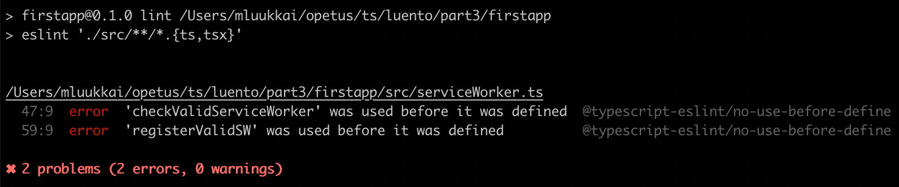

<div class="content">


<!-- Before we start delving into how you can use TypeScript with React, we should first have a look at what we want to achieve. When everything works as it should, TypeScript will help us catch the following errors: -->
在我们开始深入研究如何与 React 一起使用TypeScript之前，我们应该先看看我们想要实现什么。 当一切正常运行时，TypeScript 将帮助我们捕获如下错误:

<!--Trying to pass an extra/unwanted prop to a component-->
- 试图传递一个额外的/不需要的props给一个组件
<!--Forgetting to pass a required prop to a component-->
- 忘记把必需的props递给组件
<!--Passing a prop of a wrong type to a component-->
- 将错误类型的属性传递给组件


<!-- If we make any of these errors, TypeScript can help us catch the errors in our editor right away. If we didn't use TypeScript, we would have to catch these errors later during testing, and we might be forced to do some tedious debugging in order to find out what is causing our errors. -->
如果我们犯了这些错误中的任何一个，TypeScript可以帮助我们马上在我们的编辑器中捕捉这些错误。 如果我们不使用TypeScript，我们将不得不在以后的测试中捕捉这些错误，并且我们可能被迫进行一些枯燥的调试，以找出错误的原因。

<!-- But let that be enough of reasoning for now, and let's start getting our hands dirty! -->
但是现在就让这些理由到此为止吧，让我们开始弄脏双手吧！

### Create React App with TypeScript
【用TypeScript创建React应用】
<!-- [create-react-app](https://create-react-app.dev) supports a way to create an app using TypeScript by adding an additional <i>template</i> argument to the initialisation script. So, in order to create a Create React App using TypeScript, run the following command: -->
<!-- We can use [create-react-app](https://create-react-app.dev) to create a TypeScript app by adding an 
<i>template</i> argument to the initialisation script. So in order to create a TypeScript Create React App, run the following command: -->

我们可以使用[create-react-app](https://create-react-app.dev)，通过在初始化脚本中添加一个额外的<i>template</i> 参数，支持使用 TypeScript 创建应用的方法。 因此，为了使用 TypeScript 创建一个 Create React App，运行如下命令:

```shell
npx create-react-app my-app --template typescript
```

<!-- After running the command, you should have a complete basic react app, that uses TypeScript. The app can be started by simply running <i>npm start</i> within the app root folder. -->
在运行命令之后，你应该有一个完整的基本React应用，它使用TypeScript。 只需在应用根文件夹中运行<i>npm start</i> 即可启动该应用。

<!-- If you browse through the files and folders, you will notice that the app is not that different from the one you would have initialised with pure JavaScript. Basically the only differences are that the <i>.js</i> and <i>.jsx</i> files are now renamed to <i>.ts</i> and <i>.tsx</i> files, they contain some type annotations, and the root folder also contains a<i>tsconfig.json</i> file. -->
如果你浏览这些文件和文件夹，你会发现这个应用和你用纯 JavaScript 初始化的应用没什么不同。 基本上，唯一的区别是 <i>.js</i> 和我<i>.jsx</i> 文件现在改名为 <i>.ts</i> 和 <i>.tsx</i> 文件，它们包含一些类型注解，根文件夹还包含一个<i>tsconfig.json</i>文件。

<!-- Now, let's take a look at the <i>tsconfig.json</i> file that has been created for us. Everything should be more or less fine within the file, except for that at the moment the configuration also allows JavaScript files to be compiled, because <i>allowJs</i> is set to <i>true</i>. That would be fine if you need to mix TypeScript and JavaScript (e.g. if you are in the middle of transforming a JavaScript project into TypeScript or some other reason), but we want our app to be purely TypeScript, so let's change that setting to <i>false</i>. -->
现在，让我们看看为我们创建的<i>tsconfig.json</i> 文件。 文件中的所有内容都应该差不多正常，只是目前的配置还允许编译 JavaScript 文件，因为<i>allowJs</i> 被设置为<i>true</i>。 如果你需要混合使用TypeScript和 JavaScript (例如，如果你正在将一个 JavaScript 项目转换成TypeScript或者其他原因) ，那么这样做是可以的，但是我们希望我们的应用是纯粹的TypeScript，所以让我们把这个设置改为<i>false</i>。

<!-- Earlier we added eslint to help us enforce coding style in backend, so let's do the same with this app. We do not need to install any dependencies since create-react-app has taken care of that already. -->
之前我们添加了 eslint 来帮助我们在后端实施编码风格，所以让我们对这个应用做同样的事情。 我们不需要安装任何依赖项，因为 create-react-app 已经解决了这个问题。

<!-- We configure eslint in <i>.eslintrc</i> with following settings: -->
我们在 <i>.eslintrc</i> 中配置 eslint，设置如下:

```js
{
  "env": {
    "browser": true,
    "es6": true,
    "jest": true
  },
  "extends": [
    "eslint:recommended",
    "plugin:react/recommended",
    "plugin:@typescript-eslint/recommended"
  ],
  "plugins": ["react", "@typescript-eslint"],
  "settings": {
    "react": {
      "pragma": "React",
      "version": "detect"
    }
  },
  "rules": {
    "@typescript-eslint/explicit-function-return-type": 0
  }
}
```

<!-- Since basically all React components return a <i>JSX.Element</i> type or  <i>null</i>, we have loosen the default linting rules a bit by disabling the rule [explicit-function-return-type](https://github.com/typescript-eslint/typescript-eslint/blob/master/packages/eslint-plugin/docs/rules/explicit-function-return-type.md), so that we don't need to explicitly write out function return types everywhere. -->
因为基本上所有 React 组件都返回一个<i>JSX.Element</i> 类型或<i>null</i> 类型，所以我们通过禁用 规则  [explicit-function-return-type](https://github.com/typescript-eslint/typescript-eslint/blob/master/packages/eslint-plugin/docs/rules/explicit-function-return-type.md)来稍微放松默认的lint规则，这样我们就不需要在所有地方显式写出函数返回类型 。

<!-- Now we need to get our linting script to parse  <i>*.tsx </i> files as well, which are the TypeScript equivalent of react's JSX files. We can do that by altering our lint command in <i>.package.json</i> to the following: -->

现在我们需要让我们的 linting 脚本也来解析 <i>*.tsx</i>文件，它们是与 react 的 JSX 文件等价的TypeScript。 我们可以通过改变 <i>.package.json</i> 中的 lint 命令来做到这一点，修改如下:

```json
{
  // ...
    "scripts": {
    "start": "react-scripts start",
    "build": "react-scripts build",
    "test": "react-scripts test",
    "eject": "react-scripts eject",
    "lint": "eslint './src/**/*.{ts,tsx}'" // highlight-line
  },
  // ...
}
```
<!-- If you are using Windows, you may need to use double quotes for the linting path: `"lint": "eslint \"./src/**/*.{ts,tsx}\""`. -->
如果你使用Windows，可能需要使用双引号包住lint 路径：`"lint": "eslint \"./src/**/*.{ts,tsx}\""`

<!-- If we now run <i>npm run lint</i>, we should still receive an error from eslint: -->
如果我们现在运行 <i>npm run lint</i>,，我们仍然会收到一个来自 eslint 的错误:



<!-- Why is that? As we can see from the error, the file  <i>serviceWorker.ts</i> doesn't seem to be compliant with our linting configurations at the moment. This is because the <i>register</i> function uses other functions that are declared later in the same file and the rule [@typescript-eslint/no-use-before-define](https://github.com/typescript-eslint/typescript-eslint/blob/master/packages/eslint-plugin/docs/rules/no-use-before-define.md) doesn't like that. To fix the error we need to move the  <i>register</i> function as the last function in the file. -->
为什么？ 正如我们从错误中看到的，文件<i>serviceWorker.ts</i> 目前似乎与我们的链接配置不兼容。 这是因为<i>register</i> 函数使用了稍后在同一文件中声明的其他函数，而规则[@typescript-eslint/no-use-before-define](https://github.com/typescript-eslint/typescript-eslint/blob/master/packages/eslint-plugin/docs/rules/no-use-before-define.md)不喜欢这样。 为了修复这个错误，我们需要将<i>register</i> 函数移动到作为文件中的最后一个函数。

<!-- If we now run <i>npm run lint</i>, we shouldn't get any errors. Actually the error does not matter, since we do not need the file <i>serviceWorker.ts</i> anyway, it is better to delete it altogether. -->
如果我们现在运行 <i>npm run lint</i>，我们不应该得到任何错误。 实际上，错误并不重要，因为我们不需要文件<i>servicedworker.ts</i>，所以最好将其删除。

### React components with TypeScript
【用TypeScript 编写 React组件】
<!-- Let us consider the following JavaScript React example: -->
让我们考虑下面的 JavaScript React 示例:

```jsx
import React from "react";
import ReactDOM from 'react-dom';
import PropTypes from "prop-types";

const Welcome = props => {
  return <h1>Hello, {props.name}</h1>;
};

Welcome.propTypes = {
  name: PropTypes.string
};

const element = <Welcome name="Sara" />;
ReactDOM.render(element, document.getElementById("root"));
```

<!-- In the example we have a component called <i>Welcome</i>, to which we want to pass a <i>name</i> prop, that is then rendered. We know that the  <i>name</i> prop should be a string and we use the [prop-types](https://www.npmjs.com/package/prop-types) package introduced in [第5章](/zh/part5/props_children_与_proptypes#prop-types) to be able to receive hints about component's desired prop types and warnings for invalid prop types. -->
在这个示例中，我们有一个名为<i>Welcome</i> 的组件，我们希望向它传递一个<i>name</i> prop，然后将其渲染。 我们知道<i>name</i> prop 应该是一个字符串，我们使用在[第5章](/zh/part5/props_children_与_proptypes#prop-types) 中介绍的[prop-types](https://www.npmjs.com/package/prop-types)包，可以接收关于部件所需props类型的提示，以及无效props类型的警告。

<!-- With the help of TypeScript we don't need the <i>prop-types</i> package anymore to define prop types, because we can define the types with the help of TypeScript itself by using the _FunctionComponent_ type or it's shorter alias _FC_. -->
在 TypeScript 的帮助下，我们不再需要<i>prop-types</i> 包来定义 prop 类型，因为我们可以通过使用 _FunctionComponent_ 类型或者更短的别名 FC，在 TypeScript 本身的帮助下定义类型。

 <!--When using TypeScript with React components, the type annotations look a bit different than with other TypeScript code. We basically add a type for the component variable, instead of the function and it's props. _React.FunctionComponent_ is a so called [generic](https://www.typescriptlang.org/docs/handbook/generics.html) type, to which you can pass a type as a sort of argument, that it then uses in the final type.-->
当使用 TypeScript 编写 React 组件时，类型注解看起来与其他 TypeScript 代码有点不同。 我们基本上为组件变量添加一个类型，而不是函数和它的props。 _React.FunctionComponent_ 是一种所谓的[泛型](https://www.typescriptlang.org/docs/handbook/generics.html)类型，您可以将类型作为参数传递给它，然后它在最后的类型中使用这个 。

<!-- The type declaration for _React.FC_ and _React.FunctionComponent_ look like the following: -->
_React.FC_ 和 _React.FunctionComponent_ 的类型声明如下所示:

```js
type FC<P = {}> = FunctionComponent<P>;

interface FunctionComponent<P = {}> {
  (props: PropsWithChildren<P>, context?: any): ReactElement | null;
  propTypes?: WeakValidationMap<P>;
  contextTypes?: ValidationMap<any>;
  defaultProps?: Partial<P>;
  displayName?: string;
}
```

<!-- Firstly, you can see that _FC_ is simply an alias for the _FunctionComponent_ interface. They are both generic, which can easily be recognized by the angle bracket _<>_ after the type name. Inside the angle brackets there is <i>P = {}</i>. That means, that you can pass a type as an argument and inside the new type the passed type will go by the name <i>P</i> that is an empty object <i>{}</i> by default. -->
首先，您可以看到 FC 只是 FunctionComponent 接口的别名。 它们都是泛型的，可以很容易地通过类型名称后面的角括号来识别。 在尖括号中有 <i>P = {}</i>.。 这意味着，您可以将类型作为参数传递，在新类型中，传递的类型将默认使用空对象 <i>{}</i>  的名称 <i>P</i> 。

<!-- Now let's take a look at the first line inside _FunctionComponent_: -->
现在让我们看看 FunctionComponent 内部的第一行代码:

```js
(props: PropsWithChildren<P>, context?: any): ReactElement | null;
```

<!-- There you can see that <i>props</i> is of type <i>PropsWithChildren</i>, which is also a generic type, to which <i>P</i> is passed. The type <i>PropsWithChildren</i> in turn is a [intersection](http://www.typescriptlang.org/docs/handbook/unions-and-intersections.html#intersection-types) of <i>P</i> and the type <i>{ children?: ReactNode }</i>. -->
<!-- 
这里你可以看到<i>props</i> 的类型是 <i>PropsWithChildren</i>， 也是 <i>P</i> 传递给他的泛型。 类型<i>PropsWithChildren</i> 是<i>P</i> 和类型 <i>{ children?: ReactNode }</i>的一个[intersection](https://www.typescriptlang.org/docs/handbook/advanced-types.html#intersection-types) . -->

<!-- Here you can see that <i>props</i> is of type <i>PropsWithChildren</i>, which is also a generic type to which <i>P</i> is passed. -->
这里你可以看到<i>props</i> 的类型是 <i>PropsWithChildren</i>， 也是 <i>P</i> 传递给他的泛型。
<!-- The type <i>PropsWithChildren</i> in turn is a [intersection](https://www.typescriptlang.org/docs/handbook/advanced-types.html#intersection-types) of <i>P</i> and the type <i>{ children?: ReactNode }</i>. -->
<i>PropsWithChildren</i> 类型反过来又是  <i>P</i>  和 <i>{ children?: ReactNode }</i> 的[交集](https://www.typescriptlang.org/docs/handbook/advanced-types.html#intersection-types)。


```js
type PropsWithChildren<P> = P | { children?: ReactNode };
```

<!-- Well, that was complicated (or was it?). Basically all we need to know at the moment is that we can define a type that we pass to _FunctionComponent_ and the component's <i>props</i> then consist of the defined type and component's <i>children</i>. -->
好吧，这很复杂(或者说是这样吗?) . 基本上，我们现在需要知道的是，我们可以定义一个传递给 _FunctionComponent_ 的类型，然后组件的<i>props</i> 包含已定义的类型和组件的<i>children</i>。

<!-- Now, lets return to our code example and see how we would define the type for the <i>Welcome</i> component's props in TypeScript. -->
现在，让我们回到我们的代码示例，看看如何在TypeScript中为<i>Welcome</i> 组件的 props 定义类型。

```jsx
interface WelcomeProps {
  name: string;
}

const Welcome: React.FC<WelcomeProps> = (props) => {
  return <h1>Hello, {props.name}</h1>;
};

const element = <Welcome name="Sara" />;
ReactDOM.render(element, document.getElementById("root"));
```

<!-- We defined a new type _WelcomeProps_ and passed it to the added typing for the <i>Welcome</i> component: -->
我们定义了一个新类型 WelcomeProps，并将其传递给<i>Welcome</i> 组件的添加类型:

```js
const Welcome: React.FC<WelcomeProps>;
```

<!-- You could also write the same thing using a less verbose syntax: -->
你也可以使用不那么冗长的语法来写同样的东西:

```jsx
const Welcome: React.FC<{ name: string }> = ({ name }) => (
  <h1>Hello, {name}</h1>
);
```

<!-- Now our editor knows that the <i>name</i> prop is a string, but for some reason eslint is not yet satisfied, and warns about that <i>'name' is missing in props validation</i>. This is because the react linting rules expect propTypes to be defined for all props, because it isn't aware of that we are already using TypeScript to define types for our props. -->
现在我们的编辑器知道<i>name</i> prop 是一个字符串，但是由于某些原因 eslint 还不满足，并且警告说在 props validation 中缺少  name。 这是因为 react linting 规则期望 propTypes 为所有props定义，因为它没有意识到我们已经在使用 TypeScript 为props定义了类型。

<!-- To fix the error, we need to add a new linting rule to <i>.eslintrc</i>: -->
为了修复这个错误，我们需要在<i>.eslintrc</i>中添加一个新的 linting 规则:

```json
{
  // ...
  "rules": {
    "react/prop-types": 0, // highlight-line
  },  
  // ...
}
```

</div>


<div class="tasks">


### Exercise 9.14.
#### 9.14.
<!-- Create a new Create React App with TypeScript, setup eslint for the project similarly that we just did. -->
使用 TypeScript 创建一个新的 Create React App，像我们刚才做的那样为项目设置 eslint。

<!-- This exercise is similar to the one you have already done in [第1章](/zh/part1/javascript#exercises-1-3-1-5) of the course, but with TypeScript added and some tweaks. Start off by modifying the contents of <i>index.tsx</i> to the following: -->
这个练习你在[第1章节](/zh/part1)中已经做过的类似，只是添加了TypeScript和一些调整。 首先将<i>index.tsx</i> 的内容修改为:

```jsx
import React from "react";
import ReactDOM from "react-dom";

const App: React.FC = () => {
  const courseName = "Half Stack application development";
  const courseParts = [
    {
      name: "Fundamentals",
      exerciseCount: 10
    },
    {
      name: "Using props to pass data",
      exerciseCount: 7
    },
    {
      name: "Deeper type usage",
      exerciseCount: 14
    }
  ];

  return (
    <div>
      <h1>{courseName}</h1>
      <p>
        {courseParts[0].name} {courseParts[0].exerciseCount}
      </p>
      <p>
        {courseParts[1].name} {courseParts[1].exerciseCount}
      </p>
      <p>
        {courseParts[2].name} {courseParts[2].exerciseCount}
      </p>
      <p>
        Number of exercises{" "}
        {courseParts.reduce((carry, part) => carry + part.exerciseCount, 0)}
      </p>
    </div>
  );
};

ReactDOM.render(<App />, document.getElementById("root"));
```

<!-- and remove the unnecessary files. -->
删除不必要的文件。

<!-- The whole app is now in one component, and that is not what we want, so refactor the code so that it consists of three new components: <i>Header</i>,  <i>Content</i> and <i>Total</i>. All data is still kept in the <i>App</i> component, which passes all necessary data to each component as props. Be sure to add type declarations for the component's props!  -->
整个应用现在在一个组件中，这不是我们想要的，因此重构代码，使其由三个新组件组成:<i>Header</i>、<i>Content</i> 和<i>Total</i>。 所有数据仍然保存在<i>App</i> 组件中，该组件将所有必要的数据作为props传递给每个组件。 一定要为组件的props添加类型声明！

<!-- The <i>Header</i> component should take care of rendering the name of the course, <i>Content</i> should render the names of the different parts and the amount of exercises in that part, and <i>Total</i> should render the total sum of exercises in all parts. -->
<i>Header</i>组件应负责显示课程名称，<i>Content</i> 应渲染不同章节的名称和该部分的练习题数量，<i>Total</i> 应显示所有部分的练习总和。

<!-- The <i>App</i> component should look somewhat like this: -->
<i>App</i> 组件应该看起来像这样:

```jsx
const App = () => {
  // const-declarations

  return (
    <div>
      <Header name={courseName} />
      <Content ... />
      <Total ... />
    </div>
  )
};
```
</div>


<div class="content">


### Deeper type usage
【更深入的类型使用】
<!-- In the previous exercise we had three parts of a course, where all parts had the same attributes <i>name</i> and <i>exerciseCount</i>. But what if we had the need for additional attributes for the parts and each part would have the need for different additional attributes, how would this look like codewise? Let's consider the following example: -->
在前面的练习中，我们有一个课程的三个章节，其中所有章节都具有相同的属性<i>name</i> 和<i>exerciseCount</i>。 但是，如果我们需要为每个章节添加额外的属性，而每个章节又需要不同的额外属性，那么这还看起来像是代码吗？ 让我们考虑下面的例子:

```js
const courseParts = [
  {
    name: "Fundamentals",
    exerciseCount: 10,
    description: "This is an awesome course part"
  },
  {
    name: "Using props to pass data",
    exerciseCount: 7,
    groupProjectCount: 3
  },
  {
    name: "Deeper type usage",
    exerciseCount: 14,
    description: "Confusing description",
    exerciseSubmissionLink: "https://fake-exercise-submit.made-up-url.dev"
  }
];
```

<!-- In the example above we have added some additional attributes to each course part. The attributes <i>name</i> and <i>exerciseCount</i> are in common for each part, the first and the third share an attribute called <i>description</i>, and then there are also some additional attributes that are distinct for the second and third part. -->
在上面的例子中，我们为每个课程章节添加了一些额外的属性。 属性<i>name</i> 和<i>exerciseCount</i> 对于每个章节都是相同的，第一章节和第三章节共享一个名为<i>description</i> 的属性，还有一些附加属性对于第二章节和第三章节是不同的。

<!-- Let's imagine that our application keeps on growing and we have the need to pass the different course parts around in our code and on top of that, there are also additional attributes and additional course parts added to the mix. How will we then know that our code is capable of handling all different types of data in the correct way, and that we're for example not forgetting to render a new course part on some page? This is something where TypeScript can be especially helpful! -->
让我们假设我们的应用一直在增长，我们需要在我们的代码中传递不同的课程部分，除此之外，还有额外的属性和额外的课程章节添加到混合中。 那么我们如何知道我们的代码能够以正确的方式处理所有不同类型的数据，以及我们不会忘记在某些页面上渲染新的课程部分？ 这就是TypeScript能够特别有用的地方！

<!-- Let's start by defining types for our different course parts: -->
让我们从为不同的课程章节定义类型开始:

```js
interface CoursePartOne {
  name: "Fundamentals";
  exerciseCount: number;
  description: string;
}

interface CoursePartTwo {
  name: "Using props to pass data";
  exerciseCount: number;
  groupProjectCount: number;
}

interface CoursePartThree {
  name: "Deeper type usage";
  exerciseCount: number;
  description: string;
  exerciseSubmissionLink: string;
}
```

<!-- Next we will create a type [union](http://www.typescriptlang.org/docs/handbook/advanced-types.html#union-types) of all these types, which we can use to define a type for our array, that should accept any of these course part types: -->
接下来，我们将创建一个所有这些类型的[union](http://www.typescriptlang.org/docs/handbook/advanced-types.html#union-types)类型 ，我们可以用它来为数组定义一个类型，它应该接受如下任何一个课程部分类型:

```js
type CoursePart = CoursePartOne | CoursePartTwo | CoursePartThree;
```

<!-- Now we can set the type for our <i>courseParts</i> variable and after that our editor will automatically give an error if we use a wrong type for an attribute, use an extra attribute, or forget to set an expected attribute. You can test this by commenting out any attribute for any course part. Thanks to the <i>name</i> [string literal](http://www.typescriptlang.org/docs/handbook/advanced-types.html#string-literal-types) TypeScript can identify which course part requires which additional attributes, even if the variable is defined to use the type union. -->
现在我们可以为<i>courseParts</i> 变量设置类型，之后，如果我们对属性使用了错误的类型，或者使用了额外的属性，或者忘记设置预期的属性，我们的编辑器将自动给出一个错误。 您可以通过注释掉任何课程部分的任何属性来测试这一点。 多亏了<i>name</i> [string literal字符串字面量](http://www.typescriptlang.org/docs/handbook/advanced-types.html#string-literal-types) TypeScript 可以识别哪个课程部分需要哪些附加属性，即使变量被定义为使用类型联合。

<!-- But we're not satisfied yet! There is still a lot of duplication in the types that we have created, and that is something we want to avoid. We start off by identifying the attributes in common for all course parts and define a base type containing them, and then we will [extend](http://www.typescriptlang.org/docs/handbook/interfaces.html#extending-interfaces) that base type to create our part specific types: -->
但是我们还不满意！ 在我们创建的类型中仍然存在大量的重复，这是我们希望避免的。 我们首先确定所有课程部分的公共属性，并定义包含它们的基类型，然后我们将[扩展](http://www.typescriptlang.org/docs/handbook/interfaces.html#extending-interfaces)这个基类型来创建我们的部分特定类型:

```js
interface CoursePartBase {
  name: string;
  exerciseCount: number;
}

interface CoursePartOne extends CoursePartBase {
  name: "Fundamentals";
  description: string;
}

interface CoursePartTwo extends CoursePartBase {
  name: "Using props to pass data";
  groupProjectCount: number;
}

interface CoursePartThree extends CoursePartBase {
  name: "Deeper type usage";
  description: string;
  exerciseSubmissionLink: string;
}
```

<!-- How should we now use these types in our components? -->
我们现在应该如何在组件中使用这些类型？

<!-- One handy way to use these kind of types in TypeScript is by using _switch case_ expressions. Once you have either explicitly declared, or TypeScript has inferred that a variable holds a type union, and each type in the type union contains an attribute, that can be used as a type identifier, you can build your switch case around that attribute and TypeScript will then know which attributes are available within each case block. -->
在TypeScript中使用这些类型的一个简便方法是使用 switch case 表达式。 一旦你有了显式声明，或者 TypeScript 已经推断出一个变量包含一个类型联合，并且类型联合中的每个类型都包含一个属性，这个属性可以用作类型标识符，你就可以围绕这个属性建立开关案例，然后 TypeScript 就会知道每个案例块中有哪些属性可用。


<!-- In the example above TypeScript knows that <i>coursePart</i> has the type <i>CoursePart</i>, so it can infer that <i>part</i> is of either type <i>CoursePartOne</i>, <i>CoursePartTwo</i> or <i>CoursePartThree</i>. Because <i>name</i> is distinct for each type, we can use it to identify each type and thus TypeScript can help to let us know which attributes are available in each case block and it will produce an error if you e.g. try to use the <i>part.description</i> within the <i>"Using props to pass data"</i> block. -->
在上面的示例中，TypeScript 知道<i>coursePart</i> 具有<i>CoursePart</i> 类型，因此它可以推断<i>part</i> 属于<i>CoursePartOne</i>，<i>CoursePartTwo</i> <i>或<i>CoursePartThree</i>类型。 因为<i>name</i> 对于每个类型都是不同的，所以我们可以使用它来标识每个类型，因此 TypeScript 可以帮助我们知道每个 case 块中有哪些属性可用，如果您尝试在<i>"Using props to pass data"</i>块中使用<i>part.description</i>，那么它会产生错误。

<!-- What about new types? If we were to add a new course part, wouldn't it be nice to know if we haven't yet implemented handling of that type in our code? With the example above, a new type would go to the <i>default</i> block and nothing would get printed for a new type. Sometimes this is of course totally acceptable, e.g. if you only want to handle specific (not all) cases of a type union, but in most cases it is recommended to handle all variations separately.  -->
那么新的类型呢？ 如果我们要添加一个新的课程章节，如果我们还没有在代码中实现这种类型的处理，那会怎样？ 对于上面的示例，新类型将转到<i>default</i> 块，并且不会为新类型打印任何内容。 有时这当然是完全可以接受的，例如，如果您只想处理类型联合的特定(并非全部)情况，但在大多数情况下，建议分别处理所有变体。

<!-- With TypeScript we can use a method that is called <i>exhaustive type checking</i>. Its basic principle is that if we encounter an unexpected value, we call a function that accepts a value with the type [never](https://www.typescriptlang.org/docs/handbook/basic-types.html#never) and also has the return type <i>never</i>. -->
对于TypeScript，我们可以使用一个名为<i>穷举类型检查</i> 的方法。 它的基本原理是，如果遇到意外值，我们调用一个函数，该函数接受类型为[never](https://www.typescriptlang.org/docs/handbook/basic-types.html#never)的值，并且返回类型为<i>never</i>。

<!-- A straight forward version of the function could look like this: -->
这个函数的一个简单版本可以是这样的:

```js
/**
 * Helper function for exhaustive type checking
 */
const assertNever = (value: never): never => {
  throw new Error(
    `Unhandled discriminated union member: ${JSON.stringify(value)}`
  );
};
```

<!-- If we now were to replace the contents of our <i>default</i> block to: -->
如果我们现在将<i>default</i> 块的内容替换为:

```js
default:
  return assertNever(part);
```

<!-- And would also comment out the <i>Deeper type usage</i> case block, we would see the following error: -->
并且注释掉<i>Deeper 类型 usage</i> case 块，我们会看到下面的错误:


<!-- The error description <i>Argument of type 'CoursePartThree' is not assignable to parameter of type 'never'</i> tells us that we are using a variable somewhere, where it should never be used, so we know that something needs to be fixed. When we remove the added comments from the <i>Deeper type usage</i> case block, you will see that the error goes away. -->
类型为“ CoursePartThree” 的参数的错误描述不能分配给<i>“ never”</i> 类型的参数，这告诉我们我们在某个地方使用了一个变量，而这个变量永远不应该被使用，因此我们知道有些东西需要修复。 当我们从<i>Deeper 类型 usage</i> case 块中删除添加的注释时，您将看到错误消失了。

</div>


<div class="tasks">


### Exercise 9.15
#### 9.15
<!-- First add the new type information to <i>index.tsx</i> and replace the variable <i>courseParts</i> with the one from the example below. -->
首先将新类型信息添加到<i>index.tsx</i> 中，并将变量<i>courseParts</i> 替换为下面示例中的变量。

```js
// new types
interface CoursePartBase {
  name: string;
  exerciseCount: number;
}

interface CoursePartOne extends CoursePartBase {
  name: "Fundamentals";
  description: string;
}

interface CoursePartTwo extends CoursePartBase {
  name: "Using props to pass data";
  groupProjectCount: number;
}

interface CoursePartThree extends CoursePartBase {
  name: "Deeper type usage";
  description: string;
  exerciseSubmissionLink: string;
}

type CoursePart = CoursePartOne | CoursePartTwo | CoursePartThree;

// this is the new coursePart variable
const courseParts: CoursePart[] = [
  {
    name: "Fundamentals",
    exerciseCount: 10,
    description: "This is an awesome course part"
  },
  {
    name: "Using props to pass data",
    exerciseCount: 7,
    groupProjectCount: 3
  },
  {
    name: "Deeper type usage",
    exerciseCount: 14,
    description: "Confusing description",
    exerciseSubmissionLink: "https://fake-exercise-submit.made-up-url.dev"
  }
];
```

<!-- Now we know that both interfaces <i>CoursePartOne</i> and <i>CoursePartThree</i> share not only the base attributes, but also an attribute called <i>description</i>, which is a string in both interfaces.  -->
现在我们知道了<i>CoursePartOne</i> 和<i>CoursePartThree</i>这两个接口不仅共享基本属性，而且共享一个名为<i>description</i>的属性，这是两个接口中的字符串。

<!-- Your first task is to to declare a new interface, that includes the <i>description</i> attribute and extends the <i>CoursePartBase</i> interface. Then modify the code so that you can remove the <i>description</i> attribute from both <i>CoursePartOne</i> and <i>CoursePartThree</i>, without getting any errors. -->
您的第一个任务是声明一个新接口，其中包括<i>description</i> 属性并扩展<i>CoursePartBase</i>接口。 然后修改代码，以便可以从<i>CoursePartOne</i> 和<i>CoursePartThree</i> 中删除<i>description</i> 属性，而不会出现任何错误。

<!-- The create a component <i>Part</i> that renders all attributes of each type of course part. Use switch case -based exhaustive type checking! Use the new component in component <i>Content</i>. -->
然后创建一个组件<i>Part</i>，它渲染每种类型的课程章节的所有属性。 使用基于switch case的详尽类型检查！ 在组件<i>Content</i> 中使用新组件。

<!-- Lastly, add your own course part interface with at least the following attributes: <i>name</i>, <i>exerciseCount</i> and <i>description</i>. Then add that interface to the type union <i>CoursePart</i> and add corresponding data to the <i>courseParts</i> variable. Now if you have not modified your <i>Content</i> component correctly, you should get an error, because you have not yet added support for the fourth course part type. Do the necessary changes to <i>Content</i>, so that all attributes for the new course part also get rendered and that the compiler doesn't produce any errors. -->
最后，添加您自己的课程章节接口，至少包含如下属性:<i>name</i>、<i>exerisecount</i> 和<i>description</i>。 然后将该接口添加到类型 union<i>CoursePart</i>，并将相应的数据添加到<i>courseets</i> 变量。 现在，如果您没能正确地修改了您的<i>Content</i> 组件，您应该会得到一个错误，因为您还没有添加对第四个课程部分类型的支持。 对<i>Content</i> 进行必要的更改，这样新课程部分的所有属性都会得到渲染，编译器也不会产生任何错误。

</div>


<div class="content">


### A note about defining object types
【关于定义对象类型的注意事项】
<!-- We have used [interfaces](http://www.typescriptlang.org/docs/handbook/interfaces.html) to define object types, eg. diary entries in previous section -->
我们已经使用[接口](http://www.typescriptlang.org/docs/handbook/interfaces.html)来定义对象类型，例如前面部分的日记条目

```js
interface DiaryEntry {
  id: number;
  date: string;
  weather: Weather;
  visibility: Visibility;
  comment?: string;
} 
```

<!-- and course part in this section -->
以及这一部分的课程的章节：

```js
interface CoursePartBase {
  name: string;
  exerciseCount: number;
}
```

<!-- We actually could have had the same effect by using a [type alias](http://www.typescriptlang.org/docs/handbook/advanced-types.html#type-aliases) -->
我们实际上可以通过使用[type alias](http://www.typescriptlang.org/docs/handbook/advanced-types.html#type-aliases)来达到同样的效果

```js
type DiaryEntry = {
  id: number;
  date: string;
  weather: Weather;
  visibility: Visibility;
  comment?: string;
} 
```

<!-- In most cases you can use either <i>type</i> or <i>interface</i>, which ever syntax you prefer, but there are still a few things to keep in mind. For instance if you define multiple interfaces with the same name, they will result in a merged interface, whereas if you try to create multiple types with the same name, it will result in an error stating that one with the same name is already declared.  -->
在大多数情况下，您可以使用<i>type</i> 或<i>interface</i>，无论您喜欢的哪种语法，但仍有一些事情需要记住。 例如，如果您使用相同的名称定义多个接口，它们将导致一个合并的接口，而如果您尝试使用相同的名称创建多个类型，它将导致一个错误声明，即一个相同的名称已经声明过了。

<!-- TypeScript documentation [recommends to use interfaces](http://www.typescriptlang.org/docs/handbook/advanced-types.html#interfaces-vs-type-aliases) in most cases. -->
TypeScript文档[建议在大多数情况下使用接口](http://www.typescriptlang.org/docs/handbook/advanced-types.html#interfaces-vs-type-aliases)。 

### Working with an existing codebase
【与现有的代码库一起工作】

<!-- When diving into the codebase for the first time it is good to get an overall view of the conventions and structure of the project. You can start your research from the <i>README.md</i> in the root of the repository. Usually it contains a brief description of the application and requirements needed to use it and also how to start it for development. If this is not present or somebody has saved time and left it as a stub you can take a peek in the <i>package.json</i>. It is always a good idea to start the application and click around it at the same time verifying that you have a functional development environment. -->
当第一次深入到代码库中时，最好能够对项目的约定和结构有一个全面的了解。 您可以从存储库根目录中的<i>README.md</i> 开始进行研究。 通常，它包含应用和使用它所需要的需求的简要描述，以及如何启动它进行开发。 如果这个没有出现，或者有人节省了时间，把它留作存根，你可以在<i>package.json</i> 中看一眼。 启动应用并围绕它进行一番点击总是一个好主意，同时验证您拥有一个功能性开发环境。

<!-- You can also browse the folder structure to get insights about application functionality and/or the architecture used. This is not always clear and developers may have chosen a way to organize code that might not be familliar to you. The [sample project](https://github.com/fullstack-hy2020/patientor) used in the rest of this part is organized featurewise. You can see what different pages the application has and some general components eg. modals and state. Keep in mind that the features represented may have different scopes eg. modals are visible UI level components whereas the state is comparable to business logic and keeps the data organized under the hood for the rest of the app to use. -->
您还可以浏览文件夹结构，以了解应用的功能和/或所使用的体系结构。 这一点并不总是很清楚，开发人员可能已经选择了一种组织代码的方法，而这种方法对您来说可能并不熟悉。 在本章节的其余部分中使用的[样例项目](https://github.com/fullstack-hy2020/patientor)是有组织特点的。 你可以看到应用有哪些不同的页面和一些通用组件，例如。 模型和状态。 请记住，所代表的特性可能有不同的范围，例如。 modals是可见的 UI 级组件，而状态可以与业务逻辑相媲美，并保持数据组织在底层供应给其余部分使用。

<!-- TypeScript provides you types which tell you what kind of data structures, functions, components and state to expect. You can try to look for <i>types.ts</i> or something similar to get you started. VSCode is a big help and just highlighting variables and parameters can give you quite much of insight. This all naturally depends on how types are used in the project. -->
TypeScript 提供的类型可以告诉你需要什么样的数据结构、函数、组件和状态。 您可以尝试寻找 <i>types.ts</i> 或类似的东西来开始。 VSCode 是一个很大的帮助，仅仅突出显示变量和参数就可以提供很参考。 这自然取决于在项目中如何使用类型。 

<!-- If the project has tests unit, integration or end-to-end tests, reading those is most likely beneficial. Test cases are your most important tool when refactoring or creating new features to the application. You want to make sure not to break any existing features when hammering around the code. TypeScript can also give you guidance with argument and return types when doing changes in the code. -->
如果项目有单元测试、集成测试或端到端测试，那么阅读这些测试很可能是有益的。 在重构或为应用创建新特性时，测试用例是最重要的工具。 您需要确保在处理代码时不会破坏任何现有的特性。 在对代码进行更改时，TypeScript 还可以为您提供参数和返回类型的指导。

<!-- Remember that reading code is a skill itself and relax if you don't understand the code on your first readthrough. Code may have a lot of corner cases and added logic throughout its development cycle. It is hard to imagine what kind of troubles the previous developer has been wrestling with. Think of it all like [growth rings in trees](https://en.wikipedia.org/wiki/Dendrochronology#Growth_rings). Understanding all of it requires digging deep into the code and business domain requirements. The more code you read the better you're going to be at it. You will read more code than you're going to produce. -->
记住，阅读代码本身就是一项技能，如果你在第一次阅读时不理解代码，那么就放松一下。 在整个开发周期中，代码可能有很多边际情况和添加的逻辑。 很难想象之前的开发者一直在与什么样的麻烦作斗争。 把它想象成[树木的年轮](https://en.wikipedia.org/wiki/dendrochronology#growth_rings)。 理解所有这些内容需要深入研究代码和业务领域的需求。 你阅读的代码越多，你就会越熟悉它。 与生产相比，您将阅读更多的代码。

### Patientor frontend
【病人项目的前端】
<!-- It's time to get our hands dirty finalizing the frontend for the backend we built in [exercises 9.8.-9.13.](/zh/part9/typing_the_express_app). -->
是时候把我们的手弄脏了，最后为我们在[exercises 9.8.-9.13.](/zh/part9/typescript版的express应用)所开发的后端，完成前端功能。

<!-- Before diving into the code, let us start both the frontend and the backend. -->
在深入研究代码之前，让我们从前端和后端同时开始。

<!-- If all goes well you should see a patient listing page, which fetches a patient list from our backend and renders the list in a simple table, and a button for creating new patients to the backend. As we are not using a database, but mock data, the data will not persist, i.e. closing the backend forgets all the added data. UI has not clearly been the strong point of the creators of this app, so let's disregard the UI for now. -->
如果一切顺利，您将看到一个病人列表页面，该页面从我们的后端获取一个病人列表，并在一个简单的表中渲染该列表，还有一个按钮用于在后端创建新的病人。 由于我们使用的不是数据库，而是模拟数据，因此数据不会持久，即关闭后端就会忘记所有添加的数据。 用户界面显然不是这个应用开发者的强项，所以让我们暂时忽略这个用户界面。

<!-- After we have verified that everything is working, we start studying the code. All the interesting stuff resides in the <i>src/</i> folder. For convenience there is also a ready made <i>types.ts</i> file for basic types used in the app, which you will have to extend or refactor in the exercises.  -->
在我们验证了一切正常之后，我们开始研究代码。 所有有趣的内容都位于<i>src</i> 文件夹中。 为了方便起见，还有一个针对应用中使用的基本类型的现成<i>types.ts</i> 文件，您必须在练习中扩展或重构这个文件。

<!-- Same types could in principle be used in both backend and frontend, but usually the frontend has different data structures and use cases for the data, thus causing the types to be different. For example frontend has a state and may want to keep data in objects or maps instead of an array given by the backend with different keys. The frontend might also not need all the fields that the backend provides, and it may need to add some new fields to be used in rendering. -->
原则上可以在后端和前端中使用相同的类型，但是前端通常具有不同的数据结构和数据的用例，从而导致类型不同。 例如，前端具有一个状态，并且可能希望将数据保存在对象或映射中，而不是由具有不同键的后端给出的数组。 前端可能也不需要后端提供的所有字段，它可能需要添加一些用于渲染的新字段。

<!-- The folder structure looks as follows: -->
文件夹结构如下:


<!-- So there are currently, as you would expect, two main components: <i>AddPatientModal</i> and <i>PatientListPage</i>. The <i>state/</i> folder contains state handling for the frontend. The main functionality it provides is keeping our data in one place, offering simple actions to alter the state of our app. -->
因此，正如您所料，目前有两个主要组件:<i>AddPatientModal</i> 和 <i>PatientListPage</i>。<i>state /</i> 文件夹包含前端的状态处理。 它提供的主要功能是将我们的数据保存在一个地方，提供简单的操作来改变我们应用的状态。

### State handling
【状态处理】
<!-- Let's study the state handling a bit closer as a lot of stuff seems to be happening under the hood and it differs a bit from the methods used in the course so far.  -->
让我们更仔细地研究一下状态处理，因为很多事情似乎都发生在底层，而且它与本课程到目前为止使用的方法有点不同。

<!-- The state management is built using React Hooks [useContext](https://reactjs.org/docs/hooks-reference.html#usecontext) and [useReducer](https://reactjs.org/docs/hooks-reference.html#usereducer). This is one quite viable option of creating a stateful app when we know that the app we will be rather small and we do not want to use <i>redux</i> or other libraries for the state management.  There are a lot of good material eg. [this article](https://medium.com/@seantheurgel/react-hooks-as-state-management-usecontext-useeffect-usereducer-a75472a862fe) describing the approach.  -->
状态管理是使用 React Hooks [useContext](https://reactjs.org/docs/Hooks-reference.html#useContext)和[useReducer](https://reactjs.org/docs/Hooks-reference.html#useReducer)构建的。 这是一个创建有状态应用的非常可行的选择，当我们知道我们的应用会相当小，我们不想使用<i>redux</i> 或其他库来进行状态管理时。 有很多好的素材。 [本文](https://medium.com/@seantheurgel/react-hooks-as-state-management-usecontext-useeffect-usereducer-a75472a862fe)描述了这种方法。

<!-- The approach taken in this app uses the React [context](https://reactjs.org/docs/context.html), that according to documentation -->
在这个应用中采取的方法使用了 React [context](https://reactjs.org/docs/context.html) ，根据文档

> <i>... is designed to share data that can be considered "global" for a tree of React components, such as the current authenticated user, theme, or preferred language.</i> 
<i>... is 被设计用于为 React 组件树共享可被视为“全局”的数据，例如当前经过身份验证的用户、议题或首选语言。 </i>

<!-- In our case the "global" shared data is the application state <i>and</i> the dispatch function that is used to make changes to data. In a way the approach works quite much like redux based state management that we used in [第6章](/zh/part6) but is a more light weight since it does not require the use of any external libraries. This part assumes that you are at least familiar with the way redux works, e.g. you should have covered at least [the first section](/zh/part6/flux架构与_redux) of part 6. -->
在我们的示例中，“全局”共享数据是应用状态，分派函数是用于更改数据。 在某种程度上，这种方法的工作原理很像我们在[第6章](/zh/part6)中使用的基于 redux 的状态管理，但是它很轻量，因为它不需要使用任何外部库。 这一章节假设您至少熟悉 redux 的工作方式，例如，您至少应该包括第6章节的[第一部分](/zh/part6/flux架构与_redux)。

<!-- The [context](https://reactjs.org/docs/context.html) of the application has a tuple of the app state and dispatcher for changing the state of our app. The application state is typed as follows: -->
应用的[上下文](https://reactjs.org/docs/context.html)有一个用于更改应用状态的状态和调度程序的元组。 应用状态的类型如下:

```js
export type State = {
  patients: { [id: string]: Patient };
};
```

<!-- The state is an object with one key <i>patients</i>, which has a [dictionary](https://www.typescriptlang.org/docs/handbook/advanced-types.html#index-types-and-index-signatures) or simply put an object with string keys and with a <i>Patient</i> object as value. Index can only be <i>string</i> or <i>number</i> as you can access the object values using those. This enforces that the state conforms in the way we want, and prevents developers from misusing the state.  -->
状态是一个具有一个 key <i>patients</i> 的对象，该对象具有一个[字典](https://www.typescriptlang.org/docs/handbook/advanced-types.html#index-types-and-index-signatures) ，或者简单地将一个具有字符串键的对象和一个<i>Patient</i> 对象作为值。 索引只能是<i>string</i> 或<i>number</i>，因为您可以使用它们访问对象值。 这强制状态以我们想要的方式呈现，并防止开发人员滥用状态。


<!-- You can also think of a scenario where we may have state as a union. Eg. using states type as an indicator whether user has logged in: -->
你也可以想象一个场景，我们可以把状态看作一个union。 例如。 使用状态类型作为用户是否登录的说明器:

```js
export type State =
  | {
      type: "Unauthenticated";
    }
  | {
      type: "Authenticated";
      currentUser: User;
    };
```

<!-- This is one way of using TypeScript to help keeping the applications state under control. We know that if the state is in <i>type: "Authenticated"</i> we will have a <i>currentUser</i> field in state. -->
这是使用 TypeScript 帮助控制应用状态的一种方法。 我们知道，如果状态是<i>type: “ Authenticated”</i>，我们将有一个<i>currentUser</i> 字段。

<!-- This matches the arguments that are received from [useReducer](https://reactjs.org/docs/hooks-reference.html#usereducer). hook. Dispatch function takes as parameter objects with of <i>Action</i> which is defined in <i>reducer.ts</i> alongside the actual reducer function defining what the action does to the state returning a new state.  -->
这与从[useReducer.hook](https://reactjs.org/docs/hooks-reference.html#useReducer)接收的参数相匹配。Dispatch 函数使用<i>Action</i> 作为参数对象，在<i>reducer.ts</i> 中定义，与定义动作对返回新状态的状态的实际 reducer 函数一起使用。

<!-- The main principle in our state management approach is to pass the state to our components through the context and to modify the state using reducers.  -->
我们的状态管理方法的主要原则是通过上下文将状态传递给组件，并使用reducers修改状态。


<!-- Just as in the case of redux, all the state manipulation is done by the reducer that is defined in file <i>reducer.ts</i> together with the type <i>Action</i> that looks as follows -->
与 redux 的情况一样，所有的状态操作都是由文件<i>reducer.ts</i> 中定义的 reducer 与类型<i>Action</i> 一起完成的，如下所示

```js
export type Action =
  | {
      type: "SET_PATIENT_LIST";
      payload: Patient[];
    }
  | {
      type: "ADD_PATIENT";
      payload: Patient;
    };
```

<!-- Reducer looks quite much like the ones we wrote in [第6章](/zh/part6), it changes the state for each type of action:  -->
Reducer 看起来很像我们在[第6章](/zh/part6)中写的那些，它改变了每种动作的状态: 

```js
export const reducer = (state: State, action: Action): State => {
  switch (action.type) {
    case "SET_PATIENT_LIST":
      return {
        ...state,
        patients: {
          ...action.payload.reduce(
            (memo, patient) => ({ ...memo, [patient.id]: patient }),
            {}
          ),
          ...state.patients
        }
      };
    case "ADD_PATIENT":
      return {
        ...state,
        patients: {
          ...state.patients,
          [action.payload.id]: action.payload
        }
      };
    default:
      return state;
  }
};
```

<!-- The main difference is now that the state is a dictionary (or object) instead of array that we used in [第6章](/zh/part6). -->
主要的区别是，现在状态是一个字典(或对象) ，而不是我们在 [第6章](/zh/part6)中使用的数组。

<!-- There are lot of things happening in the file <i>state.ts</i> that is taking care of setting up the context. The main ingredient is that it uses the [useReducer](https://reactjs.org/docs/hooks-reference.html#usereducer) hook to create the state and dispatch-function and passes those to the [context provider](https://reactjs.org/docs/context.html#contextprovider): -->
在<i>state.ts</i> 文件中发生了许多事情，它们负责设置 context。 它的主要组成部分是使用[useReducer](https://reactjs.org/docs/hooks-reference.html#useReducer)Hook来创建 状态 和 分发函数，并将它们传递给[context provider](https://reactjs.org/docs/context.html#contextprovider) :

```js
export const StateProvider: React.FC<StateProviderProps> = ({
  reducer,
  children
}: StateProviderProps) => {
  const [state, dispatch] = useReducer(reducer, initialState); // highlight-line
  return (
    <StateContext.Provider value={[state, dispatch]}>  // highlight-line
      {children}
    </StateContext.Provider>
  );
};
```

<!-- Provider makes <i>state</i> and <i>dispatch</i> functions available in all of the components, thanks to the setup in <i>index.ts</i>:   -->
提供者使<i>state</i> 和<i>dispatch</i> 函数在所有组件中都可用，这要感谢<i>index.ts</i> 中的设置:

```js 
import { reducer, StateProvider } from "./state";

ReactDOM.render(
  <StateProvider reducer={reducer}>
    <App />
  </StateProvider>, 
  document.getElementById('root')
);
```

<!-- It also defines the <i>useStateValue</i> hook -->
它还定义了<i>useStateValue</i> Hook

```js 
export const useStateValue = () => useContext(StateContext);
```

<!-- and the components that need to access the state or dispatcher use it to get hold of those: -->
需要访问状态或调度器的组件使用它来获取这些:

```js 
import { useStateValue } from "../state";

// ...

const PatientListPage: React.FC = () => {
  const [{ patients }, dispatch] = useStateValue();
  // ...
}
```

<!-- Do not worry if this seems confusing, it surely is until you have studied the [context documentation](https://reactjs.org/docs/context.html) and its use in [state management](https://medium.com/@seantheurgel/react-hooks-as-state-management-usecontext-useeffect-usereducer-a75472a862fe). You do not need to understand all this completely for doing the exercises!  -->
不要担心，如果这看起来令人困惑，它肯定是直到你研究了[上下文文档](https://reactjs.org/docs/context.html 文档)和它在[状态管理](https://medium.com/@seantheurgel/react-hooks-as-state-management-usecontext-useeffect-usereducer-a75472a862fe 文档)中的使用。 做这些练习，你不需要完全了解这一切！

<!-- It is actually quite typical that when you start working with an existing application, at the beginning you do not understand 100% of what happens under the hood. If the app has been properly structured you can trust that if you are making careful modifications, the app still works despite of the fact that you did not understand all the internals. Over the time you can then get a grasp of the more unfamiliar parts, but it does not happen overnight when working with a large codebase. -->
实际上，当您开始使用一个现有的应用时，在开始的时候您并不完全了解背后发生的事情，这是非常常见的。 如果应用结构合理，你可以相信，如果你正在仔细修改，应用仍然工作，尽管事实上你不了解所有的内部。 随着时间的推移，您可以掌握更多不熟悉的部分，但这不会发生在一夜之间，当与大型代码库工作时。

### Patient listing page
【病人名单页面】
<!-- Let's go through the <i>PatientListPage/index.ts</i> as you can take inspiration from there to help you fetch data from the backend and update the application's state. <i>PatientListPage</i> uses our custom hook for injecting state and dispatcher for updating the state.  As we are listing patients we only need to destructure <i>patients</i> property from the state: -->
让我们来看一下<i>PatientListPage/index.ts</i>，因为您可以从中获得灵感，帮助您从后端获取数据并更新应用的状态。 <i>PatientListPage</i>使用我们的自定义Hook来注入 state 和 dispatcher 来更新状态。 当我们列出患者名单时，我们只需要从状态那里解构 <i>患者</i> 属性:

```js
import { useStateValue } from "../state";

const PatientListPage: React.FC = () => {
  const [{ patients }, dispatch] = useStateValue();
  // ...
}
```

<!-- We also use the app state created with <i>useState</i> hook for managing modal visibility and form error handling: -->
我们还使用<i>useState</i> hook 创建的应用状态来管理modal可见性和表单错误处理:

```js
const [modalOpen, setModalOpen] = React.useState<boolean>(false);
const [error, setError] = React.useState<string | undefined>();
```

<!-- We give <i>useState</i> hook type parameter that is applied for the actual state. So <i>modalOpen</i> is a <i>boolean</i> and <i>error</i> has type <i>string | undefined</i> respectively. Both set functions returned by <i>useState</i> hook are functions that accept only arguments according to the type parameter given, eg. the exact type for <i>setModalOpen</i> function is <i>React.Dispatch<React.SetStateAction&lt;boolean&gt;></i>. -->
我们给出了应用于实际状态的<i>useState</i> hook 类型参数。 所以<i>modalOpen</i> 是一个<i>boolean</i>，而<i>error</i> 的类型分别是<i>string | undefined</i>。 这两个由<i>useState</i> Hook返回的 set 函数都是根据给定的类型参数只接受参数的函数，例如 <i>setModalOpen</i>函数的确切类型<i>React.Dispatch<React.SetStateAction&lt;boolean&gt;></i>。

<!-- We also have <i>openModal</i> and <i>closeModal</i> helper functions for better readability and convenience: -->
为了更好的可读性和方便性，我们还有<i>openModal</i> 和<i>closeModal</i> 辅助函数:

```js
const openModal = (): void => setModalOpen(true);

const closeModal = (): void => {
  setModalOpen(false);
  setError(undefined);
};
```

<!-- Frontend's types are based on what you have created when developing the backend in the previous part. -->
Frontend 的类型基于你在开发前面的后端时所创建的类型。 

<!-- When the component <i>App</i> mounts, it is fetching patients from the backend using [axios](https://github.com/axios/axios). Note how we are giving <i>axios.get</i> function a type parameter to describe what is the type for the response data: -->
当组件<i>App</i> 挂载时，它使用[axios](https://github.com/axios/axios)从后端获取病人。 注意我们如何给<i>axios.get</i> 函数一个类型参数来描述响应数据的类型:

````js
React.useEffect(() => {
  axios.get<void>(`${apiBaseUrl}/ping`);

  const fetchPatientList = async () => {
    try {
      const { data: patients } = await axios.get<Patient[]>(
        `${apiBaseUrl}/patients`
      );
      dispatch({ type: "SET_PATIENT_LIST", payload: patients });
    } catch (e) {
      console.error(e);
    }
  };
  fetchPatientList();
}, [dispatch]);
````

 <!--**A word of warning!** Passing the type parameter for axios will not validate any data and is quite dangerous especially if you are using external APIs. You can create custom validation functions taking in the whole payload and returning the correct type or you can use type guard. Both are valid. There are also many libraries that provide validation through different kind of schemas eg. [io-ts](https://github.com/gcanti/io-ts). For simplicity we will continue trusting our own work and trust that we will get data of the correct form from the backend.-->
**警告一句！ **为 axios 传递类型参数不会验证任何数据，并且非常危险，尤其是在使用外部 api 时。 您可以创建自定义验证函数，包含整个有效负载并返回正确的类型，或者您可以使用类型保护。 两者都是有效的。 还有许多库通过不同的模式提供验证，例如， [io-ts](https://github.com/gcanti/io-ts)，为了简单起见，我们将继续相信我们自己的工作，并相信我们将从后端获得正确形式的数据。

<!-- As our app is quite small we will update the state by simply calling the <i>dispatch</i> function provided to us by <i>useStateValue</i> hook. The compiler helps to make sure that we dispatch actions according to our <i>Action</i> type with predefined type string and payload: -->
由于我们的应用非常小，我们将通过调用<i>useStateValue</i> hook 提供的<i>dispatch</i> 函数来更新状态。 编译器有助于确保我们根据预定义类型字符串和有效负载的<i>Action</i> 类型分派操作:

```js
dispatch({ type: "SET_PATIENT_LIST", payload: patients });
```

</div>


<div class="tasks">


### Exercises 9.16.-9.18
<!-- We will soon add new type <i>Entry</i> for our app that represents a light weight patient journal entry. It consists of journal text ie. <i>description</i>, creation date, information regarding the specialist who created it and possible diagnosis codes. Diagnosis codes map to the ICD-10 codes returned from the <i>/api/diagnoses</i> endpoint. Our naive implementation will be that patient has an array of entries. -->
我们将很快为我们的应用添加新类型<i>Entry</i>，它代表一个轻量级的病人日志条目。 它由日志正文组成例如<i>描述</i>，创建日期，关于创建它的专家的信息和可能的诊断代码。 诊断代码映射到 <i>/api/diagnoses</i> 端点返回的 ICD-10代码。 我们天真的实现将是病人有一个条目数组。

<!-- Before going to this, let us do some preparatory work. -->
在此之前，让我们做一些准备工作。

#### 9.16: patientor, 步骤1
<!-- Create an endpoint <i>/api/patients/:id</i> to that returns all of the patient information for one patient, including also the array of patient entries that is still empty for all the patients. For the time being, expand the backend types as follows: -->
创建一个端点 <i>/api/patients/:id</i> ，该端点返回一个患者的所有信息，还包括所有患者仍为空的患者条目数组。 目前，扩展后端类型如下:

```js
// eslint-disable-next-line @typescript-eslint/no-empty-interface
export interface Entry {
}

export interface Patient {
  id: string;
  name: string;
  ssn: string;
  occupation: string;
  gender: Gender;
  dateOfBirth: string;
  entries: Entry[] // highlight-line
}

export type PublicPatient = Omit<Patient, 'ssn' | 'entries' >  // highlight-line
```

<!-- Response should look as follows: -->
答复应如下:


#### 9.17: patientor, 步骤2
<!-- Create a page for showing a patient's full information in the frontend.  -->
创建一个页面，在前端显示病人的全部信息。

<!-- Patient information should be accessible when clicking eg. the patients name. -->
当点击病人名称时，病人信息应该是可以访问的。

<!-- Fetch the data from the enpoint created on the provious exercise. After fetching the patient information from backend, add the fetched information to the applications state. Do not fetch the information if it already is in the app state, i.e. if you are visiting many times it the page of the same patient.  -->
从在提供的练习中创建的 enpoint 中获取数据。 从后端获取患者信息之后，将获取的信息添加到应用状态。 如果信息已经处于应用状态，也就是说，如果你多次访问同一个病人的页面，不要获取信息。

<!-- Since we now have the state in the context, you'll need to define a new action type for updating an individual patient's data. -->
因为我们现在有了上下文中的状态，所以需要定义一个新的操作类型来更新单个患者的数据。

<!-- The Application uses [Semantic UI React](https://react.semantic-ui.com/) for styling, which is quite similar to [React Bootstrap](https://react-bootstrap.github.io/) and [MaterialUI](https://material-ui.com/) that we covered in [第7章](/zh/part7/样式进阶). You may also use it for the new components but that is up to you since the main focus is now in Typescript. -->
应用使用[Semantic UI React](https://React.Semantic-UI.com/)来进行样式化，这与[React Bootstrap](https://React-Bootstrap.github.io/)和[MaterialUI](https://material-UI.com/)非常相似，我们在 [第7章](/zh/part7/样式进阶)中已经介绍过了。 你也可以在新的组件上使用它，但这取决于你，因为我们主要的关注点现在是TypeScript。

<!-- The Application also uses [react router](https://reacttraining.com/react-router/web/guides/quick-start)  -->
应用还使用了[React路由](https://reacttraining.com/react-router/web/guides/quick-start)
<!-- to control what view is visible in the frontend. You might want to have a look on [第7章](/zh/part7/react_router) if you don't yet have a grasp on how the router works. -->
控制前端可见的视图。 如果你还没有掌握路由的工作原理，你可能需要查看一下[第7章](/zh/part7/react_router)。

<!-- The result could look like the following: -->
结果可能如下:


<!-- The gender is shown with react-semantic-ui component [Icon](https://react.semantic-ui.com/elements/icon/#gendersicons-can-represent-genders-or-types-of-sexuality)  -->
性别以react-semantic-ui 组件[图标](https://react.semantic-ui.com/elements/Icon/#gendersicons-can-represent-genders-or-types-of-sexuality)显示

<!-- **Note** that in order to access the id in the url, you need to give [useParams](https://reacttraining.com/react-router/web/api/Hooks/useparams) a proper type argument: -->
**注意**为了访问 url 中的 id，需要给[useParams](https://reacttraining.com/react-router/web/api/hooks/useParams)一个正确的类型参数:

```js
const { id } = useParams<{ id: string }>();
```

#### 9.18: patientor, 步骤3
<!-- We are currently creating the <i>action</i> objects everywhere in the code when dispatching the action, e.g. component <i>App</i> has the following: -->
当分派动作时，我们正在代码中随处创建<i>action</i> 对象，例如，component <i>App</i> 具有如下特性:

```js
dispatch({
  type: "SET_PATIENT_LIST", payload: patientListFromApi
});
```

<!-- Refactor the code to use [action creator](/zh/part6/flux架构与_redux#action-creators) functions that are all defined in the file <i>reducer.tsx</i>.  -->
重构代码以使用文件<i>reducer.tsx</i> 中定义的[action creator](/zh/part6/flux架构与_redux#action-creators)函数。

<!-- For example the <i>App</i> changes like this -->
例如，<i>App</i> 的变化如下

```js
import { useStateValue, setPatientList } from "./state";

// ...

dispatch(setPatientList(patientListFromApi));
```


</div>


<div class="content">


### Full entries
【全部记录】
<!-- In the [exercise 9.12.](/zh/part9/typing_the_express_app#exercises-9-12-9-13) we implemented an endpoint for fetching the diagnoses but we still are not using that endpoint at all. Since we now have a page for viewing details of a single patient it would be a great idea to expand our data by a bit; let's add possible <i>Entry</i> data to our patient data so that each patient can have medical entries that include possible diagnoses. -->
在 [exercise 9.12.](/zh/part9/typescript版的express应用#exercises-9-12-9-13)我们实现了一个用于获取诊断的端点，但是我们根本没有使用该端点。 既然我们现在有一个页面可以查看单个病人的详细信息，那么最好将我们的数据扩展一点; 让我们向病人数据中添加可能的<i>Entry</i> 数据，这样每个病人都可以有包含可能诊断的医疗条目。

<!-- Let's ditch our old patient seed data from backend and start using [this expanded format](https://github.com/fullstack-hy2020/misc/blob/master/patients.ts). -->
让我们从后端丢弃旧病人的种子数据，开始使用[这种扩展格式](https://github.com/fullstack-hy2020/misc/blob/master/patients.ts)。

<!-- **Notice:** This time the data is not in .json but instead in the .ts-format. You should already have the complete <i>Gender</i> and <i>Patient</i> types implemented so only correct the paths where they are imported from if needed. -->
**注意: **这次数据不在 .json而是在 .ts-format。 您应该已经实现了完整的<i>Gender</i> 和<i>Patient</i> 类型，以便只在需要时纠正导入它们的路径。

<!-- Let us now create a proper <i>Entry</i> type based on the data we have. -->
现在，让我们根据已有的数据创建一个适当的<i>Entry</i> 类型。

<!-- When looking at the data closer, we can see that the entries in the data differ actually quite a lot from each other. For example, let's take the first two entries we can see there: -->
当我们仔细观察数据时，我们可以看到数据中的条目实际上相差很大。 例如，我们来看看前两个条目:

```js
{
  id: 'd811e46d-70b3-4d90-b090-4535c7cf8fb1',
  date: '2015-01-02',
  type: 'Hospital',
  specialist: 'MD House',
  diagnosisCodes: ['S62.5'],
  description:
    "Healing time appr. 2 weeks. patient doesn't remember how he got the injury.",
  discharge: {
    date: '2015-01-16',
    criteria: 'Thumb has healed.',
  }
}
...
{
  id: 'fcd59fa6-c4b4-4fec-ac4d-df4fe1f85f62',
  date: '2019-08-05',
  type: 'OccupationalHealthcare',
  specialist: 'MD House',
  employerName: 'HyPD',
  diagnosisCodes: ['Z57.1', 'Z74.3', 'M51.2'],
  description:
    'Patient mistakenly found himself in a nuclear plant waste site without protection gear. Very minor radiation poisoning. ',
  sickLeave: {
    startDate: '2019-08-05',
    endDate: '2019-08-28'
  }
}
```

<!-- Immediately we can see that the first few fields are the same, but the first one only has the <i>discharge</i> field and the second one only <i>employerName</i> and <i>sickLeave</i>. So all the entries seem to have something in common but some are entry specific.  -->
我们马上可以看到前几个字段是相同的，但是第一个字段只有<i>discharge</i> 字段，第二个字段只有<i>employerName</i> 和<i>sickLeave</i>。 因此，所有的条目似乎都有一些共同点，但有些是条目特定的。

<!-- When looking at the entries through the <i>type</i> field we can see that there actually is three separate kinds of entries: <i>OccupationalHealthcare</i>, <i>Hospital</i> and <i>HealthCheck</i>. This indicates the need for three separate kinds of types but since they all seem to have something in common we might just want to create a base entry interface that we could extend with the different fields in each type. -->
当通过<i>type</i> 字段查看条目时，我们可以看到实际上有三种不同的条目:<i>OccupationalHealthcare</i>、<i>Hospital</i> 和<i>HealthCheck</i>。 这表明需要三种不同类型的类型，但由于它们似乎都有一些共同点，我们可能只是想创建一个基础的条目接口，我们可以用每种类型的不同字段进行扩展。

<!-- When looking at the data, it seems that the fields <i>id</i>, <i>description</i>, <i>date</i> and <i>specialist</i> are something that can be found from each entry. On top of that, it seems that the <i>diagnosisCodes</i> is only found in one <i>OccupationalHealthCare</i> and one <i>Hospital</i> type entry. Since it is not always used even in those types of entries, it is safe to assume that the field is optional and we could consider it to be optional even in the <i>HealthCheck</i> type entry, just not in use in these entries right here. -->
在查看数据时，似乎可以从每个条目中找到<i>id</i>、<i>description</i>、<i>date</i> 和<i>specialist</i> 字段。 除此之外，似乎<i>diagnosisCodes</i> 只在一个<i>OccupationalHealthCare</i> 和一个<i>Hospital</i> 输入条目中找到。 因为即使在这些类型的条目中也不总是使用它，所以可以假设这个字段是可选的，我们可以认为它是可选的，即使在<i>HealthCheck</i> 类型的条目中也是如此，只是在这些条目中没有使用。

<!-- So our <i>BaseEntry</i> from which each type could be extended from with would be the following: -->
因此，我们的<i>BaseEntry</i>，每种类型都可以从中扩展，它们是:

```js
interface BaseEntry {
  id: string;
  description: string;
  date: string;
  specialist: string;
  diagnosisCodes?: string[];
}
```

<!-- If we want to finetune it a little bit further, since we already have a <i>Diagnosis</i> type defined in the backend, we might just want to refer to the <i>Diagnosis</i> types code field directly, in case the type of it ever changes, like this: -->
如果我们想进一步调整它，因为我们已经在后端定义了<i>Diagnosis</i> 类型，我们可能只想直接引用<i>Diagnosis</i> types 代码字段，以防它的类型发生变化，如下所示:

```js
interface BaseEntry {
  id: string;
  description: string;
  date: string;
  specialist: string;
  diagnosisCodes?: Array<Diagnosis['code']>;
}
```

<!-- As you might remember <i>Array&lt;Type&gt;</i> is just an alternative way to say <i>Type[]</i>. In cases like this it is just much more clear to use the array convention since the other option would be to define the type by saying <i>Diagnosis['code'][]</i> which starts to look a bit strange. -->
你可能还记得<i>Array&lt;Type&gt;</i> 只是<i>Type []</i> 的另一种表达方式。 在这种情况下，使用数组约定就更明显了，因为另一个选项是通过说<i>Diagnosis [‘ code’][]</i> 来定义类型，这看起来有点奇怪。

<!-- Now that we have the <i>BaseEntry</i> defined we can start creating the extended entry types we will actually use. Let's start by creating the <i>HealthCheckEntry</i> type. -->
现在我们已经定义了<i>BaseEntry</i>，我们可以开始创建实际使用的扩展条目类型了。 让我们从创建<i>HealthCheckEntry</i> 类型开始。

<!-- The entries with the type <i>HealthCheck</i> contain the field <i>HealthCheckRating</i>, which can be any of the integer values from 0 to 3, 0 meaning <i>Healthy</i> and 3 informing of a <i>CriticalRisk</i>, a perfect case for an enum definition. With these specifications we could write a <i>HealthCheckEntry</i> type definition like the following: -->
类型为<i>HealthCheck</i> 的条目包含字段<i>HealthCheckRating</i>，它可以是从0到3的任何整数值，表示<i>Healthy</i> 和3通知<i>CriticalRisk</i>，这是完美的枚举定义。 使用这些规范，我们可以编写一个<i>HealthCheckEntry</i> 类型定义，如下所示:

```js
export enum HealthCheckRating {
  "Healthy" = 0,
  "LowRisk" = 1,
  "HighRisk" = 2,
  "CriticalRisk" = 3
}

interface HealthCheckEntry extends BaseEntry {
  type: "HealthCheck";
  healthCheckRating: HealthCheckRating;
}
```

<!-- Now we only need to create the <i>OccupationalHealthCareEntry</i> and <i>HospitalEntry</i> types so we can combine and export them as the Entry type like this: -->
现在我们只需要创建<i>OccupationalHealthCareEntry</i> 和<i>HospitalEntry</i> 类型，这样我们就可以将它们组合并导出为 Entry 类型，如下所示:

```js
export type Entry =
  | HospitalEntry
  | OccupationalHealthcareEntry
  | HealthCheckEntry;
```

</div>


<div class="tasks">


### Exercises 9.19.-9.22.
#### 9.19: patientor, 步骤4
9.19: patientor，步骤4

<!-- Define the types <i>OccupationalHealthCareEntry</i> and <i>HospitalEntry</i> so that those conform with the example data. Ensure that your backend returns the entries properly when you go to a individual patient route -->
定义类型<i>OccupationalHealthCareEntry</i> 和<i>HospitalEntry</i>，以便这些类型与示例数据一致。 确保您去一个单独的病人路由时，您的后端返回正确的条目


<!-- Use types properly in the backend! For now there is no need to do a proper validation for all the fields of the entries in the backend, it is enough e.g. to check that the field <i>type</i> has a correct value. -->
在后端正确使用类型！ 现在不需要对后端中的条目的所有字段进行适当的验证，只需检查字段<i>type</i> 的值是否正确即可。

#### 9.20: patientor, 步骤5
<!-- Extend the patient page in the frontend to list the <i>date</i>, <i>description</i> and <i>diagnose codes</i> of patient's entries.  -->
扩展前端的患者页面，列出患者条目的<i>date</i>、<i>description</i> 和<i>诊断代码</i>。

<!-- You can use the same type definiton for <i>Entry</i> in the frontend. For these exercises it is enough just to copy/paste the definitions from backend to frontend. -->
你可以在前端对<i>Entry</i> 使用相同的类型定义。 对于这些练习，只需将定义从后端复制/粘贴到前端即可。

<!-- Your solution could look like this: -->
你的解决方案可以是这样的:


#### 9.21: patientor, 步骤6
<!-- Fetch and add diagnoses to application state from <i>/api/diagnosis</i> endpoint. Use the new diagnosis data to show descriptions for patients diagnosis code: -->
从<i>/api/diagnosis</i> 端点获取诊断并将诊断添加到应用状态。 使用新的诊断数据显示病人诊断代码的描述:


#### 9.22: patientor, 步骤7
<!-- Extend the entry-listing in the patient page to include the Entry's details with a new component that shows rest of the information of the patients entries distinguishing different types from each other.  -->
扩展患者页面中的条目列表，以包含条目的详细信息，并使用一个新组件显示患者条目的其余信息，以区分不同的类型。

<!-- You could use eg. [Icon](https://react.semantic-ui.com/elements/icon/) or some other [SemanticUI](https://react.semantic-ui.com/) components the get appropriate visuals for your listing. -->
你可以使用例如. [图标](图标 https://react.semantic-ui.com/elements/Icon/)或者其他的[SemanticUI](https://react.semantic-ui.com/)组件为你的清单提供合适的视觉效果。

<!-- You should use a _switch case_ based rendering and <i>exhaustive type checking</i> so that no cases can be forgotten.  -->
您应该使用基于_switch case_的渲染和<i>详尽的类型检查</i>，这样就不会忘记任何大小写。

<!-- Like this: -->
像这样:


<!-- The resulting entries in the listing <i>could</i> look something like this: -->
清单中的结果条目<i>可以</i> 看起来像这样:


</div>


<div class="content">


### Add patient form
【添加病人的表单】

<!-- Form handling can sometimes be quite a nuisance in React. That's why we have decided to utilize the the [Formik](https://jaredpalmer.com/formik/docs/overview) package for our add patient form in our app. Here's a small intro from to Formiks's documentation: -->
在 React 中，表单处理有时会非常麻烦。 这就是为什么我们决定在我们的应用中使用[Formik](https://jaredpalmer.com/Formik/docs/overview  /)包。 如下是对 Formiks 的文档的一个小介绍:

> Formik is a small library that helps you with the 3 most annoying parts:
是一个小型的程序库，可以帮助你处理3个最烦人的部分:
>
>
> - Getting values in and out of form state
- 获取输入和输出形式状态的值
> - Validation and error messages
- 验证和错误消息
> - Handling form submission
- 处理递交表格
>By colocating all of the above in one place, Formik will keep things organized - making testing, refactoring, and reasoning about your forms a breeze.
>通过将以上所有内容集中在一个地方，Formik 将使事情保持有条不紊——对您的表单进行测试、重构和推理。

<!-- The code for the form can be found in <i>src/AddPatientModal/AddPatientForm.tsx</i> and some form field helpers can be found in <i>src/AddPatientModal/FormField.tsx</i>. -->
表单的代码可以在 <i>src/AddPatientModal/AddPatientForm.tsx</i> 中找到，一些表单字段助手可以在 <i>src/AddPatientModal/FormField.tsx</i>. 中找到。

<!-- In the beginning of <i>AddPatientForm.tsx</i> you can see, that we have created a type for our form values, called simply <i>PatientFormValues</i>. It is a narrowed down version of <i>Patient</i>, with the properties <i>id</i> and <i>entries</i> omitted, because we don't want the user to be able to submit those when creating a new patient. <i>id</i> is created by the backend and <i>entries</i> can only be added for existing patients. -->
在<i>AddPatientForm.tsx</i> 的开头，您可以看到，我们已经为我们的表单值创建了一个类型，简称为<i>PatientFormValues</i>。 它是<i>Patient</i> 的缩小版本，具有<i>id</i> 和<i>entry</i> 省略的属性，因为我们不希望用户在创建新病人时能够提交这些属性。<i>id</i> 由后端创建，<i>条目</i> 只能为现有患者添加。

```js
export type PatientFormValues = Omit<Patient, "id" | "entries">;
```

<!-- Next we declare the props for our form component: -->
接下来我们声明表单组件的props:

```js
interface Props {
  onSubmit: (values: PatientFormValues) => void;
  onCancel: () => void;
}
```

<!-- There we can see that the component requires two props, <i>onSubmit</i> and <i>onCancel</i>. Both are callback functions that return <i>void</i>. As arguments <i>onSubmit</i> should receive an object of our <i>PatientFormValues</i> type, so that the callback can handle our form values.  -->
在这里我们可以看到组件需要两个props，<i>onSubmit</i> 和 <i>onCancel</i>.。 两者都是返回<i>void</i> 的回调函数。 作为参数<i>onSubmit</i> 应该接收<i>PatientFormValues</i> 类型的对象，以便回调可以处理我们的表单值。

<!-- When creating <i>AddPatientForm</i> function component, you can see that we have bound <i>Props</i> type as as our component's props, and are destructuring <i>onSubmit</i> and <i>onCancel</i> from those props. -->
在创建<i>AddPatientForm</i> 函数组件时，您可以看到我们使用 bound<i>Props</i> 类型作为组件的props，并从这些props中解构<i>onSubmit</i> 和<i>onCancel</i>。

```js
export const AddPatientForm: React.FC<Props> = ({ onSubmit, onCancel }) => {
  // ...
}
```

<!-- Now, before we go any further, let's have a look at our form helpers in <i>FormField.tsx</i>. If you look at what is exported from the file, you will find the type <i>GenderOption</i> and the function components <i>SelectField</i> and <i>TextField</i>. -->
现在，在进一步讨论之前，让我们看一下<i>FormField.tsx</i> 中的表单 helpers。 如果查看从文件中导出的内容，您会发现类型<i>GenderOption</i> 和函数组件<i>SelectField</i> 和<i>TextField</i>。

<!-- Let's take a closer look at <i>SelectField</i> and the types around it. First we create a generic type for each option object, that contains a value and a label for that value. These are the kind of option objects we want to allow on our form in the select field. Since the only options we want to allow are different genders, we set that the <i>value</i> should be of type <i>Gender</i>. -->
让我们仔细研究一下<i>SelectField</i> 及其周边的类型。 首先，我们为每个选项对象创建一个泛型类型，其中包含该值的一个值和一个标签。 这些是我们希望在表单中的 select 字段中允许的选项对象。 因为我们只允许不同性别的选项，所以我们将<i>value</i> 设置为<i>Gender</i> 类型。

```js
export type GenderOption = {
  value: Gender;
  label: string;
};
```

<!-- In <i>AddPatientForm.tsx</i> we use this type for the variable <i>genderOptions</i>, and declare that it will be an array containing objects of type <i>GenderOption</i>: -->
在<i>AddPatientForm.tsx</i> 中，我们将这个类型用于变量<i>genderOptions</i>，并声明它将是一个包含类型<i>GenderOption</i> 的对象的数组:

```js
const genderOptions: GenderOption[] = [
  { value: Gender.Male, label: "Male" },
  { value: Gender.Female, label: "Female" },
  { value: Gender.Other, label: "Other" }
];
```

<!-- Next look at the type <i>SelectFieldProps</i>. It defines the type for the props for our <i>SelectField</i> component. There you can see that options is an array of <i>GenderOption</i> types. -->
接下来查看类型<i>SelectFieldProps</i>。 它定义了我们的<i>SelectField</i> 组件的props的类型。 在这里您可以看到选项是<i>GenderOption</i> 类型的数组。

```js
type SelectFieldProps = {
  name: string;
  label: string;
  options: GenderOption[];
};
```

<!-- The function component <i>SelectField</i> in itself is pretty straight forward. It renders the label, a select element, and all given option elements, or actually their labels and values. -->
函数组件<i>SelectField</i> 本身非常直接。 它渲染标签、选择元素和所有给定的选项元素，或者实际上它们的标签和值。

```jsx
export const SelectField: React.FC<SelectFieldProps> = ({
  name,
  label,
  options
}: SelectFieldProps) => (
  <Form.Field>
    <label>{label}</label>
    <Field as="select" name={name} className="ui dropdown">
      {options.map(option => (
        <option key={option.value} value={option.value}>
          {option.label || option.value}
        </option>
      ))}
    </Field>
  </Form.Field>
);
```

<!-- Now let's move on to the <i>TextField</i> component.  -->
现在让我们继续讨论<i>TextField</i> 组件。
<!-- The component renders a SemanticUI [Form.Field](https://react.semantic-ui.com/collections/form/) with the given label and a Formik [Field](https://jaredpalmer.com/formik/docs/api/field), to which <i>name</i> and <i>placeholder</i> are given as props.  -->
该组件渲染一个 SemanticUI [Form.Field](https://react.semantic-ui.com/collections/form/)和一个 Formik [字段](https://jaredpalmer.com/Formik/docs/api/Field) ， <i>name</i><i>和 <i>placeholder</i> 作为props。

```jsx
interface TextProps extends FieldProps {
  label: string;
  placeholder: string;
}

export const TextField: React.FC<TextProps> = ({ field, label, placeholder }) => (
  <Form.Field>
    <label>{label}</label>
    <Field placeholder={placeholder} {...field} />
    <div style={{ color:'red' }}>
      <ErrorMessage name={field.name} />
    </div>
  </Form.Field>
);
```

<!-- Note that the possible error message for the input is rendered with the Fromik component [ErrorMessage](https://jaredpalmer.com/formik/docs/api/errormessage) that does everything under the hood without a need to specify what it should do. -->
注意，输入的可能错误消息是通过 Fromik 组件[ErrorMessage](https://jaredpalmer.com/formik/docs/api/ErrorMessage)渲染的，它可以处理所有事情，而不需要指定它应该做什么。

<!-- It would also be possible to get hold of the error messages withinn the component by using the prop <i>form</i>:  -->
也可以通过使用 prop<i>form</i> 来获得组件内部的错误信息:

```jsx
export const TextField: React.FC<TextProps> = ({ field, label, placeholder, form }) => {
  console.log(form.errors); 
  // ...
}
```

<!-- Now back to the actual form component in <i>AddPatientForm.tsx</i>. The function component <i>AddPatientForm</i> renders a [Formik component](https://jaredpalmer.com/formik/docs/api/formik), which is a wrapper that requires two props, which are quite self explanatory: <i>initialValues</i> and <i>onSubmit</i>. The Formik wrapper keeps track of your form's state and then exposes it plus a few reusable methods and event handlers to your form via props. -->
现在回到<i>AddPatientForm.tsx</i> 中的实际表单组件。 函数组件<i>AddPatientForm</i> 渲染一个[Formik 组件](https://jaredpalmer.com/Formik/docs/api/Formik) ，它是一个包装器，需要两个props，这是不言自明的:<i>initialValues</i> 和<i>onSubmit</i>。 Formik 包装器跟踪窗体的状态，然后将其加上一些可重用的方法和事件处理程序通过 props 公开给表单。

<!-- We are also using an optional <i>validate</i> prop, that expects a validation function and returns an object containing possible errors. Here we only check that our text fields are not falsy, but it could easily contain e.g. some validation for the social security number format etc. The error messages defined by this function are the ones that are then displayed along the corresponding field component's. -->
我们还使用了一个可选的<i>validate</i> prop，它需要一个验证函数并返回一个包含可能错误的对象。 在这里，我们只检查我们的文本字段是不是虚假的，但它可以容易地包含例如一些验证的社会安全号码格式等。 此函数定义的错误消息随后将沿相应字段组件的。

<!-- First have a look at the entire component, we will later explain the different parts in more detail. -->
首先看看整个组件，稍后我们将更详细地解释不同的部分。

```jsx
interface Props {
  onSubmit: (values: PatientFormValues) => void;
  onCancel: () => void;
}

export const AddPatientForm: React.FC<Props> = ({ onSubmit, onCancel }) => {
  return (
    <Formik
      initialValues={{
        name: "",
        ssn: "",
        dateOfBirth: "",
        occupation: "",
        gender: Gender.Other
      }}
      onSubmit={onSubmit}
      validate={values => {
        const requiredError = "Field is required";
        const errors: { [field: string]: string } = {};
        if (!values.name) {
          errors.name = requiredError;
        }
        if (!values.ssn) {
          errors.ssn = requiredError;
        }
        if (!values.dateOfBirth) {
          errors.dateOfBirth = requiredError;
        }
        if (!values.occupation) {
          errors.occupation = requiredError;
        }
        return errors;
      }}
    >
      {({ isValid, dirty }) => {
        return (
          <Form className="form ui">
            <Field
              label="Name"
              placeholder="Name"
              name="name"
              component={TextField}
            />
            <Field
              label="Social Security Number"
              placeholder="SSN"
              name="ssn"
              component={TextField}
            />
            <Field
              label="Date Of Birth"
              placeholder="YYYY-MM-DD"
              name="dateOfBirth"
              component={TextField}
            />
            <Field
              label="Occupation"
              placeholder="Occupation"
              name="occupation"
              component={TextField}
            />
            <SelectField
              label="Gender"
              name="gender"
              options={genderOptions}
            />
            <Grid>
              <Grid.Column floated="left" width={5}>
                <Button type="button" onClick={onCancel} color="red">
                  Cancel
                </Button>
              </Grid.Column>
              <Grid.Column floated="right" width={5}>
                <Button
                  type="submit"
                  floated="right"
                  color="green"
                  disabled={!dirty || !isValid}
                >
                  Add
                </Button>
              </Grid.Column>
            </Grid>
          </Form>
        );
      }}
    </Formik>
  );
};

export default AddPatientForm;
```

<!-- As a child for our Formik wrapper, we create a <i>function</i> that returns the form content as we want them. We use Formik's [Form](https://jaredpalmer.com/formik/docs/api/form) to render the actual form element and inside that we use our <i>TextField</i> and <i>SelectField</i> components, that we created in <i>FormField.tsx</i>. -->
作为 Formik 包装器的子包装器，我们创建了一个<i>function</i>，它可以根据需要返回表单内容。 我们使用 Formik 的[Form](https://jaredpalmer.com/Formik/docs/api/Form)来渲染实际的表单元素，在这个表单中我们使用了在<i>FormField.tsx</i> 中创建的<i>TextField</i> 和<i>SelectField</i> 组件。

<!-- Lastly on the form, we create two buttons, one for cancelling the form submission, and one for submitting the form. The cancel button calls the <i>onCancel</i> callback straight away, while the submit button triggers Formik's onSubmit event, which in turn uses the <i>onSubmit</i> callback from the component's props. Submit button is enabled only of the form is <i>valid</i> and <i>dirty</i>, which means that user has edited some of the fields. -->
最后在表单上，我们创建了两个按钮，一个用于取消表单提交，另一个用于提交表单。 取消按钮直接调用  <i>onCancel</i> 回调，而提交按钮触发 Formik 的 <i>onSubmit</i> 事件，该事件又使用组件props中的<i>onSubmit</i> 回调。 只有表单 is<i>valid</i> 和<i>dirty</i> 启用了 Submit 按钮，这意味着用户已经编辑了一些字段。

<!-- Submission is handled through Formik, because that way we can get it to call the validation function before performing the actual submission. If the validation function returns any errors, the submission is cancelled.  -->
提交是通过 Formik 处理的，因为这样我们可以让它在执行实际提交之前调用验证函数。 如果验证函数返回任何错误，则取消提交。

<!-- The buttons are set inside a SemanticUI [Grid](https://react.semantic-ui.com/collections/grid/), to get them next to each other easily. -->
这些按钮设置在 SemanticUI [Grid](https://react.semantic-ui.com/collections/Grid/)中，使它们能够轻松地挨在一起。

```jsx
<Grid>
  <Grid.Column floated="left" width={5}>
    <Button type="button" onClick={onCancel} color="red">
      Cancel
    </Button>
  </Grid.Column>
  <Grid.Column floated="right" width={5}>
    <Button type="submit" floated="right" color="green">
      Add
    </Button>
  </Grid.Column>
</Grid>
```

<!-- The <i>onSubmit</i> callback has been passed down all the way from our patient list page. It basically performs a HTTP POST to our backend, adds the new returned patient to our state and closes the modal. If the backend returns an error, the error is displayed on the form. -->
<i>onSubmit</i>回调已经从我们的病人列表页面一路传递下来。 它基本上对我们的后端执行一个 HTTP POST，将新返回的病人添加到我们的状态，并关闭modal。 如果后端返回错误，该错误将显示在窗体上。

<!-- Here is our submit function: -->
下面是我们的提交函数:

```js
const submitNewPatient = async (values: FormValues) => {
  try {
    const { data: newPatient } = await axios.post<Patient>(
      `${apiBaseUrl}/patients`,
      values
    );
    dispatch({ type: "ADD_PATIENT", payload: newPatient });
    closeModal();
  } catch (e) {
    console.error(e.response.data);
    setError(e.response.data.error);
  }
};
```

<!-- With this material you should be able to complete the rest of this part's exercises. When in doubt, try reading the existing code to find clues on how to proceed! -->
有了这些材料，你应该能够完成这部分的练习的其余部分。 如果有疑问，试着阅读现有的代码，找到如何继续下去的线索！

</div>


<div class="tasks">


### Exercises 9.23.-9.27.
#### 9.23: patientor, 步骤8
9.23: patientor，步骤8

<!-- So far we have established that the patients can have different types of entries, but we don't yet have any way of adding entries for our patients in our app, so it would at the moment be a pretty useless electronic medical record.  -->
到目前为止，我们已经确定病人可以有不同类型的条目，但是我们还没有任何方法在我们的应用中为我们的病人添加条目，所以目前它将是一个非常无用的电子医疗记录。

<!-- Your next task is to add an endpoint <i>/api/patients/:id/entries</i> to your backend, through which you can POST an entry for a patient.  -->
您的下一个任务是向后端添加一个端点 <i>/api/patients/:id/entries</i>，通过该端点您可以为患者 POST 一个条目。

<!-- Remember that we have different kinds of entries in our app, so our backend should also support all those types and check that at least all required fields are given for each type. -->
请记住，我们的应用中有不同类型的条目，所以我们的后端也应该支持所有这些类型，并检查为每种类型提供了必需的字段。

#### 9.24: patientor, 步骤9
<!-- Now that our backend supports adding of entries, we want to add the corresponding functionality the frontend. In this exercise you should add a form for adding an entry for a patient. An intuitive place for opening the form would be on the patient page.  -->
现在，我们的后端支持添加条目，我们希望添加相应的功能前端。 在这个练习中，您应该添加一个用于为病人添加条目的表单。 打开表单的一个直观位置是患者页面。

<!-- In this exercise it is enough to **support <i>one</i> entry type**, and you do not have to handle the errors, it is enough if an entry can be created if the form is filled up with valid data. -->
在这个练习中，只要 **支持<i>一个</i> 条目类型 **就足够了，而且您不必处理这些错误，如果表单中填充了有效数据，那么创建条目就足够了。

<!-- Upon a successful submit the new entry should be added to the correct person and the patient's entries on the patient page should be updated to contain the new entry. -->
一旦成功提交，新的条目应该被添加到正确的人，病人页面上的条目应该被更新以包含新的条目。

<!-- If you like, you can re-use some of the code from the <i>Add patient</i> form for this exercise, but this is not a requirement. -->
如果您愿意，可以为这个练习重用<i>Add patient</i> 表单中的一些代码，但这不是强制的。

<!-- Note that the file [FormField.tsx](https://github.com/fullstack-hy2020/patientor/blob/master/src/AddPatientModal/FormField.tsx#L58) has a readily made component _DiagnosisSelection_ that can be to for setting the field <i>diagnoses</i>: -->
注意，文件[FormField.tsx](https://github.com/fullstack-hy2020/patientor/blob/master/src/addpatientmodal/FormField.tsx#l58)有一个现成的组件_DiagnosisSelection_，可以用于设置字段<i>diagnosis</i>:

<!-- It can be used as follows: -->
它可以用于如下方面:

```js
const AddEntryForm: React.FC<Props> = ({ onSubmit, onCancel }) => {
  const [{ diagnoses }] = useStateValue() // highlight-line

  return (
    <Formik
    initialValues={{
      /// ...
    }}
    onSubmit={onSubmit}
    validate={values => {
      /// ...
    }}
  >
    {({ isValid, dirty, setFieldValue, setFieldTouched }) => { // highlight-line

      return (
        <Form className="form ui">
          // ...

          // highlight-start
          <DiagnosisSelection
            setFieldValue={setFieldValue}
            setFieldTouched={setFieldTouched}
            diagnoses={Object.values(diagnoses)}
          />    
          // highlight-end

          // ...
        </Form>
      );
    }}
  </Formik>
  );
};
```

<!-- There is also readily made component _NumberField_ for the numeric values with a limited range -->
对于范围有限的数值，还有现成的组件 _NumberField_

```js
<Field
  label="healthCheckRating"
  name="healthCheckRating"
  component={NumberField}
  min={0}
  max={3}
/>
```

#### 9.25: patientor, 步骤10
<!-- Extend your solution so that it displays error message if some required values are missing or formatted incorrectly.  -->
扩展解决方案，以便在缺少某些必需值或格式不正确时显示错误消息。

#### 9.26: patientor, 步骤11
<!-- Extend your solution to support <i>two</i> entry types and displays error message if some required values are missing. You do not need to care about the possible errors in server response. -->
扩展您的解决方案以支持<i>两种</i> 条目类型，并在缺少某些必需值时显示错误消息。 您不需要关心服务器响应中可能出现的错误。

<!-- The easiest but surely not the most elegant way to do this exercise is to have a separate form for each different entry type or formatted incorrectly. You do not need to care about the possible errors in server response. -->
完成这个练习最简单但肯定不是最优雅的方法是为每个不同的条目类型或格式不正确的条目使用单独的表单。 您不需要关心服务器响应中可能出现的错误。

<!-- Getting the types to work properly might be a slight challenge if you use just a single form. -->
如果只使用单个窗体，那么让类型正常工作可能是一个小小的挑战。

#### 9.27: patientor, 步骤12
<!-- Extend your solution so that it supports <i>all the entry types</i> and displays error message if some required values are missing or formatted incorrectly. You do not need to care about the possible errors in server response. -->
扩展您的解决方案，使其支持所有的条目类型，并显示错误消息，如果一些必需的值丢失或格式不正确。 您不需要关心服务器响应中可能出现的错误。

</div>
