<div class="content">

Ennen kuin aloitamme ohjelmoinnin, käymme läpi web-sovellusten toimintaperiaatteita tarkastelemalla osoitteessa <https://fullstack-exampleapp.herokuapp.com/> olevaa esimerkkisovellusta. Huom. sovelluksen toinen versio on osoitteessa <https://fullstack-example.now.sh>, voit käyttää kumpaa vaan. Osoitteessa herokuapp.com saattaa lakata toimimasta kuukausien viimeisinä päivinä ilmaisen prosessointiajan loppuessa.

Sovelluksen olemassaolon tarkoitus on ainoastaan havainnollistaa kurssin peruskäsitteistöä. Sovellus ei ole missään tapauksessa esimerkki siitä, <i>miten</i> web-sovelluksia kannattaisi kehittää. Päinvastoin se demonstroi eräitä historiallisia web-sovellusten toteutukseen käytettyjä tapoja ja tekniikoita, joiden katsotaan nykyään olevan jopa <i>huonoja käytänteitä</i>.

Kurssin suosittelemaa tyyliä noudattavan koodin kirjoittaminen alkaa [osasta 1](/osa1).

Käytä nyt ja <i>koko ajan</i> tämän kurssin aikana Chrome-selainta.

Avataan selaimella [esimerkkisovellus](https://fullstack-exampleapp.herokuapp.com/). Sivun ensimmäinen lataus kestää joskus hetken.

**Web-sovelluskehityksen sääntö numero yksi**: pidä selaimen developer-konsoli koko ajan auki. Konsoli avautuu Macilla painamalla yhtä aikaa _alt_ _cmd_ ja _i_. Windowsilla konsolin saa auki painamalla _F12_ tai yhtä aikaa _ctrl_ _shift_ ja _i_.

Ennen kun jatkat eteenpäin, selvitä miten saat koneellasi konsolin auki (googlaa tarvittaessa) ja muista pitää se auki <i>aina</i> kun teet web-sovelluksia.

Konsoli näyttää seuraavalta:

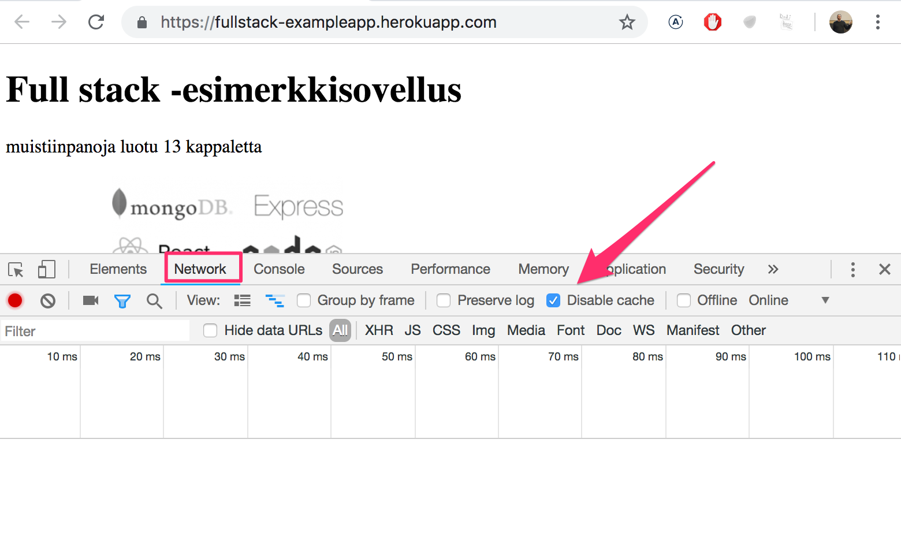

Varmista, että välilehti <i>Network</i> on avattuna ja aktivoi valinta <i>Disable cache</i> kuten kuvassa on tehty. Myös <i>Preserve logs</i> on joskus hyödyllinen, se säilyttää sovelluksen tulostamat logit sivujen uudelleenlatauksen yhteydessä.

**HUOM:** konsolin tärkein välilehti on <i>Console</i>. Käytämme nyt johdanto-osassa kuitenkin ensin melko paljon välilehteä <i>Network</i>.

### HTTP GET

Selain ja web-palvelin kommunikoivat keskenään [HTTP](https://developer.mozilla.org/fi/docs/Web/HTTP)-protokollaa käyttäen. Avoinna oleva konsolin Network-tabi kertoo miten selain ja palvelin kommunikoivat.

Kun päivität sivun (eli painat F5-näppäintä tai selaimessa olevaa symbolia &#8634;), kertoo konsoli, että tapahtuu kaksi asiaa

- selain hakee web-palvelimelta sivun <i>fullstack-exampleapp.herokuapp.com/</i> sisällön
- ja lataa kuvan <i>kuva.png</i>

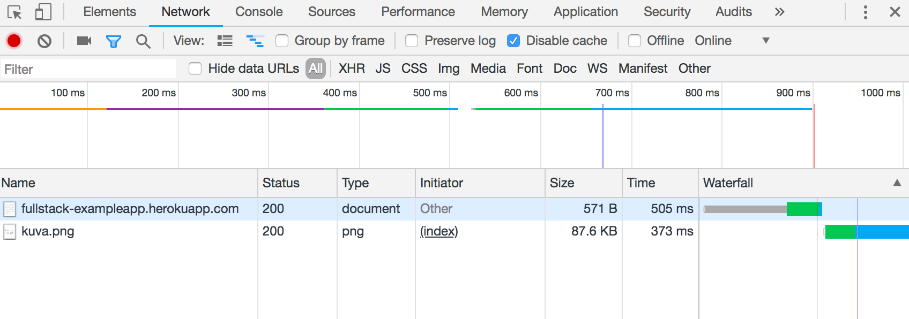

Jos ruutusi on pieni, saatat joutua suurentamaan konsoli-ikkunaa, jotta saat selaimen tekemät haut näkyviin.

Klikkaamalla näistä ensimmäistä, paljastuu tarkempaa tietoa siitä mistä on kyse:

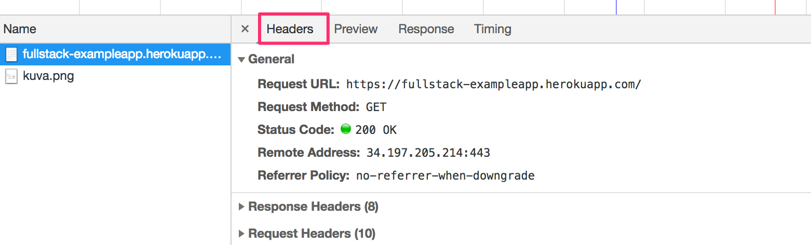

Ylimmästä osasta <i>General</i> selviää, että selain teki [GET](https://developer.mozilla.org/en-US/docs/Web/HTTP/Methods/GET)-metodilla pyynnön osoitteeseen <i>https://fullstack-exampleapp.herokuapp.com/</i> ja että pyyntö oli onnistunut, sillä pyyntöön saatiin vastaus, jonka [Status code](https://en.wikipedia.org/wiki/List_of_HTTP_status_codes) on 200.

Pyyntöön ja palvelimen lähettämään vastaukseen liittyy erinäinen määrä otsakkeita eli [headereita](https://en.wikipedia.org/wiki/List_of_HTTP_header_fields):

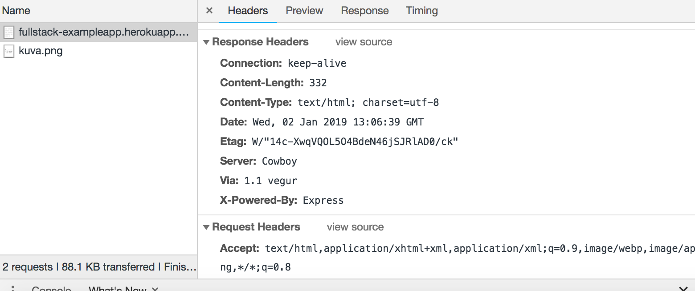

Ylempänä oleva <i>Response headers</i> kertoo mm. vastauksen koon tavuina ja vastaushetken. Tärkeä headeri [Content-Type](https://developer.mozilla.org/en-US/docs/Web/HTTP/Headers/Content-Type) kertoo, että vastaus on [utf-8](https://en.wikipedia.org/wiki/UTF-8)-muodossa oleva tekstitiedosto, jonka sisältö on muotoiltu HTML:llä. Näin selain tietää, että kyseessä on normaali [HTML](https://en.wikipedia.org/wiki/HTML)-sivu, joka tulee renderöidä käyttäjän selaimeen "websivun tavoin".

Välilehti <i>Response</i> näyttää, miltä pyyntöön vastauksena lähetetty data näyttää. Kyseessä on siis normaali HTML-sivu, jonka <i>body</i>-osassa määritellään selaimessa näytettävän sivun rakenne:


Sivu sisältää [div](https://developer.mozilla.org/en-US/docs/Web/HTML/Element/div)-elementin, jonka sisällä on otsikko sekä tieto luotujen muistiinpanojen määrästä, linkki sivulle <i>muistiinpanot</i> ja kuvaa vastaava [img](https://developer.mozilla.org/en-US/docs/Web/HTML/Element/img)-tagi.

img-tagin ansiosta selain tekee toisenkin <i>HTTP-pyynnön</i>, jonka avulla se hakee kuvan <i>kuva.png</i> palvelimelta. Pyynnön tiedot näyttävät seuraavalta:

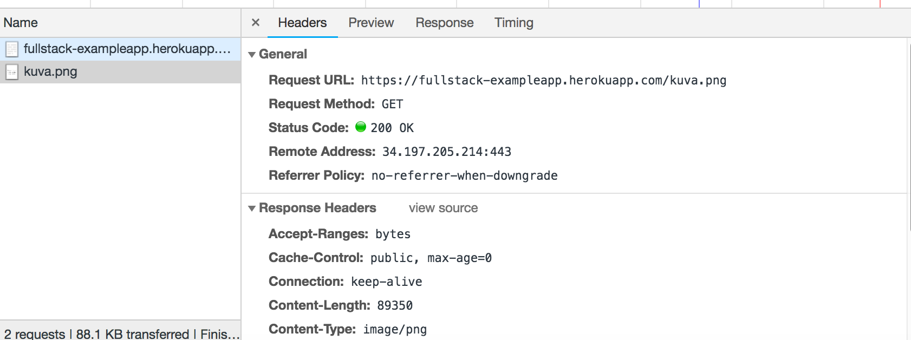

eli pyyntö on tehty osoitteeseen <https://fullstack-exampleapp.herokuapp.com/kuva.png> ja se on tyypiltään HTTP GET. Vastaukseen liittyvät headerit kertovat että vastauksen koko on 89350 tavua ja vastauksen [Content-type](https://developer.mozilla.org/en-US/docs/Web/HTTP/Headers/Content-Type) on <i>image/png</i>, eli kyseessä on png-tyyppinen kuva. Tämän tiedon ansiosta selain tietää, miten kuva on piirrettävä HTML-sivulle.

Sivun https://fullstack-exampleapp.herokuapp.com/ avaaminen selaimessa saa siis aikaan allaolevan [sekvenssikaavion](https://github.com/mluukkai/ohjelmistotekniikka-kevat2019/blob/master/web/materiaali.md#sekvenssikaaviot) kuvaaman tapahtumasarjan:

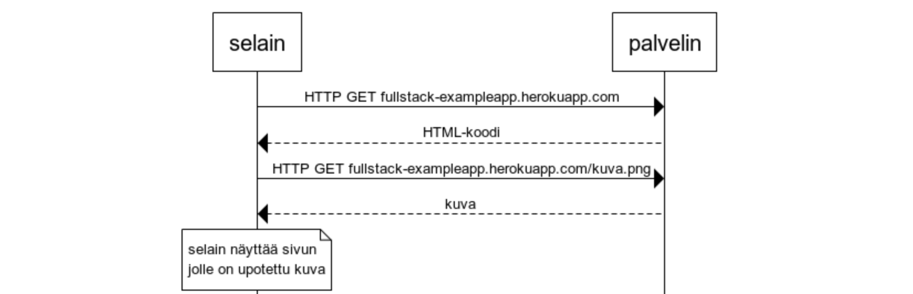

Ensin selain tekee palvelimelle HTTP GET -pyynnön, jonka avulla se hakee sivun HTML-koodin. HTML-koodissa olevan <i>img</i>-tagin ansiosta selain hakee palvelimelta kuvan <i>kuva.png</i>. Selain renderöi HTML-kielellä muotoillun sivun ja kuvan näytölle. Vaikka käyttäjä ei sitä helposti huomaa, alkaa sivu renderöityä näytölle jo ennen kuvan hakemista.

### Perinteinen web-sovellus

Esimerkkisovelluksen pääsivu toimii <i>perinteisen web-sovelluksen</i> tapaan. Mentäessä sivulle, selain hakee palvelimelta sivun strukturoinnin ja tekstuaalisen sisällön määrittelevän HTML-dokumentin.

Palvelin on muodostanut dokumentin jollain tavalla. Dokumentti voi olla <i>staattista sisältöä</i> eli palvelimen hakemistossa oleva tekstitiedosto. Dokumentti voi myös olla <i>dynaaminen</i>, eli palvelin voi muodostaa HTML-dokumentit ohjelmakoodin avulla hyödyntäen esim. tietokannassa olevaa dataa. Esimerkkisovelluksessa sivun HTML-koodi on muodostettu dynaamisesti, sillä se sisältää tiedon luotujen muistiinpanojen lukumäärästä.

Etusivun muodostava koodi näyttää seuraavalta:

```js
const getFrontPageHtml = noteCount => {
  return `
    <!DOCTYPE html>
    <html>
      <head>
      </head>
      <body>
        <div class="container">
          <h1>Full stack -esimerkkisovellus</h1>
          <p>muistiinpanoja luotu ${noteCount} kappaletta</p>
          <a href="/notes">muistiinpanot</a>
          
        </div>
      </body>
    </html>
  `
}

app.get('/', (req, res) => {
  const page = getFrontPageHtml(notes.length)
  res.send(page)
})
```

Koodia ei tarvitse vielä ymmärtää, mutta käytännössä HTML-sivun sisältö on talletettu ns. template stringinä, eli merkkijonona, jonka sekaan on mahdollisuus evaluoida esim. muuttujien arvoja. Etusivun dynaamisesti muuttuva osa, eli muistiinpanojen lukumäärä (koodissa <em>noteCount</em>) korvataan template stringissä sen hetkisellä konkreettisella lukuarvolla (koodissa <em>notes.length</em>).

HTML:n kirjoittaminen suoraan koodin sekaan ei tietenkään ole järkevää, mutta vanhan liiton PHP-ohjelmoijille se oli arkipäivää.

Perinteisissä websovelluksissa selain on "tyhmä", se ainoastaan pyytää palvelimelta HTML-muodossa olevia sisältöjä, kaikki sovelluslogiikka on palvelimessa. Palvelin voi olla tehty esim. kurssin [Web-palvelinohjelmointi](https://courses.helsinki.fi/fi/tkt21007/119558639) tapaan Java Springillä tai [tietokantasovelluksessa](https://materiaalit.github.io/tsoha-18/) käytetyllä Python Flaskillä tai [Ruby on Railsilla](http://rubyonrails.org/). Esimerkissä on käytetty Node.js:n [Express](https://expressjs.com/)-sovelluskehystä. Tulemme käyttämään kurssilla Node.js:ää ja Expressiä web-palvelimen toteuttamiseen.

### Selaimessa suoritettava sovelluslogiikka

Pidä konsoli edelleen auki. Tyhjennä konsolin näkymä painamalla vasemmalla olevaa &empty;-symbolia.

Kun menet nyt [muistiinpanojen](https://fullstack-exampleapp.herokuapp.com/notes) sivulle, selain tekee 4 HTTP-pyyntöä:

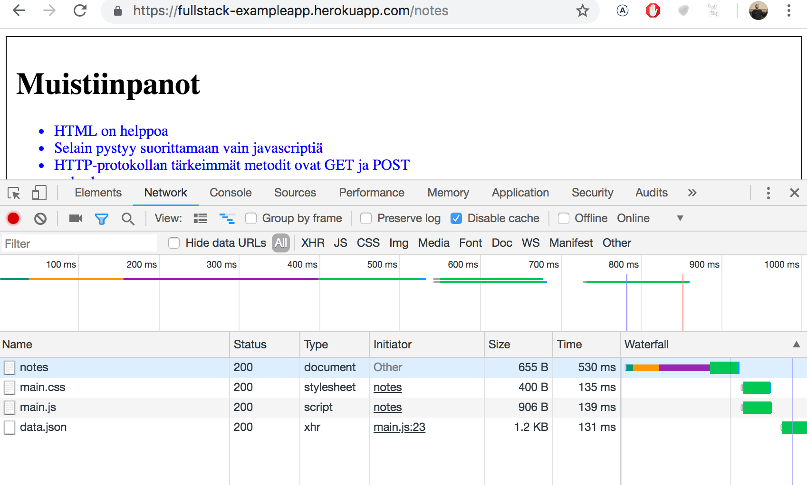

Kaikki pyynnöt ovat <i>eri tyyppisiä</i>. Ensimmäinen pyyntö on tyypiltään <i>document</i>.
Kyseessä on sivun HTML-koodi, joka näyttää seuraavalta:

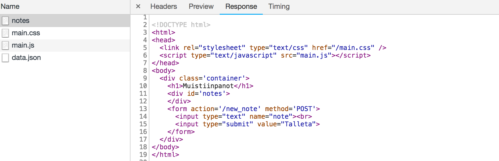

Kun vertaamme, selaimen näyttämää sivua ja pyynnön palauttamaa HTML-koodia, huomaamme, että koodi ei sisällä ollenkaan muistiinpanoja sisältävää listaa.

HTML-koodin [head](https://developer.mozilla.org/en-US/docs/Web/HTML/Element/head)-osio sisältää [script](https://developer.mozilla.org/en-US/docs/Web/HTML/Element/script)-tagin, jonka ansiosta selain lataa <i>main.js</i>-nimisen Javascript-tiedoston palvelimelta.

Ladattu Javascript-koodi näyttää seuraavalta:

```js
var xhttp = new XMLHttpRequest()

xhttp.onreadystatechange = function() {
  if (this.readyState == 4 && this.status == 200) {
    const data = JSON.parse(this.responseText)
    console.log(data)

    var ul = document.createElement('ul')
    ul.setAttribute('class', 'notes')

    data.forEach(function(note) {
      var li = document.createElement('li')

      ul.appendChild(li)
      li.appendChild(document.createTextNode(note.content))
    })

    document.getElementById('notes').appendChild(ul)
  }
)

xhttp.open('GET', '/data.json', true)
xhttp.send()
```

Koodin yksityiskohdat eivät ole tässä osassa oleellisia, koodia on kuitenkin liitetty mukaan tekstin ja kuvien mausteeksi. Pääsemme kunnolla koodin pariin vasta [osassa 1](/osa1). Tämän osan esimerkkisovelluksen koodi ei itseasiassa ole ollenkaan relevanttia kurssilla käytettävien ohjelmointitekniikoiden kannalta.

> Joku saattaa ihmetellä miksi käytössä on xhttp-olio eikä modernimpi fetch. Syynä on se, että tässä osassa ei haluta mennä ollenkaan promiseihin ja koodin rooli esimerkissä on muutenkin sekundäärinen. Palaamme osassa 2 uudenaikaisempiin tapoihin tehdä pyyntöjä palvelimelle.

Heti ladattuaan <i>script</i>-tagin sisältämän Javascriptin selain suorittaa koodin.

Kaksi viimeistä riviä määrittelevät, että selain tekee GET-tyyppisen HTTP-pyynnön palvelimen osoitteeseen <i>/data.json</i>:

```js
xhttp.open('GET', '/data.json', true)
xhttp.send()
```

Kyseessä on alin Network-välilehden näyttämistä selaimen tekemistä pyynnöistä.

Voimme kokeilla mennä osoitteeseen <https://fullstack-exampleapp.herokuapp.com/data.json> suoraan selaimella:

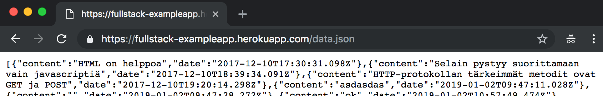

Osoitteesta löytyvät muistiinpanot [JSON](https://en.wikipedia.org/wiki/JSON)-muotoisena "raakadatana". Oletusarvoisesti selain ei osaa näyttää JSON-dataa kovin hyvin, mutta on olemassa lukuisia plugineja, jotka hoitavat muotoilun. Asenna nyt Chromeen esim. [JSONView](https://chrome.google.com/webstore/detail/jsonview/chklaanhfefbnpoihckbnefhakgolnmc) ja lataa sivu uudelleen. Data on nyt miellyttävämmin muotoiltua:

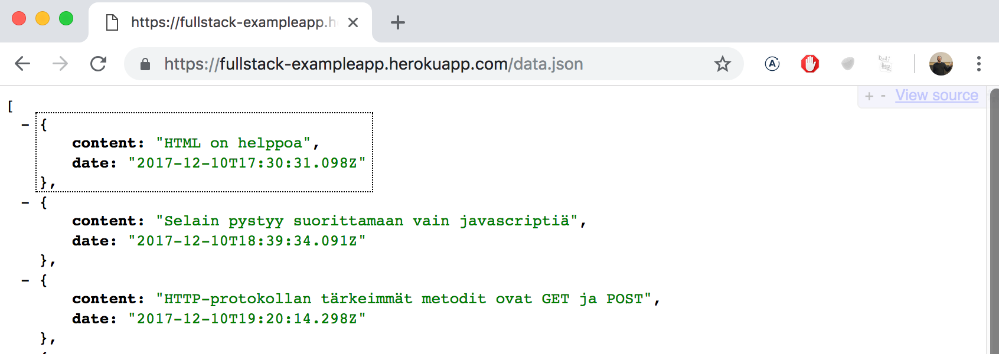

Ylläoleva muistiinpanojen sivun Javascript-koodi siis lataa muistiinpanot sisältävän JSON-muotoisen datan ja muodostaa datan avulla selaimeen "bulletlistan" muistiinpanojen sisällöstä:

Tämän saa aikaan seuraava koodi:

```js
const data = JSON.parse(this.responseText)
console.log(data)

var ul = document.createElement('ul')
ul.setAttribute('class', 'notes')

data.forEach(function(note) {
  var li = document.createElement('li')

  ul.appendChild(li)
  li.appendChild(document.createTextNode(note.content))
})

document.getElementById('notes').appendChild(ul)
```

Koodi muodostaa ensin järjestämätöntä listaa edustavan [ul](https://developer.mozilla.org/en-US/docs/Web/HTML/Element/ul)-tagin:

```js
var ul = document.createElement('ul')
ul.setAttribute('class', 'notes')
```

ja lisää ul:n sisään yhden [li](https://developer.mozilla.org/en-US/docs/Web/HTML/Element/li)-elementin kutakin muistiinpanoa kohti. Ainoastaan muistiinpanon <i>content</i>-kenttä tulee li-elementin sisällöksi, raakadatassa olevia aikaleimoja ei käytetä mihinkään.

```js
data.forEach(function(note) {
  var li = document.createElement('li')

  ul.appendChild(li)
  li.appendChild(document.createTextNode(note.content))
})
```

Avaa nyt konsolin <i>Console</i>-välilehti:

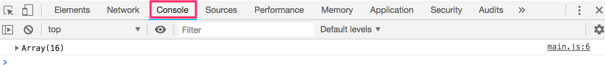

Painamalla rivin alussa olevaa kolmiota saat laajennettua konsolissa olevan rivin:

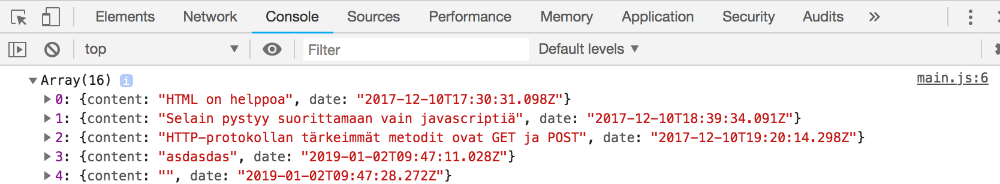

Konsoliin ilmestynyt tulostus johtuu siitä, että koodiin oli lisätty komento <em>console.log</em>:

```js
const data = JSON.parse(this.responseText)
console.log(data)
```

eli vastaanotettuaan datan palvelimelta, koodi tulostaa datan konsoliin.

Konsolin välilehti <i>Console</i> sekä komento <em>console.log</em> tulevat varmasti erittäin tutuiksi kurssin kuluessa.

### Tapahtumankäsittelijä ja takaisinkutsu

Koodin rakenne on hieman erikoinen:

```js
var xhttp = new XMLHttpRequest()

xhttp.onreadystatechange = function() {
  // koodi, joka käsittelee palvelimen vastauksen
}

xhttp.open('GET', '/data.json', true)
xhttp.send()
```

eli palvelimelle tehtävä pyyntö suoritetaan vasta viimeisellä rivillä. Palvelimen vastauksen käsittelyn määrittelevä koodi on kirjoitettu jo aiemmin. Mistä on kyse?

Rivillä

```js
xhttp.onreadystatechange = function () {
```

kyselyn tekevään <em>xhttp</em>-olioon määritellään <i>tapahtumankäsittelijä</i> (event handler) tilanteelle <i>onreadystatechange</i>. Kun kyselyn tekevän olion tila muuttuu, kutsuu selain tapahtumankäsittelijänä olevaa funktiota. Funktion koodi tarkastaa, että [readyState](https://developer.mozilla.org/en-US/docs/Web/API/XMLHttpRequest/readyState):n arvo on 4 (joka kuvaa tilannetta <i>The operation is complete</i>) ja, että vastauksen HTTP-statuskoodi on onnistumisesta kertova 200.

```js
xhttp.onreadystatechange = function() {
  if (this.readyState == 4 && this.status == 200) {
    // koodi, joka käsittelee palvelimen vastauksen
  }
)
```

Tapahtumankäsittelijöihin liittyvä mekanismi koodin suorittamiseen on Javascriptissä erittäin yleistä. Tapahtumankäsittelijöinä olevia Javascript-funktioita kutsutaan [callback](https://developer.mozilla.org/en-US/docs/Glossary/Callback_function)- eli takaisinkutsufunktioiksi, sillä sovelluksen koodi ei kutsu niitä itse, vaan suoritusympäristö, eli web-selain suorittaa funktion kutsumisen sopivana ajankohtana, eli kyseisen <i>tapahtuman</i> tapahduttua.

### Document Object Model eli DOM

Voimme ajatella, että HTML-sivut muodostavat implisiittisen puurakenteen

<pre>
html
  head
    link
    script
  body
    div
      h1
      div
        ul
          li
          li
          li
      form
        input
        input
</pre>

Sama puumaisuus on nähtävissä konsolin välilehdellä </i>Elements</i>:

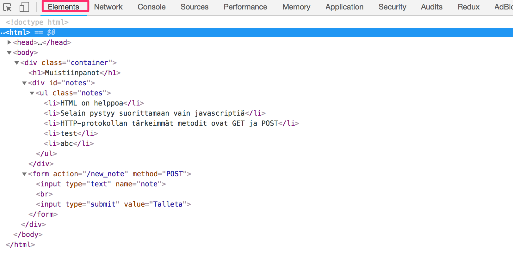

Selainten toiminta perustuukin ideaan esittää HTML-elementit puurakenteena.

Document Object Model eli [DOM](https://en.wikipedia.org/wiki/Document_Object_Model) on ohjelmointirajapinta eli <i>API</i>, joka mahdollistaa selaimessa esitettävien web-sivuja vastaavien <i>elementtipuiden</i> muokkaamisen ohjelmallisesti.

Edellisessä luvussa esittelemämme Javascript-koodi käytti nimenomaan DOM-apia lisätäkseen sivulle muistiinpanojen listan.

Allaoleva koodi luo muuttujaan <em>ul</em> DOM-apin avulla uuden "solmun" ja lisää sille joukon lapsisolmuja:

```js
var ul = document.createElement('ul')

data.forEach(function(note) {
  var li = document.createElement('li')

  ul.appendChild(li)
  li.appendChild(document.createTextNode(note.content))
})
```

lopulta muuttujassa <em>ul</em> oleva puun palanen yhdistetään sopivaan paikkaan koko sovelluksen HTML-koodia edustavassa puussa:

```js
document.getElementById('notes').appendChild(ul)
```

### document-olio ja sivun manipulointi konsolista

HTML-dokumenttia esittävän DOM-puun ylimpänä solmuna on olio nimeltään <em>document</em>. Olioon pääsee käsiksi Console-välilehdeltä:

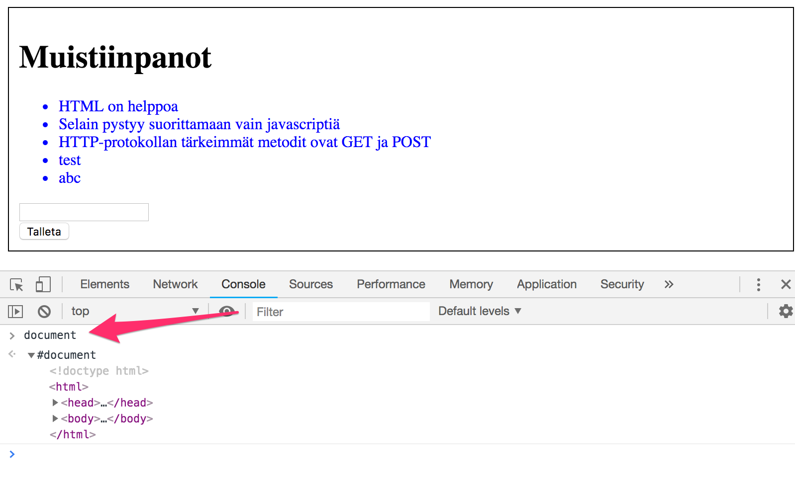


Voimme suorittaa konsolista käsin DOM-apin avulla erilaisia operaatioita selaimessa näytettävälle web-sivulle hyödyntämällä <em>document</em>-olioa.

Lisätään nyt sivulle uusi muistiinpano suoraan konsolista.

Haetaan ensin sivulta muistiinpanojen lista, eli sivun ul-elementeistä ensimmäinen:

```js
lista = document.getElementsByTagName('ul')[0]
```

luodaan uusi li-elementti ja lisätään sille sopiva tekstisisältö:

```js
uusi = document.createElement('li')
uusi.textContent = 'Sivun manipulointi konsolista on helppoa'
```

liitetään li-elementti listalle:

```js
lista.appendChild(uusi)
```

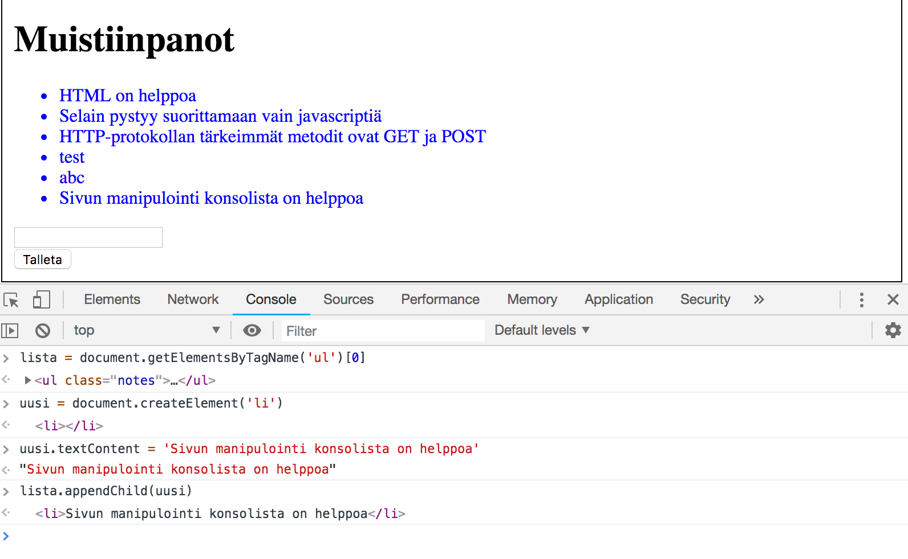

Vaikka selaimen näyttämä sivu päivittyy, ei muutos ole lopullinen. Jos sivu uudelleenladataan, katoaa uusi muistiinpano, sillä muutos ei mennyt palvelimelle asti. Selaimen lataama Javascript luo muistiinpanojen listan aina palvelimelta osoitteesta <https://fullstack-exampleapp.herokuapp.com/data.json> haettavan JSON-muotoisen raakadatan perusteella.

### CSS

Muistiinpanojen sivun HTML-koodin <i>head</i>-osio sisältää [link](https://developer.mozilla.org/en-US/docs/Web/HTML/Element/link)-tagin, joka määrittelee, että selaimen tulee ladata palvelimelta osoitteesta [main.css](https://fullstack-exampleapp.herokuapp.com/main.css) sivulla käytettävä [CSS](https://developer.mozilla.org/en-US/docs/Web/CSS)-tyylitiedosto.

Cascading Style Sheets eli CSS on kieli, jonka avulla web-sovellusten ulkoasu määritellään.

Ladattu css-tiedosto näyttää seuraavalta:

```css
.container {
  padding: 10px;
  border: 1px solid;
}

.notes {
  color: blue;
}
```

Tiedosto määrittelee kaksi [luokkaselektoria](https://developer.mozilla.org/en-US/docs/Web/CSS/Class_selectors), joiden avulla valitaan tietty sivun alue ja määritellään alueelle sovellettavat tyylisäännöt.

Luokkaselektori alkaa aina pisteellä ja sisältää luokan nimen.

Luokat ovat [attribuutteja](https://developer.mozilla.org/en-US/docs/Web/HTML/Global_attributes/class) joita voidaan liittää HTML-elementeille.

Konsolin <i>Elements</i>-välilehti mahdollistaa class-attribuuttien tarkastelun:

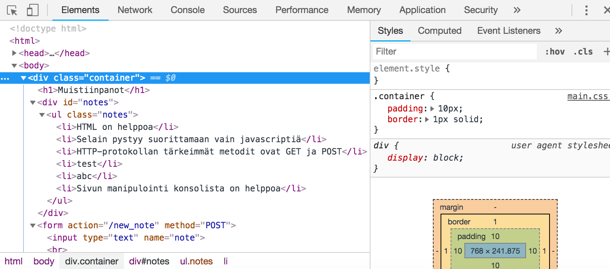

sovelluksen uloimmalle <i>div</i>-elementille on siis liitetty luokka <i>container</i>. Muistiinpanojen listan sisältävä <i>ul</i>-elementin sisällä oleva lista sisältää luokan <i>notes</i>.

CSS-säännön avulla on määritelty, että <i>container</i>-luokan sisältävä elementti ympäröidään yhden pikselin paksuisella [border](https://developer.mozilla.org/en-US/docs/Web/CSS/border):illa. Elementille asetetaan myös 10 pikselin [padding](https://developer.mozilla.org/en-US/docs/Web/CSS/padding), jonka ansiosta elementin sisällön ja elementin ulkorajan väliin jätetään hieman tilaa.

Toinen määritelty CSS-sääntö asettaa muistiinpanojen kirjainten värin siniseksi.

HTML-elementeillä on muitakin attribuutteja kuin luokkia. Muistiinpanot sisältävä <i>div</i>-elementti sisältää [id](https://developer.mozilla.org/en-US/docs/Web/HTML/Global_attributes/id)-attribuutin. Javascript-koodi hyödyntää attribuuttia elementin etsimiseen.

Konsolin <i>Elements</i>-välilehdellä on mahdollista manipuloida elementtien tyylejä:

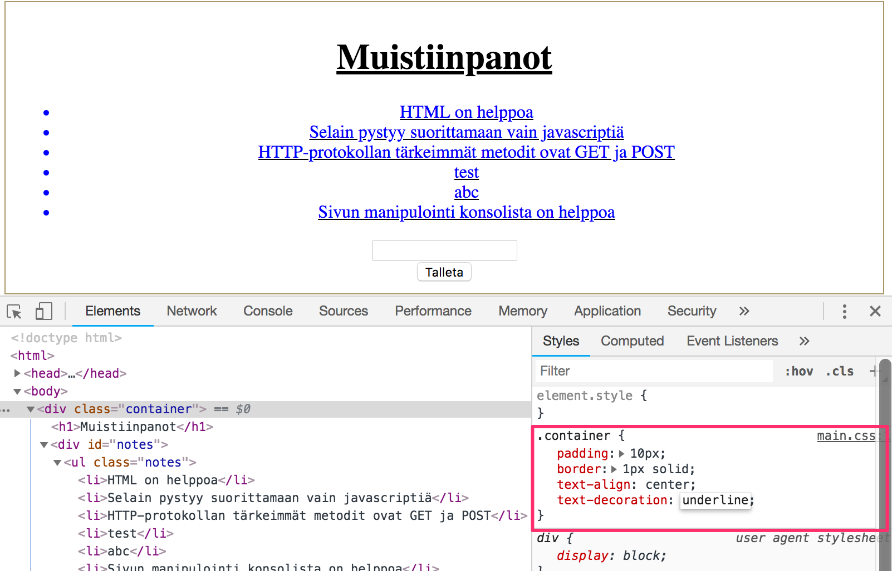

Tehdyt muutokset eivät luonnollisestikaan jää voimaan kun selaimen sivu uudelleenladataan, eli jos muutokset halutaan pysyviksi, tulee ne konsolissa tehtävien kokeilujen jälkeen tallettaa palvelimella olevaan tyylitiedostoon.

### Javascriptia sisältävän sivun lataaminen - kertaus

Kerrataan vielä mitä tapahtuu kun selaimessa avataan sivu https://fullstack-exampleapp.herokuapp.com/notes

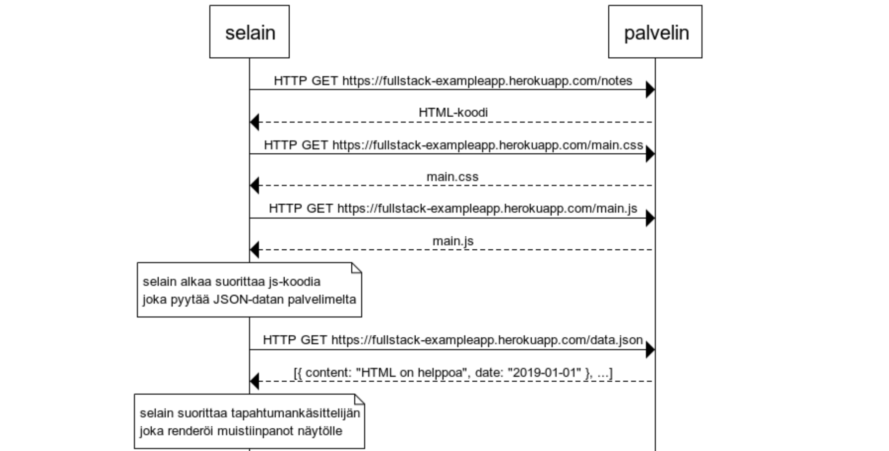

- selain hakee palvelimelta sivun sisällön ja rakenteen määrittelevän HTML-koodin HTTP GET -pyynnöllä
- HTML-koodi saa aikaan sen, että selain hakee sivun tyylit määrittelevän tiedoston <i>main.css</i>
- sekä Javascript-koodia sisältävän tiedoston <i>main.js</i>
- selain alkaa suorittaa hakemaansa Javascript-koodia, joka tekee HTTP GET -pyynnön muistiinpanot json-muotoisena raakadatana palauttavaan osoitteeseen https://fullstack-exampleapp.herokuapp.com/data.json
- datan saapuessa selain suorittaa <i>tapahtumankäsittelijän</i>, joka renderöi DOM-apia hyväksikäyttäen muistiinpanot ruudulle

### Lomake ja HTTP POST

Tutkitaan seuraavaksi sitä, miten uusien muistiinpanojen luominen tapahtuu. Tätä varten muistiinpanojen sivu sisältää lomakkeen eli [form-elementin](https://developer.mozilla.org/en-US/docs/Learn/HTML/Forms/Your_first_HTML_form).

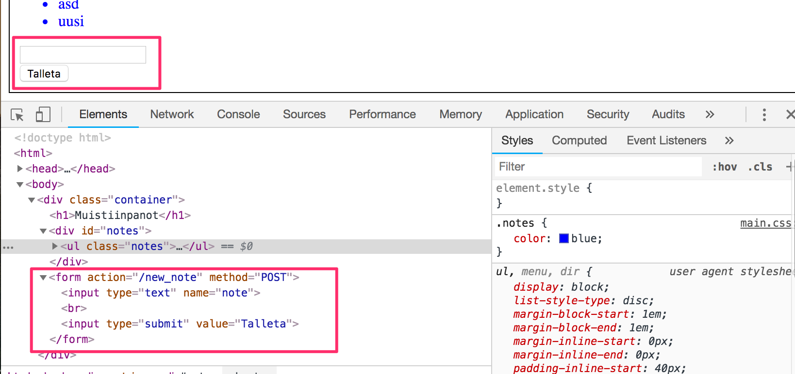

Kun lomakkeen painiketta painetaan, lähettää selain lomakkeelle syötetyn datan palvelimelle. Avataan <i>Network</i>-välilehti ja katsotaan miltä lomakkeen lähettäminen näyttää:


Lomakkeen lähettäminen aiheuttaa yllättäen yhteensä <i>viisi</i> HTTP-pyyntöä. Näistä ensimmäinen vastaa lomakkeen lähetystapahtumaa. Tarkennetaan siihen:

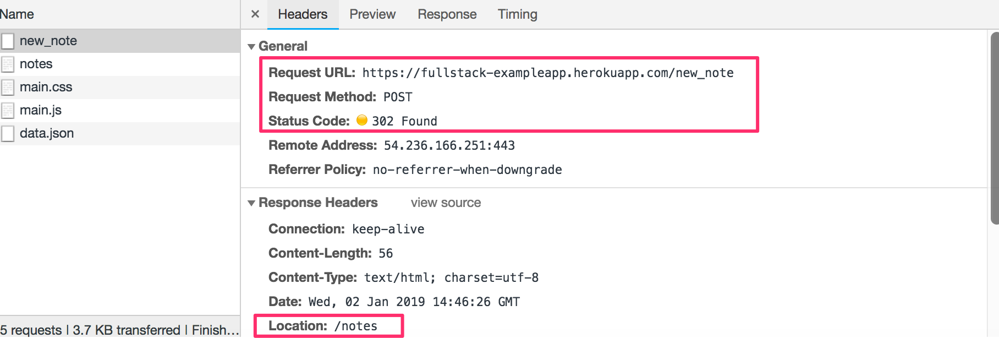

Kyseessä on siis [HTTP POST](https://developer.mozilla.org/en-US/docs/Web/HTTP/Methods/POST) -pyyntö ja se on tehty palvelimen osoitteeseen <i>new\_note</i>. Palvelin vastaa pyyntöön HTTP-statuskoodilla 302. Kyseessä on ns. [uudelleenohjauspyyntö](https://en.wikipedia.org/wiki/URL_redirection) eli redirectaus, minkä avulla palvelin kehottaa selainta tekemään automaattisesti uuden HTTP GET -pyynnön headerin <i>Location</i> kertomaan paikkaan, eli osoitteeseen <i>notes</i>.

Selain siis lataa uudelleen muistiinpanojen sivun. Sivunlataus saa aikaan myös kolme muuta HTTP-pyyntöä: tyylitiedoston (main.css), Javascript-koodin (main.js) ja muistiinpanojen raakadatan (data.json) lataamisen.

Network-välilehti näyttää myös lomakkeen mukana lähetetyn datan:

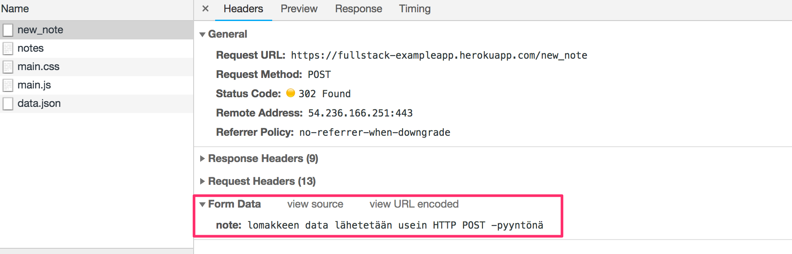

Lomakkeen lähettäminen tapahtuu HTTP POST -pyyntönä ja osoitteeseen <i>new_note</i> form-tagiin määriteltyjen attribuuttien <i>action</i>  ja <i>method</i>  ansiosta:

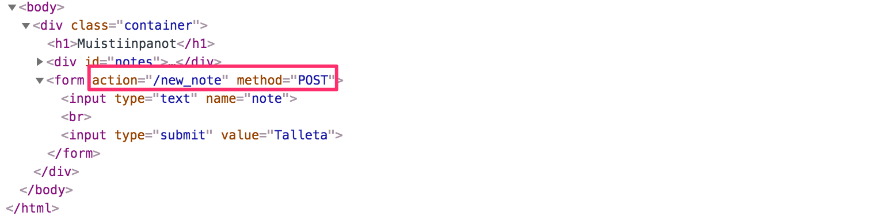

POST-pyynnöstä huolehtiva palvelimen koodi on yksinkertainen (huom: tämä koodi on siis palvelimella eikä näy selaimen lataamassa Javascript-tiedostossa):

```js
app.post('/new_note', (req, res) => {
  notes.push({
    content: req.body.note,
    date: new Date(),
  })

  return res.redirect('/notes')
})
```

POST-pyyntöihin liitettävä data lähetetään pyynnön mukana "runkona" eli [bodynä](https://developer.mozilla.org/en-US/docs/Web/HTTP/Methods/POST). Palvelin saa POST-pyynnön datan pyytämällä sitä pyyntöä vastaavan olion <em>req</em> kentästä <em>req.body</em>.

Tekstikenttään kirjoitettu data on kentässä <i>note</i>, eli palvelin viittaa siihen <em>req.body.note</em>.

Palvelin luo uutta muistiinpanoa vastaavan olion ja laittaa sen muistiinpanot sisältävään taulukkoon nimeltään <em>notes</em>:

```js
notes.push({
  content: req.body.note,
  date: new Date(),
})
```

Muistiinpano-olioilla on siis kaksi kenttää, varsinaisen sisällön kuvaava <i>content</i> ja luomishetken kertova <i>date</i>.

Palvelin ei talleta muistiinpanoja tietokantaan, joten uudet muistiinpanot katoavat aina Herokun uudelleenkäynnistäessä palvelun.

### AJAX

Sovelluksen muistiinpanojen sivu noudattaa vuosituhannen alun tyyliä ja se "käyttää AJAX:ia", eli on silloisen kehityksen aallonharjalla.

[AJAX](<https://en.wikipedia.org/wiki/Ajax_(programming)>) (Asynchronous Javascript and XML) on termi, joka lanseerattiin vuoden 2005 helmikuussa kuvaamaan selainten kehityksen mahdollistamaa vallankumouksellista tapaa, missä HTML-sivulle sisällytetyn Javascriptin avulla oli mahdollista ladata sivulle lisää sisältöä lataamatta itse sivua uudelleen.

Ennen AJAX:in aikakautta jokainen sivu toimi aiemmassa luvussa olevan [perinteisen web-sovelluksen](/osa0#perinteinen-web-sovellus) tapaan, eli oleellisesti ottaen kaikki sivuilla näytettävä data tuli palvelimen generoimassa HTML-koodissa.

Muistiinpanojen sivu siis lataa näytettävän datan AJAX:illa. Lomakkeen lähetys sen sijaan tapahtuu perinteisen web-lomakkeen lähetysmekanismin kautta.

Sovelluksen urlit heijastavat vanhaa huoletonta aikaa. JSON-muotoinen data haetaan urlista <https://fullstack-exampleapp.herokuapp.com/data.json> ja uuden muistiinpanon tiedot lähetetään urliin <https://fullstack-exampleapp.herokuapp.com/new_note>. Nykyään näin valittuja urleja ei pidettäisi ollenkaan hyvinä, ne eivät noudata ns. [RESTful](https://en.wikipedia.org/wiki/Representational_state_transfer#Applied_to_Web_services)-apien yleisesti hyväksyttyjä konventioita. Käsittelemme asiaa tarkemmin [osassa 3](/osa3).

AJAXiksi kutsuttu asia on arkipäiväistynyt, ja muuttunut itsestäänselvyydeksi. Koko termi on hiipunut unholaan ja nuori polvi ei ole sitä edes ikinä kuullut.

### Single page app

Esimerkkisovelluksemme pääsivu toimii perinteisten web-sivujen tapaan: kaikki sovelluslogiikka on palvelimella ja selain ainoastaan renderöi palvelimen lähettämää HTML-koodia.

Muistiinpanoista huolehtivassa sivussa osa sovelluslogiikasta, eli olemassaolevien muistiinpanojen HTML-koodin generointi on siirretty selaimen vastuulle. Selain hoitaa tehtävän suorittamalla palvelimelta lataamansa Javascript-koodin. Selaimella suoritettava koodi hakee ensin muistiinpanot palvelimelta JSON-muotoisena raakadatana ja lisää sivulle muistiinpanoja edustavat HTML-elementit [DOM-apia](/osa0#document-object-model-eli-dom) hyödyntäen.

Viimeisten vuosien aikana on noussut esiin tyyli tehdä web-sovellukset käyttäen [Single-page application](https://en.wikipedia.org/wiki/Single-page_application) (SPA) -tyyliä, missä sovelluksilla ei enää ole esimerkkisovelluksemme tapaan erillisiä, palvelimen sille lähettämiä sivuja, vaan sovellus koostuu ainoastaan yhdestä palvelimen lähettämästä HTML-sivusta, jonka sisältöä manipuloidaan selaimessa suoritettavalla Javascriptillä.

Sovelluksemme muistiinpanosivu muistuttaa jo hiukan SPA-tyylistä sovellusta. Sitä se ei kuitenkaan vielä ole, sillä vaikka muistiinpanojen renderöintilogiikka on toteutettu selaimessa, käyttää sivu vielä perinteistä mekanismia uusien muistiinpanojen luomiseen, eli se lähettää uuden muistiinpanon tiedot lomakkeen avulla ja palvelin pyytää <i>uudelleenohjauksen</i> avulla selainta lataamaan muistiinpanojen sivun uudelleen.

Osoitteesta <https://fullstack-exampleapp.herokuapp.com/spa> löytyy sovelluksen single page app -versio.

Sovellus näyttää ensivilkaisulta täsmälleen samalta kuin edellinen versio.

HTML-koodi on lähes samanlainen, erona on ladattava Javascript-tiedosto (<i>spa.js</i>) ja pieni muutos form-tagin määrittelyssä:

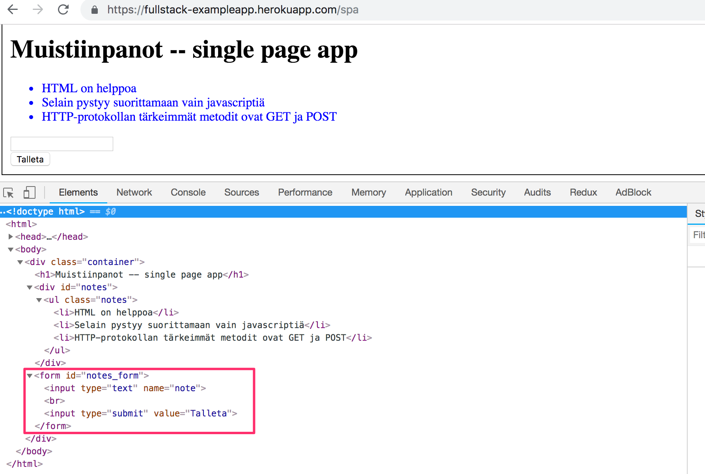

Lomakkeelle ei ole nyt määritelty ollenkaan <i>action</i>- eikä <i>method</i>-attribuutteja, jotka määräävät minne ja miten selain lähettää lomakkeelle syötetyn datan.

Avaa nyt <i>Network</i>-välilehti ja tyhjennä se &empty;-symbolilla. Kun luot uuden muistiinpanon, huomaat, että selain lähettää ainoastaan yhden pyynnön palvelimelle:

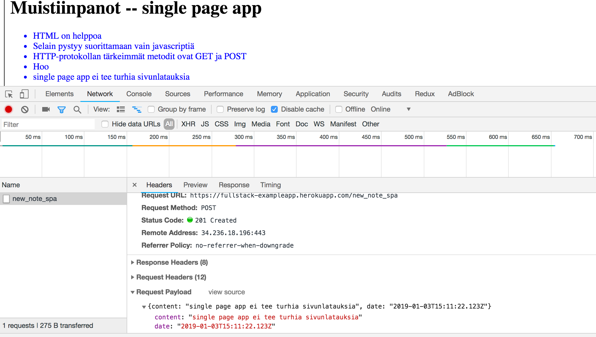

Pyyntö kohdistuu osoitteeseen <i>new\_note\_spa</i>, on tyypiltään POST ja se sisältää JSON-muodossa olevan uuden muistiinpanon, johon kuuluu sekä sisältö (<i>content</i>), että aikaleima (<i>date</i>):

```js
{
  content: "single page app ei tee turhia sivunlatauksia",
  date: "2019-01-03T15:11:22.123Z"
}
```

Pyyntöön liitetty headeri <i>Content-Type</i> kertoo palvelimelle, että pyynnön mukana tuleva data on JSON-muotoista:

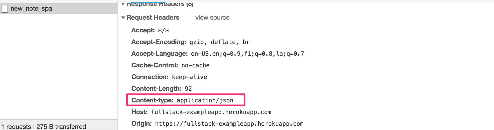

Ilman headeria palvelin ei osaisi parsia pyynnön mukana tulevaa dataa oiken.

Palvelin vastaa kyselyyn statuskoodilla [201 created](https://httpstatuses.com/201). Tällä kertaa palvelin ei pyydä uudelleenohjausta kuten aiemmassa versiossamme. Selain pysyy samalla sivulla ja muita HTTP-pyyntöjä ei suoriteta.

Ohjelman single page app -versiossa lomakkeen tietoja ei lähetetä selaimen normaalin lomakkeiden lähetysmekanismin avulla, lähettämisen hoitaa selaimen lataamassa Javascript-tiedostossa määritelty koodi. Katsotaan hieman koodia vaikka yksityiskohdista ei tarvitse nytkään välittää liikaa.

```js
var form = document.getElementById('notes_form')
form.onsubmit = function(e) {
  e.preventDefault()

  var note = {
    content: e.target.elements[0].value,
    date: new Date(),
  )

  notes.push(note)
  e.target.elements[0].value = ''
  redrawNotes()
  sendToServer(note)
)
```

Komennolla <em>document.getElementById('notes\_form')</em> koodi hakee sivulta lomake-elementin ja rekisteröi sille <i>tapahtumankäsittelijän</i> hoitamaan tilanteen, missä lomake "submitoidaan", eli lähetetään. Tapahtumankäsittelijä kutsuu heti metodia <em>e.preventDefault()</em> jolla se estää lomakkeen lähetyksen oletusarvoisen toiminnan. Oletusarvoinen toiminta aiheuttaisi lomakkeen lähettämisen ja sivun uudelleen lataamisen, sitä emme single page -sovelluksissa halua tapahtuvan.

Tämän jälkeen se luo muistiinpanon, lisää sen muistiinpanojen listalle komennolla <em>notes.push(note)</em>, piirtää ruudun sisällön eli muistiinpanojen listan uudelleen ja lähettää uuden muistiinpanon palvelimelle.

Palvelimelle muistiinpanon lähettävä koodi on seuraavassa:

```js
var sendToServer = function(note) {
  var xhttpForPost = new XMLHttpRequest()
  // ...

  xhttpForPost.open('POST', '/new_note_spa', true)
  xhttpForPost.setRequestHeader(
    'Content-type', 'application/json'
  )
  xhttpForPost.send(JSON.stringify(note))
)
```

Koodissa siis määritellään, että kyse on HTTP POST -pyynnöstä, määritellään headerin <i>Content-type</i> avulla lähetettävän datan tyypiksi JSON, ja lähetetään data JSON-merkkijonona.

Sovelluksen koodi on nähtävissä osoitteessa <https://github.com/mluukkai/example_app>. Kannattaa huomata, että sovellus on tarkoitettu ainoastaan kurssin käsitteistöä demonstroivaksi esimerkiksi, koodi on osin tyyliltään huonoa ja siitä ei tule ottaa mallia omia sovelluksia tehdessä. Sama koskee käytettyjä urleja, single page app -tyyliä noudattavan sivun käyttämä uusien muistiinpanojen kohdeosoite <i>new\_note\_spa</i> ei noudata nykyisin suositeltavia käytäntöjä.

### Javascript-kirjastot

Kurssin esimerkkisovellus on tehty ns. [vanilla Javascriptillä](https://medium.freecodecamp.org/is-vanilla-javascript-worth-learning-absolutely-c2c67140ac34) eli käyttäen pelkkää DOM-apia ja Javascript-kieltä sivujen rakenteen manipulointiin.

Pelkän Javascriptin ja DOM-apin käytön sijaan Web-ohjelmoinnissa hyödynnetään yleensä kirjastoja, jotka sisältävät DOM-apia helpommin käytettäviä työkaluja sivujen muokkaamiseen. Eräs tälläinen kirjasto on edelleenkin hyvin suosittu [JQuery](https://jquery.com/).

JQuery on kehitetty aikana, jolloin web-sivut olivat vielä suurimmaksi osaksi perinteisiä, eli palvelin muodosti HTML-sivuja, joiden toiminnallisuutta rikastettiin selaimessa JQueryllä kirjoitetun Javascript-koodin avulla. Yksi syy JQueryn suosion taustalla oli niin sanottu cross-browser yhteensopivuus, eli kirjasto toimi selaimesta ja selainvalmistajasta riippumatta samalla tavalla, eikä sitä käyttäessä ollut enää tarvetta kirjoittaa selainversiospesifisiä ratkaisuja. Nykyisin tavallisen JQueryn käyttö ei ole enää yhtä perusteltua kuin aikaisemmin, sillä vanillaJS on kehittynyt paljon ja käytetyimmät selaimet tukevat yleisesti ottaen hyvin perustoiminnallisuuksia.

Single page app -tyylin noustua suosioon on ilmestynyt useita JQueryä "modernimpia" tapoja sovellusten kehittämiseen. Ensimmäisen aallon suosikki oli [BackboneJS](http://backbonejs.org/). Googlen kehittämä [AngularJS](https://angularjs.org/) nousi 2012 tapahtuneen [julkaisun](https://github.com/angular/angular.js/blob/master/CHANGELOG.md#100-temporal-domination-2012-06-13) jälkeen erittäin nopeasti lähes de facto -standardin asemaan modernissa web-sovelluskehityksessä.

Angularin suosio kuitenkin romahti siinä vaiheessa kun Angular-tiimi [ilmoitti](https://jaxenter.com/angular-2-0-announcement-backfires-112127.html) lokakuussa 2014, että version 1 tuki lopetetaan ja Angular 2 ei tule olemaan taaksepäin yhteensopiva ykkösversion kanssa. Angular 2 ja uudemmat versiot eivät ole saaneet kovin innostunutta vastaanottoa.

Nykyisin suosituin tapa toteuttaa web-sovellusten selainpuolen logiikka on Facebookin kehittämä [React](https://reactjs.org/)-kirjasto. Tulemme tutustumaan kurssin aikana Reactiin ja sen kanssa yleisesti käytettyyn [Redux](https://github.com/reactjs/redux)-kirjastoon.

Reactin asema näyttää tällä hetkellä vahvalta, mutta Javascript-maailma ei lepää koskaan. Viime aikoina kiinnostusta on alkanut herättää mm. uudempi tulokas [VueJS](https://vuejs.org/).

### Full stack -websovelluskehitys

Mitä tarkoitetaan kurssin nimellä <i>Full stack -websovelluskehitys</i>? Full stack on hypenomainen termi; kaikki puhuvat siitä, mutta kukaan ei oikein tiedä, mitä se tarkoittaa tai ainakaan mitään yhteneväistä määritelmää termille ei ole.

Käytännössä kaikki websovellukset sisältävät (ainakin) kaksi "kerrosta", ylempänä, eli lähempänä loppukäyttäjää olevan selaimen ja alla olevan palvelimen. Palvelimen alapuolella on usein vielä tietokanta. Näin websovelluksen <i>arkkitehtuurin</i> voi ajatella muodostavan pinon, englanniksi <i>stack</i>.

Websovelluskehityksen yhteydessä puhutaan usein myös "frontista" ([frontend](https://en.wikipedia.org/wiki/Front_and_back_ends)) ja "backistä" ([backend](https://en.wikipedia.org/wiki/Front_and_back_ends)). Selain on frontend ja selaimessa suoritettava Javascript on frontend-koodia. Palvelimella taas pyörii backend-koodi.

Tämän kurssin kontekstissa full stack -sovelluskehitys tarkoittaa sitä, että fokus on kaikissa sovelluksen osissa, niin frontendissä kuin backendissä sekä taustalla olevassa tietokannassa. Myös palvelimen käyttöjärjestelmä ja sen ohjelmistot lasketaan usein osaksi stackia, niihin emme kuitenkaan tällä kurssilla puutu.

Ohjelmoimme myös palvelinpuolta, eli backendia Javascriptilla, käyttäen [Node.js](https://nodejs.org/en/)-suoritusympäristöä. Näin full stack -sovelluskehitys saa vielä uuden ulottuvuuden, kun voimme käyttää samaa ohjelmointikieltä pinon useammassa kerroksessa. Full stack -sovelluskehitys ei välttämättä edellytä sitä, että kaikissa "sovelluspinon" kerroksissa on käytössä sama kieli (Javascript).

Aiemmin on ollut yleisempää, että sovelluskehittäjät ovat erikoistuneet tiettyyn sovelluksen osaan, esim. backendiin. Tekniikat backendissa ja frontendissa ovat saattaneet olla hyvin erilaisia. Full stack -trendin myötä on tullut tavanomaiseksi, että sovelluskehittäjä hallitsee riittävästi kaikkia sovelluksen tasoja ja tietokantaa. Usein full stack -kehittäjän on myös omattava riittävä määrä konfiguraatio- ja ylläpito-osaamista, jotta kehittäjä pystyy operoimaan sovellustaan esim. pilvipalveluissa.

### Javascript fatigue

Full stack -sovelluskehitys on monella tapaa haastavaa. Asioita tapahtuu monessa paikassa ja mm. debuggaaminen on oleellisesti normaalia työpöytäsovellusta hankalampaa. Javascript ei toimi aina niin kuin sen olettaisi toimivan (verrattuna moniin muihin kieliin) ja sen suoritusympäristöjen asynkroninen toimintamalli aiheuttaa monenlaisia haasteita. Verkon yli tapahtuva kommunikointi edellyttää HTTP-protokollan tuntemusta. On tunnettava myös tietokantoja ja hallittava palvelinten konfigurointia ja ylläpitoa. Hyvä olisi myös hallita riittävästi CSS:ää, jotta sovellukset saataisiin edes siedettävän näköisiksi.

Oman haasteensa tuo vielä se, että Javascript-maailma etenee koko ajan todella kovaa vauhtia eteenpäin. Kirjastot, työkalut ja itse kielikin ovat jatkuvan kehityksen alla. Osa alkaa kyllästyä nopeaan kehitykseen ja sitä kuvaamaan on lanseerattu termi [Javascript](https://medium.com/@ericclemmons/javascript-fatigue-48d4011b6fc4) [fatigue](https://auth0.com/blog/how-to-manage-javascript-fatigue/) eli [Javascript](https://hackernoon.com/how-it-feels-to-learn-javascript-in-2016-d3a717dd577f)-väsymys.

Javascript-väsymys tulee varmasti iskemään myös tällä kurssilla. Onneksi nykyään on olemassa muutamia tapoja loiventaa oppimiskäyrää, ja voimme aloittaa keskittymällä konfiguraation sijaan koodaamiseen. Konfiguraatioita ei voi välttää, mutta seuraavat viikot voimme edetä iloisin mielin vailla pahimpia konfiguraatiohelvettejä.

</div>

<div class="tasks"> 
  <h3>Tehtäviä</h3>

Tehtävät palautetaan GitHubin kautta ja merkitsemällä tehdyt tehtävät [palautussovellukseen](https://studies.cs.helsinki.fi/fullstackopen2019/).

Voit palauttaa kurssin kaikki tehtävät samaan repositorioon, tai käyttää useita repositorioita. Jos palautat eri osien tehtäviä samaan repositorioon, käytä järkevää hakemistojen nimentää. Jos käytät privaattirepositorioa tehtävien palautukseen liitä repositoriolle collaboratoriksi _mluukkai_

Eräs varsin toimiva hakemistorakenne palautusrepositoriolle on seuraava

```
osa0
osa1
  kurssitiedot
  unicafe
  anekdootit
osa2
  puhelinluettelo
  maiden_tiedot
```

Eli kutakin osaa kohti on oma hakemistonsa, joka vielä jakautuu tehtäväsarjat (kuten osan 1 unicafe) sisältäviin hakemistoihin.

Tehtävät palautetaan **yksi osa kerrallaan**. Kun olet palauttanut osan tehtävät, et voi enää palauttaa saman osan tekemättä jättämiäsi tehtäviä.

**Vinkki:** Kun olet avaamassa tehtävääsi Visual Studio Codella, huomaathan avata koko projektin kansion editoriin. Tämä mahdollistaa editorissa helpomman tiedostojen välillä siirtymisen ja paremmat automaattiset täydennykset. Saat tämän tehtyä siirtymällä terminaalissa projektin kansioon ja suorittamalla komennon:

```bash
$ code .
```

  <h4>0.1: HTML</h4>

Kertaa HTML:n perusteet lukemalla Mozillan tutoriaali [HTML:stä](https://developer.mozilla.org/en-US/docs/Learn/Getting_started_with_the_web/HTML_basics). 

<i>Tätä tehtävää ei palauteta githubiin, riittää että luet tutoriaalin.</i>

  <h4>0.2: CSS</h4>

Kertaa CSS:n perusteet lukemalla Mozillan tutoriaali [CSS:stä](https://developer.mozilla.org/en-US/docs/Learn/Getting_started_with_the_web/CSS_basics).

<i>Tätä tehtävää ei palauteta githubiin, riittää että luet tutoriaalin.</i>

  <h4>0.3: HTML:n lomakkeet</h4>

Tutustu HTML:n lomakkeiden perusteisiin lukemalla Mozillan tutoriaali [Your first form](https://developer.mozilla.org/en-US/docs/Learn/HTML/Forms/Your_first_HTML_form).

<i>Tätä tehtävää ei palauteta githubiin, riittää että luet tutoriaalin.</i>

  <h4>0.4: uusi muistiinpano</h4>

Luvussa [Javascriptia sisältävän sivun lataaminen - kertaus](/osa0/web_sovelluksen_toimintaperiaatteita#javascriptia-sisaltavan-sivun-lataaminen-kertaus) kuvataan [sekvenssikaavion](https://github.com/mluukkai/ohjelmistotekniikka-kevat2019/blob/master/web/materiaali.md#sekvenssikaaviot) avulla sivun <https://fullstack-exampleapp.herokuapp.com/notes> avaamisen aikaansaama tapahtumasarja.

Kaavio on luotu [websequencediagrams](https://www.websequencediagrams.com)-palvelussa, seuraavasti:

```
selain->palvelin: HTTP GET https://fullstack-exampleapp.herokuapp.com/notes
palvelin-->selain: HTML-koodi
selain->palvelin: HTTP GET https://fullstack-exampleapp.herokuapp.com/main.css
palvelin-->selain: main.css
selain->palvelin: HTTP GET https://fullstack-exampleapp.herokuapp.com/main.js
palvelin-->selain: main.js

note over selain:
selain alkaa suorittaa js-koodia
joka pyytää JSON-datan palvelimelta
end note

selain->palvelin: HTTP GET https://fullstack-exampleapp.herokuapp.com/data.json
palvelin-->selain: [{ content: "HTML on helppoa", date: "2019-01-01" }, ...]

note over selain:
selain suorittaa tapahtumankäsittelijän
joka renderöi muistiinpanot näytölle
end note
```

**Tee vastaavanlainen kaavio**, joka kuvaa mitä tapahtuu tilanteesta, missä käyttäjä luo uuden muistiinpanon ollessaan sivulla <https://fullstack-exampleapp.herokuapp.com/notes>, eli kirjoittaa tekstikenttään jotain ja painaa nappia <i>tallenna</i>.

Kirjoita tarvittaessa palvelimella tai selaimessa tapahtuvat operaatiot sopivina kommentteina kaavion sekaan.

Kaavion ei ole pakko olla sekvenssikaavio. Mikä tahansa järkevä kuvaustapa käy.

Kaikki oleellinen tämän ja seuraavien kolmen tehtävän tekemiseen liittyvä informaatio on selitettynä [tämän osan](../osa0) tekstissä. Näiden tehtävien ideana on, että luet tekstin vielä kerran ja mietit tarkkaan mitä missäkin tapahtuu. Ohjelman [koodin](https://github.com/mluukkai/example_app) lukemista ei näissä tehtävissä edellytetä, vaikka sekin on toki mahdollista.

  <h4>0.5: Single page app</h4>

Tee kaavio tilanteesta, missä käyttäjä menee selaimella osoitteeseen <https://fullstack-exampleapp.herokuapp.com/spa> eli muistiinpanojen [single page app](../osa0/#single-page-app)-versioon

  <h4>0.6: Uusi muistiinpano</h4>

Tee kaavio tilanteesta, missä käyttäjä luo uuden muistiinpanon single page -versiossa.

Tämä oli osan viimeinen tehtävä ja on aika pushata vastaukset githubiin sekä merkata tehdyt tehtävät [palautussovellukseen](https://studies.cs.helsinki.fi/fullstackopen2019/).

</div>
