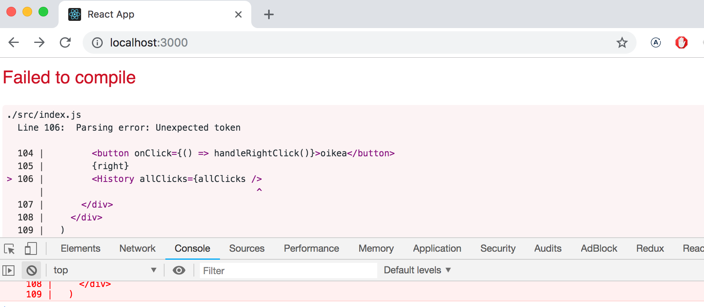
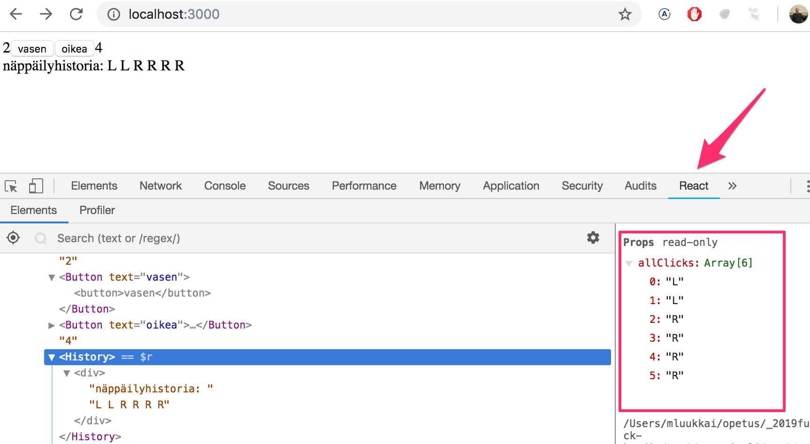
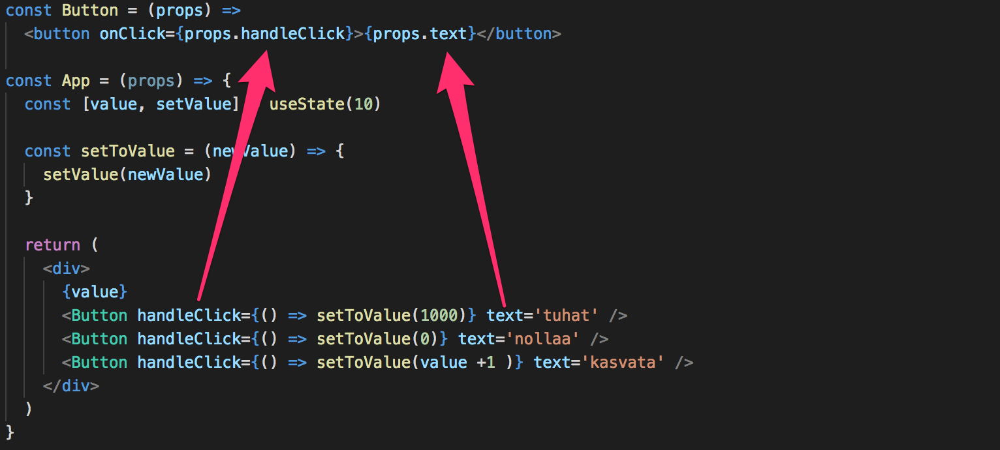
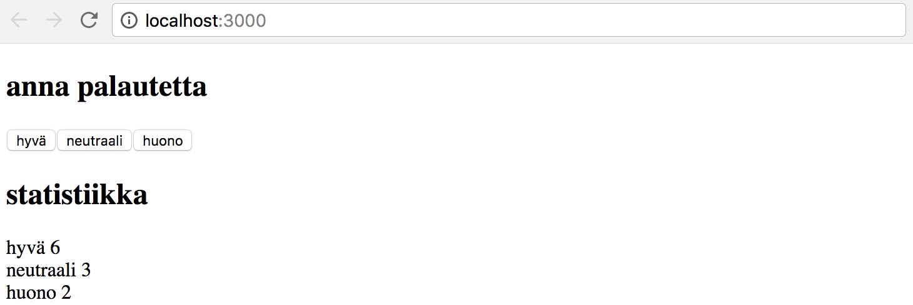
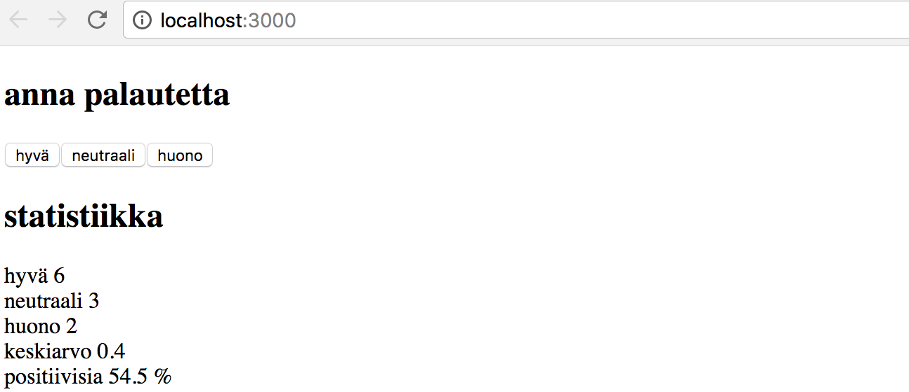
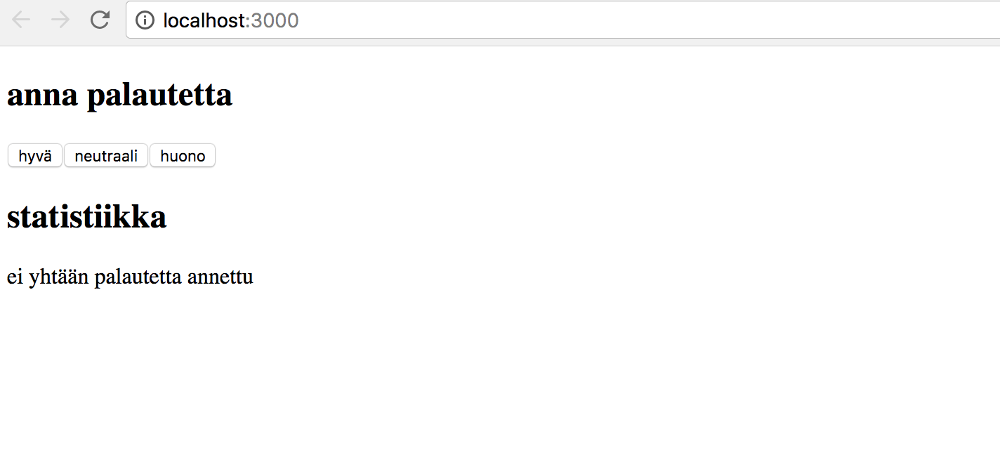
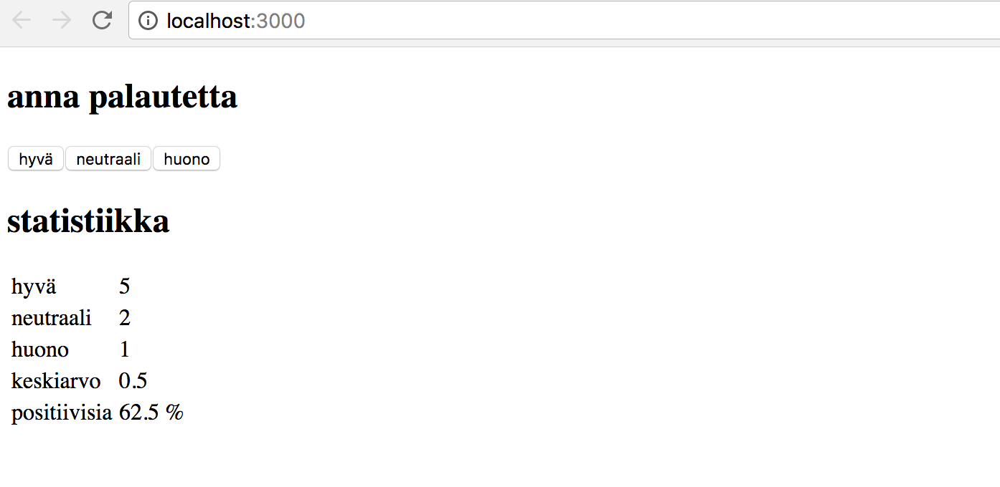
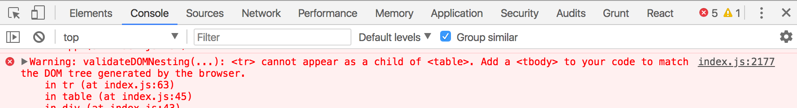
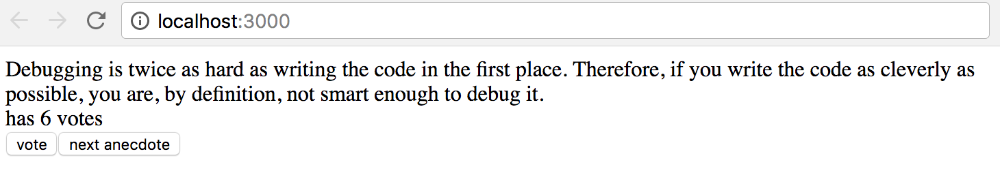
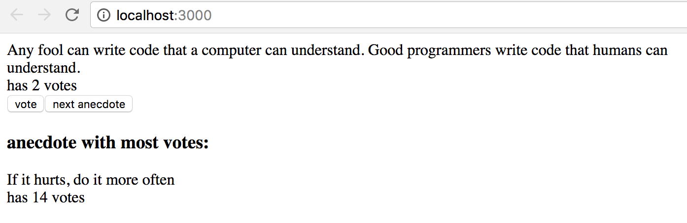

<div class="content">

### Monimutkaisempi tila

Edellisessä esimerkissä sovelluksen tila oli yksinkertainen, se koostui ainoastaan yhdestä kokonaisluvusta. Entä jos sovellus tarvitsee monimutkaisemman tilan?

Helpoin ja useimmiten paras tapa on luoda sovellukselle useita erillisiä tiloja tai tilan "osia" kutsumalla funktiota _useState_ useampaan kertaan.

Seuraavassa sovellukselle luodaan kaksi alkuarvon 0 saavaa tilaa _left_ ja _right_:

```react
const App = (props) => {
  const [left, setLeft] = useState(0)
  const [right, setRight] = useState(0)

  return (
    <div>
      <div>
        {left}
        <button onClick={() => setLeft(left + 1)}>vasen</button>
        <button onClick={() => setRight(right + 1)}>oikea</button>
        {right}
      </div>
    </div>
  )
}
```

Komponentti saa käyttöönsä tilan alustuksen yhteydessä funktiot _setLeft_ ja _setRight_ joiden avulla se voi päivittää tilaa.

Komponentin tila tai yksittäinen tilan pala voi olla minkä tahansa muotoinen. Voisimme toteuttaa saman toiminnallisuuden tallentamalla näppäimenpainallukset yhteen olioon

```react
{
  left: 0,
  right: 0
}
```

sovellus muuttuisi seuraavasti:

```react
const App = (props) => {
  const [clicks, setClicks] = useState({
    left: 0, right: 0
  })

  return (
    <div>
      <div>
        {clicks.left}
        <button onClick={() => setClicks({ left: clicks.left + 1, right: clicks.right })}>vasen</button>
        <button onClick={() => setClicks({ left: clicks.left, right: clicks.right + 1 })}>oikea</button>
        {clicks.right}
      </div>
    </div>
  )
}
```

Nyt komponentilla on siis ainoastaan yksi tila. Näppäinten painallusten yhteydessä on nyt huolehdittava koko tilan muutoksesta. 

Tapahtumankäsittelijä vaikuttaa hieman sotkuiselta. Kun vasenta nappia painetaan, suoritetaan seuraava funktio:

```js
() => setClicks({ 
  left: clicks.left + 1,
  right: clicks.right
})
```

uudeksi tilaksi siis aseteaan seuraava olio

```js
{ 
  left: clicks.left + 1,
  right: clicks.right
}
```

eli kentän _left_ arvo on sama kuin alkuperäisen tilan kentän _left + 1_ ja kentän _right_ arvo on sama kuin alkuperäisen tilan kenttä _right_.

Kaikien tilan pitäminen yhdessä oliossa on tämän sovelluksen kannalta huono ratkaisu, etuja siinä ei juuri ole, mutta sovellus monimutkaisuu merkittävästi. Onkin ehdottomasti parempi ratkaisu tallettaa nappien klikkaukset erillisiin tilan paloihin. 

### Taulukon käsittelyä

Tehdään sovellukseen vielä laajennus, lisätään sovelluken tilaan taulukko _allClicks_ joka muistaa kaikki näppäimenpainallukset.

```react
const App = (props) => {
  const [left, setLeft] = useState(0)
  const [right, setRight] = useState(0)
  const [allClicks, setAll] = useState([])

  const handleLeftClick = () => {
    setAll(allClicks.concat('L'))
    setLeft(left + 1)
  }

  const handleRightClick = () => {
    setAll(allClicks.concat('R'))
    setRight(right + 1)
  }

  return (
    <div>
      <div>
        {left}
        <button onClick={handleLeftClick}>vasen</button>
        <button onClick={handleRightClick}>oikea</button>
        {right}
        <p>{allClicks.join(' ')}</p>
      </div>
    </div>
  )
}
```

Kaikki klikkaukset siis talletetaan omaan tilan palaansa _allClicks_ joka alustetaan tyhjäksi taulukoksi

```js
const [allClicks, setAll] = useState([])
```

Kun esim. nappia _vasen_ painetaan, lisätään tilan taulukkoon _kaikki_ kirjain _L_:

```js
const handleLeftClick = () => {
  setAll(allClicks.concat('L'))
  setLeft(left + 1)
}
```

Tilan osa _allClicks_ saa nyt arvokseen entisen taulukon, mihin on liitetty _L_ metodilla [concat](https://developer.mozilla.org/en-US/docs/Web/JavaScript/Reference/Global_Objects/Array/concat), joka toimii siten, että se ei muuta olemassaolevaa taulukkoa vaan luo _uuden taulukon_, mihin uusi alkio on lisätty.

Kuten jo aiemmin mainittiin, Javascriptissa on myös mahdollista lisätä taulukkoon metodilla [push](https://developer.mozilla.org/en-US/docs/Web/JavaScript/Reference/Global_Objects/Array/push) ja sovellus näyttäisi tässä tilanteessa toimivan myös jos lisäys hoidettaisiin siten että _allClicks_-tilaa muuteaan pushaamalla siihen alkio ja sitten päivitetään tila:

```js
const handleLeftClick = () => {
  allClicks.push('L')
  setAll(allClick)
  setLeft(left + 1)
}
```

Älä kuitenkaan tee näin. React-komponentin tilaa, eli muuttujaa eli esim muuttujaa _allClicks_ ei saa muuttaa, vaikka se näyttääkin toimivan joissaikin tilanteissa, voi seurauksena olla hankalasti havaittavia ongelmia.

Katsotaan vielä tarkemmin, miten kaikkien painallusten historia renderöidään ruudulle:

```react
const App = (props) => {
  // ...

  return (
    <div>
      <div>
        {left}
        <button onClick={handleLeftClick}>vasen</button>
        <button onClick={handleRightClick}>oikea</button>
        {right}
        <p>{allClicks.join(' ')}</p>
      </div>
    </div>
  )
}
```

Taulukolle _allClicks_ kutsutaan metodia [join](https://developer.mozilla.org/en-US/docs/Web/JavaScript/Reference/Global_Objects/Array/join), joka muodostaa taulukosta merkkijono, joka sisältää taulukon alkiot erotettuina välilyönnillä.

### Ehdollinen renderöinti

Muutetaan sovellusta siten, että näppäilyhistorian renderöinnistä vastaa komponentti _History_:

```react
const History = (props) => {
  if (props.allClicks.length === 0) {
    return (
      <div>
        <em>sovellusta käytetään nappeja painelemalla</em>
      </div>
    )
  }

  return (
    <div>
        näppäilyhistoria: {props.allClicks.join(' ')}
    </div>
  )
}

const App = (props) => {
  // ...

  return (
    <div>
      <div>
        {left}
        <button onClick={handleLeftClick}>vasen</button>
        <button onClick={handleRightClick}>oikea</button>
        {right}
        <History allClicks={allClicks} />
      </div>
    </div>
  )
}
```

Nyt komponentin toiminta riippuu siitä, onko näppäimiä jo painettu. Jos ei, eli taulukko <code>allClicks</code> on tyhjä, renderöi komponentti "käyttöohjeen" sisältävän divin.

```html
<div><em>sovellusta käytetään nappeja painelemalla</em></div>
```

ja muussa tapauksessa näppäilyhistorian:

```html
<div>näppäilyhistoria: {this.state.kaikki.join(' ')}</div>
```

Komponentin _History_ ulkoasun muodostamat React-elementit siis ovat erilaisia riippuen sovelluksen tilasta, eli komponentissa on _ehdollista renderöintiä_.

Reactissa on monia muitakin tapoja [ehdolliseen renderöintiin](https://reactjs.org/docs/conditional-rendering.html). Katsotaan niitä tarkemmin [seuraavassa osassa](/osa2).

Muutetaan vielä sovellusta siten, että se käyttää aiemmin määrittelemäämme komponenttia _Button_ painikkeiden muodostamiseen:

```react
const History = (props) => {
  if (props.allClicks.length === 0) {
    return (
      <div>
        <em>sovellusta käytetään nappeja painelemalla</em>
      </div>
    )
  }

  return (
    <div>
        näppäilyhistoria: {props.allClicks.join(' ')}
    </div>
  )
}

const Button = ({ handleClick, text }) => (
  <button onClick={handleClick}>
    {text}
  </button>
)

const App = (props) => {
  const [left, setLeft] = useState(0)
  const [right, setRight] = useState(0)
  const [allClicks, setAll] = useState([])

  const handleLeftClick = () => {
    setAll(allClicks.concat('L'))
    setLeft(left + 1)
  }

  const handleRightClick = () => {
    setAll(allClicks.concat('R'))
    setRight(right + 1)
  }

  return (
    <div>
      <div>
        {left}
        <Button handleClick={handleLeftClick} text='vasen' />
        <Button handleClick={handleLeftClick} text='oikea' />
        {right}
        <History allClicks={allClicks} />
      </div>
    </div>
  )
}
```

### Vanha React

Tällä kurssilla käyttämämme tapa React-komponenttien tilan määrittelyyn, eli [state hook](https://reactjs.org/docs/hooks-state.html) on siis uutta Reactia ja käytettävissä tällä hetkellä ainoastaan versiossa [0.16.17.0-alpha.2](https://www.npmjs.com/package/react/v/16.7.0-alpha.2). Ennen hookeja Javascript-funktioina määriteltyihin React-komponentteihin ei ollut mahdollista saada tilaa ollenkaan, tilaa edellyttävät komponentit oli pakko määritellä [Class](https://reactjs.org/docs/react-component.html)-komponentteina Javascriptin luokkasyntaksia hyödyntäen. 

Olemme tällä kurssilla tehneet hieman radikaalinkin ratkaisun käyttää pelkästääm hookeja ja näin ollen opetella heti alusta asti ohjelmoimaan "huomisen" Reactia. Luokkasyntaksin hallitseminen on kuitenkin sikäli tärkeää, että vaikka funktiona määriteltävät komponentit ovat Reactin tulevaisuus, on maailmassa miljardeja rivejä vanhaa Reactia jota kenties sinäkin joudut jonain päivänä ylläpitämään. Dokumentaation ja internetistä löytyvien esimerkkien suhteen tilanne on sama, törmäät class-komponentteihin välittömästi.

Tutustummekin riittävällä tasolla class-komponentteihin hieman myöhemmin kurssilla.

## React-sovellusten debuggaus

Ohjelmistokehittäjän elämä koostuu pääosin debuggaamisesta (ja olemassaolevan koodin lukemisesta). Silloin tällöin syntyy toki muutama rivi uuttakin koodia, mutta suuri osa ajasta ihmetellään miksi joku on rikki tai miksi joku asia ylipäätään toimii. Hyvät debuggauskäytänteet ja työkalut ovatkin todella tärkeitä.

Onneksi React on debuggauksen suhteen jopa harvinaisen kehittäjäystävällinen kirjasto.

Muistutetaan vielä tärkeimmästä web-sovelluskehitykseen liittyvästä asiasta:

<div class="important">
  <h3>Web-sovelluskehityksen sääntö numero yksi</h3>
  <div>Pidä selaimen developer-konsoli koko ajan auki.</div>
  <br />
  <div>Välilehdistä tulee olla auki nimenomaan <em>Console</em> jollei ole erityistä syytä käyttää jotain muuta välilehteä.
  </div>
</div>

Pidä myös koodi ja web-sivu **koko ajan** molemmat yhtä aikaa näkyvillä.

Jos ja kun koodi ei käänny, eli selaimessa alkaa näkyä punaista



älä kirjota enää lisää koodia vaan selvitä ongelma **välittömästi**. Koodauksen historia ei tunne tilannetta, missä kääntymätön koodi alkaisi ihmeenomaisesti toimimaan kirjoittamalla suurta määrää lisää koodia, en usko että sellaista ihmettä nähdään tälläkään kurssilla.

Vanha kunnon printtaukseen perustuva debuggaus kannattaa aina. Eli jos esim. komponentissa

```react
const Button = ({ handleClick, text }) => (
  <button onClick={handleClick}>
    {text}
  </button>
)
```

olisi jotain ongelmia, kannattaa komponentista alkaa printtailla konsoliin. Pystyäksemme printtaamaan, tulee funktio muuttaa pitempään muotoon ja propsit kannattaa kenties vastaanottaa ilman destrukturointia:

```react
const Button = (props) => {
  console.log(props)
  const { handleClick, text } = props
  return (
    <button onClick={handleClick}>
      {text}
    </button>
  )
}
```

näin selviää heti onko esim. joku propsia vastaava attribuutti nimetty väärin komponenttia käytettäessä.

**HUOM** kun käytät komentoa _console.log_ debuggaukseen, älä yhdistele asioita "javamaisesti" plussalla, eli sen sijaan että kirjoittaisit

```js
console.log('propsin arvo on' + props);
```

erottele tulostettavat asiat pilkulla:

```js
console.log('propsin arvo on', props);
```

Jos yhdistät merkkijonoon olion, tuloksena on suhteellisen hyödytön tulostusmuoto

```bash
propsin arvo on [Object object]
```

kun taas pilkulla tulostettavat asiat erotellessa saat developer-konsoliin olion, jonka sisältöä on mahdollista tarkastella.

Koodin suorituksen voi pysäyttää chromen developer konsolin debuggeriin kirjoittamalla mihin tahansa kohtaa koodia komennon [debugger](https://developer.mozilla.org/en-US/docs/Web/JavaScript/Reference/Statements/debugger).

Koodi pysähtyy kun suoritus etenee sellaiseen pisteeseen, että komento _debugger_ suoritetaan:


Menemällä välilehdelle _Console_ on helppo tutkia muuttujien tilaa:


Kun bugi selviää, voi komennon _debugger_ poistaa ja uudelleenladata sivun.

Debuggerissa on mahdollista suorittaa koodia tarvittaessa rivi riviltä _Source_ välilehden oikealta laidalta.

Debuggeriin pääsee myös ilman komentoa _debugger_ lisäämällä _Source_-välilehdellä sopiviin kohtiin koodia _breakpointeja_. Komponentin muuttujien arvojen tarkkailu on mahdollista  _Scope_-osassa:


Chromeen kannattaa ehdottomasti asentaa [React developer tools](https://chrome.google.com/webstore/detail/react-developer-tools/fmkadmapgofadopljbjfkapdkoienihi) -lisäosa, joka tuo konsoliin uuden tabin _React_:



Uuden konsolitabin avulla voidaan tarkkailla sovelluksen React-elementtejä ja niiden tilaa ja propseja. 

React developer tools ei osaa toistaiseksi näyttää hookeilla muodostettua tilaa parhaalla mahdollisella tavalla.


Komponentin tila määriteltiin seuraavasti:

```js
const [left, setLeft] = useState(0)
const [right, setRight] = useState(0)
const [allClicks, setAll] = useState([])
```

Konsolin ylimpänä oleva _baseState_ kertoo ensimmäisen _useState_-kutsun määrittelevän tilan, eli muuttujan _left_ arvon, seuraava _baseState_ kertoo muuttujan _right_ arvon ja taulukon _allClicks_ arvo on alimpana. 

## Hookien säännöt

Jotta hookeilla muodostettu sovelluksen tila toimisi oikein, on hookeja käytettävä tiettyjä [rajoituksia](https://reactjs.org/docs/hooks-rules.html) noudattaen.

Funktiota _useState_ (eikä seuraavassa osassa esiteltävää funktiota _useEffect_) saa kutsua loopissa, ehtolausekkeiden sisältä tai muista kun komponentin määrittelevästä funktioista. Tämä takaa sen, että hookeja kutsutaan aina samassa järjestyksessä, jos näin ei ole, sovellus toimii miten sattuu.

Hookeja siis kuuluu kutsua ainoastaan React-komponentin määrittelevän funktion rungosta:

```react
const App = (props) => {
  // nämä ovat ok
  const [age, setAge] = useState(0)
  const [name, setName] = useState('Juha Tauriainen')

  if ( age > 10 ) {
    // ei näin!
    const [foobar, setFoobar] = useState(null)
  }

  for ( let i = 0; i < age; i++ ) {
    // eikä näin!
    const [rightWay, setRightWay] = useState(false)
  }

  const notGood = () => {
    // eikä myöskään näin
    const [x, setX] = useState(-1000)
  }

  return (
    //...
  ) 
} 
```

## Tapahtumankäsittely revisited

Edellisen vuoden kurssin perusteella tapahtumankäsittely on osoittautunut monelle haastavaksi.

Tarkastellaan asiaa vielä uudelleen.

Oletetaan, että käytössä on äärimmäisen yksinkertainen sovellus:

```bash
const App = (props) => {
  const [value, setValue] = useState(10)

  return (
    <div>
      {value}
      <button>nollaa</button>
    </div>
  )
}

ReactDOM.render(<App />, document.getElementById('root'))
```

Haluamme, että napin avulla tilan talettava muuttuja _value_ saadaan nollattua.

Jotta saamme napin reagoimaan, on sille lisättävä _tapahtumankäsittelijä_.

Tapahtumankäsittelijän tulee aina olla _funktio_. Jos tapahtumankäisttelijän paikalle yritetään laittaa jotain muuta, ei nappi toimi.

Jos esim. antaisimme tapahtumankäsittelijäksi merkkijonon:

```bash
<button onClick={'roskaa'}>nappi</button>
```

React varoittaa asiasta konsolissa

```bash
index.js:2178 Warning: Expected `onClick` listener to be a function, instead got a value of `string` type.
    in button (at index.js:20)
    in div (at index.js:18)
    in App (at index.js:27)
```

eli esim. seuraavanlainen yritys olisi tuhoon tuomittu

```bash
<button onClick={value + 1}>nappi</button>
```

nyt tapahtumankäsittelijäksi on yritetty laittaa _value + 1_ mikä tarkoittaa laskuoperaation tulosta. React varoittaa tästäkin konsolissa

```bash
index.js:2178 Warning: Expected `onClick` listener to be a function, instead got a value of `number` type.
```

Myöskään seuraava ei toimi

```bash
<button onClick={value = 0}>nappi</button>
```

taaskaan tapahtumankäsittelijänä ei ole funktio vaan sijoitusoperaatio. Konsoliin tulee valitus. Tämä tapa on myös toisella tavalla väärin. Tilan muuttaminen ei onnistu suoraan tilan arvon tallentavaa muuttujaa muuttamalla.

Entä seuraava:

```bash
<button onClick={console.log('nappia painettu')}>nappi</button>
```

konsoliin tulostuu kertaalleen _nappia painettu_, mutta nappia painellessa ei tapahdu mitään. Miksi tämä ei toimi vaikka tapahtumankäsittelijänä on nyt funktio _console.log_?

Ongelma on nyt siinä, että tapahtumankäsittelijänä on funktion kutsu, eli varsinaiseksi tapahtumankäsittelijäksi tulee funktion kutsun paluuarvo, joka on tässä tapauksessa _undefined_.

Funktiokutsu _console.log('nappia painettu')_ suoritetaan siinä vaiheessa kun komponentti renderöidään, ja tämän takia konsoliin tulee tulostus kertalleen.

Myös seuraava yritys on virheellinen

```bash
<button onClick={setValue(0)}>nappi</button>
```

jälleen olemme yrittäneet laittaa tapahtumankäsittelijäksi funktiokutsun. Ei toimi. Tämä yritys aiheuttaa myös toisen ongelman. Kun komponenttia renderöidään, suoritetaan tapahtumankäsittelijänä oleva funktiokutsu _setValue(0)_ joka taas saa aikaan komponentin uudelleenrenderöinnin. Ja uudelleenrenderöinnin yhteydessä funktiota kutsutaan uudelleen käynnistäen jälleen uusi uudelleenrenderöinti, ja joudutaan päättymättömään rekursioon.

Jos haluamme suorittaa tietyn funktiokutsun tapahtuvan nappia painettaessa, toimii seuraava

```bash
<button onClick={() => console.log('nappia painettu')}>nappi</button>
```

Nyt tapahtumankäsittelijä on nuolisyntaksilla määritelty funktio _() => console.log('nappia painettu')_. Kun komponentti renderöidään, ei suoriteta mitään, ainoastaan talletetaan funktioviite tapahtumankäsittelijäksi. Itse funktion suoritus tapahtuu vasta napin painallusten yhteydessä.

Saamme myös nollauksen toimimaan samalla tekniikalla

```bash
<button onClick={() => setValue(0)}>nappi</button>
```

eli nyt tapahtumankäsittelijä on funktio _() => setValue(0)_.

Tapahtumakäsittelijäfunktioiden määrittely suoraan napin määrittelyn yhteydessä ei välttämättä ole paras mahdollinen idea.

Usein tapahtumankäsittelijä määritelläänkin jossain muualla. Seuraavassa määritellään funktio metodin render alussa ja sijoitetaan se muuttujaan _handleClick_:

```react
const App = (props) => {
  const [value, setValue] = useState(10)

  const handleClick = () => console.log('nappia painettu')

  return (
    <div>
      {value}
      <button onClick={handleClick}>nappi</button>
    </div>
  )
}
```

Muuttujassa _handleClick_ on nyt talletettuna viite itse funktioon. Viite annetaan napin määrittelyn yhteydessä

```bash
<button onClick={handleClick}>nappi</button>
```

Tapahtumankäsittelijäfunktio voi luonnollisesti koostua useista komennoista, tällöin käytetään nuolifunktion aaltosulullista muotoa:

```react
const App = (props) => {
  const [value, setValue] = useState(10)

  const handleClick = () => {
    console.log('nappia painettu')
    setValue(0)
  }

  return (
    <div>
      {value}
      <button onClick={handleClick}>nappi</button>
    </div>
  )
}
```

Mennään lopuksi funktioita palauttavaan funktioon.

Muutetaan koodia seuraavasti

```react
const App = (props) => {
  const [value, setValue] = useState(10)

  const hello = () => {
    const handler = () => console.log('hello world')

    return handler
  }

  return (
    <div>
      {value}
      <button onClick={hello()}>nappi</button>
    </div>
  )
}
```

Koodi näyttää hankalalta mutta se ihme kyllä toimii.

Tapahtumankäsittelijäksi on nyt "rekisteröity" funktiokutsu:

```bash
<button onClick={hello()}>nappi</button>
```

Aiemmin varoteltiin, että tapahtumankäsittelijä ei saa olla funktiokutsu vaan sen on oltava funktio tai viite funktioon. Miksi funktiokutsu kuitenkin toimii nyt?

Kun komponenttia renderöidään suoritetaan seuraava funktio:

```react
const hello = () => {
  const handler = () => console.log('hello world')

  return handler
}
```

funktion _paluuarvona_ on nyt toinen, muuttujaan _handler_ määritelty funktio.

eli kun react renderöi seuraavan rivin

```bash
<button onClick={hello()}>nappi</button>
```

sijoittaa se onClick-käsittelijäksi funktiokutsun _hello()_ paluuarvon. Eli oleellisesti ottaen rivi "muuttuu" seuraavaksi

```bash
<button onClick={() => console.log('hello world')}>nappi</button>
```

koska funktio _hello_ palautti funktion, on tapahtumankäsittelijä nyt funktio.

Mitä järkeä tässä konseptissa on?

Muutetaan koodia hiukan:

```bash
const App = (props) => {
  const [value, setValue] = useState(10)

  const hello = (who) => {
    const handler = () => {
      console.log('hello', who)
    }

    return handler
  }

  return (
    <div>
      {value}
      <button onClick={hello('world')}>nappi</button>
      <button onClick={hello('react')}>nappi</button>
      <button onClick={hello('function')}>nappi</button>
    </div>
  )
}
```

Nyt meillä on kolme nappia joiden tapahtumankäsittelijät määritellään parametrin saavan funktion _hello_ avulla.

Ensimmäinen nappi määritellään seuraavasti

```bash
<button onClick={hello('world')}>nappi</button>
```

Tapahtumankäsittelijä siis saadaan _suorittamalla_ funktiokutsu _hello('world')_. Funktiokutsu palauttaa funktion

```bash
() => { 
  console.log('hello', 'world')
}
```

Toinen nappi määritellään seuraavasti

```bash
<button onClick={hello('react')}>nappi</button>
```

Tapahtumankäsittelijän määrittelevä funktiokutsu _hello('react')_ palauttaa

```bash
() => { 
  console.log('hello', 'react')
}
```

eli nappi saa oman yksilöllisen tapahtumankäsittelijänsä.

Funktioita palauttavia funktioita voikin hyödyntää määrittelemään geneeristä toiminnallisuutta, jota voi tarkentaa parametrien avulla. Tapahtumankäsittelijöitä luovan funktion _hello_ voikin ajatella olevan eräänlainen tehdas, jota voi pyytää valmistamaan sopivia tervehtimiseen tarkoitettuja tapahtumankäsittelijäfunktioita.

Käyttämämme määrittelytapa

```bash
const hello = (who) => {
  const handler = () => { 
    console.log('hello', who)
  }

  return handler
}
```

on hieman verboosi. Eliminoidaan apumuuttuja, ja määritellään palautettava funktio suoraan returnin yhteydessä:

```bash
const hello = (who) => {
  return () => { 
    console.log('hello', who)
  }
}
```

ja koska funktio _hello_ sisältää ainoastaan yhden komennon, eli returnin, voidaan käyttää aaltosulutonta muotoa

```bash
const hello = (who) =>
  () => { 
    console.log('hello', who)
  }
```

ja tuodaan vielä "kaikki nuolet" samalle riville

```bash
const hello = (who) => () => { 
  console.log('hello', who)
}
```

Voimme käyttää samaa kikkaa myös muodostamaan tapahtumankäsittelijöitä, jotka asettavat komponentin tilalle halutun arvon. Muutetaan koodi muotoon:

```bash
render() {
  const setToValue = (newValue) => () => {
    setValue(newValue) 
  }

  return (
    <div>
      {value}
      <button onClick={setToValue(1000)}>tuhat</button>
      <button onClick={setToValue(0)}>nollaa</button>
      <button onClick={setToValue(value + 1)}>kasvata</button>
    </div>
  )
}
```

Kun komponentti renderöidään, ja tehdään nappia tuhat

```bash
<button onClick={setToValue(1000)}>tuhat</button>
```

tulee tapahtumankäsittelijäksi funktiokutsun _setToValue(1000)_ paluuarvo eli seuraava funktio

```bash
() => {
    setValue(1000) 
}
```

Kasvatusnapin generoima rivi on seuraava

```react
<button onClick={setToValue(value + 1)}>kasvata</button>
```

Tapahtumankäsittelijän muodostaa funktiokutsu _setToValue(value + 1)_, joka saa parametrikseen tilan tallettavan muuttujan _value_ nykyisen arvon kasvatettuna yhdellä. Jos _value_ olisi 10, tulisi tapahtumankäsittelijäksi funktio

```js
() => {
    setValue(11) 
}
```

Funktioita palauttavia funktioita ei tässäkään tapauksessa olisi ollut pakko käyttää. Muutetaan tilan päivittämisestä huolehtiva funktio _setToValue_ normaaliksi funktioksi:

```react
const App = (props) => {
  const [value, setValue] = useState(10)

  const setToValue = (newValue) => {
    setValue(newValue) 
  }

  return (
    <div>
      {value}
      <button onClick={() => setToValue(1000)}>tuhat</button>
      <button onClick={() => setToValue(0)}>nollaa</button>
      <button onClick={() => setToValue(value + 1)}>kasvata</button>
    </div>
  )
}
```

Voimme nyt määritellä tapahtumankäsittelijän funktioksi, joka kutsuu funktiota _setToValue_ sopivalla parametrilla, esim. nollaamisen tapahtumankäsittelijä:

```js
<button onClick={() => setToValue(0)}>nollaa</button>
```

On aikalailla makuasia käyttääkö tapahtumankäsittelijänä funktioita palauttavia funktioita vai nuolifunktioita. 

### Tapahtumankäsittelijän vieminen alikomponenttiin

Eriytetään vielä painike omaksi komponentikseen

```react
const Button = (props) => 
  <button onClick={props.handleClick}>{props.text}</button>
```

Komponentti saa siis propsina _handleClick_ tapahtumankäsittelijän ja propsina _text_ merkkijonon jonka se renderöin painikkeen tekstiksi.

Komponentin _Button_ käyttö on helppoa, on toki pidettävä huolta siitä että komponentille annettavat propsit on nimetty niin kuin komponentti olettaa:




### Hyödyllistä materiaalia

Internetissä on todella paljon Reactiin liittyvää materiaalia. Tällä hetkellä ongelman muodostaa kuitenkin se, että käytämme kurssilla niin uutta Reactia, että suurin osa internetistä löytyvästä tavarasta on meidän kannaltamme vanhentunutta. 

Seuraavassa muutamia linkkejä:

- Reactin [docs](https://reactjs.org/docs/hello-world.html) kannattaa ehdottomasti käydä jossain vaiheessa läpi, ei välttämättä kaikkea nyt, osa on ajankohtaista vasta kurssin myöhemmissä osissa ja kaikki Class-komponentteihin liittyvä on kurssin kannalta epärelevanttia
- Reactin sivuilla oleva [tutoriaali](https://reactjs.org/tutorial/tutorial.html) sen sijaan on aika huono
- [Egghead.io](https://egghead.io):n kursseista [Start learning React](https://egghead.io/courses/start-learning-react) on laadukas, ja hieman uudempi [The Beginner's guide to React](https://egghead.io/courses/the-beginner-s-guide-to-reactjs) on myös kohtuullisen hyvä; molemmat sisältävät myös asioita jotka tulevat tällä kurssilla vasta myöhemmissä osissa. Molemmissa toki se ongelma, että ne käyttävät Class-komponentteja

</div>

<div class="tasks">
  <h3>Tehtäviä</h3>
  <h4> 1.6: unicafe osa1</h4>

Monien firmojen tapaan nykyään myös [Unicafe](https://www.unicafe.fi/#/9/4) kerää asiakaspalautetta. Tee Unicafelle verkossa toimiva palautesovellus. Vastausvaihtoehtoja olkoon vain kolme: <i>hyvä</i>, <i>neutraali</i> ja <i>huono</i>.

Sovelluksen tulee näyttää jokaisen palautteen lukumäärä. Sovellus voi näyttää esim. seuraavalta:



Huomaa, että sovelluksen tarvitsee toimia vain yhden selaimen käyttökerran ajan, esim. kun selain refreshataan, tilastot saavat hävitä.

<h4>1.7: unicafe osa2</h4>

Laajenna sovellusta siten, että se näyttää palautteista statistiikkaa, keskiarvon (hyvän arvo 1, neutraalin 0, huonon -1) ja sen kuinka monta prosenttia palautteista on ollut positiivisia:




<h4>1.8: unicafe osa3</h4>

Refaktoroi sovelluksesi siten, että se koostuu monista komponenteista. Pidä tila kuitenkin sovelluksen _juurikomponentissa_.

Tee sovellukseen ainakin seuraavat komponentit:

- <i>Button</i> vastaa yksittäistä palautteenantonappia
- <i>Statistics</i> huolehtii tilastojen näyttämisestä
- <i>Statistic</i> huolehtii yksittäisen tilastorivin, esim. keskiarvon näyttämisestä

<h4>1.9: unicafe osa4</h4>

Muuta sovellusta siten, että numeeriset tilastot näytetään ainoastaan jos palautteita on jo annettu:



<h4>1.10*: unicafe osa5</h4>

Jos olet määritellyt jokaiselle napille oman tapahtumankäsittelijän, refaktoroi sovellustasi siten, että kaikki napit käyttävät samaa tapahtumankäsittelijäfunktiota samaan tapaan kuin materiaalin luvussa [funktio joka palauttaa funktion](/osa1/#funktio-joka-palauttaa-funktion).

Pari vihjettä. Ensinnäkin kannattaa muistaa, että olion kenttiin voi viitata pistenotaation lisäksi hakasulkeilla, eli:

```js
const olio = {
  a: 1,
  b: 2,
};

olio['c'] = 3;

console.log(olio.a); // tulostuu 1

console.log(olio['b']); // tulostuu 2

const apu = 'c';
console.log(olio[apu]); // tulostuu 3
```

Myös ns. [Computed property names](https://developer.mozilla.org/en-US/docs/Web/JavaScript/Reference/Operators/Object_initializer) voi olla tässä tehtävässä hyödyksi.

<h4>1.11: unicafe osa6</h4>

Toteuta tilastojen näyttäminen HTML:n [taulukkona](https://developer.mozilla.org/en-US/docs/Learn/HTML/Tables/Basics) siten, että saat sovelluksesi näyttämään suunnilleen seuraavanlaiselta:



Muista pitää konsoli koko ajan auki. Jos saat konsoliin seuraavan warningin:



tee tarvittavat toimenpiteet jotta saat warningin katoamaan. Googlaa tarvittaessa virheilmoituksella.

**Huolehdi nyt ja jatkossa, että konsolissa ei näy mitään warningeja!**

<h4>1.12*: anekdootit osa1</h4>

Ohjelmistotuotannossa tunnetaan lukematon määrä [anekdootteja](http://www.comp.nus.edu.sg/~damithch/pages/SE-quotes.htm) eli pieniä "onelinereita", jotka kiteyttävät alan ikuisia totuuksia.

Laajenna seuraavaa sovellusta siten, että siihen tulee nappi, jota painamalla sovellus näyttää _satunnaisen_ ohjelmistotuotantoon liittyvän anekdootin:

```react
import React from 'react'
import ReactDOM from 'react-dom'

class App extends React.Component {
  constructor(props) {
    super(props)
    this.state = {
      selected: 0
    }
  }

  render() {
    return (
      <div>
        {this.props.anecdotes[this.state.selected]}
      </div>
    )
  }
}

const anecdotes = [
  'If it hurts, do it more often',
  'Adding manpower to a late software project makes it later!',
  'The first 90 percent of the code accounts for the first 90 percent of the development time...The remaining 10 percent of the code accounts for the other 90 percent of the development time.',
  'Any fool can write code that a computer can understand. Good programmers write code that humans can understand.',
  'Premature optimization is the root of all evil.',
  'Debugging is twice as hard as writing the code in the first place. Therefore, if you write the code as cleverly as possible, you are, by definition, not smart enough to debug it.'
]

ReactDOM.render(
  <App anecdotes={anecdotes} />,
  document.getElementById('root')
)
```

Google kertoo, miten voit generoida Javascriptilla sopivia satunnaisia lukuja. Muista, että voit testata esim. satunnaislukujen generointia konsolissa.

Sovellus voi näyttää esim. seuraavalta:


<h4>1.13: anekdootit osa2</h4>

Laajenna sovellusta siten, että näytettävää anekdoottia on mahdollista äänestää:



**Huom:** jos päätät tallettaa kunkin anekdootin äänet komponentin tilassa olevan olion kenttiin tai taulukkoon, saatat tarvita päivittäessäsi tilaa oikeaoppisesti olion tai taulukon _kopioimista_.

Olio voidaan kopioida esim. seuraavasti:

```js
const pisteet = { 0: 1, 1: 3, 2: 4, 3: 2 };

const kopio = { ...pisteet };
kopio[2] += 1; // kasvatetaan olion kentän 2 arvoa yhdellä
```

ja taulukko esim. seuraavasti:

```js
const pisteet = [1, 4, 6, 3];

const kopio = [...pisteet];
kopio[2] += 1; // kasvatetaan taulukon paikan 2 arvoa yhdellä
```

<h4>1.14*: anekdootit osa3</h4>

Ja sitten vielä lopullinen versio, joka näyttää eniten ääniä saaneen anekdootin:



Jos suurimman äänimäärän saaneita anekdootteja on useita, riittää että niistä näytetään yksi.

Tämä saattaa olla jo hieman haastavampi. Taulukolta löytyy monia hyviä metodeja, katso lisää [Mozillan dokumentaatiosta](https://developer.mozilla.org/en-US/docs/Web/JavaScript/Reference/Global_Objects/Array).

Youtubessa on kohtuullisen hyvä [johdatus funktionaaliseen javascript-ohjelmointiin](https://www.youtube.com/watch?v=BMUiFMZr7vk&list=PL0zVEGEvSaeEd9hlmCXrk5yUyqUag-n84). Kolmen ensimmäisen osan katsominen riittää hyvin tässä vaiheessa.

</div>
