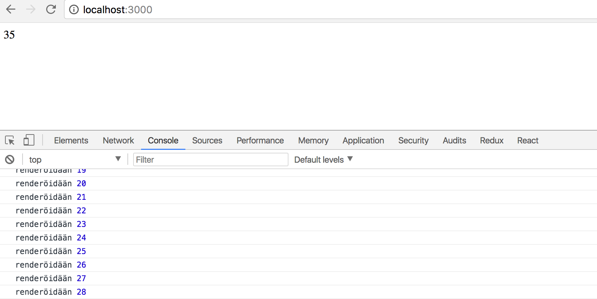
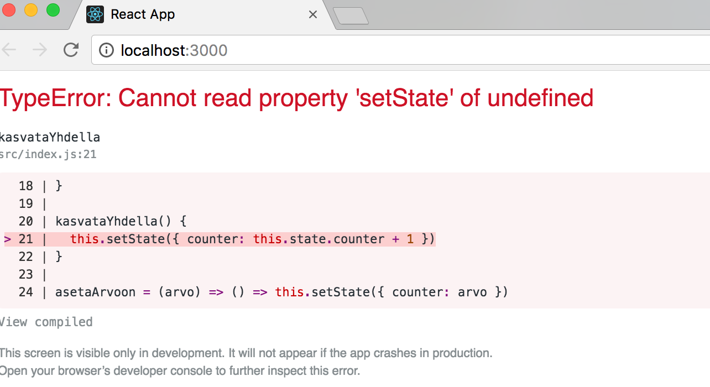
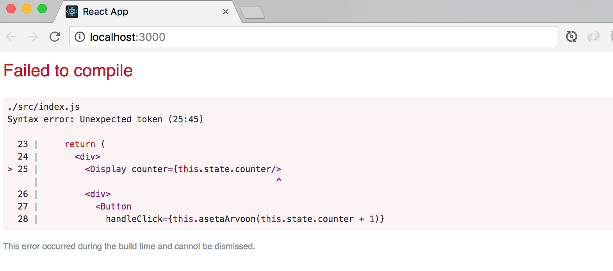
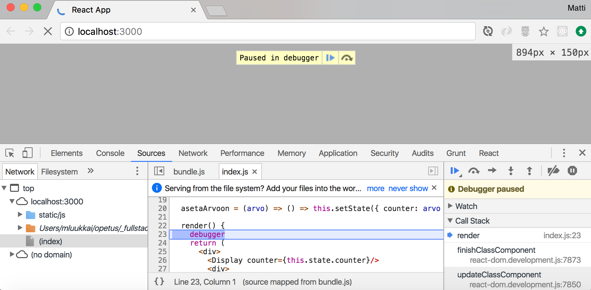
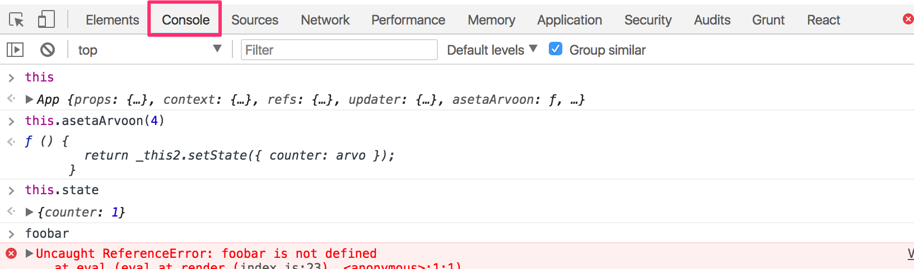
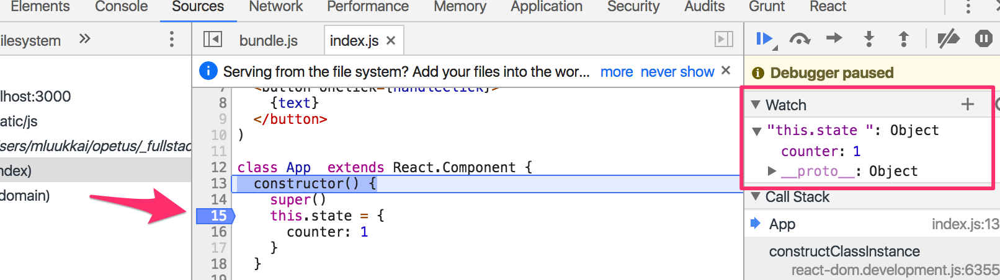
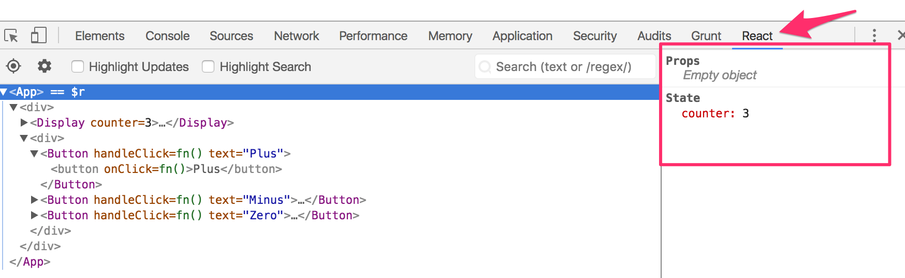

<div class="content">

Kurssin aikana on websovelluskehityksen rinnalla tavoite ja tarve oppia riittävässä määrin Javascriptiä.

Javascript on kehittynyt viime vuosina nopeaan tahtiin, ja käytämme kurssilla kielen uusimpien versioiden piirteitä, joista osa ei ole vielä edes ehtinyt kielen viimeisimpään standardoituun versioon. Javascript-standardin virallinen nimi on [ECMAScript](https://en.wikipedia.org/wiki/ECMAScript). Tämän hetken tuorein versio on kesäkuussa 2017 julkaistu [ES8](https://www.ecma-international.org/publications/standards/Ecma-262.htm), toiselta nimeltään ECMAScript 2017.

Selaimet eivät vielä osaa kaikkia Javascriptin uusimpien versioiden ominaisuuksia. Tämän takia selaimessa suoritetaan useimmiten koodia joka on käännetty (englanniksi _transpiled_) uudemmasta Javascriptin versiosta johonkin vanhempaan, laajemmin tuettuun versioon.

Tällä hetkellä johtava tapa tehdä transpilointi on [Babel](https://babeljs.io/). Create-react-app:in avulla luoduissa React-sovelluksissa on valmiiksi konfiguroitu automaattinen transpilaus. Katsomme kurssin [osassa 7](/osa7) tarkemmin miten transpiloinnin konfigurointi tapahtuu.

[Node.js](https://nodejs.org/en/) on melkein missä vaan, mm. palvelimilla toimiva, Googlen [chrome V8](https://developers.google.com/v8/)-javascriptmoottoriin perustuva Javascript-suoritusympäristö. Harjoitellaan hieman Javascriptiä Nodella. Tässä oletetaan, että koneellasi on Node.js:stä vähintään versio _v8.6.0_. Noden tuoreet versiot osaavat suoraan Javascriptin uusia versioita, joten koodin transpilaus ei ole tarpeen.

Koodi kirjoitetaan <em>.js-</em>päätteiseen tiedostoon, ja suoritetaan komennolla <code>node tiedosto.js</code>

Koodia on mahdollisuus kirjoittaa myös Node.js-konsoliin, joka aukeaa kun kirjoitat komentorivillä _node_ tai myös selaimen developer toolin konsoliin. Chromen uusimmat versiot osaavat suoraan transpiloimatta [melko hyvin](http://kangax.github.io/compat-table/es6/) Javascriptin uusiakin piirteitä.

Javascript muistuttaa nimensä ja syntaksinsa puolesta läheisesti Javaa. Perusmekanismeiltaan kielet kuitenkin poikkeavat radikaalisti. Java-taustalta tultaessa Javascriptin käyttäytyminen saattaa aiheuttaa hämmennystä, varsinkin jos kielen piirteistä ei viitsitä ottaa selvää.

Tietyissä piireissä on myös ollut suosittua yrittää "simuloida" Javascriptilla eräitä Javan piirteitä ja ohjelmointitapoja. En suosittele.

### Muuttujat

Javascriptissä on muutama tapa määritellä muuttujia:

```js
const x = 1;
let y = 5;

console.log(x, y); // tulostuu 1, 5
y += 10;
console.log(x, y); // tulostuu 1, 15
y = 'teksti';
console.log(x, y); // tulostuu 1, teksti
x = 4; // aiheuttaa virheen
```

[const](https://developer.mozilla.org/en-US/docs/Web/JavaScript/Reference/Statements/const) ei oikeastaan määrittele muuttujaa vaan _vakion_, jonka arvoa ei voi enää muuttaa. [let](https://developer.mozilla.org/en-US/docs/Web/JavaScript/Reference/Statements/let) taas määrittelee normaalin muuttujan.

Esimerkistä näemme myös, että muuttujan tallettaman tiedon tyyppi voi vaihtaa tyyppiä suorituksen aikana, _y_ tallettaa aluksi luvun ja lopulta merkkijonon.

Javascriptissa on myös mahdollista määritellä muuttujia avainsanan [var](https://developer.mozilla.org/en-US/docs/Web/JavaScript/Reference/Statements/var) avulla. Var oli pitkään ainoa tapa muuttujien määrittelyyn, const ja let tulivat kieleen mukaan vasta versiossa ES6. Var toimii tietyissä tilanteissa [eri](https://medium.com/craft-academy/javascript-variables-should-you-use-let-var-or-const-394f7645c88f) [tavalla](http://www.jstips.co/en/javascript/keyword-var-vs-let/) kuin useimpien muiden kielien muuttujien määrittely. Tällä kurssilla varin käyttö ei ole suositeltavaa eli käytä aina const:ia tai let:iä!

Lisää aiheesta esim. youtubessa [var, let and const - ES6 JavaScript Features](https://youtu.be/sjyJBL5fkp8)

### Taulukot

[Taulukko](https://developer.mozilla.org/en-US/docs/Web/JavaScript/Reference/Global_Objects/Array) ja muutama esimerkki sen käytöstä

```js
const t = [1, -1, 3];

t.push(5);

console.log(t.length); // tulostuu 4
console.log(t[1]); // tulostuu -1

t.forEach(luku => {
  console.log(luku); // tulostuu 1, -1, 3 ja 5 omille riveilleen
});

t[6] = 99;

console.log(t); // tulostuu [ 1, -1, 3, 5, <2 empty items>, 99 ]
```

Huomattavaa esimerkissä on se, että taulukon sisältöä voi muuttaa vaikka sen on määritelty _const_:ksi. Koska taulukko on olio,
viittaa muuttuja koko ajan samaan olioon. Olion sisältö muuttuu sitä mukaa kuin taulukkoon lisätään uusia alkioita.

Eräs tapa käydä taulukon alkiot läpi on esimerkissä käytetty _forEach_, joka saa parametrikseen nuolisyntaksilla määritellyn _funktion_

```js
luku => {
  console.log(luku);
};
```

forEach kutsuu funktiota _jokaiselle taulukon alkiolle_ antaen taulukon alkion aina parametrina. forEachin parametrina oleva funktio voi saada myös [muita parametreja](https://developer.mozilla.org/en-US/docs/Web/JavaScript/Reference/Global_Objects/Array/forEach).

Taulukoille on määritelty runsaasti hyödyllisiä operaatioita. Katsotaan pieni esimerkki operaation [map](https://developer.mozilla.org/en-US/docs/Web/JavaScript/Reference/Global_Objects/Array/map) käytöstä.

```js
const t = [1, 2, 3, 4];

const m1 = t.map(luku => luku * 2);
console.log(m1); // tulostuu [2, 4, 6, 8]

const m2 = t.map(luku => '<li>' + luku + '</li>');
console.log(m2); // tulostuu [ '<li>1</li>', '<li>2</li>', '<li>3</li>', '<li>4</li>' ]
```

Map siis muodostaa taulukon perusteella _uuden taulukon_, jonka jokainen alkio muodostetaan map:in parametrina olevan funktion avulla. Kuten tulemme kurssin [osassa2](/osa2) näkemään, mapia käytetään Reactissa todella usein.

Taulukon yksittäisiä alkioita on helppo sijoittaa muuttujiin [destrukturoivan](https://developer.mozilla.org/en-US/docs/Web/JavaScript/Reference/Operators/Destructuring_assignment) sijoituslauseen avulla:

```js
const t = [1, 2, 3, 4, 5];

const [eka, toka, ...loput] = t;

console.log(eka, toka); // tulostuu 1, 2
console.log(loput); // tulostuu [3, 4 ,5]
```

Eli muuttujiin _eka_ ja _toka_ tulee sijoituksen ansiosta taulukon kaksi ensimmäistä lukua. Muuttujaan _loput_ "kerätään" sijoituksesta jäljellejääneet luvut omaksi taulukoksi.

### Oliot

Javasriptissa on muutama tapa määritellä olioita. Erittäin yleisesti käytetään [olioliteraaleja](https://developer.mozilla.org/en-US/docs/Web/JavaScript/Guide/Grammar_and_types#Object_literals), eli määritellään olio luettelemalla sen kentät (englanniksi property) aaltosulkeiden sisällä:

```js
const olio1 = {
  nimi: 'Arto Hellas',
  ika: 35,
  koulutus: 'Filosofian tohtori',
};

const olio2 = {
  nimi: 'Full Stack -websovelluskehitys',
  taso: 'aineopinto',
  laajuus: 5,
};

const olio3 = {
  nimi: {
    etunimi: 'Jami',
    sukunimi: 'Kousa',
  },
  arvosanat: [2, 3, 5, 3],
  laitos: 'TKTL',
};
```

Kenttien arvot voivat olla tyypiltään mitä vaan, lukuja, merkkijonoja, taulukoita, olioita...

Olioiden kenttiin viitataan pistenotaatiolla, tai hakasulkeilla:

```js
console.log(olio1.nimi); // tulostuu Arto Hellas
const kentanNimi = 'ika';
console.log(olio1[kentanNimi]); // tulostuu 35
```

Olioille voidaan lisätä kenttiä myös lennossa joko pistenotaation tai hakasulkeiden avulla:

```js
olio1.osoite = 'Tapiola';
olio1['salainen numero'] = 12341;
```

Jälkimmäinen lisäyksistä on pakko tehdä hakasulkeiden avulla, sillä pistenotaatiota käytettäessä 'salainen numero' ei kelpaa kentän nimeksi.

Javascriptissä olioilla voi luonnollisesti olla myös metodeja. Palaamme aiheeseen funktioiden käsittelyn jälkeen.

Olioita on myös mahdollista määritellä ns. konstruktorifunktioiden avulla, jolloin saadaan aikaan hieman monien ohjelmointikielten, esim. Javan luokkia (class) muistuttava mekanismi. Javascriptissä ei kuitenkaan ole luokkia samassa mielessä kuin olio-ohjelmointikielissä. Kieleen on kuitenkin lisätty versiosta ES6 alkaen _luokkasyntaksi_, joka helpottaa tietyissä tilanteissa olio-ohjelmointikielimäisten luokkien esittämistä. Palaamme asiaan hetken kuluttua.

Reactissa konstruktorifunktioihin perustuvalle olioiden määrittelylle ei ole kovin usein tarvetta, joten sivuutamme sen tällä kurssilla.

### Funktiot

Olemme jo tutustuneet ns. nuolifunktioiden määrittelyyn. Täydellinen eli "pitkän kaavan" mukaan menevä tapa nuolifunktion määrittelyyn on seuraava

```js
const summa = (p1, p2) => {
  console.log(p1);
  console.log(p2);
  return p1 + p2;
};
```

ja funktiota kutsutaan kuten olettaa saattaa

```js
const vastaus = summa(1, 5);
console.log(vastaus);
```

Jos parameteja on vain yksi, voidaan sulut jättää määrittelystä pois:

```js
const nelio = p => {
  console.log(p);
  return p * p;
};
```

Jos funktio sisältää ainoastaan yhden lausekkeen, ei aaltosulkeita tarvita. Tällöin funktio palauttaa ainoan lausekkeensa arvon. Eli edellinen voitaisiin ilmaista lyhyemmin seuraavasti:

```js
const nelio = p => p * p;
```

Tämä muoto on erityisen kätevä käsiteltäessä taulukkoja esim. map-metodin avulla:

```js
const t = [1, 2, 3];
const tnelio = t.map(p => p * p);
// tnelio on nyt [1, 4, 9]
```

Nuolifunktio on tullut Javascriptiin vasta muutama vuosi sitten version [ES6](http://es6-features.org/) myötä. Tätä ennen ja paikoin nykyäänkin funktioiden määrittely tapahtui avainsanan _function_ avulla.

Määrittelytapoja on kaksi, funktiolle voidaan antaa [function declaration](https://developer.mozilla.org/en-US/docs/Web/JavaScript/Reference/Statements/function) -tyyppisessä määrittelyssä _nimi_ jonka avulla funktioon voidaan viitata:

```js
function tulo(a, b) {
  return a * b;
}

const vastaus = tulo(2, 6);
```

Toinen tapa on tehdä määrittely [funktiolausekkeena](https://developer.mozilla.org/en-US/docs/Web/JavaScript/Reference/Operators/function). Tällöin funktiolle ei tarvitse antaa nimeä ja määrittely voi sijaita muun koodin seassa:

```js
const keskiarvo = function(a, b) {
  return (a + b) / 2;
};

const vastaus = keskiarvo(2, 5);
```

</div>

<div class="tasks">
  <h3>Tehtävät 1.3</h3>
  <h4>tieto olioissa</h4>

Siirrytään käyttämään sovelluksessamme oliota. Muuta _App_:in muuttujamäärittelyt seuraavaan muotoon ja muuta sovelluksen kaikkia osia niin, että se taas toimii:

```react
const App = () => {
  const kurssi = 'Half Stack -sovelluskehitys'
  const osa1 = {
    nimi: 'Reactin perusteet',
    tehtavia: 10
  }
  const osa2 = {
    nimi: 'Tiedonvälitys propseilla',
    tehtavia: 7
  }
  const osa3 = {
    nimi: 'Komponenttien tila',
    tehtavia: 14
  }

  return (
    <div>
      ...
    </div>
  )
}
```

  <h3>Tehtävät 1.4</h3>
  <h4>oliot taulukkoon</h4>

Ja laitetaan oliot taulukkoon, eli muuta _App_:in muuttujamäärittelyt seuraavaan muotoon ja muuta sovelluksen kaikki osat vastaavasti:

```react
const App = () => {
  const kurssi = 'Half Stack -sovelluskehitys'
  const osat = [
    {
      nimi: 'Reactin perusteet',
      tehtavia: 10
    },
    {
      nimi: 'Tiedonvälitys propseilla',
      tehtavia: 7
    },
    {
      nimi: 'Komponenttien tila',
      tehtavia: 14
    }
  ]

  return (
    <div>
      ...
    </div>
  )
}
```

**HUOM:** tässä vaiheessa _voit olettaa, että taulukossa on aina kolme alkiota_, eli taulukkoa ei ole pakko käydä läpi looppaamalla. Palataan taulukossa olevien olioiden perusteella tapahtuvaan komponenttien renderöintiin asiaan tarkemmin kurssin [seuraavassa osassa](../osa2).

Älä kuitenkaan välitä eri olioita komponenttien välillä (esim. komponentista _App_ komponenttiin _Yhteensa_) erillisinä propsina, vaan suoraan taulukkona:

```react
const App = () => {
  // const-määrittelyt

  return (
    <div>
      <Otsikko kurssi={kurssi} />
      <Sisalto osat={osat} />
      <Yhteensa osat={osat} />
    </div>
  )
}
```

  <h3>Tehtävät 1.5</h3>
  <h4>jako komponenteiksi</h4>

Viedään muutos vielä yhtä askelta pidemmälle, eli tehdään kurssista ja sen osista yksi Javascript-olio. Korjaa kaikki mikä menee rikki.

```react
const App = () => {
  const kurssi = {
    nimi: 'Half Stack -sovelluskehitys',
    osat: [
      {
        nimi: 'Reactin perusteet',
        tehtavia: 10
      },
      {
        nimi: 'Tiedonvälitys propseilla',
        tehtavia: 7
      },
      {
        nimi: 'Komponenttien tila',
        tehtavia: 14
      }
    ]
  }

  return (
    <div>
      ...
    </div>
  )
}
```

</div>

<div class="content">

### Olioiden metodit ja this

Kaikille kolmelle tavalle määritellä funktio on oma paikkansa.

Nuolifunktiot ja avainsanan _function_ avulla määritellyt funktiot kuitenkin poikkeavat radikaalisti siitä miten ne käyttäytyvät avainsanan [this](https://developer.mozilla.org/en-US/docs/Web/JavaScript/Reference/Operators/this) suhteen.

Voimme liittää oliolle metodeja määrittelemällä niille kenttiä, jotka ovat funktioita:

```js
const arto = {
  nimi: 'Arto Hellas',
  ika: 35,
  koulutus: 'Filosofian tohtori',
  tervehdi: function() {
    console.log('hello, my name is', this.nimi);
  },
};

arto.tervehdi(); // tulostuu hello, my name is Arto Hellas
```

metodeja voidaan liittää olioille myös niiden luomisen jälkeen:

```js
const arto = {
  nimi: 'Arto Hellas',
  ika: 35,
  koulutus: 'Filosofian tohtori',
  tervehdi: function() {
    console.log('hello, my name is', this.nimi);
  },
};

arto.vanhene = function() {
  this.ika += 1;
};

console.log(arto.ika); // tulostuu 35
arto.vanhene();
console.log(arto.ika); // tulostuu 36
```

Muutetaan oliota hiukan

```js
const arto = {
  nimi: 'Arto Hellas',
  tervehdi: function() {
    console.log('hello, my name is', this.nimi);
  },
  laskeSumma: function(a, b) {
    console.log(a + b);
  },
};

arto.laskeSumma(1, 4); // tulostuu 5

const viiteSummaan = arto.laskeSumma;
viiteSummaan(10, 15); // tulostuu 25
```

Oliolla on nyt metodi _laskeSumma_, joka osaa laskea parametrina annettujen lukujen summan. Metodia voidaan kutsua normaaliin tapaan olion kautta <code>arto.laskeSumma(1, 4)</code> tai tallettamalla _metodiviite_ muuttujaan ja kutsumalla metodia muuttujan kautta <code>viiteSummaan(10, 15)</code>.

Jos yritämme samaa metodille _tervehdi_, aiheutuu ongelmia:

```js
const arto = {
  nimi: 'Arto Hellas',
  tervehdi: function() {
    console.log('hello, my name is', this.nimi);
  },
  laskeSumma: function(a, b) {
    console.log(a + b);
  },
};

arto.tervehdi(); // tulostuu hello, my name is Arto Hellas

const viiteTervehdykseen = arto.tervehdi;
viiteTervehdykseen(); // tulostuu hello, my name is undefined
```

Kutsuttaessa metodia viitteen kautta, on metodi kadottanut tiedon siitä mikä oli alkuperäinen _this_. Toisin kuin melkein kaikissa muissa kielissä, Javascriptissa [this](https://developer.mozilla.org/en-US/docs/Web/JavaScript/Reference/Operators/this):n arvo määrittyy sen mukaan _miten metodia on kutsuttu_. Kutsuttaessa metodia viitteen kautta, _this_:in arvoksi tulee ns. [globaali objekti](https://developer.mozilla.org/en-US/docs/Glossary/Global_object) ja lopputulos ei ole yleensä ollenkaan se, mitä sovelluskehittäjä olettaa.

This:in kadottaminen aiheuttaa Reactilla ja Node.js:lla ohjelmoidessa monia potentiaalisia ongelmia. Eteen tulee erittäin usein tilanteita, missä Reactin/Noden (oikeammin ilmaistuna selaimen Javascript-moottorin) tulee kutsua joitain käyttäjän määrittelemien olioiden metodeja. Tälläinen tilanne tulee esim. jos pyydetään Artoa tervehtimään sekunnin kuluttua metodia [setTimeout](https://developer.mozilla.org/en-US/docs/Web/API/WindowOrWorkerGlobalScope/setTimeout) hyväksikäyttäen.

```js
const arto = {
  nimi: 'Arto Hellas',
  tervehdi: function() {
    console.log('hello, my name is', this.nimi);
  },
};

setTimeout(arto.tervehdi, 1000);
```

Javascriptissa this:in arvo siis määräytyy siitä miten metodia on kutsuttu. setTimeoutia käytettäessä metodia kutsuu Javascript-moottori ja this viittaa Timeout-olioon.

On useita mekanismeja, joiden avulla alkuperäinen _this_ voidaan säilyttää, eräs näistä on metodin [bind](https://developer.mozilla.org/en-US/docs/Web/JavaScript/Reference/Global_Objects/Function/bind) käyttö:

```js
setTimeout(arto.tervehdi.bind(arto), 1000);
```

Komento <code>arto.tervehdi.bind(arto)</code> luo uuden funktion, missä se on sitonut _this_:in tarkoittamaan Artoa riippumatta siitä missä ja miten metodia kutsutaan.

[Nuolifunktioiden](https://developer.mozilla.org/en-US/docs/Web/JavaScript/Reference/Functions/Arrow_functions) avulla on mahdollista ratkaista eräitä this:iin liittyviä ongelmia. Olioiden metodeina niitä ei kuitenkaan kannata käyttää, sillä silloin _this_ ei toimi ollenkaan. Palaamme nuolifunktioiden this:in käyttäytymiseen myöhemmin.

Jos haluat ymmärtää paremmin javascriptin _this_:in toimintaa, löytyy internetistä runsaasti materiaalia aiheesta. Esim. [egghead.io](https://egghead.io):n 20 minuutin screencastsarja [Understand JavaScript's this Keyword in Depth](https://egghead.io/courses/understand-javascript-s-this-keyword-in-depth) on erittäin suositeltava!

### Luokat

Kuten aiemmin mainittiin, Javascriptissä ei ole olemassa olio-ohjelmointikielten luokkamekanismia. Javascriptissa on kuitenkin ominaisuuksia, jotka mahdollistavat olio-ohjelmoinnin [luokkien](https://developer.mozilla.org/en-US/docs/Web/JavaScript/Reference/Classes) "simuloinnin". Emme mene nyt sen tarkemmin Javascriptin olioiden taustalla olevaan [prototyyppiperintämekanismiin](https://developer.mozilla.org/en-US/docs/Web/JavaScript/Inheritance_and_the_prototype_chain).

Tutustumme kuitenkin pikaisesti ES6:n myötä Javascriptiin tulleeseen _luokkasyntaksiin_, joka helpottaa oleellisesti luokkien (tai luokan kaltaisten asioiden) määrittelyä Javascriptissa.

Seuraavassa on määritelty "luokka" Henkilö ja sille kaksi Henkilö-oliota:

```js
class Henkilo {
  constructor(nimi, ika) {
    this.nimi = nimi;
    this.ika = ika;
  }
  tervehdi() {
    console.log('hello, my name is', this.nimi);
  }
}

const arto = new Henkilo('Arto Hellas', 35);
arto.tervehdi();

const jami = new Henkilo('Jami Kousa', 21);
jami.tervehdi();
```

Syntaksin osalta luokat ja niistä luodut oliot muistuttavat erittäin paljon esim. Javan olioita. Käyttäytymiseltäänkin ne ovat aika lähellä Javan olioita. Perimmiltään kyseessä on kuitenkin edelleen Javascriptin [prototyyppiperintään](https://developer.mozilla.org/en-US/docs/Learn/JavaScript/Objects/Inheritance) perustuvista olioista. Molempien olioiden todellinen tyyppi on _Object_ sillä Javascriptissä ei perimmiltään ole muita tyyppejä kuin [Boolean, Null, Undefined, Number, String, Symbol ja Object](https://developer.mozilla.org/en-US/docs/Web/JavaScript/Data_structures)

Luokkasyntaksin tuominen Javascriptiin on osin kiistelty lisäys, ks. esim. [Not Awesome: ES6 Classes](https://github.com/joshburgess/not-awesome-es6-classes) tai [Is “Class” In ES6 The New “Bad” Part?](https://medium.com/@rajaraodv/is-class-in-es6-the-new-bad-part-6c4e6fe1ee65)

ES6:n luokkasyntaksia käytetään kuitenkin paljon Reactissa ja Node.js:ssä ja siksi mekin käytämme sitä sopivissa määrin. Olio-ohjelmointimainen luokkahierarkioiden luominen ei kuitenkaan ole Reactin eikä tämän kurssin suositeltavan hengen mukaista. Reactia ohjelmoitaessa pyritään enemmän funktionaaliseen ohjelmointityyliin.

### Javascript-materiaalia

Javascriptistä löytyy verkosta suuret määrät sekä hyvää että huonoa materiaalia. Tällä sivulla lähes kaikki Javascriptin ominaisuuksia käsittelevät linkit ovat [Mozillan javascript -materiaaliin](https://developer.mozilla.org/en-US/docs/Web/JavaScript).

Mozillan sivuilta kannattaa lukea oikeastaan välittömästi [A re-introduction to JavaScript (JS tutorial)](https://developer.mozilla.org/en-US/docs/Web/JavaScript/A_re-introduction_to_JavaScript).

Jos haluat tutustua todella syvällisesti Javascriptiin, löytyy internetistä ilmaiseksi mainio kirjasarja [You-Dont-Know-JS](https://github.com/getify/You-Dont-Know-JS)

[egghead.io](https://egghead.io):lla on tarjolla runsaasti laadukkaita screencasteja Javascriptista, Reactista ym. kiinnostavasta. Valitettavasti materiaali on osittain maksullista.

## Paluu Reactin äärelle

Palataan jälleen Reactin pariin.

Aiemmassa esimerkissämme käytimme [funktionaalisia](https://reactjs.org/docs/components-and-props.html#functional-and-class-components) komponentteja, eli määrittelimme kaikki komponentit nuolifunktioiden avulla, esim:

```react
const Hello = (props) => {
  return (
    <div>
      <p>Hello {props.name}, you are {props.age} years old</p>
    </div>
  )
}
```

Toinen tapa komponenttien määrittelyyn on käyttää luokkasyntaksia. Tällöin komponentti määritellään luokaksi, joka perii [React.Component](https://reactjs.org/docs/react-component.html)-luokan.

Muutetaan esimerkkisovelluksen komponentti _Hello_ -luokaksi seuraavasti:

```react
class Hello extends React.Component {
  render() {
    return (
      <div>
        <p>Hello {this.props.name}, you are {this.props.age} years old</p>
      </div>
    )
  }
}
```

Luokkakomponenttien tulee määritellä ainakin metodi _render_, joka palauttaa komponentin ulkoasun määrittelevät React-elementit eli käytännössä JSX:n.

Luokkakomponentissa viitataan komponentin _propseihin_ this-viitteen kautta.
Eli koska komponenttia käytetään seuraavasti

```html
<Hello name="Arto" age={36} />
```

päästään nimeen ja ikään käsiksi luokkamuotoisen komponentin sisällä viittaamalla _this.props.name_ ja _this.props.age_. Huomaa ero funktionaaliseen komponenttiin!

Luokkakomponenteille voidaan tarvittaessa määritellä muitakin metodeja ja "oliomuuttujia", eli kenttiä.

Voisimme esim. määritellä metodin seuraavasti:

```react
class Hello extends React.Component {
  bornYear() {
    const yearNow = new Date().getFullYear()
    return yearNow - this.props.age
  }
  render() {
    return (
      <div>
        <p>
          Hello {this.props.name}, you are {this.props.age} years old <br />
          So you were probably born {this.bornYear()}
        </p>
      </div>
    )
  }
}
```

Metodia kutsutaan render:in sisältä käyttäen _this_-viitettä syntaksilla <code>this.bornYear()</code>.

Tässä tilanteessa ei kuitenkaan ole varsinaisesti mitään hyötyä määritellä apufunktiota _bornYear_ metodiksi, joten parempi olisi määritellä se metodin _render_ sisäisenä apumetodina:

```react
class Hello extends React.Component {
  render() {
    const bornYear = () => {
      const yearNow = new Date().getFullYear()
      return yearNow - this.props.age
    }

    return (
      <div>
        <p>
          Hello {this.props.name}, you are {this.props.age} years old <br />
          So you were probably born {bornYear()}
        </p>
      </div>
    )
  }
}
```

Huomaa, että nyt metodia _ei_ kutsuta viitteen _this_ kautta, vaan syntaksilla <code>bornYear()</code>, sillä metodi ei ole komponentin eli _this_:in tasolla määritelty. Metodia _bornYear_ ei nyt voi kutsua mistään muualta kuin metodin _render_ sisältä, sillä se ei näy renderin ulkopuolelle.

Ennen kuin siirrymme eteenpäin, tarkastellaan erästä pientä, mutta käyttökelpoista ES6:n mukanaan tuomaa uutta piirrettä Javascriptissä, eli sijoittamisen yhteydessä tapahtuvaa [destrukturointia](https://developer.mozilla.org/en-US/docs/Web/JavaScript/Reference/Operators/Destructuring_assignment).

Jouduimme äskeisessä koodissa viittaamaan propseina välitettyyn dataan hieman ikävästi muodossa _this.props.name_ ja _this.props.age_. Näistä _this.props.age_ pitää toistaa metodissa _render_ kahteen kertaan.

Koska _this.props_ on nyt olio

```js
this.props = {
  name: 'Arto Hellas',
  age: 35,
};
```

voimme suoraviivaistaa metodia _render_ siten, että sijoitamme kenttien arvot muuttujiin _name_ ja _age_ jonka jälkeen niitä on mahdollista käyttää koodissa suoraan:

```react
render() {
  const name = this.props.name
  const age = this.props.age
  const bornYear = () => new Date().getFullYear() - age

  return (
    <div>
      <p>
        Hello {name}, you are {age} years old <br />
        So you were probably born {bornYear()}
      </p>
    </div>
  )
}
```

Huomaa, että olemme myös hyödyntäneet nuolifunktion kompaktimpaa kirjoitustapaa metodin _bornYear_ määrittelyssä.

Destrukturointi tekee asian vielä helpommaksi, sen avulla voimme "kerätä" olion oliomuuttujien arvot suoraan omiin yksittäisiin muuttujiin:

```react
class Hello extends React.Component {
  render() {
    const {name, age} = this.props
    const bornYear = () => new Date().getFullYear() - age

    return (
      <div>
        <p>
          Hello {name}, you are {age} years old <br />
          So you were probably born {bornYear()}
        </p>
      </div>
    )
  }
}
```

Eli koska

```js
this.props = {
  name: 'Arto Hellas',
  age: 35,
};
```

saa <code> const {name, age} = this.props</code> aikaan sen, että _name_ saa arvon 'Arto Hellas' ja _age_ arvon 35.

Komponentti _Hello_ on oikeastaan luonteeltaan sellainen, että sitä ei ole järkevää määritellä luokkasyntaksilla. Reactin best practice onkin käyttää funktioiden avulla määriteltyjä komponentteja aina kuin mahdollista.

### Sivun uudelleenrenderöinti

Toistaiseksi tekemämme sovellukset ovat olleet sellaisia, että kun niiden komponentit on kerran renderöity, niiden ulkoasua ei ole enää voinut muuttaa. Entä jos haluaisimme toteuttaa laskurin, jonka arvo kasvaa esim. ajan kuluessa tai nappien painallusten yhteydessä?

Aloitetaan seuraavasta rungosta:

```react
const App = (props) => {
  const {counter} = props
  return (
    <div>{counter.value}</div>
  )
}

const counter = {
  value: 1
}

ReactDOM.render(
  <App counter={counter} />,
  document.getElementById('root')
)
```

Sovelluksen juurikomponentille siis annetaan viite laskuriin. Juurikomponentti renderöi arvon ruudulle. Entä laskurin arvon muuttuessa? Jos lisäämme ohjelmaan esim. komennon

```react
counter.value += 1
```

ei komponenttia kuitenkaan renderöidä uudelleen. Voimme saada komponentin uudelleenrenderöitymään kutsumalla uudelleen metodia _ReactDOM.render_, esim. seuraavasti

```react
const App = (props) => {
  const {counter} = props
  return (
    <div>{counter.value}</div>
  )
}

const counter = {
  value: 1
}

const renderoi = () => {
  ReactDOM.render(
    <App counter={counter} />,
    document.getElementById('root')
  )
}

renderoi()
counter.value += 1
renderoi()
counter.value += 1
renderoi()
```

Copypastea vähentämään on komponentin renderöinti kääritty funktioon _renderoi_.

Nyt komponentti renderöityy kolme kertaa, saaden ensin arvon 1, sitten 2 ja lopulta 3. 1 ja 2 tosin ovat ruudulla niin vähän aikaa, että niitä ei ehdi havaita.

Hieman mielenkiintoisempaan toiminnallisuuteen pääsemme tekemällä renderöinnin ja laskurin kasvatuksen toistuvasti sekunnin välein käyttäen [SetInterval](https://developer.mozilla.org/en-US/docs/Web/API/WindowOrWorkerGlobalScope/setInterval):

```js
setInterval(() => {
  renderoi();
  counter.value += 1;
}, 1000);
```

_ReactDOM.render_-metodin toistuva kutsuminen ei kuitenkaan ole suositeltu tapa päivittää komponentteja. Tutustutaan seuraavaksi järkevämpään tapaan.

### Tilallinen komponentti

Muutetaan esimerkkisovelluksen komponentti _App_ luokkaperustaiseksi:

```react
class App extends React.Component {
  constructor(props) {
    super(props)
    this.state = {
      counter: 1
    }
  }

  render() {
    return (
      <div>{this.state.counter}</div>
    )
  }
}

ReactDOM.render(
  <App />,
  document.getElementById('root')
)
```

Komponentilla on nyt metodin _render_ lisäksi _konstruktori_. Komponentin konstruktori saa parametrikseen sille välitettävät muuttujat parametrin _props_ välityksellä, konstruktorin ensimmäisen rivin on oltava kutsu <code>super(props)</code>.

Luokkiin perustuvilla komponenteilla voi olla _tila_, joka talletetaan muuttujaan _state_.

Konstruktori määrittelee komponentin alkutilan olevan:

```js
{
  counter: 1;
}
```

Eli tila sisältää kentän _counter_, jonka arvo on 1. React-komponenttien tilaa, eli muuttujaa _this.state_ **ei saa päivittää suoraan**, tilan päivitys on tehtävä **aina** funktion [setState](https://reactjs.org/docs/faq-state.html#what-does-setstate-do) avulla. Metodin kutsuminen päivittää tilan _ja_ aiheuttaa komponentin uuden renderöinnin (ellei sitä ole estetty myöhemmin esiteltävällä tavalla). Uudelleenrenderöinnin yhteydessä myös kaikki komponentin sisältämät alikomponentit renderöidään.

Muutetaan komponenttia _App_ siten, että konstruktorissa käynnistetään ajastin, joka kutsuu funktiota _setState_ toistuvasti sekunnin välein korottaen laskurin arvoa aina yhdellä:

```react
class App extends React.Component {
  constructor() {
    super()
    this.state = {
      counter: 1
    }

    setInterval(() => {
      this.setState({ counter: this.state.counter + 1 })
    }, 1000)
  }
  render() {
    return (
      <div>{this.state.counter}</div>
    )
  }
}
```

Ruudulle renderöity laskurin arvo päivittyy sillä aina komponentin tilan muuttuessa _React_ kutsuu komponentin metodia _render_.

Jos komponentti ei renderöidy vaikka sen omasta mielestä pitäisi, tai se renderöityy "väärään aikaan", debuggaamista auttaa joskus metodiin _render_ liitetty konsoliin tulostus. Esim. jos lisäämme koodiin seuraavan,

```react
class App extends React.Component {
  // ...
  render() {
    console.log('renderöidään', this.state.counter)
    return (
      <div>{this.state.counter}</div>
    )
  }
}
```

on konsolista helppo seurata metodin _render_ kutsuja:



### Tapahtumankäsittely

Mainitsimme jo [osassa 0](/osa0) muutamaan kertaan _tapahtumankäsittelijät_, eli funktiot, jotka on rekisteröity kutsuttavaksi tiettyjen tapahtumien eli eventien yhteydessä. Esim. käyttäjän interaktio sivun elementtien kanssa aiheuttaa joukon erinäisiä tapahtumia.

Muutetaan sovellusta siten, että laskurin kasvaminen tapahtuukin käyttäjän painaessa [button](https://developer.mozilla.org/en-US/docs/Web/HTML/Element/button)-elementin avulla toteutettua nappia.

Button-elementit tukevat mm. [hiiritapahtumia](https://developer.mozilla.org/en-US/docs/Web/API/MouseEvent) (mouse events), joista yleisin on [click](https://developer.mozilla.org/en-US/docs/Web/Events/click).

Reactissa funktion rekisteröiminen tapahtumankäsittelijäksi tapahtumalle _click_ [tapahtuu](https://reactjs.org/docs/handling-events.html) seuraavasti:

```react
const funktio = () => { /* koodi */ }

//...

<button onClick={funktio}>
  plus
</button>
```

Eli laitetaan _button_:in onClick-attribuutin arvoksi aaltosulkeissa oleva viite koodissa määriteltyyn funktioon.

Tapahtumankäsittelijäfunktio voidaan määritellä suoraan onClick-määrittelyn yhteydessä:

```react
class App extends React.Component {
  constructor() {
    super()
    this.state = {
      counter: 1
    }
  }

  render() {
    return (
      <div>
        <div>{this.state.counter}</div>
        <button onClick={() => console.log('clicked')}>
          plus
        </button>
      </div>
    )
  }
}
```

Nyt jokainen napin _plus_ painallus tulostaa konsoliin _clicked_.

Muuttamalla tapahtumankäsittelijä seuraavaan muotoon

```bash
<button onClick={() => this.setState({ counter: this.state.counter + 1 })}>
  plus
</button>
```

saamme halutun toiminnallisuuden.

Lisätään sovellukseen myös nappi laskurin nollaamiseen:

```react
class App extends React.Component {
  constructor() {
    super()
    this.state = {
      counter: 1
    }
  }

  render() {
    return (
      <div>
        <div>{this.state.counter}</div>
        <div>
          <button onClick={() => this.setState({ counter: this.state.counter + 1 })}>
            plus
          </button>
          <button onClick={() => this.setState({ counter: 0 })}>
            zero
          </button>
        </div>
      </div>
    )
  }
}
```

Sovelluksemme on valmis!

### Metodien käyttö ja _this_

Tapahtumankäsittelijöiden määrittely suoraan JSX-templatejen sisällä ei useimmiten ole kovin viisasta. Eriytetään nappien tapahtumankäsittelijät omiksi metodeikseen:

```react
class App extends React.Component {
  constructor() {
    super()
    this.state = {
      counter: 1
    }
  }

  kasvataYhdella() {
    this.setState({ counter: this.state.counter + 1 })
  }

  nollaa() {
    this.setState({ counter: 0 })
  }

  render() {
    return (
      <div>
        <div>{this.state.counter}</div>
        <div>
          <button onClick={this.kasvataYhdella}>
            plus
          </button>
          <button onClick={this.nollaa}>
            zero
          </button>
        </div>
      </div>
    )
  }
}
```

Komponentin määrittelemälle luokalle on nyt lisätty metodit _kasvataYhdella_ ja _nollaa_. Metodeihin _viitataan_ nappeja vastaavista React-elementeistä:

```jsx
<button onClick={this.kasvataYhdella}>
```

Kun testaamme nyt sovellusta, törmäämme ongelmaan. Virheilmoitus on erittäin hyvä:



Eli törmäämme jo [aiemmin mainittuun](#olioiden-metodit-ja-this) ongelmaan alkuperäisen _this_:in kadottamisesta.

Kun selaimen Javascriptin runtime kutsuu takaisinkutsufunktiota, _this_ ei enää viittaa komponenttiin _App_ vaan on arvoltaan _undefined_ eli määrittelemätön:


Ongelmaan on useita erilaisia ratkaisuja. Eräs näistä on jo [aiemmin mainittu](#olioiden-metodit-ja-this) _bindaaminen_, eli esim. komennolla <code>this.kasvataYhdella.bind(this)</code> voimme muodostaa uuden funktion, jonka koodi on alkuperäisen funktion koodi, missä _this_ on sidottu viittaamaan parametrina olevaan arvoon, eli komponenttiin itseensä.

Eli sovellus toimii taas jos koodi muutetaan muotoon:

```html
<button onClick="{this.kasvataYhdella.bind(this)}">plus</button>
<button onClick="{this.nollaa.bind(this)}">zero</button>
```

Jos samaa metodia joudutaan kutsumaan useasta kohtaa koodia, on hieman ikävää kirjoittaa toistuvasti metodin bindattu muoto React-elementtien sekaan.

Yksi mahdollisuus onkin suorittaa bindaukset konstruktorissa:

```react
class App extends React.Component {
  constructor() {
    super()
    this.state = {
      counter: 1
    }
    this.kasvataYhdella = this.kasvataYhdella.bind(this)
    this.nollaa = this.nollaa.bind(this)
  }
```

Nyt riittää viitata metodeihin "normaalisti", ilman bindiä:

```html
<button onClick="{this.kasvataYhdella}">plus</button>
<button onClick="{this.nollaa}">zero</button>
```

Teknisesti ottaen konstruktorissa korvataan kenttään _kasvataYhdella_ alunperin määritelty metodi uudella metodilla, jolla on alkuperäisen metodin koodi siten, että _this_ on pysyvästi bindattu komponenttiin.

Ehkä paras ratkaisu _this_-ongelman estämiseen on käyttää tulevaan Javascript-standardiin ehdotettua [class properties](https://babeljs.io/docs/plugins/transform-class-properties/) -ominaisuutta, jonka avulla voimme määritellä this:in suhteen hyvin käyttäytyviä metodeja seuraavasti:

```react
class App extends React.Component {
  constructor() {
    super()
    this.state = {
      counter: 1
    }
  }

  kasvataYhdella = () => {
    this.setState({ counter: this.state.counter + 1 })
  }

  nollaa = () => {
    this.setState({ counter: 0 })
  }

  render() {
    // ...
  }
```

Näin jokainen _App_-komponentti saa kentät _kasvataYhdella_ ja _nollaa_ jotka ovat funktioita, joiden _this_ on sidottu komponenttiin riippumatta siitä miten ja kenen toimesta metodia kutsutaan.

Syy miksi nuolifunktiolla määritelty metodi toimii _this_:in suhteen samaan tapaan kuin esim. Javassa, on se, että nuolifunktioilla on ns. _leksikaalinen (lexical) this_, eli nuolifunktion _this_ määräytyy sen määrittelykontekstin _this_:in mukaan. Kun metodi määritellään class propertynä, on määrittelykontekstina _App_-komponentti. Tarkempaa selitystä esim. [täällä](https://medium.com/@reasoncode/javascript-es6-arrow-functions-and-lexical-this-f2a3e2a5e8c4).

Käytämme kurssilla jatkossa tätä tapaa komponenttien metodien määrittelemiseen.

[class propertyt](https://babeljs.io/docs/plugins/transform-class-properties/) siis eivät ole vielä mukana uusimmassa javascript-standardissa eli kesäkuussa 2017 ilmestyneessä ES8:ssa. Voimme kuitenkin käyttää ominaisuutta create-react-app:illa luoduissa sovelluksissa, sillä [babel](https://babeljs.io/) osaa kääntää (eli transpiloida) ominaisuuden selainten ymmärtämään muotoon.

Node.js ei oletusarvoisesti vielä tue ominaisuutta, eli kääntämätöntä koodia joka sisältää class propertyjä ei voi vielä suorittaa Node.js:llä.

### Pari huomiota funktion setState käytöstä

Käytimme metodia _setState_ kahteen kertaan:

```js
kasvataYhdella = () => {
  this.setState({ counter: this.state.counter + 1 });
};

nollaa = () => {
  this.setState({ counter: 0 });
};
```

Näistä ensimmäinen tapa <code>this.setState({ counter: this.state.counter + 1 })</code> ei ole kaikissa tilanteissa suositeltava, sillä React ei takaa että metodin _setState_ kutsut tapahtuvat [siinä järjestyksessä missä ne on kirjoitettu koodiin](https://reactjs.org/docs/state-and-lifecycle.html#state-updates-may-be-asynchronous).

Jos halutaan määritellä uusi tila olemassaolevan tilan perusteella, on varmempi kutsua _setState_:a seuraavasti:

```js
this.setState(prevState => ({
  counter: prevState.counter + 1,
}));
```

Nyt metodin parametrina on funktio, jonka parametrina on edellinen tila _prevState_ ja tilan päivitys tapahtuu varmuudella kutsuhetken edellisen tilan perusteella.

Emme nyt viitsi käyttää tätä monimutkaisempaa muotoa, sillä emme välitä vaikka sovelluksessamme ilmenisikin silloin tällöin pieni epäkonsistenssi (on epäselvää olisiko se sovelluksessamme edes teoriassa mahdollista).

Asia tulee kuitenkin ehdottomasti pitää mielessä, _setState_:n vääränlainen käyttö saattaa aiheuttaa hankalasti löydettäviä, harvoin toistuvia bugeja.

Tärkeä mielessä pidettävä seikka on myös se, että **React kutsuu funktiota setState asynkroonisesti**, eli jos meillä on seuraava koodi

```js
console.log(this.state.counter);
this.setState({ counter: 55 });
console.log(this.state.counter);
```

tulostavat molemmat rivit saman arvon sillä Reactin tila **ei saa uutta arvoa** heti komennon _this.setState_ jälkeen, vaan vasta sitten, kun suorituksen alla oleva metodi on suoritettu loppuun ja _setState_ on saanut mahdollisuuden suoritukselle.

### Funktio joka palauttaa funktion

Metodit _kasvataYhdella_ ja _nollaa_ toimivat melkein samalla tavalla, ne asettavat uuden arvon laskurille. Tehdään koodiin yksittäinen metodi, joka sopii molempiin käyttötarkoituksiin:

```react
asetaArvoon = (arvo) => {
  this.setState({ counter: arvo })
}

render() {
  //...
  <button onClick={this.asetaArvoon(this.state.counter+1)}>
    Plus
  </button>
  <button onClick={this.asetaArvoon(0)}>
    Zero
  </button>
  //...
}
```

Huomaamme kuitenkin että muutos hajottaa sovelluksemme täysin:


Mistä on kyse? Tapahtumankäsittelijäksi on tarkoitus määritellä viite _funktioon_. Kun koodissa on

```react
<button onClick={this.asetaArvoon(0)}>
```

tapahtumankäsittelijäksi tulee määriteltyä _funktiokutsu_. Sekin on monissa tilanteissa ok, mutta ei nyt, nimittäin kun React suorittaa metodin _render_, se suorittaa kutsun <code>this.asetaArvoon(0)</code>. Kutsu aiheuttaa metodin _setState_ kutsun. Tämä taas aiheuttaa uuden _render_-kutsun jne...

Tässä tilanteessa meidän onkin käytettävä yleistä Javascriptin ja yleisemminkin funktionaalisen ohjelmoinnin kikkaa, eli määritellä _funktio joka palauttaa funktion_:

```react
class App extends React.Component {
  constructor() {
    super()
    this.state = {
      counter: 1
    }
  }

  asetaArvoon = (arvo) => {
    return () => {
      this.setState({ counter: arvo })
    }
  }

  render() {
    return (
      <div>
        <div>{this.state.counter}</div>
        <div>
          <button onClick={this.asetaArvoon(this.state.counter + 1)}>
            Plus
          </button>
          <button onClick={this.asetaArvoon(0)}>
            Zero
          </button>
        </div>
      </div>
    )
  }
}
```

Jos et ole aiemmin törmännyt tekniikkaan, siihen totutteluun voi mennä tovi.

Olemme siis määritelleet komponentin metodin _asetaArvoon_ seuraavasti:

```js
asetaArvoon = arvo => {
  return () => {
    this.setState({ counter: arvo });
  };
};
```

Kun _render_-metodissa määritellään tapahtumankäsittelijä kutsumalla <code>this.asetaArvoon(0)</code>, on lopputuloksena

```js
() => {
  this.setState({ counter: 0 });
};
```

eli juuri oikeanlainen tilan nollaamisen aiheuttava funktio!

Plus-napin tapahtumankäsittelijä määritellään kutsumalla <code>this.asetaArvoon(this.state.counter + 1)</code>. Kun komponentti renderöidään ensimmäisen kerran, _this.state.counter_ on saanut konstruktorissa arvon 1, eli plus-napin tapahtumankäsittelijäksi tulee metodikutsun <code>this.asetaArvoon(1 + 1)</code> tulos, eli funktio

```js
() => {
  this.setState({ counter: 2 });
};
```

Vastaavasti, kun laskurin tila on esim 41, tulee plus-napin tapahtumakuuntelijaksi

```js
() => {
  this.setState({ counter: 42 });
};
```

Tarkastellaan vielä hieman metodia _asetaArvoon_:

```js
asetaArvoon = arvo => {
  return () => {
    this.setState({ counter: arvo });
  };
};
```

Koska metodi itse sisältää ainoastaan yhden komennon, eli _returnin_, joka palauttaa funktion, voidaan hyödyntää nuolifunktion tiiviimpää muotoa:

```js
asetaArvoon = arvo => () => {
  this.setState({ counter: arvo });
};
```

Usein tälläisissä tilanteissa kaikki kirjoitetaan samalle riville, jolloin tuloksena on "kaksi nuolta sisältävä funktio":

```js
asetaArvoon = arvo => () => this.setState({ counter: arvo });
```

Kaksinuolisen funktion voi ajatella funktiona, jota lopullisen tuloksen saadakseen täytyy kutsua kaksi kertaa.

Ensimmäisellä kutsulla "konfiguroidaan" varsinainen funktio, sijoittamalla osalle parametreista arvo. Eli kutsu <code>asetaArvoon(5)</code> sitoo muuttujaan _arvo_ arvon 5 ja funktiosta "jää jäljelle" seuraava funktio:

```js
() => this.setState({ counter: 5 });
```

Tässä näytetty tapa soveltaa funktioita palauttavia funktioita on oleellisesti sama asia mistä funktionaalisessa ohjelmoinnissa käytetään termiä [currying](http://www.datchley.name/currying-vs-partial-application/). Termi currying ei ole lähtöisin funktionaalisen ohjelmoinnin piiristä vaan sillä on juuret [syvällä matematiikassa](https://en.wikipedia.org/wiki/Currying).

Jo muutamaan kertaan mainittu termi _funktionaalinen ohjelmointi_ ei ole välttämättä kaikille tässä vaiheessa tuttu. Asiaa avataan hiukan kurssin kuluessa, sillä React tukee ja osin edellyttää funktionaalisen tyylin käyttöä.

**HUOM:** muutos, missä korvasimme metodit _kasvataArvoa_ ja _nollaa_ metodilla _asetaArvoon_ ei välttämättä ole järkevä, sillä erikoistuneemmat metodit ovat paremmin nimettyjä. Teimme muutoksen oikeastaan ainoastaan demonstroidaksemme _currying_-tekniikan soveltamista.

### Tilan vieminen alikomponenttiin

Reactissa suositaan pieniä komponentteja, joita on mahdollista uusiokäyttää monessa osissa sovellusta ja jopa useissa eri sovelluksissa. Refaktoroidaan koodiamme vielä siten, että yhden komponentin sijaan koostamme laskurin näytöstä ja kahdesta painikkeesta.

Tehdään ensin näytöstä vastaava komponentti _Display_.

Reactissa parhaana käytänteenä on sijoittaa tila [mahdollisimman ylös](https://reactjs.org/docs/lifting-state-up.html) komponenttihierarkiassa, mielellään sovelluksen juurikomponenttiin.

Jätetään sovelluksen tila, eli laskimen arvo komponenttiin _App_ ja välitetään tila _props_:ien avulla komponentille _Display_:

```react
const Display = (props) => {
  return (
    <div>{props.counter}</div>
  )
}
```

Kyseessä on siis todella yksinkertainen komponentti joka kannattaa ehdottomasti määritellä funktion avulla eli funktionaalisena komponenttina.

Voimme hyödyntää aiemmin mainittua [destrukturointia](https://developer.mozilla.org/en-US/docs/Web/JavaScript/Reference/Operators/Destructuring_assignment) myös metodien parametreissa. Eli koska olemme kiinnostuneita _props_:in kentästä _counter_, on edellinen mahdollista yksinkertaistaa seuraavaan muotoon:

```react
const Display = ({ counter }) => {
  return (
    <div>{counter}</div>
  )
}
```

Koska komponentin määrittelevä metodi ei sisällä muuta kuin returnin, voimme ilmaista sen hyödyntäen nuolifunktioiden tiiviimpää ilmaisumuotoa

```react
const Display = ({ counter }) => <div>{counter}</div>
```

Komponentin käyttö on suoraviivaista, riittää että sille välitetään laskurin tila eli _this.state.counter_:

```react
class App extends React.Component {
  // ...
  render() {
    return (
      <div>
        <Display counter={this.state.counter}/>
        <div>
          <button onClick={this.asetaArvoon(this.state.counter+1)}>
            Plus
          </button>
          <button onClick={this.asetaArvoon(0)}>
            Zero
          </button>
        </div>
      </div>
    )
  }
}
```

Kaikki toimii edelleen. Kun nappeja painetaan ja _App_ renderöityy uudelleen, renderöityvät myös kaikki sen alikomponentit, siis myös _Display_ automaattisesti uudelleen.

Tehdään seuraavaksi napeille tarkoitettu komponentti _Button_. Napille on välitettävä propsien avulla tapahtumankäsittelijä sekä napin teksti:

```react
const Button = (props) => (
  <button onClick={props.handleClick}>
    {props.text}
  </button>
)
```

ja hyödynnetään taas destrukturointia ottamaan _props_:in tarpeelliset kentät suoraan:

```react
const Button = ({ handleClick, text }) => (
  <button onClick={handleClick}>
    {text}
  </button>
)
```

Komponentin _App_ metodi _render_ muuttuu nyt muotoon:

```react
render() {
  return (
    <div>
      <Display counter={this.state.counter}/>
      <div>
        <Button
          handleClick={this.asetaArvoon(this.state.counter + 1)}
          text="Plus"
        />
        <Button
          handleClick={this.asetaArvoon(this.state.counter - 1)}
          text="Minus"
        />
        <Button
          handleClick={this.asetaArvoon(0)}
          text="Zero"
        />
      </div>
    </div>
  )
}
```

Koska meillä on nyt uudelleenkäytettävä nappi, sovellukselle on lisätty uutena toiminnallisuutena nappi, jolla laskurin arvoa voi vähentää.

Tapahtumankäsittelijä välitetään napeille propsin _handleClick_ välityksellä. Propsin nimellä ei ole sinänsä merkitystä, mutta valinta ei ollut täysin sattumanvarainen, esim. Reactin [tutoriaali](https://reactjs.org/tutorial/tutorial.html) suosittelee tätä konventiota.

### Monimutkaisemman tilan päivittäminen

Tarkastellaan sovellusta, jonka tila on hieman monimutkaisempi:

```react
class App extends React.Component {
  constructor(props) {
    super(props)
    this.state = {
      vasen: 0,
      oikea: 0
    }
  }

  klikVasen = () => {
    this.setState({
      vasen: this.state.vasen + 1
    })
  }

  klikOikea = () => {
    this.setState({
      oikea: this.state.oikea + 1
    })
  }

  render() {
    return (
      <div>
        <div>
          {this.state.vasen}
          <button onClick={this.klikVasen}>vasen</button>
          <button onClick={this.klikOikea}>oikea</button>
          {this.state.oikea}
        </div>
      </div>
    )
  }
}
```

Tilassa on siis kaksi kenttää, _vasen_ ja _oikea_ jotka laskevat vastaavien nappien painalluksia.

Kun tilaa päivitetään, riittää asettaa ainoastaan muuttuvan kentän arvo, sillä React [lomittaa](https://reactjs.org/docs/state-and-lifecycle.html#state-updates-are-merged) tai "mergeää" muutokset olemassaolevaan tilaan.

Eli kun päivitämme esim. vasemman napin painalluksia, riittää seuraava koodi

```js
klikVasen = () => {
  this.setState({
    vasen: this.state.vasen + 1,
  });
};
```

tilassa oleva kenttä _oikea_ jää muutoksen yhteydessä ennalleen.

### Taulukon käsittelyä

Tehdään sovellukseen vielä laajennus, lisätään tilaan taulukko _kaikki_ joka muistaa kaikki näppäimenpainallukset.

```react
class App extends React.Component {
  constructor(props) {
    super(props)
    this.state = {
      vasen: 0,
      oikea: 0,
      kaikki: []
    }
  }

  klikVasen = () => {
    this.setState({
      vasen: this.state.vasen + 1,
      kaikki: this.state.kaikki.concat('v')
    })
  }

  klikOikea = () => {
    this.setState({
      oikea: this.state.oikea + 1,
      kaikki: this.state.kaikki.concat('o')
    })
  }

  render() {
    const historia = () => this.state.kaikki.join(' ')
    return (
      <div>
        <div>
          {this.state.vasen}
          <button onClick={this.klikVasen}>vasen</button>
          <button onClick={this.klikOikea}>oikea</button>
          {this.state.oikea}
          <div>{historia()}</div>
        </div>
      </div>
    )
  }
}
```

Kun esim. nappia _vasen_ painetaan, lisätään tilan taulukkoon _kaikki_ kirjain _v_:

```js
klikVasen = () => {
  this.setState({
    vasen: this.state.vasen + 1,
    kaikki: this.state.kaikki.concat('v'),
  });
};
```

Tilan kenttä _kaikki_ saa nyt arvokseen entisen tilan, mihin on liitetty _v_ metodilla [concat](https://developer.mozilla.org/en-US/docs/Web/JavaScript/Reference/Global_Objects/Array/concat), joka toimii siten, että se ei muuta olemassaolevaa taulukkoa vaan luo _uuden taulukon_, mihin uusi alkio on lisätty.

Javascriptissa on myös mahdollista lisätä taulukkoon metodilla [push](https://developer.mozilla.org/en-US/docs/Web/JavaScript/Reference/Global_Objects/Array/push) ja sovellus näyttäisi tässä tilanteessa toimivan myös jos lisäys tapahtuisi komennolla

```js
kaikki: this.state.kaikki.push('v');
```

mutta älä tee niin. React-komponentin tilaa, eli muuttujaa _this.state_ ei saa muuttaa suoraan!

**Jos tilan kentissä on olioita, älä muuta niitä vaan tee muutos aina kopioon!**

Katsotaan vielä tarkemmin, miten kaikkien painallusten historia renderöidään ruudulle:

```react
render() {
  const historia = () => this.state.kaikki.join(' ')
  return (
    <div>
      <div>
        {this.state.vasen}
        <button onClick={this.klikVasen}>vasen</button>
        <button onClick={this.klikOikea}>oikea</button>
        {this.state.oikea}
        <div>{historia()}</div>
      </div>
    </div>
  )
}
```

Metodiin _render_ on nyt määritelty apufunktio:

```react
const historia = () => this.state.kaikki.join(' ')
```

Taulukon [join](https://developer.mozilla.org/en-US/docs/Web/JavaScript/Reference/Global_Objects/Array/join)-metodilla muodostetaan taulukosta merkkijono, joka sisältää taulukon alkiot erotettuina välilyönnillä.

### Ehdollinen renderöinti

Muutetaan apufunktiota hiukan:

```react
const historia = () => {
  if (this.state.kaikki.length === 0) {
    return (
      <div>
        <em>sovellusta käytetään nappeja painelemalla</em>
      </div>
    )
  }
  return (
    <div>
      näppäilyhistoria: {this.state.kaikki.join(' ')}
    </div>
  )
}
```

Nyt funktion palauttama sisältö riippuu siitä, onko näppäimiä jo painettu. Jos ei, eli taulukko <code>this.state.kaikki</code> on tyhjä, palauttaa metodi "käyttöohjeen" sisältävän elementin

```html
<div><em>sovellusta käytetään nappeja painelemalla</em></div>
```

ja muussa tapauksessa näppäilyhistorian:

```html
<div>näppäilyhistoria: {this.state.kaikki.join(' ')}</div>
```

Komponentin _App_ ulkoasun muodostamat React-elementit siis ovat erilaisia riippuen sovelluksen tilasta, eli komponentissa on _ehdollista renderöintiä_.

Reactissa on monia muitakin tapoja [ehdolliseen renderöintiin](https://reactjs.org/docs/conditional-rendering.html). Katsotaan niitä tarkemmin [seuraavassa osassa](/osa2).

Näppäilyhistorian esittäminen alkaa olla jo sen verran monimutkainen operaatio, että se kannattaisi eristää omaksi komponentikseen. Jätämme sen kuitenkin tekemättä.

## Funktionaalinen vai luokkasyntaksiin perustuva komponentti?

Olemme nyt esitelleet kaksi erilaista tapaa komponenttien määrittelemiseen. Kumpaa tulisi käyttää? Useimpien vastauksena on, [käytä funktionaalista komponenttia aina kun se on mahdollista](https://hackernoon.com/react-stateless-functional-components-nine-wins-you-might-have-overlooked-997b0d933dbc).

Jos komponentti tarvitsee tilaa, on luokkasyntaksin käyttäminen välttämätöntä. Kannattaa kuitenkin muistaa, että Reactin filosofian mukaista on sijoittaa tila [mahdollisimman ylös](https://reactjs.org/docs/lifting-state-up.html) komponenttihierarkiaan, mielellään ainoastaan sovelluksen juurikomponenttiin. Näin tilallisten komponenttien potentiaalinen tarvekin on vähäisempi.

Joskus komponenttien on käytettävä [osassa 2 esiteltäviä](/osa2#komponenttien-lifecycle-metodit) lifecycle-metodeja, myös niissä tapauksissa on pakko käyttää luokkiin perustuvia komponentteja.

Yleisohjeena on siis se, että käytä funktionaalisia komponentteja ellet aivan pakosti tarvitse jotain luokkasyntaksin omaavien komponenttien ominaisuuksia.

Internetistä löytyy kyllä aiheesta päinvastaisiakin mielipiteitä, esim. [7 Reasons to Outlaw React’s Functional Components](https://medium.freecodecamp.org/7-reasons-to-outlaw-reacts-functional-components-ff5b5ae09b7c)

## React-sovellusten debuggaus

Ohjelmistokehittäjän elämä koostuu pääosin debuggaamisesta (ja olemassaolevan koodin lukemisesta). Silloin tällöin syntyy toki muutama rivi uuttakin koodia, mutta suuri osa ajasta ihmetellään miksi joku on rikki tai miksi joku asia ylipäätään toimii. Hyvät debuggauskäytänteet ja työkalut ovatkin todella tärkeitä.

Onneksi React on debuggauksen suhteen jopa harvinaisen kehittäjäystävällinen kirjasto.

Muistutetaan vielä tärkeimmästä web-sovelluskehitykseen liittyvästä asiasta:

<div class="important">
  <h3>Web-sovelluskehityksen sääntö numero yksi</h3>
  <div>Pidä selaimen developer-konsoli koko ajan auki.</div>
  <br />
  <div>Välilehdistä tulee olla auki nimenomaan <em>Console</em> jollei ole erityistä syytä käyttää jotain muuta välilehteä.
  </div>
</div>

Pidä myös koodi ja web-sivu **koko ajan** molemmat yhtä aikaa näkyvillä.

Jos ja kun koodi ei käänny, eli selaimessa alkaa näkyä punaista



älä kirjota enää lisää koodia vaan selvitä ongelma **välittömästi**. Koodauksen historia ei tunne tilannetta, missä kääntymätön koodi alkaisi ihmeenomaisesti toimimaan kirjoittamalla suurta määrää lisää koodia, en usko että sellaista ihmettä nähdään tälläkään kurssilla.

Vanha kunnon printtaukseen perustuva debuggaus kannattaa aina. Eli jos esim. komponentissa

```react
const Button = ({ handleClick, text }) => (
  <button onClick={handleClick}>
    {text}
  </button>
)
```

olisi jotain ongelmia, kannattaa komponentista alkaa printtailla konsoliin. Pystyäksemme printtaamaan, tulee funktio muuttaa pitempään muotoon ja propsit kannattaa kenties vastaanottaa ilman destrukturointia:

```react
const Button = (props) => {
  console.log(props)
  const { handleClick, text } = props
  return (
    <button onClick={handleClick}>
      {text}
    </button>
  )
}
```

näin selviää heti onko esim. joku propsia vastaava attribuutti nimetty väärin komponenttia käytettäessä.

**HUOM** kun käytät komentoa _console.log_ debuggaukseen, älä yhdistele asioita "javamaisesti" plussalla, eli sen sijaan että kirjoittaisit

```js
console.log('propsin arvo on' + props);
```

erottele tulostettavat asiat pilkulla:

```js
console.log('propsin arvo on', props);
```

Jos yhdistät merkkijonoon olion, tuloksena on suhteellisen hyödytön tulostusmuoto

```bash
propsin arvo on [Object object]
```

kun taas pilkulla tulostettavat asiat erotellessa saat developer-konsoliin olion, jonka sisältöä on mahdollista tarkastella.

Koodin suorituksen voi pysäyttää chromen developer konsolin debuggeriin kirjoittamalla mihin tahansa kohtaa koodia komennon [debugger](https://developer.mozilla.org/en-US/docs/Web/JavaScript/Reference/Statements/debugger).

Koodi pysähtyy kun suoritus etenee sellaiseen pisteeseen, että komento _debugger_ suoritetaan:



Menemällä välilehdelle _Console_ on helppo tutkia muuttujien tilaa:



Kun bugi selviää, voi komennon _debugger_ poistaa ja uudelleenladata sivun.

Debuggerissa on mahdollista suorittaa koodia tarvittaessa rivi riviltä _Source_ välilehden oikealta laidalta.

Debuggeriin pääsee myös ilman komentoa _debugger_ lisäämällä _Source_-välilehdellä sopiviin kohtiin koodia _breakpointeja_. Haluttujen muuttujien arvojen tarkkailu on mahdollista määrittelemällä ne _Watch_-osassa:



Chromeen kannattaa ehdottomasti asentaa [React developer tools](https://chrome.google.com/webstore/detail/react-developer-tools/fmkadmapgofadopljbjfkapdkoienihi) -lisäosa, joka tuo konsoliin uuden tabin _React_:



Uuden konsolitabin avulla voidaan tarkkailla sovelluksen React-elementtejä ja niiden tilaa (eli this.state:a) ja propseja.

## Tapahtumankäsittely revisited

Pajan ja telegrammin havaintojen perusteella tapahtumankäsittely on osoittautunut haastavaksi.

Tarkastellaan asiaa vielä uudelleen.

Oletetaan, että käytössä on äärimmäisen yksinkertainen sovellus:

```bash
class App extends React.Component {
  constructor() {
    super()
    this.state = {
      value: 10
    }
  }
  render(){
    return (
      <div>
        {this.state.value}
        <button>nollaa</button>
      </div>
    )
  }
}

ReactDOM.render(
  <App />,
  document.getElementById('root')
)
```

Haluamme, että napin avulla tilassa oleva _value_ saadaan nollattua.

Jotta saamme napin reagoimaan, on sille lisättävä _tapahtumankäsittelijä_.

Tapahtumankäsittelijän tulee aina olla _funktio_. Jos tapahtumankäisttelijän paikalle yritetään laittaa jotain muuta, ei nappi toimi.

Jos esim. antaisimme tapahtumankäsittelijäksi merkkijonon:

```bash
<button onClick={"roskaa"}>nappi</button>
```

React varoittaa asiasta konsolissa

```bash
index.js:2178 Warning: Expected `onClick` listener to be a function, instead got a value of `string` type.
    in button (at index.js:20)
    in div (at index.js:18)
    in App (at index.js:27)
```

eli esim. seuraavanlainen yritys olisi tuhoon tuomittu

```bash
<button onClick={this.state.value+1}>nappi</button>
```

nyt tapahtumankäsittelijäksi on yritetty laittaa _this.state.value+1_ mikä tarkoittaa laskuoperaation tulosta. React varoittaa tästäkin konsolissa

```bash
index.js:2178 Warning: Expected `onClick` listener to be a function, instead got a value of `number` type.
```

Myöskään seuraava ei toimi

```bash
<button onClick={this.state.value = 0}>nappi</button>
```

taaskaan tapahtumankäsittelijänä ei ole funktio vaan sijoitusoperaatio. Konsoliin tulee valitus. Tämä tapa on myös toisella tavalla väärin. Kuten on jo mainittu, reactin tilaa _ei saa muuttaa suoraan_, vaan ainoastaan funktion setState-avulla.

Entä seuraava:

```bash
<button onClick={console.log('nappia painettu')}>nappi</button>
```

konsoliin tulostuu kertaalleen _nappia painettu_, mutta nappia painellessa ei tapahdu mitään. Miksi tämä ei toimi vaikka tapahtumankäsittelijänä on nyt funktio _console.log_?

Ongelma on nyt siinä, että tapahtumankäsittelijänä on funktion kutsu, eli varsinaiseksi tapahtumankäsittelijäksi tulee funktion kutsun paluuarvo, joka on tässä tapauksessa _undefined_.

Funktiokutsu _console.log('nappia painettu')_ suoritetaan siinä vaiheessa kun komponentti renderöidään, ja tämän takia konsoliin tulee tulostus kertalleen.

Myös seuraava yritys on virheellinen

```bash
<button onClick={this.setState({value: 0})}>nappi</button>
```

jälleen olemme yrittäneet laittaa tapahtumankäsittelijäksi funktiokutsun. Ei toimi. Tämä yritys aiheuttaa myös toisen ongelman. Kun komponenttia renderöidään, suoritetaan tapahtumankäsittelijänä oleva funktiokutsu _this.setState({value: 0})_ joka taas saa aikaan komponentin uudelleenrenderöinnin. Ja uudelleenrenderöinnin yhteydessä funktiota kutsutaan uudelleen käynnistäen jälleen uusi uudelleenrenderöinti, ja joudutaan päättymättömään rekursioon.

Jos haluamme tietyn funktiokutsun tapahtuvan nappia painettaessa, toimii seuraava

```bash
<button onClick={() => console.log('nappia painettu')}>nappi</button>
```

Nyt tapahtumankäsittelijä on nuolisyntaksilla määritelty funktio _() => console.log('nappia painettu')_. Kun komponentti renderöidään, ei suoriteta mitään, ainoastaan talletetaan funktioviite tapahtumankäsittelijäksi. Itse funktion suoritus tapahtuu vasta napin painallusten yhteydessä.

Saamme myös nollauksen toimimaan samalla tekniikalla

```bash
<button onClick={() => this.setState({value: 0})}>nappi</button>
```

eli nyt tapahtumankäsittelijä on funktio _() => this.setState({value: 0})_.

Tapahtumakäsittelijäfunktioiden määrittely suoraan napin määrittelyn yhteydessä ei välttämättä ole paras mahdollinen idea.

Usein tapahtumankäsittelijä määritelläänkin jossain muualla. Seuraavassa määritellään funktio metodin render alussa ja sijoitetaan se muuttujaan _handler_:

```react
render() {
  const handler = () => console.log('nappia painettu')

  return (
    <div>
      {this.state.value}
      <button onClick={handler}>nappi</button>
    </div>
  )
}
```

Muuttujassa _handler_ on nyt talletettuna viite itse funktioon. Viite annetaan napin määrittelyn yhteydessä

```bash
<button onClick={handler}>nappi</button>
```

Tapahtumankäsittelijäfunktio voi luonnollisesti koostua useista komennoista, tällöin käytetään nuolifunktion aaltosulullista muotoa:

```react
render() {
  const handler = () => {
    console.log('nappia painettu')
    this.setState({ value: 0 })
  }

  return (
    <div>
      {this.state.value}
      <button onClick={handler}>nappi</button>
    </div>
  )
}
```

Joissain tilanteissa tapahtumankäsittelijät kannattaa määritellä komponentin metodeina:

```react
class App extends React.Component {
  // ...

  handler = () => {
    console.log('nappia painettu')
    this.setState({ value: 0 })
  }

  render() {
    return (
      <div>
        {this.state.value}
        <button onClick={this.handler}>nappi</button>
      </div>
    )
  }
}
```

Koska _handler_ on nyt komponentin metodi, päästään siihen käsiksi viitteen _this_ avulla:

```bash
<button onClick={this.handler}>nappi</button>
```

Mennään lopuksi funktioita palauttavaan funktioon.

Muutetaan koodia seuraavasti

```react
render() {
  const hello = () => {
    const handler = () => console.log('hello world')

    return handler
  }

  return (
    <div>
      {this.state.value}
      <button onClick={hello()}>nappi</button>
    </div>
  )
}
```

Koodi näyttää hankalalta mutta se ihme kyllä toimii.

Tapahtumankäsittelijäksi on nyt "rekisteröity" funktiokutsu:

```bash
<button onClick={hello()}>nappi</button>
```

Aiemmin varoteltiin, että tapahtumankäsittelijä ei saa olla funktiokutsu vaan sen on oltava funktio tai viite funktioon. Miksi funktiokutsu kuitenkin toimii nyt?

Kun komponenttia renderöidään suoritetaan seuraava funktio:

```react
const hello = () => {
  const handler = () => console.log('hello world')

  return handler
}
```

funktion _paluuarvona_ on nyt toinen, muuttujaan _handler_ määritelty funktio.

eli kun react renderöi seuraavan rivin

```bash
<button onClick={hello()}>nappi</button>
```

sijoittaa se onClick-käsittelijäksi funktiokutsun _hello()_ paluuarvon. Eli oleellisesti ottaen rivi "muuttuu" seuraavaksi

```bash
<button onClick={() => console.log('hello world')}>nappi</button>
```

koska funktio _hello_ palautti funktion, on tapahtumankäsittelijä nyt funktio.

Mitä järkeä tässä konseptissa on?

Muutetaan koodia hiukan:

```bash
render() {
  const hello = (who) => {
    const handler = () => { 
      console.log('hello', who)
    }

    return handler
  }

  return (
    <div>
      {this.state.value}
      <button onClick={hello('world')}>nappi</button>
      <button onClick={hello('react')}>nappi</button>
      <button onClick={hello('function')}>nappi</button>
    </div>
  )
}
```

Nyt meillä on kolme nappia joiden tapahtumankäsittelijät määritellään parametrin saavan funktion _hello_ avulla.

Ensimmäinen nappi määritellään seuraavasti

```bash
<button onClick={hello('world')}>nappi</button>
```

Tapahtumankäsittelijä siis saadaan _suorittamalla_ funktiokutsu _hello('world')_. Funktiokutsu palauttaa funktion

```bash
() => { 
  console.log('hello', 'world')
}
```

Toinen nappi määritellään seuraavasti

```bash
<button onClick={hello('react')}>nappi</button>
```

Tapahtumankäsittelijän määrittelevä funktiokutsu _hello('react')_ palauttaa

```bash
() => { 
  console.log('hello', 'react')
}
```

eli nappi saa oman yksilöllisen tapahtumankäsittelijänsä.

Funktioita palauttavia funktioita voikin hyödyntää määrittelemään geneeristä toiminnallisuutta, jota voi tarkentaa parametrien avulla. Tapahtumankäsittelijöitä luovan funktion _hello_ voikin ajatella olevan eräänlainen tehdas, jota voi pyytää valmistamaan sopivia tervehtimiseen tarkoitettuja tapahtumankäsittelijäfunktioita.

Käyttämämme määrittelytapa

```bash
const hello = (who) => {
  const handler = () => { 
    console.log('hello', who)
  }

  return handler
}
```

on hieman verboosi. Eliminoidaan apumuuttuja, ja määritellään palautettava funktio suoraan returnin yhteydessä:

```bash
const hello = (who) => {
  return () => { 
    console.log('hello', who)
  }
}
```

ja koska funktio _hello_ sisältää ainoastaan yhden komennon, eli returnin, voidaan käyttää aaltosulutonta muotoa

```bash
const hello = (who) =>
  () => { 
    console.log('hello', who)
  }

```

ja tuodaan vielä "kaikki nuolet" samalle riville

```bash
const hello = (who) => () => { 
  console.log('hello', who)
}
```

Voimme käyttää samaa kikkaa myös muodostamaan tapahtumankäsittelijöitä, jotka asettavat komponentin tilalle halutun arvon. Muutetaan koodi muotoon:

```bash
render() {
  const setToValue = (newValue) => () => { 
    this.setState({ value: newValue })
  }

  return (
    <div>
      {this.state.value}
      <button onClick={setToValue(1000)}>tuhat</button>
      <button onClick={setToValue(0)}>nollaa</button>
      <button onClick={setToValue(this.state.value+1)}>kasvata</button>
    </div>
  )
}
```

Kun komponentti renderöidään, ja tehdään nappia tuhat

```bash
<button onClick={setToValue(1000)}>tuhat</button>
```

tulee tapahtumankäsittelijäksi funktiokutsun _setToValue(1000)_ paluuarvo eli seuraava funktio

```bash
() => { 
  this.setState({ value: 1000 })
}
```

Kasvatusnapin generoima rivi on seuraava

```bash
<button onClick={setToValue(this.state.value+1)}>kasvata</button>
```

Tapahtumankäsittelijän muodostaa funktiokutsu _setToValue(this.state.value+1)_, joka saa parametrikseen tilan kentän _value_ nykyisen arvon kasvatettuna yhdellä. Jos _this.state.value_ olisi 10, tulisi tapahtumankäsittelijäksi funktio

```bash
() => { 
  this.setState({ value: 11 })
}
```

### Hyödyllistä materiaalia

Internetissä on todella paljon Reactiin liittyvää materiaalia, tässä muutamia linkkejä:

- Reactin [docs](https://reactjs.org/docs/hello-world.html) kannattaa ehdottomasti käydä läpi, ei välttämättä kaikkea nyt, osa on ajankohtaista vasta kurssin myöhemmissä osissa
- Reactin sivuilla oleva [tutoriaali](https://reactjs.org/tutorial/tutorial.html) sen sijaan on aika huono
- [Egghead.io](https://egghead.io):n kursseista [Start learning React](https://egghead.io/courses/start-learning-react) on laadukas, ja hieman uudempi [The Beginner's guide to React](https://egghead.io/courses/the-beginner-s-guide-to-reactjs) on myös kohtuullisen hyvä; molemmat sisältävät myös asioita jotka tulevat tällä kurssilla vasta myöhemmissä osissa.

</div>

<div class="tasks">
  <h3>Tehtävät 1.6</h3>
  <h4>unicafe osa1</h4>

Monien firmojen tapaan nykyään myös [Unicafe](https://www.unicafe.fi/#/9/4) kerää asiakaspalautetta. Tee Unicafelle verkossa toimiva palautesovellus. Vastausvaihtoehtoja olkoon vain kolme: <i>hyvä</i>, <i>neutraali</i> ja <i>huono</i>.

Sovelluksen tulee näyttää jokaisen palautteen lukumäärä. Sovellus voi näyttää esim. seuraavalta:


Huomaa, että sovelluksen tarvitsee toimia vain yhden selaimen käyttökerran ajan, esim. kun selain refreshataan, tilastot saavat hävitä.

<h3>Tehtävät 1.7</h3>

<h4>unicafe osa2</h4>

Laajenna sovellusta siten, että se näyttää palautteista statistiikkaa, keskiarvon (hyvän arvo 1, neutraalin 0, huonon -1) ja sen kuinka monta prosenttia palautteista on ollut positiivisia:


<h3>Tehtävät 1.8</h3>

<h4>unicafe osa3</h4>

Refaktoroi sovelluksesi siten, että se koostuu monista komponenteista. Pidä tila kuitenkin sovelluksen _juurikomponentissa_.

Tee sovellukseen ainakin seuraavat komponentit:

- <i>Button</i> vastaa yksittäistä palautteenantonappia
- <i>Statistics</i> huolehtii tilastojen näyttämisestä
- <i>Statistic</i> huolehtii yksittäisen tilastorivin, esim. keskiarvon näyttämisestä

<h3>Tehtävät 1.9</h3>
<h4>unicafe osa4</h4>

Muuta sovellusta siten, että numeeriset tilastot näytetään ainoastaan jos palautteita on jo annettu:


<h3>Tehtävät 1.10*</h3>
<h4>unicafe osa5</h4>

Jos olet määritellyt jokaiselle napille oman tapahtumankäsittelijän, refaktoroi sovellustasi siten, että kaikki napit käyttävät samaa tapahtumankäsittelijäfunktiota samaan tapaan kuin materiaalin luvussa [funktio joka palauttaa funktion](/osa1/#funktio-joka-palauttaa-funktion).

Pari vihjettä. Ensinnäkin kannattaa muistaa, että olion kenttiin voi viitata pistenotaation lisäksi hakasulkeilla, eli:

```js
const olio = {
  a: 1,
  b: 2,
};

olio['c'] = 3;

console.log(olio.a); // tulostuu 1

console.log(olio['b']); // tulostuu 2

const apu = 'c';
console.log(olio[apu]); // tulostuu 3
```

Myös ns. [Computed property names](https://developer.mozilla.org/en-US/docs/Web/JavaScript/Reference/Operators/Object_initializer) voi olla tässä tehtävässä hyödyksi.

<h3>Tehtävät 1.11</h3>
<h4>unicafe osa6</h4>

Toteuta tilastojen näyttäminen HTML:n [taulukkona](https://developer.mozilla.org/en-US/docs/Learn/HTML/Tables/Basics) siten, että saat sovelluksesi näyttämään suunnilleen seuraavanlaiselta:


Muista pitää konsoli koko ajan auki. Jos saat konsoliin seuraavan warningin:


tee tarvittavat toimenpiteet jotta saat warningin katoamaan. Googlaa tarvittaessa virheilmoituksella.

**Huolehdi nyt ja jatkossa, että konsolissa ei näy mitään warningeja!**

<h3>Tehtävät 1.12*</h3>
<h4>anekdootit osa1</h4>

Ohjelmistotuotannossa tunnetaan lukematon määrä [anekdootteja](http://www.comp.nus.edu.sg/~damithch/pages/SE-quotes.htm) eli pieniä "onelinereita", jotka kiteyttävät alan ikuisia totuuksia.

Laajenna seuraavaa sovellusta siten, että siihen tulee nappi, jota painamalla sovellus näyttää _satunnaisen_ ohjelmistotuotantoon liittyvän anekdootin:

```react
import React from 'react'
import ReactDOM from 'react-dom'

class App extends React.Component {
  constructor(props) {
    super(props)
    this.state = {
      selected: 0
    }
  }

  render() {
    return (
      <div>
        {this.props.anecdotes[this.state.selected]}
      </div>
    )
  }
}

const anecdotes = [
  'If it hurts, do it more often',
  'Adding manpower to a late software project makes it later!',
  'The first 90 percent of the code accounts for the first 90 percent of the development time...The remaining 10 percent of the code accounts for the other 90 percent of the development time.',
  'Any fool can write code that a computer can understand. Good programmers write code that humans can understand.',
  'Premature optimization is the root of all evil.',
  'Debugging is twice as hard as writing the code in the first place. Therefore, if you write the code as cleverly as possible, you are, by definition, not smart enough to debug it.'
]

ReactDOM.render(
  <App anecdotes={anecdotes} />,
  document.getElementById('root')
)
```

Google kertoo, miten voit generoida Javascriptilla sopivia satunnaisia lukuja. Muista, että voit testata esim. satunnaislukujen generointia konsolissa.

Sovellus voi näyttää esim. seuraavalta:


<h3>Tehtävät 1.13*</h3>
<h4>anekdootit osa2</h4>

Laajenna sovellusta siten, että näytettävää anekdoottia on mahdollista äänestää:


**Huom:** jos päätät tallettaa kunkin anekdootin äänet komponentin tilassa olevan olion kenttiin tai taulukkoon, saatat tarvita päivittäessäsi tilaa oikeaoppisesti olion tai taulukon _kopioimista_.

Olio voidaan kopioida esim. seuraavasti:

```js
const pisteet = { 0: 1, 1: 3, 2: 4, 3: 2 };

const kopio = { ...pisteet };
kopio[2] += 1; // kasvatetaan olion kentän 2 arvoa yhdellä
```

ja taulukko esim. seuraavasti:

```js
const pisteet = [1, 4, 6, 3];

const kopio = [...pisteet];
kopio[2] += 1; // kasvatetaan taulukon paikan 2 arvoa yhdellä
```

<h3>Tehtävät 1.14*</h3>
<h4>anekdootit osa3</h4>

Ja sitten vielä lopullinen versio, joka näyttää eniten ääniä saaneen anekdootin:


Jos suurimman äänimäärän saaneita anekdootteja on useita, riittää että niistä näytetään yksi.

Tämä saattaa olla jo hieman haastavampi. Taulukolta löytyy monia hyviä metodeja, katso lisää [Mozillan dokumentaatiosta](https://developer.mozilla.org/en-US/docs/Web/JavaScript/Reference/Global_Objects/Array).

Youtubessa on kohtuullisen hyvä [johdatus funktionaaliseen javascript-ohjelmointiin](https://www.youtube.com/watch?v=BMUiFMZr7vk&list=PL0zVEGEvSaeEd9hlmCXrk5yUyqUag-n84). Kolmen ensimmäisen osan katsominen riittää hyvin tässä vaiheessa.

</div>
