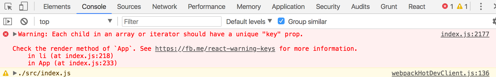
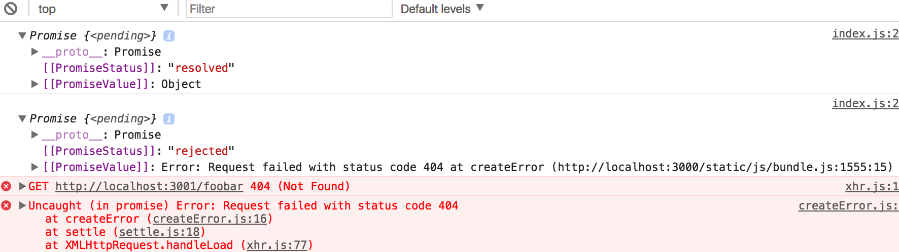
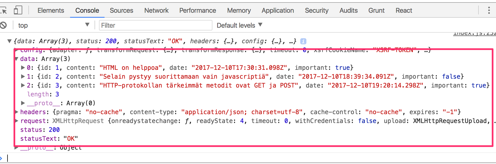
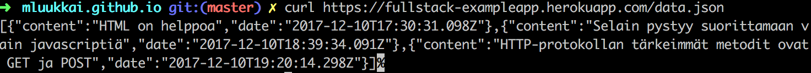
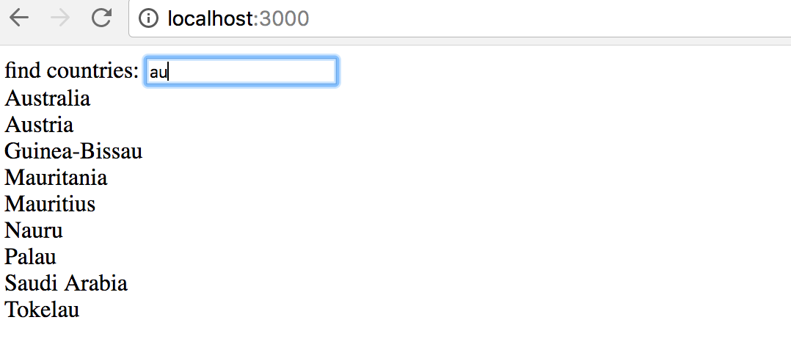
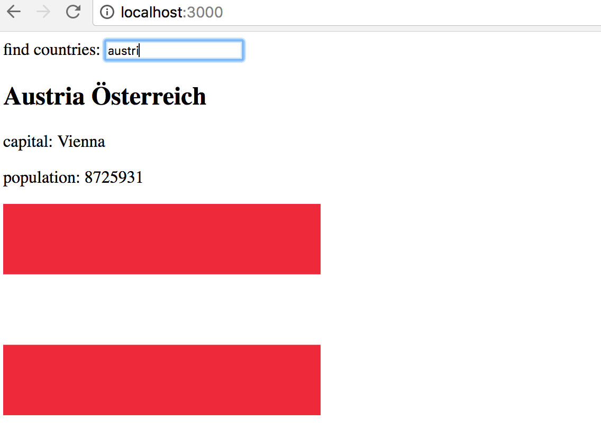
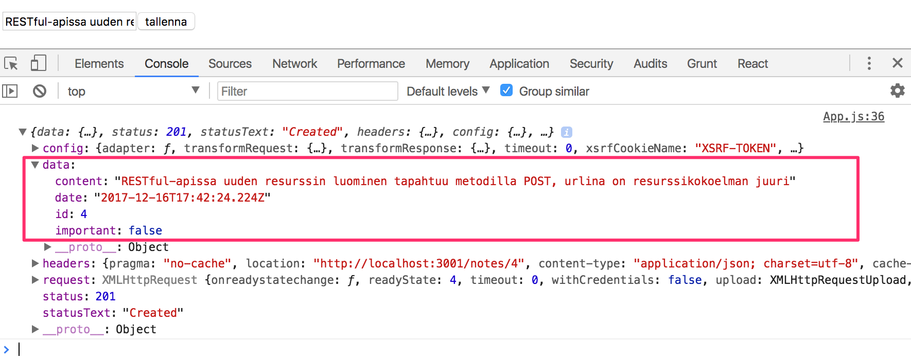
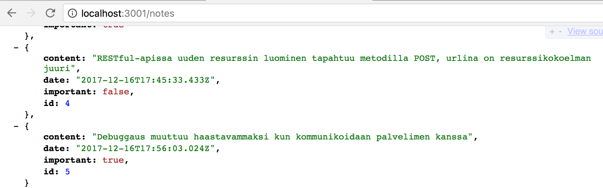
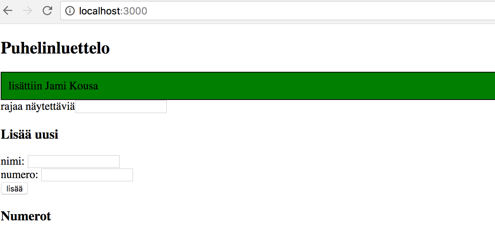
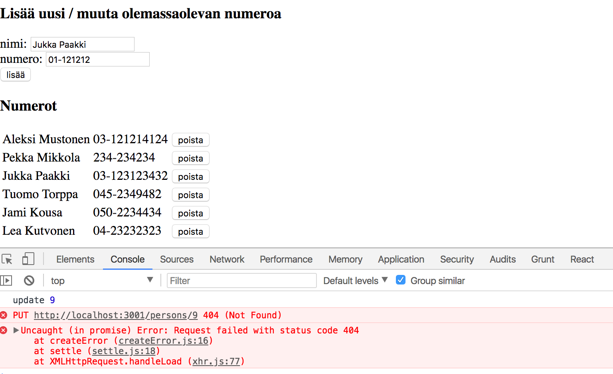

<div class="content">

## Taulukkojen käyttö Javascriptissä

Tästä osasta lähtien käytämme runsaasti Javascriptin [taulukkojen](https://developer.mozilla.org/en-US/docs/Web/JavaScript/Reference/Global_Objects/Array) funktionaalisia käsittelymetodeja, kuten _find_, _filter_ ja _map_. Periaate niissä on täysin sama kuin Java 8:sta tutuissa streameissa, joita on käytetty jo runsaan vuoden ajan laitoksen Ohjelmoinnin perusteissa ja jatkokurssilla.

Jos taulukon funktionaalinen käsittely tuntuu vielä vieraalta, kannattaa katsoa Youtubessa olevasta videosarjasta _Functional Programming in JavaScript_ ainakin kolme ensimmäistä osaa

- [Higher-order functions](https://www.youtube.com/watch?v=BMUiFMZr7vk&list=PL0zVEGEvSaeEd9hlmCXrk5yUyqUag-n84)
- [Map](https://www.youtube.com/watch?v=bCqtb-Z5YGQ&list=PL0zVEGEvSaeEd9hlmCXrk5yUyqUag-n84&index=2)
- [Reduce basics](https://www.youtube.com/watch?v=Wl98eZpkp-c&t=31s)

## Kokoelmien renderöiminen

Tehdään nyt Reactilla [ensimmäisen osan](/osa1) alussa käytettyä esimerkkisovelluksen [Single page app -versiota](https://fullstack-exampleapp.herokuapp.com/spa) vastaavan sovelluksen 'frontend' eli selainpuolen sovelluslogiikka.

Aloitetaan seuraavasta:

```react
import React from 'react'
import ReactDOM from 'react-dom'

const notes = [
  {
    id: 1,
    content: 'HTML on helppoa',
    date: '2017-12-10T17:30:31.098Z',
    important: true
  },
  {
    id: 2,
    content: 'Selain pystyy suorittamaan vain javascriptiä',
    date: '2017-12-10T18:39:34.091Z',
    important: false
  },
  {
    id: 3,
    content: 'HTTP-protokollan tärkeimmät metodit ovat GET ja POST',
    date: '2017-12-10T19:20:14.298Z',
    important: true
  }
]

const App = (props) => {
  const { notes } = props;

  return (
    <div>
      <h1>Muistiinpanot</h1>
      <ul>
        <li>{notes[0].content}</li>
        <li>{notes[1].content}</li>
        <li>{notes[2].content}</li>
      </ul>
    </div>
  )
}

ReactDOM.render(
  <App notes={notes} />,
  document.getElementById('root')
)
```

Jokaiseen muistiinpanoon on merkitty tekstuaalisen sisällön ja aikaleiman lisäksi myös _boolean_-arvo, joka kertoo onko muistiinpano luokiteltu tärkeäksi, sekä yksikäsitteinen tunniste _id_.

Koodin toiminta perustuu siihen, että taulukossa on tasan kolme muistiinpanoa, yksittäiset muistiinpanot renderöidään 'kovakoodatusti' viittaamalla suoraan taulukossa oleviin olioihin:

```html
<li>{note[1].content}</li>
```

Tämä ei tietenkään ole järkevää. Ratkaisu voidaan yleistää generoimalla taulukon perusteella joukko React-elementtejä käyttäen [map](https://developer.mozilla.org/en-US/docs/Web/JavaScript/Reference/Global_Objects/Array/map)-funktiota:

```bash
notes.map(note => <li>{note.content}</li>)
```

nyt tuloksena on taulukko, jonka sisältö on joukko _li_-elementtejä

```js
[
  '<li>HTML on helppoa</li>',
  '<li>Selain pystyy suorittamaan vain javascriptiä</li>',
  '<li>HTTP-protokollan tärkeimmät metodit ovat GET ja POST</li>',
];
```

jotka voidaan sijoittaa _ul_-tagien sisälle:

```react
const App = (props) => {
  const { notes } = props;

  return (
    <div>
      <h1>Muistiinpanot</h1>
      <ul>
        {notes.map(note => <li>{note.content}</li>)}
      </ul>
    </div>
  )
}
```

Koska li-tagit generoiva koodi on Javascriptia, tulee se sijoittaa JSX-templatessa aaltosulkujen sisälle kaiken muun Javascript-koodin tapaan.

Usein vastaavissa tilanteissa dynaamisesti generoitava sisältö eristetään omaan metodiin, jota JSX-template kutsuu:

```react
const App = (props) => {
  const { notes } = props;
  const rivit = () => notes.map(note => <li>{note.content}</li>)

  return (
    <div>
      <h1>Muistiinpanot</h1>
      <ul>
        {rivit()}
      </ul>
    </div>
  )
}
```

Vaikka sovellus näyttää toimivan, tulee konsoliin ikävä varoitus



Kuten virheilmoituksen linkittämä [sivu](https://reactjs.org/docs/lists-and-keys.html#keys) kertoo, tulee taulukossa olevilla, eli käytännössä _map_-metodilla muodostetuilla elementeillä olla uniikki avain, eli kenttä nimeltään _key_.

Lisätään avaimet:

```react
const App = (props) => {
  const { notes } = props;
  const rivit = () => notes.map(note => <li key={note.id}>{note.content}</li>)

  return (
    <div>
      <h1>Muistiinpanot</h1>
      <ul>
        {rivit()}
      </ul>
    </div>
  )
}
```

Virheilmoitus katoaa.

React käyttää taulukossa olevien elementtien key-kenttiä päätellessään miten sen tulee päivittää komponentin generoimaa näkymää silloin kun komponentti uudelleenrenderöidään. Lisää aiheesta [täällä](https://reactjs.org/docs/reconciliation.html#recursing-on-children).

### Map

Taulukoiden metodin [map](https://developer.mozilla.org/en-US/docs/Web/JavaScript/Reference/Global_Objects/Array/map) toiminnan sisäistäminen on jatkon kannalta äärimmäisen tärkeää.

Sovellus siis sisältää taulukon _notes_

```js
const notes = [
  {
    id: 1,
    content: 'HTML on helppoa',
    date: '2017-12-10T17:30:31.098Z',
    important: true,
  },
  {
    id: 2,
    content: 'Selain pystyy suorittamaan vain javascriptiä',
    date: '2017-12-10T18:39:34.091Z',
    important: false,
  },
  {
    id: 3,
    content: 'HTTP-protokollan tärkeimmät metodit ovat GET ja POST',
    date: '2017-12-10T19:20:14.298Z',
    important: true,
  },
];
```

Pysähdytään hetkeksi tarkastelemaan miten _map_ toimii.

Jos esim. tiedoston loppuun lisätään seuraava koodi

```js
const result = notes.map(note => note.id);
console.log(result);
```

tulostuu konsoliin _[1, 2, 3]_ eli _map_ muodostaa uuden taulukon, jonka jokainen alkio on saatu alkuperäisen taulukon _notes_ alkioista _mappaamalla_ komennon parametrina olevan funktion avulla.

Funktio on

```js
note => note.id;
```

eli kompaktissa muodossa kirjoitettu nuolifunktio, joka on täydelliseltä kirjoitustavaltaan seuraava

```js
note => {
  return note.id;
};
```

eli funktio saa parametrikseen muistiinpano-olion ja _palauttaa_ sen kentän _id_ arvon.

Muuttamalla komento muotoon

```js
const result = notes.map(note => note.content);
```

tuloksena on taulukko, joka koostuu muistiinpanojen sisällöistä.

Tämä on jo lähellä käyttämäämme React-koodia:

```bash
notes.map(note => <li key={note.id}>{note.content}</li>)
```

joka muodostaa jokaista muistiinpano-olioa vastaavan _li_-tagin, jonka sisään tulee muistiinpanon sisältö.

Koska metodin _map_ parametrina olevan funktion

```bash
note => <li key={note.id}>{note.content}</li>
```

käyttötarkoitus on näkymäelementtien muodostaminen, tulee muuttujan arvo renderöidä aaltosulkeiden sisällä. Kokeile mitä koodi tekee, jos poistat aaltosulkeet.

Aaltosulkeiden käyttö tulee varmaan aiheuttamaan alussa pientä päänvaivaa, mutta totut niihin pian. Reactin antama visuaalinen feedback on välitön.

Tarkastellaan vielä erästä bugien lähdettä. Lisää koodiin seuraava

```bash
const result = notes.map(note => {note.content} )
console.log(result)
```

Tulostuu

```bash
[undefined, undefined, undefined]
```

Missä on vika? Koodihan on ihan sama kun äsken toiminut koodi. Paitsi ei ihan. Metodin _map_ parametrina on nyt seuraava funktio

```js
note => {
  note.content;
};
```

Koska funktio koostuu nyt _koodilohkosta_ on funktion paluuarvo määrittelemätön eli _undefined_. Nuolifunktiot siis palauttavat ainoan komentonsa arvon, ainoastaan jos nuolifunktio on määritelty kompaktissa muodossaan, ilman koodilohkoa:

```js
note => note.content;
```

huomaa, että 'oneliner'-nuolifunktioissa kaikkea ei tarvitse eikä aina kannatakaan kirjoittaa samalle riville.

Parempi muotoilu ohjelmamme muistiinpanorivit tuottavalle apufunktiolle saattaakin olla seuraava useille riveille jaoteltu versio:

```bash
const rivit = () => notes.map(note =>
  <li key={note.id}>
    {note.content}
  </li>
)
```

Kyse on kuitenkin edelleen yhden komennon sisältävästä nuolifunktiosta, komento vain sattuu olemaan hieman monimutkaisempi.

### Antipattern: taulukon indeksit avaimina

Olisimme saaneet konsolissa olevan varoituksen katoamaan myös käyttämällä avaimina taulukon indeksejä. Indeksit selviävät käyttämällä map-metodissa myös toista parametria:

```js
notes.map((note, i) => ...)
```

näin kutsuttaessa _i_ saa arvokseen sen paikan indeksin taulukossa, missä _note_ sijaitsee.

Eli virheetön tapa määritellä rivien generointi on

```bash
const rivit = () => notes.map((note, i) => <li key={i}>{note.content}</li>)
```

Tämä **ei kuitenkaan ole suositeltavaa** ja voi näennäisestä toimimisestaan aiheuttaa joissakin tilanteissa pahoja ongelmia. Lue lisää esim. [täältä](https://medium.com/@robinpokorny/index-as-a-key-is-an-anti-pattern-e0349aece318).

### Refaktorointia - moduulit

Siistitään koodia hiukan. Koska olemme kiinnostuneita ainoastaan propsien kentästä _notes_, otetaan se vastaan suoraan [destrukturointia](https://developer.mozilla.org/en-US/docs/Web/JavaScript/Reference/Operators/Destructuring_assignment) hyödyntäen:

```react
const App = ({ notes }) => {
  // ...

  return (
    <div>
      <h1>Muistiinpanot</h1>
      <ul>
        {rivit()}
      </ul>
    </div>
  )
}
```

Erotetaan yksittäisen muistiinpanon esittäminen oman komponenttinsa _Note_ vastuulle:

```react
const Note = ({ note }) => {
  return (
    <li>{note.content}</li>
  )
}

const App = ({ notes }) => {
  return (
    <div>
      <h1>Muistiinpanot</h1>
      <ul>
        {notes.map(note=><Note key={note.id} note={note}/>)}
      </ul>
    </div>
  )
}
```

Huomaa, että _key_-attribuutti täytyy nyt määritellä _Note_-komponenteille, eikä _li_-tageille kuten ennen muutosta.

Koko React-sovellus on mahdollista määritellä samassa tiedostossa, mutta se ei luonnollisesti ole järkevää. Usein käytäntönä on määritellä yksittäiset komponentit omassa tiedostossaan _ES6-moduuleina_.

Koodissamme on käytetty koko ajan moduuleja. Tiedoston ensimmäiset rivit

```js
import React from 'react';
import ReactDOM from 'react-dom';
```

[importtaavat](https://developer.mozilla.org/en-US/docs/Web/JavaScript/Reference/Statements/import) eli ottavat käyttöönsä kaksi moduulia. Moduuli _react_ sijoitetaan muuttujaan _React_ ja _react-dom_ muuttujaan _ReactDOM_.

Siirretään nyt komponentti _Note_ omaan moduuliinsa.

Pienissä sovelluksissa komponentit sijoitetaan yleensä _src_-hakemiston alle sijoitettavaan hakemistoon _components_. Konventiona on nimetä tiedosto komponentin mukaan, eli tehdään hakemisto _components_ ja sinne tiedosto _Note.js_ jonka sisältö on seuraava:

```react
import React from 'react'

const Note = ({ note }) => {
  return (
    <li>{note.content}</li>
  )
}

export default Note
```

Koska kyseessä on React-komponentti, tulee React importata komponentissa.

Moduulin viimeisenä rivinä [eksportataan](https://developer.mozilla.org/en-US/docs/Web/JavaScript/Reference/Statements/export) määritelty komponentti, eli muuttuja _Note_.

Nyt komponenttia käyttävä tiedosto _index.js_ voi [importata](https://developer.mozilla.org/en-US/docs/Web/JavaScript/Reference/Statements/import) moduulin:

```react
import React from 'react'
import ReactDOM from 'react-dom'
import Note from './components/Note'
```

Moduulin eksporttaama komponentti on nyt käytettävissä muuttujassa _Note_ täysin samalla tavalla kuin aiemmin.

Huomaa, että itse määriteltyä komponenttia importatessa komponentin sijainti tulee ilmaista _suhteessa importtaavaan tiedostoon_:

```react
'./components/Note'
```

Piste alussa viittaa nykyiseen hakemistoon, eli kyseessä on nykyisen hakemiston alihakemisto _components_ ja sen sisällä tiedosto _Note.js_. Tiedoston päätteen voi jättää pois.

Koska myös _App_ on komponentti, eristetään sekin omaan moduuliinsa. Koska kyseessä on sovelluksen juurikomponentti, sijoitetaan se suoraan hakemistoon _src_. Tiedoston sisältö on seuraava:

```react
import React from 'react'
import Note from './components/Note'

const App = ({ notes }) => {
  return (
    <div>
      <h1>Muistiinpanot</h1>
      <ul>
        {notes.map(note => <Note key={note.id} note={note} />)}
      </ul>
    </div>
  )
}

export default App
```

Tiedoston _index.js_ sisällöksi jää:

```react
import React from 'react'
import ReactDOM from 'react-dom'
import App from './App'

const notes = [
  ...
]

ReactDOM.render(
  <App notes={notes} />,
  document.getElementById('root')
)
```

Moduuleilla on paljon muutakin käyttöä kuin mahdollistaa komponenttien määritteleminen omissa tiedostoissaan, palaamme moduuleihin tarkemmin myöhemmin kurssilla.

Sovelluksen tämänhetkinen koodi on kokonaisuudessaan [githubissa](https://github.com/FullStack-HY/part2-notes/tree/part2-1)

Huomaa, että repositorion master-haarassa on myöhemmän vaiheen koodi, tämän hetken koodi on tagissa [part2-1](https://github.com/FullStack-HY/part2-notes/tree/part2-1):


Jos kloonaat projektin itsellesi, suorita komento _npm install_ ennen käynnistämistä eli komentoa _npm start_.

### Tehtäviä kokoelmien renderöinnistä

</div>

<div class="tasks">

<h3>Tehtävät 2.1</h3>
<h4>kurssien sisältö</h4>

Viimeistellään nyt tehtävien 1.1-1.5 kurssin sisältöjä renderöivän ohjelman koodi. Voit ottaa tarvittaessa pohjaksi mallivastauksen koodin.

Muutetaan komponentti _App_ seuraavasti:

```react
const App = () => {
  const kurssi = {
    nimi: 'Half Stack -sovelluskehitys',
    osat: [
      {
        nimi: 'Reactin perusteet',
        tehtavia: 10,
        id: 1
      },
      {
        nimi: 'Tiedonvälitys propseilla',
        tehtavia: 7,
        id: 2
      },
      {
        nimi: 'Komponenttien tila',
        tehtavia: 14,
        id: 3
      }
    ]
  }

  return (
    <div>
      <Kurssi kurssi={kurssi} />
    </div>
  )
}
```

Määrittele sovellukseen yksittäisen kurssin muotoilusta huolehtiva komponentti _Kurssi_.

Sovelluksen komponenttirakenne voi olla esim. seuraava:

<pre>
App
  Kurssi
    Otsikko
    Sisalto
      Osa
      Osa
      ...
</pre>

ja renderöityvä sivu voi näyttää esim. seuraavalta:


Tässä vaiheessa siis tehtävien yhteenlaskettua lukumäärää ei vielä tarvita.

Sovelluksen täytyy luonnollisesti toimia _riippumatta kurssissa olevien osien määrästä_, eli varmista että sovellus toimii jos lisäät tai poistat kurssin osia.

Varmista, että konsolissa ei näy mitään virheilmoituksia!

<h3>Tehtävät 2.2</h3>
<h4>tehtävien määrä</h4>

Ilmoita myös kurssin yhteenlaskettu tehtävien lukumäärä:


<h3>Tehtävät 2.3*</h3>
<h4>reduce</h4>

Jos et jo niin tehnyt, laske koodissasi tehtävien määrä taulukon metodilla [reduce](https://developer.mozilla.org/en-US/docs/Web/JavaScript/Reference/Global_Objects/Array/Reduce).

<h3>Tehtävät 2.4</h3>
<h4>monta kurssia</h4>

Laajennetaan sovellusta siten, että kursseja voi olla _mielivaltainen määrä_:

```react
const App = () => {
  const kurssit = [
    {
      nimi: 'Half Stack -sovelluskehitys',
      id: 1,
      osat: [
        {
          nimi: 'Reactin perusteet',
          tehtavia: 10,
          id: 1
        },
        {
          nimi: 'Tiedonvälitys propseilla',
          tehtavia: 7,
          id: 2
        },
        {
          nimi: 'Komponenttien tila',
          tehtavia: 14,
          id: 3
        }
      ]
    },
    {
      nimi: 'Node.js',
      id: 2,
      osat: [
        {
          nimi: 'Routing',
          tehtavia: 3,
          id: 1
        },
        {
          nimi: 'Middlewaret',
          tehtavia: 7,
          id: 2
        }
      ]
    }
  ]

  return (
    <div>
      // ...
    </div>
  )
}
```

Sovelluksen ulkoasu voi olla esim seuraava:


<h3>Tehtävät 2.5</h3>
<h4>erillinen moduuli</h4>

Määrittele komponentti _Kurssi_ omana moduulinaan, jonka komponentti _App_ importtaa. Voit sisällyttää kaikki kurssin alikomponentit samaan moduuliin.

</div>

<div class="content">

## Lomakkeet

Jatketaan sovelluksen laajentamista siten, että se mahdollistaa uusien muistiinpanojen lisäämisen.

Jotta saisimme sivun päivittymään uusien muistiinpanojen lisäyksen yhteydessä, on parasta sijoittaa muistiinpanot komponentin _App_ tilaan. Funktionaalisilla komponenteilla ei ole tilaa, joten muutetaan _App_ luokkaan perustuvaksi komponentiksi:

```react
class App extends React.Component {
  constructor(props) {
    super(props)
    this.state = {
      notes: props.notes
    }
  }

  render() {
    return (
      <div>
        <h1>Muistiinpanot</h1>
        <ul>
          {this.state.notes.map(note => <Note key={note.id} note={note} />)}
        </ul>
      </div>
    )
  }
}
```

Konstruktori asettaa nyt propseina saatavan _notes_-taulukon tilaan avaimen _notes_ arvoksi:

```js
constructor(props) {
  super(props)
  this.state = {
    notes: props.notes
  }
}
```

tila siis näyttää komponentin alustuksen jälkeen seuraavalta:

```js
this.state = {
  notes: [
    {
      id: 1,
      content: 'HTML on helppoa',
      date: '2017-12-10T17:30:31.098Z',
      important: true,
    },
    //...
  ],
};
```

> **HUOM** komponenttien tilan alustaminen propseina välitettyjen arvojen perusteella ei välttämättä ole hyvä tapa, se on monien mukaan jopa [antipattern](https://vasanthk.gitbooks.io/react-bits/anti-patterns/01.props-in-initial-state.html). Jos kuitenkin tutkitaan vähän pintaa syvemmälle, kyseessä on ongelma lähinnä silloin [jos propsien arvo voi muuttua](https://medium.com/@justintulk/react-anti-patterns-props-in-initial-state-28687846cc2e). Näin ei ohjelmassamme ole, eli tilan alustaminen propsien perusteella on hyväksyttävää.

Lisätään sitten lomake uuden muistiinpanon lisäämistä varten:

```react
class App extends React.Component {
  constructor(props) {
    super(props)
    this.state = {
      notes: props.notes
    }
  }

  addNote = (event) => {
    event.preventDefault()
    console.log('nappia painettu')
  }

  render() {
    return (
      <div>
        <h1>Muistiinpanot</h1>
        <ul>
          {this.state.notes.map(note => <Note key={note.id} note={note} />)}
        </ul>
        <form onSubmit={this.addNote}>
          <input/>
          <button type="submit">tallenna</button>
        </form>
      </div>
    )
  }
}
```

Lomakkeelle on lisätty myös tapahtumankäsittelijäksi metodi _addNote_ reagoimaan sen "lähettämiseen", eli napin painamiseen.

Tapahtumankäsittelijä on [osasta 1](/osa1#tapahtumankäsittely) tuttuun tapaan määritelty seuraavasti:

```js
addNote = event => {
  event.preventDefault();
  console.log('nappia painettu');
  console.log(event.target);
};
```

Parametrin _event_ arvona on metodin kutsun aiheuttama [tapahtuma](https://reactjs.org/docs/handling-events.html).

Tapahtumankäsittelijä kutsuu heti tapahtuman metodia <code>event.preventDefault()</code> jolla se estää lomakkeen lähetyksen oletusarvoisen toiminnan, joka aiheuttaisi mm. sivun uudelleenlatautumisen.

Tapahtuman kohde, eli _event.target_ on tulostettu konsoliin


Kohteena on siis komponentin määrittelemä lomake.

Miten pääsemme käsiksi lomakkeen _input_-komponenttiin syötettyyn dataan?

Tapoja on useampia, tutustumme ensin ns. [kontrolloituina komponentteina](https://reactjs.org/docs/forms.html#controlled-components) toteutettuihin lomakkeisiin.

Lisätään komponentin _App_ tilaan kenttä _newNote_ lomakkeen syötettä varten:

```js
class App extends React.Component {
  constructor(props) {
    super(props);
    this.state = {
      notes: props.notes,
      newNote: 'uusi muistiinpano...',
    };
  }
  // ...
}
```

Määritellään tilaan lisätty kenttä _input_-komponentin attribuutin _value_ arvoksi:

```html
<form onSubmit="{this.addNote}">
  <input value="{this.state.newNote}" /> <button type="submit">tallenna</button>
</form>
```

Tilaan määritelty "placeholder"-teksti _uusi muistiinpano..._ ilmestyy syötekomponenttiin, tekstiä ei kuitenkaan voi muuttaa. Konsoliin tuleekin ikävä varoitus joka kertoo mistä on kyse


Koska määrittelimme syötekomponentille _value_-attribuutiksi komponentin _App_ tilassa olevan kentän, alkaa _App_ [kontrolloimaan](https://reactjs.org/docs/forms.html#controlled-components) syötekomponentin toimintaa.

Jotta kontrolloidun syötekomponentin editoiminen olisi mahdollista, täytyy sille rekisteröidä _tapahtumankäsittelijä_, joka synkronoi syötekenttään tehdyt muutokset komponentin _App_ tilaan:

```react
class App extends React.Component {
  // ...

  handleNoteChange = (event) => {
    console.log(event.target.value)
    this.setState({ newNote: event.target.value })
  }

  render() {
    return (
      <div>
        <h1>Muistiinpanot</h1>
        <ul>
          {this.state.notes.map(note => <Note key={note.id} note={note} />)}
        </ul>
        <form onSubmit={this.addNote}>
          <input
            value={this.state.newNote}
            onChange={this.handleNoteChange}
          />
          <button type="submit">tallenna</button>
        </form>
      </div>
    )
  }
}
```

Lomakkeen _input_-komponentille on nyt rekisteröity tapahtumankäsittelijä tilanteeseen _onChange_:

```html
<input value="{this.state.newNote}" onChange="{this.handleNoteChange}" />
```

Tapahtumankäsittelijää kutsutaan _aina kun syötekomponentissa tapahtuu jotain_. Tapahtumankäsittelijämetodi saa parametriksi tapahtumaolion _event_

```js
handleNoteChange = event => {
  console.log(event.target.value);
  this.setState({ newNote: event.target.value });
};
```

Tapahtumaolion kenttä _target_ vastaa nyt kontrolloitua _input_-kenttää ja _event.target.value_ viittaa inputin syötekentän arvoon.

Huomaa, että toisin kuin tapahtuman _onSubmit_ käsittelijässä, nyt oletusarvoisen toiminnan estävää metodikutusua _event.preventDefault()_ ei tarvita sillä syötekentän muutoksella ei ole oletusarvoista toimintaa toisin kuin lomakkeen lähettämisellä.

Voit seurata konsolista miten tapahtumankäsittelijää kutsutaan:


Muistithan jo asentaa [React devtoolsin](https://chrome.google.com/webstore/detail/react-developer-tools/fmkadmapgofadopljbjfkapdkoienihi)? Devtoolsista näet, miten tila muuttuu syötekenttään kirjoitettaessa:


Nyt komponentin _App_ tilan kenttä _newNote_ heijastaa koko ajan syötekentän arvoa, joten voimme viimeistellä uuden muistiinpanon lisäämisestä huolehtivan metodin _addNote_:

```js
addNote = event => {
  event.preventDefault();
  const noteObject = {
    content: this.state.newNote,
    date: new Date().toISOString(),
    important: Math.random() > 0.5,
    id: this.state.notes.length + 1,
  };

  const notes = this.state.notes.concat(noteObject);

  this.setState({
    notes: notes,
    newNote: '',
  });
};
```

Ensin luodaan uutta muistiinpanoa vastaava olio _noteObject_, jonka sisältökentän arvo saadaan komponentin tilasta _this.state.newNote_. Yksikäsitteinen tunnus eli _id_ generoidaan kaikkien muistiinpanojen lukumäärän perusteella. Koska muistiinpanoja ei poisteta, menetelmä toimii sovelluksessamme. Komennon <code>Math.random()</code> avulla muistiinpanosta tulee 50% todennäköisyydellä tärkeä.

Uusi muistiinpano lisätään vanhojen joukkoon oikeaoppisesti käyttämällä [osasta 1](/osa1#taulukon-käsittelyä) tuttua taulukon metodia [concat](https://developer.mozilla.org/en-US/docs/Web/JavaScript/Reference/Global_Objects/Array/concat):

```js
const notes = this.state.notes.concat(noteObject);
```

Metodi ei muuta alkuperäistä taulukkoa _this.state.notes_ vaan luo uuden taulukon, joka sisältää myös lisättävän alkion. Tämä on tärkeää, sillä Reactin tilaa [ei saa muuttaa suoraan](https://reactjs.org/docs/state-and-lifecycle.html#using-state-correctly)!

Lopussa komponentin tila päivitetään uusilla muistiinpanoilla ja tyhjentämällä syötekomponentin arvoa kontrolloiva kenttä:

```js
this.setState({
  notes: notes,
  newNote: '',
});
```

### Kehittyneempi tapa olioliteraalien kirjoittamiseen

Voimme muuttaa tilan päivittämän koodin

```js
this.setState({
  notes: notes,
  newNote: '',
});
```

muotoon

```js
this.setState({
  notes,
  newNote: '',
});
```

Tämä johtuu siitä, että ES6:n myötä (ks. kohta [property definitions](https://developer.mozilla.org/en-US/docs/Web/JavaScript/Reference/Operators/Object_initializer)) Javascriptiin on tullut uusi ominaisuus, joka mahdollistaa hieman tiiviimmän tavan muuttujien avulla tapahtuvaan olioiden määrittelyyn.

Tarkastellaan tilannetta, jossa meillä on muuttujissa arvoja

```js
const name = 'Leevi';
const age = 0;
```

ja haluamme määritellä näiden perusteella olion, jolla on kentät _name_ ja _age_.

Vanhassa Javascriptissä olio täytyi määritellä seuraavaan tyyliin

```js
const person = {
  name: name,
  age: age,
};
```

koska muuttujien ja luotavan olion kenttien nimi nyt on sama, riittää ES6:ssa kirjoittaa:

```js
const person = { name, age };
```

lopputulos molemmilla tavoilla luotuun olioon on täsmälleen sama.

Sovelluksen tämän hetkinen koodi on kokonaisuudessaan [githubissa](https://github.com/FullStack-HY/part2-notes/tree/part2-2), tagissa _part2-2_.

## Näytettävien elementtien filtteröinti

Tehdään sovellukseen toiminto, joka mahdollistaa ainoastaan tärkeiden muistiinpanojen näyttämisen.

Lisätään komponentin _App_ tilaan tieto siitä näytetäänkö muistiinpanoista kaikki vai ainoastaan tärkeät:

```react
class App extends React.Component {
  constructor(props) {
    super(props)
    this.state = {
      notes: props.notes ,
      newNote: '',
      showAll: true
    }
  }
  // ...
}
```

Muutetaan metodia _render_ siten, että se tallettaa muuttujaan _notesToShow_ näytettävien muistiinpanojen listan riippuen siitä tuleeko näyttää kaikki vai vain tärkeät:

```react
render() {
  const notesToShow =
    this.state.showAll ?
      this.state.notes :
      this.state.notes.filter(note => note.important === true)

  return (
    <div>
      <h1>Muistiinpanot</h1>
      <ul>
        {notesToShow.map(note => <Note key={note.id} note={note} />)}
      </ul>
      <form onSubmit={this.addNote}>
        <input
          value={this.state.newNote}
          onChange={this.handleNoteChange}
        />
        <button type="submit">tallenna</button>
      </form>
    </div>
  )
}
```

Muuttujan _notesToShow_ määrittely on melko kompakti

```js
const notesToShow = this.state.showAll
  ? this.state.notes
  : this.state.notes.filter(note => note.important === true);
```

Käytössä on monissa muissakin kielissä oleva [ehdollinen](https://developer.mozilla.org/en-US/docs/Web/JavaScript/Reference/Operators/Conditional_Operator) operaatio.

Operaatio toimii seuraavasti. Jos meillä on esim:

```js
const tulos = ehto ? val1 : val2;
```

muuttujan _tulos_ arvoksi asetetaan _val1_:n arvo jos _ehto_ on tosi. Jos _ehto_ ei ole tosi, muuttujan _tulos_ arvoksi tulee _val2_:n arvo.

Jos ehto _this.state.showAll_ on epätosi, muuttuja _notesToShow_ saa arvokseen vaan ne muistiinpanot, joiden _important_-kentän arvo on tosi. Filtteröinti tapahtuu taulukon metodilla [filter](https://developer.mozilla.org/en-US/docs/Web/JavaScript/Reference/Global_Objects/Array/filter):

```js
this.state.notes.filter(note => note.important === true);
```

vertailu-operaatio on oikeastaan turha koska _note.important_ on arvoltaan joko _true_ tai _false_, eli riittää kirjoittaa

```js
this.state.notes.filter(note => note.important);
```

Tässä käytettiin kuitenkin ensin vertailuoperaattoria, mm. korostamaan erästä tärkeää seikkaa: Javascriptissa <code>arvo1 == arvo2</code> ei toimi kaikissa tilanteissa loogisesti ja onkin varmempi käyttää aina vertailuissa muotoa <code>arvo1 === arvo2</code>. Enemmän aiheesta [täällä](https://developer.mozilla.org/en-US/docs/Web/JavaScript/Equality_comparisons_and_sameness).

Filtteröinnin toimivuutta voi jo nyt kokeilla vaihtelemalla sitä, miten tilan kentän _showAll_ alkuarvo määritelään konstruktorissa.

Lisätään sitten toiminnallisuus, mikä mahdollistaa _showAll_:in tilan muuttamisen sovelluksesta.

Oleelliset muutokset ovat seuraavassa:

```react
class App extends React.Component {
  // ...

  toggleVisible = () => {
    this.setState({showAll: !this.state.showAll})
  }

  render() {
    const notesToShow =
      this.state.showAll ?
        this.state.notes :
        this.state.notes.filter(note => note.important === true)

    const label = this.state.showAll ? 'vain tärkeät' : 'kaikki'

    return (
      <div>
        <h1>Muistiinpanot</h1>

        <div>
          <button onClick={this.toggleVisible}>
            näytä {label}
          </button>
        </div>

        <ul>
          {notesToShow.map(note => <Note key={note.id} note={note} />)}
        </ul>
        <form onSubmit={this.addNote}>
          <input
            value={this.state.newNote}
            onChange={this.handleNoteChange}
          />
          <button type="submit">tallenna</button>
        </form>
      </div>
    )
  }
}
```

Näkyviä muistiinpanoja (kaikki vai ainoastaan tärkeät) siis kontrolloidaan napin avulla. Napin tapahtumankäsittelijä on yksinkertainen, se muuttaa _this.state.showAll_:n arvon truesta falseksi ja päinvastoin:

```js
toggleVisible = () => {
  this.setState({ showAll: !this.state.showAll });
};
```

Napin teksti määritellään muuttujaan, jonka arvo määräytyy tilan perusteella:

```js
const label = this.state.showAll ? 'vain tärkeät' : 'kaikki';
```

Sovelluksen tämän hetkinen koodi on kokonaisuudessaan [githubissa](https://github.com/FullStack-HY/part2-notes/tree/part2-3), tagissa _part2-3_.

</div>

<div class="tasks">

<h3>Tehtävät 2.6</h3>
<h4>puhelinluettelo osa 1</h4>

Toteutetaan yksinkertainen puhelinluettelo. **Aluksi luetteloon lisätään vaan nimiä.**

Voit ottaa sovelluksesi pohjaksi seuraavan:

```react
import React from 'react';

class App extends React.Component {
  constructor(props) {
    super(props)
    this.state = {
      persons: [
        { name: 'Arto Hellas' }
      ],
      newName: ''
    }
  }

  render() {
    return (
      <div>
        <h2>Puhelinluettelo</h2>
        <form>
          <div>
            nimi: <input />
          </div>
          <div>
            <button type="submit">lisää</button>
          </div>
        </form>
        <h2>Numerot</h2>
        ...
      </div>
    )
  }
}

export default App
```

Tilassa oleva kenttä _newName_ on tarkoitettu lomakkeen kentän kontrollointiin.

Joskus tilan muuttujia ja tarvittaessa muitakin voi olla hyödyllistä renderöidä debugatessa komponenttiin, eli voi tilapäisesti lisätä komponentin metodin _render_ palauttamaan koodiin esim. seuraavan:

```html
<div>debug: {this.state.newName}</div>
```

Muista myös osan 1 luku [React-sovellusten debuggaus](#react-sovellusten-debuggaus), erityisesti [react developer tools](https://chrome.google.com/webstore/detail/react-developer-tools/fmkadmapgofadopljbjfkapdkoienihi) on välillä todella kätevä komponentin tilan muutosten seuraamisessa.

Sovellus voi näyttää tässä vaiheessa seuraavalta:


Huomaa, React developer toolsin käyttö!

**Huom:**

- voit käyttää kentän _key_ arvona henkilön nimeä
- muista estää lomakkeen lähetyksen oletusarvoinen toiminta!

<h3>Tehtävät 2.7</h3>
<h4>puhelinluettelo osa 2</h4>

Jos lisättävä nimi on jo sovelluksen tiedossa, estä lisäys. Taulukolla on lukuisia sopivia [metodeja](https://developer.mozilla.org/en-US/docs/Web/JavaScript/Reference/Global_Objects/Array) tehtävän tekemiseen.

Voit antaa halutessasi virheilmoituksen esim. komennolla _alert()_. Se ei kuitenkaan ole tarpeen.

<h3>Tehtävät 2.8</h3>
<h4>puhlelinluettelo osa 3</h4>

Lisää sovellukseen mahdollisuus antaa henkilöille puhelinnumero. Tarvitset siis lomakkeeseen myös toisen _input_-elementin (ja sille oman muutoksenkäsittelijän):

```html
<form>
  <div>nimi: <input /></div>
  <div>numero: <input /></div>
  <div><button type="submit">lisää</button></div>
</form>
```

Sovellus voi näyttää tässä vaiheessa seuraavalta. Kuvassa myös [react developer tools](https://chrome.google.com/webstore/detail/react-developer-tools/fmkadmapgofadopljbjfkapdkoienihi):in tarjoama näkymä komponentin _App_ tilaan:


<h3>Tehtävät 2.9*</h3>
<h4>puhelinluettelo osa 4</h4>

Tee lomakkeeseen hakukenttä, jonka avulla näytettävien nimien listaa voidaan rajata:


Rajausehdon syöttämisen voi hoitaa omana lomakkeeseen kuulumattomana _input_-elementtinä. Kuvassa rajausehdosta on tehty _caseinsensitiivinen_ eli ehto _arto_ löytää isolla kirjaimella kirjoitetun Arton.

**Huom:** Kun toteutat jotain uutta toiminnallisuutta, on usein hyötyä 'kovakoodata' sovellukseen jotain sisältöä, esim.

```js
constructor(props) {
  super(props)
  this.state = {
    persons: [
      { name: 'Arto Hellas', number: '040-123456' },
      { name: 'Martti Tienari', number: '040-123456' },
      { name: 'Arto Järvinen', number: '040-123456' },
      { name: 'Lea Kutvonen', number: '040-123456' }
    ],
    newName: '',
    newNumber: '',
    filter: ''
  }
}
```

Näin vältytään turhalta manuaaliselta työltä, missä testaaminen edellyttäisi myös testiaineiston syöttämistä käsin soveluksen lomakkeen kautta.

Kurssin seuraavasta osasta alkaen alamme määrittelemään sovelluksemme _testejä_ jotka tietyissä tapauksissa hoitavat kovakoodatun apusyötteen roolia.

<h3>Tehtävät 2.10</h3>
<h4>puhelinluettelo osa 5</h4>

Jos koko sovelluksesi on tehty yhteen komponenttiin, refaktoroi sitä eriyttämällä sopivia komponentteja. Pidä kuitenkin edelleen kaikki tila juurikomponentissa.

Riittää että erotat sovelluksesta kaksi komponenttia. Hyviä kandidaatteja ovat esim. filtteröintilomake, yksittäisten henkilön tietojen esittäminen ja uuden henkilön lisäävä lomake.

</div>

<div class="content">

## Datan haku palvelimelta

Olemme nyt viipyneet tovin keskittyen pelkkään "frontendiin", eli selainpuolen toiminnallisuuteen. Rupeamme itse toteuttamaan "backendin", eli palvelinpuolen toiminnallisuutta vasta kurssin kolmannessa osassa, mutta otamme nyt jo askeleen sinne suuntaan tutustumalla siihen miten selaimessa suoritettava koodi kommunikoi backendin kanssa.

Käytetään nyt palvelimena sovelluskehitykseen tarkoitettua [JSON Serveriä](https://github.com/typicode/json-server).

Tee projektin juurihakemistoon tiedosto _db.json_, jolla on seuraava sisältö:

```json
{
  "notes": [
    {
      "id": 1,
      "content": "HTML on helppoa",
      "date": "2017-12-10T17:30:31.098Z",
      "important": true
    },
    {
      "id": 2,
      "content": "Selain pystyy suorittamaan vain javascriptiä",
      "date": "2017-12-10T18:39:34.091Z",
      "important": false
    },
    {
      "id": 3,
      "content": "HTTP-protokollan tärkeimmät metodit ovat GET ja POST",
      "date": "2017-12-10T19:20:14.298Z",
      "important": true
    }
  ]
}
```

JSON server on mahdollista [asentaa](https://github.com/typicode/json-server#install) koneelle ns. globaalisti komennolla _npm install -g json-server_. Globaali asennus edellyttää kuitenkin pääkäyttäjän oikeuksia, eli se ei ole mahdollista laitoksen koneilla tai uusilla fuksiläppäreillä.

Globaali asennus ei kuitenkaan ole tarpeen, voimme käynnistää _json-serverin_ komennon _npx_ avulla:

```bash
npx json-server --port=3001 --watch db.json
```

Oletusarvoisesti _json-server_ käynnistyy porttiin 3000, mutta create-react-app:illa luodut projektit varaavat portin 3000, joten joudumme nyt määrittelemään json-server:ille vaihtoehtoisen portin 3001.

Mennään selaimella osoitteeseen <http://localhost:3001/notes>. Kuten huomaamme, _json-server_ tarjoaa osoitteessa tiedostoon tallentamamme muistiinpanot JSON-muodossa:


Ideana jatkossa onkin se, että muistiinpanot talletetaan palvelimelle, eli tässä vaiheessa _json-server_:ille. React-koodi lataa muistiinpanot palvelimelta ja renderöi ne ruudulle. Kun sovellukseen lisätään uusi muistiinpano, React-koodi lähettää sen myös palvelimelle, jotta uudet muistiinpanot jäävät pysyvästi "muistiin".

json-server tallettaa kaiken datan palvelimella sijaitsevaan tiedostoon _db.json_. Todellisuudessa data tullaan tallentamaan johonkin tietokantaan. json-server on kuitenkin käyttökelpoinen apuväline, joka mahdollistaa palvelinpuolen toiminnallisuuden käyttämisen kehitysvaiheessa ilman tarvetta itse ohjelmoida mitään.

Tutustumme palvelinpuolen toteuttamisen periaatteisiin tarkemmin kurssin [osassa 3](/osa3).

### Selain suoritusympäristönä

Ensimmäisenä tehtävänämme on siis hakea React-sovellukseen jo olemassaolevat mustiinpanot osoitteesta <http://localhost:3001/notes>.

Osan 0 [esimerkkiprojektissa](/osa0#selaimessa-suoritettava-sovelluslogiikka) nähtiin jo eräs tapa hakea Javascript-koodista palvelimella olevaa dataa. Esimerkin koodissa data haettiin [XMLHttpRequest](https://developer.mozilla.org/en-US/docs/Web/API/XMLHttpRequest)- eli XHR-olion avulla muodostetulla HTTP-pyynnöllä. Kyseessä on vuonna 1999 lanseerattu tekniikka, jota kaikki web-selaimet ovat jo pitkään tukeneet.

Nykyään XHR:ää ei kuitenkaan kannata käyttää ja selaimet tukevatkin jo laajasti [fetch](https://developer.mozilla.org/en-US/docs/Web/API/WindowOrWorkerGlobalScope/fetch)-metodia, joka perustuu XHR:n käyttämän tapahtumapohjaisen mallin sijaan ns. [promiseihin](https://developer.mozilla.org/en-US/docs/Web/JavaScript/Reference/Global_Objects/Promise).

Muistutuksena edellisestä osasta (oikeastaan tätä tapaa pitää lähinnä _muistaa olla käyttämättä_ ilman painavaa syytä), XHR:llä haettiin dataa seuraavasti

```js
const xhttp = new XMLHttpRequest();

xhttp.onreadystatechange = function() {
  if (this.readyState == 4 && this.status == 200) {
    const data = JSON.parse(this.responseText);
    // käsittele muuttujaan data sijoitettu kyselyn tulos
  }
};

xhttp.open('GET', '/data.json', true);
xhttp.send();
```

Heti alussa HTTP-pyyntöä vastaavalle _xhttp_-oliolle rekisteröidään _tapahtumankäsittelijä_, jota Javascript runtime kutsuu kun _xhttp_-olion tila muuttuu. Jos tilanmuutos tarkoittaa että pyynnön vastaus on saapunut, käsitellään data halutulla tavalla.

Huomionarvoista on se, että tapahtumankäsittelijän koodi on määritelty jo ennen kun itse pyyntö lähetetään palvelimelle. Tapahtumankäsittelijäfunktio tullaan kuitenkin suorittamaan vasta jossain myöhäisemmässä vaiheessa. Koodin suoritus ei siis etene synkronisesti "ylhäältä alas", vaan _asynkronisesti_, Javascript kutsuu sille rekisteröityä tapahtumankäsittelijäfunktiota jossain vaiheessa.

Esim. Java-ohjelmoinnista tuttu synkroninen tapa tehdä kyselyjä etenisi seuraavaan tapaan (huomaa että kyse ei ole oikeasti toimivasta Java-koodista):

```java
HTTPRequest request = new HTTPRequest()

String url = "https://fullstack-exampleapp.herokuapp.com/data.json";
List<Muistiinpano> muistiinpanot = request.get(url);

muistiinpanot.forEach(m => {
  System.out.println(m.content);
})
```

Javassa koodi etenee nyt rivi riviltä ja koodi pysähtyy odottamaan HTTP-pyynnön, eli komennon _request.get(...)_ valmistumista. Komennon palauttama data, eli muistiinpanot talletetaan muuttujaan ja dataa aletaan käsittelemään halutulla tavalla.

Javascript-enginet eli suoritusympäristöt kuitenkin noudattavat [asynkronista mallia](https://developer.mozilla.org/en-US/docs/Web/JavaScript/EventLoop), eli periaatteena on se, että kaikki [IO-operaatiot](https://en.wikipedia.org/wiki/Input/output) (poislukien muutama poikkeus) suoritetaan ei-blokkaavana, eli operaatioiden tulosta ei jäädä odottamaan vaan koodin suoritusta jatketaan heti eteenpäin.

Siinä vaiheessa kun operaatio valmistuu tai tarkemmin sanoen jonain valmistumisen jälkeisenä ajanhetkenä, kutsuu Javascript-engine operaatiolle rekisteröityjä tapahtumankäsittelijöitä.

Nykyisellään Javascript-moottorit ovat _yksisäikeisiä_ eli ne eivät voi suorittaa rinnakkaista koodia. Tämän takia on käytännössä pakko käyttää ei-blokkaavaa mallia IO-operaatioiden suorittamiseen, sillä muuten selain 'jäätyisi' siksi aikaa kun esim. palvelimelta haetaan dataa.

Javascript-moottoreiden yksisäikeisyydellä on myös sellainen seuraus, että jos koodin suoritus kestää erittäin pitkään, menee selain jumiin suorituksen ajaksi. Jos lisätään jonnekin kohtaa sovellustamme, esim. konstruktoriin seuraava koodi:

```js
setTimeout(() => {
  console.log('loop..');
  let i = 0;
  while (i < 50000000000) {
    i++;
  }
  console.log('end');
}, 5000);
```

Kaikki toimii 5 sekunnin ajan normaalisti. Kun _setTimeout_:in parametrina määritelty funktio suoritetaan, menee selaimen sivu jumiin pitkän loopin suorituksen ajaksi. Ainakaan Chromessa selaimen tabia ei pysty edes sulkemaan luupin suorituksen aikana.

Eli jotta selain säilyy _responsiivisena_, eli että se reagoi koko ajan riittävän nopeasti käyttäjän haluamiin toimenpiteisiin, koodin logiikan tulee olla sellainen, että yksittäinen laskenta ei saa kestää liian kauaa.

Aiheesta löytyy paljon lisämateriaalia internetistä, eräs varsin havainnollinen esitys aiheesta Philip Robertsin esitelmä [What the heck is the event loop anyway?](https://www.youtube.com/watch?v=8aGhZQkoFbQ)

Nykyään selaimissa on mahdollisuus suorittaa myös rinnakkaista koodia ns. [web workerien](https://developer.mozilla.org/en-US/docs/Web/API/Web_Workers_API/Using_web_workers) avulla. Yksittäisen selainikkunan koodin ns. event loopista huolehtii kuitenkin edelleen [vain yksi säie](https://medium.com/techtrument/multithreading-javascript-46156179cf9a).

## npm

Palaamme jälleen asiaan, eli datan hakemiseen palvelimelta.

Voisimme käyttää datan palvelimelta hakemiseen aiemmin mainittua promiseihin perustuvaa funktiota [fetch](https://developer.mozilla.org/en-US/docs/Web/API/WindowOrWorkerGlobalScope/fetch). Fetch on hyvä työkalu, se on standardoitu ja kaikkien modernien selaimien (poislukien IE) tukema.

Käytetään selaimen ja palvelimen väliseen kommunikaatioon kuitenkin [axios](https://github.com/axios/axios)-kirjastoa, joka toimii samaan tapaan kuin fetch, mutta on hieman mukavampikäyttöinen. Hyvä syy axios:in käytölle on myös se, että pääsemme tutustumaan siihen miten ulkopuolisia kirjastoja eli _npm-paketteja_ liitetään React-projektiin.

Nykyään lähes kaikki Javascript-projektit määritellään node "pakkausmanagerin" eli [npm](https://docs.npmjs.com/getting-started/what-is-npm):n avulla. Myös create-react-app:in avulla generoidut projektit ovat npm-muotoisia projekteja. Varma tuntomerkki siitä on projektin juuressa oleva tiedosto _package.json_:

```json
{
  "name": "osa2",
  "version": "0.1.0",
  "private": true,
  "dependencies": {
    "react": "^16.2.0",
    "react-dom": "^16.2.0",
    "react-scripts": "1.0.17"
  },
  "scripts": {
    "start": "react-scripts start",
    "build": "react-scripts build",
    "test": "react-scripts test --env=jsdom",
    "eject": "react-scripts eject"
  }
}
```

Tässä vaiheessa meitä kiinnostaa osa _dependencies_, joka määrittelee mitä _riippuvuuksia_ eli ulkoisia kirjastoja projektilla on.

Haluamme nyt käyttöömme axioksen. Voisimme määritellä kirjaston suoraan tiedostoon _package.json_, mutta on parempi asentaa se komentoriviltä

```bash
npm install axios --save
```

**Huomaa, että _npm_-komennot tulee antaa aina projektin juurihakemistossa**, eli siinä minkä sisältä tiedosto _package.json_ löytyy.

Nyt axios on mukana riippuvuuksien joukossa:

```json
{
  "dependencies": {
    "axios": "^0.17.1",
    "react": "^16.2.0",
    "react-dom": "^16.2.0",
    "react-scripts": "1.0.17"
  }
  /*...*/
}
```

Sen lisäksi, että komento _npm install_ lisäsi axiosin riippuvuuksien joukkoon, se myös _latasi_ kirjaston koodin. Koodi löytyy muiden riippuvuuksien tapaan projektin juuren hakemistosta _node_modules_, mikä kuten huomata saattaa sisältääkin runsaasti kaikenlaista.

Tehdään toinenkin pieni lisäys. Asennetaan myös _json-server_ projektin riippuvuudeksi komennolla

```bash
npm install json-server --save
```

ja lisätään tiedoston _package.json_ osaan _scripts_ rivi

```bash
"server": "json-server -p3001 db.json"
```

eli muutetaan se muotoon

```json
{
  /*...*/
  "scripts": {
    "start": "react-scripts start",
    "build": "react-scripts build",
    "test": "react-scripts test --env=jsdom",
    "eject": "react-scripts eject",
    "server": "json-server -p3001 db.json"
  }
}
```

Nyt voimme käynnistää (muista sammuttaa aiemmin käynnistämäsi!) json-serverin projektin hakemistosta mukavasti ilman tarvetta parametrien määrittelylle komennolla

```bash
npm run server
```

Tutustumme npm:n tarkemmin kurssin [kolmannessa osassa](/osa3).

### Axios ja promiset

Olemme nyt valmiina käyttämään axiosia. Jatkossa oletetaan että _json-server_ on käynnissä portissa 3001.

Kirjaston voi ottaa käyttöön samaan tapaan kuin esim. React otetaan käyttöön, eli sopivalla _import_-lauseella.

Lisätään seuraava tiedostoon _index.js_

```js
import axios from 'axios';

const promise = axios.get('http://localhost:3001/notes');
console.log(promise);

const promise2 = axios.get('http://localhost:3001/foobar');
console.log(promise2);
```

Konsoliin tulostuu seuraavaa



Axiosin metodi _get_ palauttaa [promisen](https://developer.mozilla.org/en-US/docs/Web/JavaScript/Guide/Using_promises).

Mozillan dokumentaatio sanoo promisesta seuraavaa:

> A Promise is an object representing the eventual completion or failure of an asynchronous operation.

Promise siis edustaa asynkronista operaatiota. Promise voi olla kolmessa eri tilassa:

- aluksi promise on _pending_, eli promisea vastaava asynkroninen operaatio ei ole vielä tapahtunut
- jos operaatio päättyy onnistuneesti, menee promise tilaan _fulfilled_, josta joskus käytetään nimitystä _resolved_
- kolmas mahdollinen tila on _rejected_, joka edustaa epäonnistunutta operaatiota

Esimerkkimme ensimmäinen promise on _fulfilled_, eli vastaa onnistunutta _axios.get('http://localhost:3001/notes')_ pyyntöä. Promiseista toinen taas on _rejected_, syy selviää konsolista, eli yritettiin tehdä HTTP GET -pyyntöä osoitteeseen, jota ei ole olemassa.

Jos ja kun haluamme tietoon promisea vastaavan operaation tuloksen, tulee promiselle rekisteröidä tapahtumankuuntelija. Tämä tapahtuu metodilla _then_:

```js
const promise = axios.get('http://localhost:3001/notes');

promise.then(response => {
  console.log(response);
});
```

Konsoliin tulostuu seuraavaa



Javascriptin suoritusympäristö kutsuu _then_-metodin avulla rekisteröityä takaisinkutsufunktiota antaen sille parametriksi olion _result_, joka sisältää kaiken oleellisen HTTP GET -pyynnön vastaukseen liittyvän, eli palautetun _datan_, _statuskoodin_ ja _headerit_.

Promise-olioa ei ole yleensä tarvetta tallettaa muuttujaan, ja onkin tapana ketjuttaa metodin _then_ kutsu suoraan axiosin metodin kutsun perään:

```js
axios.get('http://localhost:3001/notes').then(response => {
  const notes = response.data;
  console.log(notes);
});
```

Takaisinkutsufunktio ottaa nyt vastauksen sisällä olevan datan muuttujaan ja tulostaa muistiinpanot konsoliin.

Luettavampi tapa formatoida _ketjutettuja_ metodikutsuja on sijoittaa jokainen kutsu omalle rivilleen:

```js
axios.get('http://localhost:3001/notes').then(response => {
  const notes = response.data;
  console.log(notes);
});
```

näin jo nopea, ruudun vasempaan laitaan kohdistunut vilkaisu kertoo mistä on kyse.

Palvelimen palauttama data on pelkkää tekstiä, käytännössä yksi iso merkkijono. Asian voi todeta, esim. tekemällä HTTP-pyyntö komentoriviltä [curl](https://curl.haxx.se):illa



Axios-kirjasto osaa kuitenkin parsia datan Javascript-taulukoksi, sillä palvelin on kertonut headerin _content-type_ avulla että datan muoto on _application/json; charset=utf-8_ (ks ylempi kuva).

Voimme vihdoin siirtyä käyttämään sovelluksessamme palvelimelta haettavaa dataa.

Tehdään se aluksi "huonosti", eli lisätään sovellusta vastaavan komponentin _App_ renderöinti takaisinkutsufunktion sisälle muuttamalla _index.js_ seuraavaan muotoon:

```react
import ReactDOM from 'react-dom'
import React from 'react'
import App from './App'

import axios from 'axios'

axios.get('http://localhost:3001/notes').then(response => {
  const notes = response.data
  ReactDOM.render(
    <App notes={notes} />,
    document.getElementById('root')
  )
})
```

Joissain tilanteissa tämäkin tapa voisi olla ok, mutta se on hieman ongelmallinen ja päätetäänkin siirtää datan hakeminen komponenttiin _App_.

Ei ole kuitenkaan ihan selvää, mihin kohtaan komponentin koodia komento _axios.get_ olisi hyvä sijoittaa.

### Komponenttien lifecycle-metodit

Reactin luokkien avulla määritellyillä komponenteilla voidaan määritellä joukko [lifecycle](https://reactjs.org/docs/state-and-lifecycle.html#adding-lifecycle-methods-to-a-class)-metodeita, eli metodeita, joita React kutsuu tietyssä komponentin "elinkaaren" vaiheessa.

Yleinen tapa datan palvelimelta tapahtuvaan hakemiseen on suorittaa se metodissa [componentDidMount](https://reactjs.org/docs/react-component.html#componentdidmount). React kutsuu metodia sen jälkeen kun konstruktori on suoritettu ja _render_-metodi on suoritettu ensimmäistä kertaa.

Muutetaan sovellusta nyt seuraavasti.

Poistetaan datan hakeminen tiedostosta _index.js_:

```js
ReactDOM.render(<App />, document.getElementById('root'));
```

Komponentille _App_ ei ole enää tarvetta välittää dataa propseina.

Komponentti _App_ muuttuu seuraavasti:

```react
import React from 'react'
import axios from 'axios'

class App extends React.Component {
  constructor(props) {
    super(props)
    this.state = {
      notes: [],
      newNote: '',
      showAll: true
    }
    console.log('constructor')
  }

  componentDidMount() {
    console.log('did mount')
    axios
      .get('http://localhost:3001/notes')
      .then(response => {
        console.log('promise fulfilled')
        this.setState({ notes: response.data })
      })
  }

  render() {
    console.log('render')
    // ...
  }
}
```

Eli konstruktorissa asetetaan tilan _notes_ kentäksi tyhjä taulukko. Lifecycle-metodi _componentDidMount_ hakee datan axiosin avulla ja rekisteröi takaisinkutsufunktion, joka promisen valmistumisen (_fulfillment_) yhteydessä päivittää komponentin tilan asettamalla palvelimen palauttamat muistiinpanot tilan kentän _notes_ arvoksi.

Koodiin on myös lisätty muutama aputulostus, jotka auttavat hahmottamaan miten suoritus etenee.

Konsoliin tulostuu

<pre>
constructor
render
did mount
promise fulfilled
render
</pre>

Ensin siis suoritetaan konstruktori ja metodi _render_, ja sen jälkeen metodi _componentDidMount_. Tämän jälkeen kutsutaan kuitenkin vielä metodia _render_; miksi näin?

Metodissa _componentDidMount_ suoritetaan axiosin avulla HTTP GET -pyyntö ja samalla _rekisteröidään_ pyynnön palauttamalle promiselle tapahtumankäsittelijä:

```js
axios.get('http://localhost:3001/notes').then(response => {
  console.log('promise fulfilled');
  this.setState({ notes: response.data });
});
```

Tapahtumankäsittelijän koodia, eli then:in parametrina olevaa _funktiota_ ei siis suoriteta vielä tässä vaiheessa. Javascriptin runtime kutsuu sitä jossain vaiheessa sen jälkeen kun palvelin on vastannut HTTP GET -pyyntöön.

Kun kutsutaan metodia _render_ ensimmäistä kertaa (heti konstruktorin jälkeen) komponentti _App_ piirtyy ruudulle aluksi siten, että yhtään muistiinpanoa ei näytetä. Emme kuitenkaan ehdi huomaamaan asiaa, sillä palvelimen vastaus tulee pian, ja se taas saa aikaan tapahtumankäsittelijän suorituksen. Tapahtumankäsittelijä päivittää komponentin tilaa kutsumalla _setState_ ja tämä saa aikaan komponentin uudelleenrenderöinnin.

Mieti tarkasti äsken läpikäytyä tapahtumasarjaa, sen ymmärtäminen on erittäin tärkeää!

Huomaa, että olisimme voineet kirjoittaa koodin myös seuraavasti:

```js
const eventHandler = response => {
  console.log('promise fulfilled');
  this.setState({ notes: response.data });
};

const promise = axios.get('http://localhost:3001/notes');

promise.then(eventHandler);
```

Muuttujaan _eventHandler_ on sijoitettu viite funktioon. Axiosin metodin get palauttama promise on talletettu muuttujaan _promise_. Takaisinkutsun rekisteröinti tapahtuu antamalla promisen then-metodin parametrina muuttuja _eventHandler_, joka viittaa käsittelijäfunktioon.

React-komponenteilla on myös joukko muita [lifecycle-metodeja](https://reactjs.org/docs/react-component.html), palaamme niihin myöhemmin.

Kokeillaan mitä tapahtuu, jos muistiinpanojen tallettavaa kenttää _notes_ ei alusteta konstruktorissa:

```js
class App extends React.Component {
  constructor() {
    super();
    this.state = {
      //notes: [],
      newNote: '',
      showAll: true,
    };
  }

  // ...
}
```

Seurauksena on ongelmia:


Virheen aiheuttaa komento _notesToShow.map_ sillä muuttujan _notesToShow_ arvo ei ole määritelty ja näin ollen metodin _map_ kutsuminen on mahdotonta.

Muuttuja saa arvonsa metodin _render_ alkuosassa:

```
const notesToShow =
  this.state.showAll ?
    this.state.notes :
    this.state.notes.filter(note => note.important === true)
```

Koska metodia _render_ kutsutaan ensimmäisen kerran _ennen kuin palvelimelta haettava data saapuu_, ei tilan kentälle _notes_ ole asetettu mitään arvoa.

Tulet 100% varmuudella törmäämään kurssilla vastaavaan ongelmaan, eli _render_ metodissa on jollain tavalla aina varauduttava siihen, että ensimmäinen renderöitymiskerta tapahtuu ennen kuin palvelimelta haettava data on saapunut.

Palautetaan konstruktori ennalleen.

Sovelluksen tämän hetkinen koodi on kokonaisuudessaan [githubissa](https://github.com/FullStack-HY/part2-notes/tree/part2-4), tagissa _part2-4_.

</div>

<div class="tasks">

<h3>Tehtävät 2.11</h3>
<h4>puhelinluettelo osa 6</h4>

Talleta sovelluksen alkutila projektin juureen sijoitettavaan tiedostoon _db.json_:

```json
{
  "persons": [
    {
      "name": "Arto Hellas",
      "number": "040-123456",
      "id": 1
    },
    {
      "name": "Martti Tienari",
      "number": "040-123456",
      "id": 2
    },
    {
      "name": "Arto Järvinen",
      "number": "040-123456",
      "id": 3
    },
    {
      "name": "Lea Kutvonen",
      "number": "040-123456",
      "id": 4
    }
  ]
}
```

Käynnistä json-server porttiin 3001 ja varmista selaimella osoitteesta <http://localhost:3001/persons>, että palvelin palauttaa henkilölistan.

Jos saat virheilmoituksen:

```bash
events.js:182
      throw er; // Unhandled 'error' event
      ^

Error: listen EADDRINUSE 0.0.0.0:3001
    at Object._errnoException (util.js:1019:11)
    at _exceptionWithHostPort (util.js:1041:20)
```

on portti 3001 jo jonkin muun sovelluksen, esim. jo käynnissä olevan json-serverin käytössä. Sulje toinen sovellus tai jos se ei onnistu, vaihda porttia.

Muuta sovellusta siten, että datan alkutila haetaan _axios_-kirjaston avulla palvelimelta. Hoida datan hakeminen [lifecyclemetodissa](/osa2#komponenttien-lifecycle-metodit) _componentDidMount_.

<h3>Tehtävät 2.12*</h3>
<h4>maiden tiedot</h4>

Rajapinta [https://restcountries.eu](https://restcountries.eu) tarjoaa paljon eri maihin liittyvää tietoa koneluettavassa muodossa REST-apina.

Tee sovellus, jonka avulla voit tarkastella eri maiden tietoja. Sovelluksen kannattaa hakea tiedot endpointista [all](https://restcountries.eu/#api-endpoints-all).

Sovelluksen käyttöliittymä on yksinkertainen. Näytettävä maa haetaan kirjoittamalla hakuehto etsintäkenttään.

Jos ehdon täyttäviä maita on liikaa (yli 10), kehoitetaan tarkentamaan hakuehtoa:


Jos maita on alle kymmenen, mutta yli 1 näytetään hakuehdon täyttävät maat:



Kun ehdon täyttäviä maita on enää yksi, näytetään maan lippu sekä perustiedot:



**Huom:** riittää että sovelluksesi toimii suurimmalle osalle maista. Jotkut maat kuten _Sudan_ voivat tuottaa ongelmia, sillä maan nimi on toisen maan _South Sudan_ osa. Näistä corner caseista ei tarvitse välittää.

<h3>Tehtävät 2.13*</h3>
<h4>puhelinluettelo osa 4</h4>

**Älä juutu tähän tehtävään!**

Paranna edellisen tehtävän maasovellusta siten, että kun sivulla näkyy useiden maiden nimiä, riittää maan nimen klikkaaminen tarkentamaan haun siten, että klikatun maan tarkemmat tiedot saadaan näkyviin.

Huomaa, että saat "nimestä" klikattavan kiinnittämällä nimen sisältävään elementtiin, esim. diviin klikkaustenkuuntelijan:

```
<div onClick={...}>
  {country.name}
</div>
```

</div>

<div class="content">

## REST API:n käyttö

Kun sovelluksella luodaan uusia muistiinpanoja, täytyy ne tallentaa palvelimelle.

json-server mainitsee olevansa ns. REST tai RESTful API

> Get a full fake REST API with zero coding in less than 30 seconds (seriously)

Ihan alkuperäisen [määritelmän](https://en.wikipedia.org/wiki/Representational_state_transfer) mukainen RESTful API json-server ei ole, mutta ei ole kovin moni muukaan itseään REST:iksi kutsuva rajapinta.

Tutustumme REST:iin tarkemmin kurssin [seuraavassa osassa](/osa3), mutta jo nyt on tärkeä ymmärtää minkälaista [konventiota](https://en.wikipedia.org/wiki/Representational_state_transfer#Applied_to_Web_services) json-server ja yleisemminkin REST API:t käyttävät [reittien](https://github.com/typicode/json-server#routes), eli URL:ien ja käytettävien HTTP-pyyntöjen tyyppien suhteen.

REST:issä yksittäisiä asioita esim. meidän tapauksessamme muistiinpanoja kutsutaan _resursseiksi_. Jokaisella resurssilla on yksilöivä osoite eli URL. json-serverin noudattaman yleisen konvention mukaan yksittäistä muistiinpanoa kuvaavan resurssin URL on muotoa _notes/3_, missä 3 on resurssin tunniste. Osoite _notes_ taas vastaa kaikkien yksittäisten muistiinpanojen kokoelmaa.

Resursseja haetaan palvelimelta HTTP GET -pyynnöillä. Esim. HTTP GET osoitteeseen _notes/3_ palauttaa muistiinpanon, jonka id-kentän arvo on 3. Kun taas HTTP GET -pyyntö osoitteeseen _notes_ palauttaa kaikki muistiinpanot.

Uuden muistiinpanoa vastaavan resurssin luominen tapahtuu json-serverin noudattamassa REST-konventiossa tekemällä HTTP POST -pyyntö, joka kohdistuu myös samaan osoitteeseen _notes_. Pyynnön mukana sen runkona eli _bodynä_ lähetetään luotavan muistiinpanon tiedot.

json-server vaatii, että tiedot lähetetään JSON-muodossa, eli käytännössä sopivasti muotoiltuna merkkijonona ja asettamalla headerille _Content-Type_ arvo _application/json_.

## Datan lähetys palvelimelle

Muutetaan nyt uuden muistiinpanon lisäämisestä huolehtivaa tapahtumankäsittelijää seuraavasti:

```js
addNote = event => {
  event.preventDefault();
  const noteObject = {
    content: this.state.newNote,
    date: new Date(),
    important: Math.random() > 0.5,
  };

  axios.post('http://localhost:3001/notes', noteObject).then(response => {
    console.log(response);
  });
};
```

eli luodaan muistiinpanoa vastaava olio, ei kuitenkaan lisätä sille kenttää _id_, parempi jättää id:n generointi palvelimen vastuulle!

Lähetetään sitten olio palvelimelle käyttämällä axiosin metodia _post_. Rekisteröidään tapahtumankäsittelijä, joka tulostaa konsoliin palvelimen vastauksen.

Kun nyt kokeillaan luoda uusi muistiinpano, konsoliin tulostus näyttää seuraavalta:



Uusi muistiinpano on siis _response_-olion kentän _data_ arvona. Palvelin on lisännyt muistiinpanolle tunnisteen, eli _id_-kentän.

Joskus on hyödyllistä tarkastella HTTP-pyyntöjä [osan 0 alussa](/osa0#http-get) paljon käytetyn konsolin _Network_-välilehden kautta:


Voimme esim. tarkastaa onko POST-pyynnön mukana menevä data juuri se mitä oletimme, onko headerit asetettu oikein ym.

Koska POST-pyynnössä lähettämämme data oli Javascript-olio, osasi axios automaattisesti asettaa pyynnön _content-type_ headerille oikean arvon eli _application/json_.

Uusi muistiinpano ei vielä renderöidy ruudulle, sillä emme aseta komponentille _App_ uutta tilaa muistiinpanon luomisen yhteydessä. Viimeistellään sovellus vielä tältä osin:

```js
addNote = event => {
  event.preventDefault();
  const noteObject = {
    content: this.state.newNote,
    date: new Date(),
    important: Math.random() > 0.5,
  };

  axios.post('http://localhost:3001/notes', noteObject).then(response => {
    this.setState({
      notes: this.state.notes.concat(response.data),
      newNote: '',
    });
  });
};
```

Palvelimen palauttama uusi muistiinpano siis lisätään tilassa olevien muiden muistiinpanojen joukkoon (kannattaa [muistaa tärkeä detalji](/osa1#taulukon-käsittelyä) siitä, että metodi _concat_ ei muuta komponentin alkuperäistä tilaa, vaan luo uuden taulukon) ja tyhjennetään lomakkeen teksti.

Kun palvelimella oleva data alkaa vaikuttaa web-sovelluksen toimintalogiikkaan, tulee sovelluskehitykseen heti iso joukko uusia haasteita, joita tuo mukanaan mm. kommunikoinnin asynkronisuus. Debuggaamiseenkin tarvitaan uusia strategiota, debug-printtaukset ym. muuttuvat vain tärkeämmäksi, myös Javascriptin runtimen periaatteita ja React-komponenttien elinkaarta on pakko tuntea riittävällä tasolla, arvaileminen ei riitä.

Palvelimen tilaa kannattaa tarkastella myös suoraan, esim. selaimella:



näin on mahdollista varmistua, mm. siirtyykö kaikki oletettu data palvelimelle.

Kurssin seuraavassa osassa alamme toteuttaa itse myös palvelimella olevan sovelluslogiikan, tutustumme silloin tarkemmin palvelimen debuggausta auttaviin työkaluihin, mm. [postmaniin](https://chrome.google.com/webstore/detail/postman/fhbjgbiflinjbdggehcddcbncdddomop). Tässä vaiheessa json-server-palvelimen tilan tarkkailuun riittänee selain.

> **HUOM:** sovelluksen nykyisessä versiossa selain lisää uudelle muistiinpanolle sen luomishetkeä kuvaavan kentän. Koska koneen oma kello voi näyttää periaatteessa mitä sattuu, on aikaleimojen generointi todellisuudessa viisaampaa hoitaa palvelimella ja tulemmekin tekemään tämän muutoksen kurssin seuraavassa osassa.

Sovelluksen tämän hetkinen koodi on kokonaisuudessaan [githubissa](https://github.com/FullStack-HY/part2-notes/tree/part2-5), tagissa _part2-5_.

## Muistiinpanon tärkeyden muutos

Lisätään muistiinpanojen yhteyteen painike, millä niiden tärkeyttä voi muuttaa.

Muistiinpanon määrittelevän komponentin muutos on seuraava:

```js
const Note = ({ note, toggleImportance }) => {
  const label = note.important ? 'make not important' : 'make important';
  return (
    <li>
      {note.content} <button onClick={toggleImportance}>{label}</button>
    </li>
  );
};
```

Komponentissa on nappi, jolle on rekisteröity klikkaustapahtuman käsittelijäksi propsien avulla välitetty funktio _toggleImportance_.

Tapahtumankäsittelijän alustava versio on määritelty komponentissa _App_ seuraavasti:

```js
toggleImportanceOf = id => {
  return () => {
    console.log('importance of ' + id + ' needs to be toggled');
  };
};
```

Kyseessä on jälleen funktio, joka palauttaa funktion. Palataan sen sisältöön kohta.

Komponentin _App_ metodissa _render_ välitetään jokaiselle muistiinpanolle tapahtumankäsittelijäfunktio:

```html
<ul>
  {notesToShow.map(note =>
    <Note
      key={note.id}
      note={note}
      toggleImportance={this.toggleImportanceOf(note.id)}
    />
  )}
</ul>
```

Jokaisen muistiinpanon tapahtumankäsittelijä on nyt _yksilöllinen_, sillä se sisältää muistiinpanon _id:n_. Esim. jos _note.id_ on 3 tulee tapahtumankäsittelijäksi _this.toggleImportance(note.id)_ eli käytännössä:

```js
() => {
  console.log('importance of 3 needs to be toggled');
};
```

Eli komponentin _App_ metodi _toggleImportanceOf_ ei itsessään ole tapahtumankäsittelijä, vaan _tehdas_, jonka avulla kullekin muistiinpanolle luodaan oma tapahtumankäsittelijä.

Pieni huomio tähän väliin. Tapahtumankäsittelijän koodin tulostuksessa muodostetaan tulostettava merkkijono Javan tyyliin plussaamalla stringejä:

```js
console.log('importance of ' + id + ' needs to be toggled');
```

ES6:n [template string](https://developer.mozilla.org/en-US/docs/Web/JavaScript/Reference/Template_literals) -ominaisuuden ansiosta Javascriptissa vastaavat merkkijonot voidaan kirjottaa hieman mukavammin:

```js
console.log(`importance of ${id} needs to be toggled`);
```

Merkkijonon sisälle voi nyt määritellä "dollari-aaltosulku"-syntaksilla kohtia, minkä sisälle evaluoidaan javascript-lausekkeita, esim. muuttujan arvo. Huomaa, että template stringien hipsutyyppi poikkeaa Javascriptin normaaleista merkkijonojen käyttämistä hipsuista.

Yksittäistä json-serverillä olevaa muistiinpanoa voi muuttaa kahdella tavalla, joko _korvaamalla_ sen tekemällä HTTP PUT -pyyntö muistiinpanon yksilöivään osoitteeseen tai muuttamalla ainoastaan joidenkin muistiinpanon kenttien arvoja HTTP PATCH -pyynnöllä.

Korvaamme nyt muistiinpanon kokonaan, sillä samalla tulee esille muutama tärkeä React:iin ja Javascriptiin liittyvä seikka.

Metodi on seuraavassa:

```js
toggleImportanceOf = id => {
  return () => {
    const url = `http://localhost:3001/notes/${id}`;
    const note = this.state.notes.find(n => n.id === id);
    const changedNote = { ...note, important: !note.important };

    axios.put(url, changedNote).then(response => {
      this.setState({
        notes: this.state.notes.map(note =>
          note.id !== id ? note : response.data
        ),
      });
    });
  };
};
```

Melkein joka riville sisältyy tärkeitä yksityiskohtia. Ensimmäinen rivi määrittelee jokaiselle muistiinpanolle id-kenttään perustuvan yksilöivän url:in.

Taulukon metodilla [find](https://developer.mozilla.org/en-US/docs/Web/JavaScript/Reference/Global_Objects/Array/find) etsitään muutettava muistiinpano ja talletetaan muuttujaan _note_ viite siihen.

Sen jälkeen luodaan _uusi olio_, jonka sisältö on sama kuin vanhan olion sisältö poislukien kenttä important. Luominen näyttää hieman erikoiselta:

```js
const changedNote = { ...note, important: !note.important };
```

Kyseessä on vielä standardoimattoman [object spread](https://github.com/tc39/proposal-object-rest-spread) -operaation soveltaminen.

Käytännössä <code>{...note}</code> luo olion, jolla on kenttinään kopiot olion _note_ kenttien arvoista. Kun aaltosulkeisiin lisätään asioita, esim. <code>{ ...note, important: true }</code>, tulee uuden olion kenttä _important_ saamaan arvon _true_. Eli esimerkissämme _important_ saa uudessa oliossa vanhan arvonsa käänteisarvon.

Uusi olio olisi voitu luoda myös vanhemmalla komennolla [Object.assign](https://developer.mozilla.org/en-US/docs/Web/JavaScript/Reference/Global_Objects/Object/assign)

```js
const changedNote = Object.assign({}, note, {important: !note.important} }
```

Object spread -syntaksi on kuitenkin yleisesti käytössä Reactissa, joten mekin käytämme sitä.

Pari huomioita. Miksi teimme muutettavasta oliosta kopion vaikka myös seuraava koodi näyttää toimivan:

```js
const note = this.state.notes.find(n => n.id === id)
note.important = !note.important

axios.put(url, note).then(response => {
```

Näin ei ole suositetavaa tehdä, sillä muuttuja _note_ on viite komponentin tilassa, eli _this.state.notes_-taulukossa olevaan olioon, ja kuten muistamme tilaa ei Reactissa saa muuttaa suoraan!

Kannattaa myös huomata, että uusi olio _changedNote_ on ainoastaan ns [shallow copy](https://en.wikipedia.org/wiki/Object_copying#Shallow_copy), eli uuden olion kenttien arvoina on vanhan olion kenttien arvot. Jos vanhan olion kentät olisivat itsessään olioita, viittaisivat uuden olion kentät samoihin olioihin.

Uusi muistiinpano lähetetään sitten PUT-pyynnön mukana palvelimelle, jossa se korvaa aiemman muistiinpanon.

Takaisinkutsufunktiossa asetetaan komponentin _App_ tilaan kaikki vanhat muistiinpanot paitsi muuttuneen, josta tilaan asetetaan palvelimen palauttama versio:

```js
axios.put(url, changedNote).then(response => {
  this.setState({
    notes: this.state.notes.map(note =>
      note.id !== id ? note : response.data
    ),
  });
});
```

Tämä saadaan aikaan metodilla _map_ joka siis luo uuden taulukon vanhan taulukon perusteella. Jokainen uuden taulukon alkio luodaan ehdollisesti siten, että jos ehto _note.id !== id_ on tosi, otetaan uuteen taulukkoon suoraan vanhan taulukon kyseinen alkio. Jos ehto on epätosi, eli kyseessä on muutettu muistiinpano, otetaan uuteen taulukkoon palvelimen palauttama olio.

Käytetty _map_-kikka saattaa olla aluksi hieman hämmentävä. Asiaa kannattaakin miettiä tovi. Tapaa tullaan käyttämään kurssilla vielä kymmeniä kertoja.

## Palvelimen kanssa tapahtuvan kommunikoinnin eristäminen omaan moduuliin

_App_-komponentti alkaa kasvaa uhkaavasti kun myös palvelimen kanssa kommunikointi tapahtuu komponentissa. [Single responsibility](https://en.wikipedia.org/wiki/Single_responsibility_principle) -periaatteen hengessä kommunikointi onkin viisainta eristää omaan [moduuliinsa](#refaktorointia---moduulit).

Luodaan hakemisto _src/services_ ja sinne tiedosto _notes.js_:

```js
import axios from 'axios';
const baseUrl = 'http://localhost:3001/notes';

const getAll = () => {
  return axios.get(baseUrl);
};

const create = newObject => {
  return axios.post(baseUrl, newObject);
};

const update = (id, newObject) => {
  return axios.put(`${baseUrl}/${id}`, newObject);
};

export default { getAll, create, update };
```

Moduuli palauttaa nyt olion, jonka kenttinä on kolme muistiinpanojen käsittelyä hoitavaa funktiota. Funktiot palauttavat suoraan axiosin metodien palauttaman promisen.

Komponentti _App_ saa moduulin käyttöön _import_-lauseella

```js
import noteService from './services/notes'

App extends React.Component {
```

moduulin funktioita käytetään importatun muuttujan _noteService_ kautta seuraavasti:

```js
componentDidMount() {
  noteService
    .getAll()
    .then(response => {
      this.setState({notes: response.data})
    })
}

addNote = (event) => {
  // ...
  noteService
    .create(noteObject)
    .then(response => {
      this.setState({
        notes: this.state.notes.concat(response.data),
        newNote: ''
      })
    })
}

toggleImportanceOf = (id) => {
  return () => {
    // ...
    noteService
      .update(id, changedNote)
      .then(response => {
        this.setState({
          notes: this.state.notes.map(note => note.id !== id ? note : response.data)
        })
      })
  }
}
```

Voisimme viedä ratkaisua vielä askeleen pidemmälle, sillä käyttäessään moduulin funktioita komponentti _App_ saa olion, joka sisältää koko HTTP-pyynnön vastauksen:

```js
noteService.getAll().then(response => {
  this.setState({ notes: response.data });
});
```

Eli asia mistä _App_ on kiinnostunut on parametrin kentässä _response.data_.

Moduulia olisi miellyttävämpi käyttää, jos se HTTP-pyynnön vastauksen sijaan palauttaisi suoraan muistiinpanot sisältävän taulukon. Tällöin moduulin käyttö näyttäisi seuraavalta

```js
noteService.getAll().then(notes => {
  this.setState({ notes: notes });
});
```

joka voitaisiin [ilmaista hieman tiiviimmin](#kehittyneempi-tapa-olioliteraalien-kirjoittamiseen) seuraavasti:

```js
noteService.getAll().then(notes => {
  this.setState({ notes });
});
```

Tämä onnistuu muuttamalla moduulin koodia seuraavasti (koodiin jää ikävästi copy-pastea, emme kuitenkaan nyt välitä siitä):

```js
import axios from 'axios';
const baseUrl = 'http://localhost:3001/notes';

const getAll = () => {
  const request = axios.get(baseUrl);
  return request.then(response => response.data);
};

const create = newObject => {
  const request = axios.post(baseUrl, newObject);
  return request.then(response => response.data);
};

const update = (id, newObject) => {
  const request = axios.put(`${baseUrl}/${id}`, newObject);
  return request.then(response => response.data);
};

export default { getAll, create, update };
```

eli enää ei palautetakaan suoraan axiosin palauttamaa promisea, vaan otetaan promise ensin muuttujaan _request_ ja kutsutaan sille metodia _then_:

```js
const getAll = () => {
  const request = axios.get(baseUrl);
  return request.then(response => response.data);
};
```

Täydellisessä muodossa kirjoitettuna viimeinen rivi olisi:

```js
const getAll = () => {
  const request = axios.get(baseUrl);
  return request.then(response => {
    return response.data;
  });
};
```

Myös nyt funktio _getAll_ palauttaa promisen, sillä promisen metodi _then_ [palauttaa promisen](https://developer.mozilla.org/en-US/docs/Web/JavaScript/Reference/Global_Objects/Promise/then).

Koska _then_:in parametri palauttaa suoraan arvon _response.data_, on funktion _getAll_ palauttama promise sellainen, että jos HTTP-kutsu onnistuu, antaa promise takaisinkutsulleen HTTP-pyynnön mukana olleen datan, eli se toimii juuri niin kuin haluamme.

Moduulin muutoksen jälkeen täytyy komponentti _App_ muokata _noteService_:n metodien takaisinkutsujen osalta ottamaan huomioon, että ne palauttavat datan suoraan:

```js
class App extends React.component {
  componentDidMount() {
    noteService.getAll().then(response => {
      this.setState({ notes: response });
    });
  }

  addNote = event => {
    // ...
    noteService.create(noteObject).then(newNote => {
      this.setState({
        notes: this.state.notes.concat(newNote),
        newNote: '',
      });
    });
  };

  toggleImportanceOf = id => {
    return () => {
      // ...

      noteService.update(id, changedNote).then(changedNote => {
        const notes = this.state.notes.filter(n => n.id !== id);
        this.setState({
          notes: notes.concat(changedNote),
        });
      });
    };
  };
}
```

Tämä kaikki on hieman monimutkaista ja asian selittäminen varmaan vaan vaikeuttaa sen ymmärtämistä. Internetistä löytyy paljon vaihtelevatasoista materiaalia aiheesta, esim. [tämä](https://javascript.info/promise-chaining).

[You do not know JS](https://github.com/getify/You-Dont-Know-JS) sarjan kirja "Async and performance" selittää asian [hyvin](https://github.com/getify/You-Dont-Know-JS/blob/master/async%20%26%20performance/ch3.md) mutta tarvitsee selitykseen kohtuullisen määrän sivuja.

Promisejen ymmärtäminen on erittäin keskeistä modernissa Javascript-sovelluskehityksessä, joten asiaan kannattaa uhrata kohtuullisessa määrin aikaa.

## Promise ja virheet

Jos sovelluksemme mahdollistaisi muistiinpanojen poistamisen, voisi syntyä tilanne, missä käyttäjä yrittää muuttaa sellaisen muistiinpanon tärkeyttä, joka on jo poistettu järjestelmästä.

Simuloidaan tälläistä tilannetta "kovakoodaamalla" noteServiceen funktioon _getAll_ muistiinpano, jota ei ole todellisuudessa (eli palvelimella) olemassa:

```js
const getAll = () => {
  const request = axios.get(baseUrl);
  const nonExisting = {
    id: 10000,
    content: 'Tätä muistiinpanoa ei ole palvelimelta',
    date: '2017-12-10T17:30:31.098Z',
    important: true,
  };
  return request.then(response => response.data.concat(nonExisting));
};
```

Kun valemuistiinpanon tärkeyttä yritetään muuttaa, konsoliin tulee virheilmoitus, joka kertoo palvelimen vastanneen urliin _/notes/10000_ tehtyyn HTTP PUT -pyyntöön statuskoodilla 404 _not found_:


Sovelluksen tulisi pystyä käsittelemään tilanne hallitusti. Jos konsoli ei ole auki, ei käyttäjä huomaa mitään muuta kuin sen, että muistiinpanon tärkeys ei vaihdu napin painelusta huolimatta.

Jo [aiemmin](#axios-ja-promiset) mainittiin, että promisella voi olla kolme tilaa. Kun HTTP-pyyntö epäonnistuu, menee pyyntöä vastaava promise tilaan _rejected_. Emme tällä hetkellä käsittele koodissamme promisen epäonnistumista mitenkään.

Promisen epäonnistuminen [käsitellään](https://developer.mozilla.org/en-US/docs/Web/JavaScript/Guide/Using_promises) antamalla _then_ --metodille parametriksi myös toinen takaisinkutsufunktio, jota kutsutaan siinä tapauksessa jos promise epäonnistuu.

Ehkä yleisempi tapa kuin kahden tapahtumankäsittelijän käyttö on liittää promiseen epäonnistumistilanteen käsittelijä kutsumalla metodia [catch](https://developer.mozilla.org/en-US/docs/Web/JavaScript/Reference/Global_Objects/Promise/catch).

Käytännössä virhetilanteen käsittelijän rekisteröiminen tapahtuisi seuraavasti

```js
axios
  .get('http://example.com/probably_will_fail')
  .then(response => {
    console.log('success!');
  })
  .catch(error => {
    console.log('fail');
  });
```

Jos pyyntö epäonnistuu, kutsutaan _catch_-metodin avulla rekisteröityä käsittelijää.

Metodia _catch_ hyödynnetään usein siten, että se sijoitetaan syvemmälle promiseketjuun.

Kun sovelluksemme tekee HTTP-operaation syntyy oleellisesti ottaen [promiseketju](https://javascript.info/promise-chaining):

```js
axios
  .put(`${baseUrl}/${id}`, newObject)
  .then(response => response.data)
  .then(changedNote => {
    // ...
  });
```

Metodilla _catch_ voidaan määritellä ketjun lopussa käsittelijäfunktio, jota kutsutaan siinä vaiheessa jos mikä tahansa ketjun promisesta epäonnistuu, eli menee tilaan _rejected_:

```js
axios
  .put(`${baseUrl}/${id}`, newObject)
  .then(response => response.data)
  .then(changedNote => {
    // ...
  })
  .catch(error => {
    console.log('fail');
  });
```

Hyödynnetään tätä ominaisuutta, ja sijoitetaan virheenkäsittelijä komponenttiin _App_:

```js
toggleImportanceOf = id => {
  return () => {
    const note = this.state.notes.find(n => n.id === id);
    const changedNote = { ...note, important: !note.important };

    noteService
      .update(id, changedNote)
      .then(changedNote => {
        const notes = this.state.notes.filter(n => n.id !== id);
        this.setState({
          notes: notes.concat(changedNote),
        });
      })
      .catch(error => {
        alert(
          `muistiinpano '${
            note.content
          }' on jo valitettavasti poistettu palvelimelta`
        );
        this.setState({ notes: this.state.notes.filter(n => n.id !== id) });
      });
  };
};
```

Virheilmoitus annetaan vanhan kunnon [alert](https://developer.mozilla.org/en-US/docs/Web/API/Window/alert)-dialogin avulla ja palvelimelta poistettu muistiinpano poistetaan tilasta.

Olemattoman muistiinpanon poistaminen siis tapahtuu metodilla [filter](https://developer.mozilla.org/en-US/docs/Web/JavaScript/Reference/Global_Objects/Array/filter), joka muodostaa uuden taulukon, jonka sisällöksi tulee alkuperäisen taulukon sisällöstä ne alkiot, joille parametrina oleva funktio palauttaa arvon true:

```js
this.state.notes.filter(n => n.id !== id) }
```

Alertia tuskin kannattaa käyttää todellisissa React-sovelluksissa. Opimme kohta kehittyneemmän menetelmän käyttäjille tarkoitettujen tiedotteiden antamiseen. Toisaalta on tilanteita, joissa simppeli battle tested -menetelmä kuten _alert_ riittää aluksi aivan hyvin. Hienomman tavan voi sitten tehdä myöhemmin jos aikaa ja intoa riittää.

Sovelluksen tämän hetkinen koodi on kokonaisuudessaan [githubissa](https://github.com/FullStack-HY/part2-notes/tree/part2-6), tagissa _part2-6_.

</div>

<div class="tasks">

<h3>Tehtävät 2.14</h3>
<h4>puhelinluettelo osa 7</h4>

Palataan jälleen puhelinluettelon pariin.

Tällä hetkellä luetteloon lisättäviä uusia numeroita ei synkronoida palvelimelle. Korjaa tilanne.

<h3>Tehtävät 2.15</h3>
<h4>puhelinluettelo osa 8</h4>

Siirrä palvelimen kanssa kommunikoinnista vastaava toiminnallisuus omaan moduuliin osan 2 [esimerkin](/osa2/#palvelimen-kanssa-tapahtuvan-kommunikoinnin-erist%C3%A4minen-omaan-moduuliin) tapaan.

<h3>Tehtävät 2.16</h3>
<h4>puhelinluettelo osa 9</h4>

Tee ohjelmaan mahdollisuus yhteystietojen poistamiseen. Poistaminen voi tapahtua esim. nimen yhteyteen liitetyllä napilla. Poiston suorittaminen voidaan varmistaa käyttäjältä [window.confirm](https://developer.mozilla.org/en-US/docs/Web/API/Window/confirm)-metodilla:


Palvelimelta tiettyä henkilöä vastaava resurssi tuhotaan tekemällä HTTP DELETE -pyyntö resurssia vastaavaan _URL_:iin, eli jos poistaisimme esim. käyttäjän, jonka _id_ on 2, tulisi tapauksessamme tehdä HTTP DELETE osoitteeseen _localhost:3001/persons/2_. Pyynnön mukana ei lähetetä mitään dataa.

[Axios](https://github.com/axios/axios)-kirjaston avulla HTTP DELETE -pyyntö tehdään samaan tapaan kuin muutkin pyynnöt.

<h3>Tehtävät 2.17*</h3>
<h4>puhelinluettelo osa 10</h4>

Muuta toiminnallisuutta siten, että jos jo olemassaolevalle henkilölle lisätään numero, korvaa lisätty numero aiemman numeron. Korvaaminen kannattaa tehdä HTTP PUT -pyynnöllä.

Jos henkilön tiedot löytyvät jo luettelosta, voi ohjelma kysyä käyttäjältä varmistuksen korvataanko numero:


</div>

<div class="content">

## Tyylien lisääminen

Sovelluksemme ulkoasu on tällä hetkellä hyvin vaatimaton. Osaan 0 liittyvässä [tehtävässä 0.1](/tehtävät/#web-sovellusten-perusteet) oli tarkoitus tutustua Mozillan [CSS-tutoriaaliin](https://developer.mozilla.org/en-US/docs/Learn/Getting_started_with_the_web/CSS_basics).

Katsotaan vielä tämän osan lopussa nopeasti erästä tapaa liittää tyylejä React-sovellukseen. Tapoja on useita ja tulemme tarkastelemaan muita myöhemmin. Liitämme nyt CSS:n sovellukseemme vanhan kansan tapaan yksittäisenä, käsin eli ilman [esiprosessorien](https://developer.mozilla.org/en-US/docs/Glossary/CSS_preprocessor) apua kirjoitettuna tiedostona (tämä ei itseasiassa ole täysin totta, kuten myöhemmin tulemme huomaamaan).

Tehdään sovelluksen hakemistoon _src_ tiedosto _index.css_ ja liitetään se sovellukseen lisäämällä tiedostoon _index.js_ seuraava import:

```js
import './index.css';
```

Lisätään seuraava sääntö tiedostoon _index.css_:

```css
h1 {
  color: green;
}
```

CSS-säännöt koostuvat valitsimesta, eli _selektorista_ ja määrittelystä eli _deklaraatiosta_. Valitsin määrittelee, mihin elementteihin sääntö kohdistuu. Valitsimena on nyt _h1_, eli kaikki sovelluksessa käytetyt _h1_-otsikkotägit.

Määrittelyosa asettaa ominaisuuden _color_, eli fontin värin arvoksi vihreän, eli _green_.

Sääntö voi sisältää mielivaltaisen määrän määrittelyjä. Muutetaan edellistä siten, että tekstistä tulee kursivoitua, eli fontin tyyliksi asetetaan _italics_:

```css
h1 {
  color: green;
  font-style: italic;
}
```

Erilaisia selektoreja eli tapoja valita tyylien kohde on [lukuisia](https://developer.mozilla.org/en-US/docs/Web/CSS/CSS_Selectors).

Jos haluamme kohdistaa tyylejä esim. jokaiseen muistiinpanoon, voisimme nyt käyttää selektoria _li_, sillä muistiinpanot ovat _li_-tagien sisällä:

```react
const Note = ({ note, toggleImportance}) => {
  const label = note.important ? 'make not important' : 'make important'
  return (
    <li>{note.content} <button onClick={toggleImportance}>{label}</button></li>
  )
}
```

lisätään tyylitiedostoon seuraava (koska osaamiseni tyylikkäiden web-sivujen tekemiseen on lähellä nollaa, nyt käytettävissä tyyleissä ei ole sinänsä mitään järkeä):

```css
li {
  color: grey;
  padding-top: 5px;
  font-size: 15px;
}
```

Tyylien kohdistaminen elementtityypin sijaan on kuitenkin hieman ongelmallista, jos sovelluksessa olisi myös muita _li_-tageja, kaikki saisivat samat tyylit.

Jos haluamme kohdistaa tyylit nimenomaan muistiinpanoihin, on parempi käyttää [class selectoreja](https://developer.mozilla.org/en-US/docs/Web/CSS/Class_selectors).

Normaalissa HTML:ssä luokat määritellään elementtien attribuutin _class_ arvona:

```html
<li class="note">tekstiä</li>
```

Reactissa tulee kuitenkin classin sijaan käyttää attribuuttia [className](https://reactjs.org/docs/dom-elements.html#classname), eli muutetaan komponenttia _Note_ seuraavasti:

```react
const Note = ({ note, toggleImportance}) => {
  const label = note.important ? 'make not important' : 'make important'
  return (
    <li className="note">
      {note.content} <button onClick={toggleImportance}>{label}</button>
    </li>
  )
}
```

Luokkaselektori määritellään syntaksilla _.classname_, eli:

```css
.note {
  color: grey;
  padding-top: 5px;
  font-size: 15px;
}
```

Jos nyt lisäät sovellukseen muita li-elementtejä, ne eivät saa muistiinpanoille määriteltyjä tyylejä.

### Parempi virheilmoitus

Toteutimme äsken olemassaolemattoman muistiinpanon tärkeyden muutokseen liittyvän virheilmoituksen _alert_-metodilla. Toteutetaan se nyt Reactilla omana komponenttinaan.

Komponentti on yksinkertainen:

```react
const Notification = ({ message }) => {
  if (message === null) {
    return null
  }
  return (
    <div className="error">
      {message}
    </div>
  )
}
```

Jos propsin _message_ arvo on _null_ ei renderöidä mitään, muussa tapauksessa renderöidään viesti div-elementtiin. Elementille on liitetty tyylien lisäämistä varten luokka _error_.

Lisätään komponentin _App_ tilaan kenttä _error_ virheviestiä varten, laitetaan kentälle jotain sisältöä, jotta pääsemme heti testaamaan komponenttia:

```js
class App extends React.Component {
  constructor(props) {
    super(props);
    this.state = {
      notes: [],
      newNote: '',
      showAll: true,
      error: 'something went wrong...',
    };
  }
  // ...
}
```

Renderöidään uusi komponentti:

```react
class App extends React.Component {
  render() {
    //...

    return (
      <div>
        <h1>Muistiinpanot</h1>

        <Notification message={this.state.error}/>

        ...
      </div>
    )
  }
}
```

Lisätään sitten virheviestille sopiva tyyli:

```error
.error {
  color: red;
  background: lightgrey;
  font-size: 20px;
  border-style: solid;
  border-radius: 5px;
  padding: 10px;
  margin-bottom: 10px;
}
```

Nyt olemme valmiina lisäämään virheviestin logiikan. Alustetaan virheviesti konstruktorissa arvoon _null_ ja muutetaan metodia _toggleImportanceOf_ seuraavasti:

```js
toggleImportanceOf = id => {
  return () => {
    //...

    noteService
      .update(id, changedNote)
      .then(changedNote => {
        // ...
      })
      .catch(error => {
        this.setState({
          error: `muistiinpano '${
            note.content
          }' on jo valitettavasti poistettu palvelimelta`,
          notes: this.state.notes.filter(n => n.id !== id),
        });
        setTimeout(() => {
          this.setState({ error: null });
        }, 5000);
      });
  };
};
```

Eli virheen yhteydessä asetetaan tilan kenttään _error_ sopiva virheviesti. Samalla käynnistetään ajastin, joka asettaa 5 sekunnin kuluttua tilan _error_-kentän arvoksi _null_.

Lopputulos näyttää seuraavalta


Sovelluksen tämänhetkinen koodi on kokonaisuudessaan [githubissa](https://github.com/FullStack-HY/part2-notes/tree/part2-7), tagissa _part2-7_.

</div>

<div class="tasks">

<h3>Tehtävät 2.18</h3>
<h4>puhelinluettelo osa 11</h4>

Toteuta osan 2 esimerkin [parempi virheilmoitus](/osa2/#parempi-virheilmoitus) tyyliin ruudulla muutaman sekunnin näkyvä ilmoitus, joka kertoo onnistuneista operaatioista (henkilön lisäys ja poisto, sekä numeron muutos):



<h3>Tehtävät 2.19*</h3>
<h4>puhelinluettelo osa 12</h4>

Jos poistat jonkun henkilön toisesta selaimesta hieman ennen kun yrität _muuttaa henkilön numeroa_ toisesta selaimesta, tapahtuu virhetilanne:



Korjaa ongelma osan 2 esimerkin [promise ja virheet](/osa2/#promise-ja-virheet) tapaan. Loogisin korjaus lienee henkilön lisääminen uudelleen palvelimelle. Toinen vaihtoehto on ilmoittaa käyttäjälle, että muutettavaksi yritettävän henkilön tiedot on jo poistettu.

</div>
