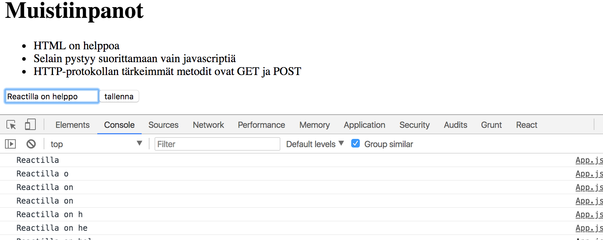
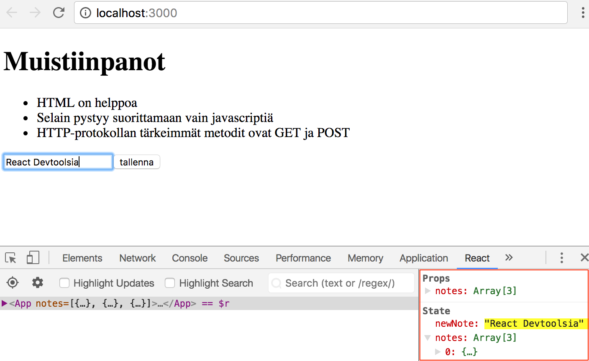
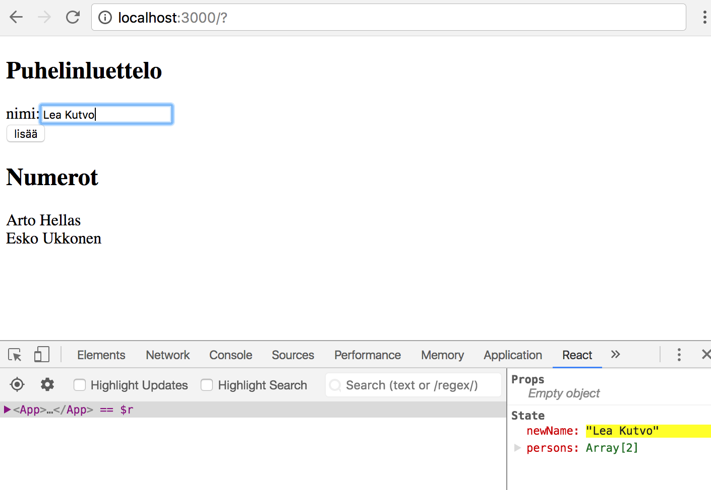
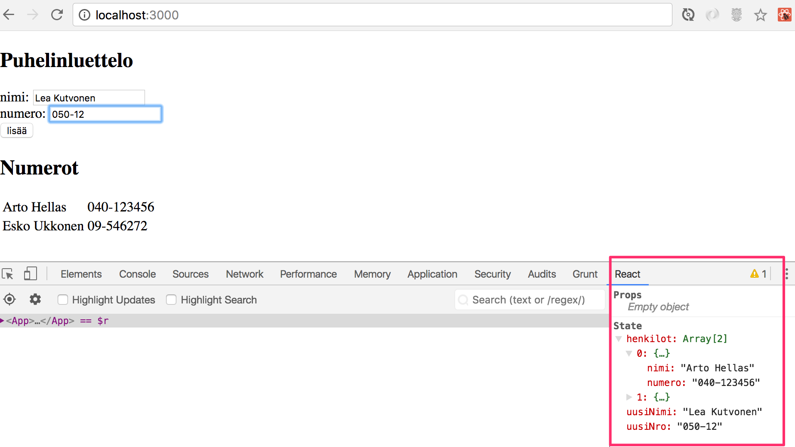
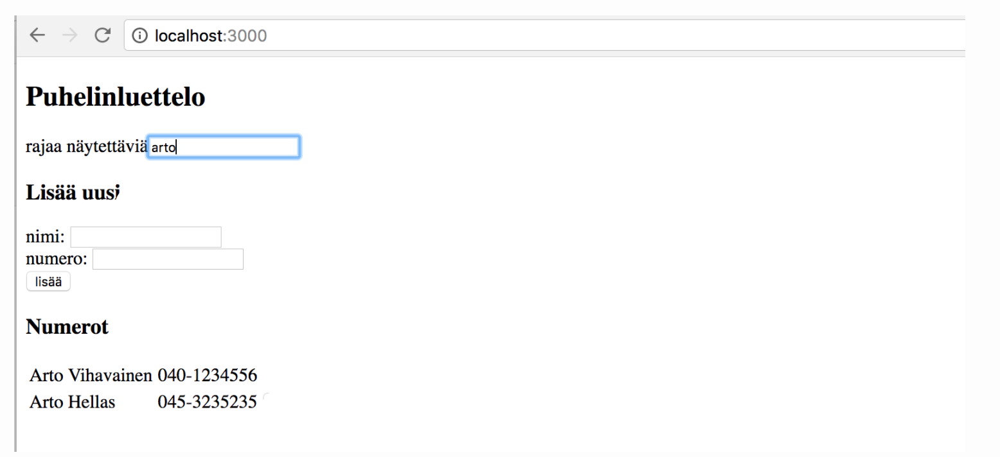

<div class="content">

## Lomakkeet

Jatketaan sovelluksen laajentamista siten, että se mahdollistaa uusien muistiinpanojen lisäämisen.

Jotta saisimme sivun päivittymään uusien muistiinpanojen lisäyksen yhteydessä, on parasta sijoittaa muistiinpanot komponentin _App_ tilaan. Funktionaalisilla komponenteilla ei ole tilaa, joten muutetaan _App_ luokkaan perustuvaksi komponentiksi:

```react
class App extends React.Component {
  constructor(props) {
    super(props)
    this.state = {
      notes: props.notes
    }
  }

  render() {
    return (
      <div>
        <h1>Muistiinpanot</h1>
        <ul>
          {this.state.notes.map(note => <Note key={note.id} note={note} />)}
        </ul>
      </div>
    )
  }
}
```

Konstruktori asettaa nyt propseina saatavan _notes_-taulukon tilaan avaimen _notes_ arvoksi:

```js
constructor(props) {
  super(props)
  this.state = {
    notes: props.notes
  }
}
```

tila siis näyttää komponentin alustuksen jälkeen seuraavalta:

```js
this.state = {
  notes: [
    {
      id: 1,
      content: 'HTML on helppoa',
      date: '2017-12-10T17:30:31.098Z',
      important: true,
    },
    //...
  ],
};
```

> **HUOM** komponenttien tilan alustaminen propseina välitettyjen arvojen perusteella ei välttämättä ole hyvä tapa, se on monien mukaan jopa [antipattern](https://vasanthk.gitbooks.io/react-bits/anti-patterns/01.props-in-initial-state.html). Jos kuitenkin tutkitaan vähän pintaa syvemmälle, kyseessä on ongelma lähinnä silloin [jos propsien arvo voi muuttua](https://medium.com/@justintulk/react-anti-patterns-props-in-initial-state-28687846cc2e). Näin ei ohjelmassamme ole, eli tilan alustaminen propsien perusteella on hyväksyttävää.

Lisätään sitten lomake uuden muistiinpanon lisäämistä varten:

```react
class App extends React.Component {
  constructor(props) {
    super(props)
    this.state = {
      notes: props.notes
    }
  }

  addNote = (event) => {
    event.preventDefault()
    console.log('nappia painettu')
  }

  render() {
    return (
      <div>
        <h1>Muistiinpanot</h1>
        <ul>
          {this.state.notes.map(note => <Note key={note.id} note={note} />)}
        </ul>
        <form onSubmit={this.addNote}>
          <input/>
          <button type="submit">tallenna</button>
        </form>
      </div>
    )
  }
}
```

Lomakkeelle on lisätty myös tapahtumankäsittelijäksi metodi _addNote_ reagoimaan sen "lähettämiseen", eli napin painamiseen.

Tapahtumankäsittelijä on [osasta 1](/osa1#tapahtumankäsittely) tuttuun tapaan määritelty seuraavasti:

```js
addNote = event => {
  event.preventDefault();
  console.log('nappia painettu');
  console.log(event.target);
};
```

Parametrin _event_ arvona on metodin kutsun aiheuttama [tapahtuma](https://reactjs.org/docs/handling-events.html).

Tapahtumankäsittelijä kutsuu heti tapahtuman metodia <code>event.preventDefault()</code> jolla se estää lomakkeen lähetyksen oletusarvoisen toiminnan, joka aiheuttaisi mm. sivun uudelleenlatautumisen.

Tapahtuman kohde, eli _event.target_ on tulostettu konsoliin


Kohteena on siis komponentin määrittelemä lomake.

Miten pääsemme käsiksi lomakkeen _input_-komponenttiin syötettyyn dataan?

Tapoja on useampia, tutustumme ensin ns. [kontrolloituina komponentteina](https://reactjs.org/docs/forms.html#controlled-components) toteutettuihin lomakkeisiin.

Lisätään komponentin _App_ tilaan kenttä _newNote_ lomakkeen syötettä varten:

```js
class App extends React.Component {
  constructor(props) {
    super(props);
    this.state = {
      notes: props.notes,
      newNote: 'uusi muistiinpano...',
    };
  }
  // ...
}
```

Määritellään tilaan lisätty kenttä _input_-komponentin attribuutin _value_ arvoksi:

```html
<form onSubmit="{this.addNote}">
  <input value="{this.state.newNote}" /> <button type="submit">tallenna</button>
</form>
```

Tilaan määritelty "placeholder"-teksti _uusi muistiinpano..._ ilmestyy syötekomponenttiin, tekstiä ei kuitenkaan voi muuttaa. Konsoliin tuleekin ikävä varoitus joka kertoo mistä on kyse


Koska määrittelimme syötekomponentille _value_-attribuutiksi komponentin _App_ tilassa olevan kentän, alkaa _App_ [kontrolloimaan](https://reactjs.org/docs/forms.html#controlled-components) syötekomponentin toimintaa.

Jotta kontrolloidun syötekomponentin editoiminen olisi mahdollista, täytyy sille rekisteröidä _tapahtumankäsittelijä_, joka synkronoi syötekenttään tehdyt muutokset komponentin _App_ tilaan:

```react
class App extends React.Component {
  // ...

  handleNoteChange = (event) => {
    console.log(event.target.value)
    this.setState({ newNote: event.target.value })
  }

  render() {
    return (
      <div>
        <h1>Muistiinpanot</h1>
        <ul>
          {this.state.notes.map(note => <Note key={note.id} note={note} />)}
        </ul>
        <form onSubmit={this.addNote}>
          <input
            value={this.state.newNote}
            onChange={this.handleNoteChange}
          />
          <button type="submit">tallenna</button>
        </form>
      </div>
    )
  }
}
```

Lomakkeen _input_-komponentille on nyt rekisteröity tapahtumankäsittelijä tilanteeseen _onChange_:

```html
<input value="{this.state.newNote}" onChange="{this.handleNoteChange}" />
```

Tapahtumankäsittelijää kutsutaan _aina kun syötekomponentissa tapahtuu jotain_. Tapahtumankäsittelijämetodi saa parametriksi tapahtumaolion _event_

```js
handleNoteChange = event => {
  console.log(event.target.value);
  this.setState({ newNote: event.target.value });
};
```

Tapahtumaolion kenttä _target_ vastaa nyt kontrolloitua _input_-kenttää ja _event.target.value_ viittaa inputin syötekentän arvoon.

Huomaa, että toisin kuin tapahtuman _onSubmit_ käsittelijässä, nyt oletusarvoisen toiminnan estävää metodikutusua _event.preventDefault()_ ei tarvita sillä syötekentän muutoksella ei ole oletusarvoista toimintaa toisin kuin lomakkeen lähettämisellä.

Voit seurata konsolista miten tapahtumankäsittelijää kutsutaan:



Muistithan jo asentaa [React devtoolsin](https://chrome.google.com/webstore/detail/react-developer-tools/fmkadmapgofadopljbjfkapdkoienihi)? Devtoolsista näet, miten tila muuttuu syötekenttään kirjoitettaessa:



Nyt komponentin _App_ tilan kenttä _newNote_ heijastaa koko ajan syötekentän arvoa, joten voimme viimeistellä uuden muistiinpanon lisäämisestä huolehtivan metodin _addNote_:

```js
addNote = event => {
  event.preventDefault();
  const noteObject = {
    content: this.state.newNote,
    date: new Date().toISOString(),
    important: Math.random() > 0.5,
    id: this.state.notes.length + 1,
  };

  const notes = this.state.notes.concat(noteObject);

  this.setState({
    notes: notes,
    newNote: '',
  });
};
```

Ensin luodaan uutta muistiinpanoa vastaava olio _noteObject_, jonka sisältökentän arvo saadaan komponentin tilasta _this.state.newNote_. Yksikäsitteinen tunnus eli _id_ generoidaan kaikkien muistiinpanojen lukumäärän perusteella. Koska muistiinpanoja ei poisteta, menetelmä toimii sovelluksessamme. Komennon <code>Math.random()</code> avulla muistiinpanosta tulee 50% todennäköisyydellä tärkeä.

Uusi muistiinpano lisätään vanhojen joukkoon oikeaoppisesti käyttämällä [osasta 1](/osa1#taulukon-käsittelyä) tuttua taulukon metodia [concat](https://developer.mozilla.org/en-US/docs/Web/JavaScript/Reference/Global_Objects/Array/concat):

```js
const notes = this.state.notes.concat(noteObject);
```

Metodi ei muuta alkuperäistä taulukkoa _this.state.notes_ vaan luo uuden taulukon, joka sisältää myös lisättävän alkion. Tämä on tärkeää, sillä Reactin tilaa [ei saa muuttaa suoraan](https://reactjs.org/docs/state-and-lifecycle.html#using-state-correctly)!

Lopussa komponentin tila päivitetään uusilla muistiinpanoilla ja tyhjentämällä syötekomponentin arvoa kontrolloiva kenttä:

```js
this.setState({
  notes: notes,
  newNote: '',
});
```

### Kehittyneempi tapa olioliteraalien kirjoittamiseen

Voimme muuttaa tilan päivittämän koodin

```js
this.setState({
  notes: notes,
  newNote: '',
});
```

muotoon

```js
this.setState({
  notes,
  newNote: '',
});
```

Tämä johtuu siitä, että ES6:n myötä (ks. kohta [property definitions](https://developer.mozilla.org/en-US/docs/Web/JavaScript/Reference/Operators/Object_initializer)) Javascriptiin on tullut uusi ominaisuus, joka mahdollistaa hieman tiiviimmän tavan muuttujien avulla tapahtuvaan olioiden määrittelyyn.

Tarkastellaan tilannetta, jossa meillä on muuttujissa arvoja

```js
const name = 'Leevi';
const age = 0;
```

ja haluamme määritellä näiden perusteella olion, jolla on kentät _name_ ja _age_.

Vanhassa Javascriptissä olio täytyi määritellä seuraavaan tyyliin

```js
const person = {
  name: name,
  age: age,
};
```

koska muuttujien ja luotavan olion kenttien nimi nyt on sama, riittää ES6:ssa kirjoittaa:

```js
const person = { name, age };
```

lopputulos molemmilla tavoilla luotuun olioon on täsmälleen sama.

Sovelluksen tämän hetkinen koodi on kokonaisuudessaan [githubissa](https://github.com/FullStack-HY/part2-notes/tree/part2-2), tagissa _part2-2_.

## Näytettävien elementtien filtteröinti

Tehdään sovellukseen toiminto, joka mahdollistaa ainoastaan tärkeiden muistiinpanojen näyttämisen.

Lisätään komponentin _App_ tilaan tieto siitä näytetäänkö muistiinpanoista kaikki vai ainoastaan tärkeät:

```react
class App extends React.Component {
  constructor(props) {
    super(props)
    this.state = {
      notes: props.notes ,
      newNote: '',
      showAll: true
    }
  }
  // ...
}
```

Muutetaan metodia _render_ siten, että se tallettaa muuttujaan _notesToShow_ näytettävien muistiinpanojen listan riippuen siitä tuleeko näyttää kaikki vai vain tärkeät:

```react
render() {
  const notesToShow =
    this.state.showAll ?
      this.state.notes :
      this.state.notes.filter(note => note.important === true)

  return (
    <div>
      <h1>Muistiinpanot</h1>
      <ul>
        {notesToShow.map(note => <Note key={note.id} note={note} />)}
      </ul>
      <form onSubmit={this.addNote}>
        <input
          value={this.state.newNote}
          onChange={this.handleNoteChange}
        />
        <button type="submit">tallenna</button>
      </form>
    </div>
  )
}
```

Muuttujan _notesToShow_ määrittely on melko kompakti

```js
const notesToShow = this.state.showAll
  ? this.state.notes
  : this.state.notes.filter(note => note.important === true);
```

Käytössä on monissa muissakin kielissä oleva [ehdollinen](https://developer.mozilla.org/en-US/docs/Web/JavaScript/Reference/Operators/Conditional_Operator) operaatio.

Operaatio toimii seuraavasti. Jos meillä on esim:

```js
const tulos = ehto ? val1 : val2;
```

muuttujan _tulos_ arvoksi asetetaan _val1_:n arvo jos _ehto_ on tosi. Jos _ehto_ ei ole tosi, muuttujan _tulos_ arvoksi tulee _val2_:n arvo.

Jos ehto _this.state.showAll_ on epätosi, muuttuja _notesToShow_ saa arvokseen vaan ne muistiinpanot, joiden _important_-kentän arvo on tosi. Filtteröinti tapahtuu taulukon metodilla [filter](https://developer.mozilla.org/en-US/docs/Web/JavaScript/Reference/Global_Objects/Array/filter):

```js
this.state.notes.filter(note => note.important === true);
```

vertailu-operaatio on oikeastaan turha koska _note.important_ on arvoltaan joko _true_ tai _false_, eli riittää kirjoittaa

```js
this.state.notes.filter(note => note.important);
```

Tässä käytettiin kuitenkin ensin vertailuoperaattoria, mm. korostamaan erästä tärkeää seikkaa: Javascriptissa <code>arvo1 == arvo2</code> ei toimi kaikissa tilanteissa loogisesti ja onkin varmempi käyttää aina vertailuissa muotoa <code>arvo1 === arvo2</code>. Enemmän aiheesta [täällä](https://developer.mozilla.org/en-US/docs/Web/JavaScript/Equality_comparisons_and_sameness).

Filtteröinnin toimivuutta voi jo nyt kokeilla vaihtelemalla sitä, miten tilan kentän _showAll_ alkuarvo määritelään konstruktorissa.

Lisätään sitten toiminnallisuus, mikä mahdollistaa _showAll_:in tilan muuttamisen sovelluksesta.

Oleelliset muutokset ovat seuraavassa:

```react
class App extends React.Component {
  // ...

  toggleVisible = () => {
    this.setState({showAll: !this.state.showAll})
  }

  render() {
    const notesToShow =
      this.state.showAll ?
        this.state.notes :
        this.state.notes.filter(note => note.important === true)

    const label = this.state.showAll ? 'vain tärkeät' : 'kaikki'

    return (
      <div>
        <h1>Muistiinpanot</h1>

        <div>
          <button onClick={this.toggleVisible}>
            näytä {label}
          </button>
        </div>

        <ul>
          {notesToShow.map(note => <Note key={note.id} note={note} />)}
        </ul>
        <form onSubmit={this.addNote}>
          <input
            value={this.state.newNote}
            onChange={this.handleNoteChange}
          />
          <button type="submit">tallenna</button>
        </form>
      </div>
    )
  }
}
```

Näkyviä muistiinpanoja (kaikki vai ainoastaan tärkeät) siis kontrolloidaan napin avulla. Napin tapahtumankäsittelijä on yksinkertainen, se muuttaa _this.state.showAll_:n arvon truesta falseksi ja päinvastoin:

```js
toggleVisible = () => {
  this.setState({ showAll: !this.state.showAll });
};
```

Napin teksti määritellään muuttujaan, jonka arvo määräytyy tilan perusteella:

```js
const label = this.state.showAll ? 'vain tärkeät' : 'kaikki';
```

Sovelluksen tämän hetkinen koodi on kokonaisuudessaan [githubissa](https://github.com/FullStack-HY/part2-notes/tree/part2-3), tagissa _part2-3_.

</div>

<div class="tasks">

<h3>Tehtävät 2.6</h3>
<h4>puhelinluettelo osa 1</h4>

Toteutetaan yksinkertainen puhelinluettelo. **Aluksi luetteloon lisätään vaan nimiä.**

Voit ottaa sovelluksesi pohjaksi seuraavan:

```react
import React from 'react';

class App extends React.Component {
  constructor(props) {
    super(props)
    this.state = {
      persons: [
        { name: 'Arto Hellas' }
      ],
      newName: ''
    }
  }

  render() {
    return (
      <div>
        <h2>Puhelinluettelo</h2>
        <form>
          <div>
            nimi: <input />
          </div>
          <div>
            <button type="submit">lisää</button>
          </div>
        </form>
        <h2>Numerot</h2>
        ...
      </div>
    )
  }
}

export default App
```

Tilassa oleva kenttä _newName_ on tarkoitettu lomakkeen kentän kontrollointiin.

Joskus tilan muuttujia ja tarvittaessa muitakin voi olla hyödyllistä renderöidä debugatessa komponenttiin, eli voi tilapäisesti lisätä komponentin metodin _render_ palauttamaan koodiin esim. seuraavan:

```html
<div>debug: {this.state.newName}</div>
```

Muista myös osan 1 luku [React-sovellusten debuggaus](#react-sovellusten-debuggaus), erityisesti [react developer tools](https://chrome.google.com/webstore/detail/react-developer-tools/fmkadmapgofadopljbjfkapdkoienihi) on välillä todella kätevä komponentin tilan muutosten seuraamisessa.

Sovellus voi näyttää tässä vaiheessa seuraavalta:



Huomaa, React developer toolsin käyttö!

**Huom:**

- voit käyttää kentän _key_ arvona henkilön nimeä
- muista estää lomakkeen lähetyksen oletusarvoinen toiminta!

<h3>Tehtävät 2.7</h3>
<h4>puhelinluettelo osa 2</h4>

Jos lisättävä nimi on jo sovelluksen tiedossa, estä lisäys. Taulukolla on lukuisia sopivia [metodeja](https://developer.mozilla.org/en-US/docs/Web/JavaScript/Reference/Global_Objects/Array) tehtävän tekemiseen.

Voit antaa halutessasi virheilmoituksen esim. komennolla _alert()_. Se ei kuitenkaan ole tarpeen.

<h3>Tehtävät 2.8</h3>
<h4>puhlelinluettelo osa 3</h4>

Lisää sovellukseen mahdollisuus antaa henkilöille puhelinnumero. Tarvitset siis lomakkeeseen myös toisen _input_-elementin (ja sille oman muutoksenkäsittelijän):

```html
<form>
  <div>nimi: <input /></div>
  <div>numero: <input /></div>
  <div><button type="submit">lisää</button></div>
</form>
```

Sovellus voi näyttää tässä vaiheessa seuraavalta. Kuvassa myös [react developer tools](https://chrome.google.com/webstore/detail/react-developer-tools/fmkadmapgofadopljbjfkapdkoienihi):in tarjoama näkymä komponentin _App_ tilaan:



<h3>Tehtävät 2.9*</h3>
<h4>puhelinluettelo osa 4</h4>

Tee lomakkeeseen hakukenttä, jonka avulla näytettävien nimien listaa voidaan rajata:



Rajausehdon syöttämisen voi hoitaa omana lomakkeeseen kuulumattomana _input_-elementtinä. Kuvassa rajausehdosta on tehty _caseinsensitiivinen_ eli ehto _arto_ löytää isolla kirjaimella kirjoitetun Arton.

**Huom:** Kun toteutat jotain uutta toiminnallisuutta, on usein hyötyä 'kovakoodata' sovellukseen jotain sisältöä, esim.

```js
constructor(props) {
  super(props)
  this.state = {
    persons: [
      { name: 'Arto Hellas', number: '040-123456' },
      { name: 'Martti Tienari', number: '040-123456' },
      { name: 'Arto Järvinen', number: '040-123456' },
      { name: 'Lea Kutvonen', number: '040-123456' }
    ],
    newName: '',
    newNumber: '',
    filter: ''
  }
}
```

Näin vältytään turhalta manuaaliselta työltä, missä testaaminen edellyttäisi myös testiaineiston syöttämistä käsin soveluksen lomakkeen kautta.

Kurssin seuraavasta osasta alkaen alamme määrittelemään sovelluksemme _testejä_ jotka tietyissä tapauksissa hoitavat kovakoodatun apusyötteen roolia.

<h3>Tehtävät 2.10</h3>
<h4>puhelinluettelo osa 5</h4>

Jos koko sovelluksesi on tehty yhteen komponenttiin, refaktoroi sitä eriyttämällä sopivia komponentteja. Pidä kuitenkin edelleen kaikki tila juurikomponentissa.

Riittää että erotat sovelluksesta kaksi komponenttia. Hyviä kandidaatteja ovat esim. filtteröintilomake, yksittäisten henkilön tietojen esittäminen ja uuden henkilön lisäävä lomake.

</div>
