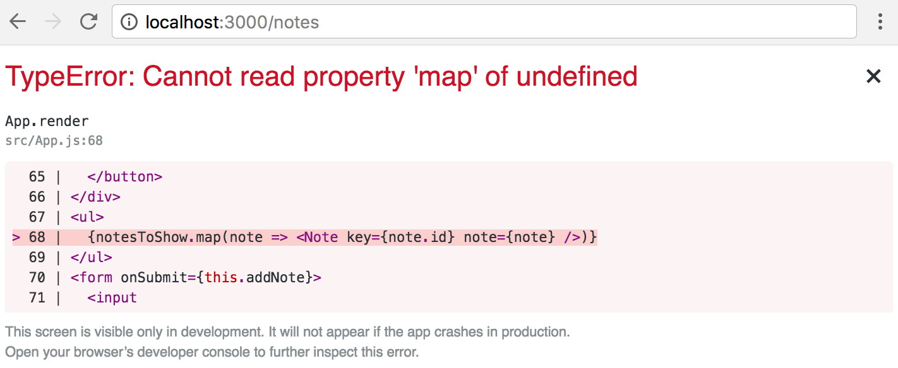

<div class="content">

## Lomakkeet

Jatketaan sovelluksen laajentamista siten, että se mahdollistaa uusien muistiinpanojen lisäämisen.

Jotta saisimme sivun päivittymään uusien muistiinpanojen lisäyksen yhteydessä, on parasta sijoittaa muistiinpanot komponentin <code>App</code> tilaan. Eli importataan funktio [useState](https://reactjs.org/docs/hooks-state.html) ja määritellään sen avulla komponentille tila joka saa aluksi arvokseen propsina välitettävän muistiinpanot alustavan taulukon: 

```js
import React, { useState } from 'react' // highlight-line
import Note from './components/Note'

const App = (props) => { // highlight-line
  const [notes, setNotes] = useState(props.notes) // highlight-line

  const rows = () => notes.map(note =>
    <Note
      key={note.id}
      note={note}
    />
  )

  return (
    <div>
      <h1>Muistiinpanot</h1>
      <ul>
        {rows()}
      </ul>
    </div>
  )
}

export default App
```

Komponentti siis alustaa funktion <code>useState</code> avulla tilan  <code>notes</code> arvoksi propseina välitettävän alustavan muistiinpanojen listan:

```js
const App = (props) => { 
  const [notes, setNotes] = useState(props.notes) 

  // ...
}
```

Jos haluaisimme lähteä liikkeelle tyhjästä muistiinpanojen listasta, annettaisiin tilan alkuarvoksi tyhjä taulukko, ja koska komponentti ei käyttäisi ollenkaan propseja, voitaisiin parametri <code>props</code> jättää kokonaan määrittelemättä:

```js
const App = () => { 
  const [notes, setNotes] = useState([]) 

  // ...
}  
```

Jätetään kuitenkin toistaiseksi tilalle alkuarvon asettava määrittely voimaan.

Lisätään seuraavaksi komponenttiin lomake eli HTML [form](https://developer.mozilla.org/en-US/docs/Learn/HTML/Forms) uuden muistiinpanon lisäämistä varten:

```js
const App = (props) => {
  const [notes, setNotes] = useState(props.notes) 

  const rows = () => // ...

// highlight-start 
  const addNote = (event) => {
    event.preventDefault()
    console.log('nappia painettu', event.target)
  }
 // highlight-end  

  return (
    <div>
      <h1>Muistiinpanot</h1>
      <ul>
        {rows()}
      </ul>
// highlight-start    
      <form onSubmit={addNote}>
        <input />
        <button type="submit">tallenna</button>
      </form>   
// highlight-end       
    </div>
  )
}
```

Lomakkeelle on lisätty myös tapahtumankäsittelijäksi metodi _funktio_ reagoimaan sen "lähettämiseen", eli napin painamiseen.

Tapahtumankäsittelijä on [osasta 1](/osa1#tapahtumankäsittely) tuttuun tapaan määritelty seuraavasti:

```js
const addNote = (event) => {
  event.preventDefault()
  console.log('nappia painettu', event.target)
}
```

Parametrin <code>event</code> arvona on metodin kutsun aiheuttama [tapahtuma](https://reactjs.org/docs/handling-events.html).

Tapahtumankäsittelijä kutsuu heti tapahtuman metodia <code>event.preventDefault()</code> jolla se estää lomakkeen lähetyksen oletusarvoisen toiminnan, joka aiheuttaisi mm. sivun uudelleenlatautumisen.

Tapahtuman kohde, eli _event.target_ on tulostettu konsoliin


Kohteena on siis komponentin määrittelemä lomake.

Miten pääsemme käsiksi lomakkeen <code>input</code>-komponenttiin syötettyyn dataan?

Tapoja on useampia, tutustumme ensin ns. [kontrolloituina komponentteina](https://reactjs.org/docs/forms.html#controlled-components) toteutettuihin lomakkeisiin.

Lisätään komonentille <code>App</code>tila <code>newNote</code> lomakkeen syötettä varten **ja** määritellään se <code>input</code>-komponentin attribuutin <code>value</code> arvoksi:

```js
const App = (props) => {
  const [notes, setNotes] = useState(props.notes) 
  const [newNote, setNewNote] = useState('uusi muistiinpano...') // highlight-line

  // ...

  return (
    <div>
      <h1>Muistiinpanot</h1>
      <ul>
        {rows()}
      </ul>
      <form onSubmit={addNote}>
        <input value={newNote} /> // highlight-line
        <button type="submit">tallenna</button>
      </form>      
    </div>
  )
}
```

Tilaan <code>newNote</code> määritelty "placeholder"-teksti _uusi muistiinpano..._ ilmestyy syötekomponenttiin, tekstiä ei kuitenkaan voi muuttaa. Konsoliin tuleekin ikävä varoitus joka kertoo mistä on kyse


Koska määrittelimme syötekomponentille <code>value</code>-attribuutiksi komponentin <code>App</code> tilassa olevan muuttujan, alkaa <code>App</code> [kontrolloimaan](https://reactjs.org/docs/forms.html#controlled-components) syötekomponentin toimintaa.

Jotta kontrolloidun syötekomponentin editoiminen olisi mahdollista, täytyy sille rekisteröidä _tapahtumankäsittelijä_, joka synkronoi syötekenttään tehdyt muutokset komponentin <code>App</code> tilaan:

```js
const App = (props) => {
  const [notes, setNotes] = useState(props.notes) 
  const [newNote, setNewNote] = useState('uusi muistiinpano...')

  // ...
// highlight-start
  const handleNoteChange = (event) => {
    console.log(event.target.value)
    setNewNote(event.target.value)
  }
// highlight-end

  return (
    <div>
      <h1>Muistiinpanot</h1>
      <ul>
        {rows()}
      </ul>
      <form onSubmit={addNote}>
        <input
          value={newNote}
          onChange={handleNoteChange} // highlight-line
        />
        <button type="submit">tallenna</button>
      </form>      
    </div>
  )
}
```

Lomakkeen <code>input</code>-komponentille on nyt rekisteröity tapahtumankäsittelijä tilanteeseen _onChange_:

```js
<input
  value={newNote}
  onChange={handleNoteChange}
/>
```

Tapahtumankäsittelijää kutsutaan _aina kun syötekomponentissa tapahtuu jotain_. Tapahtumankäsittelijämetodi saa parametriksi tapahtumaolion <code>event</code>

```js
const handleNoteChange = (event) => {
  console.log(event.target.value)
  setNewNote(event.target.value)
}
```

Tapahtumaolion kenttä <code>target</code> vastaa nyt kontrolloitua <code>input</code>-kenttää ja <code>event.target.value</code> viittaa inputin syötekentän arvoon.

Huomaa, että toisin kuin tapahtuman _onSubmit_ käsittelijässä, nyt oletusarvoisen toiminnan estävää metodikutusua _event.preventDefault()_ ei tarvita, sillä syötekentän muutoksella ei ole oletusarvoista toimintaa toisin kuin lomakkeen lähettämisellä.

Voit seurata konsolista miten tapahtumankäsittelijää kutsutaan:


Muistithan jo asentaa [React devtoolsin](https://chrome.google.com/webstore/detail/react-developer-tools/fmkadmapgofadopljbjfkapdkoienihi)? Devtoolsista näet, miten tila muuttuu syötekenttään kirjoitettaessa:


Nyt komponentin <code>App</code> tilan <code>newNote</code> heijastaa koko ajan syötekentän arvoa, joten voimme viimeistellä uuden muistiinpanon lisäämisestä huolehtivan metodin <code>addNote</code>:

```js
const addNote = (event) => {
  event.preventDefault()
  const noteObject = {
    content: newNote,
    date: new Date().toISOString(),
    important: Math.random() > 0.5,
    id: notes.length + 1,
  }

  setNotes(notes.concat(noteObject))
  setNewNote('')
}
```

Ensin luodaan uutta muistiinpanoa vastaava olio <code>noteObject</code>, jonka sisältökentän arvo saadaan komponentin tilasta <code>newNote</code>. Yksikäsitteinen tunnus eli </ode>id</code> generoidaan kaikkien muistiinpanojen lukumäärän perusteella. Koska muistiinpanoja ei poisteta, menetelmä toimii sovelluksessamme. Komennon <code>Math.random()</code> avulla muistiinpanosta tulee 50% todennäköisyydellä tärkeä.

Uusi muistiinpano lisätään vanhojen joukkoon oikeaoppisesti käyttämällä [osasta 1](/osa1#taulukon-käsittelyä) tuttua taulukon metodia [concat](https://developer.mozilla.org/en-US/docs/Web/JavaScript/Reference/Global_Objects/Array/concat):

```js
setNotes(notes.concat(noteObject))
```

Metodi ei muuta alkuperäistä tilaa <code>notes</code> vaan luo uuden taulukon, joka sisältää myös lisättävän alkion. Tämä on tärkeää, sillä Reactin tilaa [ei saa muuttaa suoraan](https://reactjs.org/docs/state-and-lifecycle.html#using-state-correctly)!

Tapahtumankäsittelijä tyhjentää myös syötekenttää kontrolloiva tila <code>newNote</code> sen tilaa muuttavalla funktiolla <code>setNewNote</code>

```js
setNewNote('')
```

Sovelluksen tämän hetkinen koodi on kokonaisuudessaan [githubissa](https://github.com/fullstack-hy2019/part2-notes/tree/part2-2), branchissä _part2-2_.

## Näytettävien elementtien filtteröinti

Tehdään sovellukseen toiminto, joka mahdollistaa ainoastaan tärkeiden muistiinpanojen näyttämisen.

Lisätään komponentin <code>App</code> tilaan tieto siitä näytetäänkö muistiinpanoista kaikki vai ainoastaan tärkeät:

```js
const App = (props) => {
  const [notes, setNotes] = useState(props.notes) 
  const [newNote, setNewNote] = useState('')
  const [showAll, setShowAll] = useState(true) // highlight-line
  
  // ...
}
```

Muutetaan komponenttia siten, että se tallettaa muuttujaan <code>notesToShow</code> näytettävien muistiinpanojen listan riippuen siitä tuleeko näyttää kaikki vai vain tärkeät:

```js
const App = (props) => {
  // ..

// highlight-start
  const notesToShow = showAll
    ? notes
    : notes.filter(note => note.important === true)
// highlight-end

  const rows = () => notesToShow.map(note => // highlight-line
    <Note
      key={note.id}
      note={note}
    />
  )

  // ...
}  
```

Muuttujan <code>notesToShow</code> määrittely on melko kompakti

```js
const notesToShow = showAll
  ? notes
  : notes.filter(note => note.important === true)
```

Käytössä on monissa muissakin kielissä oleva [ehdollinen](https://developer.mozilla.org/en-US/docs/Web/JavaScript/Reference/Operators/Conditional_Operator) operaatio.

Operaatio toimii seuraavasti. Jos meillä on esim:

```js
const tulos = ehto ? val1 : val2
```

muuttujan <code>tulos</code> arvoksi asetetaan <codeval1></code>:n arvo jos <code>tulos</code> on tosi. Jos <code>ehto</code> ei ole tosi, muuttujan <code>tulos</code> arvoksi tulee <code>val2</code>:n arvo.

Eli jos tilan arvo <code>showAll</code> on epätosi, muuttuja <code>notesToShow</code> saa arvokseen vaan ne muistiinpanot, joiden <code>important</code>-kentän arvo on tosi. Filtteröinti tapahtuu taulukon metodilla [filter](https://developer.mozilla.org/en-US/docs/Web/JavaScript/Reference/Global_Objects/Array/filter):

```js
notes.filter(note => note.important === true)
```

vertailu-operaatio on oikeastaan turha koska <code>note.important</code> on arvoltaan joko <code>true</code> tai <code>false</code>, eli riittää kirjoittaa

```js
notes.filter(note => note.important)
```

Tässä käytettiin kuitenkin ensin vertailuoperaattoria, mm. korostamaan erästä tärkeää seikkaa: Javascriptissa <code>arvo1 == arvo2</code> ei toimi kaikissa tilanteissa loogisesti ja onkin varmempi käyttää aina vertailuissa muotoa <code>arvo1 === arvo2</code>. Enemmän aiheesta [täällä](https://developer.mozilla.org/en-US/docs/Web/JavaScript/Equality_comparisons_and_sameness).

Filtteröinnin toimivuutta voi jo nyt kokeilla vaihtelemalla sitä, miten tilan kentän <code>showAll</code> alkuarvo määritelään konstruktorissa.

Lisätään sitten toiminnallisuus, mikä mahdollistaa <code>showAll</code>:in tilan muuttamisen sovelluksesta.

Oleelliset muutokset ovat seuraavassa:

```js
import React, { useState } from 'react' 
import Note from './components/Note'

const App = (props) => {
  const [notes, setNotes] = useState(props.notes) 
  const [newNote, setNewNote] = useState('')
  const [showAll, setShowAll] = useState(true)

  // ...

  return (
    <div>
      <h1>Muistiinpanot</h1>
// highlight-start      
      <div>
        <button onClick={() => setShowAll(!showAll)}>
          näytä {showAll ? 'vain tärkeät' : 'kaikki' }
        </button>
      </div>
// highlight-end            
      <ul>
        {rows()}
      </ul>
      <form onSubmit={addNote}>
        <input
          value={newNote}
          onChange={handleNoteChange}
        />
        <button type="submit">tallenna</button>
      </form>      
    </div>
  )
}
```

Näkyviä muistiinpanoja (kaikki vai ainoastaan tärkeät) siis kontrolloidaan napin avulla. Napin tapahtumankäsittelijä on niin yksinkertainen että se on kirjotettu suoraan napin attribuutiksi. Tapahtumankäsittelijä muuttaa _showAll_:n arvon truesta falseksi ja päinvastoin:

```js
() => setShowAll(!showAll)
```

Napin teksti riippuu tilan <code>showAll</code> arvosta:

```js
näytä {showAll ? 'vain tärkeät' : 'kaikki'}
```

Sovelluksen tämän hetkinen koodi on kokonaisuudessaan [githubissa](https://github.com/FullStack-HY/part2-notes/tree/part2-3), tagissa _part2-3_.

</div>

<div class="tasks">

<h3>Tehtäviä</h3>

<i>Seuraavassa tehtävässä aloitettavaa ohjelmaa kehitellään eteenpäin muutamassa seuraavassa tehtävässä. Tässä ja kurssin aikana muissakin vastaantulevissa tehtäväsarjoissa ohjelman lopullisen version palauttaminen riittää, voit toki halutessasi tehdä commitin jokaisen tehtävän jälkeisestä tilanteesta, mutta se ei ole välttämätöntä.</i>

Muista, että saadaksesi komponentin tilan luotua joudut asentamaan Reactin version _0.16.7.0-alpha.2_ antamalla seuraavan komennon projektin hakemistossa

```js
npm install -s react@16.7.0-alpha.2 react-dom@16.7.0-alpha.2
```

<h4>2.6: puhelinluettelo osa 1</h4>

Toteutetaan yksinkertainen puhelinluettelo. **Aluksi luetteloon lisätään vaan nimiä.**

Voit ottaa sovelluksesi komponentin <code>App</code> pohjaksi seuraavan:

```js
import React, { useState } from 'react'

const App = () => {
  const [ persons, setPersons] = useState([ { name: 'Arto Hellas' }]) 
  const [ newName, setNewName ] = useState('')

  return (
    <div>
      <h2>Puhelinluettelo</h2>
      <form>
        <div>
          nimi: <input />
        </div>
        <div>
          <button type="submit">lisää</button>
        </div>
      </form>
      <h2>Numerot</h2>
      ...
    </div>
  )

}

export default App
```

Tila <code>newName</code> on tarkoitettu lomakkeen kentän kontrollointiin.

Joskus tilaa tallettavia ja tarvittaessa muitakin muuttujia voi olla hyödyllistä renderöidä debugatessa komponenttiin, eli voi tilapäisesti lisätä komponentin  palauttamaan koodiin esim. seuraavan:

```
<div>debug: {newName}</div>
```

Muista myös osan 1 luku [React-sovellusten debuggaus](#react-sovellusten-debuggaus), erityisesti [react developer tools](https://chrome.google.com/webstore/detail/react-developer-tools/fmkadmapgofadopljbjfkapdkoienihi) on välillä todella kätevä komponentin tilan muutosten seuraamisessa.

Sovellus voi näyttää tässä vaiheessa seuraavalta:



Huomaa, React developer toolsin käyttö!

**Huom:**

- voit käyttää kentän <code>key</code> arvona henkilön nimeä
- muista estää lomakkeen lähetyksen oletusarvoinen toiminta!

<h4>2.7: puhelinluettelo osa 2</h4>

Jos lisättävä nimi on jo sovelluksen tiedossa, estä lisäys. Taulukolla on lukuisia sopivia [metodeja](https://developer.mozilla.org/en-US/docs/Web/JavaScript/Reference/Global_Objects/Array) tehtävän tekemiseen.

Anna tilanteessa virheilmoitus komennolla [alert](https://developer.mozilla.org/en-US/docs/Web/API/Window/alert):


**Muistutus edellisestä osasta:** kun muodostat Javascriptissä merkkijonoja muuttujaan perustuen, on tyylikkäin tapa asian hoitamiseen [template string](https://developer.mozilla.org/en-US/docs/Web/JavaScript/Reference/Template_literals):

```js
`${newName} on jo luettelossa`
```

Jos muuttujalla <code>newName</code> on arvona <i>arto</i>, on tuloksena merkkijono

```js
`arto on jo luettelossa`
```

Sama toki hoituisi javamaisesti merkkijonojen plus-metodilla

```js
newName + ' on jo luettelossa'
```

Template stringin käyttö antaa kuitenkin professionaalimman vaikutelman.

<h4>2.8: puhlelinluettelo osa 3</h4>

Lisää sovellukseen mahdollisuus antaa henkilöille puhelinnumero. Tarvitset siis lomakkeeseen myös toisen <code>input</code>-elementin (ja sille oman muutoksenkäsittelijän):

```
<form>
  <div>nimi: <input /></div>
  <div>numero: <input /></div>
  <div><button type="submit">lisää</button></div>
</form>
```

Sovellus voi näyttää tässä vaiheessa seuraavalta. Kuvassa myös [react developer tools](https://chrome.google.com/webstore/detail/react-developer-tools/fmkadmapgofadopljbjfkapdkoienihi):in tarjoama näkymä komponentin <code>App</code> tilaan:


<h4>2.9*: puhelinluettelo osa 4</h4>

Tee lomakkeeseen hakukenttä, jonka avulla näytettävien nimien listaa voidaan rajata:


Rajausehdon syöttämisen voi hoitaa omana lomakkeeseen kuulumattomana <code>input</code>-elementtinä. Kuvassa rajausehdosta on tehty _caseinsensitiivinen_ eli ehto _arto_ löytää isolla kirjaimella kirjoitetun Arton.

**Huom:** Kun toteutat jotain uutta toiminnallisuutta, on usein hyötyä 'kovakoodata' sovellukseen jotain sisältöä, esim.

```js
const App = () => {
  const [persons, setPersons] = useState([
    { name: 'Arto Hellas', number: '040-123456' },
    { name: 'Martti Tienari', number: '040-123456' },
    { name: 'Arto Järvinen', number: '040-123456' },
    { name: 'Lea Kutvonen', number: '040-123456' }
  ])

  // ...
}
```

Näin vältytään turhalta manuaaliselta työltä, missä testaaminen edellyttäisi myös testiaineiston syöttämistä käsin soveluksen lomakkeen kautta.

<h4>2.10: puhelinluettelo osa 5</h4>

Jos koko sovelluksesi on tehty yhteen komponenttiin, refaktoroi sitä eriyttämällä sopivia komponentteja. Pidä kuitenkin edelleen kaikki tila sekä tapahtumankäsittelijäfunktiot juurikomponentissa <code>App</code>.

Riittää että erotat sovelluksesta **kolme** komponenttia. Hyviä kandidaatteja ovat esim. filtteröintilomake, uuden henkilön lisäävä lomake, kaikki henkilöt renderöivä komponentti sekä yksittäisen henkilön renderöivä komponentti.

Sovelluksen juurikomponentti voi näyttää refaktoroinnin jälkeen suunilleen seuraavalta, eli se ei itse renderöi suoraan oikeastaan mitään muita kuin otsikkoja:

```js
const App = () => {
  // ...

  return (
    <div>
      <h2>Puhelinluettelo</h2>

      <Filter ... />

      <h3>lisää uusi</h3>

      <PersonForm 
        ...
      />

      <h3>Numerot</h3>

      <Persons ... />
    </div>
  )
}
```

</div>
