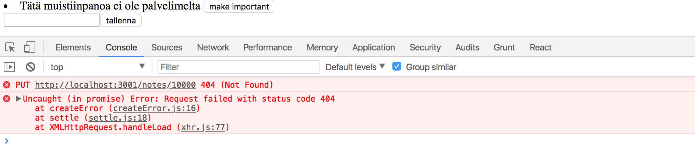
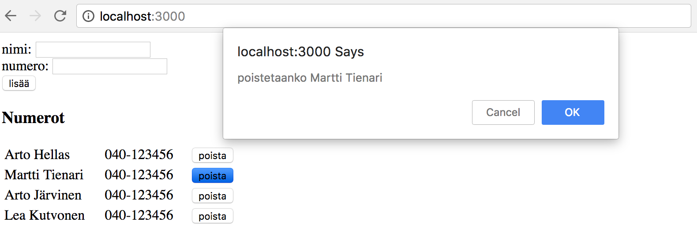

<div class="content">

Kun sovelluksella luodaan uusia muistiinpanoja, täytyy ne luonnollisesti tallentaa palvelimelle. [json-server](https://github.com/typicode/json-server) mainitsee dokumentaatiossaan olevansa ns. REST- tai RESTful-API

> Get a full fake REST API with zero coding in less than 30 seconds (seriously)

Ihan alkuperäisen [määritelmän](https://en.wikipedia.org/wiki/Representational_state_transfer) mukainen RESTful API json-server ei ole, mutta ei ole kovin moni muukaan itseään REST:iksi kutsuva rajapinta.

Tutustumme REST:iin tarkemmin kurssin [seuraavassa osassa](/osa3), mutta jo nyt on tärkeä ymmärtää minkälaista [konventiota](https://en.wikipedia.org/wiki/Representational_state_transfer#Applied_to_Web_services) json-server ja yleisemminkin REST API:t käyttävät [reittien](https://github.com/typicode/json-server#routes), eli URL:ien ja käytettävien HTTP-pyyntöjen tyyppien suhteen.

## REST

REST:issä yksittäisiä asioita esim. meidän tapauksessamme muistiinpanoja kutsutaan <i>resursseiksi</i>. Jokaisella resurssilla on yksilöivä osoite eli URL. json-serverin noudattaman yleisen konvention mukaan yksittäistä muistiinpanoa kuvaavan resurssin URL on muotoa _notes/3_, missä 3 on resurssin tunniste. Osoite _notes_ taas vastaa kaikkien yksittäisten muistiinpanojen kokoelmaa.

Resursseja haetaan palvelimelta HTTP GET -pyynnöillä. Esim. HTTP GET osoitteeseen _notes/3_ palauttaa muistiinpanon, jonka id-kentän arvo on 3. Kun taas HTTP GET -pyyntö osoitteeseen _notes_ palauttaa kaikki muistiinpanot.

Uuden muistiinpanoa vastaavan resurssin luominen tapahtuu json-serverin noudattamassa REST-konventiossa tekemällä HTTP POST -pyyntö, joka kohdistuu myös samaan osoitteeseen _notes_. Pyynnön mukana sen runkona eli <i>bodynä</i> lähetetään luotavan muistiinpanon tiedot.

json-server vaatii, että tiedot lähetetään JSON-muodossa, eli käytännössä sopivasti muotoiltuna merkkijonona ja asettamalla headerille _Content-Type_ arvo _application/json_.

## Datan lähetys palvelimelle

Muutetaan nyt uuden muistiinpanon lisäämisestä huolehtivaa tapahtumankäsittelijää seuraavasti:

```js
addNote = event => {
  event.preventDefault();
  const noteObject = {
    content: this.state.newNote,
    date: new Date(),
    important: Math.random() > 0.5,
  }

// highlight-start
  axios.post('http://localhost:3001/notes', noteObject).then(response => {
    console.log(response);
  })
// highlight-end
}
```

eli luodaan muistiinpanoa vastaava olio, ei kuitenkaan lisätä sille kenttää _id_, sillä on parempi jättää id:n generointi palvelimen vastuulle!

Olio lähetetään palvelimelle käyttämällä axiosin metodia <code>post</code>. Rekisteröity tapahtumankäsittelijä tulostaa konsoliin palvelimen vastauksen.

Kun nyt kokeillaan luoda uusi muistiinpano, konsoliin tulostus näyttää seuraavalta:


Uusi muistiinpano on siis _response_-olion kentän _data_ arvona. Palvelin on lisännyt muistiinpanolle tunnisteen, eli _id_-kentän.

Joskus on hyödyllistä tarkastella HTTP-pyyntöjä [osan 0 alussa](/osa0#http-get) paljon käytetyn konsolin <i>Network</i>-välilehden kautta:


Voimme esim. tarkastaa onko POST-pyynnön mukana menevä data juuri se mitä oletimme, onko headerit asetettu oikein ym.

Koska POST-pyynnössä lähettämämme data oli Javascript-olio, osasi axios automaattisesti asettaa pyynnön _content-type_ headerille oikean arvon eli _application/json_.

Uusi muistiinpano ei vielä renderöidy ruudulle, sillä emme aseta komponentille _App_ uutta tilaa muistiinpanon luomisen yhteydessä. Viimeistellään sovellus vielä tältä osin:

```js
addNote = event => {
  event.preventDefault();
  const noteObject = {
    content: this.state.newNote,
    date: new Date(),
    important: Math.random() > 0.5,
  }

  axios.post('http://localhost:3001/notes', noteObject).then(response => {
    // highlight-start
    setNotes(notes.concat(response.data))
    setNewNote('')
    // highlight-end
  })
}
```

Palvelimen palauttama uusi muistiinpano siis lisätään tuttuun tapaan funktiolla <code>setNotes</code> tilassa olevien muiden muistiinpanojen joukkoon (kannattaa [muistaa tärkeä detalji](/osa1#taulukon-käsittelyä) siitä, että metodi <code>concat</code> ei muuta komponentin alkuperäistä tilaa, vaan luo uuden taulukon) ja tyhjennetään lomakkeen teksti. 

Kun palvelimella oleva data alkaa vaikuttaa web-sovelluksen toimintalogiikkaan, tulee sovelluskehitykseen heti iso joukko uusia haasteita, joita tuo mukanaan mm. kommunikoinnin asynkronisuus. Debuggaamiseenkin tarvitaan uusia strategiota, debug-printtaukset ym. muuttuvat vain tärkeämmäksi, myös Javascriptin runtimen periaatteita ja React-komponenttien toimintaa on pakko tuntea riittävällä tasolla, arvaileminen ei riitä.

Palvelimen tilaa kannattaa tarkastella myös suoraan, esim. selaimella:


näin on mahdollista varmistua, mm. siirtyykö kaikki oletettu data palvelimelle.

Kurssin seuraavassa osassa alamme toteuttaa itse myös palvelimella olevan sovelluslogiikan, tutustumme silloin tarkemmin palvelimen debuggausta auttaviin työkaluihin, mm. [postmaniin](https://chrome.google.com/webstore/detail/postman/fhbjgbiflinjbdggehcddcbncdddomop). Tässä vaiheessa json-server-palvelimen tilan tarkkailuun riittänee selain.

> **HUOM:** sovelluksen nykyisessä versiossa selain lisää uudelle muistiinpanolle sen luomishetkeä kuvaavan kentän. Koska koneen oma kello voi näyttää periaatteessa mitä sattuu, on aikaleimojen generointi todellisuudessa viisaampaa hoitaa palvelimella ja tulemmekin tekemään tämän muutoksen kurssin seuraavassa osassa.

Sovelluksen tämän hetkinen koodi on kokonaisuudessaan [githubissa](https://github.com/FullStack-HY/part2-notes/tree/part2-5), branchissa <i>part2-5</i>.

## Muistiinpanon tärkeyden muutos

Lisätään muistiinpanojen yhteyteen painike, millä niiden tärkeyttä voi muuttaa.

Muistiinpanon määrittelevän komponentin muutos on seuraavat:

```js
const Note = ({ note, toggleImportance }) => {
  const label = note.important ? 'make not important' : 'make important';

  return (
    <li>{note.content} <button onClick={toggleImportance}>{label}</button></li>
  )
}
```

Komponentissa on nappi, jolle on rekisteröity klikkaustapahtuman käsittelijäksi propsien avulla välitetty funktio <code>toggleImportance</code>.

Komponentti <code>App</code> määrittelee tapahtumankäsittelijän <code>toggleImportanceOf</code> ja välittää sen jokaiselle <code>Note</code>-komponentille:

```js
const App = () => {
  const [notes, setNotes] = useState([]) 
  const [newNote, setNewNote] = useState('')
  const [showAll, setShowAll] = useState(true)

  // ...

  // highlight-start
  const toggleImportanceOf = id => {
    console.log('importance of ' + id + ' needs to be toggled')
  }
  // highlight-end

  const rows = () => notesToShow.map(note =>
    <Note
      key={note.id}
      note={note}
      toggleImportance={() => toggleImportanceOf(note.id)} // highlight-line
    />
  )

  return (
    // ...
  )
}
```

Huomaa, että jokaisen muistiinpanon tapahtumankäsittelijäksi tulee nyt _yksilöllinen_
, sillä se sisältää muistiinpanon _id:n_. Esim. jos _note.id_ on 3 tulee tapahtumankäsittelijäksi _this.toggleImportance(note.id)_ eli käytännössä:

```js
() => {
  console.log('importance of 3 needs to be toggled');
};
```

Eli komponentin _App_ metodi _toggleImportanceOf_ ei itsessään ole tapahtumankäsittelijä, vaan _tehdas_, jonka avulla kullekin muistiinpanolle luodaan oma tapahtumankäsittelijä.

Pieni huomio tähän väliin. Tapahtumankäsittelijän koodin tulostuksessa muodostetaan tulostettava merkkijono Javan tyyliin plussaamalla stringejä:

```js
console.log('importance of ' + id + ' needs to be toggled');
```

ES6:n [template string](https://developer.mozilla.org/en-US/docs/Web/JavaScript/Reference/Template_literals) -ominaisuuden ansiosta Javascriptissa vastaavat merkkijonot voidaan kirjottaa hieman mukavammin:

```js
console.log(`importance of ${id} needs to be toggled`);
```

Merkkijonon sisälle voi nyt määritellä "dollari-aaltosulku"-syntaksilla kohtia, minkä sisälle evaluoidaan javascript-lausekkeita, esim. muuttujan arvo. Huomaa, että template stringien hipsutyyppi poikkeaa Javascriptin normaaleista merkkijonojen käyttämistä hipsuista.

Yksittäistä json-serverillä olevaa muistiinpanoa voi muuttaa kahdella tavalla, joko _korvaamalla_ sen tekemällä HTTP PUT -pyyntö muistiinpanon yksilöivään osoitteeseen tai muuttamalla ainoastaan joidenkin muistiinpanon kenttien arvoja HTTP PATCH -pyynnöllä.

Korvaamme nyt muistiinpanon kokonaan, sillä samalla tulee esille muutama tärkeä React:iin ja Javascriptiin liittyvä seikka.

Metodi on seuraavassa:

```js
toggleImportanceOf = id => {
  return () => {
    const url = `http://localhost:3001/notes/${id}`;
    const note = this.state.notes.find(n => n.id === id);
    const changedNote = { ...note, important: !note.important };

    axios.put(url, changedNote).then(response => {
      this.setState({
        notes: this.state.notes.map(note =>
          note.id !== id ? note : response.data
        ),
      });
    });
  };
};
```

Melkein joka riville sisältyy tärkeitä yksityiskohtia. Ensimmäinen rivi määrittelee jokaiselle muistiinpanolle id-kenttään perustuvan yksilöivän url:in.

Taulukon metodilla [find](https://developer.mozilla.org/en-US/docs/Web/JavaScript/Reference/Global_Objects/Array/find) etsitään muutettava muistiinpano ja talletetaan muuttujaan _note_ viite siihen.

Sen jälkeen luodaan _uusi olio_, jonka sisältö on sama kuin vanhan olion sisältö poislukien kenttä important. Luominen näyttää hieman erikoiselta:

```js
const changedNote = { ...note, important: !note.important };
```

Kyseessä on vielä standardoimattoman [object spread](https://github.com/tc39/proposal-object-rest-spread) -operaation soveltaminen.

Käytännössä <code>{...note}</code> luo olion, jolla on kenttinään kopiot olion _note_ kenttien arvoista. Kun aaltosulkeisiin lisätään asioita, esim. <code>{ ...note, important: true }</code>, tulee uuden olion kenttä _important_ saamaan arvon _true_. Eli esimerkissämme _important_ saa uudessa oliossa vanhan arvonsa käänteisarvon.

Uusi olio olisi voitu luoda myös vanhemmalla komennolla [Object.assign](https://developer.mozilla.org/en-US/docs/Web/JavaScript/Reference/Global_Objects/Object/assign)

```js
const changedNote = Object.assign({}, note, {important: !note.important} }
```

Object spread -syntaksi on kuitenkin yleisesti käytössä Reactissa, joten mekin käytämme sitä.

Pari huomioita. Miksi teimme muutettavasta oliosta kopion vaikka myös seuraava koodi näyttää toimivan:

```js
const note = this.state.notes.find(n => n.id === id)
note.important = !note.important

axios.put(url, note).then(response => {
```

Näin ei ole suositetavaa tehdä, sillä muuttuja _note_ on viite komponentin tilassa, eli _this.state.notes_-taulukossa olevaan olioon, ja kuten muistamme tilaa ei Reactissa saa muuttaa suoraan!

Kannattaa myös huomata, että uusi olio _changedNote_ on ainoastaan ns [shallow copy](https://en.wikipedia.org/wiki/Object_copying#Shallow_copy), eli uuden olion kenttien arvoina on vanhan olion kenttien arvot. Jos vanhan olion kentät olisivat itsessään olioita, viittaisivat uuden olion kentät samoihin olioihin.

Uusi muistiinpano lähetetään sitten PUT-pyynnön mukana palvelimelle, jossa se korvaa aiemman muistiinpanon.

Takaisinkutsufunktiossa asetetaan komponentin _App_ tilaan kaikki vanhat muistiinpanot paitsi muuttuneen, josta tilaan asetetaan palvelimen palauttama versio:

```js
axios.put(url, changedNote).then(response => {
  this.setState({
    notes: this.state.notes.map(note =>
      note.id !== id ? note : response.data
    ),
  });
});
```

Tämä saadaan aikaan metodilla _map_ joka siis luo uuden taulukon vanhan taulukon perusteella. Jokainen uuden taulukon alkio luodaan ehdollisesti siten, että jos ehto _note.id !== id_ on tosi, otetaan uuteen taulukkoon suoraan vanhan taulukon kyseinen alkio. Jos ehto on epätosi, eli kyseessä on muutettu muistiinpano, otetaan uuteen taulukkoon palvelimen palauttama olio.

Käytetty _map_-kikka saattaa olla aluksi hieman hämmentävä. Asiaa kannattaakin miettiä tovi. Tapaa tullaan käyttämään kurssilla vielä kymmeniä kertoja.

## Palvelimen kanssa tapahtuvan kommunikoinnin eristäminen omaan moduuliin

_App_-komponentti alkaa kasvaa uhkaavasti kun myös palvelimen kanssa kommunikointi tapahtuu komponentissa. [Single responsibility](https://en.wikipedia.org/wiki/Single_responsibility_principle) -periaatteen hengessä kommunikointi onkin viisainta eristää omaan [moduuliinsa](#refaktorointia---moduulit).

Luodaan hakemisto _src/services_ ja sinne tiedosto _notes.js_:

```js
import axios from 'axios';
const baseUrl = 'http://localhost:3001/notes';

const getAll = () => {
  return axios.get(baseUrl);
};

const create = newObject => {
  return axios.post(baseUrl, newObject);
};

const update = (id, newObject) => {
  return axios.put(`${baseUrl}/${id}`, newObject);
};

export default { getAll, create, update };
```

Moduuli palauttaa nyt olion, jonka kenttinä on kolme muistiinpanojen käsittelyä hoitavaa funktiota. Funktiot palauttavat suoraan axiosin metodien palauttaman promisen.

Komponentti _App_ saa moduulin käyttöön _import_-lauseella

```js
import noteService from './services/notes'

App extends React.Component {
```

moduulin funktioita käytetään importatun muuttujan _noteService_ kautta seuraavasti:

```js
componentDidMount() {
  noteService
    .getAll()
    .then(response => {
      this.setState({notes: response.data})
    })
}

addNote = (event) => {
  // ...
  noteService
    .create(noteObject)
    .then(response => {
      this.setState({
        notes: this.state.notes.concat(response.data),
        newNote: ''
      })
    })
}

toggleImportanceOf = (id) => {
  return () => {
    // ...
    noteService
      .update(id, changedNote)
      .then(response => {
        this.setState({
          notes: this.state.notes.map(note => note.id !== id ? note : response.data)
        })
      })
  }
}
```

Voisimme viedä ratkaisua vielä askeleen pidemmälle, sillä käyttäessään moduulin funktioita komponentti _App_ saa olion, joka sisältää koko HTTP-pyynnön vastauksen:

```js
noteService.getAll().then(response => {
  this.setState({ notes: response.data });
});
```

Eli asia mistä _App_ on kiinnostunut on parametrin kentässä _response.data_.

Moduulia olisi miellyttävämpi käyttää, jos se HTTP-pyynnön vastauksen sijaan palauttaisi suoraan muistiinpanot sisältävän taulukon. Tällöin moduulin käyttö näyttäisi seuraavalta

```js
noteService.getAll().then(notes => {
  this.setState({ notes: notes });
});
```

joka voitaisiin [ilmaista hieman tiiviimmin](#kehittyneempi-tapa-olioliteraalien-kirjoittamiseen) seuraavasti:

```js
noteService.getAll().then(notes => {
  this.setState({ notes });
});
```

Tämä onnistuu muuttamalla moduulin koodia seuraavasti (koodiin jää ikävästi copy-pastea, emme kuitenkaan nyt välitä siitä):

```js
import axios from 'axios';
const baseUrl = 'http://localhost:3001/notes';

const getAll = () => {
  const request = axios.get(baseUrl);
  return request.then(response => response.data);
};

const create = newObject => {
  const request = axios.post(baseUrl, newObject);
  return request.then(response => response.data);
};

const update = (id, newObject) => {
  const request = axios.put(`${baseUrl}/${id}`, newObject);
  return request.then(response => response.data);
};

export default { getAll, create, update };
```

eli enää ei palautetakaan suoraan axiosin palauttamaa promisea, vaan otetaan promise ensin muuttujaan _request_ ja kutsutaan sille metodia _then_:

```js
const getAll = () => {
  const request = axios.get(baseUrl);
  return request.then(response => response.data);
};
```

Täydellisessä muodossa kirjoitettuna viimeinen rivi olisi:

```js
const getAll = () => {
  const request = axios.get(baseUrl);
  return request.then(response => {
    return response.data;
  });
};
```

Myös nyt funktio _getAll_ palauttaa promisen, sillä promisen metodi _then_ [palauttaa promisen](https://developer.mozilla.org/en-US/docs/Web/JavaScript/Reference/Global_Objects/Promise/then).

Koska _then_:in parametri palauttaa suoraan arvon _response.data_, on funktion _getAll_ palauttama promise sellainen, että jos HTTP-kutsu onnistuu, antaa promise takaisinkutsulleen HTTP-pyynnön mukana olleen datan, eli se toimii juuri niin kuin haluamme.

Moduulin muutoksen jälkeen täytyy komponentti _App_ muokata _noteService_:n metodien takaisinkutsujen osalta ottamaan huomioon, että ne palauttavat datan suoraan:

```js
class App extends React.component {
  componentDidMount() {
    noteService.getAll().then(response => {
      this.setState({ notes: response });
    });
  }

  addNote = event => {
    // ...
    noteService.create(noteObject).then(newNote => {
      this.setState({
        notes: this.state.notes.concat(newNote),
        newNote: '',
      });
    });
  };

  toggleImportanceOf = id => {
    return () => {
      // ...

      noteService.update(id, changedNote).then(changedNote => {
        const notes = this.state.notes.filter(n => n.id !== id);
        this.setState({
          notes: notes.concat(changedNote),
        });
      });
    };
  };
}
```

Tämä kaikki on hieman monimutkaista ja asian selittäminen varmaan vaan vaikeuttaa sen ymmärtämistä. Internetistä löytyy paljon vaihtelevatasoista materiaalia aiheesta, esim. [tämä](https://javascript.info/promise-chaining).

[You do not know JS](https://github.com/getify/You-Dont-Know-JS) sarjan kirja "Async and performance" selittää asian [hyvin](https://github.com/getify/You-Dont-Know-JS/blob/master/async%20%26%20performance/ch3.md) mutta tarvitsee selitykseen kohtuullisen määrän sivuja.

Promisejen ymmärtäminen on erittäin keskeistä modernissa Javascript-sovelluskehityksessä, joten asiaan kannattaa uhrata kohtuullisessa määrin aikaa.

## Promise ja virheet

Jos sovelluksemme mahdollistaisi muistiinpanojen poistamisen, voisi syntyä tilanne, missä käyttäjä yrittää muuttaa sellaisen muistiinpanon tärkeyttä, joka on jo poistettu järjestelmästä.

Simuloidaan tälläistä tilannetta "kovakoodaamalla" noteServiceen funktioon _getAll_ muistiinpano, jota ei ole todellisuudessa (eli palvelimella) olemassa:

```js
const getAll = () => {
  const request = axios.get(baseUrl);
  const nonExisting = {
    id: 10000,
    content: 'Tätä muistiinpanoa ei ole palvelimelta',
    date: '2017-12-10T17:30:31.098Z',
    important: true,
  };
  return request.then(response => response.data.concat(nonExisting));
};
```

Kun valemuistiinpanon tärkeyttä yritetään muuttaa, konsoliin tulee virheilmoitus, joka kertoo palvelimen vastanneen urliin _/notes/10000_ tehtyyn HTTP PUT -pyyntöön statuskoodilla 404 _not found_:



Sovelluksen tulisi pystyä käsittelemään tilanne hallitusti. Jos konsoli ei ole auki, ei käyttäjä huomaa mitään muuta kuin sen, että muistiinpanon tärkeys ei vaihdu napin painelusta huolimatta.

Jo [aiemmin](#axios-ja-promiset) mainittiin, että promisella voi olla kolme tilaa. Kun HTTP-pyyntö epäonnistuu, menee pyyntöä vastaava promise tilaan _rejected_. Emme tällä hetkellä käsittele koodissamme promisen epäonnistumista mitenkään.

Promisen epäonnistuminen [käsitellään](https://developer.mozilla.org/en-US/docs/Web/JavaScript/Guide/Using_promises) antamalla _then_ --metodille parametriksi myös toinen takaisinkutsufunktio, jota kutsutaan siinä tapauksessa jos promise epäonnistuu.

Ehkä yleisempi tapa kuin kahden tapahtumankäsittelijän käyttö on liittää promiseen epäonnistumistilanteen käsittelijä kutsumalla metodia [catch](https://developer.mozilla.org/en-US/docs/Web/JavaScript/Reference/Global_Objects/Promise/catch).

Käytännössä virhetilanteen käsittelijän rekisteröiminen tapahtuisi seuraavasti

```js
axios
  .get('http://example.com/probably_will_fail')
  .then(response => {
    console.log('success!');
  })
  .catch(error => {
    console.log('fail');
  });
```

Jos pyyntö epäonnistuu, kutsutaan _catch_-metodin avulla rekisteröityä käsittelijää.

Metodia _catch_ hyödynnetään usein siten, että se sijoitetaan syvemmälle promiseketjuun.

Kun sovelluksemme tekee HTTP-operaation syntyy oleellisesti ottaen [promiseketju](https://javascript.info/promise-chaining):

```js
axios
  .put(`${baseUrl}/${id}`, newObject)
  .then(response => response.data)
  .then(changedNote => {
    // ...
  });
```

Metodilla _catch_ voidaan määritellä ketjun lopussa käsittelijäfunktio, jota kutsutaan siinä vaiheessa jos mikä tahansa ketjun promisesta epäonnistuu, eli menee tilaan _rejected_:

```js
axios
  .put(`${baseUrl}/${id}`, newObject)
  .then(response => response.data)
  .then(changedNote => {
    // ...
  })
  .catch(error => {
    console.log('fail');
  });
```

Hyödynnetään tätä ominaisuutta, ja sijoitetaan virheenkäsittelijä komponenttiin _App_:

```js
toggleImportanceOf = id => {
  return () => {
    const note = this.state.notes.find(n => n.id === id);
    const changedNote = { ...note, important: !note.important };

    noteService
      .update(id, changedNote)
      .then(changedNote => {
        const notes = this.state.notes.filter(n => n.id !== id);
        this.setState({
          notes: notes.concat(changedNote),
        });
      })
      .catch(error => {
        alert(
          `muistiinpano '${
            note.content
          }' on jo valitettavasti poistettu palvelimelta`
        );
        this.setState({ notes: this.state.notes.filter(n => n.id !== id) });
      });
  };
};
```

Virheilmoitus annetaan vanhan kunnon [alert](https://developer.mozilla.org/en-US/docs/Web/API/Window/alert)-dialogin avulla ja palvelimelta poistettu muistiinpano poistetaan tilasta.

Olemattoman muistiinpanon poistaminen siis tapahtuu metodilla [filter](https://developer.mozilla.org/en-US/docs/Web/JavaScript/Reference/Global_Objects/Array/filter), joka muodostaa uuden taulukon, jonka sisällöksi tulee alkuperäisen taulukon sisällöstä ne alkiot, joille parametrina oleva funktio palauttaa arvon true:

```js
this.state.notes.filter(n => n.id !== id) }
```

Alertia tuskin kannattaa käyttää todellisissa React-sovelluksissa. Opimme kohta kehittyneemmän menetelmän käyttäjille tarkoitettujen tiedotteiden antamiseen. Toisaalta on tilanteita, joissa simppeli battle tested -menetelmä kuten _alert_ riittää aluksi aivan hyvin. Hienomman tavan voi sitten tehdä myöhemmin jos aikaa ja intoa riittää.

Sovelluksen tämän hetkinen koodi on kokonaisuudessaan [githubissa](https://github.com/FullStack-HY/part2-notes/tree/part2-6), tagissa _part2-6_.

</div>

<div class="tasks">

<h3>Tehtäviä</h3>
<h4>2.14: puhelinluettelo osa 7</h4>

Palataan jälleen puhelinluettelon pariin.

Tällä hetkellä luetteloon lisättäviä uusia numeroita ei synkronoida palvelimelle. Korjaa tilanne.

<h4>2.15: puhelinluettelo osa 8</h4>

Siirrä palvelimen kanssa kommunikoinnista vastaava toiminnallisuus omaan moduuliin osan 2 [esimerkin](/osa2/#palvelimen-kanssa-tapahtuvan-kommunikoinnin-erist%C3%A4minen-omaan-moduuliin) tapaan.

<h4>2.16: puhelinluettelo osa 9</h4>

Tee ohjelmaan mahdollisuus yhteystietojen poistamiseen. Poistaminen voi tapahtua esim. nimen yhteyteen liitetyllä napilla. Poiston suorittaminen voidaan varmistaa käyttäjältä [window.confirm](https://developer.mozilla.org/en-US/docs/Web/API/Window/confirm)-metodilla:



Palvelimelta tiettyä henkilöä vastaava resurssi tuhotaan tekemällä HTTP DELETE -pyyntö resurssia vastaavaan _URL_:iin, eli jos poistaisimme esim. käyttäjän, jonka _id_ on 2, tulisi tapauksessamme tehdä HTTP DELETE osoitteeseen _localhost:3001/persons/2_. Pyynnön mukana ei lähetetä mitään dataa.

[Axios](https://github.com/axios/axios)-kirjaston avulla HTTP DELETE -pyyntö tehdään samaan tapaan kuin muutkin pyynnöt.

<h4>2.17*: puhelinluettelo osa 10</h4>

Muuta toiminnallisuutta siten, että jos jo olemassaolevalle henkilölle lisätään numero, korvaa lisätty numero aiemman numeron. Korvaaminen kannattaa tehdä HTTP PUT -pyynnöllä.

Jos henkilön tiedot löytyvät jo luettelosta, voi ohjelma kysyä käyttäjältä varmistuksen korvataanko numero:


</div>

