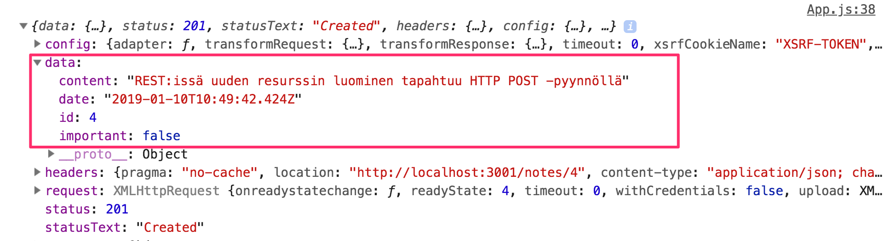
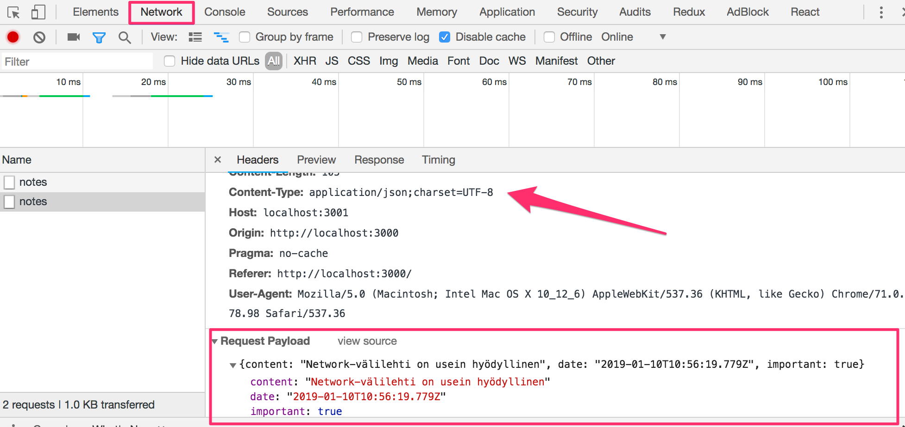
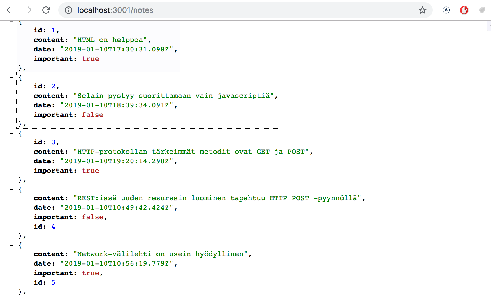
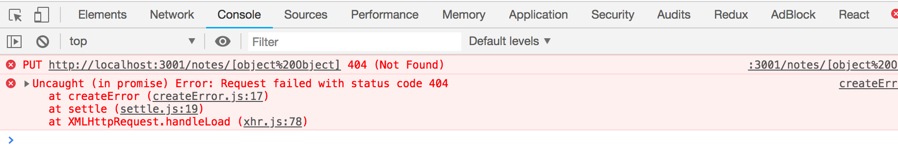
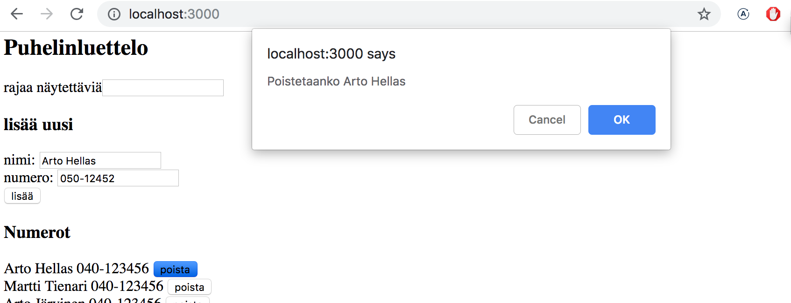
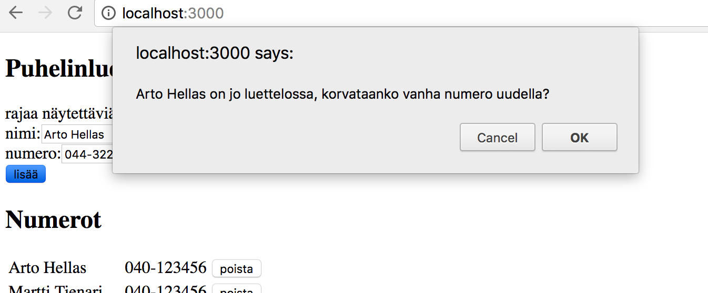

<div class="content">

Kun sovelluksella luodaan uusia muistiinpanoja, täytyy ne luonnollisesti tallentaa palvelimelle. [json-server](https://github.com/typicode/json-server) mainitsee dokumentaatiossaan olevansa ns. REST- tai RESTful-API

> <i>Get a full fake REST API with zero coding in less than 30 seconds (seriously)</i>

Ihan alkuperäisen [määritelmän](https://en.wikipedia.org/wiki/Representational_state_transfer) mukainen RESTful API json-server ei ole, mutta ei ole kovin moni muukaan itseään REST:iksi kutsuva rajapinta.

Tutustumme REST:iin tarkemmin kurssin [seuraavassa osassa](/osa3), mutta jo nyt on tärkeä ymmärtää minkälaista [konventiota](https://en.wikipedia.org/wiki/Representational_state_transfer#Applied_to_Web_services) json-server ja yleisemminkin REST API:t käyttävät [reittien](https://github.com/typicode/json-server#routes), eli URL:ien ja käytettävien HTTP-pyyntöjen tyyppien suhteen.

### REST

REST:issä yksittäisiä asioita esim. meidän tapauksessamme muistiinpanoja kutsutaan <i>resursseiksi</i>. Jokaisella resurssilla on yksilöivä osoite eli URL. json-serverin noudattaman yleisen konvention mukaan yksittäistä muistiinpanoa kuvaavan resurssin URL on muotoa <i>notes/3</i>, missä 3 on resurssin tunniste. Osoite <i>notes</i> taas vastaa kaikkien yksittäisten muistiinpanojen kokoelmaa.

Resursseja haetaan palvelimelta HTTP GET -pyynnöillä. Esim. HTTP GET osoitteeseen <i>notes/3</i> palauttaa muistiinpanon, jonka id-kentän arvo on 3. Kun taas HTTP GET -pyyntö osoitteeseen <i>notes</i> palauttaa kaikki muistiinpanot.

Uuden muistiinpanoa vastaavan resurssin luominen tapahtuu json-serverin noudattamassa REST-konventiossa tekemällä HTTP POST -pyyntö, joka kohdistuu myös samaan osoitteeseen <i>notes</i>. Pyynnön mukana sen runkona eli <i>bodynä</i> lähetetään luotavan muistiinpanon tiedot.

json-server vaatii, että tiedot lähetetään JSON-muodossa, eli käytännössä sopivasti muotoiltuna merkkijonona ja asettamalla headerille <i>Content-Type</i> arvo <i>application/json</i>.

### Datan lähetys palvelimelle

Muutetaan nyt uuden muistiinpanon lisäämisestä huolehtivaa tapahtumankäsittelijää seuraavasti:

```js
addNote = event => {
  event.preventDefault()
  const noteObject = {
    content: newNote,
    date: new Date().toISOString(),
    important: Math.random() > 0.5,
  }

// highlight-start
  axios
    .post('http://localhost:3001/notes', noteObject)
    .then(response => {
      console.log(response)
    })
// highlight-end
}
```

eli luodaan muistiinpanoa vastaava olio, ei kuitenkaan lisätä sille kenttää <i>id</i>, sillä on parempi jättää id:n generointi palvelimen vastuulle!

Olio lähetetään palvelimelle käyttämällä axiosin metodia <em>post</em>. Rekisteröity tapahtumankäsittelijä tulostaa konsoliin palvelimen vastauksen.

Kun nyt kokeillaan luoda uusi muistiinpano, konsoliin tulostus näyttää seuraavalta:



Uusi muistiinpano on siis _response_-olion kentän <i>data</i> arvona. Palvelin on lisännyt muistiinpanolle tunnisteen, eli <i>id</i>-kentän.

Joskus on hyödyllistä tarkastella HTTP-pyyntöjä [osan 0 alussa](/osa0#http-get) paljon käytetyn konsolin <i>Network</i>-välilehden kautta:



Voimme esim. tarkastaa onko POST-pyynnön mukana menevä data juuri se mitä oletimme, onko headerit asetettu oikein ym.

Koska POST-pyynnössä lähettämämme data oli Javascript-olio, osasi axios automaattisesti asettaa pyynnön <i>Content-type</i> headerille oikean arvon eli <i>application/json</i>.

Uusi muistiinpano ei vielä renderöidy ruudulle, sillä emme aseta komponentille <i>App</i> uutta tilaa muistiinpanon luomisen yhteydessä. Viimeistellään sovellus vielä tältä osin:

```js
addNote = event => {
  event.preventDefault()
  const noteObject = {
    content: newNote,
    date: new Date().toISOString(),
    important: Math.random() > 0.5,
  }

  axios
    .post('http://localhost:3001/notes', noteObject)
    .then(response => {
      // highlight-start
      setNotes(notes.concat(response.data))
      setNewNote('')
      // highlight-end
    })
}
```

Palvelimen palauttama uusi muistiinpano siis lisätään tuttuun tapaan funktiolla <em>setNotes</em> tilassa olevien muiden muistiinpanojen joukkoon (kannattaa [muistaa tärkeä detalji](/osa1#taulukon-käsittelyä) siitä, että metodi <em>concat</em> ei muuta komponentin alkuperäistä tilaa, vaan luo uuden taulukon) ja tyhjennetään lomakkeen teksti. 

Kun palvelimella oleva data alkaa vaikuttaa web-sovelluksen toimintalogiikkaan, tulee sovelluskehitykseen heti iso joukko uusia haasteita, joita tuo mukanaan mm. kommunikoinnin asynkronisuus. Debuggaamiseenkin tarvitaan uusia strategiota, debug-printtaukset ym. muuttuvat vain tärkeämmäksi, myös Javascriptin runtimen periaatteita ja React-komponenttien toimintaa on pakko tuntea riittävällä tasolla, arvaileminen ei riitä.

Palvelimen tilaa kannattaa tarkastella myös suoraan, esim. selaimella:



näin on mahdollista varmistua, mm. siirtyykö kaikki oletettu data palvelimelle.

Kurssin seuraavassa osassa alamme toteuttaa itse myös palvelimella olevan sovelluslogiikan, tutustumme silloin tarkemmin palvelimen debuggausta auttaviin työkaluihin, mm. [postmaniin](https://chrome.google.com/webstore/detail/postman/fhbjgbiflinjbdggehcddcbncdddomop). Tässä vaiheessa json-server-palvelimen tilan tarkkailuun riittänee selain.

> **HUOM:** sovelluksen nykyisessä versiossa selain lisää uudelle muistiinpanolle sen luomishetkeä kuvaavan kentän. Koska koneen oma kello voi näyttää periaatteessa mitä sattuu, on aikaleimojen generointi todellisuudessa viisaampaa hoitaa palvelimella ja tulemmekin tekemään tämän muutoksen kurssin seuraavassa osassa.

Sovelluksen tämän hetkinen koodi on kokonaisuudessaan [githubissa](https://github.com/fullstack-hy2019/part2-notes/tree/part2-5), branchissa <i>part2-5</i>.

### Muistiinpanon tärkeyden muutos

Lisätään muistiinpanojen yhteyteen painike, millä niiden tärkeyttä voi muuttaa.

Muistiinpanon määrittelevän komponentin muutos on seuraavat:

```js
const Note = ({ note, toggleImportance }) => {
  const label = note.important
    ? 'make not important' : 'make important'

  return (
    <li>
      {note.content} 
      <button onClick={toggleImportance}>{label}</button>
    </li>
  )
}
```

Komponentissa on nappi, jolle on rekisteröity klikkaustapahtuman käsittelijäksi propsien avulla välitetty funktio <em>toggleImportance</em>.

Komponentti <i>App</i> määrittelee alustavan version tapahtumankäsittelijästä <em>toggleImportanceOf</em> ja välittää sen jokaiselle <i>Note</i>-komponentille:

```js
const App = () => {
  const [notes, setNotes] = useState([]) 
  const [newNote, setNewNote] = useState('')
  const [showAll, setShowAll] = useState(true)

  // ...

  // highlight-start
  const toggleImportanceOf = id => {
    console.log(
      'importance of ' + id + ' needs to be toggled'
    )
  }
  // highlight-end

  const rows = () => notesToShow.map(note =>
    <Note
      key={note.id}
      note={note}
      toggleImportance={() => toggleImportanceOf(note.id)} // highlight-line
    />
  )

  return (
    // ...
  )
}
```

Huomaa, että jokaisen muistiinpanon tapahtumankäsittelijäksi tulee nyt <i>yksilöllinen</i> funktio, sillä kunkin muistiinpanon <i>id</i> on uniikki.

Esim. jos <i>node.id</i> on 3, tulee tapahtumankäsittelijäksi _toggleImportance(note.id)_ eli käytännössä:

```js
() => { console.log('importance of 3 needs to be toggled') }
```

Pieni muistutus tähän väliin. Tapahtumankäsittelijän koodin tulostuksessa muodostetaan tulostettava merkkijono Javan tyyliin plussaamalla stringejä:

```js
console.log('importance of ' + id + ' needs to be toggled')
```

ES6:n [template string](https://developer.mozilla.org/en-US/docs/Web/JavaScript/Reference/Template_literals) -ominaisuuden ansiosta Javascriptissa vastaavat merkkijonot voidaan kirjottaa hieman mukavammin:

```js
console.log(`importance of ${id} needs to be toggled`)
```

Merkkijonon sisälle voi nyt määritellä "dollari-aaltosulku"-syntaksilla kohtia, minkä sisälle evaluoidaan javascript-lausekkeita, esim. muuttujan arvo. Huomaa, että template stringien hipsutyyppi poikkeaa Javascriptin normaaleista merkkijonojen käyttämistä hipsuista.

Yksittäistä json-serverillä olevaa muistiinpanoa voi muuttaa kahdella tavalla, joko <i>korvaamalla</i> sen tekemällä HTTP PUT -pyyntö muistiinpanon yksilöivään osoitteeseen tai muuttamalla ainoastaan joidenkin muistiinpanon kenttien arvoja HTTP PATCH -pyynnöllä.

Korvaamme nyt muistiinpanon kokonaan, sillä samalla tulee esille muutama tärkeä React:iin ja Javascriptiin liittyvä seikka.

Tapahtumankäsittelijäfunktion lopullinen muoto on seuraavassa:

```js
const toggleImportanceOf = id => {
  const url = `http://localhost:3001/notes/${id}`
  const note = notes.find(n => n.id === id)
  const changedNote = { ...note, important: !note.important }

  axios.put(url, changedNote).then(response => {
    setNotes(notes.map(note => note.id !== id ? note : response.data))
  })
}
```

Melkein jokaiselle riville sisältyy tärkeitä yksityiskohtia. Ensimmäinen rivi määrittelee jokaiselle muistiinpanolle id-kenttään perustuvan yksilöivän url:in.

Taulukon metodilla [find](https://developer.mozilla.org/en-US/docs/Web/JavaScript/Reference/Global_Objects/Array/find) etsitään muutettava muistiinpano ja talletetaan muuttujaan _note_ viite siihen.

Sen jälkeen luodaan <i>uusi olio</i>, jonka sisältö on sama kuin vanhan olion sisältö poislukien kenttä important. Luominen näyttää hieman erikoiselta:

```js
const changedNote = { ...note, important: !note.important }
```

Kyseessä on vielä standardoimattoman [object spread](https://github.com/tc39/proposal-object-rest-spread) -operaation soveltaminen.

Käytännössä <em>{ ... note}</em> luo olion, jolla on kenttinään kopiot olion _note_ kenttien arvoista. Kun aaltosulkeisiin lisätään asioita, esim. <em>{ ...note, important: true }</em>, tulee uuden olion kenttä _important_ saamaan arvon _true_. Eli esimerkissämme <em>important</em> saa uudessa oliossa vanhan arvonsa käänteisarvon.

Pari huomioita. Miksi teimme muutettavasta oliosta kopion vaikka myös seuraava koodi näyttää toimivan:

```js
const note = notes.find(n => n.id === id)
note.important = !note.important

axios.put(url, note).then(response => {
  // ...
```

Näin ei ole suositetavaa tehdä, sillä muuttuja <em>note</em> on viite komponentin tilassa, eli <em>notes</em>-taulukossa olevaan olioon, ja kuten muistamme tilaa ei Reactissa saa muuttaa suoraan!

Kannattaa myös huomata, että uusi olio _changedNote_ on ainoastaan ns. [shallow copy](https://en.wikipedia.org/wiki/Object_copying#Shallow_copy), eli uuden olion kenttien arvoina on vanhan olion kenttien arvot. Jos vanhan olion kentät olisivat itsessään olioita, viittaisivat uuden olion kentät samoihin olioihin.

Uusi muistiinpano lähetetään sitten PUT-pyynnön mukana palvelimelle, jossa se korvaa aiemman muistiinpanon.

Takaisinkutsufunktiossa asetetaan komponentin <i>App</i> tilaan <em>notes</em>  kaikki vanhat muistiinpanot paitsi muuttuneen, josta tilaan asetetaan palvelimen palauttama versio:

```js
axios.put(url, changedNote).then(response => {
  setNotes(notes.map(note => note.id !== id ? note : response.data))
})
```

Tämä saadaan aikaan metodilla <em>map</em>: 

```js
notes.map(note => note.id !== id ? note : response.data)
```

Operaatio siis luo uuden taulukon vanhan taulukon perusteella. Jokainen uuden taulukon alkio luodaan ehdollisesti siten, että jos ehto <em>note.id !== id</em> on tosi, otetaan uuteen taulukkoon suoraan vanhan taulukon kyseinen alkio. Jos ehto on epätosi, eli kyseessä on muutettu muistiinpano, otetaan uuteen taulukkoon palvelimen palauttama olio.

Käytetty <em>map</em>-kikka saattaa olla aluksi hieman hämmentävä. Asiaa kannattaakin miettiä tovi. Tapaa tullaan käyttämään kurssilla vielä kymmeniä kertoja.

### Palvelimen kanssa tapahtuvan kommunikoinnin eristäminen omaan moduuliin

<i>App</i>-komponentti alkaa kasvaa uhkaavasti kun myös palvelimen kanssa kommunikointi tapahtuu komponentissa. [Single responsibility](https://en.wikipedia.org/wiki/Single_responsibility_principle) -periaatteen hengessä kommunikointi onkin viisainta eristää omaan [moduuliinsa](#refaktorointia---moduulit).

Luodaan hakemisto <i>src/services</i> ja sinne tiedosto <i>notes.js</i>:

```js
import axios from 'axios'
const baseUrl = 'http://localhost:3001/notes'

const getAll = () => {
  return axios.get(baseUrl)
}

const create = newObject => {
  return axios.post(baseUrl, newObject)
}

const update = (id, newObject) => {
  return axios.put(`${baseUrl}/${id}`, newObject)
}

export default { 
  getAll: getAll, 
  create: create, 
  update: update 
}
```

Moduuli palauttaa nyt olion, jonka kenttinä (<i>getAll</i>, <i>create</i> ja <i>update</i>) on kolme muistiinpanojen käsittelyä hoitavaa funktiota. Funktiot palauttavat suoraan axiosin metodien palauttaman promisen.

Komponentti <i>App</i> saa moduulin käyttöön <em>import</em>-lauseella

```js
import noteService from './services/notes' // highlight-line

const App = () => {
```

moduulin funktioita käytetään importatun muuttujan _noteService_ kautta seuraavasti:

```js
const App = () => {
  // ...

  useEffect(() => {
    // highlight-start
    noteService
      .getAll()
      .then(response => {
        setNotes(response.data)
      })
    // highlight-end
  }, [])

  const toggleImportanceOf = id => {
    const note = notes.find(n => n.id === id)
    const changedNote = { ...note, important: !note.important }

    // highlight-start
    noteService
      .update(id, changedNote)
      .then(response => {
        setNotes(notes.map(note => note.id !== id ? note : response.data))
      })
    // highlight-end
  }

  const addNote = (event) => {
    event.preventDefault()
    const noteObject = {
      content: newNote,
      date: new Date().toISOString(),
      important: Math.random() > 0.5
    }

// highlight-start
    noteService
      .create(noteObject)
      .then(response => {
        setNotes(notes.concat(response.data))
        setNewNote('')
      })
// highlight-end
  }

  // ...
}

export default App
```

Voisimme viedä ratkaisua vielä askeleen pidemmälle, sillä käyttäessään moduulin funktioita komponentti <i>App</i> saa olion, joka sisältää koko HTTP-pyynnön vastauksen:

```js
noteService
  .getAll()
  .then(response => {
    setNotes(response.data)
  })
```

Eli asia mistä <i>App</i> on kiinnostunut on parametrin kentässä <i>response.data</i>.

Moduulia olisi miellyttävämpi käyttää, jos se HTTP-pyynnön vastauksen sijaan palauttaisi suoraan muistiinpanot sisältävän taulukon. Tällöin moduulin käyttö näyttäisi seuraavalta

```js
noteService
  .getAll()
  .then(initialNotes => {
    setNotes(initialNotes)
  })
```
Tämä onnistuu muuttamalla moduulin koodia seuraavasti (koodiin jää ikävästi copy-pastea, emme kuitenkaan nyt välitä siitä):

```js
import axios from 'axios'
const baseUrl = 'http://localhost:3001/notes'

const getAll = () => {
  const request = axios.get(baseUrl)
  return request.then(response => response.data)
}

const create = newObject => {
  const request = axios.post(baseUrl, newObject)
  return request.then(response => response.data)
}

const update = (id, newObject) => {
  const request = axios.put(`${baseUrl}/${id}`, newObject)
  return request.then(response => response.data)
}

export default { 
  getAll: getAll, 
  create: create, 
  update: update 
}
```

eli enää ei palautetakaan suoraan axiosin palauttamaa promisea, vaan otetaan promise ensin muuttujaan <em>request</em> ja kutsutaan sille metodia <em>then</em>:

```js
const getAll = () => {
  const request = axios.get(baseUrl)
  return request.then(response => response.data)
}
```

Täydellisessä muodossa kirjoitettuna viimeinen rivi olisi:

```js
const getAll = () => {
  const request = axios.get(baseUrl)
  // highlight-start
  return request.then(response => {
    return response.data
  })
  // highlight-end
}
```

Myös nyt funktio <em>getAll</em>  palauttaa promisen, sillä promisen metodi <em>then</em> [palauttaa promisen](https://developer.mozilla.org/en-US/docs/Web/JavaScript/Reference/Global_Objects/Promise/then).

Koska <em>then</em>:in parametri palauttaa suoraan arvon <i>response.data</i>, on funktion <em>getAll</em> palauttama promise sellainen, että jos HTTP-kutsu onnistuu, antaa promise takaisinkutsulleen HTTP-pyynnön mukana olleen datan, eli se toimii juuri niin kuin haluamme.

Moduulin muutoksen jälkeen täytyy komponentti <i>App</i> muokata <em>noteService</em>:n metodien takaisinkutsujen osalta ottamaan huomioon, että ne palauttavat datan suoraan:

```js
const App = () => {
  // ...

  useEffect(() => {
    noteService
      .getAll()
      // highlight-start      
        .then(initialNotes => {
        setNotes(initialNotes)
        // highlight-end
      })
  }, [])

  const toggleImportanceOf = id => {
    const note = notes.find(n => n.id === id)
    const changedNote = { ...note, important: !note.important }

    noteService
      .update(id, changedNote)
      // highlight-start      
        .then(returnedNote => {
        setNotes(notes.map(note => note.id !== id ? note : returnedNote))
      // highlight-end
      })
  }

  const addNote = (event) => {
    event.preventDefault()
    const noteObject = {
      content: newNote,
      date: new Date().toISOString(),
      important: Math.random() > 0.5
    }

    noteService
      .create(noteObject)
    // highlight-start      
        .then(returnedNote => {
        setNotes(notes.concat(returnedNote))
        // highlight-end
        setNewNote('')
      })
  }

  // ...
}
```

Tämä kaikki on hieman monimutkaista ja asian selittäminen varmaan vain vaikeuttaa sen ymmärtämistä. Internetistä löytyy paljon vaihtelevatasoista materiaalia aiheesta, esim. [tämä](https://javascript.info/promise-chaining).

[You do not know JS](https://github.com/getify/You-Dont-Know-JS) sarjan kirja "Async and performance" selittää asian [hyvin](https://github.com/getify/You-Dont-Know-JS/blob/master/async%20%26%20performance/ch3.md) mutta tarvitsee selitykseen kohtuullisen määrän sivuja.

Promisejen ymmärtäminen on erittäin keskeistä modernissa Javascript-sovelluskehityksessä, joten asiaan kannattaa uhrata kohtuullisessa määrin aikaa.

### Kehittyneempi tapa olioliteraalien määrittelyyn

Muistiinpanopalvelut määrittelevä moduuli siis eksporttaa olion, jonka kenttinä <i>getAll</i>, <i>create</i> ja <i>update</i> ovat muistiinpanojen käsittelyyn tarkoitetut funktiot. 

Moduulin määrittely tapahtui seuraavasti:

```js
import axios from 'axios'
const baseUrl = 'http://localhost:3001/notes'

const getAll = () => {
  const request = axios.get(baseUrl)
  return request.then(response => response.data)
}

const create = newObject => {
  const request = axios.post(baseUrl, newObject)
  return request.then(response => response.data)
}

const update = (id, newObject) => {
  const request = axios.put(`${baseUrl}/${id}`, newObject)
  return request.then(response => response.data)
}

export default { 
  getAll: getAll, 
  create: create, 
  update: update 
}
```

Exportattava asia on siis seuraava, hieman erikoiselta näyttävä olio:

```js
{ 
  getAll: getAll, 
  create: create, 
  update: update 
}
```

Olion määrittelyssä vasemmalla puolella kaksoispistettä olevat nimet tarkoittavat eksportoitavan olion <i>kenttiä</i>, kun taas oikealla puolella olevat nimet ovat moduulin sisällä <i>määriteltyjä muuttujia</i>. 

Koska olion kenttien nimet ovat samat kuin niiden arvon määrittelevien muuttujien nimet, voidaan olion määrittely kirjoittaa tiivimmässä muodossa:

```js
{ 
  getAll, 
  create, 
  update 
}
```

Eli moduulin määrittely yksinkertaisuu seuraavaan muotoon 

```js
import axios from 'axios'
const baseUrl = 'http://localhost:3001/notes'

const getAll = () => {
  const request = axios.get(baseUrl)
  return request.then(response => response.data)
}

const create = newObject => {
  const request = axios.post(baseUrl, newObject)
  return request.then(response => response.data)
}

const update = (id, newObject) => {
  const request = axios.put(`${baseUrl}/${id}`, newObject)
  return request.then(response => response.data)
}

export default { getAll, create, update } // highlight-line
```

Tässä tiiviimmässä olioiden määrittelytavassa hyödynnetään ES6:n myötä Javascriptiin  tullutta [uutta ominaisuutta](https://developer.mozilla.org/en-US/docs/Web/JavaScript/Reference/Operators/Object_initializer#Property_definitions), joka mahdollistaa hieman tiiviimmän tavan muuttujien avulla tapahtuvaan olioiden määrittelyyn.

Havainnollistaaksemme asiaa tarkastellaan tilannetta, jossa meillä on muuttujissa arvoja

```js 
const name = 'Leevi'
const age = 0
```

Vanhassa Javascriptissä olio täytyi määritellä seuraavaan tyyliin

```js 
const person = {
  name: name,
  age: age
}
```

koska muuttujien ja luotavan olion kenttien nimi nyt on sama, riittää ES6:ssa kirjoittaa:

```js 
const person = { name, age }
```

lopputulos molemmissa on täsmälleen sama, eli ne luovat olion jonka kentän <i>name</i> arvo on <i>Leevi</i> ja kentän <i>age</i> arvo <i>0</i>.

### Promise ja virheet

Jos sovelluksemme mahdollistaisi muistiinpanojen poistamisen, voisi syntyä tilanne, missä käyttäjä yrittää muuttaa sellaisen muistiinpanon tärkeyttä, joka on jo poistettu järjestelmästä.

Simuloidaan tälläistä tilannetta "kovakoodaamalla" noteServiceen funktioon <em>getAll</em> muistiinpano, jota ei ole todellisuudessa (eli palvelimella) olemassa:

```js
const getAll = () => {
  const request = axios.get(baseUrl)
  const nonExisting = {
    id: 10000,
    content: 'Tätä muistiinpanoa ei ole palvelimelta',
    date: '2017-12-10T17:30:31.098Z',
    important: true,
  }
  return request.then(response => response.data.concat(nonExisting))
}
```

Kun valemuistiinpanon tärkeyttä yritetään muuttaa, konsoliin tulee virheilmoitus, joka kertoo palvelimen vastanneen urliin <i>/notes/10000</i> tehtyyn HTTP PUT -pyyntöön statuskoodilla 404 <i>not found</i>:



Sovelluksen tulisi pystyä käsittelemään tilanne hallitusti. Jos konsoli ei ole auki, ei käyttäjä huomaa mitään muuta kuin sen, että muistiinpanon tärkeys ei vaihdu napin painelusta huolimatta.

Jo [aiemmin](#axios-ja-promiset) mainittiin, että promisella voi olla kolme tilaa. Kun HTTP-pyyntö epäonnistuu, menee pyyntöä vastaava promise tilaan <i>rejected</i>. Emme tällä hetkellä käsittele koodissamme promisen epäonnistumista mitenkään.

Promisen epäonnistuminen [käsitellään](https://developer.mozilla.org/en-US/docs/Web/JavaScript/Guide/Using_promises) antamalla <em>then</em>-metodille parametriksi myös toinen takaisinkutsufunktio, jota kutsutaan siinä tapauksessa jos promise epäonnistuu.

Ehkä yleisempi tapa kuin kahden tapahtumankäsittelijän käyttö on liittää promiseen epäonnistumistilanteen käsittelijä kutsumalla metodia [catch](https://developer.mozilla.org/en-US/docs/Web/JavaScript/Reference/Global_Objects/Promise/catch).

Käytännössä virhetilanteen käsittelijän rekisteröiminen tapahtuisi seuraavasti

```js
axios
  .get('http://example.com/probably_will_fail')
  .then(response => {
    console.log('success!')
  })
  .catch(error => {
    console.log('fail')
  })
```

Jos pyyntö epäonnistuu, kutsutaan <em>catch</em>-metodin avulla rekisteröityä käsittelijää.

Metodia <em>catch</em> hyödynnetään usein siten, että se sijoitetaan syvemmälle promiseketjuun.

Kun sovelluksemme tekee HTTP-operaation syntyy oleellisesti ottaen [promiseketju](https://javascript.info/promise-chaining):

```js
axios
  .put(`${baseUrl}/${id}`, newObject)
  .then(response => response.data)
  .then(changedNote => {
    // ...
  })
```

Metodilla <em>catch</em> voidaan määritellä ketjun lopussa käsittelijäfunktio, jota kutsutaan siinä vaiheessa jos mikä tahansa ketjun promisesta epäonnistuu, eli menee tilaan <i>rejected</i>:

```js
axios
  .put(`${baseUrl}/${id}`, newObject)
  .then(response => response.data)
  .then(changedNote => {
    // ...
  })
  .catch(error => {
    console.log('fail')
  })
```

Hyödynnetään tätä ominaisuutta, ja sijoitetaan virheenkäsittelijä komponenttiin <i>App</i>:

```js
const toggleImportanceOf = id => {
  const note = notes.find(n => n.id === id)
  const changedNote = { ...note, important: !note.important }

  noteService
    .update(id, changedNote).then(returnedNote => {
      setNotes(notes.map(note => note.id !== id ? note : returnedNote))
    })
    // highlight-start
    .catch(error => {
      alert(
        `muistiinpano '${note.content}' on jo valitettavasti poistettu palvelimelta`
      )
      setNotes(notes.filter(n => n.id !== id))
    })
    // highlight-end
}
```

Virheilmoitus annetaan vanhan kunnon [alert](https://developer.mozilla.org/en-US/docs/Web/API/Window/alert)-dialogin avulla ja palvelimelta poistettu muistiinpano poistetaan tilasta.

Olemattoman muistiinpanon poistaminen siis tapahtuu metodilla [filter](https://developer.mozilla.org/en-US/docs/Web/JavaScript/Reference/Global_Objects/Array/filter), joka muodostaa uuden taulukon, jonka sisällöksi tulee alkuperäisen taulukon sisällöstä ne alkiot, joille parametrina oleva funktio palauttaa arvon true:

```js
notes.filter(n => n.id !== id)
```

Alertia tuskin kannattaa käyttää todellisissa React-sovelluksissa. Opimme kohta kehittyneemmän menetelmän käyttäjille tarkoitettujen tiedotteiden antamiseen. Toisaalta on tilanteita, joissa simppeli battle tested -menetelmä kuten <em>alert</em> riittää aluksi aivan hyvin. Hienomman tavan voi sitten tehdä myöhemmin jos aikaa ja intoa riittää.

Sovelluksen tämän hetkinen koodi on kokonaisuudessaan [githubissa](https://github.com/fullstack-hy2019/part2-notes/tree/part2-6), branchissa <i>part2-6</i>.

</div>

<div class="tasks">

<h3>Tehtäviä</h3>

<h4>2.15: puhelinluettelo step7</h4>

Palataan jälleen puhelinluettelon pariin.

Tällä hetkellä luetteloon lisättäviä uusia numeroita ei synkronoida palvelimelle. Korjaa tilanne.

<h4>2.16: puhelinluettelo step8</h4>

Siirrä palvelimen kanssa kommunikoinnista vastaava toiminnallisuus omaan moduuliin tämän osan materiaalissa olevan esimerkin tapaan.

<h4>2.17: puhelinluettelo step9</h4>

Tee ohjelmaan mahdollisuus yhteystietojen poistamiseen. Poistaminen voi tapahtua esim. nimen yhteyteen liitetyllä napilla. Poiston suorittaminen voidaan varmistaa käyttäjältä [window.confirm](https://developer.mozilla.org/en-US/docs/Web/API/Window/confirm)-metodilla:



Palvelimelta tiettyä henkilöä vastaava resurssi tuhotaan tekemällä HTTP DELETE -pyyntö resurssia vastaavaan <i>URL</i>:iin, eli jos poistaisimme esim. käyttäjän, jonka <i>id</i> on 2, tulisi tapauksessamme tehdä HTTP DELETE osoitteeseen <i>localhost:3001/persons/2</i>. Pyynnön mukana ei lähetetä mitään dataa.

[Axios](https://github.com/axios/axios)-kirjaston avulla HTTP DELETE -pyyntö tehdään samaan tapaan kuin muutkin pyynnöt.

**Huom:** et voi käyttää Javascriptissa muuttujan nimeä <em>delete</em> sillä kyseessä on kielen varattu sana, eli seuraava ei onnistu:

```js
// käytä jotain muuta muuttujan nimeä
const delete = (id) => {
  // ...
}
```

<h4>2.18*: puhelinluettelo step10</h4>

Muuta toiminnallisuutta siten, että jos jo olemassaolevalle henkilölle lisätään numero, korvaa lisätty numero aiemman numeron. Korvaaminen kannattaa tehdä HTTP PUT -pyynnöllä.

Jos henkilön tiedot löytyvät jo luettelosta, voi ohjelma kysyä käyttäjältä varmistuksen korvataanko numero:



</div>
