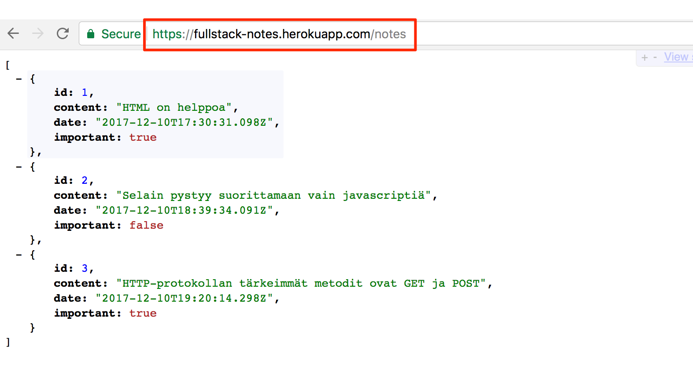
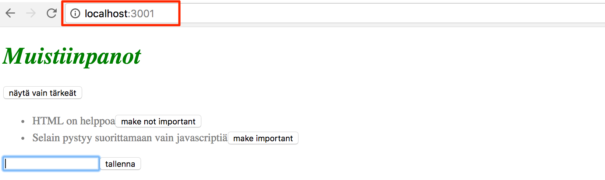
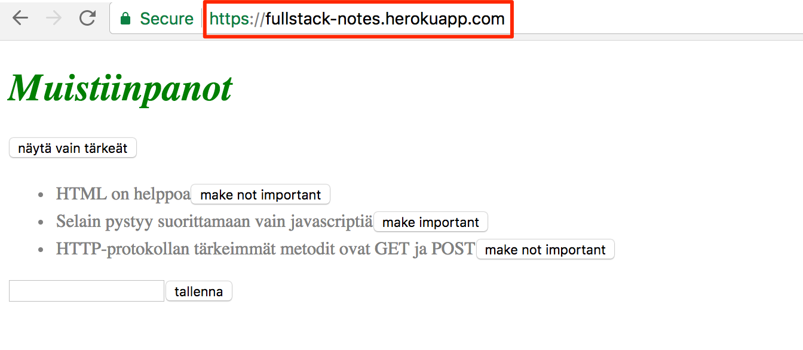
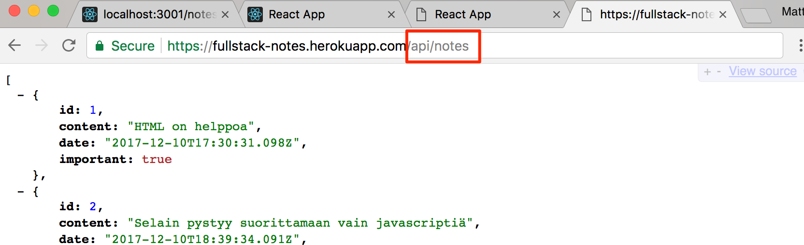
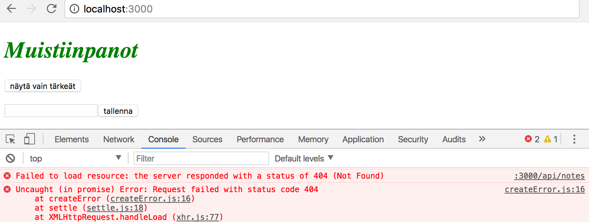
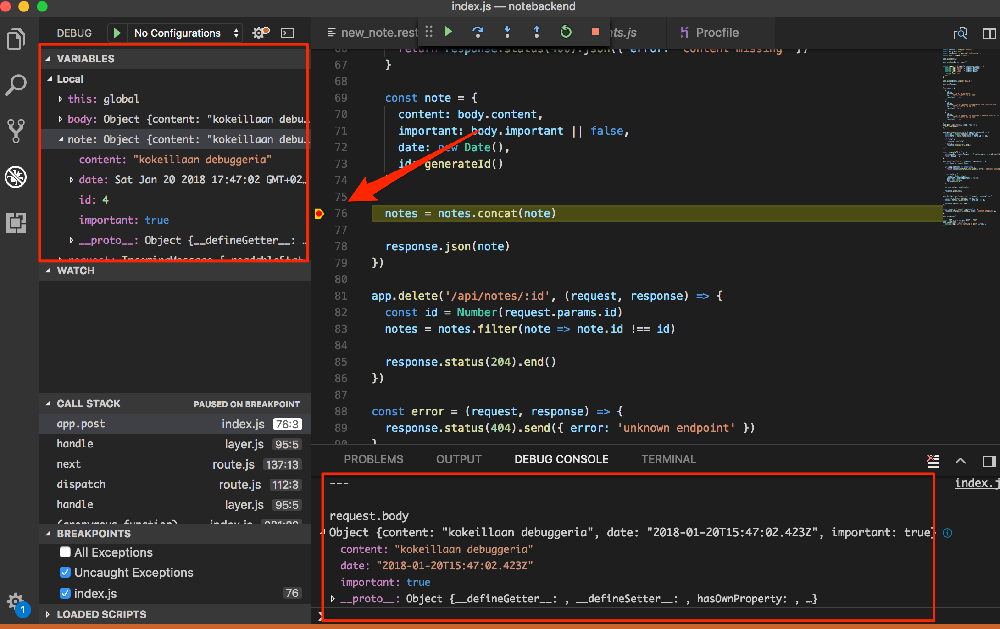
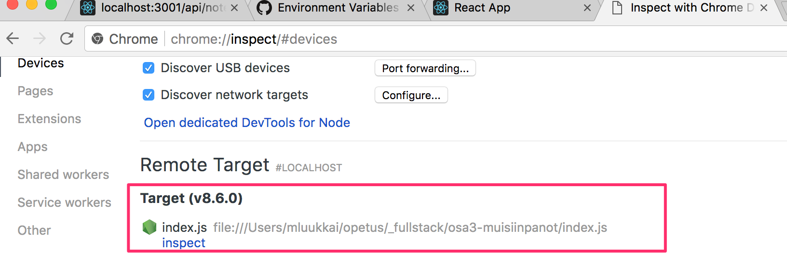
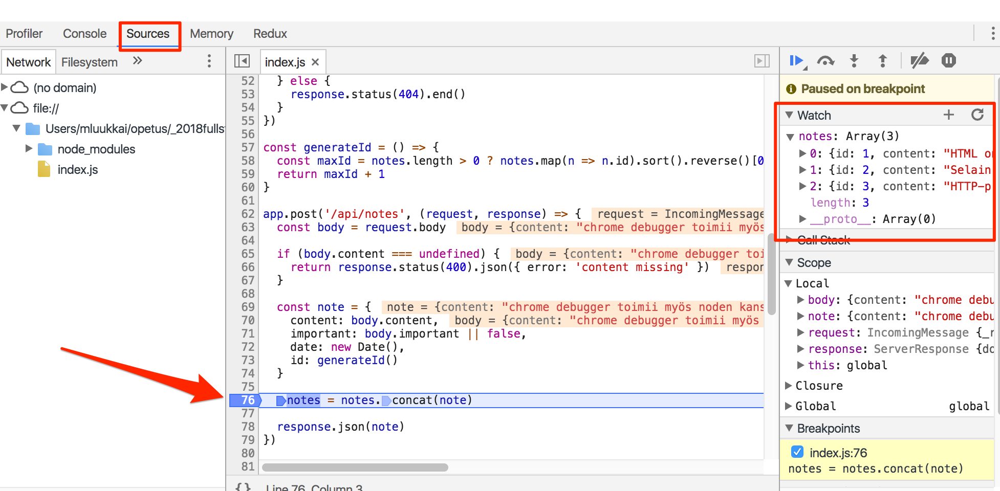
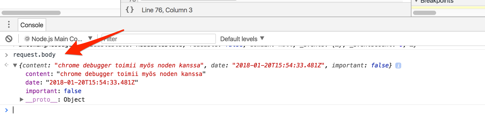

## Yhteys frontendiin

Palataan yritykseemme käyttää nyt tehtyä backendiä [osassa 2](/osa2) tehdyllä React-frontendillä. Aiempi yritys lopahti seuraavaan virheilmoitukseen

 sanoin

> Cross-origin resource sharing (CORS) is a mechanism that allows restricted resources (e.g. fonts) on a web page to be requested from another domain outside the domain from which the first resource was served. A web page may freely embed cross-origin images, stylesheets, scripts, iframes, and videos. Certain "cross-domain" requests, notably Ajax requests, are forbidden by default by the same-origin security policy.

Lyhyesti sanottuna meidän kontekstissa kyse on seuraavasta: websovelluksen selaimessa suoritettava Javascript-koodi saa oletusarvoisesti kommunikoida vain samassa [originissa](https://developer.mozilla.org/en-US/docs/Web/Security/Same-origin_policy) olevan palvelimen kanssa. Koska palvelin on localhostin portissa 3001 ja frontend localhostin portissa 3000, niiden origin ei ole sama.

Korostetaan vielä, että [same origin policy](https://developer.mozilla.org/en-US/docs/Web/Security/Same-origin_policy) ja CORS eivät ole mitenkään React- tai Node-spesifisiä asioita, vaan yleismaailmallisia periaatteita Web-sovellusten toiminnasta.

Voimme sallia muista _origineista_ tulevat pyynnöt käyttämällä Noden [cors](https://github.com/expressjs/cors)-middlewarea.

Asennetaan _cors_ komennolla

```bash
npm install cors --save
```

Otetaan middleware käyttöön ja sallitaan kaikki origineista tulevat pyynnöt:

```js
const cors = require('cors');

app.use(cors());
```

Nyt frontend toimii! Tosin muistiinpanojen tärkeäksi muuttavaa toiminnallisuutta backendissa ei vielä ole.

CORS:ista voi lukea tarkemmin esim. [Mozillan sivuilta](https://developer.mozilla.org/en-US/docs/Web/HTTP/CORS).

## Sovellus internettiin

Kun koko "stäkki" on saatu vihdoin kuntoon, siirretään sovellus internettiin. Viime aikoina on tullut uusia mielenkiintoisa sovellusten hostausmahdollisuuksia, esim. [Zeit](https://zeit.co). Käytetään seuraavassa vanhaa kunnon [Herokua](https://www.heroku.com).

Lisätään projektin juureen tiedosto _Procfile_, joka kertoo Herokulle, miten sovellus käynnistetään

```bash
web: node index.js
```

Muutetaan tiedoston _index.js_ lopussa olevaa sovelluksen käyttämän portin määrittelyä seuraavasti:

```js
const PORT = process.env.PORT || 3001;
app.listen(PORT, () => {
  console.log(`Server running on port ${PORT}`);
});
```

Nyt käyttöön tulee [ympäristömuuttujassa](https://en.wikipedia.org/wiki/Environment_variable) _PORT_ määritelty portti tai 3001 jos ympäristömuuttuja _PORT_ ei ole määritelty. Heroku konfiguroi sovelluksen portin ympäristömuuttujan avulla.

Tehdään projektihakemistosta git-repositorio, lisätään _.gitignore_ jolla seuraava sisältö

```bash
node_modules
```

Luodaan heroku-sovellus komennolla _heroku create_ ja deployataan sovellus komennoilla _git add -A_, _git commit -m \"Initiate app.\"_ ja _git push heroku master_.

Jos kaikki meni hyvin, sovellus toimii:



Jos ei, vikaa voi selvittää herokun lokeja lukemalla, eli komennolla _heroku logs_.

Esim. tätä materiaalia tehdessä törmättiin ongelmaan joka aiheutti seuraavan tulostuksen lokeihin

![](../assets/3/11.ppng

Syynä ongelmalle oli se, että middlewarea _cors_ asennettaessa oli unohtunut antaa optio **--save**, joka tallentaa tiedon riippuvuudesta tiedostoon _package.json_. Koska näin kävi, ei Heroku ollut asentanut corsia sovelluksen käyttöön.

> **HUOM** ainakin alussa on järkevää tarkkailla Herokussa olevan sovelluksen lokeja koko ajan. Parhaiten tämä onnistuu antamalla komento _heroku logs -t_, jolloin logit tulevat konsoliin sitä mukaan kun palvelimella tapahtuu jotain.

Myös frontend toimii Herokussa olevan backendin avulla. Voit varmistaa asian muuttamalla frontendiin määritellyn backendin osoitteen viittaamaan _localhost:3001_:n sijaan Herokussa olevaan backendiin.

Seuraavaksi herää kysymys miten saamme myös frontendin internettiin? Vaihtoehtoja on useita.

### Frontendin tuotantoversio

Olemme toistaiseksi suorittaneet React-koodia _sovelluskehitysmoodissa_, missä sovellus on konfiguroitu antamaan havainnollisia virheilmoituksia, päivittämään koodiin tehdyt muutokset automaattisesti selaimeen ym.

Kun sovellus viedään tuotantoon, täytyy siitä tehdä [production build](https://reactjs.org/docs/optimizing-performance.html#use-the-production-build)
eli tuotantoa varten optimoitu versio.

create-react-app:in avulla tehdyistä sovelluksista saadaan muodostettua tuotantoversio komennolla [npm run build](https://github.com/facebookincubator/create-react-app#npm-run-build-or-yarn-build).

Suoritetaan nyt komento frontendin projektin juuressa.

Komennon seurauksena syntyy hakemiston _build_ (joka sisältää jo sovelluksen ainoan html-tiedoston _index.html_) sisään hakemisto _static_, minkä alle generoituu sovelluksen Javascript-koodin [minifioitu](<https://en.wikipedia.org/wiki/Minification_(programming)>) versio. Vaikka sovelluksen koodi on kirjoitettu useaan tiedostoon, generoituu kaikki Javascript yhteen tiedostoon, samaan tiedostoon tulee itseasiassa myös kaikkien sovelluksen koodin tarvitsemien riippuvuuksien koodi.

Minifioitu koodi ei ole miellyttävää luettavaa. Koodin alku näyttää seuraavalta:

```js
!function(e){function t(r){if(n[r])return n[r].exports;var o=n[r]={i:r,l:!1,exports:{}};return e[r].call(o.exports,o,o.exports,t),o.l=!0,o.exports}var n={};t.m=e,t.c=n,t.d=function(e,n,r){t.o(e,n)||Object.defineProperty(e,n,{configurable:!1,enumerable:!0,get:r})},t.n=function(e){var n=e&&e.__esModule?function(){return e.default}:function(){return e};return t.d(n,"a",n),n},t.o=function(e,t){return Object.prototype.hasOwnProperty.call(e,t)},t.p="/",t(t.s=12)}([function(e,t,n){"use strict";function r(e){return"[object Array]"===E.call(e)}function o(e){return"[object ArrayBuffer]"===E.call(e)}function a(e){return"undefined"!==typeof FormData&&e instanceof FormData}function i(e){return"undefined"!==typeof ArrayBuffer&&ArrayBuffer.isView?ArrayBuffer.isView(e):e&&e.buffer&&e.buffer instanceof ArrayBuffer}function u(e){return"string"===typeof e}function l(e){return"number"===typeof e}function s(e){return"undefined"===typeof e}function c(e){return null!==e&&"object"===typeof
```

### Staattisten tiedostojen tarjoaminen backendistä

Eräs mahdollisuus frontendin tuotantoon viemiseen on kopioida tuotantokoodi, eli hakemisto _build_ backendin repositorion juureen ja määritellä backend näyttämään pääsivunaan frontendin _pääsivu_, eli tiedosto _build/index.html_.

Aloitetaan kopioimalla frontendin tuotantokoodi backendin alle, projektin juureen. Omalla koneellani kopiointi tapahtuu frontendin hakemistosta käsin komennolla

```bash
cp -r build ../../osa3/notebackend
```

Backendin sisältävän hakemiston tulee nyt näyttää seuraavalta:


Jotta saamme expressin näyttämään _staattista sisältöä_ eli sivun _index.html_ ja sen lataaman Javascriptin ym. tarvitsemme expressiin sisäänrakennettua middlewarea [static](http://expressjs.com/en/starter/static-files.html).

Kun lisäämme muiden middlewarejen määrittelyn yhteyteen seuraavan

```js
app.use(express.static('build'));
```

tarkastaa express GET-tyyppisten HTTP-pyyntöjen yhteydessä ensin löytyykö pyynnön polkua vastaavan nimistä tiedostoa hakemistosta _build_. Jos löytyy, palauttaa express tiedoston.

Nyt HTTP GET -pyyntö osoitteeseen _www.palvelimenosoite.com/index.html_ tai _www.palvelimenosoite.com_ näyttää Reactilla tehdyn frontendin. GET-pyynnön esim. osoitteeseen _www.palvelimenosoite.com/notes_ hoitaa backendin koodi.

Koska tässä tapauksessa sekä frontend että backend toimivat samassa osoitteessa, voidaan React-sovelluksessa tapahtuva backendin _baseUrl_ määritellä [suhteellisena](https://www.w3.org/TR/WD-html40-970917/htmlweb.html#h-5.1.2) URL:ina, eli ilman palvelinta yksilöivää osaa:

```js
import axios from 'axios';
const baseUrl = '/notes';

const getAll = () => {
  const request = axios.get(baseUrl);
  return request.then(response => response.data);
};

// ...
```

Muutoksen jälkeen on luotava uusi production build ja kopioitava se backendin repositorion juureen.

Sovellusta voidaan käyttää nyt _backendin_ osoitteesta <http://localhost:3001>:



Sovelluksemme toiminta vastaa nyt täysin osan 0 luvussa [Single page app](/osa0/#single-page-app) läpikäydyn esimerkkisovelluksen toimintaa.

Kun mennään selaimella osoitteeseen <http://localhost:3001> palauttaa palvelin hakemistossa _build_ olevan tiedoston _index.html_, jonka sisältö hieman tiivistettynä on seuraava:

```html
<!DOCTYPE html>
<html lang="en">
  <head>
    <title>React App</title>
    <link href="/static/css/main.d2f2b65b.css" rel="stylesheet" />
  </head>
  <body>
    <div id="root"></div>
    <script type="text/javascript" src="/static/js/main.c18b620c.js"></script>
  </body>
</html>
```

Sivu sisältää ohjeen ladata sovelluksen tyylit määrittelevän CSS-tiedoston, sekä _script_-tagin, jonka ansiosta selain lataa sovelluksen Javascript-koodin, eli varsinaisen React-sovelluksen.

React-koodi hakee palvelimelta muistiinpanot osoitteesta <http://localhost:3001/notes> ja renderöi ne ruudulle. Selaimen ja palvelimen kommunikaatio selviää tuttuun tapaan konsolin välilehdeltä _Network_:


Kun sovelluksen "internettiin vietävä" versio todetaan toimivan paikalliseksi, commitoidaan frontendin tuotantoversio backendin repositorioon ja pushataan koodi uudelleen herokuun.

[Sovellus](https://fullstack-notes.herokuapp.com) toimii moitteettomasti lukuunottamatta vielä backendiin toteuttamatonta muistiinpanon tärkeyden muuttamista:



> **HUOM** ennen pushaamista on tietysti muistettava lisätä hakemisto _build_ repositorioon!

Sovelluksemme tallettama tieto ei ole ikuisesti pysyvää, sillä sovellus tallettaa muistiinpanot muuttujaan. Jos sovellus kaatuu tai se uudelleenkäynnistetään, kaikki tiedot katoavat.

Tarvitsemme sovelluksellemme tietokannan. Ennen tietokannan käyttöönottoa katsotaan kuitenkin vielä muutamaa asiaa.

## Frontendin deployauksen suoraviivaistus

Jotta uuden frontendin version generointi onnistuisi jatkossa ilman turhia manuaalisia askelia, tehdään frontendin repositorion juureen yksinkertainen shell-scripti, joka suorittaa uuden tuotantoversion buildaamisen eli komennon _npm run build_ ja sen siirron backendin alle. Annetaan skriptille nimeksi _deploy.sh_. Sisältö on seuraava

```bash
#!/bin/sh
npm run build
rm -rf ../../osa3/notebackend/build
cp -r build ../../osa3/notebackend/
```

Skriptille pitää antaa vielä suoritusoikeudet:

```bash
chmod u+x deploy.sh
```

Skripti voidaan suorittaa frontendin juuresta komennolla _./deploy.sh_

### Backendin urlit

Backendin tarjoama muistiinpanojen käsittelyn rajapinta on nyt suoraan sovelluksen URL:in <https://fullstack-notes.herokuapp.com> alla. Eli <https://fullstack-notes.herokuapp.com/notes> on kaikkien mustiinpanojen lista ym. Koska backendin roolina on tarjota frontendille koneluettava rajapinta, eli API, olisi ehkä parempi erottaa API:n tarjoama osoitteisto selkeämmin, esim. aloittamalla kaikki sanalla _api_.

Tehdään muutos ensin muuttamalla käsin **kaikki backendin routet**:

```js
//...
app.get('/api/notes', (request, response) => {
  response.json(notes);
});
//...
```

Frontendin koodiin riittää seuraava muutos

```js
import axios from 'axios';
const baseUrl = '/api/notes';

const getAll = () => {
  const request = axios.get(baseUrl);
  return request.then(response => response.data);
};

// ...
```

Muutosten jälkeen esim. kaikki muistiinpanot tarjoavan API-endpointin osoite on <https://fullstack-notes.herokuapp.com/api/notes>



Frontend on edelleen sovelluksen juuressa eli osoitteessa <https://fullstack-notes.herokuapp.com/>.

> Sivuhuomautus: API:en versiointi
>
> Joskus API:n urleissa ilmaistaan myös API:n versio. Eri versioita saatetaan tarvita, jos aikojen kuluessa API:in tehdään laajennuksia, jotka ilman versiointia hajoittaisivat olemassaolevia osia ohjelmista. Versioinnin avulla voidaan tuoda vanhojen rinnalle uusia, hieman eri tavalla toimivia versioita API:sta.
>
> API:n version ilmaiseminen URL:issa ei kuitenkaan ole välttämättä, ainakaan kaikkien mielestä järkevää vaikka tapaa paljon käytetäänkin. Oikeasta tavasta API:n versiointiin [kiistellään ympäri internettiä](https://stackoverflow.com/questions/389169/best-practices-for-api-versioning).

### Proxy

Frontendiin tehtyjen muutosten seurauksena on nyt se, että kun suoritamme frontendiä sovelluskehitysmoodissa, eli käynnistämällä sen komennolla _npm start_, yhteys backendiin ei toimi:



Syynä tälle on se, että backendin osoite muutettiin suhteellisesti määritellyksi:

```js
const baseUrl = '/api/notes';
```

Koska frontend toimii osoitteessa _localhost:3000_, menevät backendiin tehtävät pyynnöt väärään osoitteeseen _localhost:3000/api/notes_. Backend toimii kuitenkin osoitteessa _localhost:3001_

create-react-app:illa luoduissa projekteissa ongelma on helppo ratkaista. Riittää, että frontendin repositorion tiedostoon _package.json_ lisätään seuraava määritelmä:

```bash
{
  "dependencies": {
    // ...
  },
  "scripts": {
    // ...
  },
  "proxy": "http://localhost:3001"
}
```

Uudelleenkäynnistyksen jälkeen Reactin sovelluskehitysympäristö toimii [proxynä](https://github.com/facebookincubator/create-react-app/blob/master/packages/react-scripts/template/README.md#proxying-api-requests-in-development) ja jos React-koodi tekee HTTP-pyynnön palvelimen _http://localhost:3000_ johonkin osoitteeseen joka ei ole React-sovelluksen vastuulla (eli kyse ei ole esim. sovelluksen Javascript-koodin tai CSS:n lataamisesta), lähetetään pyyntö edelleen osoitteessa _http://localhost:3001_ olevalle palvelimelle.

Nyt myös frontend on kunnossa, se toimii sekä sovelluskehitysmoodissa että tuotannossa yhdessä palvelimen kanssa.

Eräs negatiivinen puoli käyttämässämme lähestymistavassa on se, että sovelluksen uuden version tuotantoon vieminen edellyttää frontendin koodin tuotantoversion generoinnista ja sen backendin repositorion kopioimisesta huolehtivan skriptin _delpoy.sh_ suorittamisen. Tämä taas hankaloittaa automatisoidun [deployment pipelinen](https://martinfowler.com/bliki/DeploymentPipeline.html) toteuttamista. Deployment pipelinellä tarkoitetaan automatisoitua ja hallittua tapaa viedä koodi sovelluskehittäjän koneelta erilaisten testien ja laadunhallinnallisten vaiheiden kautta tuotantoympäristöön.

Tähänkin on useita erilaisia ratkaisuja (esim. sekä frontendin että backendin [sijoittaminen samaan repositorioon](https://github.com/mars/heroku-cra-node)), emme kuitenkaan nyt mene niihin.

Myös frontendin koodin deployaaminen omana sovelluksenaan voi joissain tilanteissa olla järkevää. create-react-app:in avulla luotujen sovellusten osalta se on [suoraviivaista](https://github.com/mars/create-react-app-buildpack).

Sovelluksen tämänhetkinen koodi on kokonaisuudessaan [githubissa](https://github.com/FullStack-HY/part3-notes-backend/tree/part3-2), tagissa _part3-2_.

## Tehtäviä

Tee nyt tehtävät [3.9-3.11](/tehtävät#yhteys-frontendiin-ja-vienti-tuotantoon)

## Node-sovellusten debuggaaminen

Node-sovellusten debuggaaminen on jossain määrin hankalampaa kuin selaimessa toimivan Javascriptin.

Vanha hyvä keino on tietysti konsoliin tulostelu. Se kannattaa aina. On mielipiteitä, joiden mukaan konsoliin tulostelun sijaan olisi syytä suosia jotain kehittyneempää menetelmää, mutta en ole ollenkaan samaa mieltä. Jopa maailman aivan eliittiin kuuluvat open source -kehittäjät [käyttävät](https://tenderlovemaking.com/2016/02/05/i-am-a-puts-debuggerer.html) tätä [menetelmää](https://swizec.com/blog/javascript-debugging-slightly-beyond-console-log/swizec/6633).

### Visual Studio Code

Visual Studio Coden debuggeri voi olla hyödyksi joissain tapauksissa. Seuraavassa screenshot, missä koodi on pysäytetty kesken uuden muistiinpanon lisäyksen



Koodi on pysähtynyt nuolen osoittaman _breakpointin_ kohdalle ja konsoliin on evaluoitu muuttujan _request.params_ arvo. Vasemmalla olevassa ikkunassa on nähtävillä myös muuta ohjelman tilaan liittyvää.

Ylhäällä olevista nuolista yms. voidaan kontrolloida debuggauksen etenemistä.

Itse en juurikaan käytä Visual Studio Code debuggeria.

### Chromen dev tools

Debuggaus onnisuu myös Chromen developer-konsolilla, käynnistämällä sovellus komennolla:

```bash
node --inspect index.js
```

Debuggeriin pääsee käsiksi kirjoittamalla chromen osoiteriville

```bash
chrome://inspect
```

Avautuvasta näkymästä valitaan debugattava sovellus:



Debuggausnäkymä toimii kuten React-koodia debugattaessa, _Sources_-välilehdelle voidaan esim. asettaa breakpointeja, eli kohtia joihin suoritus pysähtyy:



Kaikki sovelluksen console.log-tulostukset tulevat debuggerin _Console_-välilehdelle. Voit myös tutkia siellä muuttujien arvoja ja suorittaa mielivaltaista Javascript-koodia:



### Epäile kaikkea

Full Stack -sovellusten debuggaaminen vaikuttaa alussa erittäin hankalalta. Kun kohta kuvaan tulee myös tietokanta ja frontend on yhdistetty backendiin, on potentiaalisia virhelähteitä todella paljon.

Kun sovellus "ei toimi", onkin selvitettävä missä vika on. On erittäin yleistä, että vika on sellaisessa paikassa, mitä ei osaa ollenkaan epäillä, ja menee minuutti-, tunti- tai jopa päiväkausia ennen kuin oikea ongelmien lähde löytyy.

Avainasemassa onkin systemaattisuus. Koska virhe voi olla melkein missä vaan, kaikkea pitää epäillä, ja tulee pyrkiä poissulkemaan ne osat tarkastelusta, missä virhe ei ainakaan ole. Konsoliin kirjoitus, Postman, debuggeri ja kokemus auttavat.

Virheiden ilmaantuessa ylivoimaisesti huonoin strategia on jatkaa koodin kirjoittamista. Se on tae siitä, että koodissa on pian kymmenen ongelmaa lisää ja niiden syyn selvittäminen on entistäkin vaikeampaa. Toyota Production Systemin periaate [Stop and fix](http://gettingtolean.com/toyota-principle-5-build-culture-stopping-fix/#.Wjv9axP1WCQ) toimii tässäkin yhteydessä paremmin kuin hyvin.
