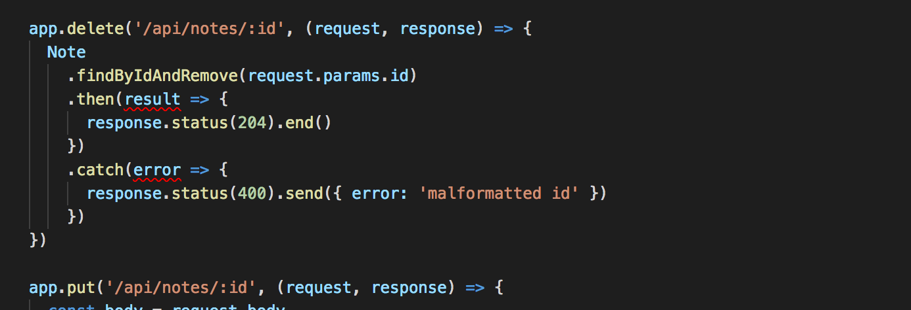

<div class="content">

### Lint

Ennen osan lopetusta katsomme vielä nopeasti paitsioon jäänyttä tärkeää työkalua [lintiä](<https://en.wikipedia.org/wiki/Lint_(software)>). Wikipedian sanoin:

> Generically, lint or a linter is any tool that detects and flags errors in programming languages, including stylistic errors. The term lint-like behavior is sometimes applied to the process of flagging suspicious language usage. Lint-like tools generally perform static analysis of source code.

Staattisesti tyypitetyissä, käännettävissä kielissä esim. Javassa ohjelmointiympäristöt, kuten NetBeans osaavat huomautella monista koodiin liittyvistä asioista, sellaisistakin, jotka eivät ole välttämättä käännösvirheitä. Erilaisten [staattisen analyysin](https://en.wikipedia.org/wiki/Static_program_analysis) lisätyökalujen, kuten [checkstylen](http://checkstyle.sourceforge.net/) avulla voidaan vielä laajentaa Javassa huomautettavien asioiden määrää koskemaan koodin tyylillisiä seikkoja, esim. sisentämistä.

Javascript-maailmassa tämän hetken johtava työkalu staattiseen analyysiin, eli "linttaukseen" on [ESlint](https://eslint.org/).

Asennetaan ESlint backendiin kehitysaikaiseksi riippuvuudeksi komennolla

```bash
npm install eslint --save-dev
```

Tämän jälkeen voidaan muodostaa alustava ESlint-konfiguraatio komennolla

```bash
node_modules/.bin/eslint --init
```

Vastaillaan kysymyksiin:


Konfiguraatiot tallentuvat tiedostoon _.eslintrc.js_:

```js
module.exports = {
    "env": {
        "node": true
        "es6": true
    },
    "extends": "eslint:recommended",
    "rules": {
        "indent": [
            "error",
            4
        ],
        "linebreak-style": [
            "error",
            "unix"
        ],
        "quotes": [
            "error",
            "single"
        ],
        "semi": [
            "error",
            "never"
        ]
    }
};
```

Muutetaan heti konfiguraatioista sisennystä määrittelevä sääntö, siten että sisennystaso on 2 välilyöntiä

```
"indent": [
    "error",
    2
],
```

Esim tiedoston _index.js_ tarkastus tapahtuu komennolla

```bash
node_modules/.bin/eslint index.js
```

Kannattaa ehkä tehdä linttaustakin varten _npm-skripti_:

```bash
{
  // ...
  "scripts": {
    "start": "node index.js",
    "watch": "nodemon index.js",
    "lint": "eslint ."
  },
  // ...
}
```

Nyt komennot _npm run lint_ suorittaa tarkastukset koko projektille.

Myös hakemistossa _build_ oleva frontendin tuotantoversio tulee näin tarkastettua. Sitä emme kuitenkaan halua, eli tehdään projektin juureen tiedosto [.eslintignore](https://eslint.org/docs/user-guide/configuring#ignoring-files-and-directories) ja sille seuraava sisältö

```bash
build
```

Näin koko hakemiston _build_ sisältö jätetään huomioimatta linttauksessa.

Lintillä on jonkin verran huomautettavaa koodistamme:


Ei kuitenkaan korjata ongelmia vielä.

Parempi vaihtoehto kuin linttauksen suorittaminen komentoriviltä on konfiguroida editorille _lint-plugin_, joka suorittaa linttausta koko ajan. Näin pääset korjaamaan pienet virheet välittömästi. Tietoja esim. Visual Studion ESlint-pluginsta [täällä](https://marketplace.visualstudio.com/items?itemName=dbaeumer.vscode-eslint).

VS Coden ESlint-plugin alleviivaa tyylisääntöjä rikkovat kohdat punaisella:



Näin ongelmat on helppo korjata koodiin heti.

ESlintille on määritelty suuri määrä [sääntöjä](https://eslint.org/docs/rules/), joita on helppo ottaa käyttöön muokkaamalla tiedostoa _.eslintrc.js_.

Otetaan käyttöön sääntö [eqeqeq](https://eslint.org/docs/rules/eqeqeq) joka varoittaa, jos koodissa yhtäsuuruutta verrataan muuten kuin käyttämällä kolmea = -merkkiä. Sääntö lisätään konfiguraatiotiedostoon kentän _rules_ alle.

```bash
"rules": {
  // ...
  "eqeqeq": "error"
},
```

Tehdään samalla muutama muukin muutos tarkastettaviin sääntöihin.

Estetään rivien lopussa olevat [turhat välilyönnit](https://eslint.org/docs/rules/no-trailing-spaces), vaaditaan että [aaltosulkeiden edessä/jälkeen on aina välilyönti](https://eslint.org/docs/rules/object-curly-spacing) ja vaaditaan myös konsistenttia välilyöntien käyttöä [nuolifunktioiden parametrien suhteen](https://eslint.org/docs/rules/arrow-spacing):

```bash
"rules": {
  // ...
  "eqeqeq": "error",
  "no-trailing-spaces": "error",
  "object-curly-spacing": [
      "error", "always"
  ],
  "arrow-spacing": [
      "error", { "before": true, "after": true }
  ]
},
```

Oletusarvoinen konfiguraatiomme ottaa käyttöön joukon valmiiksi määriteltyjä sääntöjä _eslint:recommended_

```bash
"extends": "eslint:recommended",
```

Mukana on myös _console.log_-komennoista varoittava sääntö-
Yksittäisen sääntö on helppo kytkeä [pois päältä](https://eslint.org/docs/user-guide/configuring#configuring-rules) määrittelemällä sen "arvoksi" konfiguraatiossa 0. Tehdään toistaiseksi näin säännölle _no-console_.

```bash
"rules": {
  // ...
  "eqeqeq": "error",
  "no-trailing-spaces": "error",
  "object-curly-spacing": [
      "error", "always"
  ],
  "arrow-spacing": [
      "error", { "before": true, "after": true }
  ],
  "no-console": 0
},
```

**HUOM** kun teet muutoksia tiedostoon _.eslintrc.js_, kannattaa muutosten jälkeen suorittaa linttaus komentoriviltä ja varmistaa että konfiguraatio ei ole viallinen:


Jos konfiguraatiossa on jotain vikaa, voi editorin lint-plugin näyttää mitä sattuu.

Monissa yrityksissä on tapana määritellä yrityksen laajuiset koodausstandardit ja näiden käyttöä valvova ESlint-konfiguraatio. Pyörää ei kannata välttämättä keksiä uudelleen ja voi olla hyvä idea ottaa omaan projektiin joku käyttöön jossain muualla hyväksi havaittu konfiguraatio. Viime aikoina monissa projekteissa on omaksuttu AirBnB:n [Javascript](https://github.com/airbnb/javascript)-tyyliohjeet ottamalla käyttöön firman määrittelemä [ESLint](https://github.com/airbnb/javascript/tree/master/packages/eslint-config-airbnb)-konfiguraatio.

Sovelluksen tämän hetkinen koodi on kokonaisuudessaan [githubissa](https://github.com/FullStack-HY/part3-notes-backend/tree/part3-5), tagissa _part3-5_.

### Tehtäviä

Tee nyt viimeinen tehtävä [3.22](/tehtävät#eslint)

</div>
