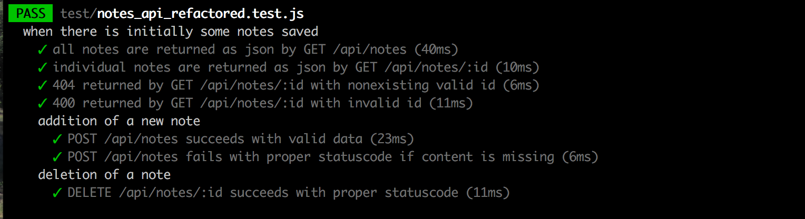

<div class="content">

### virheiden käsittely ja async/await

Jos sovellus POST-pyyntöä käsitellessään aiheuttaa jonkinlaisen ajonaikaisen virheen, syntyy jälleen tuttu tilanne:

<pre>
(node:30644) UnhandledPromiseRejectionWarning: Unhandled promise rejection (rejection id: 1): TypeError: formattedNote.nonexistingMethod is not a function
</pre>

eli käsittelemätön promisen rejektoituminen. Pyyntöön ei vastata tilanteessa mitenkään.

Async/awaitia käyttäessä kannattaa käyttää vanhaa kunnon _try/catch_-mekanismia virheiden käsittelyyn:

```js
notesRouter.post('/', async (request, response) => {
  try {
    const body = request.body;

    if (body.content === undefined) {
      return response.status(400).json({ error: 'content missing' });
    }

    const note = new Note({
      content: body.content,
      important: body.important === undefined ? false : body.important,
      date: new Date(),
    });

    const savedNote = await note.save();
    response.json(formatNote(note));
  } catch (exception) {
    console.log(exception);
    response.status(500).json({ error: 'something went wrong...' });
  }
});
```

Iso try/catch tuo koodiin hieman ikävän vivahteen, mutta mikään ei ole ilmaista.

Tehdään sitten testit yksittäisen muistiinpanon tietojen katsomiselle ja muistiinpanon poistolle:

```js
test('a specific note can be viewed', async () => {
  const resultAll = await api
    .get('/api/notes')
    .expect(200)
    .expect('Content-Type', /application\/json/);

  const aNoteFromAll = resultAll.body[0];

  const resultNote = await api.get(`/api/notes/${aNoteFromAll.id}`);

  const noteObject = resultNote.body;

  expect(noteObject).toEqual(aNoteFromAll);
});

test('a note can be deleted', async () => {
  const newNote = {
    content: 'HTTP DELETE poistaa resurssin',
    important: true,
  };

  const addedNote = await api.post('/api/notes').send(newNote);

  const notesAtBeginningOfOperation = await api.get('/api/notes');

  await api.delete(`/api/notes/${addedNote.body.id}`).expect(204);

  const notesAfterDelete = await api.get('/api/notes');

  const contents = notesAfterDelete.body.map(r => r.content);

  expect(contents).not.toContain('HTTP DELETE poistaa resurssin');
  expect(notesAfterDelete.body.length).toBe(
    notesAtBeginningOfOperation.body.length - 1
  );
});
```

Testit eivät tässä vaiheessa ole optimaaliset, parannetaan niitä kohta. Ensin kuitenkin refaktoroidaan backend käyttämään async/awaitia.

```js
notesRouter.get('/:id', async (request, response) => {
  try {
    const note = await Note.findById(request.params.id);

    if (note) {
      response.json(formatNote(note));
    } else {
      response.status(404).end();
    }
  } catch (exception) {
    console.log(exception);
    response.status(400).send({ error: 'malformatted id' });
  }
});

notesRouter.delete('/:id', async (request, response) => {
  try {
    await Note.findByIdAndRemove(request.params.id);

    response.status(204).end();
  } catch (exception) {
    console.log(exception);
    response.status(400).send({ error: 'malformatted id' });
  }
});
```

Async/await ehkä selkeyttää koodia jossain määrin, mutta saavutettava hyöty ei ole sovelluksessamme vielä niin iso mitä se tulee olemaan jos asynkronisia kutsuja on tehtävä useampia.

Kaikki eivät kuitenkaan ole vakuuttuneita siitä, että async/await on hyvä lisä Javascriptiin, lue esim. [ES7 async functions - a step in the wrong direction](https://spion.github.io/posts/es7-async-await-step-in-the-wrong-direction.html)

Sovelluksen tämänhetkinen koodi on kokonaisuudessaan [githubissa](https://github.com/FullStack-HY/part3-notes-backend/tree/part4-4), tagissa _part4-4_. Samassa on "vahingossa" mukana testeistä seuraavan luvun jälkeinen paranneltu versio.

### Varoitus

Jos huomaat kirjoittavasi sekaisin async/awaitia ja _then_-kutsuja, on 99% varmaa, että teet jotain väärin. Käytä siis jompaa kumpaa tapaa, älä missään tapauksessa "varalta" molempia.

## Tehtäviä

Tee nyt tehtävät [4.8-4.11](/tehtävät/#apin-testaaminen)

## Testien refaktorointi

Testimme sisältävät tällä hetkellä jossain määrin toisteisuutta ja niiden rakenne ei ole optimaalinen. Testit ovat myös osittain epätäydelliset, esim. reittejä GET /api/notes/:id ja DELETE /api/notes/:id ei tällä hetkellä testata epävalidien id:iden osalta.

Testeissä on myös eräs hieman ikävä ja jopa riskialtis piirre. Testit luottavat siihen, että ne suoritetaan siinä järjestyksessä, missä ne on kirjoitettu testitiedostoon. Tämä pitää kyllä paikkansa, vaikkakin se ei ole kovin selkeästi määritelty ominaisuus eli siihen ei ole hyvä luottaa. Testit tuleekin kirjoittaa siten, että yksittäiset testit ovat riippumattomia toistensa suorituksesta.

Parannellaan testejä hiukan.

Tehdään testejä varten muutama apufunktio moduuliin _tests/test_helper.js_

```js
const Note = require('../models/note');

const initialNotes = [
  {
    content: 'HTML on helppoa',
    important: false,
  },
  {
    content: 'HTTP-protokollan tärkeimmät metodit ovat GET ja POST',
    important: true,
  },
];

const format = note => {
  return {
    content: note.content,
    important: note.important,
    id: note._id,
  };
};

const nonExistingId = async () => {
  const note = new Note();
  await note.save();
  await note.remove();

  return note._id.toString();
};

const notesInDb = async () => {
  const notes = await Note.find({});
  return notes.map(format);
};

module.exports = {
  initialNotes,
  format,
  nonExistingId,
  notesInDb,
};
```

Tärkein apufunktioista on _notesInDb_ joka palauttaa kaikki tietokannassa kutsuhetkellä olevat oliot.

Jossain määrin parannellut testit seuraavassa:

```js
const supertest = require('supertest');
const { app, server } = require('../index');
const api = supertest(app);
const Note = require('../models/note');
const {
  format,
  initialNotes,
  nonExistingId,
  notesInDb,
} = require('./test_helper');

describe('when there is initially some notes saved', async () => {
  beforeAll(async () => {
    await Note.remove({});

    const noteObjects = initialNotes.map(n => new Note(n));
    await Promise.all(noteObjects.map(n => n.save()));
  });

  test('all notes are returned as json by GET /api/notes', async () => {
    const notesInDatabase = await notesInDb();

    const response = await api
      .get('/api/notes')
      .expect(200)
      .expect('Content-Type', /application\/json/);

    expect(response.body.length).toBe(notesInDatabase.length);

    const returnedContents = response.body.map(n => n.content);
    notesInDatabase.forEach(note => {
      expect(returnedContents).toContain(note.content);
    });
  });

  test('individual notes are returned as json by GET /api/notes/:id', async () => {
    const notesInDatabase = await notesInDb();
    const aNote = notesInDatabase[0];

    const response = await api
      .get(`/api/notes/${aNote.id}`)
      .expect(200)
      .expect('Content-Type', /application\/json/);

    expect(response.body.content).toBe(aNote.content);
  });

  test('404 returned by GET /api/notes/:id with nonexisting valid id', async () => {
    const validNonexistingId = await nonExistingId();

    const response = await api
      .get(`/api/notes/${validNonexistingId}`)
      .expect(404);
  });

  test('400 is returned by GET /api/notes/:id with invalid id', async () => {
    const invalidId = '5a3d5da59070081a82a3445';

    const response = await api.get(`/api/notes/${invalidId}`).expect(400);
  });

  describe('addition of a new note', async () => {
    test('POST /api/notes succeeds with valid data', async () => {
      const notesAtStart = await notesInDb();

      const newNote = {
        content: 'async/await yksinkertaistaa asynkronisten funktioiden kutsua',
        important: true,
      };

      await api
        .post('/api/notes')
        .send(newNote)
        .expect(200)
        .expect('Content-Type', /application\/json/);

      const notesAfterOperation = await notesInDb();

      expect(notesAfterOperation.length).toBe(notesAtStart.length + 1);

      const contents = notesAfterOperation.map(r => r.content);
      expect(contents).toContain(
        'async/await yksinkertaistaa asynkronisten funktioiden kutsua'
      );
    });

    test('POST /api/notes fails with proper statuscode if content is missing', async () => {
      const newNote = {
        important: true,
      };

      const notesAtStart = await notesInDb();

      await api
        .post('/api/notes')
        .send(newNote)
        .expect(400);

      const notesAfterOperation = await notesInDb();

      const contents = notesAfterOperation.map(r => r.content);

      expect(notesAfterOperation.length).toBe(notesAtStart.length);
    });
  });

  describe('deletion of a note', async () => {
    let addedNote;

    beforeAll(async () => {
      addedNote = new Note({
        content: 'poisto pyynnöllä HTTP DELETE',
        important: false,
      });
      await addedNote.save();
    });

    test('DELETE /api/notes/:id succeeds with proper statuscode', async () => {
      const notesAtStart = await notesInDb();

      await api.delete(`/api/notes/${addedNote._id}`).expect(204);

      const notesAfterOperation = await notesInDb();

      const contents = notesAfterOperation.map(r => r.content);

      expect(contents).not.toContain(addedNote.content);
      expect(notesAfterOperation.length).toBe(notesAtStart.length - 1);
    });
  });

  afterAll(() => {
    server.close();
  });
});
```

Muutama huomio testeistä. Olemme jaotelleet testejä [describe](http://facebook.github.io/jest/docs/en/api.html#describename-fn)-lohkojen avulla ja muutamissa lohkoissa on oma [beforeAll](http://facebook.github.io/jest/docs/en/api.html#beforeallfn-timeout)-funktiolla suoritettava alustuskoodi.

Joissain tapauksissa tämä olisi parempi tehdä operaatiolla [beforeEach](https://facebook.github.io/jest/docs/en/api.html#beforeeachfn-timeout), joka suoritetaan _ennen jokaista testiä_, näin testeistä saisi varmemmin toisistaan riippumattomia. Esimerkissä beforeEachia ei kuitenkaan ole käytetty.

Testien raportointi tapahtuu _describe_-lohkojen ryhmittelyn mukaan:



Backendin tietokannan tilaa muuttavat testit, esim. uuden muistiinpanon lisäämistä testaava testi _'addition of a new note'_, on tehty siten, että ne ensin aluksi selvittävät tietokannan tilan apufunktiolla _notesInDb()_

```js
const notesAtBeginningOfOperation = await notesInDb();
```

suorittavat testattavan operaation:

```js
const newNote = {
  content: 'async/await yksinkertaistaa asynkronisten funktioiden kutsua',
  important: true,
};

await api
  .post('/api/notes')
  .send(newNote)
  .expect(200)
  .expect('Content-Type', /application\/json/);
```

selvittävät tietokannan tilan operaation jälkeen

```js
const notesAfterOperation = await notesInDb();
```

ja varmentavat, että operaation suoritus vaikutti tietokantaan halutulla tavalla

```js
expect(notesAfterOperation.length).toBe(notesAtBeginningOfOperation.length + 1);

const contents = notesAfterOperation.map(r => r.content);
expect(contents).toContain(
  'async/await yksinkertaistaa asynkronisten funktioiden kutsua'
);
```

Testeihin jää vielä paljon parannettavaa mutta on jo aika siirtyä eteenpäin.

Käytetty tapa API:n testaamiseen, eli HTTP-pyyntöinä tehtävät operaatiot ja tietokannan tilan tarkastelu Mongoosen kautta ei ole suinkaan ainoa tai välttämättä edes paras tapa tehdä API-tason integraatiotestausta. Universaalisti parasta tapaa testien tekoon ei ole, vaan kaikki on aina suhteessa käytettäviin resursseihin ja testattavaan ohjelmistoon.

## Tehtäviä

Tee nyt tehtävät [4.12-4.14](/tehtävät#lisää-toiminnallisuutta-ja-testejä)

</div>
