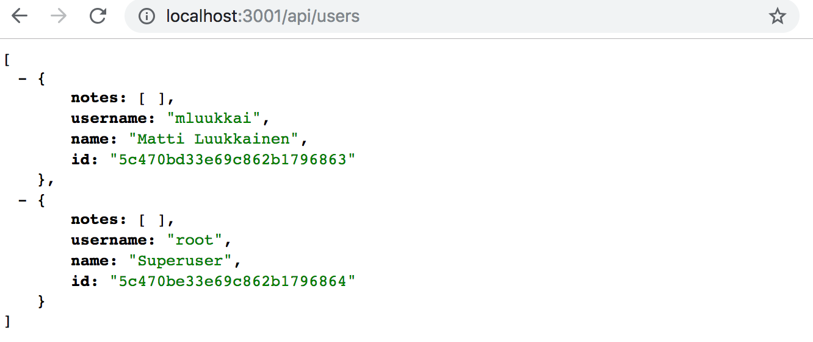
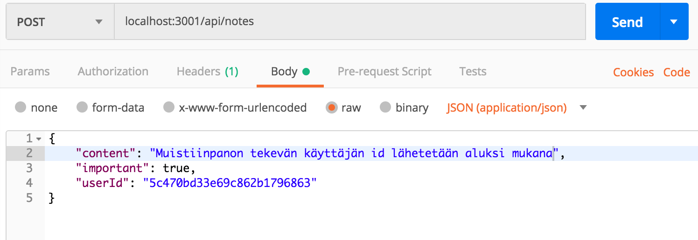
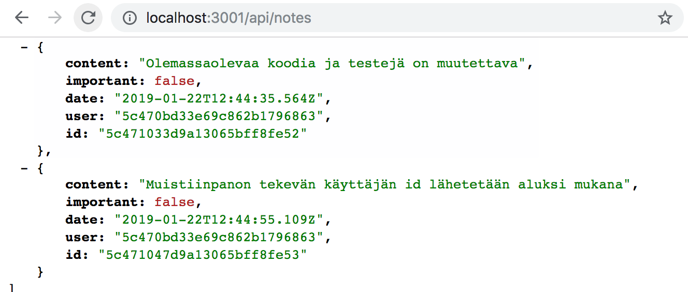
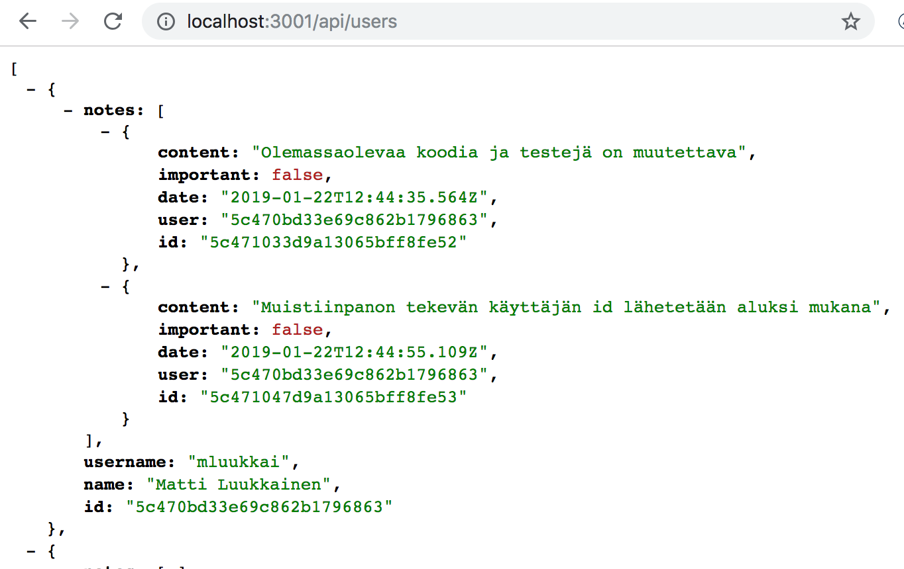
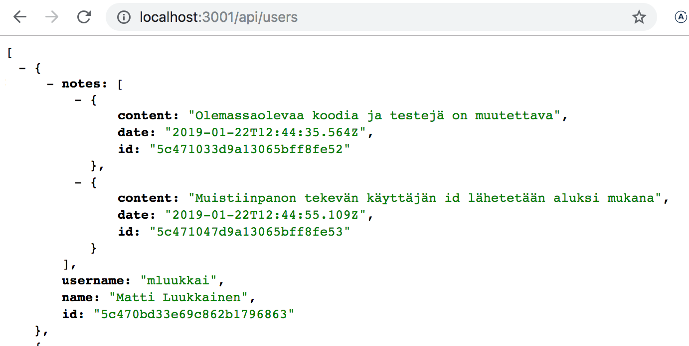
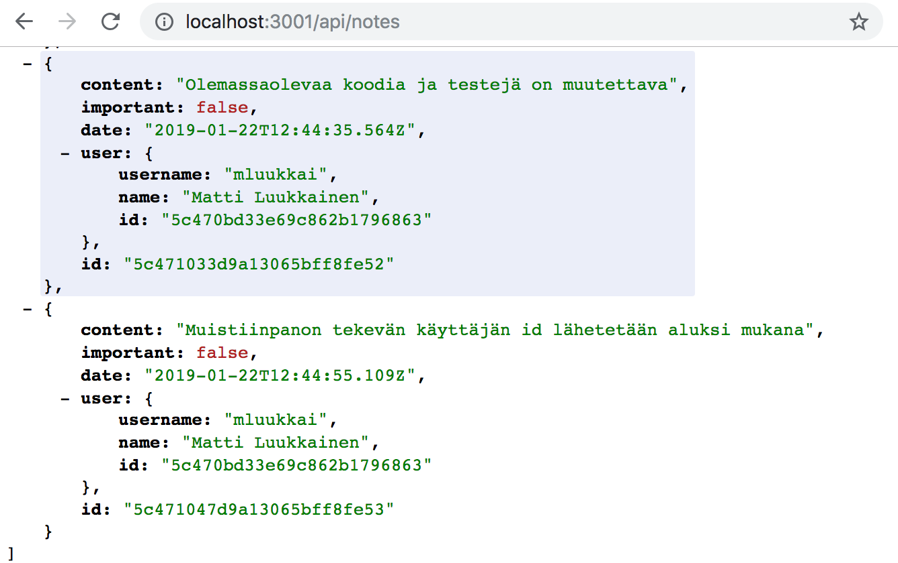

<div class="content">

Haluamme toteuttaa sovellukseemme käyttäjien hallinnan. Käyttäjät tulee tallettaa tietokantaan ja jokaisesta muistiinpanosta tulee tietää sen luonut käyttäjä. Muistiinpanojen poisto ja editointi tulee olla sallittua ainoastaan muistiinpanot tehneelle käyttäjälle.

Aloitetaan lisäämällä tietokantaan tieto käyttäjistä. Käyttäjän (<i>User</i>) ja muistiinpanojen (<i>Note</i>) välillä on yhden suhde moneen -yhteys:


Relaatiotietokantoja käytettäessä ratkaisua ei tarvitsisi juuri miettiä. Molemmille olisi oma taulunsa ja muistiinpanoihin liitettäisiin sen luonutta käyttäjää vastaava id vierasavaimeksi (foreign key).

Dokumenttitietokantoja käytettäessä tilanne on kuitenkin toinen, erilaisia tapoja mallintaa tilanne on useita.

Olemassaoleva ratkaisumme tallentaa jokaisen luodun muistiinpanon tietokantaan <i>notes</i>-kokoelmaan eli <i>collectioniin</i>. Jos emme halua muuttaa tätä, lienee luontevinta tallettaa käyttäjät omaan kokoelmaansa, esim. nimeltään <i>users</i>.

Mongossa voidaan kaikkien dokumenttitietokantojen tapaan käyttää olioiden id:itä viittaamaan muissa kokoelmissa talletettaviin dokumentteihin, vastaavasti kuten viiteavaimia käytetään relaatiotietokannoissa.

Dokumenttitietokannat kuten Mongo eivät kuitenkaan tue relaatiotietokantojen <i>liitoskyselyitä</i> vastaavaa toiminnallisuutta, joka mahdollistaisi useaan kokoelmaan kohdistuvan tietokantahaun. Tämä ei tarkalleen ottaen enää välttämättä pidä paikkaansa, sillä versiosta 3.2. alkaen Mongo on tukenut useampaan kokoelmaan kohdistuvia [lookup-aggregaattikyselyitä](https://docs.mongodb.com/manual/reference/operator/aggregation/lookup/). Emme kuitenkaan käsittele niitä kurssilla.

Jos tarvitsemme liitoskyselyitä vastaavaa toiminnallisuutta, tulee se toteuttaa sovelluksen tasolla, eli käytännössä tekemällä tietokantaan useita kyselyitä. Tietyissä tilanteissa mongoose-kirjasto osaa hoitaa liitosten tekemisen, jolloin kysely näyttää mongoosen käyttäjälle toimivan liitoskyselyn tapaan. Mongoose tekee kuitenkin näissä tapauksissa taustalla useamman kyselyn tietokantaan.

### Viitteet kokoelmien välillä

Jos käyttäisimme relaatiotietokantaa, muistiinpano sisältäisi <i>viiteavaimen</i> sen tehneeseen käyttäjään. Dokumenttitietokannassa voidaan toimia samoin.

Oletetaan että kokoelmassa <i>users</i> on kaksi käyttäjää:

```js
[
  {
    username: 'mluukkai',
    _id: 123456,
  },
  {
    username: 'hellas',
    _id: 141414,
  },
];
```

Kokoelmassa <i>notes</i> on kolme muistiinpanoa, kaikkien kenttä <i>user</i> viittaa <i>users</i>-kentässä olevaan käyttäjään:

```js
[
  {
    content: 'HTML on helppoa',
    important: false,
    _id: 221212,
    user: 123456,
  },
  {
    content: 'HTTP-protokollan tärkeimmät metodit ovat GET ja POST',
    important: true,
    _id: 221255,
    user: 123456,
  },
  {
    content: 'Java on kieli, jota käytetään siihen asti kunnes aurinko sammuu',
    important: false,
    _id: 221244,
    user: 141414,
  },
];
```

Mikään ei kuitenkaan määrää dokumenttitietokannoissa, että viitteet on talletettava muistiinpanoihin, ne voivat olla <i>myös</i> (tai ainoastaan) käyttäjien yhteydessä:

```js
[
  {
    username: 'mluukkai',
    _id: 123456,
    notes: [221212, 221255],
  },
  {
    username: 'hellas',
    _id: 141414,
    notes: [141414],
  },
];
```

Koska käyttäjiin liittyy potentiaalisesti useita muistiinpanoja, niiden id:t talletetaan käyttäjän kentässä <i>notes</i> olevaan taulukkoon.

Dokumenttitietokannat tarjoavat myös radikaalisti erilaisen tavan datan organisointiin; joissain tilanteissa saattaisi olla mielekästä tallettaa muistiinpanot kokonaisuudessa käyttäjien sisälle:

```js
[
  {
    username: 'mluukkai',
    _id: 123456,
    notes: [
      {
        content: 'HTML on helppoa',
        important: false,
      },
      {
        content: 'HTTP-protokollan tärkeimmät metodit ovat GET ja POST',
        important: true,
      },
    ],
  },
  {
    username: 'hellas',
    _id: 141414,
    notes: [
      {
        content:
          'Java on kieli, jota käytetään siihen asti kunnes aurinko sammuu',
        important: false,
      },
    ],
  },
];
```

Muistiinpanot olisivat tässä skeemaratkaisussa siis yhteen käyttäjään alisteisia kenttiä, niillä ei olisi edes omaa identiteettiä, eli id:tä tietokannan tasolla.

Dokumenttitietokantojen yhteydessä skeeman rakenne ei siis ole ollenkaan samalla tavalla ilmeinen kuin relaatiotietokannoissa, ja valittava ratkaisu kannattaa määritellä siten että se tukee parhaalla tavalla sovelluksen käyttötapauksia. Tämä ei luonnollisestikaan ole helppoa, sillä järjestelmän kaikki käyttötapaukset eivät yleensä ole selvillä kun projektin alkuvaiheissa mietitään datan organisointitapaa.

Hieman paradoksaalisesti tietokannan tasolla skeematon Mongo edellyttääkin projektin alkuvaiheissa jopa radikaalimpien datan organisoimiseen liittyvien ratkaisujen tekemistä kuin tietokannan tasolla skeemalliset relaatiotietokannat, jotka tarjoavat keskimäärin kaikkiin tilanteisiin melko hyvin sopivan tavan organisoida dataa.

### Käyttäjien mongoose-skeema

Päätetään tallettaa käyttäjän yhteyteen myös tieto käyttäjän luomista muistiinpanoista, eli käytännössä muistiinpanojen id:t. Määritellään käyttäjää edustava model tiedostoon <i>models/user.js</i>

```js
const mongoose = require('mongoose')

const userSchema = mongoose.Schema({
  username: String,
  name: String,
  passwordHash: String,
  notes: [
    {
      type: mongoose.Schema.Types.ObjectId,
      ref: 'Note'
    }
  ],
})

userSchema.set('toJSON', {
  transform: (document, returnedObject) => {
    returnedObject.id = returnedObject._id.toString()
    delete returnedObject._id
    delete returnedObject.__v
    // suodatetaan passwordHash eli salasanan tiiviste pois näkyviltä
    delete returnedObject.passwordHash
  }
})

const User = mongoose.model('User', userSchema)

module.exports = User
```

Muistiinpanojen id:t on talletettu käyttäjien sisälle taulukkona mongo-id:itä. Määrittely on seuraava

```js
{
  type: mongoose.Schema.Types.ObjectId,
  ref: 'Note'
}
```

kentän tyyppi on <i>ObjectId</i> joka viittaa <i>note</i>-tyyppisiin dokumentteihin. Mongo ei itsessään tiedä mitään siitä, että kyse on kentästä, joka viittaa nimenomaan muistiinpanoihin, kyseessä onkin puhtaasti mongoosen syntaksi.

Laajennetaan tiedostossa <i>model/note.js</i> olevaa muistiinpanon skeemaa siten, että myös muistiinpanossa on tieto sen luoneesta käyttäjästä

```js
const noteSchema = new mongoose.Schema({
  content: {
    type: String,
    required: true,
    minlength: 5
  },
  date: Date,
  important: Boolean,
  // highlight-start
  user: {
    type: mongoose.Schema.Types.ObjectId,
    ref: 'User'
  }
  // highlight-end
})
```

Relaatiotietokantojen käytänteistä poiketen <i>viitteet on nyt talletettu molempiin dokumentteihin</i>, muistiinpano viittaa sen luoneeseen käyttäjään ja käyttäjä sisältää taulukollisen viitteitä sen luomiin muistiinpanoihin.

### Käyttäjien luominen

Toteutetaan seuraavaksi route käyttäjien luomista varten. Käyttäjällä on siis <i>username</i> jonka täytyy olla järjestelmässä yksikäsitteinen, nimi eli <i>name</i> sekä <i>passwordHash</i>, eli salasanasta [yksisuuntaisen funktion](https://en.wikipedia.org/wiki/Cryptographic_hash_function) perusteella laskettu tunniste. Salasanojahan ei ole koskaan viisasta tallentaa tietokantaan selväsanaisena!

Asennetaan salasanojen hashaamiseen käyttämämme [bcrypt](https://github.com/kelektiv/node.bcrypt.js)-kirjasto:

```bash
npm install bcrypt --save
```

Käyttäjien luominen tapahtuu osassa 3 läpikäytyjä [RESTful](/osa3/node_js_ja_express#rest)-periaatteita seuraten tekemällä HTTP POST -pyyntö polkuun <i>users</i>.

Määritellään käyttäjienhallintaa varten oma <i>router</i> tiedostoon <i>controllers/users.js</i>, ja liitetään se <i>app.js</i>-tiedostossa huolehtimaan polulle <i>/api/users/</i> tulevista pyynnöistä:

```js
const usersRouter = require('./controllers/users')

// ...

app.use('/api/users', usersRouter)
```

Routerin alustava sisältö on seuraava:

```js
const bcrypt = require('bcrypt')
const usersRouter = require('express').Router()
const User = require('../models/user')

usersRouter.post('/', async (request, response, next) => {
  try {
    const body = request.body

    const saltRounds = 10
    const passwordHash = await bcrypt.hash(body.password, saltRounds)

    const user = new User({
      username: body.username,
      name: body.name,
      passwordHash,
    })

    const savedUser = await user.save()

    response.json(savedUser)
  } catch (exception) {
    next(exception)
  }
})

module.exports = usersRouter
```

Tietokantaan siis <i>ei</i> talleteta pyynnön mukana tulevaa salasanaa, vaan funktion _bcrypt.hash_ avulla laskettu <i>hash</i>.

Materiaalin tilamäärä ei valitettavasti riitä käsittelemään sen tarkemmin salasanojen [tallennuksen perusteita](https://codahale.com/how-to-safely-store-a-password/), esim. mitä maaginen luku 10 muuttujan [saltRounds](https://github.com/kelektiv/node.bcrypt.js/#a-note-on-rounds) arvona tarkoittaa. Lue linkkien takaa lisää.

Koodissa ei tällä hetkellä ole mitään virheidenkäsittelyä eikä validointeja, eli esim. käyttäjätunnuksen ja salasanan halutun muodon tarkastuksia.

Uutta ominaisuutta voidaan ja kannattaakin joskus testailla käsin esim. postmanilla. Käsin tapahtuva testailu muuttuu kuitenkin nopeasti työlääksi, etenkin kun tulemme pian vaatimaan, että samaa käyttäjätunnusta ei saa tallettaa kantaan kahteen kertaan.

Pienellä vaivalla voimme tehdä automaattisesti suoritettavat testit, jotka helpottavat sovelluksen kehittämistä merkittävästi.

Alustava testi näyttää seuraavalta:

```js
const User = require('../models/user')

//...

describe('when there is initially one user at db', () => {
  beforeEach(async () => {
    await User.deleteMany({})
    const user = new User({ username: 'root', password: 'sekret' })
    await user.save()
  })

  test('creation succeeds with a fresh username', async () => {
    const usersAtStart = await helper.usersInDb()

    const newUser = {
      username: 'mluukkai',
      name: 'Matti Luukkainen',
      password: 'salainen',
    }

    await api
      .post('/api/users')
      .send(newUser)
      .expect(200)
      .expect('Content-Type', /application\/json/)

    const usersAtEnd = await helper.usersInDb()
    expect(usersAtEnd.length).toBe(usersAtStart.length + 1)

    const usernames = usersAtEnd.map(u => u.username)
    expect(usernames).toContain(newUser.username)
  })
})
```

Testit käyttävät myös tiedostossa <i>tests/test_helper.js</i> määriteltyä apufunktiota <i>usersInDb()</i> tarkastamaan lisäysoperaation jälkeisen tietokannan tilan:

```js
const User = require('../models/user')

// ...

const usersInDb = async () => {
  const users = await User.find({})
  return users.map(u => u.toJSON())
}

module.exports = {
  initialNotes,
  nonExistingId,
  notesInDb,
  usersInDb,
}
```

Lohkon <i>beforeEach</i> lisää kantaan käyttäjän, jonka username on <i>root</i>. Voimmekin tehdä uuden testin, jolla varmistetaan, että samalla käyttäjätunnuksella ei voi luoda uutta käyttäjää:

```js
describe('when there is initially one user at db', () => {
  // ...

  test('creation fails with proper statuscode and message if username already taken', async () => {
    const usersAtStart = await helper.usersInDb()

    const newUser = {
      username: 'root',
      name: 'Superuser',
      password: 'salainen',
    }

    const result = await api
      .post('/api/users')
      .send(newUser)
      .expect(400)
      .expect('Content-Type', /application\/json/)

    expect(result.body.error).toContain('`username` to be unique')

    const usersAtEnd = await helper.usersInDb()
    expect(usersAtEnd.length).toBe(usersAtStart.length)
  })
})
```

Testi ei tietenkään mene läpi tässä vaiheessa. Toimimme nyt oleellisesti [TDD:n eli test driven developmentin](https://en.wikipedia.org/wiki/Test-driven_development) hengessä, uuden ominaisuuden testi on kirjoitettu ennen ominaisuuden ohjelmointia.

Hoidetaan uniikkiuden tarkastaminen Mongoosen validoinnin avulla. Kuten edellisen osan tehtävässä [3.19](/osa3/validointi_ja_es_lint#tehtavia) mainittiin, Mongoose ei tarjoa valmista validaattoria kentän uniikkiuden tarkastamiseen. Tilanteeseen ratkaisun tarjoaa npm-pakettina asennettava
[mongoose-unique-validator](https://www.npmjs.com/package/mongoose-unique-validator). Suoritetaan asennus

```bash
npm install --save mongoose-unique-validator
```

Käyttäjän skeemaa tiedostossa <i>models/user.js</i> tulee muuttaa seuraavasti seuraavasti:

```js
const mongoose = require('mongoose')
const uniqueValidator = require('mongoose-unique-validator') // highlight-line

const userSchema = mongoose.Schema({
  username: {
    type: String,
    unique: true  // highlight-line
  },
  name: String,
  passwordHash: String,
  notes: [
    {
      type: mongoose.Schema.Types.ObjectId,
      ref: 'Note'
    }
  ],
})

userSchema.plugin(uniqueValidator) // highlight-line

// ...
```

Voisimme toteuttaa käyttäjien luomisen yhteyteen myös muita tarkistuksia, esim. onko käyttäjätunnus tarpeeksi pitkä, koostuuko se sallituista merkeistä ja onko salasana tarpeeksi hyvä. Jätämme ne kuitenkin vapaaehtoiseksi harjoitustehtäväksi.


Ennen kuin menemme eteenpäin, lisätään sovellukseen alustava versio palauttaa kaikki käyttäjät palauttavasta käsittelijäfunktiosta:

```js
usersRouter.get('/', async (request, response) => {
  const users = await User.find({})
  response.json(users.map(u => u.toJSON()))
})
```

Lista näyttää seuraavalta



Sovelluksen tämänhetkinen koodi on kokonaisuudessaan [githubissa](https://github.com/fullstack-hy2019/part3-notes-backend/tree/part4-6), branchissä <i>part4-6</i>.

### Muistiinpanon luominen

Muistiinpanot luovaa koodia on nyt mukautettava siten, että uusi muistiinpano tulee liitetyksi sen luoneeseen käyttäjään.

Laajennetaan ensin olemassaolevaa toteutusta siten, että tieto muistiinpanon luovan käyttäjän id:stä lähetetään pyynnön rungossa kentän <i>userId</i> arvona:

```js
const User = require('../models/user')

//...

notesRouter.post('/', async (request, response, next) => {
  const body = request.body

  const user = await User.findById(body.userId) //highlight-line

  const note = new Note({
    content: body.content,
    important: body.important === undefined ? false : body.important,
    date: new Date(),
    user: user._id //highlight-line
  })

  try {
    const savedNote = await note.save()
    user.notes = user.notes.concat(savedNote._id) //highlight-line
    await user.save()  //highlight-line
    response.json(savedNote.toJSON())
  } catch(exception) {
    next(exception)
  }
})
```

Huomionarvoista on nyt se, että myös <i>user</i>-olio muuttuu. Sen kenttään <i>notes</i> talletetaan luodun muistiinpanon <i>id</i>:

```js
const user = User.findById(userId)

user.notes = user.notes.concat(savedNote._id)
await user.save()
```

Kokeillaan nyt lisätä uusi muistiinpano



Operaatio vaikuttaa toimivan. Lisätään vielä yksi muistiinpano ja mennään kaikkien käyttäjien sivulle:


Huomaamme siis, että käyttäjällä on kaksi muistiinpanoa.

Muistiinpanon luoneen käyttäjän id näkyviin muistiinpanon yhteyteen:



### populate

Haluaisimme API:n toimivan siten, että haettaessa esim. käyttäjien tiedot polulle <i>/api/users</i> tehtävällä HTTP GET -pyynnöllä tulisi käyttäjien tekemien muistiinpanojen id:iden lisäksi näyttää niiden sisältö. Relaatiotietokannoilla toiminnallisuus toteutettaisiin <i>liitoskyselyn</i> avulla.

Kuten aiemmin mainittiin, eivät dokumenttitietokannat tue (kunnolla) eri kokoelmien välisiä liitoskyselyitä. Mongoose-kirjasto osaa kuitenkin tehdä liitoksen puolestamme. Mongoose toteuttaa liitoksen tekemällä useampia tietokantakyselyitä, joten siinä mielessä kyseessä on täysin erilainen tapa kuin relaatiotietokantojen liitoskyselyt, jotka ovat <i>transaktionaalisia</i>, eli liitoskyselyä tehdessä tietokannan tila ei muutu. Mongoosella tehtävä liitos taas on sellainen, että mikään ei takaa sitä, että liitettävien kokoelmien tila on konsistentti, toisin sanoen jos tehdään users- ja notes-kokoelmat liittävä kysely, kokoelmien tila saattaa muuttua kesken Mongoosen liitosoperaation.

Liitoksen tekeminen suoritetaan Mongoosen komennolla [populate](http://mongoosejs.com/docs/populate.html). Päivitetään ensin kaikkien käyttäjien tiedot palauttava route:

```js
usersRouter.get('/', async (request, response) => {
  const users = await User  // highlight-line
    .find({}).populate('notes') // highlight-line

  response.json(users.map(u => u.toJSON()))
})
```

Funktion [populate](http://mongoosejs.com/docs/populate.html) kutsu siis ketjutetaan kyselyä vastaavan metodikutsun (tässä tapauksessa <i>find_</i> perään. Populaten parametri määrittelee, että <i>user</i>-dokumenttien <i>notes</i>-kentässä olevat <i>note</i>-olioihin viittaavat <i>id</i>:t korvataan niitä vastaavilla dokumenteilla.

Lopputulos on jo melkein haluamamme kaltainen:



Populaten yhteydessä on myös mahdollista rajata mitä kenttiä sisällytettävistä dokumenteista otetaan mukaan. Rajaus tapahtuu Mongon [syntaksilla](https://docs.mongodb.com/manual/tutorial/project-fields-from-query-results/#return-the-specified-fields-and-the-id-field-only):

```js
usersRouter.get('/', async (request, response) => {
  const users = await User
    .find({}).populate('notes', { content: 1, date: 1 })

  response.json(users.map(u => u.toJSON()))
});
```

Tulos on täsmälleen sellainen kuin haluamme



Lisätään sopiva käyttäjän tietojen populointi muistiinpanojen yhteyteen:

```js
notesRouter.get('/', async (request, response) => {
  const notes = await Note
    .find({}).populate('user', { username: 1, name: 1 })

  response.json(notes.map(note => note.toJSON()))
});
```

Nyt käyttäjän tiedot tulevat muistiinpanon kenttään <i>user</i>.



Korostetaan vielä, että tietokannan tasolla ei siis ole mitään määrittelyä siitä, että esim. muistiinpanojen kenttään <i>user</i> talletetut id:t viittaavat käyttäjä-kokoelman dokumentteihin.

Mongoosen <i>populate</i>-funktion toiminnallisuus perustuu siihen, että olemme määritelleet viitteiden "tyypit" olioiden Mongoose-skeemaan <i>ref</i>-kentän avulla:

```js
const noteSchema = new mongoose.Schema({
  content: {
    type: String,
    required: true,
    minlength: 5
  },
  date: Date,
  important: Boolean,
  user: {
    type: mongoose.Schema.Types.ObjectId,
    ref: 'User'
  }
})
```

Sovelluksen tämänhetkinen koodi on kokonaisuudessaan [githubissa](https://github.com/fullstack-hy2019/part3-notes-backend/tree/part4-7), branchissä <i>part4-7</i>.

</div>
