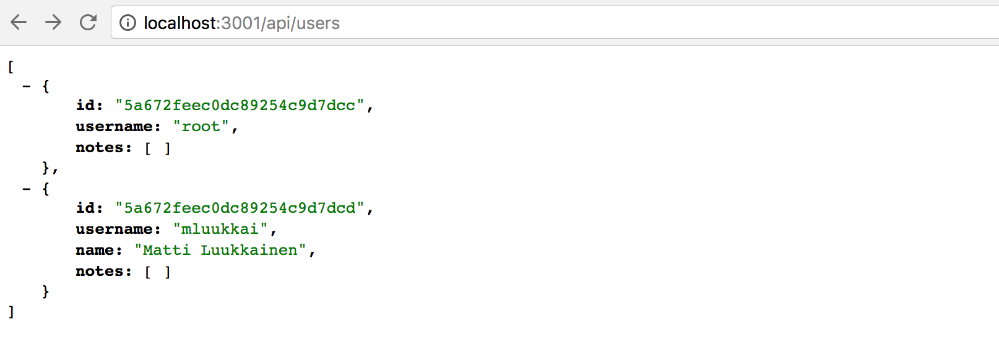
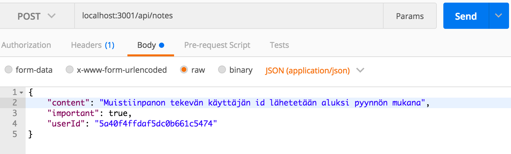
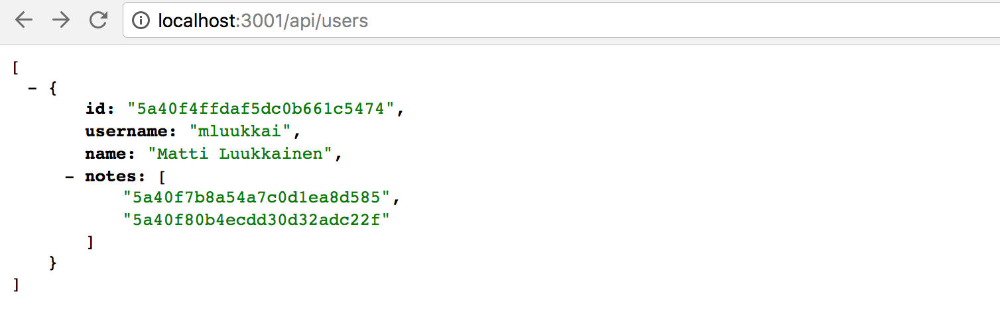
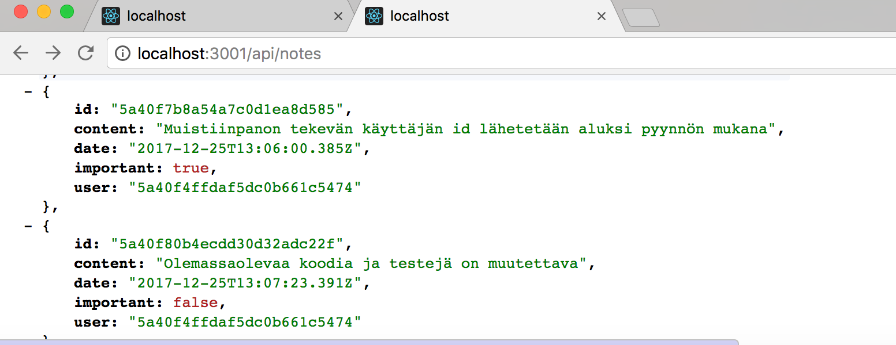
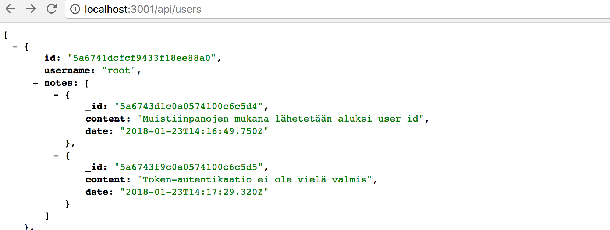
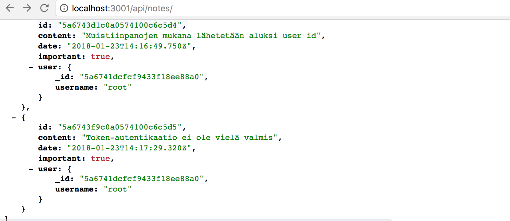

<div class="content">

## Käyttäjien hallinta ja monimutkaisempi tietokantaskeema

Haluamme toteuttaa sovellukseemme käyttäjien hallinnan. Käyttäjät tulee tallettaa tietokantaan ja jokaisesta muistiinpanosta tulee tietää sen luonut käyttäjä. Muistiinpanojen poisto ja editointi tulee olla sallittua ainoastaan muistiinpanot tehneelle käyttäjälle.

Aloitetaan lisäämällä tietokantaan tieto käyttäjistä. Käyttäjän (User) ja muistiinpanojen (Note) välillä on yhden suhde moneen -yhteys:


Relaatiotietokantoja käytettäessä ratkaisua ei tarvitsisi juuri miettiä. Molemmille olisi oma taulunsa ja muistiinpanoihin liitettäisiin sen luonutta käyttäjää vastaava id vierasavaimeksi (foreign key).

Dokumenttitietokantoja käytettäessä tilanne on kuitenkin toinen, erilaisia tapoja mallintaa tilanne on useita.

Olemassaoleva ratkaisumme tallentaa jokaisen luodun muistiinpanon tietokantaan _notes_-kokoelmaan eli _collectioniin_. Jos emme halua muuttaa tätä, lienee luontevinta tallettaa käyttäjät omaan kokoelmaansa, esim. nimeltään _users_.

Mongossa voidaan kaikkien dokumenttitietokantojen tapaan käyttää olioiden id:itä viittaamaan muissa kokoelmissa talletettaviin dokumentteihin, vastaavasti kuten viiteavaimia käytetään relaatiotietokannoissa.

Dokumenttitietokannat kuten Mongo eivät kuitenkaan tue relaatiotietokantojen _liitoskyselyitä_ vastaavaa toiminnallisuutta, joka mahdollistaisi useaan kokoelmaan kohdistuvan tietokantahaun (tämä ei tarkalleen ottaen enää välttämättä pidä paikkaansa, sillä versiosta 3.2. alkaen Mongo on tukenut useampaan kokoelmaan kohdistuvia [lookup-aggregaattikyselyitä](https://docs.mongodb.com/manual/reference/operator/aggregation/lookup/), emme kuitenkaan käsittele niitä kurssilla).

Jos tarvitsemme liitoskyselyitä vastaavaa toiminnallisuutta, tulee se toteuttaa sovelluksen tasolla, eli käytännössä tekemällä tietokantaan useita kyselyitä. Tietyissä tilanteissa mongoose-kirjasto osaa hoitaa liitosten tekemisen, jolloin kysely näyttää mongoosen käyttäjälle toimivan liitoskyselyn tapaan. Mongoose tekee kuitenkin näissä tapauksissa taustalla useamman kyselyn tietokantaan.

### Viitteet kokoelmien välillä

Jos käyttäisimme relaatiotietokantaa, muistiinpano sisältäisi _viiteavaimen_ sen tehneeseen käyttäjään. Dokumenttitietokannassa voidaan toimia samoin.

Oletetaan että kokoelmassa _users_ on kaksi käyttäjää:

```js
[
  {
    username: 'mluukkai',
    _id: 123456,
  },
  {
    username: 'hellas',
    _id: 141414,
  },
];
```

Kokoelmassa _notes_ on kolme muistiinpanoa, kaikkien kenttä _user_ viittaa _users_-kentässä olevaan käyttäjään:

```js
[
  {
    content: 'HTML on helppoa',
    important: false,
    _id: 221212,
    user: 123456,
  },
  {
    content: 'HTTP-protokollan tärkeimmät metodit ovat GET ja POST',
    important: true,
    _id: 221255,
    user: 123456,
  },
  {
    content: 'Java on kieli, jota käytetään siihen asti kunnes aurinko sammuu',
    important: false,
    _id: 221244,
    user: 141414,
  },
];
```

Mikään ei kuitenkaan määrää dokumenttitietokannoissa, että viitteet on talletettava muistiinpanoihin, ne voivat olla _myös_ (tai ainoastaan) käyttäjien yhteydessä:

```js
[
  {
    username: 'mluukkai',
    _id: 123456,
    notes: [221212, 221255],
  },
  {
    username: 'hellas',
    _id: 141414,
    notes: [141414],
  },
];
```

Koska käyttäjiin liittyy potentiaalisesti useita muistiinpanoja, niiden id:t talletetaan käyttäjän kentässä _notes_ olevaan taulukkoon.

Dokumenttitietokannat tarjoavat myös radikaalisti erilaisen tavan datan organisointiin; joissain tilanteissa saattaisi olla mielekästä tallettaa muistiinpanot kokonaisuudessa käyttäjien sisälle:

```js
[
  {
    username: 'mluukkai',
    _id: 123456,
    notes: [
      {
        content: 'HTML on helppoa',
        important: false,
      },
      {
        content: 'HTTP-protokollan tärkeimmät metodit ovat GET ja POST',
        important: true,
      },
    ],
  },
  {
    username: 'hellas',
    _id: 141414,
    notes: [
      {
        content:
          'Java on kieli, jota käytetään siihen asti kunnes aurinko sammuu',
        important: false,
      },
    ],
  },
];
```

Muistiinpanot olisivat tässä skeemaratkaisussa siis yhteen käyttäjään alisteisia kenttiä, niillä ei olisi edes omaa identiteettiä, eli id:tä tietokannan tasolla.

Dokumenttitietokantojen yhteydessä skeeman rakenne ei siis ole ollenkaan samalla tavalla ilmeinen kuin relaatiotietokannoissa, ja valittava ratkaisu kannattaa määritellä siten että se tukee parhaalla tavalla sovelluksen käyttötapauksia. Tämä ei luonnollisestikaan ole helppoa, sillä järjestelmän kaikki käyttötapaukset eivät yleensä ole selvillä kun projektin alkuvaiheissa mietitään datan organisointitapaa.

Hieman paradoksaalisesti tietokannan tasolla skeematon Mongo edellyttääkin projektin alkuvaiheissa jopa radikaalimpien datan organisoimiseen liittyvien ratkaisujen tekemistä kuin tietokannan tasolla skeemalliset relaatiotietokannat, jotka tarjoavat keskimäärin kaikkiin tilanteisiin melko hyvin sopivan tavan organisoida dataa.

### Käyttäjien mongoose-skeema

Päätetään tallettaa käyttäjän yhteyteen myös tieto käyttäjän luomista muistiinpanoista, eli käytännössä muistiinpanojen id:t. Määritellään käyttäjää edustava model tiedostoon _models/user:_

```js
const mongoose = require('mongoose');

const User = mongoose.model('User', {
  username: String,
  name: String,
  passwordHash: String,
  notes: [{ type: mongoose.Schema.Types.ObjectId, ref: 'Note' }],
});

module.exports = User;
```

Muistiinpanojen id:t on talletettu käyttäjien sisälle taulukkona mongo-id:itä. Määrittely on seuraava

```js
{ type: mongoose.Schema.Types.ObjectId, ref: 'Note' }
```

kentän tyyppi on _ObjectId_ joka viittaa _Note_-tyyppisiin dokumentteihin. Mongo ei itsessään tiedä mitään siitä, että kyse on kentästä joka viittaa nimenomaan muistiinpanoihin, kyseessä onkin puhtaasti mongoosen syntaksi.

Laajennetaan tiedostossa _model/note.js_ olevaa muistiinpanon skeemaa siten, että myös muistiinpanossa on tieto sen luoneesta käyttäjästä

```js
const Note = mongoose.model('Note', {
  content: String,
  date: Date,
  important: Boolean,
  user: { type: mongoose.Schema.Types.ObjectId, ref: 'User' },
});
```

Relaatiotietokantojen käytänteistä poiketen _viitteet on nyt talletettu molempiin dokumentteihin_, muistiinpano viittaa sen luoneeseen käyttäjään ja käyttäjä sisältää taulukollisen viitteitä sen luomiin muistiinpanoihin.

### Käyttäjien luominen

Toteutetaan seuraavaksi route käyttäjien luomista varten. Käyttäjällä on siis _username_ jonka täytyy olla järjestelmässä yksikäsitteinen, nimi eli _name_ sekä _passwordHash_, eli salasanasta [yksisuuntaisen funktion](https://en.wikipedia.org/wiki/Cryptographic_hash_function) perusteella laskettu tunniste. Salasanojahan ei ole koskaan viisasta tallentaa tietokantaan selväsanaisena!

Asennetaan salasanojen hashaamiseen käyttämämme [bcrypt](https://github.com/kelektiv/node.bcrypt.js)-kirjasto:

```bash
npm install bcrypt --save
```

Käyttäjien luominen tapahtuu osassa 3 läpikäytyjä [RESTful](/osa3#rest)-periaatteita seuraten tekemällä HTTP POST -pyyntö polkuun _users_.

Määritellään käyttäjienhallintaa varten oma _router_ tiedostoon _controllers/users.js_, ja liitetään se _index.js_-tiedostossa huolehtimaan polulle _/api/users/_ tulevista pyynnöistä:

```js
const usersRouter = require('./controllers/users');

// ...

app.use('/api/users', usersRouter);
```

Routerin alustava sisältö on seuraava:

```js
const bcrypt = require('bcrypt');
const usersRouter = require('express').Router();
const User = require('../models/user');

usersRouter.post('/', async (request, response) => {
  try {
    const body = request.body;

    const saltRounds = 10;
    const passwordHash = await bcrypt.hash(body.password, saltRounds);

    const user = new User({
      username: body.username,
      name: body.name,
      passwordHash,
    });

    const savedUser = await user.save();

    response.json(savedUser);
  } catch (exception) {
    console.log(exception);
    response.status(500).json({ error: 'something went wrong...' });
  }
});

module.exports = usersRouter;
```

Tietokantaan siis _ei_ talleteta pyynnön mukana tulevaa salasanaa, vaan funktion _bcrypt.hash_ avulla laskettu _hash_.

Materiaalin tilamäärä ei valitettavasti riitä käsittelemään sen tarkemmin salasanojen [tallennuksen perusteita](https://codahale.com/how-to-safely-store-a-password/), esim. mitä maaginen luku 10 muuttujan [saltRounds](https://github.com/kelektiv/node.bcrypt.js/#a-note-on-rounds) arvona tarkoittaa. Lue linkkien takaa lisää.

Koodissa ei tällä hetkellä ole mitään virheidenkäsittelyä eikä validointeja, eli esim. käyttäjätunnuksen ja salasanan halutun muodon tarkastuksia.

Uutta ominaisuutta voidaan ja kannattaakin joskus testailla käsin esim. postmanilla. Käsin tapahtuva testailu muuttuu kuitenkin nopeasti työlääksi, etenkin kun tulemme pian vaatimaan, että samaa käyttäjätunnusta ei saa tallettaa kantaan kahteen kertaan.

Pienellä vaivalla voimme tehdä automaattisesti suoritettavat testit, jotka helpottavat sovelluksen kehittämistä merkittävästi.

Alustava testi näyttää seuraavalta:

```js
const User = require('../models/user');
const {
  format,
  initialNotes,
  nonExistingId,
  notesInDb,
  usersInDb,
} = require('./test_helper');

//...

describe.only('when there is initially one user at db', async () => {
  beforeAll(async () => {
    await User.remove({});
    const user = new User({ username: 'root', password: 'sekret' });
    await user.save();
  });

  test('POST /api/users succeeds with a fresh username', async () => {
    const usersBeforeOperation = await usersInDb();

    const newUser = {
      username: 'mluukkai',
      name: 'Matti Luukkainen',
      password: 'salainen',
    };

    await api
      .post('/api/users')
      .send(newUser)
      .expect(200)
      .expect('Content-Type', /application\/json/);

    const usersAfterOperation = await usersInDb();
    expect(usersAfterOperation.length).toBe(usersBeforeOperation.length + 1);
    const usernames = usersAfterOperation.map(u => u.username);
    expect(usernames).toContain(newUser.username);
  });
});
```

Koska testi on määritelty [describe.only](https://facebook.github.io/jest/docs/en/api.html#describeonlyname-fn)-lohkoksi, suorittaa _Jest_ ainoastaan lohkon sisälle määritellyt testit. Tämä on alkuvaiheessa hyödyllistä, sillä ennen kuin uusia käyttäjiä lisäävä toiminnallisuus on valmis, kannattaa suorittaa testeistä ainoastaan kyseistä toiminnallisuutta tutkivat testitapaukset.

Testit käyttävät myös tiedostossa _tests/test_helper.js_ määriteltyä apufunktiota _usersInDb()_ tarkastamaan lisäysoperaation jälkeisen tietokannan tilan:

```js
const User = require('../models/user');

// ...

const usersInDb = async () => {
  const users = await User.find({});
  return users;
};

module.exports = {
  initialNotes,
  format,
  nonExistingId,
  notesInDb,
  usersInDb,
};
```

Lohkon _beforeAll_ lisää kantaan käyttäjän, jonka username on _root_. Voimmekin tehdä uuden testin, jolla varmistetaan, että samalla käyttäjätunnuksella ei voi luoda uutta käyttäjää:

```js
test('POST /api/users fails with proper statuscode and message if username already taken', async () => {
  const usersBeforeOperation = await usersInDb();

  const newUser = {
    username: 'root',
    name: 'Superuser',
    password: 'salainen',
  };

  const result = await api
    .post('/api/users')
    .send(newUser)
    .expect(400)
    .expect('Content-Type', /application\/json/);

  expect(result.body).toEqual({ error: 'username must be unique' });

  const usersAfterOperation = await usersInDb();
  expect(usersAfterOperation.length).toBe(usersBeforeOperation.length);
});
```

Testi ei tietenkään mene läpi tässä vaiheessa. Toimimme nyt oleellisesti [TDD:n eli test driven developmentin](https://en.wikipedia.org/wiki/Test-driven_development) hengessä, uuden ominaisuuden testi on kirjoitettu ennen ominaisuuden ohjelmointia.

Koodi laajenee seuraavasti:

```js
usersRouter.post('/', async (request, response) => {
  try {
    const body = request.body

    const existingUser = await User.find({username: body.username})
    if (existingUser.length>0) {
      return response.status(400).json({ error: 'username must be unique' })
    }

    //...

  }
})
```

Eli haetaan tietokannasta ne user-dokumentit, joiden _username_-kentän arvo on sama kuin pyynnössä oleva. Jos sellainen user-dokumentti löytyy, vastataan pyyntöön statuskoodilla _400 bad request_ ja kerrotaan syy ongelmaan.

Voisimme toteuttaa käyttäjien luomisen yhteyteen myös muita tarkistuksia, esim. onko käyttäjätunnus tarpeeksi pitkä, koostuuko se sallituista merkeistä ja onko salasana tarpeeksi hyvä. Jätämme ne kuitenkin harjoitustehtäväksi.

Ennen kuin menemme eteenpäin, lisätään alustava versio joka palauttaa kaikki käyttäjät palauttavasta käsittelijäfunktiosta:

```js
const formatUser = user => {
  return {
    id: user.id,
    username: user.username,
    name: user.name,
    notes: user.notes,
  };
};

usersRouter.get('/', async (request, response) => {
  const users = await User.find({});
  response.json(users.map(formatUser));
});
```

Lista näyttää seuraavalta



### Formatointifunktioiden siirto modelien märittelyn yhteyteen

Kuten muistinpanojenkin tapauksessa, olemme myös nyt määritellet apufunktion _formatUser_, joka muodostaa tietokannan palauttamista _user_-olioista selaimelle lähetettävän muodon, joista on mm. poistettu kenttä _passwordHash_.

Formatointifunktio on nyt sijoitettu routejen määrittelyn yhteyteen. Paikka ei välttämättä ole optimaalinen ja päätetäänkin viedä formatointi _User_-skeeman vastuulle, sen [staattiseksi metodiksi](http://mongoosejs.com/docs/guide.html#statics).

Tehdään seuraava muutos tiedostoon _models/user.js_:

```js
const mongoose = require('mongoose');

const userSchema = new mongoose.Schema({
  username: String,
  name: String,
  passwordHash: String,
  notes: [{ type: mongoose.Schema.Types.ObjectId, ref: 'Note' }],
});

userSchema.statics.format = user => {
  return {
    id: user.id,
    username: user.username,
    name: user.name,
    notes: user.notes,
  };
};

const User = mongoose.model('User', userSchema);

module.exports = User;
```

Näin määriteltyä metodia kutsutaan _User.format(user)_. Voimme muuttaa tiedostossa _controllers/users.js_ olevat routet seuraavaan muotoon:

```js
usersRouter.get('/', async (request, response) => {
  const users = await User.find({});
  response.json(users.map(User.format));
});

usersRouter.post('/', async (request, response) => {
  try {
    // ...
    const savedUser = await user.save();

    response.json(User.format(savedUser));
  } catch (exception) {
    // ...
  }
});
```

Formatointifunktion määritteleminen skeeman määrittelyn yhteydessä on sikäli luontevaa, että jos skeemaan tulee muutoksia, on formatointifunktio samassa tiedostossa ja todennäköisyys sen päivittämisen unohtamiselle pienenee.

Tehdään sama muutos muistiinpanojen formatointiin, eli muutetaan _models/note.js_ muotoon

```js
const mongoose = require('mongoose');

const noteSchema = new mongoose.Schema({
  content: String,
  date: Date,
  important: Boolean,
  user: { type: mongoose.Schema.Types.ObjectId, ref: 'User' },
});

noteSchema.statics.format = note => {
  return {
    id: note._id,
    content: note.content,
    date: note.date,
    important: note.important,
  };
};

const Note = mongoose.model('Note', noteSchema);

module.exports = Note;
```

ja muutetaan tiedostosta _controllers/notes.js_ metotodikutsut _formatNote(note)_ muotoon _Note.format(note)_ ja kutsu _notes.map(formatNote)_ muotoon _notes.map(Note.format)_

Testien suoritus varmistaa, että sovelluksemme ei hajonnut refaktoroinnin myötä.

Pääsemme nyt eroon myös testien yhteyteen määritellystä muistiinpanoja formatoivasta apumetodista _format_, sillä myös testeissä kannattaa hyödyntää funktiota _Note.format_.

Sovelluksen tämänhetkinen koodi on kokonaisuudessaan [githubissa](https://github.com/FullStack-HY/part3-notes-backend/tree/part4-5), tagissa _part4-5_.

### Muistiinpanon luominen

Muistiinpanot luovaa koodia on nyt mukautettava siten, että uusi muistiinpano tulee liitetyksi sen luoneeseen käyttäjään.

Laajennetaan ensin olemassaolevaa toteutusta siten, että tieto muistiinpanon luovan käyttäjän id:stä lähetetään pyynnön rungossa kentän _userId_ arvona:

```js
const User = require('../models/user');

//...

notesRouter.post('/', async (request, response) => {
  try {
    const body = request.body;

    if (body.content === undefined) {
      return response.status(400).json({ error: 'content missing' });
    }

    const user = await User.findById(body.userId);

    const note = new Note({
      content: body.content,
      important: body.important === undefined ? false : body.important,
      date: new Date(),
      user: user._id,
    });

    const savedNote = await note.save();

    user.notes = user.notes.concat(savedNote._id);
    await user.save();

    response.json(Note.format(note));
  } catch (exception) {
    console.log(exception);
    response.status(500).json({ error: 'something went wrong...' });
  }
});
```

Huomionarvoista on nyt se, että myös _user_-olio muuttuu. Sen kenttään _notes_ talletetaan luodun muistiinpanon _id_:

```js
const user = User.findById(userId);

user.notes = user.notes.concat(savedNote._id);
await user.save();
```

Kokeillaan nyt lisätä uusi muistiinpano



Operaatio vaikuttaa toimivan. Lisätään vielä yksi muistiinpano ja mennään kaikkien käyttäjien sivulle:



Huomaamme siis, että käyttäjällä on kaksi muistiinpanoa.

Jos laajennamme muistiinpanojen JSON:in muotoileman koodin näyttämään muistiinpanoon liittyvän käyttäjän

```js
noteSchema.statics.format = note => {
  return {
    id: note._id,
    content: note.content,
    date: note.date,
    important: note.important,
    user: note.user,
  };
};
```

tulee muistiinpanon luoneen käyttäjän id näkyviin muistiinpanon yhteyteen.



### populate

Haluaisimme API:n toimivan siten, että haettaessa esim. käyttäjien tiedot polulle _/api/users_ tehtävällä HTTP GET -pyynnöllä tulisi käyttäjien tekemien muistiinpanojen id:iden lisäksi näyttää niiden sisältö. Relaatiotietokannoilla toiminnallisuus toteutettaisiin _liitoskyselyn_ avulla.

Kuten aiemmin mainittiin, eivät dokumenttitietokannat tue (kunnolla) eri kokoelmien välisiä liitoskyselyitä. Mongoose-kirjasto osaa kuitenkin tehdä liitoksen puolestamme. Mongoose toteuttaa liitoksen tekemällä useampia tietokantakyselyitä, joten siinä mielessä kyseessä on täysin erilainen tapa kuin relaatiotietokantojen liitoskyselyt, jotka ovat _transaktionaalisia_, eli liitoskyselyä tehdessä tietokannan tila ei muutu. Mongoosella tehtävä liitos taas on sellainen, että mikään ei takaa sitä, että liitettävien kokoelmien tila on konsistentti, toisin sanoen jos tehdään users- ja notes-kokoelmat liittävä kysely, kokoelmien tila saattaa muuttua kesken mongoosen liitosoperaation.

Liitoksen tekeminen suoritetaan mongoosen komennolla [populate](http://mongoosejs.com/docs/populate.html). Päivitetään ensin kaikkien käyttäjien tiedot palauttava route:

```js
usersRouter.get('/', async (request, response) => {
  const users = await User.find({}).populate('notes');

  response.json(users.map(User.format));
});
```

Funktion [populate](http://mongoosejs.com/docs/populate.html) kutsu siis ketjutetaan kyselyä vastaavan metodikutsun (tässä tapauksessa _find_) perään. Populaten parametri määrittelee, että _user_-dokumenttien _notes_-kentässä olevat _note_-olioihin viittaavat _id_:t korvataan niitä vastaavilla dokumenteilla.

Lopputulos on jo melkein haluamamme kaltainen:


Populaten yhteydessä on myös mahdollista rajata mitä kenttiä sisällytettävistä dokumenteista otetaan mukaan. Rajaus tapahtuu Mongon [syntaksilla](https://docs.mongodb.com/manual/tutorial/project-fields-from-query-results/#return-the-specified-fields-and-the-id-field-only):

```js
usersRouter.get('/', async (request, response) => {
  const users = await User.find({}).populate('notes', { content: 1, date: 1 });

  response.json(users.map(User.format));
});
```

Tulos on nyt halutun kaltainen (:



Lisätään sopiva käyttäjän tietojen populointi, muistiinpanojen yhteyteen:

```js
notesRouter.get('/', async (request, response) => {
  const notes = await Note.find({}).populate('user', { username: 1, name: 1 });

  response.json(notes.map(Note.format));
});
```

Nyt käyttäjän tiedot tulevat muistiinpanon kenttään _user_.



Korostetaan vielä, että tietokannan tasolla ei siis ole mitään määrittelyä siitä, että esim. muistiinpanojen kenttään _user_ talletetut id:t viittaavat käyttäjä-kokoelman dokumentteihin.

Mongoosen _populate_-funktion toiminnallisuus perustuu siihen, että olemme määritelleet viitteiden "tyypit" olioiden mongoose-skeemaan _ref_-kentän avulla:

```js
const Note = mongoose.model('Note', {
  content: String,
  date: Date,
  important: Boolean,
  user: { type: mongoose.Schema.Types.ObjectId, ref: 'User' },
});
```

</div>
