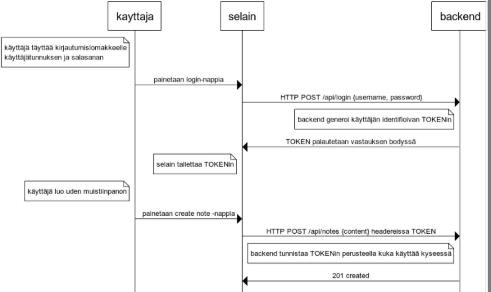
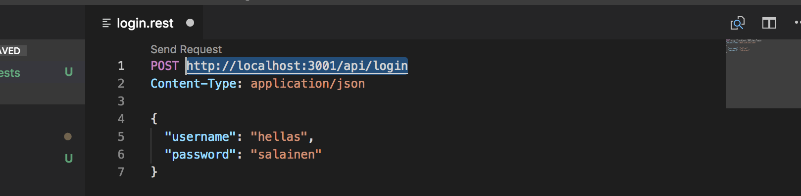
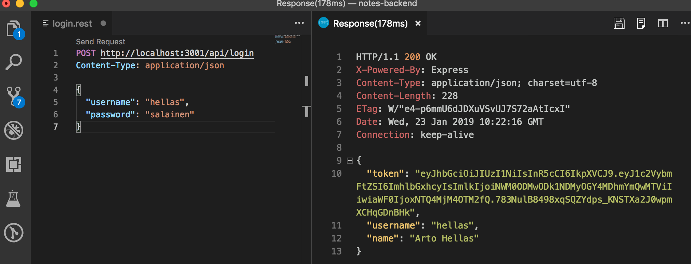
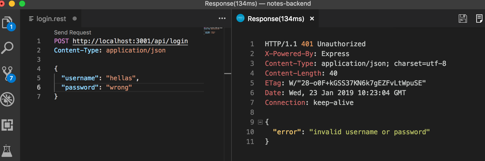
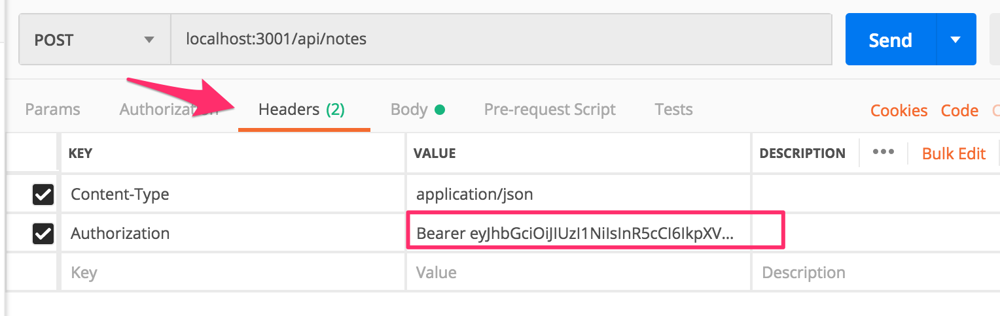
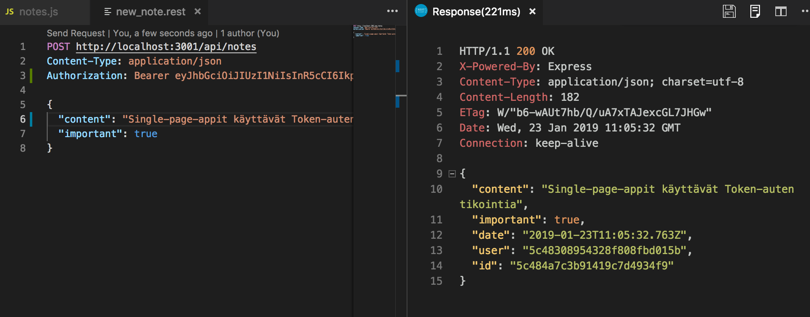
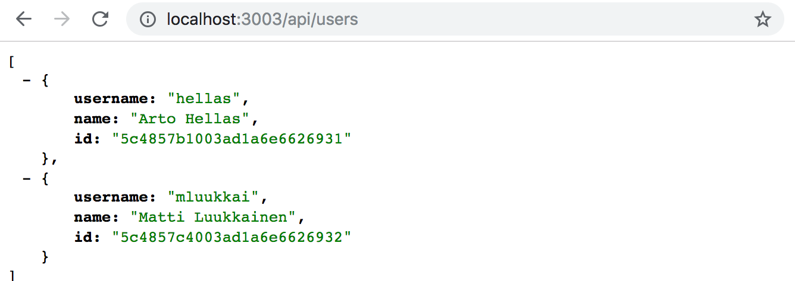
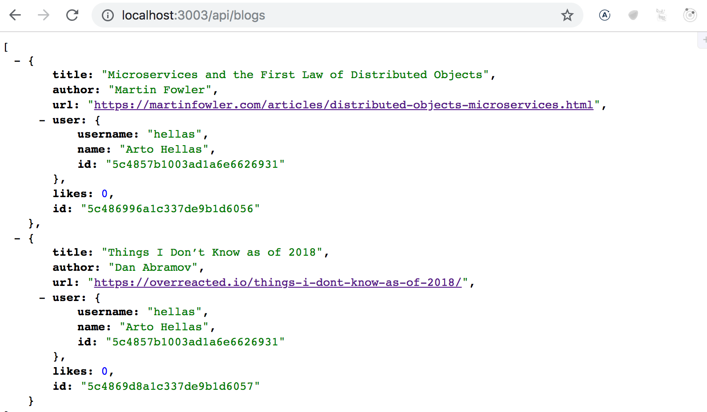
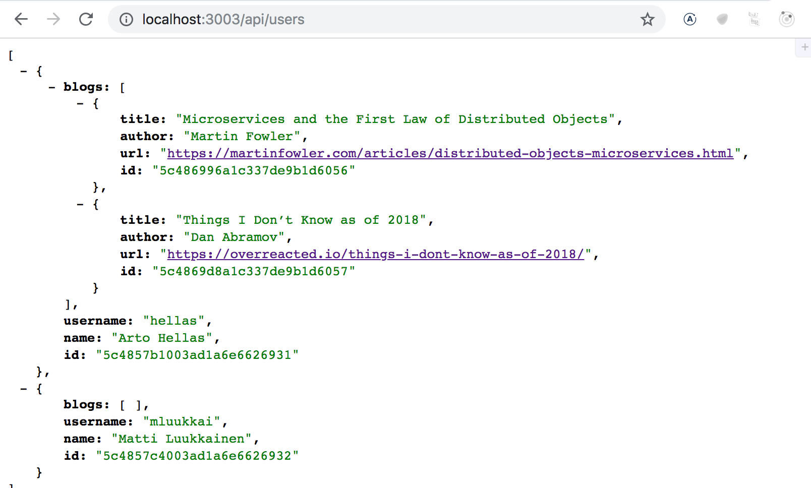

<div class="content">

Käyttäjien tulee pystyä kirjautumaan sovellukseemme ja muistiinpanot pitää automaattisesti liittää kirjautuneen käyttäjän tekemiksi.

Toteutamme nyt backendiin tuen [token-perustaiselle](https://scotch.io/tutorials/the-ins-and-outs-of-token-based-authentication#toc-how-token-based-works) autentikoinnille.

Token-autentikaation periaatetta kuvaa seuraava sekvenssikaavio:



- Alussa käyttäjä kirjautuu Reactilla toteutettua kirjautumislomaketta käyttäen
  - lisäämme kirjautumislomakkeen frontendiin [osassa 5](/osa5)
- Tämän seurauksena selaimen React-koodi lähettää käyttäjätunnuksen ja salasanan HTTP POST -pyynnöllä palvelimen osoitteeseen <i>/api/login</i>
- Jos käyttäjätunnus ja salasana ovat oikein, generoi palvelin <i>tokenin</i>, joka yksilöi jollain tavalla kirjautumisen tehneen käyttäjän
  - token on digitaalisesti allekirjoitettu, joten sen väärentäminen on (kryptografisesti) mahdotonta
- backend vastaa selaimelle onnistumisesta kertovalla statuskoodilla ja palauttaa tokenin vastauksen mukana
- Selain tallentaa tokenin esimerkiksi React-sovelluksen tilaan
- Kun käyttäjä luo uuden muistiinpanon (tai tekee jonkin operaation, joka edellyttää tunnistautumista), lähettää React-koodi tokenin pyynnön mukana palvelimelle
- Palvelin tunnistaa pyynnön tekijän tokenin perusteella

Tehdään ensin kirjautumistoiminto. Asennetaan [jsonwebtoken](https://github.com/auth0/node-jsonwebtoken)-kirjasto, jonka avulla koodimme pystyy generoimaan [JSON web token](https://jwt.io/) -muotoisia tokeneja.

```bash
npm install jsonwebtoken --save
```

Tehdään kirjautumisesta vastaava koodi tiedostoon _controllers/login.js_

```js
const jwt = require('jsonwebtoken')
const bcrypt = require('bcrypt')
const loginRouter = require('express').Router()
const User = require('../models/user')

loginRouter.post('/', async (request, response) => {
  const body = request.body

  const user = await User.findOne({ username: body.username })
  const passwordCorrect = user === null
    ? false
    : await bcrypt.compare(body.password, user.passwordHash)

  if (!(user && passwordCorrect)) {
    return response.status(401).json({
      error: 'invalid username or password'
    })
  }

  const userForToken = {
    username: user.username,
    id: user._id,
  }

  const token = jwt.sign(userForToken, process.env.SECRET)

  response
    .status(200)
    .send({ token, username: user.username, name: user.name })
})

module.exports = loginRouter
```

Koodi aloittaa etsimällä pyynnön mukana olevaa <i>usernamea</i> vastaavan käyttäjän tietokannasta. Seuraavaksi katsotaan onko pyynnön mukana oleva <i>password</i> oikea. Koska tietokantaan ei ole talletettu salasanaa, vaan salasanasta laskettu <i>hash</i>, tehdään vertailu metodilla _bcrypt.compare_:

```js
await bcrypt.compare(body.password, user.passwordHash)
```

Jos käyttäjää ei ole olemassa tai salasana on väärä, vastataan kyselyyn statuskoodilla [401 unauthorized](https://www.w3.org/Protocols/rfc2616/rfc2616-sec10.html#sec10.4.2) ja kerrotaan syy vastauksen bodyssä.

Jos salasana on oikein, luodaan metodin _jwt.sign_ avulla token, joka sisältää digitaalisesti allekirjoitetussa muodossa käyttäjätunnuksen ja käyttäjän id:

```js
const userForToken = {
  username: user.username,
  id: user._id,
}

const token = jwt.sign(userForToken, process.env.SECRET)
```

Token on digitaalisesti allekirjoitettu käyttämällä <i>salaisuutena</i> ympäristömuuttujassa <i>SECRET</i> olevaa merkkijonoa. Digitaalinen allekirjoitus varmistaa sen, että ainoastaan salaisuuden tuntevilla on mahdollisuus generoida validi token. Ympäristömuuttujalle pitää muistaa asettaa arvo tiedostoon <i>.env</i>.

Onnistuneeseen pyyntöön vastataan statuskoodilla <i>200 ok</i> ja generoitu token sekä kirjautuneen käyttäjän käyttäjätunnus ja nimi lähetetään vastauksen bodyssä pyynnön tekijälle.

Kirjautumisesta huolehtiva koodi on vielä liitettävä sovellukseen lisäämällä tiedostoon <i>app.js</i> muiden routejen käyttöönoton yhteyteen

```js
const loginRouter = require('./controllers/login')

//...

app.use('/api/login', loginRouter)
```

Kokeillaan kirjautumista, käytetään VS Coden REST-clientiä:



Kirjautuminen ei kuitenkaan toimi, konsoli näyttää seuraavalta:

```bash
(node:32911) UnhandledPromiseRejectionWarning: Error: secretOrPrivateKey must have a value
    at Object.module.exports [as sign] (/Users/mluukkai/opetus/_2019fullstack-koodit/osa3/notes-backend/node_modules/jsonwebtoken/sign.js:101:20)
    at loginRouter.post (/Users/mluukkai/opetus/_2019fullstack-koodit/osa3/notes-backend/controllers/login.js:26:21)
(node:32911) UnhandledPromiseRejectionWarning: Unhandled promise rejection. This error originated either by throwing inside of an async function without a catch block, or by rejecting a promise which was not handled with .catch(). (rejection id: 2)
```

Ongelman aiheuttaa komento _jwt.sign(userForToken, process.env.SECRET)_ sillä ympäristömuuttujalle <i>SECRET</i> on unohtunut määritellä arvo. Kun arvo (joka saa olla mikä tahansa merkkijono) määritellään tiedostoon <i>.env</i>, alkaa kirjautuminen toimia.

Onnistunut kirjautuminen palauttaa kirjautuneen käyttäjän tiedot ja tokenin:



Virheellisellä käyttäjätunnuksella tai salasanalla kirjautuessa annetaan asianmukaisella statuskoodilla varustettu virheilmoitus



### Muistiinpanojen luominen vain kirjautuneille

Muutetaan vielä muistiinpanojen luomista, siten että luominen onnistuu ainoastaan jos luomista vastaavan pyynnön mukana on validi token. Muistiinpano talletetaan tokenin identifioiman käyttäjän tekemien muistiinpanojen listaan.

Tapoja tokenin välittämiseen selaimesta backendiin on useita. Käytämme ratkaisussamme [Authorization](https://developer.mozilla.org/en-US/docs/Web/HTTP/Headers/Authorization)-headeria. Tokenin lisäksi headerin avulla kerrotaan mistä [autentikointiskeemasta](https://developer.mozilla.org/en-US/docs/Web/HTTP/Authentication#Authentication_schemes) on kyse. Tämä voi olla tarpeen, jos palvelin tarjoaa useita eri tapoja autentikointiin. Skeeman ilmaiseminen kertoo näissä tapauksissa palvelimelle, miten mukana olevat kredentiaalit tulee tulkita.
Meidän käyttöömme sopii <i>Bearer</i>-skeema.

Käytännössä tämä tarkoittaa, että jos token on esimerkiksi merkkijono <i>eyJhbGciOiJIUzI1NiIsInR5c2VybmFtZSI6Im1sdXVra2FpIiwiaW</i>, laitetaan pyynnöissä headerin Authorization arvoksi merkkijono

<pre>
Bearer eyJhbGciOiJIUzI1NiIsInR5c2VybmFtZSI6Im1sdXVra2FpIiwiaW
</pre>

Muistiinpanojen luominen muuttuu seuraavasti:

```js
const jwt = require('jsonwebtoken') //highlight-line

// ...
  //highlight-start
const getTokenFrom = request => {
  const authorization = request.get('authorization')
  if (authorization && authorization.toLowerCase().startsWith('bearer ')) {
    return authorization.substring(7)
  }
  return null
}
  //highlight-end

notesRouter.post('/', async (request, response, next) => {
  const body = request.body

  const token = getTokenFrom(request)

//highlight-start
  try {
    const decodedToken = jwt.verify(token, process.env.SECRET)

    if (!token || !decodedToken.id) {
      return response.status(401).json({ error: 'token missing or invalid' })
    }
//highlight-end

    const user = await User.findById(decodedToken.id)

    const note = new Note({
      content: body.content,
      important: body.important === undefined ? false : body.important,
      date: new Date(),
      user: user._id
    })

    const savedNote = await note.save()
    user.notes = user.notes.concat(savedNote._id) //highlight-line
    await user.save()  //highlight-line
    response.json(savedNote.toJSON())
  } catch(exception) {
    next(exception)
  }
})
```

Apufunktio _getTokenFrom_ eristää tokenin headerista <i>authorization</i>. Tokenin oikeellisuus varmistetaan metodilla _jwt.verify_. Metodi myös dekoodaa tokenin, eli palauttaa olion, jonka perusteella token on laadittu:

```js
const decodedToken = jwt.verify(token, process.env.SECRET)
```

Tokenista dekoodatun olion sisällä on kentät <i>username</i> ja <i>id</i> eli se kertoo palvelimelle kuka pyynnön on tehnyt.

Jos tokenia ei ole tai tokenista dekoodattu olio ei sisällä käyttäjän identiteettiä (eli _decodedToken.id_ ei ole määritelty), palautetaan virheestä kertova statuskoodi [401 unauthorized](https://www.w3.org/Protocols/rfc2616/rfc2616-sec10.html#sec10.4.2) ja kerrotaan syy vastauksen bodyssä:

```js
if (!token || !decodedToken.id) {
  return response.status(401).json({
    error: 'token missing or invalid'
  })
}
```

Kun pyynnön tekijän identiteetti on selvillä, jatkuu suoritus entiseen tapaan.

Uuden muistiinpanon luominen onnistuu nyt postmanilla jos <i>authorization</i>-headerille asetetaan oikeanlainen arvo, eli merkkijono <i>bearer eyJhbGciOiJIUzI1NiIsInR5cCI6IkpXVCJ</i>, missä loppuosa on <i>login</i>-operaation palauttama token.

Postmanilla luominen näyttää seuraavalta



ja Visual Studio Coden REST clientillä



### Poikkeusten käsittely

Tokenin verifiointi voi myös aiheuttaa poikkeuksen <i>JsonWebTokenError</i>. Jos esim. poistetaan tokenista pari merkkiä, ja yritetään luoda muistiinpano, tapahtuu seuraavasti

```bash
JsonWebTokenError: invalid signature
    at /Users/mluukkai/opetus/_2019fullstack-koodit/osa3/notes-backend/node_modules/jsonwebtoken/verify.js:126:19
    at getSecret (/Users/mluukkai/opetus/_2019fullstack-koodit/osa3/notes-backend/node_modules/jsonwebtoken/verify.js:80:14)
    at Object.module.exports [as verify] (/Users/mluukkai/opetus/_2019fullstack-koodit/osa3/notes-backend/node_modules/jsonwebtoken/verify.js:84:10)
    at notesRouter.post (/Users/mluukkai/opetus/_2019fullstack-koodit/osa3/notes-backend/controllers/notes.js:40:30)
```

Syynä tokenin dekoodaamisen aiheuttamalle virheelle on monia. Token voi olla viallinen, kuten esimerkissämme, väärennetty tai eliniältään vanhentunut. Laajennetaan virheidenkäsittelymiddlewarea huomioimaan tokenin dekoodaamisen aiheuttamat virheet

```js
const unknownEndpoint = (request, response) => {
  response.status(404).send({ error: 'unknown endpoint' })
}

const errorHandler = (error, request, response, next) => {
  if (error.name === 'CastError' && error.kind === 'ObjectId') {
    return response.status(400).send({
      error: 'malformatted id'
    })
  } else if (error.name === 'ValidationError') {
    return response.status(400).json({
      error: error.message 
    })
  } else if (error.name === 'JsonWebTokenError') {  // highlight-line
    return response.status(401).json({ // highlight-line
      error: 'invalid token' // highlight-line
    }) // highlight-line
  }

  logger.error(error.message)

  next(error)
}
```

Sovelluksen tämänhetkinen koodi on kokonaisuudessaan [githubissa](https://github.com/fullstack-hy2019/part3-notes-backend/tree/part4-8), branchissä <i>part4-8</i>.

Jos sovelluksessa on useampia rajapintoja jotka vaativat kirjautumisen, kannattaa JWT:n validointi eriyttää omaksi middlewarekseen, tai käyttää jotain jo olemassa olevaa kirjastoa kuten [express-jwt](https://www.npmjs.com/package/express-jwt).

### Loppuhuomioita

Koodissa on tapahtunut paljon muutoksia ja matkan varrella on tapahtunut tyypillinen kiivaasti etenevän ohjelmistoprojektin ilmiö: suuri osa testeistä on hajonnut. Koska kurssin tämä osa on jo muutenkin täynnä uutta asiaa, jätämme testien korjailun vapaaehtoiseksi harjoitustehtäväksi.

Käyttäjätunnuksia, salasanoja ja tokenautentikaatiota hyödyntäviä sovelluksia tulee aina käyttää salatun [HTTPS](https://en.wikipedia.org/wiki/HTTPS)-yhteyden yli. Voimme käyttää sovelluksissamme Noden [HTTP](https://nodejs.org/docs/latest-v8.x/api/http.html)-serverin sijaan [HTTPS](https://nodejs.org/api/https.html)-serveriä (se vaatii lisää konfiguraatiota). Toisaalta koska sovelluksemme tuotantoversio on Herokussa, sovelluksemme pysyy käyttäjien kannalta suojattuna sen ansiosta, että Heroku reitittää kaiken liikenteen selaimen ja Herokun palvelimien välillä HTTPS:n yli.

Toteutamme kirjautumisen frontendin puolelle kurssin [seuraavassa osassa](/osa5).

</div>

<div class="tasks">

### Tehtäviä

Seuraavien tehtävien myötä Blogilistalle luodaan käyttäjienhallinnan perusteet. Varminta on seurata melko tarkkaan osan 4 luvusta [Käyttäjien hallinta](/osa4/kayttajien_hallinta) ja [Token-perustainen kirjautuminen](/osa4/token_perustainen_kirjautuminen) etenevää tarinaa. Toki luovuus on sallittua.

**Varoitus vielä kerran:** jos huomaat kirjoittavasi sekaisin async/awaitia ja _then_-kutsuja, on 99% varmaa, että teet jotain väärin. Käytä siis jompaa kumpaa tapaa, älä missään tapauksessa "varalta" molempia.

#### 4.15: blogilistan laajennus, step4

Tee sovellukseen mahdollisuus luoda käyttäjiä tekemällä HTTP POST -pyyntö osoitteeseen <i>api/users</i>. Käyttäjillä on <i>käyttäjätunnus, salasana ja nimi</i>.

Älä talleta tietokantaan salasanoja selväkielisenä vaan käytä osan 4 luvun [Käyttäjien luominen](/osa4/kayttajien_hallinta#kayttajien-luominen) tapaan <i>bcrypt</i>-kirjastoa.

**HUOM** joillain windows-käyttäjillä on ollut ongelmia <i>bcryptin</i> kanssa. Jos törmäät ongelmiin, poista kirjasto komennolla

```bash
npm uninstall bcrypt --save 
```

ja asenna sen sijaan [bcryptjs](https://www.npmjs.com/package/bcryptjs)

Tee järjestelmään myös mahdollisuus katsoa kaikkien käyttäjien tiedot sopivalla HTTP-pyynnöllä.

Käyttäjien lista voi näyttää esim. seuraavalta:



#### 4.16*: blogilistan laajennus, step5

Laajenna käyttäjätunnusten luomista siten, että käyttäjätunuksen sekä salasanan tulee olla olla olemassa. ja vähintään 3 merkkiä pitkiä. Käyttäjätunnuksen on oltava järjestelmässä uniikki.

Luomisoperaation tulee palauttaa sopiva statuskoodi ja jonkinlainen virheilmoitus, jos yritetään luoda epävalidi käyttäjä.

**HUOM** älä testaa salasanaan liittyviä ehtoja Mongoosen validointien avulla, se ei ole hyvä idea, sillä backendin vastaanottama salasana ja kantaan tallennettu salasanan tiiviste eivät ole sama asia. Salasanan oikeellisuus kannattaa testata kontrollerissa samoin kun teimme [osassa 3](/osa3/validointi_ja_es_lint) ennen validointien käyttöönottoa.

Tee myös testit, jotka varmistavat, että virheellisiä käyttäjiä ei luoda, ja että virheellisen käyttäjän luomisoperaatioon vastaus on järkevä statuskoodin ja virheilmoituksen osalta.

#### 4.17: blogilistan laajennus, step6

Laajenna blogia siten, että blogiin tulee tieto sen lisänneestä käyttäjästä.

Muokkaa blogien lisäystä osan 4 luvun [populate](/osa4/kayttajien_hallinta#populate) tapaan siten, että blogin lisäämisen yhteydessä määritellään blogin lisääjäksi <i>joku</i> järjestelmän tietokannassa olevista käyttäjistä (esim. ensimmäisenä löytyvä). Tässä vaiheessa ei ole väliä kuka käyttäjistä määritellään lisääväksi. Toiminnallisuus viimeistellään tehtävässä 4.19.

Muokaa kaikkien blogien listausta siten, että blogien yhteydessä näytetään lisääjän tiedot:



ja käyttäjien listausta siten että käyttäjien lisäämät blogit ovat näkyvillä



#### 4.18: blogilistan laajennus, step7

Toteuta osan 4 luvun [Kirjautuminen](/osa4#kirjautuminen) tapaan järjestelmään token-perustainen autentikointi.

#### 4.19: blogilistan laajennus, step8

Muuta blogien lisäämistä siten, että se on mahdollista vain, jos lisäyksen tekevässä HTTP POST -pyynnössä on mukana validi token. Tokenin haltija määritellään blogin lisääjäksi.

#### 4.20*: blogilistan laajennus, step9

Osan 4 [esimerkissä](/osa4#kirjautuminen) token otetaan headereista apufunktion _getTokenFrom_ avulla.

Jos käytit samaa ratkaisua, refaktoroi tokenin erottaminen [middlewareksi](/osa3/node_js_ja_express#middlewaret), joka ottaa tokenin <i>Authorization</i>-headerista ja sijoittaa sen <i>request</i>-olion kenttään <i>token</i>.

Eli kun rekisteröit middlewaren ennen routeja tiedostossa <i>app.js</i>

```js
app.use(middleware.tokenExtractor)
```

pääsevät routet tokeniin käsiksi suoraan viittaamalla _request.token_:

```js
blogsRouter.post('/', async (request, response) => {
  // ..
  const decodedToken = jwt.verify(request.token, process.env.SECRET)
  // ..
})
```

#### 4.21*: blogilistan laajennus, step10

Muuta blogin poistavaa operaatiota siten, että poisto onnistuu ainoastaan jos poisto-operaation tekijä (eli se kenen token on pyynnön mukana) on sama kuin blogin lisääjä.

Jos poistoa yritetään ilman tokenia tai väärän käyttäjän toimesta, tulee operaation palauttaa asiaan kuuluva statuskoodi.

Huomaa, että jos haet blogin tietokannasta

```js
const blog = await Blog.findById(...)
```

ei kenttä <i>blog.user</i> ole tyypiltään merkkijono vaan <i>object</i>. Eli jos haluat verrata kannasta haetun olion id:tä merkkijonomuodossa olevaan id:hen, ei normaali vertailu toimi. Kannasta haettu id tulee muuttaa vertailua varten merkkijonoksi:

```js
if ( blog.user.toString() === userid.toString() ) ...
```

<!---
note left of kayttaja
  käyttäjä täyttää kirjautumislomakkeelle
  käyttäjätunnuksen ja salasanan
end note
kayttaja -> selain: painetaan login-nappia

selain -> backend: HTTP POST /api/login {username, password}
note left of backend
  backend generoi käyttäjän identifioivan TOKENin
end note
backend -> selain: TOKEN palautetaan vastauksen bodyssä
note left of selain
  selain tallettaa TOKENin
end note
note left of kayttaja
  käyttäjä luo uden muistiinpanon
end note
kayttaja -> selain: painetaan create note -nappia
selain -> backend: HTTP POST /api/notes {content} headereissa TOKEN
note left of backend
  backend tunnistaa TOKENin perusteella kuka käyttää kyseessä
end note

backend -> selain: 201 created

kayttaja -> kayttaja:
-->

</div>
