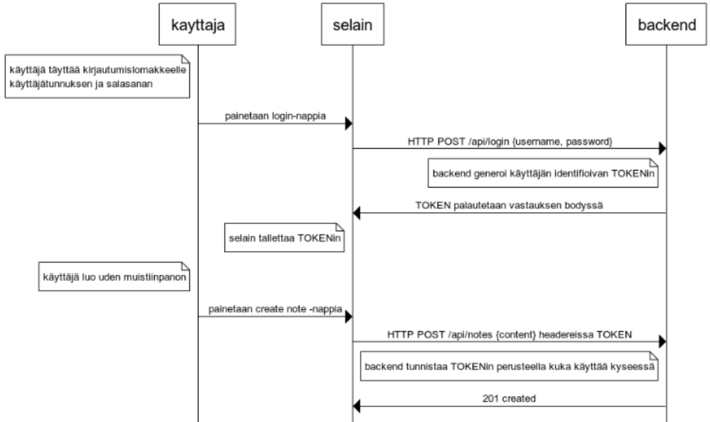
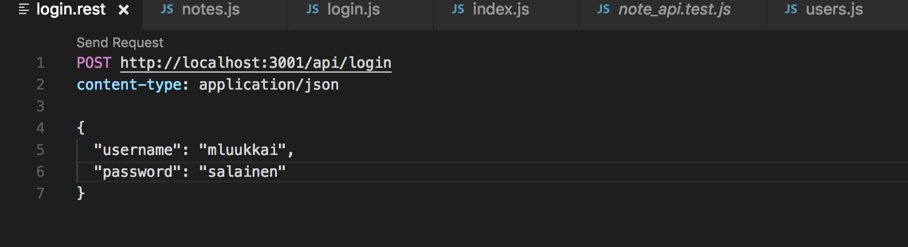
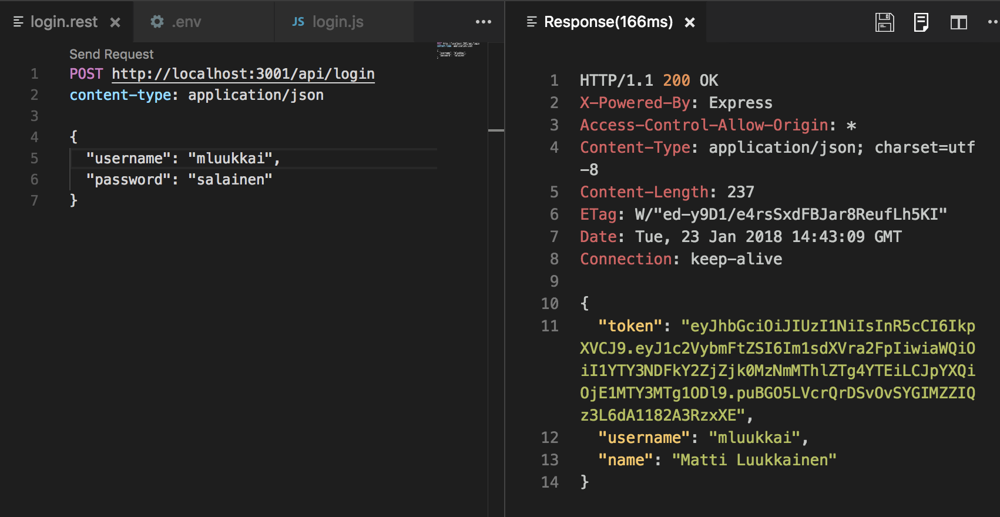
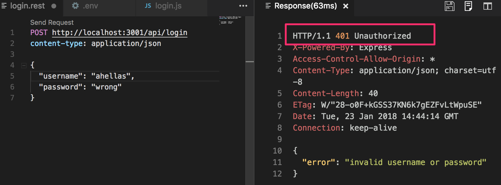
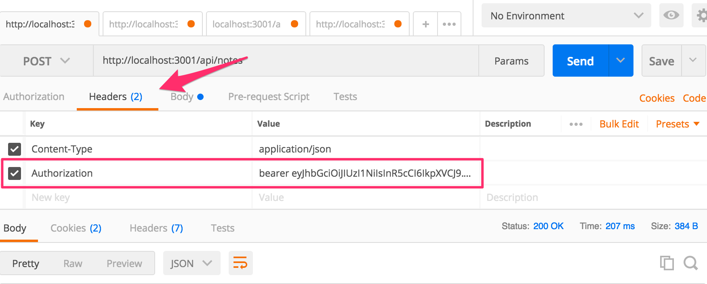
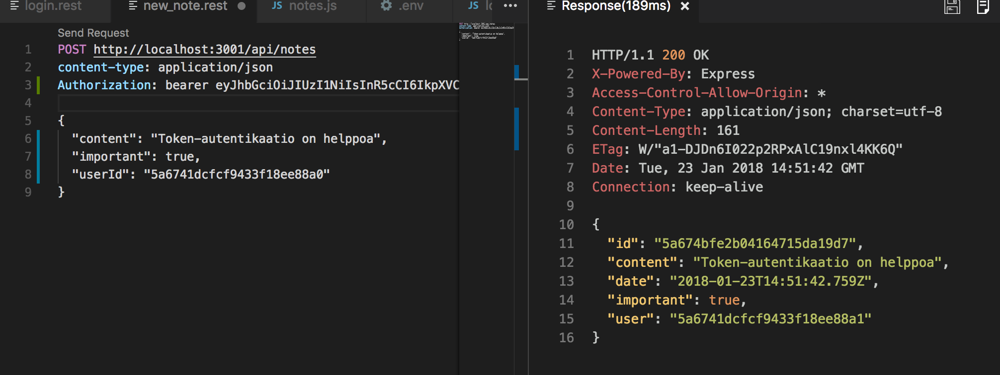

<div class="content">

## Kirjautuminen

Käyttäjien tulee pystyä kirjautumaan sovellukseemme ja muistiinpanot pitää automaattisesti liittää kirjautuneen käyttäjän tekemiksi.

Toteutamme nyt backendiin tuen [token-perustaiselle](https://scotch.io/tutorials/the-ins-and-outs-of-token-based-authentication#toc-how-token-based-works) autentikoinnille.

Token-autentikaation periaatetta kuvaa seuraava sekvenssikaavio:



- Alussa käyttäjä kirjautuu Reactilla toteutettua kirjautumislomaketta käyttäen
  - lisäämme kirjautumislomakkeen frontendiin [osassa 5](/osa5)
- Tämän seurauksena selaimen React-koodi lähettää käyttäjätunnuksen ja salasanan HTTP POST -pyynnöllä palvelimen osoitteeseen _/api/login_
- Jos käyttäjätunnus ja salasana ovat oikein, generoi palvelin _Tokenin_, joka yksilöi jollain tavalla kirjautumisen tehneen käyttäjän
  - token on kryptattu, joten sen väärentäminen on (kryptografisesti) mahdotonta
- backend vastaa selaimelle onnistumisesta kertovalla statuskoodilla ja palauttaa Tokenin vastauksen mukana
- Selain tallentaa tokenin esimerkiksi React-sovelluksen tilaan
- Kun käyttäjä luo uuden muistiinpanon (tai tekee jonkin operaation, joka edellyttää tunnistautumista), lähettää React-koodi Tokenin pyynnön mukana palvelimelle
- Palvelin tunnistaa pyynnön tekijän tokenin perusteella

Tehdään ensin kirjautumistoiminto. Asennetaan [jsonwebtoken](https://github.com/auth0/node-jsonwebtoken)-kirjasto, jonka avulla koodimme pystyy generoimaan [JSON web token](https://jwt.io/) -muotoisia tokeneja.

```bash
npm install jsonwebtoken --save
```

Tehdään kirjautumisesta vastaava koodi tiedostoon _controllers/login.js_

```js
const jwt = require('jsonwebtoken');
const bcrypt = require('bcrypt');
const loginRouter = require('express').Router();
const User = require('../models/user');

loginRouter.post('/', async (request, response) => {
  const body = request.body;

  const user = await User.findOne({ username: body.username });
  const passwordCorrect =
    user === null
      ? false
      : await bcrypt.compare(body.password, user.passwordHash);

  if (!(user && passwordCorrect)) {
    return response.status(401).json({ error: 'invalid username or password' });
  }

  const userForToken = {
    username: user.username,
    id: user._id,
  };

  const token = jwt.sign(userForToken, process.env.SECRET);

  response
    .status(200)
    .send({ token, username: user.username, name: user.name });
});

module.exports = loginRouter;
```

Koodi aloittaa etsimällä pyynnön mukana olevaa _username_:a vastaavan käyttäjän tietokannasta. Seuraavaksi katsotaan onko pyynnön mukana oleva _password_ oikea. Koska tietokantaan ei ole talletettu salasanaa, vaan salasanasta laskettu _hash_, tehdään vertailu metodilla _bcrypt.compare_:

```js
await bcrypt.compare(body.password, user.passwordHash);
```

Jos käyttäjää ei ole olemassa tai salasana on väärä, vastataan kyselyyn statuskoodilla [401 unauthorized](https://www.w3.org/Protocols/rfc2616/rfc2616-sec10.html#sec10.4.2) ja kerrotaan syy vastauksen bodyssä.

Jos salasana on oikein, luodaan metodin _jwt.sign_ avulla token, joka sisältää kryptatussa muodossa käyttäjätunnuksen ja käyttäjän id:

```js
const userForToken = {
  username: user.username,
  id: user._id,
};

const token = jwt.sign(userForToken, process.env.SECRET);
```

Token on digitaalisesti allekirjoitettu käyttämällä _salaisuutena_ ympäristömuuttujassa _SECRET_ olevaa merkkijonoa. Digitaalinen allekirjoitus varmistaa sen, että ainoastaan salaisuuden tuntevilla on mahdollisuus generoida validi token. Ympäristömuuttujalle pitää muistaa asettaa arvo tiedostoon .env.

Onnistuneeseen pyyntöön vastataan statuskoodilla _200 ok_ ja generoitu token sekä kirjautuneen käyttäjän käyttäjätunnus ja nimi lähetetään vastauksen bodyssä pyynnön tekijälle.

Kirjautumisesta huolehtiva koodi on vielä liitettävä sovellukseen lisäämällä tiedostoon _index.js_ muiden routejen käyttöönoton yhteyteen

```js
const loginRouter = require('./controllers/login');

//...

app.use('/api/login', loginRouter);
```

Kokeillaan kirjautumista, käytetään VS Coden REST-clientiä:



Kirjautuminen ei kuitenkaan toimi, konsoli näyttää seuraavalta:

```bash
Method: POST
Path:   /api/login
Body:   { username: 'mluukkai', password: 'salainen' }
---
(node:17486) UnhandledPromiseRejectionWarning: Unhandled promise rejection (rejection id: 2): Error: secretOrPrivateKey must have a value
```

Ongelman aiheuttaa komento _jwt.sign(userForToken, process.env.SECRET)_ sillä ympäristömuuttujalle _SECRET_ on unohtunut määritellä arvo. Kun arvo määritellään tiedostoon _.env_, alkaa kirjautuminen toimia.

Onnistunut kirjautuminen palauttaa kirjautuneen käyttäjän tiedot ja tokenin:



Virheellisellä käyttäjätunnuksella tai salasanalla kirjautuessa annetaan asianmukaisella statuskoodilla varustettu virheilmoitus



### Muistiinpanojen luominen vain kirjautuneille

Muutetaan vielä muistiinpanojen luomista, siten että luominen onnistuu ainoastaan jos luomista vastaavan pyynnön mukana on validi token. Muistiinpano talletetaan tokenin identifioiman käyttäjän tekemien muistiinpanojen listaan.

Tapoja tokenin välittämiseen selaimesta backendiin on useita. Käytämme ratkaisussamme [Authorization](https://developer.mozilla.org/en-US/docs/Web/HTTP/Headers/Authorization)-headeria. Tokenin lisäksi headerin avulla kerrotaan mistä [autentikointiskeemasta](https://developer.mozilla.org/en-US/docs/Web/HTTP/Authentication#Authentication_schemes) on kyse. Tämä voi olla tarpeen, jos palvelin tarjoaa useita eri tapoja autentikointiin. Skeeman ilmaiseminen kertoo näissä tapauksissa palvelimelle, miten mukana olevat kredentiaalit tulee tulkita.
Meidän käyttöömme sopii _Bearer_-skeema.

Käytännössä tämä tarkoittaa, että jos token on esimerkiksi merkkijono _eyJhbGciOiJIUzI1NiIsInR5c2VybmFtZSI6Im1sdXVra2FpIiwiaW_, laitetaan pyynnöissä headerin Authorization arvoksi merkkijono

<pre>
Bearer eyJhbGciOiJIUzI1NiIsInR5c2VybmFtZSI6Im1sdXVra2FpIiwiaW
</pre>

Modifioitu muistiinpanojen luomisesta huolehtiva koodi seuraavassa:

```js
const jwt = require('jsonwebtoken');

// ...

const getTokenFrom = request => {
  const authorization = request.get('authorization');
  if (authorization && authorization.toLowerCase().startsWith('bearer ')) {
    return authorization.substring(7);
  }
  return null;
};

notesRouter.post('/', async (request, response) => {
  const body = request.body;

  try {
    const token = getTokenFrom(request);
    const decodedToken = jwt.verify(token, process.env.SECRET);

    if (!token || !decodedToken.id) {
      return response.status(401).json({ error: 'token missing or invalid' });
    }

    if (body.content === undefined) {
      return response.status(400).json({ error: 'content missing' });
    }

    const user = await User.findById(decodedToken.id);

    const note = new Note({
      content: body.content,
      important: body.important === undefined ? false : body.important,
      date: new Date(),
      user: user._id,
    });

    const savedNote = await note.save();

    user.notes = user.notes.concat(savedNote._id);
    await user.save();

    response.json(Note.format(note));
  } catch (exception) {
    if (exception.name === 'JsonWebTokenError') {
      response.status(401).json({ error: exception.message });
    } else {
      console.log(exception);
      response.status(500).json({ error: 'something went wrong...' });
    }
  }
});
```

Apufunktio _getTokenFrom_ eristää tokenin headerista _authorization_. Tokenin oikeellisuus varmistetaan metodilla _jwt.verify_. Metodi myös dekoodaa tokenin, eli palauttaa olion, jonka perusteella token on laadittu:

```js
const decodedToken = jwt.verify(token, process.env.SECRET);
```

Tokenista dekoodatun olion sisällä on kentät _username_ ja _id_ eli se kertoo palvelimelle kuka pyynnön on tehnyt.

Jos tokenia ei ole tai tokenista dekoodattu olio ei sisällä käyttäjän identiteettiä (eli _decodedToken.id_ ei ole määritelty), palautetaan virheestä kertova statuskoodi [401 unauthorized](https://www.w3.org/Protocols/rfc2616/rfc2616-sec10.html#sec10.4.2) ja kerrotaan syy vastauksen bodyssä:

```js
if (!token || !decodedToken.id) {
  return response.status(401).json({ error: 'token missing or invalid' });
}
```

Kun pyynnön tekijän identiteetti on selvillä, jatkuu suoritus entiseen tapaan.

Tokenin verifiointi voi myös aiheuttaa poikkeuksen _JsonWebTokenError_. Syynä tälle voi olla viallinen, väärennetty tai eliniältään vanhentunut token. Poikkeusten käsittelyssä haaraudutaan virheen tyypin perusteella ja vastataan 401 jos poikkeus johtuu tokenista, ja muuten vastataan [500 internal server error](https://www.w3.org/Protocols/rfc2616/rfc2616-sec10.html#sec10.5.1).

Uuden muistiinpanon luominen onnistuu nyt postmanilla jos _authorization_-headerille asetetaan oikeanlainen arvo, eli merkkijono _bearer eyJhbGciOiJIUzI1NiIsInR5cCI6IkpXVCJ_, missä osa on _login_-operaation palauttama token.

Postmanilla luominen näyttää seuraavalta



ja Visual Studio Coden REST clientillä



Sovelluksen tämänhetkinen koodi on kokonaisuudessaan [githubissa](https://github.com/FullStack-HY/part3-notes-backend/tree/part4-6), tagissa _part4-6_.

Jos sovelluksessa on useampia rajapintoja jotka vaativat kirjautumisen kannattaa JWT:n validointi eriyttää omaksi middlewarekseen, tai käyttää jotain jo olemassa olevaa kirjastoa kuten [express-jwt](https://www.npmjs.com/package/express-jwt).

### Loppuhuomioita

Koodissa on tapahtunut paljon muutoksia ja matkan varrella on tapahtunut tyypillinen kiivaasti etenevän ohjelmistoprojektin ilmiö: suuri osa testeistä on hajonnut. Koska kurssin tämä osa on jo muutenkin täynnä uutta asiaa, jätämme testien korjailun harjoitustehtäväksi.

Käyttäjätunnuksia, salasanoja ja tokenautentikaatiota hyödyntäviä sovelluksia tulee aina käyttää salatun [HTTPS](https://en.wikipedia.org/wiki/HTTPS)-yhteyden yli. Voimme käyttää sovelluksissamme Noden [HTTP](https://nodejs.org/docs/latest-v8.x/api/http.html)-serverin sijaan [HTTPS](https://nodejs.org/api/https.html)-serveriä (se vaatii lisää konfiguraatiota). Toisaalta koska sovelluksemme tuotantoversio on Herokussa, sovelluksemme pysyy käyttäjien kannalta suojattuna sen ansiosta, että Heroku reitittää kaiken liikenteen selaimen ja Herokun palvelimien välillä HTTPS:n yli.

Toteutamme kirjautumisen frontendin puolelle kurssin [seuraavassa osassa](/osa5).

## Tehtäviä

Tee nyt tehtävät [4.15-4.21](/tehtävät/#blogilistan-käyttäjät)

<!---
note left of kayttaja
  käyttäjä täyttää kirjautumislomakkeelle
  käyttäjätunnuksen ja salasanan
end note
kayttaja -> selain: painetaan login-nappia

selain -> backend: HTTP POST /api/login {username, password}
note left of backend
  backend generoi käyttäjän identifioivan TOKENin
end note
backend -> selain: TOKEN palautetaan vastauksen bodyssä
note left of selain
  selain tallettaa TOKENin
end note
note left of kayttaja
  käyttäjä luo uden muistiinpanon
end note
kayttaja -> selain: painetaan create note -nappia
selain -> backend: HTTP POST /api/notes {content} headereissa TOKEN
note left of backend
  backend tunnistaa TOKENin perusteella kuka käyttää kyseessä
end note

backend -> selain: 201 created

kayttaja -> kayttaja:
-->

</div>
